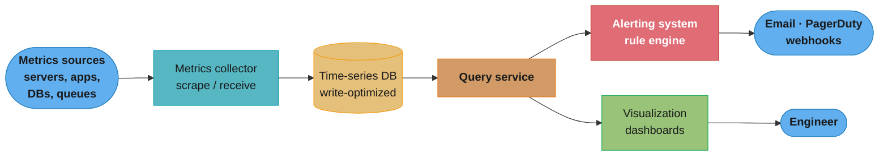
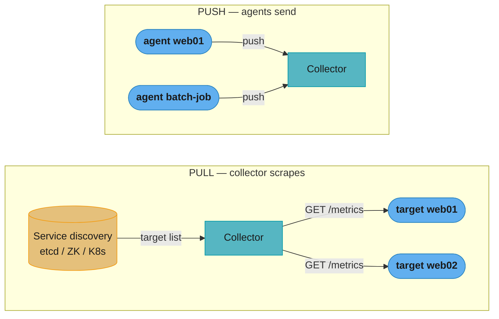
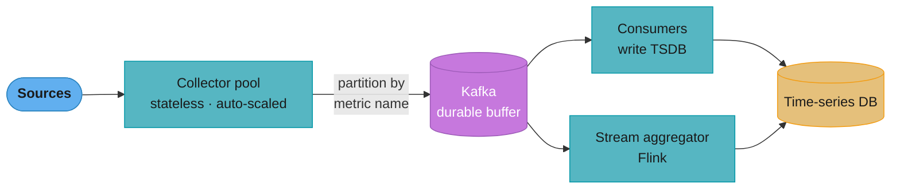
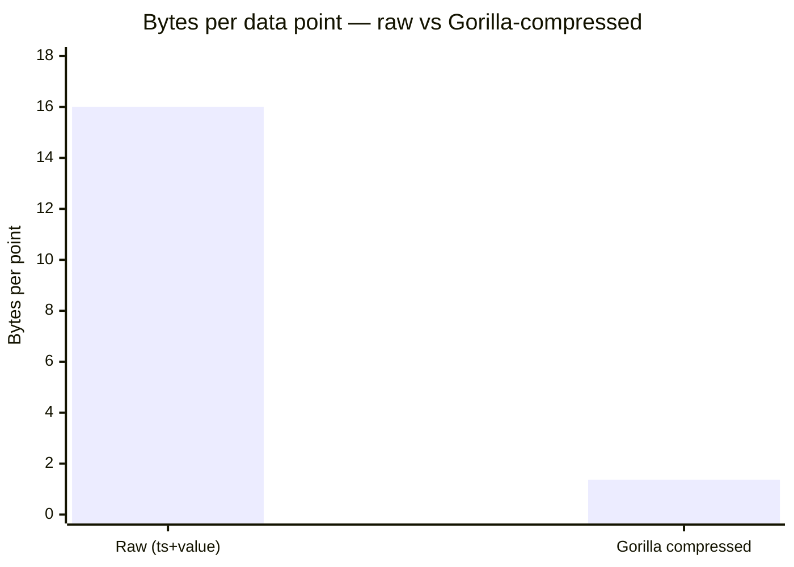
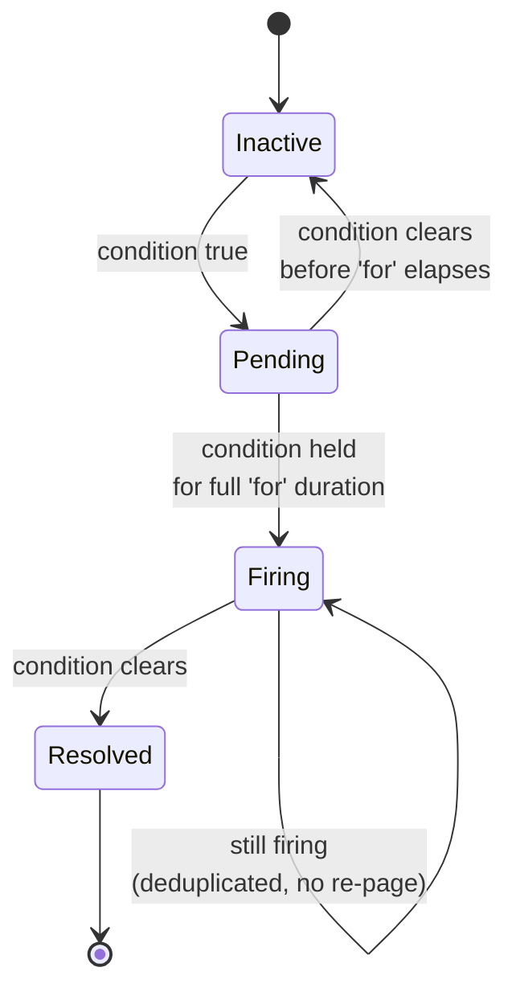
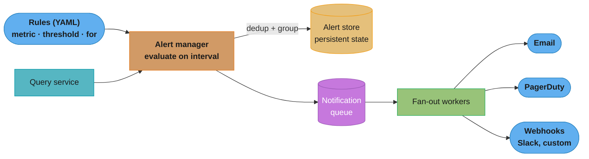
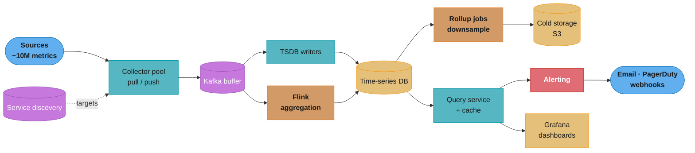

# Chapter 5: Metrics Monitoring and Alerting System

> Ch 5 of 13 · System Design Interview Vol 2 (Xu & Lam) · builds on Ch 4's queue — the observability read path (a mini-Prometheus/Datadog)

## Chapter Map

A large company runs thousands of servers and services; when one degrades or dies, someone needs
to *know* — and know *before* users do. A **metrics monitoring and alerting system** continuously
collects operational numbers (CPU, memory, disk, QPS, error rate), stores them as time series,
lets engineers query and graph them, and fires alerts when a value crosses a threshold. This
chapter designs that system at the scale of a company with **100M daily active users** and roughly
**10M distinct metrics**, and it is really a *storage-and-read-path* problem: a purpose-built
**time-series database (TSDB)** in the middle, fed by a collection tier and read by query,
alerting, and visualization tiers.

**TL;DR:**
- Scope it tightly: **operational infrastructure metrics only** — not logs, not distributed
  tracing, not business analytics. The system has **five components**: collection, transmission,
  storage, alerting, visualization.
- The storage engine is a **time-series database**, not a general-purpose SQL/NoSQL store — at
  ~10M writes/s a relational DB collapses, and TSDBs win on **write throughput, compression
  (delta-of-delta + XOR), and downsampling**.
- Collection is **pull vs push** — Prometheus scrapes `/metrics` endpoints (needs service
  discovery); CloudWatch/Graphite push. Neither is a universal winner. A **Kafka buffer** between
  collectors and the TSDB decouples ingestion and absorbs TSDB downtime.
- **Alerting** is a rule engine (YAML thresholds) with an alert **state machine**
  (pending → firing → resolved), **deduplication**, and fan-out to email/PagerDuty/webhooks via a
  queue. **Visualization** is a dashboard tier (Grafana) — buy it, don't build it.

## The Big Question

> "I have thousands of machines emitting millions of numbers every second. How do I store a year
> of that cheaply, answer both a live dashboard's spiky reads and an alert rule's steady reads, and
> page a human the moment something breaks — all without the storage layer falling over?"

Analogy: think of the system as a **hospital telemetry room**. Every patient (server) is wired to
monitors streaming vitals (metrics). The wires and the nurse who walks the ward gathering readings
are the **collection** tier; the charts on the wall are **visualization**; the standing orders
("page the doctor if heart rate > 120 for 2 minutes") are **alerting rules**; and the archive of
every patient's history is the **time-series database**. The engineering tension is that vitals
arrive far faster than anyone reads most of them — so you must ingest torrents cheaply, keep recent
data at fine resolution, and blur older data (downsample) to fit a year of history in a sane amount
of disk.

---

## 5.1 Step 1 — Understand the Problem and Establish Design Scope

### Who uses it and what for

A monitoring system for a large company serves engineers who need to answer three questions:
*Is the system healthy right now?* (dashboards), *Did something just break?* (alerts), and *What
happened last Tuesday at 3am?* (historical query). The book frames the target user as an internal
infrastructure team at a company with a big footprint, so we optimize for **operational metrics**
that describe the health of infrastructure and services.

### Functional requirements — what the system must do

- **Collect** metrics from a large fleet of servers and services.
- **Store** them efficiently for **1 year**.
- **Query / visualize** them (dashboards, ad-hoc queries).
- **Alert** when a metric crosses a configured threshold, routing notifications to the right people
  (email, PagerDuty, on-call tools, webhooks).

### What is explicitly in scope — operational system metrics

The system tracks **operational metrics** — numbers about infrastructure health:

| Metric class | Examples |
|--------------|----------|
| Low-level host | CPU load, memory usage, disk space, disk I/O |
| Service / application | Requests per second (QPS), error rate, request latency |
| Aggregate / rollup | Average CPU across a pool, p99 latency, total QPS |

### What is explicitly OUT of scope

The book draws a hard boundary. This system is **not** a general observability platform. Out of
scope:

- **Logs** — high-cardinality *text* events (an ELK / Loki / Splunk problem, a different storage
  shape).
- **Distributed tracing** — per-request spans across services (a Jaeger / Zipkin / OpenTelemetry
  problem).
- **Business analytics** — sign-ups, revenue, funnel conversion (a data-warehouse / OLAP problem).

Keeping the scope to *numeric operational time series* is what lets us commit to a time-series
database as the storage engine; logs and traces have fundamentally different access patterns and
would blow up the design.

### Non-functional requirements

- **Scale:** the fleet is large (numbers below). The system must ingest on the order of **10M
  operational metrics**.
- **Low operational overhead / high availability:** a monitoring system that is down when the
  monitored system breaks is worse than useless. It must be *more* reliable than what it watches.
- **Flexibility:** easy to add new metrics, new dashboards, new alert rules.
- **Retention & resolution:** 1 year of retention, but not all at full resolution — see the rollup
  policy below.

### Scale estimation — the book's back-of-the-envelope

The book builds the "10M metrics" figure from the fleet size. Reproduce the arithmetic:

| Quantity | Value |
|----------|-------|
| Daily active users | 100,000,000 (100M) |
| Server pools | 1,000 |
| Machines per pool | 100 |
| Metrics per machine | ~100 |
| **Total metrics collected** | 1,000 × 100 × 100 = **10,000,000 (~10M)** |

So the system must handle roughly **10 million distinct time series**. If each metric is scraped
once every 10 seconds, that is 10M / 10 = **1M data points written per second**; at a 1-second
resolution it is **10M writes per second**. Either way the *write* rate dwarfs anything a
row-per-insert relational database can sustain, which is the single most important fact driving the
storage design. The book's headline is: **this is a write-heavy system, and writes are the hard
part.**

**What the formula is telling you.** "Series count is a *product* of fleet dimensions; write rate is
that product *divided by* how often you sample each one." Series count and write rate are two
different quantities, and confusing them is the most common estimation mistake in this interview —
10M is how many *things* you track, not how many writes per second you take.

| Symbol | What it is |
|--------|------------|
| pools x machines x metrics | The three fleet dimensions whose product is the distinct-series count |
| 10,000,000 | Total distinct time series (the *cardinality* of the whole system) |
| scrape interval | Seconds between successive samples of one series (10 s, or 1 s) |
| writes/s | series count / scrape interval — the sustained append rate the TSDB must absorb |

**Walk one example.** Push the fleet through both candidate scrape intervals:

```
  series count
    pools                             1,000
    x machines per pool                 100  ->      100,000 machines
    x metrics per machine               100  ->   10,000,000 series

  write rate = series / scrape interval
    10 s interval   10,000,000 / 10   =   1,000,000 writes/s
     1 s interval   10,000,000 /  1   =  10,000,000 writes/s

  a 10x faster scrape costs 10x the write rate and 10x the raw bytes,
  and buys nothing for a rule whose 'for:' duration is 5 minutes
```

Meaning: the scrape interval is a *pure multiplier* on both write load and storage. Ten-second
scrapes buy an order of magnitude of headroom over one-second scrapes, which is why 10 s is the
industry default — the alerting layer's `for: 5m` cannot use per-second detail anyway.

### Data retention and resolution — the rollup policy

Storing 10M series at 1-second resolution for a full year is astronomically expensive and nobody
queries year-old data at 1-second granularity. So the system stores data at **decreasing resolution
as it ages** — the retention/rollup ladder (reproduce exactly):

| Age of data | Stored resolution | Rationale |
|-------------|-------------------|-----------|
| **7 days** | **raw** (original scrape resolution) | Debugging a live/recent incident needs full detail |
| **30 days** | **1-minute** rollup | Recent trends; minute granularity is plenty |
| **1 year** | **1-hour** rollup | Long-term capacity trends; hourly is enough |

This is **downsampling**: after 7 days, raw points are aggregated into 1-minute buckets; after 30
days, into 1-hour buckets. It trades resolution for a massive reduction in stored volume, and it is
the reason a year of history is affordable. (Mechanics and *who runs it* are in §5.3.)

**Read it like this.** "Each rung of the ladder divides the point count by the ratio of the new
bucket width to the old one — and because the coarse rungs cover the *long* time spans, almost all
of the year's storage disappears." The compression factor of a rollup is not a subtle constant; it
is just `new_bucket / old_bucket`, and the ladder is designed so the biggest divisor lands on the
longest retention window.

| Symbol | What it is |
|--------|------------|
| raw resolution | The scrape interval, 10 s — one point every 10 seconds per series |
| bucket width | The span each rolled-up point summarizes (60 s, then 3,600 s) |
| compression factor | new bucket width / old bucket width — how many fine points collapse into one |
| points/series/day | 86,400 s per day divided by the bucket width at that rung |

**Walk one example.** Take one series down all three rungs of the ladder:

```
  rung          bucket    compression vs previous   points/series/day
  ----          ------    -----------------------   -----------------
  raw            10 s     --  (baseline)                     8,640
  1-minute       60 s     60 / 10   =    6x                  1,440
  1-hour       3,600 s    3600 / 60 =   60x                     24

  raw -> hourly overall:  3600 / 10 = 360x fewer points
  8,640 / 24 = 360   (the same factor, seen from the point counts)
```

Meaning: a day of history costs 360 times less once it reaches the hourly rung. The ladder is a
*storage budget*, not a fidelity policy — you keep expensive detail exactly as long as an incident
investigation would plausibly want it (7 days) and no longer.

---

## 5.2 Step 2 — Propose High-Level Design and Get Buy-In

### The five components and the pipeline

The system decomposes into **five functional components**, arranged as a pipeline from data source
to human eye:

1. **Data collection** — gather metric values from every source.
2. **Data transmission** — move them from sources to the storage tier.
3. **Storage (time-series database)** — the heart; efficiently store and index time series.
4. **Alerting** — evaluate rules against stored/streamed metrics and notify.
5. **Visualization** — dashboards and graphs over the stored data.

The end-to-end flow: **metrics sources → metrics collector → time-series DB**, and then the
**query service** reads the TSDB and fans out to both the **alerting system** and the
**visualization system**.



Caption: the canonical five-component pipeline — sources feed a collector, which writes the TSDB;
a single query service is the read gateway that both alerting and visualization go through, so the
TSDB is never queried directly by two independent tiers.

### The data model — a metric is a time series

Every metric is a **time series**, and each *data point* in that series has:

- a **metric name** (e.g. `CPU.load`),
- a set of **tags / labels** — key-value pairs that identify *which* instance of the metric
  (`host=webserver01`, `region=us-west`),
- a **timestamp** (when the value was recorded),
- a **value** (the number).

The identity of a time series is the **metric name plus its full set of tags**. Two data points
with the same name but different tags (`host=web01` vs `host=web02`) belong to *different* time
series. The book's canonical example data line:

```
CPU.load host=webserver01,region=us-west 1613707265 32.5
```

Read as: *metric* `CPU.load`, *tags* `host=webserver01,region=us-west`, *timestamp* `1613707265`
(Unix epoch seconds), *value* `32.5` (percent). Conceptually the whole dataset is a giant table
indexed by (name, tags) → an ordered list of (timestamp, value) points:

```
name+tags (the series key)          timestamp   value
──────────────────────────────────  ──────────  ─────
CPU.load {host=web01,region=west}    ...265       32.5
CPU.load {host=web01,region=west}    ...275       35.1
CPU.load {host=web01,region=west}    ...285       34.9
CPU.load {host=web02,region=east}    ...265       61.2
memory.pct{host=web01,region=west}   ...265       74.0
```

Caption: each distinct (name + tag-set) is one series (one row-group); within it, points arrive in
timestamp order. This layout is why writes are appends and why timestamp/value compression (§5.3)
is so effective — consecutive points share almost everything.

### The access pattern — write-heavy, read-spiky

The workload is asymmetric, and the design must reflect it:

- **Writes are massive and steady:** ~10M metrics flowing in continuously (up to ~10M points/s).
  Writes are almost always *appends* of the newest point to the end of a series.
- **Reads are spiky and bursty:** most of the time nobody looks. Then an engineer opens a dashboard
  or an incident starts and a *burst* of range queries hits — "give me CPU across this whole pool
  for the last 3 hours." Reads are range scans over (name, tags, time-range), often with an
  aggregation on top (average, p99, sum).

This "**huge steady write volume, low-but-spiky read volume**" shape is exactly what TSDBs are
built for and exactly what general-purpose databases are bad at.

### Time-series database choice — why not a general-purpose store

**Could we just use MySQL or a NoSQL store?** The book says: technically yes, but it is a bad idea
at this scale, and you should *know why* purpose-built TSDBs win — while also knowing not to build
one from scratch in an interview.

**Why a general-purpose relational database is a poor fit:**

- **Write throughput.** A relational DB does a row insert (with index maintenance, B-tree updates,
  MVCC bookkeeping) per data point. At ~10M writes/s this is orders of magnitude beyond what a
  single node — or even a large cluster — can sustain. TSDBs batch and append.
- **Storage cost.** A naive `(name, tags, ts, value)` row is dozens of bytes; a TSDB compresses a
  data point down to **~1–2 bytes** (see delta-of-delta + XOR in §5.3). At 10M series that
  difference is the gap between affordable and bankrupting.
- **Query shape.** SQL is built for arbitrary joins and point lookups; monitoring queries are
  almost all "aggregate this series over this time window." A TSDB's storage layout and query
  language are specialized for exactly that.

**Why a general-purpose NoSQL store (Cassandra, Bigtable) is *closer* but still not ideal:** a
wide-column store can be shaped into a decent TSDB (OpenTSDB is built on HBase, and many teams do
this) because it handles high write throughput and a (rowkey = series, column = timestamp) layout.
But you lose the built-in **compression, downsampling, retention, and a metrics query language** —
you would have to build all of that yourself.

**Purpose-built TSDBs to name:** **InfluxDB**, **Prometheus**, **OpenTSDB** (on HBase), plus
Graphite, TimescaleDB (Postgres extension), M3DB, VictoriaMetrics. They give you:

- write-optimized append-only storage,
- aggressive time-series compression,
- automatic downsampling and retention policies,
- a metrics-native query language (PromQL, Flux),
- tag/label indexing for fast series lookup.

**The cardinality concept — the TSDB's Achilles heel.** **Cardinality** is the *number of distinct
time series* = the number of unique (name, tag-value) combinations. Each new tag value multiplies
it: `CPU.load` with a `host` tag (10,000 hosts) is 10,000 series; add a `region` tag (5 regions)
and you might reach 50,000; add a **high-cardinality tag like `user_id` or `request_id`** and you
get a *cardinality explosion* — millions or billions of series, each needing its own index entry
and storage stream. This is the classic TSDB outage: someone tags a metric with a unique
per-request ID, cardinality explodes, memory blows up, and the TSDB falls over. **Rule: tags must
be low-cardinality** (host, region, service, status_code) — never unbounded identifiers.

**In plain terms.** "Labels do not add, they multiply — so the cost of one more label is not
'+1 column', it is 'x the number of values that label can take'." This is the single most
misunderstood fact about metrics systems, because a label *looks* like a column in a table, and
columns are cheap. A label is not a column; it is a factor.

| Symbol | What it is |
|--------|------------|
| cardinality | Number of distinct time series for a metric = the product over all its labels |
| \|label\| | The number of distinct values one label can take (its domain size) |
| product | cardinality = \|L1\| x \|L2\| x ... x \|Ln\| — every combination is its own stored series |
| bounded label | A label whose domain is fixed and small (region, status_code) — safe to multiply by |
| unbounded label | A label whose domain grows with traffic (user_id, request_id, raw url) — fatal |

**Walk one example.** One metric, `http_requests_total`, gaining one label at a time:

```
  label added        domain     running cardinality        note
  -----------        ------     -------------------        ----
  (metric alone)          1                     1
  + service              50                    50
  + instance            200                10,000          50 x 200
  + endpoint             40               400,000          10,000 x 40
  + status                8             3,200,000          400,000 x 8
  + region                5            16,000,000          3,200,000 x 5

  16,000,000 series from ONE metric, on a system budgeted for 10,000,000 total
    16,000,000 / 10,000,000 = 1.6x the entire fleet budget

  now append one unbounded label:
  + user_id       1,000,000    16,000,000,000,000        16 trillion series
                                                          = 1,600,000x the budget
```

Meaning: five *perfectly reasonable, bounded* labels already overshoot the whole system's 10M-series
budget by 1.6x — you do not need a rogue `user_id` to get into trouble, only five sensible labels
whose domains happen to be large. The `user_id` line is the same multiplication continued one step
further; it is a difference of degree, not of kind.

**Why the multiplication is unavoidable.** A series key is the (name + full tag set), and the TSDB
must keep an inverted-index entry and an open write stream per key. There is no way to store
"service x instance" as a joint summary and answer `avg by (region)` later — the query needs the
per-combination series to exist. That is why the only lever is *removing a label*, and why the fix
for high-cardinality dimensions is to send them to a logging or tracing system instead, where the
storage model is per-event rather than per-series.

**The book's stance:** *do not build a TSDB from scratch in an interview.* Pick an existing one
(InfluxDB / Prometheus / OpenTSDB) and be ready to explain *why* TSDBs beat general-purpose stores
— the write throughput, the compression, and the downsampling are the three winning arguments.

---

## 5.3 Step 3 — Design Deep Dive

### Metrics collection — pull vs push

The single biggest collection-tier decision: does the collector **pull** metrics from the sources,
or do the sources **push** metrics to the collector?

**Pull model.** The metrics collector periodically **scrapes** each target's HTTP `/metrics`
endpoint (Prometheus's model). Each server runs a lightweight exporter that exposes its current
metric values at `http://host:port/metrics`; the collector fetches them on an interval (e.g. every
10 s).



Caption: pull needs a service-discovery source of truth to know *what* to scrape; push needs the
agents to know *where* to send. The pull collector's GET is also a free liveness check — a target
that fails the scrape is a target that is (probably) down.

**How pull works and why it is nice:**

- **Service discovery is mandatory.** The collector must know *what to scrape*. It queries a
  service-discovery system — **etcd, ZooKeeper, or the Kubernetes API** — for the live list of
  targets, so as machines come and go the scrape list updates automatically.
- **Health-checking is free.** If a scrape of `/metrics` fails or times out, that is a strong
  signal the target is down — the collector gets liveness monitoring as a side effect.
- **Debuggable.** You can `curl http://host:9090/metrics` by hand to see exactly what a target is
  exposing — no infrastructure needed to inspect one machine.

**Push model.** Each source runs an **agent** that **pushes** its metrics to the collector
(CloudWatch, Graphite, StatsD, InfluxDB's Telegraf model). The source decides when to send.

**How push works and its tradeoffs:**

- **Handles short-lived jobs.** A **batch job or serverless function** that runs for 3 seconds and
  exits would never survive long enough to be scraped on a 10-second interval — but it can *push*
  its final metrics before exiting. Push is the natural fit for ephemeral / short-lived workloads.
- **Collector-overload risk.** Because sources decide when to send, a fleet-wide event (everything
  restarts, a thundering-herd of pushes) can **overwhelm the collector** — the collector has no
  back-pressure control over the senders.
- **Needs client-side aggregation & buffering.** To limit push volume, agents often
  **pre-aggregate** locally (e.g. compute a 10-second average before sending) and **buffer** when
  the collector is briefly unavailable — pushing complexity into every agent.
- **No free liveness signal.** Silence is ambiguous: a source that stops pushing might be down, or
  might just have nothing to say — you need a separate heartbeat.

**The full comparison table:**

| Dimension | Pull | Push |
|-----------|------|------|
| Who initiates | Collector scrapes targets | Agent sends to collector |
| Knowing what/where | **Service discovery** (etcd/ZK/K8s) needed | Agent must be configured with collector address |
| Health-check | **Free** — failed scrape = target down | Needs a separate heartbeat |
| Short-lived / batch jobs | ✗ Hard (job exits before scrape) | ✓ Natural fit (push then exit) |
| Firewall / NAT / edge | ✗ Collector must reach each target | ✓ Agent reaches out (easier across boundaries) |
| Overload control | Collector controls scrape rate (back-pressure) | ✗ Sources can flood the collector |
| Debugging one host | ✓ `curl /metrics` | Harder — must inspect the agent |
| Client complexity | Thin exporter | Thicker agent (aggregate + buffer) |
| Used by | **Prometheus** | **CloudWatch, Graphite, StatsD** |

**The book's verdict: there is no absolute winner.** Pull is easier to operate and debug at scale
and gives free health-checking (why Prometheus chose it); push is essential for short-lived jobs
and edge/firewalled sources (why CloudWatch and Graphite use it). Real systems often support
**both** — Prometheus adds a **Pushgateway** so batch jobs can push to an intermediary that
Prometheus then scrapes, getting the best of both.

### Scaling the transmission pipeline

At 10M metrics the collector cannot be a single box, and writing straight into the TSDB is fragile.
Two moves scale the pipeline:

**1. Collectors as a stateless, auto-scaled pool.** The metrics collector is made **horizontally
scalable and stateless** — a pool of identical collector nodes behind the service-discovery system,
each responsible for a **partition of the targets** (consistent-hashing the target set across
collectors so each machine is scraped by exactly one collector). Because collectors hold no durable
state, the pool **auto-scales** with fleet size, and a dead collector's targets are simply
reassigned. This is the same stateless-worker pattern used everywhere for elastic throughput.

**2. Put Kafka between the collector and the TSDB.** Instead of collectors writing directly into the
TSDB, they **publish to Kafka**, and a consumer tier reads Kafka and writes the TSDB. Why this
matters (this is where Ch 4's distributed message queue pays off):

- **Decoupling.** Collectors and the TSDB scale independently; a slow TSDB write does not stall
  collection.
- **Retention buffer / durability.** If the **TSDB goes down or falls behind**, metrics pile up
  **safely in Kafka** (its on-disk log) instead of being dropped. When the TSDB recovers, the
  consumer drains the backlog. This is the single strongest reason to insert a queue — it makes the
  ingestion path survive TSDB outages.
- **Absorbs spikes.** Kafka's log smooths bursty push traffic so the TSDB sees a steadier write
  rate.
- **Multiple consumers.** The same Kafka stream can feed the TSDB *and* a real-time alerting/
  aggregation consumer (§ below) *and* an archival sink — one write, many readers.

**Partition by metric name.** Kafka is partitioned so that all data for a given metric (or
name-hash) lands on the same partition, which lets each consumer own a slice of the metric space and
keeps a series's points in order.



Caption: Kafka is the shock absorber — if the TSDB stalls, points queue durably in Kafka's log
instead of being lost, and the same stream simultaneously feeds a Flink aggregator and the TSDB
writers.

**The alternative — skip Kafka (the Facebook Gorilla argument).** Kafka adds a moving part. An
alternative for extreme scale is a **large-scale ingestion tier that keeps recent data in memory**.
Facebook's **Gorilla** (the in-memory TSDB behind Beringei) keeps the most recent ~26 hours of
data **entirely in RAM** with a write-behind to durable storage — most monitoring queries and all
alert evaluations touch only very recent data, so serving them from memory is faster and avoids the
Kafka hop. The tradeoff: an in-memory tier is complex and must handle its own durability/replication
(Gorilla replicates across regions and tolerates losing a node's recent buffer). The Kafka approach
is the simpler, more operable default; the in-memory approach is the "we are Facebook and need the
last day of data in microseconds" specialization.

### Where aggregations happen

Metrics are often stored/queried **aggregated** (average CPU across a pool, total QPS, p99
latency). *Where* you compute the aggregate is a precision-vs-flexibility tradeoff with three
options:

| Where aggregation happens | Pro | Con |
|---------------------------|-----|-----|
| **Client / agent side** (before send) | Cheapest — least data transmitted and stored | Least flexible — you lose the raw points; can't re-slice later, and pre-averaging can hide spikes |
| **Ingestion pipeline** (stream processor, e.g. Flink) | Aggregate in-flight; store rollups cheaply | **Late-arriving data** breaks it — a point that arrives after its window closed is missed or forces a costly recompute |
| **Query side** (store raw, aggregate on read) | Most flexible & precise — full raw data, aggregate any way at query time | Most expensive — store and scan all raw points; slow for huge ranges |

- **Client-side aggregation** shrinks volume the most (send one average per 10 s instead of 10
  raw points) but is the *least flexible* — once the agent has averaged, you can never recover the
  raw values or re-aggregate differently, and a 1-second CPU spike averaged into a 10-second mean
  disappears.
- **Ingestion-time aggregation** (a **Flink** job over the Kafka stream) computes rollups as data
  flows, so the TSDB stores compact aggregates. Its enemy is the **late-arrival problem**: metrics
  are time-stamped at the source and can arrive out of order (network delay, a buffering agent).
  Once a stream window has been closed and emitted, a data point that belonged in it arrives too
  late — it is either dropped or forces an expensive window recomputation. You must choose a
  watermark / allowed-lateness policy and accept some imprecision.
- **Query-side (store raw)** keeps every raw point and aggregates only when queried — maximum
  precision and flexibility (any aggregation, any window, computed on demand), but you pay full
  storage and scan cost, which is exactly why the retention ladder downsamples old raw data.

The practical answer is a **hybrid**: keep raw for the recent window (query-side flexibility while
data is hot and debugging matters), and downsample/aggregate as data ages.

### Query service

A dedicated **query service** sits between the storage layer and its two consumers (visualization
and alerting), rather than letting dashboards and alert rules hit the TSDB directly.

- **Why a separate tier:** it decouples the visualization/alerting systems from the specific TSDB
  (they speak to the query service's API, not raw PromQL against a specific engine), and it is the
  place to add a **cache**.
- **Cache layer for repeated queries.** Dashboards issue the *same* queries over and over (every
  team's "service health" board re-runs the same range queries every few seconds across many
  viewers). A **query cache** in front of the TSDB serves these repeated dashboard queries from
  memory, cutting load on the storage engine dramatically — the classic read-heavy-dashboard
  optimization. (See the caching deep dive cross-linked below.)
- **TSDB query languages.** Monitoring queries are expressed in **metrics-native query languages**,
  not SQL:
  - **PromQL** (Prometheus): e.g. the average CPU across a pool over 5 minutes:
    `avg by (pool) (rate(cpu_seconds_total[5m]))`, or p99 latency:
    `histogram_quantile(0.99, rate(http_request_duration_seconds_bucket[5m]))`.
  - **Flux** (InfluxDB 2.x): a pipe-forward language, e.g.
    `from(bucket:"metrics") |> range(start: -1h) |> filter(fn: (r) => r._measurement == "cpu") |> mean()`.
- **Why not SQL?** SQL has no first-class notion of a time window with automatic alignment, rate
  calculation over counters, or interpolation across gaps; expressing `rate()` or a windowed p99 in
  SQL is verbose and slow. The metrics languages make time-range aggregation, rate-of-change over
  monotonic counters, and downsampling *first-class operators*, which is why TSDBs ship their own
  language.

### Storage deep dive — encoding, compression, downsampling, cold storage

This is where a TSDB earns its keep. Three mechanisms make a year of 10M series affordable.

#### Encoding & compression

Consecutive points in a time series are *almost identical* — same series key, near-regular
timestamps, slowly-changing values — so delta-based compression is extraordinarily effective. The
techniques come from Facebook's **Gorilla** paper.

**Delta-of-delta for timestamps.** Timestamps in a series are usually near-regular (scrape every
10 s: `1000, 1010, 1020, 1030, …`). Instead of storing each 64-bit timestamp:

- Store the first timestamp in full.
- Store the **delta** between consecutive timestamps (`+10, +10, +10, …`).
- Store the **delta-of-delta** — the change in the delta (`0, 0, 0, …`).

For a perfectly regular series every delta-of-delta is **0**, which encodes to a **single bit**.
Worked example:

```
raw timestamps:      1000   1010   1020   1030   1042
deltas:                --    +10    +10    +10    +12
delta-of-deltas:       --      0      0      0     +2   <- store THESE
encoded size:       64 bit   1 bit  1 bit  1 bit  ~9 bit
```

A steady 10-second scrape compresses each timestamp after the first to **1 bit**. Only when the
interval jitters (that `+2`) do you spend a handful of bits. This is why *regular* collection
intervals compress to near-zero.

**XOR encoding for values (Gorilla).** Adjacent metric values are usually close (CPU 32.5 → 32.6).
Store the first value in full (a 64-bit float); for each subsequent value, store its **XOR with the
previous value**. When two floats are close, their XOR is mostly leading and trailing **zero bits**,
so you store only the small run of *meaningful* bits in the middle plus a tiny header describing
where that run sits. Identical consecutive values XOR to all-zeros → **1 bit**.

**The numbers.** In Gorilla, a raw data point is **16 bytes** (an 8-byte timestamp + an 8-byte
value = 128 bits). After delta-of-delta + XOR compression, the *average* Gorilla data point is about
**1.37 bytes** — a roughly **12× reduction**. That is the difference between storing a year of 10M
series and not.



Caption: delta-of-delta timestamps plus XOR value encoding shrink a 16-byte point to ~1.37 bytes —
about a 12× win, and the entire reason a year of 10M series fits on affordable disk.

**Put simply.** "A raw point is a timestamp plus a number, 16 bytes; compression throws away
everything the *previous* point already told you, leaving about 1.37 bytes of genuinely new
information." The compression ratio is not a magic constant — it is a direct measure of how
redundant consecutive samples are, which is why *regular* scrape intervals and *slowly-changing*
values compress best.

| Symbol | What it is |
|--------|------------|
| 8 B timestamp | A full 64-bit Unix timestamp, stored verbatim only for the first point in a block |
| 8 B value | A 64-bit float, stored verbatim only for the first point in a block |
| 16 B/point | Raw uncompressed cost = 8 + 8 |
| ~1.37 B/point | Gorilla's measured average after delta-of-delta timestamps + XOR values |
| compression ratio | 16 / 1.37 — how many raw points fit in the space of one compressed one |

**Walk one example.** Size one series' worth of a single day at the raw 10-second rung:

```
  points in one day at 10 s      86,400 / 10          =     8,640 points

  uncompressed                   8,640 x 16 B         =   138,240 B  (~138 KB)
  Gorilla-compressed             8,640 x 1.37 B       =    11,837 B  (~ 12 KB)

  compression ratio              16 / 1.37            =      11.7x

  across the whole fleet, one day of raw:
    8,640 x 1.37 B x 10,000,000 series = 118,368,000,000 B  = ~118 GB/day
```

Meaning: ~118 GB of raw ingest per day compressed, versus ~1.4 TB uncompressed for the same day.
The 11.7x factor is what turns "we cannot afford a week of raw data" into "a week of raw data is a
sub-terabyte problem."

#### Downsampling — the rollup jobs

Downsampling implements the retention ladder from §5.1: as data ages, replace many fine-grained
points with fewer coarse ones.

- **7 days:** raw resolution (every scrape).
- **30 days:** roll raw up to **1-minute** points (e.g. store the average / min / max / count per
  minute).
- **1 year:** roll 1-minute up to **1-hour** points.

**Who runs it:** **batch rollup jobs** run on a schedule (e.g. hourly/daily), reading the
higher-resolution data, computing the aggregate per bucket, writing the lower-resolution series, and
letting the raw data expire per the retention policy. Downsampling both shrinks storage *and* speeds
up long-range queries — a 1-year dashboard reads 1-hour points (8,760 points/series) instead of
billions of raw ones.

```
raw (7d)            1-min rollup (30d)        1-hour rollup (1yr)
──────────          ──────────────────        ───────────────────
every 10s   ─────►  avg/min/max per minute ─►  avg/min/max per hour
~8.6M pts/series/day   1440 pts/series/day       24 pts/series/day
```

Caption: each rollup stage is a batch job that aggregates the finer series into coarser buckets;
points-per-series-per-day collapses from millions to 24, which is what makes both storage and
long-range queries affordable.

**Stated plainly.** "The storage bill for a rung is bytes-per-point x points-per-series-per-day x
days-at-that-rung x number-of-series — and the ladder exists so the term with the biggest
*days* factor also has the smallest *points* factor." Every rung is the same four-way product; the
only thing the ladder changes is which factor is large where.

| Symbol | What it is |
|--------|------------|
| bytes/point | ~1.37 B after Gorilla compression, the same at every rung |
| points/series/day | 8,640 raw, 1,440 at 1-minute, 24 at 1-hour |
| days | How long that rung is retained: 7, 30, 365 |
| series | 10,000,000 distinct time series across the fleet |
| rung cost | bytes/point x points/series/day x days x series |

**Walk one example.** Price all three rungs of the retention ladder for the full 10M-series fleet:

```
  rung        pts/day   days   bytes/pt   series        total
  ----        -------   ----   --------   ------        -----
  raw           8,640      7     1.37 B     10M        829 GB
  1-minute      1,440     30     1.37 B     10M        592 GB
  1-hour           24    365     1.37 B     10M        120 GB
                                                     --------
  full year of history, all three rungs                1.54 TB

  compare: keep everything at raw resolution for a year (still compressed)
    8,640 x 365 x 1.37 B x 10M              =         43.2 TB

  ladder saving:  43.2 TB / 1.54 TB         =           28x
```

Meaning: the entire year of observability for a 100,000-machine fleet fits in about **1.5 TB** —
a single commodity SSD. Note the shape of the result: the 7-day raw rung, covering under 2% of the
year, is still the *largest* line item at 829 GB. Recent data dominates the bill, which is exactly
why the 7-day boundary (not the 1-year one) is the number worth arguing about in a design review.

#### Cold storage

Old, low-resolution data that is rarely queried is moved to **cold storage** — cheap object storage
(**Amazon S3**, GCS) instead of the TSDB's hot disks. Cold storage costs a fraction of hot SSD, and
the year-old hourly rollups are queried so seldom that the extra retrieval latency is acceptable.
The TSDB keeps hot recent data on fast storage and tiers aged data down to object storage,
completing the cost hierarchy: **RAM (Gorilla recent) → hot SSD (raw/recent rollups) → object
storage (aged rollups)**.

### Alerting system

The alerting system watches metrics and notifies humans when something crosses a threshold. Its
parts:

**1. Rule configuration (YAML).** Alert rules live in **config files (YAML)** so they are
version-controlled and reviewable. A rule specifies a **metric**, a **threshold/condition**, and a
**duration** (how long the condition must hold before firing — to avoid flapping on a momentary
blip). The book's example rule shape:

```yaml
# alert_config.yaml
- name: instance_high_cpu
  metric: instance_cpu_utilization_percent
  threshold: 80          # fire when CPU > 80%
  for: 5m                # ...sustained for 5 minutes (avoids flapping)
  labels:
    severity: warning
  annotations:
    summary: "CPU on {{ $labels.instance }} above 80% for 5m"
```

The `for: 5m` is the key gotcha-avoider: without a duration, a single 1-second spike would page
someone; requiring the condition to hold for 5 minutes suppresses transient noise.

**2. The alert manager and the state machine.** The **alert manager** reads the rules and, on a
fixed **evaluation interval**, queries the metric (via the query service) and checks each rule. Each
alert moves through a **state machine**:

- **Pending** — the condition is currently true but has not yet been true for the full `for:`
  duration. (Not yet notified.)
- **Firing** — the condition has held for the required duration → notification is sent.
- **Resolved** — the condition is no longer true → an optional "resolved" notification is sent and
  the alert clears.



Caption: the `for:` duration is what separates Pending from Firing — a blip that clears during
Pending never pages anyone, and the self-loop on Firing is where deduplication prevents re-paging on
every evaluation tick.

**3. Deduplication.** On every evaluation interval a firing rule is *still firing*, so a naive
system would re-send the same alert every tick (every 15–60 s) — a pager storm. **Deduplication**
collapses repeated instances of the *same* alert (same rule + same labels) into a single
notification: notify once when it starts firing, then stay silent (or send periodic re-notify /
"still firing" reminders on a much longer interval) until it resolves. This is the difference between
one page and a hundred. (Real alert managers also **group** related alerts — e.g. all alerts for one
cluster into one notification — and **silence/inhibit** alerts during maintenance.)

**4. Alert store (persistent state).** The alert manager keeps a **persistent alert store** (e.g.
Cassandra / a durable KV store) recording each alert's current state (pending/firing/resolved), when
it started, and what has been notified. Persistence matters so that an alert-manager restart does
not forget in-flight alerts and re-page everyone, and so dedup/state survives failover.

**5. Access control.** Who can create, edit, silence, or acknowledge alerts is gated by **access
control** — alert rules are production-critical config, so changes are authenticated and audited.

**6. Notification fan-out via a queue.** Firing alerts are pushed onto a **notification queue**, and
worker consumers fan out to the actual channels — **email, PagerDuty, SMS/on-call tools, and
webhooks (Slack, custom endpoints)**. The queue decouples alert evaluation from (potentially slow or
flaky) third-party notification delivery, lets deliveries retry independently, and absorbs bursts.



Caption: the alert manager is the brain (evaluate → state machine → dedup → group), the alert store
is its memory (so a restart does not re-page), and the notification queue decouples the slow,
flaky third-party delivery channels from evaluation.

### Visualization system

The visualization tier renders dashboards and graphs by querying the **query service** (never the
TSDB directly). It shows metric graphs (per-host, per-pool, per-region), aggregate health boards,
and can overlay alert thresholds.

**The book's clear recommendation: do not build this — buy it.** A high-quality visualization system
(rich graph types, templating, alerting overlays, sharing, permissions) is a large product in its
own right, and an excellent open one already exists: **Grafana**. Grafana connects to Prometheus,
InfluxDB, Graphite, and most TSDBs as data sources and gives you dashboards for free. Building your
own graphing UI is a poor use of engineering time when Grafana (or Datadog/CloudWatch dashboards,
if you are on a hosted stack) already solves it.

---

## 5.4 Step 4 — Wrap Up

The design is a **five-component pipeline** built around a **time-series database**:

1. **Collection** — a stateless, auto-scaled collector pool gathers metrics via **pull** (scrape
   `/metrics`, needs service discovery, free health-checks, easy to debug) or **push** (agents send,
   handles short-lived jobs, risks collector overload) — no absolute winner, often both.
2. **Transmission** — a **Kafka** buffer between collectors and the TSDB decouples the tiers and,
   critically, holds metrics durably when the TSDB is down; the extreme-scale alternative is an
   in-memory ingestion tier (Facebook Gorilla).
3. **Storage** — a purpose-built **TSDB** (Prometheus/InfluxDB/OpenTSDB) chosen over general
   relational/NoSQL stores for write throughput, compression, and downsampling; **delta-of-delta**
   timestamps + **XOR** values compress a 16-byte point to ~**1.37 bytes**; **batch rollup jobs**
   downsample per the 7-day-raw / 30-day-1min / 1-year-1hr ladder; aged data tiers to **cold object
   storage**. Watch **cardinality** — never tag with unbounded IDs.
4. **Alerting** — a rule engine (YAML: metric + threshold + duration) with a **pending → firing →
   resolved** state machine, **deduplication** to prevent pager storms, a persistent **alert
   store**, access control, and **queue-based fan-out** to email/PagerDuty/webhooks.
5. **Visualization** — dashboards over the query service; **use Grafana**, do not build your own.

**If you had more time,** the book notes further directions: richer aggregation via a dedicated
stream-processing tier, deeper integration between metrics and logs/traces (the broader
observability story that this system deliberately scoped out), and a more sophisticated query cache.
The core lesson: a monitoring system is a **write-heavy storage-and-read-path problem**, and getting
the **time-series database, the ingestion buffer, and the alerting dedup** right is what makes it
work at 10M-metric scale.

---

## Visual Intuition

### End-to-end architecture (full pipeline)



Caption: the whole system on one canvas — service discovery drives the collector pool, Kafka
buffers into the TSDB (which is fronted by a caching query service), rollup jobs downsample toward
cold storage, and alerting plus Grafana are the two read consumers.

### Cardinality explosion (why tags must be low-cardinality)

```
metric: http_requests_total

  tags: {method}                  -> ~5 series      (GET, POST, PUT, DELETE, PATCH)
  tags: {method, status}          -> ~5 x 20  = 100 series
  tags: {method, status, host}    -> 100 x 10,000  = 1,000,000 series      (borderline)
  tags: {..., user_id}            -> 1,000,000 x 50,000,000 = EXPLOSION  ✗

low-cardinality tags (host, region, status)  ✓  bounded, indexable
high-cardinality tags (user_id, request_id, url)  ✗  unbounded -> TSDB OOM
```

Caption: cardinality is the product of every tag's distinct-value count; each low-cardinality tag
multiplies series count modestly, but one unbounded tag (`user_id`) multiplies it into the billions
and takes the TSDB down — the classic monitoring outage.

### Alert state machine timeline

```
condition:   false  true   true   true   true   false
             ─────  ────   ────   ────   ────   ─────
time:          t0    t1     t2     t3     t4      t5
state:      Inactive Pending Pending Firing Firing Resolved
                     └──── for: 5m ────┘    │        │
                                       PAGE sent   clear + resolve-notify
             (blip that clears in Pending -> never pages)
```

Caption: the alert only pages at t3 once the condition has held for the full `for:` duration; had it
cleared during Pending it would silently return to Inactive — this is the noise-suppression the
duration guard buys.

---

## Key Concepts Glossary

- **Operational metric** — a numeric measurement of infrastructure/service health (CPU, memory,
  disk, QPS, error rate, latency).
- **Time series** — an ordered sequence of (timestamp, value) points identified by a metric name +
  tag set.
- **Metric name** — the identifier of what is measured (e.g. `CPU.load`).
- **Tags / labels** — key-value pairs identifying a specific series instance (`host=web01`,
  `region=us-west`).
- **Series key** — the (name + full tag set) that uniquely identifies one time series.
- **Cardinality** — the number of distinct time series = number of unique (name, tag-value)
  combinations.
- **Cardinality explosion** — uncontrolled series growth from a high-cardinality tag (user_id,
  request_id) that overwhelms the TSDB.
- **Time-series database (TSDB)** — a store purpose-built for time-series: write-optimized,
  compressed, downsampling (InfluxDB, Prometheus, OpenTSDB).
- **Pull model** — collector scrapes targets' `/metrics` endpoints (Prometheus).
- **Push model** — agents push metrics to the collector (CloudWatch, Graphite, StatsD).
- **Service discovery** — the system (etcd/ZooKeeper/K8s) that tells the pull collector which
  targets to scrape.
- **Exporter / agent** — the process on a source that exposes (pull) or sends (push) its metrics.
- **Pushgateway** — an intermediary that short-lived jobs push to and Prometheus then scrapes.
- **Kafka buffer** — a durable message queue between collectors and the TSDB for decoupling and
  outage tolerance.
- **Gorilla** — Facebook's in-memory TSDB and compression scheme (delta-of-delta + XOR).
- **Delta-of-delta encoding** — storing the change in the interval between timestamps; regular
  intervals compress to ~1 bit.
- **XOR value encoding** — storing each value XOR the previous; close values share leading/trailing
  zero bits.
- **Downsampling / rollup** — aggregating fine-resolution points into coarser buckets as data ages.
- **Rollup job** — the batch job that computes downsampled series on a schedule.
- **Retention policy** — how long data is kept at each resolution (7d raw / 30d 1-min / 1yr 1-hr).
- **Cold storage** — cheap object storage (S3) for aged, rarely-queried low-resolution data.
- **Query service** — the read gateway (with cache) between the TSDB and the alerting/visualization
  tiers.
- **PromQL / Flux** — metrics-native query languages (Prometheus / InfluxDB).
- **Client-side / ingestion / query-side aggregation** — the three places an aggregate can be
  computed (cheapest→most flexible).
- **Late-arriving data** — a point that arrives after its stream window closed, breaking
  ingestion-time aggregation.
- **Alert rule** — a config (metric + threshold + duration) that defines when to fire.
- **Alert manager** — evaluates rules on an interval and drives alert state.
- **Alert state machine** — pending → firing → resolved lifecycle of an alert.
- **`for:` duration** — how long a condition must hold before firing (suppresses flapping).
- **Deduplication** — collapsing repeated instances of the same firing alert into one notification.
- **Alert store** — persistent store of alert state so restarts do not re-page.
- **Notification fan-out** — queue-based delivery of alerts to email/PagerDuty/webhooks.
- **Grafana** — the open-source visualization/dashboard tool the book recommends buying, not
  building.

---

## Tradeoffs & Decision Tables

### Pull vs Push (collection)

| Dimension | Pull (Prometheus) | Push (CloudWatch, Graphite) |
|-----------|-------------------|-----------------------------|
| Initiation | Collector scrapes | Agent sends |
| Discovery | Service discovery required | Agent knows collector address |
| Health-check | Free (failed scrape = down) | Needs separate heartbeat |
| Short-lived/batch jobs | ✗ (use Pushgateway) | ✓ Natural fit |
| Firewall/NAT edge | ✗ Harder | ✓ Easier |
| Overload control | Collector paces scrapes | ✗ Sources can flood |
| Debuggability | ✓ `curl /metrics` | Harder |

### Storage engine choice

| Option | Write tput at 10M/s | Compression | Downsampling/retention | Query language | Verdict |
|--------|:--:|:--:|:--:|:--:|---------|
| Relational (MySQL/Postgres) | ✗ collapses | ✗ | Build yourself | SQL (awkward) | No |
| Wide-column NoSQL (Cassandra/HBase) | ✓ high | Build yourself | Build yourself | None native | Possible (OpenTSDB on HBase) |
| Purpose-built TSDB | ✓ high | ✓ delta+XOR | ✓ built-in | ✓ PromQL/Flux | **Yes** |

### Where to aggregate

| Location | Precision | Flexibility | Cost | Weakness |
|----------|:--:|:--:|:--:|----------|
| Client/agent | Low (pre-averaged) | Low | Lowest | Loses raw data, hides spikes |
| Ingestion (Flink) | Medium | Medium | Low | Late-arriving data |
| Query-side (store raw) | High | High | Highest | Scan/storage cost |

### Retention/rollup ladder

| Age | Resolution | Points/series/day | Storage tier |
|-----|-----------|:--:|--------------|
| ≤ 7 days | raw (~10s) | ~8,640 | Hot SSD |
| ≤ 30 days | 1-minute | 1,440 | Hot/warm |
| ≤ 1 year | 1-hour | 24 | Cold (S3) |

---

## Common Pitfalls / War Stories

- **Cardinality explosion from a high-cardinality tag.** Someone adds `user_id` or `request_id` (or
  a raw `url` with query strings) as a metric tag. Series count jumps from thousands to billions,
  the TSDB's in-memory index blows past RAM, and the whole monitoring system OOMs — during an
  incident, exactly when you need it. Rule: tags are for *low-cardinality* dimensions (host, region,
  service, status_code); never unbounded identifiers.
- **The monitoring system dies with the thing it monitors.** If collectors write straight to the
  TSDB and the TSDB (or its network) goes down, metrics are dropped and you go blind during the
  outage. The fix is the **Kafka buffer**: metrics queue durably and drain when the TSDB recovers.
  A monitoring system must be *more* available than its targets and must not share their failure
  domain.
- **Alert flapping / pager storms with no `for:` duration and no dedup.** A rule that fires on a
  single-sample threshold crossing pages someone on every 1-second blip; a firing rule with no
  deduplication re-pages on every evaluation tick. Result: alert fatigue, people mute the pager, and
  the *real* alert is missed. Always require a sustained `for:` duration and deduplicate identical
  firing alerts.
- **Pre-aggregating away the evidence.** Client-side averaging (send one 10-second mean) is cheap
  but throws away the raw points — so a 1-second CPU or latency spike is averaged into invisibility,
  and post-incident you cannot see what actually happened. Keep raw data for the recent hot window;
  aggregate only as it ages.
- **Trusting ingestion-time aggregates with late data.** A Flink job that closes a 1-minute window
  and emits its average will *miss* points that arrive 90 seconds late (slow network, buffering
  agent) — the stored aggregate is quietly wrong. Choose an explicit allowed-lateness/watermark
  policy, or keep raw and aggregate on query.
- **Alert-manager restart re-pages everyone.** Without a persistent **alert store**, restarting the
  alert manager forgets which alerts were already firing/notified and re-fires them all — a
  self-inflicted pager storm. Persist alert state so dedup and firing status survive restarts and
  failover.
- **Building the dashboard tier from scratch.** Teams sink months into a bespoke graphing UI that is
  worse than Grafana and needs perpetual maintenance. Use Grafana (or a hosted dashboard) and spend
  the engineering on the parts that are actually your problem — ingestion and alerting.

---

## Real-World Systems Referenced

- **Prometheus** — pull-based collection, TSDB, PromQL; the archetypal open metrics stack.
- **InfluxDB** — purpose-built TSDB with the Flux query language and Telegraf push agents.
- **OpenTSDB** — TSDB built on **HBase** (wide-column NoSQL as the storage layer).
- **Graphite / StatsD** — push-based collection and storage.
- **Amazon CloudWatch** — push-based hosted metrics for AWS.
- **Facebook Gorilla / Beringei** — in-memory TSDB; source of delta-of-delta + XOR compression
  (16 B → ~1.37 B/point).
- **Kafka** — the durable ingestion buffer between collectors and the TSDB.
- **Apache Flink** — stream processor for ingestion-time aggregation.
- **etcd / ZooKeeper / Kubernetes** — service-discovery backends for the pull model.
- **Grafana** — the recommended visualization/dashboard tool.
- **PagerDuty** — on-call notification/escalation target for alerts.
- **Amazon S3 / object storage** — cold storage for aged rollups.

---

## Summary

A metrics monitoring and alerting system for a 100M-DAU company handling **~10M distinct metrics** is
a **write-heavy storage-and-read problem** built as a **five-component pipeline**: collection,
transmission, storage, alerting, and visualization. Scope is deliberately narrow — **operational
metrics only** (CPU, memory, disk, QPS, error rate), *not* logs, traces, or business analytics —
which is what lets a **time-series database** sit at the center. TSDBs beat general-purpose stores on
the three things that matter here: sustaining ~10M writes/s, **compressing** points ~12× (Gorilla's
delta-of-delta timestamps + XOR values take a 16-byte point to ~1.37 bytes), and **downsampling**
aging data (7-day raw → 30-day 1-minute → 1-year 1-hour) via batch rollup jobs that ultimately tier
data to cold object storage. Collection is **pull vs push** — pull (Prometheus) needs service
discovery but gives free health-checks and easy debugging; push (CloudWatch/Graphite) handles
short-lived jobs but risks overloading the collector — with no absolute winner. A **Kafka buffer**
between collectors and the TSDB decouples the tiers and keeps ingestion alive when the TSDB is down
(the alternative being an in-memory tier à la Gorilla). A **query service with a cache** is the read
gateway for both alerting and visualization. **Alerting** is a YAML rule engine (metric + threshold
+ duration) driving a **pending → firing → resolved** state machine with **deduplication** and a
persistent alert store, fanning out via a queue to email/PagerDuty/webhooks. **Visualization** is
Grafana — buy, don't build. The recurring traps are **cardinality explosion** (never tag with
unbounded IDs), a monitoring system that shares its targets' failure domain, and un-deduplicated
alerts that bury the signal in a pager storm.

---

## Interview Questions

**Q: What is the difference between the pull and push models for metrics collection, and when do you need each?**
Pull means the collector scrapes each target's `/metrics` endpoint on an interval (Prometheus); push means an agent on each source sends metrics to the collector (CloudWatch, Graphite). Pull needs a service-discovery system to know what to scrape but gives free health-checking and easy `curl` debugging; push is essential for short-lived/batch jobs that exit before a scrape and for firewalled/edge sources, but it risks overloading the collector and needs a separate heartbeat. There is no absolute winner — many systems support both (Prometheus adds a Pushgateway for batch jobs).

**Q: Why is a purpose-built time-series database better than MySQL or Cassandra for this workload?**
A TSDB is write-optimized, compresses points ~12×, and does automatic downsampling and retention, none of which a general store gives you. A relational DB collapses under ~10M row-inserts/s and stores each point in dozens of bytes; a wide-column NoSQL store can sustain the writes (OpenTSDB runs on HBase) but you would have to build compression, downsampling, retention, and a metrics query language yourself. TSDBs (Prometheus, InfluxDB, OpenTSDB) provide all of that plus PromQL/Flux natively.

**Q: What is cardinality, and how does a cardinality explosion take down a TSDB?**
Cardinality is the number of distinct time series — the count of unique metric-name-plus-tag-set combinations. Each tag value multiplies it, so adding a high-cardinality tag like `user_id` or `request_id` turns thousands of series into billions, each needing its own index entry and storage stream, which blows past RAM and OOMs the TSDB. The rule is to tag only low-cardinality dimensions (host, region, service, status_code) and never unbounded identifiers.

**Q: How does delta-of-delta encoding compress timestamps to almost nothing?**
It stores the change in the interval between timestamps rather than each full timestamp, so a regular scrape interval encodes to about 1 bit per point. You keep the first timestamp in full, then the delta (e.g. +10s), then the delta-of-delta (the change in that delta); for a perfectly regular series every delta-of-delta is 0, which is a single bit. Only when the interval jitters do you spend a few extra bits.

**Q: How does XOR value encoding (Gorilla) work, and what compression does it achieve?**
XOR encoding stores each value XORed with the previous value, exploiting that adjacent metric values are usually close so their XOR is mostly leading and trailing zero bits. You store only the small run of meaningful middle bits plus a tiny header, and identical consecutive values XOR to all-zeros (1 bit). Combined with delta-of-delta timestamps, Gorilla shrinks a 16-byte raw point (8-byte timestamp + 8-byte value) to about 1.37 bytes — roughly a 12× reduction.

**Q: Why put Kafka between the metrics collector and the time-series database?**
Kafka decouples ingestion from storage and, most importantly, holds metrics durably when the TSDB is down or falling behind, so nothing is dropped and the backlog drains on recovery. Without it, a TSDB outage means blind spots exactly during an incident; with it, collectors keep publishing to Kafka's on-disk log. It also absorbs bursty push traffic and lets one stream feed the TSDB writers, a Flink aggregator, and archival simultaneously.

**Q: Why is deduplication essential in the alerting system?**
Because a firing rule is re-evaluated on every interval and would re-send the same alert every tick without dedup, producing a pager storm. Deduplication collapses repeated instances of the same alert (same rule + same labels) into a single notification — notify once when it starts firing, then stay silent (or re-notify only on a long interval) until it resolves. This is the difference between one page and a hundred, and prevents the alert fatigue that makes people mute the pager.

**Q: What does the `for:` duration in an alert rule do, and what breaks without it?**
The `for:` duration requires a condition to hold continuously for that period (e.g. 5 minutes) before the alert fires, which suppresses flapping on transient blips. Without it, a single 1-second threshold crossing pages someone, so a momentary CPU spike or a one-sample latency blip generates noise. The alert sits in a Pending state during the window and only transitions to Firing if the condition persists; if it clears first, it silently returns to Inactive.

**Q: Walk through the states an alert moves through.**
An alert goes Inactive → Pending → Firing → Resolved. When the condition first becomes true it enters Pending (not yet notified); if it holds for the full `for:` duration it transitions to Firing and a notification is sent; if it clears before that, it returns to Inactive without paging anyone. When a firing condition later clears, it becomes Resolved (optionally sending a "resolved" notification) and clears. While Firing it stays firing across evaluations, deduplicated so it does not re-page.

**Q: What is the retention and resolution (rollup) policy, and why not keep everything at full resolution?**
Data is kept at decreasing resolution as it ages: 7 days raw, 30 days at 1-minute, 1 year at 1-hour. Keeping 10M series at raw resolution for a year is astronomically expensive and nobody queries year-old data at 1-second granularity, so downsampling trades resolution for a massive storage reduction — from ~8,640 points/series/day raw down to 24 at hourly. Recent debugging needs full detail; long-term capacity trends need only coarse points.

**Q: What runs the downsampling, and how does it help queries as well as storage?**
Batch rollup jobs run on a schedule, reading higher-resolution data, computing an aggregate (avg/min/max/count) per coarser bucket, writing the lower-resolution series, and letting the raw data expire per the retention policy. Beyond shrinking storage, downsampling speeds long-range queries: a 1-year dashboard reads ~8,760 hourly points per series instead of billions of raw ones. It implements the 7-day/30-day/1-year resolution ladder.

**Q: What are the three places aggregation can happen, and what does each trade off?**
Aggregation can happen client-side (agent averages before sending), at ingestion (a Flink stream job), or query-side (store raw, aggregate on read). Client-side is cheapest but least flexible and hides spikes; ingestion-time is cheap to store but breaks on late-arriving data; query-side is the most precise and flexible but pays full storage and scan cost. The practical answer is hybrid: keep raw while data is hot, then downsample as it ages.

**Q: What is the late-arriving data problem in ingestion-time aggregation?**
It is when a metric point arrives after the stream window it belonged to has already closed and emitted its aggregate, so the point is either dropped or forces an expensive recomputation. Metrics are timestamped at the source and can arrive out of order due to network delay or a buffering push agent, so a 1-minute window that already emitted its average will miss a point that shows up 90 seconds late. You must pick an allowed-lateness/watermark policy or keep raw data and aggregate on query.

**Q: Why does the design put a dedicated query service (with a cache) between the TSDB and its consumers?**
Because dashboards and alert rules issue the same range queries repeatedly, and a cache in front of the TSDB serves those from memory, sharply cutting load on the storage engine. The query service also decouples visualization and alerting from the specific TSDB — they call its API rather than raw PromQL against one engine — so the storage layer can change without touching the read tiers. It is the single read gateway both alerting and visualization go through.

**Q: Why use PromQL/Flux instead of SQL for metrics queries?**
Because SQL has no first-class time-window alignment, rate-of-change over monotonic counters, or gap interpolation, so expressing a windowed p99 or a per-second rate is verbose and slow. Metrics-native languages make time-range aggregation, `rate()` over counters, and downsampling first-class operators — e.g. PromQL's `avg by (pool)(rate(cpu_seconds_total[5m]))`. That specialization for time-series access patterns is exactly why TSDBs ship their own query language.

**Q: What data model does a metric use, and what identifies a unique time series?**
A metric is a time series where each data point has a metric name, a set of tags/labels, a timestamp, and a value — e.g. `CPU.load host=webserver01,region=us-west 1613707265 32.5`. A time series is uniquely identified by its metric name plus its full tag set, so the same name with different tags (`host=web01` vs `host=web02`) is a different series. This layout makes writes appends to the end of a series and makes timestamp/value delta-compression highly effective.

**Q: Why should the visualization tier be bought (Grafana) rather than built?**
Because a high-quality dashboard system — rich graph types, templating, alert overlays, sharing, permissions — is a large product on its own, and Grafana already solves it and connects to Prometheus, InfluxDB, Graphite, and most TSDBs as data sources. Building a bespoke graphing UI yields something worse than Grafana that needs perpetual maintenance. The engineering effort belongs on the parts that are genuinely your problem: ingestion and alerting.

**Q: Why must a monitoring system be more available than the systems it watches, and how is that achieved?**
Because a monitoring system that is down when its targets break leaves you blind during the exact moment you need visibility, so it must not share its targets' failure domain. This is achieved by making collectors stateless and auto-scaled, buffering ingestion through Kafka so a TSDB outage does not drop metrics, persisting alert state so an alert-manager restart does not re-page or forget firing alerts, and running the monitoring stack in independent infrastructure. High availability of the monitoring path is a hard requirement, not a nice-to-have.

**Q: What is the estimated write load, and why does it make writes the hard part of the design?**
With 1,000 pools × 100 machines × ~100 metrics = ~10M distinct metrics, a 10-second scrape interval is ~1M writes/s and a 1-second interval is ~10M writes/s — a steady, massive, append-only write stream. Reads, by contrast, are low but spiky (nobody looks until a dashboard opens or an incident starts). This write-heavy/read-spiky asymmetry is exactly what TSDBs optimize for and what general-purpose databases handle badly, which is why the storage engine choice dominates the design.

**Q: What is the alert store and why does it need to be persistent?**
The alert store is a durable store (e.g. Cassandra) holding each alert's current state — pending/firing/resolved, when it started, and what has been notified. It must be persistent so an alert-manager restart or failover does not forget in-flight alerts and re-page everyone, and so deduplication and firing status survive across restarts. Without it, the alerting tier is stateless in a bad way: every restart risks a self-inflicted pager storm.

**Q: What is the Facebook Gorilla alternative to a Kafka-buffered ingestion path?**
Gorilla is an in-memory TSDB that keeps the most recent ~26 hours of data entirely in RAM with a write-behind to durable storage, avoiding the Kafka hop for the hot path. Since most queries and all alert evaluations touch only very recent data, serving them from memory is faster; the tradeoff is that the in-memory tier is complex and must handle its own durability and cross-region replication. It is the "we are at Facebook scale and need the last day in microseconds" specialization, whereas the Kafka buffer is the simpler, more operable default.

---

## Cross-links in this repo

- [hld/case_studies/design_metrics_monitoring.md — the full HLD case study of this exact system](../../../hld/case_studies/design_metrics_monitoring.md)
- [hld/observability/ — metrics, logs, tracing, the three pillars overview](../../../hld/observability/README.md)
- [database/time_series_databases/ — TSDB internals, compression, downsampling, cardinality](../../../database/time_series_databases/README.md)
- [hld/message_queues/ — Kafka as the ingestion buffer between collectors and TSDB](../../../hld/message_queues/README.md)
- [hld/caching/ — the query-service cache for repeated dashboard queries](../../../hld/caching/README.md)
- [devops/observability_metrics_prometheus/ — Prometheus/PromQL in production](../../../devops/observability_metrics_prometheus/README.md)
- [devops/README.md — DevOps observability section index (metrics, logging, tracing)](../../../devops/README.md)
- [../04_distributed_message_queue/README.md — the queue this chapter's Kafka buffer builds on](../04_distributed_message_queue/README.md)
- [../../designing_data_intensive_applications/11_stream_processing/README.md — DDIA on stream windows, late data, and watermarks](../../designing_data_intensive_applications/11_stream_processing/README.md)

## Further Reading

- Xu & Lam, *System Design Interview Vol 2*, Chapter 5 — original text and diagrams.
- Pelkonen et al., "Gorilla: A Fast, Scalable, In-Memory Time Series Database," VLDB 2015 — the
  delta-of-delta timestamp and XOR value compression scheme (16 B → ~1.37 B/point).
- Prometheus documentation — pull-based collection, PromQL, service discovery, Alertmanager
  (grouping, inhibition, silencing, deduplication).
- InfluxDB / Flux documentation — push agents (Telegraf), the Flux query language, retention
  policies and continuous queries (downsampling).
- OpenTSDB documentation — a TSDB built on HBase (wide-column NoSQL as storage).
- Grafana documentation — dashboards and data-source integration for TSDBs.
