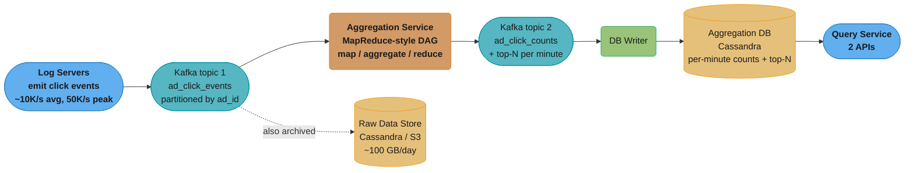
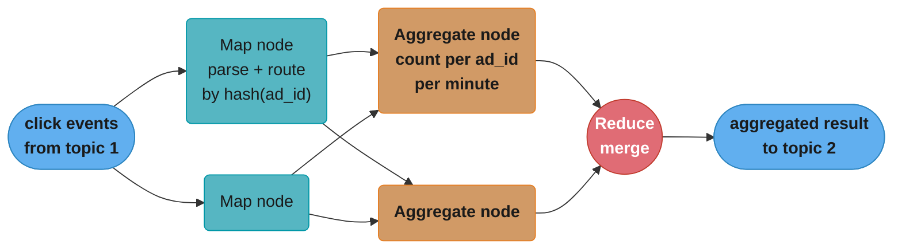
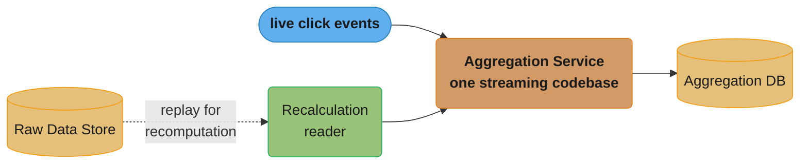
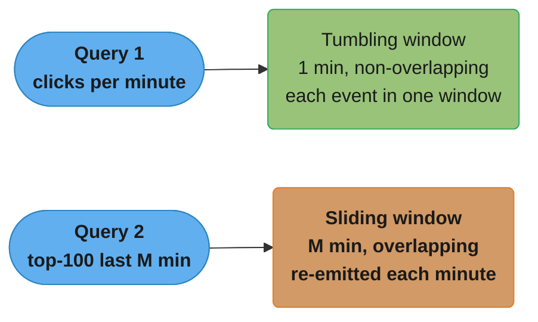
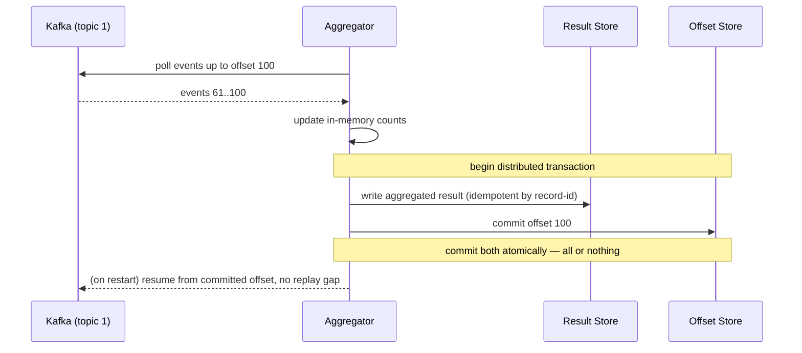
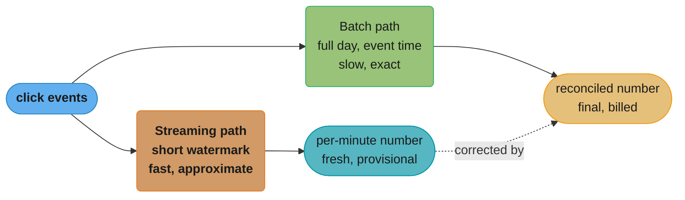

# Chapter 6: Ad Click Event Aggregation

> Ch 6 of 13 · System Design Interview Vol 2 (Xu & Lam) · builds on Ch 4–5 — the exactly-once streaming chapter, where correctness is money (RTB and billing)

## Chapter Map

Digital advertising runs on Real-Time Bidding (RTB) and pay-per-click billing, and both live or die on one number: **how many times was this ad clicked?** This chapter designs the pipeline that turns a firehose of raw click events into two aggregated views the business queries every minute — *"how many clicks did ad X get in the last M minutes?"* and *"what are the top 100 most-clicked ads in the past minute?"* The twist that makes it a hard system-design problem, rather than a `GROUP BY`, is that **the count feeds billing** — so a duplicated or dropped event is not a rounding error, it is a wrong invoice or a mispriced bid. The whole chapter is an exercise in building a stream processor that is *fast enough to be useful* and *correct enough to be trusted with money*, in that order of difficulty.

**TL;DR:**
- **Keep raw data AND aggregated data.** Raw is the source of truth for replay, audits, and recomputation; aggregated is what the fast per-minute queries actually read. Different retention (raw ages into cold storage).
- **The pipeline is Kafka → an aggregation service (a MapReduce-style DAG of map/aggregate/reduce nodes) → a second Kafka → the aggregation database.** Never couple the click producers to the aggregators at 10K–50K QPS; decouple with a durable log.
- **Correctness rests on four ideas: event time (not processing time) + watermarks for late events; tumbling and sliding windows; exactly-once via dedup + atomic commit of {result, Kafka offset}; and a nightly reconciliation batch job** that re-aggregates raw data and fixes whatever the stream got wrong.
- Lean **Kappa** (one streaming codepath, reprocess by replaying the log) over **Lambda** (two codepaths). In real life you'd likely buy this: Flink/Spark Streaming + Druid/Pinot.

## The Big Question

> "Clicks arrive by the billion, out of order, sometimes twice, sometimes hours late from a phone that was offline — and the count I compute will be used to *bill an advertiser and price a bid*. How do I make that count both fresh (per-minute) and exactly right?"

The interviewer is drawing a line the chapter keeps returning to: this is **not** the ~100 ms latency budget of the RTB auction that decides *which* ad to show. That decision has already happened. This system starts the moment a click *event* is emitted, and its latency budget is **minutes**, not milliseconds — which is the freedom that lets us batch, window, watermark, and reconcile. What we are *not* free to get wrong is the **number itself**. Fresh-but-approximate is fine for a dashboard; the money path must converge on exact.

---

## 6.1 Step 1 — Understand the Problem and Establish Design Scope

Ad click aggregation is deceptively broad. The single most important scoping move is to pin down the **two query types**, the **latency budget**, and the fact that **correctness is a hard requirement** — then let the back-of-envelope math size the pipeline.

### Functional requirements — the two query types

The system must answer exactly two questions, both **refreshed every minute**:

1. **Return the number of click events for a particular `ad_id` in the last M minutes.** (A per-ad time-series count — the advertiser's dashboard, the billing feed, and the bid-pricing signal all read this.)
2. **Return the top 100 most-clicked `ad_id`s in the past minute.** (A ranking — a leaderboard of the hottest ads; note it wants the *top N over a window*.)

Both queries must support **filtering by attributes**: the caller may ask for the count/ranking restricted to a particular `ip`, `user_id`, or `country` (e.g. "top 100 ads clicked in the US in the last minute"). This filtering requirement is what forces the **star-schema pre-aggregation** design in §6.2 — you cannot cheaply filter aggregated data after the fact, so the filters have to be baked into how you aggregate.

### Non-functional requirements

| Requirement | What it means here |
|-------------|--------------------|
| **Correctness is critical** | The aggregated data is used for **billing** (advertisers pay per click) and **RTB** (bids are priced from click-through signal). A wrong count is money lost or a dispute. This is the requirement everything else bends around. |
| **Handle late events** | A click can arrive well after it happened — most infamously a mobile app that buffered clicks while offline and uploads them hours later. Late events must not be silently dropped from the billing number. |
| **Handle duplicate events** | At-least-once delivery (client retries, broker redelivery, aggregator restart before offset commit) means the same click can appear twice. It must be counted **once**. |
| **Robustness / fault tolerance** | The system must be resilient to partial failures — an aggregation node dying mid-window must not lose or double-count its in-flight state. |
| **Latency** | End-to-end latency of **a few minutes** is acceptable. This is the crucial contrast the book draws: it is *not* the ~100 ms budget of the RTB auction. Minutes of slack is what buys us watermarks, windowing, and reconciliation. |

### Back-of-the-envelope estimation

The book works from two headline numbers and derives the rest — reproduce the arithmetic step by step.

```
Given:
  clicks per day        = 1,000,000,000   (1 billion)
  number of ads         = 2,000,000       (2 million active ads)
  event size            = 0.1 KB per ad-click event

Ad-click QPS (average):
  1,000,000,000 clicks / 86,400 sec/day  ≈ 11,574 /sec
                                          ≈ 10,000 QPS   (rounded)

Peak QPS (assume ~5x average):
  10,000 * 5 = 50,000 QPS

Daily storage (raw):
  1,000,000,000 events * 0.1 KB = 100,000,000 KB
                                = 100 GB / day

Monthly storage (raw):
  100 GB/day * 30 ≈ 3 TB / month
```

Takeaways the numbers hand you for free:

- **10K QPS average, 50K peak** ⇒ this is a **write-heavy** system. Reads (dashboards, billing runs) are far less frequent than writes. The database choice must optimize for ingest, not for read fan-out.
- **100 GB/day, ~3 TB/month of raw data** ⇒ raw storage is large but not absurd; storing it is affordable, which is what makes "keep the raw data" (§6.2) a viable design rather than a luxury.
- **2 million ads** bounds the aggregation cardinality — a per-minute, per-ad count is at most ~2M rows/minute before you multiply by filter dimensions.

**What this actually says.** "A daily event count is not a rate until you divide by the seconds in a
day — and the number you must *build for* is not that rate but the peak multiple of it." Every line
of the estimate is one of two operations: divide a per-day total by 86,400 to get a rate, or
multiply a size by a count to get bytes. Keeping those two operations separate is what stops
back-of-envelope math from drifting.

| Symbol | What it is |
|--------|------------|
| 86,400 | Seconds in a day (60 x 60 x 24) — the only constant that turns per-day into per-second |
| average QPS | clicks per day / 86,400 — the sustained rate, useful for cost |
| peak factor | ~5x — the burst multiple over average that capacity must actually absorb |
| peak QPS | average QPS x peak factor — the number that sizes partitions, nodes, and buffers |
| event size | 0.1 KB per raw click record (the serialized `{ad_id, ts, user_id, ip, country}`) |
| daily storage | clicks per day x event size — raw bytes landing per day |

**Walk one example.** Run the two operations end to end:

```
  rate path
    1,000,000,000 clicks / 86,400 s   =   11,574 QPS   (average, exact)
    rounded for design                =   10,000 QPS
    x 5 peak factor                   =   50,000 QPS   (peak, what you provision)

  bytes path
    1,000,000,000 events x 0.1 KB     =  100,000,000 KB  =  100 GB / day
    x 30 days                         =        3,000 GB  =    3 TB / month
    x 365 days                        =       36,500 GB  =   36.5 TB / year
```

Meaning: **peak QPS sizes the pipeline, daily bytes size the wallet**, and they answer different
design questions. 50,000 QPS is what decides Kafka partition count and aggregate-node count; 100
GB/day is what decides whether "keep all raw data forever" is a viable policy — and at 36.5 TB/year
on object storage, it plainly is, which is the premise the entire Kappa/reconciliation design rests
on.

**A note on the rounding.** The exact average is 11,574 QPS; the book rounds *down* to 10,000
before applying the 5x peak factor, giving 50,000. Carrying the unrounded figure through instead
would give 11,574 x 5 = 57,870 QPS. The 50,000 headline is therefore about 14% below the
unrounded peak — fine as an interview figure, but when you actually provision partitions, size
against the higher number so the rounding is not silently eating your headroom.

---

## 6.2 Step 2 — Propose High-Level Design and Get Buy-In

The high-level design is a decoupled streaming pipeline. Build it up in the order the book does: the query API, then the data model (the raw-vs-aggregated decision and the star-schema for filtering), then the database choice, then the message-queue-based architecture, and finally the internals of the aggregation service.

### Query API design

Two endpoints, mirroring the two functional requirements:

```
GET /v1/ads/{ad_id}/aggregated_count?from={start}&to={end}&filter={id}
   → { ad_id, count }
      # number of clicks on ad_id in [start, to], optionally restricted by a filter

GET /v1/ads/popular_ads?count=100&window={M}&filter={id}
   → [ { ad_id, count }, ... ]   # top-N most clicked ads in the last M minutes
```

`filter` refers to a **pre-defined filter id** (see the star-schema below) — not an ad-hoc predicate — because the aggregation is precomputed per filter.

### Raw data vs aggregated data — keep BOTH

The pivotal data-model decision. A **raw** click event is one log line; **aggregated** data is a per-minute count derived from many raw events.

Raw event (the source of truth):

```
ad_id   click_timestamp        user_id   ip               country
ad001   2021-01-01 00:00:01    user1     207.148.22.22    USA
ad001   2021-01-01 00:00:02    user2     209.153.56.11    USA
ad002   2021-01-01 00:00:02    user3     208.111.20.10    Canada
```

Aggregated data (what the fast queries read):

```
ad_id   click_minute            count
ad001   202101010000            5
ad002   202101010000            7
```

Neither form alone is enough — the book's comparison is the crux:

| Dimension | Raw data | Aggregated data |
|-----------|----------|-----------------|
| **Completeness** | Full fidelity — every event, every attribute | Derived; detail is lost (you cannot recover per-event attributes) |
| **Query speed** | Slow — must scan/aggregate on the fly at read time | Fast — the answer is precomputed |
| **Storage** | Large (~100 GB/day) | Small (orders of magnitude less) |
| **Recomputation / audit** | Can recompute anything, re-run with fixed logic, prove a number in a dispute | Cannot recompute — if the aggregation logic had a bug, the number is just wrong |
| **Filtering flexibility** | Any filter, any time | Only the filters you pre-aggregated on |

**Decision: store both.** Keep raw data as the **source of truth** — it backs replay, debugging, audits, and the nightly reconciliation job that self-heals the aggregated numbers. Keep aggregated data because the per-minute queries need to be fast and cannot scan 100 GB/day at read time. The two forms also get **different retention**: aggregated data is small and kept hot; raw data is voluminous and ages out to **cold storage** (cheap object storage) after its active reprocessing window.

### Data model and star-schema filtering

Two aggregated tables, one per query:

Per-minute count (query 1):

```
ad_id   click_minute   filter_id   count
ad001   202101010000   0001        5      # 0001 = "country=USA"
ad001   202101010000   0012        2      # 0012 = "ip=207.148.22.22"
```

Top-N per minute (query 2):

```
update_time_minute   most_clicked_ads       filter_id
202101010000         [ad001, ad002, ...]    0001
```

The interesting piece is `filter_id`. To support "top 100 ads in the US" or "clicks on ad001 from this IP" *fast*, you cannot filter aggregated rows after the fact — the detail is gone. Instead, use a **star-schema**: a small dimension table of **pre-defined filters**, and pre-aggregate a separate count *per filter*.

```
filter table
filter_id   region    ip                 user_id
0000        *         *                  *          # no filter (grand total)
0001        USA       *                  *
0012        *         207.148.22.22      *
0003        Canada    *                  *
```

Now the aggregation service, for each click, emits counts into every filter bucket the click matches (its country's filter, its ip's filter, the grand-total filter, ...). The query then reads the single pre-aggregated row for the requested `filter_id`.

**The tradeoff — "pre-aggregate per filter" vs "filter on the fly":**

| | Pre-aggregate per filter (star-schema) | Filter on the fly (from raw) |
|---|---|---|
| Query latency | Fast — one row lookup | Slow — scan + aggregate raw |
| Write/compute cost | Higher — every event fans out into N filter buckets | Lower — aggregate once |
| Flexibility | Only pre-defined filters | Any ad-hoc filter |
| Storage | More (N buckets per key) | Less |

The design chooses pre-aggregation because the queries are known in advance and must be fast; ad-hoc filtering, when needed, falls back to raw data.

**The idea behind it.** "Pre-aggregation buys read speed by paying it forward in writes: one click
becomes as many counter increments as it has matching filters." The cost is a straight multiplier
on the write path, which means the filter table is not a free lookup table — it is a knob that
directly scales your database's ingest requirement.

| Symbol | What it is |
|--------|------------|
| F | Filters a single click matches (grand total + its country + its ip + ...) |
| write amplification | F — the number of counter upserts one raw click produces |
| effective write QPS | peak click QPS x F — what the aggregation DB must actually sustain |
| rows/minute | distinct ads x F — the aggregated table's per-minute row production |
| read cost | 1 row lookup, regardless of F — this is what the amplification is buying |

**Walk one example.** Take one click that matches the grand total, `country=USA`, its `ip` filter,
and its `user_id` filter (F = 4), at the 50,000 QPS peak:

```
  F = 1  (grand total only)
    writes   50,000 x 1  =    50,000 upserts/s
    rows/min  2,000,000 x 1  =  2,000,000 rows per minute

  F = 4  (total + country + ip + user_id)
    writes   50,000 x 4  =   200,000 upserts/s
    rows/min  2,000,000 x 4  =  8,000,000 rows per minute

  F = 10 (a filter table someone kept adding to)
    writes   50,000 x 10 =   500,000 upserts/s
    rows/min  2,000,000 x 10 = 20,000,000 rows per minute

  read cost at every value of F:  1 row lookup
```

Meaning: going from F = 1 to F = 10 turns a comfortable 50K-QPS ingest into a 500K-QPS ingest — a
different database sizing entirely — while every query stays a single row read. That asymmetry is
the whole bargain, and it is also the failure mode: filters are cheap to *add* to a config table
and expensive to *serve*, so an unreviewed filter table grows until the write path buckles.

**Why the filter set must be pre-defined and bounded.** If callers could pass ad-hoc predicates, F
would be unbounded — every distinct predicate any user ever asked for would need its own counter,
maintained on every click forever. Fixing the filter table to a small reviewed set is what keeps F
a constant you can multiply by, rather than a quantity that grows with query traffic. Ad-hoc
questions go to raw data, where they cost a scan once instead of a write increment forever.

### Database choice

Two stores, matched to two access patterns:

- **Raw data** — write-heavy, append-only, occasionally re-read in bulk by the batch/reconciliation jobs. Ideal for a **Cassandra-style wide-column store** (excellent write throughput, horizontal scaling) and/or cheap **object storage (Amazon S3)** in a columnar format (ORC / Parquet / Avro) for the cold archive. Reads are large sequential scans, not point lookups, so columnar + object storage fits.
- **Aggregated data** — also **write-heavy** (results stream in every minute) and **time-series-shaped** (keyed by minute). Same database family works well: Cassandra or a time-series-friendly store. Both raw and aggregated tiers are optimized for **fast writes**, because at 10K–50K QPS the system is dominated by ingest, and reads are comparatively rare.

### High-level architecture — decouple with message queues

The naive design — click servers writing straight into the aggregation database — couples the click producers to the aggregators and the DB. At 50K peak QPS, any hiccup downstream backpressures all the way to ad serving. The fix is **asynchronous processing**: put a durable, replayable log (**Kafka**) between every stage.



Caption: two Kafka topics bracket the aggregation service — topic 1 carries raw click events (and is tapped to archive raw data), topic 2 carries aggregated results — so no stage ever writes directly to the next, and any stage can be replayed from its topic.

**Why two message queues, not one, and why never write results straight to the DB?** The second queue is not decoration — it exists so the aggregation step and the database-write step can each be made **exactly-once independently** (§6.3). Topic 1 holds the input the aggregator consumes; topic 2 holds the *output* the aggregator produces, which the DB writer then consumes. Decoupling the two lets each consumer track its own Kafka offset and replay safely after a crash without the aggregator having to also own the DB transaction. It also absorbs bursts: a 50K-QPS spike lands in Kafka's durable buffer instead of overwhelming the aggregators or the DB.

Contents of the two topics:

- **Topic 1 — `ad_click_events`:** one message per raw click — `{ ad_id, click_timestamp, user_id, ip, country }`. Partitioned **by `ad_id`** so every event for an ad lands on one partition (makes per-ad aggregation embarrassingly parallel).
- **Topic 2 — `ad_click_counts`:** aggregated results at **per-minute** granularity — `{ ad_id, click_minute, filter_id, count }` — plus the **top-N most-clicked ads per minute** records.

### The aggregation service — a MapReduce-style DAG

The aggregation service is modeled as a **MapReduce framework**: a DAG of three node roles. (MapReduce here is a *mental model*, not necessarily Hadoop — it's the map/aggregate/reduce shape.)



Caption: **map** nodes parse and partition events by `hash(ad_id)` so a given ad always reaches the same aggregate node; **aggregate** nodes maintain per-minute counts in memory; the **reduce** node merges partial results into the final aggregate written to topic 2.

**The three node roles:**

- **Map node** — reads from the data source (topic 1), does light parsing/transform/filter, and **routes** each event to the correct downstream aggregate node, typically by `hash(ad_id) % N`. This routing is why all events for one ad meet at one aggregate node — you cannot correctly count an ad if its events are scattered across nodes. (You *could* let each consumer read a pre-partitioned Kafka partition and skip an explicit map step; the map node generalizes that when the partitioning key differs from the aggregation key.)
- **Aggregate node** — counts click events **per `ad_id` per minute**, in memory. This is where the running window state lives.
- **Reduce node** — reduces the results emitted by aggregate nodes into a final form (e.g. merges partial counts, or merges partial top-N heaps).

**Three aggregation use-cases through this DAG:**

1. **Aggregate clicks by `ad_id`.** Map partitions by `ad_id` → each aggregate node counts its ads per minute → reduce merges to the final per-minute count table. Because partitioning already groups an ad onto one aggregate node, the reduce for a simple count is often just a pass-through/union.

2. **Top 100 most-clicked ads.** This is a distributed top-N. Map partitions events → each aggregate node maintains a **local heap** of the top 100 ads *it* has seen this minute (a bounded min-heap of size 100) → the **reduce node merges the per-node heaps** into a single global top-100. Merging heaps is cheap: you only need each node's top 100, not its full distribution, because a global top-100 ad must be top-100 on at least the node that owns it (ads are partitioned by `ad_id`, so each ad's full count lives on exactly one node — the per-node heaps are over *disjoint* ad sets, and the reduce is a straight merge of the union's top 100).

**Put simply.** "Because each ad's full count lives on exactly one node, the global top 100 is
hiding somewhere inside the union of the per-node top 100s — so the reduce node only ever has to
look at nodes x N candidates, never at all 2 million ads." The correctness argument and the cost
argument are the same argument: disjoint partitioning is what makes the local heaps sufficient.

| Symbol | What it is |
|--------|------------|
| N | Size of the requested top list — 100 here |
| nodes | Number of aggregate nodes the ads are partitioned across |
| local heap | A bounded min-heap of size N per node, over that node's own disjoint ad set |
| candidates | nodes x N — everything the reduce node must consider |
| disjointness | The property (from `hash(ad_id)` partitioning) that makes local heaps sufficient |

**Walk one example.** Twenty aggregate nodes, 2,000,000 ads, top N = 100, 32 bytes per entry:

```
  ads per node        2,000,000 / 20        =   100,000 ads
  local heap kept            N              =       100 entries per node
  candidates sent to reduce  20 x 100       =     2,000 entries

  vs shipping every ad count to the reduce node
                             2,000,000      = 2,000,000 entries
    reduction                2,000,000 / 2,000  =   1,000x less data

  network per minute
    heaps only     2,000 x 32 B             =     64 KB
    full counts    2,000,000 x 32 B         =     64 MB
```

Meaning: the reduce node moves 64 KB per minute instead of 64 MB, a 1,000x cut, and it is *exact* —
no approximation is involved. Contrast this with a top-N over a *randomly* partitioned stream, where
one ad's clicks are scattered across all 20 nodes: there, an ad ranked 101st on every node could
still be globally 1st, so local heaps are unsound and you would need either full counts or an
approximate algorithm. **Partitioning by `ad_id` is what converts an approximate distributed problem
into an exact one** — that is the point of the map node's `hash(ad_id)` routing, and it is the
answer interviewers are listening for.

3. **Data filtering (the star-schema, applied in the DAG).** To make `filter_id` queries fast, the aggregate nodes **pre-aggregate per filter**: for each event, increment the count for every filter bucket it matches (`country=USA`, `ip=...`, grand total). The pre-defined filter table drives which buckets exist. This is the star-schema pre-aggregation from §6.2 realized inside the aggregate node.

---

## 6.3 Step 3 — Design Deep Dive

The deep dive is where the correctness requirements get cashed out: streaming vs batch (and Lambda vs Kappa), the meaning of *time* (event vs processing time, watermarks), aggregation windows, exactly-once delivery, scaling, fault tolerance, monitoring/reconciliation, and the off-the-shelf alternative.

### Streaming vs batch — and Lambda vs Kappa

The aggregation service is a **stream processor**: unbounded input, processed continuously, low latency, stateful. Contrast with batch (bounded input, run periodically, high latency, high throughput).

| | Stream processing | Batch processing |
|---|---|---|
| Input | Unbounded (never ends) | Bounded (a fixed dataset) |
| Latency | Seconds to minutes | Hours |
| Typical use | Real-time per-minute counts | Nightly exact recomputation, backfill |
| Reprocessing | Replay the log | Re-run the job on stored data |

Because we need *both* fast per-minute numbers *and* exact recomputable numbers, there are two architectural styles:

- **Lambda architecture** — run **two paths in parallel**: a streaming path for fast/approximate results and a batch path for slow/exact results, then reconcile at the serving layer. The well-known drawback: **two codebases** implementing the same aggregation logic, which must be kept in sync — a chronic source of subtle divergence bugs.
- **Kappa architecture** — **one path**: a single stream-processing codebase handles both real-time and reprocessing. To recompute history (fix a bug, backfill), you **replay the historical raw data through the same streaming code**. One codebase, one source of truth for the logic.

**The book leans Kappa.** The recomputation ("recalculation") service reuses the stream path: raw data → replay → the *same* aggregation service → the aggregation DB (written to a separate result set so it can be compared/swapped in). This is exactly why keeping raw data (§6.2) matters — Kappa reprocessing is a replay of raw events.



Caption: Kappa reuses the single aggregation codebase for both the live stream and historical reprocessing — recomputation is just replaying raw data through the same code, so there is no second batch codebase to drift out of sync.

### Time — event time vs processing time, and watermarks

*Which timestamp defines the minute a click belongs to?* Two choices:

- **Event time** — when the click actually happened (the `click_timestamp` on the event, set by the client).
- **Processing time** — when the aggregation server processed the event (the server's wall clock).

| | Event time | Processing time |
|---|---|---|
| Accuracy | Correct even when events arrive late/out of order | Wrong when there is delay — a click at 00:00:59 processed at 00:03:00 lands in the wrong minute |
| Clock trust | Depends on the client clock (can be wrong/manipulated) | Uses the trusted server clock |
| Late events | Handled explicitly (watermarks) | Ignored — late events just fall into whichever minute they arrive |
| Determinism | Reprocessing yields the same result | Reprocessing yields a *different* result (depends on when you replay) |

The book's own example of the skew: a click generated at 00:00:01 might not be processed until several minutes later if there's a queue backup or the phone was offline. Under processing time it would be counted in the wrong window; under event time it lands in its true minute.

**The design uses event time** — because correctness and reprocessing determinism win, and the whole point is that a billed click must be attributed to the minute it *occurred*, not the minute a server happened to see it. The cost of event time is that you must **wait for late events**, which is what watermarks are for.

**Watermark** — an event-time window does not close the instant wall-clock passes the window's end; it stays open for an **extra wait period** (the watermark) to catch stragglers that belong to that window but arrived a little late.

```
Tumbling 1-minute window [00:01:00, 00:02:00), watermark = 15s

wall clock:  00:01 ─────────────── 00:02 ──┬── 00:02:15
                                            │      │
event-time window content:  clicks tagged  │  window still
[00:01:00,00:02:00) accumulate ────────────┘  accepting late
                                               events whose
   e1(00:01:10)  e2(00:01:55)  e3(00:01:58)    event-time ∈
                                               the window
                          e4(00:01:59) arrives at 00:02:10 ✓ counted (within watermark)
                          e5(00:01:30) arrives at 00:02:40 ✗ too late → reconciliation
```

Caption: the watermark is the grace period after a window's event-time end during which late events are still folded into that window; e4 lands inside the 15-second grace and is counted, e5 misses it and is left for the nightly reconciliation job to fix.

**The watermark tradeoff:**

| Watermark length | Accuracy | Latency |
|------------------|----------|---------|
| **Longer** | Higher — catches more late events before closing the window | Higher — results for a minute are delayed by the wait |
| **Shorter** | Lower — more late events miss the window | Lower — results emitted sooner |

There is no watermark long enough to catch the hours-late offline-mobile event without making the pipeline uselessly slow — so **whatever falls past the watermark is not lost, it is corrected end-of-day by reconciliation** (§ Data monitoring and correctness). Watermarks make the *streaming* number approximately right; reconciliation makes the *final* number exactly right.

### Aggregation windows

Windowing groups an unbounded stream into finite chunks to aggregate. Four kinds; the design uses two:

- **Tumbling (fixed) windows** — contiguous, non-overlapping, equal-size windows. Each event belongs to exactly one window. **The design uses 1-minute tumbling windows** to compute the per-minute click count — this is the natural fit for "count per minute."
- **Sliding windows** — a fixed-size window that slides over time; windows overlap and an event can belong to several. **The "top 100 ads in the last M minutes"** view is a sliding window — it re-answers the same M-minute question every minute, so consecutive windows overlap by M−1 minutes.
- **Hopping windows** — fixed size with a fixed hop; a generalization between tumbling (hop = size) and sliding.
- **Session windows** — windows defined by activity gaps (a session closes after an idle timeout). Mentioned for completeness; not central here since ad clicks aren't naturally sessionized for these two queries.



Caption: the per-minute count uses a tumbling window (one event, one window), while the top-100-over-last-M-minutes ranking uses a sliding window that overlaps its neighbors and is recomputed every minute.

**Read it like this.** "How much memory a windowing scheme costs is decided by how many windows are
*open at once*, and that count is set by the watermark for tumbling windows and by the window span
for sliding ones." Window size does not drive memory; window *overlap* does — which is why the
tumbling count is nearly free and the sliding top-N is the expensive one.

| Symbol | What it is |
|--------|------------|
| W | Window size — 60 s for the per-minute count, M minutes for the top-N |
| watermark | Grace period a closed window stays open for stragglers (15 s here) |
| open windows (tumbling) | 1 + ceil(watermark / W) — the current window plus any still draining |
| open windows (sliding) | M — one per overlapping M-minute span, each re-emitted every minute |
| state per window | distinct keys in the window x bytes per counter entry |

**Walk one example.** Size both window types against 2,000,000 ads at 32 bytes per counter entry:

```
  TUMBLING, W = 60 s, watermark = 15 s
    open windows   1 + ceil(15/60)  =  1 + 1  =  2
    entries        2 x 2,000,000            =  4,000,000
    memory         4,000,000 x 32 B         =  128 MB      <- cheap

  SLIDING, M = 5 min (top-100 over last 5 minutes)
    open windows   M                        =  5
    entries        5 x 2,000,000            = 10,000,000
    memory         10,000,000 x 32 B        =  320 MB

  SLIDING, M = 60 min (someone asks for "top ads this hour")
    open windows   M                        =  60
    entries        60 x 2,000,000           = 120,000,000
    memory         120,000,000 x 32 B       =  3.84 GB     <- 12x the 5-min case

  watermark as a fraction of the window:  15 / 60 = 25% extra latency on every result
```

Meaning: the tumbling per-minute count needs only **two** live windows no matter how long you run,
because a window's cost ends 15 seconds after it closes. The sliding top-N's cost scales *linearly
with M*, so stretching the ranking question from "last 5 minutes" to "last hour" is a 12x memory
change on the aggregate nodes — a product decision with an infrastructure price tag, which is the
kind of link worth naming out loud in an interview.

**What the watermark actually costs.** A 15-second watermark on a 60-second window means every
per-minute result is published 25% later than it could be. That is the entire tradeoff: you are
buying late-event coverage with latency, at a fixed exchange rate of `watermark / W`. Push the
watermark to 60 s and you double your end-to-end latency to catch a thin tail of stragglers — which
is why the design keeps it short and lets the nightly reconciliation job catch the rest.

### Delivery guarantees — exactly-once

The correctness requirement forces the strongest delivery guarantee. Three levels:

- **At-most-once** — never redeliver; an event may be lost. Unacceptable for billing (drops = under-billing).
- **At-least-once** — never lose; an event may be delivered more than once. Unacceptable *as-is* for billing (duplicates = over-billing).
- **Exactly-once** — each event affects the result exactly once. Required here.

**Why at-least-once isn't enough:** the counts feed billing. Deliver a click twice and you charge the advertiser for a click that happened once. At-least-once is easy (just retry until acked); exactly-once is the hard part and needs two mechanisms working together: **deduplication** and **atomic commit of {result, offset}**.

#### (a) Deduplication and offset checkpointing

Duplicates arise two ways: a **client resends** a click (network retry), or the **aggregator restarts** and replays events it had already processed but whose Kafka offset it hadn't yet committed. The second is the classic exactly-once trap. Consider the failure window:

```
1. Aggregator reads events up to offset 100.
2. Aggregator processes them, computes the minute's count.
3. Aggregator sends the aggregated result to downstream (topic 2).   ← succeeds
4. Aggregator crashes BEFORE committing offset 100 back to Kafka.    ← crash here
5. Aggregator restarts, resumes from the last COMMITTED offset (say 60).
6. It re-reads and re-processes events 61–100 → the result is sent AGAIN → double count.
```

The failure is that **step 3 (emit result) and step 4 (commit offset) are not atomic** — a crash between them replays already-emitted work. The book's remedy is a **dedup-with-offset-saving** protocol: persist a record of *what has been processed* to durable storage (HDFS / S3) so a restarted node can recognize and skip replays.

The 6-step dedup walkthrough, with its failure points:

```
1. Aggregation node reads an event and checks a DEDUP STORE (in HDFS/S3, keyed by
   record-id / offset) to see if this record was already processed.
     ↳ FAILURE before step 1: node crashes before reading — no harm, event still in Kafka.
2. If already seen → skip (it's a duplicate). If new → process it (update the count).
3. Persist the aggregation result AND the record-id/offset marker to the dedup store.
     ↳ FAILURE between 2 and 3: work done but not recorded → on restart it's re-read,
       but because it was NOT marked done, reprocessing it is correct (no double count
       only because step 5's atomic commit — see (b) — governs the actual result write).
4. Emit the result downstream (topic 2).
     ↳ FAILURE between 3 and 4: result recorded as done but not emitted → on restart,
       the dedup store shows it done, so re-emit is needed carefully — handled by making
       the emit idempotent (dedup on the downstream side too, by record-id).
5. Commit the Kafka offset.
     ↳ FAILURE between 4 and 5: this is the classic double-count window — the offset
       isn't committed, so on restart events replay. The dedup store (step 1 check)
       catches them as already-processed and skips → NO double count.
6. Advance to the next event.
```

The key idea: **the dedup store (record-id checkpoint in HDFS/S3) is the memory that survives a crash**, so a replayed event is recognized and dropped. This is a distributed-systems classic — you cannot make "process + emit + commit offset" a single atomic step across Kafka and your processor, so you make the operation **idempotent** via a durable dedup marker instead.

**In plain terms.** "Deduplication costs you one remembered key per event, for as long as a
duplicate could still show up — so the memory bill is the arrival rate multiplied by how long you
choose to remember." The dedup horizon is a design parameter, not a constant, and it is what
separates a 60 MB problem from a 16 GB problem.

| Symbol | What it is |
|--------|------------|
| n | Distinct record-ids you must remember = peak QPS x dedup horizon (seconds) |
| dedup horizon | How far back a replay can reach — bounded by window + watermark, not by the day |
| bytes/key | Cost of one remembered id: ~16 B for the id itself, ~64 B inside a real hash map |
| exact set | A hash map of every id — no false positives, full memory cost |
| Bloom filter | A probabilistic set: ~14.4 bits/element at p = 0.001, but *can* say "seen" wrongly |
| p | Bloom false-positive rate — here, the probability a genuine click is wrongly skipped |

**Walk one example.** Size the dedup set over the window-plus-watermark horizon (60 s + 15 s):

```
  n = peak QPS x horizon
      50,000 /s x 75 s                 =  3,750,000 record-ids in flight

  EXACT hash map
    ids only        3,750,000 x 16 B   =     60 MB
    real hash map   3,750,000 x 64 B   =    240 MB   (entry overhead dominates)

  BLOOM FILTER over one minute of ids (n = 50,000 x 60 = 3,000,000)
    p = 0.01     9.59 bits/elem  ->    3.59 MB   k = 7 hashes
    p = 0.001   14.38 bits/elem  ->    5.39 MB   k = 10 hashes
    p = 0.0001  19.17 bits/elem  ->    7.19 MB   k = 13 hashes

    exact hash map for the same 3M ids:  3,000,000 x 64 B = 192 MB
    bloom at p=0.001 is 192 / 5.39       =  36x smaller

  IF you naively remembered a whole day instead of the horizon
    1,000,000,000 x 16 B               =     16 GB per node    <- the trap
```

Meaning: the correct dedup horizon is **75 seconds, not 24 hours**. Bounding it to window +
watermark turns dedup from a 16 GB per-node liability into a 240 MB hash map — and anything older
than the horizon is not dedup's job at all, it is the nightly reconciliation job's.

**Why a Bloom filter is the wrong tool on the money path.** The 36x memory saving is tempting until
you read the failure direction. A Bloom filter's false positive says *"I have seen this id"* about
an id it has never seen — so the aggregator **skips a real click**. At p = 0.001 and 3,000,000
clicks per minute that is 3,000 clicks silently dropped every minute, roughly 4.32 million per day
— under-billing at scale. Bloom filters are safe where a false positive means "do extra work"
(cache admission, disk-read avoidance); here it means "lose revenue," so the exact hash map is worth
its 36x. If you do use one, use it only as a *negative* pre-filter — a Bloom "no" is always truthful,
so let a "no" fast-path straight to processing and send every "maybe" to the exact store.

#### (b) Atomic commit of aggregation result + Kafka offset

Deduplication handles replays; the deeper fix is to make the **result write and the offset commit atomic** — a **distributed transaction** spanning the result store (aggregation DB / topic 2) and the offset store. If both commit or neither does, there is no window in which the result is applied but the offset isn't (or vice-versa).



Caption: binding the result write and the offset commit into one all-or-nothing transaction removes the crash window between "emitted result" and "committed offset" — the two events that at-least-once delivery would otherwise let diverge into a double count.

In practice this atomicity is what modern stream processors (Flink checkpoints, Kafka transactions / `read-process-write` with transactional producers) provide out of the box — which is a strong argument for the off-the-shelf alternative below.

### Scaling the system

The pipeline scales at three tiers:

- **Message queue (Kafka).** Scale by **partitioning topic 1 by `ad_id`** and running a **consumer group** of aggregators, one consumer per partition. **Provision enough partitions up front** — repartitioning a live Kafka topic is disruptive (it changes the `hash(key) % partitions` mapping, scrambling which partition an ad lands on and breaking per-ad ordering/grouping). Over-provision partitions rather than resize later.
- **Aggregation nodes.** Scale out with more map/aggregate nodes; within a node, use **multi-threading**, and across nodes use a **resource manager** (e.g. YARN) to add/remove nodes elastically. The nasty problem is **hotspot ads** — a *celebrity ad* or a viral campaign receives vastly more clicks than average, so its single `ad_id` partition/aggregate node becomes a bottleneck (partitioning by `ad_id` sends all of one ad's traffic to one place). Mitigations: **allocate more aggregation nodes to hot ads**, and/or **further split a hot ad's partition** — e.g. key by `ad_id + random_suffix` for the hottest ads so their events fan across several nodes, then sum the sub-counts in reduce. This trades a slightly more complex reduce for removing the single-node bottleneck.
- **Database (Cassandra).** Scales horizontally by design — add nodes, the ring rebalances. The write-heavy, time-series-keyed aggregated data fits Cassandra's strengths.

```
hotspot before:                       hotspot after (split the hot key):
   ad_viral ──► partition 7 (100%)       ad_viral#0 ──► partition 7
   all traffic to one node,              ad_viral#1 ──► partition 3   sum in reduce
   node 7 saturates ✗                    ad_viral#2 ──► partition 9   node load evens ✓
```

Caption: the celebrity-ad hotspot comes from partitioning by `ad_id`; salting the hottest ad's key with a suffix scatters its clicks across partitions, and the reduce step re-sums the sub-counts into the true total.

### Fault tolerance

Aggregation state (the per-minute counts, the top-N heaps) lives **in memory** on the aggregate nodes — so a node crash would lose the in-flight window. The recovery model:

1. **Snapshot** the in-memory aggregation state (counts, heaps) periodically to **durable storage**, tagged with the Kafka offset it corresponds to.
2. On node failure, a replacement node **restores state from the last snapshot** and **replays from that snapshot's Kafka offset** forward.
3. Because **Kafka retains the raw events**, the replay is always possible — the log is the durable input, the snapshot is the durable state, and the offset ties them together.

This is the same offset-plus-checkpoint machinery as exactly-once: snapshot + committed offset means a recovered node resumes exactly where it left off, neither losing nor double-counting the window.

### Data monitoring and correctness

Two layers keep the system trustworthy:

- **Continuous monitoring** — instrument the pipeline and alert on drift:
  - **Latency** — stamp events at each stage (ingest, aggregate, write) and track the deltas; end-to-end latency creeping past the few-minutes budget is the first sign of trouble.
  - **Message queue size / consumer lag** — a growing backlog on topic 1 means aggregators can't keep up (scale out, or a hotspot formed).
  - **System resources** on aggregation nodes — CPU, memory, thread pool saturation.
- **Reconciliation** — the self-healing correctness net. A **nightly batch job re-aggregates the raw events by event time** (it has the *entire* day, including everything that arrived past the watermark) and **compares its result against the streaming aggregate**. This is the authoritative, exact number; the streaming number was the fast approximation.
  - A **match** (within tolerance) confirms the stream is healthy.
  - A **mismatch** signals a problem — dropped events, a dedup bug, a logic error, or simply late events the watermark missed — and the reconciled batch number **replaces** the streaming number for billing. Reconciliation is what lets the streaming path be aggressively fast (short watermarks) without risking the money: the batch job cleans up afterward. This is also where the Kappa recomputation path (§ Streaming vs batch) is used — reconciliation *is* a replay of raw data through the aggregation logic.

### Alternative design — buy, don't build

The book closes the deep dive with the honest note: in a real company you would likely **not hand-build the MapReduce DAG**. Off-the-shelf components cover this problem well:

- **Stream processing** — **Apache Flink** or **Spark Streaming** replace the custom aggregation service, and give you event-time windows, watermarks, and exactly-once (checkpointing / transactions) as built-in features rather than hand-rolled protocols.
- **Serving / OLAP** — **Apache Druid**, **Apache Pinot**, or **ClickHouse** replace the custom aggregation database for fast per-minute group-by/filter queries over time-series data.

So a production-realistic stack is: **Kafka → Flink → Druid/Pinot**, with S3/HDFS for raw data and a Spark reconciliation job. The custom DAG in this chapter is the *teaching model* that shows what those tools do under the hood — worth being able to sketch, but not what you'd build from scratch.

---

## 6.4 Step 4 — Wrap Up

The design in one breath: raw click events flow through **Kafka** into an **aggregation service** (a MapReduce-style DAG of map/aggregate/reduce nodes) and out through a **second Kafka** into the **aggregation database**, answering two per-minute queries — *clicks per ad in the last M minutes* and *top 100 ads in the past minute* — with **filtering supported via star-schema pre-aggregation**.

The correctness spine, which is the real content of the chapter:

- **Keep raw AND aggregated data** — raw is the replayable source of truth (and enables Kappa reprocessing and reconciliation); aggregated is the fast query path.
- **Event time + watermarks** — attribute clicks to the minute they happened, waiting a tunable grace period for stragglers; trade watermark length against latency.
- **Tumbling windows** for the per-minute count, **sliding windows** for the top-N-over-M-minutes ranking.
- **Exactly-once** = deduplication (record-id checkpoints in HDFS/S3 to survive replays) **plus** atomic commit of {aggregation result, Kafka offset} (a distributed transaction that removes the double-count window).
- **Scale** with `ad_id` partitioning and consumer groups, extra nodes for **hotspot (celebrity) ads** via key-splitting, and horizontally-scalable Cassandra.
- **Fault tolerance** via state snapshots + replay from the last committed offset.
- **Monitoring + nightly reconciliation** — the batch job re-aggregates raw data and corrects the streaming number for billing; this is what lets the stream be fast without being wrong.
- Prefer **Kappa over Lambda** (one codepath), and in reality **buy** the stack (Flink/Spark + Druid/Pinot) rather than building the DAG.

Additional talking points if time remains: how to spot/handle **click fraud** upstream, deeper **data integrity** checks, tuning the watermark/latency tradeoff per query, and multi-region aggregation.

---

## Visual Intuition

The exactly-once double-count window — the single most-tested mechanic in this chapter — made physical:

```
AT-LEAST-ONCE (broken for billing):

  read ──► process ──► emit result ──► [CRASH] ──► restart from old offset
                            │                              │
                            └── result counted once        └── events 61..100 replay
                                                               result counted AGAIN ✗
                                                               advertiser over-billed


EXACTLY-ONCE (dedup + atomic {result, offset}):

  read ──► process ──► ┌─ emit result ──┐
                       │  commit offset  │ atomic: both or neither
                       └────────────────┘
                            │
                       [CRASH] ──► restart: offset already committed with result
                                   OR dedup store shows record done ──► skip ✓
                                   counted exactly once
```

Caption: at-least-once leaves a gap between "emitted result" and "committed offset" that a crash turns into a double count; exactly-once closes the gap by either binding the two into one atomic commit or by remembering processed record-ids in a durable dedup store so replays are recognized and skipped.

The two-clock intuition of the whole system:



Caption: the streaming path optimizes for freshness and the batch/reconciliation path optimizes for exactness — the reconciled number is authoritative and overwrites the provisional streaming number wherever they disagree, which is what lets the stream run with aggressively short watermarks.

---

## Key Concepts Glossary

- **Ad click event** — one raw record `{ ad_id, click_timestamp, user_id, ip, country }`; the atomic input.
- **RTB (Real-Time Bidding)** — the ~100 ms ad auction; *out of scope* here (uses these counts, doesn't produce them).
- **Aggregation** — reducing many raw events to a per-minute count (or top-N ranking).
- **Raw data** — full-fidelity event log; source of truth; large; ages to cold storage.
- **Aggregated data** — derived per-minute counts; small; fast to query; not recomputable on its own.
- **Star-schema filtering** — a pre-defined filter dimension table (`filter_id`); counts are pre-aggregated per filter so filtered queries are one row lookup.
- **`filter_id`** — a pre-defined filter (e.g. `country=USA`, `ip=...`) the aggregation pre-computes a separate count for.
- **MapReduce DAG** — the aggregation service's map/aggregate/reduce node model.
- **Map node** — parses and routes events by `hash(ad_id)` to the right aggregate node.
- **Aggregate node** — counts per `ad_id` per minute in memory; holds window state and top-N heaps.
- **Reduce node** — merges aggregate nodes' partial results (counts, top-N heaps) into the final.
- **Top-N via heap merge** — each node keeps a local size-N heap; reduce merges them into a global top-N.
- **Message queue decoupling** — Kafka between stages so producers never backpressure to ad serving.
- **Two-queue design** — topic 1 (raw events) and topic 2 (aggregated results) so each stage is independently exactly-once.
- **Stream processing** — unbounded input, continuous, low-latency, stateful.
- **Batch processing** — bounded input, periodic, high-latency, used for exact recomputation.
- **Lambda architecture** — parallel streaming + batch paths; two codebases to keep in sync.
- **Kappa architecture** — single streaming codebase; reprocess by replaying raw data (the book's choice).
- **Recalculation / recomputation service** — replays raw data through the aggregation code to rebuild history.
- **Event time** — when the click happened (client timestamp); used by this design.
- **Processing time** — when the server processed the event; wrong under delay, non-deterministic on replay.
- **Watermark** — extra wait after a window's event-time end to catch late events; longer = more accurate, higher latency.
- **Tumbling (fixed) window** — non-overlapping equal windows; each event in exactly one; used for per-minute count.
- **Sliding window** — overlapping fixed-size window slid over time; used for top-N over last M minutes.
- **Hopping window** — fixed size with a fixed hop (generalizes tumbling/sliding).
- **Session window** — window bounded by an inactivity gap.
- **At-most-once / at-least-once / exactly-once** — delivery guarantees; billing needs exactly-once.
- **Deduplication** — recognizing and dropping replayed/duplicate events via a durable record-id/offset marker.
- **Offset checkpointing** — persisting the processed Kafka offset (to HDFS/S3) so a restart resumes correctly.
- **Atomic {result, offset} commit** — a distributed transaction binding the result write to the offset commit to kill the double-count window.
- **Hotspot / celebrity ad** — an `ad_id` with vastly above-average traffic that overloads its single partition/node.
- **Key salting** — appending a random suffix to a hot `ad_id` to spread it across partitions; summed back in reduce.
- **State snapshot** — periodic durable dump of in-memory aggregation state, tagged with a Kafka offset, for recovery.
- **Reconciliation** — nightly batch re-aggregation of raw data (by event time) that corrects the streaming number for billing.

---

## Tradeoffs & Decision Tables

| Decision | Option A | Option B | Chapter's choice |
|----------|----------|----------|------------------|
| Data to store | Raw only | Aggregated only | **Both** (raw = truth/replay, aggregated = fast query) |
| Architecture | Lambda (2 codepaths) | Kappa (1 codepath) | **Kappa** — reprocess by replaying raw data |
| Time semantics | Processing time | Event time | **Event time** (+ watermarks) — correct + deterministic |
| Window (per-minute count) | Sliding | Tumbling | **Tumbling** 1-minute |
| Window (top-N over M min) | Tumbling | Sliding | **Sliding** M-minute |
| Delivery guarantee | At-least-once | Exactly-once | **Exactly-once** (dedup + atomic commit) |
| Filtering | On-the-fly from raw | Pre-aggregate per filter | **Pre-aggregate** (star-schema) for the known queries |
| Build vs buy | Custom MapReduce DAG | Flink/Spark + Druid/Pinot | Teach with DAG, **buy** in reality |

| Watermark length | Late events caught | Latency | Use when |
|------------------|--------------------|---------|----------|
| Short | Fewer | Low | Freshness matters; reconciliation will fix the rest |
| Long | More | High | Accuracy matters more than freshness for that window |

| Store | Access pattern | Fit |
|-------|----------------|-----|
| Raw data | Write-heavy append, bulk sequential re-read | Cassandra + S3/HDFS columnar (ORC/Parquet/Avro) |
| Aggregated data | Write-heavy, time-series keyed, occasional point read | Cassandra / time-series DB (or Druid/Pinot in the buy stack) |

---

## Common Pitfalls / War Stories

- **Using processing time because it's "simpler."** It silently misattributes any delayed event to the wrong minute and, worse, makes reprocessing non-deterministic — replay the same data tomorrow and you get a different answer, so you can never prove a billed number. Use event time; pay for it with watermarks.
- **Assuming at-least-once is "good enough."** It is, for a dashboard. It is not for billing: a broker redelivery or an aggregator restart before the offset commit double-counts the click and over-bills the advertiser. Exactly-once (dedup + atomic {result, offset}) is not optional on the money path.
- **The offset-commit crash window.** Emitting the aggregated result and committing the Kafka offset as two separate steps leaves a gap; a crash in that gap replays events 61–100 and double-counts. Make them atomic, or make the write idempotent via a durable dedup marker.
- **Repartitioning a live Kafka topic under load.** Changing partition count remaps `hash(ad_id) % partitions`, scattering an ad's events across partitions and breaking per-ad grouping/ordering mid-flight. Over-provision partitions up front instead.
- **Ignoring the celebrity-ad hotspot.** Partitioning by `ad_id` sends 100% of a viral ad's clicks to one node, which saturates while others idle. Salt the hot key across partitions and re-sum in reduce, or dedicate extra nodes to hot ads.
- **Treating the streaming number as final.** Short watermarks mean the streaming per-minute count is provisional — late events are still missing. Bill from the **reconciled** number, and label the streaming number as provisional in the UI; otherwise a later correction looks like a bug or a dispute.
- **No reconciliation job.** Without a nightly batch re-aggregation of raw data, you have no way to detect that the stream silently dropped events or a dedup bug crept in — the whole point of keeping raw data is to have an authoritative check.
- **Storing only aggregated data to "save space."** ~100 GB/day of raw feels expensive until you need to recompute after a logic bug, prove a number in a dispute, or add a new filter dimension — none of which aggregated data can do. Raw is the source of truth; keep it (cold storage makes it cheap).

---

## Real-World Systems Referenced

- **Apache Kafka** — the durable, partitioned message queue between every stage (both topics).
- **Apache Flink / Spark Streaming** — off-the-shelf stream processors replacing the custom aggregation DAG (event-time windows, watermarks, exactly-once).
- **Apache Druid / Apache Pinot / ClickHouse** — OLAP serving stores for fast per-minute group-by/filter queries.
- **Apache Cassandra** — write-heavy horizontally-scalable store for raw and aggregated data.
- **Amazon S3 / HDFS** — cheap durable object/file storage for raw data (columnar ORC/Parquet/Avro) and dedup/offset checkpoints.
- **Apache Hadoop / MapReduce** — the map/aggregate/reduce mental model the aggregation service borrows.
- **YARN** — resource manager for elastically scaling aggregation nodes.

---

## Summary

This chapter designs an ad-click-event aggregation pipeline whose defining constraint is that **its output is money** — the per-minute click counts feed advertiser billing and RTB bid pricing, so the number must be both fresh (refreshed every minute) and exactly right. It answers two queries — clicks per `ad_id` in the last M minutes, and the top 100 ads in the past minute — both filterable by `ip`/`user_id`/`country`, on a **few-minutes latency budget** that is deliberately looser than the RTB auction's ~100 ms.

The architecture keeps **both raw and aggregated data**, and routes click events through **Kafka → a MapReduce-style aggregation service → a second Kafka → the aggregation database**, decoupling every stage so 50K-QPS bursts never backpressure ad serving. Filtering is made fast by **star-schema pre-aggregation** (a count per `filter_id`). The aggregation DAG uses **map** nodes to partition by `ad_id`, **aggregate** nodes to count per minute (and keep per-node top-N heaps), and a **reduce** node to merge.

The deep dive is a correctness argument: use **event time** (not processing time) with **watermarks** to handle late/out-of-order events; use **tumbling** windows for the count and **sliding** windows for the ranking; achieve **exactly-once** with **deduplication** (durable record-id checkpoints) plus an **atomic commit of {result, Kafka offset}** that removes the double-count window; scale via `ad_id` partitioning, consumer groups, hot-key salting for **celebrity ads**, and Cassandra; recover via **state snapshots + offset replay**; and, above all, run a **nightly reconciliation** batch job that re-aggregates raw data by event time and corrects the streaming number for billing. The book prefers **Kappa** (one codebase, replay to reprocess) over **Lambda**, and notes that in practice you'd **buy** the stack — Flink/Spark + Druid/Pinot — rather than build the DAG by hand.

---

## Interview Questions

**Q: What is the difference between event time and processing time, and which does this design use and why?**
Event time is when the click actually happened (the client timestamp); processing time is when the aggregation server processed it. This design uses event time because it stays correct when events arrive late or out of order and, critically, makes reprocessing deterministic — replaying the same raw data always yields the same counts, which is required to prove a billed number. Processing time is simpler but misattributes delayed events to the wrong minute and gives different answers on replay, so it can't back billing.

**Q: What is a watermark, and what is the tradeoff in choosing its length?**
A watermark is an extra grace period after an event-time window's end during which the window still accepts late-arriving events that belong to it. A longer watermark catches more late events (higher accuracy) but delays the window's result (higher latency); a shorter watermark emits sooner but misses more stragglers. Events that fall past even a generous watermark aren't lost — they're corrected end-of-day by the reconciliation batch job, which lets the stream run with short watermarks.

**Q: Why isn't at-least-once delivery good enough here, and how is exactly-once achieved?**
At-least-once can deliver the same click twice, which over-bills the advertiser, so the money path needs exactly-once. Exactly-once combines two mechanisms: deduplication (persist processed record-ids/offsets to durable storage like HDFS/S3 so replayed events are recognized and skipped) and an atomic commit that binds the aggregation-result write to the Kafka-offset commit. Together they eliminate the window in which a crash between emitting a result and committing the offset would replay and double-count events.

**Q: Where exactly does the double-count happen if the result emit and offset commit aren't atomic?**
The gap is between emitting the aggregated result and committing the Kafka offset. If the aggregator emits the result for events 61–100 and then crashes before committing offset 100, it restarts from the last committed offset (say 60), re-reads 61–100, and emits the same result again. Making {result write, offset commit} a single atomic transaction — or making the emit idempotent via a durable dedup marker — closes that window so each event is counted once.

**Q: What is the difference between Lambda and Kappa architecture, and which does the book prefer?**
Lambda runs two parallel paths — a streaming path for fast approximate results and a batch path for slow exact results — which means maintaining two codebases that implement the same logic and tend to drift apart. Kappa uses a single streaming codebase and reprocesses history by replaying the raw event log through that same code. The book prefers Kappa because one codebase removes the sync-divergence bug class, and replay-based recomputation is exactly what the retained raw data enables.

**Q: How is the celebrity-ad (hotspot) problem handled?**
Partitioning by `ad_id` sends all of a viral ad's clicks to one partition and one aggregate node, which saturates while others idle. The fix is to allocate more aggregation nodes to hot ads and/or salt the hot key — append a random suffix (`ad_viral#0`, `#1`, ...) so its events fan across several partitions — then re-sum the sub-counts in the reduce step. This trades a slightly more complex reduce for removing the single-node bottleneck.

**Q: Why keep raw data if you already store aggregated data?**
Raw data is the source of truth that aggregated data can't reconstruct — it enables replay, audits, dispute resolution, recomputation after a logic bug, adding new filter dimensions later, and the nightly reconciliation that validates the stream. Aggregated data is a lossy derivation optimized for fast queries; if its computation was wrong, only raw data can produce the correct number. At ~100 GB/day, raw is affordable, especially aged into cold storage.

**Q: Why put two message queues in the pipeline instead of writing aggregation results straight to the database?**
The second queue (topic 2) holds the aggregator's output so the aggregation step and the database-write step can each be made exactly-once independently, each tracking its own Kafka offset and replaying safely after a crash. Writing results directly to the DB couples the aggregator to the DB's availability and makes atomic offset/result handling harder. The queues also absorb 50K-QPS bursts in a durable buffer instead of backpressuring upstream.

**Q: Walk through the aggregation service's map, aggregate, and reduce roles.**
Map nodes read raw events, parse/filter them, and route each by `hash(ad_id)` to a specific aggregate node so all of one ad's events converge on one place. Aggregate nodes count clicks per `ad_id` per minute in memory (and, for the ranking query, keep a local top-N heap). The reduce node merges the aggregate nodes' partial outputs — unioning counts, or merging per-node heaps into a global top-100 — and emits the final result to topic 2.

**Q: How is the "top 100 most-clicked ads" query computed in a distributed way?**
Each aggregate node maintains a local min-heap of the top 100 ads it has seen in the window, and the reduce node merges these per-node heaps into a global top 100. This works cheaply because ads are partitioned by `ad_id`, so each ad's full count lives on exactly one node — the per-node heaps cover disjoint ad sets, and merging just takes the top 100 of their union. You never need to ship every ad's count to the reducer, only each node's top 100.

**Q: What are tumbling and sliding windows, and where is each used here?**
A tumbling window is a fixed-size, non-overlapping window where each event belongs to exactly one window; a sliding window is a fixed-size window that slides over time so windows overlap and it's re-emitted continuously. The per-minute click count uses a 1-minute tumbling window (natural "count per minute"), while the top-100-ads-over-the-last-M-minutes ranking uses a sliding M-minute window recomputed every minute. Hopping and session windows exist too but aren't central to these two queries.

**Q: What is the star-schema filtering approach and what does it trade off?**
A small dimension table defines pre-set filters (each a `filter_id` like `country=USA` or `ip=...`), and the aggregation service pre-computes a separate count for every filter bucket an event matches. Queries then read one pre-aggregated row per `filter_id` instead of scanning raw data, making filtered queries fast. The tradeoff is higher write/compute cost and storage (each event fans out into N buckets) and support only for pre-defined filters — ad-hoc filters fall back to scanning raw data.

**Q: How does the system recover aggregation state after a node crash?**
Aggregate nodes periodically snapshot their in-memory state (per-minute counts, top-N heaps) to durable storage, tagged with the Kafka offset the snapshot corresponds to. On failure, a replacement node restores from the last snapshot and replays events from that offset forward — possible because Kafka retains the raw events. The snapshot-plus-committed-offset pairing ensures recovery neither loses nor double-counts the in-flight window.

**Q: What role does the reconciliation batch job play, and what does a mismatch mean?**
A nightly batch job re-aggregates the full day's raw events by event time — including everything that arrived past the streaming watermark — and compares its exact result against the streaming aggregate. A match confirms the stream is healthy; a mismatch flags dropped events, a dedup bug, a logic error, or simply late events the watermark missed, and the reconciled batch number replaces the streaming number for billing. Reconciliation is the self-healing net that lets the streaming path be aggressively fast without risking money.

**Q: Do the back-of-envelope numbers point to a read-heavy or write-heavy system, and how is that derived?**
It's write-heavy: 1 billion clicks/day ÷ 86,400 s ≈ 10,000 write QPS on average, peaking around 50,000 (~5x), while reads (dashboards, billing runs) are far less frequent. That drives choosing databases optimized for ingest (Cassandra-style, time-series) rather than read fan-out. Storage math: 1B events × 0.1 KB ≈ 100 GB/day raw, ~3 TB/month, which is cheap enough to justify keeping all raw data.

**Q: Why must you provision enough Kafka partitions up front rather than repartitioning later?**
Because partition assignment is `hash(ad_id) % partition_count`, changing the partition count remaps which partition each ad lands on, scattering an ad's events across partitions and breaking the per-ad grouping and ordering the aggregation depends on. Doing this on a live, loaded topic is disruptive and can corrupt in-flight aggregation. Over-provisioning partitions initially avoids the painful live resize.

**Q: What is the latency requirement, and how does it differ from RTB?**
End-to-end latency of a few minutes is acceptable for the aggregation queries, because they feed dashboards, billing, and bid-pricing signals rather than the live auction. This is deliberately looser than RTB's ~100 ms budget, which decides which ad to show in real time and is a separate system. That minutes-of-slack is precisely what allows windowing, watermarks for late events, and nightly reconciliation.

**Q: Which database types fit the raw and aggregated data, and why?**
Both tiers are write-heavy, so a Cassandra-style wide-column store fits both; raw data additionally suits cheap object storage (S3/HDFS) in columnar formats (ORC/Parquet/Avro) since it's re-read in bulk sequential scans, not point lookups. Aggregated data is time-series-shaped (keyed by minute) and read occasionally, so Cassandra or a time-series store works — or Druid/Pinot in the buy-it-off-the-shelf stack. The common thread is optimizing for ingest throughput over read fan-out.

**Q: In practice, would you build the custom MapReduce DAG, and what would you use instead?**
Usually no — the custom DAG is a teaching model, and in a real company you'd assemble off-the-shelf components. Apache Flink or Spark Streaming replace the aggregation service and provide event-time windows, watermarks, and exactly-once (checkpointing/transactions) as built-in features, while Apache Druid, Pinot, or ClickHouse serve the fast per-minute filtered queries. A realistic stack is Kafka → Flink → Druid/Pinot, with S3/HDFS for raw data and a Spark reconciliation job.

**Q: How does deduplication survive an aggregator restart, step by step?**
Before processing an event, the node checks a durable dedup store (in HDFS/S3, keyed by record-id/offset) to see if that record was already processed; if so it skips, otherwise it processes and records the marker. Because the marker lives in durable storage that survives the crash, a restarted node that replays uncommitted events recognizes them as already-done and drops them. This is what prevents the classic "crash before offset commit" replay from double-counting.

**Q: Why is keeping raw and aggregated data on different retention schedules sensible?**
Aggregated data is small and read constantly by the per-minute queries, so it's kept hot; raw data is voluminous (~100 GB/day) and only needed for reprocessing, audits, and reconciliation, so it ages into cheap cold object storage after its active window. Splitting retention keeps query-serving storage lean and fast while still preserving the source of truth affordably. You keep everything, but not everything at hot-tier cost.

---

## Cross-links in this repo

- [hld/case_studies/design_ad_click_aggregation.md — the principal-template deep dive of this exact problem (Lambda framing, HyperLogLog, OLAP serving)](../../../hld/case_studies/design_ad_click_aggregation.md)
- [book/SDI Vol 2 Ch 4 — Distributed Message Queue (the Kafka-style log this pipeline sits on)](../04_distributed_message_queue/README.md)
- [book/DDIA Ch 11 — Stream Processing (event time, windows, exactly-once, Lambda vs Kappa at book depth)](../../designing_data_intensive_applications/11_stream_processing/README.md)
- [ml/data_pipelines_and_processing — batch vs stream, windowing, and pipeline design for ML features](../../../ml/data_pipelines_and_processing/README.md)

## Further Reading

- Xu & Lam, *System Design Interview Vol 2*, Ch 6 — the source chapter and its references.
- Akidau et al., "The Dataflow Model" (VLDB 2015) — the definitive treatment of event time, windows, watermarks, and triggers.
- Jay Kreps, "Questioning the Lambda Architecture" (O'Reilly Radar, 2014) — the original Kappa-architecture argument.
- Apache Flink documentation — event-time processing, watermarks, and exactly-once state snapshots (checkpointing).
- Kreps, Narkhede & Rao, "Kafka: a Distributed Messaging System for Log Processing" — the partitioned commit log this design relies on.
