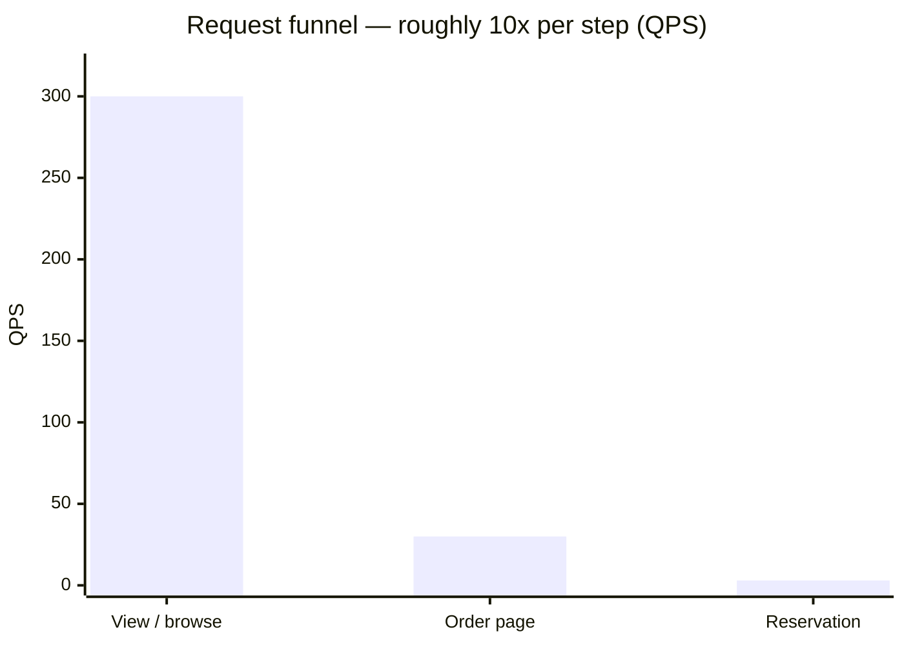
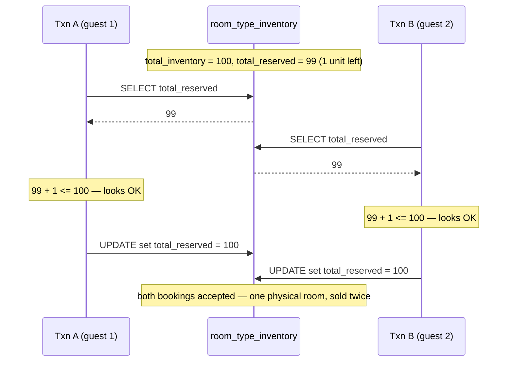
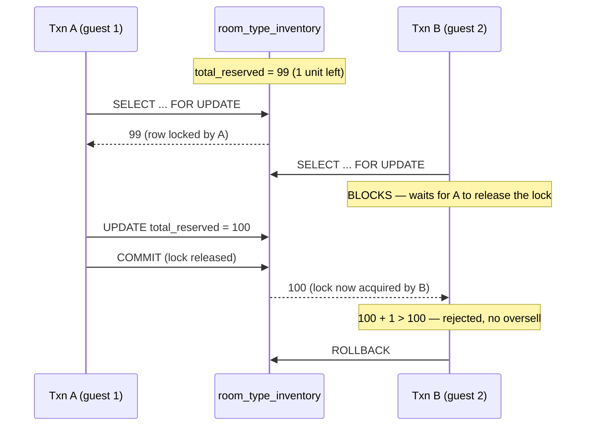
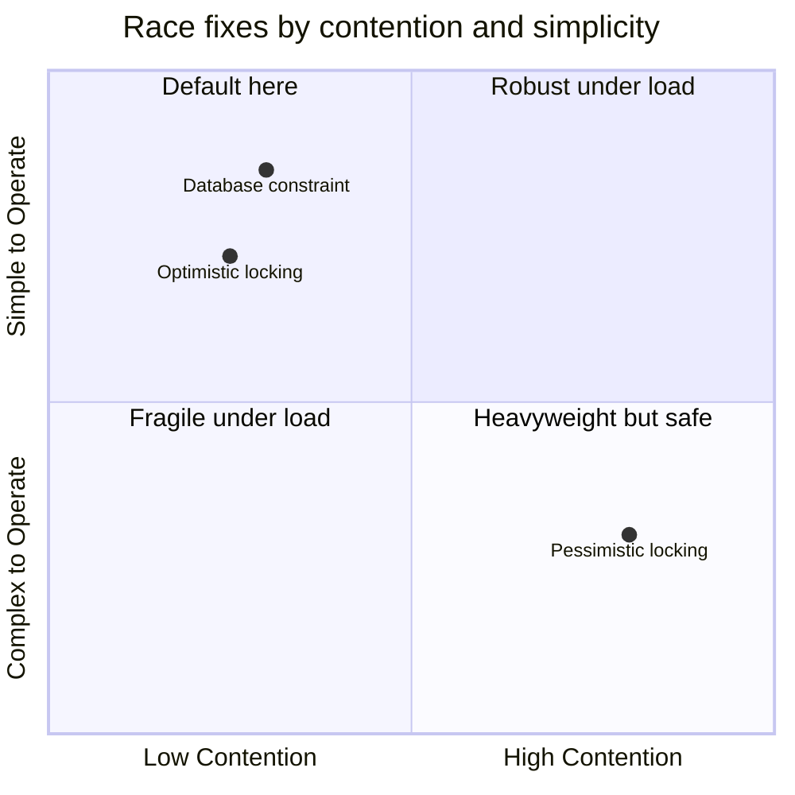

# Chapter 7: Hotel Reservation System

> Ch 7 of 13 · System Design Interview Vol 2 (Xu & Lam) · the concurrency-correctness chapter — double-booking is the boss fight; patterns transfer to ticketing and flight booking

## Chapter Map

We design the reservation backend for a large hotel chain (Marriott-scale: ~5,000 hotels,
~1,000,000 rooms). The surprise is that this is *not* a big-data problem — the write volume is
tiny (~3 reservations/second). It is a **correctness under concurrency** problem: the entire
chapter turns on one failure mode — selling the same room twice (or blowing past the overbooking
limit) when two guests race for the last unit. The design earns its keep by (1) modelling
inventory as one row *per room type per date* instead of per physical room, and (2) picking a
concurrency-control strategy (pessimistic lock, optimistic lock, or a database constraint) that
holds the invariant `total_reserved ≤ 110% × total_inventory` even under simultaneous writes.

**TL;DR:**
- **Book by room type, not room number.** Inventory lives in one `room_type_inventory` row per
  `(hotel_id, room_type_id, date)`; a reservation checks and increments `total_reserved` for every
  night of the stay. This is the schema decision the whole design hinges on.
- **Two concurrency bugs, distinct fixes.** A user double-clicking "Book" is solved by an
  **idempotent API keyed on `reservationID`**; two users racing for the last room is solved by
  **pessimistic locking, optimistic locking, or a DB constraint** — optimistic/constraint win here
  because contention (3 QPS) is low.
- **Scale is easy, consistency is hard.** Shard by `hotel_id` (every query carries it), cache
  inventory in Redis as an optimization — but the **database constraint stays the source of
  truth**. Across microservices (reservation vs payment), prefer keeping reservation+inventory in
  **one ACID service**; use a **saga** with compensating transactions only when you must cross a
  service boundary.

## The Big Question

> "Millions of rooms, but only three bookings a second — so why is this hard? Because the two
> bookings that land on the *same last room at the same millisecond* must not both succeed. How do
> I keep that invariant without turning the database into a single-threaded bottleneck?"

Analogy: a hotel reservation system is a **turnstile counter**, not a warehouse. Nobody cares how
many rooms exist in aggregate; they care that the count of reserved units for one room-type on one
night never exceeds the (over-booking-adjusted) capacity — and that two people pushing through the
turnstile in the same instant can't both be counted as the last one through. The book's arc is:
model the counter cleanly (room-type inventory), then defend the counter against races (locking /
constraints), then scale the counter out (sharding / caching) without ever letting the cache lie
about the count.

The book explicitly notes this design **generalizes**: the same "reserve limited inventory against
a date/time axis under contention" shape covers **Airbnb listings, airline seat/flight booking, and
movie-ticket booking**. Learn it once here.

---

## 7.1 Step 1 — Understand the Problem and Establish Design Scope

### Functional and non-functional requirements

The candidate clarifies scope with the interviewer. The agreed functional requirements:

- **Show the hotel-related page** (details, description, photos).
- **Show the hotel room-related detail page** — room types and prices for given dates.
- **Reserve a room.** The user books a **room type** (e.g. "King Deluxe"), *not* a specific room
  number. Which physical room they get is decided at check-in.
- **Admin panel** for hotel staff to add / remove / update hotel and room information.
- **Support the overbooking feature.** The hotel may deliberately sell **more rooms than it has**,
  up to **110% of capacity** (a 10% overbooking margin), because a predictable fraction of guests
  no-show or cancel. Selling exactly to capacity means empty (unpaid) rooms whenever anyone cancels.
- **Prices change** — room rates vary by date (weekends, seasons, demand). Rate is a function of
  `(hotel, room type, date)`, not a fixed number.
- **Reservations are cancellable.**

Non-functional requirements:

- **Support high concurrency.** During peak (a popular hotel, a holiday), many customers may try to
  book the **same room** at the same time. This is the crux of the whole design.
- **Moderate latency** — a reservation confirming in a second or two is fine; the user tolerates a
  short wait for a booking to be confirmed.

Explicitly **out of scope** to keep the interview focused: the money/payment flow internals are
touched only where they force a distributed-transaction decision (that is its own chapter, Ch 11).

### The overbooking rationale (the 10% / no-show framing)

Airlines and hotels overbook on purpose. If a hotel sells exactly 100 rooms and 3% of guests
no-show or cancel late, it runs at 97% paid occupancy on a sold-out night — leaving real revenue on
the table. By selling up to **110 rooms against 100 physical rooms**, expected no-shows absorb the
overage; on the rare night everyone shows up, the hotel "walks" the extra guests to a partner hotel
(a real cost, but cheaper than the chronic empty-room loss). The design must therefore treat the
capacity ceiling as **110% of `total_inventory`, not 100%** — this number shows up directly in the
availability check and in the database constraint later.

### Back-of-the-envelope estimation

Scale: **5,000 hotels, 1,000,000 rooms** total.

**Reservations per day** — walk the funnel:

```
rooms                         = 1,000,000
occupancy rate (assume)       = 70%   → 700,000 room-nights sold per night
average stay length (assume)  = 3 days
reservations per day          = 700,000 / 3  ≈ 233,000  ≈ 240,000 / day
```

**Reservations per second:**

```
seconds per day               ≈ 24 × 3600 = 86,400  ≈ 10^5
reservations per second       = 240,000 / 10^5  ≈ 3 reservations/second
```

So the *write* rate is only about **3 QPS** — trivially small. That is the key insight of the sizing
step: this is **not** a high-throughput write system. The engineering hardness is entirely
concurrency correctness on the hot rows, not raw volume.

**The 10x-per-step funnel.** Booking is the bottom of a conversion funnel; each step up is roughly
10x more traffic:

| Page | Rough QPS | Why 10x more than the step below |
|------|-----------|----------------------------------|
| **View** page (browse hotels / search) | ~300 | Most visitors only browse |
| **Order / detail** page (pick dates, room type) | ~30 | A fraction proceed to a specific room |
| **Reservation** (submit booking) | ~3 | A fraction of those actually book |

The read side (browsing) is ~100x the write side. That justifies a **CDN + cache** for the public
browsing path, while the write path (reservations) stays small and can afford a strongly consistent
RDBMS.



Caption: reservations are the narrow bottom of a 10x-per-step funnel — the read-heavy browse path
(~300 QPS) is served by CDN + cache, while the ~3 QPS write path can afford a strongly consistent
relational database.

---

## 7.2 Step 2 — Propose High-Level Design and Get Buy-In

### API design

RESTful CRUD, versioned under `/v1`. The endpoints group into hotels, rooms, and reservations.

**Hotel APIs (mostly admin):**

| Method | Endpoint | Purpose |
|--------|----------|---------|
| `GET` | `/v1/hotels/{id}` | Get detailed information about a hotel |
| `POST` | `/v1/hotels` | Add a new hotel (admin) |
| `PUT` | `/v1/hotels/{id}` | Update hotel information (admin) |
| `DELETE` | `/v1/hotels/{id}` | Delete a hotel (admin) |

**Room APIs:**

| Method | Endpoint | Purpose |
|--------|----------|---------|
| `GET` | `/v1/hotels/{id}/rooms/{id}` | Get detailed information about a room |
| `POST` | `/v1/hotels/{id}/rooms` | Add a room (admin) |
| `PUT` | `/v1/hotels/{id}/rooms/{id}` | Update room information (admin) |
| `DELETE` | `/v1/hotels/{id}/rooms/{id}` | Delete a room (admin) |

**Reservation APIs — the important ones:**

| Method | Endpoint | Purpose |
|--------|----------|---------|
| `GET` | `/v1/reservations` | Get the reservation history of the logged-in user |
| `GET` | `/v1/reservations/{id}` | Get detailed info about a reservation |
| `POST` | `/v1/reservations` | **Make a new reservation** |
| `DELETE` | `/v1/reservations/{id}` | Cancel a reservation |

The **`POST /v1/reservations`** body is the one to get right:

```json
{
  "startDate":     "2021-04-28",
  "endDate":       "2021-04-30",
  "hotelID":       "245",
  "roomTypeID":    "12345",
  "reservationID": "13422445"
}
```

`reservationID` is the **idempotency key**. It is generated by the **client** (or issued by a first
"start reservation" call) and sent with the booking request. Because the server treats
`reservationID` as a unique key, replaying the exact same request (the classic double-click) can
never create a second reservation — the second request is recognized and returns the first one's
result. This one field is the entire fix for concurrency problem #1 (see §7.3), which is why it is
promoted into the request contract from the start.

### Data model

**Why a relational database (RDBMS), not NoSQL.** The book reasons through it:

- **The read-to-write ratio is high but the writes are money + inventory.** ~3 write QPS is
  laughably small for any database; there's no write-scaling pressure forcing NoSQL.
- **ACID transactions are essential.** A reservation atomically (a) checks inventory, (b) increments
  `total_reserved`, and (c) records the reservation and (eventually) payment. Without
  atomicity/isolation you double-book. Relational databases give ACID out of the box; getting the
  same guarantees on most NoSQL stores is extra work.
- **The data is naturally relational and structured** (hotels have rooms have rates; reservations
  reference guests) — a clean fit for tables and foreign keys.

**First-cut schema (the naive version):**

```sql
-- hotel: one row per hotel
hotel(hotel_id PK, name, address, location)

-- room: one row per PHYSICAL room
room(room_id PK, room_type_id, floor, number, hotel_id FK, name, is_available)

-- room_type_rate: price per (hotel, room type, date) -- prices change daily
room_type_rate(hotel_id, date, room_type_id, rate, PRIMARY KEY(hotel_id, date, room_type_id))

-- reservation: one row per booking
reservation(reservation_id PK, hotel_id, room_type_id,
            start_date, end_date, status, guest_id)

-- guest
guest(guest_id PK, first_name, last_name, email)
```

`reservation.status` is an enum: **pending → paid → refunded / canceled / rejected**.

**The critical redesign: reserve by room type, not by room.** The naive instinct is to check
`room.is_available` and flip it. But guests book a *room type* for a *date range*, and
`is_available` is a single boolean with **no date dimension** — it cannot express "King Deluxe is
free April 1–3 but sold out April 4." The fix is a dedicated inventory table keyed on **(hotel,
room type, date)**:

```sql
-- room_type_inventory: ONE ROW PER room type PER date
room_type_inventory(
    hotel_id,
    room_type_id,
    date,
    total_inventory,   -- physical count of this room type in this hotel
    total_reserved,    -- how many are booked for this date
    PRIMARY KEY (hotel_id, room_type_id, date)
)
```

A booking for a 3-night stay touches **3 rows** (one per night). Availability for date `D` means:

```
total_reserved + rooms_requested  <=  total_inventory × 1.1     -- 110%, the overbooking ceiling
```

**Check-availability query** (read every night of the requested stay):

```sql
SELECT date, total_inventory, total_reserved
FROM room_type_inventory
WHERE room_type_id = ${roomTypeId}
  AND hotel_id     = ${hotelId}
  AND date BETWEEN ${startDate} AND ${endDate};
```

The application then verifies, for **every** returned date, that
`total_reserved + rooms_requested <= 1.1 * total_inventory`. If any single night fails, the whole
booking is rejected — you cannot sell nights 1–2 of a 3-night stay.

**Rows-per-table math** (does it fit in one database?):

```
hotels        = 5,000
room types    ≈ 20 per hotel
horizon       = 2 years ≈ 730 days
rows          = 5,000 × 20 × 730  ≈  73,000,000  ≈ 73 million rows
```

**~73M rows fits comfortably in a single relational database** — no sharding needed at this scale.
But the schema is deliberately **shard-ready**: `hotel_id` is part of the primary key of every hot
table, so it can become the shard key later (see §7.3 scalability) without a redesign.

### High-level design (microservices)

The system decomposes into services behind an **API gateway** (which does authentication, rate
limiting, and routing). The public browse traffic is fronted by a **CDN** (static assets, images)
and a **cache** (hotel/rate reads), because the read side is ~100x the write side.

The services:

| Service | Responsibility |
|---------|----------------|
| **Hotel Service** | Hotel + room metadata (details, photos, descriptions) — read-heavy |
| **Rate Service** | Room prices per `(hotel, room type, date)` — read-heavy |
| **Reservation Service** | The core: check availability, create/cancel reservations, own inventory |
| **Payment Service** | Charge the guest, refunds |
| **Hotel Management Service** | Admin operations (add/update hotels, rooms; view reservations) |

Services communicate **service-to-service over gRPC** (compact binary framing, HTTP/2 multiplexing,
strongly typed contracts — a good fit for internal east-west traffic), while clients hit the gateway
over REST/HTTPS.

```mermaid
flowchart LR
    classDef io      fill:#61afef,stroke:#2e86c1,color:#1a1a1a,font-weight:bold
    classDef frozen  fill:#c678dd,stroke:#9b59b6,color:#fff
    classDef train   fill:#98c379,stroke:#27ae60,color:#1a1a1a
    classDef mathOp  fill:#d19a66,stroke:#e67e22,color:#1a1a1a,font-weight:bold
    classDef lossN   fill:#e06c75,stroke:#c0392b,color:#fff,font-weight:bold
    classDef req     fill:#56b6c2,stroke:#0097a7,color:#1a1a1a
    classDef base    fill:#e5c07b,stroke:#f39c12,color:#1a1a1a

    Guest([Guest browser]) --> CDN([CDN static assets])
    Guest --> GW(["API Gateway<br/>auth · routing<br/>rate-limit"])
    Admin([Hotel staff]) --> GW
    GW --> HS(["Hotel Service"])
    GW --> RS(["Rate Service"])
    GW --> RES(["Reservation Service"])
    GW --> PS(["Payment Service"])
    GW --> HMS(["Hotel Mgmt Service"])
    RES -->|"gRPC"| PS
    HS --> CACHE([("Redis cache")])
    RS --> CACHE
    HS --> DB[("Reservation DB<br/>RDBMS")]
    RS --> DB
    RES --> DB
    PS --> DB
    HMS --> DB

    class Guest,Admin,CDN io
    class GW req
    class HS,RS,RES,PS,HMS train
    class CACHE frozen
    class DB base
```

Caption: read-heavy browsing (Hotel/Rate services) is absorbed by CDN + Redis, while the small-but-
critical write path funnels through the Reservation Service into an ACID RDBMS; internal calls use
gRPC. The Reservation Service owns inventory so the double-booking invariant lives in one place.

---

## 7.3 Step 3 — Design Deep Dive

### Improved data model — the exact reservation queries

Reserving a room is a two-step read-then-write against `room_type_inventory`, wrapped in a
transaction. Written out plainly:

```sql
-- Step 1: check availability for every night of the stay
SELECT date, total_inventory, total_reserved
FROM room_type_inventory
WHERE room_type_id = ${roomTypeId}
  AND hotel_id     = ${hotelId}
  AND date BETWEEN ${startDate} AND ${endDate};

-- Application checks, for EACH returned row:
--   total_reserved + ${rooms_requested} <= 1.1 * total_inventory
-- If any night fails the check, abort the whole booking.

-- Step 2: reserve (increment reserved count for every night)
UPDATE room_type_inventory
SET total_reserved = total_reserved + ${rooms_requested}
WHERE room_type_id = ${roomTypeId}
  AND hotel_id     = ${hotelId}
  AND date BETWEEN ${startDate} AND ${endDate};

-- ... plus INSERT into reservation(...) with status = 'pending'
```

This read-then-write pair is exactly the shape that races. If two transactions interleave between
Step 1 and Step 2, both can pass the check and both increment — the heart of the chapter, next.

### Concurrency — the chapter's heart

There are **two distinct concurrency problems**, and it is a common interview trap to conflate them.
They have different causes and different fixes.

#### Problem 1 — the same user clicks "Book" twice (double submission)

A guest impatiently double-clicks "Complete Booking," or the network retries a slow request. Without
protection, **two identical reservations** are created and the guest is charged twice.

**Fix A — client side:** disable / gray out the submit button after the first click. Necessary but
**not sufficient** — it does nothing about network retries, back-button resubmits, or a malicious
client. Never trust the client alone.

**Fix B — an idempotent API keyed on `reservationID`.** The `reservationID` in the POST body is
generated once (per booking attempt) and declared a **unique key** in the database. The server's
logic becomes idempotent:

- **First request:** `reservationID = 13422445` is not present → insert the reservation row, run the
  inventory update, commit, return `200 OK` with the reservation.
- **Second (duplicate) request:** same `reservationID = 13422445` arrives → the insert violates the
  **unique constraint** → the server catches it and **returns the already-created reservation**
  (the first request's result), rather than creating a second one.

The two-request walkthrough:

```
Request 1  POST /v1/reservations  reservationID=13422445
           → no row with that id → INSERT ok → 200 OK {reservation 13422445, status: pending}

Request 2  POST /v1/reservations  reservationID=13422445   (double-click / retry)
           → INSERT hits UNIQUE(reservation_id) violation
           → server returns the SAME reservation 13422445 (idempotent), NOT a new booking
```

The guest ends up with exactly one reservation regardless of how many times the button was clicked.
This is why `reservationID` was baked into the API contract in §7.2.

#### Problem 2 — two different users race for the last room (lost update / oversell)

Two guests, on two servers, both try to book the last available "King Deluxe" for the same night.
The interleaving:



Caption (broken): both transactions read `total_reserved = 99` before either writes, so both pass
the availability check and both commit — a classic **lost update / oversell** that snapshot
isolation alone does not prevent. This is the double-booking the whole chapter exists to stop.

There are **three** fixes. Because the contention here is genuinely low (~3 QPS system-wide, and only
a handful of transactions ever collide on one hot row), the book leans toward **optimistic locking or
the database constraint** — but all three are worth knowing, and the choice flips at high contention.

### Solution 1 — Pessimistic locking

Take an **exclusive lock** on the inventory rows before reading, so a second transaction must wait
until the first commits. In SQL, `SELECT ... FOR UPDATE`:

```sql
BEGIN;

-- lock the rows so no one else can read-for-update them until we commit
SELECT date, total_inventory, total_reserved
FROM room_type_inventory
WHERE room_type_id = ${roomTypeId}
  AND hotel_id     = ${hotelId}
  AND date BETWEEN ${startDate} AND ${endDate}
FOR UPDATE;

-- app checks 110% ceiling for every night; if ok:
UPDATE room_type_inventory
SET total_reserved = total_reserved + ${rooms_requested}
WHERE room_type_id = ${roomTypeId}
  AND hotel_id     = ${hotelId}
  AND date BETWEEN ${startDate} AND ${endDate};

COMMIT;
```

The fixed interleaving — B **blocks** until A commits, then sees the true count and is rejected:



Caption (fixed): the exclusive `FOR UPDATE` lock forces B to wait for A to commit, so B reads the
true post-A count (100), fails the ceiling check, and rolls back — the last room is sold exactly
once.

**Pros:** simple to reason about; strictly prevents the race; good when contention is genuinely
high (the winner is decided by the lock queue, not by retry storms).
**Cons:** **deadlock risk** (two transactions grabbing rows in different orders); **held locks hurt
throughput** — under load, transactions serialize behind the lock and latency spikes; does not
scale well; a stuck/slow transaction holding the lock stalls everyone behind it. The book does **not**
recommend it as the default here.

### Solution 2 — Optimistic locking

Assume conflicts are **rare** (true at 3 QPS). Don't lock; instead add a **`version` column**, read
it, and on write require the version to be unchanged. If someone else wrote in between, the update
affects **0 rows** → detect the conflict and **retry**.

```sql
-- read the current version along with the counts
SELECT total_inventory, total_reserved, version
FROM room_type_inventory
WHERE hotel_id = ${hotelId} AND room_type_id = ${roomTypeId}
  AND date BETWEEN ${startDate} AND ${endDate};

-- write ONLY if the version is still what we read (compare-and-set)
UPDATE room_type_inventory
SET total_reserved = total_reserved + ${rooms_requested},
    version        = version + 1
WHERE hotel_id = ${hotelId} AND room_type_id = ${roomTypeId}
  AND date BETWEEN ${startDate} AND ${endDate}
  AND version = ${oldVersion};

-- affected rows = 0  ->  someone else committed first  ->  conflict, retry from the read
```

**Pros:** no locks held → **better performance and scalability than pessimistic** when contention is
low, which is exactly this system's regime; deadlock-free. This is the book's **usual choice** for
the hotel system.
**Cons:** under **high contention** it degrades into a **retry/failure storm** — many transactions
read the same version, all but one fail the version check, and the losers retry repeatedly, wasting
work and hurting UX. Optimistic concurrency is only cheap while collisions are rare.

### Solution 3 — Database constraint

Push the invariant into the database as a **`CHECK` constraint** (or an equivalent trigger). The
database itself refuses any update that would violate the 110% ceiling:

```sql
-- enforce the overbooking ceiling at the storage layer
ALTER TABLE room_type_inventory
ADD CONSTRAINT check_reserved_ceiling
CHECK (total_reserved <= 1.1 * total_inventory);

-- the reserve is now just an increment; the DB rejects an over-ceiling write
UPDATE room_type_inventory
SET total_reserved = total_reserved + ${rooms_requested}
WHERE hotel_id = ${hotelId} AND room_type_id = ${roomTypeId}
  AND date BETWEEN ${startDate} AND ${endDate};
-- if this would push total_reserved past 1.1 * total_inventory, the DB throws
```

Because the increment and the check happen **atomically inside the database**, two racing updates
can't both slip past — the second to commit is rejected by the constraint.

**Pros:** **simple**; the invariant is enforced in exactly one place and can't be bypassed by a
buggy service; works well at low contention (like optimistic locking).
**Cons:** the **constraint logic now lives in the database**, outside application version control and
harder to change/observe; the **error surfaced to the app is ugly** (a low-level constraint-violation
exception you must map to a clean "no availability" response); and **not all databases support it
well** (some ignore `CHECK`, some can't express the arithmetic; you may fall back to a trigger). Like
optimistic locking, the book considers this a **recommended, low-overhead** option at this scale.

**Which to pick?** At ~3 QPS with rare collisions, **optimistic locking or the database constraint**
are the recommended defaults — no held locks, no deadlocks, and the retry/rejection cost is paid only
on the rare true conflict. Pessimistic locking becomes attractive only if a specific hot room-type on
a specific date sees genuinely heavy simultaneous contention.

### Scalability — what if it's Booking.com-scale

The single database and simple locking are fine at 5,000 hotels. Suppose the business grows to
Booking.com scale (millions of properties, orders-of-magnitude more traffic). Two levers:

**1. Shard the database by `hotel_id`.** Almost **every query carries `hotel_id`** — availability
checks, reservations, rates all filter on it — so it is a **clean shard key**: a booking touches
exactly one shard (no cross-shard transactions), and load spreads evenly across hotels.

```
suppose total reservation QPS grows to, say, 30,000 QPS
shards                        = 100
QPS per shard                 = 30,000 / 100  =  300 QPS per shard   ← easily handled
```

Sharding by `hotel_id` keeps each booking a **single-shard ACID transaction**, preserving the exact
locking/constraint logic above — the concurrency design does not change, it just runs per shard.

**2. Cache inventory in Redis.** The read-heavy availability lookups can hit a cache instead of the
DB:

```
key   = "{hotelID}_{roomTypeID}_{date}"
value = current available count (or total_reserved / total_inventory)
TTL   = short (seconds/minutes) so stale data expires
```

Writes use a **write-back / debounce** pattern: the reservation writes the DB (source of truth) and
the cache is updated/invalidated so subsequent reads are fast. **The crucial caveat: the cache is an
*optimization*, never the source of truth.** The **database constraint stays authoritative** — even
if the cache is momentarily stale and lets a request *through*, the DB's atomic check (constraint or
optimistic version) is what actually decides whether the booking commits. So a cache miss or
inconsistency can waste a round-trip but **cannot cause a real oversell**.

**Handling DB↔cache inconsistency.** Inventory in the cache lags the DB by the TTL / propagation
window. That is acceptable precisely because the DB has the final say: the cache may show a room as
available a beat after it sold out, the user proceeds, and the **DB rejects at commit** with a clean
"no longer available." The design tolerates a small stale window in the read path in exchange for
throughput, without ever tolerating a stale *decision* in the write path.

### Data consistency among microservices

Splitting into microservices reintroduces a hard problem: a booking spans the **Reservation
Service** (inventory) and the **Payment Service** (charging the card), and each may own its **own
database**. A single local ACID transaction can no longer cover "reserve the room AND take the
money." If the reservation commits but the payment fails (or vice versa), state diverges.

Two textbook approaches, per the book's brief tour:

- **Two-phase commit (2PC).** A coordinator drives a *prepare* then *commit* across both services'
  databases so they commit atomically. It gives strong consistency but is **synchronous and
  blocking** — every participant holds locks through the prepare phase, throughput drops, and a
  coordinator crash can leave participants stuck. Poor fit for scalable microservices.
- **Saga.** Model the booking as a **sequence of local transactions**, one per service, chained by
  events; if a later step fails, run **compensating transactions** to undo the earlier committed
  steps (e.g. payment fails → *compensate* by releasing the reserved inventory, i.e. decrement
  `total_reserved`). Sagas are **asynchronous and non-blocking** and scale well, at the cost of only
  **eventual** consistency and the effort of writing every compensating action.

**The pragmatic note the book emphasizes:** for a hotel system, **many companies simply keep
reservation and inventory together in ONE service and ONE database**, so the reserve-and-decrement
stays a single **local ACID transaction** — sidestepping distributed transactions entirely. The
cross-service problem then shrinks to just reservation ↔ payment, where a **saga with a
"release inventory" compensation** is the practical answer. Don't distribute a transaction you can
keep local.

---

## 7.4 Step 4 — Wrap Up

The hotel reservation system looks like a big-data problem and turns out to be a **concurrency-
correctness** problem. The write rate is tiny (~3 QPS), so the entire design budget goes to two
things: modelling inventory cleanly and defending it against races.

- **Model by room type per date** (`room_type_inventory`), not per physical room — the single schema
  decision that makes date-ranged availability and overbooking expressible.
- **Two concurrency bugs, two fixes:** an **idempotent API keyed on `reservationID`** kills
  double-submission; **pessimistic/optimistic locking or a DB constraint** kills the last-room race,
  with optimistic/constraint preferred at this low-contention scale.
- **Scale by sharding on `hotel_id`** (every query carries it) and **cache inventory in Redis as an
  optimization**, while the **DB constraint remains the source of truth**.
- **Prefer one ACID service** for reservation + inventory; reach for a **saga with compensating
  transactions** only across the payment boundary.

If more time remained, the book would extend to: a **data pipeline for prices** (dynamic pricing per
demand), supporting a **microservice deployment / observability** story, and handling **the money
flow** end-to-end (reconciliation, refunds on cancellation). The concurrency and inventory-modelling
patterns transfer directly to **movie-ticket booking, flight/airline seat reservation, and Airbnb**.

---

## Visual Intuition

The end-to-end booking flow, showing where **both** concurrency defenses sit: the idempotency-key
check (guards double-submission) and the constraint-guarded inventory update (guards the last-room
race), with payment run as a saga step.

```mermaid
flowchart LR
    classDef io      fill:#61afef,stroke:#2e86c1,color:#1a1a1a,font-weight:bold
    classDef frozen  fill:#c678dd,stroke:#9b59b6,color:#fff
    classDef train   fill:#98c379,stroke:#27ae60,color:#1a1a1a
    classDef mathOp  fill:#d19a66,stroke:#e67e22,color:#1a1a1a,font-weight:bold
    classDef lossN   fill:#e06c75,stroke:#c0392b,color:#fff,font-weight:bold
    classDef req     fill:#56b6c2,stroke:#0097a7,color:#1a1a1a
    classDef base    fill:#e5c07b,stroke:#f39c12,color:#1a1a1a

    browse([Browse hotels]) --> check{"Rooms<br/>available?"}
    check -->|no| full([Show sold out])
    check -->|yes| order([Order page<br/>pick room type + dates])
    order --> submit([POST reservation<br/>+ reservationID key])
    submit --> idem{"Idempotency key<br/>seen before?"}
    idem -->|yes| replay([Return stored<br/>reservation])
    idem -->|no| txn([BEGIN transaction])
    txn --> upd([UPDATE total_reserved<br/>guarded by constraint])
    upd --> ok{"Ceiling holds?<br/>reserved <= 110%"}
    ok -->|no| reject([Reject — no inventory])
    ok -->|yes| pay([Saga step: charge<br/>Payment Service via gRPC])
    pay --> done([status = paid])

    class browse,order,submit io
    class check,idem,ok mathOp
    class txn,upd train
    class pay,replay req
    class full,reject lossN
    class done base
```



Caption: the two concurrency defenses are visible as two guards on the write path — the idempotency
check (top diamond) short-circuits double submissions, and the constraint-guarded update (bottom
diamond) rejects the last-room race; payment runs as a compensatable saga step, not inside the
inventory transaction.

The three race fixes, positioned by **contention level** vs **operational simplicity** — the axis
that decides which one you pick:



Caption: at this system's low contention (~3 QPS), the database constraint and optimistic locking sit
in the simple/low-contention corner and are the recommended defaults; pessimistic locking earns its
operational cost (deadlocks, held locks) only when a hot row sees genuinely heavy simultaneous
booking.

---

## Key Concepts Glossary

- **Room type** — a category of interchangeable rooms (e.g. King Deluxe); guests book a type, not a
  specific room number.
- **`room_type_inventory`** — the central table: one row per `(hotel_id, room_type_id, date)` holding
  `total_inventory` and `total_reserved`.
- **`total_inventory`** — physical count of a room type in a hotel.
- **`total_reserved`** — how many of that room type are booked for a given date.
- **Overbooking** — deliberately selling above physical capacity (up to **110%**) to offset no-shows
  and cancellations.
- **Overbooking ceiling** — the invariant `total_reserved ≤ 1.1 × total_inventory` the design must
  preserve.
- **Availability check** — for every night of a stay, verify
  `total_reserved + rooms_requested ≤ 1.1 × total_inventory`.
- **Idempotency key (`reservationID`)** — a unique per-booking id that makes repeated identical
  POSTs create at most one reservation.
- **Idempotent API** — an endpoint where replaying the same request yields the same result and no
  duplicate side effect.
- **Double submission** — the same user submitting a booking twice (double-click / retry); solved by
  the idempotency key.
- **Lost update / oversell** — two transactions read the same count and both write, exceeding
  capacity; the last-room race.
- **Pessimistic locking** — lock rows before use (`SELECT ... FOR UPDATE`); others wait.
- **Optimistic locking** — no lock; a `version` column + compare-and-set detects conflicts and
  retries.
- **`version` column** — a counter incremented on each write, used to detect concurrent modification.
- **Database constraint (`CHECK`)** — the ceiling enforced atomically inside the database.
- **Deadlock** — two transactions each waiting on a lock the other holds; a pessimistic-locking
  hazard.
- **Sharding by `hotel_id`** — partitioning tables on the hotel id so each booking stays on one
  shard.
- **Inventory cache** — Redis keyed `hotelID_roomTypeID_date`; an optimization, not the source of
  truth.
- **Source of truth** — the authoritative store (the DB + its constraint), which the cache may lag
  but never overrides.
- **Two-phase commit (2PC)** — coordinator-driven prepare/commit across services; strong but
  blocking.
- **Saga** — a chain of local transactions with compensating transactions to undo on failure;
  eventual consistency.
- **Compensating transaction** — the undo action for a committed saga step (e.g. release reserved
  inventory).
- **gRPC** — the binary HTTP/2 RPC protocol used for internal service-to-service calls.

---

## Tradeoffs & Decision Tables

**The three concurrency-control strategies:**

| Strategy | Mechanism | Best when | Pros | Cons |
|----------|-----------|-----------|------|------|
| **Pessimistic locking** | `SELECT ... FOR UPDATE` holds an exclusive lock | Contention is high | Strictly prevents the race; simple mental model | Deadlocks; held locks throttle throughput; poor scaling |
| **Optimistic locking** | `version` column + compare-and-set, retry on conflict | Contention is **low** (this system) | No held locks; scales; deadlock-free | Retry/failure storm under high contention |
| **Database constraint** | `CHECK (total_reserved ≤ 1.1 × total_inventory)` | Contention is **low** (this system) | Simplest; invariant enforced in one place | Logic lives in DB (outside VCS); ugly errors; uneven DB support |

**Two ways to design inventory:**

| Design | Keyed on | Can express date-ranged availability? | Verdict |
|--------|----------|----------------------------------------|---------|
| `room.is_available` boolean | physical room | ✗ no date dimension | broken for real bookings |
| `room_type_inventory` row | `(hotel, room type, date)` | ✓ one row per night | the correct model |

**Cross-service consistency:**

| Approach | Consistency | Blocking? | Fit for hotel system |
|----------|-------------|-----------|----------------------|
| Keep reservation+inventory in one DB | Strong (local ACID) | No distributed txn | **Preferred** — sidesteps the problem |
| Two-phase commit (2PC) | Strong | Yes (holds locks through prepare) | Poor — doesn't scale |
| Saga + compensations | Eventual | No | Good for the payment boundary |

---

## Common Pitfalls / War Stories

- **Storing availability as a per-room boolean.** `room.is_available` has no date axis, so it cannot
  represent "free April 1–3, sold out April 4." Teams that start here rewrite the schema the moment
  they support date ranges. Model inventory per `(room type, date)` from day one.
- **Trusting client-side double-click prevention.** Graying out the button stops the obvious case but
  not network retries, back-button resubmits, or scripted clients — so duplicate reservations and
  double charges still slip through. The server-side idempotency key is the real fix.
- **Assuming the read-then-write is atomic.** The availability `SELECT` and the reserving `UPDATE`
  are two statements; without a lock, version check, or constraint, two transactions interleave
  between them and both oversell. This passes every low-concurrency test and corrupts inventory in
  production peaks — the classic write-skew-flavored booking bug.
- **Reaching for pessimistic locking by default.** `FOR UPDATE` everywhere invites deadlocks and
  serializes bookings behind held locks, tanking throughput — overkill at 3 QPS. Prefer optimistic
  locking or a DB constraint until a specific hot row proves it needs stronger medicine.
- **Treating the cache as the source of truth.** If the availability decision is made from a stale
  Redis value with no authoritative DB check behind it, two guests both "see" the last room and both
  book it. Keep the DB constraint authoritative; let the cache only accelerate reads.
- **Distributing a transaction you could keep local.** Splitting reservation and inventory into
  separate services/DBs forces a 2PC or saga where a single local ACID transaction would have done.
  Keep reservation+inventory together; distribute only across the genuine payment boundary.
- **Forgetting the compensating transaction.** In a saga, if payment fails after inventory was
  decremented and nothing releases the held room, the room silently leaks (stays "sold" but unpaid).
  Every forward saga step needs its explicit undo.

---

## Real-World Systems Referenced

Marriott and large hotel chains (the ~5,000-hotel / 1M-room scale); Booking.com (the hypothetical
scale-out target); airline booking, movie-ticket booking, and Airbnb (systems the same design
generalizes to); relational databases (MySQL, PostgreSQL) for the ACID reservation store; Redis for
the inventory cache; gRPC for internal service-to-service calls; API gateway and CDN for the
read-heavy browse path; the saga pattern (and 2PC) for cross-service consistency.

---

## Summary

The hotel reservation system is a lesson in seeing past scale to the real difficulty. Back-of-the-
envelope math gives ~240,000 reservations/day ≈ **3 write QPS** — negligible volume — while the
browse path is ~100x larger and is served by CDN + cache. The hard part is **correctness under
concurrency**. The enabling schema decision is to reserve **by room type per date**
(`room_type_inventory`, keyed `(hotel_id, room_type_id, date)` with `total_inventory` /
`total_reserved`), so availability is `total_reserved + requested ≤ 110% × total_inventory` and
overbooking is a first-class number. Two concurrency problems get two fixes: **double submission** is
neutralized by an **idempotent API keyed on `reservationID`** (a unique key, so replays return the
first result); the **last-room race** is neutralized by **pessimistic locking** (`FOR UPDATE`, simple
but deadlock-prone and throughput-limiting), **optimistic locking** (a `version` column and
compare-and-set, the low-contention default), or a **database constraint** (the ceiling enforced
atomically in the DB). Scaling out means **sharding by `hotel_id`** (every query carries it, so
bookings stay single-shard ACID) and **caching inventory in Redis** as a pure optimization while the
**DB constraint remains the source of truth**. Across microservices, the pragmatic move is to keep
reservation and inventory in **one ACID service**, using a **saga with compensating transactions**
only for the payment boundary. The whole pattern transfers to flights, movie tickets, and Airbnb.

---

## Interview Questions

**Q: Why is a hotel reservation system a concurrency problem rather than a big-data problem?**
Because the write volume is tiny — about 3 reservations per second — but two bookings for the last room must never both succeed. Back-of-envelope: 1M rooms × 70% occupancy / 3-day average stay ≈ 240,000 reservations/day ≈ 3 QPS. There is no write-throughput pressure; the entire engineering challenge is preventing double-booking and overbooking-limit violations when transactions race on the same hot inventory row.

**Q: What are the three ways to prevent two users from booking the last room, and which fits this system?**
Pessimistic locking, optimistic locking, and a database constraint. Pessimistic locking (`SELECT ... FOR UPDATE`) makes the second transaction wait but risks deadlocks and throttles throughput; optimistic locking uses a version column and retries on conflict; a database constraint (`CHECK total_reserved ≤ 1.1 × total_inventory`) rejects the over-ceiling write atomically. Because contention is low (~3 QPS), optimistic locking or the database constraint is preferred — no held locks, cost paid only on the rare real conflict.

**Q: How does an idempotency key stop a double-clicked "Book" from creating two reservations?**
The client-supplied `reservationID` is a unique key, so a replayed identical POST hits a unique-constraint violation instead of inserting a second row. The first request inserts the reservation and returns it; the duplicate request is detected and returns that same reservation rather than creating a new one. The guest ends up with exactly one booking no matter how many times the button is clicked or the request is retried.

**Q: Why does booking by room type instead of room number change the whole schema?**
Because availability must be tracked per date, which a per-room `is_available` boolean cannot express. Guests book a room type (e.g. King Deluxe) for a date range, so inventory is modeled as one `room_type_inventory` row per `(hotel_id, room_type_id, date)` with `total_inventory` and `total_reserved`. A boolean has no date dimension and can't say "free April 1–3 but sold out April 4," so the type+date table is the correct model.

**Q: What exactly is the availability-check condition, and how does the 110% overbooking limit enter it?**
For every night of the stay, the system requires `total_reserved + rooms_requested ≤ 1.1 × total_inventory`. The 1.1 factor is the 10% overbooking margin: the hotel deliberately sells up to 110% of physical capacity to offset no-shows and cancellations. If any single night fails the check the whole booking is rejected — you cannot sell only part of a multi-night stay.

**Q: Why is the last-room race a "lost update," and what makes it invisible in testing?**
Two transactions both read `total_reserved = 99` before either writes, both pass the check, and both increment — so one update is effectively lost and the room is oversold. It is invisible in low-concurrency testing because the two statements (SELECT then UPDATE) only interleave when transactions truly overlap on the same hot row, which happens at production peaks. That is why it slips past tests and corrupts inventory live.

**Q: What are the downsides of pessimistic locking here?**
It risks deadlocks and throttles throughput because transactions serialize behind held exclusive locks. `SELECT ... FOR UPDATE` blocks a second booking until the first commits, which is correct but costly: under load, bookings queue behind the lock, a slow transaction stalls everyone behind it, and grabbing rows in different orders can deadlock. At ~3 QPS this heavy machinery is overkill, so it is not the recommended default.

**Q: How does optimistic locking detect a conflict without holding any lock?**
It reads a `version` column, then updates only `WHERE version = oldVersion`, incrementing version — if someone else committed first, the update affects 0 rows and signals a conflict to retry. No locks are held, so it scales better and can't deadlock, which suits low contention. Its weakness is a retry/failure storm under high contention, when many transactions read the same version and all but one fail.

**Q: What is the tradeoff of enforcing the limit with a database constraint?**
A `CHECK (total_reserved ≤ 1.1 × total_inventory)` enforces the ceiling atomically in one place, but the logic lives in the database outside application version control, the raised error is a low-level exception you must map to a clean response, and not all databases support it well. Its strength is simplicity and that no service can bypass the invariant; like optimistic locking, it is a good low-overhead choice at this system's low contention.

**Q: Why choose a relational database over NoSQL for this system?**
Because reservations need ACID transactions over money and inventory, and the data is naturally relational. A booking must atomically check availability, increment `total_reserved`, and record the reservation — atomicity and isolation prevent double-booking. The write rate (~3 QPS) creates no scaling pressure that would force NoSQL, and RDBMS gives ACID and foreign keys out of the box, so it is the natural fit.

**Q: Why is `hotel_id` the natural shard key, and what does sharding by it preserve?**
Because almost every query — availability, reservation, rates — carries `hotel_id`, so it distributes load evenly and keeps each booking on a single shard. A single-shard booking stays a local ACID transaction, so the same locking/constraint logic works unchanged per shard with no cross-shard coordination. At, say, 30,000 QPS across 100 shards that is ~300 QPS per shard, easily handled.

**Q: If inventory is cached in Redis, how do you prevent the cache from causing an oversell?**
Keep the database constraint authoritative — the cache is only an optimization the DB overrides at commit. A stale cache may briefly show a sold-out room as available and let a request through, but the atomic DB check (constraint or version) rejects the actual booking, so no real oversell occurs. The cache (keyed `hotelID_roomTypeID_date`, short TTL) accelerates reads without ever making the final decision.

**Q: Why prefer keeping reservation and inventory in one service over a distributed transaction?**
Because it keeps reserve-and-decrement a single local ACID transaction, sidestepping the cost and fragility of 2PC or a saga. Splitting them across services and databases would force distributed coordination for what a local transaction handles cleanly. The genuine cross-service boundary is reservation ↔ payment, where a saga is appropriate — so distribute only there, not within inventory.

**Q: What is a saga and how does it apply to reservation plus payment?**
A saga is a chain of local transactions linked by events, with compensating transactions to undo earlier steps if a later one fails. If payment fails after inventory was decremented, a compensating transaction releases the held room by decrementing `total_reserved`. Sagas are asynchronous and non-blocking so they scale, at the cost of only eventual consistency and the effort of writing every compensating action.

**Q: Why is two-phase commit (2PC) a poor fit for a scalable microservice booking system?**
Because it is synchronous and blocking — every participant holds locks through the prepare phase, cutting throughput, and a coordinator crash can leave participants stuck. It does give strong cross-service atomicity, but the blocking behavior and coordinator dependency scale badly. For a hotel system the book prefers avoiding distributed transactions altogether (one ACID service) or using a saga at the payment boundary.

**Q: Walk through the reservation funnel numbers.**
The system sees roughly 300 QPS of browse traffic, 30 QPS of order-page traffic, and 3 QPS of actual reservations — about 10x fewer at each step down. Most visitors only browse, a fraction reach a specific room's order page, and a fraction of those actually book. The read side being ~100x the write side justifies a CDN plus cache on the browse path while the small write path uses a strongly consistent RDBMS.

**Q: How many rows does `room_type_inventory` hold, and does it fit in one database?**
About 73 million rows, which fits comfortably in a single relational database. The math: 5,000 hotels × ~20 room types × ~730 days (2 years) ≈ 73M rows. No sharding is needed at this scale, but making `hotel_id` part of every primary key keeps the schema shard-ready so it can partition later without redesign.

**Q: Why must the availability check pass for every night of a multi-night stay?**
Because a reservation touches one inventory row per night, and you cannot sell a partial stay. A 3-night booking reads three `room_type_inventory` rows and every one must satisfy `total_reserved + requested ≤ 1.1 × total_inventory`; if even one night is at the ceiling, the whole booking is rejected. Selling nights 1–2 of a 3-night request would leave the guest without a room on night 3.

**Q: Why does overbooking exist, and how is it bounded in the design?**
Overbooking sells above physical capacity — up to 110% — because a predictable fraction of guests no-show or cancel, so selling exactly to capacity leaves rooms empty and revenue lost. It is bounded by the invariant `total_reserved ≤ 1.1 × total_inventory`, enforced in the availability check and, in the constraint approach, by the database itself. On the rare night everyone shows up, the hotel "walks" the overflow to a partner hotel.

**Q: The client already disables the Book button after a click — why still need a server-side idempotency key?**
Because client-side prevention doesn't stop network retries, back-button resubmits, or scripted/malicious clients, so duplicate bookings and double charges can still occur. Graying out the button is a good UX measure but not a correctness guarantee. The server-side idempotency key (`reservationID` as a unique constraint) is what actually guarantees at most one reservation per attempt, regardless of client behavior.

**Q: How does this design generalize to other booking systems?**
The same "reserve limited inventory against a date/time axis under contention" shape covers airline seat booking, movie-ticket booking, and Airbnb. In each case you model inventory per unit-type per time slot, guard double-submission with an idempotency key, guard the last-unit race with locking or a constraint, and scale by sharding on the natural entity id. Learn the hotel case and the others are variations on it.

---

## Cross-links in this repo

- [hld/case_studies/design_hotel_reservation — the HLD deep-dive of this exact problem](../../../hld/case_studies/design_hotel_reservation.md)
- [database/concurrency_control_and_locking — MVCC, `SELECT FOR UPDATE`, deadlocks, optimistic vs pessimistic](../../../database/concurrency_control_and_locking/README.md)
- [hld/distributed_transactions — 2PC and saga / compensating transactions in depth](../../../hld/distributed_transactions/README.md)
- [book/DDIA Ch 7 Transactions — lost update, write skew, and the isolation levels behind these fixes](../../designing_data_intensive_applications/07_transactions/README.md)
- [Sibling: Ch 11 Payment System — expands the saga / charge-and-refund flow this chapter only touches](../11_payment_system/README.md)

## Further Reading

- Xu & Lam, System Design Interview Vol 2, Ch 7 — the original chapter and its references.
- Kleppmann, DDIA Ch 7 (Transactions) — the theory of lost update, write skew, and isolation levels underpinning the three race fixes.
- Garcia-Molina & Salem, "Sagas," 1987 — the original saga / compensating-transaction paper.
- The overbooking / revenue-management literature (airline yield management) — why selling above capacity is rational.
