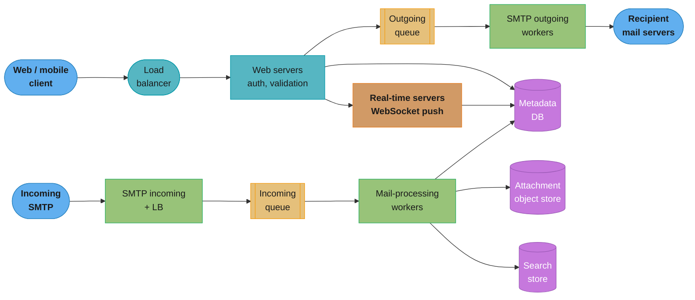
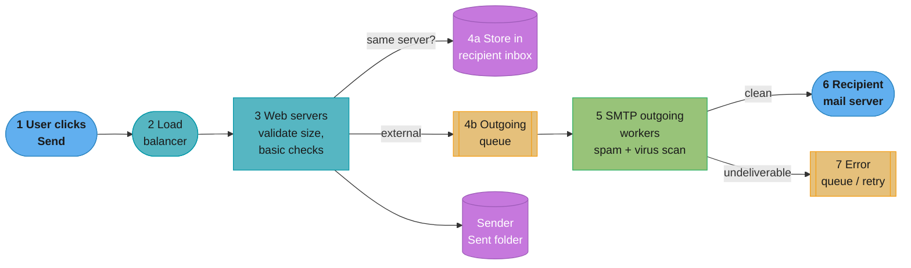
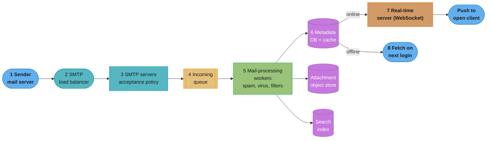
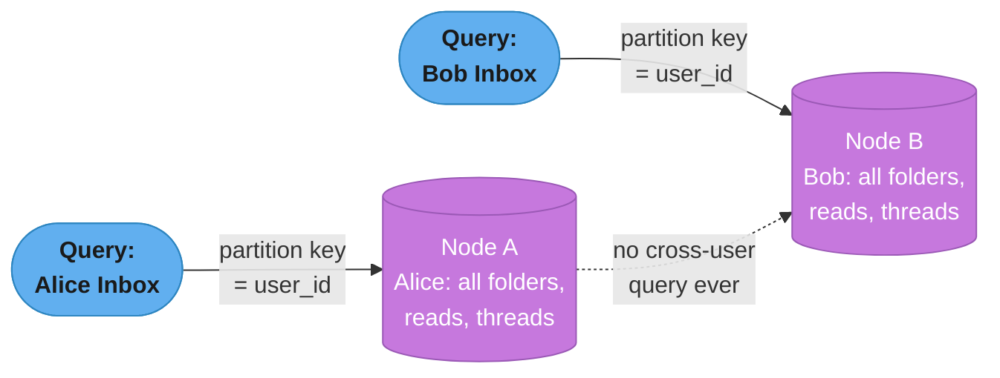
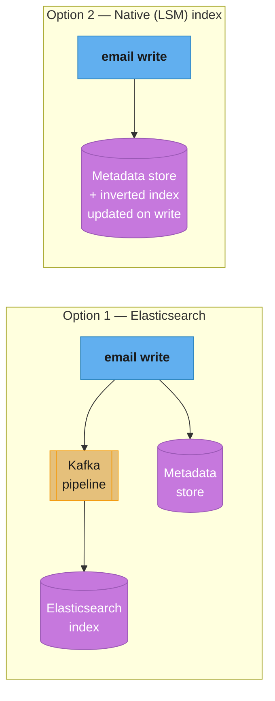
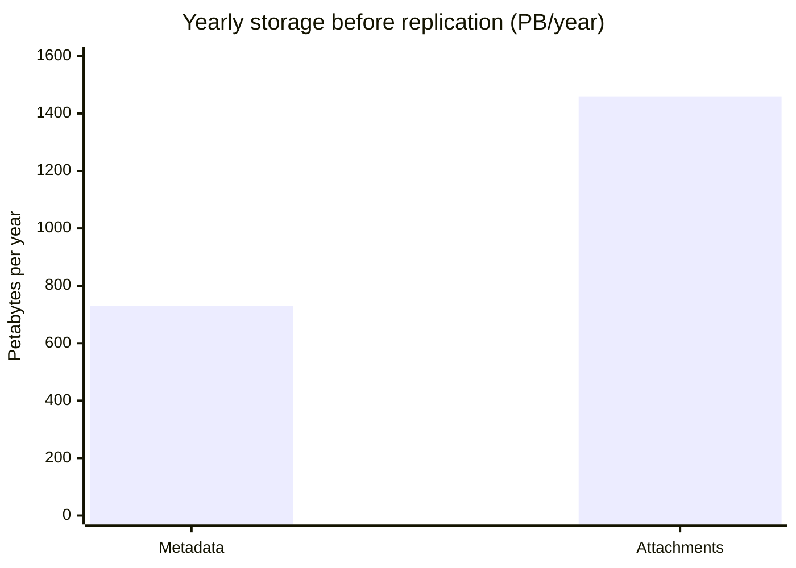
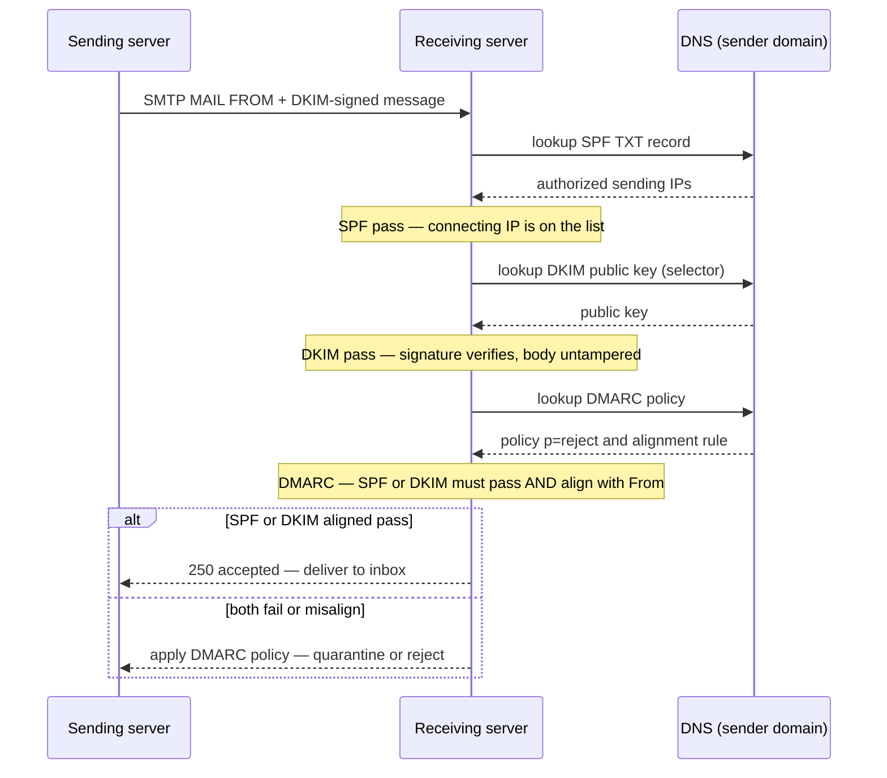
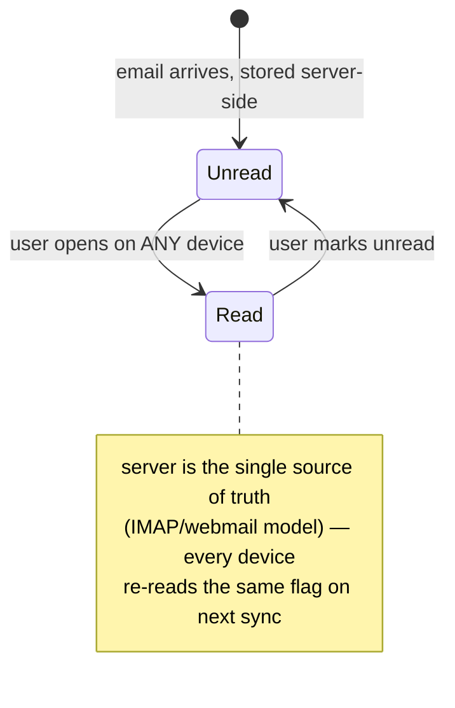

# Chapter 8: Distributed Email Service

> Ch 8 of 13 · System Design Interview Vol 2 (Xu & Lam) · a Gmail-scale product design — protocol legacy (SMTP/IMAP) meets modern distributed storage and search

## Chapter Map

Designing an email service at Gmail scale (1 billion users) is a rare interview problem where
you must respect **decades-old open protocols** (SMTP for sending, POP3/IMAP for retrieval) *and*
solve a **modern distributed-systems** problem (petabytes of metadata, exabyte-class attachment
storage, per-user search, anti-spam, real-time delivery). The chapter walks the standard 4-step
SDI framework, but its center of gravity is unusual: the back-of-envelope math shows that **storage,
not compute, is the monster** — attachments alone run ~1,460 PB/year — and the deep dive spends
most of its time on the two things that separate a toy mail server from a production one: a
**metadata store partitioned by user_id** and **email deliverability** (SPF/DKIM/DMARC, IP warm-up,
sender reputation).

**TL;DR:**
- **The estimate is dominated by storage.** 100K send QPS is easy; ~730 PB/year of metadata and
  ~1,460 PB/year of attachments is the real challenge — attachments get deduplicated by checksum.
- **Partition metadata by `user_id`.** A user only ever reads *their own* mail, so partitioning by
  user co-locates every query on one node — no scatter/gather. Use a distributed NoSQL wide-column
  store, denormalize per access pattern (by-folder, by-read-status).
- **Deliverability is the ops half of the problem.** Landing in the inbox (not spam) needs dedicated
  warmed-up IPs, sender reputation, and the SPF/DKIM/DMARC authentication triple — the classic
  interview gotcha (SPF = which IPs may send; DKIM = cryptographic signature; DMARC = policy tying
  the two together).
- **Two flows, decoupled by queues.** Sending: web tier → outgoing queue → SMTP workers (spam/virus
  *before* it leaves). Receiving: SMTP LB → incoming queue → processing workers → storage, then push
  to online clients over a long-lived WebSocket or wait for the next login sync.

## The Big Question

> "How do I build an inbox for a billion people on top of protocols designed in the 1980s for a few
> mainframes — where the data never stops arriving, must never be lost, and every user must be able
> to instantly search their own decade of mail?"

Analogy: a national postal system. SMTP is the standardized envelope-and-handoff format that lets
any post office deliver to any other; IMAP is the *P.O.-box* model where mail stays at the office
and you view it from any device; POP3 is the older *home-delivery-and-shred* model where the letter
leaves the office for good the moment it reaches one house. The distributed design problem is that
this single post office now serves a billion box-holders, so it can no longer keep each person's
letters in one physical drawer on one machine — it must shard the drawers, replicate them across
buildings, and still let each box-holder find one letter in a million instantly.

---

## 8.1 Step 1 — Understand the Problem and Establish Design Scope

Email is deceptively familiar, so the scoping questions matter: are we building a *webmail product*
(Gmail-like, own the whole stack) or a *transactional email API* (SendGrid-like)? The chapter builds
the full webmail product at Gmail scale, so the requirements are broad.

### Functional requirements

| Requirement | What it means |
|-------------|---------------|
| Authentication | Users log in from web, mobile, desktop |
| Send & receive email | The core flow, both directions |
| Fetch all emails | List a mailbox / folder, newest first |
| Folders | Inbox, Sent, Drafts, Trash, Spam, user-created labels |
| Attachments | Upload/download files with an email (MIME) |
| Search | Find email by subject, sender, or body text |
| Filter by read/unread | Show unread only, unread counts per folder |
| Anti-spam & anti-virus | Scan incoming mail, quarantine or drop |
| Multi-device | Same mailbox state (read status, folders) on every device |

The **multi-device** requirement is load-bearing: it is exactly why IMAP (server-side state) beats
POP3 (local download) and why the metadata store must be the single source of truth for read status.

### Non-functional requirements

- **Reliability** — never lose an email. Data must be durably stored and replicated; a dropped
  message is unacceptable for a mail product.
- **Availability** — the service degrades gracefully (a data-center failure should not take the
  mailbox offline).
- **Scalability** — performance must not degrade as users grow toward and past 1 billion.
- **Flexibility & extensibility** — email is old and full of edge cases; the design should absorb
  new protocols/features (calendar, chat, custom filters) without a rewrite.

### Back-of-the-envelope estimation

The chapter fixes the scale and then computes the two numbers that drive the design — send QPS and
storage. Reproduce the arithmetic step by step; the conclusion (storage dominates) is the whole point.

**Assumptions**
- **1 billion** users.
- Each person **sends 10** emails and **receives 40** emails per day (on average).
- Average email **metadata size ≈ 50 KB** (headers + body; a rich HTML body with inline styling is
  bigger than people expect).
- **20%** of emails carry an attachment; average attachment **≈ 500 KB**.

**Send QPS**

```
sent emails / day = 1e9 users × 10 emails = 1e10 emails/day
seconds per day    ≈ 1e5   (86,400 rounded up to 10^5 for a clean estimate)
send QPS           = 1e10 / 1e5 = 1e5 = 100,000 QPS
peak QPS           ≈ 2 × average ≈ 200,000 QPS
```

100K sustained / 200K peak send QPS is a *large* but unremarkable number — a horizontally scaled web
tier plus a message queue absorbs it easily. Compute is **not** the bottleneck.

**Metadata storage (per year)**

```
per day  = 1e9 users × 40 emails/day × 50 KB
         = 1e9 × 40 × 50e3 bytes
         = 2e15 bytes = 2 PB / day
per year = 2 PB/day × 365 ≈ 730 PB / year
```

**Attachment storage (per year)**

```
per day  = 1e9 users × 40 emails/day × 20% × 500 KB
         = 1e9 × 40 × 0.2 × 500e3 bytes
         = 4e15 bytes = 4 PB / day
per year = 4 PB/day × 365 ≈ 1,460 PB / year
```

**The conclusion — storage is the monster.**

```
metadata   ≈   730 PB / year
attachments ≈ 1,460 PB / year   (2× the metadata)
total      ≈ 2,190 PB / year ≈ ~2.2 EB / year   (before replication)
```

Attachments alone are **twice** the metadata, and neither number includes the ~3× multiplier for
replication. This single result reframes the whole design: the send/receive pipeline is standard
distributed plumbing, but the **object store for attachments** (with deduplication) and the
**metadata store** (partitioned so a user's data lives on one node) are where the design earns its
keep. When interviewers hear "email at Gmail scale," the answer they want first is *storage*, not QPS.

---

## 8.2 Step 2 — Propose High-Level Design and Get Buy-In

The chapter splits Step 2 in two: a compressed "email knowledge 101" (the protocol legacy you must
respect) and then the distributed high-level design with two explicit numbered flows.

### Email knowledge 101

#### Email protocols

There are two distinct jobs — **sending** (server-to-server hand-off) and **retrieval** (a client
pulling mail from its own server) — and different protocols own each.

**SMTP (Simple Mail Transfer Protocol) — sending.** SMTP is *the* standard for a client to submit
mail to its outgoing server and, crucially, for one mail server to relay mail to another. It is a
push protocol: the sender's server opens a connection to the recipient's server and hands off the
message. Every email that crosses organizational boundaries rides SMTP. It says nothing about how a
recipient later *reads* the mail from their own server — that is a separate protocol's job.

**Retrieval protocols — how a client reads its own mailbox:**

| Protocol | Model | Multi-device? | State lives | Verdict |
|----------|-------|:--:|-------------|---------|
| **POP3** (Post Office Protocol) | Download-and-delete | ✗ (single device) | On the client after download | Legacy; loses the mail-on-server benefit |
| **IMAP** (Internet Message Access Protocol) | Server-side state, download-on-open | ✓ | On the **server** | The multi-device default for standards-based clients |
| **HTTPS / webmail** | Proprietary API over HTTP(S) | ✓ | On the server | What Gmail/Outlook web actually use |

- **POP3** downloads new messages to one device and (by default) **deletes them from the server**.
  Once the mail lands on your laptop it is *gone* from the server, so your phone never sees it. POP3
  fits exactly one device and a "my mail is a local archive" mindset — a poor fit for a modern
  multi-device product.
- **IMAP** keeps every message on the **server** and downloads a copy only when you open it. Read
  status, folder placement, flags — all live server-side, so every device sees the same mailbox
  state. This server-authoritative model is precisely why IMAP, not POP3, is the multi-device
  default, and why our metadata store must be the single source of truth for read/unread status.
- **HTTPS / webmail.** Web clients don't speak IMAP; they call the provider's own **proprietary
  HTTP(S) API** (Gmail's API, Outlook Web). This is what Gmail *actually* does under the hood — IMAP
  is offered for interoperability with third-party clients, but the first-party web/mobile apps use
  a custom API that is far richer (search, conversation threading, push) than IMAP allows. The book
  also notes **Exchange ActiveSync (EAS)**, Microsoft's proprietary protocol for syncing mail,
  calendar, and contacts to mobile devices.

The takeaway: **SMTP for sending is non-negotiable** (it's how you talk to the rest of the world),
but retrieval is a product choice — and a Gmail-scale product uses a proprietary HTTPS API for its
own clients while still supporting IMAP/POP3 for interoperability.

#### Attachments

Email bodies are 7-bit ASCII by heritage, so binary files can't be sent raw. **MIME (Multipurpose
Internet Mail Extensions)** is the standard that lets an email carry multiple parts — HTML body,
plain-text body, and binary attachments — in one message. Binary attachments are **Base64-encoded**
to survive the text-only transport.

Base64 encodes every 3 bytes as 4 ASCII characters, so it **inflates size by ~33%** (plus line-break
overhead, pushing the practical inflation to **~37%**). A 500 KB file becomes ~685 KB on the wire.
This matters two ways: (1) advertised attachment limits (Gmail's 25 MB) are *encoded* sizes, so the
real file limit is smaller; (2) it is a strong reason to store the **decoded binary once in object
storage** rather than the base64 blob inline in the metadata store.

```
raw binary:   [ b0 b1 b2 ][ b3 b4 b5 ] ...        3 bytes  ->
base64 text:  [ c0 c1 c2 c3 ][ c4 c5 c6 c7 ] ...  4 chars      = +33% (+~37% with CRLF wrapping)
```

Caption: MIME + Base64 is why an attachment on the wire is ~37% larger than the file on disk — store
the decoded binary once in object storage, not the inflated base64 inside the metadata rows.

#### Traditional mail-server architecture (and why it dies at 1B users)

Classic UNIX mail servers (**sendmail**, later **Postfix**) stored each user's mail as **files on the
local disk** of a single machine — one file per mailbox (**mbox**, a single append-only file) or one
file per message (**Maildir**, a directory of message files). Simple, and fine for a department.

At 1 billion users this model collapses on every axis:

| File-per-user assumption | Why it breaks at scale |
|--------------------------|------------------------|
| Mail lives on one machine's local disk | No replication story — that machine's disk dies, the mailbox is gone (violates *reliability*) |
| Reads scan a directory / append a file | Disk **IO hotspots**: a heavy mailbox saturates one spindle; no way to spread load |
| Search = grep the files | No index; searching a decade of mail per query is impossible |
| Capacity = one server's disk | Cannot grow past a single machine; no horizontal scale |
| Failover = restore from backup | Slow, manual; no graceful degradation |

The lesson that motivates the entire rest of the chapter: **replace files-on-local-disk with a
distributed store** — metadata in a partitioned/replicated database, attachments in object storage,
and a proper search index — so the system gets replication, horizontal scale, and searchability that
the file model can never provide.

### Distributed high-level design

The high-level components:



Caption: the two halves are symmetric and both decoupled by a message queue — sending flows web →
outgoing queue → SMTP workers → the world; receiving flows the world → incoming queue → processing
workers → the three stores, then a real-time push to any online client.

Key components:
- **Web servers** — stateless; handle auth, request validation, and the read/list/search API for
  clients (over the proprietary HTTPS API).
- **Real-time servers** — hold long-lived **WebSocket** connections to online clients and push new
  mail the instant it arrives (this component cannot be stateless-load-balanced the same way; a
  connection is pinned to one server).
- **Metadata database** — headers, folder membership, read/unread flags, body pointers. The design's
  center of gravity (§8.3).
- **Attachment store** — object storage (S3-like) for the binary blobs, deduplicated by checksum.
- **Distributed cache** — caches recently accessed emails (recency is a strong access pattern).
- **Search store** — the inverted index for full-text search, per user.
- **Outgoing / incoming queues** — decouple the bursty, failure-prone SMTP hand-off from the
  latency-sensitive web tier.

#### Email sending flow



Caption: spam/virus scanning happens in the SMTP outgoing workers *before* the mail leaves the
system, and the outgoing queue absorbs downstream slowness — the user's Send returns fast while the
worker retries a temporarily unreachable recipient server via the error queue.

The numbered walkthrough:
1. A user composes an email in the webmail client and clicks **Send**; the client calls the web tier.
2. The **load balancer** spreads the request across web servers under the rate limit.
3. **Web servers** authenticate, validate the request (e.g., **email size** within limits), run basic
   checks, and store the email in the sender's **Sent** folder.
4. If the recipient is on the **same** mail server (rare at scale, common in a single-org install),
   the email is written straight to the recipient's inbox storage (4a). Otherwise it is enqueued on
   the **outgoing queue** (4b).
5. **SMTP outgoing workers** pull from the queue and — critically — run **spam and virus checks
   *before* the mail leaves the system** (you do not want your IPs sending malware; that destroys
   sender reputation). Clean mail proceeds.
6. The worker relays the email over **SMTP** to the recipient's mail server.
7. If the recipient server is temporarily down or the address bounces, the message goes to an
   **error queue** for **retry with backoff**; permanently undeliverable mail generates a bounce
   notification to the sender.

The queue is what lets Send feel instant: the web tier's job ends at "durably enqueued," and all the
slow, flaky server-to-server work happens asynchronously behind it.

#### Email receiving flow



Caption: after the mail-processing pipeline writes to the three stores, delivery forks on presence —
an online recipient gets an instant WebSocket push, an offline one simply has the mail waiting and
syncs it on next login.

The numbered walkthrough:
1. Incoming email arrives over **SMTP** from the sender's mail server.
2. An **SMTP load balancer** distributes connections across SMTP servers.
3. **SMTP servers** apply the **acceptance policy** (e.g., bounce if the mailbox is over quota or the
   sender is blocklisted).
4. Accepted mail is placed on the **incoming email queue**, decoupling acceptance from processing and
   absorbing bursts.
5. **Mail-processing workers** run the pipeline: **spam** classification, **virus** scanning, and
   **user filter rules** (move to a folder, apply a label, block a sender).
6. Processed mail is written to the **metadata DB** (and cache), with the binary in the **object
   store** and terms added to the **search index**.
7. If the recipient is **online**, the **real-time server** pushes the new email down the client's
   open **WebSocket / long-lived connection** for instant display.
8. If the recipient is **offline**, nothing special happens — the mail simply sits durably in
   storage and the client **fetches it on the next login** via the web-tier sync API.

---

## 8.3 Step 3 — Design Deep Dive

### Metadata database

The metadata store holds everything about an email *except* the attachment binary: headers (from,
to, cc, subject, date), the body (or a pointer to it), **folder/label membership**, **read/unread
flag**, thread/conversation id, and a **pointer to the attachment** blobs in object storage.

**The defining access pattern: a user only reads their own mail.** This is the single most important
observation for choosing the data model. Emails are *not* a social graph — there is no query that
joins across users, no "everyone who received this newsletter" fan-in at read time. Every read is
scoped to **one user_id**. Combined with the scale numbers, the store's requirements are:

1. **Huge storage capacity** — petabytes of metadata, growing 2 PB/day.
2. **High volume of small updates** — every "mark as read," every incoming email, every folder move
   is a tiny write; the workload is millions of small mutations, not big scans.
3. **Concurrent, reliable operations** — a user hits the mailbox from three devices at once; no lost
   updates to read status; durable.
4. **Easy incremental backup** — you must be able to back up petabytes without full re-copies.
5. **Strong consistency for a user's own mailbox** — read/unread counts and folder state must be
   correct and consistent *within one user's data* (seeing "3 unread" on your phone and "5 unread"
   on your laptop is a bug). Note this is per-user consistency, not global — no cross-user
   transaction is ever needed.

**Why not a single relational database?** A relational store gives you rich joins and multi-row
transactions you don't need here, and it does **not** scale to petabytes of small writes on a single
instance. You *can* shard a relational DB by user, but at that point you've given up cross-shard
joins anyway and are paying for machinery (foreign keys, complex query planner) the workload never
uses.

**Why not pure blob storage?** Object storage is perfect for the *attachments* (large, immutable,
read whole) but terrible for metadata: you need to query "unread emails in Inbox, newest first,"
update a read flag on one row, and maintain folder membership — none of which a blob store supports
efficiently. Metadata is structured, mutable, and queried; attachments are unstructured, immutable,
and streamed. **Split them.**

**The choice: a distributed NoSQL wide-column store, partitioned by `user_id`.** Partitioning by
user co-locates *all* of one user's mail on one partition (one node), so the common query —
"give me this user's Inbox" — is a single-partition read with **no scatter/gather** across the
cluster. This is the payoff of the single-user access pattern: the partition key falls straight out
of it. Cassandra-style column families fit the "many small writes, query by user, denormalize per
access pattern" workload exactly.

**Table designs (denormalize per access pattern).** Because you can't secondary-index your way out
of a wide-column store efficiently, you build one table per query shape, all partitioned by `user_id`:

Table 1 — **emails_by_user** (the canonical per-user email store):

| Column | Role |
|--------|------|
| `user_id` | **partition key** — co-locates a user's data |
| `email_id` | **clustering key** (time-ordered, e.g. a Snowflake-style id) |
| `from`, `to`, `subject`, `preview` | header fields |
| `body_pointer` | pointer to body blob (large bodies offloaded) |
| `attachment_pointers` | list of object-store keys |
| `read` | boolean read/unread flag |

Table 2 — **emails_by_folder** (list a folder, newest first):

| Column | Role |
|--------|------|
| `user_id` | **partition key** |
| `folder_id` | first **clustering key** — group by folder (Inbox, Sent, label X) |
| `timestamp` | second clustering key, **descending** — newest first, no sort at read time |
| `email_id` | reference into `emails_by_user` |

Reading "Inbox, newest first" becomes: `partition = user_id`, `clustering prefix = folder_id`, scan
in descending timestamp order — a single fast range read on one node.

**Read/unread handling — denormalization + the update flow.** "Show me unread email" and "unread
count per folder" are hot queries, so you don't scan the folder and filter — you **denormalize**.
Options the chapter surfaces:
- Keep a separate **emails_by_read** table (or a per-folder `unread` partition) so unread mail is a
  direct read, not a filter-scan.
- Maintain a per-folder **unread counter** updated on the write path.

The **read-status update flow** when a user opens an unread email: flip `read=true` in
`emails_by_user`, move the row out of the unread table / decrement the folder's unread counter, and —
because state lives on the **server** (the IMAP/webmail model) — every device re-reads the same
authoritative flag on its next sync. The strong-consistency-per-user requirement is exactly what
keeps the three devices agreeing.

**Conversation threading.** Gmail groups a reply chain into one conversation. This is implemented by
tagging each email with a **thread/conversation id** (derived from the RFC `Message-ID` /
`In-Reply-To` / `References` headers, or the normalized subject) and adding a table/clustering that
groups emails by `(user_id, thread_id)` so a thread is one partition-local read.



Caption: partitioning by user_id turns every mailbox query into a single-node read — Alice's entire
mailbox (folders, read flags, threads) lives on one partition, and no query ever spans two users.

**Broken → fix (partition key).** A tempting-but-wrong first cut is to partition the metadata table
by **`email_id`** (it's the unique key, so it feels natural). That spreads a single user's mail
uniformly across *every* node in the cluster, so "load my Inbox" becomes a **scatter/gather** that
fans out to hundreds of partitions and gathers the results — slow, and it hammers the whole cluster
for one mailbox open. The **fix** is to partition by **`user_id`** and use `email_id`/`timestamp` as
*clustering* keys within the partition: now the same query is one node, one range scan, ordered.
Choose the partition key from the *dominant access pattern*, never from "what's unique."

### Attachment storage

Attachments are large, immutable, and read as whole objects — the textbook profile for **object
storage (e.g., Amazon S3)** rather than a database. The metadata row stores only a **pointer** (the
object key); the binary lives in the object store.

**Deduplication by checksum.** The killer optimization: compute a **content hash (checksum, e.g.
SHA-256)** of each attachment and use it as the object key. When the *same* file is attached again —
a company-wide memo with a 5 MB PDF sent to **1,000 employees**, or a meme forwarded a thousand times
— every copy hashes to the same key, so the blob is **stored exactly once** and all 1,000 metadata
rows point at that one object. Given that attachments are the storage monster (~1,460 PB/year), dedup
is not a nice-to-have; on mail with heavy internal fan-out it can cut attachment storage dramatically.
Reference counting (or a garbage collector that deletes an object once no metadata row points to it)
handles deletion safely so one user deleting their copy doesn't yank the file out from under the
other 999.

```
forwarded 1,000×  ─────────────►  checksum(file) = 0xAB12…
   copy 1 ─┐
   copy 2 ─┤                       object store:  [ 0xAB12… : the 5 MB blob ]   ← stored ONCE
    ...    ├──── same hash ───►    metadata:      1,000 rows, each → key 0xAB12…
   copy N ─┘                                       (ref count = 1,000)
```

Caption: content-addressed storage means 1,000 identical attachments collapse to one stored blob and
1,000 lightweight pointers — the single biggest lever on the design's dominant cost.

### Email deliverability

The half of the problem that ops-minded interviewers love: even a perfectly built system fails its
users if its mail lands in the **spam folder**. Deliverability is about convincing the *receiving*
mail servers (Gmail, Outlook, Yahoo) that your mail is legitimate.

**Why new IPs land in spam — dedicated IPs and warm-up.** A brand-new sending IP has **no reputation**.
Receiving ISPs treat unknown IPs suspiciously — a fresh IP that suddenly blasts a million emails looks
exactly like a spammer, so the mail is throttled or spam-foldered. The fix is to send from
**dedicated IPs** (not shared with strangers whose spam would poison your reputation) and to
**warm them up**: start with a small daily volume and **ramp gradually** over days/weeks so ISPs
observe a steady, well-behaved sender and build positive reputation.

**Separate IPs by category.** Route **marketing** email (bulk, lower engagement, more spam complaints)
and **transactional** email (password resets, receipts — must always arrive) through **different IP
pools**, so a marketing campaign that draws spam complaints cannot drag down the reputation of the
IPs that deliver critical transactional mail.

**Sender reputation.** ISPs score each sending domain/IP on complaint rate, bounce rate, spam-trap
hits, and engagement (opens/clicks). High reputation → inbox; low → spam or outright rejection. Every
practice below exists to protect this score.

**Email authentication — the SPF / DKIM / DMARC triple.** These three DNS-based mechanisms let a
receiver verify that mail claiming to be from `yourdomain.com` really is. They are the single most
common email interview gotcha; know precisely what each *verifies*:

- **SPF (Sender Policy Framework)** — a DNS **TXT record** on the sender's domain that lists the
  **IP addresses / servers authorized to send** mail for that domain. The receiver looks up the SPF
  record and checks whether the connecting server's IP is on the list. SPF answers: *"Is this IP
  allowed to send for this domain?"* It authenticates the **envelope sending server**, not the
  message contents, and it breaks on forwarding (the forwarder's IP isn't in the original domain's
  SPF).
- **DKIM (DomainKeys Identified Mail)** — a **cryptographic signature**. The sender signs selected
  headers and the body with a **private key**; the corresponding **public key** is published in DNS.
  The receiver fetches the public key, verifies the signature, and thereby confirms the message
  **was not tampered with in transit** and genuinely originated from the signing domain. DKIM
  answers: *"Is this message intact and really signed by this domain?"* Unlike SPF, it survives
  forwarding because the signature travels with the message.
- **DMARC (Domain-based Message Authentication, Reporting & Conformance)** — a **policy** published in
  DNS that ties SPF and DKIM together. It tells receivers (1) require SPF **and/or** DKIM to pass and
  to **align** with the visible `From:` domain, and (2) **what to do on failure** — `none` (monitor
  only), `quarantine` (spam folder), or `reject` (bounce). DMARC also requests **aggregate reports**
  back to the domain owner. DMARC answers: *"If authentication fails, what should you do, and tell me
  about it."* It is the enforcement + reporting layer on top of the other two.

Mnemonic: **SPF = which servers may send · DKIM = signed and unmodified · DMARC = policy + reporting
tying them together.**

**Feedback loops (FBLs) with ISPs.** Major ISPs offer feedback loops: when a recipient clicks
"mark as spam," the ISP notifies the sender. A good sender **consumes these complaints and immediately
stops mailing** those recipients — ignoring them tanks your reputation.

**Ask users to whitelist you.** Prompting recipients to **add the sender to their address book /
contacts (whitelist)** is a strong positive signal to ISPs that raises deliverability.

**Greylisting.** A receiver-side anti-spam tactic worth naming: on first contact from an **unknown**
sender, the server **temporarily rejects** the message with a "try again later" (SMTP 4xx) response.
A legitimate mail server obeys the standard and **retries** a few minutes later (and is then let
through); many spam scripts fire once and never retry, so they're filtered out cheaply. The cost is a
small delivery delay on the first email from a new correspondent.

### Search

Email search is unusual: it's **per-user** (search only *your* mailbox — no global corpus, no
popularity ranking), results are typically ordered by **time**, and the write throughput is enormous
(every incoming email must be indexed). The chapter compares two approaches.

**Option 1 — Elasticsearch (a separate search system).** Elasticsearch is a mature, feature-rich
inverted-index engine: great relevance, faceting, fuzzy matching, tooling. The cost is that it is a
**separate system you must keep in sync** with the metadata store. You build an **indexing pipeline**
— typically stream email writes through **Kafka** into a consumer that indexes into Elasticsearch —
which introduces (a) operational burden (running and scaling a second stateful system), (b) **data
duplication** (the searchable fields live in both stores), and (c) **eventual consistency**: the index
lags the primary store, so a just-arrived email may not appear in search results for a short window
(**sync lag**).

**Option 2 — Native / custom search embedded in the metadata store.** Build the **inverted index
inside the primary store**, maintained **on the write path**. Modern stores use an **LSM-tree**
(log-structured merge-tree): writes append to an in-memory structure and flush to sorted immutable
segments, which is naturally suited to maintaining an index under a very high, write-heavy load. The
advantages are **no separate system to keep in sync**, **no duplication**, and **no sync lag** — an
email is searchable the moment it is stored (strong consistency between mail and its index). The cost
is **write-time overhead** (every write also updates the index) and that you must **build and operate
the search engine yourself** — which is exactly what Gmail-scale providers do, because at their scale
the operational cost of keeping a separate Elasticsearch cluster in sync across petabytes and the
sync-lag user experience are worse than owning the index.



Caption: Elasticsearch keeps a second system in sync through a Kafka pipeline (eventual-consistent,
duplicated, more ops), whereas the native LSM index lives in the primary store and is consistent the
instant a write lands — the trade is build-it-yourself vs sync-lag.

| Dimension | Elasticsearch (separate) | Native / embedded (LSM) |
|-----------|--------------------------|-------------------------|
| Sync with primary store | Pipeline (Kafka) required | None — same store |
| Consistency of index | **Eventual** (sync lag) | **Strong** (indexed on write) |
| Data duplication | Yes (fields in both) | No |
| Operational burden | Run/scale a 2nd system | One system, but you build search |
| Features out of the box | Rich (fuzzy, facets, relevance) | Whatever you implement |
| Write-path cost | Async, off the hot path | On the write path (every write indexes) |
| Best for | Small/medium scale, fast to ship | Gmail scale (what large providers do) |

### Scalability and availability

The scaling story reuses the partition key that fell out of the access pattern:

- **Partition metadata by `user_id`** — horizontal scale by adding nodes; each user's mail lives on
  one partition, so growth is linear and mailbox queries stay single-node.
- **Replicate across AZs / data centers** — every partition has replicas in multiple availability
  zones (and, for a mail product's reliability bar, multiple data centers). This is what turns the
  file-per-user model's single point of failure into a durable, highly available store.
- **Failover** — if a node or AZ fails, reads/writes route to a replica; because a user's data is a
  self-contained partition, failover is per-partition and does not require coordinating global state.
  For strong per-user consistency, one replica is the leader for a partition and writes go through it,
  with a leader election on failure.
- **Stateless web tier** — web servers hold no session state, so they scale by adding instances behind
  the load balancer; the **real-time (WebSocket) servers** are the exception — a connection pins to a
  server, so they need connection-aware routing and graceful reconnection on failover.
- **Object store & search** — object storage scales independently and is already multi-AZ; the search
  index is partitioned by user alongside the metadata (native option) or scaled as its own
  Elasticsearch cluster (separate option).

---

## 8.4 Step 4 — Wrap Up

The design is a Gmail-scale webmail product: a **stateless web tier** and **real-time WebSocket
servers** in front, **two message-queue-decoupled pipelines** for send and receive (with spam/virus
scanning *before* mail leaves and *as* it arrives), a **metadata store partitioned by `user_id`** with
denormalized tables per access pattern, an **object store with checksum deduplication** for
attachments, a **per-user search index** (native LSM at the largest scale, Elasticsearch for smaller
deployments), and an **email-deliverability** discipline (dedicated warmed-up IPs, sender reputation,
SPF/DKIM/DMARC, feedback loops) that determines whether the mail actually reaches inboxes.

If time remains, strong follow-up talking points:
- **Fault tolerance** — replica placement, retry/error queues, idempotent processing so a re-delivered
  SMTP message isn't stored twice.
- **Compliance & privacy** — GDPR/data-residency (which region a user's partition lives in), retention
  policies, legal hold, and the "right to be forgotten" interacting with attachment dedup ref counts.
- **Security** — TLS for SMTP (STARTTLS) and client connections, encryption at rest for the metadata
  and object stores, and virus/malware scanning as a first-class pipeline stage.
- **Performance** — caching recent emails (recency access pattern), CDN for attachment downloads,
  pagination of large mailboxes.
- **Protocol evolution** — supporting IMAP/POP3 for third-party clients while the first-party apps use
  the richer proprietary HTTPS API; ActiveSync for mobile sync.

The one-sentence takeaway an interviewer should hear: **email at a billion users is a storage and
deliverability problem wearing a protocol-compatibility costume** — get the `user_id` partitioning,
attachment dedup, and SPF/DKIM/DMARC right and the rest is standard distributed plumbing.

---

## Visual Intuition

**Storage is the monster — metadata vs attachments (per year).**



Caption: the estimate's whole punchline in one chart — attachments (~1,460 PB/year) are twice the
metadata (~730 PB/year), and neither counts the ~3× replication multiplier, which is why attachment
object storage with checksum dedup is the design's most important cost lever.

**The SPF / DKIM / DMARC verification handshake.**



Caption: all three checks are DNS lookups against the *sender's* domain — SPF validates the sending
IP, DKIM validates the signature/integrity, and DMARC decides what happens (and reports back) if the
first two fail or don't align with the visible `From:` address.

**Read/unread state is server-authoritative across devices.**



Caption: because read status lives on the server (the IMAP/webmail model, not POP3's local copy),
opening a mail on the phone flips one authoritative flag and the laptop sees it read on next sync —
this is why the metadata store needs strong *per-user* consistency.

---

## Key Concepts Glossary

- **SMTP (Simple Mail Transfer Protocol)** — standard for sending/relaying mail server-to-server.
- **POP3 (Post Office Protocol)** — download-and-delete retrieval; single-device; state on client.
- **IMAP (Internet Message Access Protocol)** — server-side-state retrieval; multi-device default.
- **HTTPS / webmail API** — proprietary HTTP API first-party clients use (what Gmail actually does).
- **Exchange ActiveSync (EAS)** — Microsoft's proprietary mail/calendar/contacts sync protocol.
- **MIME (Multipurpose Internet Mail Extensions)** — multi-part email format carrying HTML + binary.
- **Base64** — text encoding for binary attachments; inflates size ~33% (~37% with line wrapping).
- **mbox / Maildir** — traditional single-file / file-per-message mailbox storage on local disk.
- **Metadata database** — headers, folders, read flags, body/attachment pointers; partitioned by user.
- **Partition by user_id** — partition key from the single-user access pattern; single-node mailbox reads.
- **emails_by_user / emails_by_folder** — denormalized per-access-pattern tables in the wide-column store.
- **Read/unread flag** — server-authoritative boolean; denormalized for fast unread queries/counts.
- **Conversation threading** — grouping a reply chain by thread id (from Message-ID/In-Reply-To/References).
- **Object storage** — S3-like store for large immutable attachment binaries (pointers held in metadata).
- **Deduplication by checksum** — hash-keyed attachment storage; identical files stored once, ref-counted.
- **Outgoing / incoming queue** — message queues decoupling the web/SMTP tiers from slow relay work.
- **Error queue** — holds undeliverable outgoing mail for retry with backoff.
- **Real-time server / WebSocket** — long-lived client connection for instant push of new mail.
- **Email deliverability** — the discipline of landing in the inbox rather than the spam folder.
- **Dedicated IP / IP warm-up** — private sending IPs whose volume is ramped gradually to build reputation.
- **Sender reputation** — ISP score (complaints, bounces, engagement) that gates inbox placement.
- **SPF (Sender Policy Framework)** — DNS TXT record listing IPs authorized to send for a domain.
- **DKIM (DomainKeys Identified Mail)** — DNS-published public-key signature proving integrity/origin.
- **DMARC** — DNS policy tying SPF+DKIM together, defining failure handling (none/quarantine/reject) + reports.
- **Feedback loop (FBL)** — ISP notifies sender of spam complaints so the sender stops mailing them.
- **Greylisting** — temporarily rejecting unknown senders; legit servers retry, many spammers don't.
- **Elasticsearch (search option)** — separate inverted-index system kept in sync via a pipeline (Kafka); eventual.
- **Native/embedded search (LSM index)** — inverted index maintained in the primary store on the write path.
- **LSM-tree (log-structured merge-tree)** — write-optimized structure suited to high-throughput indexing.

---

## Tradeoffs & Decision Tables

**Retrieval protocol choice**

| | POP3 | IMAP | HTTPS / proprietary API |
|--|------|------|------------------------|
| Multi-device sync | ✗ | ✓ | ✓ |
| State location | Client | Server | Server |
| Feature richness | Low | Medium | High (search, threads, push) |
| Interop with 3rd-party clients | ✓ | ✓ | ✗ (custom) |
| Fit for Gmail-scale first-party app | ✗ | Partial | ✓ |

**Storage engine per data type**

| Data | Profile | Store | Why |
|------|---------|-------|-----|
| Metadata | Structured, mutable, queried, tiny writes | Distributed NoSQL (wide-column), partitioned by user | Scale + single-node mailbox queries |
| Attachments | Large, immutable, whole-object reads | Object storage (S3-like) + checksum dedup | Cheap, scalable, dedup cuts the dominant cost |
| Search index | Inverted index, per user, write-heavy | Native LSM (huge scale) or Elasticsearch (smaller) | Consistency vs build-vs-buy trade |

**Search: Elasticsearch vs native**

| | Elasticsearch | Native (LSM in primary store) |
|--|--------------|-------------------------------|
| Consistency | Eventual (sync lag) | Strong (indexed on write) |
| Extra system to run | Yes | No |
| Data duplicated | Yes | No |
| Effort | Low (buy) | High (build) |
| Chosen by | Small/medium deployments | Gmail-scale providers |

**Email authentication triple**

| | Verifies | Mechanism | Survives forwarding? |
|--|----------|-----------|:--:|
| SPF | Which IPs may send for the domain | DNS TXT list of IPs | ✗ (forwarder IP not listed) |
| DKIM | Message integrity + signing domain | DNS public-key signature | ✓ (signature travels with message) |
| DMARC | What to do on failure + reporting | DNS policy (none/quarantine/reject) + alignment | n/a (policy layer) |

---

## Common Pitfalls / War Stories

- **Partitioning metadata by `email_id` instead of `user_id`.** Feels natural (email_id is unique) but
  scatters one user's mail across the whole cluster, turning every mailbox open into a scatter/gather.
  Partition by `user_id`; cluster by `email_id`/`timestamp` inside the partition.
- **Storing attachments inline in the metadata rows (as base64).** Blows up row sizes ~37%, wastes
  petabytes on duplicates, and makes the write-heavy metadata store slow. Put binaries in object
  storage, keyed by checksum, and hold only a pointer in metadata.
- **Confusing SPF/DKIM/DMARC in the interview.** The classic gotcha. SPF = *which IPs may send*
  (envelope), DKIM = *cryptographic signature proving integrity/origin*, DMARC = *policy + reporting
  tying them together and deciding failure handling*. Mixing these up is the fastest way to look shaky.
- **Sending production email from a brand-new, cold IP at full volume.** No reputation → ISPs
  spam-folder or throttle it. You must warm up dedicated IPs gradually and separate marketing from
  transactional pools so a campaign's complaints can't sink your password-reset deliverability.
- **Skipping the queue and calling SMTP relay synchronously from the web tier.** A single slow/unreachable
  recipient server then stalls the user's Send. Decouple with an outgoing queue + error queue so Send
  returns on "durably enqueued" and retries happen asynchronously.
- **Running spam/virus checks only on receive, not on send.** If your own workers relay malware
  outbound, your IPs' reputation is destroyed and every user's mail starts landing in spam. Scan
  *before* mail leaves the system as well as when it arrives.
- **Treating search as free by bolting on Elasticsearch and forgetting the sync.** The index lags
  behind the store, so just-arrived mail is unsearchable for a window, and you now operate a second
  stateful petabyte system. At the largest scale a native write-path index avoids both.
- **Load-balancing WebSocket real-time servers like stateless web servers.** A push connection is
  pinned to one server; naive round-robin breaks delivery. Use connection-aware routing and graceful
  reconnect on failover.
- **Ignoring ISP feedback loops.** If you keep mailing recipients who clicked "mark as spam," your
  reputation craters. Consume FBLs and suppress complainers immediately.

---

## Real-World Systems Referenced

Gmail (proprietary HTTPS API for first-party clients, IMAP/POP3 for interoperability, native
Gmail-scale search); Microsoft Outlook / Exchange (Exchange ActiveSync); sendmail and Postfix
(traditional mbox/Maildir file-per-user mail servers); Amazon S3-class object storage (attachment
blobs); Cassandra-style distributed wide-column NoSQL (metadata, partition-by-user); Elasticsearch +
Apache Kafka (the separate-search-system indexing pipeline); SPF/DKIM/DMARC as the standard email
authentication stack enforced by all major ISPs.

---

## Summary

An email service for a billion users is, first and foremost, a **storage problem**: the back-of-envelope
math yields a manageable ~100K send QPS but ~730 PB/year of metadata and ~1,460 PB/year of attachments,
so the design lives or dies on how it stores data. The chapter respects email's **protocol legacy** —
**SMTP** to send, **IMAP** (server-side, multi-device) over **POP3** (download-and-delete) to retrieve,
and a **proprietary HTTPS API** for first-party clients — and replaces the doomed **file-per-user**
mail-server model with a distributed stack. Two queue-decoupled pipelines move mail: **sending**
(web tier → outgoing queue → SMTP workers that spam/virus-scan *before* relay, with an error queue for
retries) and **receiving** (SMTP LB → incoming queue → processing workers → stores, then a **WebSocket**
push to online clients or a login-time sync for offline ones). The **metadata store is partitioned by
`user_id`** — the partition key that falls straight out of the single-user access pattern — in a
distributed NoSQL wide-column store with **denormalized per-access-pattern tables** (by-folder,
by-read-status) and **server-authoritative read flags**. **Attachments** go to **object storage,
deduplicated by checksum** so a file forwarded to a thousand people is stored once. **Search** is
either a separate **Elasticsearch** cluster (eventual-consistent, Kafka-synced, more ops) or a
**native LSM inverted index** in the primary store (strong-consistent, what Gmail-scale providers
build). And **deliverability** — dedicated warmed-up IPs, sender reputation, feedback loops, and the
**SPF/DKIM/DMARC** authentication triple — decides whether all that engineering actually lands in the
inbox.

---

## Interview Questions

**Q: What is the difference between POP3 and IMAP, and why does a multi-device email product use IMAP?**
POP3 downloads messages to one device and deletes them from the server, so state lives on the client and other devices never see that mail; IMAP keeps every message and all state (read flags, folders) on the server and downloads only on open. Because the server is authoritative, IMAP shows the same mailbox on phone, laptop, and web — exactly what a multi-device product needs. POP3 suits a single device treating mail as a local archive. This server-side-state model is also why the metadata store must be the single source of truth for read/unread status.

**Q: What do SPF, DKIM, and DMARC each verify?**
SPF checks whether the sending server's IP is authorized to send for the domain, via a DNS TXT record listing allowed IPs. DKIM is a cryptographic signature: the sender signs with a private key and the receiver verifies with a DNS-published public key, proving the message wasn't tampered with and really came from the domain. DMARC is a DNS policy that ties SPF and DKIM together, requires them to align with the visible From address, and tells the receiver what to do on failure (none, quarantine, or reject) plus requests reports. Mnemonic: SPF = which servers may send, DKIM = signed and unmodified, DMARC = policy plus reporting.

**Q: Why partition the metadata database by user_id rather than by email_id?**
Because a user only ever reads their own mail, partitioning by user_id co-locates a user's entire mailbox on one node, so "load my Inbox" is a single-partition read with no scatter/gather. Partitioning by email_id (the unique key) instead spreads one user's mail across every node, turning each mailbox open into a fan-out to hundreds of partitions. The rule is to pick the partition key from the dominant access pattern, not from what happens to be unique; email_id and timestamp become clustering keys within the partition.

**Q: How are attachments stored, and how does deduplication work?**
Attachments go into object storage (S3-like) and the metadata row holds only a pointer, because attachments are large, immutable, whole-object reads. Deduplication uses the content checksum (e.g. SHA-256) as the object key, so identical files map to the same key and are stored exactly once. A 5 MB memo emailed to 1,000 employees is one stored blob with 1,000 pointers, and reference counting ensures deleting one copy doesn't remove the shared object. Since attachments are the storage monster (~1,460 PB/year), dedup is the biggest cost lever in the design.

**Q: When should you use Elasticsearch versus a native embedded search index for email?**
Use Elasticsearch for small-to-medium deployments where fast delivery and rich features matter, accepting that it's a separate system kept in sync via a pipeline (often Kafka), which means data duplication, extra ops, and eventual consistency where the index lags the store. Use a native LSM-tree index inside the primary store at Gmail scale, where you want strong consistency (mail is searchable the instant it's stored), no second system to sync, and no duplication, at the cost of building the search engine yourself and paying index maintenance on the write path. Large providers choose native for exactly these reasons.

**Q: Why is storage, not QPS, the dominant challenge in an email service, and what are the numbers?**
Because compute is easy and storage is enormous: 1B users sending 10 emails/day is only ~100K QPS, but 40 emails/user/day at ~50 KB metadata is ~730 PB/year, and 20% of emails carrying ~500 KB attachments is ~4 PB/day or ~1,460 PB/year. Attachments alone are twice the metadata, and neither figure includes the ~3× replication multiplier. So the design centers on attachment object storage with dedup and a partitioned metadata store, not on handling send QPS.

**Q: Why is a message queue placed between the web tier and the SMTP relay workers?**
To decouple the latency-sensitive user Send from the slow, failure-prone server-to-server relay. The web tier's job ends when the email is durably enqueued on the outgoing queue, so Send returns fast; SMTP outgoing workers then pull from the queue, scan for spam/virus, and relay, retrying temporarily unreachable recipient servers via an error queue with backoff. Without the queue, one slow recipient server would stall the user's request. The incoming side mirrors this with an incoming queue that absorbs bursts before processing.

**Q: How does a recipient get an email in real time versus when offline?**
If the recipient is online, a real-time server holding their long-lived WebSocket connection pushes the new email down instantly after it's processed and stored. If they're offline, nothing special happens: the email sits durably in the metadata store and object store, and their client fetches it on the next login through the web-tier sync API. This split keeps push cheap (only for open connections) while guaranteeing offline users lose nothing.

**Q: Why does Base64 encoding of attachments matter for the design?**
Base64 encodes 3 binary bytes as 4 ASCII characters, inflating size ~33% (about 37% with line-wrapping), because email transport is historically text-only and binaries ride inside MIME parts. This means advertised limits like Gmail's 25 MB are encoded sizes, so the real file limit is smaller, and it's a strong reason to store the decoded binary once in object storage rather than the inflated base64 blob inline in metadata rows. Inline base64 would bloat the write-heavy metadata store and waste petabytes on duplicates.

**Q: Why does the traditional file-per-user mail server model (mbox/Maildir) fail at 1 billion users?**
Because storing each mailbox as files on one machine's local disk has no replication (that disk dies, the mailbox is gone), creates IO hotspots (a heavy mailbox saturates one spindle with no way to spread load), offers no search (you'd have to grep the files), and can't scale past a single server's capacity. It also has slow, manual failover. The fix is a distributed stack: partitioned/replicated metadata database, object storage for attachments, and a proper search index, giving replication, horizontal scale, and searchability the file model can't.

**Q: What consistency does a user's own mailbox require, and why isn't global consistency needed?**
It needs strong consistency within a single user's data so read/unread flags and folder state agree across that user's devices, avoiding bugs like "3 unread" on the phone and "5 unread" on the laptop. It does not need global or cross-user consistency because there is never a transaction spanning two users' mailboxes, an email only affects the sender's Sent folder and the recipient's Inbox as independent per-user writes. This per-user-only consistency requirement is what makes partition-by-user a clean fit.

**Q: Why must spam and virus scanning happen before an email leaves the system, not only on receive?**
Because if your own outgoing workers relay spam or malware, your sending IPs' reputation is destroyed and every user's legitimate mail starts landing in spam or getting rejected. So the SMTP outgoing workers scan messages pulled from the outgoing queue and only relay clean mail. Receiving-side scanning protects your users from inbound threats; sending-side scanning protects your deliverability and reputation. Both are required, at different pipeline stages.

**Q: What is IP warm-up and why is it necessary?**
IP warm-up is gradually ramping the daily send volume from a new dedicated IP so ISPs observe a steady, well-behaved sender and build positive reputation. It's necessary because a brand-new IP has no reputation, and a fresh IP suddenly blasting a million emails looks exactly like a spammer, so mail gets throttled or spam-foldered. You also use dedicated (not shared) IPs so strangers' spam can't poison your reputation, and separate marketing from transactional IP pools so campaign complaints can't sink critical mail.

**Q: What is greylisting and how does it filter spam?**
Greylisting is a receiver-side tactic where the server temporarily rejects mail from an unknown sender with a "try again later" (SMTP 4xx) response. A standards-compliant legitimate mail server retries a few minutes later and is then accepted, while many spam scripts fire once and never retry, so they're filtered out cheaply. The cost is a small delivery delay on the first email from a new correspondent. It exploits the behavioral difference between real mail servers and fire-and-forget spammers.

**Q: How is conversation threading implemented?**
Each email is tagged with a thread (conversation) id derived from the RFC headers Message-ID, In-Reply-To, and References (or a normalized subject as a fallback), and the metadata store adds a table or clustering keyed by (user_id, thread_id). That makes a whole reply chain a single partition-local read, so opening a conversation fetches all its messages from one node. Threading is a per-user view, since each participant sees the thread within their own mailbox partition.

**Q: How are read/unread status and unread counts handled efficiently?**
By denormalizing rather than scanning and filtering: keep a separate unread table (or per-folder unread partition) so "show unread" is a direct read, and maintain a per-folder unread counter updated on the write path. When a user opens an unread email, the flow flips read=true, moves the row out of the unread structure or decrements the counter, and because state is server-authoritative every device re-reads the same flag on next sync. This avoids scanning a large folder to compute counts on every open.

**Q: Why choose a distributed NoSQL wide-column store over a relational database for email metadata?**
Because the workload is petabytes of tiny writes queried only per user, with no cross-user joins or multi-row transactions, which is exactly where relational strengths go unused and its single-instance scaling ceiling hurts. A distributed wide-column store scales horizontally, handles a high volume of small updates, and lets you denormalize one table per access pattern (by-folder, by-read-status), all partitioned by user_id. You'd have to shard a relational DB by user anyway, losing joins, so you'd pay for machinery the workload never uses.

**Q: How do the sending and receiving flows differ, step by step?**
Sending goes client → load balancer → web servers (auth, size validation, write to Sent) → outgoing queue → SMTP outgoing workers (spam/virus scan, then relay), with undeliverable mail routed to an error queue for retry. Receiving goes sender's server → SMTP load balancer → SMTP servers (acceptance policy) → incoming queue → mail-processing workers (spam, virus, filter rules) → metadata store, object store, and search index, then a WebSocket push if the recipient is online or a login-time fetch if offline. Both are symmetric and both decouple the tiers with a message queue.

**Q: What are feedback loops (FBLs) and why do they matter for deliverability?**
Feedback loops are agreements where major ISPs notify the sender when a recipient clicks "mark as spam," so the sender can immediately stop mailing those recipients. They matter because complaint rate is a major input to sender reputation, and continuing to mail people who reported you as spam craters that reputation and pushes all your mail toward spam folders. A good sender consumes FBLs and suppresses complainers right away, alongside honoring easy unsubscribe and asking users to whitelist the sender.

**Q: Why can't the real-time WebSocket servers be load-balanced like the stateless web servers?**
Because a WebSocket is a long-lived connection pinned to a specific server, so naive round-robin load balancing would send a push to a server that doesn't hold the recipient's connection, and delivery breaks. Real-time servers need connection-aware routing (so a user's messages reach the server holding their socket) and graceful reconnection handling on failover. The stateless web servers, by contrast, hold no session state and scale by simply adding instances behind the load balancer.

---

## Cross-links in this repo

- [hld/message_queues/ — the outgoing/incoming queue and error queue primitive](../../../hld/message_queues/README.md)
- [database/sharding_and_partitioning/ — partition-by-user, partition keys, scatter/gather](../../../database/sharding_and_partitioning/README.md)
- [hld/database_sharding/ — sharding strategies and rebalancing](../../../hld/database_sharding/README.md)
- [database/search_engines/ — inverted index, Elasticsearch, LSM-based search](../../../database/search_engines/README.md)
- [backend/websockets_and_sse/ — long-lived connections for real-time push](../../../backend/websockets_and_sse/README.md)
- [hld/caching/ — caching recently accessed emails (recency access pattern)](../../../hld/caching/README.md)
- [backend/CLAUDE.md — backend engineering deep dives (resilience, security, API design)](../../../backend/CLAUDE.md)
- [SDI Vol 1 Ch 12 — Design a Chat System (WebSocket real-time delivery, presence)](../../system_design_interview_vol_1/12_design_a_chat_system/README.md)
- [SDI Vol 1 Ch 10 — Design a Notification System (fan-out, queues, delivery)](../../system_design_interview_vol_1/10_design_a_notification_system/README.md)

## Further Reading

- Xu & Lam, *System Design Interview Vol 2*, Ch 8 — original text and references.
- RFC 5321 (SMTP) and RFC 5322 (Internet Message Format) — the sending and message-format standards.
- RFC 3501 (IMAP) and RFC 1939 (POP3) — the retrieval protocol standards.
- RFC 2045–2049 (MIME) — multipart messages and content encodings (Base64).
- RFC 7208 (SPF), RFC 6376 (DKIM), RFC 7489 (DMARC) — the email authentication triple.
- O'Neil et al., "The Log-Structured Merge-Tree (LSM-Tree)," 1996 — the write-optimized index behind native search.
