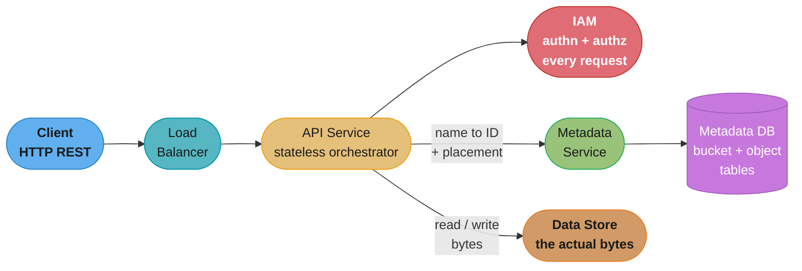
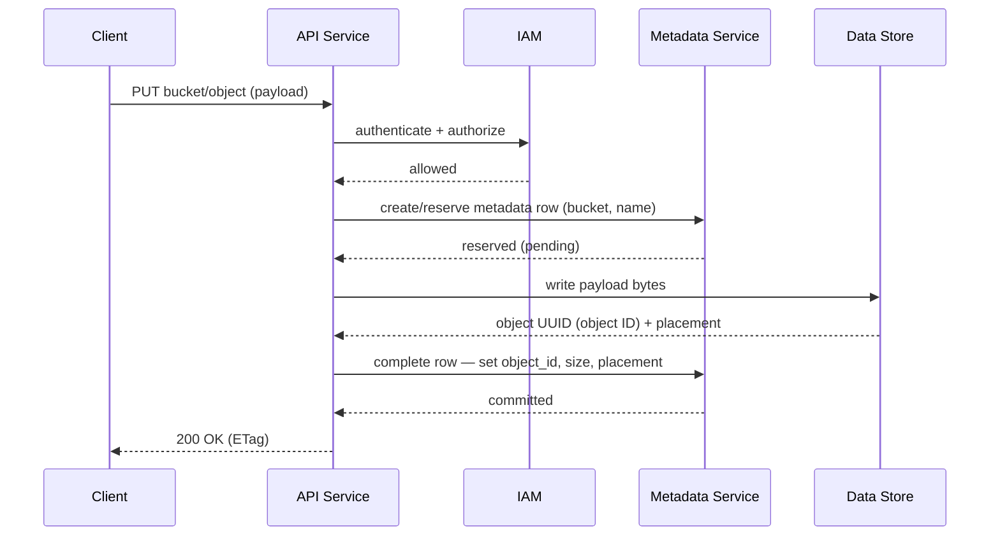
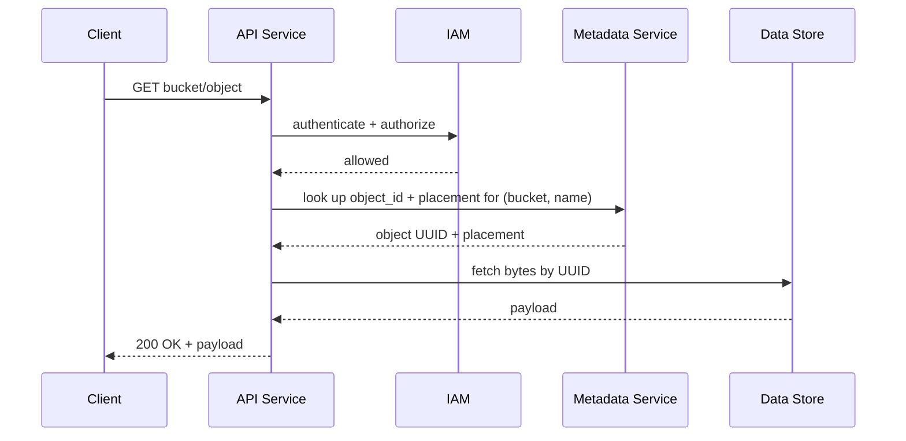
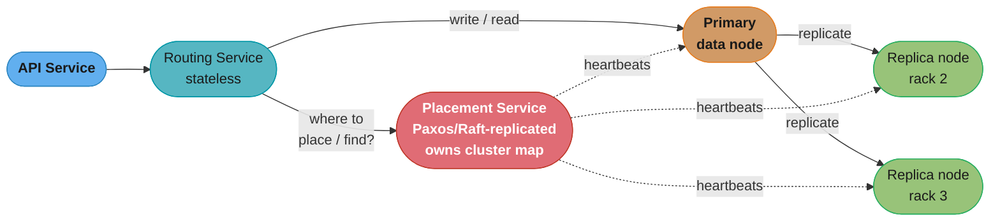
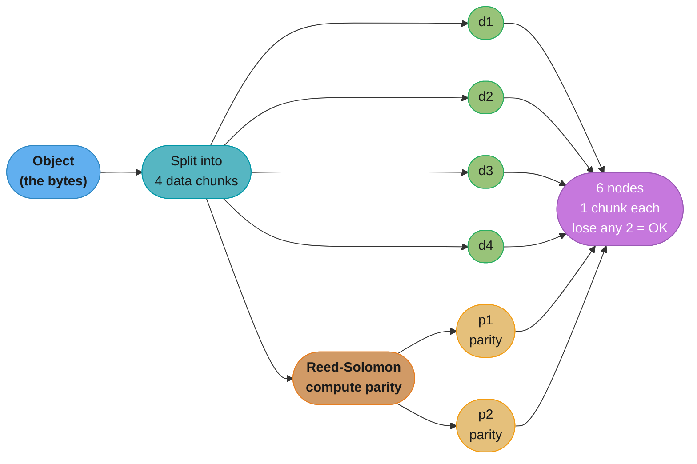
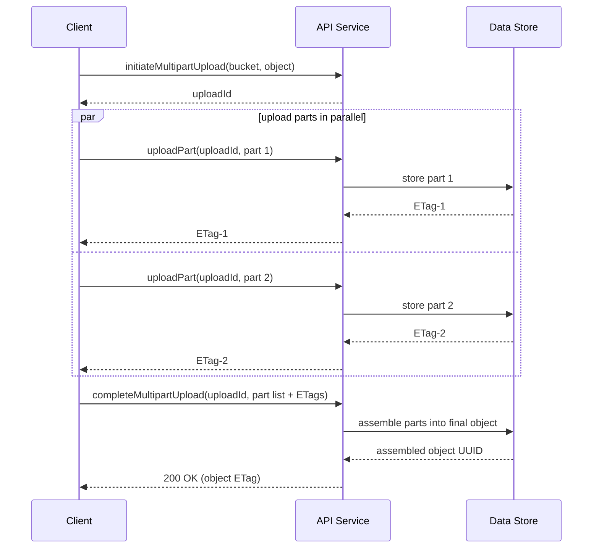
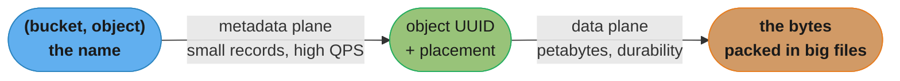
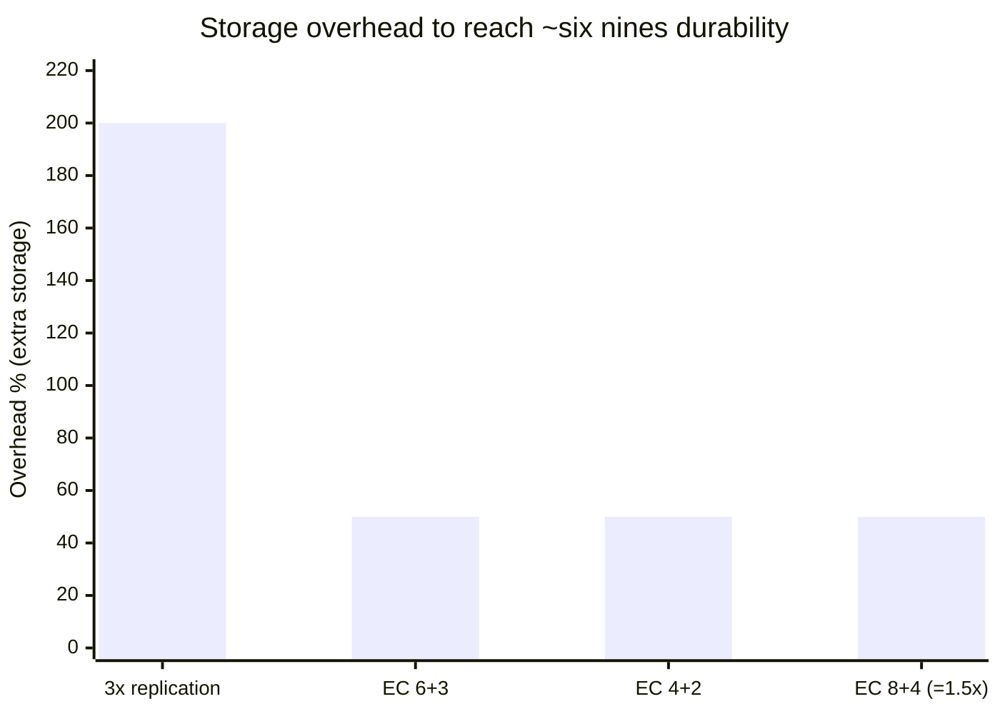

# Chapter 9: S3-like Object Storage

> Ch 9 of 13 · System Design Interview Vol 2 (Xu & Lam) · the storage-infrastructure chapter — separating metadata from immutable data, and paying for durability with erasure coding

## Chapter Map

Amazon S3 launched in 2006 and turned "store a file, get a URL" into the default substrate of
the cloud: it backs data lakes, backups, static websites, log archives, ML training sets, and the
object tier under half the SaaS you use. This chapter designs an S3-like **object store** — not a
filesystem, not a block device, but a flat namespace of **immutable objects** addressed by name,
read and written over HTTP. The whole design turns on one architectural move made in the first ten
minutes and never abandoned: **metadata and data live in separate services** so each scales on the
axis it is actually stressed on — the metadata store on *lookups per second*, the data store on
*petabytes and durability*.

**TL;DR:**
- **Three storage abstractions** — block (raw volumes, lowest latency, EBS), file (a hierarchy over
  NFS/SMB), object (flat namespace, HTTP API, immutable, cheapest per GB, highest latency). Object
  storage wins on cost and durability at the expense of in-place edits and low latency.
- **Separate metadata from data.** A stateless API service orchestrates; **IAM** authenticates and
  authorizes every request; a **metadata service** maps object name → object ID + placement; a
  **data store** holds the bytes. The two halves have opposite scaling shapes.
- **Durability is bought, not assumed.** Three replicas gets ~six nines but costs 200% overhead;
  **erasure coding (4+2)** gets comparable durability for 50% overhead by trading storage for
  reconstruction CPU and multi-node reads. Checksums catch the bit rot replication alone can't see.
- **The small-object skew drives the data layout.** 40% of objects are under 1 MB, so one file per
  object would burn inodes and IOPS — instead objects are **appended into large multi-GB files**
  with an **object-mapping table** (object_id → file, offset, size) doing the addressing.

---

## The Big Question

> "I need to store 100 PB in year one, never lose a customer's byte (six nines of durability), and
> serve it cheaply over HTTP — but 40% of my objects are tiny. How do I lay bytes on disk so small
> objects don't bankrupt me, and how do I pay for that many nines of durability without paying for
> three full copies of 100 PB?"

Analogy: object storage is a **coat check, not a closet**. You do not get a shelf you can rearrange
(that's a filesystem); you hand over a coat (an immutable object), get back a numbered ticket (an
object ID / URI), and later present the ticket to get the exact coat back. The attendant keeps a
**ledger** (metadata) mapping ticket → which rack and hook the coat hangs on (placement), and the
**coat room** (data store) just holds coats densely. The two are deliberately separate: the ledger
is small and queried constantly; the coat room is enormous and mostly written once, read
occasionally. This chapter is the story of how the attendant packs tiny coats so they don't each
waste a whole rack, and how many spare coats to keep so the room can survive a fire.

---

## 9.1 Step 1 — Understand the Problem and Establish Design Scope

### Storage 101 — block vs file vs object storage

Before designing object storage the book grounds the reader in the three fundamental storage
paradigms, because interviewers expect you to know *why* you would reach for object storage rather
than a disk or a NAS.

- **Block storage** — presents a raw, unformatted **volume** (a sequence of fixed-size blocks) to a
  server, which then puts a filesystem or database on top. It is the lowest-level and **lowest
  latency / highest IOPS** option, attached over a SAN (Fibre Channel, iSCSI) or, in the cloud, as
  **AWS EBS**. The server treats it like a locally attached disk. Ideal for databases and
  transactional workloads that need fast random reads/writes and in-place mutation.
- **File storage** — builds a **hierarchical filesystem** (directories, files, permissions) on top
  of block storage and exposes it over network protocols — **NFS** (Unix) or **SMB/CIFS** (Windows).
  Multiple clients mount the same share and see the same tree. Great for shared documents, home
  directories, and lift-and-shift apps that expect a POSIX path. You pay for the hierarchy in
  metadata overhead and coordination.
- **Object storage** — sacrifices low latency and in-place edits for **massive scalability,
  durability, and cost**. Data lives in a **flat namespace** as **objects**; there are no nested
  directories (folders are simulated with key prefixes). Objects are **immutable** — you replace,
  never edit in place — and are accessed over a **RESTful HTTP API** rather than a mounted volume.
  This is the tier for backups, archives, media, static assets, and data lakes. **AWS S3, Azure
  Blob, Google Cloud Storage** are the canonical examples.

| Dimension | Block | File | Object |
|-----------|-------|------|--------|
| Abstraction | Raw volume of blocks | Hierarchy of files/dirs | Flat bucket of objects |
| Access | Attached disk (SAN/iSCSI/EBS) | NFS / SMB mount | HTTP REST API |
| Mutability | In-place read/write | In-place read/write | **Immutable** (replace whole object) |
| Latency | **Lowest** | Low–medium | **Highest** |
| Cost per GB | Highest | Medium | **Lowest** |
| Scale ceiling | Volume size | Filesystem limits | **Effectively unbounded** |
| Best for | Databases, boot volumes | Shared files, home dirs | Backups, media, data lakes, archives |

The through-line: as you move block → file → object you trade **latency and mutability** for
**scale, durability, and cost**. Object storage is the right tool precisely when the data is large,
written once, read many, and must survive anything.

### Functional & non-functional requirements

**Functional requirements** the design must satisfy:

- **Bucket operations** — create a bucket, delete a bucket. A bucket is the top-level container and
  its name is globally unique.
- **Object operations** — `PUT` (upload) an object into a bucket, `GET` (download) an object by
  name, delete an object.
- **Versioning** — keep multiple versions of the same object name so an overwrite or delete is
  recoverable.
- **Listing** — list objects in a bucket, filtered **by prefix** (this is how the flat namespace
  simulates folders: `photos/2024/` is a prefix, not a directory).

**Non-functional requirements** — these are the ones that actually shape the architecture:

- **Scale: 100 PB in the first year.** The design must scale to petabytes and beyond.
- **Six nines of durability — 99.9999%.** This is the headline requirement. Losing customer data is
  the one unforgivable failure; the book frames it as **"data reliability beats everything."**
  Durability (not losing data) is distinct from availability (being reachable now) — you can be
  briefly unavailable and forgiven, but a lost byte is forever.
- **High availability, throughput, and reasonable latency** — the store must serve reads and writes
  at scale, but latency is explicitly *not* the top priority (that's what block storage is for).
- **The small-object skew: 40% of objects are under 1 MB.** This single statistic drives the entire
  data-store layout in Step 3 — a naive "one file per object" scheme would drown in per-file
  overhead.

### Back-of-the-envelope: the small-object skew and metadata sizing

The book pushes on the size distribution because it dictates the storage engine. Work it through:

- Suppose a **10 PB** slice of the store, average object **~1 MB** → roughly **10 PB / 1 MB = 10
  billion objects**. With **40% under 1 MB**, that is ~4 billion *tiny* objects.
- On a typical filesystem an inode is ~**256 bytes** and each file consumes at least one inode plus
  a partially wasted final block. A 512-byte object stored as its own 4 KB-block file wastes ~87% of
  that block, and 4 billion inodes is itself hundreds of GB of pure bookkeeping — before you store a
  single payload byte. **The internal fragmentation and inode pressure of small files is the enemy.**
- Therefore: **do not store one file per object.** Pack many small objects contiguously into large
  files (a few GB each) and keep a lightweight **mapping table** (object_id → file, offset, size).
  The disk sees a handful of huge sequential files; the "millions of tiny objects" problem becomes a
  key-value lookup problem. This is the central data-layout decision, derived directly from the 40%
  figure.

**In plain terms.** "Divide the bytes you must store by the size of a typical object and you learn
how many *rows* you must keep; multiply that row count by the size of one row and you learn how big
the metadata database has to be."

That framing matters because it separates two budgets that feel like one. The payload budget is set
by physics (100 PB is 100 PB), but the metadata budget is set entirely by *object count* — so a
store full of 512-byte objects and a store full of 512-MB objects can hold identical bytes while
their metadata stores differ by six orders of magnitude.

| Symbol | What it is |
|--------|------------|
| `S` | Total payload bytes in the slice being sized — 10 PB in the book's example |
| `s_avg` | Average object size — ~1 MB here; the whole answer swings on this one number |
| `N` | Object count, `S / s_avg` — the row count of the object table and of every mapping table |
| `b` | Bytes of metadata per object — ~256 B for a data-node mapping row, 1–2 KB for a full object-table row (name, version, size, placement, ACL) |
| `f_small` | Fraction of objects under 1 MB — the 40% skew that decides the on-disk layout |

**Walk one example.** Push the book's 10 PB / 1 MB / 40% through both budgets:

```
  N  = S / s_avg
     = 10 PB / 1 MB
     = 10,000,000,000,000,000 B / 1,000,000 B
     = 10,000,000,000                      <- 10 billion objects
  small objects = f_small x N
     = 0.40 x 10,000,000,000
     = 4,000,000,000                       <- 4 billion sub-1 MB objects

  metadata store size = N x b
     b =   256 B/object  ->  10e9 x   256 =   2.56 TB    (mapping-table row)
     b = 1,024 B/object  ->  10e9 x 1,024 =  10.24 TB    (lean object-table row)
     b = 2,048 B/object  ->  10e9 x 2,048 =  20.48 TB    (rich row + version)

  now price the alternative -- one FILE per object:
     inodes for the tiny objects alone = 4,000,000,000 x 256 B
                                       = 1,024,000,000,000 B = 1.02 TB
     block waste on a 512 B object in a 4 KB block
                                       = (4,096 - 512) / 4,096 = 87.5% discarded

  Meaning: the metadata database is a multi-terabyte system in its own right -- 2.56 TB of
  mapping rows minimum -- and that is the CHEAP option. One-file-per-object spends 1.02 TB
  on inodes for the small objects alone and still throws away 87.5% of every block they
  touch. Packing turns a filesystem problem into a key-value problem you can actually shard.
```

**Why `s_avg` is the term that does all the work.** It appears in the denominator of `N`, and `N`
multiplies straight into the metadata budget — so halving the average object size *doubles* your
metadata store while storing the identical number of payload bytes. Drop `s_avg` from the model and
you get the classic capacity-planning failure: teams size for petabytes, provision a single metadata
node, and discover at launch that the object table alone will not fit on one machine.

The 100 PB / six-nines / 40%-small triad is the whole problem statement compressed: **enough scale
that layout efficiency matters, enough durability that you must engineer for it, and enough small
objects that naive layout fails.**

---

## 9.2 Step 2 — Propose High-Level Design and Get Buy-In

### Object-storage concepts (bucket, object, flat namespace, URI)

Four terms anchor the model:

- **Bucket** — a logical, top-level container for objects. Its name must be **globally unique**
  (like a DNS name), so `s3://acme-logs` can only belong to one account across the whole system.
  You must create a bucket before putting objects in it.
- **Object** — the unit stored. An object is an **immutable payload (the bytes)** plus its
  **metadata** (a set of key-value pairs: content type, size, custom tags). You never edit an
  object in place; to "change" it you upload a new object under the same name, creating a new
  version. Immutability is what lets the data store treat bytes as append-only.
- **Flat namespace, simulated folders.** Object storage has **no real directory hierarchy** — a
  bucket is a flat set of key→object entries. The illusion of folders comes entirely from **key
  naming plus prefix listing**: naming objects `2024/photos/cat.jpg` and listing with prefix
  `2024/photos/` returns everything "in that folder," but there is no folder object — just string
  prefixes. This is why listing-by-prefix is a first-class operation and why it becomes tricky once
  the metadata is sharded (Step 3).
- **URI / addressing.** Every object is addressed by `bucket-name + object-name`, exposed as a URI
  like `s3://bucket-name/object-name` or an HTTP URL `https://s3.<region>.amazonaws.com/bucket-name/object-name`.
  The pair (bucket, object) is the primary key of the whole system.

Version-aware URIs additionally carry a version ID (`?versionId=...`) to fetch a specific
historical version rather than the latest.

### High-level architecture

The book's architecture is deliberately split into a **metadata plane** and a **data plane**, with a
stateless orchestrator and a mandatory security gate in front. Trace a request left to right.



Caption: the API service is a stateless traffic cop — every request first clears IAM, then fans out
to the metadata service (small, lookup-heavy) and the data store (huge, byte-heavy); those two
planes are the load-bearing separation the whole chapter defends.

The components:

- **Load balancer** — spreads requests across the API service fleet.
- **API service** — a **stateless orchestrator**. It holds no data of its own; it coordinates calls
  to IAM, the metadata service, and the data store. Because it is stateless it scales horizontally
  by just adding instances behind the load balancer.
- **IAM (Identity and Access Management)** — the central place for **authentication** (who are you?)
  and **authorization** (are you allowed to do this?). Critically, IAM is consulted on **every
  request** — there is no trusted path that skips the security check. It enforces bucket/object
  policies and access keys.
- **Metadata service + metadata database** — maps an object's `(bucket, name)` to its **object ID**
  and **placement** (where the bytes live). Small records, enormous query rate. This is the "ledger."
- **Data store** — holds the actual object payloads (the bytes). It is where the petabytes and the
  durability engineering live, and where erasure coding and small-object packing happen.

**The principle the book hammers: metadata and data are separated.** They have opposite scaling
profiles — metadata is many small records read at very high QPS (scale the DB horizontally, cache
hot lookups), while data is few-but-gigantic byte streams that must be durably placed (scale disks,
replicate/erasure-code). Coupling them would force one storage technology to be good at two
incompatible jobs. Keeping them apart lets each half evolve and scale independently.

### The three core flows — bucket creation, object upload, object download

**Flow 1 — bucket creation.** The simplest flow, and a useful warm-up:

1. Client sends `createBucket(name)` through the load balancer to the API service.
2. API service calls **IAM** to confirm the caller is authenticated and permitted to create buckets.
3. API service asks the **metadata service** to insert a row in the **bucket table** (bucket name,
   owner, region, creation time). Bucket names are globally unique, so this insert enforces
   uniqueness.
4. Success is returned. No data-store interaction — a bucket is pure metadata; it holds no bytes.

**Flow 2 — object upload (`PUT`).** This is the flow that shows the metadata/data split in action.
The API service reserves a metadata row, streams the payload to the data store, gets back a UUID
(object ID), and completes the metadata row with that ID.



Caption: upload is a two-write handshake — the metadata row is reserved first, the immutable bytes
land in the data store and yield a UUID, then the metadata row is completed with that UUID; if the
data write fails the reserved row is never completed, so no dangling pointer is exposed.

Walking it in words:

1. Client `PUT`s `bucket/object` with the payload; the load balancer routes it to an API service
   instance.
2. API service calls **IAM** — authenticate and authorize the write.
3. API service asks the **metadata service** to create (reserve) a metadata entry keyed by
   `(bucket, object name)`.
4. API service streams the **payload to the data store**, which persists the bytes and returns a
   **UUID** — the object ID that uniquely identifies this payload.
5. API service **completes the metadata row**, storing the mapping `object name → object UUID` along
   with size, content type, and placement info.
6. API service returns `200 OK` with an **ETag** (typically a hash/identifier of the content).

**Flow 3 — object download (`GET`).** The reverse — a metadata lookup, then a data fetch by UUID:



Caption: download is metadata-first — the name resolves to a UUID and placement in the metadata
store, and only then does the API service pull the actual bytes from the data store, exactly
mirroring the coat-check ticket → coat lookup.

The **listing** flow (list objects in a bucket by prefix) is metadata-only — it never touches the
data store — and gets its own deep dive in Step 3 because sharding the object table makes it hard.

---

## 9.3 Step 3 — Design Deep Dive

### Data store internals

The data store is itself a small distributed system with three roles: a **routing service**, a
**placement service**, and the **data nodes** that hold bytes.



Caption: the placement service is the brain — it owns the cluster map and picks primary+replicas —
so it is consensus-replicated (Paxos/Raft); the routing service is stateless and disposable, and
the data nodes just persist bytes and answer heartbeats.

- **Routing service** — **stateless**. Given an object write or read, it asks the placement service
  which data nodes are responsible, then forwards the request there. Because it holds no state it
  scales trivially and any instance can serve any request.
- **Placement service** — the **brain of the cluster**. It:
  - **Chooses placement** — for a new object it selects a **primary data node plus its replica
    nodes**, spreading them across failure domains.
  - **Maintains the cluster map** — the full topology of the storage cluster: which **data centers**
    contain which **racks** contain which **data nodes and disks**, and their health. This map is
    what lets placement respect failure domains.
  - **Monitors health via heartbeats** — every data node periodically heartbeats the placement
    service; a missed heartbeat marks the node down and triggers re-replication.
  - Because losing the placement service (or letting it disagree with itself) would corrupt the map
    and take down the whole cluster, it is **replicated with a consensus protocol (Paxos or Raft)**.
    A small, consistent, consensus-backed replica set keeps the authoritative map; the many data
    nodes are the dumb, numerous workers. This is the classic "smart small brain, dumb big body"
    split.
- **Data node** — persists object bytes on its local disks and serves reads. Writes follow a
  **primary-replica** path: the primary persists the bytes and forwards them to replica nodes; only
  once the agreed number of copies are durable does the write ack.

**The write-path consistency question — when do you ack?** The book poses this as a
consistency-vs-latency tradeoff. Options:

| Ack policy | Latency | Durability on ack | Risk |
|------------|---------|-------------------|------|
| Ack after **primary** persists | **Lowest** | Only 1 copy exists | Primary dies before replication → data loss window |
| Ack after **all replicas** persist | **Highest** | Full replica set durable | A slow/failed replica stalls every write |
| Ack after a **majority (quorum)** persist | Middle | Quorum durable | Balanced; tolerates one slow replica |

Acking on the primary alone is fastest but exposes a loss window (the primary can die before the
copy propagates); acking only after every replica is safest but couples your write latency to your
slowest node. Quorum (write to `W` of `N`, read from `R` such that `W + R > N`) is the usual
compromise — see the key-value store chapter for the full quorum treatment.

### How data is organized on a data node

This is where the **40%-under-1 MB** statistic pays off. The naive design — one file per object —
fails: millions of tiny files exhaust **inodes** and waste **IOPS** (each open/stat/read is
per-file overhead) and internal fragmentation wastes disk. The fix is to **pack many objects into a
few large files.**

**The write-once, append-into-big-files scheme:**

- Each data node keeps **one active read-write file** (WAL-style, append-only). Incoming object
  payloads are **appended** to the end of this file.
- When the file grows to a threshold — **a few GB** — it is **sealed: marked read-only**, and a new
  empty read-write file is opened for subsequent writes. Sealed files are never modified again
  (immutability of objects makes this safe), which makes them cheap to replicate and erasure-code.
- Only **one active read-write file per node** avoids write conflicts. Because appends to that one
  file must be **serialized** (only one writer at a time so offsets don't collide), throughput is
  capped by a single append stream — so in practice you run **one read-write file per core/disk** to
  parallelize the append path across independent files.

**The object mapping table** — how you find a tiny object inside a multi-GB file:

For every object, store a row: `object_id → (data_file, start_offset, object_size)`. To read object
`C`, look up its row, seek to `start_offset` in `data_file`, and read `object_size` bytes. The
mapping table is a **key-value store embedded on the data node** — the book uses a **RocksDB-style**
(LSM/SSTable) engine because it is optimized for exactly this: a huge number of small key→value
entries with fast point lookups and high write throughput. (RocksDB stores its data as sorted
string tables — see the storage-engines and DDIA storage-and-retrieval cross-links.)

```
Read-write data file  (append-only, one active file per node)   sealed at ~a few GB
+---------------------------------------------------------------------------------+
| hdrA | object A payload (1 MB) | hdrB | object B payload (1 MB) | hdrC | C (512B) |
+---------------------------------------------------------------------------------+
^      ^                          ^                                ^      ^
0      offset=24                  offset=1048600                   ...    offset=2097200

object mapping table  (embedded RocksDB on the data node)
   object_id  ->  (data_file,  start_offset,  size)
   A          ->  (file_07,    24,            1048576)   # ~1 MB, header 24 B
   B          ->  (file_07,    1048600,       1048576)
   C          ->  (file_07,    2097200,       512)       # tiny 512 B object: NO wasted inode/block
```

Caption: object C is a 512-byte object living *inside* the same multi-GB file as the two 1 MB
objects — no separate inode, no wasted 4 KB block; the mapping table's `(file, offset, size)` triple
is the only per-object bookkeeping, which is why packing beats one-file-per-object for the 40% of
sub-1 MB objects.

The payoff: the disk sees a handful of enormous sequential files (great for throughput and for
erasure coding a whole file at once), while the "billions of small objects" problem collapses into a
fast embedded key-value lookup.

### Durability deep dive

Six nines is the marquee requirement, so the book spends real time on *how* durability is
manufactured. Three ingredients: **replication math, failure domains, and erasure coding**, with
**checksums** as the integrity backstop.

**The failure math — why three replicas ≈ six nines.** Take a spinning-disk **annual failure rate
of ~0.81%** (a real-world ballpark). If an object exists on **one** disk, its annual probability of
loss is 0.81% — nowhere near six nines. Put it on **three independent disks** and (assuming
independent failures within the repair window) the object is lost only if **all three** fail:

```
p(lose 1 copy)  = 0.0081
p(lose 3 copies) = 0.0081^3 = 0.0081 x 0.0081 x 0.0081 = 5.31 x 10^-7
durability       = 1 - 5.31 x 10^-7 = 0.99999947 = 99.999947%  ->  ~ six nines
```

So **3-way replication** manufactures roughly six nines out of commodity disks — but at a **storage
cost of 3x (200% overhead):** to store 100 PB of data you buy 300 PB of disk.

**What this actually says.** "An object is lost only when *every* copy dies in the same repair
window, so each independent copy multiplies the loss probability by the failure rate again — and
because durability is quoted in nines, each copy adds a fixed number of nines rather than a fixed
percentage."

That last part is the framing worth internalizing. Nines are logarithmic, so "how many copies do I
need?" is really "how many times do I want to multiply by 0.0081?" — and the answer stops being a
guess the moment you count nines instead of percentages.

| Symbol | What it is |
|--------|------------|
| `p` | Annual failure probability of one disk — 0.0081 (0.81%) here |
| `R` | Number of independent replicas of the object |
| `p^R` | Probability all `R` copies die in the same window — the loss probability |
| `1 - p^R` | Durability, the probability the object survives the year |
| nines | `-log10(p^R)` — the conventional way durability targets are stated |

**Walk one example.** The book's 0.81% disk, taken one replica at a time:

```
  p = 0.0081                      (0.81% annual failure rate, one disk)

  R   loss probability p^R              durability 1 - p^R          nines = -log10(p^R)
  1   0.0081^1 = 8.10000  x 10^-3       99.1900000000%              2.09
  2   0.0081^2 = 6.56100  x 10^-5       99.9934390000%              4.18
  3   0.0081^3 = 5.31441  x 10^-7       99.9999468559%              6.27

  the per-copy step:
     -log10(0.0081) = 2.0915 nines bought by each additional independent copy
     3 copies  ->  3 x 2.0915 = 6.2745 nines                      <- matches the table

  cost side, for 100 PB of real data:
     raw disk = 100 PB x R
     R = 1  -> 100 PB      R = 2 -> 200 PB      R = 3 -> 300 PB

  Meaning: copy #2 and copy #3 each cost a flat 100 PB of disk but each buys the SAME
  2.09 nines. Durability is bought linearly in money and gained logarithmically in
  reliability -- which is exactly why nobody runs 5x replication.
```

**Why "independent" is load-bearing and what breaks without it.** The `p^R` form is only valid if
the `R` failures are independent events; the moment two copies share a rack — hence a power supply
and a top-of-rack switch — their joint failure probability is far larger than `p^2`, and the
formula silently overstates durability by orders of magnitude. Three copies on one rack are, for
this arithmetic, closer to one copy. The failure-domain rules below exist purely to make the
independence assumption true enough to multiply.

**Failure domains — replicas must be *independent*.** The math above assumes independent failures;
that only holds if the three copies do not share a common failure. So placement spreads replicas
across **failure domains**: different **nodes**, different **racks** (a rack shares a power supply
and top-of-rack switch), and ideally different **data centers** (a DC shares power, cooling,
network, and geography). Three copies on the same rack are not three independent copies — a single
rack power loss takes all three. The cluster map exists precisely so the placement service can honor
this isolation.

**Erasure coding — the same durability for a quarter of the overhead.** Replication is simple but
expensive. **Erasure coding (EC)** splits data into `k` data chunks and computes `m` **parity
chunks** (via Reed-Solomon math), storing all `k + m` chunks across `k + m` different nodes. Any `k`
of the `k + m` chunks can reconstruct the original — i.e. you can lose **any `m` chunks** and still
recover.

The book's worked example is **4 + 2**:

- **4 data chunks + 2 parity chunks = 6 chunks**, spread across **6 nodes** (one per node).
- Survives the loss of **any 2** of the 6 nodes — reconstruct the missing chunks from the remaining
  4 using the parity math.
- **Storage overhead = 6 stored / 4 data = 1.5x = 50% overhead** (vs 3x / 200% for triple
  replication) — **a quarter of replication's overhead for comparable durability.**

**Read it like this.** "You write `k + m` chunks to hold `k` chunks of real data, so every raw byte
of disk returns `k / (k + m)` bytes of usable capacity — and the `m` parities are the entire price
of being able to lose `m` chunks."

The useful consequence is that `k` and `m` are two independent dials, not one. The *cost* depends
only on the ratio `m / k`, while the *failure tolerance* depends only on `m` — so you can hold cost
fixed and buy more tolerance by scaling both numbers up together.

| Symbol | What it is |
|--------|------------|
| `k` | Data chunks the object is split into — the real payload |
| `m` | Parity chunks computed by Reed-Solomon — pure redundancy, no user bytes |
| `k + m` | Total chunks written, one per node; the stripe width |
| `(k + m) / k` | Storage multiplier — how many raw bytes you buy per usable byte |
| `k / (k + m)` | Usable capacity per raw byte — the inverse, the "efficiency" |
| `m / k` | Overhead fraction — the number quoted as "50% overhead" |

**Walk one example.** Put the book's 4+2 next to 6+3 and 3x replication on the same 100 PB:

```
  storage multiplier  = (k + m) / k        usable per raw byte = k / (k + m)
  overhead            = m / k              tolerates            = any m chunk losses

  scheme      stored / data   multiplier   usable per raw byte   raw disk (100 PB)   survives
  3x replica     3 / 1          3.00x           0.3333                300 PB           2 losses
  RS 4 + 2       6 / 4          1.50x           0.6667                150 PB           2 losses
  RS 6 + 3       9 / 6          1.50x           0.6667                150 PB           3 losses
  RS 10 + 4     14 / 10         1.40x           0.7143                140 PB           4 losses

  the 6+3 arithmetic, step by step:
     multiplier          = (6 + 3) / 6 = 9 / 6 = 1.5
     usable per raw byte = 6 / (6 + 3) = 6 / 9 = 0.6667
     overhead            = 3 / 6       = 0.50  = 50%
     raw disk for 100 PB = 100 x 1.5   = 150 PB
     versus 3x replication            = 300 PB     -> 150 PB of disk saved

  Meaning: 6+3 and 4+2 cost EXACTLY the same 1.5x, because both have m/k = 0.5 -- but
  6+3 survives three simultaneous chunk losses where 4+2 survives two. Widening the
  stripe from 6 chunks to 9 buys a whole extra failure for zero extra storage.
```

**Why the parities exist and what breaks without them.** Set `m = 0` and the multiplier collapses to
a perfect 1.0x — you store exactly the bytes you were given — but any single node loss destroys a
chunk that no surviving chunk can regenerate, and the object is gone. `m` is precisely the number of
chunks you are allowed to be missing when the `k`-of-`k+m` reconstruction runs, so it is the only
term standing between "cheapest possible storage" and "no durability at all."



Caption: 4+2 erasure coding stores 6 chunks on 6 nodes for 4 chunks of real data — any 2 nodes can
die and the object is still reconstructable, buying ~six-nines durability at 50% overhead instead of
replication's 200%.

**The cost of EC** — nothing is free:

- **Reads touch multiple nodes.** A replica read is one node → one chunk. An EC read (especially if
  a chunk is missing) must gather chunks from **several nodes** and, on failure, **reconstruct** the
  missing data — more network fan-out and higher tail latency.
- **Reconstruction burns CPU.** The Reed-Solomon math to rebuild a lost chunk is compute-heavy; a
  node failure triggers a rebuild storm that consumes CPU across the cluster.
- **Small writes are inefficient** — you must have the full stripe to compute parity.

Hence the standard split: **erasure coding for cold / large / archival data** (durability at low
cost, reads are infrequent and can tolerate the fan-out), **replication for hot / small / latency-
sensitive data** (a single-node read is fast and simple).

| | 3x Replication | Erasure Coding (4+2) |
|---|---|---|
| Storage overhead | **200%** (3x) | **50%** (1.5x) |
| Durability | ~6 nines | ~6 nines (tunable via k,m) |
| Read cost | 1 node, fast | Multiple nodes; reconstruct on loss |
| Write cost | Copy to N nodes | Compute parity (CPU) |
| Reconstruction | Copy a replica | Reed-Solomon compute across nodes |
| Best for | Hot, small, latency-sensitive | Cold, large, archival |

**What the formula is telling you.** "Data is lost when *more than* `m` of the `k + m` chunks die in
one repair window — so you are no longer multiplying a single probability like `p^R`, you are summing
a binomial tail over every way the cluster could lose too many chunks at once."

That shift from a product to a binomial tail is the part interviews skip and production does not.
Replication has exactly one way to lose everything (all `R` copies), but a 9-chunk stripe has 126
distinct ways to lose 4 chunks — and that combinatorial count, not the per-disk failure rate, is
what decides whether an EC scheme actually reaches its advertised nines.

| Symbol | What it is |
|--------|------------|
| `n` | Stripe width, `k + m` — the number of independent disks/nodes holding chunks |
| `m` | Chunks you may lose and still reconstruct — the tolerance |
| `p` | Per-disk annual failure probability, 0.0081 as above |
| `C(n, i)` | Number of distinct ways `i` of the `n` chunks can be the ones that die |
| `p^i (1-p)^(n-i)` | Probability of one specific pattern of `i` dead and `n - i` alive |
| `P_loss` | `sum over i = m+1..n of C(n,i) p^i (1-p)^(n-i)` — the binomial tail |

**Walk one example.** Three schemes, same disk, same window:

```
  p = 0.0081; "lost" means MORE than m of the n chunks die before repair.

  3x replication          n = 3,  m = 2  (lost only if all 3 die)
     P_loss = C(3,3) x p^3          = 1   x 5.31441e-7
            = 5.31441 x 10^-7
     durability = 99.9999468559%                         6.27 nines

  RS 4 + 2                n = 6,  m = 2  (lost if 3 or more die)
     dominant term = C(6,3) x p^3 x (1-p)^3
                   = 20 x 5.31441e-7 x 0.975896 = 1.03726e-5
     full tail P_loss = 1.04364 x 10^-5
     durability = 99.9989563638%                         4.98 nines

  RS 6 + 3                n = 9,  m = 3  (lost if 4 or more die)
     dominant term = C(9,4) x p^4 x (1-p)^5
                   = 126 x 4.30467e-9 x 0.960151 = 5.20775e-7
     full tail P_loss = 5.25051 x 10^-7
     durability = 99.9999474949%                         6.28 nines

  side by side, for 100 PB of real data:
     scheme        raw disk    nines
     3x replica     300 PB      6.27
     RS 6 + 3       150 PB      6.28     <- same durability, HALF the disk
     RS 4 + 2       150 PB      4.98     <- same disk as 6+3, ~1.3 nines worse

  Meaning: 6+3 is the scheme that genuinely replaces 3x replication -- it matches the
  durability (6.28 vs 6.27 nines) while cutting 300 PB of purchased disk to 150 PB.
  4+2 costs the same as 6+3 but lands lower, because C(6,3) = 20 ways to lose 3 of 6
  chunks overwhelms the single way to lose all 3 replicas.
```

Note on the comparison table above: it reports both replication and 4+2 as "~6 nines." Running the
binomial tail at `p = 0.0081` puts 3x replication at 6.27 nines and 4+2 at 4.98; the scheme that
lands alongside replication at the same 1.5x cost is **6+3** (6.28 nines). The table's underlying
point — that erasure coding reaches replication-class durability at a fraction of the overhead — is
what the arithmetic supports; it is the choice of `m` that determines whether a given `k+m` gets
there.

**Why widening the stripe is free durability, and where it stops.** Going 4+2 → 6+3 holds `m / k` at
0.5 but raises `m` from 2 to 3, and since `P_loss` is driven by `p^(m+1)`, one extra parity buys
roughly another factor of `p` — about 2.09 nines of headroom, partly eaten back by the growing
`C(n, m+1)` term. It does not scale forever: a wider stripe means more nodes touched per read, a
bigger reconstruction fan-out when one dies, and a larger blast radius for correlated failures. That
is the real ceiling on `k + m`, not the storage math.

**Checksums — catching the corruption replication can't see.** Replication and EC protect against a
node *disappearing*, but not against **silent bit rot** — a disk quietly flipping a bit so the data
is present but wrong. The defense is a **checksum** (e.g. MD5, SHA-1, CRC32, or HMAC) computed **per
chunk / per object** and stored alongside it. On every read the data node **recomputes the checksum
and compares**; a mismatch means corruption, so the node treats that copy as lost and serves/rebuilds
from a healthy replica or from the EC parity. After any EC **reconstruction**, the rebuilt data is
**checksum-verified** before being handed back, so a bad rebuild can't silently propagate. Checksums
turn "the bytes are present" into "the bytes are *correct*," which is what durability actually means.

### Metadata DB deep dive

The metadata store has two tables with wildly different sizes, and that difference drives sharding.

- **Bucket table** — small. Each user has only a handful of buckets, so the total number of buckets
  is modest (thousands to millions of rows). It **fits comfortably in a single database** and can be
  heavily cached; it does not need sharding.
- **Object table** — enormous. With billions of objects (10 PB / 1 MB ≈ 10 billion, per the Step 1
  estimate), the object table cannot live on one machine. It must be **sharded**.

**Sharding the object table.** The book shards by **`hash(bucket_name, object_name)`**. Hashing the
composite key spreads objects uniformly across shards and, crucially, makes the **single most common
query — "fetch object by exact name"** — a clean single-shard lookup: hash the `(bucket, name)` you
were given, go straight to that one shard, read the row. No scatter needed for the hot path.

**But that shard key breaks two queries — and only one is a real problem:**

1. **Object lookup by exact name** — **fine.** The composite hash *is* the shard key, so an exact
   `(bucket, object)` lookup routes to exactly one shard. This is the common case and it stays fast.
2. **List objects in a bucket by prefix** — **broken.** Because objects are sharded by
   `hash(bucket, object)`, the objects of a single bucket are **scattered across every shard**.
   Listing `bucket=acme, prefix=2024/photos/` cannot go to one place. Two fixes:
   - **Scatter-gather** — query *all* shards for objects matching the bucket+prefix, then merge and
     sort the results in the API service. Correct but slow and expensive as shard count grows (every
     list hits every shard).
   - **Denormalized listing table** — maintain a separate table **keyed/sharded by bucket** (and
     sorted by object name) whose sole job is to answer listings. A bucket's objects are colocated,
     so a prefix scan is a cheap range scan on one shard. The cost is a second write on upload and
     **eventual consistency**: the listing table is updated asynchronously, so a just-uploaded object
     may take a moment to appear in a listing. The book argues this is acceptable because **listing
     is infrequent and not latency-critical**, and S3 itself historically offered eventually-
     consistent listing. You trade strict freshness for cheap, colocated prefix scans.

The lesson: your shard key optimizes exactly one access pattern; every other pattern either
scatter-gathers or needs a denormalized, separately-sharded copy.

### Object versioning

Versioning lets an overwrite or delete be undone by keeping every version of an object name.

- **Version column.** The object table carries an object-version identifier — a **`TIMEUUID`** (a
  time-ordered UUID), so versions of the same name sort chronologically. Multiple rows share the
  same `(bucket, object_name)` but differ by version.
- **`GET` returns the highest (latest) version** by default; a version-scoped `GET` (`?versionId=`)
  returns a specific historical version.
- **Delete is not destructive — it inserts a *delete marker*.** Rather than removing rows, a delete
  **inserts a new version that is a tombstone (delete marker)**. A subsequent default `GET` sees the
  delete marker as the latest version and returns "not found," but the earlier versions are still
  physically present and recoverable (delete the marker, or fetch an explicit older version). This is
  what makes deletes reversible.
- **Storage growth and lifecycle policies.** Because nothing is ever truly overwritten, versioning
  makes storage **grow without bound** — every overwrite keeps the old bytes. **Lifecycle policies**
  bound this: rules like "expire non-current versions after 30 days" or "transition to a cheaper
  (erasure-coded / cold) tier after 90 days" let old versions be reclaimed or demoted automatically.
  Actual byte reclamation is done lazily by garbage collection.

### Optimizing uploads of large objects — multipart upload

A single `PUT` of a multi-GB object is fragile: one network blip near the end forces you to restart
the entire upload. **Multipart upload** splits a large object into independently uploaded parts.

The three-phase protocol:

1. **Initiate** — client calls `initiateMultipartUpload(bucket, object)`; the server returns an
   **`uploadId`** that ties all the parts together.
2. **Upload parts** — the client splits the object into parts (e.g. one part per few hundred MB) and
   uploads each **independently and in parallel**, tagging each with the `uploadId` and a part
   number. Each successful part upload returns an **`ETag`** (a hash identifying that part's bytes).
3. **Complete** — the client calls `completeMultipartUpload(uploadId, [ {partNumber, ETag}, ... ])`
   with the ordered list of parts and their ETags; the server **assembles the parts into the final
   object** and makes it available under the object name.



Caption: parts upload in parallel and each returns an ETag, so a failed part is re-sent alone rather
than restarting the whole object — but the parts sit in the data store consuming space until
`complete` assembles them, which is exactly what creates orphaned parts when a client abandons the
upload.

Benefits and the catch:

- **Resume on failure** — a failed part is simply re-uploaded on its own; you never restart the whole
  object. Parallel part uploads also raise throughput.
- **Garbage collection of abandoned parts** — if a client uploads some parts and never calls
  `complete` (crash, cancel, forgotten upload), those parts sit in the data store consuming space
  forever. They must be **garbage collected** — typically via a lifecycle rule that deletes
  incomplete multipart uploads older than N days. This is a direct feeder into the GC subsystem.

### Garbage collection

Because object storage never truly mutates in place and deletes are lazy, dead bytes accumulate and
must be reclaimed asynchronously. GC handles three sources of garbage:

- **Deleted objects** — objects hidden behind a **delete marker**, and versions expired by lifecycle
  policy, whose bytes are no longer referenced.
- **Abandoned multipart parts** — parts from multipart uploads that were never completed.
- **Corrupted chunks** — chunks that failed checksum verification and were replaced from a healthy
  copy; the corrupt bytes are now dead.

**Why deletes are lazy.** Reclaiming space immediately would mean editing the big append-only data
files in place on the delete path — expensive and contention-prone, and it would break the append-
only invariant that makes the files cheap to replicate and erasure-code. So a delete just marks the
object dead (insert a delete marker / drop the mapping-table reference) and returns instantly; the
actual byte reclamation is deferred to GC.

**How GC reclaims space — compaction.** The data files are append-only and dotted with dead objects
(holes) over time. GC **compacts** them: it reads a data file, **copies the still-live objects into a
new file**, and **updates the object mapping table** with each live object's new `(file, offset)`.
Once every live object has been copied and its mapping updated, the **old file is deleted wholesale**,
reclaiming all the space that dead objects occupied. This is the same copy-live-forward compaction an
LSM-tree does — it turns "delete a byte range in the middle of a huge file" (hard) into "rewrite the
file without the dead ranges, then drop the old file" (easy and sequential).

---

## 9.4 Step 4 — Wrap Up

The design delivers an S3-like object store by holding one architectural line — **metadata and data
are separate services** — and then engineering each half for its own stress:

- **The front door** — load balancer → stateless **API service** → **IAM** on every request → the
  **metadata** and **data** planes. Statelessness makes the orchestrator trivially scalable; IAM
  makes every access checked.
- **The metadata plane** — a small, cached **bucket table** and a huge **object table sharded by
  `hash(bucket, object)`**. That shard key makes exact-name lookup a one-shard hit but scatters a
  bucket's objects, so **prefix listing** needs scatter-gather or a **denormalized, eventually-
  consistent listing table**. Versioning adds a `TIMEUUID` version and turns delete into a **delete
  marker**.
- **The data plane** — a **placement service** (consensus-replicated brain owning the cluster map),
  a stateless **routing service**, and **data nodes** that **pack small objects into multi-GB
  append-only files** addressed by an embedded **object-mapping table**. Durability is manufactured
  by **replication (3x, ~six nines, 200% overhead)** or **erasure coding (4+2, ~six nines, 50%
  overhead)** across **failure domains**, with **checksums** catching bit rot. **Multipart upload**
  handles large objects and **garbage collection** reclaims dead bytes via compaction.

The recurring lesson: **durability is engineered, not assumed** — you choose your overhead (3x vs
1.5x), your failure domains, and your integrity checks deliberately; and the humble fact that "40%
of objects are under 1 MB" is what forces the entire small-object packing design.

If time remains, an interviewer may push on: cross-region replication for disaster recovery, a CDN
in front for read-heavy public objects, S3 Select-style server-side filtering, storage tiers
(Standard / Infrequent Access / Glacier), and encryption at rest / in transit.

---

## Visual Intuition

**The metadata/data split is the whole chapter.** Every flow — upload, download, list — is "resolve
the name in the small ledger, then move bytes in the big store," and the two planes never share a
storage engine.



Caption: name → UUID+placement (metadata plane) → bytes (data plane); the two hops scale on opposite
axes (lookups/sec vs petabytes+durability), which is why they are separate services.

**The durability cost curve — replication vs erasure coding overhead.** Both hit ~six nines; the
question is what you pay in disk.



Caption: triple replication buys ~six nines at 200% overhead; erasure coding buys comparable
durability at ~50% — the same protection for roughly a quarter of the extra disk, which is why cold
bulk data is erasure-coded.

**The small-object packing intuition (ASCII — byte layout).** One file per object wastes an
inode/block per tiny object; packing amortizes it away.

```
One-file-per-object (BAD)                Packed-into-big-file (GOOD)
+--------+  inode + 4KB block            file_07 (multi-GB, append-only)
| 512 B  |  ~87% of block wasted         +----+-------+----+-------+----+----+
+--------+                               |hdr | 512 B |hdr | 512 B |hdr | .. |
+--------+  another inode + block        +----+-------+----+-------+----+----+
| 512 B  |  ~87% wasted, again           mapping: id -> (file_07, offset, size)
+--------+                               one embedded KV row per object; no inode
   ... x 4 billion tiny objects             ... 4 billion rows, files stay huge
```

Caption: with 40% of objects under 1 MB, one-file-per-object burns 4 billion inodes and wastes most
of each final block; packing objects contiguously into multi-GB files with an `(file, offset, size)`
mapping row is the design decision the size distribution forces.

---

## Key Concepts Glossary

- **Block storage** — raw volumes of fixed-size blocks; lowest latency; attached via SAN/iSCSI/EBS.
- **File storage** — hierarchical filesystem over NFS/SMB; shared, POSIX-like.
- **Object storage** — flat namespace of immutable objects over an HTTP API; cheapest, most durable.
- **Bucket** — globally-unique top-level container for objects; pure metadata, holds no bytes.
- **Object** — immutable payload (bytes) plus metadata (key-value tags); the stored unit.
- **Flat namespace** — no real directories; "folders" are simulated by key prefixes + prefix listing.
- **URI / addressing** — an object is addressed by `(bucket-name, object-name)`, e.g. `s3://bucket/obj`.
- **API service** — stateless orchestrator; coordinates IAM, metadata, and data store.
- **IAM** — Identity and Access Management; authenticates and authorizes **every** request.
- **Metadata service / metadata DB** — maps object name → object ID + placement (bucket + object tables).
- **Data store** — holds the actual object bytes; where durability engineering lives.
- **Object ID / UUID** — unique identifier the data store returns for a stored payload.
- **ETag** — content identifier/hash returned on upload and per multipart part.
- **Routing service** — stateless component that forwards data reads/writes to the right nodes.
- **Placement service** — consensus-replicated brain: picks primary+replicas, owns the cluster map.
- **Cluster map** — topology of data centers → racks → nodes/disks and their health.
- **Data node** — persists object bytes; primary-replica write path.
- **Failure domain** — a shared-fate boundary (node / rack / data center) replicas must be spread across.
- **Write-ahead / append-only data file** — one active read-write file per node; sealed read-only at ~a few GB.
- **Object mapping table** — `object_id → (data_file, start_offset, size)`; embedded RocksDB-style KV store.
- **Small-object packing** — appending many small objects into large files to avoid inode/IOPS waste.
- **Durability** — probability of not losing data (distinct from availability); target 99.9999% (six nines).
- **Annual failure rate (AFR)** — a disk's yearly probability of failure (~0.81% used in the math).
- **Replication (3x)** — three independent copies; ~six nines at 200% storage overhead.
- **Erasure coding (EC)** — `k` data + `m` parity chunks; lose any `m`; 4+2 = 50% overhead.
- **Reed-Solomon** — the math that computes parity chunks and reconstructs lost ones.
- **Checksum** — per-chunk hash (MD5/SHA-1/CRC32/HMAC) recomputed on read to catch bit rot.
- **Sharding by `hash(bucket, object)`** — object-table shard key; fast exact lookup, scattered listing.
- **Scatter-gather** — query every shard and merge; the brute-force way to list a bucket's objects.
- **Listing table** — denormalized, bucket-sharded, eventually-consistent table that answers prefix listings.
- **Versioning / TIMEUUID** — time-ordered version id per object name; GET returns the highest version.
- **Delete marker** — a tombstone version inserted on delete; makes deletes reversible.
- **Lifecycle policy** — rules to expire old versions or transition objects to cheaper tiers.
- **Multipart upload** — initiate → upload parts (parallel, each returns ETag) → complete (assemble).
- **Abandoned parts** — parts of an uncompleted multipart upload; must be garbage collected.
- **Garbage collection / compaction** — copy live objects into new files, update offsets, drop old files.

---

## Tradeoffs & Decision Tables

**Storage paradigms**

| | Block | File | Object |
|---|---|---|---|
| Access | Attached volume | NFS/SMB mount | HTTP REST |
| Mutability | In-place | In-place | Immutable (replace) |
| Latency | Lowest | Low-medium | Highest |
| Cost/GB | Highest | Medium | Lowest |
| Use | DB, boot disk | Shared files | Backups, media, data lakes |

**Write-path ack policy (consistency vs latency)**

| Ack after… | Latency | Durability on ack | Risk |
|---|---|---|---|
| Primary persists | Lowest | 1 copy | Loss window if primary dies pre-replication |
| All replicas persist | Highest | Full set | Slow replica stalls all writes |
| Majority (quorum) persists | Middle | Quorum | Balanced; tolerates one slow node |

**Durability scheme**

| | 3x Replication | Erasure Coding 4+2 |
|---|---|---|
| Storage overhead | 200% | 50% |
| Read | 1 node, fast | Multiple nodes, reconstruct on loss |
| Reconstruction | Copy a replica | Reed-Solomon CPU across nodes |
| Best for | Hot / small / latency-sensitive | Cold / large / archival |

**Listing under a `hash(bucket, object)` shard key**

| Approach | Freshness | Cost | When |
|---|---|---|---|
| Scatter-gather all shards | Strong | Every list hits every shard | Few shards, rare listings |
| Denormalized listing table | Eventual | Extra write on upload; cheap range scan | Default; listing is infrequent |

---

## Common Pitfalls / War Stories

- **Coupling metadata and data storage.** Forcing one engine to serve billions of tiny high-QPS
  lookups *and* store petabytes durably makes it bad at both. The fix is the whole chapter: separate
  planes, each scaled on its own axis.
- **One file per object.** With 40% of objects under 1 MB, a file-per-object scheme exhausts inodes
  and IOPS and wastes most of each final block — billions of tiny files bring the filesystem to its
  knees. Pack objects into multi-GB append-only files with an `(file, offset, size)` mapping table.
- **Replicas in the same failure domain.** Three copies on the same rack are not three independent
  copies — one rack power loss takes all three, and your "six nines" evaporates. The failure math
  assumes *independent* failures; spread replicas across nodes, racks, and data centers.
- **Trusting replication to catch corruption.** Replication protects against a node vanishing, not
  against silent bit rot — a flipped bit on disk is faithfully served as "present but wrong." Without
  per-chunk checksums verified on read, you replicate corruption. Checksum every chunk and verify on
  read and after reconstruction.
- **Sharding by bucket and getting a hot shard.** Shard the object table by bucket alone and one
  giant bucket (a customer with billions of objects) overwhelms a single shard. Hashing
  `(bucket, object)` spreads load — at the cost of making listing scatter across shards, which you
  then solve with a listing table.
- **Assuming listing is strongly consistent.** A just-uploaded object may not appear immediately in a
  prefix listing because the denormalized listing table is updated asynchronously (eventual
  consistency). Code that lists-then-acts on the assumption of read-your-write freshness will miss
  fresh objects; design for eventual listing (S3 itself did for years).
- **Leaking abandoned multipart parts.** Clients that upload parts and never call `complete` leave
  orphaned parts consuming space forever. Without a lifecycle rule to GC incomplete uploads older
  than N days, storage bills climb on data no object even references.
- **Hard-deleting by editing big files in place.** Trying to reclaim space on the delete path by
  punching holes in multi-GB append-only files is slow, contention-prone, and breaks the append-only
  invariant that makes files cheap to replicate/erasure-code. Delete lazily (marker) and reclaim via
  compaction GC.

---

## Real-World Systems Referenced

- **Amazon S3, Azure Blob Storage, Google Cloud Storage** — the canonical object stores this design
  emulates.
- **AWS EBS** — the block-storage example; **NFS / SMB (CIFS)** — the file-storage protocols.
- **RocksDB** — the embedded LSM/SSTable key-value engine used for the per-node object mapping table.
- **Paxos / Raft** — the consensus protocols that replicate the placement service (the cluster brain).
- **Reed-Solomon coding** — the erasure-coding math behind the `k+m` parity scheme.
- **MD5 / SHA-1 / CRC32 / HMAC** — checksum algorithms for integrity verification.

---

## Summary

An S3-like object store trades block/file storage's low latency and in-place mutation for **flat,
immutable, HTTP-addressed objects** that scale to petabytes at the lowest cost per GB and the
highest durability. The design's spine is **separating metadata from data**: a stateless **API
service** (fronted by a load balancer, gated by **IAM** on every request) orchestrates a **metadata
plane** (bucket + object tables mapping name → UUID + placement) and a **data plane** (the actual
bytes). The metadata **object table is sharded by `hash(bucket, object)`** — fast for exact lookups,
but it scatters a bucket's objects, so **prefix listing** uses scatter-gather or an eventually-
consistent **listing table**. The data plane packs the **40%-small** objects into **multi-GB
append-only files** addressed by an embedded **object-mapping table**, coordinated by a
**consensus-replicated placement service** that owns the **cluster map** and spreads copies across
**failure domains**. **Durability is manufactured** — 3x replication gives ~six nines at 200%
overhead; **erasure coding (4+2)** gives comparable durability at **50%** overhead by trading storage
for reconstruction CPU and multi-node reads — with **checksums** catching the bit rot replication
can't. **Versioning** makes overwrite/delete reversible via **delete markers** and `TIMEUUID`
versions, **multipart upload** makes large uploads resumable and parallel, and **garbage collection**
reclaims dead bytes by **compaction**. The two lessons to carry out: durability is engineered
deliberately (you choose overhead, failure domains, and integrity checks), and a single innocuous
statistic — "40% of objects are under 1 MB" — dictates the entire on-disk layout.

---

## Interview Questions

**Q: Why does an object store separate metadata from data into two services instead of one storage system?**
Because the two have opposite scaling profiles: metadata is billions of small records read at very high QPS, while data is petabytes of large byte streams that must be durably placed. One engine can't be good at both, so the API service resolves an object name to a UUID+placement in the small, cacheable metadata store and separately moves bytes in the huge data store. This lets each plane scale on its own axis — the metadata DB horizontally by shard/cache, the data store by adding disks and replication/erasure-coding.

**Q: How do you get six nines of durability from disks with a ~0.81% annual failure rate?**
Store three independent copies, so the object is lost only if all three disks fail: 0.0081^3 = 5.31x10^-7, giving durability 1 - 5.31x10^-7 = 99.999947%, which is roughly six nines. The math assumes the failures are independent, which only holds if the copies sit in different failure domains (nodes, racks, data centers). Three copies on the same rack share fate and don't deliver independent failures, so placement must spread replicas across failure domains.

**Q: What is the storage-overhead difference between 3x replication and 4+2 erasure coding, and why choose one over the other?**
Triple replication has 200% overhead (store 3 units per 1 unit of data) while 4+2 erasure coding has 50% overhead (store 6 chunks per 4 data chunks = 1.5x). Both reach roughly six nines, so EC gives comparable durability for about a quarter of the extra storage. The catch is that EC reads may touch multiple nodes and reconstruction burns Reed-Solomon CPU, so you use EC for cold/large/archival data and keep replication for hot/small/latency-sensitive objects.

**Q: Why not store each object as its own file, and what do you do instead?**
Because 40% of objects are under 1 MB, one file per object would exhaust inodes and IOPS and waste most of each final disk block, so billions of tiny files crush the filesystem. Instead you append many small objects contiguously into large multi-GB, append-only files and keep an object mapping table of `object_id → (data_file, start_offset, size)`. To read a tiny object you look up its row, seek to the offset, and read its size in bytes — the disk only ever sees a handful of huge sequential files.

**Q: How does a delete work in a versioned object store, and why is it done that way?**
A delete inserts a new tombstone version called a delete marker rather than removing any bytes. A default GET then sees the delete marker as the latest version and returns "not found," but the earlier versions are still physically present, so the delete is reversible by removing the marker or fetching an explicit older version. Deletes are lazy because reclaiming space would mean editing the big append-only files in place; the actual bytes are reclaimed later by garbage-collection compaction.

**Q: Why does listing objects by prefix break when the object table is sharded by `hash(bucket, object)`, and how do you fix it?**
Because hashing the composite key scatters a single bucket's objects across every shard, so a prefix listing can't go to one place. Two fixes: scatter-gather (query all shards and merge, correct but slow as shards grow), or a denormalized listing table sharded by bucket so a bucket's objects are colocated and a prefix scan is a cheap range scan on one shard. The listing table is updated asynchronously, so it's eventually consistent — acceptable because listing is infrequent and not latency-critical.

**Q: Walk through what happens on an object upload (PUT).**
The API service authenticates and authorizes via IAM, asks the metadata service to reserve a row keyed by (bucket, object name), then streams the payload to the data store, which persists the bytes and returns a UUID. The API service then completes the metadata row with that UUID plus size and placement, and returns 200 OK with an ETag. Reserving metadata first and completing it only after the bytes land means a failed data write leaves an incomplete row rather than a dangling pointer to nonexistent bytes.

**Q: What are the three ways to decide when a write is acknowledged, and what does each trade?**
Ack after the primary persists is lowest latency but leaves a data-loss window if the primary dies before replicating; ack after all replicas persist is fully durable but couples write latency to the slowest replica; ack after a majority (quorum, W of N with W+R>N) is the balanced middle that tolerates one slow node. The choice is a direct consistency-vs-latency tradeoff. Most systems pick quorum to avoid both the loss window and the slow-replica stall.

**Q: Why is the placement service replicated with Paxos or Raft while the data nodes are not?**
Because the placement service is the cluster's brain — it owns the cluster map and picks primary+replica placement — so if its state is lost or inconsistent the whole cluster is corrupted. Consensus (Paxos/Raft) keeps a small replica set agreeing on one authoritative, consistent map. The data nodes are numerous, dumb workers that just persist bytes and answer heartbeats, so they need durability (replication/EC) but not consensus among themselves.

**Q: Replication protects against a node dying — what protects against silent bit rot, and how?**
Checksums. A per-chunk (or per-object) checksum such as MD5, SHA-1, CRC32, or HMAC is stored with the data and recomputed on every read; a mismatch means the bytes are present but corrupt, so that copy is treated as lost and served or rebuilt from a healthy replica or from erasure-coding parity. After any reconstruction the rebuilt data is checksum-verified before being returned, so a bad rebuild can't silently propagate. Replication only guarantees the bytes are present, not that they're correct.

**Q: What is the point of multipart upload, and what new problem does it create?**
It splits a large object into parts that upload independently and in parallel (each returning an ETag), so a failed part is re-sent alone instead of restarting a multi-GB upload, and throughput rises. The flow is initiate (get an uploadId) → upload parts → complete (server assembles parts by the ETag list). The new problem is abandoned parts: if a client never calls complete, the uploaded parts sit in the data store consuming space forever, so a lifecycle rule must garbage-collect incomplete uploads older than N days.

**Q: Why must appends to a data node's read-write file be serialized, and how do you regain throughput?**
Because only one active read-write file exists per node and concurrent appends would collide on the same end-of-file offset, so writes to that file are serialized to keep offsets consistent. That single append stream caps write throughput. To parallelize, run one read-write file per core or per disk, so multiple independent append streams proceed at once without conflicting.

**Q: What is a bucket, and how does it differ from a folder?**
A bucket is a globally-unique, top-level container for objects and holds no bytes itself — it's pure metadata. Object storage has a flat namespace with no real folders; the appearance of folders comes entirely from key naming plus prefix listing, so `photos/2024/cat.jpg` is one flat key and `photos/2024/` is just a string prefix, not a directory object. Because bucket names are globally unique, creating a bucket also enforces name uniqueness across the whole system.

**Q: How does the object mapping table let you find one 512-byte object inside a multi-GB file?**
It stores, per object, a row `object_id → (data_file, start_offset, object_size)`, so a read looks up the row, seeks to start_offset in that file, and reads object_size bytes. The table is an embedded key-value store on the data node, typically a RocksDB-style LSM/SSTable engine chosen for fast point lookups over billions of small keys. This turns the "millions of tiny objects" problem into a cheap key-value lookup while the disk only handles a few huge sequential files.

**Q: Why is IAM consulted on every single request rather than once at login?**
Because authorization is per-resource and per-action — a caller may read one bucket but not write another — so every request must be checked against the relevant bucket/object policy, not just authenticated once. There is deliberately no trusted internal path that skips the security gate. Centralizing authentication and authorization in IAM keeps the policy logic in one place and ensures a stateless API service never has to trust a request it didn't verify.

**Q: What sources of garbage does the GC subsystem reclaim, and how does compaction work?**
GC reclaims three kinds of dead data: objects hidden behind delete markers or expired by lifecycle policy, abandoned multipart parts, and chunks that failed checksum and were replaced. Because the data files are append-only and become dotted with dead holes, GC compacts them by copying the still-live objects into a new file, updating each object's offset in the mapping table, then deleting the old file wholesale. This turns "delete a range inside a huge file" into "rewrite the file without the dead ranges," reclaiming all the dead space sequentially.

**Q: How does object storage differ from block and file storage, and when do you pick it?**
Block storage exposes raw volumes with the lowest latency (databases, boot disks); file storage builds a hierarchical filesystem over NFS/SMB for shared files; object storage exposes a flat namespace of immutable objects over HTTP at the lowest cost per GB and highest durability. You pick object storage when data is large, written-once-read-many, and must survive anything — backups, media, archives, data lakes — and you can tolerate higher latency and no in-place edits. The progression block → file → object trades latency and mutability for scale, durability, and cost.

**Q: Why are objects immutable, and what does that buy the storage engine?**
Objects are immutable — to change one you upload a new object (a new version) rather than editing in place. This lets the data store treat bytes as strictly append-only: writes only ever append to the active file, and sealed files never change, so they're cheap to replicate, erasure-code, and checksum once. In-place mutation would break the append-only invariant and force read-modify-write contention on multi-GB files, so immutability is what makes the whole packing-and-durability scheme practical.

**Q: What role does the cluster map play, and what keeps it consistent?**
The cluster map is the placement service's model of the whole storage topology — which data centers hold which racks hold which nodes and disks, plus their health from heartbeats — and it's what lets placement spread replicas across independent failure domains. The placement service keeps it consistent by being replicated with a consensus protocol (Paxos/Raft), so a small quorum always agrees on one authoritative map. Data nodes heartbeat into it; a missed heartbeat marks a node down and triggers re-replication of its chunks.

**Q: Why does versioning make storage grow without bound, and how is that controlled?**
Because nothing is ever truly overwritten or hard-deleted — every overwrite keeps the previous version and every delete just adds a delete marker — so bytes accumulate indefinitely. Lifecycle policies control this with rules like "expire non-current versions after 30 days" or "transition objects to a cheaper erasure-coded/cold tier after 90 days." The policy marks versions for removal or demotion, and garbage-collection compaction then physically reclaims or moves the bytes lazily.

---

## Cross-links in this repo

- [hld/case_studies/design_object_storage_s3.md — the full S3/object-storage design deep dive](../../../hld/case_studies/design_object_storage_s3.md)
- [database/storage_engines_internals/ — LSM-trees, SSTables, compaction (RocksDB-style mapping table)](../../../database/storage_engines_internals/README.md)
- [database/consistency_models_and_consensus/ — Paxos/Raft, quorum, eventual consistency (placement service, listing table)](../../../database/consistency_models_and_consensus/README.md)
- [DDIA Ch 3 — Storage and Retrieval: append-only logs, LSM-trees, compaction](../../designing_data_intensive_applications/03_storage_and_retrieval/README.md)
- [DDIA Ch 5 — Replication: leader/follower, quorum, failure handling](../../designing_data_intensive_applications/05_replication/README.md)
- [DDIA Ch 6 — Partitioning: hash-based sharding, scatter-gather, secondary-index scatter](../../designing_data_intensive_applications/06_partitioning/README.md)
- [SDI Vol 1 Ch 15 — Design Google Drive: file storage, chunking, dedup, metadata split](../../system_design_interview_vol_1/15_design_google_drive/README.md)
- [SDI Vol 1 Ch 6 — Design a Key-Value Store: consistent hashing, quorum, replication placement](../../system_design_interview_vol_1/06_design_a_key_value_store/README.md)

## Further Reading

- Amazon, "Amazon S3" service documentation — bucket/object model, versioning, multipart upload, storage classes.
- Reed & Solomon, "Polynomial Codes over Certain Finite Fields," 1960 — the erasure-coding foundation.
- Ghemawat, Gobioff & Leung, "The Google File System," 2003 — chunked storage, primary-replica writes, master metadata (the intellectual ancestor of this design).
- Facebook Engineering, "f4: Facebook's Warm BLOB Storage System" — erasure coding for warm object storage at scale.
- Facebook Engineering, "Finding a needle in Haystack: Facebook's photo storage" — small-object packing into large append-only files with an in-memory index (the pattern behind the object-mapping table).
- OceanStore / Ceph RADOS documentation — placement, CRUSH maps, and object placement in a real distributed object store.
