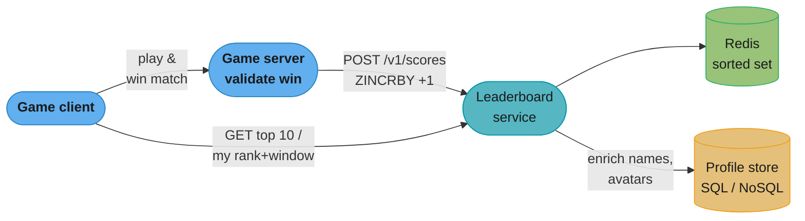
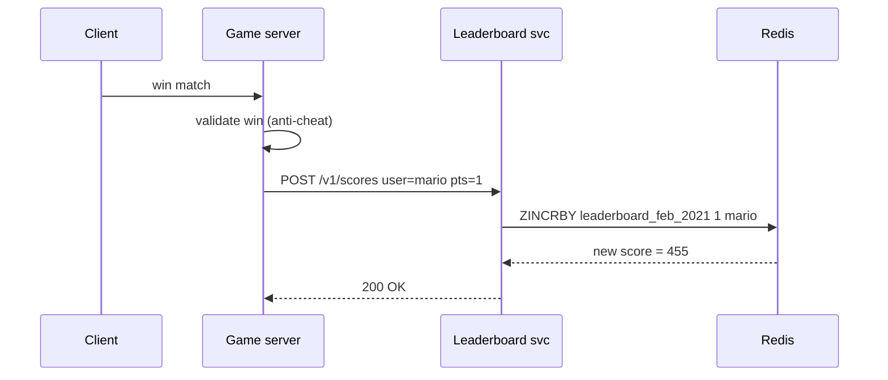
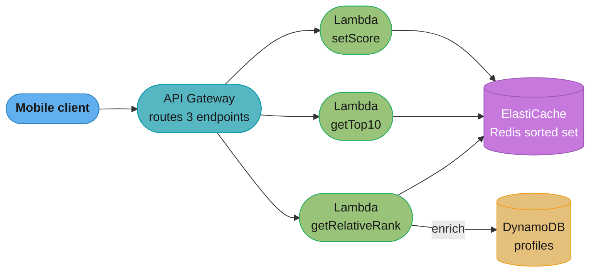
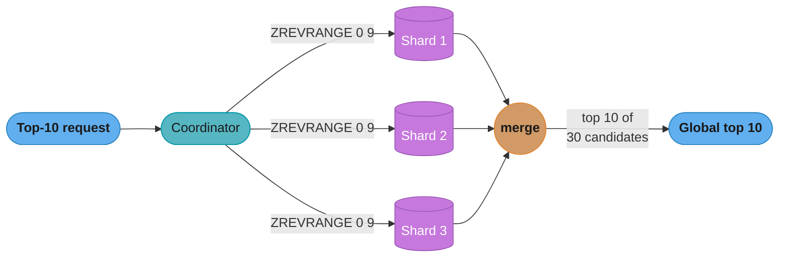
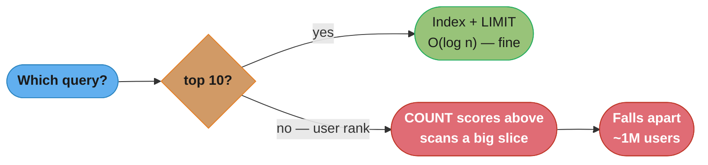
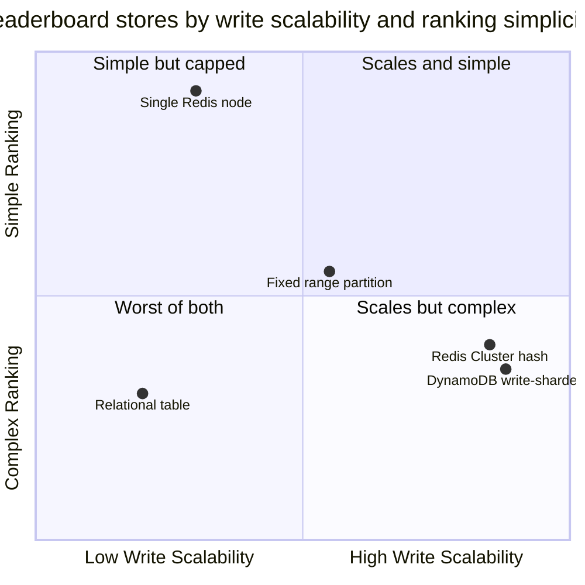

# Chapter 10: Real-time Gaming Leaderboard

> Ch 10 of 13 · System Design Interview Vol 2 (Xu & Lam) · the pick-the-right-data-structure chapter — Redis sorted sets vs SQL ranking, with a serverless detour

## Chapter Map

A leaderboard looks trivial — "sort players by score, show the top 10" — until you add the
two requirements that make it a *systems* problem: it must be **real-time** (a win shows up on
the board within a second) and it must show **each player their own rank plus the handful of
players immediately above and below them**. The naive relational implementation answers "top 10"
cheaply but collapses on "what is player X's rank?" because computing a rank means counting
everyone who scores higher — a scan or a full sort on every request. This chapter's whole arc is
one idea: **choose the data structure that makes rank a first-class O(log n) operation.** That
structure is the Redis **sorted set** (a hash table fused with a skip list). The chapter then
stress-tests the choice: a serverless AWS build (API Gateway + Lambda + ElastiCache), scaling
Redis past one node (fixed score-range partitioning vs Redis Cluster's hash partitioning and its
scatter-gather cost), and a DynamoDB alternative with write sharding — before concluding that
Redis is simply the most natural fit.

**TL;DR:**
- A relational table can do a leaderboard to ~1 million users; then per-query sorting and
  rank-counting kill it. An index + `LIMIT` rescues top-10 but **not** a specific user's rank.
- A **Redis sorted set** = hash table (member → score, O(1)) + **skip list** (ordered, O(log n)):
  `ZINCRBY` to add a point, `ZREVRANGE` for the top 10, `ZREVRANK` for a user's rank, one more
  `ZREVRANGE` for the surrounding window. Monthly reset = a new key per month.
- The data fits on **one node** (~650 MB for 25M daily users) — but one node is neither highly
  available nor infinitely scalable, so you replicate and eventually shard.
- Sharding is where it gets hard: **fixed score-range** partitioning keeps top-10 cheap but must
  count higher shards for a user's rank; **hash** partitioning (Redis Cluster) spreads load evenly
  but turns top-10 into a **scatter-gather**. **DynamoDB** can do it with write sharding, but Redis
  is more natural.

## The Big Question

> "I can sort a million rows. But my real question is never 'give me the sorted list' — it's
> 'what number is *this one* player, and who is right next to them?' Which data structure answers
> *that* in log time instead of scanning the whole board?"

Analogy: a leaderboard is a very long queue where people constantly change places. If all you
ever ask is "who are the first ten?", you glance at the front — cheap. But the moment you ask
"how far back is person X standing, and who are the four ahead and four behind them?", a plain
list forces you to walk the whole queue counting heads. A **skip list** is like posting express
signs every few meters ("position ~500 here", "~1000 here") so you can jump most of the way and
only walk the last few steps. Redis sorted sets give you that queue with the express signs built
in — which is why the entire chapter is a lesson in *picking the right primitive* rather than
inventing an algorithm.

---

## 10.1 Step 1 — Understand the Problem and Establish Design Scope

The problem statement is deceptively small — "design a leaderboard for a mobile game" — so the
first job is to pin down exactly *which* leaderboard behavior is in scope and how big it is.

### Functional requirements

Clarifying questions and their answers define the whole design:

- **How is a score updated?** A user **wins a match** and gains **+1 point**. (Simplification:
  every win is worth exactly one point. The design generalizes trivially to arbitrary point
  values.)
- **What does the leaderboard display?** The **top 10** players, plus — for the logged-in user —
  **their own position** and the **4 players immediately above and 4 immediately below** them
  (the "relative rank" window of 9 rows centered on the user).
- **How current must it be?** **Real-time** (or very near). A win should be reflected essentially
  immediately, not on an hourly batch.
- **What is the time window?** The board is **monthly**: it **resets at the start of each month**,
  so January's standings do not carry into February. (Historical monthly boards are worth keeping,
  so "reset" should mean "start a fresh board," not "erase everything.")
- **Are ties possible, and how are they broken?** Yes — many players share a score. The default
  is to rank the player who **reached the score first** ahead of a later arrival.

Out of scope for the core design but noted: fair-play / anti-cheat enforcement and analytics on
win events (both revisited in Step 3).

### Non-functional requirements

- **Real-time score updates** with low latency.
- **Fast top-10 and fast per-user rank** lookups — the per-user rank is the hard one.
- **Scalable** to a large, spiky player base and **highly available** (a leaderboard is a visible,
  always-on feature).

### Back-of-the-envelope estimation

Assume the game has **25 million daily active users (DAU)** and **500 million monthly active
users (MAU)**. Walk the arithmetic the book walks — the point is to size the write path (score
updates) and the read path (top-10 fetches) separately.

**Naive score-update QPS (one win per user per day):**

```
25,000,000 users / day
--------------------------- ≈ 289  ≈ 290 updates/s   (average)
86,400 s / day
```

Traffic is not flat — game usage peaks in the evening. Applying a **5x peak factor**:

```
290 updates/s x 5 ≈ 1,450 updates/s   (peak, one-win-per-user assumption)
```

**Realistic score-update QPS (each user plays ~10 games/day):**

A DAU does not win once — they play multiple matches. Assume **10 games/day/user**, each capable
of producing a score update:

```
25,000,000 users x 10 games = 250,000,000 score updates / day

250,000,000
------------- ≈ 2,893  ≈ 2,900 updates/s   (average)
86,400 s

2,900 x 5 (peak) ≈ 14,500 updates/s   (peak)
```

So the write path must sustain roughly **2,900 QPS average, ~14,500 QPS peak**.

**Top-10 fetch QPS:** if each user opens the leaderboard about **once per day**, the top-10 read
QPS is the same order as the naive user rate:

```
25,000,000 fetches / day
------------------------- ≈ 289  ≈ 290 fetches/s   (average top-10 reads)
86,400 s
```

**Takeaways from the estimate:**
- Peak write QPS (~14,500) is modest for an in-memory store — a single Redis node handles this
  comfortably (Redis does 100K+ simple ops/s per core).
- The read pattern is dominated by **top-10** (cheap on a sorted set) and **per-user rank+window**
  (also cheap on a sorted set, expensive on SQL) — this is the deciding constraint.
- These numbers say "one Redis node is enough for throughput"; scaling later is driven by
  **availability** and **dataset growth (MAU)**, not raw QPS.

---

## 10.2 Step 2 — Propose High-Level Design and Get Buy-In

### API design

Three endpoints cover every requirement. The **most important design point is that scoring is
server-authoritative** — the client never asserts its own points.

| Endpoint | Purpose | Notes |
|----------|---------|-------|
| `POST /v1/scores` | Record a win, add points | **Called by the game server, not the client.** The client must NOT set `points`. |
| `GET /v1/scores` | Return the top 10 | Public leaderboard view. |
| `GET /v1/scores/{user_id}` | Return a user's rank + the 4 above / 4 below | The "relative rank" window. |

**`POST /v1/scores`** — the request comes from the trusted game server after it validates that the
win actually happened:

```
POST /v1/scores
{
  "user_id":  "mario",
  "points":   1,
  "leaderboard": "leaderboard_feb_2021"
}
```

If the *client* were allowed to call this with its own `points`, any player could POST themselves
to rank 1. So the game server — which already refereed the match — is the only caller. (This
single decision is also the answer to the "faulty/cheated scores" question in Step 3.)

**`GET /v1/scores`** returns the top 10:

```
GET /v1/scores
{
  "data": [
    { "user_id": "peach", "score": 812, "rank": 1 },
    { "user_id": "luigi", "score": 809, "rank": 2 },
    ...
  ],
  "total": 25000000
}
```

**`GET /v1/scores/{user_id}`** returns the user plus the surrounding window:

```
GET /v1/scores/mario
{
  "user_id": "mario",
  "score":   455,
  "rank":    3117,
  "around": [
    { "user_id": "...", "score": 459, "rank": 3113 },   // 4 above
    ...
    { "user_id": "mario", "score": 455, "rank": 3117 },  // the user
    ...
    { "user_id": "...", "score": 451, "rank": 3121 }     // 4 below
  ]
}
```

### High-level design

The request flow is: **game client → game server (validate the win) → leaderboard service →
leaderboard store**, with a separate **profile store** for display data (names, avatars).



Caption: the game server is the trust boundary — only it calls the write endpoint after refereeing
the match; the leaderboard service keeps just `user_id + score` in Redis and joins to the profile
store for display data.

The **score-update path** in sequence form:



Caption: a win becomes a single `ZINCRBY` — one O(log n) skip-list update — so the write path is a
single round trip with no read-modify-write race.

**Should the game server call the leaderboard service directly, or go through a message queue?**
Both are defensible; the answer depends on **how many consumers need the win event**:

- **Direct synchronous call (chosen here).** The win event has exactly one consumer — the
  leaderboard. A synchronous call is the simplest path and gives the lowest end-to-end latency, so
  the score shows up in real time. This matches the requirement.
- **Message queue (e.g. Kafka).** Introduce a queue **when multiple consumers need the same win
  events** — analytics pipelines, anti-fraud/anomaly detection, notification services, prize
  payouts. The game server publishes one `win` event; the leaderboard service, the analytics job,
  and the fraud detector each consume independently. The queue also decouples producer from
  consumer (absorbs bursts, survives a consumer being down) at the cost of added latency and
  operational complexity. For *just* a leaderboard, it is over-engineering; the moment a second
  team wants the win stream, it becomes the right call.

### Why not a relational database first

The instinct is a table. It even works — for a while — so it is worth showing exactly *where* it
breaks, because that failure is the entire justification for reaching for Redis.

**The schema and the update.** A table keyed by user, with a score column:

```sql
CREATE TABLE leaderboard (
  user_id VARCHAR(64) PRIMARY KEY,
  score   INT NOT NULL
);
```

A win is an upsert — increment the score, inserting the row on first win:

```sql
INSERT INTO leaderboard (user_id, score)
VALUES ('mario', 1)
ON DUPLICATE KEY UPDATE score = score + 1;   -- MySQL syntax
```

That part is fine. The problem is **reading a rank.**

**The rank query scans and sorts.** To assign ranks you must order the entire table by score
descending and number the rows:

```sql
SELECT  user_id,
        score,
        (@rank := @rank + 1) AS rank
FROM    leaderboard, (SELECT @rank := 0) r
ORDER BY score DESC;
```

To rank *anyone*, the database sorts *everyone*. At a few thousand rows this is instant; at a
million rows the full sort on every request is already painful; at tens of millions it is
hopeless. Sorting the whole table per query does not scale.

**Refinement 1 — index + `LIMIT` rescues top-10.** Put an index on `score` and ask only for the
first 10:

```sql
CREATE INDEX idx_score ON leaderboard (score);

SELECT user_id, score
FROM   leaderboard
ORDER BY score DESC
LIMIT 10;                     -- fast: the index is already ordered
```

With the index the database walks the ordered index and stops after 10 rows — **top-10 is now
cheap**. Requirement one solved.

**Refinement 2 — but a specific user's rank STILL scans.** The killer requirement is *this user's*
rank, and an index does not save it. A user's rank is "how many players score higher than me,
plus one":

```sql
SELECT COUNT(*) AS higher
FROM   leaderboard
WHERE  score > (SELECT score FROM leaderboard WHERE user_id = 'mario');
-- rank = higher + 1
```

Even with the index on `score`, counting everyone above a mid-table player means traversing a
large slice of the index — potentially millions of entries for a player near the middle. There is
no way around it in SQL: **rank is inherently a count over the ordered set**, and a B-tree index
lets you *find* a value quickly but not *count preceding values* in O(log n). This is why the
relational approach works "to about a million users" and then dies on exactly the feature that
defines a leaderboard.

**The insight:** we need a structure where "how many elements rank above X" is itself a fast,
built-in operation. That is precisely what a Redis sorted set (via its skip list) provides.

### Redis sorted sets — the chosen design

A Redis **sorted set** (ZSET) is the natural home for a leaderboard because it maintains members
in **sorted order by score** *and* gives O(1) score lookup — by combining **two** data structures:

- A **hash table** mapping `member → score`. This answers "what is player X's score?" and "does
  player X exist?" in **O(1)**.
- A **skip list** ordering members by score. This answers "what is the top 10?", "what is player
  X's rank?", and "who are the players around rank R?" in **O(log n)**.

Every write keeps both in sync; every read uses whichever structure is faster. That dual structure
is exactly the "fast score lookup **and** fast rank" pair that SQL could not give at once.

**Skip lists — how the O(log n) actually happens.** A skip list is a sorted linked list with
**extra "express lane" levels layered on top**. The bottom level (level 0) is an ordinary sorted
linked list containing every node. Each higher level is a sparser linked list that **skips over
many nodes**, acting like an express train that stops only at some stations. A search starts at the
**top-left**, moves right until the next node would overshoot the target, then **drops down one
level** and repeats — descending until it lands on (or just before) the target at level 0. Because
each level roughly halves the number of nodes, a search visits about **log₂ n** nodes instead of
walking all n.

The book illustrates this with a small skip list; the trace below searches for score **40**:

```
Level 3  head------------------------------------------> 31--------------------> nil
Level 2  head------------------> 17--------------------> 31--------> 40
Level 1  head-------> 9--------> 17--------> 25--------> 31--------> 40
Level 0  head -> 6 -> 9 -> 12 -> 17 -> 21 -> 25 -> 28 -> 31 -> 37 -> 40 -> 44 -> nil
```

Caption: to reach 40, the search rides the top express lane to 31, drops to level 2, and steps to
40 — visiting ~4 nodes, not the 10 hops the bottom list would require. The higher the level, the
farther each hop jumps, so search cost grows as log n, not n.

**The 64-node intuition.** Scale this up: in a plain sorted linked list, finding the 62nd node
requires ~62 pointer hops. In a skip list over the same 64 nodes, the express levels let you cover
most of the distance in a handful of jumps — roughly **log₂ 64 = 6** hops instead of 62. The
saving is dramatic and grows with n: at a million nodes it is ~20 hops instead of a million. This
is why rank, top-N, and range queries are all cheap on a sorted set while they are scans on a
plain list or a B-tree count.

**The commands.** The whole design is five Redis commands against a per-month key:

| Operation | Command | Meaning |
|-----------|---------|---------|
| Add / initialize a score | `ZADD leaderboard_feb_2021 <score> <user>` | Set `user`'s score (creates the member). |
| Record a win (+1) | `ZINCRBY leaderboard_feb_2021 1 <user>` | Atomically add 1; creates the member at 1 if absent. |
| Top 10 | `ZREVRANGE leaderboard_feb_2021 0 9 WITHSCORES` | Highest-first, ranks 0–9, with scores. |
| A user's rank | `ZREVRANK leaderboard_feb_2021 <user>` | 0-indexed rank in **descending** order (0 = top). |
| Relative window (4 above / 4 below) | `ZREVRANGE leaderboard_feb_2021 <rank-4> <rank+4> WITHSCORES` | The 9 members centered on the user. |

Worked example — Mario wins a match, then we render his relative view:

```
> ZINCRBY leaderboard_feb_2021 1 mario
(integer) 455                             # Mario's new score

> ZREVRANK leaderboard_feb_2021 mario
(integer) 3116                            # 0-indexed; human rank = 3117

> ZREVRANGE leaderboard_feb_2021 3112 3120 WITHSCORES
1) "..."   2) "459"   ...                 # 4 players above,
9) "..."  10) "451"                       # Mario, then 4 below
```

Two gotchas the commands hide:
- **`ZREVRANK`, not `ZRANK`.** `ZRANK` ranks in *ascending* score order (lowest = 0); a leaderboard
  wants highest = 0, so you must use the `REV` variants throughout (`ZREVRANK`, `ZREVRANGE`).
- **Ranks are 0-indexed.** The top player is rank 0. Add 1 before showing a human-facing position,
  and remember the window bounds `rank-4 .. rank+4` are also 0-indexed offsets into the set.

**Monthly reset = a new key per month.** There is no "clear the board" operation; instead the
leaderboard name **encodes the month**: `leaderboard_jan_2021`, `leaderboard_feb_2021`,
`leaderboard_mar_2021`, .... At the month boundary, writes simply start landing in the new key, so
February begins empty while January's board is retained (available for history/rewards) and can be
expired or archived later. This also makes "show me last month's winners" a lookup on the old key
rather than a snapshot you had to remember to take.

### Storage sizing

How much memory does the sorted set need? Size the **worst case** and confirm it fits on one node.

Assume each entry is a **user id + a score ≈ 26 bytes**. For the daily-active population:

```
25,000,000 users x 26 bytes ≈ 650,000,000 bytes ≈ 650 MB
```

**650 MB fits on a single Redis node with room to spare.** Even allowing a **10x** blow-up for
Redis's per-key overhead (sorted-set skip-list pointers, hash-table entries, object headers), you
are at ~6.5 GB — still a single commodity node. Throughput (peak ~14,500 writes/s) is likewise
well within one node. So on capacity grounds, **one Redis node is enough.**

But "one node is enough" is not "one node is acceptable," for two reasons:

- **One node is a single point of failure — not highly available.** If it dies, the leaderboard is
  gone. Fix: **replication** (a primary with one or more replicas; on failure a replica is
  promoted). Reads can also be served from replicas to spread load.
- **Data can be lost on restart unless persisted.** Redis is in-memory; a crash without persistence
  loses the board. Enable **persistence** — **AOF** (append-only file, logs every write, minimal
  loss) and/or **RDB** (periodic point-in-time snapshots, faster restart, coarser recovery). Many
  deployments run both.

Finally, Redis should hold **only what the leaderboard needs** — `user_id` and `score`. Rich
**user profile data** (display name, avatar, country) belongs in a **separate relational or NoSQL
store** that is the source of truth for user records. The leaderboard service reads ids/scores from
Redis and **enriches** them with profile data before returning to the client. Keeping profiles out
of Redis is what keeps the sorted set small (the 26-bytes-per-entry figure) and fast.

---

## 10.3 Step 3 — Design Deep Dive

Four deep dives: a cloud-native serverless build, scaling Redis past one node, a DynamoDB
alternative, and the odds-and-ends (ties, cheating).

### Cloud-native option — API Gateway + Lambda + ElastiCache

Instead of running leaderboard servers yourself, build it **serverless** on AWS: **API Gateway**
fronts the three endpoints and routes each to a **Lambda function**, and the functions read/write
**ElastiCache (Redis)**.



Caption: each endpoint maps to a Lambda; the functions share one ElastiCache sorted set. There are
no servers to patch or scale — API Gateway and Lambda absorb spikes automatically.

**When serverless fits:**
- **Spiky game traffic.** Player activity is bursty (evenings, weekends, a viral moment). Lambda
  scales out per request automatically; you are not paying for idle fleet capacity between spikes.
- **No server operations.** No fleet to provision, patch, autoscale, or right-size — AWS runs it.
- **Pay-per-use** billing suits variable, hard-to-forecast load.

**Its caveats:**
- **Cold starts.** A Lambda that has not run recently must spin up a fresh execution environment,
  adding latency to that request — noticeable on a low-traffic function or right after a scale-out.
  Mitigations: **provisioned concurrency** (keep warm instances ready) at extra cost.
- **Connection pooling.** Each Lambda invocation is a short-lived, isolated environment. If every
  invocation opens its **own** Redis connection, a burst can **exhaust Redis's connection limit**
  and add per-request TCP/handshake latency — the classic "Lambda + database connections" problem.
  Mitigations: reuse the connection across invocations of a warm container (declare the client
  outside the handler), cap concurrency, or front the store with a connection proxy.

### Scaling Redis beyond one node

One node held 25M DAU at ~650 MB. But push the requirement to the **500M MAU** figure with
**richer per-user data**, and the book's extended sizing lands around **~65 GB** — too big for a
single node's memory, and/or the QPS eventually outgrows one core. Now you must **partition** the
sorted set across shards. Two strategies, with opposite strengths.

**Strategy A — fixed partition by score range.** Assign each shard a contiguous **score band**:

```
Shard 1: scores    1 – 100
Shard 2: scores  101 – 200
Shard 3: scores  201 – 300
...
Shard N: scores  (highest band)
```

The application routes each write to the shard owning that user's score (**app-side routing**),
and moves a user across shards when their score crosses a band boundary.

- **Top-10 is easy.** The top players are, by definition, in the **highest-scoring shard**. Query
  just that one shard's `ZREVRANGE 0 9`. (If the top band has fewer than 10, spill into the next.)
- **A user's rank needs cross-shard arithmetic.** Rank = **the user's rank within their own shard**
  **plus the total member counts of all higher-band shards**. You keep a per-shard `ZCARD` (member
  count) and sum the counts of every shard above the user's band, then add the local `ZREVRANK`.
  Fetchable, but no longer a single command.
- **Weakness:** score distributions are **skewed** — most players cluster at low scores, so the
  low bands become **hot** while the top band is nearly empty. You must know the distribution to
  size bands, and **rebalancing** bands as the population shifts is operationally painful.

**Strategy B — hash partition (Redis Cluster).** Redis Cluster shards by hashing the key into one
of **16,384 hash slots**, with slots spread across nodes and membership tracked by a **gossip
protocol**. Members land on shards **randomly** (by hash), so load is **even** and no band gets
hot.

- **Top-10 becomes a scatter-gather.** Because the highest scores are scattered across *all*
  shards, you cannot ask one shard for the global top 10. Instead you **scatter** `ZREVRANGE 0 9`
  to **every** shard, then **gather** the partial top-10s and **merge** them to find the global top
  10. The cost is **fan-out latency** — the request is as slow as the slowest shard — and it grows
  with shard count.
- **A user's rank is also hard** — their global rank depends on how many members outscore them
  *across all shards*, so you must query every shard for its count above the user's score.
- **Strength:** even load distribution and elastic scaling; **weakness:** every ranking/top-N query
  pays the scatter-gather tax.



Caption: hash partitioning scatters the top scores across every shard, so a global top-10 must
fetch each shard's local top-10 and merge the 3N candidates — latency is bounded by the slowest
shard and rises with fan-out.

**When each wins:**

| | Fixed score-range partition | Hash partition (Redis Cluster) |
|---|---|---|
| Top-10 query | Cheap — one shard (highest band) | **Scatter-gather** across all shards |
| User rank query | Local rank + sum of higher-shard counts | Query every shard for counts above user |
| Load distribution | **Skewed** — low bands hot | **Even** — hashing spreads load |
| Routing | App-side, by score band | Automatic, by hash slot |
| Rebalancing | Painful (bands shift with population) | Built-in slot migration |
| Best when | Top-N dominates and you know the score distribution | Write/read load must spread evenly |

### Alternative — NoSQL (DynamoDB)

The book shows a **DynamoDB** design to prove a relational-style store *can* do it, then argues
Redis is more natural. The central challenge is DynamoDB's **hot partition** problem: if every
write for a leaderboard used the same partition key (e.g. `game_name#month`), all traffic would
hammer one partition and throttle.

**Write sharding the partition key.** Spread writes by **appending a random shard suffix** to the
partition key, splitting one logical leaderboard across **N physical partitions**:

```
Partition key:  "chess#2021-02#<shard>"       where <shard> ∈ 1..N (random per write)
Sort key:        score   (via a global secondary index for score-ordered reads)
Attributes:      user_id, score, updated_at
```

Each write picks a random suffix `1..N`, so writes spread evenly across N partitions and no single
partition is hot. To read the board **score-ordered**, a **global secondary index (GSI)** keyed
with `score` as the sort key lets each partition return its members in score order.

**Reads are a scatter-gather over the write shards.** Because a leaderboard is now split across N
partitions, any top-N or rank query must **query all N write-shards, then merge**:

- **Top-10:** query each of the N shards for its top 10 (via the score GSI), gather the N x 10
  candidates, and merge to the global top 10 — the same scatter-gather shape as Redis Cluster.
- **User rank:** aggregate counts of higher scores across all N shards.

More write shards ⇒ less hot-partition risk but **more expensive reads** (wider fan-out). Choosing
N trades write smoothness against read fan-out.

**Verdict:** DynamoDB **can** implement a leaderboard — write sharding plus a score GSI plus
scatter-gather reads — and it brings managed durability and elastic scale. But you are **rebuilding
the sorted-set ranking that Redis gives for free**, and every read pays the scatter-gather tax.
**Redis is the more natural fit** for the ranking workload; DynamoDB (or the profile store) is
better as the durable source of truth for user records alongside Redis.

### Odds and ends the book covers

**Tie-breaking.** Many players share a score, so "who ranks higher at 455 points?" needs a rule.
The chosen rule: **whoever reached the score first ranks higher.** A raw Redis sorted set breaks
score ties **lexicographically by member name**, which is arbitrary and unfair. To honor
"first-to-reach-wins," fold a **timestamp into the score** so it becomes a **composite sort key** —
e.g. keep the integer points in the high-order part and encode the (inverted) arrival time in the
fractional/low-order part, so that among equal point totals the **earlier** timestamp sorts ahead.
A common encoding: `composite = points - (timestamp / LARGE_CONSTANT)`, so more points always
dominate, and among equal points the smaller timestamp yields a slightly larger composite score.
The sorted set then ranks ties correctly with no extra query.

**Faulty / cheated scores.** Two defenses, one structural and one detective:
- **Server authority (structural).** The client never sets its score — only the **game server**,
  after refereeing the match, calls `POST /v1/scores`. This is why the API is designed the way it
  is; it removes the entire class of "player POSTs themselves to rank 1" cheats.
- **Anomaly detection (detective).** Server authority does not stop a compromised client or an
  exploit, so run **anomaly detection** on the win stream — flag impossible win rates, superhuman
  reaction times, or statistically implausible streaks for review and rollback. This is a natural
  consumer of the **message-queue** win stream from Step 2: publish `win` events once and let a
  fraud-detection service consume them alongside the leaderboard.

---

## 10.4 Step 4 — Wrap Up

The leaderboard is a study in **choosing the right primitive**. A relational table handles the
writes and even the top-10 (with an index), but a **specific user's rank** is inherently a count
over the ordered set that a B-tree cannot do in log time — so it scans, and the design dies at
~a million users on the one feature that defines a leaderboard. The **Redis sorted set** solves it
directly: a hash table for O(1) score lookup fused with a **skip list** for O(log n) rank, top-N,
and range queries. Five commands (`ZADD`/`ZINCRBY`, `ZREVRANGE`, `ZREVRANK`, and a second
`ZREVRANGE` for the window) cover every requirement, and a per-month key gives a clean reset with
retained history.

The data fits on **one node** (~650 MB for 25M DAU), so scaling is driven by **availability**
(replication + AOF/RDB persistence) and **dataset growth**, not raw throughput. When one node is
no longer enough (~65 GB at 500M MAU), you shard — and the deep dive's real lesson is that
**there is no free lunch**: **fixed score-range** partitioning keeps top-10 cheap but skews load
and complicates rank; **hash** partitioning (Redis Cluster) evens the load but turns top-10 into a
**scatter-gather**. The **serverless** build (API Gateway + Lambda + ElastiCache) removes ops for
spiky traffic at the cost of cold starts and connection-pool care. **DynamoDB** can do it with
write sharding and a score GSI, but you rebuild ranking by hand and pay scatter-gather on reads —
so **Redis is the natural choice**. Round it out with **timestamp-composite tie-breaking** and
**server authority + anomaly detection** against cheating.

If time remains in an interview, mention: caching a **static top-10** for the public view (it
changes less often than individual ranks), separating the **hot write path** from the **read path**
with replicas, and using the **message queue** to fan win events out to analytics and fraud
detection.

---

## Visual Intuition

**Skip list — the express-lane trace (why rank is O(log n)).**

```
Level 3  head------------------------------------------> 31--------------------> nil
Level 2  head------------------> 17--------------------> 31--------> 40
Level 1  head-------> 9--------> 17--------> 25--------> 31--------> 40
Level 0  head -> 6 -> 9 -> 12 -> 17 -> 21 -> 25 -> 28 -> 31 -> 37 -> 40 -> 44 -> nil
```

Caption: the higher levels are express trains skipping most stations; a search rides the top lane
until the next hop would overshoot, drops a level, and repeats — visiting ~log₂ n nodes. This is
the mechanism a B-tree count cannot match and the whole reason a sorted set beats SQL on rank.

**The relational cliff — where SQL breaks.**



Caption: an index rescues top-10 but a user's rank is a `COUNT(*) WHERE score > X`, which scans a
large index range — the exact query that forces the switch to a sorted set.

**Storage-engine tradeoff space.**



Caption: a single Redis node is the simplest ranking primitive but caps at one box; scaling out
(Redis Cluster, DynamoDB) buys write scalability but reintroduces scatter-gather complexity — the
central tradeoff of the deep dive.

---

## Key Concepts Glossary

- **Leaderboard** — ranking of players by score; here a **monthly**, real-time board.
- **Relative rank view** — a user's own rank plus the 4 players above and 4 below (a 9-row window).
- **Server-authoritative scoring** — only the trusted game server sets points; the client cannot.
- **DAU / MAU** — daily / monthly active users (here 25M / 500M).
- **Score-update QPS** — writes per second from wins (~2,900 avg, ~14,500 peak).
- **Sorted set (ZSET)** — Redis structure keeping members ordered by score.
- **Skip list** — multi-level linked list giving O(log n) search/insert/rank via express lanes.
- **Hash table (in a ZSET)** — the member→score map giving O(1) score lookup.
- **`ZADD` / `ZINCRBY`** — set a score / atomically add to it (used for +1 on a win).
- **`ZREVRANGE`** — return a rank range in descending score order (top-10, and the window).
- **`ZREVRANK`** — a member's 0-indexed rank in descending order (0 = top).
- **`ZRANK`** — ascending-order rank (the wrong one for a leaderboard).
- **`ZCARD`** — member count of a set (used to sum higher shards for a global rank).
- **`WITHSCORES`** — flag to return scores alongside members.
- **Monthly key** — `leaderboard_<month>_<year>`; a new key per month is the reset mechanism.
- **AOF / RDB** — Redis append-only-file / snapshot persistence.
- **Replication** — primary + replicas for high availability and read scaling.
- **API Gateway + Lambda** — AWS serverless: managed HTTP front + per-request functions.
- **ElastiCache** — AWS managed Redis.
- **Cold start** — latency when a Lambda spins up a fresh environment.
- **Fixed (score-range) partitioning** — shard by contiguous score bands; app-side routing.
- **Hash partitioning / Redis Cluster** — shard by hashing into 16,384 slots; even load.
- **Hash slots (16,384)** — Redis Cluster's fixed slot space distributed across nodes.
- **Gossip protocol** — how Redis Cluster nodes share membership/slot state.
- **Scatter-gather** — query all shards, merge partials (top-10 on a hash-partitioned cluster).
- **Write sharding** — appending a random suffix to a key to spread writes (DynamoDB hot-partition fix).
- **Global secondary index (GSI)** — DynamoDB index with a different key (here score as sort key).
- **Hot partition** — one DynamoDB partition taking disproportionate traffic and throttling.
- **Tie-breaking** — first-to-reach-wins, via a timestamp folded into a composite score.
- **Anomaly detection** — flagging impossible win patterns to catch cheating.

---

## Tradeoffs & Decision Tables

**Store choice for the ranking workload:**

| Store | Rank query | Top-10 | Write scale | Verdict |
|-------|-----------|--------|-------------|---------|
| Relational table | `COUNT(*)` scan — dies ~1M users | Fast with index+LIMIT | Vertical | Wrong tool for rank |
| Single Redis sorted set | `ZREVRANK` O(log n) | `ZREVRANGE` O(log n) | One node (~14.5K QPS ok) | **Chosen** |
| Redis Cluster (hash) | Per-shard counts | **Scatter-gather** | Even, elastic | Scale, at read cost |
| Fixed range partition | Local rank + higher-shard counts | One (top) shard | Skewed | Top-N heavy, known distribution |
| DynamoDB (write-sharded) | Cross-shard aggregate | Scatter-gather | High, managed | Possible, less natural |

**Direct call vs message queue for win events:**

| | Direct synchronous call | Message queue (Kafka) |
|---|---|---|
| Latency | Lowest (real-time) | Added queue hop |
| Consumers | One (leaderboard) | Many (analytics, fraud, notifications) |
| Coupling | Tight | Decoupled, buffers bursts |
| Complexity | Minimal | Broker to operate |
| Use when | Only the board consumes | Multiple teams need win events |

**Serverless vs self-managed servers:**

| | Serverless (API Gateway + Lambda) | Self-managed fleet |
|---|---|---|
| Ops burden | None (AWS runs it) | Provision, patch, autoscale |
| Spiky traffic | Auto-scales per request | Must pre-provision headroom |
| Latency floor | Cold starts possible | Warm, predictable |
| DB connections | Pooling is tricky | Long-lived pools |
| Cost model | Pay-per-use | Pay for capacity |

---

## Common Pitfalls / War Stories

- **Building it in SQL and shipping — then the rank query melts.** Top-10 looks fine in testing
  (index + LIMIT), so the design ships; then a mid-table player's `GET /scores/{id}` runs
  `COUNT(*) WHERE score > X` across millions of index entries and p99 explodes. The rank feature,
  not the top-10, is the one that needs a sorted set.
- **Using `ZRANK` instead of `ZREVRANK`.** `ZRANK` ranks ascending, so the *worst* player shows as
  rank 1. Every range/rank call in a leaderboard must use the `REV` variant. Easy to miss because
  both return plausible-looking small integers.
- **Forgetting ranks are 0-indexed.** Displaying the raw `ZREVRANK` shows the champion as "rank 0";
  the window bounds `rank-4 .. rank+4` are 0-indexed offsets too. Off-by-one here is a visible bug.
- **Letting the client set its own points.** If `POST /v1/scores` trusts a client-supplied
  `points`, players POST themselves to the top. Only the game server, after validating the win,
  may write scores — this is a design decision, not an afterthought.
- **Running one Redis node in production.** It fits and it is fast, so someone runs a single node —
  and one crash erases the live board. Replicate for HA and enable AOF/RDB so a restart does not
  lose the month's standings.
- **Lambda exhausting Redis connections.** Under a spike, each invocation opens its own Redis
  connection and the store hits its connection cap, throwing errors mid-burst. Reuse the client
  across warm invocations and cap concurrency, or front Redis with a proxy.
- **Fixed score-range shards going hot.** Bands look balanced on paper, but scores cluster low, so
  the bottom band takes most writes and becomes a hotspot while the top band idles. You must size
  bands to the real distribution and rebalance as it shifts.
- **Assuming top-10 is cheap on Redis Cluster.** Hash partitioning scatters the top scores, so a
  global top-10 is a scatter-gather bounded by the slowest shard — not the single-shard `ZREVRANGE`
  people expect. Cache the public top-10 if it is read-hot.
- **Ties resolved by name.** Left to defaults, a raw sorted set orders equal scores
  lexicographically, so "Aaron" always beats "Zoe" at the same score. Fold a timestamp into the
  score for fair first-to-reach ordering.

---

## Real-World Systems Referenced

**Redis** (sorted sets, `ZADD`/`ZINCRBY`/`ZREVRANGE`/`ZREVRANK`, skip lists, AOF/RDB persistence,
replication, Redis Cluster with 16,384 hash slots and gossip); **Amazon ElastiCache** (managed
Redis); **AWS API Gateway** and **AWS Lambda** (serverless build); **Amazon DynamoDB** (NoSQL
alternative with write sharding and global secondary indexes); **Apache Kafka** (message queue for
fanning win events to analytics/fraud); **MySQL** (the relational attempt with
`INSERT ... ON DUPLICATE KEY UPDATE`).

---

## Summary

A gaming leaderboard is easy to under-specify and easy to build wrong. The requirements that make
it real are **real-time updates**, a **monthly reset**, and a **per-user rank with a surrounding
window** — and that last one is the trap. A relational table, even with a `score` index and
`LIMIT`, answers top-10 cheaply but computes a user's rank as a `COUNT(*)` over everyone scoring
higher, which scans and collapses around a million users. The fix is to pick a structure where
rank is a native operation: the **Redis sorted set**, a **hash table** (O(1) score lookup) fused
with a **skip list** (O(log n) rank, top-N, range). Five commands implement everything, and
encoding the month in the key gives a clean reset.

Capacity says **one node suffices** (~650 MB for 25M DAU, peak ~14,500 writes/s), so scaling is
driven by **HA** (replication, AOF/RDB) and **growth** — at ~65 GB for 500M MAU you must shard.
The deep dive's honest lesson is that every scaling option trades something: **fixed score-range**
partitioning keeps top-10 on one shard but skews load and needs cross-shard math for rank;
**hash** partitioning (Redis Cluster) balances load but makes top-10 a **scatter-gather**;
**serverless** (API Gateway + Lambda + ElastiCache) removes ops for spiky traffic but adds cold
starts and connection-pool hazards; **DynamoDB** works with write sharding and a score GSI but
rebuilds ranking by hand and scatter-gathers reads. Finish with **timestamp-composite tie-breaking**
and **server authority plus anomaly detection** against cheating — and the recurring theme is
that the whole design lives or dies on choosing the right data structure for *rank*.

---

## Interview Questions

**Q: Why use a Redis sorted set for a leaderboard instead of a relational table?**
A sorted set answers a user's rank in O(log n) via its skip list, whereas a SQL table must sort or count over the whole table for every rank lookup. The sorted set fuses a hash table (O(1) score lookup) with a skip list (ordered rank/range), so top-10, rank, and the surrounding window are all cheap built-in operations. A relational table works to about a million users and then the per-query sort or `COUNT(*)` above a score dominates. Reach for the sorted set precisely because rank is a first-class operation on it.

**Q: Why does adding an index and LIMIT fix the top-10 query but NOT a specific user's rank in SQL?**
An index makes top-10 fast because the database walks the ordered index and stops after 10 rows, but a user's rank still requires counting everyone who scores higher. That count, `COUNT(*) WHERE score > X`, traverses a large slice of the index — millions of entries for a mid-table player — because a B-tree can find a value in log time but cannot count preceding values in log time. So top-10 is O(log n) but rank stays a scan. This asymmetry is the exact reason the relational design fails at scale.

**Q: What is the difference between ZRANK and ZREVRANK, and which one does a leaderboard need?**
ZREVRANK returns the rank in descending score order (rank 0 = highest score), which is what a leaderboard needs; ZRANK ranks in ascending order (rank 0 = lowest). Using ZRANK by mistake shows the worst player as number one. Every ranking and range call in a leaderboard must use the REV variants (ZREVRANK, ZREVRANGE). It is an easy bug because both return plausible small integers.

**Q: Are Redis sorted-set ranks 0-indexed or 1-indexed, and why does it matter?**
They are 0-indexed, so the top player has rank 0 and you must add 1 before showing a human-facing position. The window bounds for the relative view, rank-4 to rank+4, are also 0-indexed offsets into the set. Displaying the raw rank shows the champion as "rank 0," and off-by-one errors in the window are visible bugs. Always translate the 0-indexed engine rank to a 1-indexed display rank.

**Q: What two data structures back a Redis sorted set and what does each provide?**
A sorted set combines a hash table mapping member to score (O(1) lookup) with a skip list that keeps members ordered by score (O(log n) rank, top-N, and range queries). Every write updates both so they stay in sync, and every read uses whichever is faster. This is exactly the "fast score lookup and fast rank at the same time" pair that a relational table cannot deliver together. The dual structure is the whole reason a sorted set fits a leaderboard.

**Q: How does a skip list achieve O(log n) search?**
A skip list stacks express-lane levels over a sorted linked list, so a search rides a high level until the next hop would overshoot, then drops down a level and repeats. Because each level skips roughly half the remaining nodes, a search visits about log₂ n nodes instead of walking all n. In a 64-node list that is about 6 hops instead of 62. This is the mechanism that makes rank and range queries cheap where a plain linked list or B-tree count would be linear.

**Q: How do you show a user's rank with 4 players above and below?**
Get the user's rank with ZREVRANK, then call ZREVRANGE from rank-4 to rank+4 WITHSCORES to fetch the 9-row window centered on the user. The first call is O(log n) and the range call returns the surrounding members in order. Remember both the rank and the offsets are 0-indexed. This two-command pattern is the entire "relative rank" feature.

**Q: How is the monthly reset implemented without deleting data?**
Use one Redis key per month, such as leaderboard_feb_2021, so a new month starts a fresh sorted set while the previous month's key is retained. There is no "clear" operation; writes simply start landing in the new key at the month boundary. Old keys can be archived or expired later, and "last month's winners" is just a lookup on the previous key. Encoding the month in the key name is the reset mechanism.

**Q: Why must the score-update API be server-authoritative?**
Because a client that can set its own points can POST itself straight to rank 1, so only the game server, after validating the win, calls POST /v1/scores. The client never sends a trusted points value. This single design decision removes the entire class of client-side scoring cheats and is why the write endpoint is called by the server, not the app. It also pairs with anomaly detection to catch exploits that slip past validation.

**Q: When should the game server publish win events to a message queue instead of calling the leaderboard directly?**
Use a queue when multiple consumers — analytics, anti-fraud, notifications, payouts — need the same win events; a direct synchronous call is fine when only the leaderboard consumes them. The direct call gives the lowest latency for real-time updates. A queue like Kafka lets the server publish one event that many services consume independently, and it buffers bursts and survives a down consumer, at the cost of added latency and a broker to operate. For just a leaderboard it is over-engineering; a second consumer flips the decision.

**Q: How much memory does the leaderboard need, and does it fit on one Redis node?**
About 650 MB for 25M daily users at roughly 26 bytes each, which fits comfortably on a single Redis node. Even a 10x blow-up for Redis object and skip-list overhead is about 6.5 GB, still one commodity node, and the peak of ~14,500 writes/s is well within a single core. So on capacity grounds one node is enough. Scaling is then driven by availability and dataset growth, not throughput.

**Q: If it fits on one node, why shard Redis at all?**
Because one node is a single point of failure and a hard memory/throughput ceiling, so you replicate for HA and shard when data or QPS outgrows one box. A single node crash erases the live board, which is why you run a primary with replicas plus AOF/RDB persistence. The 25M-DAU board fits in ~650 MB, but the 500M-MAU board with richer data reaches ~65 GB and no longer fits in one node's memory. Sharding is a growth and availability decision, not a first-day one.

**Q: How does fixed score-range partitioning answer a top-10 vs a user-rank query?**
Top-10 hits only the highest score-range shard, while a user's rank needs the shard-local rank plus the total member counts of every higher-band shard. Each shard owns a contiguous score band and the app routes writes by score. Top players live in the top band, so top-10 is a single-shard query, but a global rank sums ZCARD counts of all higher bands and adds the local ZREVRANK. Its weakness is skew: scores cluster low, so low bands go hot.

**Q: Why does Redis Cluster (hash partitioning) turn top-10 into a scatter-gather?**
Hash slotting places members on shards by hash, scattering the highest scores across all shards, so a global top-10 must fetch each shard's local top 10 and merge them. You cannot ask one shard for the global leaders because they are spread randomly. The merge over N x 10 candidates is bounded by the slowest shard's latency and grows with shard count. The upside is even load and elastic scaling; the downside is that every ranking query pays the fan-out tax.

**Q: How do you avoid a hot partition when storing a leaderboard in DynamoDB?**
Write-shard the partition key by concatenating game#month with a random suffix 1..N so writes spread across N partitions instead of hammering one. Without the suffix, all writes for one leaderboard target a single partition and throttle. A global secondary index with score as the sort key lets each partition return members in score order. The tradeoff is that N shards must be scatter-gathered on reads, so more shards means smoother writes but wider read fan-out.

**Q: How does DynamoDB read the top players once writes are sharded?**
It scatter-gathers: query each of the N write-shards for its top members via the score GSI, then merge the partials into the global top 10. Because the leaderboard is split across N partitions for write smoothing, no single query sees all the leaders. This is the same scatter-gather shape as Redis Cluster, and a user's rank likewise aggregates counts across all shards. It works, but you are rebuilding by hand the ranking Redis gives for free.

**Q: How do you break ties when two players share the same score?**
Break ties by who reached the score first, typically by folding a timestamp into the score's fractional part so equal point totals rank the earlier arrival higher. A raw sorted set otherwise orders equal scores lexicographically by member name, which is arbitrary and unfair. A common encoding keeps integer points dominant and encodes inverted arrival time in the low-order part, so more points always win and earlier timestamps break ties. The sorted set then ranks ties correctly with no extra query.

**Q: Why is serverless (API Gateway + Lambda) attractive for this game, and what breaks?**
Serverless auto-scales for spiky game traffic with no servers to run, but cold starts and per-invocation Redis connections hurt latency. API Gateway fronts the endpoints and Lambda runs each request against ElastiCache, so you pay per use and never provision a fleet. The caveats are cold starts (mitigated with provisioned concurrency) and connection exhaustion when each invocation opens its own Redis connection under a burst. Reuse connections across warm invocations and cap concurrency to control it.

**Q: Besides Redis, where does user profile data live and why?**
Profile data such as display name, avatar, and country lives in a separate relational or NoSQL store, while Redis holds only user_id and score to stay small and fast. Keeping profiles out of the sorted set is what preserves the ~26-bytes-per-entry figure and the single-node fit. The leaderboard service reads ids and scores from Redis and enriches them with profile data before returning to the client. The profile store is the durable source of truth for user records.

**Q: How do you handle faulty or cheated scores?**
Server authority stops clients from setting their own scores, and anomaly detection flags impossible win patterns for review. Only the game server writes scores after refereeing the match, which removes client-side score spoofing structurally. For exploits that slip past validation, an anomaly detector consumes the win stream and flags superhuman win rates or implausible streaks. This is a natural second consumer of the message-queue win events, running alongside the leaderboard.

**Q: What is the update-QPS estimate and how is it derived?**
About 2,900 average and ~14,500 peak, from 25M users times 10 games per day divided by 86,400 seconds, times a 5x peak factor. The 25M x 10 gives 250M updates per day, which is ~2,900/s averaged, and the evening peak multiplier of 5 gives ~14,500/s. A naive one-win-per-user model gives only ~290/s average and ~1,450/s peak. Either way the write load is modest for an in-memory store, so one Redis node suffices on throughput.

**Q: Why can't you get a user's exact rank cheaply in a hash-partitioned cluster?**
Because their rank depends on how many members outscore them across all shards, so you must query every shard for its count of higher scores and sum them. Hash partitioning scatters members randomly, so no single shard knows the global ordering. This makes rank a scatter-gather just like the global top-10, bounded by the slowest shard. It is the price of the even load distribution that hash partitioning buys.

---

## Cross-links in this repo

- [hld/case_studies/design_leaderboard.md — the standalone leaderboard case study (Redis sorted sets, sharding, scatter-gather)](../../../hld/case_studies/design_leaderboard.md)
- [hld/caching/README.md — Redis, cache patterns, replication, persistence](../../../hld/caching/README.md)
- [database/database_caching_patterns/README.md — read-through/enrichment, cache-aside for the profile join](../../../database/database_caching_patterns/README.md)
- [book/system_design_interview_vol_1/06_design_a_key_value_store/README.md — replication, consistency, and partitioning primitives behind Redis](../../system_design_interview_vol_1/06_design_a_key_value_store/README.md)
- [book/system_design_interview_vol_2/06_ad_click_event_aggregation/README.md — the sibling counting/aggregation design (win events, queues, hot keys)](../06_ad_click_event_aggregation/README.md)
- [book/designing_data_intensive_applications/06_partitioning/README.md — range vs hash partitioning, hot spots, scatter-gather (DDIA)](../../designing_data_intensive_applications/06_partitioning/README.md)

## Further Reading

- Xu & Lam, System Design Interview Vol 2, Ch 10 — original text and references.
- Redis documentation — Sorted Sets (`ZADD`, `ZINCRBY`, `ZREVRANGE`, `ZREVRANK`) and Redis Cluster.
- William Pugh, "Skip Lists: A Probabilistic Alternative to Balanced Trees," 1990 — the skip-list paper.
- AWS documentation — API Gateway, Lambda, ElastiCache for Redis, and DynamoDB write sharding / secondary indexes.
