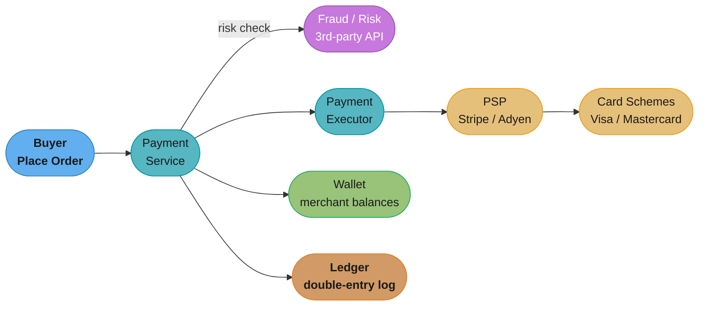
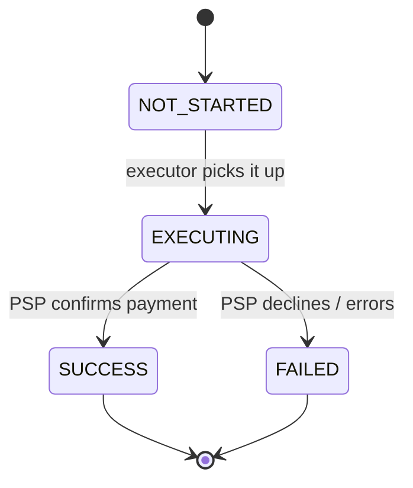
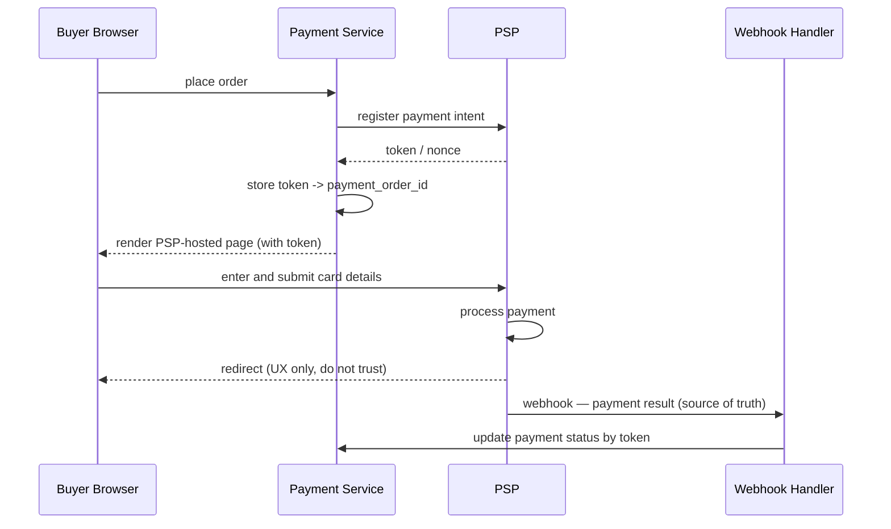
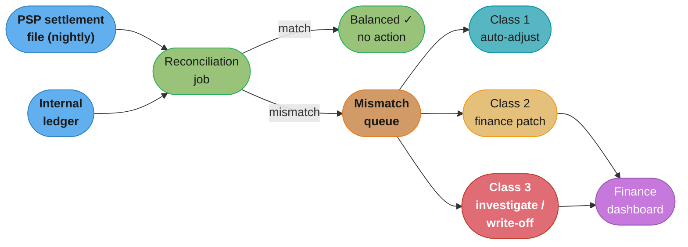
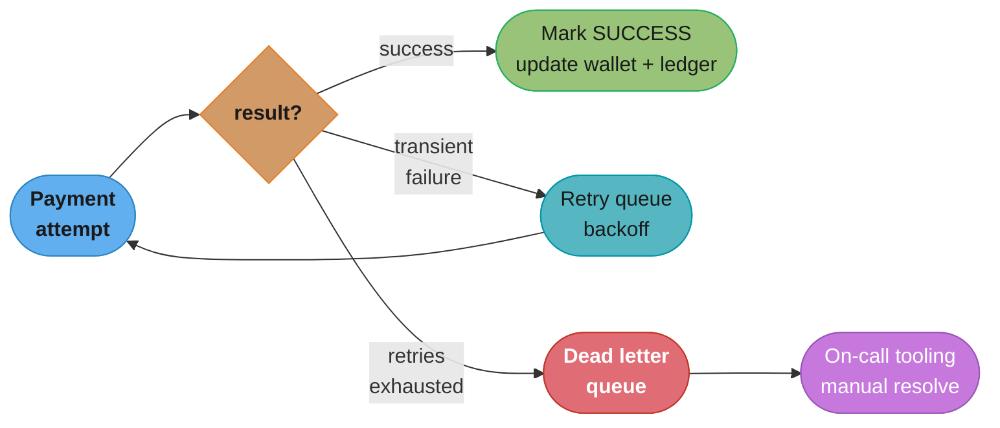
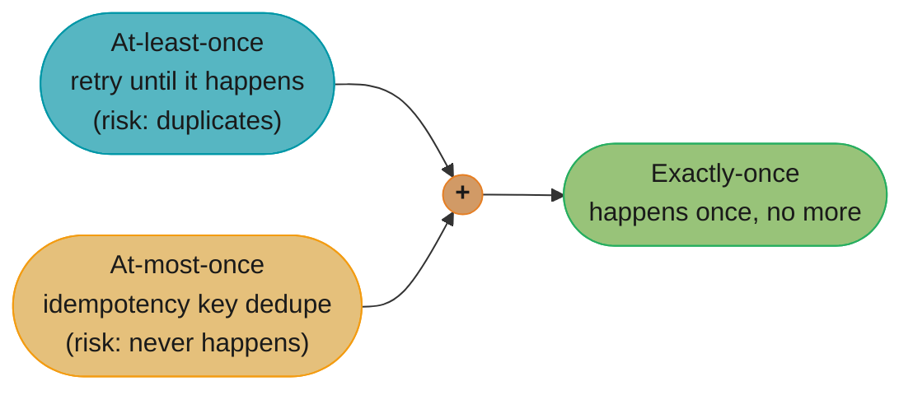

# Chapter 11: Payment System

> Ch 11 of 13 · System Design Interview Vol 2 (Xu & Lam) · builds on Ch 7's idempotency — money enters the design: ledgers, PSPs, and reconciliation

## Chapter Map

This is the chapter where *correctness*, not throughput, is the whole game. A payment system for an
e-commerce marketplace (think Amazon) has two jobs: take money from a buyer when they check out
(the **pay-in flow**), and hand money to sellers for goods sold (the **pay-out flow**). The traffic
is trivial — 1 million transactions/day is roughly **10 transactions per second** — so nothing here
is about scale. Everything is about never losing, duplicating, or mis-recording a cent, even when
services crash, networks drop acknowledgments, and a buyer double-clicks "Place Order." The chapter
leans hard on a **Payment Service Provider (PSP)** (Stripe, Braintree, Adyen) so you never touch raw
card numbers, and it closes with **reconciliation** — the nightly cross-check that is the last line of
defense against silent money bugs.

**TL;DR:**
- A payment system is a **correctness problem, not a scale problem**: 10 TPS, but every transaction
  must be exactly-once. **Exactly-once = at-least-once (retries) + at-most-once (idempotency).**
- Never build card processing yourself — use a **PSP** and a **hosted payment page** so raw card data
  (the PAN) never enters your servers, shrinking your **PCI DSS** compliance scope to almost nothing.
- The money log is a **double-entry ledger**: every transaction writes a balanced debit and credit
  that sum to zero, append-only and immutable — the audit foundation.
- **Reconciliation** compares the PSP's nightly **settlement file** against your ledger and routes
  each mismatch to auto-fix, finance-team manual patching, or write-off. It catches what everything
  upstream missed.

## The Big Question

> "Money is the one payload you cannot lose, duplicate, or invent. At only 10 TPS you have all the
> compute you need — so how do you make an inherently unreliable distributed system (crashing
> services, retried requests, third-party providers) move real money **exactly once**, and *prove*
> afterward that it did?"

Analogy: a payment system is double-entry bookkeeping wearing a distributed-systems costume. A
medieval merchant's ledger and a modern PSP integration answer the same question — *did the money
that left one account arrive, exactly once, in another, and can I reconcile the books at night?* The
whole chapter is: retry until it lands (at-least-once), dedupe so it lands only once (at-most-once),
write it down in a balanced, immutable ledger, and reconcile against the outside world every night.

---

## 11.1 Step 1 — Understand the Problem and Establish Design Scope

A "payment system" means very different things to different people — a full processing network like
Visa, a digital wallet like Apple Pay, or the money-movement backend of a store. Pin the scope down
with the interviewer before touching a whiteboard.

### Functional requirements

The system backs an **e-commerce application like Amazon**, and money flows in two directions:

- **Pay-in flow** — money moves **from a buyer into the e-commerce platform's bank account.** This
  is the checkout: the buyer pays, the platform collects.
- **Pay-out flow** — money moves **from the platform to sellers.** After a sale, the marketplace owes
  each seller their cut (minus fees); the pay-out flow settles that debt, often in batch.

The platform is a marketplace, so one checkout can pay **multiple sellers** at once — a cart with
items from three merchants produces one payment with three payment orders.

### Non-functional requirements

- **Reliability and fault tolerance** — failed payments must be handled carefully. This is the whole
  point: no lost money, no double charges.
- **A reconciliation process** between internal services and external parties (the PSP, the ledger,
  the wallet) is **explicitly in scope.** Reconciliation is asynchronous and periodic, and the book
  treats it as a first-class requirement, not an afterthought.

### Back-of-the-envelope: this is not a scale problem

The book's single most important framing number:

```
1,000,000 transactions / day
  ÷ 86,400 seconds / day
  ≈ 11.6 transactions per second
  ≈ 10 TPS  (rounded — the book's working figure)
```

Ten TPS. A single well-provisioned database handles that without breaking a sweat. So the design
does **not** optimize for high QPS. The book states it plainly: **"payment systems don't have high
throughput; instead, correctness is the most important consideration."** Every design decision that
follows is chosen for correctness, auditability, and error recovery — never for raw speed.

### Key decisions locked in Step 1

- **Use a third-party PSP** (Stripe, Braintree, Adyen). You will **not** build card processing
  yourself. Handling raw card numbers means enormous **PCI DSS** compliance burden, fraud liability,
  and integration with the card networks — an entire business you don't want to be in.
- **Store no raw card data.** The platform never persists the Primary Account Number (PAN). The PSP
  holds card data; you hold a **token** that references it.
- **Support global payments / multiple currencies** — the platform is international, so the data
  model carries a `currency` field on every amount, and foreign exchange is a known concern (deferred
  to the wrap-up as an extension).
- **Reconciliation is in scope** — the design must produce records that can be cross-checked against
  the PSP nightly.

---

## 11.2 Step 2 — Propose High-Level Design and Get Buy-In

The high-level design walks the **pay-in flow** end to end, then defines the API and the data model,
introduces the **double-entry ledger** and the **hosted payment page**, and finally sketches the
**pay-out flow** (which mirrors the pay-in flow with the PSP swapped for a payout provider).

### Pay-in flow — the component walk

The pay-in flow is orchestrated by a small set of services. Each has one job:

| Component | Responsibility |
|-----------|----------------|
| **Payment service** | The orchestrator. Accepts the payment event, runs a **risk check** (fraud/AML) via a third-party fraud-scoring API, and coordinates the executor, wallet, and ledger. |
| **Payment executor** | Executes a **single payment order** by talking to the PSP. One executor call per payment order (per seller). |
| **PSP** | The external Payment Service Provider that actually moves money by talking to the **card schemes** (Visa, Mastercard). |
| **Card schemes** | The card networks (Visa, Mastercard, etc.) behind the PSP — the platform never talks to them directly. |
| **Ledger** | The immutable financial log — records every money movement in **double-entry** form for accounting and post-payment analysis. |
| **Wallet** | Holds account balances — records how much money each merchant has. Updated after a payment succeeds. |



Caption: the payment service is the orchestrator; the executor is the only component that talks to
the PSP, and the wallet and ledger are updated *after* the PSP confirms success — the ordering is
load-bearing.

**The numbered checkout → paid walkthrough** (the book's exact sequence):

1. The user clicks "Place Order." A **payment event** is generated and sent to the payment service.
2. The payment service **stores the payment event** in its database.
3. The payment service invokes a **risk check** via a third-party fraud/AML provider (compliance,
   money-laundering, and fraud screening).
4. If the risk check passes, the payment service calls the **payment executor** to execute the
   payment.
5. The payment executor **stores the payment order** in the payment database.
6. The payment executor calls the **external PSP** to process the credit-card payment.
7. After the PSP completes, the payment executor **updates the payment order status** (to SUCCESS or
   FAILED based on the PSP's response).
8. The payment service updates the **wallet** to record the merchant's new balance.
9. The wallet stores the updated balance in its database.
10. The payment service calls the **ledger** to record the transaction.
11. The ledger **appends** the new entry to the ledger database.

The strict ordering — PSP first, then wallet, then ledger — means we never credit a merchant or write
a ledger entry for money the PSP hasn't actually confirmed as moved.

### API design

The pay-in flow exposes two endpoints.

**`POST /v1/payments`** — execute a payment. Because a checkout can pay several sellers, the body
carries a **list of payment orders**, one per merchant.

| Field | Type | Notes |
|-------|------|-------|
| `buyer_info` | json | Who is paying |
| `checkout_id` | string | Globally unique ID for the checkout — **used as the idempotency key** |
| `credit_card_info` | json | Encrypted/tokenized card reference (never a raw PAN in your store) |
| `payment_orders` | list | One entry per seller |
| `payment_orders[].seller_account` | string | Who receives this slice of the money |
| `payment_orders[].amount` | **string** | The amount — a **string, not a double/float** |
| `payment_orders[].currency` | string | ISO 4217 currency code |
| `payment_orders[].payment_order_id` | string | Globally unique — **also idempotent** per order |

**`GET /v1/payments/{id}`** — return the status of a single payment order by `payment_order_id`.
Clients poll this to learn whether a payment finished (useful when the PSP is slow).

**Why `amount` is a string, not a floating-point number** — the book calls this out explicitly.
Floating-point types (IEEE-754 `double`/`float`) **cannot represent many decimal fractions exactly**:
`0.1 + 0.2 = 0.30000000000000004`. For money that is unacceptable. Worse, floats serialize and
deserialize inconsistently across languages and JSON libraries, so `19.99` can round-trip as
`19.990000000000002`. Carrying `amount` as a **string** (e.g. `"19.99"`) keeps the *exact* characters
the caller sent through every hop, and the receiving service parses it into a fixed-precision decimal
(or an integer number of minor units — cents) at the edge. Precision and serialization are the two
reasons; never model money as a float.

### Data model

Two tables carry the pay-in flow: a **payment event** table (one row per checkout) and a **payment
order** table (one row per seller within that checkout).

**`payment_event`** — the checkout-level record:

| Column | Type | Notes |
|--------|------|-------|
| `checkout_id` | string | **Primary key** (the idempotency key) |
| `buyer_info` | string | |
| `seller_info` | string | |
| `credit_card_info` | blob | Tokenized/encrypted — no raw PAN |
| `is_payment_done` | boolean | Whole-checkout completion flag |

**`payment_order`** — one row per seller payment:

| Column | Type | Notes |
|--------|------|-------|
| `payment_order_id` | string | **Primary key** |
| `buyer_account` | string | |
| `amount` | string | Exact decimal as text |
| `currency` | string | ISO 4217 |
| `checkout_id` | string | Foreign key → `payment_event` |
| `payment_order_status` | enum | `NOT_STARTED` → `EXECUTING` → `SUCCESS` / `FAILED` |
| `ledger_updated` | boolean | Has the ledger been appended for this order? |
| `wallet_updated` | boolean | Has the wallet balance been updated? |

**The status enum walk** — a payment order marches through four states:



Caption: `payment_order_status` is advanced **only by the executor acting on the PSP's response** —
never optimistically — so the stored status can always be trusted as ground truth about what the PSP
actually did.

Rules the model enforces:

- **`payment_order_status` is updated only via the executor's PSP responses.** The system never marks
  an order SUCCESS on hope; it marks it SUCCESS only when the PSP says so (directly or via webhook).
- **The wallet is updated only after SUCCESS**, and the `wallet_updated` flag records it so a retry
  doesn't double-credit the merchant.
- **The ledger is appended only after the wallet is updated**, and `ledger_updated` guards that step.
  The two boolean flags make each side effect **idempotent** — a re-run checks the flag and skips work
  already done.

### Double-entry ledger

The ledger is the single most important accounting construct in the chapter. Every payment
transaction is recorded as **two balanced rows — a debit and a credit — that always sum to zero.**

The rule (the "golden rule of accounting"): for every transaction, the total amount **debited must
equal the total amount credited.** If a buyer pays a seller \$1, the ledger records buyer **−\$1** and
seller **+\$1**; the two rows sum to zero. This invariant — *every transaction nets to zero* — is what
lets you detect a corrupt ledger instantly: if the sum of all entries is ever non-zero, money was
created or destroyed, which is impossible in correct bookkeeping.

**A worked multi-row example.** A buyer checks out a \$100 cart split across two sellers (\$60 to
seller A, \$40 to seller B). The double-entry ledger records:

| Entry | Account | Debit | Credit |
|-------|---------|------:|-------:|
| 1 | Buyer | \$100 | |
| 2 | Seller A | | \$60 |
| 3 | Seller B | | \$40 |
| | **Total** | **\$100** | **\$100** |

Debits (\$100) equal credits (\$100); the transaction nets to zero. ✓

**Why append-only immutability is the audit foundation.** Ledger entries are **never updated or
deleted** — corrections are made by *appending a reversing entry*, not by editing history. This makes
the ledger an immutable, ordered log of every money movement that ever happened. Auditors and the
reconciliation job can replay it from the beginning and arrive at exactly today's balances, and no
bug or bad actor can quietly rewrite the past. Immutability is precisely what makes the ledger
trustworthy as the system of record.

### Hosted payment page

**The problem:** if your web servers ever *touch* a raw card number, your entire infrastructure falls
inside **PCI DSS** scope — the Payment Card Industry Data Security Standard, an onerous set of
requirements (network segmentation, encryption, audits, penetration tests) that applies to any system
that stores, processes, or transmits cardholder data.

**The solution the book gives:** the platform **never touches card numbers at all.** Instead it uses
a **hosted payment page** provided by the PSP. The PSP serves a small piece of UI — a **JavaScript
snippet or an `<iframe>`** — that the platform embeds in its checkout page. The card fields inside
that widget belong to the PSP's domain, so when the buyer types their card number, it goes **directly
to the PSP**, never through the platform's servers.

The flow:

1. The checkout page loads the PSP's hosted payment page (iframe/JS widget).
2. The buyer enters their card details **into the PSP-owned fields.**
3. The card data goes straight to the PSP; the platform's backend sees only a **token/reference**.
4. The platform uses that token for all subsequent payment operations.

Because the raw PAN never reaches the platform, the platform's PCI DSS scope shrinks dramatically —
it only needs to complete a much lighter self-assessment (SAQ A) rather than certify its whole
infrastructure. This is the single biggest reason to use a PSP-hosted page.

### Pay-out flow

The **pay-out flow** — moving money from the platform to sellers — has the **same shape** as the
pay-in flow, with two substitutions:

- The **PSP is replaced by a payout provider** (the book names **Tipalti**; Stripe Connect and PayPal
  Payouts play the same role). The payout provider handles bank transfers to sellers.
- The flow integrates with **accounting/bookkeeping** — a lot of the work is bookkeeping, tax
  reporting, and invoicing rather than card processing.

Everything else — the orchestration, the ledger entries, the wallet updates, reconciliation — mirrors
the pay-in flow. The book keeps the pay-out treatment brief precisely because it reuses the pay-in
machinery.

---

## 11.3 Step 3 — Design Deep Dive

The deep dive tackles the hard parts: integrating a PSP that can't just be called like a simple API,
reconciling against the outside world, absorbing payment delays, choosing sync vs async
communication, handling failures, guaranteeing exactly-once delivery, keeping data consistent, and
locking the whole thing down with security countermeasures.

### PSP integration (when you can't use a simple API)

If the platform could collect card details directly, it would just call the PSP's API with the card
number and be done. But it **can't** — collecting card details itself drags it into PCI DSS. So the
integration uses the **hosted-payment-page + token + webhook** dance the book diagrams:

1. The platform's payment service calls the PSP to **register the payment intent**; the PSP returns a
   **token (a "nonce")** that uniquely identifies this pending payment.
2. The platform **stores the token**, mapping it to the internal `payment_order_id`, so it can later
   correlate the PSP's async result back to the right order.
3. The platform renders the **PSP-hosted payment page**, passing it the token. The buyer sees a
   payment form served by the PSP.
4. The buyer **enters and submits card details on the PSP's page**; the card data goes straight to the
   PSP (never through the platform).
5. The PSP processes the payment and returns the result **two ways**: a browser **redirect** back to
   the platform, and an asynchronous server-to-server **webhook**.
6. The platform receives the **webhook**, looks up the payment order by token, and **updates the
   payment status.**



Caption: the PSP returns the result twice — a browser redirect for the user's experience and a
server-to-server webhook for the truth; the platform updates its records from the **webhook**, not the
redirect.

**Why webhooks (async) instead of trusting the redirect.** The browser redirect is **user-controlled
and unreliable**: the user can close the tab, lose their connection, or hit "back" before the redirect
completes, and a malicious user could even **forge the redirect** to claim a payment succeeded when it
didn't. The **webhook is a direct server-to-server call from the PSP**, signed and authenticated, that
arrives regardless of what the browser does. So the redirect is for **UX only** ("thanks, your order
is confirmed"), while the **webhook is the source of truth** that actually flips the payment status.
Never mark a payment paid based on a redirect.

### Reconciliation

Reconciliation is the book's **"last line of defense."** Even with idempotency, retries, and careful
ordering, the platform's internal view of the money and the PSP's / bank's view can silently diverge —
a webhook was missed, a status is stale, a settlement was partial. Reconciliation catches it.

**How it works:** every night the PSP (and the bank) send a **settlement file** — a batch dump of
every transaction they processed, with amounts and statuses. A reconciliation job **compares the
settlement file line by line against the internal ledger.** For each transaction it asks: does our
ledger agree with the PSP's record?

**The three classes of mismatch the book gives, and how each is handled:**

| Class | Description | Handling |
|-------|-------------|----------|
| **1. Classified, system-fixable** | The mismatch is understood and the system can adjust automatically (e.g. a status our side never updated because a webhook was missed). | The system **auto-adjusts** the internal record to match. |
| **2. Classified, needs manual patch** | The mismatch is understood but requires a human decision (e.g. an amount discrepancy within tolerance, a fee difference). | Routed to the **finance team** to manually patch via a dashboard. |
| **3. Unclassifiable** | The mismatch can't be automatically categorized — genuinely unexplained. | **Investigated manually**; if it can't be resolved, it is ultimately **written off**. |

**Design: a mismatch-handling job queue + finance dashboard.** The reconciliation job pushes each
mismatch onto a queue tagged with its class. Class-1 items are consumed by an automated adjuster;
class-2 and class-3 items surface on a **finance dashboard** where the finance team can inspect and
patch them, with every manual adjustment itself recorded as a ledger entry (append-only, so the
correction is auditable).



Caption: reconciliation ingests the PSP settlement file and the internal ledger, and every mismatch is
triaged into auto-fix, finance-team patch, or manual investigation — the finance dashboard is where
humans resolve what the system can't.

### Handling payment processing delays

Sometimes a payment **doesn't complete immediately** — it lands in a *pending* state that resolves
hours later. The book's causes: the card issuer runs **3-D Secure (3DS)** step-up verification (the
buyer must approve in their banking app), the buyer's **bank is slow**, or the PSP is doing manual
review. The payment isn't failed — it's just not done yet.

**The fixes:**

- **Webhook-driven completion** — the PSP will fire a webhook when the pending payment finally
  resolves; the platform updates the status then. This is the primary mechanism.
- **Polling fallback** — in case a webhook is lost, the platform periodically **polls
  `GET /v1/payments/{id}`** against the PSP to reconcile pending payments. Webhook + polling together
  make completion robust to either mechanism failing.
- **Never block the user.** Do not hold the checkout request open waiting for the payment to clear.
  Show the buyer a "payment pending" state, let them go, and confirm asynchronously when the webhook
  or poll resolves. Blocking on a bank that takes hours is a non-starter.

### Communication among internal services

Services talk to each other one of two ways, and the book contrasts them:

| Model | Mechanism | Pros | Cons |
|-------|-----------|------|------|
| **Synchronous** | Direct HTTP request/response chains | Simple, easy to reason about, immediate result | Poor fault isolation — one slow/failed service stalls the chain; hard to scale independently; latency spikes propagate |
| **Asynchronous** | Message queue (single consumer) or **publish-subscribe** (Kafka, multiple consumers) | **Decouples** producers from consumers; **absorbs latency spikes** (a slow PSP doesn't back-pressure the whole request path); services scale independently; natural retry/DLQ | More moving parts; eventual consistency; harder to debug end-to-end |

**The book's argument:** at 10 TPS, *either* model works — you don't need queues for throughput. But
**async wins operationally**: queues decouple services, buffer against **PSP latency spikes** (when the
PSP slows down, requests pile up harmlessly in the queue instead of timing out the whole call chain),
and give you retry and dead-letter machinery for free. The book nods that large real-world payment
platforms (the "what Uber and Airbnb use" observation) lean on **asynchronous, event-driven
communication with Kafka** for exactly these operational reasons. So even though scale doesn't force
async here, correctness-under-failure and clean decoupling recommend it.

### Handling failed payments

Payments fail — cards decline, PSPs time out, networks drop. The book's failure-handling toolkit:

- **Payment state tracking** — every payment order's state is persisted (`payment_order_status`), so
  after any crash the system knows exactly where each payment stood and can resume correctly.
- **Retry queue** — **transient** failures (a timeout, a temporary PSP error, a 5xx) are pushed onto a
  **retry queue** and retried, ideally with exponential backoff. Because operations are idempotent
  (see below), retrying is safe.
- **Dead letter queue (DLQ)** — a payment that **keeps failing** after its retries are exhausted is
  moved to a **dead letter queue** — a parking lot for stuck payments. Nothing is silently dropped.
  On-call engineers get **tooling to inspect the DLQ**, diagnose the root cause, and manually
  reprocess or resolve each stuck payment. The DLQ is what guarantees a failed payment is never lost —
  it always ends up somewhere a human can see it.



Caption: transient failures loop through a backoff retry queue; only after retries are exhausted does a
payment fall into the DLQ, where on-call tooling guarantees a human sees every stuck payment.

### Exactly-once delivery

The book's crisp, central formulation of the whole correctness problem:

> **Exactly-once = at-least-once (retries) + at-most-once (idempotency).**

You cannot achieve exactly-once directly in a distributed system. Instead you get it by **combining
two weaker guarantees**:

- **At-least-once** — keep **retrying** until the operation definitely happens. On its own, retries can
  cause **duplicates** (the operation succeeded but the ack was lost, so you retry and do it again).
- **At-most-once** — use **idempotency** so a repeated operation has **no additional effect**. On its
  own, idempotency alone can't guarantee the operation ever happened.

Combine them — retry until it happens (at-least-once) *and* dedupe so it happens only once
(at-most-once) — and you get **exactly-once.** This is the intellectual core of the chapter.

**Idempotency mechanics, end to end:**

- **Client → server:** the client sends an **idempotency key** — a UUID — in a header (e.g.
  `Idempotency-Key: <uuid>`). Here the natural key is the **`checkout_id`** (and per-order, the
  `payment_order_id`). The server enforces idempotency with a **database unique-key constraint** on the
  idempotency key: the first request inserts the row and does the work; a **retry with the same key
  hits the unique constraint**, so the server detects the duplicate and **returns the stored prior
  result** instead of executing the payment again.
- **Server → PSP:** idempotency toward the PSP is carried by the **nonce/token** registered earlier —
  the PSP itself dedupes on that token, so retrying a PSP call with the same token doesn't charge the
  card twice.

**The two canonical walkthroughs the book uses:**

- **The double-click.** A user nervously double-clicks "Place Order," firing two identical requests.
  Both carry the **same `checkout_id`**. The first inserts the row and charges once; the second hits
  the **unique constraint** on `checkout_id`, so the server returns the first request's result — the
  card is charged **exactly once**, and the user sees one confirmation.
- **The retry after a network error.** The client sends a payment, the server processes it and charges
  the card, but the **acknowledgment is lost** in transit. The client times out and **retries with the
  same idempotency key.** The server recognizes the key, sees the payment already succeeded, and
  **returns the stored success** without charging again. At-least-once retry + at-most-once idempotency
  = charged once.

### Consistency

Money data lives across several stores (payment DB, wallet DB, ledger DB) plus the external PSP, and
they must stay consistent. The book's guidance:

- **Establish a single source of truth for each fact** and keep the others reconciled to it. The
  `payment_order_status` is the authority on whether a payment happened; the ledger is the authority on
  the money record.
- **Idempotency + a globally unique ID per operation** are the primary consistency tools — they make
  every step safe to retry without divergence.
- **Reconciliation** (above) is the backstop that repairs any drift between the internal stores and the
  external PSP.
- **Read-your-writes on payment status.** After a client writes/initiates a payment, a follow-up
  status read must see the latest state. Because databases replicate asynchronously, a read routed to a
  **replica can lag** behind the primary and return a stale status — showing a payment as still pending
  when it has actually succeeded. **Read payment status from the primary** (not a replica) to avoid the
  replication-lag window, so money status is always current when it matters.

### Security

The book presents a compact **threat → countermeasure table** — reproduce it and you've covered the
chapter's security section:

| Threat | Countermeasure |
|--------|----------------|
| Request/response **eavesdropping** | **HTTPS/TLS** for all traffic |
| **Data tampering** (payloads altered in flight or at rest) | **Digital signatures / HMAC** message authentication; integrity monitoring |
| **Man-in-the-middle (MITM)** | **TLS + certificate pinning** |
| **Data theft** (card numbers stolen from your store) | **Tokenization** — store a PSP token, **never the raw PAN**; encryption at rest |
| **Replay attacks** (a captured request re-sent) | **Nonce / idempotency key** so a replayed request is deduped, not re-executed |
| **Credit-card fraud** | **Velocity checks** (rate/volume limits per card/user), **AVS** (Address Verification Service), **CVV** verification, and **risk scoring** via the fraud provider |

Two ideas recur: **tokenization** removes the thing worth stealing (there's no PAN in your database to
lose), and the **nonce/idempotency key** does double duty — it delivers exactly-once *and* defeats
replay attacks, since a replayed request carrying an already-seen key is recognized as a duplicate and
has no effect.

---

## 11.4 Step 4 — Wrap Up

A payment system is the canonical **correctness-over-scale** design. At 10 TPS the interesting problem
is never throughput — it's moving real money **exactly once** across an unreliable distributed system,
recording it in an immutable **double-entry ledger**, and **reconciling** against the outside world so
you can *prove* the books balance. The winning moves: lean on a **PSP** and a **hosted payment page**
so raw card data never touches your servers (collapsing PCI scope); get exactly-once by combining
**at-least-once retries** with **at-most-once idempotency** (keyed on `checkout_id` and enforced by a
DB unique constraint); trust the **webhook, not the redirect**; and treat **reconciliation** as the
last line of defense that catches whatever slipped through.

**Additional talking points the book raises for the wrap-up:**

- **Monitoring and alerting** — dashboards for payment success rate, PSP latency, DLQ depth, and
  reconciliation mismatch counts; alert on any of them drifting.
- **Debugging via distributed tracing** — correlate a payment across payment service → executor → PSP →
  wallet → ledger with a trace ID, so a failed payment can be reconstructed end to end.
- **Handling money without loss** — the ledger's balanced-to-zero invariant and reconciliation are what
  let you assert no money was created or lost.
- **Foreign exchange** — cross-currency payments need FX conversion and the accounting to record which
  rate was applied.
- **Related systems** — a **digital wallet** (Ch 12) generalizes the balance/wallet concept into a
  standalone product; the pay-out flow's accounting integration extends naturally into invoicing and
  tax reporting.

---

## Visual Intuition

**Exactly-once as the sum of two guarantees.** The whole correctness argument in one picture: neither
retries nor idempotency alone is enough; their combination is.



Caption: at-least-once retries guarantee the payment *happens* but risk duplicates; at-most-once
idempotency guarantees *no duplicates* but not that it happens — added together they yield
exactly-once, the chapter's central identity.

**The double-entry zero-sum invariant.** Every transaction is two balanced rows; the whole ledger
always nets to zero, which is what makes corruption instantly detectable.

```
Buyer pays $100 split between two sellers:

  account        debit      credit
  ------------   --------   --------
  Buyer          $100.00
  Seller A                  $ 60.00
  Seller B                  $ 40.00
  ------------   --------   --------
  TOTAL          $100.00    $100.00   ->  debit - credit = 0  ✓

Invariant: sum over ALL ledger rows == 0, always.
A non-zero sum means money was created or destroyed  ->  bug.
```

Caption: the debit column equals the credit column for every transaction and for the ledger as a whole;
this zero-sum property, combined with append-only immutability, is the audit foundation.

**Webhook vs redirect — which one to trust.** Two return paths, only one trustworthy.

```
PSP finishes the payment and reports back TWO ways:

  (1) browser REDIRECT  ---->  platform     user-controlled, can be
      "thanks!" page                        dropped, forged, or reordered
                                            ->  USE FOR UX ONLY

  (2) server WEBHOOK     ---->  platform     signed, authenticated,
      POST /webhook                          server-to-server, arrives
                                             regardless of the browser
                                             ->  SOURCE OF TRUTH (flip status here)
```

Caption: the redirect exists for the buyer's experience and can be lost or forged, so the payment
status is flipped only when the authenticated server-to-server webhook arrives.

---

## Key Concepts Glossary

- **Pay-in flow** — money moving from a buyer into the platform (checkout).
- **Pay-out flow** — money moving from the platform to sellers (settlement).
- **PSP (Payment Service Provider)** — external processor (Stripe, Braintree, Adyen) that moves money
  and talks to card schemes on your behalf.
- **Card schemes** — the card networks (Visa, Mastercard) behind the PSP.
- **Payment service** — the orchestrator: risk check, coordinates executor/wallet/ledger.
- **Payment executor** — executes one payment order by calling the PSP.
- **Payment event** — the checkout-level record (one per `checkout_id`).
- **Payment order** — one seller's slice of a checkout (one per `payment_order_id`).
- **`payment_order_status`** — the enum `NOT_STARTED → EXECUTING → SUCCESS/FAILED`, advanced only by
  the executor from PSP responses.
- **Wallet** — store of merchant account balances, updated after a payment succeeds.
- **Ledger** — immutable, append-only double-entry log of all money movements.
- **Double-entry bookkeeping** — every transaction = a debit and a credit that sum to zero.
- **Idempotency key** — a unique ID (UUID; here `checkout_id`) that makes a repeated request a no-op.
- **Exactly-once delivery** — at-least-once (retries) + at-most-once (idempotency).
- **At-least-once** — retry until the operation definitely happens (risks duplicates).
- **At-most-once** — dedupe so an operation runs no more than once (risks never running).
- **Nonce / token** — the PSP-issued identifier for a payment intent; carries idempotency toward the PSP.
- **Hosted payment page** — PSP-served iframe/JS that collects the card so the platform never touches it.
- **PCI DSS** — Payment Card Industry Data Security Standard; scope is minimized by never touching PANs.
- **PAN (Primary Account Number)** — the raw card number; never stored by the platform.
- **Tokenization** — replacing the PAN with a non-sensitive token.
- **Webhook** — a server-to-server callback from the PSP delivering async payment results (source of truth).
- **Redirect** — the browser return path after the hosted page; UX only, not to be trusted for status.
- **Reconciliation** — nightly cross-check of the PSP settlement file against the internal ledger.
- **Settlement file** — the PSP's nightly batch dump of processed transactions.
- **Retry queue** — where transient-failure payments wait to be retried with backoff.
- **Dead letter queue (DLQ)** — parking lot for payments that fail after retries, for on-call handling.
- **3-D Secure (3DS)** — issuer step-up verification that can delay a payment into a pending state.
- **AVS (Address Verification Service)** — fraud check comparing billing addresses.
- **CVV** — card verification value; a fraud countermeasure, never stored.
- **Read-your-writes** — reading the value you just wrote; achieved by reading status from the primary.

---

## Tradeoffs & Decision Tables

| Decision | Option A | Option B | Book's choice & why |
|----------|----------|----------|---------------------|
| Card handling | Process cards yourself | **Use a PSP** | PSP — avoids PCI burden, fraud liability, card-network integration |
| Card collection | Collect on your page | **PSP hosted page** | Hosted page — raw PAN never touches your servers; PCI scope collapses |
| Money amount type | float/double | **string** | String — exact decimals; no float precision or serialization drift |
| Trust which PSP callback | Redirect | **Webhook** | Webhook — signed, server-to-server, can't be dropped/forged by the browser |
| Internal comms | Synchronous HTTP | **Asynchronous queue** | Either works at 10 TPS; async wins on decoupling + absorbing PSP latency spikes |
| Delivery semantics | Best-effort | **Exactly-once** | Exactly-once = retries + idempotency; money can't be lost or duplicated |
| Status reads | From replica | **From primary** | Primary — replication lag would show stale (still-pending) money status |
| Failed payment | Drop it | **Retry queue → DLQ** | Retry transient, DLQ the rest; a human always sees stuck payments |

| Reconciliation mismatch class | Meaning | Resolution |
|-------------------------------|---------|------------|
| Class 1 — system-fixable | Understood, automatable (e.g. missed webhook) | Auto-adjust internal record |
| Class 2 — needs manual patch | Understood, needs a human decision | Finance team patches via dashboard |
| Class 3 — unclassifiable | Genuinely unexplained | Investigate manually; ultimately write off |

---

## Common Pitfalls / War Stories

- **Modeling money as a float.** `0.1 + 0.2 != 0.3` in IEEE-754, and JSON libraries serialize doubles
  inconsistently across languages, so `19.99` can become `19.990000000000002`. Carry `amount` as a
  **string** end to end and parse to fixed-precision decimal (or integer cents) at the edge.
- **Trusting the redirect instead of the webhook.** The browser redirect can be dropped (user closes
  the tab), reordered, or **forged** by a malicious user to fake a successful payment. Flip the payment
  status **only** on the authenticated server-to-server webhook; treat the redirect as UX confetti.
- **No idempotency → double charges on double-click or retry.** A nervous user double-clicks, or a lost
  ack triggers a client retry, and without an idempotency key the card is charged twice. Enforce a
  **unique constraint on `checkout_id`** so the duplicate returns the stored result instead of charging
  again.
- **Optimistically marking a payment SUCCESS.** Advancing `payment_order_status` before the PSP confirms
  means you might credit a merchant and write a ledger entry for money that never moved. Update status
  **only from the executor's PSP response** (webhook).
- **Skipping reconciliation.** Idempotency and retries reduce divergence but don't eliminate it — a
  missed webhook or a partial settlement leaves the ledger and the PSP disagreeing. Without the nightly
  **settlement-file reconciliation**, that drift is invisible until an auditor or an angry seller finds
  it. Reconciliation is the last line of defense, not optional.
- **Editing or deleting ledger rows to "fix" a mistake.** Mutating history destroys auditability and can
  hide fraud. Corrections are **appended as reversing entries**; the ledger stays append-only and
  immutable.
- **Reading payment status from a lagging replica.** Asynchronous replication can serve a stale status,
  showing a completed payment as still pending and prompting a wrong retry or a confused user. Read money
  status from the **primary**.
- **Blocking the user on a slow bank.** 3DS or a slow issuer can take hours; holding the checkout request
  open times out and frustrates. Show **pending**, release the user, and resolve via **webhook + polling
  fallback**.
- **Silently dropping failed payments.** A payment that exhausts retries and vanishes is lost money. Send
  it to a **DLQ** with on-call tooling so a human always resolves stuck payments.

---

## Real-World Systems Referenced

Stripe, Braintree, Square, Adyen (PSPs / hosted payment pages, webhooks, tokens); Visa, Mastercard
(card schemes); Tipalti (pay-out / payout provider); Apache Kafka (asynchronous, event-driven internal
communication — the "what large platforms like Uber and Airbnb use" pattern); PCI DSS (compliance
standard); AVS and CVV (card-network fraud checks); 3-D Secure (issuer step-up verification).

---

## Summary

A payment system for an e-commerce marketplace collects money from buyers (**pay-in**) and pays sellers
(**pay-out**), and at ~10 TPS its defining challenge is **correctness, not scale.** The pay-in flow is
orchestrated by a **payment service** (which runs a third-party **risk check**), executed one order at a
time by a **payment executor** that calls an external **PSP**, and recorded in a **wallet** (merchant
balances) and an immutable **double-entry ledger** (every transaction a debit + credit summing to zero,
append-only for audit). The platform never touches raw cards: it uses a **PSP hosted payment page** so
the PAN goes straight to the PSP, collapsing **PCI DSS** scope, and it learns the result from a signed
server-to-server **webhook** rather than the forgeable browser redirect. The API carries a list of
payment orders and models money as a **string** to dodge float precision and serialization bugs. The
correctness core is **exactly-once = at-least-once (retries) + at-most-once (idempotency)**, with the
idempotency key (`checkout_id`) enforced by a **DB unique constraint** that turns a double-click or a
retried-after-network-error into a single charge. Failures flow through a **retry queue** and then a
**dead letter queue** with on-call tooling; slow payments resolve via **webhook + polling** without
blocking the user; internal services favor **asynchronous** communication to decouple and absorb PSP
latency spikes; and status reads come from the **primary** to dodge replication lag. Above it all sits
**reconciliation** — the nightly comparison of the PSP **settlement file** against the ledger, triaging
each mismatch into auto-fix, finance-team patch, or write-off — the last line of defense that proves the
money moved exactly once.

---

## Interview Questions

**Q: How do you guarantee a payment is charged exactly once when a user double-clicks Place Order?**
Use an idempotency key — a globally unique ID such as the `checkout_id` — sent with every request and enforced by a unique-key constraint in the database. The first request inserts the row and charges the card; the second identical click carries the same key, hits the unique constraint, and the server returns the stored result of the first request instead of charging again. So both clicks together produce exactly one charge and one confirmation.

**Q: What is the book's formula for exactly-once delivery?**
Exactly-once equals at-least-once plus at-most-once — retries plus idempotency. At-least-once means retrying until the operation definitely happens (which alone risks duplicates), and at-most-once means idempotency so a repeat has no additional effect (which alone can't guarantee it happened). Combining a retry loop with an idempotency key deduplicating the repeats yields exactly-once, which cannot be achieved directly in a distributed system.

**Q: Why should a payment amount be stored as a string rather than a float or double?**
Because floating-point types cannot represent many decimal fractions exactly and serialize inconsistently across languages. IEEE-754 gives `0.1 + 0.2 = 0.30000000000000004`, and JSON libraries can turn `19.99` into `19.990000000000002` on round-trip, corrupting money values. Carrying the amount as a string preserves the exact characters end to end, and each service parses it into a fixed-precision decimal or integer cents at the edge.

**Q: Why trust the PSP's webhook rather than the browser redirect to confirm a payment?**
Because the webhook is a signed, authenticated server-to-server call that arrives regardless of what the browser does, while the redirect is user-controlled and unreliable. A user can close the tab, lose connectivity, or even forge the redirect to fake a successful payment. So the redirect is used only for user experience, and the payment status is flipped to SUCCESS only when the trustworthy webhook arrives.

**Q: What is a double-entry ledger and what invariant does it enforce?**
A double-entry ledger records every transaction as two balanced rows — a debit and a credit — that always sum to zero. If a buyer pays a seller one dollar, the ledger writes buyer minus one and seller plus one, and total debits equal total credits. The invariant that every transaction and the ledger as a whole net to zero makes corruption instantly detectable: a non-zero sum means money was created or destroyed, which is impossible in correct bookkeeping.

**Q: Why does the platform use a PSP-hosted payment page instead of collecting card details itself?**
Because if the platform's servers ever touch a raw card number, the entire infrastructure falls under onerous PCI DSS scope. A hosted payment page is an iframe or JavaScript widget served by the PSP, so the buyer's card details go directly to the PSP and never through the platform. This collapses the platform's PCI compliance obligation to a lightweight self-assessment and removes the raw PAN from its systems entirely.

**Q: Why is a payment system considered a correctness problem rather than a scale problem?**
Because the traffic is tiny — 1 million transactions a day is only about 10 transactions per second, which any single database handles easily. There is no throughput challenge, so every design decision optimizes for never losing, duplicating, or mis-recording money, plus auditability and error recovery. The book states plainly that payment systems don't have high throughput and correctness is the most important consideration.

**Q: What are the three classes of reconciliation mismatch and how is each handled?**
Class one is understood and system-fixable, so the system auto-adjusts the internal record. Class two is understood but needs a human decision, so it is routed to the finance team to patch via a dashboard. Class three is unclassifiable, so it is investigated manually and, if unresolvable, ultimately written off. A nightly job compares the PSP's settlement file against the internal ledger and triages each mismatch into one of these buckets.

**Q: What is reconciliation and why is it called the last line of defense?**
Reconciliation is the nightly comparison of the PSP's settlement file against the internal ledger to detect any divergence. Even with idempotency, retries, and careful ordering, a missed webhook or partial settlement can leave the platform's view of the money disagreeing with the PSP's. Reconciliation catches exactly what all the upstream safeguards missed, which is why the book calls it the last line of defense against silent money bugs.

**Q: Walk through the components of the pay-in flow.**
The payment service is the orchestrator: it stores the payment event, runs a third-party risk check, and coordinates everything. The payment executor executes one payment order by calling the external PSP, which talks to the card schemes like Visa and Mastercard. After the PSP confirms success, the payment service updates the wallet (merchant balances) and appends to the ledger (the immutable double-entry money log). The strict order — PSP, then wallet, then ledger — ensures nothing is credited before the money actually moves.

**Q: Why is the payment_order_status updated only from the executor's PSP responses?**
Because the status must reflect what actually happened at the PSP, not what the platform hopes happened. If the system marked an order SUCCESS optimistically, it could credit a merchant and write a ledger entry for money that never moved. The executor advances the enum from NOT_STARTED to EXECUTING to SUCCESS or FAILED strictly based on the PSP's response, so the stored status is always trustworthy ground truth.

**Q: How does idempotency work end to end, from client through PSP?**
From client to server, the client sends an idempotency key (a UUID, here the checkout_id) and the server enforces it with a database unique-key constraint that returns the prior result on a duplicate. From server to PSP, the previously registered nonce or token carries idempotency, so the PSP itself dedupes and won't charge the card twice for the same token. Together these make the whole path safe to retry.

**Q: What is the PSP integration flow when you cannot use a simple API call?**
The payment service first asks the PSP to register the payment intent and receives a token or nonce, which it stores mapped to the internal payment order. It then renders the PSP-hosted page with that token; the buyer enters card details directly on the PSP's page. The PSP processes the payment and reports the result asynchronously via a webhook, and the platform updates the payment status by looking up the order by token.

**Q: How are failed payments handled so none are silently lost?**
Transient failures like timeouts go onto a retry queue and are retried with backoff, which is safe because operations are idempotent. Payments that keep failing after retries are exhausted move to a dead letter queue, a parking lot for stuck payments. On-call engineers get tooling to inspect the DLQ, diagnose the root cause, and manually reprocess, so a failed payment always ends up somewhere a human can see it.

**Q: How do you handle payments that take hours to complete, such as 3DS or a slow bank?**
Show the buyer a pending state and never block the checkout request waiting for the payment to clear. The PSP fires a webhook when the pending payment finally resolves, and a polling fallback against the payment status endpoint reconciles pending payments in case a webhook is lost. Webhook plus polling together make completion robust to either mechanism failing, while the user is free to move on.

**Q: Should internal services communicate synchronously or asynchronously in a payment system?**
At 10 TPS either works, but asynchronous messaging wins operationally. Queues decouple producers from consumers, absorb PSP latency spikes by letting requests pile up harmlessly instead of timing out the whole call chain, let services scale independently, and provide retry and dead-letter machinery for free. Large platforms like Uber and Airbnb use event-driven communication with Kafka for exactly these reasons, even though scale doesn't force it.

**Q: Why read payment status from the primary database rather than a replica?**
Because asynchronous replication means a replica can lag behind the primary and return a stale status, showing a payment as still pending when it has actually succeeded. For money status that read-your-writes staleness can trigger a wrong retry or confuse the user. Reading payment status from the primary avoids the replication-lag window so the status is always current when it matters.

**Q: Why must the ledger be append-only and immutable?**
Because immutability is what makes the ledger trustworthy as the system of record and the audit foundation. Entries are never updated or deleted; corrections are made by appending a reversing entry, so the full history of every money movement is preserved. This means an auditor or the reconciliation job can replay the ledger from the beginning to today's balances, and no bug or bad actor can quietly rewrite the past.

**Q: What are the main security threats to a payment system and their countermeasures?**
Eavesdropping is countered with HTTPS/TLS, data tampering with digital signatures or HMAC, and man-in-the-middle with TLS plus certificate pinning. Data theft is neutralized by tokenization so no raw PAN is stored, replay attacks by the nonce or idempotency key that deduplicates a re-sent request, and fraud by velocity checks, AVS, CVV verification, and risk scoring. Tokenization and the idempotency key do double duty, removing the thing worth stealing and defeating replays.

**Q: How does the pay-out flow differ from the pay-in flow?**
The pay-out flow moves money from the platform to sellers and has the same shape as pay-in with two substitutions: the PSP is replaced by a payout provider such as Tipalti, and the flow integrates heavily with accounting, invoicing, and tax reporting. Everything else — orchestration, the double-entry ledger entries, wallet updates, and reconciliation — mirrors the pay-in machinery, which is why the book keeps its treatment brief.

**Q: Why is retrying a payment safe in this design?**
Because every operation is made idempotent, so a retry has no additional effect. The client-to-server path is guarded by the idempotency key and a database unique constraint, and the server-to-PSP path is guarded by the nonce or token that the PSP dedupes on. This is what lets the retry queue aggressively retry transient failures without any risk of double-charging the buyer or double-crediting the seller.

---

## Cross-links in this repo

- [hld/case_studies/design_payment_system.md — the HLD deep dive on payment systems](../../../hld/case_studies/design_payment_system.md)
- [hld/distributed_transactions/ — 2PC, Saga, idempotency across services](../../../hld/distributed_transactions/README.md)
- [hld/resilience_patterns/ — retries, backoff, DLQ, circuit breakers](../../../hld/resilience_patterns/README.md)
- [book — DDIA Ch 7 Transactions — atomicity, idempotency, and the exactly-once problem](../../designing_data_intensive_applications/07_transactions/README.md)
- [Vol 2 Ch 7 — Hotel Reservation System — idempotency and double-booking prevention this chapter builds on](../07_hotel_reservation_system/README.md)
- [Vol 2 Ch 12 — Digital Wallet — generalizes the wallet/balance and ledger concepts](../12_digital_wallet/README.md)

## Further Reading

- Xu & Lam, System Design Interview Vol 2, Ch 11 — original text and references.
- Stripe API and webhooks documentation — hosted payment pages, tokens/nonces, idempotency keys.
- PCI DSS (Payment Card Industry Data Security Standard) — the compliance scope minimized by tokenization.
- "Idempotency Keys" (Stripe engineering blog) — the double-click / retry-after-network-error pattern.
- Martin Kleppmann, DDIA Ch 9 — exactly-once semantics and end-to-end idempotence in distributed systems.
