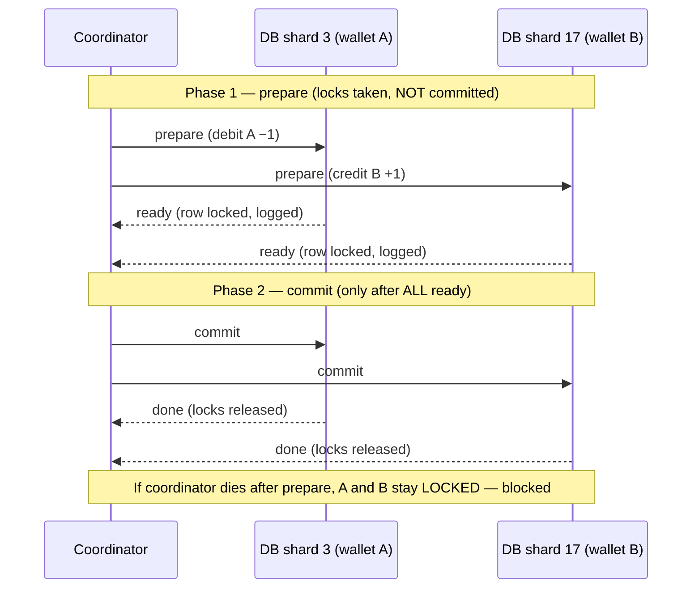
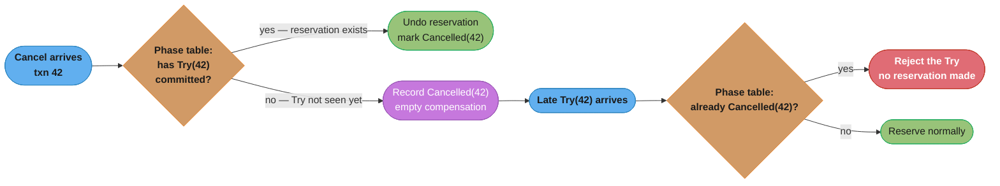
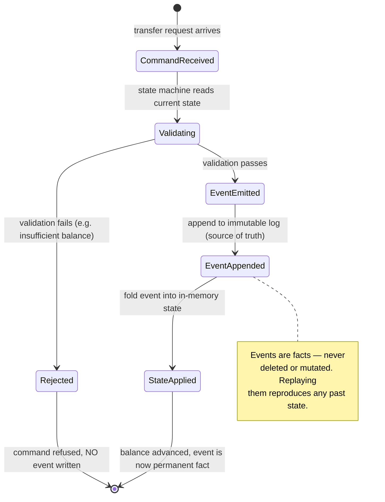
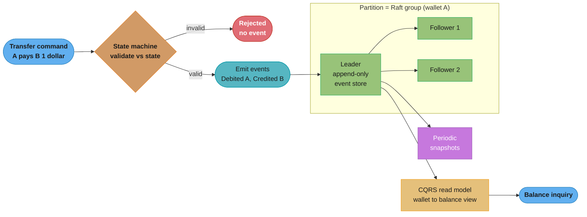

# Chapter 12: Digital Wallet

> Ch 12 of 13 · System Design Interview Vol 2 (Xu & Lam) · builds on Ch 11 — 1M TPS forces the full distributed-transactions ladder, ending at event sourcing + CQRS

## Chapter Map

A digital wallet holds an in-platform money balance and moves it between users: A pays B
one dollar, and both balances must change together or not at all. That sounds trivial — it is
one `UPDATE` on each of two rows — until you nail down the numbers. This chapter demands
**1,000,000 transfers per second**, **99.99% reliability**, **no double-spend and no lost or
created money**, and **reproducibility**: an auditor must be able to recompute any wallet's
balance as it stood at any moment in history. No single database survives those four
constraints at once, so the chapter becomes the book's distributed-transactions masterclass —
an escalating **broken → fix ladder** where every rung solves the previous rung's failure and
introduces the next one.

**TL;DR:**
- A dollar transfer touches **two wallets**, so at 1M TPS you must **partition** (~2,000
  nodes) *and* provide **cross-partition atomicity** — the two hard requirements that drive
  everything.
- The ladder climbs through five rungs: **in-memory Redis sharding** (no cross-shard
  atomicity) → **2PC/XA** (blocking, coordinator SPOF) → **TCC** (application-level 2-phase,
  local transactions, but out-of-order and business-logic pollution) → **Saga** (linear local
  transactions + compensations, choreography vs orchestration, latency adds up) → **Event
  Sourcing + CQRS**.
- Rungs 1–4 all **mutate balance in place**, so none can satisfy the audit requirement.
  **Event sourcing** makes an immutable append-only event log the *only* write path; state is
  `fold(events)`, so replaying to any point recomputes any historical balance — reproducibility
  is solved by construction.
- Production event sourcing needs a **local append-only event store** (not Kafka round trips),
  **Raft-replicated logs** per partition for HA, and **periodic snapshots** to bound replay
  time. Cross-partition transfers ride a **Saga/TCC on top of** event-sourced partitions, with
  the coordinator itself event-sourced.

## The Big Question

> "I need to move a dollar from wallet A to wallet B a million times a second, never lose or
> conjure a cent, survive machine failures, and — years later — prove to an auditor exactly
> what every balance was on any past date. What data model can promise all four at once?"

The naive mental model is a bank ledger with a `balance` column you keep overwriting. That
model fails twice over: overwriting is not atomic across two partitions, and overwriting
**destroys history**, so you can never reproduce a past balance. The chapter's arc is the slow
realization that the answer is not a better locking protocol but a different data model
entirely — **stop storing the balance, store the events that produced it.** Once the event log
is the source of truth, atomicity becomes appending one immutable record, and reproducibility
becomes replaying the log to a point in time. Every rung before that is a lesson in *why* the
in-place-mutation model cannot be made to work at this scale with these guarantees.

---

## 12.1 Step 1 — Understand the Problem and Establish Design Scope

### Functional requirements

The wallet service is one piece of a larger payment platform (Ch 11 designs the payment system
that sits above it). We scope to the **internal wallet** only — money already inside the
platform, moving between two of the platform's own users:

- **Balance transfer** — move an amount from one user's wallet to another's: "A pays B \$1."
  This is the core write and the whole difficulty of the chapter.
- **Balance inquiry** — read a wallet's current balance. Read-heavy, but must be consistent
  with the transfers already applied.

Out of scope (mentioned so the interviewer knows you scoped deliberately): funding a wallet
from an external bank/card, withdrawing to an external bank, currency conversion, and the
platform's higher-level order/payment orchestration (that is Ch 11's payment system). We assume
a transfer is between two wallets **inside** this service.

### Non-functional requirements

These four numbers are the entire chapter. Every one of them individually is easy; the
combination is what forces the ladder.

| Requirement | Target | Why it is hard |
|-------------|--------|----------------|
| **Throughput** | **1,000,000 TPS** (deliberately extreme) | No single node does this; forces partitioning |
| **Reliability / availability** | **≥ 99.99%** (~52 min downtime/yr) | Forces replication and failover, not one box |
| **Correctness (atomicity)** | No double-spend, no lost money, no created money | A transfer touches two wallets → cross-partition atomicity |
| **Reproducibility (audit)** | Recompute any wallet's balance as of any past instant | In-place `UPDATE` destroys history — model-breaking |

The reproducibility requirement is the subtle one and the reason the chapter does not end at
Saga. Correctness alone (rungs 2–4 provide it) is not enough: a regulator or internal auditor
must be able to point at any date and ask "what was this balance then, and which transactions
made it that?" A schema whose only record of a wallet is a single mutable `balance` cell can
never answer that.

### Back-of-the-envelope estimation

Reproduce the book's node math step by step. It is the argument for *why* we need both
partitioning and cross-partition atomicity.

```
Target write load:          1,000,000 transfers / second

Operations per transfer:    a transfer = debit sender + credit receiver
                            = 2 balance-account operations

Single-node balance ops:    2 × 1,000,000 = 2,000,000 account ops / second

Per-node capacity:          a well-tuned single relational node handles
                            roughly ~1,000 TPS comfortably (short OLTP txns)

Nodes / partitions needed:  2,000,000 ops/s ÷ 1,000 ops/s per node
                            ≈ 2,000 partitions
```

Two conclusions fall straight out of that arithmetic, and they define the rest of the chapter:

1. **We must partition.** ~2,000 nodes is not a "maybe scale later" — 1M TPS is roughly
   2,000× a single node, so partitioning is a *day-one* requirement, not an optimization.
2. **We need cross-partition atomicity.** With ~2,000 partitions and wallets hashed across
   them, the sender's wallet and the receiver's wallet almost always live on **different
   partitions**. A transfer is therefore inherently a **distributed transaction** touching two
   nodes that must both commit or both abort. The whole chapter is the search for the right way
   to make those two writes atomic at 1M TPS while keeping an auditable history.

The rest of the design is a ladder: each rung is a candidate answer to "how do two partitions
commit a transfer together," and each rung's failure mode pushes us to the next.

---

## 12.2 Step 2 — Propose High-Level Design and Get Buy-In

### API design

One write endpoint and one read endpoint. The write carries the two wallet IDs and the amount:

```
POST /v1/wallet/balance_transfer
{
  "from_account": "A",
  "to_account":   "B",
  "amount":       "1.00",
  "currency":     "USD",
  "transaction_id": "9d8f...c1"     // client-supplied idempotency key
}
Response: 201 Created  { "status": "COMPLETED", "transaction_id": "9d8f...c1" }

GET  /v1/wallet/{account}/balance
Response: 200 OK       { "account": "A", "balance": "41.00", "currency": "USD" }
```

The `transaction_id` is the client-supplied **idempotency key** — carry this forward, it is the
hook that makes the whole pipeline safe to retry (see idempotency, below). Amounts are strings /
fixed-point decimals, never floats — money must be exact.

### Rung 1 — In-memory wallets sharded by user (Redis)

The cheapest thing that could possibly work: hold each wallet as a `<wallet_id, balance>` pair
in an in-memory key-value store (Redis), sharded across N nodes by hashing the wallet ID. The
wallet service reads both balances, subtracts from the sender, adds to the receiver, and writes
both back.

```
Client → Wallet Service → hash(A) → Redis shard 3:  A.balance -= 1
                        → hash(B) → Redis shard 17: B.balance += 1
```

This is fast and it partitions trivially — 2,000 Redis shards give you the raw throughput. But
it is **wrong for money**, on two counts:

- **No cross-shard atomicity.** A and B live on different shards. Between the debit on shard 3
  and the credit on shard 17, the wallet-service process can crash, the network can drop, or
  shard 17 can be unreachable. Now shard 3 shows A already debited but shard 17 never credited B
  — **a dollar has been destroyed.** Reverse the failure order and you **create** a dollar.
  Redis has no notion of a transaction spanning two nodes; `MULTI`/`EXEC` is per-node only.
- **No transactional durability here.** Even on one shard, Redis persistence (RDB snapshots,
  AOF) is asynchronous by default — an acknowledged write can be lost on a crash before it hits
  disk. Money must not evaporate because a snapshot was a second stale.

**Broken → fix:** the fix is not "add a lock." The fix is to give the two writes a real
**distributed transaction** — some protocol that makes "debit A" and "credit B" commit or abort
together across partitions. That is the next rung.

---

## 12.3 Step 3 — Design Deep Dive

The deep dive is the ladder itself. Rungs 2–4 give us cross-partition atomicity three different
ways; rung 5 changes the data model to also give us reproducibility.

### Rung 2 — Relational databases + distributed transactions: two-phase commit (2PC)

Put the wallets in **sharded relational databases** (each partition is an ACID database), so
each single-partition write is already atomic and durable. To make the two-partition transfer
atomic, use the classic **two-phase commit (2PC)** protocol, standardized as **X/Open XA**. A
**coordinator** (transaction manager) drives two round trips across all participating databases:

- **Phase 1 — prepare.** The coordinator asks every participant, "can you commit this?" Each
  database does the work locally (debit A on shard 3, credit B on shard 17), **writes it to its
  log, takes the row locks, but does not commit**, then replies `ready` (or `no`). After
  replying `ready`, a participant has promised it *can* commit and must hold that state.
- **Phase 2 — commit.** If all participants said `ready`, the coordinator writes a commit
  decision and tells everyone to `commit`; each releases locks and finalizes. If any said `no`
  (or timed out), the coordinator tells everyone to `abort`.



Caption: 2PC is correct — both wallets commit or neither does — but the locks on A and B are
held across every network round trip in both phases, and if the coordinator crashes after
`prepare` the participants are stuck holding those locks with no one to tell them the decision.

Why 2PC does not survive the requirements:

- **It is a blocking protocol.** Locks on both rows are held from `prepare` until `commit` —
  across multiple network round trips. Every concurrent transfer touching A must wait. Lock hold
  time is dominated by network latency, so throughput collapses far below 1M TPS.
- **The coordinator is a single point of failure.** If it dies *after* participants voted
  `ready` but *before* the commit message, participants are **in doubt** — they may not
  unilaterally commit or abort, so they sit holding locks until the coordinator recovers. This
  is the infamous 2PC blocking window.
- **Latency does not scale to 1M TPS.** Two synchronous round trips per transfer, multiplied
  across ~2,000 partitions and a million transfers a second, is not survivable. XA also requires
  every participating resource to implement the XA interface, coupling you to specific databases.

**Broken → fix:** we want the atomicity without holding cross-node locks across network round
trips. Push the two phases up into the *application* as ordinary **local** transactions — that
is TCC.

### Rung 3 — TCC (Try-Confirm/Cancel)

TCC is **two-phase commit implemented at the application layer**, where each phase is its own
**local ACID transaction** on each database — so no lock is ever held across a network round
trip. A transfer is modeled in three business operations you write yourself:

- **Try** — *reserve* the resources. Debit \$1 from A into a **pending/frozen** bucket (A's
  spendable balance drops by \$1, but the dollar is held, not yet given to B). This is a local
  committed transaction on A's partition.
- **Confirm** — *apply*. Credit \$1 to B and release A's pending hold. A local committed
  transaction on B's partition (and a small finalize on A's).
- **Cancel** — *undo*. If anything fails, return the \$1 from A's pending hold back to A's
  spendable balance.

The coordinator now issues Try to both sides; if both Trys succeed it issues Confirm; if any Try
fails it issues Cancel. Crucially, **each of Try, Confirm, Cancel commits locally and
immediately** — the "lock" is just the pending-balance row, released at the end of each short
local transaction, not held across the whole distributed protocol.

**2PC vs TCC — the book's comparison:**

| Dimension | 2PC (XA) | TCC |
|-----------|----------|-----|
| Layer | Database / resource manager (XA) | Application code |
| Phases | prepare, commit | Try, Confirm, Cancel |
| Lock duration | Held across the whole protocol (both round trips) | Only within each short local transaction |
| Database coupling | Requires XA support in every resource | Database-agnostic (plain local transactions) |
| Coordinator failure | Participants block in-doubt, holding locks | Participants already committed locally; recover via retry |
| Cost | Blocking, poor throughput | Must hand-write Try/Confirm/Cancel per operation (business-logic pollution) |

TCC buys database-agnosticism and short locks, at the price of **business-logic pollution**: for
every operation you must implement three methods with reservation semantics, and get their
idempotency and compensation exactly right.

**The out-of-order execution trap (and its fix).** Because Try, Confirm, and Cancel are separate
messages over an unreliable network, they can arrive **out of order** — most dangerously, a
**Cancel can arrive before the Try** it is meant to undo (Try was delayed or is still in flight;
the coordinator timed out and fired Cancel). A naive Cancel handler sees "no reservation to
undo," does nothing, and returns success — then the delayed Try lands and **reserves the dollar
that will now never be confirmed or cancelled**: money frozen forever, or worse, double-applied.

The fix is a **per-transaction phase-status table**, keyed by `transaction_id`, recording which
phases have been seen. Every handler is made idempotent and out-of-order-safe by consulting it:



Caption: the phase-status table lets Cancel **record a "cancelled" marker even before its Try
arrives** (an empty/null compensation); when the delayed Try finally lands it consults the table,
sees the transaction is already cancelled, and refuses to reserve — closing the out-of-order hole
that would otherwise strand a frozen dollar.

**Broken → fix:** TCC still needs a coordinator and hand-written reservation logic per
operation, and it still mutates balances in place. The next rung removes the parallel
Try-both-sides coordination in favor of a simple linear chain: Saga.

### Rung 4 — Saga

A **Saga** is a **sequence of local transactions**, one per participant, where each local
transaction publishes an event/message that triggers the next. If any step fails, the Saga runs
**compensating transactions** — one per already-completed step — in **reverse order** to undo
the work. For our transfer: step 1 debits A (compensation: credit A back), step 2 credits B
(compensation: debit B back). Each step is a local ACID transaction; there is no global lock.

Two ways to coordinate the sequence:

- **Choreography** — no central coordinator. Each service **subscribes to events** and reacts:
  A's debit emits a `Debited` event; the B-service consumes it and credits B; if B fails it
  emits `CreditFailed`, which the A-service consumes and compensates. Decentralized, loosely
  coupled — but the workflow is **implicit**, smeared across services' event subscriptions, and
  hard to follow or change as the number of steps grows.
- **Orchestration** — a central **Saga orchestrator** explicitly drives the sequence: it calls
  step 1, waits, calls step 2, and on failure calls the compensations in reverse. The workflow
  lives in one place (readable, changeable), at the cost of a coordinator component you must make
  reliable.

**Saga vs TCC — the trade the book highlights:**

| Dimension | TCC | Saga |
|-----------|-----|------|
| Structure | Try phase can run on all participants **in parallel** | Steps run **sequentially**, one after another |
| Latency | ~one round of parallel Trys, then Confirm | Latency **adds up** with each step (chain length) |
| Isolation | Reservations hold a pending balance (some isolation) | No reservation — intermediate states are visible |
| Complexity | 3 methods per operation | 1 forward + 1 compensating transaction per step |
| Failure model | Confirm/Cancel | Compensating transactions (semantic undo) |

Saga is simpler per step and needs no reservation bucket, but because it is **sequential**, its
latency grows with the number of steps — bad when a transfer or a fan-out involves many hops.
TCC parallelizes the Try phase but pays in business-logic pollution.

**The verdict that ends rungs 2–4.** At 1M TPS with tight latency budgets, neither TCC nor Saga
is *free* — both add coordination cost, and choosing a coordination style is choosing which cost
to pay. But the deeper problem is shared by **all** of rungs 1–4: they **mutate the balance in
place**. Once A's row goes from 42 to 41, the 42 is gone. That model can be made *correct*
(atomic), but it can **never be made reproducible** — an auditor cannot recover a balance the
database overwrote. To satisfy the fourth requirement we must change the data model, not the
locking protocol.

### Rung 5 — Event sourcing + CQRS (the destination)

**Event sourcing** flips the model: instead of storing the current balance and overwriting it,
we store the **immutable sequence of events** that produced it, and derive the balance by
folding over that sequence. There are four moving parts:

- **Command** — the *intent* to change state: "transfer \$1 from A to B." A command arrives from
  outside, and **can be rejected** (fails validation — e.g. insufficient balance). It is a
  request, not yet a fact.
- **Event** — the *result* of a successfully processed command: a past-tense, **immutable fact**
  ("\$1 debited from A," "\$1 credited to B"). An event has already happened; it **cannot be
  rejected or changed**. Events are appended to an **append-only event log** — this log is the
  **single source of truth and the only write path**.
- **State** — the current balances, derived as `state = fold(events)`. Never written directly;
  only produced by applying events. State lives in memory for speed.
- **State machine** — the deterministic engine that ties them together: it takes a command,
  **validates it against the current state**, and if valid **emits event(s)** and appends them,
  then **applies** those events to advance the state. It must be **deterministic**: the same
  event log always folds to the same state.



Caption: a command may be *rejected* before any event is written, but once an event is appended
it is an immutable fact — the asymmetry (commands can fail, events cannot) is exactly what makes
the log a trustworthy, replayable audit trail.

**How reproducibility is solved by construction.** Because the event log is append-only and
immutable, the balance at any past instant `t` is just `fold(events up to t)`. An auditor replays
the log to any point and recomputes any wallet's exact historical balance, plus the precise list
of transactions that produced it. Reproducibility is not a feature we bolted on — it is a
**free consequence** of making events the source of truth. This is the single reason the chapter
climbs past Saga to here.

**CQRS (Command Query Responsibility Segregation).** The write side (commands → events) is
optimized for appending facts; the read side (balance inquiries) wants fast point lookups. CQRS
**separates them**: a **read model / materialized view** is built by **consuming the event
stream** and maintaining a query-optimized `wallet → balance` table (or cache). Balance inquiries
hit the read view, never the raw event log. The read model is eventually consistent with the log
but can be rebuilt from scratch at any time by replaying events — and you can maintain *several*
read models (per-currency views, monthly-statement views, fraud-analytics views) all from the
same log.



Caption: commands are validated then emit events into a per-partition Raft group whose leader
appends to a local event store and replicates to followers; snapshots bound replay time and a
CQRS read model serves fast balance inquiries — all derived from the one immutable log.

#### Making event sourcing reliable, high-performance, and scalable

A textbook event store on top of Kafka works but is slow: every event append is a network round
trip to the broker and back. The book builds up a production-grade store in three moves.

**1. Performance — a local append-only event store instead of Kafka round trips.** Replace the
remote broker with a **local, append-only file** on each node. Appending events is a **sequential
write** (the fastest thing a disk does — SSDs love sequential appends), and the file is
**memory-mapped (mmap-style)** so reads and the in-memory state come straight from the page
cache. State is kept **in memory**, rebuilt by folding the local log. No per-event network hop:
the write path is "validate against in-memory state → append one record to the local file →
apply to in-memory state." This is what gets you into 1M-TPS territory per cluster.

**2. Reliability / HA — a Raft-replicated event log per partition.** A single local file is fast
but not durable against machine loss, and one node cannot be 99.99% available. Make **each
wallet partition a Raft consensus group** of, say, 3 nodes. The **leader** receives commands,
produces events, and **appends them to its local event store**; Raft **replicates the event log**
to the **followers**, who append the identical events to their own logs. Because every replica
runs the **same deterministic state machine over the same event log, they all compute identical
state** — this is the **replicated state machine** pattern (see DDIA Ch 9, consensus). On leader
failure, Raft elects a follower that already holds the full committed log, and it takes over with
no lost events. Raft gives us durability (majority-replicated appends) and availability
(automatic failover) without 2PC's in-doubt blocking.

**3. Scalability with bounded recovery — snapshots.** Replaying an event log from the beginning
of time to rebuild state would take longer and longer as the log grows — a wallet with a billion
events would take forever to recover after a restart. Fix: take a **snapshot** of the in-memory
state periodically (e.g. every N events or every few minutes) and persist it. On restart or
follower catch-up, load the **latest snapshot** and **replay only the events after it** — replay
cost is bounded by the snapshot interval, not the full history. Snapshots are an *optimization*;
the events remain the source of truth, so auditing is unaffected (you can still replay from zero
if you ever need to).

#### The final architecture

Put the pieces together:

- **Wallet partitions are Raft groups.** ~2,000 partitions, each a 3-node Raft group, each an
  event-sourced state machine with a local append-only store, snapshots, and a CQRS read model.
  Single-wallet operations (and any transfer between two wallets that hash to the *same*
  partition) are a single local, replicated, event-sourced transaction — fast and atomic.
- **Cross-partition transfers ride a Saga (or TCC) on top of the event-sourced partitions.**
  When A and B live on different Raft groups, the transfer is coordinated as a Saga: debit-A is
  a local event-sourced transaction on A's group, credit-B is a local event-sourced transaction
  on B's group, with compensating events on failure.
- **The coordinator itself is event-sourced.** The Saga orchestrator's own progress (which steps
  ran, which compensations fired) is stored as events in its own event-sourced, Raft-replicated
  log — so a coordinator crash loses nothing and recovery is a replay. This closes 2PC's
  coordinator-SPOF hole: there is no in-doubt blocking because the coordinator's state is durable
  and replayable.

The result satisfies all four requirements at once: **partitioned** Raft groups give 1M TPS and
99.99% availability; **event-sourced local transactions + Saga** give correctness across
partitions; and the **immutable event log** gives reproducibility for auditors.

### Reproducibility deep dive — auditor replay and snapshots

Reproducibility is worth its own treatment because it is the requirement that selected this whole
architecture. Two mechanisms make it concrete:

- **Auditor replay.** Every state-changing fact is an immutable, ordered event with a timestamp
  and a `transaction_id`. To answer "what was wallet A's balance at 2026-01-01T00:00Z, and why?",
  an auditor takes the event log for A's partition and folds events **up to that timestamp**. The
  result is the exact balance *and* the itemized list of transactions that produced it — provable,
  not reconstructed from lossy summaries.
- **Snapshot + replay-from-snapshot.** To make replay tractable on long histories, the same
  snapshotting used for recovery serves audits: start from the latest snapshot **at or before**
  the target time and replay forward the (bounded) tail of events to the target instant. Because
  snapshots are derived purely from events, they never become a second, drift-prone source of
  truth — they are a cache of a fold, and can always be recomputed from the log.

The contrast with the earlier rungs is stark: an in-place `UPDATE balance = balance - 1` model
retains *only the latest* value. There is no fold, no history, and therefore no honest answer to
an auditor's time-travel question. Event sourcing is not "a nicer way to store balances" — it is
the only rung that can answer the reproducibility requirement at all.

### Command vs event — the load-bearing distinction

The command/event split is the conceptual heart of event sourcing, and interviewers probe it:

| | **Command** | **Event** |
|---|-------------|-----------|
| Tense | Imperative — "do this" | Past — "this happened" |
| Example | `TransferMoney(A→B, $1)` | `MoneyDebited(A, $1)`, `MoneyCredited(B, $1)` |
| Can be rejected? | **Yes** — fails validation (e.g. insufficient funds) | **No** — it already happened; it is a fact |
| Mutable? | It is a request; may never take effect | **Immutable** — appended, never edited or deleted |
| Source of truth? | No | **Yes** — the event log is the single source of truth |

A command is a *proposal*; an event is a *decision that already executed*. The state machine is
the boundary: it turns validated commands into events. This asymmetry is precisely why the log is
trustworthy — you can never find a "half-applied" or "later-retracted" event, so replay is
deterministic and audit-safe.

### Idempotency of commands

Because the network can duplicate or the client can retry, the same command may arrive **more
than once**. Applying `TransferMoney(A→B, $1)` twice would move two dollars — a lost-money bug.
Fix: every command carries a unique `transaction_id` (the idempotency key from the API), and the
state machine **records processed command IDs** (in state / in the event log). Before processing,
it checks: *have I already produced events for this `transaction_id`?* If yes, it **returns the
prior result without emitting new events** — the command is a no-op replay. Idempotency plus the
immutable log is what makes the entire pipeline safe to retry end to end (client retries, Saga
retries, follower catch-up) without ever double-applying money.

### The external API face — synchronous vs asynchronous

The internal machinery is event-sourced and eventually consistent, but the caller (the payment
system in Ch 11, or a client app) needs an answer. Two API styles:

- **Synchronous.** The `balance_transfer` call blocks until the transfer's events are committed
  (majority-replicated in the Raft group) and returns the final status. Simple for the caller,
  but the caller holds a connection for the full commit latency, and cross-partition Sagas make
  that latency variable.
- **Asynchronous.** The call returns immediately with `202 Accepted` and the `transaction_id`;
  the caller later **polls** `GET /transfer/{id}` or receives a **callback/webhook** when the
  Saga completes. Higher throughput and better tail-latency isolation, at the cost of a
  two-step client protocol and the need to expose transfer status.

At 1M TPS the async face is usually preferred for cross-partition transfers (don't pin a
connection through a multi-step Saga), with the synchronous face available for same-partition
transfers that commit in one local round.

---

## 12.4 Step 4 — Wrap Up

The chapter is one long broken → fix ladder. Each rung fixed the previous rung's failure and
exposed the next, until the last rung changed the data model and satisfied all four requirements
at once.

**The ladder recap — what each rung fixed and what broke:**

| Rung | Approach | What it fixed | What still broke |
|------|----------|---------------|------------------|
| 1 | In-memory Redis, sharded by user | Raw throughput, trivial partitioning | No cross-shard atomicity → money created/destroyed; async durability |
| 2 | Relational DBs + 2PC (XA) | Correct cross-partition atomicity | Blocking protocol, locks across round trips, coordinator SPOF, no 1M TPS |
| 3 | TCC (Try/Confirm/Cancel) | DB-agnostic, short local locks, no in-doubt blocking | Business-logic pollution, out-of-order trap; still mutates state in place |
| 4 | Saga (choreography / orchestration) | Simple local txns + compensations, no reservation bucket | Sequential latency adds up; still mutates state in place → **fails audit** |
| 5 | **Event sourcing + CQRS** | Immutable log = the write path → **reproducibility by construction**; Raft = HA + durability; local append store + snapshots = 1M TPS with bounded recovery | Eventual consistency of read models; must design commands to be idempotent |

The single sentence to remember: **when the requirement is "recompute any past balance," stop
storing the balance and start storing the events** — then make the event log fast (local
append-only store), durable and available (Raft per partition), and bounded to recover
(snapshots), and coordinate cross-partition transfers with a Saga whose coordinator is itself
event-sourced.

---

## Visual Intuition

The whole chapter in one picture — the ladder, with the failure that pushes each rung to the
next:

```mermaid
flowchart LR
    classDef io      fill:#61afef,stroke:#2e86c1,color:#1a1a1a,font-weight:bold
    classDef frozen  fill:#c678dd,stroke:#9b59b6,color:#fff
    classDef train   fill:#98c379,stroke:#27ae60,color:#1a1a1a
    classDef mathOp  fill:#d19a66,stroke:#e67e22,color:#1a1a1a,font-weight:bold
    classDef lossN   fill:#e06c75,stroke:#c0392b,color:#fff,font-weight:bold
    classDef req     fill:#56b6c2,stroke:#0097a7,color:#1a1a1a
    classDef base    fill:#e5c07b,stroke:#f39c12,color:#1a1a1a

    R1(["1 Redis sharding"]) -->|"no cross-shard<br/>atomicity"| R2(["2 2PC / XA"])
    R2 -->|"blocking, SPOF,<br/>no 1M TPS"| R3(["3 TCC"])
    R3 -->|"out-of-order,<br/>logic pollution"| R4(["4 Saga"])
    R4 -->|"in-place mutation<br/>fails audit"| R5(["5 Event sourcing<br/>plus CQRS"])
    R5 -->|"replay to any point"| AUD(["Auditor recomputes<br/>any past balance"])

    class R1 lossN
    class R2 mathOp
    class R3 frozen
    class R4 req
    class R5 train
    class AUD io
```



Caption: read the edge labels top to bottom — each is the failure that disqualifies the rung on
its left; only rung 5 survives all four requirements because it changes the data model rather
than the locking protocol.

The reproducibility mechanism — why an immutable log answers time-travel questions that an
in-place balance cannot:

```
IN-PLACE MUTATION (rungs 1-4)          EVENT SOURCING (rung 5)
-------------------------------        --------------------------------------
wallet A: balance = 41                 A's event log (append-only, immutable):
          (only the latest value)        e1  +50  credited     t0
                                          e2  -8   debited      t1
past values overwritten and GONE          e3  -1   debited      t2   <- now
                                        ----------------------------------
auditor asks "balance at t1?"           fold(e1..e2) = 50 - 8 = 42   at t1
   -> UNANSWERABLE                       fold(e1..e3) = 42 - 1 = 41   at t2
                                        snapshot@t1 = 42  ->  replay tail only
```

Caption: the in-place model keeps only `41` and cannot reconstruct the `42` that existed at `t1`;
the event log keeps every fact, so any historical balance is a fold of the events up to that
time — and a snapshot at `t1` lets the auditor start there and replay only the tail.

---

## Key Concepts Glossary

- **Digital wallet** — an in-platform money balance moved between users of a payment platform.
- **Balance transfer** — moving an amount from one wallet to another (the core write); touches
  two wallets.
- **Balance inquiry** — reading a wallet's current balance (the core read).
- **Double-spend** — spending the same money twice; a correctness violation the design must prevent.
- **Reproducibility** — the ability to recompute any wallet's balance as of any past instant
  (audit requirement).
- **Partitioning / sharding** — splitting wallets across ~2,000 nodes to reach 1M TPS.
- **Cross-partition atomicity** — making the two writes of a transfer (on two partitions) commit
  or abort together.
- **Distributed transaction** — a transaction spanning more than one database/partition.
- **Two-phase commit (2PC)** — coordinator-driven prepare-then-commit protocol; blocking, with
  coordinator SPOF.
- **X/Open XA** — the standard interface for 2PC across resource managers.
- **Prepare / commit (2PC phases)** — phase 1 locks and votes; phase 2 finalizes or aborts.
- **In-doubt / blocking window** — after voting ready, participants stuck holding locks if the
  coordinator dies.
- **TCC (Try-Confirm/Cancel)** — application-level 2PC where each phase is a local transaction.
- **Try / Confirm / Cancel** — reserve resources / apply / undo the reservation.
- **Pending (frozen) balance** — the reserved-but-not-yet-transferred bucket a Try creates.
- **Out-of-order execution** — TCC messages arriving out of order (e.g. Cancel before Try).
- **Phase-status table** — per-`transaction_id` record of which TCC phases occurred; fixes
  out-of-order and duplicates.
- **Saga** — a sequence of local transactions each with a compensating transaction on failure.
- **Compensating transaction** — the semantic undo of a completed Saga step.
- **Choreography** — Saga coordination via events and subscriptions, no central coordinator.
- **Orchestration** — Saga coordination via a central orchestrator that drives steps.
- **Event sourcing** — storing the immutable sequence of events as the source of truth; state =
  `fold(events)`.
- **Command** — an imperative request to change state; can be rejected (validation).
- **Event** — an immutable past-tense fact; the only write path; cannot be rejected or changed.
- **State** — current balances, derived by folding events; kept in memory.
- **State machine** — deterministic engine: command → validate → emit events → apply to state.
- **Deterministic state machine** — same event log always folds to the same state (enables
  replicated state machines).
- **CQRS (Command Query Responsibility Segregation)** — separating the write model (commands →
  events) from read models (materialized views).
- **Read model / materialized view** — a query-optimized projection built by consuming the event
  stream.
- **Append-only event store** — a local, sequential-write, memory-mapped log file; the fast write
  path.
- **Raft group** — a per-partition consensus group; leader appends events, followers replicate.
- **Replicated state machine** — every replica folds the same log to identical state.
- **Snapshot** — a persisted copy of state to bound replay time on restart/catch-up/audit.
- **Idempotency key (`transaction_id`)** — unique per-command ID used to dedupe retries.
- **Synchronous vs asynchronous API** — blocking call returning final status vs immediate accept
  plus poll/callback.

---

## Tradeoffs & Decision Tables

**Cross-partition transaction techniques:**

| Technique | Atomicity | Lock scope | Coordinator failure | 1M TPS? | Reproducible? |
|-----------|:--:|-----------|---------------------|:--:|:--:|
| Redis sharding | ✗ none across shards | none | n/a | ✓ (but wrong) | ✗ |
| 2PC / XA | ✓ | across both round trips | blocks in-doubt | ✗ | ✗ |
| TCC | ✓ | per local txn (short) | recover via retry | partial | ✗ |
| Saga | ✓ (eventual) | per local txn (short) | recover via replay | ✓ | ✗ |
| Event sourcing + Saga on top | ✓ (eventual) | per local, replicated txn | coordinator event-sourced | ✓ | ✓ |

**Choreography vs orchestration (Saga):**

| | Choreography | Orchestration |
|---|--------------|---------------|
| Coordinator | None (event-driven) | Central orchestrator |
| Workflow visibility | Implicit, spread across services | Explicit, in one place |
| Coupling | Loose | Coordinator is a dependency |
| Best when | Few steps, autonomy matters | Many steps, need to reason about the flow |

**Where the read/write split (CQRS) helps:**

| Concern | Write side (commands → events) | Read side (materialized views) |
|---------|-------------------------------|-------------------------------|
| Optimized for | Sequential appends of facts | Fast point lookups of balances |
| Consistency | Source of truth | Eventually consistent, rebuildable |
| Scaling | Raft group per partition | Add/replace views freely from the log |

---

## Common Pitfalls / War Stories

- **Treating a transfer as two independent writes.** The rung-1 Redis design debits A and credits
  B as two unrelated operations; a crash between them creates or destroys money. Any money system
  must make the pair atomic — the whole chapter exists because this "obvious" first design is
  quietly wrong.
- **Assuming 2PC scales.** 2PC is correct and tempting because databases ship XA, but holding
  locks across network round trips and blocking on a coordinator SPOF makes it collapse far below
  1M TPS. Teams that reach for XA at scale hit lock contention and in-doubt stalls in production.
- **The TCC Cancel-before-Try hole.** Without a phase-status table, a Cancel that arrives before
  its Try does nothing, then the late Try reserves a dollar that is never confirmed or cancelled —
  a permanently frozen (or later double-applied) balance. Every TCC handler must be idempotent and
  consult the phase table.
- **Sagas with long chains.** Because Saga steps are sequential, a transfer that fans out to many
  steps accumulates latency and a wide window of visible intermediate state. Keep chains short, or
  parallelize with TCC-style reservations where isolation matters.
- **Storing only the balance, then being asked to audit.** The single most expensive mistake:
  shipping an in-place-mutation model, then discovering compliance needs historical balances you
  overwrote. You cannot retrofit reproducibility onto a schema that never recorded history — you
  must re-architect to event sourcing.
- **Non-deterministic state machines.** If folding the same event log can produce different state
  (e.g. the state machine reads the wall clock or a random value), replicas diverge and audit
  replay is untrustworthy. Event-sourced state machines must be pure functions of the event log.
- **Replaying from zero on every restart.** Without snapshots, recovery time grows without bound
  as the log grows; a large wallet can take minutes to rebuild. Snapshot periodically and replay
  only the tail — but keep the full log for audits.
- **Forgetting command idempotency.** A retried or duplicated command with no `transaction_id`
  dedupe applies the transfer twice. Record processed command IDs so a replay is a no-op.

---

## Real-World Systems Referenced

Redis (in-memory sharding, rung 1); relational databases with X/Open XA / two-phase commit
(rung 2); TCC and Saga patterns (widely used in microservice payment systems — Seata, Axon,
Eventuate implement these); Kafka (naive event store, replaced by a local append store for
performance); Raft consensus (per-partition replicated event logs and leader election); event
sourcing + CQRS frameworks (Axon, EventStoreDB, Eventuate). The chapter's reliable, event-sourced
Raft architecture echoes the replicated-state-machine designs behind systems like Google Spanner
and the log-centric designs Kleppmann discusses in DDIA.

---

## Summary

A digital wallet moves money between users, and the chapter's four requirements — 1M TPS, 99.99%
reliability, no lost/created money, and reproducibility of any past balance — cannot be met by a
single database. The back-of-envelope math (2 balance operations per transfer × 1M TPS ÷ ~1,000
TPS per node ≈ 2,000 partitions) forces both **partitioning** and, because a transfer's two
wallets usually land on different partitions, **cross-partition atomicity**. The design is an
escalating ladder: **in-memory Redis sharding** has no cross-shard atomicity; **2PC/XA** is
correct but blocking with a coordinator SPOF and cannot reach 1M TPS; **TCC** pushes the two
phases into application-level local transactions (short locks, DB-agnostic) but pollutes business
logic and hits an out-of-order Cancel-before-Try trap solved with a phase-status table; **Saga**
chains local transactions with compensations (choreography or orchestration) but pays sequential
latency. All four of those rungs **mutate the balance in place**, so none can reproduce a past
balance — failing the audit requirement. **Event sourcing + CQRS** is the destination: commands
are validated and emit **immutable events** appended to a log that is the single write path;
state is `fold(events)`, so replay recomputes any historical balance and reproducibility comes
for free. Production event sourcing uses a **local append-only event store** (not Kafka) for
speed, **Raft-replicated logs per partition** for HA and durability, and **snapshots** to bound
replay time; cross-partition transfers ride a **Saga on top of** event-sourced partitions with
the **coordinator itself event-sourced**, closing 2PC's in-doubt blocking hole. The lesson:
when you must recompute any past balance, stop storing the balance and store the events.

---

## Interview Questions

**Q: Why does two-phase commit (2PC) block, and why is that fatal at 1M TPS?**
2PC holds the row locks taken during the prepare phase all the way through the commit phase, across every network round trip. Concurrent transactions touching those rows must wait for the whole distributed protocol, so lock hold time is dominated by network latency instead of local work. Worse, if the coordinator dies after participants vote ready but before it sends the commit decision, those participants are in-doubt and cannot unilaterally commit or abort — they block holding locks until it recovers. At a million transfers per second across ~2,000 partitions, that blocking and those synchronous round trips make throughput collapse far below target.

**Q: What is the TCC out-of-order execution trap, and how do you fix it?**
It is when a Cancel message arrives before the Try it is meant to undo, because the phases are separate network messages that can reorder. A naive Cancel finds no reservation and does nothing, then the delayed Try lands and reserves a dollar that will never be confirmed or cancelled — money frozen forever or double-applied. The fix is a per-`transaction_id` phase-status table: Cancel records a cancelled marker (an empty compensation) even before Try arrives, and when the late Try lands it consults the table, sees the transaction is already cancelled, and refuses to reserve.

**Q: When would you choose Saga over TCC, and what does each cost?**
Choose based on whether you can parallelize the phases and how much isolation you need. TCC lets the Try phase run on all participants in parallel and holds a pending-balance reservation (some isolation), but forces you to hand-write three methods per operation — business-logic pollution. Saga runs steps sequentially, so latency adds up with chain length and intermediate states are visible, but it needs only one forward and one compensating transaction per step and no reservation bucket. Short, parallel, isolation-sensitive transfers favor TCC; simpler few-step workflows favor Saga.

**Q: Why does event sourcing satisfy auditors when 2PC, TCC, and Saga cannot?**
Because event sourcing stores an immutable, append-only log of events as the only source of truth, so any historical balance is just a fold of the events up to that time. 2PC, TCC, and Saga all mutate the balance in place — once a row goes from 42 to 41, the 42 is gone and no past value can be reconstructed. An auditor replays the event log to any timestamp and recomputes the exact balance plus the itemized transactions that produced it. Reproducibility is a free consequence of making events, not balances, the source of truth.

**Q: Why does an in-memory Redis sharding design fail for money transfers?**
Because a transfer touches two wallets on two different shards and Redis provides no atomicity across shards, so a crash between the debit and the credit destroys or creates money. Redis `MULTI`/`EXEC` transactions are per-node only, and its persistence is asynchronous by default, so even an acknowledged single-shard write can be lost on a crash. It is fast and partitions trivially, but for money the missing cross-shard atomicity and durability make it unusable without a real distributed transaction on top.

**Q: What is the difference between a command and an event in event sourcing?**
A command is an imperative request to change state that can be rejected by validation, while an event is an immutable past-tense fact that already happened and cannot be rejected or changed. For a transfer, `TransferMoney(A→B, $1)` is the command; `MoneyDebited(A, $1)` and `MoneyCredited(B, $1)` are the resulting events. The state machine is the boundary that validates a command against current state and, if valid, emits events. This asymmetry — commands can fail, events cannot — is what makes the append-only log a trustworthy, replayable audit trail.

**Q: What role does Raft play in the event-sourced wallet, and what does it replace?**
Raft makes each wallet partition a replicated consensus group so the event log is durable and highly available without 2PC's blocking. The leader receives commands, produces events, and appends them to its local store; Raft replicates the log to followers, who apply the same events. Because every replica runs the same deterministic state machine over the same log, they all compute identical state (the replicated-state-machine pattern). On leader failure Raft elects a follower that already holds the full committed log, giving automatic failover with no lost events and no in-doubt window.

**Q: Why are snapshots needed, and how do they work with the event log?**
Snapshots bound the time to rebuild state, because replaying an ever-growing event log from the beginning would take longer and longer as history accumulates. Periodically (every N events or few minutes) the in-memory state is persisted as a snapshot; on restart, follower catch-up, or an audit, you load the latest snapshot and replay only the events after it. The events remain the source of truth — snapshots are just a cached fold and can always be recomputed — so auditing is unaffected and you can still replay from zero if needed.

**Q: Why is the Saga coordinator itself event-sourced in the final design?**
So that a coordinator crash loses no progress and recovery is a deterministic replay, closing 2PC's coordinator-SPOF hole. The orchestrator's own state — which steps ran, which compensations fired — is stored as events in its own Raft-replicated, event-sourced log. If it dies mid-Saga, a new instance replays that log and resumes exactly where it left off. There is no in-doubt blocking as in 2PC because the coordinator's decisions are durable and replayable rather than held only in volatile memory.

**Q: What is CQRS and why separate the read and write models here?**
CQRS (Command Query Responsibility Segregation) separates the write side (commands producing events) from the read side (query-optimized materialized views), because the two have opposite access patterns. The write path wants fast sequential appends of immutable facts; balance inquiries want fast point lookups. A read model is built by consuming the event stream and maintaining a `wallet → balance` view that inquiries hit directly. The view is eventually consistent but rebuildable from the log at any time, and you can maintain several views (per-currency, statements, fraud analytics) from the same events.

**Q: Why do we need cross-partition atomicity at all — can't we avoid it?**
No, because the back-of-envelope math forces ~2,000 partitions and a transfer's two wallets almost always hash to different ones. At 1M TPS a single node is impossible (2 million balance ops per second ÷ ~1,000 per node ≈ 2,000 nodes), so wallets must be sharded, and once sharded the sender and receiver live on separate partitions. A transfer is therefore inherently a distributed transaction across two nodes that must both commit or both abort — the requirement that drives the entire ladder from 2PC to event sourcing.

**Q: How does TCC differ from 2PC, and what does it buy you?**
TCC implements the two phases at the application layer with each phase as its own short local ACID transaction, whereas 2PC runs at the database/resource-manager layer (XA) and holds locks across the whole protocol. TCC's Try reserves resources, Confirm applies, Cancel undoes — each committing locally and immediately, so no lock is held across a network round trip and the design is database-agnostic. It also avoids 2PC's in-doubt blocking because participants have already committed locally. The cost is business-logic pollution: you must hand-write and correctly compensate three methods per operation.

**Q: Walk through the back-of-envelope estimate that sizes the wallet service.**
Start from 1,000,000 transfers per second; each transfer is a debit plus a credit, so 2 million balance-account operations per second. A well-tuned single relational node handles roughly 1,000 short OLTP transactions per second, so 2,000,000 ÷ 1,000 ≈ 2,000 partitions. The two conclusions are that partitioning is a day-one requirement (not an optimization) and that, with wallets spread across ~2,000 nodes, transfers span partitions and need cross-partition atomicity. That pair of conclusions is the reason the chapter becomes a distributed-transactions study.

**Q: What is the difference between choreography and orchestration in a Saga?**
Choreography is event-driven with no central coordinator — each service subscribes to events and reacts, so the workflow is implicit and spread across services. Orchestration uses a central orchestrator that explicitly calls each step and, on failure, invokes the compensations in reverse, keeping the workflow in one readable place. Choreography is loosely coupled and good for few-step flows where service autonomy matters; orchestration is easier to reason about and change when there are many steps, at the cost of a coordinator component you must make reliable.

**Q: Why must the event-sourced state machine be deterministic?**
Because reproducibility and replication both depend on the same event log always folding to the same state. If the state machine reads the wall clock, a random number, or external mutable data, replicas that apply the identical log diverge and audit replays produce different balances than production. Determinism makes the state machine a pure function of the event log, which is what lets Raft followers compute identical state (replicated state machines) and lets auditors trust that replaying the log reconstructs exactly what happened.

**Q: Why replace Kafka with a local append-only file for the event store?**
Because a remote broker adds a network round trip to every event append, which caps throughput far below 1M TPS. A local append-only file turns each write into a sequential disk append — the fastest thing an SSD does — and memory-mapping it keeps reads and the in-memory state in the page cache. The write path becomes validate-against-in-memory-state, append one record locally, apply to in-memory state, with no per-event network hop. Durability and availability then come from Raft-replicating that local log, not from a shared broker.

**Q: How do you keep commands idempotent so retries don't move money twice?**
Every command carries a unique `transaction_id` idempotency key, and the state machine records which command IDs it has already processed. Before producing events it checks whether events for that `transaction_id` already exist; if so it returns the prior result without emitting new events, making the duplicate a no-op. Combined with the immutable event log, this makes the whole pipeline safe to retry end to end — client retries, Saga retries, follower catch-up — without ever double-applying a transfer.

**Q: What is the trade-off between a synchronous and asynchronous transfer API?**
A synchronous call blocks until the transfer's events are majority-committed and returns the final status — simple for the caller but it pins a connection for the full, variable commit latency, especially for cross-partition Sagas. An asynchronous call returns 202 Accepted with the `transaction_id` immediately and the caller polls or receives a callback when the Saga completes — higher throughput and better tail-latency isolation, at the cost of a two-step client protocol and exposing transfer status. At 1M TPS the async face is usually preferred for cross-partition transfers.

**Q: How does event sourcing prevent a double-spend on a transfer?**
The state machine validates each command against the current in-memory state before emitting any event, so a `TransferMoney` command that would overdraw the sender is rejected and no event is written. Because the event log is the single write path and appends are serialized within a partition's Raft group (one leader ordering events), two concurrent transfers cannot both validate against a stale balance — the second sees the effect of the first. Validation-before-event plus a single ordered append point is what enforces no-double-spend without in-place locking.

**Q: Why can't you retrofit reproducibility onto an in-place-mutation wallet later?**
Because an in-place model records only the latest balance and overwrites every prior value, so the historical states an auditor needs were never stored and cannot be recovered. Reproducibility requires that the *history* of changes be retained as first-class data, which is exactly what event sourcing does and what `UPDATE balance = balance - 1` destroys. Discovering an audit requirement after shipping the mutable model forces a re-architecture to event sourcing rather than a schema tweak — which is why the chapter treats reproducibility as a day-one, model-selecting requirement.

---

## Cross-links in this repo

- [hld/case_studies/design_digital_wallet.md — the HLD case-study version of this problem (2PC/TCC/Saga/event-sourcing walkthrough)](../../../hld/case_studies/design_digital_wallet.md)
- [hld/event_sourcing_cqrs/README.md — event sourcing and CQRS as a general pattern](../../../hld/event_sourcing_cqrs/README.md)
- [hld/distributed_transactions/README.md — 2PC, TCC, Saga at the concept level](../../../hld/distributed_transactions/README.md)
- [database/distributed_transactions/README.md — distributed transactions and XA from the database side](../../../database/distributed_transactions/README.md)
- [book · SDI Vol 2 Ch 11 — Payment System (the layer above the wallet)](../11_payment_system/README.md)
- [book · DDIA Ch 9 — Consistency and Consensus (Raft, replicated state machines, linearizability)](../../designing_data_intensive_applications/09_consistency_and_consensus/README.md)

## Further Reading

- Xu & Lam, System Design Interview Vol 2, Chapter 12 — original text and references.
- Gray & Lamport, "Consensus on Transaction Commit" — 2PC and its blocking problem.
- Pat Helland, "Life Beyond Distributed Transactions: an Apostate's Opinion" — why to avoid 2PC at scale.
- Hector Garcia-Molina & Kenneth Salem, "Sagas," 1987 — the original Saga paper.
- Martin Fowler, "Event Sourcing" and "CQRS" — the canonical pattern write-ups.
- Diego Ongaro & John Ousterhout, "In Search of an Understandable Consensus Algorithm (Raft)," 2014.
- Kleppmann, Designing Data-Intensive Applications, Ch 9 — consensus and replicated state machines.
