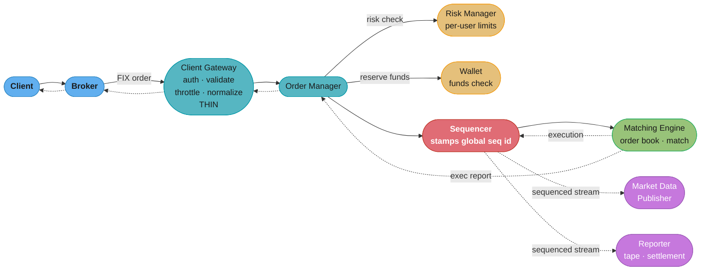
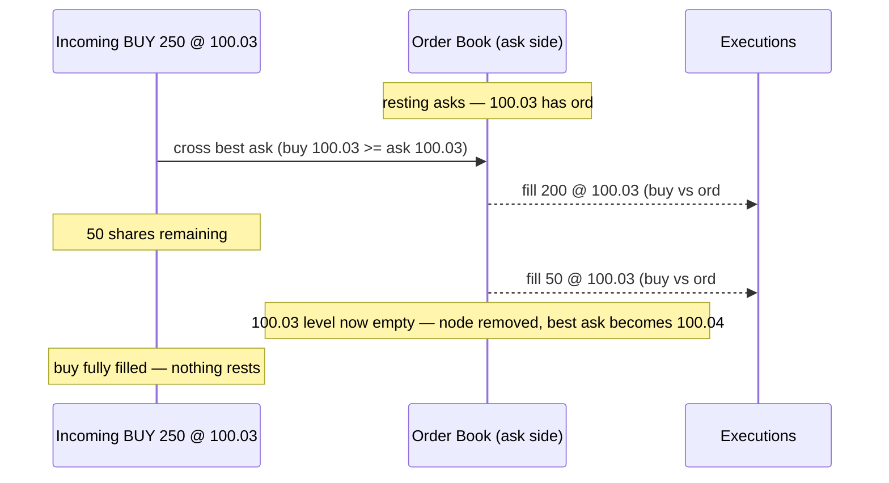
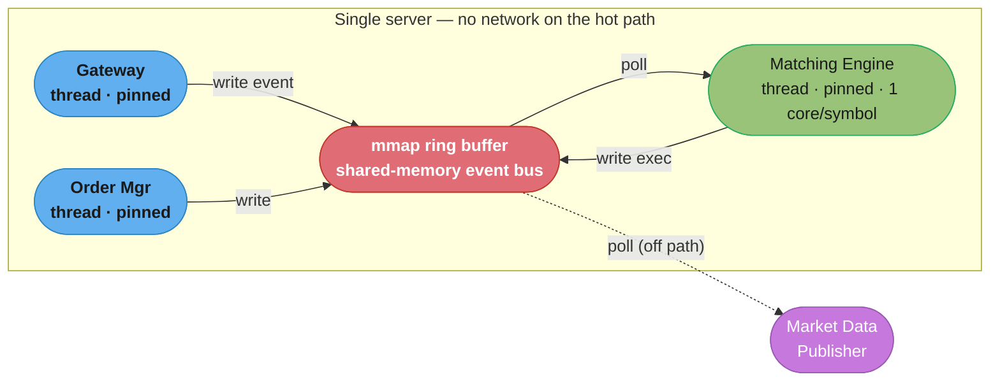
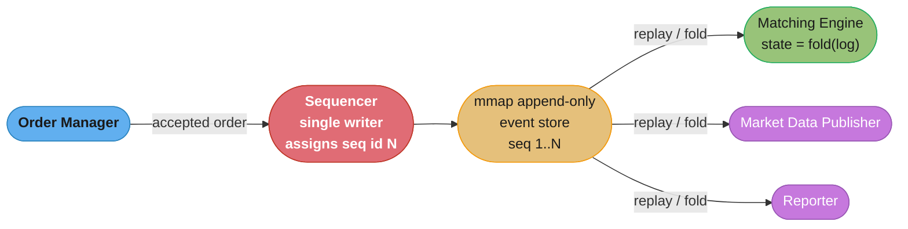
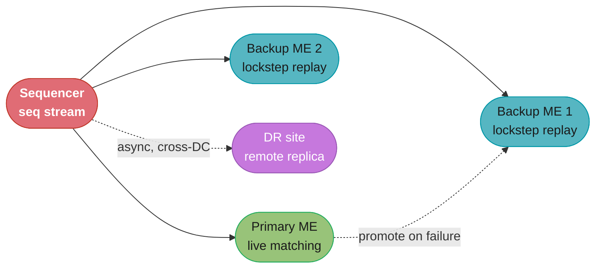
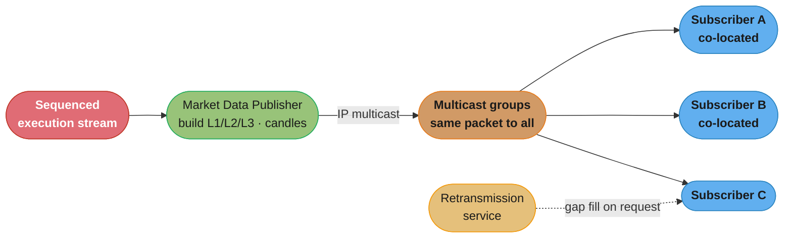
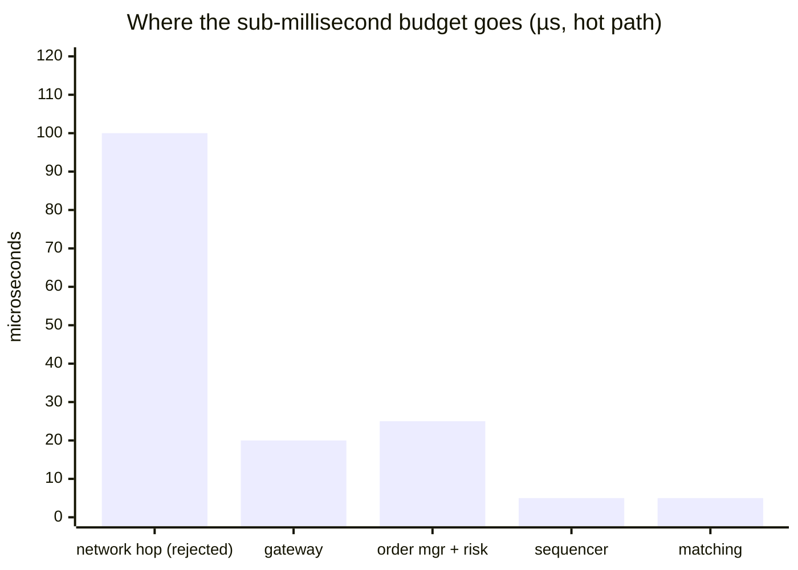

# Chapter 13: Stock Exchange

> Ch 13 of 13 · System Design Interview Vol 2 (Xu & Lam) · the finale — everything the book built, compressed into a single-digit-microsecond deterministic core

## Chapter Map

The book closes with the hardest latency problem it poses: an electronic stock exchange that must
match buyers to sellers in **single-digit microseconds**, never lose an accepted order, and treat
every participant **identically and deterministically** — because the rules are set by regulators,
not by an SLA you can renegotiate. Where every other chapter reached for *more* machines, threads,
and replicas to go faster, this chapter reverses the instinct: it **collapses the whole hot path
onto one machine**, runs the matching engine as a **single-threaded loop with no locks**, and makes
correctness fall out of **determinism** — the same inputs, in the same order, always produce the
same outputs, so a hot backup can stay in perfect lockstep just by replaying the same event stream.

**TL;DR:**
- The design is shaped by two non-negotiable facts: **one totally-ordered stream of events per
  symbol** (fairness/determinism) and **each event processed in low single-digit microseconds**
  (latency). Everything else serves those two without contradicting them.
- The **sequencer** stamps a global sequence id on every inbound order and every outbound
  execution — it is the single source of ordering truth and the seam that makes the whole system a
  deterministic state machine (the event-sourcing rung from Ch 12, pushed to its extreme).
- Distributed services with network hops **cannot** hit the latency budget, so the components run
  as **processes/threads on one server** talking over a **shared-memory / mmap event bus** — zero
  network, zero serialization on the hot path.
- Market data fan-out and regulatory reporting live **off** the critical path; they consume the
  sequenced stream asynchronously so publishing to 50,000 subscribers adds no latency to matching.

## The Big Question

> "How do I build a system where the *order of events* is the product — where being first in the
> queue at a price is worth real money — and I must guarantee that order is fair, reproducible, and
> never lost, while still answering in microseconds?"

Analogy: a stock exchange is **one auctioneer per stock, standing in front of a crowd**. For AAPL
there is exactly one auctioneer (the matching engine instance) who takes shouts (orders) **one at a
time, in the exact order received**, matches each new shout against the offers already on the board
(price-time priority), and announces the result immediately. The auctioneer never multitasks across
two simultaneous shouts for the same stock — if it did, two people could win the same trade or one
share could sell twice. You scale not by giving AAPL's auctioneer helpers, but by giving **every
symbol its own single-threaded auctioneer** running in parallel. This is the opposite of the rest
of the book, where the reflex is "add threads/replicas to go faster."

---

## 13.1 Step 1 — Understand the Problem and Establish Design Scope

An exchange looks deceptively small — match buyers to sellers — but the constraints are unlike any
other system in the book. Clarify scope aggressively before designing.

### Functional requirements

- **Place and cancel limit orders.** A **limit order** specifies a price and quantity: "buy 100
  AAPL at ≤ \$150.00." It only executes at that price or better; otherwise it rests on the book
  waiting. **Market orders are explicitly OUT of scope** for this design (they add complications —
  no price to check, priced against whatever liquidity exists — deferred to the wrap-up).
- **Users receive execution reports** (fills) — full or partial — as their orders match.
- **Users view the order book** — the resting bids and asks at each price level.
- **Users view market data**: candlestick (OHLC) charts and price/volume feeds.
- **Risk checks (per-user limits)** and **wallet checks (funds)** run before an order is accepted —
  a user cannot buy \$1M of stock with \$1,000 in the account, and cannot exceed configured
  position/size limits.

Scope kept to **~100 symbols**, one exchange, continuous trading during market hours.

### Non-functional requirements (regulation-driven, non-negotiable)

These are not SLAs you can soften — they are the reason the architecture looks the way it does:

| Requirement | What it demands | Why regulators/traders force it |
|-------------|-----------------|--------------------------------|
| **Sub-millisecond round-trip latency** | order in → execution out well under 1 ms; matching itself in single-digit µs | HFT participants race each other; queue position at a price is money |
| **Fairness / determinism** | every client faces the *same* speed and rules; same inputs → same outputs | price-time priority must be provably exact; no participant advantaged by the system |
| **Resilience** | ≥ 99.99% availability, seconds-scale recovery | a halted exchange is a market-wide event; downtime is front-page news |
| **Zero lost orders** | once "accepted," an order survives any crash | an acknowledged order that vanishes is a legal and financial liability |

Determinism is the linchpin: it delivers **fairness** (the ordering is reproducible and auditable),
**resilience** (a backup can replay the identical stream and stay in lockstep), and **auditability**
(regulators can replay the day and get byte-identical results).

### Back-of-the-envelope estimation

Anchor the numbers before designing. NYSE-ish scale:

```
Symbols                     ≈ 100
Orders per day              ≈ 1,000,000,000  (1 billion)
Trading window              ≈ 6.5 hours = 6.5 × 3,600 s = 23,400 s

Average order rate  = 1e9 orders / 23,400 s
                    ≈ 42,735 orders/sec        (≈ 43K orders/sec average)
```

**What this actually says.** "Spread the whole day's order flow evenly across the hours the
market is actually open, and that quotient is the *floor* the system must clear before you even
think about bursts." The framing matters because the average is the only number you can derive
honestly from the two givens — everything harsher comes from admitting the flow is not even.

| Symbol | What it is |
|--------|------------|
| 1,000,000,000 | orders accepted across the whole trading day, all symbols |
| 6.5 hours | the continuous-trading window (open to close) |
| 3,600 | seconds per hour, converting the window into the divisor's units |
| 23,400 s | the trading window in seconds — the denominator |
| 100 | symbols the exchange lists, used to get a per-symbol average |

**Walk one example.**

```
  trading window = 6.5 h x 3,600 s/h
                 = 23,400 s

  average rate   = 1,000,000,000 orders / 23,400 s
                 = 42,735.04 orders/sec
                 ~ 43K orders/sec

  per symbol     = 42,735 orders/sec / 100 symbols
                 = 427 orders/sec/symbol   (average, evenly spread)

  meaning: 43K/sec is the FLOOR. The per-symbol average of ~427/sec is so small that the
           average alone makes this look like an easy problem. It is not -- the peak, not
           the mean, is what sizes the machine.
```

But the average lies: order flow is savagely peaked at the **open** and **close**. A realistic peak
is several times the average — call it **5×–10×**, so bursts of **~200K–500K orders/sec** during
volatile opens/closes and news events. Two consequences fall straight out of this:

- **Inter-arrival time at peak.** At 200K orders/sec into one hot symbol, orders arrive every
  **~5 µs** on average — so the matching engine's per-order budget must be comfortably *under* 5 µs
  or a queue forms and latency explodes.
- **Sequencer/log bandwidth is NOT the bottleneck.** At ~5M messages/sec cluster-wide × ~100
  bytes/message ≈ **~500 MB/s** of sequential log writes — trivially within NVMe's multi-GB/s. The
  bottleneck is **per-message processing latency**, not aggregate bandwidth. This single observation
  drives the entire deep dive: optimize the hot path's latency, not its throughput.

**The idea behind it.** "Turn the peak arrival *rate* into the gap *between* consecutive orders,
then compare that gap to how long one match takes — if the match is not clearly shorter, a queue
forms and never drains." This reframing matters because it converts a throughput number into a
hard per-order deadline, which is the only form the single-threaded matching loop can act on.

| Symbol | What it is |
|--------|------------|
| 200,000 orders/sec | peak arrival rate into one hot symbol (5x the 43K average) |
| 1,000,000 us | one second expressed in microseconds, so the quotient lands in us |
| 5 us | the resulting mean gap between two consecutive orders at that peak |
| S | service time — microseconds the engine spends matching one order |
| capacity | orders/sec one thread sustains = 1,000,000 / S |
| rho | utilization = arrival rate / capacity; the queue is stable only while rho < 1 |

**Walk one example.**

```
  peak into one hot symbol .......... 200,000 orders/sec
  inter-arrival = 1,000,000 us / 200,000 orders
                = 5.0 us between consecutive orders

  now push candidate service times S through a single-server queue:
      capacity = 1,000,000 / S        rho = 200,000 / capacity
      queue wait = rho x S / (1 - rho)

    S (us)   capacity (orders/s)   rho    queue wait   response = wait + S
    ------   -------------------   ----   ----------   -------------------
     2.0           500,000         0.40      1.33 us          3.33 us
     4.0           250,000         0.80     16.00 us         20.00 us
     4.5           222,222         0.90     40.50 us         45.00 us
     5.0           200,000         1.00     unbounded        unbounded

  meaning: at S = 5 us the engine exactly equals the arrival rate, so the queue never
           drains. "Comfortably under 5 us" is not a style preference -- S = 4.5 us
           already costs 40.5 us of pure waiting, about 30x the 1.33 us at S = 2 us.
```

The `1 - rho` denominator is the term that does all the work here, and it is why the requirement
is stated as "comfortably under" rather than "under." As rho climbs the last few percent toward
1, waiting time does not grow gently — it blows up hyperbolically. Drop that term and you would
conclude that any S below 5 us is fine, which is exactly the mistake that produces an engine that
tests clean at average load and collapses at the open.

**Put simply.** "Multiply how many messages the cluster writes each second by how big each one
is, and you get the log's bandwidth demand — then check it against what the disk can actually
sustain." The point of running this is not to size the disk; it is to *eliminate* bandwidth as a
suspect so the whole deep dive can aim at per-message latency instead.

| Symbol | What it is |
|--------|------------|
| 5,000,000 msg/sec | cluster-wide message rate (orders plus executions, all symbols) |
| ~100 bytes | size of one sequenced event in the compact internal format |
| 500 MB/s | the product — sequential append bandwidth the event store must absorb |
| multi-GB/s | what a single NVMe drive sustains on sequential writes |

**Walk one example.**

```
  messages/sec (cluster-wide) ....... 5,000,000
  bytes per message ................. 100

  log bandwidth = 5,000,000 x 100 B
                = 500,000,000 B/s
                = 500 MB/s
                = 0.5 GB/s

  against one NVMe drive at ~3 GB/s sequential:
      0.5 / 3 = 16.7% of a single drive

  meaning: aggregate bandwidth uses about a sixth of ONE drive -- it is nowhere near the
           limit. The scarce resource is the ~5 us each individual message is allowed to
           take. Optimize latency; throughput is already free.
```

**Order book footprint.** A liquid symbol holds ~500–5,000 resting orders across 20–100 price
levels per side; each order is ~40–64 bytes, so a full book is **~250–320 KB** — small enough to
sit resident in **L2/L3 CPU cache**, which is *why* microsecond matching is even possible.

**Read it like this.** "Count the resting orders, multiply by how many bytes one order costs,
and check the product against the size of the CPU's last-level cache." The comparison is the
whole point: this is the calculation that decides whether matching runs at cache speed or DRAM
speed, and that single fact is the difference between microseconds and milliseconds.

| Symbol | What it is |
|--------|------------|
| 500–5,000 | resting orders on a liquid symbol's book (both sides together) |
| 20–100 | distinct price levels per side that those orders spread across |
| 40–64 bytes | size of one `Order` record in the compact internal format |
| L3 cache | last-level CPU cache, ~32 MB on a modern server socket |
| ~1–2 ns / ~100 ns | rough per-access cost of an L3 hit versus a DRAM fetch |

**Walk one example.**

```
  resting orders (liquid symbol, upper end) ..... 5,000
  bytes per order ............................... 40 to 64

  5,000 x 40 B = 200,000 B = 200 KB
  5,000 x 50 B = 250,000 B = 250 KB    <- matches the ~250 KB lower figure quoted above
  5,000 x 64 B = 320,000 B = 320 KB    <- matches the ~320 KB upper figure quoted above

  against a modern server L3 of ~32 MB:
      32 MB / 320 KB = 32,768 KB / 320 KB = 102 whole books
      one book = 320 / 32,768 = 0.98% of L3

  meaning: the entire order book is about 1% of L3, so every hot-path pointer chase is a
           cache hit (~1-2 ns) rather than a DRAM fetch (~100 ns) -- a ~50x per-access gap.
           This is the arithmetic that makes single-digit-microsecond matching possible.
```

Note that the 250 KB lower bound corresponds to ~50 bytes per order rather than the 40-byte end
of the stated range (5,000 x 40 B is 200 KB); the quoted 250–320 KB band sits comfortably inside
the 200–320 KB the endpoints allow, and either way the conclusion — a book two orders of
magnitude smaller than L3 — is unchanged.

---

## 13.2 Step 2 — Propose High-Level Design and Get Buy-In

### Business knowledge 101

You cannot design an exchange without the domain vocabulary. The book front-loads it.

**Broker vs institutional client.** Retail users trade through a **broker** (Robinhood, Fidelity,
Schwab) — the broker holds accounts, does KYC/AML, and forwards orders to the exchange. Large
**institutional clients** (hedge funds, market makers, pension funds) connect closer to the metal,
often **co-located** in the exchange's data center with direct feeds, trading in huge volume and
caring about microseconds.

**Limit order vs market order.**

| | Limit order (in scope) | Market order (out of scope) |
|-|------------------------|-----------------------------|
| Specifies | price *and* quantity | quantity only |
| Executes | only at limit price or better; else rests on book | immediately against best available price |
| Risk | may never fill | fills at an unknown/worse price (slippage) |
| Book effect | can add liquidity (rest) or take it (cross) | always takes liquidity |

A limit **buy** at \$150 means "pay at most \$150"; a limit **sell** at \$150 means "accept at least
\$150." An order that immediately matches an opposing resting order **crosses the spread**; the
remainder (if any) **rests** on the book at its limit price.

**Market data levels — L1 / L2 / L3.** How much of the book a subscriber sees:

| Level | Content | Use |
|-------|---------|-----|
| **L1** | **best bid and best ask** only (top of book) + last trade | retail quotes, "the price" |
| **L2** | **top N price levels** on each side, aggregated by price (total qty per level) | depth-of-market, gauging liquidity |
| **L3** | **full order-by-order book** — every individual resting order | market makers, exact queue position |

L3 is the richest and heaviest; only sophisticated participants consume it. L1 is what a normal app
shows.

**Candlestick charts (OHLC).** Price history is aggregated into fixed intervals (1 min, 5 min, 1
day). Each candle records four values over its interval — **Open** (first trade price), **High**
(max), **Low** (min), **Close** (last trade price) — plus **Volume**. The market data publisher
builds these by aggregating executions per interval.

**FIX protocol — the industry wire format.** **FIX (Financial Information eXchange)** is the
decades-old, tag-value, pipe-(SOH-)delimited text protocol brokers and exchanges speak. A message is
a list of `tag=value` fields. A **NewOrderSingle** (a new order, tag `35=D`) looks like:

```
8=FIX.4.2 | 9=176 | 35=D | 49=CLIENT12 | 56=EXCH | 34=215 |
52=20240101-15:30:00.000 | 11=ORD-13579 | 55=AAPL | 54=1 |
60=20240101-15:30:00 | 38=100 | 40=2 | 44=150.50 | 59=0 | 10=072
```

Reading the load-bearing tags: `35=D` NewOrderSingle · `49`/`56` sender/target · `11` client order
id · `55=AAPL` symbol · `54=1` side (1=buy, 2=sell) · `38=100` quantity · `40=2` order type
(1=market, **2=limit**) · `44=150.50` limit price · `59=0` time-in-force (0=day) · `8`/`9`/`10`
are the version, body length, and checksum framing. Because FIX is verbose text, latency-sensitive
venues also offer **binary protocols** (NASDAQ's ITCH for market data, OUCH for order entry) — the
client gateway's job is to normalize whatever wire format arrives into one compact **internal
format** the rest of the system uses.

### High-level design — the critical path

The whole design is a single line of components, and the entire game is keeping that line short and
deterministic. An order flows: **client → broker → client gateway → order manager → sequencer →
matching engine**, and the execution flows back the same path. Two more components — the **market
data publisher** and the **reporter** — hang **off** the critical path, consuming the sequenced
stream asynchronously.



Caption: the solid arrows are the inbound critical path (kept as short as possible); the dotted
arrows are executions flowing back and the asynchronous off-path consumers. The sequencer sits in
the middle as the single ordering authority — everything downstream of it is a deterministic
function of the sequenced stream.

Component responsibilities:

- **Client gateway** — the entry point. Authenticates the connection, validates message
  well-formedness, enforces rate limits (throttling), and normalizes FIX/binary into the internal
  format. Kept **THIN**: every microsecond here is on the hot path, so it does the minimum and
  hands off. No business logic.
- **Order manager** — orchestrates pre-trade checks. Calls the **risk manager** (per-user position
  limits, max order size, fat-finger price bands) and the **wallet** (does the user have the funds?
  reserve them). Only orders passing both proceed. A rejected order **never reaches the sequencer or
  matching engine**.
- **Sequencer** — stamps a **global, monotonic sequence id** on **every** inbound order and **every**
  outbound execution. It is the single writer, the single ordering authority, and the durable record
  (an append-only log). This is the heart of the design (§13.3).
- **Matching engine** — owns the **order book** for its symbol(s), matches incoming orders against
  resting orders by price-time priority, and emits executions. **Single-threaded per symbol
  partition**, no locks.
- **Market data publisher** (off path) — consumes executions/book changes from the sequenced stream
  and builds L1/L2/L3 views and candlesticks, fanning them out to subscribers.
- **Reporter** (off path) — consumes the sequenced stream for regulatory reporting (the "tape"),
  settlement/clearing handoff (T+1/T+2), and surveillance.

### The trade flow, end to end

1. Client sends a FIX limit order via its broker.
2. Client gateway authenticates, validates, throttles, normalizes → internal order.
3. Order manager runs risk check (risk manager) and funds reserve (wallet).
4. On pass, the order goes to the sequencer, which assigns sequence id N and durably appends it.
5. The matching engine consumes sequence id N, matches against the book, emits zero+ executions.
6. Each execution is itself sequenced (its own id) and flows back → order manager → gateway →
   broker → client as an **execution report**.
7. Asynchronously, the market data publisher and reporter consume the same stream and fan out
   quotes, candlesticks, and regulatory reports.

---

## 13.3 Step 2 (cont.) — Data models: order, execution, and the order book

### Order and execution (fill)

Both records are deliberately tiny — the smaller they are, the more of the book stays in cache.

```
Order {
  order_id     : uint64        // exchange-assigned
  client_ord_id: string        // FIX tag 11, client's own id
  symbol       : uint32        // interned symbol id (not a string on the hot path)
  side         : enum {BUY, SELL}   // 1 bit
  price        : int64         // fixed-point (e.g. 1/10000 of a dollar) — NEVER float
  quantity     : uint32        // remaining shares
  seq_id       : uint64        // global sequence id (time priority)
  ts           : uint64        // nanosecond timestamp
  user_id      : uint32
}                              // ≈ 40–64 bytes

Execution (Fill) {
  exec_id      : uint64
  seq_id       : uint64        // its own sequence id
  buy_order_id : uint64
  sell_order_id: uint64
  symbol       : uint32
  price        : int64         // fixed-point
  quantity     : uint32        // shares traded in THIS fill
  ts           : uint64
}
```

Two non-obvious but critical modeling choices: **prices are fixed-point integers, never floats**
(floating-point rounding is unacceptable in money and breaks determinism across CPUs), and
**symbols are interned to integer ids** so the hot path compares 4 bytes, not strings.

### The order book — the structure that makes O(1) possible

The order book is the star data structure. It must support, in **O(1)**: add an order, cancel an
order by id, find the best bid/ask, and match. The book achieves this by composing three structures
(this is the "fast limit order book" design the book references):

- A **doubly-linked list of price-level nodes**, one node per distinct price, kept in price order
  (bids descending, asks ascending). The head is the best price.
- **Each price node holds a FIFO queue of orders** at that price — first in, first matched. This
  FIFO **is** time priority.
- A **hashmap `price → node`** so you jump to any price level in O(1) (to append a resting order).
- A **hashmap `order_id → order`** (and each order knows its enclosing node) so **cancel** is O(1) —
  find the order, unlink it from its FIFO queue, done, no scan.

```
                       ASK side (sell orders, price ASCENDING)
                       ┌──────────────────────────────────────────┐
  best ask ─────────►  │ 100.03 │  ord#7(200) → ord#9(50)          │  FIFO queue
                       ├──────────────────────────────────────────┤  (time priority:
                       │ 100.04 │  ord#3(100)                      │   #7 before #9)
                       └──────────────────────────────────────────┘
   ─────────────────── spread (best ask 100.03  −  best bid 100.00) ───────────────────
                       ┌──────────────────────────────────────────┐
  best bid ─────────►  │ 100.00 │  ord#5(300) → ord#8(100)         │
                       ├──────────────────────────────────────────┤
                       │  99.99 │  ord#2(500)                      │
                       └──────────────────────────────────────────┘
                       BID side (buy orders, price DESCENDING)

  hashmap  price -> price-node   (jump to any level in O(1) to rest an order)
  hashmap  order_id -> order     (cancel in O(1): unlink from its FIFO, no scan)
  price nodes are a doubly-linked list; each node's FIFO queue = a doubly-linked list of orders
```

Caption: price-level nodes give O(1) best-price access (head of the list); the per-level FIFO queue
encodes time priority; the two hashmaps make add-at-price and cancel-by-id O(1). Together they yield
**price-time priority** — best price first, then earliest order first — with no sorting on the hot
path.

**Why this gives O(1) for every hot operation:**

- **Best bid/ask** = head of the bid/ask price-node list → O(1).
- **Add resting order** = hashmap price → node (O(1)), append to that node's FIFO tail (O(1)). Only
  a *new* price level needs a list insertion, and even that is O(1) given the neighbor pointers.
- **Cancel** = hashmap order_id → order (O(1)), unlink from its doubly-linked FIFO (O(1)). This is
  the operation naive designs get wrong — scanning the book to cancel is O(n) and murders latency.
- **Match** = repeatedly take the head of the opposing best price level's FIFO → O(1) per fill.

### Worked match example

Book state (from the diagram above): best ask `100.03 × 200` (ord#7) then `× 50` (ord#9); best bid
`100.00 × 300` (ord#5).

Incoming **limit BUY 250 @ 100.03**. Does it cross? Buy limit 100.03 ≥ best ask 100.03 → **yes**.

```
  step 1: match against ord#7 (100.03 × 200) — buy wants 250, ord#7 has 200
          → fill 200 @ 100.03.  ord#7 fully filled, removed from FIFO.  buy has 50 left.
  step 2: match against ord#9 (100.03 × 50)  — buy wants 50, ord#9 has 50
          → fill 50 @ 100.03.   ord#9 fully filled, removed.  100.03 level now empty → node removed.
          buy fully filled (0 left) — nothing rests.
  executions produced: [ 200 @ 100.03 (buy vs #7),  50 @ 100.03 (buy vs #9) ]
  book after:  best ask is now 100.04 (ord#3);  best bid unchanged at 100.00.
```

If instead the incoming order were **BUY 250 @ 100.03** but only 100 shares rested at 100.03, it
would fill 100 and then — since the next ask (100.04) is *above* its limit — the remaining **150
would rest** on the bid side at 100.03, **becoming the new best bid** (100.03 > 100.00). Partial
fills and resting remainders are the norm.



Caption: the incoming order walks the opposing side head-first, taking whole FIFO entries in time
order until it is filled or can no longer cross; each take is O(1), so a match producing k fills is
O(k). Price-time priority is visible: ord#7 (earlier) fills before ord#9 (later) at the same price.

### Candlestick aggregation model

The market data publisher folds executions into fixed-interval candles:

```
Candle {
  symbol, interval (1m / 5m / 1d), start_ts
  open   : first trade price in the interval
  high   : max trade price
  low    : min trade price
  close  : last trade price
  volume : sum of traded quantity
}
```

On each execution: if it opens a new interval, start a new candle (`open = high = low = close =
price`); otherwise update `high = max`, `low = min`, `close = price`, `volume += qty`. Because the
publisher consumes the **sequenced** execution stream, candles are deterministic and identical for
every subscriber.

**In plain terms.** "A candle is four running accumulators over one interval: two that remember
*where* a trade sat in the sequence (first and last) and two that remember *how extreme* it was
(max and min), plus a running sum." Splitting the five fields that way explains precisely which
of them can be corrupted by out-of-order delivery — and therefore why the sequenced stream is
load-bearing rather than a convenience.

| Symbol | What it is |
|--------|------------|
| open | price of the FIRST execution in the interval — positional, order-dependent |
| high | running max of execution prices — extremal, order-independent |
| low | running min of execution prices — extremal, order-independent |
| close | price of the LAST execution in the interval — positional, order-dependent |
| volume | running sum of executed quantity over the interval |

**Walk one example.**

```
  1-minute candle starting 15:30:00; executions arrive in sequence order (price x qty):

    100.03 x 200  -> new interval: open=high=low=close=100.03,  volume=200
    100.07 x 100  -> high=max(100.03,100.07)=100.07  close=100.07  volume=200+100=300
     99.99 x 500  -> low =min(100.03, 99.99)= 99.99  close= 99.99  volume=300+500=800
    100.04 x  50  -> high stays 100.07, low stays 99.99, close=100.04, volume=800+50=850

  candle = { open 100.03, high 100.07, low 99.99, close 100.04, volume 850 }

  meaning: shuffle those four executions and high (100.07), low (99.99) and volume (850)
           come out identical -- but open and close would change. Exactly two of the five
           fields depend on ordering, which is why candles MUST be folded over the
           sequenced stream or two subscribers will disagree about the same minute.
```

---

## 13.4 Step 3 — Design Deep Dive

### Performance — the latency budget and why one machine beats a cluster

The hard requirement is **sub-millisecond round-trip**, with matching itself in **single-digit
microseconds**. Split the budget across the hops:

```
  total round-trip budget ................ < 1 ms  (sub-millisecond)
    ├─ gateway (auth/validate/normalize) .. ~ tens of µs
    ├─ order manager + risk + wallet ...... ~ tens of µs
    ├─ sequencer append ................... ~ single-digit µs
    ├─ matching engine match .............. ~ single-digit µs (p50), < ~50 µs p99.9
    └─ execution return path .............. ~ tens of µs
```

**What the formula is telling you.** "The sub-millisecond number is not one budget — it is a sum
of five, and every hop you insert gets charged against the same total." Reading it as a sum is
what exposes the real failure mode: no single component is slow, but transit added between them
is billed once per hop, and five hops is enough to spend the budget before any matching happens.

| Symbol | What it is |
|--------|------------|
| < 1 ms | the total round-trip budget: order in to execution out (1,000 us) |
| gateway | auth, validate, throttle, normalize — tens of us |
| order mgr + risk + wallet | pre-trade checks before sequencing — tens of us |
| sequencer append | stamp the sequence id and append to the log — single-digit us |
| matching engine | the match itself — single-digit us at p50 |
| return path | execution report back out through manager and gateway — tens of us |
| ~100 us | one in-data-center network round-trip, if components were separate services |

**Walk one example.** Take the midpoints of the stated ranges (20 us for a "tens of us" hop,
5 us for a "single-digit us" one) and sum them.

```
  gateway (auth/validate/normalize) ....    20 us
  order manager + risk + wallet ........    25 us
  sequencer append .....................     5 us
  matching engine match ................     5 us
  execution return path ................    20 us
                                        ----------
  hot-path work total ..................    75 us
  budget ...............................  1,000 us   (1 ms)
  headroom = 1,000 - 75 ................   925 us    (only 7.5% of budget spent)

  now put ONE network hop (~100 us) between each of the 5 components:
      transit = 5 x 100 us  = 500 us
      total   = 500 + 75    = 575 us   -> 57.5% of the budget, 500 us of it pure wire time

  meaning: the work fits in 7.5% of the budget with room to spare. Transit charged five
           times consumes half of it -- leaving nothing for p99 jitter, GC-free tail
           spikes, or a burst queue. Deleting the network is the only move that recovers
           the 500 us; making any single component faster cannot.
```

**The book's evolution — how the design arrives at "one machine":**

- **(a) Distributed services, first instinct — and it fails.** Put each component in its own service,
  talk over the network. A single in-data-center network round-trip is **tens to hundreds of
  microseconds**; serialize/deserialize on each hop adds more. Cross five services and you have blown
  the entire budget on transit before doing any matching. *Distributed services cannot hit this
  target.* This is the pivotal realization.
- **(b) Everything on one server.** Collapse the components onto a **single powerful server**, running
  as **processes/threads on one machine**. There is no network between them. Communication is via a
  **shared-memory / mmap event bus** — an mmap'd ring buffer that all components read/write directly.
  This is **zero network hops and zero serialization** between components: they pass pointers to
  records in shared memory, not serialized bytes over a socket.
- **(c) Mechanical sympathy.** With the network gone, the remaining latency is CPU and memory. The
  design leans into hardware:
  - **CPU pinning (core affinity)** — pin each component's thread to a dedicated core so the OS
    scheduler never migrates it and its data stays in that core's cache.
  - **Single-threaded matching loop per symbol partition** — no locks, no contention, no cache-line
    bouncing between cores. The book fits in L2/L3 cache (~250–320 KB), so matching touches memory
    at cache speed.
  - **The application loop (busy-poll spin)** — instead of blocking on I/O, each component runs one
    hot loop that **polls** the shared-memory event store for the next event and processes it
    immediately. No syscall, no context switch, no interrupt latency — the core spins hot. This is
    the "mechanical sympathy" LMAX Disruptor popularized.
  - **Kernel bypass** (mentioned, not deep-dived) — network I/O at the edges uses kernel-bypass NICs
    (DPDK / Solarflare Onload) so packets reach userspace without traversing the kernel network
    stack. No deep NIC dive in scope.

The trade is stark and deliberate: you **give up horizontal scale within a symbol** (one core does
all matching for AAPL) to **win latency and determinism**. Scale comes from **partitioning symbols
across engines** (AAPL on one core, MSFT on another), never from parallelizing one symbol.



Caption: the mmap ring buffer replaces the network — components read and write events in shared
memory by pointer, so the only latency left is CPU and cache. Pinned threads and a single-threaded
matching core per symbol remove locks and scheduler jitter.

### Event sourcing + the sequencer

Every state change in the system is an **event**: an order accepted, an order matched, an execution
produced, an order canceled. The events are appended, in order, to an **mmap append-only event
store** (the log). The **sequencer is the single writer** — it stamps each event with a
monotonically increasing **sequence id** and appends it. Nothing mutates state except by appending a
sequenced event.

This is **event sourcing** taken to its logical extreme, and it is the same rung introduced in **Ch
12 (Digital Wallet)**, where a reproducible event log made the wallet reliable; here it is pushed
until the *whole exchange* is a function of the log. The consequence is the design's core property:

> **Every component (order manager, matching engine, market data publisher, reporter) is a
> deterministic state machine consuming the same sequenced stream.** Given the same events in the
> same order, each produces byte-identical output. State is not something you store and hope stays
> correct — it is the **fold of the event log**.

Why this is so powerful:

- **Recovery** = replay the log from a checkpoint. A crashed matching engine rebuilds its exact book
  by replaying events; no separate durable copy of the in-memory book is needed.
- **Auditability** = regulators replay the day's log and get identical results. Fairness is provable.
- **Determinism = correctness.** Because the sequencer imposes one total order, "who was first at
  this price" has exactly one answer, forever.

The append-only log with a single writer and ordered sequence ids is the same primitive as **Ch 4
(Distributed Message Queue)** — a partitioned, replicated commit log where consumers track their
offset. The exchange's event store is essentially a Kafka-style partition per symbol, tuned for
microsecond append latency instead of throughput.



Caption: the sequencer is the one writer; every consumer's state is a deterministic fold of the same
ordered log, so all consumers — and any replica — stay perfectly consistent.

### Availability and fault tolerance

Zero lost orders and ≥ 99.99% availability, with a single-threaded engine that cannot itself be
scaled out, force a **hot primary/backup** design built on determinism.

- **Hot primary + warm backup matching engines.** The primary matches live. One or more **backups
  consume the identical sequenced event stream** and replay it deterministically, holding an
  in-memory book **in lockstep** with the primary. They are not idle standbys — they are continuously
  replaying.
- **Failover = promote a warm replica.** If the primary dies, a backup — already at the same state —
  is promoted and continues from the next sequence id. Recovery is **seconds**, not minutes, because
  there is no cold rebuild: the replica's book is already current.
- **Sequence-gap detection.** Because every event carries a monotonic sequence id, a consumer that
  sees ids `…, 104, 106, …` **immediately knows event 105 is missing** and requests a retransmit (or
  halts) rather than silently processing out of order. Gaps are how you detect a lost event in a
  system where losing one is catastrophic.
- **"How do you know the backup hasn't diverged?"** This is the killer interview question, and the
  answer is the whole point of the design: **it can't, absent bugs.** Determinism means same events →
  same state, so a correctly-replaying backup is provably identical to the primary — there is no
  divergence to detect, unlike a primary/replica pair that ships state (which *can* drift). To guard
  against *bugs*, replicas can checksum their book state per sequence id and compare; a mismatch means
  a code defect, not a data race.
- **Across-DC replication tradeoffs.** Replicating synchronously to a second data center adds a WAN
  round-trip (~ms) to every commit — unacceptable on the hot path. So exchanges typically keep the
  hot primary/backup **in one DC** (or one rack) for latency and replicate to a remote DC
  **asynchronously** for disaster recovery — accepting a small **RPO** (a few in-flight events could
  be lost in a total-DC loss) to protect **RTO/latency**. It is the classic sync-vs-async replication
  tradeoff from Ch 4, resolved toward latency.



Caption: backups replay the same sequenced stream so they are always current — failover is a
promotion, not a rebuild; cross-DC replication is async to keep the hot path fast, trading a tiny RPO
for latency.

### Market data fan-out

The **market data publisher** consumes executions and book changes from the sequenced stream and
builds the L1/L2/L3 views and candlesticks, then distributes them to potentially **tens of thousands
of subscribers** — all off the critical path.

- **Building the views.** L1 = top of book (best bid/ask + last trade); L2 = aggregate top-N levels;
  L3 = every order. Candlesticks fold executions per interval (§13.3). All are pure functions of the
  sequenced stream.
- **Multicast distribution.** Real exchanges distribute via **IP multicast**, not per-subscriber TCP:
  one packet is delivered to all subscribers at once, so 1 subscriber or 50,000 costs the publisher
  the same, and — critically — **everyone receives the same data at the same instant** (fairness).
- **Retransmission groups.** Multicast is unreliable (UDP), so feeds carry sequence numbers and a
  **retransmission service** lets a subscriber that detects a gap (seq 104 → 106) request the missing
  packet — the same sequence-gap mechanism as the engine, applied to the wire feed. Feeds are often
  split into groups (e.g. by symbol range) so a subscriber only joins the multicast groups it needs.
- **Fairness: same data, same time.** Multicast plus a single sequenced source means no subscriber is
  structurally ahead of another in the fan-out. The remaining advantage anyone can buy is *physical*.
- **Colocation as the physical-fairness mechanism.** The last unfair edge is **speed of light**: a
  server 100 km away is milliseconds behind one in the exchange's building. Exchanges neutralize this
  by selling **colocation** — racks inside the exchange data center — and famously equalizing cable
  lengths so every co-located participant is *literally the same distance* from the matching engine.
  Fairness is enforced down to the cable.



Caption: one sequenced source feeds a multicast fan-out so every subscriber gets identical data
simultaneously; retransmission fills gaps on request, and colocation equalizes the only remaining
edge — physical distance.

### Distribution fairness & determinism recap

Two market-design mechanisms exist *because* even a fair, deterministic core can still be gamed by
raw speed, and they are worth naming briefly:

- **Speed bumps** — a small, deliberate, uniform delay on incoming orders (IEX's famous **350
  microsecond** coil of fiber) that blunts latency-arbitrage strategies where an HFT reacts to a
  price change faster than slower participants can update their resting quotes. Everyone is slowed
  equally, so relative fairness improves.
- **Batch auctions (frequent batch auctions)** — instead of continuous matching, collect orders over
  a tiny window (e.g. 100 ms) and match them all at once at a single clearing price. This converts the
  race-to-be-first (a latency contest) into a **uniform-price auction** (a price contest), removing
  the value of being a nanosecond faster.

Both are responses to the same truth this chapter exposes: when *ordering is the product*,
microscopic speed differences become economically decisive, and exchanges intervene to keep the
market fair beyond what the matching engine alone can guarantee.

---

## 13.5 Step 4 — Wrap Up

If time remains, the interviewer will push on what changes when scope loosens:

- **Adding market orders.** A market order has no price, so it skips the price check and matches
  against the best available liquidity until filled — but it needs new guards: **price protection /
  collars** (reject if it would fill absurdly far from the last price), behavior when the book is
  **thin or empty** (partial fill then cancel, or reject), and tighter interaction with circuit
  breakers. Market orders always *take* liquidity; they never rest.
- **After-hours / extended trading.** Thinner liquidity, wider spreads, and often **limit-orders-only**
  sessions with separate order books; the matching engine gains explicit **session states**
  (pre-market → continuous → closing auction → after-hours → halted) that change how it accepts and
  matches orders. Closing/opening **auctions** batch orders into a single clearing price.
- **Multiple regions.** True multi-region matching for the *same* symbol reintroduces the ordering
  problem the whole design exists to avoid (two regions cannot both be the single writer). The
  practical answer is **one authoritative matching region per symbol**, with other regions as
  gateways/DR — you do not distribute the single-writer core across regions; you distribute *symbols*
  across regions.
- **Crypto exchanges as contrast.** Crypto venues (Coinbase, Binance) share the order-book/matching
  core but relax almost everything else: **24/7** trading (no market-open peak to design around),
  **looser latency** requirements (many are cloud-hosted, millisecond-scale, not microsecond), a
  **lighter/evolving regulatory regime**, and the extra burden of **on-chain custody and
  settlement** — matching is off-chain for speed, but the exchange must custody assets and reconcile
  with blockchains, which a traditional exchange (settling via a central clearinghouse T+1/T+2) never
  touches.

The chapter — and the book — ends on its central lesson: an exchange is the one system where you
**win by doing less in parallel, not more.** A single deterministic thread, a single ordered log, and
a single machine buy you the fairness, reproducibility, and microsecond latency that no distributed,
multi-threaded design can. Every other chapter added machines to go faster; the finale removes them.

---

## Visual Intuition

The order-book structure (repeated here as the chapter's central mechanism) — price-level nodes,
each a FIFO queue, with two hashmaps for O(1) add/cancel:

```
   order_id -> order  (O(1) cancel)          price -> price-node  (O(1) add-at-price)
        │                                            │
        ▼                                            ▼
   ┌─────────── ASK list (price ascending, head = best ask) ──────────┐
   │  [100.03] ⇄ [100.04] ⇄ [100.07]                                  │
   │     │          │          │                                       │
   │   FIFO       FIFO       FIFO      (each level: oldest → newest)   │
   │   #7,#9      #3         #11,#14                                    │
   └───────────────────────────────────────────────────────────────────┘
   ┌─────────── BID list (price descending, head = best bid) ─────────┐
   │  [100.00] ⇄ [99.99] ⇄ [99.95]                                    │
   │     │          │         │                                        │
   │   FIFO       FIFO      FIFO                                        │
   │   #5,#8      #2        #1                                          │
   └───────────────────────────────────────────────────────────────────┘

   best bid = head(BID) = 100.00      best ask = head(ASK) = 100.03
   spread   = 100.03 − 100.00 = 0.03
```

Caption: the doubly-linked price-node lists give O(1) best-price (the head); the per-level FIFO gives
time priority; the two hashmaps give O(1) add-at-price and O(1) cancel-by-id — this composition is
what lets a single core match at microsecond speed.

Latency budget as a stacked picture — why the network cannot appear on the hot path:



Caption: a single in-DC network round-trip (~100 µs) would consume most of the sub-millisecond budget
by itself — which is exactly why the design deletes the network and runs the components in shared
memory on one machine.

**Stated plainly.** "Add up only the bars the design actually keeps, then hold the rejected bar
next to that sum." The chart is a comparison, not an inventory, and reading it as a ratio is what
makes the rejection obvious rather than merely stated.

| Symbol | What it is |
|--------|------------|
| network hop (rejected) | ~100 us for one in-DC round-trip — the bar the design refuses |
| gateway | 20 us — retained hot-path work |
| order mgr + risk | 25 us — retained hot-path work |
| sequencer | 5 us — retained hot-path work |
| matching | 5 us — retained hot-path work |

**Walk one example.**

```
  retained bars ..... gateway 20 + order mgr 25 + sequencer 5 + matching 5
                    = 55 us of real work on the hot path

  rejected bar ...... one network hop = 100 us

  ratio ............. 100 / 55 = 1.82x

  meaning: a SINGLE network round-trip costs nearly twice everything the design chose to
           keep, combined. The tallest bar on the chart is the one component that was
           deleted -- which is the entire argument for the single-machine architecture.
```

---

## Key Concepts Glossary

- **Limit order** — an order with a price and quantity; executes only at that price or better, else
  rests on the book. The only order type in scope.
- **Market order** — quantity only; executes immediately against best available price (out of scope
  here).
- **Broker** — intermediary holding retail accounts and forwarding orders to the exchange.
- **Institutional client** — large trader (fund, market maker), often co-located, high volume.
- **Client gateway** — thin entry point: auth, validation, throttling, wire-format normalization.
- **Order manager** — orchestrates pre-trade risk and funds checks before sequencing.
- **Risk manager** — enforces per-user limits (position, order size, fat-finger price bands).
- **Wallet** — checks and reserves the user's funds.
- **Sequencer** — single writer stamping a global monotonic sequence id on every event; the ordering
  authority.
- **Matching engine** — owns the order book, matches orders by price-time priority, emits executions;
  single-threaded per symbol.
- **Order book** — the resting bids and asks; here a doubly-linked list of price nodes, each a FIFO
  queue, plus two hashmaps.
- **Price level (price node)** — a node for one price holding a FIFO queue of orders at that price.
- **Price-time priority** — match best price first; among equal prices, earliest order first.
- **FIFO queue (per price level)** — encodes time priority: first order in is first matched.
- **Cross the spread** — an incoming order whose price meets an opposing resting order, causing a
  match.
- **Execution / fill** — a trade between a buy and sell order; may be partial.
- **Resting order** — the unmatched remainder sitting on the book awaiting a counterparty.
- **Spread** — best ask minus best bid.
- **L1 / L2 / L3 market data** — best bid/ask; top-N aggregated levels; full order-by-order book.
- **Candlestick (OHLC)** — per-interval Open/High/Low/Close + Volume aggregation.
- **FIX protocol** — the industry tag-value wire format for orders and reports.
- **Internal format** — the compact normalized representation used on the hot path (interned symbols,
  fixed-point prices).
- **Event sourcing** — state is the deterministic fold of an append-only event log.
- **mmap event store** — memory-mapped append-only log; the durable record and event bus.
- **Shared-memory / mmap event bus** — inter-component communication with no network or serialization.
- **Application loop (busy-poll)** — a hot spin loop polling the event store; no blocking, no
  context switch.
- **CPU pinning (core affinity)** — binding a thread to a core to preserve cache and avoid scheduler
  jitter.
- **Mechanical sympathy** — designing to the hardware (cache, cores, no locks) for latency.
- **Kernel bypass** — userspace NIC I/O (DPDK, Onload) skipping the kernel network stack.
- **Deterministic state machine** — same events in same order → identical output.
- **Deterministic replay** — rebuilding exact state by replaying the sequenced log.
- **Hot primary/backup** — a backup replaying the same stream in lockstep, promoted on failover.
- **Sequence-gap detection** — spotting a missing sequence id to detect a lost event.
- **Multicast fan-out** — one packet to all subscribers, giving simultaneous, fair market data.
- **Retransmission group/service** — gap-fill mechanism for unreliable multicast feeds.
- **Colocation** — racks inside the exchange DC (with equalized cabling) neutralizing physical
  distance.
- **Speed bump** — a small uniform delay (IEX 350 µs) blunting latency arbitrage.
- **Batch auction** — periodic single-price matching that converts a latency race into a price
  auction.

---

## Tradeoffs & Decision Tables

| Decision | Option A | Option B | This design chooses | Why |
|----------|----------|----------|---------------------|-----|
| Component placement | distributed microservices | single server, shared memory | **single server** | network hop (~100 µs) blows the sub-ms budget |
| Matching concurrency | multi-threaded per symbol | single-threaded per symbol | **single-threaded** | locks/cache-bouncing add jitter; determinism needs one order |
| Scaling matching | scale within a symbol | partition symbols across cores | **partition symbols** | one symbol's order must be one total order |
| Inter-component I/O | sockets + serialization | mmap ring buffer, by pointer | **mmap ring buffer** | zero serialization, zero network on hot path |
| Durability of book | persist book snapshots | replay sequenced event log | **event log replay** | log is single source of truth; O(1) recovery via replay |
| Failover | cold restart + rebuild | hot backup in lockstep replay | **hot backup** | seconds-scale RTO; determinism means no divergence |
| Cross-DC replication | synchronous | asynchronous | **asynchronous** | sync WAN round-trip kills latency; accept small RPO |
| Market data delivery | per-subscriber TCP | IP multicast + retransmit | **multicast** | simultaneous fair delivery, constant publisher cost |
| Order type in scope | market + limit | limit only | **limit only** | market orders add pricing/collar complexity |
| Price representation | floating point | fixed-point integer | **fixed-point** | float rounding breaks money and cross-CPU determinism |

| Anomaly the design prevents | Mechanism |
|-----------------------------|-----------|
| Two participants "winning" the same trade | single-threaded, single-total-order per symbol |
| Out-of-order / unfair matching | sequencer's global monotonic sequence ids |
| Backup silently diverging from primary | deterministic replay (same input → same state) |
| Lost accepted order after a crash | durable append-only event log + replay |
| A missed event processed as if present | sequence-gap detection |
| Subscribers getting data at different times | multicast + colocation cable equalization |

---

## Common Pitfalls / War Stories

- **Reaching for microservices and network calls on the hot path.** The intuitive "one service per
  component" design cannot meet sub-millisecond round-trip: a single in-DC round-trip is tens-to-
  hundreds of microseconds and eats the whole budget across five hops. The fix is the whole point of
  the chapter — collapse onto one machine and communicate via shared memory.
- **O(n) cancel.** A naive order book that scans to cancel an order is O(n) and destroys latency under
  cancel-heavy flow (most orders are canceled, not filled). The fix is the `order_id → order` hashmap
  plus doubly-linked FIFO nodes so cancel is O(1) unlink.
- **Floating-point prices.** Using `double` for prices introduces rounding that both loses money and
  **breaks determinism** (float results can differ across CPUs/compilers), silently diverging a
  backup from the primary. Always use fixed-point integers.
- **Multi-threading the matching engine "to go faster."** Adding threads within a symbol introduces
  locks, cache-line bouncing, and non-determinism — you lose fairness and reproducibility and gain
  latency jitter. Parallelism belongs *across* symbols, never within one.
- **Assuming an async backup can't fall behind or diverge.** A backup that ships *state* (not events)
  can drift; the deterministic-replay design avoids this, but only if replay is truly deterministic —
  any nondeterminism (wall-clock reads, float math, hash-map iteration order, thread races) is a
  latent divergence bug. Checksum book state per sequence id to catch code defects.
- **Blocking I/O in the application loop.** A `read()` syscall or a mutex on the hot loop adds
  context-switch and scheduler latency (tens of µs). The busy-poll spin loop trades a hot CPU core for
  deterministic single-digit-µs response — the right trade at this scale.
- **Coupling market data to the matching path.** If publishing to 50,000 subscribers happens
  synchronously in the match step, fan-out latency leaks into matching. Market data and reporting must
  be strictly off-path consumers of the sequenced stream.

---

## Real-World Systems Referenced

NYSE, NASDAQ (matching engines, ITCH market-data / OUCH order-entry binary protocols); the **FIX
protocol** (industry order/report wire format); **LMAX** exchange and the **LMAX Disruptor**
(single-thread, mechanical-sympathy, ring-buffer application loop); **IEX** (the 350 µs speed bump);
kernel-bypass networking (**DPDK**, **Solarflare/Onload**); **Kafka**-style partitioned commit logs
(the event-store analogy); **Coinbase / Binance** (crypto exchanges as the looser-latency, 24/7,
custody-bearing contrast).

---

## Summary

An electronic stock exchange is the book's hardest latency problem and its clearest inversion of
the "add machines to go faster" instinct. The requirements are **regulation-driven and
non-negotiable**: sub-millisecond round-trip with single-digit-microsecond matching, provable
fairness and determinism, resilience, and zero lost orders. The core is a **single line of
components** — client gateway (thin), order manager (risk + wallet checks), **sequencer** (the single
writer stamping a global order on every event), and a **single-threaded matching engine** owning an
**order book** built for O(1) add/cancel/best-price/match via price-level FIFO queues and two
hashmaps, enforcing **price-time priority**. Because distributed services with network hops cannot
meet the budget, the components run **on one machine communicating over an mmap shared-memory event
bus** with CPU pinning and a busy-poll application loop — mechanical sympathy in place of scale.
**Event sourcing + the sequencer** make every component a deterministic state machine folding the
same ordered log, which in turn delivers **hot-backup failover in lockstep** (a correctly-replaying
backup provably cannot diverge), **sequence-gap detection** for lost events, and **auditable
reproducibility**. **Market data** and **reporting** sit off the critical path, fanning L1/L2/L3
views and candlesticks over multicast so every subscriber — equalized by colocation — sees the same
data at the same instant. The finale's lesson: when *ordering is the product*, you win by doing less
in parallel — one thread, one log, one machine.

---

## Interview Questions

**Q: What is price-time priority and how does the order-book data structure enforce it?**
Price-time priority means the best price matches first, and among orders at the same price the earliest-submitted matches first. The order book enforces it by keeping price-level nodes in price order (best price at the head of a doubly-linked list) and storing each level's orders in a FIFO queue, so taking the head price node then the head of its FIFO always yields the best-priced, earliest order. No sorting happens on the hot path — the structure is the priority. This is why fairness is provable rather than approximate.

**Q: How does the order book achieve O(1) add, cancel, and best-price lookup?**
It composes three structures: a doubly-linked list of price-level nodes (head = best price, so best bid/ask is O(1)), a `price → node` hashmap (append a resting order at any level in O(1)), and an `order_id → order` hashmap where each order links to its FIFO node (cancel is an O(1) unlink, no scan). Matching repeatedly takes the head of the opposing best level's FIFO, O(1) per fill. The naive mistake is scanning to cancel, which is O(n) and kills latency under cancel-heavy flow.

**Q: What does the sequencer do, and why is it the heart of the design?**
The sequencer is the single writer that stamps a global, monotonically increasing sequence id on every inbound order and every outbound execution, appending each to the event log. It is the single ordering authority, so "who was first at this price" has exactly one answer, forever. Every downstream component becomes a deterministic function of the sequenced stream, which gives fairness, reproducibility, lockstep backups, and gap detection. Remove the sequencer and you lose the one total order the entire system depends on.

**Q: Why does the design put everything on one machine instead of using distributed microservices?**
Because a single in-data-center network round-trip is tens-to-hundreds of microseconds and would consume the whole sub-millisecond budget across several hops. Collapsing the components onto one server and communicating over a shared-memory (mmap) event bus removes the network and serialization entirely, leaving only CPU and cache latency. It is the book's key inversion: you sacrifice horizontal scale within a symbol to win latency and determinism, and scale by partitioning symbols across cores instead.

**Q: Why is the matching engine single-threaded per symbol instead of multi-threaded?**
Because a single symbol must have exactly one total order of events, and one thread with no locks is the only way to guarantee that deterministically at microsecond speed. Multi-threading within a symbol adds locks, cache-line bouncing, and nondeterministic interleaving — you would lose fairness and reproducibility and gain latency jitter. Parallelism comes from giving each symbol its own single-threaded engine on its own core, so AAPL and MSFT match independently while each stays perfectly ordered.

**Q: What is deterministic replay and how does it prevent a backup from diverging?**
Deterministic replay means a component rebuilds its exact state by replaying the same sequenced events in the same order, since identical inputs always produce identical outputs. A hot backup consumes the same sequenced stream as the primary, so it holds an identical order book in lockstep — absent bugs, it provably cannot diverge, unlike a replica that ships state and can drift. Failover is therefore a promotion of an already-current replica, recovering in seconds with no cold rebuild.

**Q: How does the system guarantee zero lost orders once an order is accepted?**
Every accepted order is durably appended to the mmap append-only event store by the sequencer before matching, so the log — not the in-memory book — is the source of truth. After any crash, the matching engine rebuilds its exact book by replaying the log, and a hot backup already holds the state in lockstep. An acknowledged order survives because it exists as a sequenced, durable event that recovery replays deterministically.

**Q: What is the difference between L1, L2, and L3 market data?**
L1 is the top of book — the best bid and best ask (plus last trade) — which is what a normal quote shows. L2 is depth of market: the top N price levels on each side, aggregated as total quantity per level. L3 is the full order-by-order book, exposing every individual resting order, used by market makers to see exact queue position. They increase in richness and bandwidth from L1 to L3, and the market data publisher builds all three from the same sequenced execution stream.

**Q: How does event sourcing here relate to the digital wallet chapter?**
It is the same event-sourcing rung from Ch 12 pushed to its extreme: state is the deterministic fold of an append-only event log rather than something mutated in place. In the wallet, a reproducible event log made balances reliable and auditable; in the exchange, the whole system — matching engine, market data, reporter — becomes a deterministic state machine over the sequencer's log. The exchange adds a hard microsecond latency budget, which is why the log lives in mmap shared memory rather than a database.

**Q: Why are prices stored as fixed-point integers instead of floating point?**
Because floating-point arithmetic introduces rounding error that is unacceptable in money and, worse, can differ across CPUs, compilers, or optimization levels — which silently breaks determinism and would diverge a backup from the primary. Fixed-point integers (for example, price in units of 1/10000 of a dollar) are exact and reproducible everywhere. Determinism is a correctness requirement here, so anything nondeterministic like float math is banned from the hot path.

**Q: What is the application loop (busy-poll) and why not use blocking I/O?**
The application loop is a hot spin loop where each component continuously polls the shared-memory event store for the next event and processes it immediately, with no blocking. Blocking I/O — a read() syscall or a mutex — adds context-switch and scheduler latency of tens of microseconds and introduces jitter, which is fatal to a single-digit-microsecond budget. Busy-polling trades a hot CPU core (kept busy, pinned) for deterministic ultra-low latency, the approach the LMAX Disruptor popularized.

**Q: How is the market data fan-out kept from adding latency to the matching path?**
The market data publisher and reporter are strictly off-path consumers of the sequenced stream — matching emits executions and moves on, never waiting on fan-out. Distribution uses IP multicast, so one packet reaches all subscribers at once and the publisher's cost is constant whether there is one subscriber or fifty thousand. This decoupling means publishing quotes and candlesticks adds zero nanoseconds to the microsecond matching hot path.

**Q: How does the exchange detect that an event was lost or missed?**
Every event carries a monotonically increasing sequence id, so a consumer that sees ids jump from 104 to 106 immediately knows event 105 is missing and can request a retransmit or halt rather than silently processing out of order. The same mechanism protects the multicast market-data feeds, where subscribers detect gaps and pull the missing packet from a retransmission service. Sequence-gap detection is how you catch a lost event in a system where losing one is catastrophic.

**Q: Why is colocation the mechanism for physical fairness, and what problem does it solve?**
Colocation places participants' servers in racks inside the exchange's own data center, and exchanges equalize the cable lengths so every co-located participant is literally the same physical distance from the matching engine. It solves the one unfairness the software cannot: the speed of light, which would otherwise give a nearer server a millisecond edge over a distant one. Combined with a single sequenced source and multicast delivery, colocation extends fairness down to the cable.

**Q: What are speed bumps and batch auctions, and what problem do they address?**
A speed bump is a small uniform delay on incoming orders — IEX's is 350 microseconds of coiled fiber — that blunts latency-arbitrage strategies by slowing everyone equally. A batch auction collects orders over a short window and matches them at a single clearing price, converting the race-to-be-first (a latency contest) into a uniform-price auction (a price contest). Both address the same truth: when ordering is the product, microscopic speed differences become economically decisive, so exchanges intervene beyond what the matching engine alone can enforce.

**Q: Walk through what happens when an incoming limit buy crosses the best ask.**
Suppose the best ask is 100.03 with 200 shares (ord#7) then 50 (ord#9), and a limit buy for 250 at 100.03 arrives. Since buy limit 100.03 is at or above the best ask, it crosses: it fills 200 against ord#7 (fully filled, removed), then 50 against ord#9 (fully filled, removed), emptying the 100.03 level so its node is removed. The buy is fully filled with two executions; if instead only 100 rested there, it would fill 100 and rest its remaining 150 on the bid side at 100.03, becoming the new best bid.

**Q: How does the client gateway stay thin, and why does that matter?**
The gateway only authenticates the connection, validates message well-formedness, enforces rate limits, and normalizes FIX or binary wire formats into the compact internal format — then hands off, with no business logic. It matters because the gateway is on the hot path, so every microsecond it spends is added to round-trip latency; keeping it thin preserves the sub-millisecond budget. Risk and funds checks live in the order manager, and matching lives in the engine, so the gateway does the minimum.

**Q: What is a limit order versus a market order, and why is only the limit order in scope?**
A limit order specifies both price and quantity and executes only at that price or better, resting on the book if it cannot match; a market order specifies only quantity and executes immediately against the best available price. Only limit orders are in scope because market orders add complications — no price to validate, exposure to slippage, price collars, and behavior when the book is thin or empty — that distract from the core matching and latency design. Market orders are deferred to the wrap-up discussion.

**Q: What is the sync-versus-async tradeoff for cross-data-center replication here?**
Synchronous cross-DC replication adds a WAN round-trip of milliseconds to every commit, which is unacceptable on a microsecond hot path, so the hot primary and backup stay in one DC and a remote DC is replicated asynchronously for disaster recovery. The cost is a small RPO — a few in-flight events could be lost if the entire primary DC is destroyed — accepted deliberately to protect latency and RTO. It is the classic replication tradeoff from the message-queue chapter, resolved firmly toward latency.

**Q: How is a candlestick (OHLC) built from the execution stream?**
Each candle covers a fixed interval (1 minute, 5 minutes, 1 day) and records Open (first trade price), High (max), Low (min), Close (last trade price), and Volume (summed quantity). The market data publisher folds executions as they arrive: the first execution in an interval sets open, high, low, and close equal to its price, and each later one updates high as a max, low as a min, close as the latest price, and adds to volume. Because it consumes the sequenced stream, every subscriber's candles are identical.

**Q: Why does mechanical sympathy (CPU pinning, cache-resident book, no locks) matter at this scale?**
Once the network is removed, the remaining latency is CPU and memory, so the design tunes to the hardware: the order book (~250–320 KB) fits in L2/L3 cache and is touched at cache speed, the matching thread is pinned to a core so the scheduler never migrates it or evicts its cache, and single-threading removes locks and cache-line bouncing between cores. These choices are what turn "match an order" from milliseconds into single-digit microseconds. It is the opposite discipline from most of the book, where CPU-level detail rarely matters.

**Q: How do crypto exchanges differ from a traditional stock exchange in this design?**
Crypto exchanges share the order-book and matching-engine core but relax nearly everything around it: they trade 24/7 with no market-open peak, tolerate looser millisecond-scale (often cloud-hosted) latency rather than microseconds, operate under a lighter and evolving regulatory regime, and must handle on-chain custody and settlement of assets. A traditional exchange settles through a central clearinghouse on a T+1/T+2 cycle and never custodies assets itself, whereas a crypto venue matches off-chain for speed but must reconcile with blockchains — an entirely extra responsibility.

---

## Cross-links in this repo

- [hld/case_studies/design_stock_exchange.md — the principal-template deep dive of this system (sequencer log, symbol sharding, latency budget)](../../../hld/case_studies/design_stock_exchange.md)
- [book/system_design_interview_vol_2/12_digital_wallet — event sourcing as a reliability rung](../12_digital_wallet/README.md)
- [book/system_design_interview_vol_2/04_distributed_message_queue — the partitioned, replicated commit log and sync/async replication](../04_distributed_message_queue/README.md)
- [hld/event_sourcing_cqrs — event sourcing and CQRS as a general pattern](../../../hld/event_sourcing_cqrs/README.md)
- [cs_fundamentals/computer_architecture_and_memory_hierarchy — cache levels, mechanical sympathy, why a cache-resident book matters](../../../cs_fundamentals/computer_architecture_and_memory_hierarchy/README.md)

## Further Reading

- Xu & Lam, System Design Interview Vol 2, Ch 13 — original text and references.
- WK Selph, "How to Build a Fast Limit Order Book" — the doubly-linked price-level + hashmap order-book design.
- Martin Thompson et al., "The LMAX Architecture" (martinfowler.com) and the LMAX Disruptor — single-thread ring-buffer, mechanical sympathy, application loop.
- FIX Trading Community — the FIX protocol specification (NewOrderSingle, ExecutionReport).
- NASDAQ TotalView-ITCH and OUCH specifications — binary market-data and order-entry protocols.
- IEX — the 350-microsecond speed bump and its market-fairness rationale.
