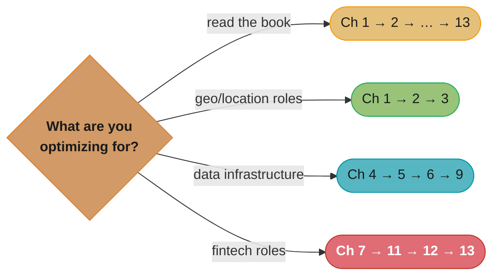

# System Design Interview — An Insider's Guide, Volume 2 (SDI-2)

> Alex Xu & Sahn Lam · ByteByteGo · Thirteen harder, deeper worked designs. A
> chapter-by-chapter, in-depth summary — read this folder in order and you have read the
> book.

---

## The Book's Thesis

Volume 2 assumes you already own Volume 1's method (the 4-step framework, the estimation
habit, the scaling toolbox) and raises the difficulty: the thirteen systems here are
**senior/staff-level questions** where the interesting work is not the high-level boxes
but the *correctness and precision underneath them* — geospatial indexes that answer
"what's near me" in milliseconds, queues that don't lose messages, aggregation pipelines
that count billions of ad clicks exactly once, ledgers where money can never be created
or destroyed, and a stock exchange where microseconds and fairness both matter.

Three themes recur across every chapter:

- **Pick the right data structure for the read pattern** — geohash vs quadtree vs S2,
  sorted sets for leaderboards, tries for autocomplete, LSM vs WAL segment files.
- **Correctness under concurrency and failure** — idempotency keys, exactly-once
  aggregation, reconciliation, sagas vs TCC, event sourcing.
- **Communication topology** — polling vs WebSocket vs pub/sub fan-out, and where state
  for each option must live.

Every chapter follows the same 4-step spine as Volume 1 (scope → high-level design →
deep dive → wrap up), and so do the summaries in this folder.

---

## The Book Map

```mermaid
flowchart TD
    classDef io      fill:#61afef,stroke:#2e86c1,color:#1a1a1a,font-weight:bold
    classDef frozen  fill:#c678dd,stroke:#9b59b6,color:#fff
    classDef train   fill:#98c379,stroke:#27ae60,color:#1a1a1a
    classDef mathOp  fill:#d19a66,stroke:#e67e22,color:#1a1a1a,font-weight:bold
    classDef lossN   fill:#e06c75,stroke:#c0392b,color:#fff,font-weight:bold
    classDef req     fill:#56b6c2,stroke:#0097a7,color:#1a1a1a
    classDef base    fill:#e5c07b,stroke:#f39c12,color:#1a1a1a

    root(["SDI Volume 2"]) --> G
    root --> D
    root --> T
    root --> C

    subgraph G["Geo / Location (Ch 1–3)"]
        C1(["Ch 1<br/>Proximity<br/>Service"]) --> C2(["Ch 2<br/>Nearby<br/>Friends"]) --> C3(["Ch 3<br/>Google<br/>Maps"])
    end

    subgraph D["Data Plumbing (Ch 4–6, 9)"]
        C4(["Ch 4<br/>Distributed<br/>Message Queue"]) --> C5(["Ch 5<br/>Metrics Monitoring<br/>and Alerting"]) --> C6(["Ch 6<br/>Ad Click<br/>Aggregation"]) --> C9(["Ch 9<br/>S3-like<br/>Object Storage"])
    end

    subgraph C2G["Products (Ch 8, 10)"]
        C8(["Ch 8<br/>Distributed<br/>Email"]) --> C10(["Ch 10<br/>Gaming<br/>Leaderboard"])
    end

    subgraph T["Money & Matching (Ch 7, 11–13)"]
        C7(["Ch 7<br/>Hotel<br/>Reservation"]) --> C11(["Ch 11<br/>Payment<br/>System"]) --> C12(["Ch 12<br/>Digital<br/>Wallet"]) --> C13(["Ch 13<br/>Stock<br/>Exchange"])
    end

    C(["Shared spine:<br/>scope → HLD →<br/>deep dive → wrap up"])

    class root io
    class C1,C2,C3 train
    class C4,C5,C6,C9 mathOp
    class C8,C10 req
    class C7,C11,C12,C13 lossN
    class C base
```

*Green = geospatial systems (geohash/quadtree/S2 build up chapter by chapter); orange =
data-infrastructure plumbing; red = the money chapters, where idempotency, ledgers, and
reconciliation dominate; teal = product designs. Ch 13 (stock exchange) is the book's
finale — it reuses the queue (Ch 4), the metrics (Ch 5), and the wallet's correctness
discipline (Ch 12) at microsecond latency.*

---

## Chapter Index

| # | Chapter | Folder | One-line summary | Repo deep-dive |
|---|---------|--------|------------------|----------------|
| 1 | Proximity Service | [01_proximity_service/](01_proximity_service/README.md) | Geohash vs quadtree vs S2; "businesses near me" at 5k QPS | [hld/case_studies/design_proximity_service.md](../../hld/case_studies/design_proximity_service.md) |
| 2 | Nearby Friends | [02_nearby_friends/](02_nearby_friends/README.md) | Live location fan-out over WebSockets + Redis pub/sub | [hld/case_studies/design_proximity_service.md](../../hld/case_studies/design_proximity_service.md) |
| 3 | Google Maps | [03_google_maps/](03_google_maps/README.md) | Map tiles, geocoding, routing graphs, ETA, navigation updates | [hld/case_studies/design_google_maps.md](../../hld/case_studies/design_google_maps.md) |
| 4 | Distributed Message Queue | [04_distributed_message_queue/](04_distributed_message_queue/README.md) | Log-based storage, WAL segments, consumer groups, delivery semantics | [hld/case_studies/design_distributed_message_queue.md](../../hld/case_studies/design_distributed_message_queue.md) |
| 5 | Metrics Monitoring and Alerting | [05_metrics_monitoring_and_alerting/](05_metrics_monitoring_and_alerting/README.md) | Time-series storage, pull vs push, aggregation, alert pipeline | [hld/case_studies/design_metrics_monitoring.md](../../hld/case_studies/design_metrics_monitoring.md) |
| 6 | Ad Click Event Aggregation | [06_ad_click_event_aggregation/](06_ad_click_event_aggregation/README.md) | Exactly-once streaming aggregation, windows, watermarks, reconciliation | [hld/case_studies/design_ad_click_aggregation.md](../../hld/case_studies/design_ad_click_aggregation.md) |
| 7 | Hotel Reservation System | [07_hotel_reservation_system/](07_hotel_reservation_system/README.md) | Inventory concurrency, overbooking, idempotent reservations | [hld/case_studies/design_hotel_reservation.md](../../hld/case_studies/design_hotel_reservation.md) |
| 8 | Distributed Email Service | [08_distributed_email_service/](08_distributed_email_service/README.md) | SMTP/IMAP flows, mailbox storage model, search, deliverability | [backend/](../../backend/CLAUDE.md) |
| 9 | S3-like Object Storage | [09_s3_like_object_storage/](09_s3_like_object_storage/README.md) | Separation of metadata and data planes, erasure coding, versioning | [hld/case_studies/design_object_storage_s3.md](../../hld/case_studies/design_object_storage_s3.md) |
| 10 | Real-time Gaming Leaderboard | [10_real_time_gaming_leaderboard/](10_real_time_gaming_leaderboard/README.md) | Redis sorted sets vs SQL ranking; top-k and relative rank at scale | [hld/case_studies/design_leaderboard.md](../../hld/case_studies/design_leaderboard.md) |
| 11 | Payment System | [11_payment_system/](11_payment_system/README.md) | PSP integration, idempotency, double-entry ledger, reconciliation | [hld/case_studies/design_payment_system.md](../../hld/case_studies/design_payment_system.md) |
| 12 | Digital Wallet | [12_digital_wallet/](12_digital_wallet/README.md) | Balance transfers: 2PC vs TCC vs saga vs event sourcing + CQRS | [hld/case_studies/design_digital_wallet.md](../../hld/case_studies/design_digital_wallet.md) |
| 13 | Stock Exchange | [13_stock_exchange/](13_stock_exchange/README.md) | Matching engine, order book, sequencer, mmap/ring-buffer low latency | [hld/case_studies/design_stock_exchange.md](../../hld/case_studies/design_stock_exchange.md) |

---

## How to Read This (Reading Paths)

- **Cover to cover (recommended):** the book's order is a difficulty ramp — geo systems
  teach data structures, plumbing teaches delivery semantics, money teaches correctness,
  and the stock exchange combines all three.
- **Geospatial track:** Ch 1 → 2 → 3. One index family (geohash/quadtree/S2) built up
  from static search to live fan-out to full routing.
- **Streaming-data track:** Ch 4 → 5 → 6. Queue internals, then a read path (metrics),
  then an exactly-once write path (ad clicks).
- **Fintech track:** Ch 7 → 11 → 12 → 13. Idempotency → ledger → distributed transaction
  patterns → microsecond matching.

*Four goals, four subsets — the fintech path (red) is the book's correctness gauntlet:
each chapter adds one stronger guarantee (idempotency → ledger invariants → distributed
atomicity → deterministic sequencing).*

---

## Build Manifest

Per-file build status for this book. Update the row to `done` the moment a chapter file is
completed and diagram-linted.

| # | File | Status |
|---|------|--------|
| 1 | `01_proximity_service/README.md` | done |
| 2 | `02_nearby_friends/README.md` | done |
| 3 | `03_google_maps/README.md` | done |
| 4 | `04_distributed_message_queue/README.md` | done |
| 5 | `05_metrics_monitoring_and_alerting/README.md` | done |
| 6 | `06_ad_click_event_aggregation/README.md` | done |
| 7 | `07_hotel_reservation_system/README.md` | done |
| 8 | `08_distributed_email_service/README.md` | done |
| 9 | `09_s3_like_object_storage/README.md` | done |
| 10 | `10_real_time_gaming_leaderboard/README.md` | done |
| 11 | `11_payment_system/README.md` | done |
| 12 | `12_digital_wallet/README.md` | done |
| 13 | `13_stock_exchange/README.md` | done |

---

## Cross-Reference Map (SDI-2 → repo deep dives)

| SDI-2 concept | Primary deep-dive module |
|---------------|--------------------------|
| Geospatial indexing (geohash/quadtree/S2) | [hld/case_studies/design_proximity_service.md](../../hld/case_studies/design_proximity_service.md) |
| Pub/sub, log-based queues, Kafka internals | [hld/message_queues/](../../hld/message_queues/README.md) |
| Time-series storage & alerting | [hld/observability/](../../hld/observability/README.md), [devops/](../../devops/README.md) |
| Stream aggregation, windows, watermarks | [book/designing_data_intensive_applications/11_stream_processing/](../designing_data_intensive_applications/11_stream_processing/README.md) |
| Idempotency, retries, resilience | [hld/resilience_patterns/](../../hld/resilience_patterns/README.md), [backend/](../../backend/CLAUDE.md) |
| Distributed transactions (2PC/TCC/saga) | [hld/distributed_transactions/](../../hld/distributed_transactions/README.md), [database/distributed_transactions/](../../database/distributed_transactions/README.md) |
| Event sourcing + CQRS | [hld/event_sourcing_cqrs/](../../hld/event_sourcing_cqrs/README.md) |
| Erasure coding, blob storage | [hld/case_studies/design_object_storage_s3.md](../../hld/case_studies/design_object_storage_s3.md) |
| Redis sorted sets, caching | [hld/caching/](../../hld/caching/README.md) |
