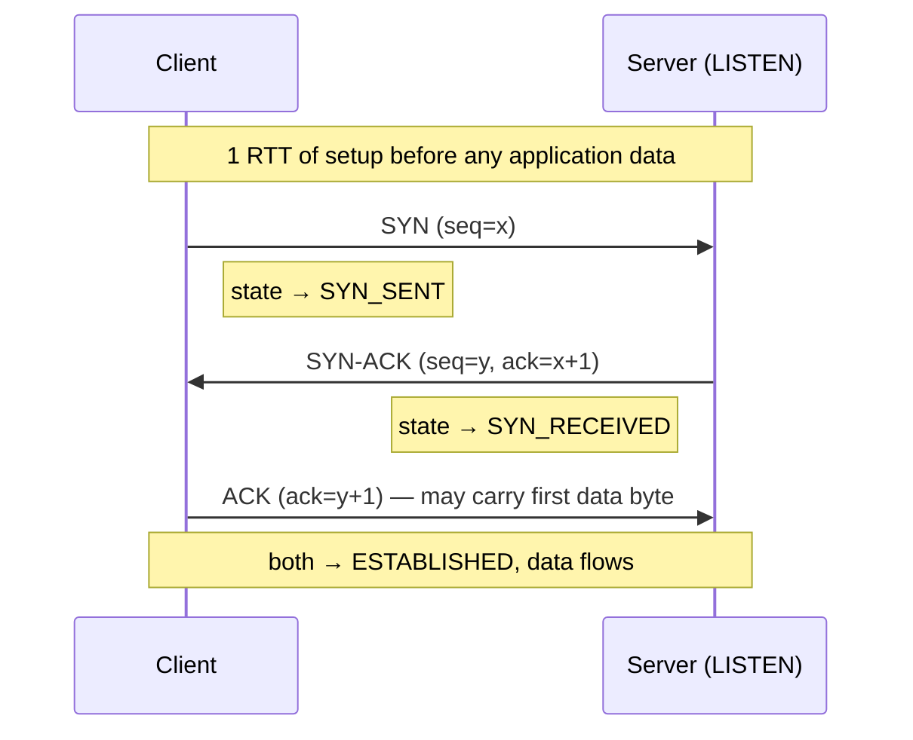
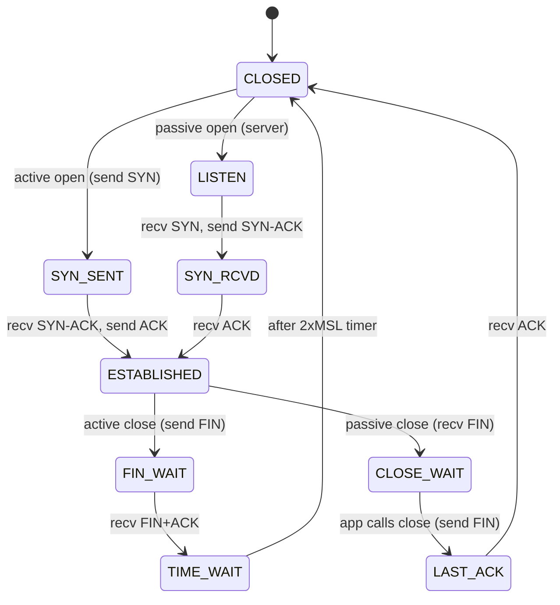
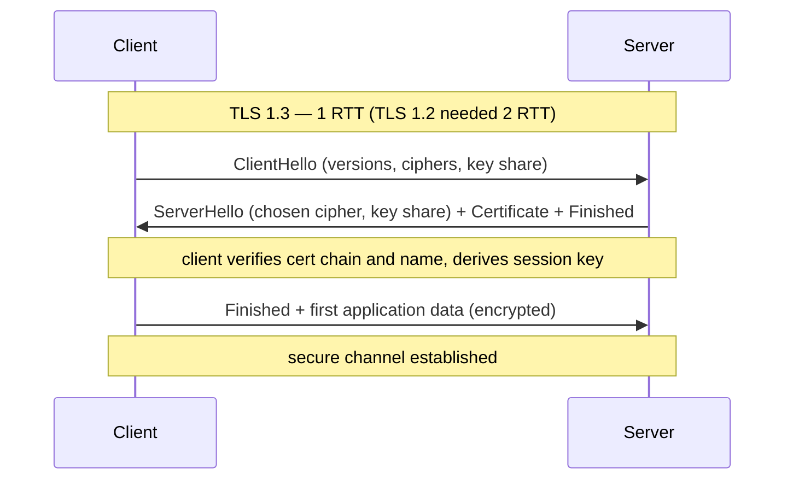
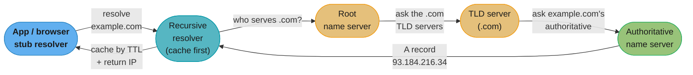
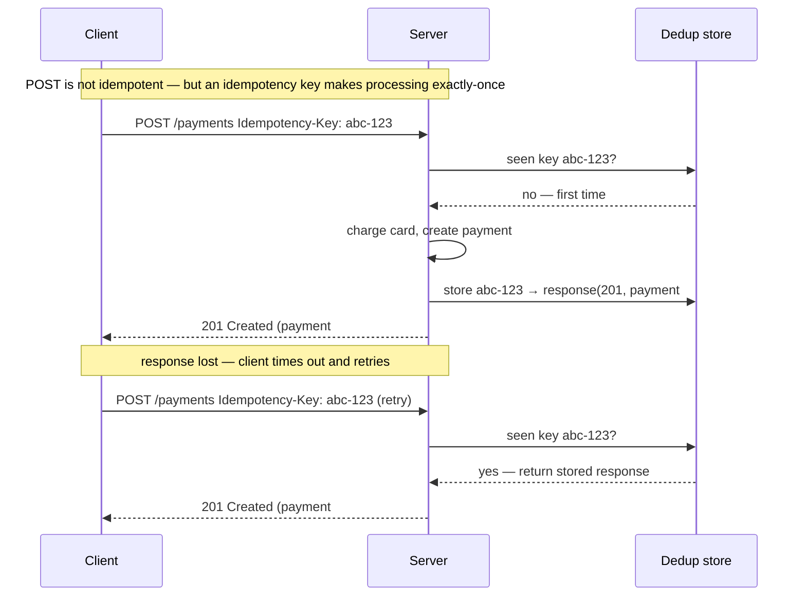

# Part I: Communication

> Part I of 5 · Understanding Distributed Systems (Vitillo) · covers book Ch 1–5 · leads to Part II (Coordination)

## Chapter Map

A distributed system is a group of nodes cooperating over a network to do something a single
machine can't — and the very first thing those nodes must do is *talk to each other reliably over
an unreliable network*. Part I builds the communication stack from the wire up: the IP substrate
that loses, duplicates, corrupts, and reorders packets; **TCP**, which turns that mess into a
reliable ordered byte stream (Ch 2); **TLS**, which makes the stream private, authenticated, and
tamper-evident (Ch 3); **DNS**, which lets you find a service by name instead of by address
(Ch 4); and **HTTP/REST APIs**, the request-response contract services actually speak (Ch 5).
Every later part of the book — coordination, scalability, resiliency, operations — assumes these
fundamentals hold, so this part is the foundation the other four stand on.

**TL;DR:**
- **IP is best-effort and unreliable**; TCP layers sequence numbers, ACKs, retransmission, flow
  control, and congestion control on top to deliver a reliable, ordered, congestion-friendly
  stream — at the cost of a **1-RTT handshake** and a **slow-start ramp** on every new connection.
- **Latency caps throughput**: TCP throughput ≈ `WindowSize / RTT`, so on a "long fat pipe" a small
  window starves a fast link regardless of its capacity — window scaling exists precisely to fix this.
- **TLS** bootstraps fast symmetric encryption using slow asymmetric key exchange, authenticates the
  peer via a **certificate chain to a root CA**, and protects integrity with per-record MACs;
  **TLS 1.3 completes in 1 RTT** (0-RTT on resumption, with a replay caveat). Forgetting to rotate a
  certificate is one of the most common self-inflicted outages there is.
- **DNS** is an eventually-consistent, hierarchical, cached key-value store; its **TTL** is the dial
  between fast failover (short TTL, more load) and low load (long TTL, stale during failover). It is
  a classic hidden single point of failure (the 2016 Dyn attack).
- **HTTP APIs**: safe vs idempotent methods decide what's safe to retry; **exactly-once delivery is
  impossible**, but **exactly-once processing** is achievable with **idempotency keys** + server-side
  dedup. HTTP/1.1 → HTTP/2 → HTTP/3 is a story of progressively defeating head-of-line blocking.

## The Big Question

> "The network under me can drop, duplicate, corrupt, delay, and reorder every packet, and the
> machine I want to reach might be moved, renamed, or impersonated. How do I get two programs on
> two continents to exchange data *reliably, privately, and by name* — and what does each layer of
> that guarantee cost me in round-trips?"

Analogy: sending data over IP is like mailing a novel one unnumbered postcard at a time through a
postal service that loses some, delivers others out of order, and occasionally slips a forged one
into the pile. TCP numbers the postcards and asks for receipts (reliability); TLS seals each one in
a tamper-evident envelope only the recipient can open (security); DNS is the address book that turns
"my friend Alice" into a street address that might change tomorrow (discovery); and HTTP is the
agreed-upon letter format so both sides know where the greeting ends and the request begins (APIs).
The recurring cost you pay for each guarantee is measured in **round-trips (RTTs)** — and the whole
engineering art of this part is spending as few of them as possible.

---

## 1.1 Introduction (Ch 1)

### Why build a distributed system at all

You accept the enormous complexity of a distributed system for exactly three reasons, and it's
worth being honest that if none of them apply, you shouldn't build one:

- **Scale beyond a single node.** A single machine has finite CPU, RAM, disk, and network. Once your
  workload exceeds what the biggest machine you can buy (or afford) provides, you must spread it
  across many machines. This is *scaling out* (more machines) versus *scaling up* (a bigger machine).
- **Fault tolerance.** A single machine is a single point of failure — when it dies, your service
  dies with it. Replicating state and computation across independent machines lets the system keep
  serving when any one of them fails. Redundancy is the whole point.
- **Low latency by proximity.** The speed of light is a hard floor: a round-trip from New York to
  Sydney is ~160 ms *of physics alone*, before any processing. Placing copies of your service close
  to users (multiple regions, CDNs) is the only way to beat that floor, and it inherently means many
  geographically distributed nodes.

The rest of the book is organized as **five pillars**, one per part, and Part I is the first:

1. **Communication** (this part) — how nodes exchange messages reliably and securely over the network.
2. **Coordination** — how independent nodes agree despite failures and no shared clock (Part II).
3. **Scalability** — how the system grows to handle more load (Part III).
4. **Resiliency** — how it stays up when things break (Part IV).
5. **Maintainability / operations** — how humans run and evolve it safely (Part V).

### Anatomy of a distributed system

The book's vocabulary, used throughout:

- A **service** implements a specific business capability (say, a payments service or a catalog
  service). It exposes an **interface** — the API other services call — and is built from **adapters**
  that connect that interface to the outside world (an HTTP server adapter for inbound calls, a
  database-client adapter for outbound storage).
- A service runs as one or more **processes** on **servers** (also called nodes/hosts). The same
  service is typically run as *many* identical process replicas across many servers for scale and
  fault tolerance.
- Processes communicate over **network links**. There is no shared memory between nodes — the *only*
  way one node influences another is by sending a message over the network, and that network can and
  will fail.
- The **client-server** relationship is the basic building block: a client sends a request, a server
  processes it and returns a response. A single process is often a server to some peers and a client
  to others (a web server is a client of the database it calls).

The central, sobering fact that makes all of this hard: **the network is unreliable**. Messages get
lost, delayed, duplicated, corrupted, and reordered; a node can't distinguish "the peer is slow"
from "the peer is dead" (a theme Part II makes precise). Everything in Part I is a technique for
building *some* guarantee on top of a substrate that offers *none*.

### The internet protocol suite and layered encapsulation

Communication is organized as a stack of layers, each providing a service to the layer above and
relying on the layer below. This is the **TCP/IP model** (four layers):

| Layer | Job | Unit | Examples | What it does / doesn't guarantee |
|-------|-----|------|----------|-----------------------------------|
| **Application** | App-specific messages | message | HTTP, DNS, gRPC | Whatever the app defines |
| **Transport** | Process-to-process channel | segment (TCP) / datagram (UDP) | TCP, UDP, QUIC | TCP: reliable ordered stream. UDP: none |
| **Internet (IP)** | Host-to-host addressing + routing | packet | IPv4, IPv6 | Best-effort only — may lose/dup/reorder/corrupt |
| **Link** | Node-to-node on one physical hop | frame | Ethernet, Wi-Fi | Local delivery over one medium |

Two more pieces of vocabulary the rest of Part I leans on:

- **Ports and sockets.** IP addresses a *host*; the transport layer's **port** number addresses a
  *process* on that host (HTTP servers listen on 443, DNS on 53). A connection is uniquely identified
  by its **4-tuple** — `(source IP, source port, destination IP, destination port)` — and the OS
  endpoint of that connection is a **socket**. **Ephemeral ports** (the ~28k–64k range) are the
  short-lived source ports the OS hands out to *outbound* connections; exhausting them is the failure
  mode behind the TIME_WAIT war story below.
- **Best-effort vs reliable is a choice you make per connection** by picking the transport (TCP for a
  reliable stream, UDP for raw datagrams) — IP itself never changes.

The two facts that matter most:

- **IP is best-effort and unreliable.** IP routes packets from source host to destination host by IP
  address, hop by hop through routers, with no promise of delivery, ordering, or integrity. Packets
  can be dropped (a router's queue is full), duplicated, reordered (different packets take different
  routes), or corrupted. IP also caps packet size: the **MTU** (Maximum Transmission Unit) is
  typically **1500 bytes** on Ethernet, so anything larger is fragmented. Every reliability guarantee
  above IP is something a higher layer had to *add back*.
- **Encapsulation** is how the layers compose. As a message travels down the stack on the sender,
  each layer wraps the data from the layer above with its own header (and sometimes trailer); on the
  receiver each layer strips its header and hands the payload up. An HTTP request becomes a TCP
  segment (adds ports, sequence numbers) becomes an IP packet (adds source/destination IP) becomes an
  Ethernet frame (adds MAC addresses). Each layer is oblivious to the contents it carries.

```
+--------------------------------------------------------------+
| Ethernet frame                                               |
|  +--------------------------------------------------------+  |
|  | IP packet                                              |  |
|  |  +--------------------------------------------------+  |  |
|  |  | TCP segment                                      |  |  |
|  |  |  +--------------------------------------------+  |  |  |
|  |  |  | HTTP message  (GET /orders/42 ...)         |  |  |  |
|  |  |  +--------------------------------------------+  |  |  |
|  |  | seq#, ack#, ports, window, flags                 |  |  |
|  |  +--------------------------------------------------+  |  |
|  | src IP, dst IP, TTL, protocol                          |  |
|  +--------------------------------------------------------+  |
| src MAC, dst MAC, frame check sequence                       |
+--------------------------------------------------------------+
```

Caption: encapsulation nests each layer's payload inside the next layer's header — the HTTP message
is the innermost cargo, and every outer layer adds only its own addressing/control fields, never
touching the bytes it wraps. This is why you can swap Wi-Fi for Ethernet (link layer) without the
HTTP request ever noticing.

---

## 1.2 Reliable Links (Ch 2)

TCP's job is to turn IP's unreliable packet delivery into a **reliable, ordered stream of bytes**
between two processes. It does this with four cooperating mechanisms: reliability (recover lost
data), connection management (the handshake and teardown), flow control (don't overwhelm the
*receiver*), and congestion control (don't overwhelm the *network*).

### Reliability

TCP delivers bytes reliably and in order over lossy IP using three ideas:

- **Sequence numbers.** Every byte in the stream has a sequence number. TCP breaks the stream into
  **segments**, each carrying a sequence number for its first byte. The receiver uses these to
  **reassemble in order** even if segments arrive scrambled, and to **detect gaps** (a missing
  segment) and **deduplicate** (a segment that arrives twice — because a retransmission raced the
  original — is discarded because its sequence range was already delivered).
- **Positive acknowledgments (ACKs).** The receiver sends back an ACK naming the next sequence number
  it expects (i.e. acknowledging everything before it). The sender knows data arrived only when it
  sees the ACK.
- **Retransmission on timeout.** The sender starts a **retransmission timer (RTO)** for unacked data.
  If the ACK doesn't arrive before the timer fires, the sender assumes the segment was lost and
  **retransmits** it. The RTO is derived from measured round-trip times (a smoothed RTT plus a
  variance margin), so it adapts to the path. Fast retransmit is an optimization: three duplicate ACKs
  signal a loss before the timer even fires.

Together these give the illusion of a perfect pipe: the application `write()`s bytes on one side and
`read()`s exactly those bytes, in order, on the other — TCP hides every loss, duplicate, and reorder
underneath.

Two refinements make this practical rather than pathologically slow:

- **RTO is adaptive, not a fixed constant.** Retransmitting too eagerly wastes bandwidth and
  aggravates congestion; retransmitting too late stalls the stream. TCP therefore continuously
  measures RTT and computes the timeout as a **smoothed RTT plus a multiple of the RTT variance** (the
  Jacobson/Karels estimator), and **doubles the RTO on each successive retransmission** (exponential
  backoff) so a persistently lossy path isn't hammered. A path with a 20 ms RTT ends up with an RTO of
  tens of milliseconds; a satellite path with a 600 ms RTT gets a proportionally larger one.
- **Fast retransmit / fast recovery beat the timer.** Waiting for the full RTO on every loss would be
  slow, so TCP treats **three duplicate ACKs** (the receiver re-acknowledging the same sequence number
  because later segments arrived but the gap wasn't filled) as an early loss signal and retransmits the
  missing segment **immediately**, without waiting for the timer. **Selective ACK (SACK)** lets the
  receiver name exactly which non-contiguous ranges it already holds, so the sender retransmits *only*
  the truly missing segments instead of everything after the gap.

The distinction matters for performance: a loss caught by **fast retransmit** costs roughly one RTT
and only halves cwnd, whereas a loss that falls through to an **RTO timeout** collapses cwnd to 1 and
restarts slow start — an order of magnitude more expensive. This is why bursty loss on a
high-throughput connection is far worse than the same loss rate spread out.

### Connection lifecycle

TCP is **connection-oriented**: before any data flows, the two endpoints establish shared state
(sequence numbers, window sizes) via the **three-way handshake**.



Caption: SYN → SYN-ACK → ACK. The client can begin sending data with the third packet, so the setup
cost is effectively **1 round-trip** before the first byte of a request even leaves — a fixed tax
paid on every new connection, and the reason short-lived connections are expensive.

Key states in the lifecycle: `CLOSED` → `LISTEN` (server waiting) → `SYN_SENT`/`SYN_RECEIVED` (mid
handshake) → `ESTABLISHED` (data phase) → teardown. Closing is a **four-way** exchange (each side
sends a `FIN`, the other `ACK`s it), because either side can stop sending independently.



Caption: the active closer (left path) ends in **TIME_WAIT** for 2×MSL — the state that hoards
ephemeral ports — while the passive closer (right path) sits in **CLOSE_WAIT** until *its own
application* calls `close()`. The two operational landmines below are exactly these two states going
wrong.

Two teardown states are operational landmines:

- **TIME_WAIT.** The endpoint that closes *actively* (usually the one that sent the first `FIN`)
  parks the socket in `TIME_WAIT` for **2×MSL** (Maximum Segment Lifetime; ~1–4 minutes, commonly
  **60 seconds** on Linux) before fully releasing it. This is deliberate: it lets any straggler
  segments from the old connection die out, and ensures the final ACK can be retransmitted if lost, so
  the same 4-tuple (src IP, src port, dst IP, dst port) isn't reused while ghosts of the old
  connection are still in flight. The **cost**: each `TIME_WAIT` socket holds an ephemeral
  **port/socket** for that minute. A client (or a server acting as a client to a backend) that opens
  **thousands of short-lived connections per second** accumulates `TIME_WAIT` sockets faster than they
  drain and **runs out of ephemeral ports** (the range is ~28,000–64,000 ports), at which point new
  connections fail with "cannot assign requested address." The fix is to *stop opening so many
  connections* — use **connection pooling / keep-alive** — not to blindly shrink the timer.
- **CLOSE_WAIT.** The *passive* side enters `CLOSE_WAIT` after receiving the peer's `FIN`, waiting for
  its **own application** to call `close()`. A pile of stuck `CLOSE_WAIT` sockets is a **code bug** — the
  application received the peer's close but never closed its end, leaking file descriptors until it
  hits the process's FD limit and can accept no more connections.

### Flow control

Flow control protects the **receiver** from a fast sender. The receiver advertises a **receive window
(rwnd)** in every ACK: the number of bytes of free buffer space it currently has. The sender must
keep its **unacknowledged in-flight bytes ≤ the advertised window** — a **sliding window** that
advances as ACKs free up space. If the receiver's application is slow to `read()`, its buffer fills,
it advertises a smaller window (eventually zero), and the sender is forced to slow or stop. This is
**backpressure** built into the transport: the receiver literally tells the sender "I can take this
much and no more." The original 16-bit window field caps at 64 KB; the **window scaling** option
(RFC 7323) multiplies it so windows can reach up to ~1 GB — essential for high-bandwidth paths (see
below).

### Congestion control

Flow control protects the receiver; **congestion control** protects the **network** (the routers and
links between the two endpoints, which are shared with everyone else). The sender maintains a
**congestion window (cwnd)** — its own estimate of how much data the network can absorb without
dropping packets — and the actual amount it may send is `min(cwnd, rwnd)`.

- **Slow start (exponential ramp).** A new connection has no idea of the path's capacity, so it starts
  cautiously with a small cwnd (modern Linux: **10 MSS**, ~14.6 KB; historically 1 MSS) and **doubles
  cwnd every RTT** — exponential growth — until it hits a threshold (`ssthresh`) or a packet is lost.
  "Slow start" is a misnomer: it's slow to *begin* but ramps *fast*.
- **Congestion avoidance (AIMD).** After slow start, TCP switches to **Additive Increase /
  Multiplicative Decrease**: add ~1 MSS per RTT (probe gently for more bandwidth), but on a loss
  **halve cwnd** (back off hard). This produces the classic sawtooth and shares bandwidth fairly among
  flows.
- **Timeout collapse.** A loss detected by *timeout* (worse than a triple-dup-ACK) is read as severe
  congestion: cwnd collapses back to 1 MSS and slow start restarts. This is why a lossy path can have
  throughput far below its raw capacity.

The AIMD sawtooth above describes the *classic* algorithm (Reno). Modern stacks use refinements —
**CUBIC** (Linux default) grows the window on a cubic curve that recovers to the prior operating point
faster on high-BDP paths, and **BBR** (Google) abandons loss-as-congestion-signal entirely, instead
*modeling* the path's bandwidth and RTT to pace sending. The book's point stands regardless of the
variant: the sender maintains an estimate of what the network can absorb and adjusts it based on
feedback, and loss (or delay) is that feedback.

```
cwnd
(MSS)
 80 |                              /|                      /
    |                            /  |                    /
 40 |            slow start    /    | loss: cwnd/2     /  <- AIMD sawtooth
    |          (x2 per RTT)  /      |    additive    /       (congestion
 20 |                     /         |  +1 MSS/RTT  /          avoidance)
 10 |___________________/           |____________/
    |  (initial cwnd)               v (multiplicative decrease)
  1 +----+----+----+----+----+----+----+----+----+----+---- RTTs
     R1   R2   R3   R4   R5   R6   R7   R8   R9  R10
```

Caption: cwnd ramps *exponentially* during slow start (doubling each RTT), then grows *linearly*
(+1 MSS/RTT) in congestion avoidance, and **halves on every loss** — the AIMD sawtooth. A timeout
(not shown) would instead drop cwnd all the way back to 1 and restart slow start.

**Why latency caps throughput — the single most important number in this chapter.** The sender can
have at most one window of data in flight, and it can't send the next window until ACKs for the
current one return — one RTT later. So the throughput ceiling is:

```
Throughput ≈ WindowSize / RTT
```

Worked example — a **"long fat pipe"** (high bandwidth, high latency):

- Link capacity **1 Gbps**, RTT **30 ms**. The **bandwidth-delay product (BDP)** — the amount of data
  needed *in flight* to keep the pipe full — is `1e9 bits/s × 0.03 s = 30 Mbit = 3.75 MB`.
- With only the classic **64 KB** window (no window scaling), throughput = `64 KB / 0.03 s ≈ 2.1 MB/s
  ≈ 17 Mbps` — a pathetic **1.7%** of the 1 Gbps link. The link is 98% idle, *waiting for ACKs*.
- To actually fill the pipe you need a window of ~3.75 MB in flight, which is why **window scaling**
  exists. And even then, slow start means you don't *reach* that window instantly.

The taxonomy the book draws: a **"long" pipe** has high RTT (latency-bound); a **"fat" pipe** has high
bandwidth; a **"long fat pipe"** (satellite links, intercontinental paths) needs both a large window
*and* time to ramp before it performs. The practical lesson: on high-latency paths, **throughput is
bounded by the window, not the link** — you can't buy your way out of it with more bandwidth alone.

**The slow-start ramp adds a second tax on top of the window ceiling.** Even with window scaling in
place, a fresh connection doesn't *start* at the full window — it climbs there exponentially. To fill
the 3.75 MB BDP above (≈ 2,570 segments at a 1,460-byte MSS) starting from an initial cwnd of 10 MSS
and doubling each RTT, you need `log2(2570 / 10) ≈ 8` round-trips — about **240 ms at 30 ms RTT** — of
ramp-up before the connection reaches full speed. A short transfer that completes in a handful of
RTTs may *finish before slow start ever opened the window*, spending its entire life bandwidth-starved.
This is the concrete reason short-lived connections are inefficient and long-lived, reused connections
(keep-alive, HTTP/2) are so much faster: they pay the ramp once and then stay at cruising altitude.

### Custom protocols (UDP and QUIC)

TCP's guarantees aren't free: every new connection pays the **1-RTT handshake** plus the **slow-start
ramp** (several more RTTs to reach full bandwidth). For a workload of *many tiny, short-lived
requests*, this setup tax dominates — you finish the request before slow start ever opened the window.
This motivates alternatives:

- **UDP** is the bare transport: connectionless, no handshake, no ordering, no retransmission, no
  congestion control — just "wrap this datagram in ports and best-effort deliver it." You get IP's
  unreliability with process-to-process addressing added, and **nothing else**. That's a feature when
  you want to *build your own* reliability semantics (real-time media that prefers a dropped frame to a
  late one; DNS queries that fit in one packet; custom protocols) — you add back exactly the
  guarantees you need and skip the ones you don't.
- **QUIC** is the modern synthesis, built *on top of UDP* in user space, and the transport under
  **HTTP/3**. Its wins over TCP+TLS:
  - **Faster setup**: QUIC folds the transport and TLS 1.3 handshakes together into **1 RTT** for a
    new connection, and **0 RTT** when resuming a prior session (send the request with the very first
    packet).
  - **No head-of-line blocking across streams**: QUIC multiplexes independent **streams** within one
    connection, each with its own sequence space. A lost packet stalls **only the stream it belongs
    to**, not all of them. (TCP, by contrast, delivers one ordered byte stream, so a single lost
    segment stalls *everything* layered on that connection — the flaw HTTP/2 still inherits.)
  - **Connection migration**: a connection is identified by a **connection ID**, not the IP/port
    4-tuple, so it survives a client changing networks (Wi-Fi → cellular) without a new handshake.

---

## 1.3 Secure Links (Ch 3)

TCP gives you a *reliable* link, but anyone on the path can read it, tamper with it, or impersonate
either end. **TLS (Transport Layer Security)** adds three guarantees on top of TCP: **confidentiality**
(encryption), **authentication** (you're talking to who you think), and **integrity** (nobody altered
the bytes). This is the "S" in HTTPS.

### Encryption

The problem: you want a private channel with a stranger you've never shared a secret with. TLS solves
it with a **hybrid** scheme, because the two families of cryptography have opposite strengths:

- **Symmetric encryption** (e.g. **AES**) uses one shared key for both encrypt and decrypt. It's
  **fast** — hardware-accelerated, gigabytes/second — so it's used for the **bulk data**. Its problem:
  both sides need the *same* key, and you can't send it in the clear.
- **Asymmetric encryption** (public/private key pairs, e.g. RSA/ECDHE) lets anyone encrypt with a
  public key such that only the private-key holder can decrypt. It **solves key distribution** but is
  **orders of magnitude slower**, so you never use it for bulk data.

TLS uses asymmetric crypto **only during the handshake to agree on a symmetric session key**, then
switches to fast symmetric encryption for the actual traffic. Best of both: secure key establishment
without a pre-shared secret, plus fast bulk encryption.

**Forward secrecy.** If the session key were derived directly from the server's long-term private key,
then an attacker who *records* your encrypted traffic today and *steals the server's private key next
year* could decrypt all of it retroactively. **Ephemeral key exchange** (ECDHE — Elliptic Curve
Diffie-Hellman Ephemeral) prevents this: a **fresh key pair is generated per session** and discarded
afterward, so each session's key can't be reconstructed later even if the long-term key leaks. Every
session is a sealed box whose key no longer exists once the session ends.

### Authentication

Encryption alone is useless if you encrypted your data *to an impostor*. Authentication answers "is
this really `bank.com`?" via **certificates**:

- A **certificate** is a document binding a **public key** to an **identity** (a domain name), signed
  by a trusted **Certificate Authority (CA)**. When you connect, the server presents its certificate;
  you verify the CA's signature to trust that this public key really belongs to this domain.
- **Chain of trust.** A server's certificate is signed by an intermediate CA, whose certificate is
  signed by another, up to a **root CA** whose certificate is pre-installed in your OS/browser **trust
  store**. You validate the whole chain from the server's cert up to a root you already trust.
- **Name verification.** You must check the certificate's **Common Name / Subject Alternative Name
  (SAN)** matches the hostname you intended to reach. A valid certificate *for the wrong domain* is an
  attack, not a match.

**War story — certificate expiry.** Certificates carry an **expiry date** (Let's Encrypt: 90 days;
commercial CAs historically 1–2 years). When a cert expires and nobody renewed it, **every TLS
handshake fails** and the service is instantly, totally down — even though the servers are healthy and
the code is fine. This has taken down major services repeatedly (expired certs have caused outages at
Microsoft, Spotify, and countless internal APIs). It's insidious because the failure is on a **timer,
not a deploy** — nothing changed the day it broke. The fix is **never renew by hand**: automate
rotation with **ACME / Let's Encrypt / cert-manager**, and **alert well before expiry** (e.g. 30 days
out) so a human has runway. Treat "days until cert expiry" as a first-class monitored metric.

### Integrity

Even an encrypted stream can be **tampered** (an attacker flips ciphertext bits) or **corrupted** (a
faulty NIC flips a bit). TLS protects integrity with a **MAC (Message Authentication Code)** — with a
shared key, each **record** carries an **HMAC** (or, with modern **AEAD** ciphers like **AES-GCM**, an
authentication tag) computed over its contents. The receiver recomputes the MAC and rejects any record
whose MAC doesn't match, catching both malicious tampering and accidental bit-flips. Encryption gives
*secrecy*; the MAC gives *"and nobody changed it."* You need both — confidentiality without integrity
still lets an attacker corrupt your data undetected.

### Handshake

The **TLS handshake** negotiates the protocol version and cipher, exchanges the ephemeral keys, and
verifies the certificate — all before any application data flows, and each round-trip is latency you
pay on top of the TCP handshake.



Caption: **TLS 1.3 needs just 1 round-trip** — the client sends its key share in the very first
message, so the server can reply with everything needed to derive the session key. TLS 1.2 required
**2 RTT**. Stacked on TCP's own 1-RTT handshake, a fresh HTTPS connection over TCP costs ~2 RTT of
setup before the first byte of the request is processed.

- **0-RTT resumption.** If the client has resumed from a prior session (a cached **pre-shared key**),
  TLS 1.3 can send the request *with the first packet* — **0 RTT**, no setup latency at all. The
  **caveat**: 0-RTT "early data" is **replayable** — an attacker can capture and resend it — so it must
  be used **only for idempotent requests** (a `GET`, never a "transfer money"). This is the same
  safe-to-retry logic that governs HTTP methods (Ch 5).
- **TLS termination cost.** The handshake's asymmetric crypto is **CPU-expensive**, and every record
  must be encrypted/decrypted. At scale this is offloaded to a dedicated **TLS-terminating** layer (a
  load balancer or reverse proxy) that does the crypto once at the edge and speaks plain HTTP to
  backends inside the trusted network — trading a security boundary for CPU savings and simpler
  certificate management.

A few mechanics that fill in the picture:

- **Cipher-suite negotiation.** The handshake agrees on a **cipher suite** — the concrete algorithms
  for key exchange, bulk encryption, and integrity (e.g. `TLS_AES_128_GCM_SHA256`). TLS 1.3
  deliberately **pruned the menu** to a handful of strong, forward-secret suites, removing the
  legacy/broken options that made older TLS both slower to negotiate and easier to downgrade-attack.
- **The record protocol.** After the handshake, application data is split into **records**, each
  independently encrypted and authenticated with an **AEAD** cipher (encryption and integrity in one
  pass, e.g. AES-GCM). Records are the unit the MAC covers, so tampering is caught per record rather
  than per connection.
- **Mutual TLS (mTLS).** Ordinary TLS authenticates only the *server* to the client. **mTLS** adds a
  **client certificate** so the server also verifies the caller's identity — the standard way services
  inside a mesh authenticate each other machine-to-machine, without passwords.
- **Revocation.** A certificate can be compromised before it expires, so CAs publish revocation
  status via **CRLs** (certificate revocation lists) and **OCSP** (an online status query, often
  **stapled** into the handshake so the client doesn't make a separate round-trip). Revocation checking
  is the weak link in practice — clients often "soft-fail" (accept the cert if the check is
  unreachable) rather than block the connection, which is why **short-lived certificates** (rotate
  fast, don't bother revoking) are increasingly favored over long-lived ones plus revocation.

---

## 1.4 Discovery (Ch 4)

Services move: they're redeployed, rescaled, and failed over to new machines with new IP addresses.
Hardcoding an IP is brittle. **DNS (Domain Name System)** is the internet's discovery layer — a
distributed, hierarchical, cached database that maps a **human-readable name** (`www.example.com`) to
an **IP address**, so callers can find a service by a stable name even as its addresses churn.

### DNS resolution, end to end

Resolving a name is a walk **down the naming hierarchy**, from the most general (root) to the most
specific (the authoritative server for the exact domain):



Caption: the **stub resolver** in the OS asks a **recursive resolver** (your ISP's, or `8.8.8.8`),
which — on a cache miss — walks **root → TLD (.com) → authoritative** and caches the answer. Each hop
narrows the namespace by one label. On a warm cache the whole walk collapses to a single cached
lookup, which is why DNS feels instant most of the time.

The pieces:

- **Stub resolver** — the thin DNS client in your OS; it delegates the real work to a recursive
  resolver.
- **Recursive resolver** — does the legwork of walking the hierarchy on the client's behalf and
  **caches** results. This is where most caching and load live.
- **Root name servers** — the 13 logical root server addresses; they don't know your IP, only which
  **TLD** servers handle `.com`, `.org`, etc.
- **TLD name servers** — know which **authoritative** server is responsible for `example.com`.
- **Authoritative name server** — the source of truth for the zone; returns the actual **A record**
  (IPv4) / **AAAA record** (IPv6).

The value a name maps to depends on the **record type** you ask for — DNS stores more than IPs:

| Record | Maps a name to | Typical use |
|--------|----------------|-------------|
| **A / AAAA** | An IPv4 / IPv6 address | The core name → IP lookup |
| **CNAME** | Another name (an alias) | Point `www` at `app.cloudprovider.net` |
| **NS** | The authoritative name servers for a zone | Delegation down the hierarchy |
| **MX** | A mail server (with priority) | Email routing |
| **SOA** | Zone metadata (serial, refresh, TTLs) | Zone administration |
| **TXT** | Arbitrary text | Domain verification, SPF/DKIM |

The root and TLD tiers are themselves served by **anycast**: the same IP is announced from many
locations worldwide, and BGP routes each query to the nearest instance — which is how "13 root
servers" actually withstands global query volume and localized outages. And because record types like
`A` can return **multiple addresses** (rotated per response) or be steered by the resolver's location,
DNS doubles as a coarse **load-balancing and geo-routing** layer (a theme Part III's load-balancing
chapter develops).

### Caching and the TTL tradeoff

**Caching happens at every hop** — browser, OS, recursive resolver — and every DNS record carries a
**TTL (time to live)** telling caches how long they may keep it. The TTL is a direct dial with a
**fundamental tradeoff**:

| TTL | Failover speed | DNS load / latency | Risk |
|-----|----------------|--------------------|------|
| **Short** (e.g. 60 s) | Fast — clients pick up new IPs quickly | Higher — caches expire often, more queries | Little staleness risk |
| **Long** (e.g. 24 h) | Slow — clients keep hitting the old IP for hours | Lower — mostly served from cache | Stale entries during failover/migration |

- **Short TTL** → changes (a failover to a new IP) propagate fast, but every cache expires frequently,
  so you pay **more DNS queries and more resolution latency**. This is what you want for records that
  might need rapid failover.
- **Long TTL** → far less DNS load and faster average resolution (mostly cache hits), but when you
  *do* need to move (a server died, you're migrating), clients keep resolving to the **dead/old IP**
  until their caches expire — hours of stale routing you can't recall. Cutting a long TTL *just before*
  a planned migration (so caches are short-lived when you flip) is a standard operational move.

Crucially, **you cannot force-expire caches you don't control** — once a resolver caches your record
for its TTL, that's how long clients may keep the old answer. The TTL is a *promise you made in
advance*, which is why it's a leading operational lever.

### DNS as an eventually-consistent hierarchical KV store

Conceptually DNS is a **distributed, hierarchical key-value store** — keys are domain names, values
are records — that is **eventually consistent**: an update at the authoritative server propagates
outward only as caches expire per their TTLs, so different clients can see different answers for a
while. That's the price of its massive scalability and availability; DNS trades strong consistency for
being globally cached and nearly always reachable.

### When DNS goes down

Because *everything* resolves through it, DNS is a classic **hidden single point of failure**: if a
service's authoritative DNS provider becomes unreachable, clients can't find the service **even though
the service itself is perfectly healthy** — the servers are up, but nobody can look up their address.
The canonical incident is the **2016 Dyn DDoS attack**: a massive botnet flooded the DNS provider
Dyn, and because Twitter, GitHub, Reddit, Spotify, Netflix and others relied on Dyn for authoritative
DNS, all of them went effectively dark for hours. The lessons: DNS is critical infrastructure, use
**multiple DNS providers** for redundancy, and recognize that a dependency everyone shares is a
correlated failure waiting to happen (a theme Part IV returns to).

---

## 1.5 APIs (Ch 5)

With reliable, secure, discoverable links in place, services still need an **agreed contract** for the
messages they exchange. Chapter 5 covers direct, synchronous, request-response APIs — in practice,
**HTTP + REST** — and the discipline of designing, versioning, and safely retrying them.

### Direct vs indirect communication

Two fundamental styles:

- **Direct communication** — the client sends a request straight to the server and (usually) waits for
  the response. This is **request-response**, embodied by HTTP and RPC. It's simple and immediate, but
  couples the two services: if the callee is down or slow, the caller feels it now.
- **Indirect communication** — the client sends a message to a **broker / message queue**, and the
  server consumes it later, decoupling the two in time and space (covered in Part III's messaging
  chapter). Neither has to be up at the same instant.

This chapter is about **direct, synchronous request-response** over HTTP. Within direct communication
there's a further spectrum of styles the book situates REST against:

- **RPC (remote procedure call)** — model the call as *invoking a function* on the remote service
  (`createOrder(cart)`), hiding the network behind what looks like a local call. **gRPC** (over HTTP/2,
  with Protocol Buffers) is the modern incarnation: compact binary payloads, streaming, and codegen'd
  stubs. The risk is the **leaky abstraction** — a "function call" that can be slow, fail, or be
  retried is *not* a local call, and pretending otherwise hides the distributed-systems reality.
- **REST** — model the domain as *resources* and use HTTP's uniform methods (below). More
  self-describing and cache-friendly than RPC; the web's default.
- **GraphQL** — let the *client* specify exactly which fields it wants in one query, avoiding
  over-/under-fetching across many REST round-trips, at the cost of caching and complexity.

The book's focus is REST over HTTP because it's the lingua franca, but the safety/idempotency and
evolution disciplines below apply to all of them.

### HTTP and its evolution

**HTTP** is the application-layer request-response protocol of the web: a request has a **method**, a
**URL/path**, **headers**, and an optional **body**; a response has a **status code**, headers, and a
body. Its evolution is one long war against **head-of-line (HOL) blocking**:

| Version | Transport | Concurrency model | Head-of-line blocking |
|---------|-----------|-------------------|-----------------------|
| **HTTP/1.1** | TCP | One request at a time per connection (keep-alive reuses the connection; pipelining rarely used). Browsers open **~6 parallel connections per origin** to fake concurrency. | **Application-level**: a slow response blocks the connection behind it. |
| **HTTP/2** | TCP | **Multiplexed streams**: many concurrent requests interleaved over **one** connection; binary framing; **HPACK** header compression; server push. | **Solves app-level HOL**, but still suffers **TCP-level HOL** — one lost TCP segment stalls *all* streams. |
| **HTTP/3** | **QUIC (UDP)** | Independent streams with per-stream sequencing (from QUIC). | **Eliminates transport HOL** — a lost packet stalls only its own stream. Faster (0/1-RTT) setup. |

- **HTTP/1.1 keep-alive** was the first big win: reuse one TCP connection for many requests, so you
  pay the TCP+TLS handshake once instead of per request. But a keep-alive connection still serves
  requests **serially** — response *N* must finish before *N+1* starts on that connection — so browsers
  work around it by opening a **pool of ~6 connections per origin** and spraying requests across them.
- **HTTP/2** multiplexes many logical **streams** over a single TCP connection, killing the app-level
  HOL blocking and the need for 6 connections. But because it still rides **one TCP connection**, a
  single lost segment forces TCP to withhold *all* subsequent bytes (from every stream) until the
  retransmit arrives — **TCP-level HOL blocking** it can't escape.
- **HTTP/3** moves onto **QUIC**, whose independent per-stream sequencing means a lost packet blocks
  only the stream that needed it, finally defeating HOL blocking end to end — plus QUIC's 0/1-RTT setup
  and connection migration.


Caption: the three HTTP versions are one continuous attack on head-of-line blocking — HTTP/2 removes
it at the application layer, HTTP/3 removes the residual TCP-level HOL by switching the transport to
QUIC.

### Resources

**REST (Representational State Transfer)** models a service's domain as **resources** — nouns —
identified by **URIs** and manipulated through a uniform set of HTTP methods:

- A **collection** resource (`/orders`) and its **item** resources (`/orders/42`).
- State is transferred as a **representation**, typically **JSON**. `GET /orders/42` returns the JSON
  representation of order 42.
- Large collections need **pagination** (offset/limit, or a **cursor** for stable paging), **filtering**
  (`?status=shipped`), and **sorting** (`?sort=-created_at`) — all via query parameters, so the client
  asks for exactly the slice it needs rather than downloading everything.

On pagination specifically, the choice matters at scale: **offset/limit** (`?offset=2000&limit=20`) is
simple but degrades and *skips or repeats rows* when the underlying collection changes between pages
(a new insert shifts everyone's offset). **Cursor-based** pagination returns an opaque cursor pointing
at the last item seen (`?after=eyJpZCI6...`) and asks the database for "the next 20 after this key,"
which is both **stable under concurrent inserts** and efficient (an indexed key range, not a large
offset scan). Cursors are the right default for large, mutating collections.

The design goal is a **uniform, predictable interface**: once you know the resource model and the
method semantics, you can guess the API.

### Request methods — safety and idempotency

Methods map to **CRUD**, but the properties that actually matter operationally are **safety** and
**idempotency**, because they decide *what is safe to retry*:

| Method | CRUD | Safe? (no side effects) | Idempotent? (repeat = same effect) |
|--------|------|:-----------------------:|:----------------------------------:|
| `GET` | Read | ✓ | ✓ |
| `HEAD` | Read (headers) | ✓ | ✓ |
| `PUT` | Update/replace | ✗ | ✓ |
| `DELETE` | Delete | ✗ | ✓ |
| `POST` | Create | ✗ | ✗ |
| `PATCH` | Partial update | ✗ | ✗ (not guaranteed) |

- **Safe** = no observable side effect; purely read-only (`GET`, `HEAD`, `OPTIONS`). A crawler or a
  retry can call it freely.
- **Idempotent** = calling it **N times has the same effect as calling it once**. `PUT /orders/42
  {…}` sets order 42 to a specific state — doing it twice leaves the same state. `DELETE /orders/42`
  deletes it; a second `DELETE` finds it already gone (same end state). All safe methods are trivially
  idempotent.
- **`POST` is neither.** `POST /orders` **creates a new order each time** — retrying it after a lost
  response can create *two* orders. This is exactly the case that needs **idempotency keys** (below).

The payoff: **safe and idempotent requests can be retried freely** (network blip? just resend). A
**`POST` cannot** be blindly retried without risking duplicates — the single most important
distinction for building reliable clients.

### Status codes

HTTP responses carry a **3-digit status code** whose first digit is the class; the class tells a
client whether a retry could ever help:

| Class | Meaning | Examples | Retryable? |
|-------|---------|----------|------------|
| **2xx** | Success | 200 OK, 201 Created, 202 Accepted, 204 No Content | N/A (it worked) |
| **3xx** | Redirection | 301 Moved, 304 Not Modified | Follow the redirect |
| **4xx** | Client error | 400 Bad Request, 401 Unauthorized, 403 Forbidden, 404 Not Found, **429 Too Many Requests** | **No** — the request is wrong; it'll fail again. **Except 429** (retry after backoff) |
| **5xx** | Server error | 500 Internal, 502 Bad Gateway, 503 Service Unavailable, 504 Gateway Timeout | **Often yes** — usually transient; retry with backoff *if idempotent* |

The rule of thumb: **don't retry 4xx** (you sent a bad request — retrying repeats the mistake), the
exception being **429** (you're rate-limited — back off and retry, honoring `Retry-After`); **do retry
5xx** (transient server trouble), but **only if the request is idempotent**, and **always with
exponential backoff** so you don't hammer a struggling server (a Part IV theme: retry storms).

### OpenAPI / IDLs — contract-first

An API is a contract, and contracts are best written down in a machine-readable **Interface Definition
Language (IDL)**: **OpenAPI (Swagger)** for REST, **Protocol Buffers** for gRPC. Benefits of
**contract-first** design:

- **Codegen** — generate server stubs, typed client SDKs, and request/response validators from the
  spec, so client and server can't drift apart.
- **Documentation** — the spec *is* the docs, always in sync.
- **Validation** — reject malformed requests automatically against the schema.

Writing the contract before the code forces you to design the interface deliberately rather than
letting it ooze out of the implementation.

### Evolution — changing an API without breaking clients

APIs live for years and must evolve while old clients keep working. The discipline splits changes into
two buckets:

- **Backward-compatible (safe) changes** — **adding** an optional field, a new endpoint, a new
  optional query parameter. Existing clients ignore what they don't understand (the **tolerant
  reader** / must-ignore-unknown-fields principle), so nothing breaks.
- **Breaking changes** — **removing** or **renaming** a field, changing a field's **type**, making an
  optional field **required**, or changing an endpoint's semantics. These break clients that relied on
  the old shape.

To ship breaking changes, you **version** the API:

- **URL versioning** — `/v1/orders`, `/v2/orders`. Explicit, cache-friendly, easy to route; the most
  common approach.
- **Header versioning** — `Accept: application/vnd.example.v2+json`. Keeps URLs stable but is less
  visible and harder to test by hand.

**Broken → fix — a compatibility break that passes every test.** Suppose v1 of an endpoint returns:

```json
// v1 response — clients read `name` and `email`
{ "id": 42, "name": "Ada Lovelace", "email": "ada@example.com" }
```

A well-meaning refactor "cleans up" the schema by **renaming** `name` to `full_name` and **removing**
`email` in favor of a nested object:

```json
// BROKEN change — every v1 client that reads `.name`/`.email` now gets null/undefined
{ "id": 42, "full_name": "Ada Lovelace", "contact": { "email": "ada@example.com" } }
```

Nothing in the *server's* test suite fails — the server is internally consistent — but every deployed
v1 client silently breaks, because the fields they read vanished. The **fix** is additive-only within
a version: **keep** `name` and `email`, **add** the new fields alongside, and if you truly must change
the shape, ship it as **v2** and run both:

```json
// SAFE change — old fields retained, new fields added; v1 clients unaffected
{ "id": 42, "name": "Ada Lovelace", "full_name": "Ada Lovelace",
  "email": "ada@example.com", "contact": { "email": "ada@example.com" } }
```

The discipline: **never break existing clients silently**; when you must break, introduce a new
version, run old and new **side by side**, **deprecate** the old with a timeline, and remove it only
after clients migrate. (This is the same forward/backward-compatibility problem DDIA covers for
data encoding — see the cross-link.)

### Idempotency — exactly-once processing without exactly-once delivery

The deepest idea in the chapter. In any system where the network can drop a response, the client
**can't tell** "the server never got my request" from "the server processed it but the ack was lost."
Its only recovery is to **retry** — which means the server may **receive the same request twice**.
This is **at-least-once delivery**, and it's the best a reliable client can do.

There are only three deliverable guarantees, and the strong-sounding one is a mirage:

| Guarantee | How | What can go wrong |
|-----------|-----|-------------------|
| **At-most-once** | Send, never retry | Message silently lost if the response is dropped |
| **At-least-once** | Retry until acked | Message may be **delivered twice** (duplicate) |
| **Exactly-once (delivery)** | — | **Impossible** over an unreliable network |

The consequence: **exactly-once *delivery* is impossible.** You can never guarantee a message is
delivered *exactly* once over an unreliable network, because guaranteeing "at least once" forces
retries and guaranteeing "at most once" forces giving up on lost messages — you can't have both. But
you **can** achieve **exactly-once *processing*** — the *effect* happens once even if the request
arrives many times — via **idempotency keys** and server-side dedup:



Caption: the client attaches a unique **idempotency key** per logical operation; the server records
each processed key with its response and, on a duplicate key, **returns the stored response instead of
re-executing** — so a retried `POST` charges the card **once**, not twice. Delivery was at-least-once
(two requests arrived); *processing* was exactly-once.

Mechanics that matter:

- The **client generates a unique key** (a UUID) for each *logical* operation and reuses that same key
  across all retries of that operation, sending it in an `Idempotency-Key` header.
- The **server stores** each key with the outcome/response. On a first sighting it executes and
  records; on a repeat it **short-circuits** and replays the stored response — no double effect.
- Storing-the-key and doing-the-work should be **atomic** (same transaction) so a crash between them
  can't leave a charge with no recorded key (or a key with no charge).
- Keys need a **retention window** (you can't remember every key forever) — long enough to outlast any
  realistic retry.

This is why **idempotency is a prerequisite for safe retries** everywhere in distributed systems, and
why it reappears in messaging (Part III) and in downstream-resiliency retries (Part IV).

---

## Visual Intuition

### End-to-end: one HTTPS request, layer by layer

Every concept in Part I fires in sequence for a single `GET https://api.example.com/orders/42`. This
is the map that ties the five chapters together:


Caption: **DNS → TCP → TLS → HTTP**, in order, for a single request — roughly **2 RTT of setup**
(TCP 1 RTT + TLS 1.3 1 RTT) plus the DNS lookup before the first byte of the response. Reusing the
connection (keep-alive / HTTP/2 multiplexing) is what lets subsequent requests skip steps 2–3 and pay
only the round-trip for the request itself.

### The setup-cost ladder (why connection reuse matters)

```
Fresh HTTPS connection, cold cache:
  DNS lookup .............  ~1 RTT (or 0 if cached)
  TCP handshake ..........   1 RTT   ]
  TLS 1.3 handshake ......   1 RTT   ]-- ~2 RTT of pure setup
  HTTP request/response ..   1 RTT
                            -------
  total (cold) ..........   ~4 RTT before you hold the response

Warm keep-alive / HTTP/2 (connection already open):
  HTTP request/response ..   1 RTT   <-- setup amortized away
```

Caption: on a 50 ms RTT path, a cold HTTPS request spends ~200 ms in setup alone; reusing the
connection collapses that to a single ~50 ms round-trip. This is the concrete payoff of keep-alive,
connection pooling, HTTP/2 multiplexing, and QUIC's 0/1-RTT resumption — every one of them exists to
stop paying the setup ladder over and over.

---

## Key Concepts Glossary

- **Distributed system** — nodes cooperating over a network to accomplish a task, with no shared memory.
- **Scale out vs scale up** — add more machines vs use a bigger machine.
- **Service / interface / adapters** — a business capability, its API, and the connectors to the outside.
- **TCP/IP model** — four layers: link, internet (IP), transport (TCP/UDP), application (HTTP/DNS).
- **Encapsulation** — each layer wraps the payload above it in its own header.
- **IP** — best-effort host-to-host packet delivery; may lose/duplicate/reorder/corrupt.
- **MTU** — max packet size on a link (~1500 bytes Ethernet).
- **TCP** — reliable, ordered, connection-oriented byte-stream transport over IP.
- **Sequence number / ACK / retransmission** — TCP's reliability primitives (order, confirm, recover).
- **RTO (retransmission timeout)** — adaptive timer (smoothed RTT + variance) before assuming loss.
- **Fast retransmit / SACK** — resend on three duplicate ACKs; selectively resend only missing ranges.
- **RTT (round-trip time)** — time for a packet to reach the peer and its reply to return.
- **Three-way handshake** — SYN / SYN-ACK / ACK; 1 RTT of connection setup.
- **TIME_WAIT** — post-close state (2×MSL) on the active closer; can exhaust ephemeral ports.
- **CLOSE_WAIT** — passive-close state awaiting the app's `close()`; a pile of them is a code leak.
- **Flow control** — receiver-protecting; receive window (rwnd) bounds in-flight bytes; sliding window.
- **Congestion control** — network-protecting; congestion window (cwnd), slow start, AIMD.
- **Slow start** — cwnd starts small (~10 MSS) and doubles per RTT until loss/ssthresh.
- **AIMD** — additive increase (+1 MSS/RTT), multiplicative decrease (halve on loss); the sawtooth.
- **Bandwidth-delay product (BDP)** — bandwidth × RTT; data needed in flight to fill the pipe.
- **Throughput ≈ WindowSize / RTT** — why latency, not just bandwidth, caps TCP throughput.
- **Window scaling** — TCP option raising the 64 KB window ceiling for long fat pipes.
- **Long/fat/long-fat pipe** — high-RTT / high-bandwidth / both.
- **UDP** — connectionless, unreliable transport; a base for custom protocols.
- **QUIC** — UDP-based transport under HTTP/3; 0/1-RTT setup, per-stream sequencing, connection migration.
- **Head-of-line (HOL) blocking** — one stalled item blocking everything behind it.
- **TLS** — adds confidentiality, authentication, and integrity over TCP.
- **Symmetric vs asymmetric encryption** — one shared key (fast, bulk) vs key pair (slow, key exchange).
- **Forward secrecy** — ephemeral per-session keys so a later key leak can't decrypt past traffic.
- **Certificate / CA / chain of trust / trust store** — signed identity binding, verified up to a root CA.
- **Common Name / SAN** — the domain(s) a certificate is valid for.
- **Certificate expiry** — certs have an expiry date; forgetting to rotate causes total TLS outage.
- **MAC / HMAC / AEAD** — per-record integrity/authentication tag detecting tampering and bit-flips.
- **TLS 1.3 1-RTT / 0-RTT** — one round-trip handshake; zero on resumption (replay caveat).
- **Cipher suite** — the negotiated set of key-exchange, encryption, and integrity algorithms.
- **Record protocol** — post-handshake data split into individually AEAD-encrypted/authenticated records.
- **mTLS (mutual TLS)** — both sides present certificates; service-to-service authentication.
- **Revocation (CRL / OCSP / stapling)** — invalidating a cert before expiry; soft-fail weakness.
- **TLS termination** — offloading TLS crypto to an edge proxy/load balancer.
- **DNS** — hierarchical, cached, eventually-consistent name-to-IP key-value store.
- **Stub / recursive / root / TLD / authoritative resolver** — the DNS resolution chain.
- **A / AAAA / CNAME / NS / MX / SOA / TXT records** — DNS record types (address, alias, delegation, mail, zone, text).
- **Anycast** — one IP announced from many locations; BGP routes to the nearest (root/TLD servers, CDNs).
- **TTL** — how long a DNS record may be cached; the failover-speed vs load tradeoff.
- **RPC / gRPC / GraphQL** — function-call, binary-Protobuf-over-HTTP/2, and client-shaped-query API styles.
- **Cursor pagination** — opaque key-based paging, stable under inserts, vs fragile offset/limit.
- **REST / resource / URI / representation** — modeling a domain as addressable nouns with JSON state.
- **Safe method** — no side effects (GET, HEAD); freely retryable.
- **Idempotent method** — N calls = 1 call's effect (GET, PUT, DELETE); POST/PATCH are not.
- **Status code classes** — 2xx success, 3xx redirect, 4xx client error, 5xx server error.
- **Keep-alive** — reusing one TCP connection for many HTTP requests.
- **HTTP/1.1 / HTTP/2 / HTTP/3** — serial-per-conn / multiplexed-over-TCP / multiplexed-over-QUIC.
- **OpenAPI / Protobuf (IDL)** — machine-readable API contracts enabling codegen and validation.
- **Backward-compatible change** — additive change old clients tolerate; vs a breaking change.
- **API versioning** — URL (`/v1/`) vs header versioning to ship breaking changes.
- **At-least-once delivery** — retries may duplicate a request; the realistic delivery guarantee.
- **Exactly-once delivery (impossible) vs exactly-once processing (achievable)** — the idempotency payoff.
- **Idempotency key** — a per-operation unique key + server-side dedup for exactly-once processing.

---

## Tradeoffs & Decision Tables

**TCP vs UDP vs QUIC**

| Property | TCP | UDP | QUIC (HTTP/3) |
|----------|-----|-----|---------------|
| Reliability / ordering | Yes (built-in) | No (DIY) | Yes, per-stream |
| Handshake setup | 1 RTT (+TLS) | 0 (connectionless) | 1 RTT new, 0 RTT resume (TLS folded in) |
| Head-of-line blocking | Yes (one ordered stream) | N/A | No (independent streams) |
| Congestion control | Yes | No (DIY) | Yes |
| Connection migration | No (tied to 4-tuple) | N/A | Yes (connection ID) |
| Best for | General reliable request-response | Real-time media, DNS, custom | Modern web, high-latency/mobile |

**Flow control vs congestion control** (constantly confused)

| | Flow control | Congestion control |
|-|--------------|--------------------|
| Protects | The **receiver** (its buffers) | The **network** (shared routers/links) |
| Signal | Advertised receive window (rwnd) | Packet loss / delay → cwnd |
| Mechanism | Sliding window ≤ rwnd | Slow start + AIMD; effective = min(cwnd, rwnd) |

**HTTP method retry-safety**

| Method | Safe | Idempotent | Retry after timeout? |
|--------|:----:|:----------:|----------------------|
| GET / HEAD | ✓ | ✓ | Yes, freely |
| PUT / DELETE | ✗ | ✓ | Yes (same end state) |
| POST | ✗ | ✗ | Only with an idempotency key |
| PATCH | ✗ | ✗ (usually) | Only with an idempotency key |

**DNS TTL**

| | Short TTL | Long TTL |
|-|-----------|----------|
| Failover / change propagation | Fast | Slow (stale until expiry) |
| DNS query load & latency | Higher | Lower (more cache hits) |
| Use when | Records that may fail over | Stable records; drop TTL before a planned migration |

---

## Common Pitfalls / War Stories

- **Ephemeral-port exhaustion from TIME_WAIT.** A service that opens a *new* connection per outbound
  call (no pooling) piles up `TIME_WAIT` sockets faster than the 60 s timer drains them, exhausts the
  ~28k–64k ephemeral ports, and new connections fail with "cannot assign requested address" — while
  CPU and memory look fine. Fix: **connection pooling / keep-alive**; reuse connections instead of
  shrinking the timer.
- **Leaked CLOSE_WAIT sockets.** A growing count of `CLOSE_WAIT` sockets means the application received
  the peer's `FIN` but never called `close()` — a file-descriptor leak that eventually hits the FD
  limit and stops accepting connections. It's a code bug, not a tuning problem.
- **"We bought more bandwidth and it didn't get faster."** On a high-RTT path, throughput is capped by
  `WindowSize / RTT`, not the link rate. A 64 KB window on a 30 ms RTT path tops out at ~17 Mbps no
  matter how fat the pipe. Fix: enable **window scaling** (and remember slow start needs several RTTs
  to ramp).
- **Expired TLS certificate = instant total outage.** Nothing deployed, no code changed — a cert hit
  its expiry date at midnight and every handshake now fails. Fix: automate rotation (ACME / Let's
  Encrypt / cert-manager) and **alert 30 days before expiry**; treat cert expiry as a monitored SLO.
- **Retrying non-idempotent POSTs and double-charging.** A client times out, retries the `POST
  /payments`, and creates a second charge because `POST` isn't idempotent. Fix: **idempotency keys**
  with server-side dedup so processing is exactly-once even though delivery is at-least-once.
- **Retrying 4xx.** Retrying a `400`/`404`/`401` just repeats a request that is *wrong*; it will fail
  identically and waste the callee's capacity. Retry only transient **5xx** (and **429** with
  backoff), and only when the method is idempotent.
- **Long DNS TTL during an incident.** You fail over to a new IP, but a 24 h TTL means clients keep
  resolving to the dead server for hours and you can't recall the cached answer. Fix: keep TTLs short
  for records that may fail over, or **lower the TTL in advance** of a planned migration.
- **DNS as a hidden single point of failure.** A single authoritative DNS provider going down (the
  2016 Dyn attack) takes your service dark even though your servers are healthy. Fix: **multiple DNS
  providers**; recognize shared dependencies as correlated-failure risks.
- **0-RTT replay.** Sending a non-idempotent request as TLS 1.3 0-RTT early data lets an attacker
  replay it (double-submit). Fix: allow 0-RTT only for **idempotent** requests.
- **Breaking an API by making a field required.** Turning an optional field required, or removing one,
  breaks every client that didn't send/expect it. Fix: additive-only changes for compatibility; ship
  breaking changes under a **new version** and run old + new side by side.
- **HTTP/2 over a lossy path underperforming.** Multiplexing many streams over one TCP connection means
  a single lost segment stalls *all* streams (TCP-level HOL). On lossy/mobile networks, **HTTP/3
  (QUIC)** — independent streams — is the fix.

---

## Real-World Systems Referenced

TCP/IP and UDP (the internet protocol suite); **QUIC / HTTP/3** (Google-originated, now the web
standard); **TLS 1.2 / TLS 1.3** and **AES-GCM / ECDHE**; **Let's Encrypt / ACME** and
**cert-manager** for certificate automation; **DNS** with recursive resolvers such as Google Public
DNS (`8.8.8.8`); the **2016 Dyn DDoS** incident (Twitter, GitHub, Reddit, Spotify, Netflix outage);
**HTTP/1.1, HTTP/2 (HPACK), HTTP/3**; **REST** and **JSON**; **OpenAPI/Swagger** and **Protocol
Buffers / gRPC** as IDLs; browser connection-pool limits (~6 per origin); Stripe-style
**idempotency keys** for payment APIs.

---

## Summary

Part I builds the communication stack a distributed system stands on, one guarantee per chapter.
**IP** offers only best-effort host-to-host delivery — packets may be lost, duplicated, reordered, or
corrupted — and everything above it is a guarantee added back. **TCP** (Ch 2) turns that into a
reliable, ordered byte stream with sequence numbers, ACKs, and retransmission; it sets up connections
with a **1-RTT three-way handshake**, protects the receiver with **flow control** (receive window) and
the network with **congestion control** (slow start + AIMD). Its defining constraint —
**throughput ≈ WindowSize / RTT** — means latency, not bandwidth, caps a connection's speed, and its
`TIME_WAIT` sockets can exhaust ephemeral ports under connection churn. **UDP** and **QUIC** exist to
escape TCP's handshake/slow-start tax and its head-of-line blocking. **TLS** (Ch 3) makes the link
private, authenticated, and tamper-evident by bootstrapping fast symmetric encryption with slow
asymmetric key exchange, verifying a **certificate chain to a root CA**, and MAC-protecting each
record; **TLS 1.3 does this in 1 RTT** (0 on resumption), and forgetting to rotate a certificate is a
classic total outage. **DNS** (Ch 4) is the eventually-consistent, hierarchical, cached name-to-IP
store whose **TTL** trades failover speed against load, and whose centrality makes it a hidden single
point of failure. **HTTP APIs** (Ch 5) are the request-response contract: **safe vs idempotent**
methods decide what's retryable, status-code classes decide whether a retry can help, HTTP/1.1 → 2 → 3
is a war on head-of-line blocking, APIs must evolve backward-compatibly and be versioned for breaking
changes, and — the deepest idea — **exactly-once delivery is impossible but exactly-once processing is
achievable** via **idempotency keys** and server-side dedup. Everything the rest of the book does
assumes these fundamentals hold.

---

## Interview Questions

**Q: Why does a service that opens many short-lived connections eventually fail with "cannot assign requested address"?**
It has exhausted its ephemeral ports because thousands of sockets are stuck in TIME_WAIT. The endpoint that actively closes a TCP connection holds the socket in TIME_WAIT for 2×MSL (commonly 60 s on Linux) to let stray segments die and guarantee the final ACK; each such socket ties up an ephemeral port from the ~28k–64k range. If new connections open faster than the old ones drain, the port pool runs dry. The fix is connection pooling / keep-alive to stop opening so many connections — not blindly shrinking the timer.

**Q: Why does latency limit TCP throughput even on a very fast link?**
Because throughput is bounded by WindowSize / RTT — the sender can only have one window of unacknowledged data in flight before it must wait a full round-trip for ACKs. On a 30 ms RTT path a 64 KB window tops out at about 17 Mbps regardless of whether the link is 100 Mbps or 10 Gbps, since the pipe sits idle waiting for ACKs. Filling a high bandwidth-delay-product ("long fat") pipe requires a much larger window, which is why TCP window scaling exists.

**Q: A service that was healthy went completely down at midnight with no deploy — what's the classic cause?**
An expired TLS certificate. Certificates carry an expiry date, and when one lapses, every TLS handshake fails and the service is totally unreachable even though the servers and code are fine — the failure is triggered by a timer, not a change. The remedy is to automate certificate rotation (ACME / Let's Encrypt / cert-manager) and alert well before expiry (e.g. 30 days out), treating "days to cert expiry" as a monitored metric.

**Q: What is the DNS TTL tradeoff?**
A short TTL gives fast failover and change propagation but generates more DNS queries and latency, while a long TTL reduces load via cache hits but leaves clients resolving to stale/dead IPs until their caches expire. You cannot force-expire caches you don't control, so the TTL is a promise made in advance. A common operational move is to lower a long TTL shortly before a planned migration so caches are short-lived when you flip the record.

**Q: How do idempotency keys give exactly-once processing when delivery is only at-least-once?**
The client attaches a unique key per logical operation and reuses it across retries; the server records each processed key with its response and, on seeing a duplicate key, returns the stored response instead of re-executing. So even if a POST arrives twice (because a lost response triggered a retry), the effect — like charging a card — happens exactly once. Storing the key and doing the work should be atomic so a crash can't leave one without the other.

**Q: What is the difference between a safe and an idempotent HTTP method, and why does it matter for retries?**
A safe method has no side effects (GET, HEAD) so it's purely read-only; an idempotent method produces the same result whether called once or many times (GET, PUT, DELETE). All safe methods are idempotent, but PUT and DELETE are idempotent without being safe. It matters because safe and idempotent requests can be retried freely after a timeout, whereas POST is neither — retrying it can create duplicate resources, so it needs an idempotency key.

**Q: Why is exactly-once delivery impossible over an unreliable network?**
Because a sender can never distinguish "the message was lost" from "the message arrived but the acknowledgment was lost," so its only recovery is to retry — which can deliver the message twice (at-least-once). Guaranteeing "at most once" instead means giving up on lost messages, and you can't have both simultaneously. What is achievable is exactly-once processing: make the effect idempotent via dedup so duplicates are harmless even though delivery duplicates them.

**Q: Walk through the TCP three-way handshake and its cost.**
The client sends SYN with an initial sequence number, the server replies SYN-ACK (acknowledging the client's SYN and sending its own), and the client sends ACK — after which both are ESTABLISHED and data flows. The client can piggyback its first data on that third packet, so the effective setup cost is one round-trip before the first request byte is processed. This fixed 1-RTT tax per new connection is why keep-alive and connection pooling matter, and why QUIC folds setup into fewer round-trips.

**Q: What's the difference between flow control and congestion control in TCP?**
Flow control protects the receiver from being overwhelmed, using the receiver's advertised receive window (rwnd) to bound how many unacknowledged bytes the sender may have in flight. Congestion control protects the shared network, using the sender-side congestion window (cwnd) governed by slow start and AIMD to avoid overloading routers. The sender is limited by min(cwnd, rwnd); people confuse them because both throttle the sender, but one guards the endpoint and the other guards the path.

**Q: How do slow start and AIMD shape a TCP connection's sending rate?**
Slow start begins with a small congestion window (~10 MSS today) and doubles it every RTT — exponential growth — until it hits a threshold or a loss. Then congestion avoidance takes over with AIMD: additive increase of about 1 MSS per RTT, and multiplicative decrease (halving cwnd) on each loss, producing the classic sawtooth. A loss detected by timeout is treated as severe, collapsing cwnd back to 1 and restarting slow start, which is why lossy paths underperform their raw capacity.

**Q: Why does TLS use both asymmetric and symmetric encryption instead of just one?**
Because the two have opposite strengths, and TLS wants both. Asymmetric (public/private key) crypto solves key distribution — letting two strangers agree on a secret without a pre-shared key — but is far too slow for bulk data; symmetric crypto (AES) is very fast but needs both sides to already share a key. TLS uses asymmetric crypto only during the handshake to establish a symmetric session key, then encrypts all traffic symmetrically, getting secure key exchange and fast bulk encryption at once.

**Q: What is forward secrecy and how does TLS provide it?**
Forward secrecy means that compromising the server's long-term private key in the future cannot decrypt traffic captured in the past. TLS achieves it with ephemeral key exchange (ECDHE): a fresh key pair is generated for each session and discarded afterward, so the session key can't be reconstructed later even if the long-term key leaks. Without it, an attacker who recorded your encrypted traffic today could decrypt it all after stealing the private key later.

**Q: How many round-trips does the TLS 1.3 handshake take, and what's the 0-RTT caveat?**
TLS 1.3 completes in one round-trip because the client includes its key share in the first ClientHello, letting the server respond with everything needed to derive the session key (TLS 1.2 needed two). On resumption, TLS 1.3 supports 0-RTT, sending application data with the very first packet. The caveat is that 0-RTT early data is replayable by an attacker, so it must be used only for idempotent requests, never for operations like a payment.

**Q: Walk through DNS resolution from a cold cache.**
The OS stub resolver asks a recursive resolver, which on a cache miss queries a root name server (which points to the TLD servers for, say, .com), then the .com TLD server (which points to the authoritative server for the domain), then the authoritative server, which returns the A record IP. The recursive resolver caches the answer per its TTL and returns it. On a warm cache the whole walk collapses to a single cached lookup, which is why DNS is usually instant.

**Q: Why is DNS a common hidden single point of failure?**
Because every request first resolves a name through DNS, so if a service's authoritative DNS provider becomes unreachable, clients can't find the service even though its servers are perfectly healthy. The 2016 Dyn DDoS attack demonstrated this: flooding one DNS provider took Twitter, GitHub, Reddit, and others dark simultaneously. Mitigations include using multiple DNS providers for redundancy and recognizing shared dependencies as correlated-failure risks.

**Q: In what sense is DNS an eventually-consistent key-value store?**
DNS maps keys (domain names) to values (records) but is cached at every hop, so a changed record only propagates as caches expire per their TTLs. That means different clients can see different answers for a while, and record changes are never instantaneous. It trades strong consistency for enormous scalability and availability. This is why record changes aren't instantaneous and why TTL directly governs how quickly the world converges on the new value.

**Q: Which HTTP status codes are safe to retry, and which aren't?**
Retry transient 5xx server errors (500, 502, 503, 504) with exponential backoff, and retry 429 (Too Many Requests) after honoring Retry-After — but only when the request is idempotent. Do not retry other 4xx codes (400, 401, 403, 404): they indicate the request itself is wrong, so retrying repeats the same failure and wastes the callee's capacity. The first digit tells you the class; 4xx (except 429) is the client's fault and won't improve on retry.

**Q: How do HTTP/2 and HTTP/3 differ in handling head-of-line blocking?**
HTTP/2 removes application-level HOL blocking by multiplexing streams, but still suffers TCP-level HOL blocking. Because TCP is one ordered byte stream, a single lost segment stalls every multiplexed stream until it's retransmitted. HTTP/3 runs over QUIC (on UDP), whose independent per-stream sequencing means a lost packet stalls only its own stream. So on lossy or mobile networks HTTP/3 avoids the transport HOL blocking that still limits HTTP/2.

**Q: What does keep-alive fix in HTTP/1.1, and what limitation remains?**
Keep-alive reuses one TCP connection for multiple requests, so you pay the TCP (and TLS) handshake once instead of per request. The remaining limitation is that a keep-alive connection still serves requests serially — one response must finish before the next begins on that connection — so browsers open a pool of about six connections per origin to fake concurrency. HTTP/2's multiplexing is what finally removed the need for those parallel connections.

**Q: What changes to a REST API are backward-compatible, and how do you ship a breaking change?**
Backward-compatible (additive) changes — adding an optional field, a new endpoint, or a new optional parameter — are safe because tolerant-reader clients ignore what they don't understand. Breaking changes — removing or renaming a field, changing its type, or making an optional field required — break existing clients. You ship those under a new version (URL versioning like /v2/ or header versioning), run old and new side by side, deprecate the old with a timeline, and remove it only after clients migrate.

**Q: What do UDP and QUIC give you that plain TCP doesn't, and when would you choose them?**
UDP is a bare connectionless transport with no handshake, ordering, or congestion control, so you build exactly the reliability you need. That suits real-time media, DNS, or custom protocols where TCP's setup tax and strict ordering hurt. QUIC, built on UDP and used by HTTP/3, adds back reliability with independent streams (no cross-stream HOL blocking), folds in TLS for a 1-RTT (or 0-RTT resumed) setup, and supports connection migration — making it strong for modern, mobile, high-latency web traffic.

**Q: Why are the three reasons to build a distributed system, and what does each cost?**
You build one to scale beyond a single machine's finite resources, to tolerate faults through redundancy, and to lower latency by placing service copies near users. Each is a genuine driver, but all of them force you to accept an unreliable network as the only channel between nodes — messages can be lost, delayed, duplicated, or reordered, and you can't tell a slow node from a dead one. If none of the three reasons applies, a single machine is simpler and you shouldn't pay that complexity.

**Q: What does IP guarantee, and what does TCP add on top?**
IP guarantees only best-effort host-to-host delivery: packets are routed by address but may be lost, duplicated, reordered, or corrupted, and are capped at the link MTU (~1500 bytes on Ethernet). TCP adds a reliable, ordered, process-to-process byte stream using sequence numbers (order and dedup), positive ACKs plus retransmission on timeout (recover losses), flow control (protect the receiver), and congestion control (protect the network). Everything TCP provides is a guarantee it had to build back on top of IP's unreliability.

**Q: Why is a loss detected by fast retransmit much cheaper than one detected by an RTO timeout?**
A loss caught by three duplicate ACKs triggers fast retransmit, which resends the missing segment within about one RTT and only halves the congestion window, so the connection keeps most of its speed. A loss that falls through to the retransmission-timeout (RTO) instead is read as severe congestion: cwnd collapses all the way to 1 MSS and slow start restarts, costing many RTTs to recover. This is why bursty loss is far more damaging to throughput than the same loss rate spread evenly, and why SACK — which lets the sender resend only the truly missing ranges — matters.

**Q: Why is offset/limit pagination a poor default for large, mutating collections, and what's better?**
Because offset/limit re-scans from the start each page and, when rows are inserted or deleted between requests, shifts every subsequent offset — so clients skip or duplicate rows and deep offsets get slow. Cursor-based pagination instead returns an opaque cursor pointing at the last item seen and fetches "the next N after this key," which maps to an efficient indexed key-range scan and is stable under concurrent inserts. Cursors are the right default for large collections that change while being paged.

**Q: What is the leaky-abstraction risk in RPC-style APIs like gRPC?**
RPC frames a remote call as if it were a local function invocation, which hides that the call can be slow, fail, time out, or be retried and duplicated — none of which a local call does. Treating it as local leads to missing timeouts, no retry/idempotency handling, and surprise latency when the network or callee misbehaves. gRPC's benefits (binary Protobuf payloads, HTTP/2 streaming, generated stubs) are real, but you must still design for partial failure exactly as you would with REST.

**Q: What is head-of-line blocking, and where does it appear across the stack?**
Head-of-line blocking is when one stalled item blocks everything queued behind it. It appears in HTTP/1.1 at the application layer (a slow response blocks the connection, so browsers open ~6 connections per origin), in HTTP/2 at the transport layer (one lost TCP segment stalls all multiplexed streams because TCP is a single ordered stream), and is finally eliminated in HTTP/3 by QUIC's independent per-stream sequencing, where a lost packet stalls only its own stream. Recognizing which layer the blocking lives at tells you which fix applies.

---

## Cross-links in this repo

- [backend/tcp_ip_deep_dive/ — TCP internals, handshake, TIME_WAIT, congestion control in depth](../../../backend/tcp_ip_deep_dive/README.md)
- [backend/udp_and_quic/ — UDP, QUIC, and HTTP/3 mechanics](../../../backend/udp_and_quic/README.md)
- [backend/http_protocols/ — HTTP/1.1 vs 2 vs 3, keep-alive, multiplexing, HOL blocking](../../../backend/http_protocols/README.md)
- [backend/rest_api_design/ — REST resources, methods, versioning, idempotency keys](../../../backend/rest_api_design/README.md)
- [hld/api_design/ — API design at system-design scope](../../../hld/api_design/README.md)
- [cs_fundamentals/networking_fundamentals/ — the layered network stack and IP fundamentals](../../../cs_fundamentals/networking_fundamentals/README.md)
- [cs_fundamentals/cryptography_fundamentals/ — symmetric/asymmetric crypto, certificates, HMAC](../../../cs_fundamentals/cryptography_fundamentals/README.md)
- [book/DDIA Ch 4 — Encoding and Evolution (backward/forward-compatible schema changes)](../../designing_data_intensive_applications/04_encoding_and_evolution/README.md)
- Next in this book: Part II — Coordination (`../02_coordination/README.md`) — consensus, replication, and time, all of which assume the reliable, secure links built here.

## Further Reading

- Vitillo, *Understanding Distributed Systems* (2nd ed.), Part I (Ch 1–5) — the source text.
- RFC 9293 (TCP), RFC 7323 (TCP window scaling and timestamps) — the reliability and window mechanics.
- RFC 9000 (QUIC), RFC 9114 (HTTP/3) — the QUIC transport and HTTP/3 mapping.
- RFC 8446 (TLS 1.3) — the 1-RTT / 0-RTT handshake and forward secrecy.
- RFC 1034 / 1035 (DNS concepts and specification) — the naming hierarchy and record model.
- RFC 9110 / 9111 (HTTP semantics and caching) — methods, status codes, safety, idempotency.
- Jacobson, "Congestion Avoidance and Control," 1988 — the origin of slow start and AIMD.
