# Part II: Coordination

> Part II of 5 · Understanding Distributed Systems (Vitillo) · covers book Ch 6–13 · builds on Part I (Communication), leads to Part III (Scalability)

## Chapter Map

Part I gave us links between processes. The moment two or more processes must **agree** on
something — who is the leader, what order writes happened in, whether a transaction committed —
we enter the hardest part of distributed systems: **coordination**. This part builds the whole
theory of agreement from the ground up. It starts by pinning down the *assumptions* we are
allowed to make (system models), shows that we can never reliably tell a dead process from a slow
one (failure detection), and that we cannot even trust a clock to order events (time). From there
it constructs the central machinery — **leader election** and **consensus / state-machine
replication (Raft)** — then the menu of **consistency models** they buy us, and the **CAP/PACELC**
price we pay. Because that machinery is expensive, the next chapter is entirely about *avoiding*
coordination (gossip, CRDTs, Dynamo-style quorums, causal consistency, the CALM theorem). Finally
it returns to the database's own weapon — **transactions** — first synchronous (isolation levels,
2PC, Spanner) and then **asynchronous** (outbox, sagas) for the case where 2PC is impossible.

**TL;DR:**
- **You cannot escape uncertainty.** In an asynchronous network, perfect failure detection is
  impossible, and physical clocks lie — so we order events with *logical* clocks (Lamport / vector)
  and detect failures with *timeouts* that are always a guess.
- **Consensus is the atom of coordination.** Raft (leader election + log replication over a
  majority quorum) is how a group agrees on an ordered log; everything strongly-consistent — locks,
  leader election, linearizable stores — is built on it. Don't implement it; use etcd/ZooKeeper.
- **Consistency is a spectrum priced by CAP/PACELC.** Linearizable > sequential > causal > eventual,
  and each step down buys availability and latency. "CA" is not a real option — partitions happen,
  so you are always choosing CP or AP.
- **When you can, avoid coordination.** Monotonic (CALM) programs, CRDTs, and causal consistency
  stay available under partitions. When you can't, transactions coordinate: 2PC is *atomic but
  blocking*; sagas are *available but only ACD — no isolation*.

## The Big Question

> "I have several machines that fail independently, whose clocks disagree, connected by a network
> that silently drops and delays messages. How do I get them to **agree** — on an order, on a
> value, on who is in charge — and exactly what does each level of agreement cost me in
> availability and latency?"

Analogy: coordination is a **committee meeting held entirely by unreliable postal mail**, where
any member may fall asleep mid-meeting (and you can't tell sleep from death), letters arrive out
of order or not at all, and every member's watch is set to a slightly different time. The whole of
Part II is the parliamentary procedure that lets such a committee still reach binding decisions —
and the honest accounting of what each procedure costs. The cheap procedures (gossip, eventual
consistency) let the committee keep working while disconnected but sometimes contradict themselves;
the expensive one (consensus) never contradicts itself but grinds to a halt when too many members
are unreachable.

---

## 2.1 System Models (Ch 6)

Before you can prove a distributed algorithm correct — or even reason about it informally — you
must state your **assumptions** explicitly. A system model is a set of assumptions about how the
three moving parts behave: the **links** between processes, the **processes** themselves, and the
passage of **time**. The single most important lesson of this chapter: **a guarantee only holds
under the model it was proved for.** Ship an algorithm proved under a synchronous model onto a real
(asynchronous) network and its guarantees evaporate.

### Link models

Communication links are abstracted into a ladder of increasingly strong guarantees, each built on
the one below (this is exactly the reliability machinery from Part I, restated as a model):

- **Fair-loss link** — the weakest useful model. Messages may be lost, duplicated, or delayed, but
  if the sender keeps retransmitting the *same* message infinitely often, it will *eventually* get
  through at least once. (Formally: a message sent infinitely often is delivered infinitely often.)
  This is the honest description of an IP network.
- **Reliable link** — a message is delivered *exactly once*, without loss or duplication. You do
  not get this for free; you **build** it on top of a fair-loss link by retransmitting on timeout
  (to defeat loss) and de-duplicating with sequence numbers (to defeat the duplicates that
  retransmission creates). This is what TCP gives you within a connection.
- **Authenticated reliable link** — a reliable link plus the guarantee that the receiver can verify
  the message genuinely came from the claimed sender (and was not injected or altered by a
  man-in-the-middle). Built by adding cryptographic authentication (TLS/HMAC) on top of the
  reliable link.

The point of the ladder is *composability*: higher-level algorithms assume a reliable or
authenticated link and don't re-derive retransmission; they inherit it.

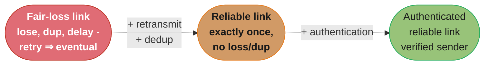

Caption: each link model is the one below it plus a mechanism — the reliable link is not a physical
property but something you construct from a fair-loss link with retransmission and de-duplication,
which is why Part I's TCP work is a prerequisite for all coordination.

### Process models

Assumptions about how a *process* can fail, from most benign to most adversarial:

- **Crash-stop (fail-stop)** — a process works correctly until it crashes, and once crashed it
  **never comes back**. Simple to reason about; the failure is permanent.
- **Crash-recovery** — a process can crash and later **recover**, resuming operation. On recovery
  it loses everything in volatile memory but retains whatever it wrote to **stable storage** (disk).
  This is the realistic model for servers: reboots, deploys, and OOM-kills are all crash-recovery
  events. Algorithms in this model must persist enough state (logs) to pick up correctly after a
  restart.
- **Byzantine** — a process may behave **arbitrarily**: buggy, or actively malicious, sending
  contradictory messages to different peers, lying about its state. This is the model for open,
  trustless systems (blockchains, systems spanning mutually-distrusting organizations). Byzantine
  fault tolerance is far more expensive (needs more replicas — typically 3f+1 to tolerate f faults
  — and more messages). Inside a single trusted datacenter you normally assume *non-Byzantine*
  (crash-recovery), which is why Raft/Paxos are non-Byzantine algorithms.

### Timing (synchrony) models

Assumptions about *time bounds* on computation and communication — this is the assumption that most
changes what is possible:

- **Synchronous** — there is a known upper bound on message delivery time and on the time a process
  takes to execute a step. Clocks are synchronized within a known error. This is the *easy* model:
  a timeout is a perfect failure detector because "no response within the bound" definitively means
  "dead." Almost no real network is truly synchronous.
- **Asynchronous** — **no** timing assumptions at all. Messages can be delayed arbitrarily,
  processes can pause arbitrarily. This is the *hardest* model, and it is where the famous
  impossibility results live: under pure asynchrony you cannot distinguish a slow process from a
  dead one, and the **FLP result** shows consensus cannot be guaranteed (deterministically, with
  termination) if even one process may crash.
- **Partially synchronous** — the system is asynchronous *most of the time* but behaves
  synchronously *often enough* (there exist periods, or bounds that eventually hold, during which
  messages and steps are timely). This is the model **most real systems and algorithms assume**,
  because it is both realistic (networks are usually fine, occasionally awful) and strong enough to
  build working consensus (Raft/Paxos guarantee safety always and liveness during synchronous
  periods).

### Why models matter

Models are deliberately simplified and never perfectly match reality — but that is their value.
They let you **prove** properties and know precisely when those proofs apply. The recurring trap:
an algorithm's correctness proof assumes, say, a synchronous network or non-Byzantine processes;
deployed outside those assumptions it silently breaks. A worked example of the mismatch: a
leader-election algorithm proved correct under a *synchronous* model may treat "no heartbeat within
D milliseconds" as certain proof of leader death and immediately elect a new one — but on a real
(partially synchronous) network a transient delay makes the old leader appear dead while it is very
much alive, and the algorithm's synchronous proof said nothing about the resulting *two* leaders.
The partial-synchrony model exists precisely to force you to handle that case: it grants you timely
behaviour *often enough* to make progress (liveness) while never letting you *assume* timeliness for
correctness (safety) — which is why production algorithms like Raft separate the two, guaranteeing
safety unconditionally and liveness only during synchronous periods. Whenever you read "algorithm X guarantees
Y," the implicit clause is "…under model M" — and your job is to check that your production
environment actually satisfies M. Most of this part quietly assumes a **partially synchronous
network, crash-recovery processes, and fair-loss (upgraded to reliable) links** — the standard
"single trusted datacenter" model.

---

## 2.2 Failure Detection (Ch 7)

A process constantly needs to know whether the peers it depends on are up. But here is the brutal
fact that colours everything after it: **a process has no way to know for certain that a remote
process has failed.** All it observes is the *absence* of an expected message — and that absence is
indistinguishable from a slow process, a slow or congested network, a dropped packet, or a message
that is simply still in flight.

### Timeouts are the only signal

The only tool available is the **timeout**: send a message, start a timer, and if no response
arrives before the timer fires, *suspect* the peer is down. Note the word "suspect" — a timeout
firing is a guess, never a proof. A failure detector built on timeouts is therefore inherently
*unreliable*: it will sometimes flag a healthy-but-slow process as dead (a **false positive**) and
sometimes take a long time to notice a genuinely dead one (a **false negative** / slow detection).

### Pings vs heartbeats

Two symmetric mechanisms for turning "silence" into a signal:

- **Ping** — the monitoring process periodically sends a request ("are you alive?") to the
  monitored process and expects a timely response. The initiative (and the timeout) lives with the
  *monitor* — an **active probe**.
- **Heartbeat** — the monitored process periodically pushes an "I'm alive" message to the monitor,
  which resets a timer on each one and suspects failure if too long passes between beats. The
  initiative lives with the *monitored* process — a **passive report**.

Both encode the same idea (regular expected traffic whose absence signals trouble); they differ in
who drives it. Heartbeats scale a little better for one-to-many monitoring (each process emits one
stream regardless of how many watch it); pings let the monitor control probe timing.

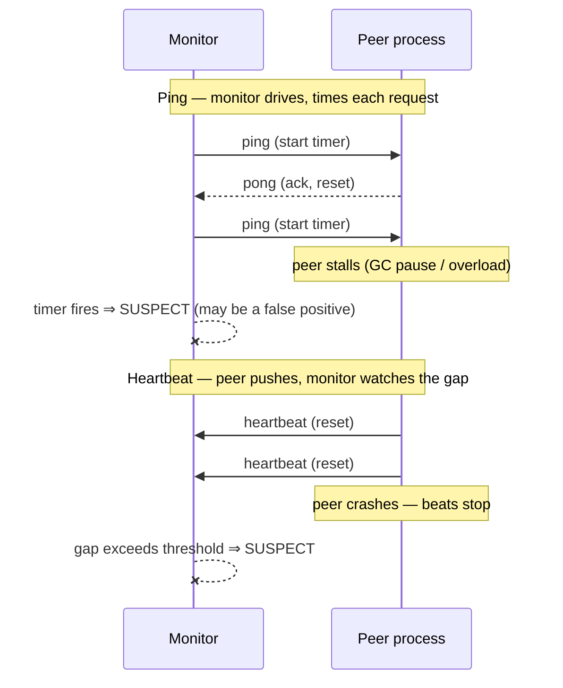

Caption: ping and heartbeat carry the same information (expected periodic traffic whose absence is
the alarm), differing only in who takes the initiative — and in both, the "SUSPECT" verdict is a
timeout-driven guess that can be wrong.

### Tuning the timeout: the false-positive / false-negative tradeoff

The timeout value is a direct dial between two failure modes, and there is no setting that wins
both:

- **Short timeout** → **fast detection** but **more false positives**. A brief GC pause, a CPU
  spike, or a momentary network blip trips the detector and a perfectly healthy process is declared
  dead — triggering needless failovers, re-elections, and churn (which itself adds load and can
  cascade).
- **Long timeout** → **fewer false positives** but **slow detection**. You wait longer before
  concluding a genuinely dead process is dead, extending the window during which requests are routed
  to a black hole.

In practice the timeout is chosen from the *observed* round-trip distribution (e.g. a high
percentile of measured response times, with a margin), sometimes adaptively, and paired with
**multiple missed probes before declaring failure** to smooth over transient blips. Phi-accrual
detectors (used by Cassandra/Akka) go further: instead of a binary up/down, they output a
*suspicion level* that rises with the time since the last heartbeat, letting each consumer pick its
own threshold.

**The idea behind it.** "Beat every `H` seconds and declare death after `T` seconds of silence — so
`T/H` is how many beats a peer may miss before you give up on it, and that one ratio sets both how
fast you notice a real crash and how often you libel a healthy process."

| Symbol | What it is |
|--------|------------|
| `H` | Heartbeat interval — how often the monitored process emits "I'm alive" |
| `T` | Failure timeout — silence longer than this and the monitor declares SUSPECT |
| `T / H` | Consecutive beats a peer may miss before being declared dead |
| detection time | Between `T` and `T + H`, averaging `T + H/2`, because a crash lands mid-interval |
| `p` | Probability that any one individual beat is lost or arrives late |

**Walk one example.** The same 1-second heartbeat under two timeout settings:

```
  H = 1 s, T = 2 s     misses tolerated 2      detect in 2.0-3.0 s, mean 2.5 s
  H = 1 s, T = 5 s     misses tolerated 5      detect in 5.0-6.0 s, mean 5.5 s

  false-positive probability if a single beat is late with p = 0.01
    tolerate 1 miss     0.01^1 = 1e-02      one bad verdict per 100 windows
    tolerate 2 misses   0.01^2 = 1e-04
    tolerate 3 misses   0.01^3 = 1e-06
    tolerate 5 misses   0.01^5 = 1e-10      effectively never
```

**Why the trade is lopsided in your favour.** Detection time grows **linearly** in the number of
misses you tolerate, while the false-positive probability falls **exponentially** — `p^k`. Moving
from 2 tolerated misses to 5 costs 3 extra seconds of detection delay and buys six orders of
magnitude fewer spurious failovers. That asymmetry is why production detectors almost always require
several missed beats rather than one, and it is the quantitative version of the tuning dial above.
Note also the floor: no matter how small you make `H`, detection cannot beat `T`, so shrinking `H`
alone just multiplies heartbeat traffic while sharpening only the `+H/2` tail.

**Indirect probing (SWIM) guards against false positives from network glitches.** A refinement used
in gossip-based membership: before the monitor declares a peer dead on a single missed direct probe,
it asks `k` *other* random members to probe the suspect on its behalf. If any of them gets a
response, the suspect is alive and the original failure was really a problem on the *monitor's own*
path to it (a one-hop network glitch), not a dead peer. Only if *all* the indirect probes also fail
is the peer declared dead. This distinguishes "the peer is down" from "the specific link between me
and the peer is down" — a distinction a lone timeout cannot make — cutting false positives sharply
in large clusters where transient one-hop problems are common. SWIM combines this with gossiped
membership updates so the whole cluster converges on the same up/down view.

### Perfect failure detection is impossible in an asynchronous network

This is the chapter's headline and a favourite interview gotcha. In an **asynchronous** system —
no bound on message delay or process pause — it is *provably impossible* to build a **perfect**
failure detector (one that never has false positives and never misses a failure). The reason is
exactly the indistinguishability above: a message that will arrive "eventually" but with unbounded
delay is indistinguishable, at any finite moment, from a message that will never arrive because the
sender is dead. Any timeout you pick can always be beaten by a process that was merely slower than
that timeout. You can only get a perfect failure detector in a **synchronous** system, where the
known delay bound lets "no response within the bound" mean "definitely dead." Real systems are
partially synchronous, so real failure detectors are **unreliable by necessity** — and every
higher-level protocol (leader election, replication) must be designed to *tolerate* a failure
detector that occasionally lies in both directions.

---

## 2.3 Time (Ch 8)

Ordering is the beating heart of coordination: to replicate a state machine you must feed every
replica the *same sequence* of operations, and to resolve conflicts you must know which write came
"after" another. The naive instinct is to timestamp events with the wall clock and sort. This
chapter demolishes that instinct — physical clocks are unreliable for ordering — and builds
**logical clocks** that order events by *causality* instead of by seconds.

### Physical clocks

A computer keeps time with a **quartz oscillator**, a crystal that vibrates at a nominal frequency.
It is not exact: temperature, age, and manufacturing variation make it **drift** — running slightly
fast or slow, accumulating error of milliseconds per day or more. Two machines' clocks that started
in sync will diverge.

- **NTP (Network Time Protocol)** corrects drift by periodically syncing to a more accurate
  reference clock over the network, estimating and cancelling the round-trip. The correction can
  **jump the clock forward** and — the dangerous part — **jump it backward** if the local clock had
  raced ahead. A clock that can move backward destroys any code that assumes time increases
  monotonically.
- **Wall-clock time vs monotonic clock.** These are two different clocks the OS exposes and
  confusing them is a classic bug:
  - **Wall-clock (time-of-day)** — "what time is it": seconds since an epoch, human-meaningful, but
    subject to NTP jumps (forward *and* backward), leap seconds, and manual changes. Use it for
    *timestamps* (when did this happen, in calendar terms), never for durations.
  - **Monotonic clock** — a counter that only ever moves **forward** at a steady rate, with no
    absolute meaning (its zero is arbitrary). Use it for **measuring elapsed time** (how long did
    this take, has this timeout expired). Measuring a duration by subtracting two wall-clock reads
    can yield a *negative* or wildly wrong result if NTP stepped the clock in between; measuring it
    with the monotonic clock cannot.

  The rule: **durations = monotonic clock only.** A load balancer that measured request latency
  with the wall clock could log a −3-second latency after an NTP step — nonsense that corrupts
  metrics and can trip timeout logic.
- **Atomic / GPS clocks** are far more accurate (drift of nanoseconds), used as NTP references and,
  notably, *inside* Google's **Spanner**, whose **TrueTime** API deploys GPS and atomic clocks in
  every datacenter and — crucially — **exposes the uncertainty** as an interval `[earliest, latest]`
  rather than pretending to a single exact instant (returned to in §2.7).

The takeaway: even well-synchronized physical clocks disagree by enough (and can jump) that you
**cannot use them to reliably order events across machines**. If two events are microseconds apart
on two servers, their wall-clock timestamps may order them wrongly. Hence logical clocks.

**What this actually says.** "A quartz oscillator is specified as a fraction of error per unit of
time, so multiply that fraction by how long the machine has run since its last sync and you get how
far its idea of 'now' can be from everyone else's."

| Symbol | What it is |
|--------|------------|
| ppm | Parts per million — 1 ppm is 1 microsecond of error accumulated per second elapsed |
| drift rate | The oscillator's error fraction; commodity server quartz runs roughly 20-50 ppm |
| elapsed | Time since the last NTP correction reset the error to (near) zero |
| accumulated error | `drift rate x elapsed` — this clock's distance from true time |

**Walk one example.** Ordinary clocks left to run without a sync:

```
  drift        after 1 min     after 1 hour     after 1 day      after 1 week
   20 ppm         1.2 ms           72 ms          1.728 s          12.10 s
   50 ppm         3.0 ms          180 ms          4.320 s          30.24 s
  100 ppm         6.0 ms          360 ms          8.640 s          60.48 s

  two 50 ppm clocks drifting in OPPOSITE directions, 1 hour since sync
    gap = 2 x 180 ms = 360 ms between what the two machines each call "now"

  how long one 50 ppm clock needs to accumulate a given error
    100 microseconds  ->    2 s
      1 millisecond   ->   20 s
```

**Why this destroys event ordering.** The bottom rows are the damning ones. A single 50 ppm machine
drifts a full millisecond away from true time in **20 seconds** — longer than most operations take,
which means two writes issued a millisecond apart on two servers can carry wall-clock timestamps in
the wrong order almost immediately after a perfect sync. Let an hour pass and the disagreement is
360 ms, which is longer than many entire requests. Worse, the error is not even monotone: NTP's
correction can step a clock **backward**, so sorting by timestamp can reorder events that already
happened. Logical clocks sidestep all of this by throwing away "how much time passed" and keeping
only "what could have caused what" — a quantity no oscillator can corrupt.

### Logical clocks

A logical clock abandons the goal of measuring *physical* time and instead captures the *order* in
which events could have influenced one another.

**The happened-before relation (Lamport).** Define `a → b` ("a happened before b") by three rules:

1. If `a` and `b` are events in the *same process* and `a` occurs before `b`, then `a → b`.
2. If `a` is the *sending* of a message and `b` is the *receipt* of that same message, then
   `a → b` (a cause must precede its effect).
3. **Transitivity**: if `a → b` and `b → c`, then `a → c`.

If neither `a → b` nor `b → a`, the events are **concurrent** (written `a ∥ b`) — they could not
have influenced each other, and there is no meaningful "which came first." Happened-before is a
*partial* order, not a total one, precisely because concurrency exists.

**Lamport clocks.** A scalar counter per process implementing happened-before:

```
each process P keeps an integer counter L, initially 0

on any local event:        L = L + 1
on sending a message m:    L = L + 1;  send (m, L)     # attach timestamp
on receiving (m, L_msg):   L = max(L, L_msg) + 1       # catch up, then tick
```

A worked trace makes the "counting accident" concrete. Three processes, each starting at 0; P1
sends a message to P2 after its second tick:

```
Event                         P1    P2    P3     note
------------------------------------------------------------------------
P1 local event a              1     -     -      a: L=1
P1 local event b              2     -     -      b: L=2
P1 send m (to P2)             3     -     -      send: L=3, attach 3
P3 local event x              -     -     1      x: L=1  (unrelated to P1)
P2 recv m                     -     4     -      L=max(0,3)+1 = 4
P3 local event y              -     -     2      y: L=2

Compare  x (L=1 on P3)  and  a (L=1 on P1):  equal timestamps, unrelated events.
Compare  y (L=2 on P3)  and  b (L=2 on P1):  L(y)=L(b) yet y ∥ b — no causal link.
Compare  x (L=1) and recv m (L=4):  L(x) < L(recv) but x ↛ recv — they are CONCURRENT.
```

The last line is the trap: `L(x)=1 < 4=L(recv m)`, yet `x` did not happen-before the receive — they
are concurrent, the small timestamp is pure counting accident. Ties (like `x` and `a` both at 1) are
broken deterministically by process ID to build a total order.

**The key property — and the gotcha:** `a → b  ⟹  L(a) < L(b)`. The implication is **one-way
only**. Its converse is *false*: `L(a) < L(b)` does **not** imply `a → b`. Two concurrent events on
different processes can have `L(a) < L(b)` purely by counting accident, with no causal link between
them. So a Lamport timestamp lets you *safely order* events you already know are causally related
(and never contradicts causality), but it **cannot tell you whether two events are causally related
or merely concurrent** — a smaller timestamp does not prove "happened before." To get a **total**
order (needed to, say, break ties deterministically across replicas), append the process ID:
compare by `(L, processID)`. That total order is consistent with causality but *invents* an order
between concurrent events — useful for determinism, but it hides the concurrency information that
vector clocks preserve.

### Vector clocks

Vector clocks fix Lamport's one-way weakness: they let you determine, for any two events, whether
one happened-before the other **or** they are concurrent — a full causality test.

Each process keeps a **vector** of counters, one entry per process in the system:

```
process P_i keeps vector V (length N), all zeros initially

on a local event at P_i:      V[i] = V[i] + 1
on sending a message:         V[i] = V[i] + 1;  send (m, V)
on receiving (m, V_msg):      for each k: V[k] = max(V[k], V_msg[k])   # merge
                              V[i] = V[i] + 1                          # then tick own
```

**Comparing two vectors** `V(a)` and `V(b)`:

- `V(a) < V(b)` (every entry `≤` and at least one strictly `<`)  ⟹  `a → b` (a happened before b).
- `V(b) < V(a)`  ⟹  `b → a`.
- **Neither** `≤` the other (each has an entry larger than the other)  ⟹  `a ∥ b` (**concurrent**).

Unlike Lamport, this **detects concurrency directly** — which is exactly what conflict-resolving
stores (Dynamo, §2.6) need to know whether two writes conflict or one supersedes the other. The
cost: each timestamp is `O(N)` in the number of processes, so vector clocks grow with cluster size
(mitigated in practice by pruning, dotted version vectors, or bounding the entries tracked).

The following ASCII grid traces three processes exchanging two messages, showing how the vectors
evolve and how a concurrency is exposed — character alignment carries the meaning, so it stays
ASCII:

```
Processes A, B, C.  Vector = [A, B, C].  Arrows are messages.

 time ->    e1          e2                 e5
   A:  [1,0,0]------\ [2,0,0]-----------\ [3,0,0]
                     \                   \
                      v                   \
   B:              [1,1,0] e3              \
                        \                   \
                         \                   v
   C:                     -------------> [2,1,1] e4        [2,0,2] e6 (local, no msg)

  A e1 = [1,0,0]      A's 1st event, sends m1 to B
  B e3 = [1,1,0]      B receives m1: max([0,0,0],[1,0,0]) then B++  -> [1,1,0]; sends m2 to C
  A e2 = [2,0,0]      A's 2nd local event (independent of B)
  C e4 = [2,1,1]      C receives m2 from B, and had seen A e2 via another path -> merge
  C e6 = [2,0,2]      a DIFFERENT C history branch: has A e1 but NOT B e3

Compare e3 = [1,1,0] and e2 = [2,0,0]:
   e3 vs e2:  B-entry 1>0 but A-entry 1<2  -> neither dominates -> e2 ∥ e3  (CONCURRENT)
Compare e1 = [1,0,0] and e3 = [1,1,0]:
   e1 <= e3 on every entry, strictly < on B  -> e1 -> e3  (e1 HAPPENED BEFORE e3)
```

Caption: the vector's per-process counters let you read causality straight off the numbers — `e1`
dominates `e3` entry-wise so it happened before it, while `e2` and `e3` each lead on a different
entry, which is the signature of *concurrency* that a single Lamport scalar can never reveal.

---

## 2.4 Leader Election (Ch 9)

Many coordination problems collapse to a much simpler one if a *single* process is designated to
make decisions — a **leader**. A leader serializes operations (no concurrent conflicting decisions),
owns a resource exclusively, or drives replication. But electing a leader in a system where
processes crash and messages drop is itself a consensus problem. This chapter uses **Raft's** leader
election as the concrete, teachable algorithm — and then delivers the practical warning: *don't
build it yourself.*

### Raft leader election

Raft structures time into **terms** — consecutive, monotonically increasing integers, each starting
with an election. A term is a logical clock for "leadership epochs": at most one leader per term.
Every server is in one of three states:

- **Follower** — passive; responds to leaders and candidates, never initiates.
- **Candidate** — a follower that suspects the leader is gone and is standing for election.
- **Leader** — the single active coordinator for the current term; handles all client requests and
  sends periodic heartbeats.

The mechanism:

1. **Election timeout.** A follower expects regular heartbeats (`AppendEntries` with no entries)
   from the leader. If none arrive within its **election timeout**, it assumes the leader has failed,
   transitions to **candidate**, increments the current term, and **votes for itself**.
2. **RequestVote.** The candidate sends `RequestVote` RPCs to all other servers, asking for their
   vote in the new term.
3. **Voting rule.** Each server grants its vote to **at most one** candidate per term (first valid
   requester wins) — and only if the candidate's log is at least as up-to-date as its own (a safety
   condition that prevents electing a leader missing committed entries).
4. **Majority quorum.** A candidate that collects votes from a **majority** of the cluster (more
   than N/2) becomes **leader** and immediately sends heartbeats to assert authority and stop other
   elections. Requiring a majority guarantees **at most one leader per term** — any two majorities
   overlap in at least one server, and that server only voted once.
5. **Split votes.** If several followers time out at once and become candidates, votes can split so
   that *no one* reaches a majority; the term ends with no leader and everyone times out again.
   Raft breaks this with **randomized election timeouts** (each server picks its timeout randomly
   from a range, e.g. 150–300 ms): one server almost always times out first, wins the vote before
   others wake, and split votes become rare and self-correcting.

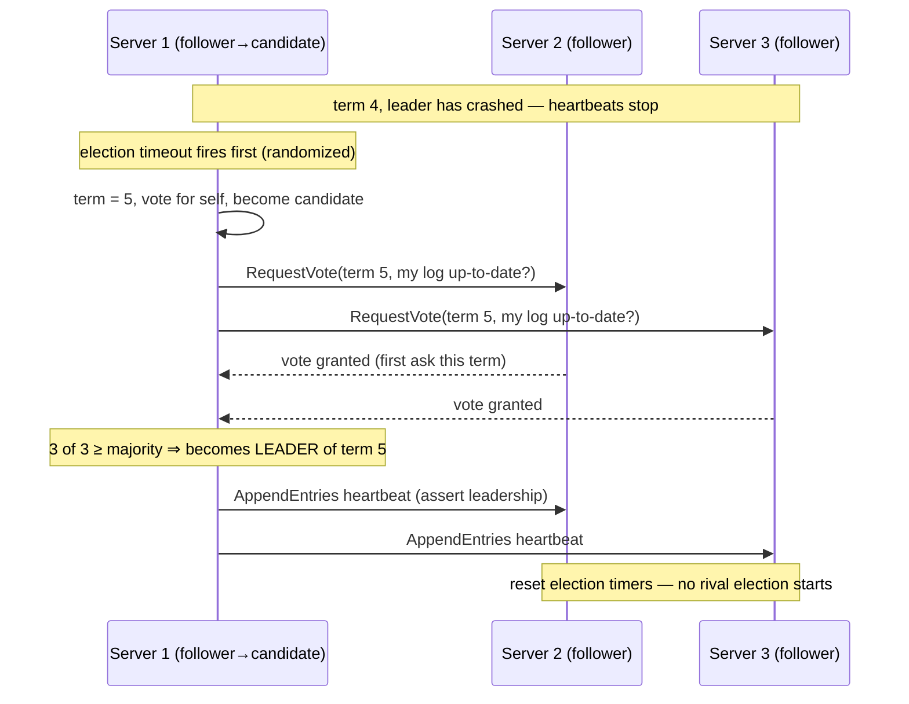

Caption: a majority of votes in a term elects exactly one leader (any two majorities overlap in a
server that voted only once), and randomized election timeouts make one candidate almost always
wake first — turning the split-vote risk into a rare, self-healing event.

**What it means.** "A majority is 'strictly more than half', which is `floor(n/2) + 1` servers — and
because everything left over is what you are allowed to lose and still assemble one, a cluster
tolerates exactly `floor((n-1)/2)` failures."

| Symbol | What it is |
|--------|------------|
| `n` | Total servers in the cluster |
| `floor(n/2) + 1` | Quorum size: the smallest set that is strictly more than half of `n` |
| `floor((n-1)/2)` | Failures tolerated, i.e. `n` minus the quorum size |
| overlap | Any two quorums share a server, because their sizes sum to more than `n` |

**Walk one example.** Every cluster size from 3 to 8:

```
   n     quorum = floor(n/2)+1     failures tolerated = n - quorum
   3             2                            1
   4             3                            1     <- no better than n=3
   5             3                            2
   6             4                            2     <- no better than n=5
   7             4                            3
   8             5                            3     <- no better than n=7

  overlap check at n = 5:  two quorums of 3 sum to 6, which exceeds 5, so they
  must share at least one server -- and that server granted at most one vote
  this term, so two leaders in one term is arithmetically impossible.
```

**Why an even cluster size buys nothing.** Follow the arrows. Going from 3 servers to 4 raises the
quorum from 2 to 3 while the failure tolerance stays pinned at 1. You have bought another machine,
another vote to collect on every single decision, and another thing that can break — in exchange for
zero additional fault tolerance. The same is true at 6 and 8. That is the entire reason production
consensus clusters are sized 3, 5, or 7: the odd sizes are the only ones where the extra node
actually moves the `floor((n-1)/2)` column.

### Practical: don't build it — use leases, and beware the lease-expiry race

Raft election is subtle and easy to get wrong. The book's strong advice: **do not implement leader
election (or consensus) yourself.** Delegate it to a battle-tested **coordination service** —
**etcd**, **ZooKeeper**, **Consul**, or Chubby — which exposes leader election through a **lease**:
a lock with a **time-to-live (TTL)** that the holder must **renew** before it expires. Whoever holds
the lease is the leader; if the holder dies and stops renewing, the lease expires and another
process can acquire it.

**The lease-expiry race — how you get two leaders.** This is the classic distributed-systems bug and
a must-know interview trap. Leases rely on time, and time is unreliable (§2.3):

1. Process A holds the lease and believes itself leader.
2. A suffers a long **stop-the-world GC pause** (or is descheduled, or its clock drifts). It renews
   nothing.
3. From the **coordination service's** clock, A's lease **expires**. The service grants the lease to
   process B, which becomes the new leader.
4. A **wakes up** from its pause still believing — *because its own clock says the lease hasn't
   expired yet* — that it is the leader. Now **A and B both think they are leader** and both issue
   writes to the shared resource (a database, a storage system). Split-brain: corrupted data.

The trap is that the lease's safety depends on both parties agreeing on elapsed time, and a paused
process's notion of elapsed time is wrong.

**Fencing tokens — the fix.** The coordination service hands out, along with each lease grant, a
**monotonically increasing fencing token** (an integer that goes up by one each time the lease
changes hands). Every write the leader sends to the protected resource **includes its token**. The
resource remembers the **highest token it has seen** and **rejects any write carrying a smaller
token**. When B becomes leader it gets a higher token than A ever had; the storage system, having
now seen B's higher token, refuses A's stale writes when the zombie A wakes up. The resource itself
enforces "only the newest leader wins" — no clock agreement required.

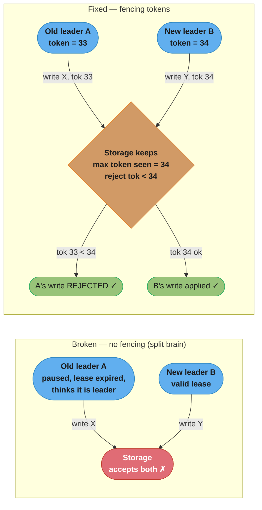

Caption: the lease alone cannot stop a paused old leader that wakes up thinking it still holds
leadership, because its clock disagrees — the fencing token pushes the decision to the resource,
which mechanically rejects any write with a token below the highest it has seen, making split-brain
writes impossible without any clock agreement.

**The leader as bottleneck and SPOF.** A leader concentrates work: every operation may funnel
through it, so it can become a throughput **bottleneck** and, since its failure triggers a
(temporarily unavailable) re-election, a **single point of failure** if over-relied upon. The
discipline: give a process leadership only over the *narrow* thing that genuinely needs
serialization (e.g. one shard/partition), partition leadership across many shards so no single
leader is global, and keep the leader's per-operation work small.

---

## 2.5 Replication (Ch 10)

We replicate data across nodes for **availability** (survive failures), **throughput** (spread
reads), and **latency** (serve from a nearby copy). But the instant there is more than one copy, we
face the core question of this chapter: **how consistent are the copies, and what does the client
observe?** The answer is built from **state-machine replication** (Raft's log), formalized as
**consensus**, and then sold to applications as a menu of **consistency models** priced by
**CAP/PACELC**.

### State machine replication (Raft log replication)

The central technique: model your service as a **deterministic state machine** (given the same
sequence of commands from the same start state, it always reaches the same state), then run an
identical copy on every replica and feed them all the **same ordered sequence of commands**. If the
sequence is identical and the machine is deterministic, the replicas stay identical. The hard part
is agreeing on the *sequence* — that is what Raft's **replicated log** does.

**Determinism is a hard requirement, and easy to break.** If any command's outcome depends on
something *other* than the ordered log — the local wall clock, a random number, the order of a hash
map's iteration, a call to a non-replicated external service — two replicas fed the identical log
can diverge. A command like `set expiry = now() + 60s` executed independently on each replica lands
a *different* absolute expiry on each, silently splitting the replicas. The fix: make the
non-deterministic input part of the command itself. The **leader** evaluates `now()` once, and the
log entry it replicates carries the concrete resolved value (`set expiry = 1699999999`), so every
replica applies the byte-identical effect. The rule of thumb: resolve all non-determinism *before*
the entry enters the log, never during apply.

The log-replication mechanism (following on from §2.4's elected leader):

1. A client sends a command to the **leader**. The leader appends it to its own log as a new entry
   (tagged with the current term and an index) — but does **not** yet apply it.
2. The leader sends `AppendEntries` RPCs carrying the new entry to all followers.
3. Each `AppendEntries` includes the **index and term of the entry immediately preceding** the new
   ones (`prevLogIndex`, `prevLogTerm`). A follower **rejects** the RPC if its log doesn't contain a
   matching entry at that position — this enforces the **Log Matching Property**: if two logs
   contain an entry with the same index and term, they are identical in all preceding entries. On
   rejection the leader decrements its index for that follower and retries, walking back until the
   logs align, then overwrites the follower's divergent suffix. This is how a new leader repairs
   followers' logs.
4. Once a **majority** of servers (including the leader) have **persisted** the entry, the leader
   marks it **committed**, advances its **commit index**, and **applies** the command to its state
   machine, returning the result to the client. Followers learn the commit index from subsequent
   `AppendEntries` and apply the entry to their own state machines.
5. A subtle Raft safety rule: a leader only counts replicas to commit entries **from its own current
   term**; older-term entries become committed indirectly once a current-term entry above them
   commits. This prevents a rare scenario where a committed entry could be overwritten.

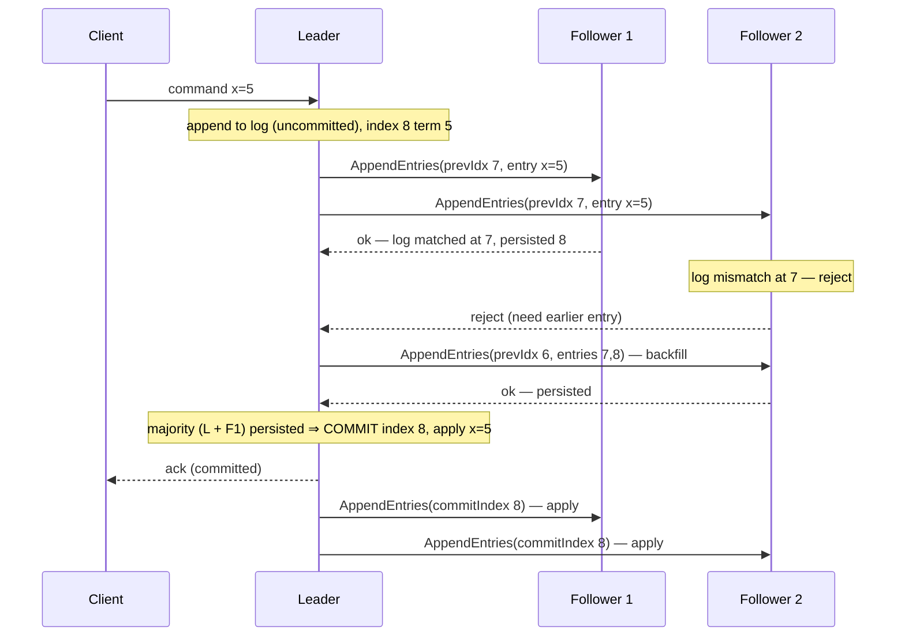

Caption: the leader commits an entry only after a *majority* durably store it, and the
prevIndex/prevTerm check (the Log Matching Property) is what lets the leader detect a divergent
follower and backfill it — so every replica applies the identical command sequence to its
deterministic state machine.

**Read it like this.** "One committed decision costs the leader one fan-out and one fan-in — `n-1`
requests plus `n-1` acknowledgments, so `2(n-1)` messages — but because those requests go out in
parallel, the latency is one round trip no matter how large the cluster gets."

| Symbol | What it is |
|--------|------------|
| `n` | Servers in the consensus group |
| `n - 1` | Followers the leader must reach: the fan-out |
| `2(n - 1)` | Messages per committed entry — one AppendEntries out and one ack back per follower |
| 1 RTT | Latency per decision, because the `n-1` requests are issued in parallel, not in series |
| leader election | The extra phase Raft/Multi-Paxos pay **once per term**, not once per decision |

**Walk one example.** Message cost and the throughput ceiling it implies:

```
   n      msgs/decision = 2(n-1)      basic Paxos, 2 phases = 4(n-1)
   3               4                            8
   5               8                           16
   7              12                           24
   9              16                           32

  latency is FLAT at 1 RTT for every row above -- only the message count grows

  serialized decisions per second, at one decision per round trip
      0.5 ms RTT  (same rack)        2,000/s
      1   ms RTT  (same AZ)          1,000/s
     50   ms RTT  (cross-region)        20/s
```

**Where the amortization comes from.** Basic Paxos runs two phases — prepare, then accept — for
*every* value, costing 2 RTT and `4(n-1)` messages. Multi-Paxos and Raft establish a stable leader
**once per term** and then reuse that leadership for every subsequent log entry, so the prepare phase
is divided across thousands of decisions and rounds to nothing. That is the whole optimization: it
halves the steady-state cost to 1 RTT and `2(n-1)` messages. The last block is the sobering half —
a cross-region group at 50 ms RTT tops out near 20 serialized decisions per second. Batching many
commands into one AppendEntries and pipelining entries rescues *throughput*; nothing rescues the
per-decision *latency*, which is why geo-distributed consensus is placed on the write path only when
the correctness is genuinely worth it.

### Consensus as the abstraction

Strip away the mechanics and Raft solves **consensus**: a set of processes must **agree on a single
value** (or, repeatedly, on the next entry in a log). Any correct consensus algorithm guarantees:

- **Agreement** — no two processes decide *different* values.
- **Validity (integrity)** — the decided value was actually *proposed* by some process (no value
  invented from nothing).
- **Termination** — every non-faulty process *eventually* decides (a liveness property; by FLP this
  can only be guaranteed under partial synchrony, not pure asynchrony).

Note the tension with FLP (§2.1): the impossibility result says consensus **cannot guarantee
termination** in a purely asynchronous system with even one crash. Raft/Paxos do not violate it —
they **sidestep** it by relying on partial synchrony (timeouts / an eventually-reliable failure
detector) for **liveness**, while keeping **safety** (agreement, validity) **unconditional**. In
other words, during a bad network spell a Raft cluster may make *no progress* (repeated elections,
no committed entries) — but it will **never** decide two different values. This is the deliberate
tradeoff every production consensus system makes: give up guaranteed liveness under adversarial
timing to keep safety always.

Raft and (Multi-)Paxos are the canonical algorithms. **Consensus is the atom** on which everything
strongly-consistent is built: distributed locks, leader election, group membership, linearizable
key-value stores, atomic commit — all reduce to running consensus on a sequence of decisions. And
the book's practical refrain repeats: **implementing consensus correctly is extraordinarily hard;
use a coordination service** (etcd/ZooKeeper) that has already done it, and layer your logic on its
primitives (leases, watches, atomic compare-and-set).

### Consistency models

A consistency model is a **contract** between the data store and the client about *which values a
read may return* in the presence of concurrency and replication. From strongest (most intuitive,
most expensive) to weakest:

- **Linearizability (strong consistency).** The system behaves as if there is a **single, up-to-date
  copy** of the data, and every operation appears to take effect **atomically at some instant
  between its invocation and its response**, consistent with **real-time order**. Concretely: once a
  write completes, *every* subsequent read (by anyone, anywhere) sees that write or a later one — no
  staleness, no going back in time. This is what makes a distributed store feel like a single
  machine, and it is required for things like locks and uniqueness constraints. Cost: in Raft, to
  read linearizably you must go **through the leader** *and* confirm the leader is still the leader
  at read time — a naive read from a leader that was just deposed could return stale data. The
  confirmation is done with a **read barrier** (the leader exchanges a heartbeat round with a
  majority before answering, proving it's still leader) or, as an optimization, a **leader lease**
  (the leader holds a time-bounded lease during which it may serve reads locally without a round
  trip — trading a clock assumption for latency).

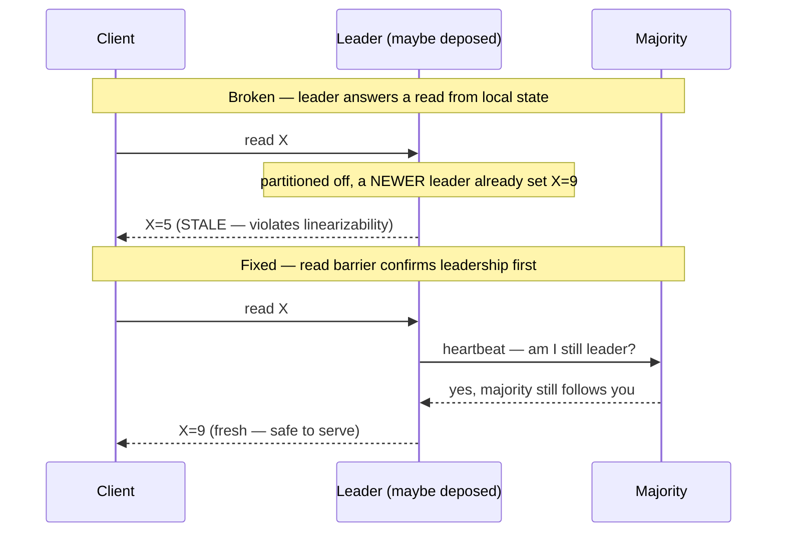

Caption: a leader that was silently deposed can still return stale data from local state, so a
linearizable read must first prove current leadership with a majority heartbeat round (the read
barrier) — or hold a leader lease to skip the round trip at the cost of a bounded-clock assumption.
- **Sequential consistency.** Weaker: operations of **each individual process** appear in that
  process's **program order**, and there exists **some total order** of all operations consistent
  with those per-process orders — but this order need **not** match real time. So everyone agrees on
  *an* order, and each client's own actions are in order, but a read may return a stale value as
  long as the global order stays consistent. The classic realization is a **producer/consumer** over
  a queue: the consumer sees the producer's items in the order the producer enqueued them
  (per-process order preserved), even though there is no real-time recency guarantee across unrelated
  clients. Concretely: a producer appends jobs A, B, C in that order; a consumer reading a replica
  might still be at job A while the producer has already enqueued C, but it will *never* see C before
  B — the per-process append order is inviolable, only real-time recency is relaxed. Linearizability
  would additionally forbid the staleness; sequential consistency permits the lag so long as no one
  ever observes the jobs out of their produced order.
- **Eventual consistency.** The weakest common model: if writes stop, all replicas **eventually
  converge** to the same value — but until then, reads may return **stale** or out-of-order data,
  and different clients may see different values. You give up recency and any real-time guarantee in
  exchange for **availability and low latency** (reads/writes served by the nearest replica without
  coordination). Amazon's shopping cart is the archetype: better to occasionally show a slightly
  stale cart than to be unavailable.

**The spectrum vs performance.** These models form a ladder: the stronger the guarantee, the more
coordination each operation requires, the higher its latency, and the less available the system is
under failures. There is no free lunch — you buy consistency with latency and availability.

```mermaid
flowchart LR
    classDef io      fill:#61afef,stroke:#2e86c1,color:#1a1a1a,font-weight:bold
    classDef frozen  fill:#c678dd,stroke:#9b59b6,color:#fff
    classDef train   fill:#98c379,stroke:#27ae60,color:#1a1a1a
    classDef mathOp  fill:#d19a66,stroke:#e67e22,color:#1a1a1a,font-weight:bold
    classDef lossN   fill:#e06c75,stroke:#c0392b,color:#fff,font-weight:bold
    classDef req     fill:#56b6c2,stroke:#0097a7,color:#1a1a1a
    classDef base    fill:#e5c07b,stroke:#f39c12,color:#1a1a1a

    LIN(["Linearizable<br/>single up-to-date copy<br/>real-time order"]) -->|"weaker,<br/>cheaper,<br/>more available"| SEQ(["Sequential<br/>per-process order<br/>+ some total order"])
    SEQ -->|"weaker"| CAU(["Causal<br/>respects happened-before<br/>concurrent ops may differ"])
    CAU -->|"weakest"| EVE(["Eventual<br/>converge if writes stop<br/>stale reads allowed"])

    class LIN lossN
    class SEQ mathOp
    class CAU req
    class EVE train
```

Caption: the consistency spectrum runs from linearizable (feels like one machine, most expensive,
least available under partition) down to eventual (cheapest, most available, weakest guarantee) —
you pick the lowest rung your application's correctness can tolerate, because every rung up is paid
for in latency and availability. (Causal consistency, the strongest rung that survives partitions,
is developed in §2.6.)

### CAP and PACELC

**CAP theorem.** When a **network partition (P)** splits the replicas so they cannot communicate,
you must choose between:

- **Consistency (C)** — refuse operations that can't be made consistent (return errors / block),
  keeping data correct but sacrificing availability on the minority side.
- **Availability (A)** — keep serving on both sides of the partition, accepting that the sides may
  diverge (stale/conflicting data), sacrificing consistency.

You cannot have both **during a partition**. So systems are classified **CP** (choose consistency:
e.g. a Raft/ZooKeeper-backed store, which stops serving the minority partition) or **AP** (choose
availability: e.g. a Dynamo-style store, which keeps serving and reconciles later).

**Why "CA" isn't real.** CAP is often mis-taught as "pick two of three," implying you could build a
**CA** system that forgoes partition tolerance. But **you do not get to opt out of P** — network
partitions are a fact of any real network, not a design choice. Since partitions *will* happen, the
only real choice is **what you do when one occurs**: sacrifice C (be AP) or sacrifice A (be CP).
"CA" describes a single-node system or a fantasy; it is not a coherent option for a distributed one.
The honest reading of CAP is therefore binary: **during a partition, CP or AP**.

**PACELC** completes the picture, because CAP only speaks about the (rare) partitioned case and says
nothing about normal operation. PACELC reads: **if Partition (P) then Availability (A) or
Consistency (C); Else (E) — when running normally — Latency (L) or Consistency (C).** The insight is
that the consistency/latency tradeoff exists **even with no partition**: to guarantee strong
consistency you must coordinate replicas on every operation, which costs latency, *always*, not just
during failures. So a store is characterized on two axes, e.g. **PA/EL** (Dynamo: available under
partition, low-latency otherwise — weak consistency both times) or **PC/EC** (Spanner: consistent
always, paying availability under partition and latency otherwise). PACELC exposes the everyday
price that CAP hides.

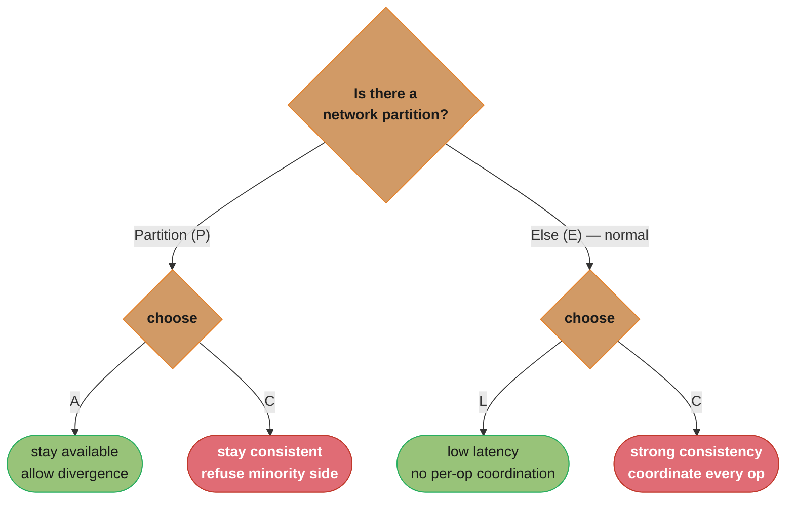

Caption: CAP is only the top branch (partition ⇒ A-or-C); PACELC adds the bottom branch — the
Else case — showing that the consistency-vs-latency tension is paid on *every* operation in normal
running, which is why "CA" is meaningless (you never escape the P branch) and why even a healthy
strongly-consistent store is slower than an eventually-consistent one.

### Chain replication

An alternative to leader-based replication that keeps **strong consistency** while getting **better
read throughput**. The replicas are arranged in a linear **chain**:

- **Writes** enter at the **head**, propagate node-by-node **down** the chain, and are acknowledged
  only when they reach the **tail**. Because a write is not acknowledged until it has traversed every
  node, all replicas that could serve it are up to date.
- **Reads** are served entirely by the **tail** (the last node), which by construction holds only
  fully-propagated (committed) writes — so reads are strongly consistent *and* offloaded from the
  head, giving higher read throughput than a single leader that must serve both.

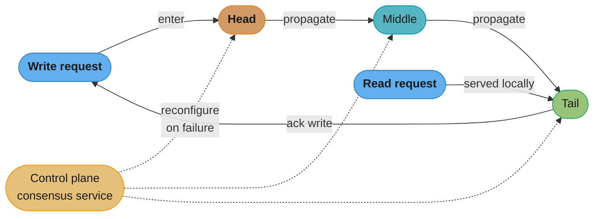

Caption: writes flow head→middle→tail and are acknowledged only at the tail (so every replica is up
to date), while reads hit the tail alone — offloading reads from the write path for higher throughput,
with a separate consensus-backed control plane handling the tricky chain reconfiguration when a node
dies.

Tradeoffs: **higher write latency** (a write serially traverses the whole chain rather than fanning
out to a quorum in parallel), and the chain must be **reconfigured** when a node fails (splice it
out, re-link neighbours). That reconfiguration is handled by a separate **control plane** — a
consensus service (like the ones in §2.4) that tracks chain membership and orchestrates safe
repair — so the data path (the chain) stays simple while the rare, tricky membership decisions go
through consensus. Chain replication trades write latency and reconfiguration complexity for strong
consistency with high read throughput, and underpins systems like object stores' storage layers.

---

## 2.6 Coordination Avoidance (Ch 11)

Consensus is correct but **expensive**: every decision needs a majority round-trip, so it caps
throughput, adds latency, and goes unavailable under partition. The pragmatic move is to **avoid
coordination wherever the application's correctness allows it** — accepting weaker consistency in
return for availability, latency, and scale. This chapter is the toolbox for coordination-free
(or minimally-coordinated) systems: efficient **broadcast**, **CRDTs**, **Dynamo-style quorums**,
the **CALM theorem** that tells you *when* you can skip coordination, and **causal consistency**,
the strongest model that survives a partition.

### Broadcast protocols

Broadcasting — delivering a message to every member of a group — is a building block for
replication and membership. Three strengths:

- **Best-effort broadcast** — the sender simply sends the message to each member individually. If
  the sender **crashes partway** through the loop, some members receive it and some never do — no
  atomicity. Cheap, no guarantees on sender failure.
- **Reliable broadcast** — guarantees that **all non-faulty processes deliver the same set of
  messages**, even if the original sender crashes mid-broadcast. Implemented by having each receiver
  **re-broadcast** a message it receives (eager reliable broadcast): even if the sender dies, the
  message that reached *anyone* gets propagated to everyone. Correct but **expensive** — naive eager
  re-broadcast is `O(N²)` messages, which does not scale to large groups.
- **Gossip (epidemic) broadcast** — the scalable answer. Each node, on receiving a message, forwards
  it to a small **random subset** of `f` peers (the **fanout**). The message spreads like an
  epidemic; with high probability it reaches **all** N nodes in **`O(log N)` rounds**. Gossip is
  probabilistic (a tiny chance of not reaching everyone in a given round, corrected by continued
  gossiping), robust to failures (no single node is critical), and cheap per node (constant fanout
  regardless of cluster size) — which is why it underpins failure detection and membership (SWIM),
  and anti-entropy in Dynamo-style stores. The trade: eventual, probabilistic delivery rather than
  the immediate certainty of reliable broadcast.

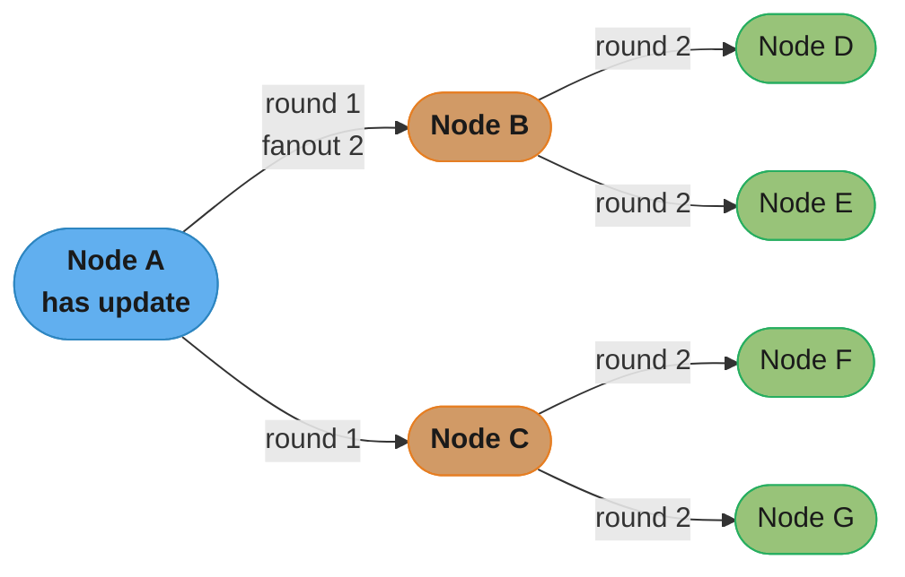

Caption: gossip's constant per-node fanout makes the infected set roughly double each round, so an
update reaches all N nodes in `O(log N)` rounds with no node being critical — the scalability and
fault-tolerance that reliable broadcast's `O(N²)` re-broadcast cannot match.

### CRDTs (Conflict-free Replicated Data Types)

CRDTs are data structures that replicas can update **independently and concurrently, with no
coordination**, and still be **guaranteed to converge** to the same state once they have seen the
same updates — a property called **strong eventual consistency** (replicas that received the same
set of updates are in identical states, regardless of order or duplication). Two flavours:

- **Operation-based (CmRDT)** — replicas broadcast the **operations** themselves; each replica
  applies incoming ops locally. For convergence the operations must be **commutative** (applying
  them in any order yields the same result), and the delivery layer must be **reliable and
  exactly-once** (usually causal broadcast) — because a lost or duplicated op would break
  convergence.
- **State-based (CvRDT)** — replicas periodically exchange their **full state** and **merge** it
  with a **merge function**. Convergence is guaranteed if the states form a **join-semilattice** and
  the merge function is the **least upper bound (LUB)** — meaning merge is **commutative,
  associative, and idempotent**. Those three algebraic properties make the result independent of
  message **order, batching, and duplication**, so state-based CRDTs tolerate an unreliable network
  (a re-delivered or reordered state merges harmlessly). The cost is shipping whole states (mitigated
  by delta-CRDTs).

The join-semilattice intuition: think of each replica's state as a point in a partial order where
any two points have a well-defined *least upper bound* (the smallest state ≥ both). Merging always
moves **up** the lattice to that LUB, monotonically — so merges never "undo" and always converge to
the same top point.

Concrete registers show the design tension:

- **LWW-register (Last-Writer-Wins)** — each write carries a timestamp; merge keeps the value with
  the **higher timestamp**. Simple and always converges, but **silently discards** the "losing"
  concurrent write — a **lost-update** risk when two clients write different values concurrently
  (and if clocks disagree, the "winner" is essentially arbitrary).
- **Multi-value register (MV-register)** — instead of picking a winner, it uses **vector clocks**
  (§2.3) to detect concurrency and **keeps all concurrent values**, exposing the conflict to the
  application to resolve (as Dynamo's shopping cart does by merging carts). It loses no updates but
  pushes conflict resolution up to the app.

Example CRDTs: **G-Counter** (grow-only counter, per-replica sub-counters merged by max, summed),
**PN-Counter** (increment/decrement via two G-Counters), **G-Set** / **OR-Set** (sets that handle
concurrent add/remove).

The **G-Counter** is the cleanest illustration of *why* the semilattice properties matter. Instead
of one shared integer (which would need coordination to increment safely), each replica keeps a
**vector of per-replica counts** and only ever increments **its own** entry; the counter's value is
the **sum** of the vector, and merge is the **element-wise max**:

```
3 replicas A, B, C.  State = [countA, countB, countC].  value = sum.

A increments twice, B increments once, before any sync:
   A: [2,0,0]      B: [0,1,0]      C: [0,0,0]

A and B exchange state and merge (element-wise max):
   merge([2,0,0],[0,1,0]) = [2,1,0]   value = 3   (on both A and B)

C later receives A's OLD [2,0,0] AGAIN (duplicate) and B's [0,1,0]:
   merge(merge([0,0,0],[2,0,0]),[0,1,0]) = [2,1,0]   value = 3   (same!)

Order does not matter (commutative), grouping does not matter (associative),
re-delivery does not matter (idempotent: max([2,1,0],[2,0,0]) = [2,1,0]).
```

Because each replica owns its own slot, two concurrent increments can never clobber each other (they
land in different vector entries), and element-wise max is the least upper bound of the semilattice —
so replicas converge to the identical vector no matter the message order, batching, or duplication.
A **PN-Counter** just pairs two G-Counters (one for increments, one for decrements) and subtracts,
because a single grow-only counter cannot decrement monotonically.

### Dynamo-style stores

Amazon's **Dynamo** popularized **leaderless replication** with tunable quorums — an AP design
(§2.5). Each key is replicated to **N** nodes. Reads and writes use quorums:

- A write must be acknowledged by **W** replicas; a read must gather responses from **R** replicas.
- If **W + R > N**, the read quorum and write quorum are guaranteed to **overlap** in at least one
  node — so a read is guaranteed to see at least one replica that has the latest write (strong-ish
  "quorum consistency"). Common setting: N=3, W=2, R=2.

**Stated plainly.** "Make the number of replicas you write to plus the number you read from add up
to more than the total, and the two sets cannot avoid sharing a node — and that shared node is
holding your latest write."

| Symbol | What it is |
|--------|------------|
| `N` | Replicas holding each key |
| `W` | Replicas that must acknowledge a write before it counts as done |
| `R` | Replicas a read must gather responses from |
| `W + R > N` | Pigeonhole condition: two subsets of `N` summing to more than `N` must intersect |
| `N - W` / `N - R` | Nodes that may be down while writes / reads still succeed |

**Walk one example.** N = 3, with every setting worth naming:

```
   W   R   W+R   overlaps?    write survives    read survives
   1   1    2       no          2 down            2 down     fastest, no recency
   1   2    3       no          2 down            1 down     still stale-prone
   2   2    4      yes          1 down            1 down     <- the Dynamo default
   3   1    4      yes          0 down            2 down     read-optimized
   1   3    4      yes          2 down            0 down     write-optimized
   3   3    6      yes          0 down            0 down     zero fault tolerance
```

**Why W = R = 2 is the setting everyone lands on.** It is the only row that satisfies `W + R > N`
*and* keeps a spare on both paths — one replica can be down and reads and writes both still succeed.
Push `W` to 3 and a single node failure stops all writes; drop to `W = R = 1` and you have the
fastest possible store with no recency guarantee whatsoever. One caveat the inequality does not
cover: `W + R > N` guarantees your read **touches** a replica holding the newest value, not that the
reader can **tell which returned value is newest** — deciding that is the separate job of version
vectors (§2.3) or a last-write-wins rule.

Because it favours availability, Dynamo softens the quorum under failure:

- **Sloppy quorum + hinted handoff.** During a partition, if the "home" nodes for a key are
  unreachable, the write is accepted by **any** N reachable healthy nodes instead of blocking. A node
  that took a write on behalf of an unreachable home node holds it as a **hint** and **forwards it
  later** (hinted handoff) when the home node recovers. This keeps writes available during failures
  at the cost of temporarily storing data on the "wrong" nodes.
- **Read repair.** When a read gathers replicas and notices some are **stale**, it writes the latest
  value back to the stale ones opportunistically — repairing divergence on the read path.
- **Anti-entropy with Merkle trees.** A background process compares replicas and syncs differences.
  To avoid comparing every key, replicas build a **Merkle tree** (a hash tree over key ranges) and
  exchange **root/subtree hashes**: matching hashes mean the range is identical (skip it), and they
  descend only into subtrees whose hashes differ — locating the divergent keys with **logarithmic**
  comparison instead of scanning everything. The tree structure that makes this cheap:

```
              root = H(H_L, H_R)          two replicas compare roots first
             /                  \         if roots match -> identical, done
        H_L = H(h1,h2)      H_R = H(h3,h4)   if differ, descend only the differing side
        /        \          /        \
     h1=H(k0..)  h2=H(..)  h3=H(..)  h4=H(k7..)   leaves hash disjoint key ranges

  Replicas differ in ONE key under h3:
    root differs -> compare H_L (match, skip whole left half) and H_R (differ)
    -> descend H_R -> h3 differs (h4 matches, skip) -> sync only h3's key range
  A single-key difference costs O(log N) hash comparisons, not an O(N) full scan.
```

  Caption: the Merkle tree turns "which keys diverged?" into a logarithmic walk — equal subtree
  hashes prune whole ranges from consideration, so replicas exchange a handful of hashes to pinpoint
  the few differing keys rather than streaming their entire datasets to each other.

Conflicts (concurrent writes to the same key) are detected with **vector clocks** and resolved by
LWW or by handing the concurrent versions to the application (MV-register style).

### CALM theorem

The **CALM theorem** (Consistency As Logical Monotonicity) answers the question "**when can I skip
coordination entirely?**" precisely: a program can be computed in a **coordination-free**,
**eventually-consistent** way **if and only if it is monotonic**. A computation is **monotonic** if
adding more inputs only ever **adds to** the output and never **retracts** a prior conclusion — the
output grows monotonically with the input. Monotonic programs are guaranteed to converge to the same
result regardless of message order, delay, or duplication (which is exactly what happens under weak
consistency), so they need **no coordination**.

- **Monotonic** (coordination-free): accumulating into a set (grow-only), computing a maximum,
  deriving facts that are never withdrawn — "the answer only gets more complete."
- **Non-monotonic** (needs coordination): anything requiring **negation or a "final" count** — e.g.
  "the set is *complete*, so its size is exactly K," deletions, or "no record matches, therefore
  reject." These require knowing you have seen *all* the input, which under weak consistency you can
  never be sure of — hence coordination.

CALM turns "should I coordinate?" from a gut call into a property you can check: express the logic
monotonically and you earn coordination-freedom for free; if it's inherently non-monotonic, you must
pay for coordination.

### Causal consistency

Between eventual and strong sits **causal consistency**: it guarantees that operations related by
**happened-before** (§2.3) are seen by everyone in that **causal order**, while operations that are
**concurrent** may be seen in **different orders** by different replicas. Concretely, if you post a
question and then post an answer (the answer causally depends on the question), no one ever sees the
answer without the question — but two independent comments may appear in different orders to
different users, and that's fine.

Its profound property: **causal consistency is the strongest consistency model that can be provided
in an always-available system under network partitions.** You cannot have linearizability *and*
availability under a partition (CAP), but you *can* have causal consistency and availability — it is
the ceiling of what a partition-tolerant, always-on system can guarantee. Systems like **COPS**
achieve it by tracking each operation's **causal dependencies** (via vector clocks / dependency
lists) and delaying an operation's visibility on a replica until all its dependencies have arrived.
This is why causal consistency is prized: it delivers intuitive ordering (no effect-before-cause
anomalies) without giving up availability.

### Practical: choosing your point on the coordination spectrum

The chapter's synthesis: coordination is not all-or-nothing, and the choice is **per-operation**, not
per-system. Push each operation as far toward the coordination-free end as its correctness permits —
use CRDTs and monotonic (CALM) logic where you can, causal consistency for ordering-sensitive-but-
available features, quorum tuning for the rest, and reserve full consensus for the genuinely
strongly-consistent operations (locks, uniqueness, financial invariants). The art is spending
coordination only where correctness truly demands it, so most of the system stays fast and available.

A practical decision ladder for a single operation, cheapest first:

1. **Is it monotonic (CALM)?** Adding a fact to a grow-only set, taking a max, deriving a
   never-retracted conclusion → coordination-free, model it as a CRDT and you are done.
2. **Does it commute or have a natural conflict resolution?** Counters, add/remove sets → a CRDT
   (G/PN-counter, OR-set) still avoids coordination; accept that concurrent updates merge rather than
   serialize.
3. **Does it only need cause-before-effect ordering, not recency?** Comments-under-posts, feeds →
   **causal consistency**, the strongest model that stays available under partition.
4. **Does it need read-your-writes / quorum recency but can tolerate rare conflicts?** →
   **Dynamo-style quorum** (`W + R > N`) with app-level or LWW conflict resolution.
5. **Does it enforce a global invariant, uniqueness, or a lock?** (money, "exactly one leader",
   "unique username") → you genuinely need **consensus / linearizability**; pay for it, but scope it
   as narrowly as possible (one key, one shard) so it doesn't become the whole system's bottleneck.

Most operations in a real system fall into rungs 1–4; only a minority truly need rung 5, and pushing
each operation to the lowest rung it can tolerate is exactly how you keep a distributed system both
correct *and* fast.

---

## 2.7 Transactions (Ch 12)

Transactions are the database's own coordination mechanism — the tool that lets an application group
multiple reads and writes into one unit that either wholly happens or wholly doesn't, and pretend
concurrent transactions ran alone. This chapter covers the **ACID** guarantees, the **isolation**
ladder (and the anomalies each rung permits), the **atomic-commit** machinery — locally the **WAL**,
across nodes the blocking **two-phase commit (2PC)** — and finally **NewSQL** (Spanner, CockroachDB)
which marries consensus replication with 2PC and clever clocks. (This is the Vitillo telling; the
[DDIA Chapter 7](../../designing_data_intensive_applications/07_transactions/README.md) treatment is
the deeper dive on isolation levels and serializability, cross-linked below — here we summarize
rather than duplicate it.)

### ACID recap

A transaction offers four properties:

- **Atomicity** — all of the transaction's writes apply, or **none** do. On any failure the
  transaction **aborts** and its partial writes are discarded, so it is safe to retry. (Atomicity is
  about abortability, not concurrency.)
- **Consistency** — the transaction moves the database from one valid state to another, preserving
  application **invariants**. As DDIA notes, this "C" is mostly the **application's** responsibility
  (the database only enforces the constraints you declare).
- **Isolation** — concurrently executing transactions do not interfere; the strongest form,
  **serializability**, makes the outcome equal to *some* one-at-a-time serial execution.
- **Durability** — once **committed**, data survives crashes (persisted to non-volatile storage,
  typically via a log, and/or replicated).

### Isolation: anomalies and levels

Weaker isolation is faster but permits **anomalies** — concurrency bugs. The anomalies, roughly in
order of severity:

- **Dirty write** — overwriting another transaction's *uncommitted* write.
- **Dirty read** — reading another transaction's *uncommitted* write (which may be rolled back).
- **Fuzzy / non-repeatable read (read skew)** — reading the same row twice in one transaction and
  getting different values because another transaction committed in between.
- **Phantom read** — a transaction re-runs a *query* and the result set changes (rows appear or
  disappear) because another transaction inserted/deleted matching rows.
- **Lost update** — two transactions read-modify-write the same object; the second write clobbers the
  first, silently losing an update. Worked trace of a counter going from 10 to a *wrong* 11 instead
  of the correct 12:

  ```
  T1: read counter -> 10        T2: read counter -> 10     (both read the same old value)
  T1: compute 10 + 1 = 11       T2: compute 10 + 1 = 11
  T1: write 11                  T2: write 11               (T2 clobbers T1)
  final = 11    (should be 12 — one increment vanished)
  ```

  Remedies: an atomic write (`UPDATE ... SET counter = counter + 1`) that does the read-modify-write
  under a lock, `SELECT ... FOR UPDATE`, compare-and-set (`UPDATE ... WHERE counter = 10`), or a
  database that automatically detects the lost update and aborts the loser.
- **Write skew** — two transactions read the same set of rows, then each writes *different* rows
  based on that read, and the combination violates an invariant each individually preserved (the
  on-call-doctor example). The subtlest anomaly.

The **isolation-level ladder**, weakest to strongest, each rung blocking more anomalies:

| Level | Blocks | Still allows |
|-------|--------|--------------|
| Read uncommitted | (nothing meaningful) | dirty read/write and everything above |
| Read committed | dirty read, dirty write | read skew, lost update, phantom, write skew |
| Repeatable read / Snapshot isolation | + read skew | lost update*, phantom, **write skew** |
| Serializable | + everything | nothing |

*many SI implementations add automatic lost-update detection.

**Concurrency control** — how isolation is enforced:

- **Pessimistic — Two-Phase Locking (2PL).** Transactions acquire **shared** (read) and
  **exclusive** (write) locks and hold them until commit. "Two-phase" = a **growing** phase
  (acquire locks) followed by a **shrinking** phase (release all at end). Readers block writers and
  writers block readers → strong isolation but **low concurrency** and **deadlocks** (mutual
  waits), which force aborts and retries.
- **Optimistic — Optimistic Concurrency Control (OCC).** Let transactions run without locking, then
  **validate at commit**: if a conflict is detected (another transaction wrote data you read), abort
  and retry. Great when conflicts are **rare**, wasteful when they're common.
- **MVCC and Snapshot Isolation.** Multi-Version Concurrency Control keeps **multiple timestamped
  versions** of each object; a transaction reads from a **consistent snapshot** (the versions
  committed as of its start), so **readers never block writers and writers never block readers**.
  **Snapshot isolation (SI)** is built on MVCC and is extremely popular — but here is the crucial
  gotcha:

**SI ≠ serializable: it permits write skew.** Snapshot isolation gives each transaction a private,
consistent snapshot, which prevents dirty/fuzzy reads and read skew — but two transactions can each
read the *same* snapshot, each check an invariant, then each write *different* rows, and both commit
while together violating the invariant. Both saw a valid snapshot; neither overwrote the other's row
(so it isn't a lost update); yet the result is corrupt. The canonical case: two on-call doctors both
read "2 doctors on call, safe to leave," each removes *themselves*, and the ward ends with **zero**
doctors on call. SI does not catch this because the writes touch different rows and each transaction's
snapshot looked fine. Only **serializable** isolation (via 2PL, or **Serializable Snapshot Isolation
(SSI)** — SI plus commit-time conflict detection that aborts one of the offenders) prevents write
skew. Do not assume a store labelled "snapshot isolation" or even "repeatable read" is serializable —
verify.

The anomaly-by-level matrix, kept as an alignment-critical ASCII grid:

```
Anomaly              | Read Committed | Snapshot Isolation | Serializable
---------------------+----------------+--------------------+-------------
Dirty write          |   prevented    |     prevented      |  prevented
Dirty read           |   prevented    |     prevented      |  prevented
Read skew (fuzzy)    |    ALLOWED     |     prevented      |  prevented
Lost update          |    ALLOWED     |    ALLOWED (*)     |  prevented
Phantom read         |    ALLOWED     |     ALLOWED        |  prevented
Write skew           |    ALLOWED     |     ALLOWED        |  prevented
---------------------+----------------+--------------------+-------------
(*) some SI engines add automatic lost-update detection.
The two ALLOWED cells that bite in production: write skew and phantoms under SI.
```

Caption: read down a column to see exactly which anomalies a level lets through — the interview tell
is that snapshot isolation still permits **write skew** and **phantoms**, which is why "SI is not
serializable" and why booking/invariant logic needs serializable isolation or explicit locking.

### Atomicity: WAL locally, 2PC across nodes

**Locally — the write-ahead log (WAL / redo log).** A single node achieves atomicity and durability
by writing every intended change to an append-only **log on disk before applying it** to the actual
data pages ("write-ahead" = the log record is durable *before* the page mutation is visible). On
commit, the commit record is flushed; on crash-recovery, the engine **replays** the log to redo
committed changes (and discard/undo uncommitted ones), so a transaction is all-or-nothing across a
crash. The log is the source of truth for recovery. The broken-vs-fixed contrast:

```
BROKEN — mutate data pages first, log after (or not at all):
   1. overwrite page with new value        <- data now half-changed on disk
   2. CRASH before the second page written  -> torn, inconsistent state, no way to undo

FIXED — write-ahead logging:
   1. append {txn 7: set X 5, set Y 9} to the log, fsync   <- durable intent
   2. append {txn 7: COMMIT}, fsync                        <- commit point
   3. lazily apply to data pages (can happen after ack)
   On crash after step 2: replay the log -> redo txn 7 fully (it was committed).
   On crash before step 2: txn 7 has no COMMIT record -> discard its partial effects.
```

The commit record is the atomic switch: a transaction is committed **iff** its commit record made it
to durable storage, and recovery uses that single fact to decide redo-or-discard for every
transaction — turning a multi-page mutation into an all-or-nothing operation. (The same log doubles
as the replication stream in §2.5 — Raft *is* a replicated WAL.)

**Across nodes — distributed atomic commit and two-phase commit (2PC).** When one transaction spans
**multiple nodes/partitions**, each node can locally commit or abort, but they must all reach the
**same** decision atomically (all commit or all abort) — a single node committing while another
aborts corrupts the data. **2PC** coordinates this with a **coordinator** and the participants:

1. **Phase 1 — Prepare (voting).** The coordinator asks every participant "can you commit?" Each
   participant does all the work, **durably writes** enough to guarantee it *could* commit (locks
   held, changes logged), and **votes** "yes" (prepared) or "no."
2. **Phase 2 — Commit / Abort (decision).** If **all** voted yes, the coordinator durably records
   "commit" and tells everyone to commit; if **any** voted no (or timed out), it tells everyone to
   abort. Participants act on the decision and release locks.

**The uncertainty window and blocking — the fatal flaw.** Once a participant has voted **yes** in
phase 1, it has surrendered its autonomy: it may **not** unilaterally commit *or* abort — it must
**wait** for the coordinator's decision, holding its locks. If the **coordinator crashes** after
collecting votes but **before** delivering the phase-2 decision, every prepared participant is
**stuck**: it cannot safely commit (maybe someone voted no) and cannot safely abort (maybe everyone
voted yes and others already committed). This is the **blocking** property — **2PC is a blocking
protocol**, and the coordinator is a **single point of failure**. The prepared participants stay
blocked, holding locks (freezing rows), until the coordinator recovers and reads its **decision log**
to resume. Hence the mantra: **2PC guarantees atomicity but sacrifices availability — 2PC ≠
availability.** (This blocking is *why* Chapter 13 exists — asynchronous transactions exist to escape
it.)

**Put simply.** "Every participant has to be up at commit time, so the transaction's availability is
all of their individual availabilities multiplied together — and multiplying numbers below 1 only
ever moves in one direction."

| Symbol | What it is |
|--------|------------|
| `a` | One participant's availability — the fraction of time it is up and answering |
| `n` | Participants enrolled in the transaction |
| `a^n` | Joint availability: the chance *all* `n` are reachable when the coordinator calls prepare |
| blocking window | Extra unavailability while prepared participants hold locks awaiting a decision |

**Walk one example.** Participants that are each individually excellent, at 99.9%:

```
   n participants      joint = 0.999^n       downtime per year
         1                 99.9000%              525.6 min
         2                 99.8001%            1,050.7 min
         3                 99.7003%            1,575.2 min
         5                 99.5010%            2,622.7 min
        10                 99.0045%            5,232.4 min

  the same shape with more ordinary 99% participants
         3                 97.0299%           15,610.8 min
        10                 90.4382%           50,256.8 min
```

**Why this compounds worse than the table shows.** Enrolling participants is not additive risk, it
is multiplicative: ten services that are each 99.9% available become a **99.0%** transaction — an
entire nine lost, 5,232 minutes (about 87 hours) of failure per year. And that figure only counts
"somebody was already down at prepare time." The blocking window sits on top of it: a coordinator
that dies after collecting votes does not merely fail the transaction, it **freezes every prepared
participant's locks** until the coordinator recovers, so the outage is bounded by the *coordinator's*
recovery rather than any participant's. Multiply a shrinking availability by an unbounded blocking
tail and you have the quantitative case for pushing cross-service work to sagas (§2.8).

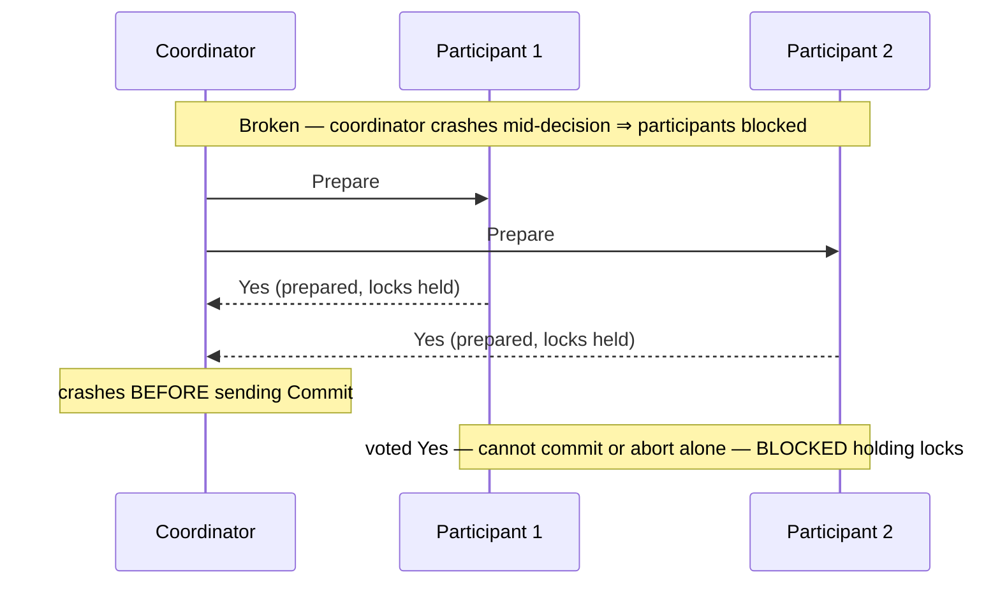

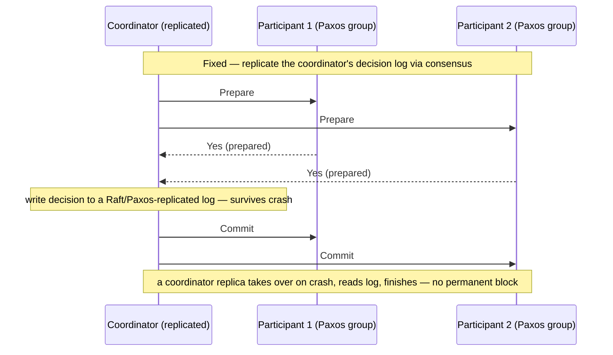

Caption: vanilla 2PC blocks because a single-node coordinator that dies after Prepare leaves
prepared participants unable to decide; the production fix is to make the coordinator **itself**
fault-tolerant by replicating its decision log through consensus (Raft/Paxos), so a replacement
coordinator can read the log and drive the transaction to completion — which is precisely Spanner's
architecture.

### NewSQL: Spanner and CockroachDB

**NewSQL** systems deliver ACID transactions with **serializability** *and* horizontal scale by
combining the tools of this whole part. **Google Spanner**:

- **Shards** data into partitions; **each partition is replicated by Paxos** across zones/regions (a
  consensus group — §2.5). This makes each participant **highly available**, dodging 2PC's
  single-node-coordinator problem — the coordinator and participants are themselves replicated
  groups, not lone nodes.
- **Cross-partition transactions use 2PC** *on top of* those Paxos groups. Because every 2PC
  role is a fault-tolerant Paxos group whose decision log is replicated, a crash no longer blocks
  forever — a replica takes over (the "fix" diagram above).
- **TrueTime for external consistency.** Spanner deploys GPS + atomic clocks and exposes **TrueTime**,
  an API that returns a time **interval** `[earliest, latest]` with a **bounded uncertainty** rather
  than a single instant. To guarantee **external consistency** (linearizability over the *whole*
  database — if T1 commits before T2 starts in real time, T1's timestamp is smaller), Spanner does a
  **commit wait**: after picking a commit timestamp it **waits out the uncertainty interval** (a few
  ms) before releasing locks, ensuring no other transaction can commit with an overlapping-yet-earlier
  timestamp. It spends latency (the wait) to buy globally-consistent ordering from imperfect clocks.
- **CockroachDB** achieves a similar goal **without special hardware** by using **Hybrid Logical
  Clocks (HLC)** — a clock combining physical time with a logical (Lamport-style) counter — to order
  transactions and detect uncertainty, trading Spanner's tight TrueTime bounds (and occasional
  restarts on clock uncertainty) for commodity-hardware deployability. The HLC gives each event a
  timestamp that is close to physical time yet also respects happened-before (like a Lamport clock),
  so causally-related transactions are correctly ordered even when the underlying wall clocks are
  loosely synchronized; the price is a larger uncertainty window than TrueTime's few milliseconds,
  which surfaces as occasional read restarts under contention rather than the hardware cost Spanner
  pays.

Spanner is the archetype **PC/EC** system (PACELC): consistent under partition (sacrificing minority
availability) and consistent-over-latency in normal running (paying the commit-wait tax). The deeper
lesson of NewSQL is that it is not a *new* idea but a **composition** of everything in this part:
consensus (§2.5) makes each partition a fault-tolerant unit, 2PC (§2.7) glues partitions into one
atomic transaction, and a carefully-bounded clock (§2.3) supplies the global ordering — so the "CA is
impossible" and "2PC blocks" limitations are not repealed but *engineered around* by stacking the
right primitives. That composability is the payoff of understanding each piece on its own.

---

## 2.8 Asynchronous Transactions (Ch 13)

2PC (§2.7) gives cross-node atomicity but is **blocking**, requires **all participants available
simultaneously**, and needs every participant to **trust and support** the coordinator's protocol.
Across **heterogeneous systems** (a SQL database, a message broker, a third-party payment API) and
especially across **organizational boundaries**, those requirements collapse: a third-party service
won't join your 2PC, you can't hold its locks, and blocking on a partner's coordinator is
unacceptable. The alternative is **asynchronous transactions** — give up immediate isolation and
strong consistency, embrace eventual consistency, and coordinate through **durable messages** and
**compensation** instead of locks. This chapter covers the two workhorses: the **outbox pattern** and
**sagas**.

### Why 2PC across systems fails

- **Blocking** — 2PC's uncertainty window (§2.7) freezes prepared participants if the coordinator
  stalls; a slow or unreachable partner would hold your locks indefinitely.
- **Availability coupling** — 2PC needs *every* participant up at commit time; the transaction's
  availability is the **product** of all participants' availabilities, which degrades fast as you add
  systems.
- **Heterogeneity and trust** — message brokers, caches, external APIs, and other organizations'
  services generally **do not implement** an interoperable 2PC (XA) protocol, and no one wants a
  foreign coordinator holding locks in their system.

So instead of one synchronous atomic transaction, you **decompose** the work into a sequence of
**local** transactions glued together by **asynchronous, durable messaging** and, where needed,
**compensations**.

### The outbox pattern

The **dual-write problem**: a service often needs to **atomically** "update its database **and**
publish an event" (e.g. save an order *and* emit `OrderPlaced` to a broker). But the database and the
broker are two separate systems — you cannot commit both atomically, and if you write the DB then
crash before publishing (or vice-versa), they diverge: an order exists with no event, or an event
fires for an order that rolled back.

**The fix — an outbox table.** Within the **single local database transaction**, write **both** the
business change **and** a row into an **outbox** table describing the event. Because they are in one
local transaction, they commit **atomically** — either both land or neither does. A separate **relay
(message relay / dispatcher)** process then reads unsent rows from the outbox and **publishes** them
to the broker, marking each as sent (or, more robustly, tails the DB's change log via **CDC** so it
never misses one). Because the outbox row is guaranteed to exist whenever the business change
committed, the event is guaranteed to be published **at-least-once**. The catch: the relay may
publish a message, crash before marking it sent, and publish it **again** on restart — so **consumers
must be idempotent / de-duplicate** (exactly-once delivery is impossible; exactly-once *processing*
via dedup is the achievable goal, per Part I).

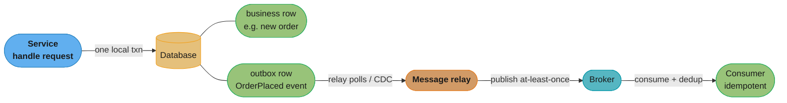

Caption: the outbox turns the un-atomic "write DB and publish event" into a single atomic local
transaction (business row + outbox row commit together) followed by an at-least-once relay — so an
event is never lost or emitted for a rolled-back change, at the price of possible duplicates the
consumer must dedup.

### Sagas

A **saga** implements a **business transaction that spans multiple services** as a **sequence of
local transactions** `T1, T2, …, Tn`, where each `Ti` has a **compensating transaction** `Ci` that
**semantically undoes** its effect. The saga runs the `Ti` forward; if some step `Tk` **fails**, it
runs the compensations `Ck-1, …, C1` **in reverse** to unwind the completed steps — the saga's answer
to "rollback" without distributed locks.

- **Compensations are semantic, not physical.** You cannot "un-charge" a card by deleting a log row;
  you issue a **refund**. Compensation is a *new* forward action that counteracts the original, which
  means intermediate effects were briefly real and visible.
- **Orchestration.** A central **orchestrator** — implemented as a **persistent state machine**
  (backed by a durable store / the outbox pattern so it survives crashes) — drives the saga: it
  invokes each step, records progress, and on failure invokes the compensations in order. The
  alternative, **choreography**, has each service react to another's events and emit its own, with no
  central coordinator. The tradeoff: choreography is loosely coupled and has no single bottleneck,
  but the saga's control flow is *implicit* — scattered across event handlers, hard to see, hard to
  monitor, and prone to cyclic event dependencies as it grows. Orchestration centralizes the flow
  into one explicit state machine that is easy to reason about, monitor, and change — at the cost of
  the orchestrator being a component you must keep highly available (itself typically backed by
  consensus/durable storage). For complex sagas with many steps and compensations, orchestration is
  usually preferred precisely because the flow is visible in one place.
- **At-least-once steps ⟹ idempotency.** The orchestrator retries steps that fail or time out (it
  can't tell "failed" from "slow" — §2.2), so every step and every compensation may run **more than
  once** and **must be idempotent** (charging a card twice for one saga step is a real bug). Steps
  are typically dispatched via durable messaging (outbox) so a crashed orchestrator resumes exactly
  where it left off.

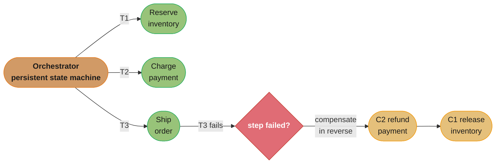

Caption: a saga sequences local transactions and, on a failure partway, runs compensations in
reverse to semantically undo the completed steps — the orchestrator's durable state machine plus
idempotent, at-least-once steps replace 2PC's locks-and-blocking with eventual consistency.

A concrete order-fulfillment saga makes the step/compensation pairing and the "semantic undo"
character explicit:

| # | Forward step `Ti` | Compensation `Ci` | Note |
|---|-------------------|-------------------|------|
| 1 | Reserve inventory | Release inventory | compensation frees the reserved stock |
| 2 | Charge payment | **Refund** payment | not a rollback — a new refund transaction |
| 3 | Allocate shipment | Cancel shipment | may itself require calling a carrier API |
| 4 | Send confirmation email | (no compensation) | can't un-send — put irreversible steps LAST |

If step 3 fails, the orchestrator runs `C2` (refund) then `C1` (release inventory) in reverse. Two
design rules fall out of the table: **irreversible steps go last** (once the confirmation email is
sent there is no compensation, so you only send it after every reversible step has succeeded), and
**every step and compensation must be idempotent** because the orchestrator retries anything it
can't confirm — a refund applied twice, or an inventory release run twice, must be harmless.

### Isolation: sagas = ACD without I

The defining limitation, and a favourite interview point: **a saga provides Atomicity (eventually —
via compensation), Consistency, and Durability, but NOT Isolation** — sagas are **ACD without the
I**. Because each step commits its **local** transaction immediately, the saga's **intermediate
state is visible** to other concurrent transactions *before* the whole saga finishes. Another
transaction can read a half-completed saga's data (a **dirty read** across the saga), or update data
the saga is midway through (leading to **lost updates** or a compensation that no longer makes sense).

Countermeasures (the book's toolkit) recover *some* isolation without global locking:

- **Semantic lock** — mark a record as **"pending" / in-progress** (an application-level flag) so
  other transactions know its value is provisional and either wait or handle it specially; the
  saga's final step or compensation clears the flag. (E.g. an order in `PENDING` state that other
  flows treat cautiously.)
- **Commutative updates** — design step operations to commute (e.g. increment/decrement rather than
  set), so interleaving with another transaction's update produces the correct result regardless of
  order.
- **Re-reads / pessimistic view / reordering** — re-read data before acting to detect changes since
  the saga started; reorder saga steps so the riskiest (hardest-to-compensate) step runs last; or use
  a pessimistic ordering that reduces the anomaly window.

The essential trade of the whole chapter: asynchronous transactions swap **immediate isolation and
strong consistency** for **availability, loose coupling, and cross-organization workability** —
accepting eventual consistency, at-least-once/idempotent steps, and the burden of hand-managing the
isolation you gave up.

---

## Visual Intuition

The two hardest ideas in this part are (1) that **majority quorums make consensus safe** and (2)
that **the consistency you choose is a direct trade against availability and latency**. The diagrams
below isolate those.

**Why majorities work — quorum overlap.** Any two majorities of an N-node cluster must share at
least one node; that shared node is the referee that prevents contradictions (two leaders in a term,
two committed values). The ASCII shows it for N=5:

```
N = 5 nodes.  Majority = 3.

  nodes:     n1  n2  n3  n4  n5

  quorum A:  [n1  n2  n3]              (e.g. voted for leader X)
  quorum B:          [n3  n4  n5]      (e.g. voted for leader Y)
                      ^
                      +-- n3 is in BOTH quorums

  n3 votes at most ONCE per term  =>  A and B cannot both be majorities
                                       for DIFFERENT leaders in the same term
  => at most ONE leader per term ; at most ONE committed value.

  This overlap is the ENTIRE reason quorum-based consensus is safe.
  W + R > N (Dynamo) is the same trick: the read set overlaps the write set.
```

Caption: majority overlap is the single mechanical fact behind Raft leadership safety, log-commit
safety, *and* Dynamo's `W + R > N` read-your-writes — any two majorities intersect, and the shared
node cannot vote two ways, so contradictions are impossible.

**The price ladder.** Reading the consistency spectrum (§2.5) together with CAP/PACELC (§2.5): each
step toward stronger consistency costs coordination, which costs latency always and availability
under partition. The `xychart` makes the price concrete as relative per-operation coordination cost:

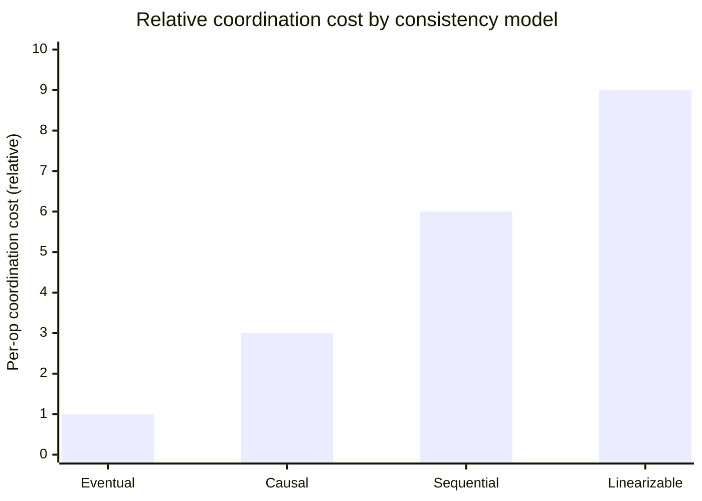

Caption: coordination cost climbs steeply as you strengthen the model — eventual consistency needs
essentially none (write locally, converge later), while linearizability needs a quorum round-trip
(or leader-lease confirmation) on the critical path of every operation, which is the latency and
availability you are buying.

---

## Key Concepts Glossary

- **System model** — the explicit assumptions (link, process, timing) an algorithm's guarantees
  depend on; a guarantee holds only under its model.
- **Fair-loss link** — messages may be lost/duplicated/delayed, but infinite retransmission
  eventually delivers.
- **Reliable link** — exactly-once, no loss/dup; built on fair-loss with retransmit + dedup.
- **Authenticated reliable link** — reliable link plus verified sender identity.
- **Crash-stop (fail-stop)** — a process fails and never recovers.
- **Crash-recovery** — a process can crash and recover, losing volatile state but keeping stable
  storage.
- **Byzantine** — a process may behave arbitrarily or maliciously; needs BFT (≈3f+1 replicas).
- **Synchronous model** — known bounds on message delay and step time; enables perfect failure
  detection.
- **Asynchronous model** — no timing bounds; perfect failure detection and guaranteed consensus are
  impossible (FLP).
- **Partially synchronous model** — asynchronous most of the time, synchronous often enough; the
  realistic model most algorithms assume.
- **Failure detector** — a component that suspects failed processes; over timeouts it is inherently
  unreliable.
- **Ping** — monitor actively probes the peer and times the response.
- **Heartbeat** — peer periodically pushes "alive"; monitor watches for gaps.
- **False positive / false negative** — flagging a healthy process dead / failing to detect a dead
  one; tuned by the timeout.
- **Perfect failure detection** — impossible in an asynchronous network (can't distinguish slow from
  dead).
- **Clock drift** — a quartz clock running fast/slow, diverging from real time.
- **NTP** — Network Time Protocol; syncs clocks to a reference and can jump time forward or backward.
- **Wall-clock (time-of-day)** — human-meaningful time, subject to jumps; use for timestamps, never
  durations.
- **Monotonic clock** — only-forward counter with no absolute meaning; use for measuring durations.
- **TrueTime** — Spanner's clock API returning an interval `[earliest, latest]` with bounded
  uncertainty.
- **Happened-before (`→`)** — Lamport's causal ordering; `a → b` means a could have caused b.
- **Concurrent (`∥`)** — neither event happened-before the other.
- **Lamport clock** — scalar per-process counter; `a → b ⟹ L(a) < L(b)` (one-way only).
- **Vector clock** — per-process vector; detects both causality and concurrency; `O(N)` cost.
- **Term (Raft)** — a monotonically increasing leadership epoch; ≤ 1 leader per term.
- **Follower / candidate / leader** — the three Raft server states.
- **Election timeout** — time a follower waits for a heartbeat before starting an election;
  randomized to avoid split votes.
- **RequestVote** — Raft RPC by which a candidate solicits votes.
- **Majority quorum** — more than N/2; two majorities always overlap, ensuring uniqueness.
- **Split vote** — no candidate gets a majority; fixed by randomized timeouts.
- **Lease** — a lock with a TTL the holder must renew; basis of leader election in coordination
  services.
- **Lease-expiry race** — a paused old leader wakes still believing it holds the lease while a new
  leader exists → two leaders / split-brain.
- **Fencing token** — a monotonically increasing number issued with each lease; the resource rejects
  writes carrying a stale token, killing split-brain.
- **Coordination service** — etcd/ZooKeeper/Consul/Chubby; provides consensus-backed primitives so
  you don't build them.
- **State-machine replication (SMR)** — run identical deterministic state machines on replicas fed
  the same ordered command sequence.
- **AppendEntries** — Raft RPC replicating log entries and heartbeats.
- **Log Matching Property** — same index+term entry ⟹ identical preceding logs; enforced by
  prevIndex/prevTerm checks.
- **Commit index** — the highest log entry known committed (persisted by a majority).
- **Consensus** — processes agree on one value; properties: agreement, validity, termination.
- **Linearizability (strong consistency)** — single up-to-date copy; operations take effect atomically
  in real-time order.
- **Read barrier / leader lease** — mechanisms letting a Raft leader serve linearizable reads
  (confirm leadership via majority round, or hold a time-bounded lease).
- **Sequential consistency** — per-process order preserved within some global total order, not tied
  to real time.
- **Eventual consistency** — replicas converge if writes stop; stale reads allowed.
- **CAP theorem** — under a partition, choose consistency or availability.
- **"CA" is not real** — partitions are unavoidable, so you never escape the P branch; only CP or AP.
- **PACELC** — if Partition then A-or-C; Else, Latency-or-Consistency (the everyday tradeoff CAP
  hides).
- **Chain replication** — writes at head propagate to tail (ack), reads at tail; strong consistency,
  high read throughput, control plane for reconfiguration.
- **Best-effort / reliable / gossip broadcast** — no guarantee on sender crash / all-or-none delivery
  / epidemic spread in `O(log N)` rounds.
- **CRDT** — conflict-free replicated data type; converges without coordination (strong eventual
  consistency).
- **Op-based (CmRDT) / state-based (CvRDT)** — broadcast commutative operations / merge full states
  via a join-semilattice LUB.
- **Join-semilattice / LUB** — algebraic structure whose merge is commutative, associative,
  idempotent, guaranteeing convergence regardless of order/duplication.
- **LWW-register / multi-value register** — last-writer-wins (lost-update risk) / keeps concurrent
  values via vector clocks (exposes conflicts).
- **N / R / W quorum** — replication factor / read quorum / write quorum; `W + R > N` ensures overlap.
- **Sloppy quorum + hinted handoff** — accept writes on any healthy nodes during a partition and
  forward them home later.
- **Read repair / anti-entropy / Merkle tree** — fix stale replicas on read / background sync /
  hash-tree diffing of key ranges.
- **CALM theorem** — a program is coordination-free iff it is monotonic (adding input never retracts
  output).
- **Causal consistency** — respects happened-before order; the strongest model available under
  partition.
- **ACID** — Atomicity, Consistency, Isolation, Durability.
- **Anomalies** — dirty write/read, read skew (fuzzy read), phantom, lost update, write skew.
- **Isolation levels** — read uncommitted → read committed → repeatable read/snapshot isolation →
  serializable.
- **2PL / OCC / MVCC** — pessimistic locking / optimistic validate-at-commit / multi-version
  snapshots.
- **Snapshot isolation (SI)** — MVCC-based; prevents read skew but **allows write skew** (SI ≠
  serializable).
- **Serializable Snapshot Isolation (SSI)** — SI plus commit-time conflict detection giving true
  serializability.
- **WAL (write-ahead log / redo log)** — log changes before applying; replay on recovery for local
  atomicity/durability.
- **Two-phase commit (2PC)** — coordinator + participants; prepare then commit; **blocking** if the
  coordinator crashes in the uncertainty window.
- **Uncertainty window** — after voting yes, a participant is blocked awaiting the coordinator's
  decision.
- **NewSQL / Spanner / CockroachDB** — scalable serializable transactions via consensus-replicated
  partitions + 2PC + TrueTime (Spanner) / HLC (CockroachDB).
- **External consistency / commit wait** — Spanner's global linearizability, achieved by waiting out
  TrueTime's uncertainty interval.
- **Dual-write problem** — cannot atomically write a DB and publish to a broker.
- **Outbox pattern** — write business change + outbox row in one local transaction; a relay publishes
  the event at-least-once.
- **Saga** — a business transaction as a sequence of local transactions with compensating
  transactions; ACD without I.
- **Compensating transaction** — a semantic undo (e.g. refund), not a physical rollback.
- **Orchestration vs choreography** — central saga state machine vs services reacting to each other's
  events.
- **Semantic lock** — an application-level "pending" flag mitigating a saga's missing isolation.

---

## Tradeoffs & Decision Tables

**Failure-detection timeout tuning**

| Timeout | Detection speed | False positives | Risk |
|---------|:--:|:--:|------|
| Short | Fast | Many | Needless failovers, churn, cascades |
| Long | Slow | Few | Requests routed to a dead node longer |

**Logical clocks**

| Clock | Captures | Detects concurrency? | Cost |
|-------|----------|:--:|------|
| Lamport (scalar) | `a → b ⟹ L(a)<L(b)` (one-way) | No | `O(1)` per event |
| Vector | full happened-before + concurrency | Yes | `O(N)` per timestamp |

**Consistency models (priced)**

| Model | Guarantee | Available under partition? | Cost |
|-------|-----------|:--:|------|
| Linearizable | single copy, real-time order | No (CP) | quorum round-trip per op |
| Sequential | per-process order in a total order | No (generally) | global agreement |
| Causal | respects happened-before | **Yes** (strongest that is) | dependency tracking |
| Eventual | converges if writes stop | Yes (AP) | near-zero |

**Atomic commit across nodes**

| Approach | Atomicity | Availability | Isolation | When |
|----------|:--:|:--:|:--:|------|
| 2PC | strong (all-or-none) | **poor — blocking** | yes (with locks) | homogeneous nodes, same trust domain |
| 2PC over Paxos groups (Spanner) | strong | good (replicated coordinator) | serializable | NewSQL, one org |
| Saga (async) | eventual (compensation) | high | **none (ACD w/o I)** | heterogeneous / cross-org, long-running |

**Serializability techniques**

| Technique | Type | Strength | Weakness |
|-----------|------|----------|----------|
| 2PL | pessimistic | battle-tested | low concurrency, deadlocks |
| OCC / SSI | optimistic | no read locks, scales reads | aborts/retries under contention |
| SI (snapshot) | MVCC | fast, readers never block | **not serializable — write skew** |

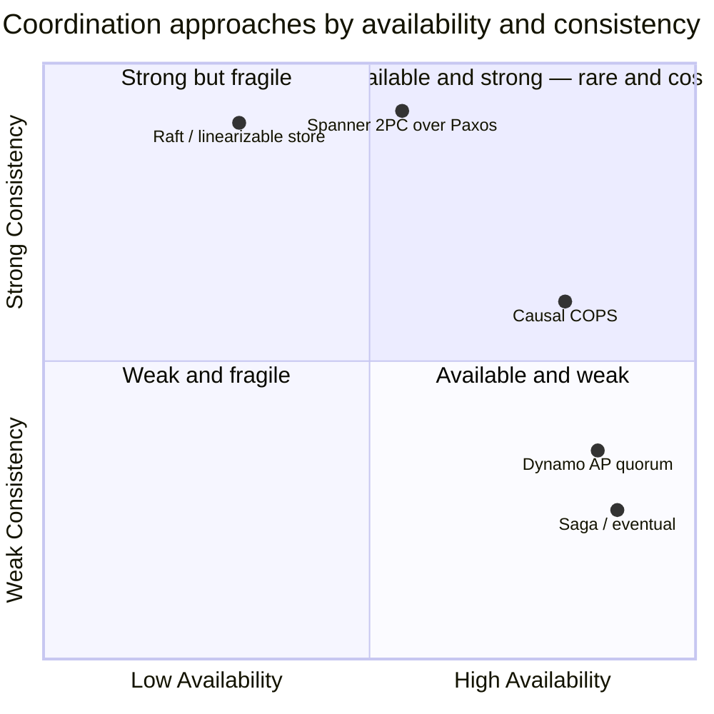

Caption: no approach sits in the top-right for free — strong-consistency systems (Raft, Spanner) buy
correctness with availability/latency, while AP systems (Dynamo, sagas) buy availability with weaker
guarantees; causal consistency (COPS) is the best available compromise, the strongest model that
stays highly available under partition.

---

## Common Pitfalls / War Stories

- **Treating a timeout as proof of death.** A firing timeout only *suspects* failure; a healthy
  process in a GC pause or behind a congested link looks identical to a dead one. Aggressive timeouts
  cause false-positive failovers and re-election storms that add load and can cascade. Fix: tune
  timeouts from observed latency percentiles, require multiple misses, and design every protocol to
  tolerate a lying failure detector.
- **Measuring durations with the wall clock.** Subtracting two `time-of-day` reads to get an elapsed
  time yields garbage (even negatives) when NTP steps the clock between reads — corrupting latency
  metrics and mis-firing timeouts. Fix: **always** use the monotonic clock for durations; reserve
  the wall clock for human-facing timestamps.
- **Believing a smaller Lamport timestamp means "happened before."** The implication is one-way:
  `L(a) < L(b)` does *not* imply `a → b`; they may be concurrent. Using Lamport scalars to decide
  causality (e.g. conflict resolution) silently mis-orders concurrent writes. Fix: use vector clocks
  when you must distinguish causality from concurrency.
- **Two leaders after a lease expiry (split-brain).** An old leader that was paused wakes up still
  thinking it holds the lease while a new leader has been elected; both write and corrupt the data.
  This is the single most common distributed-lock bug. Fix: **fencing tokens** — a monotonically
  increasing token per lease, with the resource rejecting any write carrying a stale token.
- **Building your own consensus / leader election.** Raft and Paxos are notoriously subtle (commit
  rules, log reconciliation, membership changes); hand-rolled versions ship split-brain and
  data-loss bugs. Fix: use a proven coordination service (etcd/ZooKeeper) and build on its
  primitives.
- **Reading stale data from a deposed Raft leader.** A leader that was just partitioned off can still
  answer reads from local state, returning values a newer leader has already superseded — breaking
  linearizability. Fix: confirm leadership with a read barrier (majority heartbeat round) or a leader
  lease before serving linearizable reads.
- **Assuming snapshot isolation is serializable.** SI (or a vendor's "repeatable read"/"serializable"
  that is really SI) permits **write skew** and **phantoms** — the on-call-doctor, double-booking,
  and overdraft bugs that pass low-concurrency tests and corrupt data in production. Fix: use true
  serializable isolation (SSI or 2PL) or explicit locking for invariant-critical logic; verify the
  actual guarantees, not the marketing name.
- **2PC that blocks forever.** A single-node coordinator that crashes after `Prepare` leaves every
  prepared participant holding locks with no way to decide, freezing rows until it recovers. Fix:
  replicate the coordinator's decision log through consensus (Spanner-style) so a replacement can
  finish the transaction — or avoid 2PC entirely with sagas for cross-service work.
- **The dual-write divergence.** Writing the database and then publishing an event as two separate
  operations means a crash in between leaves an order with no event (or an event for a rolled-back
  order). Fix: the outbox pattern — write the event row in the same local transaction, relay it
  at-least-once, dedup on the consumer.
- **Forgetting that saga steps are at-least-once.** An orchestrator retries steps it can't confirm,
  so a non-idempotent step (charge a card, ship an item) executes twice. Fix: make every saga step
  and compensation idempotent (idempotency keys / dedup), and dispatch steps via durable messaging.
- **Ignoring that sagas have no isolation.** Another transaction reads or updates a saga's
  half-finished state (a dirty read across the saga, a lost update), or a compensation runs against
  data someone else already changed. Fix: semantic locks (pending flags), commutative operations,
  re-reads, and ordering the riskiest step last.

---

## Real-World Systems Referenced

- **Coordination services / consensus:** ZooKeeper, etcd, Consul, Chubby (leases, leader election,
  configuration); Raft, (Multi-)Paxos as the underlying algorithms.
- **Clocks:** NTP; Google **Spanner** / **TrueTime** (GPS + atomic clocks with exposed uncertainty);
  **CockroachDB** (Hybrid Logical Clocks).
- **Failure detection / gossip / membership:** SWIM, Cassandra and Akka phi-accrual failure
  detectors; gossip/epidemic dissemination.
- **Replication / consistency:** Raft-based linearizable stores; chain replication (object-store
  storage layers); COPS (causal consistency).
- **AP / leaderless stores & CRDTs:** Amazon **Dynamo** and Dynamo-style stores (Cassandra, Riak) —
  N/R/W quorums, sloppy quorums, hinted handoff, read repair, Merkle-tree anti-entropy; Riak and
  Redis (CRDTs); collaborative editors (CRDTs / OT).
- **Transactions / NewSQL:** PostgreSQL, MySQL/InnoDB, Oracle, SQL Server (isolation levels, MVCC,
  2PL, WAL); Spanner and CockroachDB (serializable distributed transactions); XA/2PC transaction
  managers.
- **Async transactions:** message-broker + outbox (Debezium-style CDC relays); saga orchestration
  frameworks and durable-workflow engines.

---

## Summary

Coordination is the discipline of making independently-failing, imperfectly-clocked machines
**agree**, and this part builds it from bedrock. Everything rests on brutal honesty about
uncertainty: you must state your **system model** (link, process, timing) because guarantees only
hold under it, and under the realistic **partially-synchronous** model you can never build a
**perfect failure detector** — a timeout can't distinguish slow from dead — nor trust a physical
clock to order events, since clocks drift and NTP can jump time backward (so durations use the
**monotonic** clock, and ordering uses **logical** clocks). **Lamport clocks** give a one-way causal
order (`a → b ⟹ L(a) < L(b)`, but not the converse); **vector clocks** additionally detect
concurrency at `O(N)` cost.

On that foundation stands the central machinery. **Raft** elects a leader by majority vote per term
(randomized timeouts defeat split votes) and replicates an ordered **log** via `AppendEntries`,
committing an entry once a **majority** persist it — the mechanical fact of **quorum overlap** making
both leadership and commits safe. Abstractly this is **consensus** (agreement, validity, termination),
the atom under every strongly-consistent primitive — and you should *use a coordination service*, not
build it, minding the **lease-expiry two-leader race** that **fencing tokens** fix. Replication then
sells applications a **consistency spectrum** — linearizable, sequential, causal, eventual — priced by
**CAP** (under a partition, C or A — and **"CA" isn't real** because partitions are unavoidable) and
**PACELC** (else, latency vs consistency on every operation).

Because consensus is expensive, the next move is to **avoid** it: **gossip** for scalable broadcast,
**CRDTs** (join-semilattice merges) and **Dynamo-style quorums** (`W + R > N`, sloppy quorums, Merkle
anti-entropy) for coordination-free convergence, the **CALM theorem** (monotonic ⟺ coordination-free)
to know when it's safe, and **causal consistency** as the strongest model surviving a partition.
Finally, **transactions**: locally the **WAL** gives atomicity; across nodes **2PC** gives atomicity
but is **blocking** (the uncertainty window freezes prepared participants if the coordinator dies) —
**NewSQL** (Spanner's 2PC-over-Paxos with TrueTime commit-wait) makes it available and serializable
within one system, and **asynchronous transactions** (the **outbox** for atomic publish, **sagas** of
local transactions + compensations) handle cross-system/cross-org work — at the cost that a saga is
**ACD without I**, trading isolation and immediacy for availability and loose coupling. The through-line:
pick the weakest coordination your correctness tolerates, because every step toward strong consistency
is paid in latency and availability.

---

## Interview Questions

**Q: Why is perfect failure detection impossible in an asynchronous network?**
Because there is no way to distinguish a crashed process from a slow one when message delays are unbounded. The only signal is a timeout, and any timeout you pick can be beaten by a process that was merely slower than that timeout or a message still in flight — so a perfect detector (never a false positive, never a missed failure) cannot exist under asynchrony. You can only get perfect detection in a synchronous system, where a known delay bound makes "no response within the bound" definitively mean "dead." Real systems are partially synchronous, so real failure detectors are unreliable by necessity and every higher-level protocol must tolerate a detector that occasionally lies.

**Q: What is the lease-expiry race that produces two leaders, and how do fencing tokens fix it?**
An old leader gets paused (e.g. a long GC pause), its lease expires from the coordination service's view, a new leader is elected, and then the old leader wakes up still believing it holds the lease because its own clock disagrees — so both write to the shared resource and corrupt it. Fencing tokens fix this by having the coordination service issue a monotonically increasing token with each lease grant; every write includes its token, and the resource remembers the highest token it has seen and rejects any write carrying a smaller one. The new leader's higher token means the resource refuses the zombie old leader's stale writes, killing split-brain without any clock agreement.

**Q: Why does `L(a) < L(b)` NOT imply that a happened before b with Lamport clocks?**
Because Lamport's guarantee is one-way only: `a → b` implies `L(a) < L(b)`, but the converse is false. Two concurrent events on different processes can have different Lamport timestamps purely by counting accident, with no causal relationship between them, so a smaller timestamp does not prove "happened before." Lamport clocks can safely order events you already know are causally related, but they cannot tell you whether two events are causally related or merely concurrent — for that you need vector clocks, which detect concurrency directly.

**Q: Why isn't "CA" a real choice in the CAP theorem?**
Because you cannot opt out of network partitions — they are a fact of any real network, not a design choice. CAP is often mis-taught as "pick two of three," but since partitions will inevitably happen, the only real decision is what you do when one occurs: sacrifice consistency (be AP) or sacrifice availability (be CP). A "CA" system describes a single node or a fantasy; a distributed system is always choosing CP or AP during a partition. PACELC extends this by noting that even with no partition (the "Else" case), you still trade latency versus consistency on every operation.

**Q: Why does snapshot isolation permit write skew, and why does that matter?**
Because SI gives each transaction a consistent snapshot but checks nothing at commit about writes to different rows. Two transactions can each read the same snapshot, each verify an invariant, then each write different rows based on that read, and both commit while together violating the invariant — the classic case being two on-call doctors who each read "2 on call, safe to leave," each remove themselves, and leave zero on call. It's not a lost update (different rows) and each snapshot looked valid, so SI allows it. It matters because SI (often marketed as "repeatable read" or even "serializable") is not serializable; invariant-critical logic needs true serializable isolation via SSI or 2PL, or explicit locking.

**Q: Why is two-phase commit called a blocking protocol?**
Because once a participant votes "yes" in the prepare phase, it can neither commit nor abort on its own — it must wait for the coordinator's decision while holding its locks. If the coordinator crashes after collecting votes but before broadcasting the commit-or-abort decision, every prepared participant is stuck: committing risks disagreeing with a "no" vote, and aborting risks disagreeing with others who may already have committed. The prepared participants stay blocked, freezing their rows, until the coordinator recovers and reads its decision log — which is why 2PC guarantees atomicity but sacrifices availability, and why it's unsuitable across systems or organizations.

**Q: Why is a saga described as "ACD without I"?**
Because a saga provides Atomicity (eventually, through compensating transactions), Consistency, and Durability, but not Isolation. Each step commits its local transaction immediately, so the saga's intermediate state becomes visible to other concurrent transactions before the whole saga finishes — allowing dirty reads across the saga and lost updates. You recover partial isolation with countermeasures like semantic locks (a "pending" flag), commutative updates, re-reads, and ordering the riskiest step last, but a saga fundamentally trades away immediate isolation in exchange for availability, loose coupling, and cross-organization workability.

**Q: What is the difference between the wall clock and the monotonic clock, and when do you use each?**
The wall clock (time-of-day) is human-meaningful but can jump forward or backward due to NTP corrections, leap seconds, or manual changes, so it's for timestamps only. The monotonic clock only ever moves forward at a steady rate with no absolute meaning, so it's for measuring durations. The classic bug is measuring elapsed time by subtracting two wall-clock reads: if NTP steps the clock in between, you can get a negative or wildly wrong latency. The rule is durations use the monotonic clock exclusively; the wall clock is only for "what calendar time did this happen."

**Q: How does a majority quorum guarantee there is at most one leader per term in Raft?**
Because any two majorities of an N-node cluster must overlap in at least one server, and each server grants its vote to at most one candidate per term. For two different candidates to both win the same term, both would need a majority, but the shared server in the overlap voted only once — a contradiction. So at most one candidate can gather a majority per term, guaranteeing at most one leader. This same overlap principle underlies log-commit safety (a committed entry is on a majority) and Dynamo's `W + R > N` (the read set overlaps the write set).

**Q: Why must the timeout in a failure detector be a compromise, and what are the two failure modes?**
Because the timeout directly trades detection speed against false positives with no setting that wins both. A short timeout detects real failures fast but flags healthy-but-slow processes as dead (false positives), triggering needless failovers and re-election storms that add load and can cascade. A long timeout avoids false positives but detects genuine failures slowly, extending the window during which requests are routed to a dead node. In practice you choose the timeout from observed latency percentiles, require multiple missed probes before declaring failure, or use an accrual detector that outputs a suspicion level rather than a binary verdict.

**Q: What three properties define consensus, and why is termination the hard one?**
Consensus requires agreement (no two processes decide different values), validity (the decided value was actually proposed by some process), and termination (every non-faulty process eventually decides). Termination is the hard one because it's a liveness property, and the FLP result proves it cannot be guaranteed deterministically in a purely asynchronous system where even one process may crash — you can't distinguish a slow process from a dead one, so you can never be sure everyone will decide. This is why real consensus algorithms like Raft and Paxos assume partial synchrony: they guarantee safety (agreement/validity) always, and liveness (termination) only during synchronous periods.

**Q: How does the outbox pattern solve the dual-write problem?**
By writing the business change and an event row into an outbox table within the same single local database transaction, so they commit atomically — either both land or neither does. A separate relay process then reads the outbox and publishes the events to the message broker, marking them sent (or tails the DB change log via CDC). This guarantees the event is published at-least-once whenever the business change committed, eliminating the divergence where a crash between the DB write and the broker publish leaves an order with no event or an event for a rolled-back order. Because the relay can publish then crash before marking sent, consumers must be idempotent to dedup.

**Q: What does the CALM theorem tell you about when coordination can be avoided?**
CALM (Consistency As Logical Monotonicity) states that a program can be computed in a coordination-free, eventually-consistent way if and only if it is monotonic — meaning adding more inputs only ever adds to the output and never retracts a prior conclusion. Monotonic programs (accumulating into a grow-only set, computing a maximum) converge to the same result regardless of message order, delay, or duplication, so they need no coordination. Non-monotonic operations — anything requiring negation, a final count, or deletion ("the set is complete, so size is exactly K") — need coordination because they require knowing you've seen all the input, which weak consistency can never assure.

**Q: How does linearizability differ from sequential consistency?**
Linearizability requires that operations appear to take effect atomically at some instant between invocation and response, consistent with real-time order — so once a write completes, every subsequent read anywhere sees it or a later value, as if there were a single up-to-date copy. Sequential consistency only requires that each process's operations appear in its program order within some global total order, but that order need not match real time — so a read can return a stale value as long as the global order stays consistent. Linearizability is strictly stronger (and more expensive); the producer/consumer over a queue is the classic sequentially-consistent example where per-process order is preserved without a real-time recency guarantee.

**Q: What does Spanner's TrueTime do, and how does commit wait achieve external consistency?**
TrueTime is an API backed by GPS and atomic clocks that returns a time interval `[earliest, latest]` with a bounded uncertainty, rather than pretending to a single exact instant. To guarantee external consistency — linearizability across the entire database, so a transaction that commits before another starts in real time gets a smaller timestamp — Spanner performs a commit wait: after choosing a commit timestamp it waits out the uncertainty interval (a few milliseconds) before releasing locks, ensuring no other transaction can commit with an overlapping-yet-earlier timestamp. It spends latency to convert imperfect clocks into a globally consistent order; CockroachDB pursues the same goal on commodity hardware using hybrid logical clocks instead.

**Q: How does a Raft leader know an entry is safe to commit and apply?**
It appends the entry to its log and replicates it via AppendEntries, and only marks it committed once a majority of servers (including itself) have durably persisted it — at which point it advances its commit index, applies the command to its state machine, and returns to the client. Followers learn the commit index from subsequent AppendEntries and apply the entry to their own state machines. A subtle safety rule is that a leader only counts replicas to directly commit entries from its own current term; older-term entries become committed indirectly once a current-term entry above them commits, preventing a rare overwrite of a committed entry.

**Q: What are op-based and state-based CRDTs, and why do state-based ones tolerate an unreliable network?**
Operation-based CRDTs (CmRDTs) broadcast the operations themselves, which must be commutative, and require reliable exactly-once (usually causal) delivery — a lost or duplicated op breaks convergence. State-based CRDTs (CvRDTs) periodically exchange full states and merge them with a function that is the least upper bound over a join-semilattice, meaning the merge is commutative, associative, and idempotent. Those three algebraic properties make the merged result independent of message order, batching, and duplication, so a reordered or re-delivered state merges harmlessly — which is exactly why state-based CRDTs converge over an unreliable network without coordination.

**Q: Why does chain replication give better read throughput than a single leader while staying strongly consistent?**
Because writes enter at the head and propagate down the chain, being acknowledged only when they reach the tail, the tail by construction holds only fully-propagated committed writes — so reads served entirely by the tail are strongly consistent and offloaded from the head that handles writes. A single leader must serve both reads and writes, whereas chain replication splits the load across head (writes) and tail (reads), raising read throughput. The tradeoffs are higher write latency (a write serially traverses the whole chain rather than fanning out to a quorum in parallel) and the need for a separate consensus-backed control plane to reconfigure the chain when a node fails.

**Q: What do `W + R > N` quorums guarantee in a Dynamo-style store, and how do sloppy quorums differ?**
`W + R > N` guarantees that the set of W nodes that acknowledged a write and the set of R nodes read from must overlap in at least one node, so a read is guaranteed to see at least one replica holding the latest write — quorum consistency (e.g. N=3, W=2, R=2). A sloppy quorum relaxes this under failure: during a partition, if the key's home nodes are unreachable, the write is accepted by any N reachable healthy nodes instead of blocking, keeping writes available; the node that took the write on behalf of an unreachable home node holds it as a hint and forwards it later via hinted handoff. Sloppy quorums trade the strict overlap guarantee for higher write availability during failures.

**Q: What is causal consistency, and why is it special among consistency models?**
Causal consistency guarantees that operations related by happened-before are seen by everyone in that causal order, while concurrent operations may be seen in different orders by different replicas — so you never see an answer before its question, but two independent comments may appear in different orders. It's special because it is the strongest consistency model that can be provided by an always-available system under network partitions: CAP forbids linearizability plus availability under partition, but causal consistency plus availability is achievable. Systems like COPS deliver it by tracking each operation's causal dependencies via vector clocks and delaying an operation's visibility until its dependencies have arrived.

**Q: How does Spanner make two-phase commit non-blocking?**
By making each 2PC participant and the coordinator itself a Paxos-replicated group rather than a single node. Data is sharded into partitions, each replicated by Paxos across zones, so a partition is highly available; cross-partition transactions run 2PC on top of these groups, and the coordinator's decision log is replicated by consensus. When a coordinator replica crashes, another replica reads the replicated decision log and drives the transaction to completion, so prepared participants are never permanently blocked. This is the general fix for 2PC's blocking flaw: replicate the coordinator's state through consensus so its crash is survivable.

**Q: What is the difference between best-effort, reliable, and gossip broadcast?**
Best-effort broadcast simply sends the message to each member, so if the sender crashes partway some members receive it and some never do — no atomicity. Reliable broadcast guarantees all non-faulty processes deliver the same messages even if the sender crashes, typically by having each receiver re-broadcast, which is correct but costs `O(N²)` messages and doesn't scale. Gossip (epidemic) broadcast has each node forward to a small random fanout of peers, spreading the message like an epidemic to all N nodes in `O(log N)` rounds — scalable, robust to failures, and probabilistic rather than certain, which is why it underpins membership and anti-entropy.

**Q: Why should you not implement consensus or leader election yourself, and what should you use instead?**
Because Raft and Paxos are notoriously subtle — commit rules, log reconciliation, membership changes, and the lease/fencing interactions are all easy to get wrong, and hand-rolled versions routinely ship split-brain and data-loss bugs. Instead you should use a battle-tested coordination service like etcd, ZooKeeper, Consul, or Chubby, which has already implemented consensus correctly and exposes safe primitives (leases, watches, atomic compare-and-set, leader election). You build your coordination logic on top of those primitives rather than re-deriving the algorithm, and you still respect the operational gotchas like fencing tokens for locks.

**Q: What is the uncertainty window in 2PC, and why does it hold locks?**
The uncertainty window is the interval after a participant has voted "yes" in the prepare phase but before it has received the coordinator's commit-or-abort decision. During this window the participant has durably prepared and surrendered its autonomy — it cannot unilaterally commit (someone might have voted no) or abort (everyone might have voted yes and others may have committed) — so it must hold its locks to preserve the ability to commit. If the coordinator crashes in this window, the participant is blocked holding those locks, freezing the affected rows, until the coordinator recovers and reads its decision log. This is the root of 2PC's blocking behavior and its poor availability.

**Q: How do vector clocks detect whether two events are concurrent?**
Each process keeps a vector of counters, one per process, incrementing its own entry on each event and taking the element-wise maximum on receiving a message before ticking its own. To compare two events' vectors: if every entry of `V(a)` is ≤ the corresponding entry of `V(b)` with at least one strictly less, then `a → b`; if the reverse, then `b → a`; and if neither vector dominates (each has an entry larger than the other), the events are concurrent. This ability to directly detect concurrency — impossible with a single Lamport scalar — is exactly what conflict-resolving stores need to decide whether two writes conflict or one supersedes the other, at the cost of `O(N)` per timestamp.

**Q: What is the difference between reliable broadcast and the reliable link model, and how are they built?**
The reliable link model is about point-to-point communication: exactly-once delivery between two processes with no loss or duplication, built on a fair-loss link by retransmitting on timeout and de-duplicating with sequence numbers. Reliable broadcast is about one-to-many: guaranteeing all non-faulty processes in a group deliver the same set of messages even if the original sender crashes mid-broadcast, built by having receivers re-broadcast what they receive so a message that reached anyone reaches everyone. The link model is a Part I primitive that reliable broadcast builds upon; broadcast adds the all-or-nothing-across-the-group guarantee against sender failure, at `O(N²)` cost unless you drop to gossip.

**Q: Why does read committed still allow read skew, and how does snapshot isolation prevent it?**
Read committed only guarantees you never read uncommitted data (no dirty reads) and never overwrite uncommitted data (no dirty writes), but it lets each statement see the latest committed value at the moment it runs — so two reads in one transaction can see different states if another transaction commits in between (read skew / non-repeatable read), like summing two balances mid-transfer and seeing money apparently vanish. Snapshot isolation prevents this by giving each transaction a consistent snapshot: it reads all data as of the instant it began, ignoring later commits, via MVCC keeping multiple timestamped versions. Readers never block writers and writers never block readers, but SI still permits write skew and phantoms.

**Q: When would you choose a saga over 2PC, and what do you give up?**
You choose a saga when the transaction spans heterogeneous systems or organizational boundaries — where 2PC is impractical because a third-party service won't join your protocol, you can't hold its locks, and blocking on a foreign coordinator is unacceptable — or when the work is long-running and holding locks across it would kill availability. A saga decomposes the work into local transactions glued by durable messaging, with compensating transactions to unwind on failure. What you give up is isolation (sagas are ACD without I, so intermediate states are visible and cause anomalies you must mitigate with semantic locks) and immediate consistency (you accept eventual consistency and must make every at-least-once step idempotent).

**Q: What is the log matching property in Raft, and how does it repair a divergent follower?**
The Log Matching Property states that if two logs contain an entry with the same index and term, then those logs are identical in all entries up to that index. Raft enforces it by having each AppendEntries carry the index and term of the entry immediately preceding the new ones; a follower rejects the RPC if its log doesn't have a matching entry at that position. On rejection the leader decrements its next-index for that follower and retries with an earlier entry, walking backward until the logs align, then overwrites the follower's divergent suffix with its own entries. This is how a newly elected leader brings lagging or divergent followers back into consistency with the authoritative log.

**Q: What is the difference between the crash-stop, crash-recovery, and Byzantine process models?**
Crash-stop (fail-stop) assumes a process works correctly until it crashes and then never recovers — the failure is permanent and simplest to reason about. Crash-recovery assumes a process can crash and later recover, losing volatile memory but retaining whatever it wrote to stable storage — the realistic model for servers that reboot, redeploy, or get OOM-killed, requiring algorithms to persist enough state (logs) to resume correctly. Byzantine assumes a process may behave arbitrarily or maliciously, sending contradictory messages and lying about its state — the model for trustless, open systems, requiring far more expensive Byzantine fault tolerance (typically 3f+1 replicas). Inside a single trusted datacenter you normally assume non-Byzantine crash-recovery, which is why Raft and Paxos are non-Byzantine algorithms.

**Q: Why can't a Raft leader always serve a read from local state, and what fixes it?**
Because a leader that has been partitioned off or superseded can still answer reads from its local state, returning values that a newer leader has already updated — which violates linearizability by serving stale data. The fix is to confirm the leader is still the leader before serving a linearizable read: either a read barrier, where the leader exchanges a heartbeat round with a majority to prove it still holds leadership before answering, or a leader lease, where the leader holds a time-bounded lease during which it may serve reads locally without a round trip (trading a clock assumption for lower latency). Follower reads without such confirmation are only safe under weaker consistency.

---

## Cross-links in this repo

- [Part I: Communication — the links and protocols these algorithms run over](../01_communication/README.md)
- [Part III: Scalability — what these coordination primitives cost at scale](../03_scalability/README.md)
- [database/consistency_models_and_consensus/ — linearizability, Raft/Paxos, quorums, deeper](../../../database/consistency_models_and_consensus/README.md)
- [hld/consensus_algorithms/ — Raft/Paxos election and log replication in depth](../../../hld/consensus_algorithms/README.md)
- [hld/cap_theorem/ — CAP and PACELC, CP vs AP system design](../../../hld/cap_theorem/README.md)
- [database/distributed_transactions/ — 2PC, sagas, outbox, Spanner across partitions](../../../database/distributed_transactions/README.md)
- [backend/distributed_transactions_and_consistency/ — outbox, saga orchestration, idempotency](../../../backend/distributed_transactions_and_consistency/README.md)
- [database/concurrency_control_and_locking/ — MVCC, 2PL, SSI, deadlocks, write skew](../../../database/concurrency_control_and_locking/README.md)
- DDIA deeper treatments (summarized here, not duplicated):
  - [DDIA Ch 5 — Replication (leaders, quorums, conflict resolution)](../../designing_data_intensive_applications/05_replication/README.md)
  - [DDIA Ch 7 — Transactions (isolation levels, write skew, serializability)](../../designing_data_intensive_applications/07_transactions/README.md)
  - [DDIA Ch 8 — The Trouble with Distributed Systems (clocks, failures, truth)](../../designing_data_intensive_applications/08_trouble_with_distributed_systems/README.md)
  - [DDIA Ch 9 — Consistency and Consensus (linearizability, total order, 2PC)](../../designing_data_intensive_applications/09_consistency_and_consensus/README.md)

## Further Reading

- Vitillo, *Understanding Distributed Systems* (2nd ed.), Part II — the source text and its references.
- Lamport, "Time, Clocks, and the Ordering of Events in a Distributed System," 1978 — happened-before
  and Lamport clocks.
- Fidge / Mattern, vector clocks, 1988 — full causality tracking.
- Fischer, Lynch & Paterson, "Impossibility of Distributed Consensus with One Faulty Process" (FLP),
  1985 — why asynchronous consensus can't guarantee termination.
- Ongaro & Ousterhout, "In Search of an Understandable Consensus Algorithm" (Raft), 2014.
- Lamport, "Paxos Made Simple," 2001.
- Gilbert & Lynch, "Brewer's Conjecture and the Feasibility of Consistent, Available,
  Partition-Tolerant Web Services" (CAP proof), 2002; Abadi, "Consistency Tradeoffs in Modern
  Distributed Database System Design" (PACELC), 2012.
- DeCandia et al., "Dynamo: Amazon's Highly Available Key-value Store," 2007 — quorums, sloppy
  quorums, hinted handoff, Merkle anti-entropy.
- Shapiro et al., "Conflict-free Replicated Data Types," 2011.
- Hellerstein & Alvaro, "Keeping CALM: When Distributed Consistency is Easy," 2019 — the CALM theorem.
- Lloyd et al., "Don't Settle for Eventual: Scalable Causal Consistency for Wide-Area Storage with
  COPS," 2011.
- Corbett et al., "Spanner: Google's Globally-Distributed Database," 2012 — TrueTime and external
  consistency.
- van Renesse & Schneider, "Chain Replication for Supporting High Throughput and Availability," 2004.
- Garcia-Molina & Salem, "Sagas," 1987.
