# Part III: Scalability

> Part III of 5 · Understanding Distributed Systems (Vitillo) · covers book Ch 14–23 · builds on Part II, leads to Part IV (Resiliency)

## Chapter Map

Part II bought you *coordination* — the machinery (consensus, replication, transactions) that
lets many nodes agree. Part III spends the rest of the book asking the opposite question: how do
you handle **more load than one machine can carry**, and do it while *avoiding* coordination
wherever you can, because coordination is exactly what does not scale. Vitillo frames the whole
part around a toy CRUD service he calls **Cruder** — a single stateless web server in front of a
single database — and grows it, bottleneck by bottleneck, into a globally distributed system.
Each chapter removes one ceiling: cache the reads at the client (Ch 14), cache them at the edge
(Ch 15), split the data (Ch 16), offload the big files (Ch 17), spread the requests (Ch 18),
scale the database (Ch 19), cache the expensive results (Ch 20), split the service (Ch 21),
separate the control path from the request path (Ch 22), and decouple producers from consumers
with a broker (Ch 23).

The part opens with two framing ideas you must fold into everything after:

- **Scale up vs scale out.** *Scaling up* (vertical) means a bigger machine — more CPU, RAM,
  faster disks. It is the simplest lever and you should pull it first, but it hits a hard ceiling
  (there is a biggest machine you can buy), it is expensive at the top of the range, and a single
  machine is a single point of failure with zero fault tolerance. *Scaling out* (horizontal) means
  *more* machines cooperating — the only path past one machine's limit, and the only way to
  tolerate a machine dying. Everything in Part III is a scale-out technique.
- **The three scaling dimensions (the "scale cube").** There are exactly three independent axes
  along which you can scale out, and every technique in this part is one of them:
  1. **Functional decomposition** — split the system by *function*: turn one service into many
     services, each owning a capability (microservices, Ch 21).
  2. **Partitioning** — split the *data/load* by key: shard it across nodes so each node owns a
     slice (Ch 16, Ch 19).
  3. **Replication** — *duplicate* data or stateless service instances across nodes so many copies
     share the load and cover each other's failures (Ch 18, Ch 19). **Caching and CDNs are
     replication with weaker guarantees** — a cache is just a replica you are allowed to have go
     stale.

**TL;DR of the whole part:**
- **Cache aggressively but treat the cache as disposable.** The single most dangerous scalability
  bug in this part is a cache that quietly *became load-bearing* — the origin can no longer survive
  a cache outage, so the cache going down takes the whole system with it.
- **Coordination is the tax you are trying not to pay.** Range vs hash partitioning, leader vs
  leaderless replication, log vs queue brokers, control plane vs data plane — every choice is
  really "how little consistency can I get away with so this stays fast and available?"
- **The request path (data plane) and the management path (control plane) have opposite
  requirements.** Keep the data plane working on last-known-good state when the control plane is
  down, or you have built a beautiful scale-out system with a single point of failure bolted to
  the middle.

## The Big Question

> "One box can only do so much. When I need ten, or ten thousand, boxes — how do I split the
> work across them **without** the boxes needing to constantly talk to each other to agree, since
> that agreement is the very thing that stops scaling?"

Analogy: Part II taught you how a committee reaches a binding decision. Part III is about running
a company where you *avoid convening the committee* for almost everything — you push work to the
edges, hand each team its own slice, let read-only copies proliferate, and only escalate to the
slow, careful coordination layer when correctness genuinely demands it. Scaling is mostly the art
of *not coordinating*.

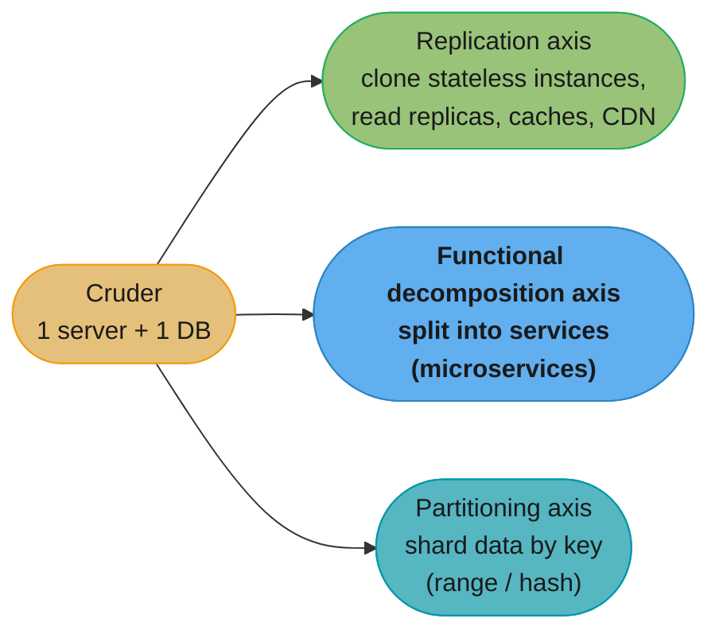

Caption: the scale cube — every technique in Part III moves Cruder along one of three orthogonal
axes; caching and CDNs sit on the replication axis, sharding on the partition axis, and
microservices on the functional-decomposition axis. You usually combine all three at scale.

Cruder's growth path is the spine of the whole part, and each step is a chapter:

```
Cruder over time (each bottleneck -> the chapter that removes it)
  1 server + 1 DB                       start
  -> scale UP the box                   simplest; hits a ceiling, still a SPOF
  -> cache static assets at clients      Ch 14 (HTTP caching)
  -> push assets to the edge             Ch 15 (CDN)
  -> clone stateless servers + LB        Ch 18 (load balancing)   [replication axis]
  -> add DB read replicas                Ch 19 (data replication)
  -> shard the DB when writes/size cap   Ch 16, 19 (partitioning) [partition axis]
  -> offload big files to blob store     Ch 17 (file storage)
  -> cache expensive results in Redis    Ch 20 (caching)
  -> split the monolith by capability    Ch 21 (microservices)    [functional axis]
  -> separate management from serving    Ch 22 (control/data plane)
  -> decouple with a broker              Ch 23 (messaging)
```

Caption: Part III is not ten unrelated topics — it is one service outgrowing one machine, with each
chapter removing the next ceiling; the three scale-cube axes are the only three directions that
growth can go.

### Decoding the ceiling — why "agreement is the thing that stops scaling"

Vitillo never writes the equation down, but the quote above *is* **Amdahl's Law**. If a fraction
`s` of the work must be done serially — the part where the boxes coordinate — then adding boxes
buys you:

```
speedup(N) = 1 / ( s + (1 - s)/N )
```

**What this actually says.** "However many machines you add, you can never go faster than the part
you refused to parallelize." The parallel term `(1-s)/N` shrinks toward zero as `N` grows, but the
serial term `s` never moves — so the whole expression converges to `1/s` and stops. That ceiling is
set the day you choose the architecture, not the day you buy the machines.

| Symbol | What it is |
|--------|------------|
| `N` | Number of machines you throw at the problem |
| `s` | Fraction of the work that is inherently serial — coordination, a single leader, a lock |
| `(1-s)` | Fraction that genuinely parallelizes across the `N` boxes |
| `(1-s)/N` | The parallel part's time after splitting it `N` ways — this is the only term `N` touches |
| `1/s` | The hard ceiling. The best speedup you can *ever* reach, at `N = infinity` |

**Walk one example.** A service that coordinates on 5% of its work (`s = 0.05`):

```
    N        speedup     efficiency (speedup / N)
      1        1.00          100%
      2        1.90           95%
      4        3.48           87%
     10        6.90           69%
    100       16.81           17%      <- 100 boxes doing the work of 17
   1000       19.63            2%      <- 900 extra boxes bought 2.8x more speedup
  infinity    20.00            0%      <- ceiling = 1/0.05

  Going 100 -> 1000 machines (10x the bill) moved speedup 16.81 -> 19.63: +17%.
```

Now change only `s`, holding `N = 100`:

```
    s = 0.20   ->  ceiling   5.00   at N=100 you get  4.81   (already 96% of the ceiling)
    s = 0.05   ->  ceiling  20.00   at N=100 you get 16.81
    s = 0.01   ->  ceiling 100.00   at N=100 you get 50.25
```

This is the whole thesis of Part III in one table: **you buy scale by shrinking `s`, not by growing
`N`.** Every chapter that follows is a technique for removing coordination from the request path —
caching removes a database round trip, partitioning removes a shared leader, an async broker removes
a synchronous handoff. And it explains the asymmetry the chapter keeps returning to: shaving `s`
from 5% to 1% raises the ceiling 5x, while a 10x hardware bill at fixed `s` raises it 17%.

---

## 3.1 HTTP Caching (Ch 14)

The cheapest request is the one you never make. Cruder's first bottleneck is that it re-serves the
same static assets (JS bundles, CSS, images, avatars) to every client on every page load. HTTP has
a built-in caching protocol that lets the *client* (and any proxy in between) keep and reuse those
responses, cutting load off the origin entirely. This chapter is about client-side and
intermediary caching of HTTP responses; Ch 20 is about caching *inside* your system.

### Client-side caching of static resources

Browsers keep a local HTTP cache on disk. When a response is cacheable, the browser stores it keyed
by URL and serves subsequent requests for that URL out of the cache without touching the network.
The origin controls this entirely through response headers — the server tells the client "you may
keep this, and here is for how long." Two mechanisms cooperate: **freshness** (can I reuse this
without asking?) and **validation** (this looks stale — has it actually changed?).

Not everything is cacheable, and the defaults matter. A response is cacheable only when the method
is **safe** (a `GET` or `HEAD` — a `POST`/`PUT`/`DELETE` changes state and must not be replayed
from cache), the status is cacheable (200, 301, 404 can be; most others are not), and no header
forbids it (`no-store`, or `Cache-Control: private` for a shared cache). This is why static assets
(GET, unchanging) are the ideal cache target and API mutations are not — caching applies cleanly to
the **read** path, which is exactly the path you most want to keep off the origin.

### Cache-Control: freshness

The `Cache-Control` response header is the primary knob:

| Directive | Meaning |
|-----------|---------|
| `max-age=<seconds>` | The response is **fresh** for this many seconds; reuse it with no network call at all. |
| `no-cache` | You may store it, but you must **revalidate** with the origin before every reuse. |
| `no-store` | Do not store it at all (sensitive/personalized data). |
| `private` | Only the end client may cache it; shared proxies/CDNs must not. |
| `public` | Any cache, including shared proxies and CDNs, may store it. |
| `stale-while-revalidate=<s>` | Serve the stale copy immediately *and* revalidate in the background, so the user never waits on the revalidation. |

While a response is within its `max-age`, it is **fresh** and served straight from cache — zero
latency, zero origin load. Once `max-age` elapses it becomes **stale** and must be revalidated
before reuse (unless `stale-while-revalidate` lets the client serve the stale copy while
refreshing behind it). Freshness is the fast path; validation is the fallback.

### ETags and conditional GET (the 304)

When a cached response goes stale, the client does not blindly re-download it — that would waste
bandwidth if nothing changed. Instead it **revalidates** with a conditional request. The origin
stamps each response with a **validator**:

- **`ETag`** — an opaque version tag (often a hash or version number of the content). The client
  echoes it back in an `If-None-Match: <etag>` request header.
- **`Last-Modified`** — a timestamp; the client echoes it in `If-Modified-Since`.

If the resource is unchanged, the origin replies **`304 Not Modified`** with an **empty body** —
just headers. The client keeps its cached copy and resets its freshness. Only if the content
actually changed does the origin send a full `200 OK` with the new body. The 304 saves the entire
payload transfer; you still pay one round trip, but not the bytes.

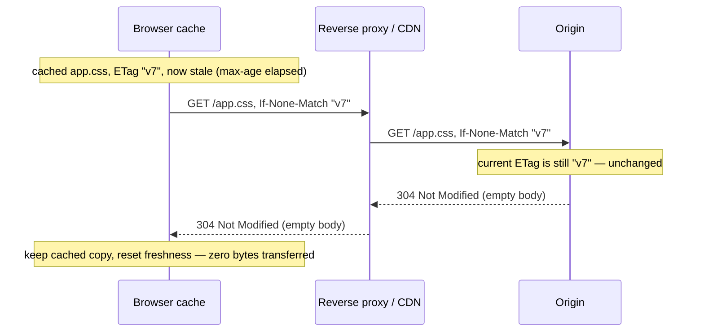

Caption: a conditional GET turns a would-be full re-download into a headers-only 304 round trip —
the client keeps the bytes it already has, and the origin only ships a body when the content truly
changed.

### Freshness vs validation — the two-speed model

Put together: `max-age` gives you the **fast** path (no network at all while fresh), and
ETag/conditional-GET gives you the **cheap** path (one round trip, no body) when freshness
expires. The design tension is how long to set `max-age`:

- **Long `max-age`** — fewer revalidations, less origin load, but you cannot push an urgent change:
  clients keep serving the old copy until their cache expires. Stale content lingers.
- **Short `max-age`** — fast propagation of changes, but constant revalidation traffic.

#### Decoding the two speeds — what each mechanism actually saves

The two mechanisms save two *different* resources, and conflating them is why `max-age` tuning
often disappoints. Write them separately. For one client making `L` requests a day for one asset of
size `S`, with freshness lifetime `T` seconds and a 304 response costing `H` header bytes:

```
origin round trips per client per day  =  min( L , 86400 / T )      <- max-age governs this
origin bytes per client per day        =  S  +  (round trips - 1) x H   <- the ETag governs this
```

**In plain terms.** "`max-age` decides how many times you talk to the origin; the ETag decides how
much you say when you do." Freshness kills round trips, validation kills bytes — and because a 304
is a few hundred header bytes against a payload of hundreds of kilobytes, almost all the *bandwidth*
win is already banked by the ETag alone.

| Symbol | What it is |
|--------|------------|
| `L` | Requests this client makes for the asset in a day |
| `T` | `max-age` in seconds — how long the cached copy stays fresh |
| `86400 / T` | How many freshness windows fit in a day, i.e. the most revalidations possible |
| `S` | Full payload size, paid once on the first real download |
| `H` | Bytes of a `304 Not Modified` — headers only, no body |
| `min(L, 86400/T)` | Whichever bites first: the client's own request rate, or the TTL |

**Walk one example.** One 200 KB `app.css`, a client loading 10 pages a day (`L = 10`), a 304
costing about 300 bytes:

```
  strategy                        origin round trips   origin bytes
  no cache headers at all               10              2,000.0 KB   (10 full downloads)
  ETag only, always revalidate          10                202.6 KB   (1 full + 9 x 304)
  max-age = 6 h                          4                200.9 KB   (1 full + 3 x 304)
  max-age = 24 h                         1                200.0 KB   (1 full)
  hashed URL, immutable 1 y              1 per YEAR        200.0 KB

  The ETag alone cut bytes 89.9% (2,000.0 -> 202.6 KB) and cut round trips by ZERO.
  Raising max-age from 1 h to 24 h cut round trips 10 -> 1 and cut bytes 202.6 -> 200.0 KB (1.3%).
```

Note the crossover in the `min(...)`: this client's requests are `86400 / 10 = 8,640 s = 2.4 h`
apart, so **any `max-age` below 2.4 h changes nothing at all** — every request already arrives after
the copy went stale. Setting `max-age=600` on an asset a user touches twice a day is a no-op you
will nonetheless see in production configs. `max-age` only starts paying once it exceeds the typical
gap between a client's requests, which is exactly why the useful values are hours-to-a-year, not
minutes.

### Immutable versioned URLs — having it both ways

The trick production sites use to get *both* long cache lifetimes *and* instant updates is
**content-addressed / fingerprinted URLs**. The naming avoids the fundamental **cache-invalidation
problem** — there is no reliable way to reach out and expire a cached copy sitting in someone's
browser thousands of miles away, so instead of invalidating a stable URL you *change the URL*.
Instead of serving `app.js`, you serve `app.3f2a1b9c.js`, where the hex is a hash of the file's
contents. Now:

- The versioned asset is marked `Cache-Control: max-age=31536000, immutable` (one year) — it will
  *never* change, because if the content changed the *filename* would change.
- To ship an update, you build a new file with a new hash → `app.7d4e10ff.js` → a brand-new URL.
  The HTML that references it (which itself has a short TTL) now points at the new URL, so clients
  fetch the new asset immediately and keep caching the old one harmlessly forever.

You have decoupled "cache this aggressively" from "let me change it" by changing the *URL* on
every change instead of invalidating a stable URL. This is why bundlers hash their output
filenames.

### Vary, and the public-caching data-leak trap

A shared cache (proxy/CDN) keys entries by URL — but the *right* response can depend on request
headers too (a `gzip` client and an `identity` client must not share one cached body; an English
and a French client must not share one localized page). The **`Vary`** response header tells shared
caches which request headers are part of the cache key: `Vary: Accept-Encoding` means "cache a
separate copy per encoding." Omitting a needed `Vary` corrupts the cache; over-broad `Vary`
(e.g. varying on the whole `User-Agent`) explodes the cache into near-unique entries and destroys
the hit ratio.

This sets up a classic **broken → fix** war story:

```
BROKEN: a shared reverse proxy / CDN caches a per-user response as if it were static
  GET /account  ->  200 OK
    Cache-Control: public, max-age=600        <-- says "any cache may store and share this"
    <body>Welcome back, Alice (balance $4,210)</body>
  The proxy caches it keyed only by URL. The NEXT user to hit /account is served
  Alice's page from cache. Cross-account data leak.

FIX: personalized responses must never be shared-cacheable
  GET /account  ->  200 OK
    Cache-Control: private, no-store          <-- "end client only, do not store"
  (or, if it must be cached at the edge, add  Vary: Authorization / a per-user cache key,
   and never mark user-specific data `public`)
```

Caption: `public` on a personalized response is a data-leak bug, not a performance win — the fix is
`private`/`no-store` for user-specific content and a correct `Vary` (or per-user cache key) whenever
a shared cache is involved. The rule of thumb: only truly identical-for-everyone responses may be
`public`.

### Freshness heuristics and cache hierarchies

If a response has *no* explicit freshness (`Cache-Control`/`Expires`), caches may apply a
**heuristic**: infer a lifetime from `Last-Modified` (commonly ~10% of the time since last
modification). This is why an asset with no cache headers still sometimes "sticks" unexpectedly —
you should always send explicit `Cache-Control` rather than rely on heuristics. And caches stack:
the browser cache, a corporate proxy, the CDN edge, and the origin's reverse proxy are a
**hierarchy**, each honoring the same freshness/validation protocol, so one origin `304` can
satisfy a validation that rippled up through several tiers.

### Reverse proxies — the shared server-side cache

Client caches only help *repeat* visitors of the *same* client. A **reverse proxy** sits in front
of the origin and caches responses **shared across all clients**: the first user to request a
cacheable resource fills the proxy cache, and every subsequent user (any client) is served from
the proxy without the origin doing work. A reverse proxy (nginx, Varnish, an L7 load balancer)
typically also does TLS termination, compression, and **request collapsing** (coalescing many
concurrent identical misses into a single origin fetch — the same stampede idea we revisit in
Ch 20).

Beyond caching, a reverse proxy is the natural home for cross-cutting concerns you do not want in
every backend: **TLS termination** (decrypt once at the edge, speak plaintext internally),
**compression** (gzip/brotli responses centrally), **request collapsing** (one origin fetch for N
concurrent identical misses — the stampede fix again), **load balancing** across backends,
**access control and rate limiting**, and **response buffering** to shield slow-client effects from
the origin. It is the same role a load balancer, API gateway, and CDN edge all play — a smart
intermediary on the request path — which is why these components blur together in practice.

The key mental model Vitillo hands you: **a CDN is a reverse proxy taken to the geographic
extreme** — thousands of reverse-proxy caches spread around the planet, each close to a cluster of
users. That is the whole of Ch 15.

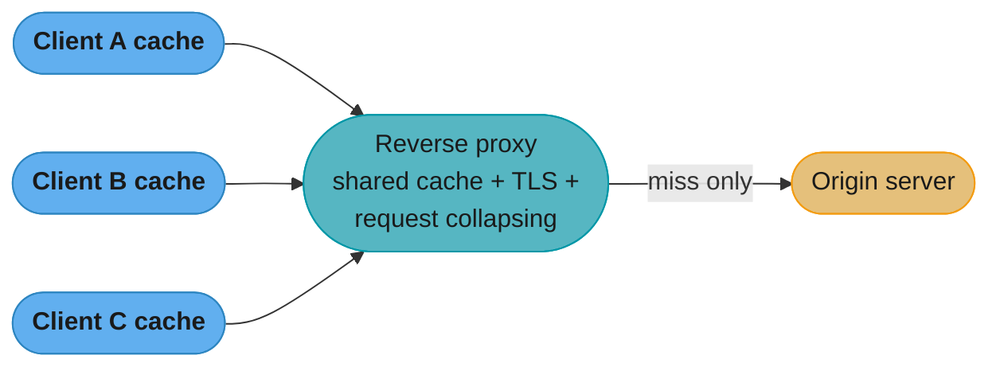

Caption: the client cache helps one client repeat itself; the reverse proxy caches once and serves
every client — the origin only sees the misses. Scale that proxy out geographically and you have a
CDN.

---

## 3.2 Content Delivery Networks (Ch 15)

A CDN is a geographically distributed network of caching servers (**edge servers** / **points of
presence**, PoPs) operated to serve content from close to the user. Two things make it more than
"reverse proxies in many cities": it is an **overlay network** that routes traffic better than the
raw internet, and it uses a **tiered caching** hierarchy to maximize hit ratio while shielding the
origin.

### The CDN as an overlay network

The public internet routes packets using **BGP**, which chooses paths by **AS hop count and
policy, not by latency or congestion**. The shortest AS-path is frequently *not* the fastest or
least-congested one, so a naive origin fetch can traverse a slow, congested route. A CDN builds an
**overlay network** on top of the internet: it continuously measures latency and loss between its
own PoPs and picks the best *internal* path, effectively routing around the internet's bad
default choices.

Concretely, a CDN improves the request in several ways at once:

- **Proximity.** The user connects to the *nearest* edge, so the client-facing RTT is tiny (a few
  ms) instead of a cross-continent round trip.
- **DNS-based routing to the nearest edge.** The CDN's DNS (or anycast) resolves the CDN hostname
  to the PoP closest to (the user's resolver of) the user. This is how the request lands on a
  nearby edge in the first place.
- **TLS and TCP termination at the edge.** The expensive TLS handshake and TCP slow-start happen
  over the short user↔edge hop, where a lost packet is recovered in milliseconds — not over a
  long, high-RTT path where slow-start ramps painfully.
- **Persistent, pre-optimized edge↔origin connections.** Between the edge and the origin the CDN
  keeps **long-lived, pooled, tuned** connections (large congestion windows already warmed,
  handshakes amortized), so even a cache miss that must reach the origin travels a fast, warm path
  instead of paying TCP/TLS setup from cold.

### CDN caching: pull vs push, tiers, and the long tail

- **Pull (origin-pull) CDN.** The edge caches lazily: on the first request for an object it is a
  miss, the edge fetches from origin, caches it, and serves subsequent requests locally. Simplest
  and most common — you just point the CDN at your origin.
- **Push CDN.** You proactively upload/pre-populate content to the CDN (good for large files you
  know will be hot, or to avoid a cold-miss stampede at launch).

**Tiered caching** is the key structural idea. Rather than every one of thousands of edge PoPs
missing straight to the origin, the CDN interposes an intermediate/parent tier: **edge →
regional/parent cache → origin**. A miss at an edge first checks a shared parent cache; only a miss
there reaches the origin. This does two things:

1. **Shields the origin.** The origin sees traffic proportional to the number of *parent* caches,
   not the number of *edge* PoPs — a huge reduction (**origin offload**).
2. **Improves hit ratio on the long tail.** Content popularity is heavily skewed: a few objects
   are hot everywhere and cache well at the edge, but a long tail of less-popular objects would
   miss at any single small edge. Aggregating those misses at a larger parent cache means the tail
   objects get cached once at the parent and reused across edges, raising overall hit ratio.

```mermaid
flowchart LR
    classDef io      fill:#61afef,stroke:#2e86c1,color:#1a1a1a,font-weight:bold
    classDef frozen  fill:#c678dd,stroke:#9b59b6,color:#fff
    classDef train   fill:#98c379,stroke:#27ae60,color:#1a1a1a
    classDef mathOp  fill:#d19a66,stroke:#e67e22,color:#1a1a1a,font-weight:bold
    classDef lossN   fill:#e06c75,stroke:#c0392b,color:#fff,font-weight:bold
    classDef req     fill:#56b6c2,stroke:#0097a7,color:#1a1a1a
    classDef base    fill:#e5c07b,stroke:#f39c12,color:#1a1a1a

    U(["User"]) -->|"~5 ms RTT"| E(["Edge PoP<br/>nearest cache"])
    E -->|"edge miss"| R(["Regional / parent cache<br/>aggregates many edges"])
    R -->|"parent miss<br/>(warm pooled conn)"| O(["Origin"])
    E -->|"hit: hot content"| U
    R -->|"hit: long-tail content"| E

    class U io
    class E req
    class R train
    class O base
```

Caption: tiered caching — hot objects are served from the nearest edge with a few-ms RTT, long-tail
objects are absorbed once at the shared parent cache, and the origin only ever sees the small
residue of true misses over warm, pre-optimized connections.

#### Decoding origin offload — why a second tier beats a better first tier

Origin offload is a product of *miss* rates, not a sum of hit rates. With edge hit ratio `he` and
parent hit ratio `hp`:

```
fraction of requests reaching the origin  =  (1 - he) x (1 - hp)
effective end-to-end hit ratio            =  1 - (1 - he) x (1 - hp)
```

**Read it like this.** "A request only reaches the origin if it misses at *every* tier, so each tier
multiplies the survivors down." Because the tiers multiply, a mediocre second tier is worth more
than a heroic improvement to the first — this is the arithmetic reason CDNs build a parent layer
instead of just buying bigger edges.

| Symbol | What it is |
|--------|------------|
| `he` | Edge PoP hit ratio — how often the nearest cache already has the object |
| `hp` | Parent/regional cache hit ratio, measured *on the traffic that missed the edge* |
| `(1 - he)` | Edge miss rate — the share of traffic that goes on to the parent |
| `(1 - he)(1 - hp)` | Share surviving both tiers. This, times request rate, is the origin's real load |

**Walk one example.** 100,000 req/s of user traffic, a 90% edge hit ratio, and a parent that catches
75% of what the edges miss:

```
  edges only (flat CDN):
    origin share = 1 - 0.90            = 10.0%    -> 10,000 req/s at the origin

  edge + parent tier:
    origin share = (1 - 0.90)(1 - 0.75) = 2.5%    ->  2,500 req/s at the origin
    effective hit ratio = 97.5%
    origin offload improved 4.0x by adding a tier, with the edges unchanged.

  compare: pushing the EDGE alone from 90% -> 95% only halves origin load (10% -> 5%),
  and that last 5 points of edge hit ratio is the expensive kind to buy.
```

**What it means.** Content popularity is Zipfian, and the hit ratio of a cache grows only
*logarithmically* with its size — so buying edge capacity has sharply diminishing returns while
pooling misses does not. Modelling a 1,000,000-object catalog with a classic Zipf (exponent 1)
popularity curve and caching the top `C` objects:

| Symbol | What it is |
|--------|------------|
| `M` | Total distinct objects in the catalog |
| `C` | How many objects the cache can hold — its size, in objects |
| Zipf exponent | How concentrated popularity is; `1` is the classic "few very hot, endless tail" |
| hit ratio | Share of requests answered by the top `C` objects |

**Walk one example.** Same catalog, growing the cache tenfold at each step:

```
  cache holds C objects      share of catalog     hit ratio
        100                      0.01%              36.0%
      1,000                      0.10%              52.0%
     10,000                      1.00%              68.0%
    100,000                     10.00%              84.0%
  1,000,000                    100.00%             100.0%

  Every 10x of memory buys a flat ~16 points of hit ratio -- and the FIRST 0.01% of the
  catalog already buys 36 points. That is the long tail: cheap to start, brutal to finish.
```

That shape is why the tail is aggregated rather than replicated. A tail object requested once a day
*per edge* is cold at all 1,000 edges but warm at the one parent that sees all 1,000 of those
requests — the parent gets, in effect, a much larger `C` for the same total hardware, which is
precisely the "improves hit ratio on the long tail" claim above made numeric.

**Dynamic (uncacheable) content** still benefits. Even a personalized API response that cannot be
cached is accelerated by the CDN's overlay routing, edge TLS/TCP termination, and warm origin
connections — the request is "dynamic content acceleration," not caching, but the latency win is
real.

### How the request reaches the nearest edge: DNS vs anycast

Two mechanisms steer a user to a close PoP:

- **DNS-based routing.** The CDN's authoritative DNS answers the CDN hostname with the IP of the
  edge nearest the *user's resolver*, using geo/latency maps. Flexible, but its accuracy depends on
  the resolver being near the user (a user on a distant public resolver can be misrouted), and it
  inherits DNS's slow-failover property from Ch 18.
- **Anycast routing.** The CDN announces the *same* IP address from many PoPs via BGP, and the
  internet's routing naturally delivers each user's packets to the topologically nearest
  announcement. Failover is fast (withdraw the route from a dead PoP and traffic re-converges), but
  you have less fine-grained control and long-lived connections can occasionally flap between PoPs.

### Cache keys, purging, and the origin shield

- **Cache key.** The edge stores each object under a **cache key** (usually the URL, optionally
  plus selected headers/query params via `Vary`). Getting the key wrong is a real bug: including a
  volatile tracking query param in the key fragments the cache (every request is unique → 0% hit
  ratio); excluding a param that *does* change the content serves the wrong body.
- **Purging / invalidation.** Because you cannot recall a cached copy, CDNs offer **explicit purge**
  (invalidate a URL or a tag across all edges) for the cases immutable URLs cannot cover — but
  global purges are slow and rate-limited, which is *why* fingerprinted URLs are preferred over
  purging.
- **Origin shield.** A single designated parent PoP that all other edges funnel misses through —
  the extreme of tiered caching, guaranteeing the origin is contacted by *one* cache, not
  hundreds. Combined with **request collapsing** at the shield, a viral object that suddenly gets a
  million edge misses results in a *single* origin fetch.

Numbers to anchor intuition: a well-tuned CDN serves 90–99% of static traffic from edge, so a site
doing 100k req/s might send only 1–10k req/s to origin; the long tail is where tiering earns its
keep, lifting a 92% flat-edge hit ratio to 98%+ with a parent tier — a >4× reduction in origin
traffic from a fractional hit-ratio gain, because origin load is proportional to the *miss* rate,
and going from 8% to 2% misses is a 4× cut.

### The CDN as a security and availability layer

Because a CDN sits in front of the origin and terminates connections at a globally distributed edge
with enormous aggregate capacity, it doubles as a defense layer — a fact worth naming even though
resiliency is Part IV's subject:

- **DDoS absorption.** A volumetric attack hits thousands of edge PoPs spread across the planet,
  each absorbing a slice, rather than concentrating on one origin — the attack is diluted across the
  edge's capacity, and the origin (whose IP the CDN hides) never sees it.
- **Origin cloaking.** The origin's real address is not exposed; clients only ever talk to the edge,
  so attackers cannot target the origin directly.
- **TLS everywhere, cheaply.** The edge terminates TLS close to users and re-establishes a smaller
  number of long-lived connections to the origin, so the origin handles far fewer expensive
  handshakes.
- **Availability during origin trouble.** With `stale-while-revalidate` / serve-stale, the edge can
  keep serving cached content even while the origin is briefly down — a read-only version of the
  site survives an origin outage.

---

## 3.3 Partitioning (Ch 16)

When a single node cannot hold the data or serve the request rate, you **partition** (shard) it:
split the keyspace across N nodes so each node owns a slice. The core problem is the mapping — a
**partition function** from keys to partitions — and who stores and serves that mapping. Vitillo's
framing: the mapping is maintained by a **coordination-backed control plane** (a metadata service,
often built on a consensus store like ZooKeeper/etcd — Part II). Clients or a routing tier consult
this control plane to find which node owns a key. The two strategies are **range** and **hash**
partitioning; they trade the same thing — sortability vs uniformity.

### Range partitioning

Assign contiguous, **sorted** key ranges to partitions: partition 1 owns keys `[a–f]`, partition 2
owns `[g–m]`, and so on (as in HBase, Bigtable, and the Azure partition layer in Ch 17).

- **Strength: range scans.** Because keys are stored in sorted order, a query like "all events from
  Tuesday" or "usernames g through k" hits a small contiguous set of partitions — you can scan a
  range efficiently. This is the reason to choose range partitioning.
- **Weakness: hotspots from skew.** If the access pattern concentrates on a narrow key range, one
  partition takes disproportionate load. The classic trap is **time-ordered keys** (timestamps,
  auto-increment IDs): every new write has the largest key, so it all lands on the *last*
  partition while the others sit idle — a moving hotspot. **Lexicographic skew** is the same
  disease (all keys starting with common prefixes cluster). Mitigation: prefix the key with
  something high-cardinality (e.g. a hash or a shard-id prefix) so writes spread — at the cost of
  losing the clean range scan.
- **Static vs dynamic splitting.** *Static* partitioning fixes the number of partitions up front.
  *Dynamic* partitioning splits a partition in two when it grows past a size threshold (and merges
  when it shrinks) — this is HBase region splitting. Dynamic adapts to data growth automatically
  but requires the control plane to track a changing partition map and **rebalance** (move
  partitions between nodes to even out load).

### Hash partitioning

Apply a hash function to the key and use the hash to pick the partition. `hash(key)` spreads keys
**uniformly** regardless of the key distribution, killing hotspots — but you **lose sort order**,
so range scans become **scatter-gather** across all partitions (you must query every partition and
merge). Choose hash partitioning when the workload is point lookups by key and you fear skew.

The naive implementation is `partition = hash(key) mod N`, and it has a catastrophic flaw that is a
perennial interview question.

#### The mod-N reshuffle problem

With `hash(key) mod N`, changing the number of nodes changes N, which changes the result of the
modulo for **almost every key** — so almost all data has to move. Adding one node to a 4-node
cluster (N: 4 → 5) remaps roughly `4/5` of all keys, triggering a massive reshuffle and a
data-movement storm exactly when you were trying to grow smoothly.

```
mod-N reshuffle: hash(key) mod N when N goes 4 -> 5
key   hash%4   hash%5   moved?
-------------------------------
K10     2        0       ✓ moves
K11     3        1       ✓ moves
K12     0        2       ✓ moves
K13     1        3       ✓ moves
K14     2        4       ✓ moves
K15     3        0       ✓ moves
K16     0        1       ✓ moves
K17     1        2       ✓ moves
-> ~4/5 of ALL keys change owner on a single node addition
```

Caption: adding one node changes the divisor for every key at once, so the modulo lands almost
everything on a new partition — the reshuffle moves ~K·(N/(N+1)) keys, near-total data movement
for a one-node change.

#### Consistent hashing — the fix

**Consistent hashing** removes the coupling to N. Hash both **keys and nodes** onto the same
fixed circular keyspace (the **ring**, e.g. 0 to 2^32−1). A key is owned by the **first node
clockwise** from the key's position on the ring. Now adding or removing a node only affects the
keys between it and its neighbor: **only ~K/N keys move** on a membership change (K keys, N nodes),
instead of nearly all of them. This is why Dynamo, Cassandra, and Riak use it.

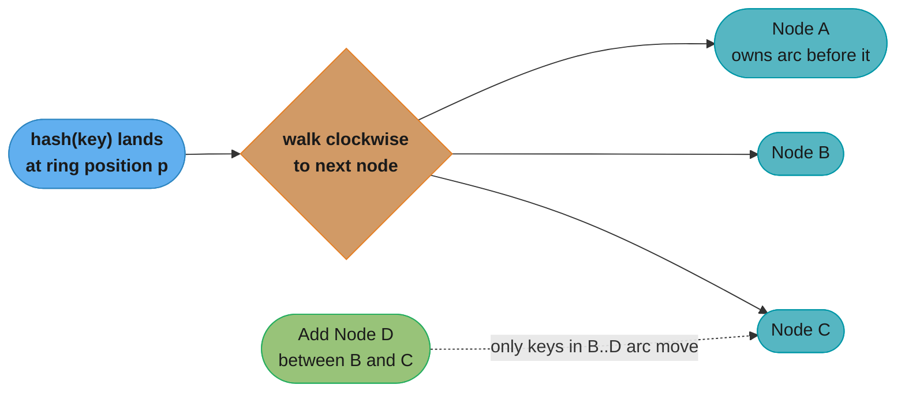

Caption: on the consistent-hashing ring a key belongs to the next node clockwise, so inserting a
node only steals the arc between it and its predecessor — the movement is O(K/N), not O(K), which
is the whole reason to prefer it over `mod N`.

#### Decoding the movement cost — `mod N` vs the ring

Both schemes have a closed form for "what fraction of the `K` keys change owner when you go from
`N` nodes to `N+1`":

```
mod N               keys moved  =  K x  N / (N + 1)      <- almost everything
consistent hashing  keys moved  =  K x  1 / (N + 1)      <- only the new node's fair share
```

**Put simply.** "`mod N` moves everything *except* the new node's share; the ring moves *only* the
new node's share." They are exact mirror images of each other, which is why the ratio between them
is simply `N` — and why the penalty for `mod N` gets *worse*, not better, as your cluster grows.

| Symbol | What it is |
|--------|------------|
| `K` | Total number of keys stored across the cluster |
| `N` | Node count before the change |
| `N + 1` | Node count after adding one machine |
| `N/(N+1)` | Fraction of keys whose `hash % N` answer differs from `hash % (N+1)` |
| `1/(N+1)` | The new node's fair share of the ring — the only arcs that must change hands |

**Walk one example.** A 1,000,000-key cluster, adding one node at three different sizes:

```
  cluster       mod N moves            ring moves          ratio
  4 -> 5        800,000 keys (80.0%)   200,000 (20.0%)      4x
  10 -> 11      909,091 keys (90.9%)    90,909  (9.1%)     10x
  100 -> 101    990,099 keys (99.0%)     9,901  (1.0%)    100x
```

The trap this exposes: `mod N` is *least* bad on the tiny cluster you prototype on and *most* bad on
the large one you run in production. At 100 nodes it moves 100x more data than the ring, so a
routine capacity addition becomes a cluster-wide data-movement storm — arriving exactly at the
moment you were already short on capacity. The ASCII table above shows the mechanism (every key's
divisor changed at once); this shows the bill.

**Virtual nodes.** Plain consistent hashing has two problems: with few nodes the arcs are uneven
(load imbalance), and a heterogeneous node (a bigger box) still owns just one arc. The fix is
**virtual nodes (vnodes)**: each physical node is hashed onto the ring at *many* points (say 100–200
vnodes each). This (1) smooths the load — many small arcs average out — and (2) lets you give a
more powerful machine *more* vnodes so it takes a proportionally larger share, handling
**heterogeneity**. When a node dies, its vnodes' arcs are redistributed across *many* remaining
nodes rather than dumped on one neighbor, spreading the recovery load.

Worked arithmetic: with 4 physical nodes and no vnodes, a random ring placement can easily leave
one node owning 40% of the keyspace and another 15% — a 2.6× imbalance. Give each node 128 vnodes
(512 points total) and the law of large numbers pulls every node's share to within a few percent
of the 25% ideal. Adding a 5th node then steals ~1/5 of the keyspace as 128 small arcs scattered
across all four existing nodes, so no single neighbor is hit hard — the reason production stores
default to hundreds of vnodes per node.

#### Decoding the vnode count — why the imbalance shrinks like `1/sqrt(V)`

The quantity operators actually watch is the **skew factor**:

```
skew factor  =  (load on the busiest node) / (mean load per node)

relative spread of node loads  ~  1 / sqrt(V)      <- V = vnodes per physical node
```

**The idea behind it.** "Each node's share is the sum of `V` independent random arcs, and averaging
`V` random things tightens the result by `sqrt(V)`." It is the central limit theorem doing capacity
planning: you are not making the ring fairer, you are making each node's share an *average* of many
draws instead of a single lucky-or-unlucky one.

| Symbol | What it is |
|--------|------------|
| `V` | Virtual nodes per physical node — how many ring positions one machine occupies |
| `N` | Physical node count (4 in the worked case above) |
| skew factor | Busiest node's load divided by the mean. `1.0` is perfect, `2.0` means twice the average |
| relative spread | Standard deviation of node loads as a fraction of the mean |
| `1/sqrt(V)` | The rate the spread shrinks: quadruple `V` to halve the imbalance |

**Walk one example.** 4 physical nodes, ring positions drawn uniformly at random, averaged over
4,000 simulated rings per row:

```
    V (vnodes/node)   ring points   mean skew factor   relative spread
          1                4             2.07              72.2%
          8               32             1.38              27.7%
         32              128             1.19              14.1%
        128              512             1.09               7.0%
        512            2,048             1.05               3.5%

  Spread halves every time V quadruples (27.7 -> 14.1 -> 7.0 -> 3.5), exactly 1/sqrt(V).
```

The single-arc case (`V = 1`) is genuinely as bad as the text claims: across 20,000 simulated rings
the *median* skew factor is 1.99 and about one ring in six lands at 2.6x or worse — so "a random
ring placement can easily leave one node owning 40% and another 15%" is the typical outcome, not a
pathological one. At `V = 128` the busiest node runs about 9% above the mean, which is the "within a
few percent of the 25% ideal" the text describes. Note the diminishing return baked into the square
root: going `V = 1 -> 128` removes 65 points of spread, while `128 -> 512` removes 3.5 — which is
why production defaults sit in the low hundreds and stop there.

### Request routing — who knows where the key lives?

Partitioning raises a second question the book is explicit about: when a client wants key `K`,
*how does it find the node that owns `K`*? There are three standard answers, trading client
complexity against an extra hop:

1. **Client-aware routing.** The client holds (a cached copy of) the partition map and computes the
   owning node itself, connecting directly — one hop, but every client must track membership
   changes.
2. **Routing tier.** A thin, stateless routing layer (or an L7 proxy) in front of the partitions
   holds the map and forwards each request to the right node — the client stays dumb, at the cost
   of an extra hop. This routing tier is a **data plane** whose map is fed by the **control plane**
   (Ch 22).
3. **Node forwarding.** The client hits *any* node; if that node does not own `K` it forwards the
   request to the one that does (gossip-based membership, as in Cassandra). Simple for clients,
   but adds internal hops.

In all three, the source of truth for "which node owns which range" is a **coordination-backed
control plane** (a consensus store like ZooKeeper/etcd, from Part II) — the map is small,
consistency-critical metadata, exactly the low-volume state a control plane manages while the data
plane serves the high-volume key traffic.

### Rebalancing strategies

As nodes are added, removed, or fail, partitions must move to keep load even — **rebalancing**. The
book contrasts the common strategies (this is the DDIA Ch 6 material Vitillo compresses):

- **Fixed number of partitions.** Create *many more* partitions than nodes up front (e.g. 1000
  partitions on 10 nodes = 100 each) and never split them; rebalancing just *reassigns whole
  partitions* to nodes. Simple and predictable, but you must guess the partition count for peak
  scale — too few and you cannot spread further, too many and each carries per-partition overhead.
- **Dynamic partitioning.** Split a partition when it exceeds a size threshold and merge when it
  shrinks (HBase, MongoDB), so the partition count tracks the data volume. Adapts automatically but
  needs the control plane to manage a changing map, and a fresh dataset starts as one hot partition
  until the first split ("pre-splitting" mitigates this).
- **Partitioning proportional to nodes.** Fix the number of partitions *per node* (Cassandra-style
  with vnodes), so adding a node splits a few existing partitions and takes a fair share.

A rebalance is expensive — it moves data over the network — so the golden rule is **rebalancing
must be deliberate, ideally operator-triggered or heavily rate-limited**, never a hair-trigger
automatic reaction to a transient failure (an automatic rebalance during a brief network blip can
cause a data-movement storm that itself looks like the failure it was reacting to, a mini
cascading failure).

### The hot-key problem partitioning cannot fix

Partitioning spreads load across *keys*, but if a **single key** is hot — one celebrity's profile,
one viral post — all its traffic lands on the one partition that owns it, and no partitioning
scheme helps, because you cannot split a single key across partitions. This is the residual hotspot
that survives even perfect hash partitioning. The remedies are application-level: **replicate the
hot key** across several partitions and read from a random one (read scaling for that key), **append
a random suffix** to split one logical key into several physical keys (at the cost of having to read
all of them), or **cache the hot key** in front of the store (Ch 20) so its reads never reach the
partition at all. The interview tell: "hash partitioning gives uniform load" is true *across* keys
but says nothing about a single dominant key.

---

## 3.4 File Storage (Ch 17)

Large immutable blobs — images, videos, backups, build artifacts, ML datasets — do not belong in
your database. They are big, they are written once and read many times, and they need
eleven-nines durability that you do not want to engineer yourself. The answer is **managed blob
storage** (Amazon S3, Azure Blob Storage, Google Cloud Storage): a service that handles
replication, durability, and elastic scale for you, exposed as a simple `PUT`/`GET` object API.
Vitillo uses **Azure Storage** as the case study for how such a system is built internally, because
its architecture is public (the SOSP 2011 paper) and cleanly layered.

### Blob storage architecture — the Azure Storage case study

Azure Storage separates concerns into **three layers**, each with a distinct job. The elegance is
that the top layer is stateless, the middle layer owns the index, and the bottom layer owns the
bytes and does the replication.

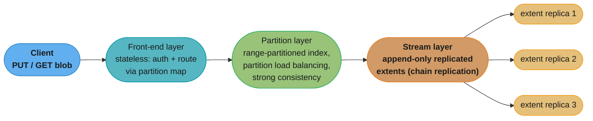

Caption: Azure Storage's three layers — a stateless front-end that only routes, a partition layer
that owns the range-partitioned index and load-balances partitions, and an append-only stream
layer that replicates immutable extents by chain replication. Append-only is what makes the
replication simple.

- **Front-end layer (stateless).** Authenticates and authorizes the request, then uses the
  **partition map** to route it to the correct partition server. Because it holds no state, you
  scale it out trivially behind a load balancer, and any front-end can serve any request.
- **Partition layer.** Owns a **range-partitioned index** (an "Object Table") mapping the
  hierarchical blob name to its location in the stream layer, and provides **strong consistency**
  and transactions over that index. A **partition manager** assigns key ranges to **partition
  servers** and performs **partition load balancing** — splitting a hot/large range and moving
  ranges between servers to even out load (dynamic range partitioning, exactly as in Ch 16). This
  layer is where the metadata brains live.
- **Stream layer.** A distributed append-only filesystem (Azure's DFS). Data lives in **streams**,
  which are ordered lists of **extents**, which are made of **blocks**. Extents are **replicated**
  (typically 3×) using **chain replication** (Part II): the write goes to the head replica, is
  forwarded down the chain, and the tail acknowledges — giving strong consistency with good read
  throughput. Crucially, extents are **append-only**: you append blocks to the current extent, and
  when it is full you **seal** it (make it immutable) and start a new one.

### The naming hierarchy

Blobs are addressed by a three-level name: **account / container / blob** (Azure) or **AccountName +
PartitionName + ObjectName** in the paper's terms. The account name is resolved via **DNS** to the
storage stamp/front-end that owns the account; the partition name is what the partition layer uses
to route to the right partition server; the object name identifies the blob within the partition.
This is how a flat-looking object key actually threads through all three layers.

```
Azure blob naming -> which layer uses which part
  https://<account>.blob.core.windows.net / <container> / <blob>
          |                                    |             |
      AccountName                        PartitionName    ObjectName
          |                                    |             |
    DNS -> storage stamp             partition layer   identifies blob
    (front-end routing)              routes to server   within partition
```

Caption: each component of the blob name is consumed by a different layer — DNS/front-end for the
account, the partition layer for the container, and the object name pins the blob inside its
partition. The name is the routing key across the whole stack.

### Inside the stream layer: extents, sealing, and read paths

The stream layer is worth a closer look because it is where the durability actually lives. Data is
appended to the *current* (unsealed) extent of a stream; an extent grows to a target size (on the
order of ~1 GB in the Azure design) and is then **sealed** — made permanently immutable — and a new
extent is started. Each extent is replicated across (typically) **three** nodes in the same storage
cluster ("stamp") for durability. The replication uses a primary/secondary chain:

- The **append** goes to the primary replica, which orders it and forwards to the secondaries.
- The append is acknowledged only when **all** replicas have persisted it — a synchronous,
  intra-stamp replication that guarantees the three copies are identical before the writer sees
  success (strong durability).
- **Reads** can be served from any replica of a sealed extent (they are byte-identical), spreading
  read load; for an unsealed extent, reads coordinate with the primary to see the latest committed
  offset.

When a node holding an extent replica dies, the stream manager (the stream layer's control plane)
notices the under-replication and **re-replicates** the extent onto a fresh node to restore the
replica count — a copy operation, not a consensus negotiation, precisely because the data is
immutable.

### Two replication tiers: intra-stamp vs inter-stamp

- **Intra-stamp replication** (within one storage cluster/region) is **synchronous** — the three
  local replicas must all ack before a write returns. This is the durability tier and it is on the
  critical write path.
- **Inter-stamp / geo-replication** (across regions) is **asynchronous** — data is copied to a
  distant region in the background for disaster recovery, so a regional disaster loses at most the
  small unreplicated tail. This is the availability/DR tier and it is deliberately *off* the
  critical path so cross-region latency never slows a write.

This "sync locally, async across regions" split is the same pattern databases use in Ch 19 and
resiliency uses in Part IV (multi-AZ sync vs multi-region async) — it is a recurring shape, not an
Azure quirk.

### Why append-only simplifies replication

The load-bearing design decision is **append-only, immutable data**. Because extents are never
updated in place — you only append, then seal — replication has no conflicting overwrites to
reconcile. There is exactly one writer appending at the tail, replicas apply appends in the same
order via the chain, and once an extent is sealed it is byte-identical everywhere and can be read
from any replica. Compare this to mutable data, where two replicas can receive conflicting updates
to the same offset and you need consensus or conflict resolution on every write. **Immutability
turns replication from an agreement problem into a copying problem** — which is exactly why blob
stores, log-structured storage, and Kafka (Ch 23) all lean on append-only designs. Azure also does
**intra-stamp** replication synchronously (within a storage cluster, for durability) and
**inter-stamp / geo-replication** asynchronously (across regions, for disaster recovery) — the
same sync-local/async-remote pattern you will see for databases in Ch 19.

---

## 3.5 Network Load Balancing (Ch 18)

To scale a stateless service out, you put many identical instances behind a **load balancer** that
spreads requests across them and hides individual instance failures. The load balancer is the
front door of the replication axis: it is what makes "just add more boxes" actually work, and it
is also what turns instance failures into non-events (a dead instance is simply removed from
rotation). This chapter covers the features every LB needs, then the three *levels* at which you
can load-balance: DNS, L4 (transport), and L7 (application).

### Why load balancing, and its features

The purposes are **scalability** (many instances share the load) and **availability** (route
around failed instances). A production LB provides:

- **Routing algorithms.** How to pick the next instance: **round-robin** (rotate evenly — fine when
  requests are uniform and instances identical), **weighted round-robin** (bigger instances get
  proportionally more), **least connections** (send to the instance with the fewest in-flight
  requests — better when request costs vary widely, since a slow request naturally holds a
  connection and steers new work elsewhere), **least response time** (favor the fastest-responding
  instance), and **hashing** (route by a key, e.g. client IP, for a form of affinity). The default
  choice is round-robin for uniform workloads and least-connections when request durations are
  skewed — round-robin can pile long requests onto one already-busy instance.
- **Health checks.** The LB must know which instances are alive. **Passive** health checks *observe
  real traffic* — an instance returning errors or timing out is marked unhealthy. **Active** health
  checks *periodically probe* a health endpoint (`/healthz`). The infamous footgun: **an overly
  aggressive or badly designed health check can take out the whole fleet**. If the health check
  depends on a shared downstream (a database) and that downstream blips, *every* instance fails the
  check at once, the LB marks the *entire* fleet unhealthy, and it removes all of them from
  rotation — a total outage caused by the safety mechanism. Health checks should be shallow, test
  the instance itself (not its dependencies), and the LB should refuse to remove the *last*
  healthy instances (fail-open) rather than route to zero.
- **Session affinity (sticky sessions).** Pin a client to one backend (via a cookie or a hash of
  the client IP) so stateful sessions land on the same instance. Necessary for some stateful
  services, but it *fights* load balancing — a hot client stays stuck on one instance, and you
  lose the freedom to rebalance. Prefer stateless instances so you never need affinity.
- **TLS termination.** The LB can terminate TLS so backends speak plaintext internally, offloading
  the handshake cost from the service.
- **Autoscaling integration & service discovery.** As autoscaling adds/removes instances, the LB's
  backend pool must update — it needs current **service discovery** (a registry of live instances)
  so new instances receive traffic and terminated ones stop receiving it.
- **Connection draining (graceful shutdown).** When an instance is deregistered (a deploy, a
  scale-in), the LB must **stop sending new requests** to it but **let in-flight requests finish**
  before it is killed — otherwise a routine deploy drops live requests. Draining is the
  quiet-but-essential feature that makes rolling deploys invisible to users.
- **Slow start / warm-up.** A freshly added instance may have cold caches and unwarmed JITs; some
  LBs ramp traffic to it gradually rather than hitting it with full load the instant it registers,
  avoiding a per-instance version of the cold-start stampede.

#### Decoding the routing algorithms — what "balanced" actually costs

The routing choices above differ in how much they *look* before they leap, and the payoff is
measured by the **maximum** load on any one instance, never the average. Spreading `m` in-flight
requests over `n` instances:

```
average load       =  m / n                            (every algorithm hits this on average)
round-robin        =  m/n  exactly                     (only if every request costs the same)
random / hash      =  m/n  +  ~sqrt( 2 (m/n) ln n )    <- one blind draw per request
power of two       =  m/n  +  ~ln(ln n) / ln 2         <- pick 2 at random, take the emptier
```

**Stated plainly.** "One blind guess leaves an imbalance that grows with the square root of the
load; peeking at two candidates and keeping the lighter one collapses that imbalance to almost
nothing." Going from inspecting one instance to inspecting *two* is the entire win — inspecting all
`n` (true least-connections) barely improves on two and costs a fleet-wide query per request.

| Symbol | What it is |
|--------|------------|
| `n` | Number of backend instances behind the load balancer |
| `m` | Requests in flight being distributed across them |
| `m/n` | Mean load per instance — what a perfect balancer would put everywhere |
| maximum load | Load on the single busiest instance; this is what saturates and times out first |
| `sqrt(2 (m/n) ln n)` | Random assignment's overshoot — grows with the square root of the mean |
| `ln(ln n)/ln 2` | Two-choices' overshoot — a small constant, 2.2 at `n = 100`, 2.8 at `n = 1000` |

**Walk one example.** 100 instances, 10,000 in-flight requests, so a mean of 100 each, averaged over
300 simulated runs:

```
  algorithm                       busiest instance   overshoot vs mean
  round-robin (uniform costs)          100.0               +0%
  random / IP-hash                     126.0              +26%
  power of two choices                 101.9               +2%

  At 1,000 instances and the same mean of 100:
  random / IP-hash                     133.9              +34%
  power of two choices                 102.1               +2%
```

Read those two groups together: as the fleet grows, random assignment gets *worse* (+26% -> +34%,
because `ln n` grows), while two-choices stays flat at +2%. That is the practical argument — you
must provision every instance for the *maximum*, so blind random routing means buying 26-34% more
fleet than the work actually requires. It also shows why round-robin's perfect column is misleading:
it balances request *counts*, not work, so the moment request costs vary it degrades toward the
random row — and the least-connections family, of which two-choices is the cheap approximation, is
what actually holds the line.

### DNS load balancing — cheap, coarse, slow to fail over

The simplest form: publish multiple A records for one hostname (or rotate them), and let clients
pick. It costs nothing and requires no dedicated LB box, but it has three serious limits:

- **Coarse.** The *client* chooses among the returned IPs; you have almost no control over the
  distribution.
- **No health awareness.** DNS hands out IPs regardless of whether a server behind one is up.
- **Slow failover (the big one).** DNS responses are cached everywhere — the client, the OS, the
  resolver, intermediate resolvers — governed by the record's **TTL**. When a server dies, clients
  keep resolving to its (now-dead) IP until their cached record expires, and **many resolvers
  ignore the TTL** and cache longer anyway. So a failed server keeps receiving traffic for minutes
  after it dies. This is why DNS is used for *coarse, geographic* steering (send you to the right
  region), not for fast within-region failover.

### L4 (transport-layer) load balancing

An **L4** load balancer operates at the TCP/UDP layer. It routes based on the **connection tuple**
(source IP+port, destination IP+port, protocol) and forwards packets without understanding what is
inside them. Clients connect to a **VIP** (virtual IP) that fronts the pool; the LB picks a backend
per *connection* and pins that connection to it for its lifetime.

- **Fast and cheap.** It shuffles packets, does not parse HTTP, does not terminate TLS — very low
  overhead and very high throughput.
- **Direct Server Return (DSR).** In some designs the backend replies **directly to the client**,
  bypassing the LB on the way out; the LB only sees the (smaller) inbound path. This lets one LB
  front enormous outbound bandwidth.
- **Blind to HTTP.** Because it cannot see inside the connection, it cannot route by URL path,
  header, or cookie, and cannot do per-*request* load balancing — everything on one connection
  goes to the same backend.

### L7 (application-layer) load balancing

An **L7** load balancer **terminates TCP and TLS and parses the HTTP** (or gRPC) request. This
unlocks:

- **Per-request routing.** It can route by path (`/api/*` → service A, `/img/*` → service B),
  header, method, or cookie, and it can **multiplex** many client requests over a smaller pool of
  reused backend connections.
- **Content-based features.** Rewrites, retries, response caching, compression, request collapsing.
- **Cost.** It does real work per request (parse, terminate TLS), so it uses more CPU than an L4
  LB — you trade throughput for intelligence.

**Sidecar / service-mesh variant.** In a service mesh (Istio/Envoy, Linkerd) the L7 proxy runs as a
**sidecar** next to *every* service instance, and a **control plane** (Ch 22) pushes routing,
retry, circuit-breaking, and mTLS config to all the sidecars. Load balancing, security, and
resiliency policy move *out* of the application and into the mesh's data plane. This is a direct
setup for the control-plane/data-plane split.

### The load balancer must not itself be a single point of failure

A load balancer exists to remove instances as single points of failure — so if the LB itself is a
single box, you have just relocated the SPOF. Production designs make the LB redundant:

- **Redundant LB instances** in active-active or active-passive pairs, fronted by a floating/virtual
  IP or by DNS returning several LB addresses (DNS's one legitimate fast-enough use — coarse
  distribution across *already-redundant* LBs, not per-request failover).
- **Anycast in front of L4** so many LB instances share one IP and the network routes around a dead
  one.
- **Tiered LBs**: an L4 layer (huge throughput, connection distribution) in front of an L7 layer
  (smart per-request routing) — the pattern large clouds use (e.g. an L4 network LB in front of L7
  application LBs). Each tier is independently scaled and made redundant.

The mental model: the LB is a **data plane** whose backend list is fed by a **control plane**
(service discovery); keep that dependency soft (Ch 22) so the LB keeps routing to its last-known
pool even if service discovery is momentarily unreachable.

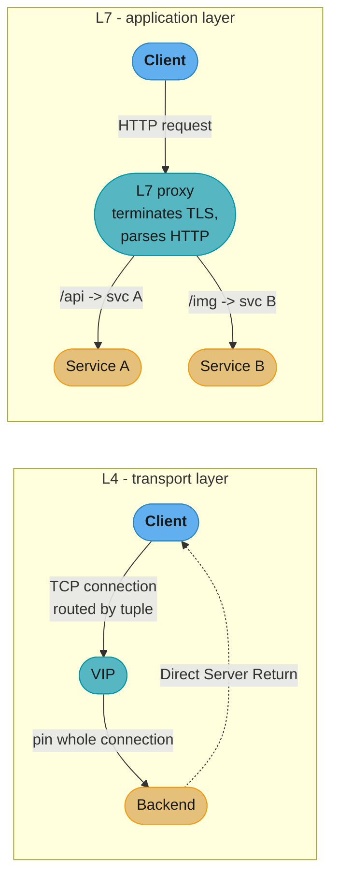

Caption: L4 routes an opaque connection by its tuple and can let the backend reply directly to the
client (cheap, fast, HTTP-blind); L7 terminates TLS, reads the HTTP, and routes each request by
content (smart, per-request, more CPU). The choice is throughput vs request-level control.

---

## 3.6 Data Storage (Ch 19)

The database is Cruder's hardest bottleneck because it is *stateful* — you cannot just clone it
like a stateless web server. This chapter scales the data tier with the same two axes as before —
**replication** (copies for read scale and availability) and **partitioning** (shards for write
scale and capacity) — and then surveys **NoSQL** as the family of stores designed for horizontal
scale from the start.

### Database replication

Keep multiple copies of the data so reads can spread across replicas and a node failure does not
lose the database.

- **Leader–follower (primary–replica).** All writes go to the **leader**, which streams its
  changelog to **followers**; reads can be served by any replica. This is the workhorse pattern
  (PostgreSQL streaming replication, MySQL replication).
- **Synchronous vs asynchronous replication.** *Synchronous*: the leader waits for a follower to
  acknowledge before confirming the write — the follower is guaranteed up to date, but a slow or
  down follower **blocks writes** (and the more sync followers, the slower and more fragile writes
  become). *Asynchronous*: the leader confirms immediately and replicates in the background —
  fast, but if the leader crashes before a write reaches the followers, that **write is lost**.
  Most systems use a middle ground (one sync follower, the rest async — "semi-sync").
- **Read replicas** offload read-heavy workloads: point read traffic at followers, keep the leader
  for writes. Great for read-dominated apps. Note the asymmetry: read replicas scale *reads*
  linearly (add followers) but do **nothing** for *write* throughput — every write still goes
  through the single leader, so a write-bound workload needs **partitioning**, not more replicas.
- **Multi-leader and leaderless variants.** Beyond single-leader, replication comes in two other
  shapes (the Part II / DDIA Ch 5 material). *Multi-leader*: several leaders accept writes (e.g. one
  per region) and replicate to each other, which improves write availability and local latency but
  introduces **write conflicts** that need resolution (last-write-wins, version vectors, CRDTs).
  *Leaderless* (Dynamo-style): any replica accepts writes and reads, using **quorums** (W + R > N)
  and read-repair/anti-entropy to converge — high availability, tunable consistency, but you must
  reason about stale reads and conflicts yourself.
- **Replication-lag anomalies.** With async replicas, a follower can be seconds behind, and reads
  from it are **stale**. This breaks intuitive guarantees: **read-your-own-writes** (you post a
  comment, then a read hits a lagging replica that does not have it yet — your comment
  "disappeared"), **monotonic reads** (successive reads hitting replicas at different lag can go
  *backwards* in time), and **consistent-prefix** violations. Fixes: read-your-writes routing
  (send a user's reads to the leader or to a replica known caught-up for a window after they
  write), version tokens, or accept the staleness where it is harmless. (These consistency models
  are the Ch 10 material of Part II applied to databases.)

### Database partitioning

Split the data across shards when it no longer fits on (or can be written fast enough by) one node
— the same range vs hash choice as Ch 16, now applied to the primary store. Partitioning the
database unlocks write scale and capacity, but it breaks things a single-node database gave you for
free:

- **Joins become scatter-gather.** A join across data on different partitions must query every
  relevant partition and merge — slow and hard to keep transactional. You avoid it by
  **co-locating** related data in the same partition (choosing the partition key so joined rows
  land together) or by denormalizing.
- **Cross-partition transactions.** A transaction spanning partitions needs distributed atomic
  commit (2PC — Part II), which is slow and reduces availability. The pragmatic move is to design
  so transactions stay within a single partition.
- **Secondary-index locality.** A secondary index can be **local (document-partitioned)** — each
  partition indexes only its own rows, so a query by the secondary key must scatter-gather across
  all partitions — or **global (term-partitioned)** — the index itself is partitioned by the index
  term, so a lookup hits one index partition but writes must update a possibly-remote index
  partition. You trade read scatter for write locality.

### Combining replication and partitioning

In practice you use **both axes at once**: the data is partitioned into shards *and* each shard is
replicated. So a cluster is a grid — N partitions × R replicas — where each partition has its own
leader and followers, and different partitions' leaders are spread across nodes so every machine is
both a leader for some partitions and a follower for others (balancing write and read load). This
is why "sharded and replicated" is the default shape of every large database (Cassandra, MongoDB,
Elasticsearch, Kafka's own partitioned-replicated log): partitioning gives you write/capacity
scale, replication gives you read scale and fault tolerance, and you need both.

But sequence matters: **replicate before you partition**. Read replicas and caching are far cheaper
and less invasive than sharding, which permanently complicates joins, transactions, and secondary
indexes. So the pragmatic ladder is scale up → add read replicas and caching → and only shard when
writes or data *size* genuinely exceed one leader — because a premature shard is very hard to undo
and imposes the scatter-gather and cross-partition-transaction taxes on a system that did not need
them yet.

### NoSQL

**NoSQL** stores emerged to serve the two axes at internet scale, tracing to two seminal 2000s
systems: **Google Bigtable** (wide-column) and **Amazon Dynamo** (key-value, leaderless,
consistent-hashing). The families:

| Type | Model | Examples |
|------|-------|----------|
| Key-value | Opaque value by key | DynamoDB, Redis, Riak |
| Document | Self-describing JSON-ish documents | MongoDB, Couchbase |
| Wide-column | Rows with dynamic column families | Cassandra, Bigtable, HBase |
| Graph | Nodes and edges | Neo4j, Neptune |

Defining characteristics and tradeoffs:

- **Schema-on-read vs schema-on-write.** NoSQL stores are typically **schema-on-read**: the store
  holds opaque/flexible records and the *application* interprets structure at read time (flexible,
  no migrations to add a field). SQL is **schema-on-write** (the schema is enforced on insert).
- **Historically limited transactions and joins.** Early NoSQL traded multi-object transactions,
  joins, and rich queries away in exchange for horizontal scale and availability — the very
  features Part II showed are expensive across partitions. (Modern NoSQL has clawed some back:
  DynamoDB transactions, MongoDB multi-document transactions.)
- **Access-pattern-first / single-table design.** Because you cannot cheaply join, you model the
  data **around the queries you will run**: denormalize, duplicate data, and pack related items so
  each query hits one partition. In DynamoDB this becomes **single-table design** — one table
  holding multiple entity types, keyed so that access patterns map to single-partition lookups.
  You design the *data layout* from the *query list*, the inverse of relational normalization.

Worked example — the same data, relational vs single-table. Say Cruder has *users* and their
*orders*, and the hot query is "get a user and their recent orders":

```
RELATIONAL (normalized): two tables, join at read time
  users(  user_id PK, name, email )
  orders( order_id PK, user_id FK, total, created_at )
  query: SELECT * FROM users u JOIN orders o ON o.user_id = u.user_id
         WHERE u.user_id = 42 ORDER BY o.created_at DESC LIMIT 10
  -> once sharded, users and orders may live on different partitions -> scatter-gather join

SINGLE-TABLE (access-pattern-first): one table, co-located by partition key
  PK (partition)   SK (sort)              attributes
  USER#42          PROFILE                name, email
  USER#42          ORDER#2026-07-01#a1    total, ...
  USER#42          ORDER#2026-06-28#b7    total, ...
  query: partition-key = USER#42, sort-key begins_with ORDER#, descending, limit 10
  -> user profile AND recent orders in ONE single-partition read, no join, no scatter
```

Caption: single-table design pre-joins the data physically by giving related items the same
partition key, so the hot access pattern becomes one single-partition lookup — you trade write-time
duplication and up-front modeling for a read that scales flat. It only works because you modeled it
from the *query*, which is why NoSQL modeling is access-pattern-first.

### SQL vs NoSQL — the decision

Choose **SQL** when you need rich ad-hoc queries, joins, multi-object ACID transactions, and strong
consistency at moderate-to-large (but not extreme) scale, and when your access patterns will
evolve. Choose **NoSQL** when you need massive horizontal write scale, predictable known access
patterns, flexible/evolving schema, and can live with weaker transactional guarantees. The honest
answer is usually "start relational; reach for NoSQL for the specific workloads (huge scale, simple
access patterns) that justify it," and many systems use both (**polyglot persistence** — the right
store per workload). The trap is choosing NoSQL for *scale you do not have yet* and then discovering
you need the ad-hoc queries and transactions you gave away; and the opposite trap is forcing a
genuinely huge, simple-access-pattern workload onto a single relational leader that cannot keep up.

---

## 3.7 Caching (Ch 20)

Ch 14 cached HTTP responses at the client and edge; this chapter caches *inside* your system —
database query results, computed values, rendered fragments — to cut latency and offload the
origin (usually the database). Caching is the highest-leverage scalability tool in the book and
also the source of its most dangerous failure mode, so Vitillo is careful about *when* it helps
and *how it kills you* when it goes down.

### When a cache helps

A cache is worthwhile only when the numbers work out:

- **High hit ratio.** The cost of a *miss* is a cache lookup *plus* the origin fetch *plus* a cache
  write — strictly more work than not caching. You only come out ahead if hits vastly outnumber
  misses. A low-hit-ratio cache is pure overhead.
- **Skewed access.** Caching pays when a small hot set is requested far more than the rest (a
  power-law/Zipfian distribution) — the hot keys stay resident and serve most traffic.
- **Tolerable staleness.** A cache serves data that may be out of date; it only fits workloads that
  can accept some staleness (a slightly-old like count is fine; a bank balance for a transfer
  decision is not).
- **Expensive origin.** The bigger the gap between a cache hit and recomputing/refetching (a slow
  query, an aggregation, a remote call), the more a cache buys you.

The arithmetic makes "high hit ratio" precise. With hit ratio `h`, cache latency `Lc`, and origin
latency `Lo`, the average latency is `Lavg = h·Lc + (1−h)·(Lc + Lo)` — every request pays the cache
lookup, and misses additionally pay the origin. If `Lc = 1 ms` and `Lo = 50 ms`:

```
hit ratio h   avg latency   origin load (misses)
   0%           51 ms          100%   (cache is pure overhead here)
  50%           26 ms           50%
  90%          6.0 ms           10%
  95%          3.5 ms            5%
  99%          1.5 ms            1%
The win is super-linear at the top: 90% -> 99% cuts origin load 10x (10% -> 1%)
and halves latency again. This is WHY the cache quietly becomes load-bearing:
at 95%+ the origin only ever sees a sliver of traffic and gets provisioned for it.
```

Caption: cache value is dominated by the *miss* rate `(1−h)`, so the last few percent of hit ratio
carry most of the benefit — and most of the hidden risk, since a 95%-hit origin is sized for 5% of
load and cannot survive the cache vanishing.

#### Decoding the cache equation — read the miss rate, never the hit rate

The formula above simplifies to something you can do in your head, and the simplification is the
whole insight:

```
Lavg = h.Lc + (1 - h)(Lc + Lo)
     = Lc + (1 - h) . Lo          <- the h terms cancel; only the MISS rate survives

origin load = (1 - h) x total request rate
```

**What the formula is telling you.** "You always pay the cache lookup; everything else you pay is
the miss rate times the origin's cost." Both the latency and the load reduce to a single lever,
`(1-h)` — so the correct habit is to quote caches by their **miss** rate, because that is the number
that is actually linear in what you care about.

| Symbol | What it is |
|--------|------------|
| `h` | Hit ratio — share of requests the cache answers itself |
| `(1 - h)` | Miss rate. The only term that matters; halve it and you halve both latency-over-`Lc` and origin load |
| `Lc` | Cache lookup latency, paid on *every* request, hit or miss (1 ms here) |
| `Lo` | Origin latency, paid only on a miss and added on top of `Lc` (50 ms here) |
| `Lc + (1-h).Lo` | Average latency — a fixed floor of `Lc` plus a miss-rate-scaled origin tax |

**Walk one example.** The same `Lc = 1 ms`, `Lo = 50 ms`, now at 10,000 req/s, walking the hit
ratios people actually argue about:

```
    h        miss rate    avg latency    origin req/s    change from row above
  0.80         20%          11.0 ms          2,000            -
  0.90         10%           6.0 ms          1,000        origin load HALVED
  0.95          5%           3.5 ms            500        origin load HALVED again
  0.99          1%           1.5 ms            100        origin load cut 5x

  80 -> 90 buys 10 points of hit ratio and halves the backend.
  90 -> 95 buys  5 points of hit ratio and halves the backend AGAIN.
  95 -> 99 buys  4 points of hit ratio and cuts the backend 5x.
```

That is the counter-intuitive part worth memorising: **equal halvings of backend load cost
progressively fewer points of hit ratio.** "We improved the cache from 90% to 95%" sounds like a 5%
tweak and is in fact a 2x capacity win; "we improved it from 50% to 55%" sounds identical and is
worth 10%. Talking in hit ratios makes those two indistinguishable, which is why the miss rate is
the number to put on the dashboard.

### Policies: expiration vs eviction

Two independent policies govern a cache entry's life:

- **Expiration (TTL).** A time-to-live bounds **staleness** — after the TTL the entry is
  invalidated regardless of memory pressure. TTL is how you cap how wrong the cache can be.
- **Eviction.** When the cache is **full**, which entry to drop to make room: **LRU** (least
  recently used — evict the coldest, the common default), **LFU** (least frequently used — better
  for stable hot sets), **FIFO**, or random. Eviction is about *space*; expiration is about *time*.

#### Decoding the TTL — staleness and hit ratio are the same dial

For a single key requested at a steady rate `r`, a TTL of `T` seconds admits at most **one** origin
fetch per `T` seconds, no matter how much traffic the key gets:

```
origin fetches per second for that key  =  1 / T          (independent of r!)
hit ratio for that key                  =  1 - 1/(r . T)  (when r.T >= 1)
worst-case staleness                    =  T seconds
```

**In plain terms.** "The TTL is simultaneously your staleness budget and your hit ratio — you cannot
tighten one without loosening the other." There is no third knob: every millisecond of freshness you
demand is bought with an origin fetch.

| Symbol | What it is |
|--------|------------|
| `r` | Request rate for this one key, in requests per second |
| `T` | TTL in seconds — how long a cached copy is allowed to be reused |
| `r . T` | Requests that arrive within one TTL window; the first is the miss, the rest are hits |
| `1/T` | Origin fetches per second for the key — set purely by the TTL, not by traffic |
| `1 - 1/(r.T)` | Hit ratio: one miss out of every `r.T` requests |

**Walk one example.** Three keys with very different popularity, the same TTL ladder:

```
                       T = 1 s        T = 10 s       T = 60 s      T = 300 s
  hot key,  r = 100/s   h = 99.00%    h = 99.90%    h = 99.98%    h = 99.99%
  warm key, r =  10/s   h = 90.00%    h = 99.00%    h = 99.83%    h = 99.97%
  cold key, r =   1/s   h =  0.00%    h = 90.00%    h = 98.33%    h = 99.67%

  Origin fetches per key per second: 1.0000, 0.1000, 0.0167, 0.0033 -- the SAME for every row.
```

Two things fall out. First, **a hot key barely needs a TTL** — at `r = 100/s`, a one-second TTL
already hits 99%, so there is rarely a reason to accept minutes of staleness on your hottest data.
Second, a cold key at `r = 1/s` with `T = 1 s` has a **0% hit ratio** — every request misses, and by
the "when a cache helps" rule above it is strictly *more* work than not caching, since you pay a
lookup, a fetch, and a write for every request. Short TTLs on rarely-read keys are the classic way
a cache becomes pure overhead. And notice the middle column: the origin's load is set entirely by
`1/T`, which is why raising a TTL from 1 s to 10 s cuts origin traffic 10x regardless of how popular
the key is.

### Local (in-process) cache

Cache data **inside the service process's own memory** (a `HashMap`, Caffeine, Guava cache).

- **Pro: zero network hop.** The fastest possible cache — an in-memory lookup, no serialization, no
  RTT.
- **Con: per-instance duplication.** With N service instances you have N independent caches holding
  N copies of the hot set, and a cold key must be fetched from origin **once per instance** — the
  effective hit ratio is worse than a single shared cache, and you burn N× the memory.
- **Con: cold-start miss storm.** On a restart or deploy each instance starts with an *empty* cache;
  a fleet-wide rolling restart means every instance simultaneously misses on the hot keys and
  **stampedes the origin** (see below).
- **Con: consistency drift.** Because each instance caches independently, two instances can hold
  *different* values for the same key (one refreshed, one not) — the same user can get different
  answers depending on which instance served them.

Local caches are ideal for small, extremely hot, staleness-tolerant data (feature flags, config,
a tiny lookup table).

### External (shared) cache

Run a dedicated cache tier — **Redis or Memcached** — that all instances share over the network.

- **Pro: one shared copy.** No per-instance duplication; a value fetched by any instance is
  available to all, so the hit ratio and memory efficiency are far better, and instances agree
  (less drift).
- **Pro: decoupled sizing.** The cache's capacity is independent of any single instance's memory;
  scale the cache tier on its own.
- **Con: extra hop and ops cost.** Every access is now a network round trip, and you have another
  distributed system to run, monitor, scale, and fail.

**Cache-aside (lazy loading)** is the dominant usage pattern: the application checks the cache; on
a **hit** it returns the value; on a **miss** it reads the origin, **populates** the cache, and
returns. It is simple, resilient (a cache outage just means more origin reads), and only caches
what is actually requested — but it suffers cold-start misses and can serve stale data if a write
does not invalidate. The write-side strategies:

| Write strategy | What happens on write | Pro | Con |
|----------------|-----------------------|-----|-----|
| Write-through | Write cache **and** origin synchronously | Cache always fresh; no lost writes | Every write pays both; caches data never read |
| Write-back (write-behind) | Write cache now, flush to origin later | Fast writes, batches origin load | Data loss if cache dies before flush |
| Write-around | Write origin only; cache filled lazily on read | Avoids caching write-only data | First read after write is a miss |
| Cache-aside invalidate | Write origin, then delete the cache key | Simple, self-correcting | Brief stale window; ordering matters |

A subtle **broken → fix** on cache-aside write ordering:

```
BROKEN: update cache first, then origin (or delete-then-repopulate with a concurrent reader)
  T1 (writer): SET cache[k] = new        <-- cache now = new
  T2 (writer): ... origin write fails/reorders ... origin still = old
  Readers now serve `new` from cache while origin holds `old` -> cache and origin disagree,
  and because the cache is trusted, the wrong value can persist past the TTL.
  Worse race: reader misses, reads old from origin, and writes old INTO the cache
  AFTER the writer already deleted it -> stale value cached indefinitely.

FIX: write origin first, then INVALIDATE (delete, not update) the cache key
  T1: write origin = new
  T1: DELETE cache[k]                     <-- next read misses and refills from origin
  Deleting (not setting) avoids caching a value the writer computed from a stale read,
  and writing origin first means a crash leaves the cache merely empty, never wrong.
  For the residual read-fill race, use a short TTL or versioned keys.
```

Caption: the safe cache-aside write order is **origin first, then delete the key** — updating the
cache before the origin, or setting instead of deleting, opens races where the cache ends up holding
a value the origin never durably stored. Invalidation beats update because a deleted key can only
cause an extra miss, never a wrong answer.

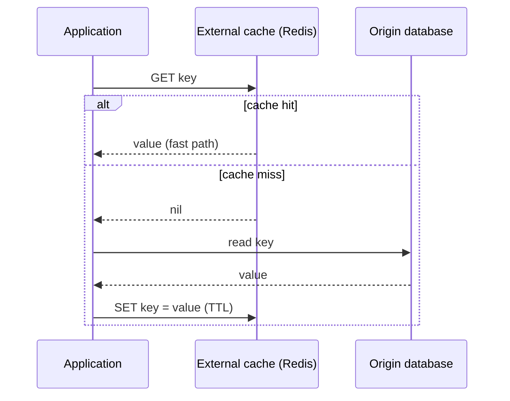

Caption: cache-aside — the application owns the cache/origin dance, filling the cache only on a
miss; the origin is the source of truth and the cache is a disposable accelerator that can be
flushed at any time.

### Cache stampede (thundering herd) and its protection

The classic failure: a **hot key expires** (or a cold cache after a restart), and *many concurrent
requests* all miss at the same instant, so they **all hit the origin simultaneously** to recompute
the same value — a thundering herd that can knock the origin over. It is worst exactly for the
hottest keys, because they have the most concurrent readers. Protections:

- **Request coalescing / locking.** Let only **one** request recompute the value on a miss; the
  others **wait** for it and share the single result (a per-key lock or a "single-flight"
  primitive). One origin fetch instead of thousands.
- **Probabilistic early expiration (XFetch).** Refresh a key *before* it expires, with a
  probability that rises as the TTL approaches — so one lucky early request refreshes it while it
  is still fresh and serving, and the herd never all miss at once.
- **Staggered TTLs (jitter).** Add randomness to TTLs so a batch of keys populated together does
  not all expire at the same instant.
- **Serve-stale / stale-while-revalidate.** Serve the slightly-stale value while one background
  request refreshes it, so no user waits on the miss and the origin sees one refresh.

### Two more practical knobs: negative caching and warming

- **Negative caching.** Cache the *absence* of a result too — a `404`/"not found" or an empty query
  result — for a short TTL. Without it, a flood of requests for a non-existent key (a common attack
  or a broken client) misses every time and hammers the origin, since a miss normally means "go ask
  the origin." Caching the negative answer briefly turns that flood into cache hits. Keep the TTL
  short so a key that later *appears* is not hidden for long.
- **Cache warming.** Pre-populate the cache with known-hot keys *before* they are needed — on
  deploy, on a scheduled job, or by replaying recent access logs — so a cold cache after a restart
  does not start from zero and stampede the origin. This directly counters the cold-start problem of
  local caches and the fleet-wide restart stampede.

### The cache is never the source of truth

State this as a rule: **the cache is disposable, the origin is authoritative.** You must be able to
flush the entire cache at any moment and lose only performance, not data. Never store the only copy
of anything in the cache.

### The load-bearing cache — the failure mode that ends the chapter

This is the single most important pitfall in Part III. Over time a cache absorbing (say) 95% of
reads means the origin only ever sees 5% of traffic — so, quietly, **the origin is now provisioned
for only 5% of the real load**. The cache has become **load-bearing**: not a performance
optimization but a hidden hard dependency. Now the cache tier goes down (or gets flushed, or a
network partition isolates it). Instantly **100% of reads fall through to an origin sized for 5%**.
The origin melts, requests pile up, timeouts trigger retries that add *more* load, and you get a
**cascading failure** (Part IV) — an outage *caused by the very cache that was supposed to prevent
one*. Mitigations:

- **Capacity-plan the origin for cache-down**, or at least for a large drop in hit ratio — know
  what happens when the cache disappears and make sure the origin (with load shedding) survives it.
- **Make the cache tier itself redundant** (replicated Redis, multiple nodes) so a single cache
  node failure does not flush everything.
- **Prevent the fall-through stampede**: on cache-down, **load-shed** at the origin (reject excess
  early with 503, Part IV) rather than letting it collapse, and use request coalescing so the
  refill is not a herd.
- **Watch the hit ratio as a dependency signal** — a slowly rising hit ratio means the origin is
  quietly becoming unable to stand on its own.

#### Decoding the load-bearing multiplier

The size of the disaster has a one-line closed form. If the origin normally serves `(1-h)` of the
traffic and the cache disappears, it must suddenly serve all of it:

```
fall-through amplification  =  1 / (1 - h)

               =  (load with cache down) / (load the origin was sized for)
```

**Read it like this.** "Your hit ratio is not a performance number, it is the multiplier on your
next outage." The very metric the team celebrates for going up is the same metric that says how far
the origin will be over capacity the moment the cache blinks.

| Symbol | What it is |
|--------|------------|
| `h` | Steady-state hit ratio |
| `(1 - h)` | Fraction of real traffic the origin normally sees — and therefore what it got sized for |
| `1/(1 - h)` | Instantaneous load multiplier when the cache is flushed, partitioned, or lost |

**Walk one example.** Same 10,000 req/s service, and what the origin faces at t=0 of a cache outage:

```
    h        origin sized for      load on cache-down      amplification
  0.80          2,000 req/s            10,000 req/s             5x
  0.90          1,000 req/s            10,000 req/s            10x
  0.95            500 req/s            10,000 req/s            20x
  0.99            100 req/s            10,000 req/s           100x

  Every improvement in hit ratio moved the LEFT column down and the RIGHT column not at all.
```

This is why the chapter treats the load-bearing cache as the defining pitfall of Part III rather
than an operational footnote. The team that heroically pushed the hit ratio from 95% to 99% cut
origin cost 5x *and* moved the cache-down amplification from 20x to 100x — a real efficiency win
that simultaneously made the failure mode five times worse, with no alert firing anywhere. The
mitigations above are all versions of one rule: **capacity-plan against `1/(1-h)`, not against the
`(1-h)` you observe on a good day.**

---

## 3.8 Microservices (Ch 21)

The last axis of the scale cube is **functional decomposition**: split the monolith into
independent **microservices**, each owning one business capability, deployable and scalable on its
own. This scales *teams and change* as much as load. Vitillo is deliberately even-handed —
microservices solve real problems and create a pile of new ones, and the chapter's practical thrust
is "start with a monolith; decompose only when the pain justifies it."

### Benefits of functional decomposition

- **Independent deployment.** Each service ships on its own cadence without a coordinated
  big-bang release — you can deploy the payments service ten times a day without touching search.
- **Team autonomy.** Small ("two-pizza") teams own a service end to end (Conway's law working *for*
  you), reducing cross-team coordination.
- **Technology heterogeneity.** Each service can pick the language, framework, and datastore that
  fit its job.
- **Independent scaling.** Scale only the hot service (spin up more instances of the checkout
  service on Black Friday) instead of scaling the whole monolith.
- **Fault isolation / smaller blast radius.** *If designed well*, one service crashing degrades
  only its capability rather than taking the whole application down — the recommendations service
  falling over should leave checkout working, just without recommendations (graceful degradation).

Each benefit is really a form of **decoupling**: independent deploy decouples *release schedules*,
team autonomy decouples *organizations*, independent scaling decouples *capacity decisions*, and
fault isolation decouples *failure domains*. The unifying idea is that a monolith couples all of
these into one unit — you cannot deploy, scale, staff, or fail one part without affecting the whole
— and decomposition buys back that independence. The catch, repeated throughout the chapter, is that
you only *get* the decoupling if the service boundaries are drawn along real seams; draw them wrong
and you keep all the coupling while adding network calls (the distributed monolith).

### Caveats — the costs nobody advertises

- **The distributed-monolith trap.** If services are so coupled that they must be deployed together,
  share a database, or call each other synchronously in long chains, you have paid the full cost of
  distribution (network calls, partial failure, latency) and gained **none** of the benefits — the
  worst of both worlds. Boundaries drawn wrong (not along real business seams) produce this.
- **Operational burden.** N services means N deploy pipelines, N dashboards, N on-call surfaces, N
  sets of alerts; you need mature CI/CD, observability (distributed tracing — Part V), and platform
  tooling *before* microservices pay off.
- **Cross-service transactions are gone.** You can no longer wrap a change to two services in one
  ACID transaction; you drop to **eventual consistency**, **sagas**, and idempotent compensations
  (the Ch 13 material of Part II), which is genuinely harder to reason about.
- **Testing and debugging get harder.** A bug now spans process and network boundaries; you need
  integration/contract tests and distributed tracing to follow a request through the fan-out.
- **Resume-driven / premature adoption.** Teams adopt microservices for hype or CV-building before
  their scale or team size warrants it, importing all the costs with none of the need.
- **Start with a monolith.** The book's explicit advice: build a well-modularized **monolith**
  first; extract a service only when a *specific* pain (a team blocked by deploy coupling, one
  component needing independent scale) makes the tradeoff worth it. Decomposition is a response to
  pain, not a starting architecture.

### The infrastructure microservices demand

Functional decomposition only pays off if the platform underneath it exists, and the book is blunt
that these are prerequisites, not nice-to-haves:

- **Service discovery.** With services scaling up and down constantly, they cannot hard-code each
  other's addresses; they need a registry (Consul, etcd, Kubernetes DNS) that maps a service name
  to its current live instances — the same control-plane-fed data plane pattern as the load
  balancer.
- **Inter-service communication + resiliency.** Every synchronous call is now a network call that
  can time out or fail, so callers need timeouts, retries with backoff, and circuit breakers
  (Part IV) — usually provided by the service mesh so application code stays clean.
- **Distributed data and eventual consistency.** Because you cannot span services in one ACID
  transaction, a business operation touching several services becomes a **saga**: a sequence of
  local transactions where each step publishes an event that triggers the next, and a failure runs
  **compensating** transactions to undo prior steps (the Ch 13 material of Part II). This is
  eventual consistency with explicit rollback logic — powerful but genuinely harder than a single
  `BEGIN...COMMIT`.
- **Observability.** A request now fans out across many services, so you need centralized logging,
  metrics, and **distributed tracing** (Part V) to answer "which of the twelve services made this
  request slow?" — without it, debugging is guesswork.

### API gateway

Once you have many services, you do not expose them all directly to clients — you put an **API
gateway** in front as the single entry point. Its responsibilities:

- **Routing.** Map external routes (`/orders`, `/users`) to the correct internal service.
- **Composition / aggregation.** Fan out one client request to several services and combine their
  responses into one (so a mobile client makes one call, not five). **Caution:** composition
  **multiplies availability risk** — if the gateway must call five services each at 99.9% to answer
  one request, the combined availability is 0.999^5 ≈ 99.5%, *worse* than any single dependency.
  Fan-out trades round trips for a lower aggregate availability.
- **Protocol translation.** Speak client-friendly REST/GraphQL externally while calling internal
  services over gRPC or other protocols.
- **Cross-cutting offload.** Authentication, authorization, **rate limiting** (Part IV), TLS
  termination, and response caching happen once at the gateway instead of in every service.
- **GraphQL / BFF variants.** A GraphQL gateway lets clients request exactly the fields they need;
  a **backend-for-frontend (BFF)** runs a *separate* gateway per client type (web, iOS, Android) so
  each gets a tailored API.
- **The gateway is its own scaling and ownership concern.** It becomes a critical shared component
  on the request path of *everything* — a potential bottleneck and single point of failure that
  needs its own scaling, its own on-call, and clear ownership, or it turns into a contention point
  where every team fights over gateway config.

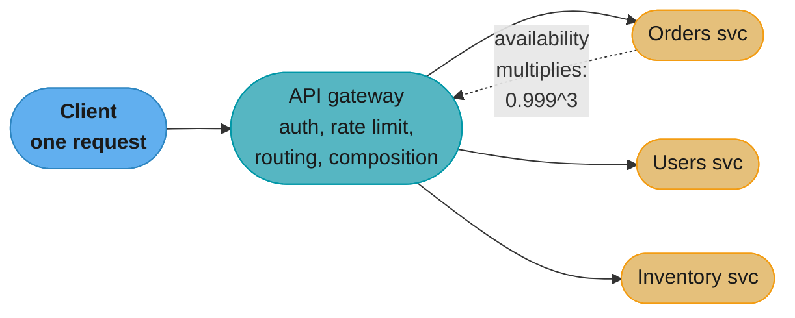

Caption: the gateway hides the service fan-out behind one client call and centralizes cross-cutting
concerns — but every service it must call to compose a response multiplies into a lower aggregate
availability, so composition is not free.

### Decoding the composition tax — availability multiplies, it does not average

The `0.999^5` above is worth unpacking, because it is the single most-quoted number in a
microservices interview and the intuition it breaks is a strong one:

```
A_composite = p1 x p2 x ... x pN     =  p^N   when every dependency is equally reliable

downtime per year = 525,600 minutes x (1 - A_composite)
```

**What this actually says.** "A composed request succeeds only if *every* hop succeeds, so the
weakest link does not set your availability — the *product* of all the links does, and it is always
worse than the worst one." People instinctively average reliabilities; the operation is
multiplication, and multiplying numbers below 1 only ever goes down.

| Symbol | What it is |
|--------|------------|
| `p` | One dependency's availability, e.g. `0.999` — three nines |
| `N` | Number of dependencies that must ALL answer for the composed request to succeed |
| `p^N` | Composite availability of the fan-out |
| `1 - p^N` | Composite failure rate — this is the number that grows roughly linearly in `N` |
| `525,600` | Minutes in a year, for turning a ratio into downtime you can feel |

**Walk one example.** Every dependency at a solid 99.9%, varying only the fan-out width:

```
    N        composite availability     annual downtime
     1              99.9000%              525.6 min   (8.8 h)
     2              99.8001%            1,050.7 min  (17.5 h)
     3              99.7003%            1,575.2 min  (26.3 h)
     5              99.5010%            2,622.7 min  (43.7 h)   <- the book's 0.999^5
    10              99.0045%            5,232.4 min  (87.2 h)
    20              98.0189%           10,412.7 min (173.5 h)
    50              95.1206%           25,646.3 min (427.4 h)

  Downtime is very nearly N x 525.6 min -- each dependency you add donates its full
  outage budget to every request that touches it.
```

The rule of thumb hiding in that table: for small failure rates, `1 - p^N` is approximately
`N x (1-p)`, so **failure budgets simply add up**. Ten three-nines services chained together give
you two nines. That leaves exactly three escapes, and they are the reason the chapter's caveats read
the way they do: (1) **make dependencies soft** — degrade gracefully so a failed recommendations
call does not fail checkout, dropping that service out of the product entirely; (2) **retry**, which
turns a dependency's `0.001` failure rate into `0.000001` if failures are independent, taking a
5-way fan-out from 99.501% to 99.9995%; (3) **do not fan out** — the composed call you never make
cannot lower your availability, which is the strongest argument in the book for not splitting a
service you have no independent reason to split.

---

## 3.9 Control Planes and Data Planes (Ch 22)

A recurring shape across everything in Part III — load balancers, blob storage, service meshes,
partitioned databases, Kubernetes — is a split between the **data plane** (the high-volume path that
serves every user request) and the **control plane** (the low-volume path that configures and
manages the data plane). Recognizing and respecting this split is a core scalability skill, because
the two planes have **opposite requirements**, and blurring them creates single points of failure.

### The split and its asymmetry

- **Data plane** — handles every request (an LB forwarding packets, a partition server serving
  blobs, an Envoy sidecar routing traffic). It must be **massively scalable**, **extremely
  available**, and **low latency**. It is on the hot path of the user experience.
- **Control plane** — the management path: it decides *configuration* — which backends exist, what
  the partition map is, what the routing rules are — and pushes that to the data plane. It is
  **low-volume** (config changes are rare relative to requests), can tolerate **lower availability**,
  and is usually more complex.

Example: an L4 load balancer's data plane forwards millions of packets per second; its control
plane updates the backend pool membership occasionally. A Kubernetes cluster's data plane is the
running pods serving traffic; its control plane (API server, controllers, scheduler) decides what
*should* be running.

The split shows up everywhere in Part III — recognizing it is the point:

| System | Data plane (high volume) | Control plane (low volume) |
|--------|--------------------------|-----------------------------|
| Load balancer | Forwarding packets/requests | Updating the backend pool |
| Service mesh | Envoy sidecars routing traffic | Istio/control plane pushing config |
| Kafka | Brokers serving produce/consume | Controller managing partitions/leaders |
| Azure Storage | Front-end + partition servers serving blobs | Partition manager assigning ranges |
| Kubernetes | Running pods serving requests | API server + controllers + scheduler |
| DNS | Resolvers answering queries | Zone management / record updates |
| Consistent-hash store | Nodes serving key traffic | Metadata service holding the ring |

### Hard vs soft dependency — the load-bearing rule

**The data plane must depend on the control plane only *softly*.** A **soft dependency** means the
data plane keeps working on its **last-known-good configuration** when the control plane is
unavailable — a control-plane outage degrades *management* (you cannot deploy or change config), not
*serving* (users are unaffected). A **hard dependency** — where the data plane must call the control
plane on *every request* — makes the control plane a **single point of failure** that can take down
the entire data plane the moment it hiccups, defeating the whole scale-out design.

Design so that: if the control plane dies, the data plane freezes its config and keeps serving.
This is why LBs cache their backend list, meshes push config to sidecars that then run
independently, and DNS resolvers keep serving cached records — the request path never *blocks* on
the management path.

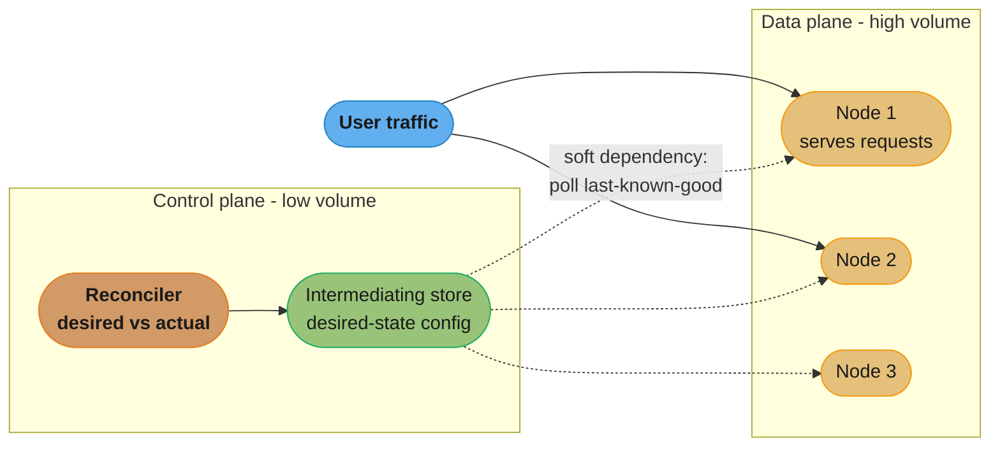

Caption: the control plane writes desired state to an intermediating store that the data-plane nodes
*poll*; because the dependency is soft (dotted) and mediated by a scalable store, a control-plane
outage means "no new config," not "no serving," and the store absorbs the read fan-out instead of
the control plane itself.

### Scale imbalance and the intermediating store

The planes have wildly different scale: one control plane may manage thousands of data-plane nodes.
If every data-plane node **polls the control plane directly**, the control plane is hammered by the
aggregate and becomes overloaded — and a **SPOF**. The fix is an **intermediating data store**: the
control plane writes desired state to a **scalable store**, and the data plane reads from that store
rather than from the control plane directly. The store absorbs the read fan-out, and the control
plane only writes when config changes. (This is exactly how large orchestration systems decouple
the two.)

Concretely, the anti-pattern and the fix:

```
BROKEN: 5,000 data-plane nodes each poll the control plane every second for config
  -> 5,000 req/s hitting a component built for occasional writes
  -> control plane saturates; when it does, nodes cannot refresh -> outage risk
  -> the control plane is now a HARD dependency and a bottleneck

FIX: control plane writes desired config to a scalable store (e.g. an object store / DB);
     data-plane nodes read from the STORE, not the control plane
  -> the store is built for high read fan-out; the control plane writes only on change
  -> nodes cache the last-known-good config, so even the store being briefly down
     does not stop serving (soft dependency all the way down)
```

Caption: put a scalable, read-optimized store between the planes so the control plane's write rate
(low) is decoupled from the data plane's read rate (high); the store absorbs the fan-out that would
otherwise turn the control plane into a bottleneck and a single point of failure. The same idea
appears as the CDN parent cache and the DNS resolver hierarchy — an intermediary that fans a small
authoritative source out to a huge audience.

A second imbalance to watch is the **reporting** direction: data-plane nodes emitting health and
telemetry *to* the control plane also aggregate into a flood at scale, so you sample, batch, and
pre-aggregate at the edge (Part V's monitoring guidance) rather than having every node stream raw
events to one collector.

### The control-theory view: reconciliation and static stability

- **Reconciliation loops.** A control plane is a **controller** in the control-theory sense: it
  continuously compares **desired state** against **actual state** and issues actions to converge
  them. Kubernetes controllers are the canonical example — the desired state says "5 replicas of
  this pod," the controller observes 4 running, and it creates one. The loop runs forever,
  self-healing drift.
- **Static stability.** The system should keep operating correctly on its **last-known-good state**
  when the control plane is unavailable — it does not need the control plane to *keep running*,
  only to *change*. An AWS design principle: a data plane is **statically stable** if it survives
  the failure of its control plane by acting on the most recent config it already has. This ties
  directly to Part IV's **constant work** idea — always push the *full* config every cycle (not
  deltas) so a node that missed updates still converges, and there is no fragile mode-switch under
  stress.

Worked example — a Kubernetes Deployment reconciling:

```
desired state (control plane):  replicas = 5   image = app:v2
actual state (data plane):      4 pods running app:v2, 0 of app:v1
reconciliation loop each tick:
  observe actual  -> 4 running
  compare desired -> want 5
  act             -> create 1 pod (app:v2)
  (next tick) observe 5 running == desired -> no action (converged)

Now the control plane (API server) goes DOWN:
  - the 5 running pods KEEP SERVING traffic (data plane, statically stable)
  - what you LOSE is the ability to CHANGE things: no new deploys, no scaling,
    no self-healing of a pod that crashes during the outage
  - when the control plane returns, the loop resumes converging from actual state
```

Caption: the reconciliation loop continuously drives actual toward desired, and static stability
means a control-plane outage freezes *change* (no deploys, no rescheduling) while *serving*
continues unaffected — the soft-dependency rule made concrete. The **anti-pattern** is a "fallback
mode" the data plane switches into when the control plane is down: that mode is rarely exercised, so
it is where the bugs hide (an AWS lesson — avoid fallback, prefer static stability on the normal
path).

---

## 3.10 Messaging (Ch 23)

The final scalability primitive is **indirect, asynchronous communication through a broker**. So
far services called each other **directly and synchronously** (request/response). A **message broker
(queue/log)** sits between producer and consumer, decoupling them in **time** (the consumer need
not be up when the producer sends) and **space** (they need not know each other) — and, crucially,
it lets the system **absorb load spikes** (level them out) and **retry** failed work. This is the
backbone of async architectures and the setup for Part IV's load leveling.

**Why go asynchronous (benefits):**

- **Temporal decoupling.** The producer does not block waiting for the consumer, and the consumer
  can be down for maintenance without the producer failing — the broker holds the work until it
  comes back.
- **Load leveling.** A spike of 10× traffic becomes a temporary backlog the consumers drain at their
  own steady rate, instead of overwhelming a synchronous downstream — the broker turns a burst into
  a queue (Part IV's load-leveling pattern).
- **Retry and durability.** A failed message stays in the queue and is retried; work is not lost to
  a transient downstream failure.
- **Fan-out.** One event can drive many independent consumers (pub/sub) without the producer knowing
  them, so you add consumers without touching the producer.

**What you pay (costs):**

- **Eventual consistency.** The effect of a message happens *later*, so the system is only
  eventually consistent — "your order is being processed" instead of an immediate synchronous
  answer.
- **Operational complexity.** The broker is another distributed system to run, scale, and monitor,
  and it introduces the failure modes below (duplicates, poison pills, silent backlogs).
- **Harder debugging.** A request's effects are now spread across time and consumers, so you need
  correlation IDs and tracing to follow them.

Rule of thumb: use **synchronous** calls when the caller needs the result *now* to proceed (a read,
a validation); use **asynchronous** messaging when the work can happen later, must survive downstream
downtime, or must fan out — order fulfillment, emails, indexing, analytics.

### Messaging styles and topologies

- **One-way (fire and forget).** Producer sends, does not wait for a reply.
- **Request-response over messaging.** Producer sends and later receives a correlated reply on a
  reply channel.
- **Broadcast (publish-subscribe).** One message delivered to *every* subscriber.
- **Competing consumers (work queue).** Multiple consumers share one queue; each message goes to
  **exactly one** of them — this is how you **scale throughput**, by adding consumers that split
  the work.

Two fundamental channel types:

- **Point-to-point (queue).** Each message is consumed by exactly one consumer. Used for work
  distribution.
- **Publish-subscribe (topic).** Each subscriber gets its **own copy** of every message. Used for
  broadcasting events to many independent consumers.

### Log-based brokers vs traditional queues

Vitillo contrasts two broker designs that trade ordering/replayability against flexibility:

- **Log-based brokers (Kafka).** The channel is a **partitioned, append-only log**. Each
  **partition** is an ordered, immutable sequence of messages; producers append to the tail;
  consumers track their own **offset** (position) and read forward. Messages are **retained** (not
  deleted on consumption, kept for a retention window), so consumers can **replay** from any
  offset and *multiple independent consumer groups* can read the same log at their own pace. The
  ordering guarantee is **per-partition only** — there is no total order across partitions, so you
  route messages that must stay ordered (e.g. all events for one user) to the *same* partition via
  a partition key. Throughput scales with partition count.
- **Traditional queues (SQS, RabbitMQ).** A message is **deleted after it is acknowledged**; there
  is no replay and no shared re-reading. They offer per-message features (visibility timeouts,
  individual acks/redelivery) and easy **competing-consumers** scaling, but weaker/looser ordering.

```
Kafka partition = append-only log, consumers track offsets
partition 0:  [ m0 | m1 | m2 | m3 | m4 | m5 | m6 ]  <-- producer appends here
                          ^offset 2        ^offset 5    ^log end (offset 7)
                          |                |
                   consumer-group-A   consumer-group-B
                   (reading slowly)   (caught up, near tail)
  - messages are NOT deleted on read; each group has its own offset
  - group A can replay from offset 0 anytime; group B reads independently
  - per-partition order is guaranteed; across partitions it is NOT
```

Caption: a Kafka partition is an immutable append-only log where consumption is just a moving offset
per consumer group — retention plus independent offsets are what give replay and multi-consumer
fan-out that a delete-on-ack queue cannot.

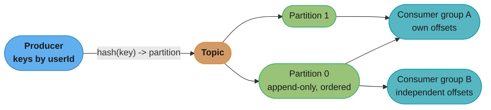

Caption: a log-based broker fans one topic out to multiple partitions (parallelism, per-partition
order) and to multiple consumer groups (independent replayable reads) — the partition key decides
which events stay mutually ordered.

### Ordering, partitions, and consumer groups

The per-partition ordering guarantee has direct design consequences. A **consumer group** is a set
of consumers that *cooperatively* read a topic: the broker assigns each partition to exactly **one**
consumer in the group, so the maximum useful parallelism equals the **partition count** — 8
partitions cap you at 8 active consumers in a group; a 9th sits idle. This means you must choose the
partition count for peak parallelism up front (repartitioning later reshuffles keys, a mini
mod-N problem). When a consumer joins or dies, the group **rebalances** — partitions are reassigned
— during which processing briefly pauses and, if offsets were not committed, some messages get
reprocessed (another reason consumers must be idempotent).

The **partition key** is the ordering knob: messages with the same key hash to the same partition
and are therefore processed in order relative to each other. So you key by the entity that needs
ordering — all events for `order#123` to one partition (strict per-order sequence), while different
orders spread across partitions for parallelism. Pick the key wrong (e.g. a single hot key, or
everything under one key for "global order") and you collapse to a single partition and lose all
parallelism — the log equivalent of a range-partition hotspot.

#### Decoding how many consumers you need — Little's Law

"Add consumers until you keep up" has a number attached, and it comes from **Little's Law**, the
one piece of queueing theory every backend engineer should be able to recite:

```
L = lambda x W

consumer capacity      =  C / S              (C consumers, S seconds of work per message)
consumers to keep up   =  C >= lambda x S    (Little's Law, solved for C)
```

**Put simply.** "The number of things in flight equals how fast they arrive times how long each one
stays." Applied to a work queue it answers the only staffing question that matters: to absorb
`lambda` messages a second when each takes `S` seconds, you must have `lambda x S` of them being
worked on at any instant — so that is your consumer count, and no amount of broker tuning changes it.

| Symbol | What it is |
|--------|------------|
| `lambda` | Arrival rate — messages produced per second |
| `W` | Time a message spends in the system (queueing plus processing) |
| `L` | Messages in the system at any instant — the in-flight count, or the backlog |
| `S` | Service time — seconds of work one consumer spends on one message |
| `C` | Number of consumer instances actually processing in parallel |
| `C / S` | Total consumption capacity in messages per second |

**Walk one example.** A topic taking 5,000 messages/s, each needing 40 ms of consumer work:

```
  consumers needed  C = lambda x S = 5,000 x 0.040 = 200 consumers

  at C = 200 -> capacity = 200 / 0.040 = 5,000 msg/s  -> exactly break-even, zero headroom
  at C = 150 -> capacity =             3,750 msg/s    -> falls behind 1,250 msg/s forever
  at C = 240 -> capacity =             6,000 msg/s    -> 20% headroom to drain a backlog
```

Now connect it to the partition-count ceiling from the paragraph above: a consumer group can have at
most **one consumer per partition**, so needing 200 parallel consumers means the topic needs **at
least 200 partitions**. Provision 8 partitions for this workload and the 9th through 200th consumers
sit idle no matter how many you launch — you are capped at `8 / 0.040 = 200 msg/s`, 4% of the
required rate, and the only fix is a repartition that reshuffles keys (the mini mod-N problem). This
is why partition count is a capacity decision made from `lambda x S` up front, not a default you
accept and revisit later.

### Delivery guarantees

- **At-most-once.** Send and forget; a message may be **lost** but is **never duplicated**. Cheapest,
  used where loss is acceptable (some metrics/telemetry).
- **At-least-once.** Retry until acknowledged; a message is **never lost** but may be **duplicated**
  (if the ack is lost, the broker redelivers). The common default for anything that matters.
- **Exactly-once *delivery* is impossible.** You cannot guarantee a message is delivered exactly one
  time, because a sender cannot distinguish "the message was lost" from "the message arrived but the
  ack was lost" (the two-generals problem from Part II) — so it must either risk loss (at-most-once)
  or risk duplication (at-least-once).

In a log-based broker, *when you commit the offset* is what actually decides whether you get
at-most-once or at-least-once — the guarantee is a consumer-side choice, not a broker feature:

```
commit offset BEFORE processing  ->  AT-MOST-ONCE
  read msg, commit offset, then process.  If it crashes mid-process,
  the offset already advanced -> the message is never retried -> possible LOSS.

commit offset AFTER processing   ->  AT-LEAST-ONCE
  read msg, process, then commit offset.  If it crashes after processing
  but before commit, the message is redelivered -> possible DUPLICATE.
```

Caption: the delivery guarantee falls out of offset-commit ordering — commit-then-process risks
loss, process-then-commit risks duplication, and since you almost always prefer duplication over
loss, at-least-once (commit last) plus an idempotent consumer is the standard choice.

### Exactly-once *processing* via idempotency

Although exactly-once *delivery* is impossible, exactly-once **processing** is achievable, and this
distinction is a favorite interview trap. The recipe: **at-least-once delivery + an idempotent
consumer**. Make processing a duplicate message a no-op — either by **deduplicating** on a message
ID / idempotency key (record processed IDs and skip repeats) or by making the operation **naturally
idempotent** (setting a value rather than incrementing it, an upsert keyed by the message). The
message may be delivered twice, but the *effect* happens once. (Kafka's idempotent producer and
transactions approximate exactly-once *within* Kafka, but end-to-end you still lean on idempotent
consumers.)

Concrete dedup mechanism, and the subtlety that makes it correct:

```
each message carries a stable id (producer-assigned, e.g. order#123-charge)
consumer processing (must be ATOMIC with the side effect):
  BEGIN txn
    if EXISTS processed_ids[msg.id]:  -> already done, ack and return  (dedup)
    apply the side effect (write the row / charge / etc.)
    INSERT processed_ids[msg.id]
  COMMIT
  ack the message

Why atomic matters: if you apply the side effect, then crash BEFORE recording the id,
redelivery re-applies it (double charge). Recording the id and the effect in ONE
transaction (same database) is what makes redelivery a safe no-op. If the side effect
is in a DIFFERENT system than the dedup store, you are back to a distributed-atomic
problem (Part II) -> prefer a naturally idempotent effect (upsert, set-not-increment).
```

Caption: exactly-once processing works only when the **dedup record and the side effect commit
together**; splitting them re-opens the double-apply window that at-least-once delivery guarantees
will eventually hit. When the effect lives outside the dedup store's transaction, make the effect
itself idempotent instead of relying on the id check.

### Failures: poison pills and dead-letter channels

A **poison pill** is a message that **always fails** to process — malformed, or one that triggers a
consumer bug. Naively, an at-least-once consumer retries it forever, **blocking the queue** behind
it (especially with per-partition ordering, where the poison message stalls everything after it).
The fix is a **dead-letter channel/queue (DLQ)**: after N failed attempts, move the message to a
separate DLQ for offline inspection and **unblock** the main queue so healthy messages flow. You
alert on DLQ arrivals and investigate them out of band.

### Backlogs: the queue that hides an outage

The subtlest messaging failure. A queue **decouples** producer and consumer rate — which is its
virtue — but that means when consumers fall behind, producers keep enqueuing and the **backlog
grows silently**. From the outside the system looks healthy (nothing is erroring, producers succeed,
the queue is "up"), while message-processing latency climbs toward hours: **a backlog is an outage
with extra steps**, invisible until users notice their work never completed. Defenses:

- **Monitor backlog *age*, not just depth or up/down.** The key SLI is "how old is the oldest
  unprocessed message" — that is the real latency users feel. Depth alone can mislead (a deep queue
  draining fast is fine; a shallow queue not draining is not).
- **Bound the queue depth.** Reject or **shed** (Part IV) when the queue is full rather than letting
  an unbounded backlog accumulate — backpressure onto producers is better than silent, growing
  latency.
- **Scale consumers / autoscale on backlog.** Add consumers (competing-consumers) when the backlog
  grows.

#### Decoding the backlog — growth, age, and the asymmetry of draining

Three lines of arithmetic turn "the queue is deep" into an incident timeline:

```
backlog growth rate  =  lambda_in  -  lambda_out        (negative = draining)
backlog age (the SLI) =  L / lambda_out                 (Little's Law, rearranged)
time to drain         =  L / (lambda_out - lambda_in)   (only if lambda_out > lambda_in!)
```

**What it means.** "A backlog grows at the *difference* between the rates, and it drains at the
difference too — which is why recovering takes far longer than falling behind." Producers keep
arriving during the recovery, so your drain speed is only the *surplus* capacity, not your total
capacity, and that surplus is usually a small fraction of the whole.

| Symbol | What it is |
|--------|------------|
| `lambda_in` | Production rate — messages entering the queue per second |
| `lambda_out` | Consumption rate — what the consumer fleet actually achieves per second |
| `L` | Current backlog depth in messages |
| `lambda_out - lambda_in` | Surplus capacity. The *only* rate at which a backlog shrinks |
| `L / lambda_out` | Backlog age — how stale the oldest unprocessed message is, in seconds |

**Walk one example.** The same 5,000 msg/s topic, 40 ms per message, with the consumers down for a
30-minute deploy gone wrong:

```
  backlog accumulated = 5,000/s x 1,800 s = 9,000,000 messages
  (nothing errored; every producer call succeeded; no alert fired on depth alone)

  recovery, with the fleet back and lambda_in still 5,000/s:
    consumers   capacity     surplus     time to drain
       240      6,000/s      1,000/s      9,000 s = 2.50 h
       300      7,500/s      2,500/s      3,600 s = 1.00 h
       400     10,000/s      5,000/s      1,800 s = 0.50 h
       600     15,000/s     10,000/s        900 s = 0.25 h

  A 30-minute outage costs 2.5 HOURS of degraded latency at 20% headroom -- a 5x
  amplification -- and the users' total wait is 30 min + 2.5 h = 3 h.
```

Two lessons the numbers make unavoidable. First, **the size of your steady-state headroom is your
recovery time**: 20% surplus turns a 30-minute stall into a 3-hour incident, while tripling the
fleet to 600 consumers ends it in 15 minutes. Second, **age is the SLI, depth is not**. At the
moment recovery begins with 240 consumers the depth is 9,000,000 — a number that means nothing on
its own — but the age is `9,000,000 / 6,000 = 1,500 s = 25 minutes`, which is directly the delay a
user is experiencing. That is why the alert threshold belongs on age. The same reasoning sizes the
bounded queue of the next section: if you will accept at most 60 seconds of processing delay, the
cap is `60 x 6,000 = 360,000 messages`, and past that you shed rather than buffer.

### Backpressure — the broker is not infinite absorption

A broker's whole appeal is absorbing bursts, which tempts you to treat it as an infinite buffer.
It is not: unbounded absorption just converts an overload into an ever-growing backlog (the failure
above). The disciplined design applies **backpressure** — when the queue is full (bounded depth) or
the backlog age crosses a threshold, the broker/producer must **push back**: producers slow down,
or the ingestion endpoint sheds load (returns 429/503, Part IV) rather than enqueuing more. This is
the messaging counterpart of TCP flow control (Part I) and load leveling (Part IV): a queue defers
work, it does not create capacity, so past a bound you must **reject**, not buffer forever.

### Fault isolation via channel partitioning

You can also use the messaging layer for **fault isolation** (a bridge to Part IV): **partition the
channel by client/tenant** so a single noisy producer that floods the system fills only **its own**
partition, not everyone's — a bulkhead at the messaging layer, containing the blast radius of a
misbehaving or abusive producer instead of letting it starve all consumers.

---

## Visual Intuition

The scalability arc is easiest to hold in your head as *where you cache/replicate* and *how much
coordination each layer needs*. The two diagrams below capture the end-to-end request path and the
coordination gradient.

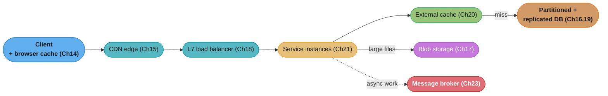

Caption: every layer between the client and the database exists to keep requests *away* from the
database — browser cache, CDN, external cache each shed load, the LB spreads what remains, and the
broker moves work off the synchronous path entirely; the database (the hardest thing to scale) sees
only the irreducible residue.

```
Coordination gradient across Part III (left = most, right = least)
  MOST coordination                                        LEAST coordination
  |------------------------------------------------------------------------|
  strong-consistent DB    range/hash        leader-follower   cache / CDN /
  + cross-partition txn    partitioning      read replicas     eventual, stale
  (2PC, Part II)          (control plane      (async lag)       (disposable
                           maps keys)                            replicas)
  ^ scales worst                                              ^ scales best
  The whole part is a slide from left to right: pay coordination only where
  correctness demands it, and push everything else toward the cheap right end.
```

Caption: scalability is a march down the coordination gradient — the techniques on the right (caches,
CDNs, eventual consistency) scale almost limitlessly precisely because they *avoid* agreement, while
the left end (distributed transactions) is where throughput goes to die.

---

## Key Concepts Glossary

- **Scale up (vertical)** — a bigger single machine; simple, capped, no fault tolerance.
- **Scale out (horizontal)** — more cooperating machines; the distributed path.
- **Scale cube / three dimensions** — functional decomposition, partitioning, replication.
- **Functional decomposition** — split a system by capability into services (microservices).
- **Partitioning (sharding)** — split data/load across nodes by key.
- **Replication** — duplicate data or stateless instances across nodes (caches/CDNs included).
- **Cache-Control** — HTTP header governing cacheability and freshness (`max-age`, `no-store`, etc.).
- **Freshness vs validation** — reuse without asking (`max-age`) vs revalidate when stale.
- **ETag** — opaque content validator echoed in `If-None-Match` for conditional GET.
- **304 Not Modified** — headers-only response confirming the cached copy is still valid.
- **Immutable versioned URL** — content-hashed filename enabling forever-caching plus instant change.
- **Reverse proxy** — a shared server-side cache (and TLS/compression/collapsing) in front of origin.
- **CDN / edge PoP** — geographically distributed reverse-proxy caches near users.
- **Overlay network** — a CDN's measured internal routing that beats BGP's hop-count paths.
- **Pull vs push CDN** — lazy cache-on-first-miss vs proactively pre-populated content.
- **Tiered caching** — edge → parent/regional → origin; shields origin, catches the long tail.
- **Range partitioning** — sorted key ranges; enables range scans, prone to skew hotspots.
- **Hash partitioning** — `hash(key)` spread; uniform, loses sort order (scatter-gather scans).
- **mod-N reshuffle** — `hash mod N` remaps ~all keys when N changes.
- **Consistent hashing** — ring where a membership change moves only ~K/N keys.
- **Virtual nodes (vnodes)** — many ring points per physical node for balance and heterogeneity.
- **Blob storage** — managed store for large immutable files (S3/Azure Blob/GCS).
- **Front-end / partition / stream layers** — Azure Storage's stateless-route / index / append-only-bytes layers.
- **Extent / stream / seal** — append-only replicated units in Azure's stream layer; sealed = immutable.
- **Chain replication** — head-writes/tail-reads replication used for immutable extents.
- **Load balancer** — spreads requests across instances, hides instance failures.
- **Active vs passive health check** — periodic probe vs observing real traffic errors.
- **Session affinity (sticky sessions)** — pin a client to one backend; fights balancing.
- **DNS load balancing** — cheap, coarse steering; slow failover from TTL caching.
- **L4 load balancing** — routes opaque connections by tuple/VIP; Direct Server Return; HTTP-blind.
- **L7 load balancing** — terminates TLS, parses HTTP, routes per request; more CPU.
- **Service mesh / sidecar** — per-instance L7 proxy configured by a control plane.
- **Leader–follower replication** — writes to leader, streamed to followers; read replicas.
- **Sync vs async replication** — wait for follower ack (durable, blocks) vs background (fast, lossy).
- **Replication lag** — follower staleness; breaks read-your-writes and monotonic reads.
- **Scatter-gather** — querying all partitions and merging (joins/range scans over hash partitions).
- **Secondary index locality** — local (document-partitioned) vs global (term-partitioned) index.
- **NoSQL** — key-value/document/wide-column/graph stores built for horizontal scale.
- **Schema-on-read** — structure interpreted by the app at read time (vs schema-on-write).
- **Single-table / access-pattern-first design** — model data from the query list, denormalize.
- **Expiration (TTL) vs eviction (LRU/LFU)** — bound staleness (time) vs make room (space).
- **Local vs external cache** — in-process (fast, duplicated) vs shared Redis/Memcached (one copy, extra hop).
- **Cache-aside (lazy loading)** — app checks cache, fills origin value on miss.
- **Cache stampede / thundering herd** — many concurrent misses hit origin at once.
- **Request coalescing / probabilistic early refresh** — stampede protections.
- **Load-bearing cache** — a cache the origin can no longer survive losing (hidden hard dependency).
- **Microservices** — independently deployable services split by capability.
- **Distributed monolith** — services so coupled they must deploy together (worst of both worlds).
- **API gateway** — single entry point: routing, composition, protocol translation, cross-cutting.
- **Availability multiplication** — composing K dependencies multiplies their availabilities down.
- **BFF (backend-for-frontend)** — a separate gateway per client type.
- **Data plane** — high-volume request-serving path (must be scalable, available, low-latency).
- **Control plane** — low-volume management/config path.
- **Hard vs soft dependency** — data plane blocks on control plane vs runs on last-known-good.
- **Intermediating store** — scalable store between control and data planes to absorb read fan-out.
- **Reconciliation loop** — controller converging actual state to desired state (Kubernetes).
- **Static stability** — data plane keeps working on last-known-good when control plane is down.
- **Message broker** — intermediary for async, decoupled producer/consumer communication.
- **Log-based broker (Kafka)** — partitioned append-only log, consumer offsets, replay, per-partition order.
- **Traditional queue (SQS)** — delete-on-ack, competing consumers, no replay.
- **Competing consumers** — many consumers split one queue for throughput.
- **At-most-once / at-least-once** — may lose vs may duplicate.
- **Exactly-once processing** — at-least-once delivery + idempotent/dedup consumer.
- **Poison pill / dead-letter queue** — always-failing message moved aside to unblock the queue.
- **Backlog age** — oldest-unprocessed-message age; the true latency SLI for a queue.

---

## Tradeoffs & Decision Tables

**Range vs hash partitioning**

| Dimension | Range partitioning | Hash partitioning |
|-----------|--------------------|--------------------|
| Sort order | Preserved (range scans efficient) | Lost (scans become scatter-gather) |
| Load spread | Prone to hotspots (time/lexicographic skew) | Uniform by construction |
| Rebalancing | Split/merge ranges dynamically | mod-N reshuffles; use consistent hashing |
| Best for | Range queries, ordered access | Point lookups, hotspot avoidance |

**L4 vs L7 load balancing**

| Dimension | L4 (transport) | L7 (application) |
|-----------|----------------|-------------------|
| Sees | Connection tuple only | Full HTTP (path, headers, cookies) |
| Granularity | Per connection | Per request (multiplex over conns) |
| TLS | Pass-through | Terminates |
| Cost | Very low; can do DSR | Higher CPU per request |
| Use when | Raw throughput, any protocol | Content routing, rewrites, mesh |

**DNS vs L4 vs L7**

| | DNS LB | L4 LB | L7 LB |
|--|--------|-------|-------|
| Control granularity | Coarse (client picks) | Per connection | Per request |
| Health awareness | None | Basic | Full |
| Failover speed | Slow (TTL caching) | Fast | Fast |
| HTTP visibility | None | None | Full |

**Local vs external cache**

| Dimension | Local (in-process) | External (Redis/Memcached) |
|-----------|--------------------|-----------------------------|
| Latency | Fastest (no hop) | Extra network round trip |
| Copies | One per instance (duplication) | One shared copy |
| Consistency | Drift between instances | Shared, consistent |
| Cold start | Empty per instance → stampede | Survives instance restarts |
| Ops | None | Another system to run/scale |

**Log-based broker vs traditional queue**

| Dimension | Log (Kafka) | Queue (SQS/RabbitMQ) |
|-----------|-------------|-----------------------|
| Retention | Kept for window (replay) | Deleted on ack |
| Ordering | Per-partition | Weak/looser |
| Multi-consumer | Independent consumer groups | Competing consumers |
| Scaling knob | Partitions | Consumers |
| Best for | Event streams, replay, ordering | Task/work queues |

**Delivery guarantees**

| Guarantee | Loss? | Duplication? | Achievable? |
|-----------|-------|--------------|-------------|
| At-most-once | Possible | Never | Yes |
| At-least-once | Never | Possible | Yes |
| Exactly-once delivery | Never | Never | **Impossible** |
| Exactly-once processing | Never | Effect once | Yes (at-least-once + idempotency) |

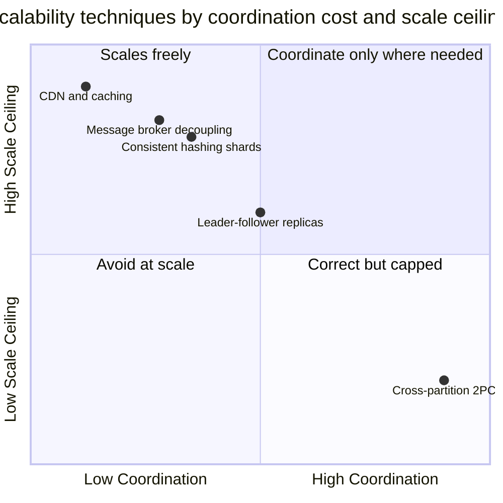

Caption: the techniques that scale best sit at low coordination (caches, CDNs, brokers,
consistent-hashing shards); cross-partition distributed transactions are correct but cap out early —
which is why Part III routes around them wherever the workload allows.

---

## Common Pitfalls / War Stories

- **The cache that became load-bearing.** A cache absorbing 95% of reads means the origin is sized
  for 5% of load; when the cache goes down, 100% of traffic hits an origin that cannot take it, and
  the whole system cascades into an outage caused by the cache. Capacity-plan the origin for
  cache-down, replicate the cache, and load-shed on fall-through. This is the marquee failure of the
  whole part.
- **Cold-start stampede after a deploy.** A rolling restart empties every instance's local cache at
  once; all instances simultaneously miss on the hot keys and stampede the database. Use an external
  shared cache, request coalescing, and staggered warmups.
- **DNS "failover" that takes 15 minutes.** Relying on DNS to route away from a dead server fails
  because resolvers cache A records past the TTL; the dead IP keeps taking traffic for many minutes.
  Use an L4/L7 LB with health checks for fast failover; use DNS only for coarse geo-steering.
- **Aggressive health check nukes the fleet.** A health check that pings a shared database marks
  *every* instance unhealthy the instant the database blips, and the LB removes the entire fleet —
  total outage from the safety mechanism. Keep health checks shallow (test the instance, not its
  dependencies) and fail open when it would otherwise remove the last instances.
- **mod-N resharding storm.** Growing a `hash(key) mod N` cluster from N to N+1 remaps almost all
  keys and triggers a cluster-wide data movement that saturates the network — exactly when you were
  trying to add capacity. Use consistent hashing with virtual nodes from the start.
- **Time-ordered keys create a moving hotspot.** Range-partitioning on a timestamp or auto-increment
  ID sends every new write to the last partition while the rest sit idle. Prefix the key with a hash
  or shard-id to spread writes (accepting the loss of clean range scans).
- **Read-your-writes broken by replica lag.** A user posts and then reads from a lagging async
  replica that does not have the write yet — the post "vanishes." Route a user's reads to the leader
  (or a caught-up replica) for a window after they write.
- **Hard dependency on the control plane.** A data plane that calls the control plane on every
  request turns the control plane into a SPOF that takes the whole system down when it hiccups.
  Depend on the control plane *softly* — run on last-known-good config, poll an intermediating store.
- **Assuming exactly-once delivery.** Building on the belief that a broker delivers each message
  exactly once leads to double-charges and double-sends when the ack is lost and the message is
  redelivered. Design idempotent consumers (dedup on message ID) for exactly-once *processing*.
- **The silent queue backlog.** Consumers fall behind, the backlog grows for hours, nothing errors,
  dashboards look green — and users' work silently never completes. Alert on **backlog age**, bound
  queue depth, and autoscale consumers on backlog.
- **Poison pill stalls a partition.** One malformed message that always fails to process blocks
  every message behind it in an ordered partition, retried forever. Send it to a dead-letter queue
  after N attempts and keep the main channel flowing.
- **Distributed monolith.** Splitting into microservices that still share a database and must deploy
  together imports all the costs of distribution with none of the benefits. Draw boundaries along
  real business seams, or stay a modular monolith until the pain justifies the split.
- **Gateway fan-out kills availability.** An API gateway that composes a response from five services
  at 99.9% each yields ~99.5% aggregate availability — worse than any dependency. Minimize
  synchronous fan-out, cache, and make composition resilient to partial failure.

---

## Real-World Systems Referenced

HTTP/CDN: browser caches, nginx, Varnish, reverse proxies; Akamai, Cloudflare, Amazon CloudFront,
Fastly (CDNs). Partitioning/hashing: Amazon Dynamo, Apache Cassandra, Riak (consistent hashing,
vnodes); Google Bigtable, Apache HBase (range partitioning, dynamic splits). Blob storage: Amazon
S3, Azure Blob Storage, Google Cloud Storage; the Azure Storage architecture (front-end / partition
/ stream layers, chain replication). Load balancing: DNS round-robin, hardware/L4 LBs, AWS ELB/ALB/
NLB, HAProxy, nginx; Envoy, Istio, Linkerd (service mesh sidecars). Databases: PostgreSQL, MySQL
(leader-follower replication); DynamoDB, MongoDB, Cassandra, Redis (NoSQL families). Caching: Redis,
Memcached; Caffeine/Guava (local caches). Orchestration/control planes: Kubernetes (controllers,
reconciliation). Messaging: Apache Kafka (log-based broker), Amazon SQS, RabbitMQ (traditional
queues).

---

## Summary

Part III scales Vitillo's toy "Cruder" service from one box to a global system by moving it along
the three axes of the **scale cube** — replication, partitioning, and functional decomposition —
while relentlessly *avoiding coordination*, the one thing that does not scale. You start by never
making the request at all: **HTTP caching** (Cache-Control freshness, ETag/304 validation, immutable
versioned URLs) and **reverse proxies** shed load at the client, and a **CDN** extends that to a
global overlay network of edge caches with **tiered caching** that shields the origin and catches
the long tail. When one node cannot hold the data you **partition** it — **range** (sorted, scannable,
hotspot-prone) or **hash** (uniform, unordered), fixing `mod-N`'s reshuffle storm with **consistent
hashing and virtual nodes**. Big immutable files go to **managed blob storage**, whose Azure
architecture (stateless front-end, range-partitioned partition layer, append-only chain-replicated
stream layer) shows why **immutability turns replication into copying**. Stateless services scale
behind **load balancers** — DNS (coarse, slow failover), **L4** (fast, connection-level, HTTP-blind),
or **L7** (per-request, content-aware, mesh-capable) — while the **database** scales through
**leader-follower replication** (with lag anomalies) and **partitioning** (scatter-gather joins), and
**NoSQL** trades transactions for horizontal scale with access-pattern-first modeling. **Caching**
inside the system (local vs external, cache-aside, TTL/LRU) is the highest-leverage tool and the most
dangerous: guard against **stampedes** and never let the cache become **load-bearing**. **Microservices**
scale teams and change but risk the **distributed monolith**, so start with a monolith and front the
services with an **API gateway** (mind availability multiplication). The recurring **control-plane /
data-plane** split demands the data plane depend only *softly* on the control plane, running on
last-known-good state (static stability, reconciliation loops). Finally, **messaging** decouples
producers and consumers through **log-based brokers** (Kafka, replayable, per-partition ordered) or
**queues** (SQS, delete-on-ack), where **exactly-once delivery is impossible** but exactly-once
**processing** is achievable with idempotency, poison pills go to **dead-letter queues**, and a
silent **backlog** is an outage you must catch by monitoring **age**. The through-line: cache and
replicate aggressively, partition to spread load, coordinate only where correctness demands it — and
never let a performance optimization quietly become a hard dependency.

---

## Interview Questions

**Q: Why is a cache "becoming load-bearing" one of the most dangerous scalability failure modes?**
Because the origin gets sized for the small fraction of traffic the cache does not absorb, so when the cache fails, 100% of load falls through to an origin provisioned for a fraction of it, and it collapses. A cache absorbing 95% of reads means the origin only ever handles 5%; a cache outage or flush suddenly sends everything to it, causing a cascading failure — an outage caused by the cache that was meant to prevent one. Defend by capacity-planning the origin for cache-down, replicating the cache, load-shedding on fall-through, and watching the hit ratio as a hidden-dependency signal.

**Q: What is a cache stampede (thundering herd) and how do you prevent it?**
It is when a hot key expires and many concurrent requests all miss at once, hammering the origin simultaneously to recompute the same value. It is worst for the hottest keys because they have the most concurrent readers, and it is what makes cold-start-after-deploy so dangerous. Prevent it with request coalescing (only one request recomputes while others wait and share the result), probabilistic early expiration (refresh before the TTL expires), TTL jitter, and serve-stale-while-revalidate so no request waits on the miss.

**Q: Why is DNS-based load balancing slow to fail over from a dead server?**
Because DNS responses are cached at the client, OS, and resolvers according to the record's TTL, and many resolvers ignore the TTL and cache even longer. When a server dies, clients keep resolving to its dead IP until their cached record expires, so the dead server keeps receiving traffic for minutes. This is why DNS is used for coarse geographic steering, not fast within-region failover — use an L4/L7 load balancer with health checks for that.

**Q: What is the difference between L4 and L7 load balancing?**
L4 operates at the transport layer, routing opaque connections by their tuple (source/destination IP and port) to a backend behind a VIP, with no visibility into HTTP; L7 terminates TCP and TLS, parses the HTTP request, and routes per request by path, header, or cookie. L4 is fast and cheap (it just shuffles packets, and can even use Direct Server Return), but pins a whole connection to one backend and cannot route by content. L7 is smarter (per-request routing, rewrites, mesh policy) at the cost of more CPU per request.

**Q: Why does `hash(key) mod N` reshuffle almost all keys when you add a node, and what fixes it?**
Because changing N changes the modulo result for nearly every key at once, so adding one node to an N-node cluster remaps roughly N/(N+1) of all keys, triggering a cluster-wide data-movement storm. Consistent hashing fixes it: hash both keys and nodes onto a ring and let each key belong to the next node clockwise, so a membership change moves only about K/N keys — just the arc between the new node and its neighbor. Virtual nodes then smooth the load and support heterogeneous node sizes.

**Q: What does it mean for the data plane to have a soft rather than hard dependency on the control plane?**
A soft dependency means the data plane keeps serving requests on its last-known-good configuration when the control plane is down, so a control-plane outage degrades management (no new deploys or config), not serving. A hard dependency — where the data plane calls the control plane on every request — makes the control plane a single point of failure that takes down the whole request path when it hiccups. Design LBs, meshes, and resolvers to cache config and run independently so the request path never blocks on the management path.

**Q: Why is exactly-once delivery impossible, and how do you get exactly-once processing anyway?**
Exactly-once delivery is impossible because a sender cannot distinguish a lost message from a lost acknowledgment (the two-generals problem), so it must either risk loss (at-most-once) or risk duplication (at-least-once). Exactly-once processing is achievable by combining at-least-once delivery with an idempotent consumer: deduplicate on a message ID or make the operation naturally idempotent (upsert, set-not-increment), so a message delivered twice takes effect once. The message may arrive more than once, but the effect happens exactly once.

**Q: Why is a growing message queue backlog a hidden outage, and how do you catch it?**
Because a queue decouples producer and consumer rates, so when consumers fall behind the backlog grows silently while producers still succeed and nothing errors — the system looks healthy while processing latency climbs to hours. It is an outage with extra steps, invisible until users notice their work never completed. Catch it by monitoring backlog age (the age of the oldest unprocessed message, which is the real latency users feel), bounding queue depth so you shed instead of accumulating, and autoscaling consumers on backlog.

**Q: What is the difference between HTTP freshness and validation, and how does a 304 fit in?**
Freshness lets the client reuse a cached response with no network call at all while it is within its `max-age`; validation is the fallback when the response is stale — the client asks the origin whether it changed. Validation uses a conditional GET: the client sends the stored ETag in `If-None-Match`, and if the resource is unchanged the origin returns 304 Not Modified with an empty body, so the client keeps its cached copy and only headers cross the wire. Freshness avoids the round trip entirely; the 304 avoids re-sending the body.

**Q: How do immutable versioned URLs let you cache aggressively yet still ship changes instantly?**
By putting a content hash in the filename (e.g. `app.3f2a1b.js`) and marking it `max-age` of a year with `immutable`, so the asset is cached essentially forever because if its content changed its URL would change. To ship an update you build a new file with a new hash, producing a brand-new URL that the (short-TTL) HTML now references, so clients fetch the new asset immediately while harmlessly keeping the old one. You decouple "cache forever" from "let me change it" by changing the URL on every change.

**Q: What is the CDN "overlay network" and why does it beat the raw internet?**
The internet routes with BGP, which picks paths by AS hop count and policy rather than latency or congestion, so the default path is often not the fastest. A CDN builds an overlay: it measures latency and loss between its own points of presence and routes traffic along the best internal path, terminates TLS/TCP at a nearby edge (short RTT for handshakes and slow-start), and keeps warm, pre-optimized edge-to-origin connections. Even uncacheable dynamic content benefits from this routing and connection reuse.

**Q: What does tiered CDN caching accomplish that flat edge caching does not?**
It shields the origin and raises the hit ratio on the long tail by interposing a parent/regional cache between the many edge PoPs and the origin. Without it, every edge misses straight to the origin, so origin load scales with the number of edges; with edge → parent → origin, the origin only sees parent misses, and less-popular objects that would miss at any single small edge get cached once at the shared parent and reused. Origin traffic drops sharply and overall hit ratio improves.

**Q: What are the tradeoffs between range and hash partitioning?**
Range partitioning keeps keys sorted, so range scans are efficient, but it is prone to hotspots when access concentrates on a narrow range (time-ordered or lexicographically skewed keys all hit one partition). Hash partitioning spreads keys uniformly, killing hotspots, but loses sort order so range scans become scatter-gather across all partitions. Choose range for ordered/range-query workloads and hash for point lookups where you fear skew; mitigate range hotspots by prefixing keys, and fix hash resharding with consistent hashing.

**Q: What problem do virtual nodes solve in consistent hashing?**
They solve load imbalance and node heterogeneity by hashing each physical node onto the ring at many points instead of one. With few nodes, single arcs are uneven and one node can own a disproportionate slice; many small vnodes per node average the load out. Assigning a more powerful machine more vnodes lets it take a proportionally larger share, and when a node dies its vnodes' arcs redistribute across many remaining nodes rather than dumping all the recovery load on one neighbor.

**Q: Why does append-only, immutable storage make replication simpler (as in Azure's stream layer)?**
Because with no in-place updates there are no conflicting overwrites to reconcile — replication becomes copying appends in order rather than agreeing on the outcome of concurrent writes. In Azure's stream layer, extents are appended at a single tail and replicated down a chain, and once sealed an extent is byte-identical everywhere and readable from any replica. Mutable data, by contrast, can receive conflicting updates to the same offset and needs consensus per write; immutability turns an agreement problem into a copying problem, which is why blob stores, log storage, and Kafka all use it.

**Q: How does an aggressive health check take out a whole fleet?**
By marking every instance unhealthy at once when a shared dependency blips. If the health check pings a common downstream (a database) and that database has a brief issue, every instance fails the check simultaneously, so the load balancer removes the entire fleet from rotation and there is nowhere to send traffic — a total outage caused by the safety mechanism. Keep health checks shallow (test the instance itself, not its dependencies), and have the LB fail open rather than remove the last healthy instances.

**Q: What is replication lag and which read guarantees does it break?**
Replication lag is the delay before an asynchronous follower catches up to the leader, during which reads from that follower are stale. It breaks read-your-own-writes (you write, then read from a lagging replica that lacks your write, so it seems to vanish), monotonic reads (successive reads hitting replicas at different lag can go backwards in time), and consistent-prefix reads. Mitigate by routing a user's reads to the leader or a known-caught-up replica for a window after they write, or by using version tokens.

**Q: Why do joins and transactions get expensive once you partition a database?**
Because the data they touch may live on different nodes. A join across partitions becomes scatter-gather — query every relevant partition and merge — which is slow and hard to keep transactional, and a transaction spanning partitions needs distributed atomic commit (2PC), which is slow and reduces availability. The pragmatic response is to co-locate related data in the same partition (choose the partition key so joined rows and a transaction's rows land together) and denormalize so most operations stay single-partition.

**Q: What is single-table / access-pattern-first design in NoSQL, and why is it used?**
It is modeling the data layout from the list of queries the application will run, rather than normalizing entities, because NoSQL stores cannot cheaply join. You denormalize, duplicate data, and pack related items so each access pattern maps to a single-partition lookup; in DynamoDB this becomes one table holding multiple entity types keyed so queries hit one partition. It inverts relational modeling: you design the storage from the queries, trading storage and write duplication for fast, predictable single-partition reads at scale.

**Q: When does a cache actually help, and when is it just overhead?**
A cache helps when the hit ratio is high, access is skewed toward a hot set, some staleness is tolerable, and the origin is expensive to hit. It is overhead when the hit ratio is low, because a miss costs a cache lookup plus the origin fetch plus a cache write — strictly more work than not caching. So caches pay off for read-heavy, skewed, staleness-tolerant workloads over slow origins, and hurt for uniform-access, write-heavy, or freshness-critical workloads.

**Q: What are the tradeoffs between a local in-process cache and an external shared cache?**
A local cache lives in the service's memory with zero network hop, making it the fastest, but it duplicates data across instances (N copies, N cold misses to fill), suffers cold-start stampedes on restart, and drifts out of consistency between instances. An external cache like Redis or Memcached is shared, so there is one consistent copy, better memory efficiency, and it survives instance restarts, but every access pays a network round trip and you must run and scale another distributed system. Use local for tiny, hot, staleness-tolerant data and external for shared, larger, consistency-sensitive data.

**Q: What is the "distributed monolith" and how do you avoid it?**
It is a set of microservices so tightly coupled — sharing a database, deploying together, calling each other synchronously in long chains — that you pay all the costs of distribution (network, partial failure, latency) and get none of the benefits (independent deploy, isolation). It usually comes from drawing service boundaries in the wrong place. Avoid it by splitting along real business seams, keeping services independently deployable with their own data, and starting from a well-modularized monolith, extracting a service only when a specific pain justifies it.

**Q: How does an API gateway's response composition affect availability?**
It multiplies availability risk downward: if the gateway must call K services each at availability p to compose one response, the aggregate availability is roughly p^K, worse than any single dependency. Composing a response from five 99.9% services yields about 99.5% — a real degradation caused purely by fan-out. Minimize synchronous fan-out, cache aggregated results, and make composition tolerant of partial failure (return a degraded response when one dependency is down) rather than failing the whole request.

**Q: What is a reconciliation loop and how does static stability relate to it?**
A reconciliation loop is a controller that continuously compares desired state to actual state and issues actions to converge them — a Kubernetes controller seeing 4 running pods against a desired 5 and creating one, forever self-healing drift. Static stability is the property that the data plane keeps operating correctly on its last-known-good state when the control plane (which runs the loop) is unavailable — it needs the control plane only to change, not to keep running. Pushing the full config every cycle (constant work) rather than deltas makes convergence robust and avoids fragile mode-switches under stress.

**Q: What distinguishes a log-based broker like Kafka from a traditional queue like SQS?**
A log-based broker stores messages in a partitioned append-only log where consumers track their own offset and messages are retained for a window, so consumers can replay and multiple independent consumer groups can read the same log, with ordering guaranteed per partition. A traditional queue deletes each message after it is acknowledged, offering no replay and weaker ordering but easy competing-consumers scaling and per-message features like visibility timeouts. You scale a log by adding partitions and a queue by adding consumers; choose a log for event streams and replay, a queue for task distribution.

**Q: What is a poison pill and why do you need a dead-letter queue?**
A poison pill is a message that always fails to process — malformed or triggering a consumer bug — so an at-least-once consumer retries it forever and, in an ordered partition, blocks every message behind it. A dead-letter queue solves this: after N failed attempts the message is moved to a separate queue for offline inspection, unblocking the main channel so healthy messages keep flowing. You alert on dead-letter arrivals and debug them out of band rather than letting one bad message stall the pipeline.

**Q: What are the three scaling dimensions of the scale cube, and where does caching fit?**
The three dimensions are functional decomposition (split the system into services by capability), partitioning (shard data and load across nodes by key), and replication (duplicate data or stateless instances across nodes). Every technique in Part III maps to one axis: microservices are functional decomposition, sharding is partitioning, and load-balanced instances plus read replicas are replication. Caching and CDNs sit on the replication axis — they are replicas you are allowed to let go stale, which is exactly what lets them scale so cheaply.

**Q: Why start with a monolith instead of microservices?**
Because microservices import large fixed costs — operational burden (many pipelines, dashboards, on-call surfaces), loss of cross-service ACID transactions (eventual consistency and sagas instead), harder testing and debugging, and the risk of a distributed monolith — that only pay off past a certain scale and team size. A well-modularized monolith gives you fast local calls, simple transactions, and one deploy while you are still finding the right boundaries. Extract a service only when a concrete pain (a team blocked by deploy coupling, one component needing independent scale) makes the tradeoff worthwhile.

**Q: What does synchronous versus asynchronous database replication trade off?**
Synchronous replication makes the leader wait for a follower to acknowledge before confirming a write, so the follower is guaranteed current and no committed write is lost — but a slow or down follower blocks writes, and more sync followers make writes slower and more fragile. Asynchronous replication confirms the write immediately and replicates in the background, so writes are fast and a slow follower does not block them, but if the leader crashes before a write propagates, that write is lost. Most systems compromise with semi-synchronous replication: one synchronous follower for durability, the rest asynchronous for speed.

**Q: Why does adding read replicas not help a write-bound database, and what does?**
Because every write still funnels through the single leader, so read replicas scale reads linearly but do nothing for write throughput. Followers only serve reads; they replay the leader's writes rather than accepting their own, so a workload bottlenecked on writes gains no capacity from more followers. The fix for write scale is partitioning (sharding): split the data across multiple leaders so writes to different shards proceed in parallel — and in practice you combine both, sharding for write scale and replicating each shard for read scale and fault tolerance.

**Q: Why is deleting a cache key safer than updating it on a write (cache-aside)?**
Because a deleted key can only cause an extra miss, whereas an updated key can leave the cache holding a value the origin never durably stored. If you write the origin first and then delete the key, a crash between the two leaves the cache merely empty (self-correcting on the next read), and a concurrent reader that repopulates from a stale snapshot is bounded by the TTL. Updating the cache before the origin, or setting instead of deleting, opens races where cache and origin disagree and the wrong value persists — so the safe order is origin-first, then invalidate.

**Q: Why does the number of partitions cap consumer parallelism in a log-based broker?**
Because the broker assigns each partition to exactly one consumer within a consumer group, so at most one consumer per partition is active — 8 partitions cap a group at 8 working consumers, and any extra consumers sit idle. This means you must choose the partition count for peak parallelism up front, since repartitioning later reshuffles the key-to-partition mapping (a mod-N-style problem) and disturbs ordering. It is the direct consequence of per-partition ordering: one consumer per partition is what preserves order while allowing parallelism across partitions.

**Q: Why must connection draining happen when removing an instance behind a load balancer?**
Because without it, killing an instance during a deploy or scale-in drops the requests still in flight on it. Connection draining tells the load balancer to stop sending the instance new requests while letting existing ones finish before the instance is terminated, so a routine deploy is invisible to users instead of returning a burst of errors. It is the small graceful-shutdown feature that makes rolling deployments safe, and its absence is a common cause of deploy-time error spikes.

---

## Cross-links in this repo

- [Part II: Coordination — the consistency machinery under every store scaled here](../02_coordination/README.md)
- [Part IV: Resiliency — keeping all of this alive under partial failure](../04_resiliency/README.md)
- [hld/caching/ — cache patterns, eviction, invalidation, stampede protection](../../../hld/caching/README.md)
- [hld/cdn/ — CDN architecture, edge caching, pull vs push, dynamic acceleration](../../../hld/cdn/README.md)
- [hld/consistent_hashing/ — the ring, virtual nodes, mod-N reshuffle, Dynamo-style placement](../../../hld/consistent_hashing/README.md)
- [hld/load_balancing/ — L4 vs L7, health checks, routing algorithms, DNS steering](../../../hld/load_balancing/README.md)
- [hld/message_queues/ — brokers, delivery guarantees, DLQs, backlog handling](../../../hld/message_queues/README.md)
- [backend/kafka_deep_dive/ — partitions, offsets, consumer groups, exactly-once processing](../../../backend/kafka_deep_dive/README.md)
- [database/sharding_and_partitioning/ — range vs hash sharding, rebalancing, scatter-gather](../../../database/sharding_and_partitioning/README.md)
- [backend/caching_strategies_deep_dive/ — cache-aside vs write-through, local vs external, load-bearing caches](../../../backend/caching_strategies_deep_dive/README.md)

Related inline (see also): [hld/microservices/](../../../hld/microservices/README.md),
[backend/api_gateway_patterns/](../../../backend/api_gateway_patterns/README.md),
[DDIA Ch 6 — Partitioning](../../designing_data_intensive_applications/06_partitioning/README.md),
[SDI Vol 1 Ch 5 — Design Consistent Hashing](../../system_design_interview_vol_1/05_design_consistent_hashing/README.md),
[SDI Vol 1 Ch 6 — Design a Key-Value Store](../../system_design_interview_vol_1/06_design_a_key_value_store/README.md),
[SDI Vol 2 Ch 4 — Distributed Message Queue](../../system_design_interview_vol_2/04_distributed_message_queue/README.md),
[SDI Vol 2 Ch 9 — S3-like Object Storage](../../system_design_interview_vol_2/09_s3_like_object_storage/README.md).

## Further Reading

- Vitillo, *Understanding Distributed Systems* (2nd ed.), Part III — the source text and its references.
- Calder et al., "Windows Azure Storage: A Highly Available Cloud Storage Service with Strong Consistency," SOSP 2011 — the blob-storage architecture case study.
- DeCandia et al., "Dynamo: Amazon's Highly Available Key-value Store," SOSP 2007 — consistent hashing, vnodes, quorums.
- Chang et al., "Bigtable: A Distributed Storage System for Structured Data," OSDI 2006 — range partitioning and wide-column storage.
- Kreps, "The Log: What every software engineer should know about real-time data's unifying abstraction" — the log-based broker mental model behind Kafka.
- Fitzpatrick, "Distributed caching with memcached," Linux Journal 2004 — external caching foundations.
- Nishtala et al., "Scaling Memcache at Facebook," NSDI 2013 — stampede/thundering-herd protection at scale.
- AWS Builders' Library, "Static stability using Availability Zones" and "Avoiding fallback in distributed systems" — control-plane/data-plane and static stability.
- Newman, *Building Microservices* — functional decomposition, the distributed-monolith trap, API gateways.
