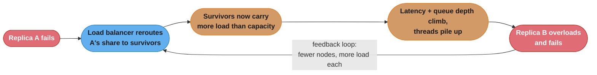
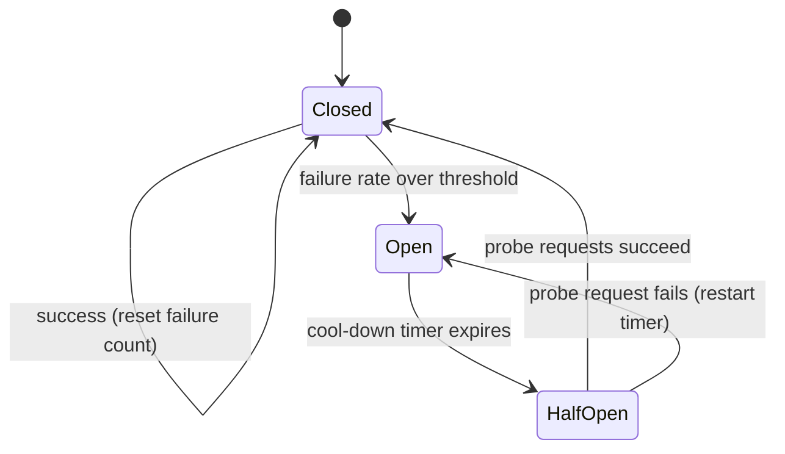
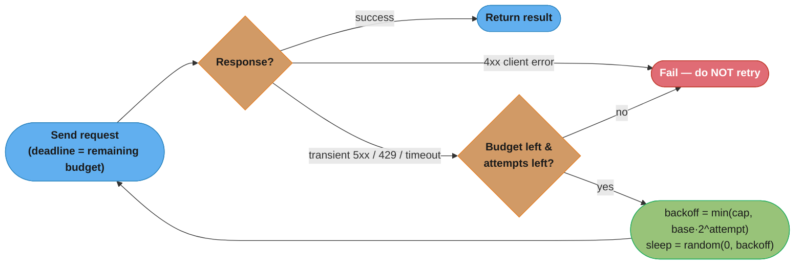
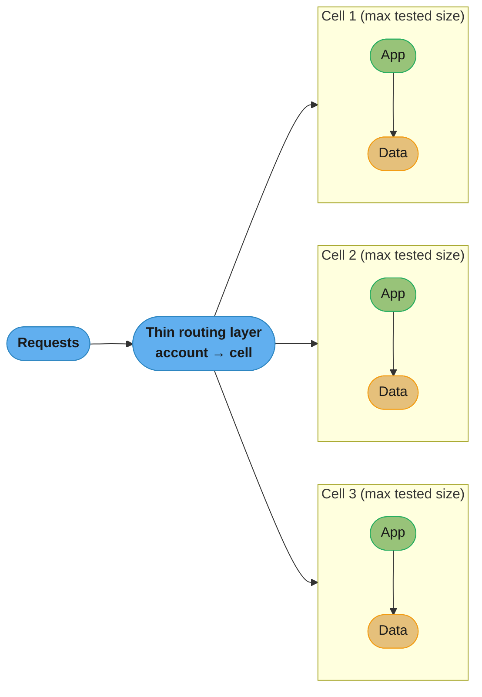
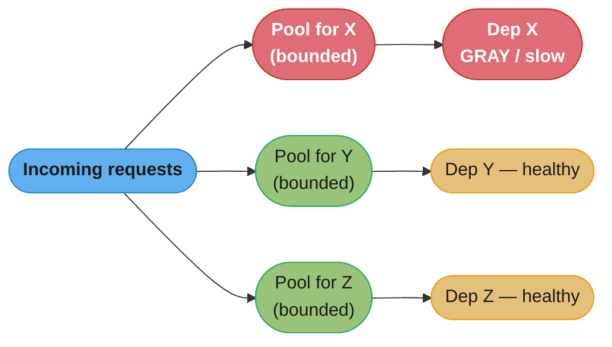
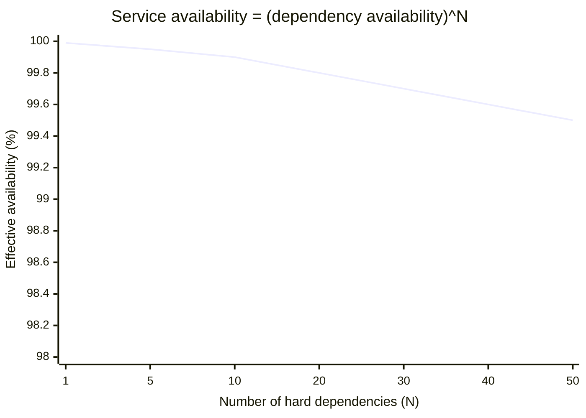

# Part IV: Resiliency

> Part IV of 5 · Understanding Distributed Systems (Vitillo) · covers book Ch 24–28 · builds on Part III (Scalability), leads to Part V (Maintainability)

## Chapter Map

Scaling out (Part III) buys throughput but hands you a new problem for free: **more moving
parts means more things break, all the time.** At scale, failure stops being an exceptional
event you can catch-and-log and becomes the steady-state background hum of the system — a disk
dies somewhere every hour, a config push goes bad, a dependency slows to a crawl. Part IV is
about **resiliency**: keeping the *overall* system available and correct even though its
*components* are continuously failing. It is deliberately practical — a catalog of failure
causes and a toolbox of patterns that contain, absorb, and route around those failures.

The part is five chapters, and this file covers each as one `## 4.x` section, in book order:

| `##` | Book Ch | Topic | One-line thesis |
|------|---------|-------|-----------------|
| 4.1 | 24 | Common failure causes | Know your enemy: hardware is the *easy* case; error-handling, config, and gray failures do the real damage. |
| 4.2 | 25 | Redundancy | The first defense — but it only *adds* availability if four prerequisites hold and faults are uncorrelated. |
| 4.3 | 26 | Fault isolation | Shrink the blast radius: bulkheads, shuffle sharding, cells — so one bad thing kills a slice, not the whole. |
| 4.4 | 27 | Downstream resiliency | Protect yourself from what you *call*: timeouts, retries (with jitter and a budget), circuit breakers. |
| 4.5 | 28 | Upstream resiliency | Protect yourself from your *callers*: load shedding, load leveling, rate limiting, constant work. |

**Part intro — the arithmetic of availability.** Availability is the fraction of time a system
is able to serve requests, usually quoted in "nines." The nines are unforgiving: each extra
nine cuts your allowed annual downtime by 10×.

| Availability | "Nines" | Downtime / year | Downtime / day |
|--------------|---------|-----------------|----------------|
| 90%     | one nine    | 36.5 days   | 2.4 h    |
| 99%     | two nines   | 3.65 days   | 14.4 min |
| 99.9%   | three nines | 8.76 h      | 1.44 min |
| 99.99%  | four nines  | 52.6 min    | 8.6 s    |
| 99.999% | five nines  | 5.26 min    | 0.86 s   |

The second brutal fact: **the availability of a chain is the product of its links.** If your
service is a hard dependency on N downstream services, and each is independently available with
probability *A*, then your availability is at most *A^N*. Ten hard dependencies each at a
respectable 99.99% (four nines) yields 0.9999^10 ≈ 99.9% — you *lost* a nine just by depending
on them. Thirty such dependencies drops you to 0.9999^30 ≈ 99.7% (an extra ~26 minutes of downtime
a *month*), and fifty to ≈ 99.5% — the erosion is relentless because each factor is < 1. This single equation motivates the
whole part: you cannot reach high availability by making each component reliable; you must
**reduce the number of hard dependencies** (Part V's control-plane split, §4.5's constant
work) and **stop failures from propagating** (all of §4.3–§4.5).

**TL;DR:**
- Most catastrophic outages are *self-inflicted*: bad error handling, bad config, and retry
  storms — not cosmic-ray bit flips. Hardware failure is the case redundancy already solves.
- **Gray failures** (a component that is *slow*, not *down*) are the hardest to detect and the
  usual seed of cascading failure; a health check that only asks "are you up?" misses them.
- **Redundancy** is necessary but not sufficient — it only helps for *uncorrelated* faults and
  only when you can detect, degrade, and repair.
- The patterns compose into one story: **isolate** the blast radius (cells/shuffle sharding),
  **retry carefully** downstream (backoff + jitter + budget, one level only, behind a circuit
  breaker), and **shed/level/limit** load upstream — and where possible do **constant work** so
  there is no fragile "failure mode" to switch into.

## The Big Question

> "Every component I add fails independently and continuously. How do I build a system whose
> availability is *higher* than that of any part it's made from — instead of the product of
> them, which is always lower?"

Analogy: think of a ship's hull. You cannot stop the hull from ever being breached — collisions
happen. What you *can* do is divide the hull into **watertight bulkhead compartments** so a
breach floods one compartment, not the whole ship; carry **redundant** pumps; and design the
ship so a flooded compartment still lets it limp to port (degraded operation). Resiliency
engineering is naval architecture for software: you assume the water gets in and you engineer so
it doesn't sink you. The rest of this part is the specific bulkheads, pumps, and hull sections.

---

## 4.1 Common Failure Causes (Ch 24)

You can't defend against failures you haven't imagined. Chapter 24 is a taxonomy — the recurring
*causes* of outages in real distributed systems, roughly ordered from the ones redundancy already
handles to the ones that cause the biggest, hardest-to-diagnose incidents. The meta-point:
**hardware is the easy case; the expensive outages are almost always software, config, and
operator-induced**, and they defeat naive redundancy because they hit every replica at once.

### Hardware faults

The textbook failure: a disk dies, a machine's power supply fails, a memory module goes bad, a
network switch drops. At the scale of thousands of machines these are *constant* — the arithmetic
is unforgiving. Hard drives have an **annualized failure rate (AFR)** of roughly 1–4%; in a fleet
of 10,000 disks at 2% AFR that's ~200 disk failures *per year*, several *per week*, guaranteed.
Memory suffers correctable and uncorrectable bit errors at measurable rates; power supplies, fans,
and NICs all have finite MTBFs. At scale, "rare" hardware faults become a steady background rate
you must design for, not an exception you can hope to avoid.

But hardware faults are the **easy case** precisely because they are (mostly) **independent and
detectable**: a dead machine stops answering health checks, redundancy (§4.2) fails over to a
healthy replica, and the fleet absorbs it. The industry solved this decades ago with commodity
redundancy (RAID for disks, replicated stateless fleets for compute) — which is exactly why the
*interesting*, outage-causing failures are the ones redundancy does *not* catch: the software,
config, and gray failures below, which hit every replica at once and so cannot be failed-away from.

### Incorrect error handling

The single most important finding in the chapter, from the study by **Yuan et al., "Simple
Testing Can Prevent Most Critical Failures"** (OSDI 2014): the researchers examined catastrophic
failures across five widely-used distributed systems (Cassandra, HBase, HDFS, MapReduce, Redis)
and found that **the majority of the worst outages were caused by incorrect handling of
non-fatal errors** — errors the system *did* detect but then mishandled. Even more damning:

- In ~92% of catastrophic failures, the trigger was an error that was *explicitly signaled* in
  the code (an exception was caught, an error code returned) — the handling logic was just wrong.
- ~35% were caused by trivial bugs — an empty `catch` block that swallowed the error, an
  `abort()` on a recoverable condition, a `TODO`/`FIXME` left in the handler, error handling that
  itself threw.
- A large fraction could have been caught by **unit-testing the error-handling code path** — i.e.
  the bugs were shallow, they were just never *exercised* because errors are rare in testing.

The lesson: the code that runs *when things go wrong* is the least-tested, most-dangerous code in
your system. Error paths deserve *more* test attention than happy paths, not less. "Catch, log,
and continue as if nothing happened" is how a recoverable blip becomes a corrupted-state outage:

```java
// BROKEN — the empty/over-broad catch: a transient blip is swallowed and the
// code marches on with a null/partial result, corrupting state downstream.
try {
    replica.write(record);
} catch (Exception e) {
    log.warn("write failed");     // swallowed: caller thinks it succeeded
}                                 // -> silent data loss / divergent replicas

// FIXED — narrow the catch, act on the error, make the failure visible.
try {
    replica.write(record);
} catch (TransientIOException e) {
    throw new RetryableException(e);   // let the retry layer (one level, budgeted) handle it
}                                      // non-transient errors propagate and fail loudly
```

The fix isn't clever — it's *narrow the catch, decide deliberately, and test the branch*. The Yuan
finding is that a unit test exercising the `catch` block would have caught most of these before
production.

### Configuration changes

Configuration changes are consistently one of the **top causes of large-scale outages** — and
they are insidious for two reasons the book stresses:

1. **Delayed blast radius.** A bad config often doesn't break anything *immediately*. It sits
   dormant until the code path that reads it runs, or until a process restarts and re-reads it,
   or until a canary that hides it gets promoted. The change looks successful, the deployer moves
   on, and hours or days later — when a restart or a specific request finally trips it — the whole
   fleet fails *simultaneously*, with no obvious recent change to blame.
2. **It bypasses the safeguards code gets.** Teams carefully test, review, canary, and roll out
   *code*, then push a config value straight to production with none of that rigor — even though a
   config value can change behavior just as drastically as a code change.

The fix is to **treat configuration like code**: validate it against a schema *before* it's
applied (reject syntactically or semantically invalid configs), version it, and **roll it out
gradually** (canary → wider) with the same health-gated pipeline as a deployment. Prefer configs
that take effect *immediately and observably* over ones with delayed activation, so a bad value
fails fast and near the change.

### Single points of failure (SPOFs)

A **single point of failure** is any component whose failure takes down the whole system — the
opposite of what redundancy is for. The dangerous SPOFs are the *hidden* ones you didn't think of
as dependencies:

- **DNS.** If clients can't resolve your name, your fully-redundant fleet is unreachable. The
  2016 Dyn DDoS took down Twitter, GitHub, Reddit, and Netflix not by attacking *them* but their
  shared DNS provider.
- **TLS certificate expiry.** A cert that expires makes every endpoint using it instantly
  untrusted — a self-inflicted, perfectly-synchronized, whole-fleet outage on a *known date*.
  Automate rotation; alert on approaching expiry.
- **Shared infrastructure** — a single load balancer, a single config service, a single
  build/deploy system, a single human who knows how something works.

The defense is a **SPOF audit**: enumerate every dependency in the request path and ask "what
happens when this is unavailable?" Often you find SPOFs you can eliminate cheaply, and the ones
you can't you at least *know about* and plan around.

### Network faults and gray failures

Network faults are their own chapter of trouble (see DDIA Ch 8): packets drop, links partition,
latency spikes. But the hardest network-related failure — and one of the central ideas of this
part — is the **gray failure**: a component that is **degraded but not dead. Slow, not down.**

Binary failure (up/down) is easy: a health check sees "down" and redundancy fails over. A gray
failure defeats this because the naive health check asks "are you responding?" and the answer is
*yes* — the component responds, just slowly, or to some requests and not others, or it responds
to the *health check* fine while failing *real* traffic. This is **differential observability**:
the component's own view of its health ("I'm answering pings!") disagrees with its clients' view
("every call to it times out"). Because the health check is green, the load balancer keeps
routing traffic to a dying node, and that trapped-in-the-pool slow node is often the *seed of a
cascading failure* (below). Detecting gray failure requires health signals that reflect *actual
work* — real request latency and error rates from the *clients'* perspective — not a trivial
"am I up?" ping.

### Resource leaks

A resource leak is slow-motion death: the system consumes a finite resource without releasing it,
degrading gradually until it hits the wall. The classic leaks:

- **Memory leaks** — heap grows until the process OOMs or the GC thrashes to a halt. The tell is
  a sawtooth-then-ramp memory graph and rising GC pause times.
- **Socket / connection leaks** — connections opened and never closed exhaust the ephemeral port
  range or the connection pool; new requests can't get a connection.
- **Thread-pool exhaustion** — the most common and most dangerous. A thread pool has a fixed size
  (e.g. Tomcat's default ~200 worker threads). If each request makes a **blocking downstream call
  with no timeout**, and that downstream slows down (a gray failure!), threads pile up *waiting*.
  Once all 200 threads are blocked, the server can't accept *any* new request — including ones
  that don't touch the slow dependency. **A single slow dependency has taken the whole service
  down.** This is why timeouts (§4.4) and bulkheads (§4.3) are not optional: they cap how much of
  a finite resource one problem can consume.

### Load pressure

Every system has a finite capacity, and load can exceed it in three flavors:

- **Organic** — genuine growth in users/traffic that outpaces provisioning.
- **Spike** — a sudden burst: a flash sale, a viral event, a "thundering herd" of clients all
  waking up at once (e.g. a synchronized cron, or a cache expiring and every client hitting the
  origin — see Part III's cache-stampede discussion).
- **Malicious** — a deliberate DoS, or a misbehaving client stuck in a tight retry loop.

Crucially, a lot of "load" is **self-inflicted by the system's own retry behavior**: a downstream
hiccups, upstreams retry, the retries pile *more* load onto the struggling downstream, which
makes it slower, which triggers *more* retries — a **retry storm**. And **autoscaling is not a
save** against a sharp spike: spinning up new instances takes time (image pull, warm-up, cache
fill, connection-pool priming — often minutes), so a spike that arrives in seconds overloads the
existing fleet long before new capacity comes online. This is why you *also* need the upstream
patterns of §4.5 (shed, level, limit) to survive the gap between "spike arrives" and "capacity
catches up" — autoscaling handles *sustained* growth, not *instantaneous* bursts. Load pressure is
the input to the single most dangerous failure mode:

### Cascading failures

A **cascading failure** is a failure that **feeds on itself through a positive feedback loop**,
spreading from one component to the rest. The canonical example: two database replicas sit behind
a load balancer, each serving 50% of a load they can *just* handle. Replica A dies. The load
balancer reroutes A's traffic to B — now B carries **100%** of the load, exceeding its capacity.
B slows down and dies (or is marked unhealthy and pulled out). Now there are zero replicas, or
the failure spreads to whatever B was itself calling. **The failure of one component *increased
the load* on the others, causing them to fail too.**

The defining property is the **feedback loop between failure and load**: a failure that increases
load, where the increased load causes more failures. Without that loop, a failure is contained.
Cascading failures can also cross system boundaries (**contagion**): a slow downstream causes its
upstreams' threads to pile up (resource leak → the upstreams become slow → *their* upstreams pile
up). Once a cascade starts it is very hard to stop — often the only cure is to **shed load
aggressively** and bring capacity back **gradually** (a fast full restore just re-triggers the
overload). The patterns in §4.3–§4.5 exist largely to *break this feedback loop*: circuit
breakers stop the retry pressure, load shedding caps the incoming load, bulkheads and cells stop
the contagion from spreading.



Caption: the loop is the whole disease — each failure *raises the load* on the survivors, which causes the *next* failure. Break the arrow from "failure" back to "more load" (shed load, open a circuit breaker, cap capacity per node) and the cascade cannot sustain itself.

### Managing risk

You cannot eliminate every failure mode — that's economically and physically impossible. So
resiliency is **risk management**: rank each risk by **probability × impact** and spend your
engineering budget on the high-product ones first. A high-probability/high-impact risk (a
frequently-changed config with fleet-wide blast radius) gets hardened first; a
low-probability/low-impact risk (a rarely-used admin tool failing) can be accepted and monitored.
This framing keeps resiliency work honest: it's not about defending against everything, it's about
spending finite effort where expected damage is highest. Laid out as a grid, it triages the backlog:

| | Low impact | High impact |
|---|---|---|
| **High probability** | fix cheaply / automate away | **fix first** (config pushes, retry storms, cert expiry) |
| **Low probability** | accept + monitor | mitigate / have a runbook (region-wide disaster) |

The upper-right cell is where resiliency budget goes first; the lower-left is consciously *accepted*
risk. Most of this part's patterns target the upper-right: config safety and retry budgets (frequent
*and* damaging), circuit breakers and load shedding (the cascade — frequent-enough and catastrophic).

---

## 4.2 Redundancy (Ch 25)

**Redundancy** — replicating components (functionality and/or state) so a spare can take over —
is the **first and most fundamental defense** against failure, and the one that makes the
hardware-fault case easy. But the chapter's sharp insight is that **redundancy does not
automatically improve availability. It can *reduce* it** if you're not careful, because the
machinery that manages the redundancy is itself something that can fail.

### The four prerequisites

Redundancy only *increases* availability if **all four** of these conditions hold. If any fails,
you may have added complexity (and a new failure mode) for no availability gain — or a net loss:

1. **The complexity of managing redundancy must not cost more availability than the redundancy
   adds.** Failover logic, leader election, replication, and consensus are all extra moving parts
   that can themselves fail. A buggy failover mechanism that occasionally fails *both* replicas is
   worse than one replica. Redundancy is only a win if its management is *more* reliable than the
   fault it protects against.
2. **The system must be able to reliably *detect* the faulty component.** You can't fail away from
   a fault you can't see — and gray failures (§4.1) make detection hard. If the detector has false
   negatives (misses real faults) redundancy never engages; if it has false positives (flags
   healthy nodes) it churns and can take out healthy capacity.
3. **The system must be able to *operate without* the faulty component** — i.e. run in a degraded
   mode on the remaining capacity. If losing one node means the survivors are immediately
   overloaded (cascading failure!), you didn't have real redundancy, you had a system that needed
   *all* its parts. Genuine redundancy requires enough spare capacity that the remaining nodes can
   carry the load.
4. **The system must be able to *return to full redundancy*** — to repair or replace the failed
   component and get back to the redundant state. Redundancy is a *depletable* resource: after a
   failure you're running on the spare with *no* spare left. If you can't restore redundancy, the
   next failure is fatal. This is why auto-repair / auto-replacement matters as much as failover.

### Correlation — redundancy only helps for *uncorrelated* faults

The deepest requirement: **redundancy only helps if failures are independent (uncorrelated).**
Two replicas on the same machine don't survive that machine's power loss. Two machines on the same
rack don't survive that rack's top-of-rack switch or PDU dying. Redundant copies that fail
*together* provide no redundancy at all. So the engineering is about **placing redundant copies in
failure domains that fail independently:**

- **Racks** — spread replicas across racks so a rack-level fault (switch, power) takes at most one.
- **Availability Zones (AZs)** — an AZ is a data center (or cluster of them) with **independent
  power, cooling, and networking**, engineered to fail independently from sibling AZs — yet close
  enough (typically **single-digit milliseconds** apart, same metro region) that you can replicate
  **synchronously** across them without crippling latency. Multi-AZ is the sweet spot for high
  availability: independent failure domains + low enough latency for synchronous replication (no
  data loss on failover).
- **Regions** — geographically distant (hundreds/thousands of km). Regions fail independently even
  against large correlated disasters (a metro-wide power event, a natural disaster), but they are
  **tens to hundreds of milliseconds** apart, so cross-region replication is usually
  **asynchronous** — which means a region failover can *lose* the last few unreplicated writes
  (a recovery-point tradeoff). Multi-region protects against the biggest correlated failures at the
  cost of async replication's data-loss window.

The pattern: **synchronous across AZs (strong, no data loss, cheap latency), asynchronous across
regions (survives disasters, accepts a small data-loss window).** Choose the failure domain that
matches the correlated faults you must survive.

### The arithmetic — why redundancy is the *inverse* of a dependency chain

The two availability equations are worth internalizing together, because they pull in opposite
directions and explain *why* redundancy is powerful:

- **Series (hard dependencies) — availabilities *multiply*, so availability *drops*.** A request
  that needs *all* N components multiplies their availabilities: `A_total = A^N`. Adding a hard
  dependency can only *lower* your availability (the Chapter Map's chain equation).
- **Parallel (redundant replicas) — *un*availabilities multiply, so availability *rises*.** With
  *k* redundant replicas where you only need *one* to work, the system is down only if *all k* are
  down simultaneously — and if failures are independent, `A_total = 1 − (1 − A)^k`.

A worked example makes the second one vivid. Take a single component that is available 99%
(unavailability 0.01). Put two of them in parallel (either can serve):

```
A_parallel = 1 − (1 − 0.99)^2 = 1 − (0.01)^2 = 1 − 0.0001 = 99.99%
```

Two "two-nines" replicas combine into a **four-nines** system — each redundant copy *squares the
unavailability*, adding two nines. Three copies: `1 − (0.01)^3 = 99.9999%`. This is the entire
promise of redundancy in one line — **but** it holds *only* if the failures are **independent**
(the correlation requirement above): if both replicas share a rack/AZ/power feed, their failures
are correlated, the `(1−A)^k` factorization is invalid, and you get far less than the math
suggests. Correlated redundancy is the difference between "two nines added" and "no nines added."

---

## 4.3 Fault Isolation (Ch 26)

Redundancy handles *independent* faults — a random machine dying. But some faults are
**correlated across every instance**: a "poison pill" request that crashes any node that
processes it; a specific customer whose data or traffic pattern triggers a bug; a bad deploy
rolled to the whole fleet. Redundancy is useless here — every redundant copy hits the same
poison and dies. The defense is **fault isolation**: partition the system so a fault is *contained
to a subset* of it. This is **blast-radius thinking** — you can't prevent the bad thing, so you
engineer so it damages a *slice* instead of the *whole*.

### Bulkheads

The **bulkhead** pattern (named for a ship's watertight compartments): partition a shared resource
so that one consumer exhausting its partition can't starve the others. Concretely — give each
downstream dependency (or each client tenant) its **own** connection pool / thread pool / queue,
rather than one shared pool. Then if dependency X becomes a gray failure and its calls pile up,
they exhaust **only X's bulkhead** — the threads dedicated to X — while calls to healthy
dependencies Y and Z keep flowing through their own pools. Contrast with the §4.1 thread-pool
exhaustion story: with *one* shared pool, X's slowness consumed *all* threads and took down
*everything*; with per-dependency bulkheads, the damage is walled off to X.

### Shuffle sharding

**Shuffle sharding** is the most elegant idea in the chapter — a way to get *far* better fault
isolation than plain sharding for almost free. The problem with plain sharding: if you split *n*
nodes into fixed shards and assign each customer to one shard, a poison-pill customer takes down
their *entire* shard, and *every* other customer on that shard goes down with them.

Shuffle sharding instead assigns each customer to a **random subset of *k* nodes out of *n***
(a *virtual shard*), and the customer's requests are load-balanced across their *k* nodes. The
magic is combinatorial. The number of distinct *k*-node subsets is the binomial coefficient:

```
number of virtual shards  =  C(n, k)  =  n! / (k! · (n − k)!)
```

With **n = 8 nodes and k = 2 nodes per customer**, plain sharding gives you **4** physical shards
(8 ÷ 2). Shuffle sharding gives you:

```
C(8, 2) = 8! / (2! · 6!) = (8 · 7) / (2 · 1) = 28 virtual shards
```

**28 virtual shards from the same 8 nodes** — 7× more isolation than the 4 physical shards. Now
the key probability: when customer A is a poison pill and takes down *both* of A's nodes, how many
*other* customers are fully taken down? Only a customer assigned to the **exact same pair** as A —
and there are 28 possible pairs, so the chance a random other customer shares A's *complete* shard
is 1/28. Any customer who overlaps A on *at most one* node still has a *second, healthy* node — and
if that customer's client does **client-side retry / load-balancing across its two nodes**, it
simply **routes around the poisoned node** and stays up. So:

- **Full overlap (both nodes shared → fully affected):** ~1/28 of customers.
- **Partial overlap (one node shared → survives via the other node + retry):** the rest.
- The blast radius of one poison customer collapses from "a whole physical shard of customers" to
  "the tiny fraction sharing your *exact* pair, and even they degrade rather than die if they have
  a healthy second node."

Shuffle sharding is exactly how **AWS** isolates tenants in services like Route 53 and API
Gateway — thousands of customers, each on a random small subset of a large fleet, so one abusive
tenant can't take down more than a sliver of the others. (See the ASCII combination grid in
Visual Intuition for the full picture.)

### Cellular architecture

**Cellular architecture** takes isolation to the whole-stack level. Instead of one large system,
build many **cells** — each a **complete, self-contained instance of the entire stack** (its own
compute, its own data, its own everything), with a **fixed maximum size**. A thin **routing
layer** (as stateless and simple as possible — often the only shared component) maps each account
/ user / partition key to a specific cell. Properties:

- **Blast radius = one cell.** A bug, a poison request, a bad deploy, an overload — it's contained
  to the cell that hit it. Every *other* cell keeps serving. If cells hold 5% of accounts each, a
  cell-fatal event affects at most 5% of accounts.
- **Scale by adding cells, not by growing them.** Each cell's **maximum size is explicitly
  load-tested** — you *know* the largest scale a single cell can handle because you tested it to
  that point. Growth = spin up more cells at that known-good size. You never operate a cell beyond
  a scale you've validated, which eliminates a huge class of "we've never run this big before"
  scaling surprises.
- **Deploys and experiments are naturally staged** — roll a change to one cell, watch it, then
  proceed. The cell *is* the canary.

The cost is the routing layer (which must itself be extremely reliable and simple — it's the one
thing all cells share, hence a potential SPOF, so keep it dumb) and some efficiency loss from not
pooling resources across cells. In exchange you get a hard cap on blast radius and a scaling model
that never leaves tested territory.

---

## 4.4 Downstream Resiliency (Ch 27)

**Downstream resiliency** is about protecting *yourself* from the services *you depend on* — the
ones "downstream" of your calls. A downstream can be slow, failing, or gray-failing, and if you
call it naively that failure propagates *up* into you (the thread-pool-exhaustion contagion of
§4.1). Three patterns, applied in combination, wall you off from a misbehaving dependency:
**timeouts** (don't wait forever), **retries** (recover from transient blips — carefully), and
**circuit breakers** (stop calling a dependency that's clearly down).

### Timeouts

**Always set a timeout on every network call.** The trap: **many client library defaults are no
timeout at all (infinite)** — an HTTP client, a database driver, an RPC stub that will wait
*forever* for a response that may never come. A call with no timeout, made from a bounded thread
pool, against a gray-failing downstream, is precisely the recipe for the thread-pool-exhaustion
whole-service outage in §4.1. A timeout converts "hang forever, consuming a thread" into "fail
fast, free the thread, and decide what to do."

**How to pick the value:** not by guessing, but from the **observed latency distribution** of the
downstream. A good starting point is a **high percentile like p99.9** — set the timeout just above
it, so legitimate slow-but-normal responses succeed while genuinely-stuck calls are cut. Too short
and you abort healthy requests (and turn a slow-but-fine dependency into failures, possibly
triggering needless retries — a self-inflicted cascade); too long and you don't protect against
hangs. Measure, don't guess.

**Two timeouts, not one.** A network call actually has *two* distinct timeouts, and both must be
set: the **connection timeout** (how long to wait to *establish* the connection — should be short,
a healthy TCP handshake is a few RTTs, so ~hundreds of ms is generous) and the **request/read
timeout** (how long to wait for the *response* once connected — this is the one you derive from the
p99.9 latency). A common mistake is setting only one; a library that defaults the read timeout to
infinite still hangs forever even if you set a tight connection timeout.

**Timeout budgets / deadline propagation.** In a call chain (A → B → C), timeouts must *compose*,
and there is a hard invariant: **each hop's timeout must be *shorter* than its caller's remaining
budget.** If A gives B a 1-second budget and B has already spent 700 ms before calling C, B should
call C with a **deadline of the remaining ~300 ms**, not a fresh 1 s — otherwise B keeps working on
a request A has already given up on (wasted work on a doomed request, and B may even *retry* C past
A's deadline, amplifying load for a result nobody will read). Propagate the *remaining budget*
downstream (e.g. via a deadline header / gRPC deadline) so the whole chain stops when the top-level
caller stops caring. The inverted anti-pattern — a downstream timeout *longer* than the upstream's
— guarantees the upstream gives up first while the downstream keeps burning resources on an orphaned
request.

### Retries

A **retry** turns a transient failure (a dropped packet, a momentary blip, a brief overload) into
a success by simply trying again. But naive retries are one of the most effective ways to turn a
small problem into an outage. Three rules:

**1. Exponential backoff with jitter.** Don't retry immediately or at a fixed interval — that
hammers a struggling downstream and synchronizes all clients into a retry storm. Back off
exponentially, capped:

```
delay = min(cap, base · 2^attempt)
```

so delays grow 0.1 s → 0.2 s → 0.4 s → 0.8 s … up to a cap. But exponential backoff *alone* still
synchronizes: if 10,000 clients all failed at the same instant (a downstream restart), they all
compute the *same* backoff and retry in the *same* synchronized wave — a thundering herd that
re-kills the recovering downstream. The fix is **jitter** — randomize the delay. **Full jitter**
picks a *uniform random* delay in `[0, backoff]`:

```python
import random, time

def call_with_retry(request, max_attempts=3, base=0.1, cap=2.0):
    for attempt in range(max_attempts):
        try:
            # timeout is the *remaining* budget (deadline propagation)
            return send(request, timeout=deadline_remaining())
        except TransientError:
            if attempt == max_attempts - 1:
                raise                      # give up; let the caller decide
            backoff = min(cap, base * (2 ** attempt))   # exponential, capped
            sleep = random.uniform(0, backoff)          # FULL JITTER
            time.sleep(sleep)
    # unreachable
```

Full jitter spreads the retries *uniformly* over the window, so the herd is smeared out instead of
arriving in one spike — AWS's own experiments showed full jitter both *reduces* the load on the
downstream and *completes work faster* than plain exponential backoff.

**2. Retry only the right errors — and only idempotent operations.** Retry **transient** failures
(connection errors, timeouts, HTTP `503 Service Unavailable`, `429 Too Many Requests` — usually
honoring its `Retry-After`). **Never retry** deterministic client errors (`4xx` like `400 Bad
Request`, `404`, `401`) — the request is malformed or unauthorized; retrying it will fail
identically forever and just wastes load. And **retries require idempotency**: because a request
may have *actually succeeded* before its acknowledgment was lost (§Ch 5's exactly-once problem), a
retry can double-apply a non-idempotent operation (charge the card twice). Use idempotency keys /
dedup so a retry is safe.

**3. Retry at ONE level only — the retry-amplification trap.** This is the chapter's central
gotcha. Retries **multiply** through a call chain. If service A calls B calls C, and *each layer*
retries **3 times** on failure, then a single user request that fails at C generates:

```
A's attempts × B's attempts × C's attempts  =  3 × 3 × 3  =  27  calls to C
```

**One user request → 27 requests hammering the already-struggling C.** With retries at every layer,
the amplification is `r^n` for *r* retries across *n* layers — it explodes exponentially with depth.
Exactly when C is overloaded and *needs less* traffic, the retry machinery delivers *27×* more,
guaranteeing the cascade. **The rule: retry at a single level of the stack — usually the level
closest to the user, or one designated layer — and let every other layer fail fast without
retrying.** Better still, pair retries with a **retry budget**: cap retries to a small percentage
(e.g. 10%) of total requests, so retries can never more than slightly amplify load no matter what.
(See the broken→fix walkthrough below.)

### Circuit breakers

When a downstream is *clearly* down (not a transient blip — sustained failures), retrying at all
is counterproductive: every call wastes a thread waiting for the timeout, and the retry pressure
keeps the downstream from recovering. A **circuit breaker** detects this and **fails fast** —
stops calling the downstream entirely for a while, returning an error (or a fallback) immediately
without even attempting the call. It is a **state machine** with three states, named for an
electrical breaker:

- **Closed** (normal): requests flow through to the downstream. The breaker counts failures. If
  the failure rate crosses a threshold (e.g. >50% of the last N calls fail), it **trips open**.
- **Open** (tripped): requests **fail immediately** without calling the downstream — no thread
  wasted, no pressure on the downstream. This gives the downstream breathing room to recover. The
  caller can serve a **fallback** (cached/default value, degraded response) instead. A **cool-down
  timer** runs.
- **Half-open** (probing): when the cool-down expires, the breaker lets a **small number of trial
  requests** through. If they **succeed**, the downstream has recovered → transition back to
  **closed** (full traffic resumes). If they **fail**, → back to **open** (reset the timer, wait
  again). Half-open is the careful "is it back yet?" probe that avoids slamming a just-recovered
  service with full traffic at once.

Use a **per-dependency breaker** (one breaker per downstream, so a failing dependency X doesn't
trip the breaker for healthy dependency Y — the bulkhead idea applied to breakers). Tune the
failure threshold, the open-state duration, and the half-open probe rate to the downstream's
behavior. The circuit breaker is what mechanically *breaks the retry feedback loop* of a cascading
failure: once open, it stops the amplified traffic dead.

**Fallbacks — what to return when the breaker is open.** Failing fast is only half the answer; the
other half is *what* you serve instead of the missing downstream response. Good fallbacks, roughly
in order of preference: a **cached / last-known-good value** (stale but usable — the constant-work
idea, §4.5), a **sensible default** (e.g. an empty recommendations list so the page still renders),
or a **degraded feature** (hide the personalized section rather than fail the whole page). The worst
fallback is *no* fallback — propagating the error up so the breaker just moves the failure one layer
higher. Fallbacks are what turn a *hard* dependency into a *soft* one, which — per the chain-
availability math — is the single biggest lever on your own availability.

**How the three compose.** Timeouts, retries, and circuit breakers are not alternatives; they
stack, in a specific order, per call: the **breaker** guards the call (if open, fail fast with a
fallback and don't even try); if closed, make the call with a **timeout** (bounded wait, freeing the
thread on hang); on a *transient* failure, **retry** with backoff + jitter + budget; and every
failure (timeout or error) *feeds the breaker's failure counter* so a sustained problem eventually
trips it open and stops the retries. Together they ensure a bad downstream can consume only a
bounded amount of your resources for a bounded time before you cut it off entirely.



Caption: the breaker's whole job is to spend as little as possible calling a broken dependency — Open fails fast (no wasted threads, no pressure on the downstream), and HalfOpen is the cautious single-probe test before restoring full traffic. (No `classDef` on `stateDiagram-v2` — the palette is flowchart-only.)

---

## 4.5 Upstream Resiliency (Ch 28)

**Upstream resiliency** is the mirror image: protecting yourself from your **callers** (the
services *upstream* of you). No matter how well *you* behave, callers can overwhelm you — a
traffic spike, a retry storm, a misconfigured or abusive client. If you accept more work than you
can do, you don't serve it *slower*, you serve it *worse for everyone* and eventually collapse
(cascading failure). Four patterns let you protect your own capacity: **load shedding** (reject
excess), **load leveling** (buffer excess), **rate limiting** (bound each caller), and **constant
work** (never switch into a fragile failure mode).

### Load shedding

**Load shedding** is the blunt, essential defense: when you're at capacity, **reject new requests
immediately** rather than accept them and fall over. Return `503 Service Unavailable` (ideally
with `Retry-After`) *fast*, before doing any real work. The trigger is a **measured signal of your
own saturation** — typically the **number of in-flight (concurrent) requests** or the **queue
depth / queue latency** — not CPU alone (CPU can be misleading). When the signal crosses a
threshold that means "past capacity," shed.

The subtle point the book stresses: **shedding still costs you something.** Rejecting a request is
cheaper than serving it, but it is *not free* — you still accept the connection, read enough to
decide to reject, and send the 503. Under an extreme flood, even the *rejections* can saturate you.
So load shedding must be as *cheap as possible* (reject early, before expensive work) and is often
paired with rate limiting (below) to cut the flood before it reaches the shedder. The goal of
shedding is **graceful degradation**: serve as many requests as you *can* handle at full quality,
and cleanly reject the rest — far better than accepting all and serving *all* of them badly.

**Shed the *right* requests.** Not all requests are equal, so smart shedding is *prioritized*:
reject low-value/non-critical work first (analytics, prefetch, best-effort reads) and protect
high-value work (a checkout, a health-affecting write). Two refinements worth knowing:

- **Priority tiers** — tag requests by criticality and shed from the lowest tier up as saturation
  rises, so the service degrades in *importance* order rather than randomly.
- **LIFO queueing under overload** — a subtle trick: when overloaded, serve the *newest* queued
  request first (LIFO), not the oldest (FIFO). Under overload the oldest requests have often
  *already* exceeded the client's timeout — the client gave up and (maybe) retried — so serving
  them is wasted work on a doomed request. LIFO serves requests that still have a chance of being
  read, converting a fraction of wasted work into useful work.

### Load leveling

**Load leveling** is the alternative for **asynchronous** workloads: instead of *rejecting* excess
load, **buffer** it. Put a **queue (message channel)** between the producer (caller) and the
consumer (your service); the producer enqueues, and the consumer **pulls work at its own steady
pace**. A burst that would overwhelm a synchronous service is *absorbed* by the queue and drained
over time — you **defer** the work instead of *dropping* it. This is ideal when the work doesn't
need an immediate synchronous response (background jobs, event processing, video encoding).

Shedding vs leveling is a fundamental fork: **shedding drops excess (synchronous, need an answer
now); leveling defers excess (asynchronous, can wait).** Leveling smooths spikes; shedding caps
them.

**The trap — an unbounded queue is an outage with extra steps.** Load leveling only works if the
average consumption rate keeps up with the average production rate; the queue absorbs *bursts*, not
a *sustained* overload. If producers persistently outpace consumers, the queue grows without bound:
memory/disk fills, and — worse — **queue latency climbs** until the work coming out is so stale
it's useless (you're processing requests the user abandoned minutes ago). An unbounded, ever-growing
backlog *hides* the overload (everything looks "up") right until it collapses. So: **bound the queue
depth** (and shed / reject when it's full — leveling and shedding combine), and **monitor backlog
*age*, not just depth** — the age of the oldest item is the true "how far behind are we" signal.

### Rate limiting

**Rate limiting** (throttling) caps how many requests a **given client** may make in a window,
returning **`429 Too Many Requests`** (with `Retry-After`) beyond the quota. It defends against:

- **Unintentional overload** — a client stuck in a retry loop, a misconfigured batch job, a
  thundering herd. (Rate limiting is a key brake on the retry storms of §4.1/§4.4.)
- **Intentional abuse** — a single tenant monopolizing a shared multi-tenant service, a DoS.

It also enforces **fairness and economics** in multi-tenant systems (each customer gets their paid
quota; one can't starve the rest). Note that rate limiting (**429**, "you exceeded *your* quota,
slow down") is distinct from load shedding (**503**, "the *server* is overloaded right now"): 429 is
per-client and predictable, 503 is a whole-server saturation signal. Several algorithms, from
crudest to best:

- **Fixed-window counter** — count requests per fixed clock window (e.g. per minute) and reject past
  the limit. Simple, but has the notorious **boundary-burst flaw**: a client can send a full limit's
  worth at the *end* of one window and another full limit at the *start* of the next — **up to 2× the
  limit** across the window boundary — because the counter resets abruptly. This is exactly why the
  sliding-window approximation exists.
- **Token bucket** — a bucket holds up to *B* tokens, refilled at rate *R* tokens/sec; each request
  consumes a token; empty bucket → reject. Allows bursts up to *B* while enforcing average rate *R*.
  Burst size and sustained rate are tuned independently (bucket depth vs refill rate).
- **Sliding-window counter (two-counter approximation)** — fixes the boundary-burst flaw cheaply.
  Counting a *precise* rolling window is memory-expensive (you'd store every request timestamp), so
  approximate: keep the count for the **current** fixed window and the **previous** window, and
  estimate the sliding-window rate as a weighted blend — e.g. `current + previous · (fraction of the
  previous window still inside the rolling window)`. This is **memory-bounded** (two integers per
  client) and accurate enough, trading a little precision for a lot of efficiency, and it smooths out
  the abrupt reset that let fixed windows leak 2×.

**Distributed rate limiting** is where it gets hard. When requests for one client spread across
many server instances, each instance's *local* count isn't the client's *global* count — you need a
**shared store** (e.g. Redis) holding the per-client counter that all instances read and update.
The naive **read-modify-write** (read count, check, increment, write) is a **race**: two instances
read the same value simultaneously, both allow, both write — the limit is breached. Fix with an
**atomic increment** (Redis `INCR`) or an atomic Lua script so the read-check-increment is
indivisible. And the availability tradeoff: **if the shared store is down**, do you fail *closed*
(reject everything — the limiter became a SPOF) or fail *open* (allow everything — lose enforcement
but stay up)? Usually you **fail open** and accept temporary over-admission, because a rate limiter
should not itself take down the service it protects — you **trade accuracy for availability** when
the store is unavailable (and you can bound the risk with a conservative local fallback limit).

### Constant work

**Constant work** (a form of **static stability**) is the most counterintuitive and most powerful
pattern: **design the system to do the *same amount of work* whether times are good or bad — the
same in steady state, under overload, and during recovery.** The enemy it targets is the **fragile
failure mode**: code that behaves one way normally and switches into a *special* mode under stress
or failure — a mode that, precisely *because* it only runs during rare emergencies, is the
**least-tested, most-likely-broken code in the system** (echoing the §4.1 error-handling finding).
The worst time to first exercise your recovery path is during a real emergency.

The canonical implementation: instead of propagating **deltas** (send a change only when something
changes), **push the entire state/config every cycle, unconditionally.** Example — a config
distribution system: rather than "send an update when a customer changes a setting" (which spikes
work when many changes happen at once, and has a separate, rarely-run "catch up after an outage"
path), **push the *full* config table to every node every N seconds, always**, whether or not
anything changed. Consequences:

- **No load spike from change volume** — the work is constant (one full push per cycle) regardless
  of how many changes occurred, so a flood of changes can't overload the propagation system.
- **No separate recovery mode** — a node that missed cycles (was down, partitioned) simply gets the
  *full* current state on the *next* normal cycle. Recovery *is* the steady-state path. There's no
  special "catch-up" code that only runs after failures and is therefore untested and fragile.
- **Static stability** — the system keeps working on **last-known-good** state even when the thing
  that *produces* new state (the control plane) is down, because it's always operating on a full
  snapshot, not waiting for deltas.

The cost is **over-provisioning**: you constantly pay for the full-push work even when nothing
changed (constant work is, by definition, *worst-case* work all the time). That's the deliberate
trade — you buy *predictability and the absence of a fragile failure mode* with steady extra
capacity.

Concretely: suppose 1,000 edge nodes each need a config table of 10,000 customer entries. A
*delta* design sends an update per change — cheap when changes are rare, but if 5,000 customers
change settings at once (a bulk migration), it must fan out 5,000 × 1,000 = 5,000,000 update
messages in a spike, *and* it needs a separate "resync the whole table" path for a node that was
offline. A *constant-work* design instead pushes the full 10,000-entry table to every node every,
say, 10 seconds — **always ~1,000 pushes per cycle, regardless of how many entries changed** (zero
or five thousand). The bulk migration causes *no* load spike, and an offline node self-heals on its
next cycle by receiving the full current table — there is no separate resync code to be broken. You
provision for that steady per-cycle load once and it never surges.

**AWS Route 53** and **S3** famously use constant-work designs (pushing full tables) so their
health/config planes have no mode to switch into under stress. The mantra: **no mode switches under
load** — the system that does the same thing at 3 a.m. during an outage as it does at noon on a
quiet Tuesday has one fewer way to surprise you.

---

## Broken → Fix: Unbounded Retries at Every Layer

**The broken design.** A three-tier request path — the edge (load balancer / API gateway), the
application service, and a backend service — where *every* layer was "made resilient" independently
by adding retries. Each retries **3 times** with backoff:

```
Client → [Edge: retry 3×] → [App: retry 3×] → [Backend: retry 3×] → Database
```

Under normal conditions this looks great; retries paper over transient blips. Then the database
has a brief slowdown (a gray failure — a slow query, a lock). The Backend's calls start timing out.
Watch the amplification:

- Backend retries each failing call **3×** → 3 calls to the DB per app request.
- App sees Backend still failing (all 3 Backend attempts exhausted) and retries **3×** → 3 × 3 = 9
  calls to the DB per edge request.
- Edge sees App failing and retries **3×** → 3 × 9 = **27** calls to the already-struggling DB per
  *single client request*.

```
1 client request  →  3 (Edge) × 3 (App) × 3 (Backend)  =  27  DB calls
```

The DB was slow because it was near capacity. The retry machinery just multiplied its load **27×**
at the exact moment it needed *less*. Every retry also holds a thread/connection while it waits and
backs off, so the retries **exhaust thread pools** at each layer (§4.1), and the slowness propagates
*up*: Backend threads pile up → App threads pile up → Edge threads pile up. A brief DB blip has
become a **full-stack cascading outage**, and the harder each layer "retries to recover," the worse
it gets.

**The fix — retry at ONE level, with a budget and a circuit breaker.**

1. **Single retry level.** Pick *one* layer to own retries — typically the one nearest the client
   (the edge) or one designated layer with the best context. **Every other layer fails fast** (no
   retry — it returns the error up immediately). Now the worst-case amplification is the retry
   count of the *one* retrying layer (e.g. 3×), not the *product* (27×).
2. **Retry budget.** Even the single retrying layer caps retries at a small fraction of its request
   volume — e.g. **retries may not exceed 10% of total requests**. A token-bucket-style retry
   budget means that no matter how many failures occur, retries can only add ~10% load, never a
   multiplier. When the budget is exhausted, further failures propagate without retry.
3. **Backoff + full jitter** on the retries that *do* happen (the pseudocode above), so they spread
   out instead of arriving in a synchronized wave.
4. **Circuit breaker** in front of the DB (and each downstream). When the DB's failure rate crosses
   the threshold, the breaker **opens** and calls fail *fast* with a fallback — no retries, no
   waiting threads — giving the DB room to recover. Once probes succeed (half-open → closed),
   traffic resumes gradually.

```
Client → [Edge: retry 3× + budget 10% + breaker] → [App: fail fast] → [Backend: fail fast] → DB
```

Result: a DB blip now produces **at most ~3× (bounded by the budget to ~1.1×) load**, threads are
freed quickly by short timeouts, the breaker sheds the retry pressure entirely once the DB is
clearly struggling, and the blip stays a blip instead of cascading. **Amplification 27× → ~1.1×.**

---

## Visual Intuition

### Retry with exponential backoff + full jitter



Caption: retries only happen on *transient* errors, only while *both* the attempt count and the retry *budget* allow, and each waits a *randomly-jittered* exponential delay — the three guards that keep a retry from becoming a retry storm.

### Cell-based (cellular) architecture



Caption: each cell is a complete, self-contained stack sized to a *tested* maximum; the only shared component is the deliberately-dumb routing layer, so a failure in Cell 2 is invisible to Cells 1 and 3 — blast radius is one cell, and you scale by adding cells, never by exceeding a cell's validated size.

### Shuffle-sharding combination grid (ASCII — a combinatorial value table)

```
n = 8 nodes:  [0][1][2][3][4][5][6][7]        k = 2 nodes per customer

Plain sharding (fixed shards):          Shuffle sharding (random k-subset):
   shard A = {0,1}                          customer P → {1, 4}
   shard B = {2,3}                          customer Q → {4, 6}   (overlaps P on node 4 only)
   shard C = {4,5}                          customer R → {1, 4}   (SAME pair as P)
   shard D = {6,7}                          customer S → {2, 7}   (no overlap with P)
   => 8 / 2 = 4 physical shards             => C(8,2) = 28 virtual shards

  All 28 distinct 2-node virtual shards (each cell = one customer-assignable shard):
   01 02 03 04 05 06 07
      12 13 14 15 16 17          count: 7+6+5+4+3+2+1 = 28  =  C(8,2) = (8·7)/(2·1)
         23 24 25 26 27
            34 35 36 37     If customer P = {1,4} is a poison pill and kills nodes 1 and 4:
               45 46 47       - fully down: only customers on the EXACT pair {1,4}  -> ~1/28
                  56 57       - Q={4,6}: node 4 dead, node 6 healthy -> retry routes to 6, survives
                     67       - S={2,7}: no shared node -> completely unaffected
```

Caption: 8 nodes yield 28 virtual shards instead of 4 physical ones — a 7× jump in isolation — and a poison customer fully takes down only the ~1/28 of customers sharing its *exact* pair; everyone with a mere one-node overlap keeps a healthy node and routes around the poison via client-side retry.

### Bulkheads — per-dependency pools contain a gray failure



Caption: with a *separate* bounded pool per dependency, a gray-failing X saturates only X's pool — calls to healthy Y and Z keep flowing through their own threads; with one *shared* pool, X's blocked calls would consume every thread and take down Y and Z too (the §4.1 exhaustion cascade).

### Chain availability decays with each hard dependency



Caption: with each dependency at 99.99% (four nines), your own availability is 0.9999^N — ten hard dependencies already cost you a full nine (down to ~99.9%), and fifty drop you to ~99.5%; this is why reducing *hard* dependencies (constant work, degrade-instead-of-fail, control-plane splits) matters more than perfecting any single one.

---

## Key Concepts Glossary

- **Availability** — fraction of time the system can serve requests; quoted in "nines."
- **Nines** — 99.9% = 8.76 h/yr down; 99.99% = 52.6 min/yr; 99.999% = 5.26 min/yr.
- **Chain availability** — availability of a system with N hard dependencies ≈ (per-dependency
  availability)^N; always lower than any single link.
- **Hard vs soft dependency** — a hard dependency's failure fails you; a soft one you can degrade
  around (serve a fallback).
- **Incorrect error handling** — the Yuan et al. finding that most catastrophic failures come from
  mishandled *non-fatal* errors, not the original faults.
- **Configuration change** — a leading outage cause; often has *delayed* blast radius; must be
  validated, versioned, and rolled out like code.
- **Single point of failure (SPOF)** — a component whose failure fails the whole system (DNS, TLS
  cert, shared LB); found via a SPOF audit.
- **Gray failure** — a component that is *degraded but not down* (slow, partial); defeats
  binary health checks (differential observability).
- **Differential observability** — the component thinks it's healthy while its clients see it
  failing.
- **Resource leak** — unreleased memory/sockets/threads that degrade the system over time; thread-
  pool exhaustion from unbounded blocking calls is the classic.
- **Retry storm** — self-inflicted load where failures trigger retries that add load and cause more
  failures.
- **Cascading failure** — a failure that spreads via a positive feedback loop between failure and
  load (one node dies → survivors overload → they die).
- **Risk = probability × impact** — the prioritization rule for which failures to defend against.
- **Redundancy** — replicating components so a spare takes over; the first defense.
- **Four redundancy prerequisites** — management complexity < availability gained; fault
  detectable; system runs degraded without the component; redundancy repairable.
- **Correlated vs uncorrelated faults** — redundancy only helps when replicas fail independently.
- **Availability Zone (AZ)** — a data center with independent power/cooling/network, single-digit
  ms from siblings (sync replication feasible).
- **Region** — geographically distant failure domain; tens–hundreds of ms apart (async
  replication, small data-loss window on failover).
- **Fault isolation / blast radius** — containing a fault to a subset of the system.
- **Bulkhead** — per-consumer resource partitions (own thread/connection pool) so one can't starve
  the others.
- **Shuffle sharding** — assign each client a random k-of-n node subset; C(n,k) virtual shards
  (C(8,2)=28) collapse the blast radius of a poison client.
- **Virtual shard** — one of the C(n,k) possible k-node subsets a client can be assigned.
- **Cellular architecture** — many self-contained fixed-max-size cells behind a thin router; blast
  radius = one cell; scale by adding cells.
- **Parallel-redundancy math** — with k independent replicas needing only one, availability =
  1 − (1 − A)^k; each replica squares the unavailability (two 99% replicas → 99.99%).
- **Timeout** — an upper bound on how long to wait for a call; default is often infinite (danger);
  pick from the latency distribution (≈ p99.9).
- **Connection vs read timeout** — time to *establish* the connection vs time to wait for the
  *response*; both must be set (a library can default read to infinite).
- **Deadline propagation / timeout budget** — passing the *remaining* time budget downstream so the
  whole chain stops together.
- **Exponential backoff** — retry delay = min(cap, base·2^attempt).
- **Jitter (full jitter)** — randomize the backoff to `[0, backoff]` to de-synchronize retries.
- **Retry amplification** — retries multiply through a call chain: r retries over n layers = r^n
  (3×3×3 = 27×).
- **Retry budget** — cap retries to a small fraction of requests so amplification is bounded.
- **Circuit breaker** — closed → open → half-open state machine that fails fast when a downstream is
  clearly down.
- **Fallback** — what you serve when a breaker is open (cached/last-known-good, sensible default,
  degraded feature); turns a hard dependency into a soft one.
- **Load shedding** — reject excess load early (503) past capacity; measured by concurrency/queue
  depth; rejecting still costs something.
- **Prioritized / LIFO shedding** — shed low-value requests first; under overload serve newest-first
  (LIFO) since the oldest queued requests have often already timed out.
- **Fixed-window counter** — crudest rate limiter; leaks up to 2× the limit across a window boundary
  (the burst flaw the sliding window fixes).
- **429 vs 503** — 429 (rate limit) = "you exceeded *your* quota"; 503 (shed) = "the *server* is
  overloaded".
- **Load leveling** — buffer excess load in a queue and drain it at the consumer's pace
  (async only); defer, don't drop.
- **Backlog age** — age of the oldest queued item; the true "how far behind" signal (not depth).
- **Rate limiting / throttling** — per-client quota, 429 + Retry-After; token bucket or two-counter
  sliding window.
- **Distributed rate limiting** — shared counter store; needs atomic increment (avoid read-modify-
  write race); fail open when the store is down.
- **Constant work / static stability** — do the same work in good and bad times (push full state
  every cycle); no fragile failure mode to switch into.

---

## Tradeoffs & Decision Tables

**Downstream vs upstream resiliency — who are you protecting from?**

| | Protects against | Patterns |
|---|---|---|
| **Downstream** (§4.4) | services *you call* being slow/down | timeouts, retries (+backoff/jitter/budget), circuit breakers |
| **Upstream** (§4.5) | *your callers* overwhelming you | load shedding, load leveling, rate limiting, constant work |

**Load shedding vs load leveling — reject or buffer?**

| | Load shedding | Load leveling |
|---|---|---|
| Excess load is… | **rejected** (503) | **buffered** in a queue |
| Workload type | synchronous (needs answer now) | asynchronous (can wait) |
| Trap | rejecting still costs something | unbounded queue = hidden outage |
| Signal to act | concurrency / queue depth | backlog *age*, not just depth |
| Effect | caps load | smooths bursts (defers) |

**Fault-isolation techniques by blast radius and cost.**

| Technique | Blast radius after a fault | Cost |
|---|---|---|
| No isolation (shared pool) | whole system | none — but no protection |
| Bulkhead | one dependency/tenant's pool | some resource duplication |
| Plain sharding (n=8, k=whole shard) | one physical shard of customers (1 of 4) | low |
| Shuffle sharding (n=8, k=2) | ~1/28 of customers (rest degrade, don't die) | client-side retry + routing |
| Cellular architecture | one cell | routing layer + cross-cell inefficiency |

**Redundancy placement — failure domain vs replication mode.**

| Domain | Independence | Distance | Replication | Survives |
|---|---|---|---|---|
| Rack | switch/PDU | same room | sync | rack fault |
| Availability Zone | power/cooling/network | single-digit ms (same metro) | **sync** (no data loss) | data-center fault |
| Region | geography | tens–hundreds of ms | **async** (data-loss window) | metro-wide disaster |

**Circuit-breaker states.**

| State | Behavior | Transition trigger |
|---|---|---|
| Closed | pass requests, count failures | failure rate > threshold → **Open** |
| Open | fail fast (no call), serve fallback | cool-down timer expires → **Half-open** |
| Half-open | allow a few probe requests | probes succeed → **Closed**; probe fails → **Open** |

---

## Common Pitfalls / War Stories

- **Retries at every layer → 27× amplification.** The most common self-inflicted outage: each of
  three tiers "adds resilience" with 3 retries, so a downstream blip gets `3×3×3 = 27` times the
  load exactly when it can least handle it, turning a blip into a full-stack cascade. Retry at one
  level only, with a budget.
- **Trusting a binary health check against gray failure.** A node that's *slow, not down* answers
  the "are you up?" ping fine, so the load balancer keeps sending it traffic while every real
  request to it times out. Health checks must reflect *real work* (client-observed latency/errors),
  not liveness. Gray failure is the usual seed of a cascade.
- **No timeout (the infinite default).** Client libraries frequently default to *no* timeout. One
  slow downstream + a bounded thread pool = every thread blocked waiting = the whole service can't
  accept requests, *including* ones that don't touch the slow dependency. A single dependency took
  down everything.
- **Config change with delayed blast radius.** A bad config looks fine because nothing reads it
  yet; hours later a routine restart re-reads it and the *whole fleet* fails at once with no recent
  deploy to blame. Validate configs before applying, version them, roll out gradually — treat them
  like code.
- **Error-handling code that's never tested.** The Yuan et al. study: most catastrophic failures
  are mishandled *non-fatal* errors — empty catch blocks, abort-on-recoverable, handlers that throw
  — bugs a simple unit test of the error path would have caught. The rarely-run code is the
  dangerous code.
- **Unbounded queue in load leveling.** A queue "absorbing" a *sustained* (not bursty) overload
  grows forever; memory fills and backlog *age* climbs until you're processing abandoned requests.
  Everything looks "up" until it collapses. Bound the queue and alert on oldest-item age.
- **Redundancy over correlated failure domains.** Two "redundant" replicas in the same rack/AZ die
  together when that domain's power or switch fails — that's zero real redundancy. Spread across
  independent failure domains (racks → AZs → regions).
- **Redundancy with no spare capacity.** If losing one of N nodes overloads the survivors, the
  failover *is* the cascade. Real redundancy requires enough headroom that the remaining nodes
  carry the load (prerequisite 3).
- **Distributed rate limiter read-modify-write race.** Two instances read the same counter, both
  allow, both write — the limit is silently breached. Use atomic increments (Redis `INCR` / Lua),
  not read-then-write.
- **Rate limiter as a SPOF.** If the shared counter store is down and you fail *closed*, the limiter
  takes down the very service it protects. Fail *open* (allow, with a conservative local fallback) —
  trade accuracy for availability.
- **A fragile "failure mode" that only runs during failures.** A special recovery/catch-up path
  that's exercised only in emergencies is untested and likely broken exactly when you need it.
  Constant work removes the mode: recovery is the steady-state path.

---

## Real-World Systems Referenced

- **Yuan et al., OSDI 2014** ("Simple Testing Can Prevent Most Critical Failures") — study of
  Cassandra, HBase, HDFS, MapReduce, Redis showing mishandled non-fatal errors cause most
  catastrophic failures.
- **AWS** — shuffle sharding (Route 53, API Gateway), cellular architecture, and constant-work /
  static-stability designs (Route 53 health checks, S3); AWS Architecture Blog and the "Amazon
  Builders' Library" articles on availability, timeouts, retries with jitter, and static stability.
- **Availability Zones / Regions** — AWS/GCP/Azure failure-domain model (independent AZ
  power/cooling/network; sync intra-region, async inter-region).
- **Dyn DNS DDoS (2016)** — DNS as a shared SPOF taking down Twitter/GitHub/Reddit/Netflix.
- **Netflix Hystrix** — the reference circuit-breaker + bulkhead library (per-dependency thread
  pools and breakers).
- **Tomcat / servlet thread pools** (~200 default worker threads) — the resource whose exhaustion
  turns a slow dependency into a full outage.
- **Redis** — shared store for distributed rate limiting (atomic `INCR`).
- **Google / gRPC** — deadline propagation across RPC chains.

---

## Summary

Resiliency is the discipline of keeping the *whole* available while the *parts* fail continuously —
because at scale, and because chain availability is the *product* of dependency availabilities,
reliability of components is never enough. **Chapter 24** catalogs the causes, and its punchline is
that the dangerous ones are self-inflicted: **incorrect error handling** (the least-tested code
does the most damage), **configuration changes** (delayed blast radius, bypassing the rigor code
gets), hidden **single points of failure**, and above all **gray failures** — a component that's
*slow, not down* — which defeat binary health checks and seed **cascading failures**, the positive
feedback loop where each failure raises the load that causes the next. **Chapter 25** offers
**redundancy** as the first defense, but only when four prerequisites hold (manageable complexity,
detectable faults, degraded operation, repairable redundancy) and — crucially — only for
**uncorrelated** faults, which is why replicas are spread across racks, AZs (sync), and regions
(async). **Chapter 26** shrinks the blast radius with **fault isolation**: bulkheads partition
resources, **shuffle sharding** turns 8 nodes into C(8,2)=28 virtual shards so a poison client hits
~1/28 of customers, and **cellular architecture** contains any fault to one tested-size cell.
**Chapter 27** protects you from what you call — **timeouts** (never infinite; pick from the p99.9
latency; propagate deadlines), **retries** (exponential backoff + full jitter, transient errors
only, idempotent only, and — the key trap — at *one* level with a *budget*, because retries
multiply to `r^n` = 27× across layers), and **circuit breakers** (closed/open/half-open, failing
fast to break the retry loop). **Chapter 28** protects you from your callers — **load shedding**
(reject excess early), **load leveling** (buffer async excess, but never with an unbounded queue),
**rate limiting** (per-client quotas via token bucket / two-counter windows, atomic increments in
the distributed case, fail open when the store is down), and **constant work** (do the same work in
good times and bad — push full state every cycle — so there is no fragile failure mode to switch
into under stress). The through-line: assume the water gets in, and engineer bulkheads, pumps, and
compartments so it never sinks the ship.

---

## Interview Questions

**Q: Why do retries at every layer of a call chain cause a 27× amplification?**
Because retries multiply through the chain: r retries over n layers produce r^n total calls. With three layers (edge → app → backend) each retrying 3 times, one user request becomes 3 × 3 × 3 = 27 calls to the deepest dependency — delivered exactly when it's overloaded and needs *less* traffic. The fix is to retry at a single level only (usually nearest the user) and let other layers fail fast, plus a retry budget capping retries to a small fraction of requests.

**Q: What is a gray failure, and why is it harder to handle than a crash?**
A gray failure is a component that is degraded but not dead — slow, or failing some requests, not down. It's harder than a crash because a binary health check ("are you responding?") gets a healthy answer, so the load balancer keeps routing traffic to a dying node. This "differential observability" (the node thinks it's fine while clients see it failing) means gray failures evade failover and are the usual seed of a cascading failure; detecting them needs health signals based on real client-observed latency and errors, not liveness pings.

**Q: How does shuffle sharding turn 8 nodes into 28 shards, and why does that shrink the blast radius?**
It assigns each customer a random 2-of-8-node subset, and the number of distinct subsets is C(8,2) = (8·7)/(2·1) = 28 virtual shards versus only 4 physical shards from plain sharding. A poison-pill customer that kills its 2 nodes fully takes down only customers assigned the *exact* same pair — about 1/28 of them — while anyone overlapping on just one node keeps a healthy second node and routes around the poison via client-side retry. So blast radius collapses from "a whole physical shard of customers" to a tiny fraction.

**Q: What are the three states of a circuit breaker and how does it transition between them?**
Closed (normal: requests pass through, failures are counted), Open (tripped: requests fail fast without calling the downstream, serving a fallback), and Half-open (probing: a few trial requests are allowed after a cool-down). It goes Closed → Open when the failure rate crosses a threshold; Open → Half-open when the cool-down timer expires; Half-open → Closed if the probes succeed, or Half-open → Open if a probe fails. The breaker's purpose is to fail fast and stop wasting threads (and retry pressure) on a downstream that's clearly down, breaking the cascade's feedback loop.

**Q: What is the difference between load shedding and load leveling?**
Load shedding *rejects* excess requests immediately (503) when you're past capacity, for synchronous workloads that need an answer now; load leveling *buffers* excess in a queue and drains it at the consumer's pace, for asynchronous workloads that can wait. Shedding drops excess, leveling defers it. Shedding's trap is that rejecting still costs something; leveling's trap is that an unbounded queue under sustained overload grows forever and becomes a hidden outage — so bound the queue and monitor backlog age.

**Q: What is the constant-work (static stability) pattern and why does it improve resiliency?**
Constant work means doing the same amount of work in good times and bad — for example pushing the *full* configuration/state every cycle instead of sending deltas only when something changes. It improves resiliency by eliminating the fragile "failure mode": there's no special recovery/catch-up path that only runs during emergencies (and is therefore untested and likely broken), because recovery is just the next normal full-state push. The cost is over-provisioning for worst-case work all the time, bought in exchange for predictability and static stability on last-known-good state.

**Q: Why are configuration changes such a common cause of outages?**
Because a bad config often has a *delayed* blast radius — it sits dormant until the code reads it or a process restarts, so the change looks successful and then the whole fleet fails hours later with no recent deploy to blame — and because teams push config straight to production without the testing, review, and canarying they give code. The fix is to treat config like code: validate against a schema before applying, version it, and roll it out gradually through a health-gated pipeline.

**Q: According to the Yuan et al. study, what causes most catastrophic distributed-system failures?**
Incorrect handling of non-fatal errors — errors the system detected but then mishandled — not the original faults themselves. The study found the majority of catastrophic failures were triggered by errors that were explicitly signaled in code, and a large share came from trivial bugs like empty catch blocks, aborting on recoverable conditions, or handlers that themselves threw. Most could have been caught by simply unit-testing the error-handling path, which is the least-tested and therefore most dangerous code in the system.

**Q: Why add jitter to exponential backoff, and what does full jitter do?**
Exponential backoff alone still synchronizes clients: if many clients fail at the same instant they all compute the same backoff and retry in one wave, re-killing a recovering downstream. Jitter randomizes the delay to smear the retries out; full jitter picks a uniform random delay in [0, backoff]. AWS found full jitter both reduces downstream load and completes work faster than plain backoff, because the retries arrive spread uniformly over the window instead of as a synchronized spike.

**Q: Why is an infinite default timeout dangerous, and how should you pick a timeout?**
A no-timeout call against a slow (gray-failing) downstream ties up a thread forever, and once a bounded thread pool is fully blocked the service can't accept *any* request — a single slow dependency takes down the whole service. Always set a timeout, and pick it from the downstream's observed latency distribution — a high percentile like p99.9 — so normal slow responses still succeed but genuinely stuck calls are cut. Too short aborts healthy requests; too long fails to protect.

**Q: What is a cascading failure and what single property makes it possible?**
A cascading failure is one that spreads across a system through a positive feedback loop, like one database replica dying, its load rerouting to the survivor, overloading and killing it too. The defining property is a feedback loop *between failure and load*: a failure that increases the load on other components, where that increased load causes them to fail. Without that loop the failure is contained; the resiliency patterns (circuit breakers, load shedding, bulkheads) exist largely to break the arrow from failure back to more load.

**Q: Why is the availability of a service the product of its dependencies' availabilities?**
Because if a service needs *all* N hard dependencies to serve a request and each is independently available with probability A, the service is available only when all N are, which is A^N — always lower than any single one. Ten hard dependencies at 99.99% give 0.9999^10 ≈ 99.9%, so you lose a whole nine just by depending on them. This is why high availability comes from *reducing hard dependencies* (degrade around soft ones, constant work, control-plane splits) more than from perfecting any single component.

**Q: What does 99.99% availability mean in concrete downtime, and how much does each nine cost?**
99.99% (four nines) allows about 52.6 minutes of downtime per year, or roughly 8.6 seconds per day. Each additional nine cuts the allowed downtime by 10×: 99.9% is 8.76 hours/year, 99.99% is 52.6 minutes/year, and 99.999% is just 5.26 minutes/year. The steep, order-of-magnitude cost of each nine is why you pick an availability target deliberately rather than chasing more nines everywhere.

**Q: What four conditions must hold for redundancy to actually increase availability?**
The complexity of managing the redundancy must not cost more availability than it adds; the system must reliably detect the faulty component; the system must be able to operate (degraded) without that component; and the system must be able to repair and return to full redundancy. If any fails, redundancy adds a failure mode without a net gain — for instance, a buggy failover that occasionally kills both replicas, or a system with no spare capacity so losing one node overloads the rest.

**Q: Why does redundancy only help for uncorrelated faults, and how do AZs and regions differ?**
Because redundant copies that fail *together* provide no redundancy — two replicas on one machine don't survive its power loss. So copies must sit in independent failure domains. Availability Zones have independent power, cooling, and network yet are single-digit milliseconds apart, so you can replicate *synchronously* across them with no data loss on failover. Regions are geographically distant (tens–hundreds of ms), surviving metro-wide disasters, but their distance forces *asynchronous* replication, so a region failover can lose the last few unreplicated writes.

**Q: Which errors should you retry, and which must you never retry?**
Retry transient failures — connection errors, timeouts, HTTP 503, and 429 (honoring Retry-After) — because a second attempt may succeed. Never retry deterministic client errors like 4xx (400, 401, 404): the request is malformed or unauthorized and will fail identically forever, so retrying just wastes load. And only retry idempotent operations, because a request may have succeeded before its acknowledgment was lost, so retrying a non-idempotent action (like a payment) can double-apply it unless you use idempotency keys.

**Q: How does a cellular architecture limit blast radius, and how do you scale it?**
Each cell is a complete, self-contained instance of the whole stack with a fixed, load-tested maximum size, and a thin routing layer maps each account to a cell — so any fault (bug, poison request, bad deploy, overload) is contained to one cell while all other cells keep serving. You scale by adding more cells at the known-good size rather than growing a cell, which means you never operate beyond a scale you've validated. The tradeoffs are the shared routing layer (a potential SPOF, so keep it dumb and reliable) and reduced cross-cell resource pooling.

**Q: What race condition breaks distributed rate limiting, and how do you fix it?**
The read-modify-write race: two server instances read the same shared counter simultaneously, both see it under the limit, both allow, and both write back — silently breaching the limit. The fix is an atomic increment (Redis INCR or an atomic Lua script) so the read-check-increment is indivisible. Separately, if the shared store is down you should usually fail *open* (allow requests, with a conservative local fallback) rather than fail closed, so the rate limiter doesn't become a SPOF that takes down the service it protects.

**Q: What is the trap in load leveling, and how do you avoid it?**
The trap is an unbounded queue: load leveling absorbs *bursts*, but under a *sustained* overload where producers outpace consumers, the queue grows forever — memory fills and, worse, backlog age climbs until you're processing requests users already abandoned, all while everything still looks "up." Avoid it by bounding the queue depth (and shedding/rejecting when it's full, combining leveling with shedding) and by monitoring the *age* of the oldest item, not just the depth, as the true measure of how far behind you are.

**Q: What is the bulkhead pattern and what failure does it prevent?**
The bulkhead pattern gives each downstream dependency or tenant its own isolated resource pool (thread pool, connection pool, queue) instead of one shared pool, so exhausting one partition can't starve the others. It prevents the thread-pool-exhaustion cascade: with a single shared pool, one slow (gray-failing) dependency piles up blocked threads until none are left for *any* request; with per-dependency bulkheads, that dependency's slowness consumes only its own pool while healthy dependencies keep flowing. Netflix Hystrix is the reference implementation.

**Q: How does thread-pool exhaustion turn one slow dependency into a full outage?**
A service has a bounded thread pool (e.g. Tomcat's ~200 workers); if each request makes a blocking downstream call with no timeout and that downstream slows down, threads pile up waiting. Once all threads are blocked on the slow dependency, the service can accept no new requests at all — including ones that never touch the slow dependency — so a single degraded downstream takes the whole service down. Timeouts free the threads and bulkheads cap how many one dependency can consume, which is why both are mandatory.

**Q: What is deadline propagation and why does it matter in a call chain?**
Deadline propagation passes the *remaining* time budget down through a call chain rather than giving each hop a fresh timeout. If A gives B a 1-second budget and B has already spent 700 ms, B should call C with only the remaining ~300 ms — otherwise B keeps working on a request A has already abandoned, wasting resources on doomed work. Propagating the deadline (e.g. via a gRPC deadline or a deadline header) makes the whole chain stop the moment the top-level caller stops caring.

**Q: Why does load shedding still cost the server something, and what should trigger it?**
Rejecting a request is cheaper than serving it, but not free — the server still accepts the connection, reads enough to decide, and sends the 503, so under an extreme flood even the rejections can saturate it. That's why shedding must reject as early as possible (before expensive work) and is often paired with rate limiting to cut the flood upstream. The trigger should be a measured saturation signal — number of concurrent in-flight requests or queue depth/latency — rather than CPU alone, which can mislead.

**Q: How does a token bucket differ from a sliding-window counter for rate limiting?**
A token bucket holds up to B tokens refilled at rate R per second; each request takes a token and an empty bucket rejects, so it enforces average rate R while allowing bursts up to B. A sliding-window counter approximates a rolling window cheaply by keeping the counts for the current and previous fixed windows and blending them by how far into the current window you are, which is memory-bounded (two integers per client) and accurate enough while avoiding the cost of tracking every request timestamp. Token bucket controls burstiness explicitly; the two-counter window trades a little precision for efficiency.

---

## Cross-links in this repo

- [Part III: Scalability — the caches, queues, and services these patterns defend](../03_scalability/README.md)
- [Part V: Maintainability — the SLOs and observability that make resilience visible](../05_maintainability/README.md)
- [hld/resilience_patterns/ — timeouts, retries, circuit breakers, bulkheads at a glance](../../../hld/resilience_patterns/README.md)
- [hld/rate_limiting/ — token bucket, sliding window, distributed rate limiting](../../../hld/rate_limiting/README.md)
- [backend/fault_tolerance_patterns/ — circuit breaker, bulkhead, retry, fallback implementations](../../../backend/fault_tolerance_patterns/README.md)
- [backend/rate_limiting_in_depth/ — algorithms, distributed counters, atomic increments](../../../backend/rate_limiting_in_depth/README.md)
- [backend/chaos_engineering/ — deliberately injecting the failures this chapter catalogs](../../../backend/chaos_engineering/README.md)
- [devops/disaster_recovery_and_resilience/ — redundancy, AZ/region failover, RPO/RTO](../../../devops/disaster_recovery_and_resilience/README.md)
- [book/SDI Vol 1 Ch 4 — Design a Rate Limiter (the upstream-resiliency §4.5 pattern, end to end)](../../system_design_interview_vol_1/04_design_a_rate_limiter/README.md)
- [book/DDIA Ch 8 — The Trouble with Distributed Systems (network faults, gray failures, unreliable clocks)](../../designing_data_intensive_applications/08_trouble_with_distributed_systems/README.md)

## Further Reading

- Vitillo, *Understanding Distributed Systems* (2nd ed.), Ch 24–28 — the source text.
- Yuan et al., "Simple Testing Can Prevent Most Critical Failures: An Analysis of Production
  Failures in Distributed Data-Intensive Systems," OSDI 2014 — the error-handling study.
- Amazon Builders' Library — "Timeouts, retries, and backoff with jitter" (Marc Brooker) and
  "Static stability using Availability Zones" — the retry-jitter and constant-work sources.
- AWS Architecture Blog — "Shuffle Sharding: Massive and Magical Fault Isolation" (Colm
  MacCárthaigh) — the C(n,k) fault-isolation math.
- Nygard, *Release It!* — circuit breaker, bulkhead, and stability-pattern origins.
- Google SRE Book — "Handling Overload" and "Addressing Cascading Failures" chapters.
