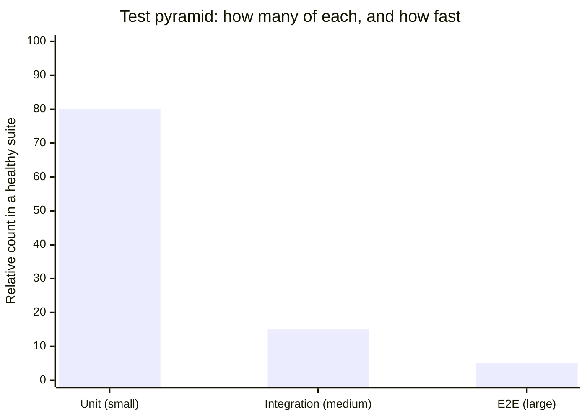
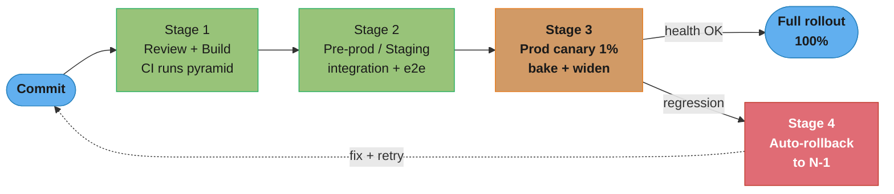
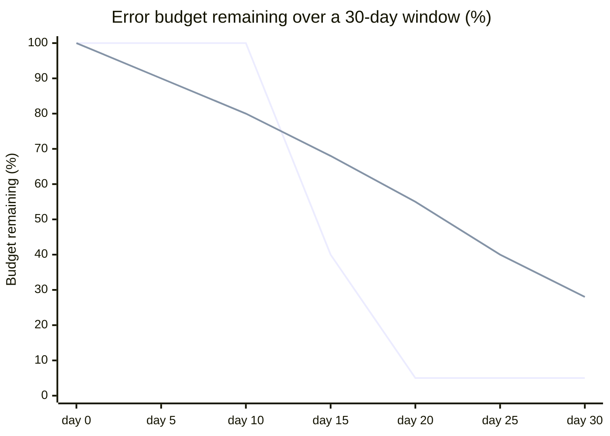
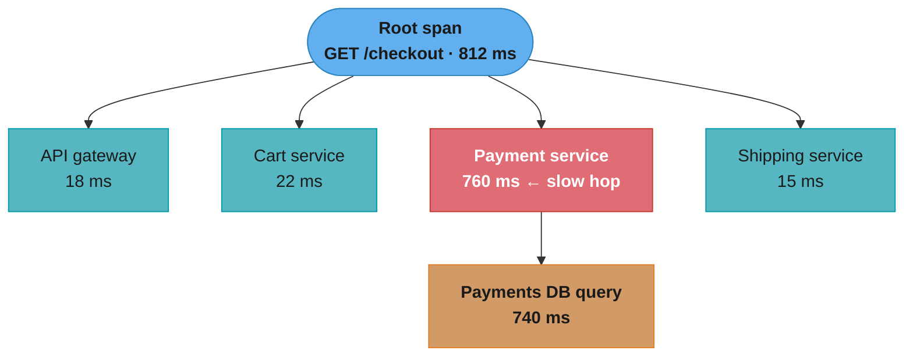
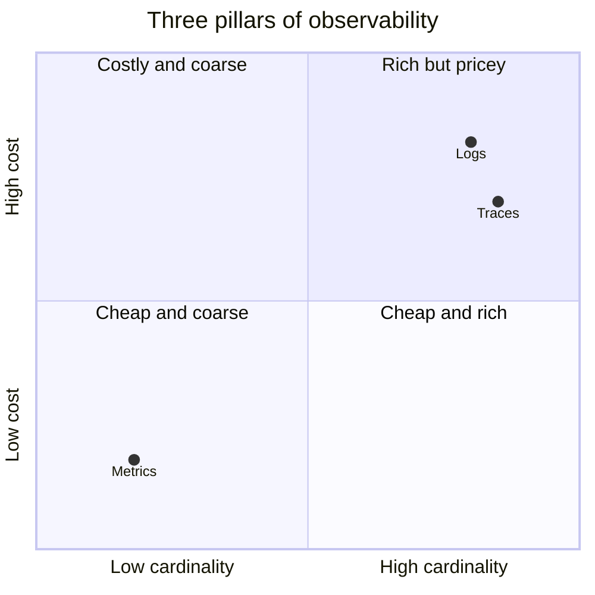

# Part V: Maintainability

> Part V of 5 · Understanding Distributed Systems (Vitillo) · covers book Ch 29–33 · builds on Part IV · closes the book

## Chapter Map

A distributed system spends most of its life *being operated*, not being written. Maintainability
is the discipline that keeps a running system cheap to change, safe to release, and observable
enough to debug at 3 a.m. — the difference between a system a team can evolve for a decade and one
that ossifies into a "do not touch" liability. Part IV made the system survive failures; Part V
makes the *humans* survive the system.

This closing part walks the operational loop in the order you actually meet it:
**test** a change (Ch 29) → **deliver** it safely to production (Ch 30) → **monitor** whether it
broke anything and page a human on symptoms (Ch 31) → **observe** *why* it broke when the metric
alone can't tell you (Ch 32) → **manage** the running system without redeploying, treating config
as the leading outage cause it is (Ch 33). Then the book ends with its thesis: master the
fundamentals, because frameworks come and go but the failure modes do not.

**TL;DR of the argument:**
- **Tests** buy the confidence to change code; favour the *smallest* test that catches the bug —
  the pyramid (many small, few large) is the target, and an inverted pyramid (many slow e2e tests)
  is a maintainability smell.
- **Continuous delivery** replaces rare, terrifying big-bang releases with frequent, boring ones:
  a four-stage pipeline (review/build → pre-prod → prod canary → rollback) plus feature flags that
  decouple *deploy* from *release*, and two-phase (expand/contract) migrations so version N and
  N−1 coexist.
- **Monitoring** detects that something is broken and pages a human — alert on **symptoms** (SLO
  burn rate) not causes, watch **percentiles** not averages, and spend an **error budget** to
  govern release velocity.
- **Observability** explains *why* — high-cardinality logs and distributed traces answer the
  unknown-unknowns that pre-aggregated metrics cannot.
- **Manageability** is operating without a redeploy — dynamic config and feature toggles — but
  config changes are a top outage cause, so ship them through the same test-and-stage pipeline as
  code.

## The Big Question

> "The system works today. How do I keep changing it — for years, with a rotating team, under
> load — without every change being a coin-flip on an outage, and without a 3 a.m. page turning
> into a 3-hour whodunit?"

Analogy: the code you write is the *birth* of a service; maintainability is the *lifelong health
care*. A newborn service that can't be tested, released incrementally, monitored, or debugged is
not "done" — it's a patient with no chart, no vitals monitor, and no way to administer medicine
without surgery. The chapters below are, in order, the annual checkup (testing), the pharmacy with
child-proof dosing (continuous delivery), the vitals monitor with an alarm (monitoring), the MRI
you order when the vitals are weird but you don't know why (observability), and the adjustable
medication drip you can tune without another operation (manageability).

---

## 5.1 Testing (Ch 29)

Tests exist for one reason: **the confidence to change code**. In a system too large for any one
person to hold in their head, a test suite is what lets a developer refactor, upgrade a dependency,
or add a feature without silently breaking a caller three services away. Tests double as
**executable documentation** — a well-named test states, in code that can't rot undetected, what a
component is *supposed* to do. A test has three parts: **arrange** (set up the system under test and
its dependencies), **act** (invoke the behaviour under test), and **assert** (verify the outcome
matches expectations).

The single most important principle, repeated throughout the chapter: **prefer the smallest test
that can catch the bug.** Smaller tests are faster, more reliable, and pin the failure to a smaller
region of code. You climb the ladder of scope and size only when a smaller test genuinely cannot
exercise the behaviour.

### Scope of testing

Tests are classified by how much of the system they exercise:

- **Unit test** — verifies a single, small unit (a class or function) in isolation. It replaces the
  unit's collaborators with **test doubles** so only the unit's own logic is under test. Unit tests
  are fast (milliseconds), deterministic, and numerous — they form the base of the pyramid.
- **Integration test** — verifies that a service correctly integrates with an *external
  dependency* — a database, a message broker, another service's API. It exercises the wiring
  (serialization, queries, network calls) that a unit test stubs out. Slower and fewer than unit
  tests.
- **End-to-end (e2e) test** — exercises the whole system through its public interface, as a real
  user would, across multiple services and their real dependencies. It's the only test that
  verifies the *entire* path works together — and it's the slowest, flakiest, and most expensive to
  write and maintain.

The **test pyramid** is the prescription: **many small unit tests at the base, fewer integration
tests in the middle, and a thin layer of e2e tests at the top.** The shape follows directly from
"prefer the smallest test": each layer up costs more per test and catches proportionally fewer
distinct bugs, so you want most of your coverage concentrated where tests are cheap and reliable.

Why e2e tests are so painful, and why you want *few* of them:

- **Slow** — a single e2e run can take minutes because it spins up multiple services and does real
  network and disk I/O.
- **Flaky** — they fail intermittently for reasons unrelated to the code under test: a slow
  network, a dependency mid-deploy, a race in test data setup, an over-tight timeout. A flaky suite
  is worse than no suite — developers learn to ignore red builds ("just re-run it"), and a real
  regression hides in the noise.
- **Expensive to debug** — when an e2e test fails, the bug could be anywhere across many services;
  the test tells you *that* something broke, not *where*, so you're back to the whodunit the tests
  were supposed to prevent.

The maintainability smell to name in an interview is the **inverted pyramid** (or "ice-cream cone"):
a suite dominated by slow, flaky e2e tests with a thin unit base. Symptoms: CI takes 40 minutes,
the team routinely re-runs failed builds, and nobody trusts a green build. The fix is to push
coverage *down* the pyramid — replace an e2e test that checks a validation rule with a unit test
that checks the same rule directly.

**In plain terms.** "Total CI time is just `Σ (count × per-test duration)` per layer — and because
per-test duration differs by *three orders of magnitude* between layers, the shape of the pyramid,
not the number of tests, decides whether CI takes five minutes or an hour." The pyramid is a
cost-optimization result, not an aesthetic preference.

| Symbol | What it is |
|--------|------------|
| `count` | Number of tests at a layer |
| `duration` | Wall time for one test at that layer: unit ~10 ms, integration ~200 ms, e2e ~5 s |
| `count × duration` | That layer's contribution to the CI run |
| `Σ` | Sum over the three layers — the total CI time developers actually wait for |
| shape | The *ratio* between layer counts. 80/15/5 is a pyramid; 5/15/80 is the ice-cream cone |

**Walk one example.** The same 1,000 tests, arranged two ways:

```
  HEALTHY PYRAMID (80% / 15% / 5%)
    unit          800 x   10 ms =    8.0 s
    integration   150 x  200 ms =   30.0 s
    e2e            50 x 5000 ms =  250.0 s
    total                       =  288.0 s  =  4.8 min

  INVERTED (ice-cream cone: 50 unit / 150 integration / 800 e2e)
    unit           50 x   10 ms =    0.5 s
    integration   150 x  200 ms =   30.0 s
    e2e           800 x 5000 ms = 4000.0 s
    total                       = 4030.5 s  = 67.2 min

  same 1,000 tests, same coverage intent  ->  4.8 min vs 67 min, a 14x difference
```

That 67-minute figure is the "CI takes 40 minutes" smell the text names, and the arithmetic shows
why it is self-reinforcing: e2e tests are also the *flaky* ones, so an inverted suite doesn't just
run for an hour — it runs for an hour and then asks you to re-run it. **Flakiness multiplies the
worst term.** At a 2% per-test flake rate, 800 e2e tests fail a build with probability
`1 − 0.98^800`, which is effectively 100% — the suite is *never* green on the first try.


### Size of testing

Scope (how much *code* is exercised) is related to but distinct from **size** (how many
*resources* the test needs to run). Vitillo classifies tests by size because size predicts speed and
reliability:

- **Small test** — runs in a **single process**, no I/O: no network, no disk, no clock waits. It's
  fully deterministic and blindingly fast (thousands per second). Most unit tests are small.
- **Medium test** — runs on a **single machine** and *may* touch the local host: talk to a database
  in a local container, hit `localhost`, read a file. Slower and slightly less deterministic than
  small.
- **Large test** — spans **multiple machines** — a real distributed deployment across the network.
  Slowest, least deterministic, most expensive. Most e2e tests are large.

The guidance mirrors the pyramid: **a test should be as small as possible while still catching the
class of bug you care about.** A test that uses more resources than it needs is slower and flakier
for no benefit. The two axes interact — you can have a large-scope test (exercises many components)
that is still small in size if it runs in one process with fakes, and that combination is often the
sweet spot for testing a whole subsystem quickly.

| Size | Runs on | Touches | Speed | Determinism |
|------|---------|---------|-------|-------------|
| Small | Single process | No I/O | Fastest (ms) | Fully deterministic |
| Medium | Single machine | Local host (DB, disk, localhost) | Moderate | Mostly deterministic |
| Large | Multiple machines | Real network / distributed deploy | Slowest | Least deterministic (flaky) |

### Practical testing — test doubles

To keep tests small, you replace a unit's real collaborators with **test doubles**. They differ in
fidelity and cost:

- **Stub** — returns hard-coded, canned answers to calls (e.g. a stubbed payment gateway always
  returns "approved"). Cheapest; verifies nothing about how it was called.
- **Mock** — like a stub but *also* asserts on the interaction: it verifies the unit called the
  dependency the expected number of times, with the expected arguments. Useful when the *behaviour*
  under test is "did we call the collaborator correctly," but over-mocking couples tests to
  implementation details and makes refactoring painful.
- **Fake** — a real, working, lightweight implementation of the dependency's contract — e.g. an
  in-memory database or an in-memory message queue standing in for the real thing. Highest fidelity
  of the three because it actually behaves like the dependency; more work to build but far more
  trustworthy than a stub.

The **fidelity–cost tradeoff** is the whole point: the higher the double's fidelity, the more
confidence the test gives you but the more it costs (to build, to run, in flakiness). A stub is
cheap but low-fidelity (it can't catch a bug in how the two components actually interact); a real
dependency is highest-fidelity but turns a small test into a medium or large one. **Use a test
double only for a dependency that's slow, non-deterministic, or has side effects you can't
tolerate in a test; use the real dependency when it's cheap enough** (an in-process SQLite, a
local container).

A specific hazard: doubles can **drift** from the real dependency. If your stub returns a response
shape the real service stopped producing two releases ago, your tests pass while production breaks.
**Contract tests** address exactly this — a shared, versioned contract (a schema or a set of
example request/response pairs) that *both* the consumer's tests and the provider's tests run
against, so a provider that breaks the contract fails its own CI before it can break a consumer.

Beyond doubles, two production-fidelity techniques:

- **Fault injection** — deliberately inject failures (drop packets, add latency, kill a process,
  return errors) to test that your resiliency mechanisms (timeouts, retries, circuit breakers from
  Part IV) actually work. You cannot verify a circuit breaker by hoping the dependency fails on its
  own; you must *make* it fail.
- **Chaos testing / chaos engineering** — fault injection run **against production** (or a
  production-like environment), continuously, to surface the failure modes that only appear at real
  scale and under real traffic. Netflix's Chaos Monkey (randomly terminating instances) is the
  canonical example. The philosophy: the only way to know your system tolerates a failure is to
  cause that failure on purpose, in a controlled way, before it happens on its own at the worst
  possible time.

**Testing in production.** The chapter's deeper point is that at real scale, pre-production testing
can only take you so far — some behaviours *only* exist in production (real traffic mix, real data
distributions, real dependency states), so production itself becomes a testing environment. This is
not recklessness; it's the same tools used deliberately: **canary releases** (§5.2) are a live A/B
test of a new version against the old, **chaos experiments** verify resiliency under real
conditions, and **real-user monitoring** (the SLIs of §5.3) is continuous verification that the
system behaves correctly for actual users. The mindset shift is that "tested" isn't a state a change
reaches in CI and keeps forever — production is an environment you keep testing *in*, safely, behind
canaries and flags.

**Broken → fix: the flaky integration test.** A common war story: an integration test asserts that
after posting an order, `GET /orders` returns it — but it fails ~5% of the time in CI. The broken
version reads immediately after the write and the order isn't visible yet because the write went to a
leader and the read hit an asynchronous replica (replication lag from Part II). Teams "fix" it by
adding `sleep(500ms)` — which makes the suite slower *and* still flaky (sometimes lag exceeds
500 ms). The real fix is to remove the non-determinism: read from the leader in the test, or poll
with a bounded retry until the order appears or a timeout fires, or (better) restructure so the test
doesn't depend on cross-replica timing at all. A flaky test is a bug in the test or a real race in
the system — never something to paper over with a sleep.

### Formal verification

Some designs are too expensive — or impossible — to test empirically: a consensus protocol, a
replication scheme, a distributed lock. The state space is astronomically large, and the dangerous
interleavings are rare, so an empirical test suite will almost never hit them. **Formal
verification** attacks the *design* rather than the implementation. You write a **specification** — a
precise, abstract model of the system's behaviour, a blueprint — in a formal language, and a
**model checker** exhaustively explores every reachable state to prove the design satisfies its
invariants (or produces a concrete counter-example trace showing how it can be violated).

**TLA+** (Leslie Lamport's Temporal Logic of Actions) is the tool Vitillo highlights; Amazon
famously used it to find subtle bugs in the design of DynamoDB, S3, and other services *before*
writing a line of code — bugs that would have taken very deep, rare interleavings to trigger in
testing. The tradeoff: a spec verifies the *design*, not the *code* that implements it, so a correct
spec can still be implemented incorrectly. Formal methods are worth the effort for the small,
critical core (the coordination protocol) where a bug is catastrophic and hard to reproduce, not for
ordinary application logic.

---

## 5.2 Continuous Delivery and Deployment (Ch 30)

The core argument: **safe, frequent, small releases beat rare, large, terrifying ones.** A big-bang
release that bundles hundreds of changes is a high-risk event — when it breaks, you have hundreds of
suspects and a hard rollback. Small, frequent releases invert every one of those properties: each
release changes little, so the blast radius is small, the suspect list is short, and rollback is
trivial. The way you get there is a **continuous delivery pipeline** that automates the path from a
committed change to production, with safety gates at every stage.

Why small and frequent beats large and rare, made concrete: releasing *rarely* forces each release
to bundle *many* changes, and the risk of a release scales with the number and complexity of changes
in it — so rare releases are individually terrifying, hard to review, and hard to roll back (which of
the 200 changes broke it?). Frequent releases invert every property: each contains one or a few
changes, so a regression is easy to attribute, the rollback reverts almost nothing, and the team
*practices* releasing constantly, keeping the whole pipeline well-oiled rather than a rusty
once-a-quarter fire drill. Counter-intuitively, releasing *more* often makes each release *safer*.

Two terms the chapter is careful to distinguish:

- **Continuous delivery** — every change that passes the pipeline is *ready* to be released to
  production automatically, but a human makes the final call to push the button.
- **Continuous deployment** — the pipeline goes all the way to production with *no* human gate;
  every green change ships automatically. This requires very high confidence in the pipeline's
  safety gates.

The pipeline has **four stages**. A change flows through them in order and any stage can reject it.

### Review and build

The first stage turns a proposed change into a validated, deployable artifact:

- **Code review** — a second engineer reads every change before it merges. Catches bugs, spreads
  knowledge, and enforces conventions. The review should be *small* (small PRs get better reviews);
  a giant PR gets a rubber-stamp.
- **Trunk-based development** — developers integrate small changes into the shared main branch
  (trunk) frequently — at least daily — rather than living on long-lived feature branches that
  diverge for weeks and produce agonizing "big-bang" merges. Short-lived branches keep merges
  trivial and keep the trunk always-releasable.
- **Continuous integration (CI)** — on every merge, an automated build compiles the code and runs
  the test suite (the pyramid from 5.1). A red build blocks the pipeline. CI is what makes
  trunk-based development safe: the trunk stays green because nothing merges without passing.
- **Feature flags** — a runtime toggle that lets you merge and *deploy* code while the new
  behaviour stays *off* until you flip the flag. This is the key move that **decouples deploy from
  release**: you can ship half-finished code to production behind an off flag (so trunk-based
  development works even for a multi-week feature), then *release* by flipping the flag — and roll
  the release back by flipping it off, with no redeploy. Feature flags reappear in Ch 33 as a
  manageability tool.

### Pre-production

The artifact is deployed to a **staging** (pre-production) environment that mimics production, where
you run the larger, slower tests (integration, e2e) that you don't run on every commit. Staging
catches integration problems before they reach real users.

The chapter is blunt about staging's **limits**: staging is *never* a faithful replica of
production. It has different (smaller) scale, different data, different traffic patterns, and often
different configuration. A change can pass every test in staging and still break in production
because production has 1000× the load, real user data with edge cases you never imagined, and
dependencies in states staging never reproduces. **Staging reduces risk; it does not eliminate it** —
which is exactly why the next stage exists.

### Production — incremental rollout

Because staging can't prove a change is safe at production scale, you roll it out **incrementally**
in production and watch the health signals at each step:

- **Canary release** — deploy the new version to a *small* fraction of servers or users first (the
  "canary in the coal mine"). Route, say, 1% of traffic to it and compare its health metrics (error
  rate, latency, resource use) against the unchanged baseline. If the canary is healthy, gradually
  widen the rollout — 1% → 10% → 50% → 100% — pausing at each step. If the canary degrades, stop and
  roll back, having exposed only 1% of users to the problem.
- **Blue-green deployment** — the coarser alternative: stand up a full *second* environment (green)
  running the new version alongside the live one (blue), then switch all traffic over at once (and
  switch back instantly on trouble). Blue-green gives a fast, atomic rollback (flip the router back
  to blue) but *no* gradual exposure — every user hits the new version the moment you cut over — so
  it's often combined with a canary phase before the full cut. Canary trades a slower rollout for a
  smaller blast radius at each step.
- **Bake time** — at each rollout stage you *wait* (bake) long enough for problems to surface before
  proceeding. Some failures (a memory leak, a slow cache poisoning, a cron-triggered code path)
  only appear after minutes or hours; widening the rollout too fast defeats the whole point of
  canarying. The rollout should be *slow enough that a problem is caught while it's still small.*
- **Health signals per stage** — each stage gates on automated health checks: if the canary's error
  budget burn, latency percentiles, or crash rate cross a threshold, the pipeline halts (or
  auto-rolls-back) rather than promoting.

**What this actually says.** "The blast radius of a bad deploy is `exposure % × users × time at that
exposure` — and a staged rollout works by keeping the *first* factor tiny for exactly as long as it
takes the *third* factor to reveal the bug." Canarying does not make deploys safer; it makes them
*cheaper when they are unsafe*.

| Symbol | What it is |
|--------|------------|
| `U` | Total user population |
| `e` | Exposure fraction at the current stage. `1%` → `0.01` |
| `U × e` | Users who can hit the new version right now — the blast radius at this stage |
| bake time | How long you hold at `e` before widening. Must exceed the bug's time-to-surface |
| stages | The exposure ladder, e.g. `1% → 10% → 50% → 100%` |

**Walk one example.** `U = 10,000,000` users, the text's `1% → 10% → 50% → 100%` ladder with a
30-minute bake at each step:

```
  stage    exposure e    users at risk      cumulative rollout time
   1%        0.01           100,000            30 min
  10%        0.10         1,000,000            60 min
  50%        0.50         5,000,000            90 min
 100%        1.00        10,000,000           120 min  (2.0 h end to end)

  bug caught at the 1% stage   ->     100,000 users affected
  bug shipped big-bang         ->  10,000,000 users affected
  ratio                        ->  100x smaller blast radius, bought with 2 hours
```

**Why bake time is the load-bearing knob, not the percentage.** The exposure ladder only helps if the
bug *shows up* while you are still at 1%. A crash-on-startup surfaces in seconds and any canary
catches it; a memory leak that OOMs after 40 minutes, or a bug that only fires on a nightly cron,
sails through a 5-minute bake and gets promoted to 100% — where it now takes down everything at
once, having consumed your entire rollout budget proving nothing. **A fast rollout through all four
stages is a big-bang deploy with extra ceremony.** Size the bake to the *slowest* failure mode you
believe in, not to how impatient the release train is.

### Rollbacks and backward compatibility

The safety net under the whole pipeline is the ability to **roll back** fast — and rollback is only
safe if you engineered for it up front:

- **Automated rollback on regression** — the pipeline watches health signals and, on a regression,
  automatically reverts to the previous known-good version. Automated because a human is too slow at
  3 a.m., and because "roll back" must be a boring, well-rehearsed button, not a heroic improvisation.
- **Backward and forward compatibility** — during any incremental rollout, version **N** and version
  **N−1** run *simultaneously* (some servers new, some old; requests hit either). For this to be
  safe, N must handle data/messages written by N−1 (backward compatible) *and* N−1 must tolerate
  data/messages written by N (forward compatible). A change that breaks this — say, N writes a new
  required field that N−1 chokes on — will fail the moment the two versions coexist, which is *every
  single rollout*.
- **Two-phase (expand/contract) migrations** — the discipline that makes an incompatible schema or
  API change safe. You never change-in-place; you split the change into two independently deployable
  phases with the old and new forms coexisting in between:

  1. **Expand** — deploy a version that *adds* the new form (new column, new field, new endpoint)
     while *still* reading and writing the old form. The old and new coexist; nothing has been
     removed, so N−1 still works and this deploy is fully rollback-safe.
  2. **Migrate/backfill** — with both forms live, migrate the data and switch readers/writers to the
     new form (often behind a feature flag), one step at a time, verifying at each step.
  3. **Contract** — only *after* nothing reads or writes the old form anymore do you deploy a final
     version that removes it.

  Renaming a column `email` → `email_address` in one shot would break every running instance that
  still expects `email`. Expand/contract instead: add `email_address` and dual-write both →
  backfill → switch reads to `email_address` → stop writing `email` → *then* drop `email`. Each
  phase is independently deployable and rollback-safe because at no instant does a live version
  depend on a form another live version can't produce.

- **Config changes through the same pipeline** — configuration changes are *changes*, and (as Part
  IV's failure-causes chapter and Ch 33 both stress) they're a *leading* cause of outages. They must
  flow through the same review → test → staged-rollout pipeline as code, not be hand-edited live on
  a production box.

A practical corollary of expand/contract is **decoupling the schema migration from the code
deploy** — they are *separate* releases, sequenced deliberately. You run the additive (expand)
migration *first*, as its own change, and only *then* deploy code that uses the new form; and you
remove code that uses the old form *before* the contract migration drops it. Bundling a destructive
migration into the same release as the code that stops needing it is exactly what breaks rollback:
if you deploy new code *and* drop the old column together, rolling back the code lands you on a
version that expects a column that no longer exists. Keep every migration additive-then-destructive,
each destructive step gated behind "nothing uses this anymore," and rollback stays trivial at every
point.

---

## 5.3 Monitoring (Ch 31)

Monitoring answers one question: **is the system working, from the user's point of view?** It has
two distinct jobs that people constantly conflate:

- **Failure detection** — automatically noticing that something is broken and alerting a human. This
  is monitoring's primary job.
- **Debugging** — figuring out *why* it broke. Monitoring gives you the first clue, but deep
  debugging is the job of **observability** (5.4). Trying to make monitoring answer every "why" leads
  to a metrics explosion.

Two vantage points:

- **Black-box monitoring** — probe the system from the *outside*, as a user does (synthetic requests
  hitting the public API, checking status and latency). It tells you whether the system is up *right
  now* from the outside, and it's independent of the system's internals — but it can't tell you why.
- **White-box monitoring** — the system reports on its *own* internals (queue depths, cache hit
  rates, thread-pool saturation, GC pauses). Requires instrumentation but gives far richer signal,
  and can catch a problem *before* it becomes user-visible.

### Metrics

A **metric** is a numeric measurement of the system over time — a **time series** of (timestamp,
value) pairs, usually with **labels** (a.k.a. tags/dimensions) that let you slice it (by endpoint,
region, status code, instance). Three fundamental metric types:

- **Counter** — a value that only ever *increases* (or resets to zero on restart): total requests,
  total errors, total bytes sent. You look at its *rate* of change, not its absolute value.
- **Gauge** — a value that goes *up and down*: current memory used, current queue depth, current
  in-flight requests, current temperature. A snapshot of "how much right now."
- **Histogram** — buckets observations into ranges to capture a *distribution*: request latency
  bucketed into <10 ms, <50 ms, <100 ms, etc. Histograms are how you compute **percentiles** (below)
  — a plain counter/gauge cannot give you a p99.

**Cardinality** is the number of distinct label combinations, and its explosion is the classic
metrics footgun. Each unique combination of label values is a *separate* time series the monitoring
system must store and index. Adding a low-cardinality label (`region`: 5 values) is cheap; adding a
high-cardinality label (`user_id`: millions, or `request_id`: unbounded) multiplies your series
count into the millions and can bankrupt the monitoring system's storage and query performance.
**Rule: never put unbounded or high-cardinality dimensions (user IDs, request IDs, full URLs with
IDs) into metric labels** — those belong in *logs and traces* (5.4), which are built for
high-cardinality data. This is the first fork in the metrics-vs-logs-vs-traces decision.

Operationally, you **emit metrics at the edge** (each service instance records its own measurements
locally, cheaply) and **aggregate them centrally** (a system like Prometheus scrapes/collects and
rolls them up). The edge does minimal work; the central system does the expensive aggregation and
storage.

### Service-level indicators (SLIs)

An **SLI** is a carefully chosen metric that measures the service's health *from the user's
perspective*, almost always expressed as a **ratio of good events to total events** — e.g.
`successful requests / total requests` (availability) or `requests faster than 200 ms / total
requests` (latency). Framing SLIs as ratios in [0, 1] makes them comparable and makes SLO targets
(below) natural.

A useful starting menu for *what* to measure is the **four golden signals** (from Google SRE
practice, which Vitillo draws on): **latency** (how long requests take — as percentiles, and
separating successful from failed latencies), **traffic** (how much demand — requests per second),
**errors** (the rate of failed requests), and **saturation** (how full the system is — the most
constrained resource's utilization, e.g. queue depth or memory, which predicts *imminent* trouble).
Latency, traffic, and errors are user-facing symptoms good for SLIs and symptom alerts; saturation
is a white-box leading indicator good for capacity planning and dashboards.

The chapter's hard-won lesson on **latency**: **measure percentiles, not averages.** The average
latency is worthless for user experience because it hides the tail. If 99 requests take 10 ms and
one takes 5000 ms, the average is ~60 ms — a number *no single user experienced* — while the truth
is that 1% of users had a terrible time. The **p99** (99th percentile: 99% of requests were at least
this fast) captures the tail the average erases. High percentiles matter more than they seem because
a single user's page load fans out into *many* backend requests, so the probability that user hits
*at least one* slow request is far higher than 1% — the tail dominates real user experience.

**Read it like this.** "An average is a *single number that describes nobody*; a percentile is a
*promise about a fraction of your users*." `pX = v` reads "X% of requests were at least as fast as
`v`" — which is the only form a user-facing latency claim can honestly take.

| Symbol | What it is |
|--------|------------|
| mean | `Σ latencies / count`. One slow outlier drags it; it corresponds to no real request |
| `pX` | The latency value below which `X%` of requests fall. `p99 = 300 ms` → 99% were ≤ 300 ms |
| `1 − X` | The fraction of users living *above* `pX` — the population the percentile excludes |
| `f` | Fan-out: backend calls behind one user-visible page load |
| `1 − pX^f` | Chance a user hits **at least one** tail request across the fan-out |

**Walk one example.** The text's distribution, scaled to 1,000 requests — 990 at 10 ms and 10 at
5,000 ms:

```
  mean   = (990 x 10 + 10 x 5000) / 1000 = (9,900 + 50,000) / 1000 = 59.9 ms
  p50    = 10 ms          <- the typical experience
  p99    = 10 ms          <- still 10 ms! the slow 1% starts ABOVE p99
  p99.9  = 5000 ms        <- here is the truth the mean buried

  "59.9 ms average" describes ZERO of the 1000 requests. Not one was near 60 ms.
  Every request was either 10 ms (fast) or 5000 ms (catastrophic).
```

Note the second gotcha the walk exposes: **the percentile has to be high enough to reach the tail
you care about.** With 1% of traffic pathological, `p99` sits exactly at the boundary and reports
10 ms — perfectly healthy — while `p99.9` reports 5 seconds. Choosing `p99` here would have hidden
the incident as thoroughly as the mean did.

Now the fan-out multiplier the text alludes to, at a genuinely good `p99`:

```
  per-call P(fast) = 0.99          one page load = f backend calls
  f = 1     P(hit >=1 slow call) = 1 - 0.99^1   =  1.00%
  f = 5                          = 1 - 0.99^5   =  4.90%
  f = 10                         = 1 - 0.99^10  =  9.56%
  f = 20                         = 1 - 0.99^20  = 18.21%
  f = 100                        = 1 - 0.99^100 = 63.40%
```

A page that fans out to 100 services with a 99th-percentile-clean backend gives **63% of users a
slow experience.** This is why large systems chase `p99.9` and `p99.99` on individual services: the
tail you can ignore at `f = 1` is the median experience at `f = 100`. It is the same compounding
arithmetic as Part IV's `A^N` dependency chain, measured in milliseconds instead of nines.

The subtle trap the chapter names is **coordinated omission**: a naive latency measurement records
only the requests that *completed*, silently *omitting* the requests that were never sent or never
finished *because the system was already stalled* — and those omitted requests are exactly the slow
ones. Classic example: a load tester fires one request, waits for the response, then fires the next.
When the server stalls for 5 seconds, the load tester also stalls — it *doesn't send* the requests it
would have sent during that window — so those would-be-slow requests never appear in the histogram,
and the measured p99 looks far better than reality. The measurement *coordinates* with the system's
stalls and omits the worst data. The result is dangerously optimistic percentiles. The fix is to
measure against the *intended* request schedule (record a request as slow if it *should* have been
sent by now), which is what latency tools like `wrk2` and correct SLI pipelines do.

### Service-level objectives (SLOs) and error budgets

An **SLO** is a *target* for an SLI over a *window* — e.g. "99.9% of requests succeed, measured over
a rolling 30 days." An SLO is an internal reliability goal the team commits to. It's distinct from an
**SLA (service-level agreement)**, which is a *contractual* promise to *customers* with financial
penalties for breach — the SLA is always looser than the internal SLO (you set the SLO tighter so
you notice trouble and react before you breach the SLA).

A detail that trips people up is the **window type**. A **rolling window** (the trailing 30 days,
recomputed continuously) is smooth and always reflects recent reality, so a bad day ages out
gradually. A **calendar window** (this month, resetting on the 1st) aligns with reporting and gives
the budget a clean reset, but creates a cliff — a bad incident late in the month has little time to
recover, and everyone gets a fresh budget at midnight regardless of how the previous period went.
Rolling windows are generally preferred for alerting because they don't have the reset artifact.

The powerful idea an SLO unlocks is the **error budget**. If your SLO is 99.9% success, then you are
*allowed* to fail 0.1% of requests — and that 0.1% is a **budget you can spend**. Over 30 days,
99.9% availability permits ~43 minutes of total downtime. That budget reframes reliability from an
absolute ("never fail") to an economic decision:

- When the budget has **room**, you can spend it: ship features faster, do riskier rollouts, run
  chaos experiments. Reliability beyond the SLO has no user value and costs velocity.
- When the budget is **exhausted** (you've used up the month's allowed failures), you **freeze**
  risky releases and redirect engineering effort to reliability until the budget recovers. The
  budget is the objective, non-political arbiter of the eternal "features vs. reliability" fight
  between product and ops.

Availability itself is just the SLI `successful requests / total requests` over the window. (The
classic "nines" table — 99.9% ≈ 8.76 h/yr, 99.99% ≈ 52.6 min/yr, 99.999% ≈ 5.26 min/yr — is the
resiliency framing from Part IV; the error budget is the *operational* use of that same math.)

**Worked example — sizing the budget and a burn rate.** Suppose a 99.9% availability SLO over a
30-day window, and the service handles a steady 1,000 requests/second:

- Total requests in the window: `1000 × 60 × 60 × 24 × 30 = 2.592 billion`.
- Error budget: `0.1% × 2.592B = 2.592 million` failed requests allowed for the whole month. That's
  the budget you get to spend.
- "On pace" (1× burn) means spending it evenly: `2.592M / 30 days ≈ 86,400 errors/day`, i.e. an
  error *rate* of exactly 0.1% sustained.
- Now a bad deploy pushes the error rate to **1.44%** for one hour. In that hour it burns
  `1.44% × (1000 × 3600) = 51,840` errors — versus the `0.1% × 3.6M = 3,600` errors an on-pace hour
  would use. That's a **14.4× burn rate**, and one hour at 14.4× spends `51,840 / 2,592,000 ≈ 2%` of
  the entire month's budget in 60 minutes. This is why 14.4×/1 h is a canonical **fast-burn page**
  threshold: at that rate the month's budget is gone in `30 days / 14.4 ≈ 50 hours`.

The same arithmetic explains **slow burn**: a chronic 0.3% error rate is only a 3× burn — no single
hour looks alarming — but sustained it exhausts the 30-day budget in `30 / 3 = 10 days`. It deserves
a ticket, not a 3 a.m. page.

**What it means.** "Your SLO says you're allowed to fail `1 − SLO` of the time. Multiply that
allowance by the window and you get a *quantity* — minutes, or failed requests — that you own and
may spend." The reframing is the entire point: reliability stops being a moral absolute and becomes
a budget line with a balance you can check.

| Symbol | What it is |
|--------|------------|
| `SLO` | The target, as a fraction. `99.9%` → `0.999` |
| `1 − SLO` | The error budget as a *rate* — the fraction of failure you're permitted |
| window | The measurement period. `30 days` = `43,200` minutes = `2,592,000` seconds |
| `(1 − SLO) × window` | Error budget in **time** — the downtime you may spend |
| `(1 − SLO) × total requests` | The same budget in **requests** — the failures you may serve |
| balance | Budget minus what you've already burned. This is what gates risky releases |

**Walk one example.** Both currencies, at four common SLOs over a 30-day window:

```
  30-day window = 30 x 24 x 60 = 43,200 minutes

  SLO       1-SLO      budget in TIME        budget in REQUESTS at 1,000 rps
  99%       0.01       432.00 min (7.2 h)    25,920,000 failed requests
  99.9%     0.001       43.20 min            2,592,000
  99.95%    0.0005      21.60 min            1,296,000
  99.99%    0.0001       4.32 min              259,200

  the request-count column, derived:
    total requests = 1000 x 60 x 60 x 24 x 30 = 2,592,000,000  (2.592 billion)
    at 99.9%:  0.001 x 2,592,000,000          =     2,592,000  (2.592 million)
    on pace:   2,592,000 / 30 days            =        86,400 errors/day
               86,400 / 24                    =         3,600 errors/hour
```

Both columns match the worked example above and Part IV's nines table (`99.9%` → 43.2 min/month is
the same `(1 − A) × window` calculation), which is the point: **availability and error budget are
one equation used for two purposes** — Part IV to size redundancy, Part V to decide whether to ship.

**Put simply.** Burn rate answers "at the speed I'm failing *right now*, how long until the budget is
gone?" It is a ratio of two rates — observed error rate over the on-pace error rate — so a burn rate
of `1×` lands you at exactly zero budget on the last day of the window, and `B×` gets you there `B`
times sooner.

| Symbol | What it is |
|--------|------------|
| observed rate | Your actual error rate over the alerting window, e.g. `1.44%` |
| on-pace rate | `1 − SLO`, the rate that exactly consumes the budget by the window's end |
| `B` | Burn rate = observed / on-pace. Dimensionless — `14.4×` means 14.4 times too fast |
| `window / B` | Time to budget exhaustion at this burn rate |
| alert window | How long you measure `B` over. Short = fast detection, noisy; long = slow, precise |

**Walk one example.** Verify the canonical `14.4×` threshold from both directions:

```
  SLO 99.9% / 30 days, 1,000 rps.  Budget = 2,592,000 errors.

  observed 1.44% for one hour:
    errors burned = 0.0144 x (1000 x 3600) = 0.0144 x 3,600,000 =  51,840
    on-pace hour  = 0.001  x 3,600,000                          =   3,600
    burn rate B   = 51,840 / 3,600                              =    14.4x
    share of month's budget spent in 60 min = 51,840 / 2,592,000 =   2.00%

  time to exhaustion, two ways -- they must agree:
    window / B          = 30 days / 14.4      = 2.083 days = 50.0 hours
    budget / burn-rate  = 2,592,000 / 51,840  = 50.0 hours     <- agrees
```

**The `14.4×` number is not arbitrary — it is reverse-engineered from "2% per hour."** Someone chose
"an alert should fire when a single hour eats 2% of the month," and `0.02 × 30 days = 14.4 hours`
of budget consumed per hour, i.e. `14.4×`. Every canonical burn-rate threshold is constructed this
way: pick the budget fraction you're willing to lose before being woken, divide by the window
fraction you're measuring over. Contrast the slow-burn tier — `3×` over `6 h` spends `3 × 6 / 720 =
2.5%` of the budget, a nearly identical *total* loss, but stretched over six hours instead of one,
which is exactly why one pages and the other files a ticket. The two tiers cost the same; they
differ in *urgency*, and that is the axis the multi-window scheme is sorting on.

### Alerts

An alert fires when an SLI threatens or breaches its SLO. Two failure modes bracket good alerting:

- **Alert on symptoms, not causes.** Page on *user-visible* symptoms (the SLO is burning — error
  rate up, latency up) rather than on internal *causes* (CPU high, a disk 80% full, one instance
  down). Cause-based alerts produce **alert fatigue**: most of them are *not* actually hurting users
  (the system routed around the dead instance; the CPU spike was a batch job), so on-call learns to
  ignore alerts — and then misses the real one. Symptom-based alerts fire *only* when users are
  actually affected, so every page is real. (Causes belong in *debugging*, i.e. observability, once a
  symptom has paged you.)
- **Precision vs. recall.** An alert has **precision** (of the times it fired, how often was there a
  real problem — high precision = few false alarms) and **recall** (of the real problems, how often
  did it fire — high recall = few misses). They trade off: a hair-trigger alert has high recall but
  low precision (fatigue); a very conservative alert has high precision but low recall (misses).
  Symptom-based, SLO-burn alerting is how you get *both* high — it fires exactly when users hurt.

**The idea behind it.** Both metrics are the same fraction — "how many of these were real?" — with a
different denominator. Precision divides by *what you fired*; recall divides by *what was actually
broken*. Naming the denominator out loud is the whole trick to keeping them straight under interview
pressure.

| Symbol | What it is |
|--------|------------|
| `TP` | True positive — alert fired, there was a real problem |
| `FP` | False positive — alert fired, nothing was wrong. The fatigue generator |
| `FN` | False negative — a real problem, no alert. The outage you find out about on Twitter |
| precision | `TP / (TP + FP)` — of the pages you got, the fraction that mattered |
| recall | `TP / (TP + FN)` — of the real problems, the fraction that paged you |
| `TP + FP` | Total pages the on-call actually receives per period |

**Walk one example.** Ten real incidents in a quarter, three alerting strategies:

```
  strategy         TP    FP    FN    precision   recall   pages received
  hair-trigger     10   190     0        5.0%    100.0%   200  <- 190 of them noise
  (CPU > 80%, any instance down, disk 80% -- cause-based)

  conservative      3     0     7      100.0%     30.0%     3  <- silent for 7 outages
  (only page if the whole service is hard down for 15 min)

  SLO burn-rate     9     1     1       90.0%     90.0%    10  <- both high
  (14.4x/1h page + 3x/6h ticket, symptom-based)
```

The hair-trigger row is how alert fatigue is *manufactured*, and the arithmetic shows the mechanism:
at 5% precision the on-call learns — correctly, rationally — that 19 out of 20 pages are noise, and
starts dismissing them. **Recall on paper was 100%; recall in practice collapses to whatever
fraction the human still reads.** That is why the conservative row is not actually the safe
alternative it looks like: 100% precision with 30% recall means seven real outages went unnoticed.
Symptom-based burn-rate alerting escapes the tradeoff rather than picking a side, because "the SLO
is burning" is *by construction* the definition of a real problem — there is no such thing as a
false positive on a symptom your users are already feeling.

**SLO burn-rate alerting** is the modern technique. The **burn rate** is *how fast* you're consuming
the error budget relative to "on pace." A burn rate of 1× exhausts the budget exactly at the end of
the window; a burn rate of 10× exhausts it in a tenth of the time. You alert on *combinations of
burn rate and time window*:

- **Fast burn** — a large burn rate over a *short* window (e.g. 14.4× over 1 hour, which would spend
  ~2% of a 30-day budget in an hour). This is an acute outage: **page immediately**. Short window =
  fast detection of a sudden severe problem, and the high threshold keeps precision up (a brief blip
  doesn't trip it).
- **Slow burn** — a small burn rate over a *long* window (e.g. 3× over 6 hours). This is a chronic,
  low-grade problem that would quietly exhaust the budget over days — no single moment looks like an
  outage, but the leak is real. It doesn't warrant a middle-of-the-night page, so it opens a
  **ticket** for business hours.
- **Actionability** — every page must be **actionable**: a human paged in the night must be able to
  *do* something. If an alert isn't actionable, it should be a ticket or dashboard, not a page. The
  fast/slow-burn split is exactly the page-vs-ticket routing.

The mature form is **multi-window, multi-burn-rate alerting**: pair each burn-rate threshold with
*two* windows — a long window that determines whether the condition is real, and a short window that
confirms it's *still* happening right now, so the alert auto-resolves quickly once the problem stops
(and doesn't keep paging on a spike that already ended). A typical recipe pages on `14.4×` burn over
`1 h` (short-confirm `5 min`) for acute outages and tickets on `3×` over `6 h` (short-confirm
`30 min`) for slow leaks. This gives you high precision (the short window prevents stale pages) *and*
high recall (the fast window catches severe problems within minutes) at once.

### Dashboards

Dashboards visualize metrics for humans. The chapter's guidance:

- **Audience-layered** — build separate dashboards for separate audiences, top-down: an **SLO**
  dashboard (is the service meeting its objectives? for on-call and leadership), a **public API**
  dashboard (per-endpoint traffic/errors/latency), and **internal** dashboards (queue depths, pool
  saturation — for the owning team debugging). Don't cram everything onto one wall of 80 graphs
  nobody can read.
- **Consistent y-axes** — use the same scale across comparable charts so the eye can compare them at
  a glance and isn't fooled by autoscaling.
- **Annotate deploys** — overlay deployment (and config-change) events on the timelines, so when a
  metric turns bad the first question — "did we just deploy?" — is answered *on the graph*. This one
  habit collapses a huge fraction of debugging time, because config/deploy changes are the leading
  cause of regressions.

Two mnemonics help decide *which* metrics a dashboard should show. The **RED method** (for
request-driven *services*): **R**ate, **E**rrors, **D**uration — the request-facing symptoms, the
same trio as the golden signals minus saturation. The **USE method** (for *resources*):
**U**tilization, **S**aturation, **E**rrors — the white-box view of a queue, pool, disk, or CPU.
RED tells you the service is unhealthy; USE tells you *which resource* is the constraint. Together
they cover both the symptom (RED, for SLIs and alerts) and the cause-hunting (USE, for the internal
dashboards you open after a symptom pages you).

### Being on call

Monitoring's human side. On-call is the rotation of engineers who respond to pages. Sustainable
on-call is itself a maintainability property:

- **Sustainable rotations** — spread on-call across enough people that no one burns out, and treat a
  noisy rotation (frequent non-actionable pages) as a *bug to fix*, not a fact of life.
- **Runbooks** — every alert links to a runbook: a concrete, step-by-step guide to diagnose and
  mitigate *that* alert. The runbook turns a 3 a.m. panic into a checklist and lets a less-senior
  engineer handle the page.
- **Every page actionable** — the golden rule. If a page fires and the responder can't do anything
  useful, that alert is noise; delete it or downgrade it to a ticket. Non-actionable pages are how
  you *manufacture* alert fatigue.
- **Blameless postmortems** — after an incident, write up what happened, why, and how to prevent
  recurrence, focused on the *system and process* failures rather than blaming an individual. The
  point is that people operating under normal incentives will make the same mistake again unless the
  system changes; blaming a person hides the systemic cause and teaches everyone to conceal
  mistakes. Every postmortem should produce concrete action items (a missing validation, a needed
  canary gate, a runbook that didn't exist) that feed back into the pipeline and the alerts —
  closing the maintainability loop.

---

## 5.4 Observability (Ch 32)

Monitoring tells you **that** the system is broken; observability lets you ask **why**. The
distinction is the crux of the chapter. Monitoring is built on *predefined* metrics and alerts —
it answers the **known-unknowns** (questions you knew to ask in advance: "is error rate high?").
But novel failures in a complex distributed system are **unknown-unknowns** — questions you *didn't*
know to ask ("why are requests from users in one region who hit a particular shard slow *only* when
a specific downstream is cold?"). You can't pre-aggregate a metric for a question you didn't
anticipate. Observability is the property of being able to answer *arbitrary*, *new* questions about
the system's behaviour *after the fact*, by exploring **high-cardinality** data — the exact data
metrics deliberately exclude.

Observability rests on the **three pillars**: **metrics** (5.3), **logs**, and **traces**. Metrics
are the cheap, aggregated alerting layer; logs and traces are the rich, high-cardinality debugging
layer.

Why cardinality is the crux: a metric pre-aggregates, collapsing many events into a few numbers per
label combination, which is what makes it cheap — but aggregation *destroys* the per-event detail
you'd need to answer a question you didn't anticipate. Once you've averaged 10,000 requests into one
p99 number, you can no longer ask "which *user* on which *shard* with which *feature flag* was
slow" — that information is gone. Observability keeps the raw, high-cardinality events (in logs and
traces) precisely so you *can* slice by any dimension after the fact. The mental test: if you can
enumerate the questions in advance, a metric suffices; if the interesting question is one you'll only
formulate *during* an incident, you need the high-cardinality data.

### Logs

A **log** is a record of a discrete event. The chapter is emphatic about the modern form:

- **Structured logs** — emit each event as **structured data** (key–value pairs, typically JSON),
  *not* free-form text. `{"level":"error","user_id":123,"latency_ms":543,"shard":"7"}` can be
  queried, filtered, and aggregated by a log system; `"Error processing request for user 123"`
  cannot, without brittle regex parsing.
- **One wide event per request per service** — the recommended discipline (the "canonical log line"):
  instead of scattering many small log lines through a request's handling, accumulate context as the
  request flows and emit **one wide, richly-dimensioned event** per request per service at the end —
  with dozens or hundreds of fields (user, endpoint, shard, cache hit, downstream latencies, feature
  flags, error). *Wide* means high cardinality, which is exactly what lets you slice by any
  dimension later to answer an unknown-unknown ("show me the wide events where `shard=7` AND
  `downstream_cold=true`").
- **Sampling and retention costs** — logs are *expensive*: storing and indexing every field of every
  request at scale costs a fortune. So you **sample** (keep, say, 1% of successful requests but 100%
  of errors) and set **retention** limits (keep detailed logs for days, not years). The cost of
  logging is a first-order design concern, not an afterthought.
- **No PII or secrets** — never log personally identifiable information, credentials, tokens, or
  card numbers. Logs get shipped to third-party systems, indexed, and retained; a secret in a log is
  a breach waiting to happen. Scrub at the source.

### Traces

A **trace** captures the end-to-end journey of a *single request* as it fans out across many
services — the piece logs alone can't give you, because each service's logs are siloed. The
mechanics:

- **Trace-ID propagation** — when a request enters the system, it's assigned a unique **trace ID**.
  That ID is **propagated** through every downstream call (passed in headers, e.g. W3C `traceparent`)
  so every service that touches the request tags its work with the same trace ID. This is what stitches
  the siloed per-service records into one story.
- **Spans** — each unit of work within the trace (a service handling the request, a database query, an
  RPC) is a **span**: a timed operation with a start time, duration, name, and a link to its
  **parent** span. The spans of one trace form a **tree** (the root span is the top-level request;
  children are the operations it triggered), and rendered on a timeline they become the familiar
  **waterfall** view.
- **Finding the slow hop in a fan-out** — this is the trace's killer use. When a request that fans
  out to ten services is slow, the trace's waterfall *instantly* shows *which* span is the long bar —
  which downstream hop is the bottleneck — a question that metrics (which know each service's latency
  in aggregate but not their *causal relationship for this request*) and siloed logs cannot answer.
- **The instrumentation-coverage problem** — a trace is only as complete as your instrumentation. A
  service that isn't instrumented to create and propagate spans is a *gap* in the trace — a blind
  span where the request vanishes and reappears, and you can't see what happened in between. Full,
  consistent instrumentation across *every* service (increasingly via auto-instrumentation and
  standards like OpenTelemetry) is the precondition for tracing to be useful, and it's the hard part.
- **Sampling — head vs tail.** Tracing every request at scale is prohibitively expensive to store,
  so you sample. **Head-based sampling** decides at the *start* of a request (at the head) whether to
  keep its trace — simple and cheap, but you decide *before* you know whether the request was
  interesting, so a random 1% sample mostly keeps boring fast successes and misses the rare slow
  error you actually want. **Tail-based sampling** buffers spans and decides at the *end*, once the
  outcome is known — keep 100% of errors and slow requests, sample the rest — which captures the
  interesting traces but needs a buffering collector and more infrastructure. The tradeoff is cost
  and complexity vs. the odds of having captured the trace you need when an incident hits.

**Stated plainly.** "With a sampling rate `s`, the chance you captured *at least one* instance of an
event that happened `n` times is `1 − (1 − s)^n`." Sampling doesn't uniformly dim your visibility —
it is nearly free for common events and nearly total blindness for rare ones, which is exactly
backwards from what you need during an incident.

| Symbol | What it is |
|--------|------------|
| `s` | Sampling rate. `1%` → `0.01` |
| `n` | How many times the event you care about actually occurred |
| `s × n` | Expected number of instances captured. Below 1, you probably have none |
| `(1 − s)^n` | Probability you missed **every** instance |
| `1 − (1 − s)^n` | Probability you captured at least one — your odds of being able to debug it |

**Walk one example.** 1% head-based sampling, against events of different rarity:

```
  event frequency     expected captured     P(captured >= 1)
  1 / day             0.01                    1.00%   <- effectively invisible
  10 / day            0.10                    9.56%
  100 / day           1.00                   63.40%
  1,000 / day        10.00                   99.99%   <- fully visible

  The cruel inversion: the 1-per-day event is the WEIRD one you most need a trace
  for, and it is the one you have a 99% chance of not having captured.
  The 1000-per-day event is routine, and you have thousands of traces of it.
```

The fix is not "sample more" — raising `s` to catch the 1-per-day event means keeping nearly
everything, which is the cost you were avoiding. The fix is to **stop sampling uniformly**, which is
precisely what tail-based sampling buys:

```
  head-based, s = 1%
    keeps 1% of everything -> 1.000% of traffic stored
    of the 0.1% of requests that ERRORED, you keep 1% -> you have 1% of your errors

  tail-based: keep 100% of errors + 1% of successes
    volume = 0.001 + 0.01 x 0.999 = 0.01099  ->  1.099% of traffic stored
    error-trace capture: 1% -> 100%

  +0.099 percentage points of storage buys a 100x improvement in error visibility.
```

That ratio is the argument for tail sampling in one line: **the interesting traces are a tiny
fraction of the volume, so keeping all of them costs almost nothing** — you just have to defer the
keep/drop decision until after you know the outcome, which is what the buffering collector is for.
Head-based sampling is cheap because it decides early; that early decision is also the only reason
it misses the traces you want.

### Putting it together — metrics vs. logs vs. traces

The three pillars are complementary, not competing; the skill is reaching for the right one:

| Pillar | Data shape | Cardinality | Cost | Answers | Reach for it when |
|--------|-----------|-------------|------|---------|-------------------|
| **Metrics** | Aggregated time series | **Low** (bounded labels) | Cheap | *Is* something wrong? (alerting, trends) | You need cheap, always-on detection and dashboards |
| **Logs** | Discrete structured events | **High** (any field) | Expensive (sample it) | *What* exactly happened in one service? | You have a symptom and need per-request detail within a service |
| **Traces** | Request-scoped span tree | **High** (per request) | Expensive (sample it) | *Where* in the call graph is the problem? | A request fans out and you need the causal path / slow hop across services |

The workflow ties it together: a **metric/SLO alert** pages you (*that* it's broken) → you open a
**trace** to find *which* hop in the fan-out is slow (*where*) → you drill into that service's **wide
logs** to see *what* exactly it did on those requests (*why*). Metrics are the smoke alarm; traces
are the map to the fire; logs are the forensics once you're in the room. Because logs and traces are
expensive, metrics stay always-on and cheap while the high-cardinality pillars are sampled — you pay
for depth only where you need it.

A note on tooling convergence: the industry has largely standardized on **OpenTelemetry (OTel)** as
the vendor-neutral way to *generate* and propagate all three signals — a single set of SDKs and
auto-instrumentation that emits metrics, logs, and traces with consistent trace-ID propagation,
decoupled from whichever backend (Prometheus, a tracing system, a log store) actually stores and
queries them. The value is that instrumentation coverage — the hard part of tracing — becomes a
one-time, standardized effort rather than a per-vendor rewrite.

**A concrete walkthrough.** At 2 a.m. a fast-burn alert fires: the checkout SLO is burning at ~15×,
p99 latency has jumped from 300 ms to 4 s. That's *all* the metric tells you — checkout is slow, for
someone. You pull up traces for the slow requests and the waterfall shows the time isn't in checkout
itself but in a single downstream span: the payments service, taking 3.7 s where it normally takes
40 ms. Now you know *where*. You filter the payments service's wide logs to those traces and see the
`downstream_cold=true` and `db_pool_wait_ms=3600` fields on every slow event — the connection pool
is saturated and requests are queuing. Now you know *why*: a config change annotated on the
dashboard 20 minutes earlier shrank the pool size. You revert the config (§5.5), the burn rate drops,
and you've gone metric → trace → log → root cause in minutes. No single pillar could have done it:
the metric found the fire, the trace found the room, the logs found the match.

---

## 5.5 Manageability (Ch 33)

The book's final, deliberately short chapter is about **operating a system without redeploying it**.
Deployment is heavyweight — it ships new code through the whole pipeline. But you often need to
change the system's *behaviour* fast: turn off a misbehaving feature, tighten a rate limit, adjust a
timeout, dial a rollout, flip a per-tenant setting. **Manageability** is designing the system so an
operator can make those changes through **configuration**, at runtime, without a code deploy.

- **Configuration as data** — expose the system's tunable behaviour as **dynamic configuration**:
  data the running system reads (and re-reads) at runtime, separate from the code. Changing a config
  value takes effect without recompiling or redeploying.
- **Feature toggles** — the same feature flags from Ch 30, used operationally: turn a feature on or
  off, or ramp it to a percentage of users, live. This is how you *release* (and instantly *un*-release)
  a feature that's already deployed, and how you kill a feature that's causing an incident in
  seconds rather than waiting for a rollback deploy.
- **Per-tenant knobs** — in a multi-tenant system, dynamic config lets you tune behaviour *per
  customer*: raise one big customer's rate limit, enable a beta feature for one tenant, throttle a
  noisy one — all without shipping code.

Then comes the chapter's central warning, which closes the loop with Part IV's failure-causes
chapter: **configuration changes are one of the leading causes of outages.** The very property that
makes dynamic config powerful — it takes effect instantly, everywhere, with no deploy — is what makes
it dangerous. A bad config push has the blast radius of a deploy but often *none* of the safety: no
code review, no CI, no staged rollout, no canary — just an operator editing a value live on
production. And the failure is frequently *delayed and global*: the config propagates fine, then a
code path that reads it hours later hits the bad value and the whole fleet falls over at once.

The prescription is unambiguous: **treat configuration changes exactly like code changes.**

- **Validate** — schema-check and sanity-check config *before* it's applied; reject a value that's
  out of range or malformed, so a fat-fingered timeout of `0` or `999999` can't reach production.
- **Version** — put config in version control, with history and the ability to *roll back* to the
  previous value as easily as reverting code.
- **Roll out incrementally** — push config through the same **staged rollout** as code: apply it to a
  canary slice first, watch the health signals, and widen only if it's healthy. A global,
  instantaneous config push is a global, instantaneous outage waiting to happen.

This is also a callback to Part IV's **constant work / static stability** principle: prefer pushing
the *full* configuration every cycle over pushing deltas, so there's no fragile mode-switch and the
system behaves the same under stress as in calm.

### The closing argument — fundamentals over frameworks

The book ends on its thesis. Distributed systems are built on a **small set of fundamental ideas** —
the five parts of this book: communication, coordination, scalability, resiliency, and
maintainability. **Frameworks, languages, cloud services, and tools change constantly and will be
obsolete in a few years; the fundamentals do not.** A engineer who understands *why* a timeout must
be bounded, *why* percentiles beat averages, *why* consensus needs a majority quorum, and *why*
config changes cause outages can pick up any new framework quickly and — more importantly — reason
about failure modes the framework's documentation never mentions. Chasing the newest tool without
the fundamentals is how you build a distributed system that works in the demo and collapses in
production.

Vitillo's parting advice: keep learning the fundamentals, read the seminal papers, build and operate
real systems (operating your own system teaches more about maintainability than any book), and use
this book's further-reading pointers as a springboard into the primary literature. The measure of a
good distributed-systems engineer is not how many frameworks they know but how deeply they
understand the handful of ideas underneath all of them.

---

## Visual Intuition

### The test pyramid (and its inversion)



Caption: a healthy suite is ~80% fast small unit tests, ~15% integration, ~5% slow flaky e2e —
"prefer the smallest test that catches the bug." The **inverted pyramid** (ice-cream cone) flips
these bars — many slow e2e tests over a thin unit base — and is the maintainability smell that
produces 40-minute CI runs nobody trusts.

### The four-stage CD pipeline with rollback loop



Caption: a change flows review/build → staging → canary → full, and any stage can reject it; the
canary's health signals gate promotion, and a regression triggers automated rollback to N−1 —
which is only safe because N and N−1 were engineered to coexist (backward/forward compatibility +
expand/contract migrations).

### SLO error budget: fast burn vs. slow burn



Caption: the steep line is a **fast burn** — an acute outage around day 15 spends most of the budget
in hours, so it pages immediately; the gentle line is a **slow burn** — a chronic low-grade problem
that would quietly exhaust the budget by month-end, so it opens a ticket. Burn-rate alerting watches
*both* a short window (fast, high threshold) and a long window (slow, low threshold).

### A distributed trace as a span tree — finding the slow hop



Caption: all spans share one propagated trace ID and form a tree under the root request; the
waterfall instantly reveals that the 812 ms is almost entirely the Payment service's 740 ms DB
query — the "slow hop" no aggregate metric or siloed log could have pinpointed for *this* request.

### The three pillars — cost vs. cardinality



Caption: metrics are cheap and low-cardinality (always-on alerting); logs and traces are
high-cardinality and expensive (sampled, for debugging). Reach for metrics to detect *that* it's
broken, traces to find *where*, and logs to see *what* exactly happened.

---

## Key Concepts Glossary

- **Maintainability** — keeping a running system cheap to change, safe to release, and easy to debug.
- **Test (arrange/act/assert)** — set up the unit and its doubles, invoke the behaviour, verify the result.
- **Unit test** — verifies one small unit in isolation with test doubles; fast and numerous.
- **Integration test** — verifies a service against a real external dependency (DB, broker, API).
- **End-to-end (e2e) test** — exercises the whole system through its public interface; slow, flaky, expensive.
- **Test pyramid** — many unit tests, fewer integration, few e2e (prefer the smallest test).
- **Inverted pyramid / ice-cream cone** — the smell of a suite dominated by slow, flaky e2e tests.
- **Test size (small/medium/large)** — single process no-I/O / single machine / multiple machines.
- **Test double** — a stand-in for a real collaborator so a test stays small.
- **Stub** — a double returning canned answers; verifies nothing about the call.
- **Mock** — a double that also asserts on how it was called; over-use couples tests to implementation.
- **Fake** — a lightweight real implementation of a dependency (in-memory DB/queue); highest fidelity.
- **Fidelity–cost tradeoff** — higher-fidelity doubles give more confidence but cost more to build/run.
- **Contract test** — a shared versioned contract both provider and consumer test against, stopping double drift.
- **Fault injection** — deliberately inducing failures to verify resiliency mechanisms work.
- **Chaos testing** — fault injection run against production continuously (e.g. Chaos Monkey).
- **Testing in production** — treating prod as an environment you keep testing in (canaries, chaos, real-user monitoring).
- **Formal verification** — proving a *design* satisfies invariants via a spec + model checker (TLA+).
- **Continuous delivery** — every green change is *ready* to release; a human pushes the button.
- **Continuous deployment** — every green change ships to production automatically, no human gate.
- **Code review** — a second engineer reads every change before merge; keep PRs small.
- **Trunk-based development** — integrate small changes into main frequently; avoid long-lived branches.
- **Continuous integration (CI)** — auto build + test on every merge; a red build blocks the pipeline.
- **Feature flag / toggle** — a runtime switch that decouples *deploy* from *release*.
- **Staging (pre-production)** — a prod-like environment for larger tests; never a faithful replica.
- **Canary release** — roll out to a small traffic slice first, compare to baseline, widen if healthy.
- **Blue-green deployment** — run two full environments and switch all traffic at once; fast atomic rollback, no gradual exposure.
- **Bake time** — waiting at each rollout stage long enough for problems to surface before widening.
- **Automated rollback** — pipeline reverts to the last known-good version on a health regression.
- **Backward / forward compatibility** — N reads N−1's data and vice versa, so both can coexist mid-rollout.
- **Two-phase (expand/contract) migration** — add-new-alongside-old → migrate → remove-old, each phase rollback-safe.
- **Monitoring** — detecting *that* the system is broken and alerting a human.
- **Black-box vs white-box monitoring** — probing from outside as a user / the system reporting its own internals.
- **Metric** — a numeric time series with labels.
- **Counter / gauge / histogram** — monotonically-increasing / up-and-down / distribution-bucketing metric.
- **Cardinality** — number of distinct label combinations; high-cardinality labels explode storage.
- **Four golden signals** — latency, traffic, errors, saturation — the core things to measure.
- **RED method** — Rate, Errors, Duration — request-facing service metrics (for SLIs/alerts).
- **USE method** — Utilization, Saturation, Errors — resource-facing metrics (for cause-hunting).
- **SLI (service-level indicator)** — a good-events / total-events ratio measuring user-perceived health.
- **Percentile (p99)** — the tail-capturing latency measure that averages hide.
- **Coordinated omission** — a measurement error that omits the slow requests a stall prevented from being sent.
- **SLO (service-level objective)** — an internal target for an SLI over a window (e.g. 99.9%/30 days).
- **SLA (service-level agreement)** — a contractual, penalty-backed promise to customers (looser than the SLO).
- **Rolling vs calendar window** — trailing-N-days (smooth) vs reset-on-schedule (clean reset, cliff) SLO window.
- **Error budget** — the allowed failure fraction (1 − SLO) you can *spend* on release velocity.
- **Burn rate** — how fast the error budget is being consumed relative to on-pace (1× = exhaust at window end).
- **Fast burn / slow burn** — acute high-rate short-window (page) vs chronic low-rate long-window (ticket).
- **Alert on symptoms not causes** — page on user-visible SLO burn, not internal CPU/disk/instance signals.
- **Alert fatigue** — noisy non-actionable alerts training on-call to ignore pages.
- **Precision vs recall (alerts)** — few false alarms vs few misses; symptom-based alerting gets both.
- **Runbook** — a per-alert step-by-step diagnose-and-mitigate guide.
- **Blameless postmortem** — an incident writeup focused on systemic/process fixes, not blaming a person.
- **Observability** — the ability to answer *arbitrary new* questions (unknown-unknowns) after the fact.
- **Three pillars** — metrics (cheap, aggregated), logs (rich per-event), traces (request-scoped causality).
- **Structured log** — an event emitted as queryable key–value data, not free-form text.
- **Wide event / canonical log line** — one richly-dimensioned event per request per service.
- **Trace ID / span** — the propagated request identifier / a timed operation node in the trace tree.
- **Instrumentation coverage** — an uninstrumented service is a blind gap in every trace.
- **Head vs tail sampling** — decide-at-start (cheap, blind) vs decide-at-end (keeps errors/slow, needs buffering) trace sampling.
- **Manageability** — operating and changing behaviour at runtime without a redeploy.
- **Dynamic configuration** — behaviour exposed as data the running system re-reads at runtime.
- **Constant work / static stability** — push the full config every cycle so behaviour doesn't mode-switch under stress.

---

## Tradeoffs & Decision Tables

**Test double fidelity vs. cost**

| Double | Fidelity | Cost to build | Catches interaction bugs? | Use when |
|--------|----------|---------------|---------------------------|----------|
| Stub | Low | Lowest | No | You just need a canned response |
| Mock | Low–medium | Low | Only that the call happened | The behaviour under test *is* the interaction |
| Fake | High | Higher | Yes (behaves like the real dep) | You need realistic behaviour but not the real dependency |
| Real dependency | Highest | Turns test medium/large | Yes | The real dep is cheap enough (local container, SQLite) |

**Continuous delivery vs. continuous deployment**

| | Continuous delivery | Continuous deployment |
|--|--|--|
| Final step to prod | Human presses the button | Fully automated |
| Prerequisite | Solid pipeline | *Very* high confidence in safety gates |
| Best for | Most teams | High-maturity teams, low-risk changes |

**The three pillars — when to reach for which**

| Question | Pillar | Why |
|----------|--------|-----|
| Is anything wrong right now? | Metrics | Cheap, aggregated, always-on, alertable |
| Where in the call graph is the latency? | Traces | Request-scoped causal span tree across services |
| What exactly did *this* service do on those requests? | Logs | High-cardinality per-event detail |

**Fast burn vs. slow burn alerting**

| | Fast burn | Slow burn |
|--|--|--|
| Burn rate | High (e.g. 14.4×) | Low (e.g. 3×) |
| Window | Short (~1 h) | Long (~6 h) |
| Meaning | Acute outage | Chronic low-grade drain |
| Response | Page immediately | Open a ticket |
| Optimizes for | Fast detection + precision | Catching slow leaks without night pages |

**Averages vs. percentiles**

| Measure | What it tells you | Failure mode |
|---------|-------------------|--------------|
| Average latency | Central tendency | Hides the tail; a number no user experienced |
| p99 / p99.9 | The slow-tail experience | The real number; matters more under request fan-out |
| Coordinated-omission-corrupted p99 | *Looks* great | Omits the slow requests a stall prevented — dangerously optimistic |

---

## Common Pitfalls / War Stories

- **The inverted test pyramid.** A team leans on end-to-end tests because "they test the real
  thing," and the suite grows into hundreds of slow, flaky e2e tests over a thin unit base. CI
  balloons to 40+ minutes, builds fail randomly, developers reflexively re-run red builds, and a
  real regression hides in the flake. Fix: push coverage *down* the pyramid — every e2e test that
  checks logic a unit test could check should become a unit test.
- **Mistaking the average for the experience.** A dashboard shows 60 ms average latency and everyone
  relaxes, while 1% of users wait 5 seconds. Under request fan-out (one page = many backend calls),
  that 1% tail hits a large fraction of *users*. Always chart p99/p99.9, never the average.
- **Coordinated omission flatters your load test.** A closed-loop load tester (send, wait for
  response, send next) stops sending during a stall, so the requests that *would* have been slow are
  never recorded, and the measured p99 looks far better than production. Teams ship on a lie and get
  paged in prod. Use an open-loop tool (`wrk2`) that measures against the intended schedule.
- **High-cardinality labels bankrupt the metrics system.** Someone adds `user_id` or `request_id` as
  a metric label; the series count explodes into the millions and the monitoring backend slows to a
  crawl or falls over. High-cardinality data belongs in logs/traces, never in metric labels.
- **Alert fatigue from cause-based alerts.** Paging on CPU > 80%, disk > 75%, or "an instance is
  down" fires constantly for problems that aren't hurting users (the system routed around them). On
  call learns to ignore pages, and then sleeps through the real one. Alert on user-visible symptoms
  (SLO burn), and make every page actionable.
- **The expand/contract shortcut that breaks prod.** An engineer renames a DB column (or makes a new
  field required) in a single migration. The moment the rollout puts N and N−1 side by side, the old
  version chokes on data it can't read — an outage on *every* rollout. Always split incompatible
  changes into expand → migrate → contract so old and new coexist.
- **The config push that took down everything at once.** A hand-edited production config change (a
  timeout set to 0, a feature flag flipped globally, a regex that matches nothing) propagates
  instantly to the whole fleet with no review, no canary, and no staged rollout — often failing
  *later*, when a delayed code path reads the bad value, so the whole fleet falls over together.
  Config changes are a *leading* outage cause; run them through the same validate → version →
  staged-rollout pipeline as code.
- **Trusting staging as production.** A change passes every staging test and breaks in prod because
  prod has 1000× the load, real user data, and dependencies in states staging never reproduces.
  Staging reduces risk; canarying in production is what actually proves safety.
- **A blind span in the trace.** One un-instrumented service sits in the middle of a fan-out, so the
  trace shows the request entering and re-emerging with a mysterious 400 ms gap and no explanation.
  Instrumentation coverage must be complete (OpenTelemetry auto-instrumentation helps) or tracing
  can't answer the "where."

---

## Real-World Systems Referenced

- **Testing / chaos** — Netflix Chaos Monkey (and the broader Simian Army) for chaos engineering;
  TLA+ (Lamport) and Amazon's use of it to verify DynamoDB/S3 designs (formal verification).
- **CI/CD** — trunk-based development and feature-flag practice (LaunchDarkly-style toggles); canary
  and blue-green rollout patterns.
- **Monitoring / observability** — Prometheus (metrics, counters/gauges/histograms, labels), the
  Google SRE book's SLO/error-budget/burn-rate methodology, OpenTelemetry and distributed tracing
  (Dapper-lineage), the "one wide event per request" canonical-log-line practice.
- **Load testing** — `wrk2` and the coordinated-omission critique (Gil Tene).

---

## Summary

Maintainability is what keeps a distributed system *evolvable* over its long operational life, and
it closes the book's five-part arc. **Testing** buys the confidence to change: favour the smallest
test that catches the bug, keep the pyramid (many fast unit tests, few slow e2e), pick test doubles
by the fidelity–cost tradeoff, use contract tests to stop doubles drifting, inject faults and run
chaos experiments to prove resiliency, and reach for formal verification (TLA+) on the critical
coordination core. **Continuous delivery** replaces big-bang releases with frequent small ones
through a four-stage pipeline — review/build (with CI, trunk-based development, and feature flags
that decouple deploy from release), staging (useful but never a faithful prod replica), canary
rollout with bake time and per-stage health gates, and automated rollback — all resting on
backward/forward compatibility and two-phase expand/contract migrations so version N and N−1
coexist safely, with config changes flowing through the same pipeline. **Monitoring** detects *that*
something is broken and pages a human: use white-box metrics (counters/gauges/histograms, watching
cardinality), express health as SLIs (good/total ratios), measure percentiles not averages (and
beware coordinated omission), set SLOs with error budgets you can spend on velocity, and alert on
*symptoms* via burn rate — fast burn pages, slow burn tickets — keeping every page actionable with a
runbook. **Observability** answers *why* by exploring high-cardinality data metrics can't hold:
structured wide-event logs (sampled, no PII), distributed traces (propagated trace IDs, span trees
that reveal the slow hop in a fan-out), and the discipline of reaching for metrics/logs/traces by
what each is good at. **Manageability** lets you operate without redeploying — dynamic config,
feature toggles, per-tenant knobs — but config changes are a leading outage cause, so validate,
version, and stage them like code. The book ends on its thesis: **master the fundamentals, because
frameworks change and the failure modes don't** — the engineer who understands *why* timeouts are
bounded, *why* percentiles beat averages, and *why* config changes cause outages can learn any tool
and reason about failures its docs never mention.

---

## Interview Questions

**Q: What does an inverted test pyramid look like, and why is it a maintainability smell?**
An inverted pyramid (ice-cream cone) is a test suite dominated by slow, flaky end-to-end tests over a thin base of unit tests. It's a smell because e2e tests are slow (CI takes tens of minutes), flaky (they fail for reasons unrelated to the code, so developers reflexively re-run red builds), and expensive to debug (a failure could be anywhere across many services). The result is that nobody trusts a green build and real regressions hide in the noise; the fix is to push coverage down the pyramid so most tests are fast, reliable unit tests.

**Q: Why should you measure latency percentiles like p99 instead of the average?**
Because the average hides the tail that actually hurts users. If 99 requests take 10 ms and one takes 5000 ms, the average is ~60 ms — a number no single user experienced — while the truth is 1% of users had a terrible time. The p99 (99% of requests were at least this fast) captures that tail, and it matters even more than 1% suggests because a single user's page load fans out into many backend requests, so the odds that user hits at least one slow request are far higher than 1%.

**Q: What is coordinated omission and why does it make latency measurements dangerously optimistic?**
Coordinated omission is a measurement error that omits the slow requests a stall prevented from being sent, making measured latency look far better than reality. It records only the requests that completed and silently drops the requests that were never sent because the system was already stalled — and those omitted requests are exactly the slow ones. A closed-loop load tester that sends, waits for the response, then sends the next will itself stall when the server stalls, so the would-be-slow requests during that window never enter the histogram, making the measured p99 look far better than reality. The fix is to measure against the intended request schedule (tools like wrk2), counting a request as slow if it should have been sent by now.

**Q: How does an error budget govern release velocity?**
An error budget is the allowed failure fraction (1 − SLO) that you can *spend*: a 99.9% SLO permits 0.1% failures, about 43 minutes of downtime over 30 days. When the budget has room, you spend it on faster feature releases, riskier rollouts, and chaos experiments, because reliability beyond the SLO gives users no extra value. When the budget is exhausted, you freeze risky releases and redirect effort to reliability until it recovers. The budget is the objective arbiter of the features-versus-reliability fight, turning reliability from an absolute into an economic decision.

**Q: What is the difference between fast-burn and slow-burn SLO alerting?**
Fast burn is a high burn rate over a short window (e.g. 14.4× over 1 hour), indicating an acute outage — it pages immediately, and the short window gives fast detection while the high threshold keeps precision. Slow burn is a low burn rate over a long window (e.g. 3× over 6 hours), indicating a chronic low-grade problem that would quietly exhaust the budget over days — no single moment looks like an outage, so it opens a ticket for business hours rather than a night page. Watching both windows catches both sudden severe failures and slow leaks.

**Q: Why should you alert on symptoms rather than causes?**
Because symptom-based alerts fire only when users are actually affected, so every page is real. User-visible SLO burn (error rate up, latency up) pages you for genuine impact, while cause-based alerts (CPU high, disk 80%, an instance down) mostly fire for conditions that aren't hurting users because the system routed around them. Cause-based alerts produce alert fatigue: on-call learns to ignore the flood of non-actionable pages and then misses the real one. Alert on symptoms so every page is actionable, and reserve cause investigation for debugging after a symptom has paged you.

**Q: What is an expand/contract (two-phase) migration and what problem does it solve?**
Expand/contract splits an incompatible schema or API change into phases where the old and new forms coexist, so it's safe during a rollout when version N and N−1 run simultaneously. You *expand* first — add the new form (column/field/endpoint) while still reading and writing the old — then migrate/backfill the data and switch readers to the new form (often behind a flag), and only *contract* (remove the old form) once nothing uses it. It solves the outage caused by an in-place change: renaming a column in one shot breaks every running instance that still expects the old name the instant N and N−1 coexist, which is every rollout.

**Q: When do you reach for metrics vs. logs vs. traces?**
Reach for metrics to detect *that* something is wrong — they're cheap, aggregated, low-cardinality, and always-on, so they power alerting and dashboards. Reach for traces to find *where* in a fan-out the problem is — a request-scoped span tree shows which downstream hop is the slow one across services. Reach for logs to see *what* exactly a service did on specific requests — high-cardinality structured per-event detail. The workflow chains them: a metric alert pages you, a trace locates the slow hop, and the logs of that hop explain why.

**Q: Why are configuration changes a leading cause of outages, and how should you manage them?**
Because a dynamic config change has the blast radius of a deploy — instant and fleet-wide — but often none of the safety. There's no code review, no CI, no canary, just an operator editing a value live, and the failure is frequently delayed and global: a code path reads the bad value hours later and the whole fleet falls over at once. Manage config exactly like code: validate values before applying (reject an out-of-range timeout), version them in source control with easy rollback, and roll them out incrementally through a canary rather than pushing globally and instantly.

**Q: What is the difference between monitoring and observability?**
Monitoring detects *that* the system is broken and pages a human, using predefined metrics and alerts to answer known-unknowns (questions you knew to ask in advance, like "is error rate high?"). Observability answers *why* by letting you ask arbitrary new questions after the fact — the unknown-unknowns — through exploring high-cardinality data like wide-event logs and traces. Monitoring is the smoke alarm; observability is the ability to investigate a novel failure you never anticipated and couldn't have pre-built a metric for.

**Q: What is the difference between a stub, a mock, and a fake?**
A stub returns hard-coded canned answers and verifies nothing about how it was called. A mock is like a stub but also asserts on the interaction — that the unit called the dependency the expected number of times with the expected arguments — which is useful when the behaviour under test *is* the interaction, but over-mocking couples tests to implementation and makes refactoring painful. A fake is a lightweight but real working implementation of the dependency's contract, like an in-memory database, giving the highest fidelity of the three because it actually behaves like the real thing.

**Q: Why is high cardinality dangerous in metrics but fine in logs and traces?**
Each distinct label-value combination is a separate time series to store and index, so a high-cardinality label like user_id explodes the series count into the millions and bankrupts the metrics backend. Logs and traces, by contrast, are built for high-cardinality per-event data — you *want* wide events with user IDs and request IDs so you can slice by any dimension to answer an unknown-unknown. The rule is to keep metric labels low-cardinality and bounded, and push high-cardinality detail into logs and traces.

**Q: How do feature flags decouple deployment from release?**
A feature flag is a runtime toggle that lets you deploy code to production with the new behaviour turned off, then *release* by flipping the flag on — and instantly roll back by flipping it off, with no redeploy. This decoupling makes trunk-based development work even for a multi-week feature (you merge and deploy half-finished code behind an off flag) and turns release into a fast, reversible runtime action instead of a heavyweight deploy. It also becomes a manageability tool: you can kill a misbehaving feature in seconds during an incident.

**Q: What is a distributed trace, and how does it find the slow hop in a fan-out?**
A distributed trace captures the end-to-end journey of a single request across services as a tree of timed spans. The request gets a unique trace ID that's propagated through every downstream call, and each unit of work becomes a span with a start time, duration, and parent link, so the spans form a tree. Rendered as a waterfall, the trace instantly shows which span is the long bar — which downstream hop is the bottleneck for *this* request — a causal question that aggregate metrics and siloed per-service logs cannot answer. Its completeness depends on instrumentation coverage; an un-instrumented service is a blind gap in the trace.

**Q: Why is staging never a substitute for canarying in production?**
Because staging is never a faithful replica of production, so a change can pass every staging test and still break in prod. Staging has smaller scale, different data, different traffic, and often different configuration, while production has orders of magnitude more load, real user data with edge cases, and dependencies in states staging never reproduces. Staging reduces risk but can't eliminate it, which is why you canary in production: deploy to a small traffic slice, compare its health to the baseline, and widen only if healthy, exposing at most a few percent of users to a problem.

**Q: What are the three metric types, and when do you use each?**
A counter only increases (or resets on restart) and you read its rate — total requests, total errors, total bytes. A gauge goes up and down and represents a current snapshot — memory used, queue depth, in-flight requests. A histogram buckets observations into ranges to capture a distribution — request latency into <10 ms, <50 ms, <100 ms — and is the only type from which you can compute percentiles like p99, which a plain counter or gauge cannot give you.

**Q: What is the difference between an SLI, an SLO, and an SLA?**
An SLI (service-level indicator) is a metric measuring user-perceived health, almost always a good-events/total-events ratio like successful-requests/total-requests. An SLO (service-level objective) is an internal target for that SLI over a window — e.g. 99.9% success over 30 days — that the team commits to. An SLA (service-level agreement) is a contractual, penalty-backed promise to customers; you deliberately set the internal SLO tighter than the SLA so you notice trouble and react before you breach the customer contract.

**Q: Why is "prefer the smallest test that catches the bug" the guiding principle of testing?**
Because smaller tests are faster, more reliable, and pin the failure to a smaller region of code, so they give confidence at the lowest cost. A smaller-scope test (fewer components) fails closer to the actual bug, and a smaller-size test (single process, no I/O) is deterministic and runs in milliseconds instead of the minutes and flakiness of a multi-machine test. You climb to a larger test only when a smaller one genuinely cannot exercise the behaviour, which is why the pyramid concentrates most coverage at the cheap, reliable base.

**Q: What is formal verification and when is it worth the effort?**
Formal verification proves that a *design* satisfies its invariants by model-checking a precise specification rather than testing the code. You write the spec in a formal language like TLA+ and a model checker exhaustively explores every reachable state, producing a counter-example trace if an invariant can be violated. It's worth the effort for the small, critical core — a consensus protocol, a replication scheme — whose state space is too large for empirical testing to hit the rare dangerous interleavings, and where a bug is catastrophic; Amazon used TLA+ to find subtle design bugs in DynamoDB and S3 before writing code. The caveat is it verifies the design, not the implementation, so correct specs can still be coded incorrectly.

**Q: What does it mean to run continuous deployment versus continuous delivery?**
Continuous delivery means every change that passes the pipeline is *ready* to release to production, but a human makes the final call to push the button. Continuous deployment goes all the way to production automatically with no human gate — every green change ships — which requires very high confidence in the pipeline's safety gates (strong tests, canary rollout, automated rollback). Delivery is the safe default for most teams; deployment suits high-maturity teams shipping low-risk changes many times a day.

**Q: What is the book's closing argument about fundamentals versus frameworks?**
That distributed systems rest on a small set of fundamental ideas that don't change, while the frameworks and tools built on them constantly do. The five fundamentals — communication, coordination, scalability, resiliency, and maintainability — outlast the languages, frameworks, and cloud services that will be obsolete in a few years. An engineer who understands *why* a timeout must be bounded, *why* percentiles beat averages, *why* consensus needs a majority quorum, and *why* config changes cause outages can pick up any new tool quickly and reason about failure modes its documentation never mentions. Chasing the newest framework without the fundamentals builds systems that work in the demo and collapse in production.

**Q: Why must every alert be actionable, and what is a runbook's role?**
Every page must be actionable because a human woken at 3 a.m. must be able to *do* something about it; a page that isn't actionable is noise that trains on-call to ignore alerts, manufacturing the alert fatigue that eventually hides a real incident. If an alert isn't actionable it should be a ticket or dashboard, not a page. A runbook supports this by linking each alert to a concrete, step-by-step diagnose-and-mitigate guide, turning a night-time panic into a checklist and letting a less-senior engineer safely handle the page.

---

## Cross-links in this repo

- [devops/sre_principles_and_slos/ — SLIs, SLOs, error budgets, burn-rate alerting in depth](../../../devops/sre_principles_and_slos/README.md)
- [devops/ci_cd_fundamentals/ — pipelines, trunk-based dev, canary, rollback](../../../devops/ci_cd_fundamentals/README.md)
- [devops/deployment_strategies/ — blue-green, canary, expand/contract, feature flags](../../../devops/deployment_strategies/README.md)
- [devops/observability_metrics_prometheus/ — counters/gauges/histograms, cardinality, PromQL](../../../devops/observability_metrics_prometheus/README.md)
- [devops/observability_tracing_and_otel/ — trace IDs, spans, OpenTelemetry instrumentation](../../../devops/observability_tracing_and_otel/README.md)
- [backend/observability_and_monitoring/ — metrics vs logs vs traces, structured logging](../../../backend/observability_and_monitoring/README.md)
- [backend/backend_testing_strategies/ — test pyramid, doubles, contract tests, fault injection](../../../backend/backend_testing_strategies/README.md)
- [backend/chaos_engineering/ — chaos experiments and fault injection in production](../../../backend/chaos_engineering/README.md)
- [book/system_design_interview_vol_2 Ch 5 — Metrics, Monitoring and Alerting (system design walkthrough)](../../system_design_interview_vol_2/05_metrics_monitoring_and_alerting/README.md)
- [book/DDIA Ch 1 — Reliable, Scalable, Maintainable Applications (operability sibling)](../../designing_data_intensive_applications/01_reliable_scalable_maintainable/README.md)
- [UDS Part IV — Resiliency (failure causes, config as an outage cause, constant work)](../04_resiliency/README.md)

## Further Reading

- Vitillo, *Understanding Distributed Systems* (2nd ed.), Ch 29–33 — original text and references.
- Beyer, Jones, Petoff & Murphy, *Site Reliability Engineering* (Google, O'Reilly) — SLOs, error budgets, burn-rate alerting, being on call.
- Fowler & Humble, *Continuous Delivery* — the deployment-pipeline canon.
- Lamport, *Specifying Systems* — TLA+ and model checking.
- Gil Tene, "How NOT to Measure Latency" — the coordinated-omission talk (and wrk2).
- Sigelman et al., "Dapper, a Large-Scale Distributed Systems Tracing Infrastructure," Google, 2010 — the tracing foundation behind OpenTelemetry.
- Basiri et al., "Chaos Engineering," IEEE Software, 2016 — Netflix's principles of chaos.
