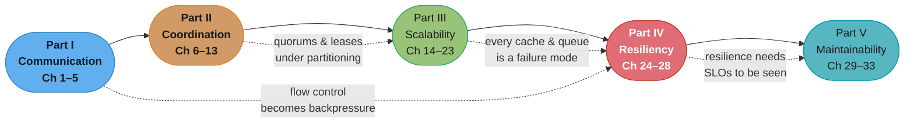
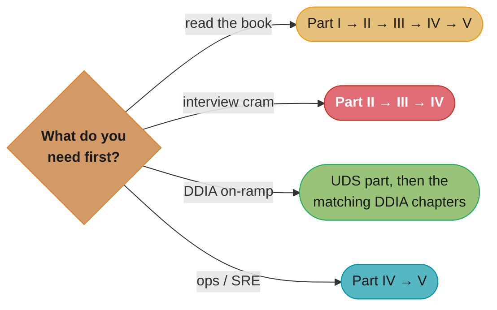

# Understanding Distributed Systems (UDS)

> Roberto Vitillo · 2nd edition · "What every developer should know about large distributed
> applications." A part-by-part, in-depth summary — read this folder in order and you have
> read the book.

---

## The Book's Thesis

You cannot pick Kafka over SQS, tune a retry policy, or debug a gray failure by reading
vendor docs — you need the invariant mechanisms underneath: TCP's congestion window is the
same idea as your rate limiter, Raft's heartbeat is your health check, and a cache is a
replica with weaker guarantees. Vitillo's book teaches those **fundamentals over
frameworks**, in five parts that form a single arc. Three through-lines:

- **Every abstraction leaks under partial failure.** Slow is harder than down: gray
  failures, retry storms, and cascading overload are where real systems die (Part IV
  exists because of Parts I–III's fine print).
- **Coordination is the enemy of scalability.** The book's arc runs from maximum
  coordination (consensus, transactions) to deliberately minimal coordination (CRDTs,
  caching, cells) — knowing where on that spectrum your problem sits IS the design skill.
- **Resiliency and operability are designed in, not bolted on.** Timeouts, SLOs, and
  rollback-friendly deploys are architecture, not afterthoughts.

---

## A Note on Structure (deliberate — do not "fix")

UDS has ~33 chapters of 3–8 pages each, grouped into 5 parts. This folder maps **one
folder per PART**, not per chapter: a UDS part is the multi-concept narrative the
book-faithful template was designed for, while a 4-page chapter alone cannot sustain a
≥15-Q&A quiz module or a meaningful standalone file. Completeness is preserved one level
up — inside each part file, **one `## N.x` per book chapter IN ORDER, one `###` per book
section** — so a missing chapter or section stays structurally visible. (The Introduction,
Ch 1, is folded into Part I as `## 1.1`.)

---

## The Book Map

*One arc, five parts: the dotted edges are the book's recurring payoffs — TCP's flow
control (Part I) reappears as backpressure and load shedding (Part IV), and everything
Part III scales out becomes something Part IV must keep alive.*

---

## Part Index

| # | Part | Folder | Book chapters | One-line summary | Repo deep-dive |
|---|------|--------|---------------|------------------|----------------|
| I | Communication | [01_communication/](01_communication/README.md) | Ch 1–5 | TCP reliability/flow/congestion, TLS, DNS, HTTP APIs and idempotency | [backend/tcp_ip_deep_dive/](../../backend/tcp_ip_deep_dive/README.md) |
| II | Coordination | [02_coordination/](02_coordination/README.md) | Ch 6–13 | Models, failure detection, clocks, Raft, consistency, CRDTs, transactions, sagas | [database/consistency_models_and_consensus/](../../database/consistency_models_and_consensus/README.md) |
| III | Scalability | [03_scalability/](03_scalability/README.md) | Ch 14–23 | Caching, CDNs, partitioning, blob storage, load balancing, microservices, messaging | [hld/](../../hld/README.md) |
| IV | Resiliency | [04_resiliency/](04_resiliency/README.md) | Ch 24–28 | Failure causes, redundancy, shuffle sharding/cells, timeouts/retries/breakers, shedding | [hld/resilience_patterns/](../../hld/resilience_patterns/README.md) |
| V | Maintainability | [05_maintainability/](05_maintainability/README.md) | Ch 29–33 | Testing, CI/CD, SLOs/alerts, observability, manageability | [devops/sre_principles_and_slos/](../../devops/sre_principles_and_slos/README.md) |

---

## How to Read This (Reading Paths)

- **Cover to cover (recommended):** five files, each readable in one sitting; the parts
  build on each other deliberately.
- **Interview cram:** Part II → III → IV — coordination, scalability, and resiliency are
  where distributed-systems interview questions live.
- **DDIA on-ramp:** read a UDS part, then the matching DDIA chapters (UDS Part II ≈ DDIA
  Ch 5–9 at one-third the depth) — UDS is the approachable first pass, DDIA the deep one.
- **Ops/SRE path:** Part IV → V — failure modes first, then the operational discipline.

*Four entry points — the cram path (red) covers the three parts that dominate
distributed-systems interviews; the on-ramp path (green) pairs each UDS part with its
heavier DDIA counterpart.*

---

## Build Manifest

Per-file build status for this book. Update the row to `done` the moment a part file is
completed and diagram-linted.

| # | File | Status |
|---|------|--------|
| I | `01_communication/README.md` | done |
| II | `02_coordination/README.md` | done |
| III | `03_scalability/README.md` | done |
| IV | `04_resiliency/README.md` | done |
| V | `05_maintainability/README.md` | done |

---

## Cross-Reference Map (UDS → repo deep dives)

| UDS concept | Primary deep-dive module |
|-------------|--------------------------|
| TCP internals, QUIC, HTTP | [backend/tcp_ip_deep_dive/](../../backend/tcp_ip_deep_dive/README.md), [backend/udp_and_quic/](../../backend/udp_and_quic/README.md), [backend/http_protocols/](../../backend/http_protocols/README.md) |
| REST APIs, idempotency | [backend/rest_api_design/](../../backend/rest_api_design/README.md), [hld/api_design/](../../hld/api_design/README.md) |
| Consensus, Raft, consistency models | [database/consistency_models_and_consensus/](../../database/consistency_models_and_consensus/README.md), [hld/consensus_algorithms/](../../hld/consensus_algorithms/README.md) |
| Transactions, 2PC, sagas | [database/distributed_transactions/](../../database/distributed_transactions/README.md), [hld/distributed_transactions/](../../hld/distributed_transactions/README.md) |
| Partitioning, consistent hashing | [database/sharding_and_partitioning/](../../database/sharding_and_partitioning/README.md), [hld/consistent_hashing/](../../hld/consistent_hashing/README.md) |
| Caching, CDNs | [hld/caching/](../../hld/caching/README.md), [hld/cdn/](../../hld/cdn/README.md) |
| Load balancing, microservices, gateways | [hld/load_balancing/](../../hld/load_balancing/README.md), [backend/api_gateway_patterns/](../../backend/api_gateway_patterns/README.md) |
| Messaging, Kafka | [hld/message_queues/](../../hld/message_queues/README.md), [backend/kafka_deep_dive/](../../backend/kafka_deep_dive/README.md) |
| Timeouts, retries, circuit breakers, shedding | [hld/resilience_patterns/](../../hld/resilience_patterns/README.md), [backend/fault_tolerance_patterns/](../../backend/fault_tolerance_patterns/README.md) |
| SLOs, monitoring, observability | [devops/sre_principles_and_slos/](../../devops/sre_principles_and_slos/README.md), [backend/observability_and_monitoring/](../../backend/observability_and_monitoring/README.md) |
| The heavyweight companion book | [book/designing_data_intensive_applications/](../designing_data_intensive_applications/README.md) |
