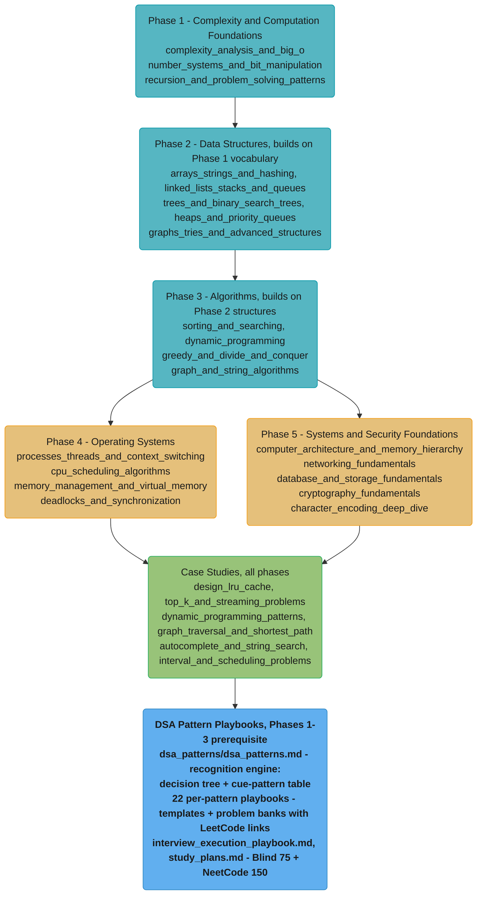

# CS Fundamentals — Senior Engineer & Interview Prep Guide

The language-agnostic computer-science spine that every senior-engineer interview assumes. Covers asymptotic complexity, core data structures and algorithms, operating-system primitives, computer architecture, systems foundations, and cryptography theory — at the conceptual level, with explicit crosslinks to the deep applied treatments in `java/`, `python/`, `backend/`, `database/`, and `devops/`.

> **No runtime application** — all content is Markdown with executable-shaped Python / pseudocode blocks.

> **PARKED — to be done later (owner-set 2026-07-29).** This section is out of scope for the
> repo-wide factual audit and the `**Short:**` MCQ-summary migration until the owner
> re-opens it. **Parked, not cancelled**: the content is untouched, complete, and still ships
> in the game. What is paused is **24 audit units (none started)** and **701 Q&As awaiting
> one-line MCQ summaries**. Do not dispatch audit or migration work here in the meantime.
> Scope table: root `CLAUDE.md` -> "Deferred / To Be Planned".

---

## Intuition

> **One-line analogy**: CS fundamentals are the grammar of software engineering — every system you build is a sentence, and without grammar you can string words together but cannot reason about whether the sentence is correct, efficient, or intelligible.

**Mental model**: Every engineering problem in this repo eventually reduces to a handful of recurring shapes: *"find the minimum/maximum in a dynamic set"* (heaps), *"find the shortest path in a graph"* (BFS/Dijkstra), *"maximize a value under constraints"* (DP/greedy), *"share a resource safely between concurrent actors"* (OS synchronization), *"retrieve data in O(1) or O(log n) instead of O(n)"* (hashing, B-trees, indexing). CS fundamentals is the vocabulary for recognising which shape a problem is and which tool to reach for.

**Why it matters**: Senior interviews at every tier of company (FAANG and beyond) include a whiteboard/coding round that assumes fluency in these foundations. More importantly, the same patterns recur in systems design: a rate limiter is a sliding-window counter; a distributed lock is a semaphore with network failures; a database index is a B+Tree; a message broker is a priority queue with persistence. Understanding the fundamentals lets you reason from first principles rather than memorising solutions.

**Key insight**: The hardest part of CS fundamentals interviews is not knowing the data structure — it is *recognising the problem shape fast enough to pick the right tool*, then proving correctness under edge cases. Master the recognition patterns (when to use a heap vs a sorted list, when memoisation beats greedy, when BFS beats DFS) and the rest follows.

---

## 1. Section Overview

This section covers:

- **Phase 1 — Complexity & Computation**: asymptotic notation (O/Θ/Ω), amortized analysis, Master theorem, Big-O for common operations; number systems (binary/hex, two's complement, IEEE-754), bitwise operations and tricks, endianness; recursion mechanics and the canonical problem-solving patterns (two-pointer, sliding window, backtracking, divide-and-conquer framing)
- **Phase 2 — Data Structures**: dynamic arrays and hash tables (collision resolution, load factor, resize); linked lists, stacks, queues, deques, circular buffers; binary trees, BST, AVL and red-black trees (concept), B/B+ trees as a concept; binary heap, heapify, d-ary heaps, priority queues; graph representations (adjacency list/matrix), trie, union-find/DSU, segment tree, Fenwick tree, Bloom filter concept
- **Phase 3 — Algorithms**: comparison sorts (merge/quick/heap) and non-comparison sorts (counting/radix), binary search and variants; dynamic programming (memoisation vs tabulation, knapsack/LCS/edit distance/coin change families); greedy algorithms and proofs, divide-and-conquer recurrences, Huffman, interval scheduling; BFS/DFS/Dijkstra/Bellman-Ford/Kruskal/Prim/topological sort; string algorithms (KMP, Rabin-Karp, Z-algorithm)
- **Phase 4 — Operating Systems**: process vs thread, address spaces, user/kernel mode, syscall overhead, context-switch cost (~1–10 µs); CPU scheduling (FCFS/SJF/Round-Robin/MLFQ/CFS); virtual memory, paging (4 KB pages), TLB, page-replacement algorithms; mutex/semaphore/monitor (concept), Coffman conditions, deadlock prevention/avoidance/detection, dining-philosophers problem
- **Phase 5 — Systems & Security Foundations**: CPU pipeline, branch prediction, cache hierarchy (L1 64 B cache line, ~1–4 ns; L2 ~10 ns; L3 ~40 ns; RAM ~100 ns), NUMA; OSI/TCP-IP primer, TCP vs UDP, DNS, TLS handshake concept; ACID/BASE, isolation levels, indexing concept, storage hierarchy (SSD vs HDD); hash functions, symmetric vs asymmetric encryption, HMAC, digital signatures, Diffie-Hellman key exchange, salting; character encoding theory (Unicode code points/planes, UTF-8/16/32, surrogate pairs, normalization, grapheme clusters, mojibake)

---

## 2. Scope & Non-Overlap Boundary

This section teaches concepts at the **language-agnostic CS-theory level**. Where a topic has a deep applied treatment elsewhere, this section provides a 2–4 paragraph conceptual foundation and links out — it does not re-teach the full applied depth.

| Already covered in... | CS Fundamentals does NOT re-teach | CS Fundamentals DOES cover |
|-----------------------|-----------------------------------|---------------------------|
| [`java/concurrency`](../java/concurrency/concurrency.md) | AQS internals, ReentrantLock, CAS/ABA, virtual threads | Mutex/semaphore/monitor as OS-level concepts; Coffman conditions; deadlock theory; dining philosophers |
| [`java/collections_internals`](../java/collections_internals/collections_internals.md) | HashMap secondary hash, ConcurrentHashMap segment locking, TreeMap red-black rotation | Hash table collision resolution, load factor, and resize as language-agnostic concepts; abstract BST/heap operations |
| [`python/collections_and_data_structures`](../python/collections_and_data_structures/collections_and_data_structures.md) | Python dict/set internals (open addressing), CPython list over-allocation | Language-agnostic array/hash foundations |
| [`backend/osi_model_and_networking`](../backend/osi_model_and_networking/osi_model_and_networking.md) | OSI 7-layer deep dive, ARP, NAT, encapsulation | TCP-IP primer at the conceptual level for interview fluency |
| [`backend/tcp_ip_deep_dive`](../backend/tcp_ip_deep_dive/tcp_ip_deep_dive.md) | TCP header fields, congestion control, window scaling | TCP handshake and reliability concept; when TCP vs UDP |
| [`database/database_fundamentals`](../database/database_fundamentals/database_fundamentals.md) | MVCC internals, PACELC, isolation level anomalies | ACID/BASE as concepts; transaction and isolation-level vocabulary |
| [`database/indexing_deep_dive`](../database/indexing_deep_dive/indexing_deep_dive.md) | B+Tree page layout, InnoDB clustered index, GiST/GIN | B/B+ tree as a conceptual data structure; why log-n lookup beats linear scan |
| [`java/jvm_internals`](../java/jvm_internals/jvm_internals.md) | JVM heap regions, G1/ZGC, tri-color marking, TLAB | Virtual memory, paging, page-replacement as OS concepts |
| [`python/cpython_memory_model`](../python/cpython_memory_model/cpython_memory_model.md) | Refcounting, cyclic GC, pymalloc arenas | Virtual memory concept; paging and page faults as OS-level primitives |
| [`devops/linux_and_os_fundamentals`](../devops/linux_and_os_fundamentals/linux_and_os_fundamentals.md) | cgroups v2, namespaces, OOM killer, /proc | Process vs thread, context switch, scheduling algorithms as CS concepts |
| [`backend/backend_security_owasp`](../backend/backend_security_owasp/backend_security_owasp.md) | BCrypt cost factor, A02 Cryptographic Failures | Hash functions, symmetric/asymmetric crypto, HMAC, key exchange as CS-theory foundations |
| [`backend/auth_and_authorization_systems`](../backend/auth_and_authorization_systems/auth_and_authorization_systems.md) | JWT, OAuth 2, mTLS applied | Digital signatures and key-exchange concept |
| [`python/strings_bytes_encoding_and_regex`](../python/strings_bytes_encoding_and_regex/strings_bytes_encoding_and_regex.md) | Full codec API (`str.encode`/`bytes.decode`), the `codecs`/`unicodedata` modules, regex engine internals | Unicode code point/plane model, UTF-8/16/32 transformation-format theory, normalization forms (NFC/NFD/NFKC/NFKD), grapheme-cluster segmentation (UAX #29) as language-agnostic foundations |
| [`java/strings_and_text`](../java/strings_and_text/strings_and_text.md) | Compact Strings internals, `codePoints()`/`String` API specifics | Same Unicode/encoding/normalization theory, applied via a different runtime's string model |

**CS Fundamentals owns**: language-agnostic DSA, asymptotic analysis, OS scheduling/synchronization/paging theory, computer architecture (CPU pipeline, cache hierarchy), abstract cryptography theory, and the conceptual networking/database vocabulary that interviews assume without referencing a specific implementation.

---

## 3. Module Table

| # | Module Directory | Phase | Difficulty | Key Topics |
|---|-----------------|-------|------------|------------|
| 1 | [complexity_analysis_and_big_o](complexity_analysis_and_big_o/complexity_analysis_and_big_o.md) | 1 — Complexity & Computation | Intermediate | Big-O/Θ/Ω notation, best/average/worst cases, amortized analysis (aggregate, accounting, potential), recurrences, Master theorem |
| 2 | [number_systems_and_bit_manipulation](number_systems_and_bit_manipulation/number_systems_and_bit_manipulation.md) | 1 — Complexity & Computation | Intermediate | Binary/hex/octal, two's complement, overflow, IEEE-754 float representation, bitwise ops (AND/OR/XOR/shift), bit tricks, endianness |
| 3 | [recursion_and_problem_solving_patterns](recursion_and_problem_solving_patterns/recursion_and_problem_solving_patterns.md) | 1 — Complexity & Computation | Intermediate | Call stack mechanics, recursion vs iteration, backtracking, two-pointer, sliding window, fast/slow pointer, divide-and-conquer framing |
| 4 | [arrays_strings_and_hashing](arrays_strings_and_hashing/arrays_strings_and_hashing.md) | 2 — Data Structures | Intermediate | Dynamic arrays (amortized O(1) append, 1.5–2× growth), hash tables (chaining vs open addressing, load factor 0.75, resize, tombstoning), sets |
| 5 | [linked_lists_stacks_and_queues](linked_lists_stacks_and_queues/linked_lists_stacks_and_queues.md) | 2 — Data Structures | Beginner | Singly/doubly linked lists, sentinel nodes, stacks (LIFO), queues (FIFO), deques, monotonic stack/queue, circular buffers |
| 6 | [trees_and_binary_search_trees](trees_and_binary_search_trees/trees_and_binary_search_trees.md) | 2 — Data Structures | Intermediate | Binary tree traversals (in/pre/post/BFS), BST operations, BST invariant, AVL/red-black (concept + rotation), B-tree/B+tree concept, trie concept |
| 7 | [heaps_and_priority_queues](heaps_and_priority_queues/heaps_and_priority_queues.md) | 2 — Data Structures | Intermediate | Binary heap (complete tree + heap property), heapify O(n), d-ary heaps, extract-min/max O(log n), k-way merge, heap sort |
| 8 | [graphs_tries_and_advanced_structures](graphs_tries_and_advanced_structures/graphs_tries_and_advanced_structures.md) | 2 — Data Structures | Advanced | Graph representations (adjacency list/matrix, space tradeoffs), trie (insert/search/prefix), union-find/DSU (path compression + union by rank), segment tree, Fenwick tree, Bloom filter |
| 9 | [sorting_and_searching](sorting_and_searching/sorting_and_searching.md) | 3 — Algorithms | Intermediate | Comparison sorts (merge O(n log n) stable, quicksort O(n log n) avg/O(n²) worst, heapsort O(n log n) in-place), non-comparison sorts (counting/radix O(n+k)), binary search and variants (leftmost, rightmost, answer-space) |
| 10 | [dynamic_programming](dynamic_programming/dynamic_programming.md) | 3 — Algorithms | Advanced | Optimal substructure, overlapping subproblems, memoisation vs tabulation, space optimisation (rolling array), four DP families: 0/1 knapsack, LCS, edit distance, coin change |
| 11 | [greedy_and_divide_and_conquer](greedy_and_divide_and_conquer/greedy_and_divide_and_conquer.md) | 3 — Algorithms | Intermediate | Greedy correctness (exchange argument, matroid theory concept), interval scheduling maximisation, activity selection, Huffman coding, D&C recurrences, merge sort as D&C proof |
| 12 | [graph_and_string_algorithms](graph_and_string_algorithms/graph_and_string_algorithms.md) | 3 — Algorithms | Advanced | BFS (O(V+E), unweighted shortest), DFS (connected components, topo sort, cycle detection), Dijkstra (priority-queue, O((V+E) log V)), Bellman-Ford (negative weights), Kruskal/Prim MST, KMP O(n+m), Rabin-Karp O(n+m) avg, Z-algorithm |
| 13 | [processes_threads_and_context_switching](processes_threads_and_context_switching/processes_threads_and_context_switching.md) | 4 — Operating Systems | Intermediate | Process vs thread (address space isolation), PCB/TCB, user mode vs kernel mode, syscall overhead (~200–1000 ns), context switch cost (~1–10 µs), fork/exec model, thread states |
| 14 | [cpu_scheduling_algorithms](cpu_scheduling_algorithms/cpu_scheduling_algorithms.md) | 4 — Operating Systems | Intermediate | FCFS, SJF, Round-Robin (time quantum tradeoffs), MLFQ, priority scheduling, preemption, starvation and aging, CFS (Linux concept: virtual runtime, red-black tree of runnable tasks) |
| 15 | [memory_management_and_virtual_memory](memory_management_and_virtual_memory/memory_management_and_virtual_memory.md) | 4 — Operating Systems | Intermediate | Physical vs virtual address space, paging (4 KB pages, page table, multi-level page tables), page faults (soft vs hard), TLB (translation lookaside buffer, TLB miss cost), segmentation vs paging, page-replacement algorithms (OPT, LRU, Clock/CLOCK-Pro) |
| 16 | [deadlocks_and_synchronization](deadlocks_and_synchronization/deadlocks_and_synchronization.md) | 4 — Operating Systems | Intermediate | Mutex/semaphore/monitor/condition variable as concepts, Coffman conditions (mutual exclusion, hold-and-wait, no-preemption, circular wait), deadlock prevention/avoidance (Banker's algorithm)/detection/recovery, dining philosophers, readers-writers, producer-consumer |
| 17 | [computer_architecture_and_memory_hierarchy](computer_architecture_and_memory_hierarchy/computer_architecture_and_memory_hierarchy.md) | 5 — Systems & Security | Advanced | CPU pipeline (fetch/decode/execute/writeback), hazards (data/control/structural), branch prediction (~95% accuracy, misprediction cost ~15 cycles), cache hierarchy (L1 4–64 KB, L2 256 KB–1 MB, L3 4–32 MB; cache line 64 B), false sharing, NUMA topology |
| 18 | [networking_fundamentals](networking_fundamentals/networking_fundamentals.md) | 5 — Systems & Security | Intermediate | OSI vs TCP-IP conceptual primer, IP addresses/CIDR/ports/NAT, TCP (reliable, ordered, connection-oriented) vs UDP (unreliable, stateless), DNS resolution chain, TLS 1.3 handshake concept |
| 19 | [database_and_storage_fundamentals](database_and_storage_fundamentals/database_and_storage_fundamentals.md) | 5 — Systems & Security | Intermediate | ACID properties (atomicity, consistency, isolation, durability), BASE, transaction concept, isolation levels (read uncommitted/committed/repeatable read/serializable), B+tree index concept, normalisation concept, storage hierarchy (registers → cache → RAM → SSD → HDD) with latency numbers |
| 20 | [cryptography_fundamentals](cryptography_fundamentals/cryptography_fundamentals.md) | 5 — Systems & Security | Intermediate | Hash functions (one-way, collision resistance, SHA-256), symmetric encryption (AES, shared-key), asymmetric encryption (RSA, public/private key), HMAC, digital signatures, Diffie-Hellman key exchange, salting vs peppering, why bcrypt/scrypt beat SHA for passwords |
| 21 | [character_encoding_deep_dive](character_encoding_deep_dive/character_encoding_deep_dive.md) | 5 — Systems & Security | Intermediate | Unicode code points/planes (BMP vs astral), UTF-8/UTF-16/UTF-32 transformation formats, surrogate pairs, byte-order mark (BOM), normalization (NFC/NFD/NFKC/NFKD), grapheme clusters (UAX #29), mojibake, IDN homograph attacks |
| 22 | [discrete_math_for_engineers](discrete_math_for_engineers/discrete_math_for_engineers.md) | 1 — Complexity & Computation | Intermediate | Propositional/predicate logic, sets/relations/functions, induction & strong induction, combinatorics, recurrences (Master Theorem), probability (linearity of expectation), modular arithmetic |
| 23 | [theory_of_computation](theory_of_computation/theory_of_computation.md) | 5 — Systems & Security | Advanced | Finite automata (DFA/NFA), regular languages & the pumping lemma, CFG/PDA, Turing machines, the halting problem, P vs NP, NP-completeness (Cook-Levin, SAT) |
| 24 | [how_code_runs_compilers_and_interpreters](how_code_runs_compilers_and_interpreters/how_code_runs_compilers_and_interpreters.md) | 5 — Systems & Security | Advanced | Lexer/parser/AST, symbol tables, IR & optimization, codegen, compiler vs interpreter, JIT vs AOT, linker/loader, ELF |

---

## 4. 5-Phase Learning Path



**Dependencies to note:**
- Phase 1 (Complexity) is a prerequisite for everything — you cannot analyse an algorithm without asymptotic vocabulary.
- Phases 4 and 5 are largely independent of Phases 2–3 (OS/systems theory does not require DSA fluency) — they can be studied in parallel with Phase 3 once Phase 1 is solid.
- The Case Studies draw from all phases; `design_lru_cache` requires Phase 2; DP/graph studies require Phase 3; `autocomplete_and_string_search` requires Phase 3 string algorithms.

---

<!-- study-paths
     THE source of truth for this section's file inventory and study-tier membership.
     Every module, every file it owns (module page AND deep-dive sub-files), and every
     case study is listed here with the tiers it belongs to; `-` means Full path only.
     Content files carry NO structural metadata -- a deep dive holds its topic, nothing
     else. Order is never declared here: it comes from STUDY_ORDER in game/app.js.
     The tier TABLES lower in this file are generated from this block by
     `python3 game/extract.py --write-paths`. A file on disk that is missing from this
     block, or listed here and absent from disk, FAILS `extract.py --strict`.
complexity_analysis_and_big_o
  complexity_analysis_and_big_o.md  senior
discrete_math_for_engineers
  discrete_math_for_engineers.md  -
number_systems_and_bit_manipulation
  number_systems_and_bit_manipulation.md  senior
character_encoding_deep_dive
  character_encoding_deep_dive.md  -
recursion_and_problem_solving_patterns
  recursion_and_problem_solving_patterns.md  senior
arrays_strings_and_hashing
  arrays_strings_and_hashing.md  senior
linked_lists_stacks_and_queues
  linked_lists_stacks_and_queues.md  senior
trees_and_binary_search_trees
  trees_and_binary_search_trees.md  senior
heaps_and_priority_queues
  heaps_and_priority_queues.md  senior
graphs_tries_and_advanced_structures
  graphs_tries_and_advanced_structures.md  senior
sorting_and_searching
  sorting_and_searching.md  senior
dynamic_programming
  dynamic_programming.md  senior
greedy_and_divide_and_conquer
  greedy_and_divide_and_conquer.md  senior
graph_and_string_algorithms
  graph_and_string_algorithms.md  senior
dsa_patterns
  dsa_patterns.md                   senior
  backtracking.md                   senior
  bit_manipulation.md               senior
  cyclic_sort.md                    senior
  dynamic_programming.md            senior
  fast_and_slow_pointers.md         senior
  graph_traversal.md                senior
  greedy.md                         senior
  hashing_patterns.md               senior
  in_place_linked_list_reversal.md  senior
  interview_execution_playbook.md   senior
  k_way_merge.md                    senior
  matrix_traversal.md               senior
  merge_intervals.md                senior
  modified_binary_search.md         senior
  monotonic_stack.md                senior
  prefix_sum.md                     senior
  shortest_path.md                  senior
  sliding_window.md                 senior
  study_plans.md                    senior
  top_k_elements.md                 senior
  topological_sort.md               senior
  tree_bfs.md                       senior
  tree_dfs.md                       senior
  trie_patterns.md                  senior
  two_heaps.md                      senior
  two_pointers.md                   senior
  union_find.md                     senior
processes_threads_and_context_switching
  processes_threads_and_context_switching.md  senior
cpu_scheduling_algorithms
  cpu_scheduling_algorithms.md  senior
memory_management_and_virtual_memory
  memory_management_and_virtual_memory.md  senior
deadlocks_and_synchronization
  deadlocks_and_synchronization.md  senior
computer_architecture_and_memory_hierarchy
  computer_architecture_and_memory_hierarchy.md  -
networking_fundamentals
  networking_fundamentals.md  -
database_and_storage_fundamentals
  database_and_storage_fundamentals.md  -
cryptography_fundamentals
  cryptography_fundamentals.md  -
theory_of_computation
  theory_of_computation.md  -
how_code_runs_compilers_and_interpreters
  how_code_runs_compilers_and_interpreters.md  -
case_studies
  autocomplete_and_string_search.md     -
  design_lru_cache.md                   -
  dynamic_programming_patterns.md       -
  graph_traversal_and_shortest_path.md  -
  interval_and_scheduling_problems.md   -
  top_k_and_streaming_problems.md       -
-->
## Learning Paths

This section is exhaustive by design — 24 modules from asymptotic foundations through operating-system internals to systems/security/theory depth. That is the right depth for a reference and the wrong shape for someone two weeks from an interview. So there are **two ways through it**; the browser learning game's **Study** view surfaces both as a **Full / Interview** toggle (Full is the default).

### Full Path (24 modules + DSA pattern playbooks)

The complete curriculum in the order above — see [5-Phase Learning Path](#4-5-phase-learning-path). Use it for genuine mastery: every data-structure and algorithm family, the full operating-systems core, and the systems/security/theory foundations (computer architecture, networking, database storage, cryptography, character encoding). Nothing is dropped. In the game's Study path the DSA pattern playbooks topic (`dsa_patterns`) follows Phase 3 (right after Graph & String Algorithms), where the recognition engine over Phases 1–3 becomes useful.

<!-- study-path-table senior -->
### Senior Path (17 modules)

| # | Module | Files |
|---|--------|-------|
| 1 | [complexity_analysis_and_big_o](complexity_analysis_and_big_o/complexity_analysis_and_big_o.md) | module page only |
| 3 | [number_systems_and_bit_manipulation](number_systems_and_bit_manipulation/number_systems_and_bit_manipulation.md) | module page only |
| 5 | [recursion_and_problem_solving_patterns](recursion_and_problem_solving_patterns/recursion_and_problem_solving_patterns.md) | module page only |
| 6 | [arrays_strings_and_hashing](arrays_strings_and_hashing/arrays_strings_and_hashing.md) | module page only |
| 7 | [linked_lists_stacks_and_queues](linked_lists_stacks_and_queues/linked_lists_stacks_and_queues.md) | module page only |
| 8 | [trees_and_binary_search_trees](trees_and_binary_search_trees/trees_and_binary_search_trees.md) | module page only |
| 9 | [heaps_and_priority_queues](heaps_and_priority_queues/heaps_and_priority_queues.md) | module page only |
| 10 | [graphs_tries_and_advanced_structures](graphs_tries_and_advanced_structures/graphs_tries_and_advanced_structures.md) | module page only |
| 11 | [sorting_and_searching](sorting_and_searching/sorting_and_searching.md) | module page only |
| 12 | [dynamic_programming](dynamic_programming/dynamic_programming.md) | module page only |
| 13 | [greedy_and_divide_and_conquer](greedy_and_divide_and_conquer/greedy_and_divide_and_conquer.md) | module page only |
| 14 | [graph_and_string_algorithms](graph_and_string_algorithms/graph_and_string_algorithms.md) | module page only |
| 15 | [dsa_patterns](dsa_patterns/dsa_patterns.md) | 28 files |
| 16 | [processes_threads_and_context_switching](processes_threads_and_context_switching/processes_threads_and_context_switching.md) | module page only |
| 17 | [cpu_scheduling_algorithms](cpu_scheduling_algorithms/cpu_scheduling_algorithms.md) | module page only |
| 18 | [memory_management_and_virtual_memory](memory_management_and_virtual_memory/memory_management_and_virtual_memory.md) | module page only |
| 19 | [deadlocks_and_synchronization](deadlocks_and_synchronization/deadlocks_and_synchronization.md) | module page only |

**Not in this path** (8 of 25, Full Path only): `discrete_math_for_engineers`, `character_encoding_deep_dive`, `computer_architecture_and_memory_hierarchy`, `networking_fundamentals`, `database_and_storage_fundamentals`, `cryptography_fundamentals`, `theory_of_computation`, `how_code_runs_compilers_and_interpreters`
<!-- /study-path-table -->

A ruthless cut to what a **senior software engineering interview** actually probes: the coding-round spine plus the OS core that comes up in systems questions. Same learning order, a strict subset of the Full Path. Each group below says why it earns senior time.

| Group | Why it's tested |
|-------|-----------------|
| Complexity & Computation Foundations | Every answer starts with a complexity claim — Big-O/amortized analysis is the shared vocabulary a grader anchors to; bit tricks and two's complement are fast, memorable wins; recursion patterns (two-pointer, sliding window, backtracking) are the first branch point in problem recognition |
| Core Data Structures | Hash-map lookups, in-place array tricks, and linked-list reversal/cycle detection are the substrate of the majority of coding-round questions |
| Trees, Heaps & Graph Structures | BST invariants, heap extract-min/max, and graph representation tradeoffs are the second-most-probed structure family; trie and union-find variants separate senior from mid candidates |
| Core Algorithms | Sorting/searching complexity and the DP-vs-greedy fork are asked directly ("why quicksort over merge sort", "DP or greedy here") more than almost any other algorithmic decision |
| Graph & String Algorithms | BFS/Dijkstra/topological sort anchor "design a route or dependency system" prompts; KMP/Rabin-Karp separate candidates who can only brute-force string matching from those who know the O(n+m) trick |
| DSA Pattern Recognition | The recognition engine over Phases 1–3: cue→pattern tables and 25 playbooks are the coding-round strategy layer |
| Operating Systems Core | Context-switch cost, scheduling starvation, virtual-memory paging, and the four Coffman conditions are the standard OS-fundamentals gate at senior-level onsite loops |

---

## Knowledge-Question Map

The highest-frequency CS-fundamentals *knowledge* questions mapped to the file that answers them. For applied practice, pair these with the `dsa_patterns/` playbooks and `case_studies/` walkthroughs in the Study Plan below.

| Interview question | Where the answer lives |
|---------------------|------------------------|
| What's the time/space complexity of this nested loop or recursive call, and how do you derive it? | [complexity_analysis_and_big_o](complexity_analysis_and_big_o/complexity_analysis_and_big_o.md) |
| Why is dynamic-array append O(1) amortized despite occasional O(n) resizes? | [complexity_analysis_and_big_o](complexity_analysis_and_big_o/complexity_analysis_and_big_o.md) |
| Explain two's complement, and why it lets signed and unsigned addition share the same circuit. | [number_systems_and_bit_manipulation](number_systems_and_bit_manipulation/number_systems_and_bit_manipulation.md) |
| When do you reach for recursion vs iteration, and what actually causes a stack overflow? | [recursion_and_problem_solving_patterns](recursion_and_problem_solving_patterns/recursion_and_problem_solving_patterns.md) |
| How do you recognize a sliding-window problem versus a two-pointer or backtracking one? | [recursion_and_problem_solving_patterns](recursion_and_problem_solving_patterns/recursion_and_problem_solving_patterns.md) |
| What's the average-case time complexity of a hash-table lookup, and when does it degrade to O(n)? | [arrays_strings_and_hashing](arrays_strings_and_hashing/arrays_strings_and_hashing.md) |
| How do you detect a cycle in a linked list without extra memory? | [linked_lists_stacks_and_queues](linked_lists_stacks_and_queues/linked_lists_stacks_and_queues.md) |
| What invariant makes a binary search tree valid, and what does naive deletion break? | [trees_and_binary_search_trees](trees_and_binary_search_trees/trees_and_binary_search_trees.md) |
| Why do AVL and red-black trees bound worst-case operations at O(log n) where a naive BST can degrade to O(n)? | [trees_and_binary_search_trees](trees_and_binary_search_trees/trees_and_binary_search_trees.md) |
| When should you use a heap instead of a sorted array or a BST? | [heaps_and_priority_queues](heaps_and_priority_queues/heaps_and_priority_queues.md) |
| Explain union-find with path compression and union by rank, and its amortized cost. | [graphs_tries_and_advanced_structures](graphs_tries_and_advanced_structures/graphs_tries_and_advanced_structures.md) |
| What's the space/time tradeoff between an adjacency list and an adjacency matrix? | [graphs_tries_and_advanced_structures](graphs_tries_and_advanced_structures/graphs_tries_and_advanced_structures.md) |
| Why is quicksort usually faster in practice than merge sort despite the same average complexity? | [sorting_and_searching](sorting_and_searching/sorting_and_searching.md) |
| When do you reach for DP versus greedy, and what makes a greedy choice provably safe? | [dynamic_programming](dynamic_programming/dynamic_programming.md), [greedy_and_divide_and_conquer](greedy_and_divide_and_conquer/greedy_and_divide_and_conquer.md) |
| When do you use Dijkstra versus Bellman-Ford, and what does a negative-weight cycle break? | [graph_and_string_algorithms](graph_and_string_algorithms/graph_and_string_algorithms.md) |
| How does KMP achieve O(n+m) string matching instead of the naive O(nm)? | [graph_and_string_algorithms](graph_and_string_algorithms/graph_and_string_algorithms.md) |
| What's the difference between a process and a thread, and why does a context switch cost ~1-10 microseconds? | [processes_threads_and_context_switching](processes_threads_and_context_switching/processes_threads_and_context_switching.md) |
| What causes starvation in a scheduler, and how does aging fix it? | [cpu_scheduling_algorithms](cpu_scheduling_algorithms/cpu_scheduling_algorithms.md) |
| What's a page fault, and what separates a soft fault from a hard one? | [memory_management_and_virtual_memory](memory_management_and_virtual_memory/memory_management_and_virtual_memory.md) |
| What are the four Coffman conditions for deadlock, and why does breaking any one prevent it? | [deadlocks_and_synchronization](deadlocks_and_synchronization/deadlocks_and_synchronization.md) |

---

## Study Plan

A 6-week plan over the Senior Path. cs_fundamentals has no per-topic `case_studies/` written for every week, so each week pairs its modules with the closest `dsa_patterns/` recognition-engine playbooks and, where a genuine fit exists, one of the six `case_studies/` interview-problem walkthroughs.

| Week | Focus | Modules | Practice Companion |
|------|-------|---------|---------------------|
| 1 | Complexity & Computation Foundations | complexity_analysis_and_big_o, number_systems_and_bit_manipulation, recursion_and_problem_solving_patterns | [dsa_patterns/dsa_patterns.md](dsa_patterns/dsa_patterns.md) (recognition engine + UMPIRE method), [two_pointers.md](dsa_patterns/two_pointers.md), [sliding_window.md](dsa_patterns/sliding_window.md), [bit_manipulation.md](dsa_patterns/bit_manipulation.md) |
| 2 | Core Data Structures | arrays_strings_and_hashing, linked_lists_stacks_and_queues | [hashing_patterns.md](dsa_patterns/hashing_patterns.md), [fast_and_slow_pointers.md](dsa_patterns/fast_and_slow_pointers.md), [in_place_linked_list_reversal.md](dsa_patterns/in_place_linked_list_reversal.md); [Design LRU Cache](case_studies/design_lru_cache.md) |
| 3 | Trees, Heaps & Graph Structures | trees_and_binary_search_trees, heaps_and_priority_queues, graphs_tries_and_advanced_structures | [tree_bfs.md](dsa_patterns/tree_bfs.md), [tree_dfs.md](dsa_patterns/tree_dfs.md), [two_heaps.md](dsa_patterns/two_heaps.md), [top_k_elements.md](dsa_patterns/top_k_elements.md), [trie_patterns.md](dsa_patterns/trie_patterns.md), [union_find.md](dsa_patterns/union_find.md); [Top-K and Streaming Problems](case_studies/top_k_and_streaming_problems.md) |
| 4 | Core Algorithms | sorting_and_searching, dynamic_programming, greedy_and_divide_and_conquer | [modified_binary_search.md](dsa_patterns/modified_binary_search.md), [dynamic_programming.md](dsa_patterns/dynamic_programming.md), [greedy.md](dsa_patterns/greedy.md); [Dynamic Programming Patterns](case_studies/dynamic_programming_patterns.md) |
| 5 | Graph & String Algorithms | graph_and_string_algorithms | [graph_traversal.md](dsa_patterns/graph_traversal.md), [shortest_path.md](dsa_patterns/shortest_path.md), [topological_sort.md](dsa_patterns/topological_sort.md); [Graph Traversal and Shortest Path](case_studies/graph_traversal_and_shortest_path.md), [Autocomplete and String Search](case_studies/autocomplete_and_string_search.md) |
| 6 | Operating Systems Core | processes_threads_and_context_switching, cpu_scheduling_algorithms, memory_management_and_virtual_memory, deadlocks_and_synchronization | No DSA-pattern companion — pure OS theory; rehearse via [Interval and Scheduling Problems](case_studies/interval_and_scheduling_problems.md) (interval scheduling is the closest DSA analogue to CPU scheduling) and cross-link to [`java/concurrency`](../java/concurrency/concurrency.md) / [`devops/linux_and_os_fundamentals`](../devops/linux_and_os_fundamentals/linux_and_os_fundamentals.md) for the applied angle |

---

## 5. Top Interview Topics by Category

### Data Structures

**When should you use a heap vs a sorted array?** Use a heap when you only need the min/max and insertions are frequent — heap gives O(log n) insert and O(log n) extract-min vs O(n) insert for a sorted array. Use a sorted array (with binary search) when you need O(log n) arbitrary lookups and the data is mostly static.

**What is the average-case time complexity of hash table lookup, and when does it degrade?** O(1) average, O(n) worst case. Degrades when many keys hash to the same bucket (poor hash function, adversarial input, or load factor too high). Standard load factor threshold is 0.75; resize (rehash all keys) restores O(1).

**Explain union-find with path compression and union by rank.** Union-find maintains a forest of disjoint sets. `find` with path compression flattens every node to point directly to the root, making future finds faster. `union` by rank always attaches the shorter tree under the taller, keeping trees flat. Together they give an amortised near-O(1) cost per operation (inverse Ackermann O(α(n)) — effectively constant).

### Algorithms

**When do you reach for DP vs greedy?** Greedy works when a locally optimal choice leads to a globally optimal solution — provable via an exchange argument. DP is needed when the greedy choice can be wrong and you need to consider all sub-problem combinations. Interval scheduling maximisation (greedy: earliest deadline first) vs 0/1 knapsack (DP: greedy weight ratio fails).

**What is the key insight that makes quicksort fast in practice vs merge sort?** Quicksort has better cache behaviour (operates in place, accessing a contiguous partition sequentially) and lower constant factors than merge sort (no auxiliary array allocation). Despite the O(n²) worst case on sorted input, randomised pivot selection makes the expected case O(n log n) with a very small constant.

**When do you use Dijkstra vs Bellman-Ford?** Dijkstra for non-negative weights — O((V+E) log V) with a min-heap. Bellman-Ford when edges can have negative weights — O(VE), and it detects negative-weight cycles. SPFA (queue-optimised Bellman-Ford) is faster in practice for sparse graphs but has O(VE) worst case.

### Operating Systems

**What is the cost of a context switch and why does it matter?** A context switch costs ~1–10 µs: saving/restoring ~100+ registers, reloading the TLB (TLB flush on some architectures, ~200–300 ns each miss), and the scheduler overhead. At 10K threads, context-switching overhead can dominate — this is why event loops (Node.js, asyncio) and coroutines (Java virtual threads, Go goroutines) use M:N scheduling to avoid OS-level context switches for I/O-bound work.

**What are the four Coffman conditions for deadlock?** Mutual exclusion (resource not sharable), hold-and-wait (process holds one resource while waiting for another), no preemption (resources cannot be forcibly taken), and circular wait (P1 waits for P2, P2 waits for P1). All four must hold simultaneously. Breaking any one prevents deadlock.

**What is a page fault and when is it "soft" vs "hard"?** A page fault occurs when the CPU accesses a virtual address whose page is not in physical memory (PTE present-bit = 0). Soft (minor): the page is in memory but not mapped (e.g., anonymous page first access, copy-on-write) — handled in microseconds. Hard (major): the page must be read from disk — ~10 ms on HDD, ~100 µs on SSD. Frequent hard faults ("thrashing") causes severe performance degradation.

### Computer Architecture

**Why do cache lines matter for algorithm performance?** A cache line is 64 bytes. When you access one byte, the CPU fetches the whole 64-byte line into L1. Traversing an array sequentially is fast because each line fetch covers 8–16 consecutive elements (spatial locality). Traversing a linked list is slow because each node pointer likely jumps to a random location (cache miss per pointer dereference). This is why array-based data structures (ArrayList, array-backed HashMap) are often faster than pointer-based ones despite worse asymptotic constants.

---

## 6. Cross-Reference Map

| Module | Also See |
|--------|----------|
| [complexity_analysis_and_big_o](complexity_analysis_and_big_o/complexity_analysis_and_big_o.md) | [`java/collections_internals`](../java/collections_internals/collections_internals.md) — per-collection Big-O; [`database/indexing_deep_dive`](../database/indexing_deep_dive/indexing_deep_dive.md) |
| [number_systems_and_bit_manipulation](number_systems_and_bit_manipulation/number_systems_and_bit_manipulation.md) | [`python/strings_bytes_encoding_and_regex`](../python/strings_bytes_encoding_and_regex/strings_bytes_encoding_and_regex.md) — UTF-8, bytes; [`java/strings_and_text`](../java/strings_and_text/strings_and_text.md) |
| [arrays_strings_and_hashing](arrays_strings_and_hashing/arrays_strings_and_hashing.md) | [`java/collections_internals`](../java/collections_internals/collections_internals.md); [`python/collections_and_data_structures`](../python/collections_and_data_structures/collections_and_data_structures.md) |
| [linked_lists_stacks_and_queues](linked_lists_stacks_and_queues/linked_lists_stacks_and_queues.md) | [`java/collections_internals`](../java/collections_internals/collections_internals.md) — ArrayDeque, LinkedHashMap |
| [trees_and_binary_search_trees](trees_and_binary_search_trees/trees_and_binary_search_trees.md) | [`database/indexing_deep_dive`](../database/indexing_deep_dive/indexing_deep_dive.md) — B+Tree storage; [`java/collections_internals`](../java/collections_internals/collections_internals.md) — TreeMap |
| [heaps_and_priority_queues](heaps_and_priority_queues/heaps_and_priority_queues.md) | [`java/collections_internals`](../java/collections_internals/collections_internals.md) — PriorityQueue; [sorting_and_searching](sorting_and_searching/sorting_and_searching.md) |
| [graphs_tries_and_advanced_structures](graphs_tries_and_advanced_structures/graphs_tries_and_advanced_structures.md) | [`hld/`](../hld/README.md) — Bloom filter in caching; [graph_and_string_algorithms](graph_and_string_algorithms/graph_and_string_algorithms.md) |
| [sorting_and_searching](sorting_and_searching/sorting_and_searching.md) | [complexity_analysis_and_big_o](complexity_analysis_and_big_o/complexity_analysis_and_big_o.md); [`database/`](../database/README.md) — sort-merge join |
| [processes_threads_and_context_switching](processes_threads_and_context_switching/processes_threads_and_context_switching.md) | [`devops/linux_and_os_fundamentals`](../devops/linux_and_os_fundamentals/linux_and_os_fundamentals.md); [`java/concurrency`](../java/concurrency/concurrency.md); [`python/threading_and_multiprocessing`](../python/threading_and_multiprocessing/threading_and_multiprocessing.md) |
| [cpu_scheduling_algorithms](cpu_scheduling_algorithms/cpu_scheduling_algorithms.md) | [`devops/linux_and_os_fundamentals`](../devops/linux_and_os_fundamentals/linux_and_os_fundamentals.md) — CFS in production |
| [memory_management_and_virtual_memory](memory_management_and_virtual_memory/memory_management_and_virtual_memory.md) | [`java/jvm_internals`](../java/jvm_internals/jvm_internals.md); [`python/cpython_memory_model`](../python/cpython_memory_model/cpython_memory_model.md) |
| [deadlocks_and_synchronization](deadlocks_and_synchronization/deadlocks_and_synchronization.md) | [`java/concurrency`](../java/concurrency/concurrency.md); [`database/concurrency_control_and_locking`](../database/concurrency_control_and_locking/concurrency_control_and_locking.md); [`lld/concurrency_patterns`](../lld/concurrency_patterns/concurrency_patterns.md) |
| [computer_architecture_and_memory_hierarchy](computer_architecture_and_memory_hierarchy/computer_architecture_and_memory_hierarchy.md) | [`java/concurrency`](../java/concurrency/concurrency.md) — `@Contended`, false sharing |
| [networking_fundamentals](networking_fundamentals/networking_fundamentals.md) | [`backend/osi_model_and_networking`](../backend/osi_model_and_networking/osi_model_and_networking.md); [`backend/tcp_ip_deep_dive`](../backend/tcp_ip_deep_dive/tcp_ip_deep_dive.md); [`backend/http_protocols`](../backend/http_protocols/http_protocols.md) |
| [database_and_storage_fundamentals](database_and_storage_fundamentals/database_and_storage_fundamentals.md) | [`database/database_fundamentals`](../database/database_fundamentals/database_fundamentals.md); [`database/indexing_deep_dive`](../database/indexing_deep_dive/indexing_deep_dive.md); [`database/schema_design_and_normalization`](../database/schema_design_and_normalization/schema_design_and_normalization.md) |
| [cryptography_fundamentals](cryptography_fundamentals/cryptography_fundamentals.md) | [`backend/backend_security_owasp`](../backend/backend_security_owasp/backend_security_owasp.md); [`backend/auth_and_authorization_systems`](../backend/auth_and_authorization_systems/auth_and_authorization_systems.md); [`devops/secrets_management`](../devops/secrets_management/secrets_management.md) |
| [character_encoding_deep_dive](character_encoding_deep_dive/character_encoding_deep_dive.md) | [`python/strings_bytes_encoding_and_regex`](../python/strings_bytes_encoding_and_regex/strings_bytes_encoding_and_regex.md) — codec API, `str`/`bytes` split; [`java/strings_and_text`](../java/strings_and_text/strings_and_text.md) — Compact Strings, surrogate pairs in practice |
| [dsa_patterns/](dsa_patterns/dsa_patterns.md) (pattern playbooks) | All Phase 1–3 concept modules (recognition layer above them); [`../../java/collections_internals`](../java/collections_internals/collections_internals.md) — per-collection Big-O; [`../../hld/caching`](../hld/caching/caching.md) — LRU/LFU as applied DS; [`../../hld/rate_limiting`](../hld/rate_limiting/rate_limiting.md) — sliding window; [`../../backend/osi_model_and_networking`](../backend/osi_model_and_networking/osi_model_and_networking.md) — Dijkstra/Bellman-Ford; [`../../devops/infrastructure_as_code_terraform`](../devops/infrastructure_as_code_terraform/infrastructure_as_code_terraform.md) — topological sort |

---

## 6a. DSA Pattern Playbooks

> **If your goal is to crack L5 coding interviews**, start here after completing Phases 1–3. This sub-section is the recognition engine: given an unseen problem, it tells you which pattern to apply and why.

The full description, templates, and problem banks live in [dsa_patterns/dsa_patterns.md](dsa_patterns/dsa_patterns.md). Quick summary of what's there:

| File | Purpose |
|------|---------|
| [dsa_patterns/dsa_patterns.md](dsa_patterns/dsa_patterns.md) | Master recognition engine: UMPIRE method, constraints→complexity table, cue→pattern table, decision tree, complexity cheat sheet, pattern index (25 patterns) |
| [dsa_patterns/interview_execution_playbook.md](dsa_patterns/interview_execution_playbook.md) | L5 rubric, 5-minute opening ritual, communication scripts, "what to say when stuck" |
| [dsa_patterns/study_plans.md](dsa_patterns/study_plans.md) | Blind 75 + NeetCode 150 mapped to patterns, with LeetCode links and suggested order |
| [dsa_patterns/two_pointers.md](dsa_patterns/two_pointers.md) | Two-pointer template, 3Sum walkthrough, 12+ problems |
| [dsa_patterns/sliding_window.md](dsa_patterns/sliding_window.md) | Fixed and variable window templates, Minimum Window Substring walkthrough |
| [dsa_patterns/fast_and_slow_pointers.md](dsa_patterns/fast_and_slow_pointers.md) | Floyd cycle detection, linked list patterns |
| [dsa_patterns/prefix_sum.md](dsa_patterns/prefix_sum.md) | 1-D and 2-D prefix sum, Subarray Sum Equals K |
| [dsa_patterns/hashing_patterns.md](dsa_patterns/hashing_patterns.md) | Complement / frequency / grouping / anagram templates |
| [dsa_patterns/cyclic_sort.md](dsa_patterns/cyclic_sort.md) | Place-at-index template, missing/duplicate variants |
| [dsa_patterns/monotonic_stack.md](dsa_patterns/monotonic_stack.md) | Increasing / decreasing stack templates, histogram |
| [dsa_patterns/in_place_linked_list_reversal.md](dsa_patterns/in_place_linked_list_reversal.md) | Iterative and recursive reversal, k-group reversal |
| [dsa_patterns/merge_intervals.md](dsa_patterns/merge_intervals.md) | Sort-and-merge, insert-interval, meeting rooms variants |
| [dsa_patterns/modified_binary_search.md](dsa_patterns/modified_binary_search.md) | Array binary search + answer-space binary search (Koko, capacity) |
| [dsa_patterns/top_k_elements.md](dsa_patterns/top_k_elements.md) | Min-heap of size k, quickselect alternative |
| [dsa_patterns/k_way_merge.md](dsa_patterns/k_way_merge.md) | Heap-based k-way merge, find k-th across sorted arrays |
| [dsa_patterns/two_heaps.md](dsa_patterns/two_heaps.md) | Max-heap + min-heap rebalancing, stream median |
| [dsa_patterns/tree_bfs.md](dsa_patterns/tree_bfs.md) | Level-order, zigzag, connect pointers, right view |
| [dsa_patterns/tree_dfs.md](dsa_patterns/tree_dfs.md) | Pre/in/post-order, path sum, LCA, max path sum |
| [dsa_patterns/graph_traversal.md](dsa_patterns/graph_traversal.md) | Grid BFS/DFS, islands, multi-source BFS |
| [dsa_patterns/topological_sort.md](dsa_patterns/topological_sort.md) | Kahn (BFS + in-degree), DFS coloring |
| [dsa_patterns/union_find.md](dsa_patterns/union_find.md) | Path compression + union by rank template |
| [dsa_patterns/trie_patterns.md](dsa_patterns/trie_patterns.md) | Insert/search/startsWith, Word Search II |
| [dsa_patterns/shortest_path.md](dsa_patterns/shortest_path.md) | Dijkstra / Bellman-Ford / 0-1 BFS recognition and templates |
| [dsa_patterns/backtracking.md](dsa_patterns/backtracking.md) | Subsets / permutations / combinations / constraint search templates |
| [dsa_patterns/dynamic_programming.md](dsa_patterns/dynamic_programming.md) | DP family recognition: 1-D, 2-D, grid, interval, bitmask, state-machine |
| [dsa_patterns/greedy.md](dsa_patterns/greedy.md) | Exchange argument, interval scheduling, jump game |
| [dsa_patterns/bit_manipulation.md](dsa_patterns/bit_manipulation.md) | XOR tricks, bitmask enumeration, set-bit counting |
| [dsa_patterns/matrix_traversal.md](dsa_patterns/matrix_traversal.md) | Spiral, rotate, diagonal, set-zeroes, in-place grid transforms |

The 6 case studies in [case_studies/](case_studies/case_studies.md) are the **worked-example companions** to the pattern playbooks: each case study implements one high-frequency pattern end-to-end at depth (900–1100 lines), whereas the pattern files are the reusable template library (350–600 lines each).

---

## 7. Build Status & Implementation Tracker

> **Original 20 modules + 6 case studies: COMPLETE.** DSA Pattern Playbooks sub-section: Chunks P0–P6 COMPLETE — master README + 25 pattern files + 2 guides (`interview_execution_playbook.md`, `study_plans.md`) + 100 bidirectional "See Also" links across the 12 Phase 1–3 concept modules. P6 (2026-06-10): all problem banks expanded to ≥15, `matrix_traversal.md` added as pattern #25. **2026-07-07**: `character_encoding_deep_dive/` built as module 21 (see §3), plus the Interview-Specific learning path (see "Learning Paths", directly below §4).
>
> **NEXT UP**: None queued for `cs_fundamentals/`. The prior candidate list (`theory_of_computation/`, `how_code_runs_compilers_and_interpreters/`, `discrete_math_for_engineers/`, `character_encoding_deep_dive/`) is now fully built — modules 21-24 in the table above — leaving no queued candidates if this section is revisited.

### Chunk Plan — Original Modules

| Chunk | Contents | Status |
|-------|----------|--------|
| **0 — Scaffold** | `cs_fundamentals/README.md`, `CLAUDE.md`, `case_studies/case_studies.md`, root `README.md` + `CLAUDE.md` registrations, memory files | done |
| **1** | Phase 1 modules 1–3 (complexity, number systems, recursion) | done |
| **2** | Phase 2 modules 4–8 (data structures) | done |
| **3** | Phase 3 modules 9–12 (algorithms) | done |
| **4** | Phase 4 modules 13–16 (operating systems) | done |
| **5** | Phase 5 modules 17–20 (systems & security) | done |
| **6** | 6 case studies + finalize `case_studies/case_studies.md` | done |

### Chunk Plan — DSA Pattern Playbooks (`dsa_patterns/`)

| Chunk | Contents | Status |
|-------|----------|--------|
| **P0 — Spine** | `dsa_patterns/dsa_patterns.md` (recognition engine), `CLAUDE.md` template registration, `README.md` §6a + §7 manifest, root `README.md` + `CLAUDE.md` updates, memory file | done |
| **P1 — Array/String/LL patterns** | `two_pointers.md`, `sliding_window.md`, `fast_and_slow_pointers.md`, `prefix_sum.md`, `cyclic_sort.md`, `monotonic_stack.md`, `in_place_linked_list_reversal.md`, `merge_intervals.md`, `hashing_patterns.md` | done |
| **P2 — Search/Heap patterns** | `modified_binary_search.md`, `top_k_elements.md`, `k_way_merge.md`, `two_heaps.md` | done |
| **P3 — Tree/Graph patterns** | `tree_bfs.md`, `tree_dfs.md`, `graph_traversal.md`, `topological_sort.md`, `union_find.md`, `trie_patterns.md`, `shortest_path.md` | done |
| **P4 — Recursion/Optimization/Bit** | `backtracking.md`, `dynamic_programming.md`, `greedy.md`, `bit_manipulation.md` | done |
| **P5 — Guides + Glue** | `interview_execution_playbook.md`, `study_plans.md`, bidirectional See Also in 12 concept modules | done |
| **P6 — Comprehensive audit (2026-06-10)** | All 24 problem banks expanded to ≥15 problems + variation gaps closed; `matrix_traversal.md` added as pattern #25 and wired into README §3/§4/§6 + study plans | done |

### Module File Status

| # | Module | Phase | Chunk | Status | Q&A Target |
|---|--------|-------|-------|--------|-----------|
| 1 | `complexity_analysis_and_big_o/complexity_analysis_and_big_o.md` | 1 | 1 | done | 18 |
| 2 | `number_systems_and_bit_manipulation/number_systems_and_bit_manipulation.md` | 1 | 1 | done | 15 |
| 3 | `recursion_and_problem_solving_patterns/recursion_and_problem_solving_patterns.md` | 1 | 1 | done | 15 |
| 4 | `arrays_strings_and_hashing/arrays_strings_and_hashing.md` | 2 | 2 | done | 18 |
| 5 | `linked_lists_stacks_and_queues/linked_lists_stacks_and_queues.md` | 2 | 2 | done | 15 |
| 6 | `trees_and_binary_search_trees/trees_and_binary_search_trees.md` | 2 | 2 | done | 18 |
| 7 | `heaps_and_priority_queues/heaps_and_priority_queues.md` | 2 | 2 | done | 18 |
| 8 | `graphs_tries_and_advanced_structures/graphs_tries_and_advanced_structures.md` | 2 | 2 | done | 18 |
| 9 | `sorting_and_searching/sorting_and_searching.md` | 3 | 3 | done | 18 |
| 10 | `dynamic_programming/dynamic_programming.md` | 3 | 3 | done | 18 |
| 11 | `greedy_and_divide_and_conquer/greedy_and_divide_and_conquer.md` | 3 | 3 | done | 15 |
| 12 | `graph_and_string_algorithms/graph_and_string_algorithms.md` | 3 | 3 | done | 18 |
| 13 | `processes_threads_and_context_switching/processes_threads_and_context_switching.md` | 4 | 4 | done | 15 |
| 14 | `cpu_scheduling_algorithms/cpu_scheduling_algorithms.md` | 4 | 4 | done | 15 |
| 15 | `memory_management_and_virtual_memory/memory_management_and_virtual_memory.md` | 4 | 4 | done | 15 |
| 16 | `deadlocks_and_synchronization/deadlocks_and_synchronization.md` | 4 | 4 | done | 15 |
| 17 | `computer_architecture_and_memory_hierarchy/computer_architecture_and_memory_hierarchy.md` | 5 | 5 | done | 15 |
| 18 | `networking_fundamentals/networking_fundamentals.md` | 5 | 5 | done | 15 |
| 19 | `database_and_storage_fundamentals/database_and_storage_fundamentals.md` | 5 | 5 | done | 15 |
| 20 | `cryptography_fundamentals/cryptography_fundamentals.md` | 5 | 5 | done | 15 |

### Case Study File Status

| File | Chunk | Status |
|------|-------|--------|
| `case_studies/design_lru_cache.md` | 6 | done |
| `case_studies/top_k_and_streaming_problems.md` | 6 | done |
| `case_studies/dynamic_programming_patterns.md` | 6 | done |
| `case_studies/graph_traversal_and_shortest_path.md` | 6 | done |
| `case_studies/autocomplete_and_string_search.md` | 6 | done |
| `case_studies/interval_and_scheduling_problems.md` | 6 | done |

### DSA Pattern Playbooks File Status

| File | Chunk | Status |
|------|-------|--------|
| `dsa_patterns/dsa_patterns.md` | P0 | done |
| `dsa_patterns/two_pointers.md` | P1 | done |
| `dsa_patterns/sliding_window.md` | P1 | done |
| `dsa_patterns/fast_and_slow_pointers.md` | P1 | done |
| `dsa_patterns/prefix_sum.md` | P1 | done |
| `dsa_patterns/hashing_patterns.md` | P1 | done |
| `dsa_patterns/cyclic_sort.md` | P1 | done |
| `dsa_patterns/monotonic_stack.md` | P1 | done |
| `dsa_patterns/in_place_linked_list_reversal.md` | P1 | done |
| `dsa_patterns/merge_intervals.md` | P1 | done |
| `dsa_patterns/modified_binary_search.md` | P2 | done |
| `dsa_patterns/top_k_elements.md` | P2 | done |
| `dsa_patterns/k_way_merge.md` | P2 | done |
| `dsa_patterns/two_heaps.md` | P2 | done |
| `dsa_patterns/tree_bfs.md` | P3 | done |
| `dsa_patterns/tree_dfs.md` | P3 | done |
| `dsa_patterns/graph_traversal.md` | P3 | done |
| `dsa_patterns/topological_sort.md` | P3 | done |
| `dsa_patterns/union_find.md` | P3 | done |
| `dsa_patterns/trie_patterns.md` | P3 | done |
| `dsa_patterns/shortest_path.md` | P3 | done |
| `dsa_patterns/backtracking.md` | P4 | done |
| `dsa_patterns/dynamic_programming.md` | P4 | done |
| `dsa_patterns/greedy.md` | P4 | done |
| `dsa_patterns/bit_manipulation.md` | P4 | done |
| `dsa_patterns/matrix_traversal.md` | P6 | done |
| `dsa_patterns/interview_execution_playbook.md` | P5 | done |
| `dsa_patterns/study_plans.md` | P5 | done |

### Conventions Reminder (for future chunk agents)

```
MODULE TEMPLATE — 14-section canonical scheme (root CLAUDE.md authoritative):
  ## 1. Concept Overview
  ## 2. Intuition     (> blockquote analogy + Mental model + Why it matters + Key insight)
  ## 3. Core Principles
  ## 4. Types / Architectures / Strategies
  ## 5. Architecture Diagrams            (ASCII art only — no Mermaid, no images)
  ## 6. How It Works — Detailed Mechanics  (real Python/pseudocode, concrete numbers)
  ## 7. Real-World Examples
  ## 8. Tradeoffs                        (comparison tables)
  ## 9. When to Use / When NOT to Use
  ## 10. Common Pitfalls                 (# BROKEN -> # FIX pattern, at least 1 required)
  ## 11. Technologies & Tools            (comparison table)
  ## 12. Interview Questions with Answers  (bold Q, plain A; targets in tables above)
  ## 13. Best Practices
  ## 14. Case Study   (scenario + ASCII diagram + real code + BROKEN/FIX + metrics + Discussion Qs)
  ## See Also         (relative links to crosslinked modules)

QUALITY BAR:
  - 700-1000 lines per module README
  - Q&A minimum per the tables above (18 for DSA/algorithm modules, 15 for OS/systems)
  - At least 1 BROKEN->FIX block in §10 and at least 1 in §14
  - Python-first code (type-hinted, runnable-shaped); Java noted only for JVM-specific points
  - Concrete numbers everywhere (cache line 64B, L1 ~1-4ns, RAM ~100ns, page 4KB,
    hash load factor 0.75, context switch ~1-10us, etc.) — never vague ("a few", "some")
  - ASCII diagrams in fenced code blocks; no emojis; --- between every top-level section
  - Em-dash in §6 heading: "## 6. How It Works — Detailed Mechanics"
  - Cross-link rather than duplicate: conceptual primer + link to applied module

CASE STUDY TEMPLATE — adapted 11-section walkthrough (cs_fundamentals variant):
  Intuition -> 1. Problem Statement & Clarifying Questions
  -> 2. Brute Force & Complexity Baseline
  -> 3. Optimal Approach & Key Insight
  -> 4. Implementation (executable Python + BROKEN->FIX block)
  -> 5. Complexity Analysis & Tradeoffs
  -> 6. Variations & Follow-up Questions
  -> 7. Real-World Usage (named systems/companies)
  -> 8. Edge Cases & Testing
  -> 9. Common Mistakes (quantified war stories)
  -> 10. Related Problems
  -> 11. Interview Discussion Points (10+ Q&As)
  900-1100 lines; executable Python in §4; broken-then-fix in §4;
  named companies in §7; quantified impact in §9; 10+ Q&As in §11.

PATTERN-FILE TEMPLATE — 11-section playbook (dsa_patterns/ sub-section only):
  Pattern Snapshot -> 1. Recognition Signals (cues + anti-signals)
  -> 2. Mental Model & Intuition (ASCII diagram)
  -> 3. The Template (Python-first, type-hinted, canonical memorizable form)
  -> 4. Annotated Walkthrough (ONE signature problem, ASCII state trace)
  -> 5. Complexity (time/space + why)
  -> 6. Variations & Sub-patterns
  -> 7. Problem Bank (LeetCode table: Problem [LC link] | Difficulty | Variation | Cue/twist — easy→hard)
  -> 8. Common Mistakes (BROKEN -> FIX, at least 1)
  -> 9. Related Patterns & When to Switch
  -> 10. Cross-links (concept module + applied sections)
  -> 11. Interview Q&A (10+ Q&As; bold question / plain answer)
  350-600 lines; Python-first runnable-shaped; ASCII diagrams; real LeetCode hyperlinks in §7;
  at least 1 BROKEN->FIX; 10+ Q&As; --- rules between sections; no emojis.
  NOTE: LeetCode links in dsa_patterns/ use real URLs — e.g., [Two Sum (LC 1)](https://leetcode.com/problems/two-sum/)
  This is an intentional exception scoped to dsa_patterns/ only.

MAINTENANCE RULE when completing a chunk:
  1. Flip Status "pending" -> "done" for each completed file in the tables above
  2. Advance the NEXT UP pointer at the top of §7
  3. Update case_studies/case_studies.md if new case studies were added
  4. Update root README.md and CLAUDE.md counts if the total changed
  5. Update the cs-fundamentals-section.md memory file if structure changed
  6. For pattern files: add bidirectional See Also entry in the relevant concept module(s)
```

---

## Getting Started

Recommended order for interview preparation:

1. **Week 1 — Foundations + Data Structures**: Phase 1 (Big-O → number systems → recursion patterns), then Phase 2 in order (arrays/hashing → linked lists → trees → heaps → graphs). This builds the vocabulary and structures everything else uses.
2. **Week 2 — Algorithms**: Phase 3 (sorting/searching → DP → greedy/D&C → graph/string algorithms). Work the case studies alongside: `design_lru_cache` after Phase 2, `dynamic_programming_patterns` and `graph_traversal_and_shortest_path` after Phase 3.
3. **Week 3 — OS + Systems**: Phases 4 and 5 (OS scheduling/memory/deadlocks, then architecture/networking/DB/crypto). These are conceptual — reinforce by crosslinking to `java/concurrency`, `backend/`, and `database/` for the applied angle.
4. **Review**: work the remaining case studies (`autocomplete_and_string_search`, `interval_and_scheduling_problems`, `top_k_and_streaming_problems`). See [case_studies/case_studies.md](case_studies/case_studies.md) for the guided path.
5. **Interview drill**: once Phases 1–3 are internalized, move to [dsa_patterns/dsa_patterns.md](dsa_patterns/dsa_patterns.md) — the recognition engine. Use it to map unseen problems to patterns. Work each pattern playbook's §7 Problem Bank (curated LeetCode sets per pattern) and follow [dsa_patterns/study_plans.md](dsa_patterns/study_plans.md) for Blind 75 / NeetCode 150.

Each module follows the standard 14-section template. See [`../llm/foundations_and_architecture/foundations_and_architecture.md`](../llm/foundations_and_architecture/foundations_and_architecture.md) as the format reference.
