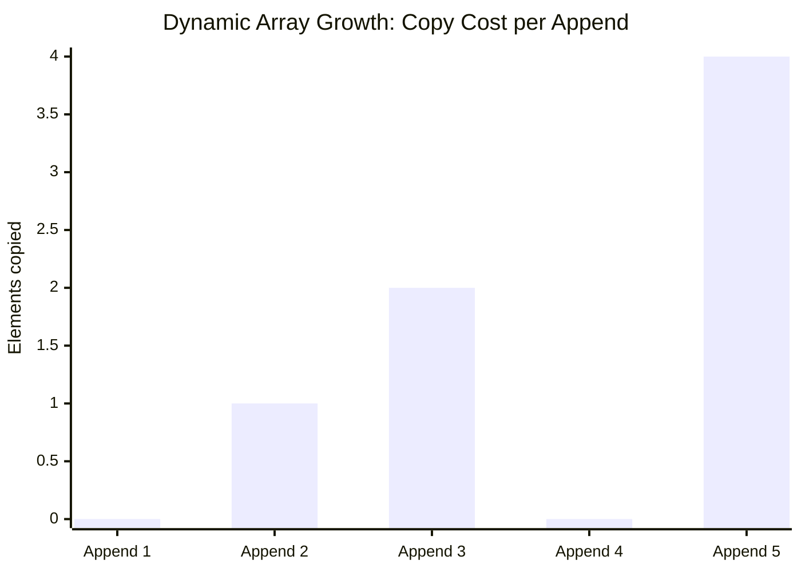
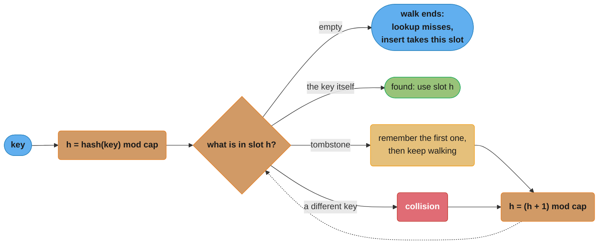
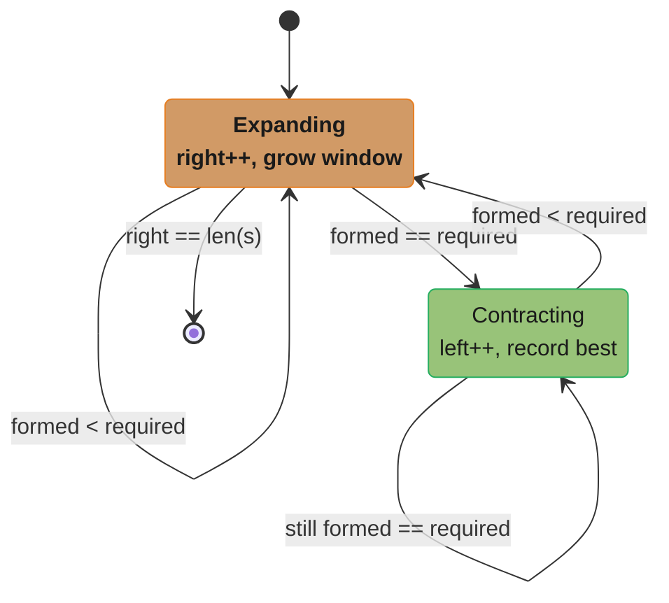

# Arrays, Strings & Hashing

---

## 1. Concept Overview

Arrays and hash tables are the two most fundamental data structures in all of computing. Together they underlie every caching layer, every database index, every programming language's built-in container, and the majority of interview problems.

An **array** is a contiguous block of memory where each element is the same size, enabling O(1) random access by index (base + index × element_size = address). A **dynamic array** (Python `list`, Java `ArrayList`, C++ `vector`) grows automatically by allocating a larger block and copying — with amortized O(1) append.

A **hash table** maps arbitrary keys to values using a hash function that converts any key to a bucket index. With a good hash function and bounded load factor, all core operations (insert, lookup, delete) are O(1) average. Hash tables trade memory for speed: they are the canonical example of the time-space tradeoff.

---

## 2. Intuition

> **One-line analogy**: An array is a numbered parking lot — any space by number in O(1); a hash table is a valet parking system that derives your spot from your car's license plate and remembers it instantly.

**Mental model**: Arrays give you O(1) by position but O(n) by value. Hash tables give you O(1) by value (key) but lose position ordering. The moment you need "is X present?" or "how many times does X appear?", reach for a hash table. The moment you need "what's at index i?" or "iterate in order", reach for an array.

**Why it matters**: Hash tables appear in almost every medium or hard interview problem as the data structure that reduces an O(n²) brute-force scan to an O(n) solution. Knowing when to use one (any "count", "seen before", "complement lookup") is the single most impactful interview pattern.

**Key insight**: The trick in most hash-table interview problems is deciding what to hash and what to store. For "two sum" you hash the number, storing its index. For "anagram grouping" you hash the sorted word. For "longest consecutive sequence" you hash all the numbers, then probe for sequence starts.

---

## 3. Core Principles

- **Contiguous memory = O(1) random access**: element at index i is at `base_address + i × element_size`. No pointer chasing.
- **Dynamic array growth**: on overflow, allocate a larger block and copy all elements. The multiplier is implementation-specific — Java `ArrayList` grows by 1.5× (`old + (old >> 1)`), C++ `vector` by 1.5–2× depending on the standard library, CPython's `list` by only ~1.125× (`newsize + (newsize >> 3) + 6`). Any constant *factor* above 1 gives amortized O(1) append; a constant *increment* (grow by +1, +8) does not. Worst-case single append is still O(n).
- **Hash function**: maps a key to an integer. Requirements: deterministic, fast (O(1)), and distributes keys uniformly. Python uses `__hash__`; Java uses `hashCode()`.
- **Hash collision**: two keys map to the same bucket. Resolved by chaining (bucket holds a linked list of entries) or open addressing (probe for the next empty slot).
- **Load factor**: `n / capacity`. Python dict resizes at ~2/3 load; Java HashMap at 0.75 (default). Higher load = more collisions = slower. Resize copies all entries to a new, larger table.
- **Key immutability**: hash table keys must be **hashable** (hash must not change). Mutable keys (Python list, unhashable) cannot be used — use tuples instead.
- **String immutability**: strings in Python and Java are immutable. Repeated string concatenation (`s += char` in a loop) creates O(n) new objects — total O(n²). Use `''.join(parts)` or `StringBuilder`.

---

## 4. Types / Strategies

### 4.1 Collision Resolution

**Separate chaining (Java `HashMap`, C++ `std::unordered_map`)**:
- Each bucket holds a linked list. Java converts a bucket to a red-black tree once it holds ≥ 8 entries **and** the table itself has ≥ 64 buckets — below that capacity it resizes instead, on the theory that a short table's collisions are a capacity problem, not a hash-quality problem.
- Lookup: compute bucket, scan the chain — O(1) average, O(n) worst case (all keys in one bucket).
- Load factor controls chain length; at load factor 0.75 average chain length is 0.75 ≈ O(1).

**Open addressing (linear probing, quadratic probing, double hashing) — CPython `dict`/`set`**:
- All entries stored in the main array; no separate chains.
- On collision: probe the next slot according to a formula. Linear: `(h + i) mod cap`. Quadratic: `(h + i²) mod cap`. Double hashing: `(h1 + i × h2) mod cap`.
- Deletion: cannot simply remove — must leave a tombstone/sentinel, or rehash all following entries.
- Better cache performance than chaining (no pointer chasing), but clustering problems with linear probing.

### 4.2 Key Design Patterns

**Frequency count**: `Counter({})` or `defaultdict(int)`. O(n) to build.
**Two-sum complement lookup**: store `target - x` as you scan; check if current `x` is in the map.
**Sliding window with frequency map**: track character counts in a window; adjust as window slides.
**Canonical key for grouping**: sort characters of a word to produce an anagram group key.
**XOR / sum of unique elements**: works when all but one element appears an even number of times.

### 4.3 Special Hash Table Variants

| Variant | Description | Language |
|---------|-------------|---------|
| `OrderedDict` / `LinkedHashMap` | Preserves insertion order | Python / Java |
| `Counter` | Frequency map with arithmetic ops | Python |
| `defaultdict` | Auto-initialises missing keys | Python |
| `TreeMap` / `SortedDict` | Sorted iteration + range queries in O(log n) | Java / Python `sortedcontainers` |
| `WeakHashMap` | Entries eligible for GC when keys have no other refs | Java |
| `ConcurrentHashMap` | Thread-safe; lock-free reads, CAS insert into an empty bin, `synchronized` on the bin head otherwise | Java |

---

## 5. Architecture Diagrams

### Hash Table with Separate Chaining

```
  Key: "cat"  →  hash("cat") mod 8 = 3
  Key: "act"  →  hash("act") mod 8 = 6
  Key: "tac"  →  hash("tac") mod 8 = 3  (collision with "cat"!)

  Bucket array (capacity=8):
  [0] -> null
  [1] -> null
  [2] -> null
  [3] -> ["cat": 1] -> ["tac": 2] -> null   (chain)
  [4] -> null
  [5] -> null
  [6] -> ["act": 3] -> null
  [7] -> null

  Load factor = 3 / 8 = 0.375 (below 0.75 threshold — no resize needed)
```

### Dynamic Array Growth



Capacity doubles at append 2 (1→2, copying the 1 existing element) and again at append 5 (4→8, copying 4 elements); appends 1, 3, and 4 land inside existing capacity and cost 0 copies (capacity sequence 1→2→4→4→8, size sequence 1→2→3→4→5). Total copies after 5 appends = 0+1+2+0+4 = 7, under the 2n = 10 bound that guarantees amortized O(1) append.

### Two Sum — Hash Table Solution

```
arr = [2, 7, 11, 15]   target = 9

Step 1: x=2, need (9-2)=7, seen={},       7 not in seen, add seen[2]=0
Step 2: x=7, need (9-7)=2, seen={2:0},    2 IS in seen → return (seen[2]=0, current=1)
```

### Open Addressing — Linear Probing (Insert / Lookup Path)



This traces `_probe()` from the `HashMap` implementation in §6.2: starting at `hash(key) mod cap`, it walks forward one slot at a time until it lands on the matching key or on a genuinely empty slot. `put()`, `get()`, and `delete()` all reuse this same walk. Two rules fall out of it, and both are easy to get wrong. Deletion must write a **tombstone** rather than `None`, because nulling the slot would truncate the probe chain and hide every key that hashed earlier and landed past the deleted one. And the walk must **not stop at a tombstone** either — a tombstone means "something was here, keep going"; stopping there loses exactly the keys the tombstone was invented to protect. It is only remembered, as the slot a subsequent insert of a missing key should reuse.

---

## 6. How It Works — Detailed Mechanics

### 6.1 Dynamic Array Append (Amortized Analysis)

```python
from __future__ import annotations

class DynArray:
    """Minimal dynamic array to illustrate amortized O(1) append."""

    GROWTH_FACTOR = 2  # Python CPython uses ~1.125 with a formula; conceptually 2x

    def __init__(self) -> None:
        self._data: list[object] = [None]
        self._size: int = 0
        self._cap: int = 1

    def append(self, val: object) -> None:
        if self._size == self._cap:
            new_cap = self._cap * self.GROWTH_FACTOR
            new_data: list[object] = [None] * new_cap
            for i in range(self._size):
                new_data[i] = self._data[i]  # O(n) copy
            self._data = new_data
            self._cap = new_cap
        self._data[self._size] = val
        self._size += 1

    def __getitem__(self, idx: int) -> object:
        if not 0 <= idx < self._size:
            raise IndexError(idx)
        return self._data[idx]  # O(1) direct access
```

Amortised proof: each element is copied at most once per doubling step. Total copies for n appends = n/2 + n/4 + ... ≤ n. Total work = n appends + n copies = 2n = O(n). Amortised per-append: O(1).

**The idea behind it.** "Appending is *usually* free; occasionally it is expensive; and the expensive ones are rare enough — and spread far enough apart — that the average stays constant."

Amortized is not the same as average-case. Average-case is a statement about random inputs; amortized is a worst-case guarantee about a *sequence*. No adversary can pick inputs that make appends slow, because the expensive resize pays for itself out of the cheap appends that preceded it.

| Symbol | What it is |
|--------|------------|
| `O(1)` | Constant. Cost does not grow with how much is already stored |
| `O(n)` | Linear. One unit of work per element currently held |
| "amortized O(1)" | Total cost of n operations is O(n), so each one *averages* O(1) |
| `cap` | Slots allocated. Always ≥ `size` |
| `size` | Slots actually used. What `len()` reports |
| growth factor 2 | New capacity = 2 × old capacity on overflow |

**Walk one example.** Append 1024 elements into the `DynArray` above and count every element copy:

```
  append #     size before   cap before   resize?   elements copied   running total
        1            0            1         no             0                  0
        2            1            1        yes             1                  1
        3            2            2        yes             2                  3
        5            4            4        yes             4                  7
        9            8            8        yes             8                 15
       17           16           16        yes            16                 31
       33           32           32        yes            32                 63
       65           64           64        yes            64                127
      129          128          128        yes           128                255
      257          256          256        yes           256                511
      513          512          512        yes           512               1023
  (all other 1014 appends: no resize, 0 copies each)

  total copies = 1 + 2 + 4 + 8 + ... + 512 = 1023
  bound        = 2n = 2048          ->  1023 < 2048  ✓
  per append   = 1023 / 1024 = 0.999 copies on average  ->  O(1) amortized
```

Only 10 of the 1024 appends resize at all. The doubling sequence is a geometric series, and a geometric series summing to just under its own last term is exactly why the total stays linear: `1+2+...+512 = 1023`, which is one less than `1024`. Drop the growth factor from 2 to 1.1 and the resizes get *far* more frequent (though the total is still linear — any constant factor above 1 works); drop to a fixed `+1` growth and every append after the first resizes, so the total becomes `1+2+...+(n-1) = n(n-1)/2`, which is O(n^2).

| n | O(log n) | O(n) | O(n log n) | O(n^2) |
|---|---------|------|-----------|--------|
| 1,000 | 10 | 1,000 | 10,000 | 1,000,000 |
| 1,000,000 | 20 | 1,000,000 | 20,000,000 | 1,000,000,000,000 |

**Why this complexity matters — the failure mode.** Get the growth factor wrong (grow by a constant instead of a multiple) and appends fall off the O(n^2) column above: building a 1,000,000-element list stops being a million operations and becomes a trillion — a request that used to finish in milliseconds now never returns, and the pathology only shows up at production volume because at n = 1,000 the difference is 1,000 vs 1,000,000, still sub-second. The second failure mode is memory: doubling means a resize momentarily holds *both* the old and new backing arrays, so peak RSS is ~3× the steady-state array size at the instant of growth. A service sized to its average list footprint will OOM during the resize spike, not during normal operation.

### 6.2 Hash Table Implementation

```python
from __future__ import annotations
from typing import Iterator

class HashMap:
    """Open-addressing hash map with linear probing and tombstones."""

    _DELETED = object()   # sentinel for deleted slots
    _MAX_LOAD = 0.75      # (live + tombstones) / cap ceiling

    def __init__(self, initial_cap: int = 8) -> None:
        self._cap = initial_cap
        self._keys: list[object] = [None] * self._cap
        self._vals: list[object] = [None] * self._cap
        self._size = 0    # live entries
        self._tombs = 0   # tombstoned slots not yet reclaimed

    def _probe(self, key: object) -> tuple[int, bool]:
        """Walk the chain from hash(key). Returns (slot, found).

        A tombstone does NOT end the walk — only an empty slot does. Stopping
        at one would hide every key that collided earlier and landed past the
        deleted slot. The first tombstone seen is remembered instead, as the
        slot an insert of a missing key should reuse. The loop terminates
        because _MAX_LOAD counts tombstones, so some slot is always None.
        """
        h = hash(key) % self._cap
        first_tomb: int | None = None
        while True:
            k = self._keys[h]
            if k is None:
                return (h if first_tomb is None else first_tomb), False
            if k is self._DELETED:
                if first_tomb is None:
                    first_tomb = h
            elif k == key:
                return h, True
            h = (h + 1) % self._cap   # linear probing

    def put(self, key: object, val: object) -> None:
        if (self._size + self._tombs) / self._cap >= self._MAX_LOAD:
            self._resize()
        idx, found = self._probe(key)
        if found:
            self._vals[idx] = val     # overwrite; size unchanged
            return
        if self._keys[idx] is self._DELETED:
            self._tombs -= 1          # reclaiming a tombstone
        self._keys[idx] = key
        self._vals[idx] = val
        self._size += 1

    def get(self, key: object) -> object | None:
        idx, found = self._probe(key)
        return self._vals[idx] if found else None

    def delete(self, key: object) -> None:
        idx, found = self._probe(key)
        if found:
            self._keys[idx] = self._DELETED  # tombstone, never None
            self._vals[idx] = None           # drop the value reference
            self._size -= 1
            self._tombs += 1

    def _resize(self) -> None:
        old_keys, old_vals = self._keys, self._vals
        self._cap *= 2
        self._keys = [None] * self._cap
        self._vals = [None] * self._cap
        self._size = 0
        self._tombs = 0   # tombstones do not survive a rehash
        for k, v in zip(old_keys, old_vals):
            if k is not None and k is not self._DELETED:
                self.put(k, v)
```

Two details in `put()` and `_resize()` carry more weight than they look. `put()` triggers the resize on `size + tombs`, not on `size`: a workload that inserts and deletes in a steady state adds no live entries, so a tombstone-blind trigger never fires, the table fills with sentinels, and probe chains grow without bound while `len()` reports a small map. And `_resize()` resets `_tombs` to zero because rehashing copies only live entries — the sentinels are the one kind of garbage a rehash is guaranteed to collect.

**Stated plainly.** "A hash table is O(1) only as long as the buckets stay mostly empty — the `0.75` in `put()` is not a magic constant, it is the price you pay to keep lookups from turning into a linear scan."

The whole O(1) claim rests on one assumption: that the hash function scatters keys evenly. Nothing in the data structure enforces that. When the assumption breaks — by accident or on purpose — the same code silently becomes O(n) per lookup with no error, no exception, and no log line.

| Symbol | What it is |
|--------|------------|
| `n` | Number of entries currently stored |
| `m` | Number of buckets / slots (`self._cap` in the code above) |
| `α = n/m` | How full the table is. `0.75` is the resize trigger in `put()` |
| `O(1)` avg | Expected probes is a small constant *given a good hash* |
| `O(n)` worst | Every key landed in one bucket; lookup degenerates to a scan |
| "probe" | One slot inspected during `_probe()`'s walk |

**Walk one example.** Linear probing, `m = 16` slots, filling the table one key at a time. Expected probes come from Knuth's linear-probing formulas — successful `0.5 × (1 + 1/(1-α))`, unsuccessful `0.5 × (1 + 1/(1-α)^2)`:

```
   n     m     alpha = n/m    probes (hit)   probes (miss)   state
   4    16        0.25            1.17            1.39       roomy
   8    16        0.50            1.50            2.50       comfortable
  12    16        0.75            2.50            8.50       <- resize fires here
  14    16        0.875           4.50           32.50       (only if resize disabled)
  15    16        0.9375          8.50          128.50       clustering runaway
```

Read the miss column, not the hit column — that is the one that explodes. Between α = 0.5 and α = 0.75 a failed lookup goes from 2.5 probes to 8.5; push to α = 0.9375 and it is 128.5. This is why `put()` resizes at `>= 0.75` rather than waiting until the table is actually full: the cost curve is a `1/(1-α)^2` wall, and the last few percent of capacity cost more than all the preceding capacity combined.

Now the worst case. Suppose every key hashes to the same bucket:

```
  good hash, n = 1,000, m = 2,048      ->  1.5 probes on a hit      (O(1))
     (alpha = 0.49 — the capacity put() actually settles on, since
      1,000 / 1,024 = 0.98 would have tripped the resize long before)
  all keys collide, n = 1,000          ->  up to 1,000 probes       (O(n))

  1,000 lookups x 1,000 probes = 1,000,000 slot inspections
  vs the healthy 1,000 x 1.5   =     1,500 slot inspections
                                     ------------------------
                                     667x more work, same code
```

**Why this complexity matters — the failure mode.** The named production incident here is **hash-flooding denial of service**. An attacker who knows (or can guess) your hash function crafts thousands of distinct keys that all hash to the same bucket, then submits them as HTTP form fields, JSON keys, or query parameters. Your framework dutifully inserts them into a map, every insert scans the whole chain, and a single request that looks like ordinary input burns CPU quadratically — `n` inserts each costing O(n) is O(n^2) work, so 100,000 colliding keys is 10,000,000,000 comparisons off one request. This landed as a real cross-language vulnerability in 2011/2012 (PHP, Java, Python, Ruby, and others all shipped fixes). The mitigations are the ones you see in modern runtimes: **randomized hash seeds per process** (Python's `PYTHONHASHSEED`, on by default since 3.3) so the attacker cannot precompute collisions, and **treeified buckets** (Java 8's HashMap converting a chain to a red-black tree at ≥ 8 entries, noted in §4.1) so even a fully-collided bucket degrades to O(log n) rather than O(n). The second, quieter failure mode is a **bad `__hash__`/`hashCode` on your own key class** — returning a constant, or hashing only one field of a composite key — which produces the same O(n) collapse with no attacker at all, and shows up as a service that is fast in staging and mysteriously CPU-bound in production where the key cardinality is higher.

### 6.3 String Building — Common O(n²) Trap

```python
# BROKEN: O(n^2) — each += creates a new string object
def build_string_broken(chars: list[str]) -> str:
    result = ""
    for c in chars:
        result += c   # new string object created each time
    return result
# iteration i allocates a string of length i and writes i characters into it
# (i-1 copied from the old string, 1 new), so the total is 1+2+...+n = O(n^2)

# FIX: O(n) — collect parts and join at the end
def build_string(chars: list[str]) -> str:
    parts: list[str] = []
    for c in chars:
        parts.append(c)   # O(1) amortized append to list
    return ''.join(parts)  # single O(n) scan
```

**What the formula is telling you.** "Strings are immutable, so `s += x` never appends — it allocates a brand-new string and copies everything you already had, which means the loop re-copies the whole prefix on every single iteration."

The trap is that the broken version *looks* like an O(1) append. Nothing in `result += c` hints that a full copy is happening; the cost is hidden inside the language's string semantics. That is exactly why this is the single most common accidental-O(n^2) in interview code and in production log-formatting loops.

| Symbol | What it is |
|--------|------------|
| `n` | Number of pieces being concatenated |
| `O(n^2)` | Work grows with the *square* of the input. Double n, quadruple the time |
| `n(n+1)/2` | Sum `1+2+...+n`. The exact character-write count of the broken loop |
| immutable | The object cannot be changed in place; every "edit" is a new allocation |
| `''.join(parts)` | Measures the total length once, allocates once, copies each piece once |

**Walk one example.** Build a 5-character string one character at a time with `result += c`:

```
  iteration   result before   chars written into the new string   running total
      1           ""                        1                           1
      2           "a"                       2                           3
      3           "ab"                      3                           6
      4           "abc"                     4                          10
      5           "abcd"                    5                          15

  total = 1+2+3+4+5 = 15 characters written to produce a 5-character string

  ''.join(parts): measure total length (5), allocate once, write 5 chars = 5
```

Five characters written versus fifteen is not alarming. The gap is a *ratio*, and the ratio is `(n+1)/2`, so it widens with every element:

```
   n           broken  s += x        builder / join        ratio
                n(n+1)/2 writes      n writes

   1,000              500,500              1,000            500x
   100,000      5,000,050,000            100,000         50,000x
```

At n = 1,000 the broken loop copies 500,500 characters — half a millisecond, invisible. At n = 100,000 it copies 5,000,050,000 characters to produce a 100,000-character string: five billion character copies where 100,000 would do, a 50,000× overshoot.

**Why this complexity matters — the failure mode.** This is the classic "it worked fine in dev, it hangs in prod" bug, and it hangs *silently* — no exception, no error, just a request that stops returning. The shape is always the same: a loop that accumulates a report, a CSV export, a log line, or a JSON blob with `+=`, tested against 50 rows and deployed against 100,000. Because the cost is quadratic, the symptom does not scale gently — a 10× increase in data is a 100× increase in time, so the endpoint goes from 200 ms to 20 seconds and trips the gateway timeout. It also generates n intermediate string objects that immediately become garbage, so the secondary symptom is a GC storm: allocation pressure and pause times spike alongside the CPU, and the thread holding the loop pins a worker for the duration. The fix is unconditional and costs nothing — accumulate into a list and `''.join()` at the end (Python), or use `StringBuilder` (Java). Never `+=` a string inside a loop whose bound you do not control.

### 6.4 Anagram Grouping — Canonical Key Pattern

```python
from collections import defaultdict

def group_anagrams(strs: list[str]) -> list[list[str]]:
    """
    O(n × k log k) where n = number of strings, k = max string length.
    Key insight: two strings are anagrams iff they have the same sorted characters.
    """
    groups: dict[str, list[str]] = defaultdict(list)
    for s in strs:
        key = ''.join(sorted(s))   # canonical key: sorted characters
        groups[key].append(s)
    return list(groups.values())
# ["eat","tea","tan","ate","nat","bat"] → [["eat","tea","ate"],["tan","nat"],["bat"]]
```

### 6.5 Longest Consecutive Sequence — O(n) with Hash Set

```python
def longest_consecutive(nums: list[int]) -> int:
    """
    O(n) time. Key: only start a streak from a number that has no predecessor.
    """
    num_set = set(nums)   # O(n) build
    best = 0
    for n in num_set:
        if (n - 1) not in num_set:   # n is the start of a streak
            current = n
            streak = 1
            while (current + 1) in num_set:
                current += 1
                streak += 1
            best = max(best, streak)
    return best
# Each number is visited at most twice (once in the outer loop, once in the while loop).
# Total iterations: O(2n) = O(n).
```

---

## 7. Real-World Examples

**CPython dict** — uses open addressing with random probing (not linear) to avoid clustering. As of Python 3.7, dicts are insertion-ordered: a compact index array points into a dense entries array. This gives good cache performance and O(1) iteration. Resize happens at 2/3 load factor; the table size is always a power of 2.

**Java HashMap internals** — uses separate chaining. Each bucket starts as a singly-linked list. In Java 8+, when a bucket has ≥ 8 entries, it converts to a red-black tree, giving O(log n) worst-case lookup for that bucket. This prevents hash-collision DoS attacks. The default initial capacity is 16; load factor 0.75 means resize at 12 entries.

**Database hash join** — when joining two tables, the DBMS builds a hash table from the smaller table (build phase), then probes it with each row from the larger table (probe phase). O(n + m) total vs O(n × m) for a nested-loop join. PostgreSQL uses this for equi-joins; the hash table is partitioned across memory buffers if it doesn't fit in RAM.

**DNS resolution caching** — a local DNS resolver caches name→IP mappings in a hash table keyed by the domain name. Cache hit: O(1) hash lookup, no network round-trip (~0 ms). Cache miss: recursive resolution ~50–200 ms. The TTL field in DNS records determines how long an entry stays in the cache.

**Rate limiting with sliding window counter** — a rate limiter tracks request counts per (user, time-bucket) pair using a hash map. Key = `user_id:minute_bucket`, value = request count. Each request increments the count and checks it against the limit. O(1) per request with constant memory per user.

---

## 8. Tradeoffs

### Hash Table vs Sorted Array vs Balanced BST

| Operation | Hash table (avg) | Sorted array | Balanced BST |
|-----------|-----------------|--------------|--------------|
| Lookup | O(1) | O(log n) | O(log n) |
| Insert | O(1) amortized | O(n) (shift) | O(log n) |
| Delete | O(1) | O(n) | O(log n) |
| Min/Max | O(n) | O(1) | O(log n) |
| Range [lo,hi] | O(n) | O(log n + k) | O(log n + k) |
| Sorted iteration | O(n log n) | O(n) | O(n) |
| Space | O(n) + overhead | O(n) | O(n) |

### Chaining vs Open Addressing

| Dimension | Chaining | Open addressing |
|-----------|---------|----------------|
| Cache performance | Poor (pointer chasing) | Better (contiguous) |
| Deletion | Simple (remove node) | Requires tombstone |
| Load factor sensitivity | Tolerates > 1.0 | Degrades sharply near 1.0 |
| Memory overhead | Extra pointer per entry | None |
| Clustering | No primary clustering | Linear probing suffers clustering |

---

## 9. When to Use / When NOT to Use

**Use hash table when:**
- O(1) lookup, insert, delete by key is needed and ordering is not.
- Counting frequencies, deduplication, caching, or memoisation.
- "Two-sum", "find duplicates", "longest subarray" pattern problems.

**Use array when:**
- O(1) access by index is needed.
- Data has a known fixed size or grows predictably.
- Cache-efficient iteration is important.

**Do NOT use hash table when:**
- You need sorted order, range queries, or floor/ceiling lookups — use BST (TreeMap/SortedDict).
- Keys are mutable (lists, dicts) — hash cannot be computed.
- Deterministic worst-case latency is required — hash table O(n) worst case (all collisions). Use a balanced BST.
- Memory is extremely constrained — hash tables use ~2–4× the raw data size due to load-factor headroom and pointer overhead.

---

## 10. Common Pitfalls

### Pitfall 1: Mutating a Dict While Iterating

```python
# BROKEN: RuntimeError: dictionary changed size during iteration
d = {'a': 1, 'b': 2, 'c': 3}
for key in d:
    if d[key] == 2:
        del d[key]   # BROKEN: mutate during iteration

# FIX: iterate over a copy of keys
for key in list(d.keys()):
    if d[key] == 2:
        del d[key]   # safe: iterating the copy
```

### Pitfall 2: Using a List as a Dict Key

```python
# BROKEN: TypeError — list is unhashable
d = {}
key = [1, 2, 3]
d[key] = "value"   # TypeError: unhashable type: 'list'

# FIX: use a tuple (immutable, hashable)
d[tuple(key)] = "value"   # ✓
```

### Pitfall 3: String Concatenation in a Loop — O(n²)

```python
# BROKEN: O(n^2) — each += creates a new string
result = ""
for word in words:
    result += word + " "   # BROKEN for large n

# FIX: join at the end — O(n) total
result = " ".join(words)
```

### Pitfall 4: Off-by-One in Sliding Window

```python
# BROKEN: window size calculation is off by one
def max_sum_k(arr: list[int], k: int) -> int:
    window = sum(arr[:k-1])   # BROKEN: should be arr[:k]
    best = window
    for i in range(k-1, len(arr)):  # BROKEN: should start at k
        window += arr[i] - arr[i-(k-1)]  # BROKEN: should be arr[i-k]
        best = max(best, window)
    return best

# FIX: clear invariant — window always covers arr[i-k+1 .. i]
def max_sum_k_fixed(arr: list[int], k: int) -> int:
    window = sum(arr[:k])   # initial window of size k
    best = window
    for i in range(k, len(arr)):
        window += arr[i] - arr[i - k]  # add new right, remove old left
        best = max(best, window)
    return best
```

---

## 11. Technologies & Tools

| Tool / Class | Language | Notes |
|-------------|---------|-------|
| `dict` | Python | Insertion-ordered (3.7+), open addressing, resize at 2/3 |
| `defaultdict` | Python | Auto-init missing keys |
| `Counter` | Python | Frequency map, arithmetic, `most_common(k)` |
| `set` | Python | Hash-set, same O(1) ops as dict |
| `HashMap` | Java | Default cap 16, load 0.75; tree-bin at 8 entries in a bin once the table has ≥ 64 buckets |
| `LinkedHashMap` | Java | Insertion order preserved |
| `TreeMap` | Java | Red-black BST; O(log n) all ops; sorted iteration |
| `ConcurrentHashMap` | Java | Thread-safe; lock-free reads, CAS on empty bins, `synchronized` per bin head |
| `ArrayList` | Java | Dynamic array; amortized O(1) append (growth factor 1.5) |
| `array` module | Python | Typed, compact C-backed arrays — not hash maps |
| `collections.OrderedDict` | Python | Plain `dict` is ordered since 3.7; `OrderedDict` still adds `move_to_end`, `popitem(last=)`, and order-sensitive `==` |

---

## 12. Interview Questions with Answers

**Q1: What is the time complexity of Python dict lookup, and what is the worst case?**
**Short:** Python dict lookup is O(1) average but degrades to O(n) worst case if adversarial keys collide into the same bucket.
O(1) average. Worst case O(n) if all keys hash to the same bucket (e.g., adversarial keys with crafted hash collisions). Python randomises the hash seed per process (since Python 3.3) to make collision attacks impractical — but only for `str` and `bytes`. Integer hashing is not randomised at all: `hash(n) == n` for every `n` up to 2**61 - 1 (larger ints are reduced modulo that Mersenne prime, and `hash(-1)` is -2), so an attacker who controls integer keys can still craft colliding input — be aware when using integer-keyed dicts for security-sensitive applications.

**Q2: What is the difference between `defaultdict` and `dict.get(key, default)`?**
**Short:** `defaultdict(list)` inserts an empty list into the dict on missing-key access, while `dict.get(key, [])` returns a default without inserting anything.
`defaultdict(list)` automatically inserts a new empty `list` when a key is missing and you access it with `d[key]`. `dict.get(key, [])` returns an empty list but does NOT insert it. Use `defaultdict` when you want to immediately modify the value (e.g., `d[key].append(x)` without a prior existence check). Use `dict.get` when you only want to read a default without mutating the dict.

**Q3: Why does Java's HashMap resize at 75% capacity and not 100%?**
**Short:** 0.75 is a time-space compromise: it keeps chains short for fast lookups while leaving only a quarter of the table empty, since collisions are Poisson-distributed and tails lengthen fast.
0.75 is a deliberate time-space compromise: it keeps the average chain short enough that lookups stay near-constant while leaving only a quarter of the table empty. Note that HashMap uses chaining, so a load factor of 1.0 would not be catastrophic on its own — the mean chain length would still be 1 — but collisions are Poisson-distributed, so the *tail* lengthens fast, and the buckets you actually hit are the crowded ones. Push the factor higher and you trade lookup time for memory; push it lower and you waste memory and rehash more often. The resize doubles the capacity, halving the load factor to ~0.375.

**Q4: Two Sum — what is the O(n) hash-table solution?**
**Short:** Iterate once, checking for each `x` whether `target - x` is already in a hash map of seen values before storing `x`, giving O(n) time and O(n) space.
Iterate through the array; for each element `x`, check if `target - x` is in a hash map of previously seen values; if yes, return the pair. If no, store `x → index` in the map. One pass, O(n) time, O(n) space. Key insight: instead of asking "is there any y such that x + y = target?", rephrase as "was `target - x` seen before?" — a point lookup, not a search.

**Q5: How does Java HashMap's treeification (Java 8) help?**
**Short:** A bucket chain of 8+ entries converts to a red-black tree once the table has 64+ buckets, turning O(n) lookups into O(log n) and defeating hash-collision DoS attacks.
When a single bucket's chain grows to ≥ 8 entries, it is converted to a red-black BST, giving O(log n) operations on that bucket instead of O(n). This prevents hash-collision DoS attacks (an attacker sending many keys with the same hash value) from degrading the whole map to O(n) per operation. Two conditions are easy to miss: treeification only happens once the table itself has ≥ 64 buckets (below that, HashMap resizes instead, treating the collisions as a capacity problem), and the tree needs an ordering for keys that are not `Comparable` — it falls back to comparing class names and then identity hash codes. On resize, a tree bin that splits down to ≤ 6 entries is untreeified back into a linked list.

**Q6: What are the time and space complexities of `sorted()` in Python?**
**Short:** Python's `sorted()` runs Timsort in O(n log n) time and O(n) space, returning a new list rather than mutating the original.
O(n log n) time (Timsort). O(n) space (a separate list is returned — the original is not modified). For sorting a string: `sorted("anagram")` → O(k log k) where k = string length; then `''.join(sorted(s))` is the canonical anagram key.

**Q7: What is the longest substring without repeating characters, and what is the approach?**
**Short:** A sliding window tracked with a character set solves it in O(n) time, since each character enters and leaves the window at most once.
Sliding window. Maintain a set of characters in the current window [left, right]. Expand right; when a duplicate is found, shrink left until the duplicate is removed. Track the maximum window size seen. O(n) time — each character enters and leaves the window at most once.

**Q8: What makes a good hash function?**
**Short:** A good hash function is deterministic, fast, uniform across the table, and exhibits the avalanche effect so a one-bit input change flips about half the output bits.
A good hash function is: (a) deterministic — same input always gives the same output; (b) fast — O(1) or O(k) for a k-byte key; (c) uniform — maps keys uniformly across the table, minimising collisions; (d) avalanche effect — a single bit change in the key changes ~50% of the hash bits, preventing clustering. Bad: summing character ASCII values (all anagrams collide). Better: polynomial rolling hash (used in Rabin-Karp and Java String's `hashCode`).

**Q9: You need to find all pairs in an array that sum to zero. What is the O(n) approach?**
**Short:** Build a frequency map with `Counter`, then for each distinct value x check whether `-x` is also present, deduplicating by only keeping pairs where `x <= -x`.
Build a frequency map (`Counter`). For each distinct value x, if `-x` exists in the map, it forms a pair. Handle duplicates carefully: the pair (0, 0) requires at least two zeros; (x, -x) for x ≠ 0 requires both x and -x to be present. Deduplicate results by storing pairs with `x <= -x`.

**Q10: How does Python's `set` differ from a `frozenset`?**
**Short:** `set` is mutable and unhashable, while `frozenset` is immutable and hashable, so only a `frozenset` can serve as a dict key or a set element.
Both are hash sets with O(1) membership testing. `set` is mutable (supports `add`, `discard`, `update`). `frozenset` is immutable and therefore hashable — it can be used as a dictionary key or as an element of another set. `frozenset` is useful when you need a set as a cache key (e.g., grouping states in a BFS problem).

**Q11: What is the time complexity of `in` for Python list vs set?**
**Short:** `x in list` is an O(n) linear scan while `x in set` is an O(1) average hash lookup, so using a list for membership checks in a loop silently creates O(n^2) code.
`x in list` — O(n) linear scan. `x in set` — O(1) average hash lookup. The mistake of using a list where a set is appropriate is one of the most common sources of accidental O(n²) code: checking membership inside a for loop.

**Q12: How would you implement an LRU cache in O(1) time for all operations?**
**Short:** Combine a hash map for O(1) key lookup with a doubly-linked list for O(1) eviction, which `OrderedDict`'s `move_to_end`/`popitem(last=False)` implement directly.
Combine a `dict` (for O(1) key lookup) with a doubly-linked list (for O(1) LRU eviction). On access: move the node to the head of the list (most recently used). On eviction: remove the tail node (least recently used). Python's `OrderedDict` has `move_to_end` and `popitem(last=False)` which implement this pattern with a single built-in structure. See `case_studies/design_lru_cache.md` for the full walkthrough.

**Q13: What is Java's `LinkedHashMap` and how does it maintain insertion order?**
**Short:** `LinkedHashMap` extends `HashMap` with a doubly-linked list of `before`/`after` pointers on every entry, giving O(n) insertion-order iteration at O(1) extra overhead per op.
`LinkedHashMap` extends `HashMap` with a doubly-linked list connecting all entries in insertion (or access) order. Each entry stores `before` and `after` pointers in addition to `next` (for the hash chain). This adds O(1) overhead per operation and O(n) extra memory. Iteration is O(n) in insertion order. It is the standard Java building block for an LRU cache (`LinkedHashMap(cap, 0.75, true)` in access-order mode).

**Q14: What happens when you use a mutable default argument in Python?**
**Short:** A mutable default like `def f(lst=[])` is created once at function definition, so every call sharing the default also shares mutations made to it.
This is a Python gotcha related to hashing: `def f(lst=[])` — the default `lst` is created ONCE when the function is defined, not on each call. All calls that use the default share the same list. Mutations in one call persist in the next. Fix: `def f(lst=None): if lst is None: lst = []`. The same issue occurs with dicts and sets as default arguments.

**Q15: Given an array of integers 1..n with one duplicate, find the duplicate in O(n) time and O(1) space without modifying the array.**
**Short:** Treat the array as a linked list where `arr[i]` points to the next index and run Floyd's cycle detection to find the duplicate as the cycle entry.
Two approaches: (a) Floyd's cycle detection — treat the array as a linked list where `arr[i]` points to the next node. The duplicate creates a cycle; find the cycle entry with fast-slow pointers. (b) Sum: sum(arr) - n(n+1)/2 = the duplicate if exactly one number appears twice (fails if multiple duplicates or numbers outside 1..n).

**Q16: What is the time complexity of Python's list `.pop()` vs `.pop(0)`?**
**Short:** `list.pop()` is O(1) amortized, but `list.pop(0)` is O(n) because every remaining element must shift left — use `collections.deque` for O(1) `popleft`.
`list.pop()` — O(1) amortized (removes the last element, no shifting). `list.pop(0)` — O(n) (removes the first element, shifts all remaining elements left). For a FIFO queue, use `collections.deque` which gives O(1) popleft. This distinction is a common performance bug in sliding window or BFS implementations.

**Q17: How do you detect if two strings are anagrams in O(n) time?**
**Short:** Build a frequency counter for one string and decrement it while scanning the other, checking all counts return to zero, giving O(k) time and O(1) space for a fixed alphabet.
Two strings are anagrams if they contain the same characters with the same frequencies. Approaches: (a) sort both and compare — O(k log k); (b) build a frequency counter for one, decrement for the other, check all zeros — O(k) time, O(1) space (26 characters for lowercase alphabet). The O(k) approach is preferred.

**Q18: What is the difference between `==` and `is` for checking key equality in Python dicts?**
**Short:** Dict lookup compares keys with `==` (value equality via `__eq__`) after hashing, while `is` checks object identity and should never be used for value comparisons.
Dict lookup uses `hash(key)` first, then `key == stored_key` (the `__eq__` method). `is` checks identity (same object in memory), not equality. Two distinct objects with the same value compare equal (`"abc" == "abc"`) but `is` would be False unless Python interns them. Never use `is` for value comparisons. For small integers (-5 to 256) and interned strings, Python caches objects so `is` incidentally returns True, but this is an implementation detail, not a language guarantee.

---

## 13. Best Practices

1. **Default to `dict` + `set`** for lookup problems — they are almost always the right tool for O(n) solutions.
2. **Use `Counter` for frequency counting** — `Counter(arr).most_common(k)` gives top-k in O(n + d log k), where d is the number of *distinct* values: building the counter is O(n), and `most_common(k)` is `heapq.nlargest` over the d distinct items against a heap of size k. Calling `most_common()` with no argument sorts instead — O(d log d).
3. **Use `collections.deque` for O(1) popleft** — never `list.pop(0)` in hot loops.
4. **Define the sliding window invariant in a comment** before coding the loop — it prevents off-by-one errors.
5. **Prefer `''.join(parts)` over string concatenation** in any loop that builds a string.
6. **Use `frozenset` or `tuple` as dict keys** when you need a collection as a key.
7. **For large n, pre-allocate arrays** — `[0] * n` in Python or `new int[n]` in Java to avoid repeated resizing.
8. **Normalise keys for grouping** — sort, canonical form, or a frozenset captures equivalence classes without collision.

---

## 14. Case Study: Minimum Window Substring

**Problem**: given strings `s` and `t`, find the minimum window in `s` that contains all characters of `t`. Return `""` if no such window exists.

**Approach**: sliding window with two frequency maps — `t_count` (required), `window_count` (current window). Track `formed` = number of character types that have reached their required frequency.

**State machine view**: the scan alternates between two states — growing the window until it satisfies `t`, then harvesting the best answer while shrinking it.



Each pointer only ever moves forward — `right` advances in Expanding, `left` advances in Contracting — so the total number of state transitions is O(|s|), matching the interview discussion's claim that "the two-pointer never backtracks."

```python
from collections import Counter

def min_window(s: str, t: str) -> str:
    """
    O(|s| + |t|) time. Space is O(|t|) for t_count plus one entry per distinct
    character of s in window_count — O(sigma) for a fixed alphabet.
    """
    if not t or not s:
        return ""

    t_count = Counter(t)
    required = len(t_count)   # distinct chars in t that must be satisfied

    left = right = 0
    formed = 0   # how many chars in window have reached required frequency
    window_count: dict[str, int] = {}
    best = (float('inf'), 0, 0)  # (length, left, right)

    while right < len(s):
        c = s[right]
        window_count[c] = window_count.get(c, 0) + 1
        if c in t_count and window_count[c] == t_count[c]:
            formed += 1

        # Contract the window from the left while it is valid
        while left <= right and formed == required:
            if right - left + 1 < best[0]:
                best = (right - left + 1, left, right)
            lc = s[left]
            window_count[lc] -= 1
            if lc in t_count and window_count[lc] < t_count[lc]:
                formed -= 1
            left += 1

        right += 1

    return "" if best[0] == float('inf') else s[best[1]:best[2] + 1]
```

**BROKEN — naive all-substrings approach**:
```python
# BROKEN: every substring, recounted from scratch.
# O(n^2) substrings, and each one is sliced and re-scanned in O(n) => O(n^3).
def min_window_brute(s: str, t: str) -> str:
    best = ""
    for i in range(len(s)):
        for j in range(i + 1, len(s) + 1):
            window = s[i:j]
            if all(window.count(c) >= t.count(c) for c in set(t)):
                if not best or len(window) < len(best):
                    best = window
    return best
# For |s|=10000: ~10^8 substrings, each re-scanned in ~10^4 char reads = ~10^12 ops
# FIX: sliding window above: O(|s|+|t|) — 10000+100 = 10100 ops
```

**Complexity**:

| Approach | Time | Space |
|----------|------|-------|
| Brute force (all substrings) | O(n³) — n² substrings, each re-scanned in O(n) | O(n) for the slice |
| Sliding window (this solution) | O(n + m) | O(m + σ) |

**Interview discussion**: "Why does the sliding window work here?" — the window is valid if `formed == required`. Once valid, we can safely shrink from the left (any left-contracted window that becomes invalid will need to re-expand). The monotonic property: making the window larger can only keep it valid or make it valid; making it smaller can only keep it valid or make it invalid. The two-pointer never backtracks → O(n) total moves.

---

## See Also

- [complexity_analysis_and_big_o](../complexity_analysis_and_big_o/complexity_analysis_and_big_o.md) — amortized O(1) analysis of dynamic array append
- [linked_lists_stacks_and_queues](../linked_lists_stacks_and_queues/linked_lists_stacks_and_queues.md) — `LinkedHashMap` uses a linked list inside the hash table
- [`java/collections_internals`](../../java/collections_internals/collections_internals.md) — HashMap secondary hash, ConcurrentHashMap, TreeMap
- [`python/collections_and_data_structures`](../../python/collections_and_data_structures/collections_and_data_structures.md) — CPython dict internals, compact dict design
- [DSA Pattern Playbooks](../dsa_patterns/dsa_patterns.md) — apply these structures: [Two Pointers](../dsa_patterns/two_pointers.md), [Sliding Window](../dsa_patterns/sliding_window.md), [Prefix Sum](../dsa_patterns/prefix_sum.md), [Hashing Patterns](../dsa_patterns/hashing_patterns.md), [Cyclic Sort](../dsa_patterns/cyclic_sort.md), [Matrix Traversal & Manipulation](../dsa_patterns/matrix_traversal.md)
