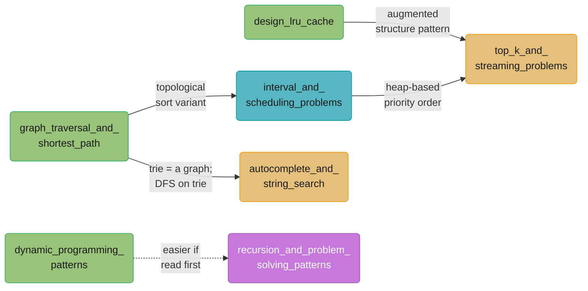

# CS Fundamentals Case Studies — Learning Path

6 interview-problem walkthrough studies.

Each case study uses the **adapted 11-section walkthrough template**: Problem Statement & Clarifying Questions, Brute Force & Complexity Baseline, Optimal Approach & Key Insight, executable Python implementation (with a BROKEN→FIX block), Complexity Analysis & Tradeoffs, Variations & Follow-ups, Real-World Usage (named systems), Edge Cases & Testing, Common Mistakes (quantified war stories), Related Problems, and 10+ Interview Discussion Points. Target: 900–1100 lines per study.

> **Build status**: complete. All 6 case studies written. See the [Build Status & Implementation Tracker](../README.md#7-build-status--implementation-tracker) in the master index for the per-file record.

---

## Quick Start (if you only have time for three)

| Order | File | Why start here |
|-------|------|----------------|
| 1 | [design_lru_cache.md](./design_lru_cache.md) | The canonical DS interview problem — combines HashMap and doubly-linked list for O(1) get/put. Teaches the principle of augmenting one structure with another to achieve a complexity goal. Appears in almost every senior interview loop. |
| 2 | [dynamic_programming_patterns.md](./dynamic_programming_patterns.md) | DP is the single highest-frequency algorithm family in senior interviews. This study covers four canonical families (knapsack, LCS, edit distance, coin change) in one place, teaching the recognition → recurrence → table or memo → complexity flow. |
| 3 | [graph_traversal_and_shortest_path.md](./graph_traversal_and_shortest_path.md) | Graph problems appear in every company (course schedule, number of islands, shortest path, network delay). Covers BFS/DFS/Dijkstra/topological sort and union-find in a unified walkthrough. |

---

## Full Learning Path

Studies are grouped by the primary engineering concern they teach.

### Phase A — Data Structure Design

| File | Primary Engineering Concern | What It Teaches |
|------|-----------------------------|-----------------|
| [design_lru_cache.md](./design_lru_cache.md) | O(1) combined data structure | HashMap + doubly-linked list composition; OrderedDict Python trick vs manual impl; thread-safe variant; cache eviction policy spectrum |

### Phase B — Algorithm Families

| File | Primary Engineering Concern | What It Teaches |
|------|-----------------------------|-----------------|
| [dynamic_programming_patterns.md](./dynamic_programming_patterns.md) | Optimal substructure & overlapping subproblems | Memoization vs tabulation; four DP families; space optimization (rolling array); recognizing DP from problem shape |
| [greedy and divide-and-conquer via intervals](./interval_and_scheduling_problems.md) | Greedy correctness proofs | Exchange argument; interval scheduling maximization; merge intervals; meeting rooms; heap-based multi-resource scheduling |

### Phase C — Graph & Tree Problems

| File | Primary Engineering Concern | What It Teaches |
|------|-----------------------------|-----------------|
| [graph_traversal_and_shortest_path.md](./graph_traversal_and_shortest_path.md) | Graph traversal and shortest-path families | BFS (unweighted shortest), DFS (connected components, topo sort), Dijkstra (weighted), union-find (dynamic connectivity) |
| [autocomplete_and_string_search.md](./autocomplete_and_string_search.md) | Trie + string-matching algorithms | Trie insert/search/prefix; compressed trie; KMP failure function; Rabin-Karp rolling hash; Z-algorithm; real-world use in search engines and IDEs |

### Phase D — Streaming & Ranking

| File | Primary Engineering Concern | What It Teaches |
|------|-----------------------------|-----------------|
| [top_k_and_streaming_problems.md](./top_k_and_streaming_problems.md) | Bounded-memory aggregation over streams | Min-heap top-K; quickselect O(n) average; count-min sketch for approximate frequency; streaming median with two heaps; trade-off between exact and approximate answers |

---

## Cross-Cutting / Shared Primitives

No `cross_cutting/` directory for this section — the case studies are self-contained walkthrough problems. Cross-cutting concepts (complexity analysis, hash table internals, graph representations) are covered in the module files and crosslinked from within each case study.

---

## Dependency Map

Some case studies build on patterns established by others.

*Arrows point from a prerequisite case study to the one that benefits from reading it first. Green marks the three case studies with no prerequisites (start anywhere); teal marks the bridge file that both consumes and forwards a pattern; gold marks the two convergence points where multiple upstream techniques combine; purple marks the one dotted, soft (not hard) recommendation pointing outside this directory to the `recursion_and_problem_solving_patterns` concept module.*

---

## Interview Prep Shortcuts

| Interview Topic | Best Case Study |
|----------------|-----------------|
| "Implement an LRU cache" | [design_lru_cache.md](./design_lru_cache.md) |
| "Top K frequent elements" | [top_k_and_streaming_problems.md](./top_k_and_streaming_problems.md) |
| "Streaming median" | [top_k_and_streaming_problems.md](./top_k_and_streaming_problems.md) |
| "Longest common subsequence / edit distance" | [dynamic_programming_patterns.md](./dynamic_programming_patterns.md) |
| "Coin change / knapsack" | [dynamic_programming_patterns.md](./dynamic_programming_patterns.md) |
| "Course schedule / topological sort" | [graph_traversal_and_shortest_path.md](./graph_traversal_and_shortest_path.md) |
| "Number of islands / connected components" | [graph_traversal_and_shortest_path.md](./graph_traversal_and_shortest_path.md) |
| "Network delay time / cheapest flights" | [graph_traversal_and_shortest_path.md](./graph_traversal_and_shortest_path.md) |
| "Implement autocomplete / prefix search" | [autocomplete_and_string_search.md](./autocomplete_and_string_search.md) |
| "Substring search (KMP / Rabin-Karp)" | [autocomplete_and_string_search.md](./autocomplete_and_string_search.md) |
| "Merge intervals / meeting rooms" | [interval_and_scheduling_problems.md](./interval_and_scheduling_problems.md) |
| "Task scheduler / job sequencing" | [interval_and_scheduling_problems.md](./interval_and_scheduling_problems.md) |
