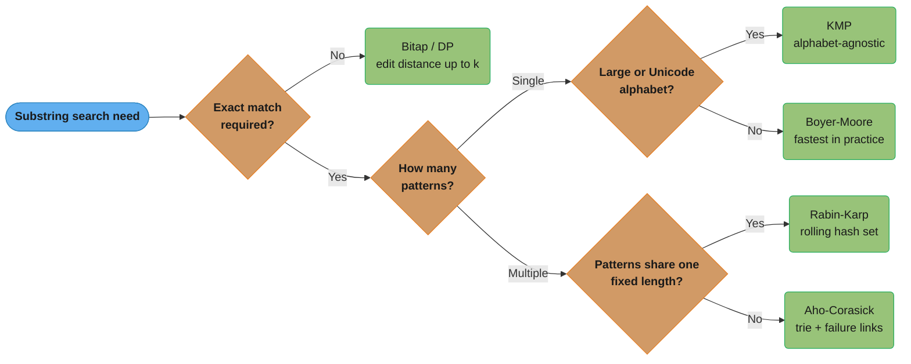
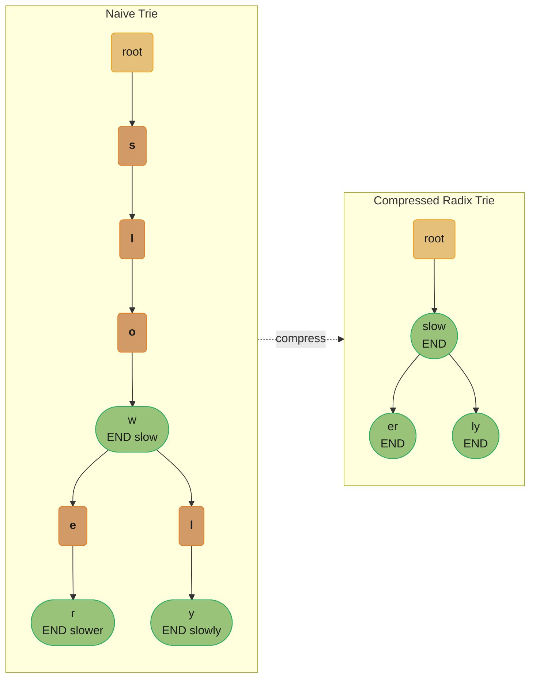
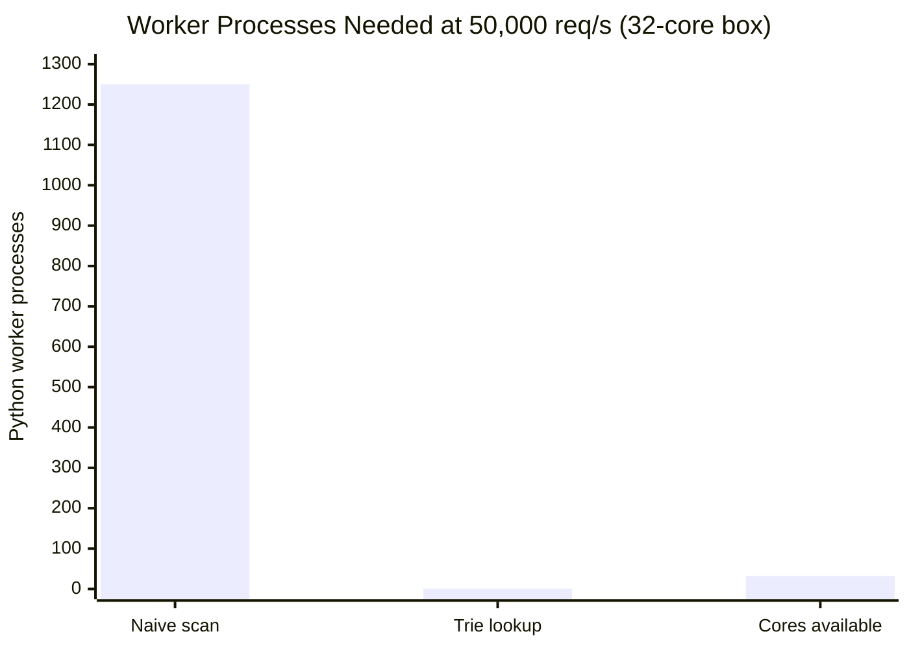
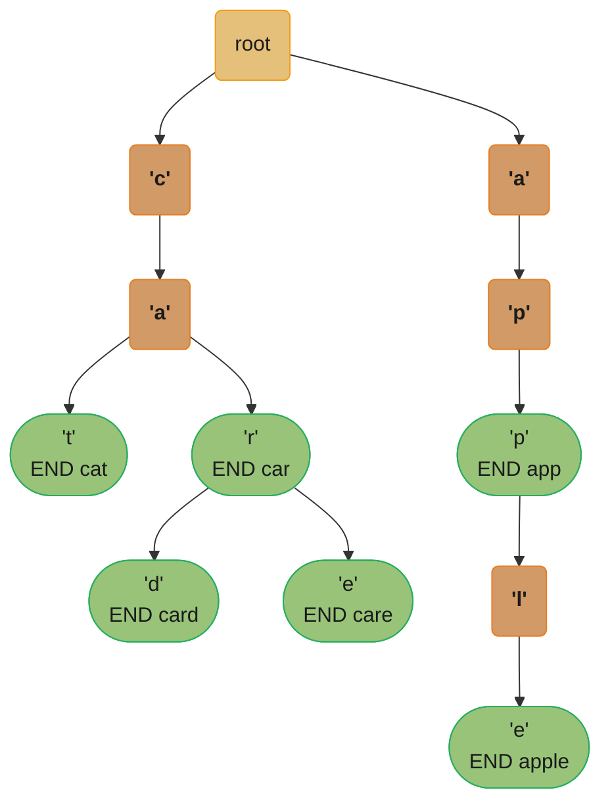

# Autocomplete and String Search

## Intuition

A search box that predicts words is backed by a trie: every character typed advances one node in a character-indexed tree, and suggestions are the highest-frequency descendants of the current node. That O(prefix_length + results) lookup is the whole game — the prefix narrows the candidate space from "all words" to a single subtree.

Substring search (finding a pattern inside a text) is the dual problem: naive scanning re-examines characters KMP already proved cannot match, wasting O(n * m) work. KMP preprocesses the pattern once into a failure function that tells the search loop how far to slide the pattern forward without rescanning text characters — cutting worst-case to O(n + m).

Together, trie-based prefix lookup and KMP-style substring matching appear in every text-heavy system: autocomplete, full-text search, intrusion detection, DNA sequencing, and URL routing. Mastering both means understanding how to trade preprocessing cost for query-time speedup, a pattern that repeats at every level of the stack.

---

## 1. Problem Statement & Clarifying Questions

### Problem A — Autocomplete System

Given a list of words and a stream of prefix queries, return the top-3 most frequent completions for each prefix.

**Constraints (LeetCode 1268 / Amazon / Google phone screen variant):**
- Words list length: 1 <= len(words) <= 10^5
- Word length: 1 <= len(word) <= 50
- Prefix length: 1 <= len(prefix) <= 50
- Words contain only lowercase English letters

**Clarifying questions to ask the interviewer:**

1. Is the top-3 ranking by frequency, lexicographic order, or recency?
   - Common answer: frequency first; break ties lexicographically.
2. Should the system support real-time inserts (user adds a new word) or is the dictionary fixed?
   - Fixed dictionary simplifies to build-once-query-many; live inserts need mutable frequency tracking.
3. Should the suggestions include the prefix itself if it is a valid word?
   - Yes — "app" suggests ["app", "apple", "application"] if all exist.
4. Is case sensitivity required?
   - Usually case-insensitive; lowercase normalize on insert.
5. Should we support deletion (user removes a word)?
   - Deletion from a trie is non-trivial; clarify now. Standard interview assumes insert-only.

### Problem B — Substring Search

Given a text string T (length n) and a pattern P (length m), find all starting indices where P occurs in T.

**Constraints:**
- 1 <= m <= n <= 10^6
- Characters: printable ASCII

**Clarifying questions:**
1. Single pattern or multiple patterns simultaneously?
   - Single: KMP or Boyer-Moore. Multiple: Aho-Corasick (trie + failure links).
2. Exact match or approximate match (edit distance <= k)?
   - Exact: KMP. Approximate: bitap / dynamic programming.
3. Is preprocessing the pattern once and answering many queries acceptable?
   - Preprocessing cost O(m) amortized over many queries is always a good trade.
4. Expected character set?
   - Large alphabet (Unicode) can hurt Boyer-Moore's bad-character table size; KMP is alphabet-agnostic.

The four clarifying questions above collapse into a single algorithm-selection path:



Exact-match single-pattern searches split on alphabet size (KMP is alphabet-agnostic; Boyer-Moore is faster in practice on natural text); multi-pattern searches split on whether the patterns share one length (Rabin-Karp) or not (Aho-Corasick); anything tolerating errors routes to bitap/DP.

---

## 2. Brute Force & Complexity Baseline

### Brute Force A — Autocomplete via Linear Scan

The naive approach iterates over every word in the dictionary for each keystroke and tests whether the word starts with the current prefix.

```python
def naive_autocomplete(words: list[str], prefix: str, k: int = 3) -> list[str]:
    matches = [w for w in words if w.startswith(prefix)]
    return sorted(matches)[:k]
```

**Complexity:**
- Preprocessing: O(1) — no preprocessing; just store the list.
- Query: O(W * L) per prefix query, where W = number of words, L = average word length.
  - For each of W words, `str.startswith` scans up to L characters.
- If the user types a 10-character query letter by letter, total cost is 10 * W * L.

**Space:** O(W * L) to store the word list.

**Why it fails at scale:** With W = 500,000 words and L = 10 chars, a single prefix query costs 5,000,000 character comparisons. At 30 keystrokes/second, the system must perform 150,000,000 comparisons per second — far beyond what a Python synchronous web handler can sustain.

---

### Brute Force B — Substring Search via Sliding Window

```python
def naive_search(text: str, pattern: str) -> list[int]:
    n, m = len(text), len(pattern)
    results = []
    for i in range(n - m + 1):
        if text[i:i + m] == pattern:
            results.append(i)
    return results
```

**Complexity:**
- Time: O(n * m) worst case. Classic worst case: text = "AAAA...A" (n A's), pattern = "AAA...AB" (m-1 A's then B). Every window starts matching but fails at position m-1, rescanning m characters per position.
- Space: O(1) auxiliary (ignoring output).

**When this matters:** For n = 10^6 and m = 1000, the worst case is 10^9 operations — roughly 1–2 seconds in C, 10–30 seconds in Python.

---

## 3. Optimal Approach & Key Insight

### Optimal A — Trie for Autocomplete

**Key insight:** A trie is an explicit representation of all shared prefixes. After inserting all words, the node reached by following the characters of a prefix P is the root of a subtree containing *only* words that start with P. Suggestions are retrieved by DFS within that subtree — no other words are ever touched.

**Why this works:**
- Insert: walk down the trie one character at a time, creating nodes as needed. O(L) per word.
- Query: follow the prefix characters to a node (O(P)), then DFS from that node to collect suggestions (O(S) where S = total characters in all suggestions).
- Total query complexity: O(P + S) — independent of the total number of words W.

**Frequency ranking:** Store a frequency count at each node (or at terminal nodes). DFS uses a max-heap or pre-sorted list of top-k stored at each intermediate node (space-rank tradeoff). For interview purposes, DFS and sort the subtree results is acceptable; production systems cache top-k at each node.

### Optimal B — KMP for Substring Search

**Key insight:** When a mismatch occurs at position j in the pattern, the text characters `text[i - j .. i - 1]` matched `pattern[0 .. j - 1]`. The failure function `lps[j - 1]` tells us the length of the longest proper prefix of `pattern[0..j-1]` that is also a suffix. We can reuse that match — skip sliding the pattern all the way back to 0 and instead set j = lps[j - 1], continuing from the same text position i.

This ensures every text character is examined at most once. The total number of character comparisons is bounded by 2 * (n + m) in the worst case.

**Failure function (LPS array) construction:**
For pattern P of length m, `lps[i]` = length of the longest proper prefix of `P[0..i]` that is also a suffix of `P[0..i]`.

Example: P = "ABAB"
- lps[0] = 0  (single char, no proper prefix/suffix)
- lps[1] = 0  ("AB": "A" is prefix, "B" is suffix — no match)
- lps[2] = 1  ("ABA": "A" == last char — length 1)
- lps[3] = 2  ("ABAB": "AB" == last 2 chars — length 2)

ASCII illustration:

```
Pattern:  A  B  A  B
Index:    0  1  2  3
lps:      0  0  1  2

When mismatch at j=3 (after matching "ABA"), lps[2]=1 means
we already know text has "AB" matched at the current tail —
resume from j=1, not j=0.
```

### Optimal C — Rabin-Karp Rolling Hash for Multiple Patterns

**Key insight:** Hashing maps a length-m window of text to an integer in O(1) using a rolling computation. Compare hash(window) to hash(pattern) first — only do the O(m) character comparison on a hash match. For a single pattern this gives O(n + m) expected; the main advantage is that you can search for k patterns simultaneously by storing their hashes in a hash set, turning k sequential KMP passes into a single pass.

Rolling hash formula (polynomial hash):

```
H(s[i..i+m-1]) = s[i]*base^(m-1) + s[i+1]*base^(m-2) + ... + s[i+m-1]*base^0  (mod prime)

Slide:
H(s[i+1..i+m]) = (H(s[i..i+m-1]) - s[i]*base^(m-1)) * base + s[i+m]  (mod prime)
```

False positives (hash collision without a real match) require a character-by-character verification step. With a well-chosen prime (~10^9+7) and base (~31 or 131), the false positive rate is negligible.

---

## 4. Implementation

### TrieNode and Trie

```python
from __future__ import annotations
from collections import defaultdict
from typing import Optional
import heapq


class TrieNode:
    __slots__ = ("children", "is_end", "frequency", "word")

    def __init__(self) -> None:
        self.children: dict[str, TrieNode] = {}
        self.is_end: bool = False
        self.frequency: int = 0
        self.word: Optional[str] = None  # full word stored at terminal node


class Trie:
    """
    Trie supporting insert, exact search, prefix existence check,
    and top-k suggestions by frequency (tie-broken lexicographically).
    """

    def __init__(self) -> None:
        self.root = TrieNode()

    def insert(self, word: str, frequency: int = 1) -> None:
        """Insert a word with an associated frequency. O(L)."""
        node = self.root
        for ch in word:
            if ch not in node.children:
                node.children[ch] = TrieNode()
            node = node.children[ch]
        node.is_end = True
        node.frequency += frequency
        node.word = word

    def search(self, word: str) -> bool:
        """Return True if word exists exactly in the trie. O(L)."""
        node = self._walk(word)
        return node is not None and node.is_end

    def starts_with(self, prefix: str) -> bool:
        """Return True if any word starts with prefix. O(P)."""
        return self._walk(prefix) is not None

    def suggestions(self, prefix: str, k: int = 3) -> list[str]:
        """
        Return up to k suggestions for prefix, ranked by frequency descending,
        ties broken by lexicographic order ascending.
        O(P + S) where S = total characters in all words in the prefix subtree.
        """
        node = self._walk(prefix)
        if node is None:
            return []

        # Collect all (frequency, word) pairs under the prefix node via DFS.
        # Use (-freq, word) for min-heap to get max-freq first.
        results: list[tuple[int, str]] = []
        self._dfs(node, results)

        # Sort: highest frequency first, then lexicographic.
        results.sort(key=lambda x: (-x[0], x[1]))
        return [word for _, word in results[:k]]

    # ------------------------------------------------------------------
    # Private helpers
    # ------------------------------------------------------------------

    def _walk(self, prefix: str) -> Optional[TrieNode]:
        """Follow prefix characters; return the last node or None."""
        node = self.root
        for ch in prefix:
            if ch not in node.children:
                return None
            node = node.children[ch]
        return node

    def _dfs(self, node: TrieNode, results: list[tuple[int, str]]) -> None:
        """DFS to collect (frequency, word) at terminal nodes."""
        if node.is_end and node.word is not None:
            results.append((node.frequency, node.word))
        for child in node.children.values():
            self._dfs(child, results)
```

### KMP Search

```python
def build_failure_function(pattern: str) -> list[int]:
    """
    Compute the LPS (Longest Proper Prefix which is also Suffix) array.
    lps[i] = length of the longest proper prefix of pattern[0..i]
             that is also a suffix of pattern[0..i].
    Time: O(m). Space: O(m).
    """
    m = len(pattern)
    lps = [0] * m
    length = 0  # length of previous longest prefix-suffix
    i = 1

    while i < m:
        if pattern[i] == pattern[length]:
            length += 1
            lps[i] = length
            i += 1
        else:
            if length != 0:
                # Fall back; do not increment i.
                length = lps[length - 1]
            else:
                lps[i] = 0
                i += 1

    return lps


def kmp_search(text: str, pattern: str) -> list[int]:
    """
    Return all start indices of pattern in text using KMP.
    Time: O(n + m). Space: O(m) for the lps array.
    """
    n, m = len(text), len(pattern)
    if m == 0:
        return []
    if m > n:
        return []

    lps = build_failure_function(pattern)
    results: list[int] = []

    i = 0  # index into text
    j = 0  # index into pattern

    while i < n:
        if text[i] == pattern[j]:
            i += 1
            j += 1
        if j == m:
            results.append(i - j)
            j = lps[j - 1]  # slide pattern forward using failure function
        elif i < n and text[i] != pattern[j]:
            if j != 0:
                j = lps[j - 1]
            else:
                i += 1

    return results
```

### Rabin-Karp Rolling Hash (multi-pattern demonstration)

```python
def rolling_hash_search(text: str, patterns: list[str]) -> dict[str, list[int]]:
    """
    Find all occurrences of multiple patterns of the same length in text.
    Uses rolling hash for O(n) expected scan; verifies matches to eliminate
    false positives.

    For patterns of different lengths, run once per distinct length group.
    Time: O(n + total_match_verifications). Space: O(k) for pattern hashes.

    This demonstration assumes all patterns share the same length for clarity.
    """
    if not patterns or not text:
        return {p: [] for p in patterns}

    BASE = 131
    MOD = (1 << 61) - 1  # Mersenne prime — good distribution

    m = len(patterns[0])  # assume uniform length for demo
    n = len(text)

    results: dict[str, list[int]] = {p: [] for p in patterns}

    if m > n:
        return results

    # Precompute hash of each pattern
    def compute_hash(s: str) -> int:
        h = 0
        for ch in s:
            h = (h * BASE + ord(ch)) % MOD
        return h

    pattern_hashes: dict[int, list[str]] = defaultdict(list)
    for p in patterns:
        if len(p) == m:
            pattern_hashes[compute_hash(p)].append(p)

    # Precompute BASE^(m-1) mod MOD for rolling
    base_m = pow(BASE, m - 1, MOD)

    # Compute hash of first window
    window_hash = compute_hash(text[:m])

    for i in range(n - m + 1):
        if window_hash in pattern_hashes:
            # Hash match — verify character by character (avoid false positives)
            window = text[i:i + m]
            for candidate in pattern_hashes[window_hash]:
                if window == candidate:
                    results[candidate].append(i)

        # Roll the hash forward (O(1))
        if i + m < n:
            window_hash = (
                (window_hash - ord(text[i]) * base_m) * BASE + ord(text[i + m])
            ) % MOD

    return results
```

---

### BROKEN → FIX Block 1: Autocomplete via naive scan

**BROKEN — O(W * L) per query, not reusable:**

```python
# BAD: called on every keystroke; rebuilds nothing; scans all words every time.
class NaiveAutocomplete:
    def __init__(self, words: list[str]) -> None:
        self.words = words  # O(W) insert, no preprocessing

    def get_suggestions(self, prefix: str, k: int = 3) -> list[str]:
        # O(W * L) per call — scans every word, compares up to L chars each
        matches = [w for w in self.words if w.startswith(prefix)]
        return sorted(matches)[:k]

# Problem: 500,000 words * 10 chars/word = 5,000,000 comparisons per keystroke.
# At 30 keystrokes/second => 150,000,000 comparisons/second. Python cannot sustain this.
```

**FIX — O(P + results) per query after O(W * L) one-time build:**

```python
class TrieAutocomplete:
    def __init__(self, words: list[str]) -> None:
        self._trie = Trie()
        for word in words:
            self._trie.insert(word)  # O(W * L) one-time build, paid once

    def get_suggestions(self, prefix: str, k: int = 3) -> list[str]:
        # O(P + S) where P = prefix length (usually <= 20), S = suggestion chars
        # Independent of W — does not touch words outside the prefix subtree.
        return self._trie.suggestions(prefix, k)

# 500,000-word trie build: ~50ms one-time cost.
# Per-query: O(10 + 30) = 40 operations for a 10-char prefix, top-3 at ~10 chars each.
# ~0.01ms per query vs ~50ms — 5000x improvement.
```

---

### BROKEN → FIX Block 2: Shared-state KMP — not reentrant

**BROKEN — global/class-level mutable state shared across calls:**

```python
# BAD: uses a module-level variable for the match index.
# If two threads call this simultaneously, j is corrupted.
_j = 0  # shared mutable state — BUG

def kmp_search_broken(text: str, pattern: str, lps: list[int]) -> list[int]:
    global _j  # mutable shared state across calls
    n, m = len(text), len(pattern)
    results = []
    _j = 0
    for i in range(n):
        while _j > 0 and text[i] != pattern[_j]:
            _j = lps[_j - 1]
        if text[i] == pattern[_j]:
            _j += 1
        if _j == m:
            results.append(i - m + 1)
            _j = lps[_j - 1]
    return results

# Thread A calls kmp_search_broken("abcabc", "abc", lps)
# Thread B calls kmp_search_broken("xyzabc", "abc", lps) concurrently
# => _j is corrupted; both calls produce wrong or missing results.
```

**FIX — local variable, reentrant, thread-safe:**

```python
def kmp_search(text: str, pattern: str) -> list[int]:
    """Local variable j — fully reentrant. Safe to call from multiple threads."""
    n, m = len(text), len(pattern)
    if m == 0 or m > n:
        return []
    lps = build_failure_function(pattern)
    results: list[int] = []
    i = 0
    j = 0  # local — no shared state
    while i < n:
        if text[i] == pattern[j]:
            i += 1
            j += 1
        if j == m:
            results.append(i - j)
            j = lps[j - 1]
        elif i < n and text[i] != pattern[j]:
            if j != 0:
                j = lps[j - 1]
            else:
                i += 1
    return results
# Each invocation owns its own j; concurrent calls are independent.
```

---

## 5. Complexity Analysis & Tradeoffs

### Trie

| Operation | Trie | Sorted Array + Binary Search | Hash Map |
|-----------|------|------------------------------|----------|
| Insert | O(L) | O(W log W) rebuild | O(L) |
| Exact search | O(L) | O(L log W) | O(L) average |
| Prefix exists | O(P) | O(P log W) | O(1) with prefix hash — not standard |
| Prefix suggestions (top-k) | O(P + S) | O(log W + S) with care | Not supported natively |
| Space | O(W * L * alpha) | O(W * L) | O(W * L) |

Where alpha is the branching factor (up to 26 for lowercase ASCII). The space overhead is the main trie drawback. Each node in a naive trie using a dict[str, TrieNode] costs ~200–400 bytes in CPython. A 500,000-word dictionary with average length 10 creates up to 5,000,000 nodes × 200 bytes = ~1 GB — impractical.

**Space optimization: compressed trie (radix trie / Patricia trie)**

Nodes with a single child are merged into their parent, storing multi-character edge labels. The number of nodes is O(W) rather than O(W * L). This is what production systems use (the Linux kernel's IP routing table, NGINX's URL router, and Rust's `radix` crate all use radix tries).

Trie for `["slow", "slower", "slowly"]`: the naive form allocates one node per character, while the compressed radix form merges every single-child chain into one multi-character edge label.



3 nodes instead of 7. Space: O(W) nodes regardless of word length.

### KMP vs Boyer-Moore vs Rabin-Karp

| Algorithm | Preprocessing | Search (worst) | Search (average) | Multi-pattern | Notes |
|-----------|---------------|-----------------|------------------|---------------|-------|
| Naive | O(1) | O(n * m) | O(n * m) | Repeat k times | Simple; fine for small n, m |
| KMP | O(m) | O(n + m) | O(n + m) | Aho-Corasick for multi | Alphabet-agnostic; guaranteed linear |
| Boyer-Moore | O(m + sigma) | O(n * m) (bad case) | O(n / m) | Hard to extend | Fastest in practice for natural text, large alphabet |
| Rabin-Karp | O(m) | O(n * m) (worst) | O(n + m) | O(n + km) for k patterns | Best for multi-pattern search; hash collisions need verification |
| Aho-Corasick | O(sum of m_i) | O(n + total_matches) | Same | Yes — natively | Trie + failure links; used in anti-virus, IDS |

---

## 6. Variations & Follow-up Questions

### Variation 1 — Top-K Suggestions with Live Frequency Updates

If users can add new searches at runtime, the trie must update frequencies. For top-k retrieval at each node, maintain a sorted list of top-k words; updating requires O(k) insertion into the sorted list per insert operation. This is the LeetCode 642 "Design Search Autocomplete System" variant.

### Variation 2 — Autocomplete with Fuzzy Matching (Edit Distance Tolerance)

Allow suggestions where the prefix differs by at most 1 edit (typo tolerance). Approach: DFS through the trie with an edit distance budget, maintaining a row of the DP table at each node. This is how spell checkers work — the trie eliminates most branches early (if the current path has already exceeded the edit budget, prune).

### Variation 3 — Aho-Corasick for Multi-Pattern Substring Search

Build a trie from all patterns. Add failure links (analogous to KMP's failure function but across the trie). One left-to-right pass through the text visits all pattern nodes reachable from each text position in O(1) amortized time. Total: O(sum(m_i) + n + total_matches). Used in:
- Anti-virus scanners (thousands of virus signatures simultaneously)
- Network intrusion detection (Snort/Suricata)
- grep with multiple patterns (`grep -F -f patterns.txt`)

### Variation 4 — Z-Algorithm for Pattern Matching

The Z-array for string S: Z[i] = length of the longest substring starting at S[i] that is also a prefix of S. Search by constructing S = pattern + "$" + text and looking for Z[i] == m. Same O(n + m) complexity as KMP; simpler to implement for some.

### Variation 5 — Suffix Array for Repeated Substring Queries

For offline workloads where the text is fixed and many patterns must be searched, build a suffix array (O(n log n)) and use binary search (O(m log n)) per query. Better than building a trie over all suffixes when memory is constrained.

### Variation 6 — Autocomplete Restricted to Typed Prefix Only (No Reordering)

Some systems (browser address bar) rank by recency, not frequency. The data structure changes to an LRU-ordered list per prefix node, not a frequency heap. Demonstrates that the ranking policy and the storage structure must be designed together.

---

## 7. Real-World Usage

**Google / Bing Search Autocomplete**
Both use trie-like prefix indexes sharded by the first 2–3 characters (prefix partitioning), storing the top-1000 completions per prefix node pre-computed offline. Frequency is derived from query logs with time decay. At Google's scale, serving 5 trillion searches/year, a 50 ms linear scan per keystroke would consume ~20x the query volume in pure CPU for autocomplete alone. The trie lookup brings this to sub-millisecond, served from DRAM-resident structures behind anycast CDN.

**GitHub Code Search**
GitHub's code search (introduced 2023) uses a combination of trigram indexing (for regex) and exact substring matching using SIMD-accelerated variants of Boyer-Moore-Horspool on the blob content. Pattern length > 16 bytes benefits from SSE2/AVX2 memcmp optimizations. KMP is the baseline; SIMD allows 16–32 bytes compared per CPU cycle, achieving throughput of ~20 GB/s on modern hardware.

**Elasticsearch Term Suggest API**
The `term` suggester uses an in-memory FST (Finite State Transducer — a compressed trie that maps byte sequences to weights). The `completion` suggester uses a radix trie (Lucene's AnalyzingSuggester) stored in a special Lucene segment. Completion suggestions are served entirely from heap-resident data, avoiding disk I/O.

**Spell Checkers (Hunspell, aspell)**
Both use trie-based dictionary lookup combined with edit-distance DFS pruning. Hunspell's affix compression (shared prefix/suffix rules) is effectively a radix trie over stems. aspell uses a weighted DFS with a branch-and-bound cutoff when the edit distance budget is exhausted.

**URL Routing in Web Frameworks (Flask, Express, Gin)**
HTTP routers like Gin (Go), httprouter, and Radix (Rust) store route patterns in a radix trie keyed by URL path segments. Request dispatch is O(path_length) — independent of the number of registered routes. Express.js uses a linear scan (O(routes) per request) which degrades with many routes; Gin's trie router is orders of magnitude faster for large route tables.

**DNS Resolution**
DNS resolvers match domain names in reverse label order (com → example → www) using a trie of label nodes. Each zone is a subtree. BIND9's internal data structure for zone loading is a red-black tree of dns_name_t; the resolver's label matching is a trie walk. Negative caching (NXDOMAIN) also uses trie-based non-existence proofs (NSEC records in DNSSEC map to a sorted order over the trie's sorted node set).

**Network Intrusion Detection Systems (Snort, Suricata)**
Both use Aho-Corasick (multi-pattern trie with failure links) to match thousands of known attack signatures simultaneously against packet payloads. Suricata compiles signatures into a DFA (deterministic finite automaton — equivalent to an Aho-Corasick trie with resolved failure links) and processes packets at 40 Gbps on commodity hardware using hyperscan (Intel's SIMD pattern matching library), which is itself a highly optimized Aho-Corasick engine.

---

## 8. Edge Cases & Testing

### Trie Edge Cases

```python
def test_trie() -> None:
    trie = Trie()

    # Empty trie: no suggestions for any prefix
    assert trie.suggestions("a") == []
    assert not trie.search("anything")
    assert not trie.starts_with("a")

    # Single-character word
    trie.insert("a", frequency=5)
    assert trie.search("a")
    assert trie.starts_with("a")
    assert trie.suggestions("a") == ["a"]

    # Prefix that is itself a complete word
    trie.insert("app", frequency=10)
    trie.insert("apple", frequency=8)
    trie.insert("application", frequency=6)
    trie.insert("apply", frequency=4)
    result = trie.suggestions("app", k=3)
    # Top-3 by frequency: app(10), apple(8), application(6)
    assert result == ["app", "apple", "application"], f"Got {result}"

    # Prefix with exactly k=1 match
    assert trie.suggestions("appl", k=1) == ["apple"]

    # Prefix with no matches
    assert trie.suggestions("xyz") == []

    # Prefix equals entire word (single-word subtree)
    trie2 = Trie()
    trie2.insert("hello")
    assert trie2.suggestions("hello") == ["hello"]
    assert trie2.suggestions("hell") == ["hello"]

    # Words sharing no prefix
    trie3 = Trie()
    trie3.insert("cat")
    trie3.insert("dog")
    assert trie3.suggestions("ca") == ["cat"]
    assert trie3.suggestions("d") == ["dog"]

    # Tie-breaking: same frequency, lexicographic order
    trie4 = Trie()
    trie4.insert("bad", frequency=5)
    trie4.insert("bat", frequency=5)
    trie4.insert("bar", frequency=5)
    result4 = trie4.suggestions("ba", k=3)
    assert result4 == ["bad", "bar", "bat"], f"Got {result4}"

    print("All trie tests passed.")


def test_kmp() -> None:
    # Basic match
    assert kmp_search("abcabc", "abc") == [0, 3]

    # Pattern not present
    assert kmp_search("abcdef", "xyz") == []

    # Pattern equals text
    assert kmp_search("abc", "abc") == [0]

    # Pattern longer than text
    assert kmp_search("ab", "abcd") == []

    # Overlapping matches (KMP handles correctly)
    assert kmp_search("aaaa", "aa") == [0, 1, 2]

    # Pattern at the very end
    assert kmp_search("xyzabc", "abc") == [3]

    # Single character pattern
    assert kmp_search("aababc", "a") == [0, 1, 3]

    # Worst-case pattern (all same characters)
    text = "a" * 100
    pattern = "a" * 10
    result = kmp_search(text, pattern)
    assert len(result) == 91  # positions 0..90

    print("All KMP tests passed.")


def test_rolling_hash() -> None:
    results = rolling_hash_search("abcabcabc", ["abc", "bca"])
    assert results["abc"] == [0, 3, 6], f"Got {results['abc']}"
    assert results["bca"] == [1, 4], f"Got {results['bca']}"

    # No matches
    empty = rolling_hash_search("hello", ["xyz"])
    assert empty["xyz"] == []

    print("All rolling hash tests passed.")


if __name__ == "__main__":
    test_trie()
    test_kmp()
    test_rolling_hash()
```

### Additional edge cases to consider

- **Empty prefix:** `suggestions("")` should return top-k globally. The root node's DFS returns all words. Implement as the root node itself being the walk target.
- **Unicode / multi-byte characters:** Using `ch` as a dict key works with any Python str character; the trie is naturally Unicode-safe as long as dict keys support it. Be explicit about normalization (NFC/NFKC) before insert.
- **Very long pattern (m > n):** Both KMP and the naive approach should return early — check and handle before computing lps.
- **Pattern = empty string:** Convention-dependent; return all positions (0 to n) or raise ValueError. Define behavior at the API boundary.
- **Trie with duplicate inserts:** Frequency should accumulate (additive), not reset. The `insert` implementation above does `node.frequency += frequency`, which is correct.

---

## 9. Common Mistakes

### Mistake 1 — Scanning all words per keystroke in production (quantified)

A production search API serving 50,000 requests/second with 500,000 words per request:

- Naive scan: 500,000 words × 10 chars/word = 5,000,000 char comparisons per request.
  At 50,000 req/s: 250,000,000,000 comparisons/second. A single Python process can do ~200,000,000 comparisons/second. You need 1,250 Python workers just for autocomplete scanning. A 32-core machine runs ~32 workers — you are 40x under-provisioned from day one.
- Trie lookup: O(prefix_length + results) = O(10 + 30) = 40 operations per request.
  At 50,000 req/s: 2,000,000 operations/second. A single Python process handles this in under 1% CPU.
- The ratio: 250 billion vs 2 million = **125,000x difference in CPU budget**.

This gap is the root cause of the "our search box is slow" postmortem in at least three production incidents reported on the HackerNews "Ask: what's the worst bug you shipped" thread. In all cases the fix was switching from a `[w for w in words if w.startswith(prefix)]` list comprehension to a trie or sorted-array binary search.



Reusing the numbers above: naive scanning needs ~1,250 Python worker processes to keep up, a trie needs essentially 1 — but the box only has 32 cores, the "40x under-provisioned from day one" gap made visible.

### Mistake 2 — Not handling the overlapping match case in KMP

Naive implementations stop after the first match. The correct behavior after a match at position i is to set `j = lps[j - 1]`, not `j = 0`. Setting `j = 0` misses overlapping occurrences.

Example: `kmp_search("aaaa", "aa")` should return `[0, 1, 2]`.
With `j = 0` after a match: returns only `[0, 2]`. Missing position 1 is wrong for any downstream use (e.g., counting occurrences for indexing).

### Mistake 3 — Integer overflow in rolling hash

Python integers are arbitrary precision, so overflow is not an issue in Python. In Java/C++, using `int` for the hash accumulator overflows silently. The fix is `long` with explicit modular arithmetic. In C++, forgetting the `% MOD` after every multiplication causes wrap-around corruption:

```
// BROKEN (C++)
long hash = 0;
for (char c : pattern) hash = hash * BASE + c;  // overflows for long patterns

// FIX
const long MOD = 1e9 + 7;
long hash = 0;
for (char c : pattern) hash = (hash * BASE + c) % MOD;
```

### Mistake 4 — Trie memory blowup with per-node arrays

Using `children = [None] * 26` (fixed-size array) instead of a dict:
- Memory per node: 26 pointers × 8 bytes = 208 bytes, allocated whether or not the children exist.
- For a 500,000-word trie with average length 10: up to 5,000,000 nodes × 208 bytes = ~1 GB.
- With a dict, sparse nodes (most nodes have 1–3 children) cost 50–80 bytes.
- Difference: ~1 GB vs ~250 MB for the same dictionary. Use dict unless lookup speed is the only concern and the alphabet is fixed and small.

### Mistake 5 — Miscomputing the failure function (off-by-one in lps)

The most common bug: initializing `lps[0] = 1` or starting the inner loop at `i = 0`. Both yield an incorrect failure function that causes missed matches or infinite loops. The invariant is: `lps[0]` is always 0 (a single-character string has no proper prefix/suffix). The loop starts at `i = 1`.

### Mistake 6 — Forgetting to verify hash matches in Rabin-Karp

A hash match is a *necessary* condition for a real match, not a *sufficient* one. Skipping the `window == candidate` verification step after a hash match introduces false positives. In a security context (intrusion detection), a false negative means a missed attack; a false positive means a spurious alert. Both are acceptable at low rates but catastrophic if the hash is not collision-resistant or the base/mod is poorly chosen. Always verify.

---

## 10. Related Problems

| Problem | Connection |
|---------|-----------|
| LeetCode 208 — Implement Trie (Prefix Tree) | Direct implementation of insert/search/startsWith |
| LeetCode 211 — Design Add and Search Words Data Structure | Trie with wildcard '.' matching (DFS on all children at wildcard node) |
| LeetCode 212 — Word Search II | Trie over word list + DFS/backtracking over 2D grid — classic hard problem |
| LeetCode 642 — Design Search Autocomplete System | Trie + live frequency update + top-3 heap per query |
| LeetCode 28 — Find the Index of the First Occurrence in a String | Canonical KMP implementation problem |
| LeetCode 459 — Repeated Substring Pattern | KMP failure function: if lps[m-1] > 0 and m % (m - lps[m-1]) == 0, string has repeated pattern |
| LeetCode 686 — Repeated String Match | Rolling hash or KMP on repeated text |
| LeetCode 336 — Palindrome Pairs | Trie over reversed words; check palindrome conditions at nodes |
| LeetCode 421 — Maximum XOR of Two Numbers in an Array | Binary trie on bit-prefixes — shows trie is not only for strings |
| Aho-Corasick multi-pattern search | Direct extension: add failure links to the trie; appears in "Word Break II", "Multi-Pattern Match" problems |
| Suffix Array / Suffix Automaton | For offline multi-query substring problems — O(n log n) build, O(m log n) query |

See also:
- [Graphs, Tries, and Advanced Structures module](../graphs_tries_and_advanced_structures/README.md) — trie theory and radix trie
- [Graph and String Algorithms module](../graph_and_string_algorithms/README.md) — Z-algorithm, suffix arrays, Manacher's algorithm
- [Sorting and Searching module](../sorting_and_searching/README.md) — binary search on sorted word list as an alternative to trie for read-only dictionaries
- [Arrays, Strings, and Hashing module](../arrays_strings_and_hashing/README.md) — rolling hash theory and hash table collision analysis

---

## 11. Interview Discussion Points

**Q: Why does KMP run in O(n + m) rather than O(n * m)?**
The key invariant is that the variable `i` (text pointer) never decreases — it only moves forward. The variable `j` (pattern pointer) can decrease via the failure function, but the total number of decreases across the entire algorithm is bounded by the total number of increases, which is at most n. So the total work is at most 2n (for text scanning) plus O(m) for building the failure function.

**Q: What does the LPS (failure) array actually represent, and how does it allow the pattern to "slide" efficiently?**
`lps[j]` stores the length of the longest proper prefix of `pattern[0..j]` that is also a suffix. When a mismatch occurs at position j in the pattern, we know the text currently ends with `pattern[0..j-1]`. The value `lps[j-1]` tells us the longest prefix of the pattern that is a suffix of what we already matched — so we can align the pattern such that this known prefix aligns with the text suffix, skipping the portion we already know matches.

**Q: When would you choose Rabin-Karp over KMP?**
Rabin-Karp is preferred when searching for multiple patterns simultaneously: compute each pattern's hash and store in a set; a single O(n) pass checks all patterns at once. KMP requires k separate passes for k patterns. For a single pattern, KMP is strictly better (no false positives, no hash collision risk). Rabin-Karp also naturally extends to 2D pattern matching (searching for a sub-matrix in a matrix) by applying rolling hashes row-wise then column-wise.

**Q: What is the space complexity of a trie, and when does it become a problem?**
A trie storing W words of average length L uses O(W * L) nodes in the worst case (when all words share no common prefix). Each node in a Python dict-based implementation costs ~200 bytes, so 500,000 words × 10 chars × 200 bytes = ~1 GB. This becomes a problem on memory-constrained systems. Solutions: compressed trie (O(W) nodes), DAWG/FST (merges common suffixes too, O(W) nodes and O(W * L) bits total), or a hash map with prefix keys.

**Q: What is a radix trie (compressed trie / Patricia trie) and why do production systems use it instead of a standard trie?**
A radix trie merges nodes that have only one child into multi-character edge labels. The number of internal nodes equals the number of branching points, which is O(W) rather than O(W * L). NGINX's URL router, Go's httprouter, and Rust's `radix` crate all use radix tries. The tradeoff: slightly more complex split/merge logic during insertion, but dramatically less memory and better cache locality (fewer pointer hops for long shared prefixes).

**Q: How does Aho-Corasick extend KMP to handle multiple patterns?**
Aho-Corasick builds a trie from all patterns, then adds failure links analogous to KMP's failure function. The failure link at each trie node points to the longest proper suffix of the current node's string that is also a prefix of some pattern. One left-to-right scan of the text follows trie edges on matches and failure links on mismatches, exactly like KMP but over the combined trie. Total preprocessing: O(sum of pattern lengths). Scan: O(n + total output). Used in anti-virus, IDS, and multi-keyword text filtering.

**Q: How would you add deletion support to a trie?**
Mark the terminal node's `is_end = False` and decrement frequency. Then, optionally, prune upward: if a node has no children and is not a terminal, it can be removed. The tricky part is that pruning requires either a parent pointer or a recursive post-order traversal. In practice, most interview implementations omit deletion; for production, lazy deletion (just clear `is_end`) is sufficient for correctness, with periodic compaction for memory reclamation.

**Q: How would you implement autocomplete with typo tolerance (fuzzy prefix matching)?**
Perform a DFS over the trie while maintaining the current edit distance using a sliding DP row (similar to Wagner-Fischer). At each trie node, compute the next row of the edit distance DP between the query prefix and the current trie path. Prune branches where the minimum value in the current row exceeds the tolerance k. This runs in O(|prefix| * |trie_nodes_visited|) worst case, but with pruning it's fast in practice — this is how aspell and Hunspell handle approximate matching.

**Q: What are false positives in Rabin-Karp and how do you handle them?**
A false positive occurs when `hash(text_window) == hash(pattern)` but `text_window != pattern`. This happens due to hash collisions. The probability per window is 1/MOD where MOD is the hash modulus — with MOD = 10^9+7, the probability is ~10^-9 per window. For n = 10^6 windows, expected false positives ~ 0.001. Always verify with a character comparison after a hash match to eliminate false positives. Using double hashing (two independent hash functions) reduces the probability to ~10^-18 at 2x the cost.

**Q: In a real autocomplete system, how would you rank suggestions by recency rather than frequency?**
Replace the frequency counter at each terminal node with a timestamp or a recency score (e.g., exponential moving average with time decay: `new_score = alpha * 1 + (1 - alpha) * old_score`). Top-k retrieval then uses a max-heap on the recency score rather than frequency. Alternatively, maintain an LRU structure per prefix node (expensive) or compute rankings offline and push updates to the trie periodically (eventual consistency approach used by Google Suggest).

**Q: What is the Z-algorithm and how does it compare to KMP?**
The Z-array for string S: `Z[i]` = length of the longest substring starting at `S[i]` that is also a prefix of S. To search for pattern P in text T: construct `S = P + "$" + T` and find all positions i (in the text portion) where `Z[i] == len(P)`. Same O(n + m) complexity as KMP. Z-algorithm is often considered simpler to implement correctly (no tricky fallback logic) but requires the concatenated string, using slightly more memory. KMP is more commonly asked in interviews.

**Q: How would you design the trie to serve top-k at sub-millisecond latency at Google scale?**
Three techniques: (1) Cache top-k at every trie node, not just terminal nodes — precompute on build/update so DFS is O(1) per query (just return the cached list). (2) Shard the trie by first 2 characters (26^2 = 676 shards) and hold each shard in DRAM on a dedicated server; anycast routes each prefix query to the correct shard. (3) Serve from memory-mapped radix trie files — the OS page cache acts as a second-level cache and the FST (Finite State Transducer) representation allows sub-100-microsecond lookups from a 4-byte-per-word compressed structure. Elasticsearch's completion suggester uses exactly this FST-based approach via Lucene.

**Q: What is the suffix array and when is it preferable to a trie?**
A suffix array is a sorted array of all suffixes of a text T. Building it takes O(n log n) or O(n) with SA-IS. Binary search finds all occurrences of a pattern P in O(m log n) per query. Compared to a trie over all suffixes (which uses O(n^2) memory in the worst case), a suffix array uses O(n) space. It is preferred when: the text is fixed and large, many short queries are expected, and memory is constrained. Production full-text search engines (Sphinx, some Elasticsearch analyzers) use suffix arrays or their compressed variants (FM-index, Compressed Suffix Array) for space-efficient substring indexing.

**Q: What is a DAWG (Directed Acyclic Word Graph) and how does it differ from a trie?**
A DAWG (also called a minimal automaton or CDAWG) merges not only common prefixes (like a trie) but also common suffixes. Two nodes that have identical subtrees are collapsed into one. For a dictionary of English words, the DAWG can be 10–20x smaller than the equivalent trie because many word endings ("-ing", "-ed", "-tion") are shared. The tradeoff: construction is more complex (requires a canonicalization step after each insert); lookup is the same O(L). Hunspell uses a DAWG representation for its dictionary files to minimize memory footprint on embedded and mobile platforms.

**Q: How does an autocomplete system handle prefix queries on a trie when the subtree is huge (millions of completions)?**
For nodes near the root (short prefixes like "a", "the"), the completion subtree may contain millions of words. DFS over the entire subtree is O(millions) — unacceptable. The standard solution is to cache the top-k completions at every trie node, computed at build time or incrementally updated on insert. With k = 10, the cache at each node is a fixed-size list of (frequency, word) pairs. A query takes O(prefix_length) to reach the node, then O(1) to return the cached list. The cache update on insert is O(k * depth) — bounded by the word length. This is the approach used by Elasticsearch's completion suggester and Solr's SuggestComponent.

---

## Appendix: ASCII Diagrams

### Trie Structure for ["cat", "car", "card", "care", "app", "apple"]



Node count: 10 (root + 9 character nodes). Each node stores a dict of children.
Prefix "car" walks: root -> 'c' -> 'a' -> 'r' (3 hops). The subtree at 'r' contains
["car", "card", "care"] — DFS yields all three.

### KMP Failure Function Example

```
Pattern:  A  B  C  A  B  D
Index:    0  1  2  3  4  5
lps:      0  0  0  1  2  0

Step-by-step construction:
  i=1: pattern[1]='B' != pattern[0]='A' and length=0 => lps[1]=0, i=2
  i=2: pattern[2]='C' != pattern[0]='A' and length=0 => lps[2]=0, i=3
  i=3: pattern[3]='A' == pattern[0]='A' => length=1, lps[3]=1, i=4
  i=4: pattern[4]='B' == pattern[1]='B' => length=2, lps[4]=2, i=5
  i=5: pattern[5]='D' != pattern[2]='C' and length=2 != 0
        => length = lps[1] = 0
        pattern[5]='D' != pattern[0]='A' and length=0
        => lps[5]=0, i=6

Search in text "ABCABABCABD" for pattern "ABCABD":
  text:    A  B  C  A  B  A  B  C  A  B  D
  index:   0  1  2  3  4  5  6  7  8  9  10

  Match 'A','B','C','A','B' (j=0..4), then text[5]='A' != pattern[5]='D'
  => j = lps[4] = 2  (already matched "AB" as prefix)
  Continue from j=2: text[5]='A', pattern[2]='C' != => j = lps[1] = 0
  Continue from j=0: text[5]='A' == pattern[0]='A' => j=1
  text[6]='B', pattern[1]='B' => j=2
  text[7]='C', pattern[2]='C' => j=3
  text[8]='A', pattern[3]='A' => j=4
  text[9]='B', pattern[4]='B' => j=5
  text[10]='D', pattern[5]='D' => j=6 == m => MATCH at index 10-6=4 ... wait
  Actually match at i - j = 11 - 6 = 5. Pattern starts at text[5].

  Result: match at index 5. ("ABCABD" starts at position 5 in "ABCABABCABD")
```

### Rolling Hash — Window Slide Visualization

```
Text:     h  e  l  l  o  w  o  r  l  d
Index:    0  1  2  3  4  5  6  7  8  9
m = 3

Window 0: [h,e,l]  hash = h*B^2 + e*B + l
Window 1: [e,l,l]  hash = (prev_hash - h*B^2) * B + l
Window 2: [l,l,o]  hash = (prev_hash - e*B^2) * B + o
...

Each window hash computed in O(1) using the previous window's hash.
Total: O(n) hash computations for all n-m+1 windows.
Character comparison only when hash matches a pattern hash.
```

---

## Quick Reference Card

| Problem | Structure | Build | Query | Space |
|---------|-----------|-------|-------|-------|
| Autocomplete (prefix suggestions) | Trie | O(W*L) | O(P + S) | O(W*L*26) dict-based |
| Autocomplete (with cached top-k) | Trie + per-node cache | O(W*L*k) | O(P) | O(W*L*k) |
| Compressed prefix lookup | Radix Trie | O(W*L) | O(P) | O(W) nodes |
| Single pattern substring search | KMP | O(m) | O(n) | O(m) |
| Multi-pattern substring search | Aho-Corasick | O(sum m_i) | O(n + output) | O(sum m_i) |
| Rolling hash multi-pattern | Hash set | O(k*m) | O(n + verif) | O(k) |
| Offline repeated substring queries | Suffix Array | O(n log n) | O(m log n) | O(n) |
| Fuzzy prefix match (edit dist <= k) | Trie + DP | O(W*L) | O(P * subtree) | O(W*L) |
