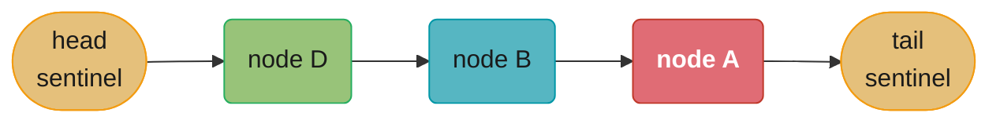
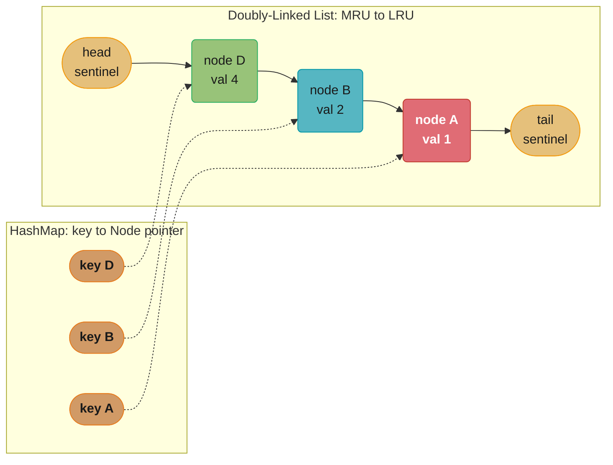
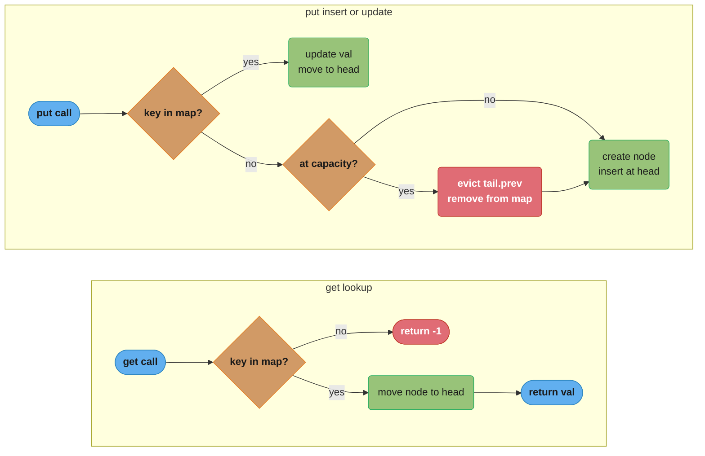
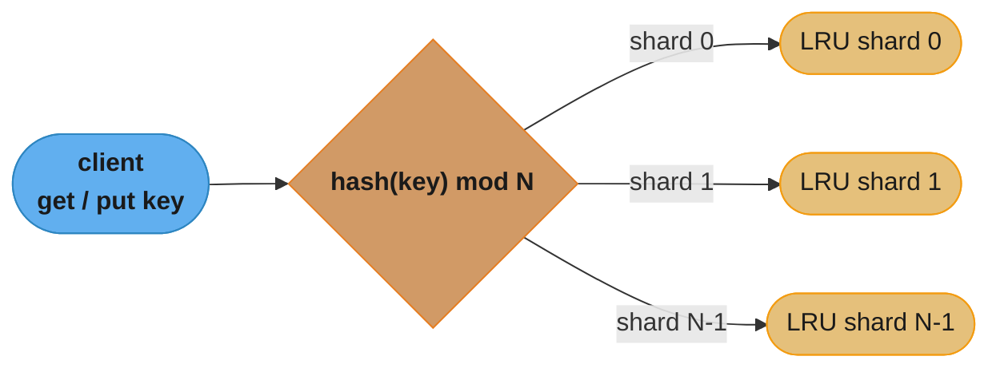

# Design an LRU Cache

**Difficulty**: Medium-Hard (Senior Engineer Bar)
**Interview frequency**: Very High — appears in FAANG, MANGA, unicorn on-site rounds
**Tags**: data-structures, hash-map, doubly-linked-list, design, concurrency

---

## Intuition

A cache is a fast, bounded store. When it is full and a new item must be inserted, something must be evicted. LRU (Least Recently Used) evicts the item that was accessed least recently — the intuition is that temporal locality predicts future use: if you have not touched something in a while, you are least likely to need it soon. The hard engineering constraint is that both `get` and `put` must run in O(1) time. A naive list keeps order but scans in O(n); a hash map gives O(1) lookup but has no order. The insight: combine them. A hash map tracks where each node lives; a doubly-linked list maintains access order. Together they give O(1) for every operation.

---

## 1. Problem Statement & Clarifying Questions

### Problem Statement

Design a data structure that implements a Least Recently Used (LRU) cache with the following interface:

```
LRUCache(capacity: int)   — initialize the cache with a positive capacity
get(key: int) -> int      — return the value of the key if it exists, else return -1
                            accessing a key marks it as recently used
put(key: int, value: int) — insert or update the key-value pair
                            if capacity is exceeded, evict the least recently used key
```

**Complexity target**: `get` and `put` must both run in O(1) average time.

This is LeetCode 146 (Hard) and is a near-universal senior-engineer interview question.

---

### Clarifying Questions You Must Ask (and sample answers)

**Q: What are the key and value types?**
A (typical): Integers. But in a real system they are often `str` → `Any`. The algorithm is identical.

**Q: What is the capacity range?**
A: 1 to 3000 for LeetCode. In a real cache, hundreds of thousands to millions. This matters for your complexity argument.

**Q: What should `get` return for a missing key?**
A: Return -1 (LeetCode convention). In production you might return `None` or raise `KeyError`.

**Q: Is the cache single-threaded or do multiple threads call get/put concurrently?**
A: Start single-threaded. A common follow-up is: make it thread-safe.

**Q: Does `put` on an existing key update the value and move it to most-recently-used?**
A: Yes. Every `put` — whether insert or update — makes that key the most recently used.

**Q: Does `get` update recency?**
A: Yes. Reading a key counts as using it.

**Q: Are there constraints on memory beyond the capacity?**
A: No. You can use any auxiliary structures you need.

**Q: Should eviction be synchronous (in the same `put` call)?**
A: Yes. By the time `put` returns, the eviction has already happened.

---

## 2. Brute Force & Complexity Baseline

### Approach 1: Unsorted List + HashMap

Keep a list of `(key, timestamp)` pairs sorted by insertion order. The hash map stores key → value. On `get`, scan the list to find the key and update its timestamp. On `put`, if at capacity, scan the list to find the minimum timestamp (LRU entry) and remove it.

```python
import time
from typing import Optional

class LRUCacheBrute:
    def __init__(self, capacity: int) -> None:
        self.capacity = capacity
        self.data: dict[int, int] = {}
        self.order: list[tuple[float, int]] = []  # (timestamp, key)

    def get(self, key: int) -> int:
        if key not in self.data:
            return -1
        # O(n): scan to remove old entry, append new
        self.order = [(ts, k) for ts, k in self.order if k != key]
        self.order.append((time.time(), key))
        return self.data[key]

    def put(self, key: int, value: int) -> None:
        if key in self.data:
            self.order = [(ts, k) for ts, k in self.order if k != key]
        elif len(self.data) >= self.capacity:
            # O(n): find minimum timestamp → LRU entry
            self.order.sort()
            _, lru_key = self.order.pop(0)
            del self.data[lru_key]
        self.data[key] = value
        self.order.append((time.time(), key))
```

**Why this is wrong at scale:**
- `get`: O(n) list comprehension to find and remove the key
- `put`: O(n log n) sort or O(n) linear scan to find LRU
- Memory: O(n) list plus O(n) dict = acceptable, but CPU is not

**Complexity:**

| Operation | Time    | Space |
|-----------|---------|-------|
| `get`     | O(n)    | O(n)  |
| `put`     | O(n)    | O(n)  |

At 100K entries and 10K QPS, this becomes untenable (see §9 for a production war story).

---

### Approach 2: Python `list` with `index()` + `pop()`

A slightly different naive approach sometimes seen in interviews: maintain a list of keys in LRU order, `list[0]` = LRU, `list[-1]` = MRU.

```python
class LRUCacheList:
    def __init__(self, capacity: int) -> None:
        self.capacity = capacity
        self.cache: dict[int, int] = {}
        self.order: list[int] = []

    def get(self, key: int) -> int:
        if key not in self.cache:
            return -1
        self.order.remove(key)   # O(n) scan
        self.order.append(key)   # O(1)
        return self.cache[key]

    def put(self, key: int, value: int) -> None:
        if key in self.cache:
            self.order.remove(key)   # O(n)
        elif len(self.cache) >= self.capacity:
            lru = self.order.pop(0)  # O(n) — shifting list
            del self.cache[lru]
        self.cache[key] = value
        self.order.append(key)
```

Still O(n) per operation. `list.remove()` is O(n); `list.pop(0)` is O(n) because Python lists are backed by arrays and shifting is required.

---

## 3. Optimal Approach & Key Insight

### Key Insight

We need two things simultaneously:
1. O(1) lookup: "Is key K in the cache? What is its value?"
2. O(1) order maintenance: "Move K to the most-recently-used position. Remove the least-recently-used entry."

No single data structure gives both. The combination does:
- **HashMap** (`key → Node`): O(1) lookup, insert, delete by key
- **Doubly-Linked List**: O(1) move-to-front and remove-from-tail — if you already have a pointer to the node. The hash map provides that pointer.

The doubly-linked list is ordered by recency: head ↔ most recently used; tail ↔ least recently used. Every access promotes the node to the head. Every eviction removes from the tail.

### Sentinel / Dummy Nodes

Instead of handling null-pointer edge cases on every insert/remove, use two sentinel (dummy) nodes: `head` and `tail`. The real data lives between them. This eliminates all conditional logic in `_add` and `_remove`.


*Green sits next to head (most recently used); red sits next to tail (least recently used) — the next eviction target.*

After `get(B)` — B becomes MRU:


After `put(D)` when at capacity — C (LRU = tail.prev) is evicted, D inserted at head:


### ASCII Diagram: HashMap + Doubly-Linked List



`head.next` is the MRU node (green); `tail.prev` is the LRU node (red) — the next eviction target. HashMap entries (orange) hold O(1) pointers straight to their list node, shown as dotted references, so both `get` and `put` never scan.

### Algorithm

**`get(key)`**:
1. If key not in map → return -1
2. Move node to head (most recently used)
3. Return node.val

**`put(key, value)`**:
1. If key in map → update node.val, move to head
2. Else:
   a. If len == capacity → remove `tail.prev` from list, remove its key from map
   b. Create new node, insert at head, add to map



`get` is a hit-or-miss branch that promotes the node on success; `put` branches on whether the key already exists, then on whether the cache is full, before it ever touches the list — eviction (red) fires only on the insert path once the cache is at capacity.

---

## 4. Implementation

### Clean O(1) Implementation

```python
from __future__ import annotations
from typing import Optional


class Node:
    """A node in the doubly-linked list."""

    __slots__ = ("key", "val", "prev", "next")

    def __init__(self, key: int = 0, val: int = 0) -> None:
        self.key: int = key
        self.val: int = val
        self.prev: Optional[Node] = None
        self.next: Optional[Node] = None


class LRUCache:
    """
    O(1) LRU Cache using a HashMap + Doubly-Linked List.

    Invariant: self.head.next = MRU node, self.tail.prev = LRU node.
    Sentinel head and tail eliminate null-pointer edge cases.
    """

    def __init__(self, capacity: int) -> None:
        if capacity <= 0:
            raise ValueError(f"capacity must be positive, got {capacity}")
        self.capacity = capacity
        self.map: dict[int, Node] = {}

        # sentinel nodes — never hold real data
        self.head = Node()  # MRU side
        self.tail = Node()  # LRU side
        self.head.next = self.tail
        self.tail.prev = self.head

    # ------------------------------------------------------------------
    # Private helpers
    # ------------------------------------------------------------------

    def _remove(self, node: Node) -> None:
        """Unlink node from its current position. O(1)."""
        prev = node.prev
        nxt = node.next
        prev.next = nxt   # type: ignore[union-attr]
        nxt.prev = prev   # type: ignore[union-attr]

    def _add_to_front(self, node: Node) -> None:
        """Insert node immediately after head (MRU position). O(1)."""
        node.prev = self.head
        node.next = self.head.next
        self.head.next.prev = node  # type: ignore[union-attr]
        self.head.next = node

    # ------------------------------------------------------------------
    # Public API
    # ------------------------------------------------------------------

    def get(self, key: int) -> int:
        """Return value for key, or -1 if absent. Marks key as MRU."""
        if key not in self.map:
            return -1
        node = self.map[key]
        self._remove(node)
        self._add_to_front(node)
        return node.val

    def put(self, key: int, value: int) -> None:
        """Insert or update key. Evicts LRU entry if over capacity."""
        if key in self.map:
            node = self.map[key]
            node.val = value
            self._remove(node)
            self._add_to_front(node)
        else:
            if len(self.map) == self.capacity:
                lru = self.tail.prev          # LRU node
                self._remove(lru)             # type: ignore[arg-type]
                del self.map[lru.key]         # type: ignore[union-attr]
            new_node = Node(key, value)
            self._add_to_front(new_node)
            self.map[key] = new_node

    def __len__(self) -> int:
        return len(self.map)

    def __repr__(self) -> str:
        """Return MRU → LRU key order for debugging."""
        keys = []
        cur = self.head.next
        while cur is not self.tail:
            keys.append(cur.key)  # type: ignore[union-attr]
            cur = cur.next        # type: ignore[union-attr]
        return f"LRUCache(capacity={self.capacity}, order={keys})"
```

### Python `OrderedDict` One-Liner Alternative

Python's `collections.OrderedDict` maintains insertion order and supports `move_to_end()` in O(1) (CPython implementation uses a dict + doubly-linked list internally — the same data structure). This is acceptable in Python interviews but you must be able to explain what it does internally.

```python
from collections import OrderedDict


class LRUCacheOrderedDict:
    def __init__(self, capacity: int) -> None:
        self.capacity = capacity
        self.cache: OrderedDict[int, int] = OrderedDict()

    def get(self, key: int) -> int:
        if key not in self.cache:
            return -1
        self.cache.move_to_end(key)   # O(1) — moves to MRU end
        return self.cache[key]

    def put(self, key: int, value: int) -> None:
        if key in self.cache:
            self.cache.move_to_end(key)
        self.cache[key] = value
        if len(self.cache) > self.capacity:
            self.cache.popitem(last=False)   # O(1) — remove LRU (first) item
```

**Note**: In a real interview, if you use `OrderedDict`, the interviewer will ask you to implement the underlying structure from scratch. Use `OrderedDict` only if you have already demonstrated the manual implementation.

---

### BROKEN → FIX 1: O(n) List vs O(1) Doubly-Linked List

```python
# ============================================================
# BROKEN: O(n) per operation — uses list.remove() which scans
# ============================================================
class LRUCacheBROKEN:
    def __init__(self, capacity: int) -> None:
        self.capacity = capacity
        self.cache: dict[int, int] = {}
        self.order: list[int] = []   # BUG: list gives O(n) remove

    def get(self, key: int) -> int:
        if key not in self.cache:
            return -1
        self.order.remove(key)   # BUG: O(n) linear scan
        self.order.append(key)
        return self.cache[key]

    def put(self, key: int, value: int) -> None:
        if key in self.cache:
            self.order.remove(key)   # BUG: O(n)
        elif len(self.cache) >= self.capacity:
            lru = self.order.pop(0)  # BUG: O(n) — array shift
            del self.cache[lru]
        self.cache[key] = value
        self.order.append(key)

# ============================================================
# FIX: O(1) per operation — doubly-linked list gives O(1) remove
#      IF you hold a pointer to the node (which the map provides)
# ============================================================
# (See LRUCache implementation above — _remove is O(1) because
#  we have node.prev and node.next, so no scanning is needed.)
```

**Why the fix works**: `list.remove(key)` must scan from index 0 to find the key — O(n). `_remove(node)` takes a direct pointer to the node; relinking four pointers is O(1) regardless of list size.

---

### BROKEN → FIX 2: Thread-Unsafe vs Thread-Safe

In a multi-threaded environment, concurrent `put` calls can corrupt the linked list. The classic failure mode is a partial pointer update leaving a node with `prev` and `next` pointing to inconsistent locations, causing phantom entries or infinite loops during traversal.

```python
# ============================================================
# BROKEN: Thread-unsafe — concurrent put() corrupts the list
# ============================================================
class LRUCacheUnsafe(LRUCache):
    # Inherits LRUCache exactly — no locking.
    # BROKEN in multi-threaded context:
    #   Thread 1: _remove(node) — sets prev.next = nxt
    #   Thread 2: _add_to_front(other) — reads head.next (stale)
    #   Result: node is lost from map but still in list,
    #           or list has a cycle — program hangs or returns -1
    #           for keys that should be present.
    pass

# ============================================================
# FIX: Wrap with a reentrant lock for thread safety
# ============================================================
import threading


class LRUCacheThreadSafe(LRUCache):
    """Thread-safe LRU cache. Single lock — suitable for moderate contention."""

    def __init__(self, capacity: int) -> None:
        super().__init__(capacity)
        self._lock = threading.RLock()

    def get(self, key: int) -> int:
        with self._lock:
            return super().get(key)

    def put(self, key: int, value: int) -> None:
        with self._lock:
            super().put(key, value)
```

**Production note**: A single `RLock` serializes all operations. For read-heavy workloads under high concurrency, consider a `ReadWriteLock` pattern (readers share, writers exclusive) or a sharded LRU (split key space into N independent caches, each with its own lock) to reduce contention. Python's GIL provides some implicit safety for pure CPython dict operations, but the linked-list pointer updates are not atomic across Python bytecode instructions, so the explicit lock remains necessary for correctness.

---

### Verification Tests

```python
def test_lru_cache() -> None:
    # Basic put/get
    cache = LRUCache(2)
    cache.put(1, 1)
    cache.put(2, 2)
    assert cache.get(1) == 1       # [2, 1] → get(1) → [1, 2]
    cache.put(3, 3)                 # evict 2 (LRU)
    assert cache.get(2) == -1
    assert cache.get(3) == 3
    cache.put(4, 4)                 # evict 1 (LRU)
    assert cache.get(1) == -1
    assert cache.get(3) == 3
    assert cache.get(4) == 4

    # Update existing key
    cache2 = LRUCache(2)
    cache2.put(1, 1)
    cache2.put(2, 2)
    cache2.put(1, 10)               # update 1 → becomes MRU
    cache2.put(3, 3)                # evict 2
    assert cache2.get(1) == 10
    assert cache2.get(2) == -1

    # Capacity 1
    cache3 = LRUCache(1)
    cache3.put(1, 1)
    cache3.put(2, 2)               # evict 1
    assert cache3.get(1) == -1
    assert cache3.get(2) == 2

    # get does NOT create entry
    cache4 = LRUCache(2)
    assert cache4.get(99) == -1
    assert len(cache4) == 0

    print("All tests passed.")


test_lru_cache()
```

---

## 5. Complexity Analysis & Tradeoffs

### Time Complexity

| Operation      | Brute Force (list) | Optimal (DLL + HashMap) | OrderedDict |
|----------------|--------------------|-------------------------|-------------|
| `get`          | O(n)               | O(1)                    | O(1)        |
| `put` (update) | O(n)               | O(1)                    | O(1)        |
| `put` (insert) | O(n)               | O(1)                    | O(1)        |
| `put` (evict)  | O(n)               | O(1)                    | O(1)        |

All O(1) operations are amortized average-case for the hash map (hash collisions can degrade to O(n) worst case, but with a good hash function this is practically O(1)).

### Space Complexity

| Structure       | Space       | Notes                                      |
|-----------------|-------------|--------------------------------------------|
| HashMap         | O(capacity) | One entry per cached item                  |
| Doubly-LL nodes | O(capacity) | One node per cached item                   |
| Sentinels       | O(1)        | Two fixed dummy nodes                      |
| **Total**       | O(capacity) | Proportional to cache size, not input size |

### Tradeoff Comparison

| Approach           | get  | put  | Code Complexity | Thread Safety |
|--------------------|------|------|-----------------|---------------|
| List + HashMap     | O(n) | O(n) | Low             | Unsafe        |
| DLL + HashMap      | O(1) | O(1) | Medium          | Needs lock    |
| OrderedDict        | O(1) | O(1) | Very Low        | Needs lock    |
| Sharded LRU        | O(1) | O(1) | High            | Built-in      |
| Skip-list LRU      | O(log n) | O(log n) | Very High | Varies      |

### Why Not Other Structures?

- **Binary Heap (priority queue)**: O(log n) for extract-min; also does not support O(1) arbitrary removal (you need lazy deletion which complicates things).
- **Sorted set (balanced BST)**: O(log n) for every operation. Unnecessary complexity.
- **Single linked list**: Cannot remove an arbitrary node in O(1) — you need the predecessor pointer, which only a doubly-linked list provides.
- **Deque without HashMap**: O(1) push/pop ends, but O(n) lookup by key.

---

## 6. Variations & Follow-up Questions

### Variation 1: LFU Cache (Least Frequently Used)

Instead of recency, evict the least-frequently-used key. If there is a tie in frequency, evict the LRU among them. This requires maintaining a frequency map and per-frequency doubly-linked lists. Complexity is still O(1) per operation, but the implementation is significantly more complex.

**Key data structures**: `key → (val, freq)` map; `freq → OrderedDict[key, val]`; a `min_freq` tracker.

### Variation 2: LRU Cache with TTL (Time-To-Live)

Each entry expires after a fixed duration. On `get`, check if the entry is expired and treat it as a miss if so. On `put`, attach an expiry timestamp.

**Challenge**: Expired-but-not-evicted entries occupy space. A background thread (or lazy eviction on access) can clean them up. A min-heap ordered by expiry handles proactive eviction.

### Variation 3: Distributed LRU Cache

A single-node LRU cache does not scale to millions of keys or multiple application servers. Distribute using:
- **Consistent hashing**: route `get(key)` and `put(key)` to a specific shard
- **Each shard**: independent LRU cache with its own capacity
- **Cross-shard eviction**: not needed — each shard manages its own capacity

Redis implements this model with the `maxmemory-policy lru` setting.



Consistent hashing routes each key to exactly one shard; every shard is a self-contained LRU with its own capacity, so eviction never crosses shard boundaries — this is the model behind Redis Cluster's `maxmemory-policy lru`.

### Variation 4: Thread-Safe LRU with Read/Write Lock

For read-heavy workloads:

```python
import threading

class LRUCacheRWLock(LRUCache):
    """Optimistic: allow concurrent reads, serialize writes."""

    def __init__(self, capacity: int) -> None:
        super().__init__(capacity)
        # Python stdlib does not have RWLock; use threading.Lock for writes
        # In Java: ReentrantReadWriteLock
        self._write_lock = threading.Lock()

    def get(self, key: int) -> int:
        # get() is NOT read-only — it moves the node, so it needs a write lock
        with self._write_lock:
            return super().get(key)

    def put(self, key: int, value: int) -> None:
        with self._write_lock:
            super().put(key, value)
```

**Insight for the interviewer**: LRU `get` is NOT a pure read because it mutates the access order. Both `get` and `put` require a write lock. A true read-only cache (no recency tracking) could use a reader-writer lock, but LRU cannot.

### Variation 5: Persistent LRU Cache

On process restart, restore the cache from disk. Naive approach: serialize to JSON on every `put` — too slow. Better: write-ahead log (append-only log of `put` operations); replay on startup. Even better: use Redis as the backing store, which handles persistence natively.

### Variation 6: LRU with a Fixed-Size Array (No Dynamic Allocation)

In embedded systems or kernel space, dynamic memory allocation may be forbidden. Implement LRU with a fixed-size array of nodes, a free-list to recycle nodes, and an intrusive linked list embedded in the node struct. This is how Linux kernel LRU lists work.

### Variation 7: `get_or_set` (Cache-Aside Pattern)

```python
def get_or_set(cache: LRUCache, key: int, loader: callable) -> int:
    val = cache.get(key)
    if val == -1:
        val = loader(key)   # fetch from DB, compute, etc.
        cache.put(key, val)
    return val
```

This is the standard cache-aside (lazy loading) pattern. The interviewer may ask you to make this atomic in a concurrent setting — requires a lock around the entire get-check-set sequence to avoid a cache stampede (thundering herd).

---

## 7. Real-World Usage

### CPU L1/L2 Cache (Hardware)

Modern CPUs implement LRU (or a pseudo-LRU approximation for multi-way set-associative caches) in hardware. A 4-way set-associative L1 cache holds 4 cache lines per set; on a miss, the hardware evicts the LRU line. The doubly-linked-list+map analogy maps to hardware tag arrays (the map) and LRU replacement bits (the order structure). Intel CPUs use a tree-PLRU (Pseudo-LRU) because tracking exact LRU order in hardware for 8-way or 16-way sets is too expensive.

### Redis LRU Eviction

Redis supports `maxmemory-policy` settings including `allkeys-lru` and `volatile-lru`. Redis does NOT implement exact LRU — it uses an approximation: on each eviction, Redis samples a configurable number of random keys (default 5, tunable with `maxmemory-samples`) and evicts the least recently used among the sample. This is O(1) and empirically close to exact LRU for most workloads. Redis 4.0+ added `allkeys-lfu` for frequency-based eviction.

**Connection**: Redis's approximation trades accuracy for implementation simplicity and avoids maintaining a global LRU list (which would require locking on every read command).

### CDN Cache Eviction

CDN edge nodes (Cloudflare, Fastly, Akamai) cache HTTP responses at edge PoPs. Each PoP has bounded storage. LRU (often with TTL hybrid) determines which objects stay. A video file accessed once six months ago is a better eviction candidate than a CSS file accessed 10,000 times yesterday. Fastly's Varnish-based cache uses LRU with a clock algorithm variant for O(1) eviction under high write concurrency.

### Browser Cache

Chrome and Firefox maintain an LRU disk cache for HTTP responses. The cache is sharded by content type (images, scripts, documents) with per-shard LRU eviction. The cache index is a hash map of URL hash → cache entry metadata; the LRU order is maintained in a separate doubly-linked list on disk, serialized periodically.

### OS Page Replacement (Linux)

Linux's virtual memory system uses a two-list LRU approximation (active list + inactive list) rather than exact LRU. Pages enter the inactive list on first fault; repeated access promotes them to the active list. This handles the sequential access problem (a large `read()` should not flush the entire cache) and scan resistance. The two-list variant is sometimes called 2Q (Two-Queue) LRU.

### DNS Resolver Cache

DNS resolvers (e.g., BIND, Unbound, systemd-resolved) cache DNS records with per-record TTLs. When the cache is full, records are evicted LRU-style after TTL expiry. The hash map is keyed by (name, type) tuple; the LRU list prioritizes recently queried names. Popular DNS names (google.com, cloudflare.com) stay warm indefinitely.

### Database Buffer Pool (PostgreSQL shared_buffers)

PostgreSQL's buffer pool (`shared_buffers`, default 128MB) uses a clock sweep algorithm — a variant of LRU. Each buffer page has a usage count (0–5). The clock hand sweeps and decrements counts; a page with count 0 is eligible for eviction. Pages accessed frequently accumulate higher counts and resist eviction. This is more efficient than exact LRU for the access patterns seen in databases (index scans touch many pages in sequence; random lookups need pinning).

**Named companies and systems summary:**

| System | LRU Variant | Language / Level |
|--------|-------------|-----------------|
| Intel CPU L1/L2 | Tree-PLRU (pseudo) | Hardware |
| Redis | Sampled approximation (5 random keys) | C, server-side |
| Cloudflare/Fastly CDN | Clock + LRU hybrid | C/C++, edge |
| Chrome/Firefox | Sharded LRU on disk | C++, browser |
| Linux kernel | Two-list (active/inactive) | C, kernel |
| PostgreSQL | Clock sweep (usage count 0–5) | C, database |
| systemd-resolved | TTL-bounded LRU | C, OS |

---

## 8. Edge Cases & Testing

### Edge Cases

**1. Capacity = 1**
Every `put` of a new key evicts the previous entry. `get` always returns the value only if it was the most recent `put`.

```python
c = LRUCache(1)
c.put(1, 1)
assert c.get(1) == 1
c.put(2, 2)
assert c.get(1) == -1   # evicted
assert c.get(2) == 2
```

**2. `put` on an existing key (update, not insert)**
Must update value AND move to MRU. Must NOT increase size. Must NOT corrupt the list.

```python
c = LRUCache(2)
c.put(1, 1)
c.put(2, 2)
c.put(1, 100)   # update key 1 — should become MRU
c.put(3, 3)     # should evict key 2 (LRU), not key 1
assert c.get(1) == 100
assert c.get(2) == -1
assert c.get(3) == 3
```

**3. `get` on the LRU key (promotion)**
Getting the LRU key should make it MRU, so a subsequent `put` of a new key evicts a different entry.

```python
c = LRUCache(2)
c.put(1, 1)
c.put(2, 2)
c.get(1)        # 1 becomes MRU; 2 is now LRU
c.put(3, 3)     # evict 2, not 1
assert c.get(2) == -1
assert c.get(1) == 1
assert c.get(3) == 3
```

**4. All operations on an empty cache**

```python
c = LRUCache(5)
assert c.get(0) == -1
assert c.get(-1) == -1
assert len(c) == 0
```

**5. Insert up to capacity without exceeding it**
No eviction should occur.

```python
c = LRUCache(3)
c.put(1, 1)
c.put(2, 2)
c.put(3, 3)
assert len(c) == 3
assert c.get(1) == 1
assert c.get(2) == 2
assert c.get(3) == 3
```

**6. Repeated `get` on the same key**
Should not corrupt the list (sentinel links must remain stable).

```python
c = LRUCache(2)
c.put(1, 1)
c.put(2, 2)
for _ in range(1000):
    assert c.get(1) == 1
c.put(3, 3)
assert c.get(2) == -1   # 2 was LRU through all 1000 get(1) calls
```

**7. `put` then immediate `put` of same key**

```python
c = LRUCache(1)
c.put(1, 1)
c.put(1, 2)   # update value, same key
assert c.get(1) == 2
assert len(c) == 1
```

### Property-Based Testing Approach

For a more rigorous test, model-check against a reference implementation (e.g., `LRUCacheBrute`) with random sequences of operations:

```python
import random

def stress_test(capacity: int, n_ops: int) -> None:
    fast = LRUCache(capacity)
    slow = LRUCacheBrute(capacity)
    for _ in range(n_ops):
        op = random.choice(["get", "put"])
        key = random.randint(0, capacity * 2)
        if op == "get":
            assert fast.get(key) == slow.get(key), \
                f"get({key}) mismatch: fast={fast.get(key)} slow={slow.get(key)}"
        else:
            val = random.randint(0, 1000)
            fast.put(key, val)
            slow.put(key, val)

stress_test(capacity=5, n_ops=10_000)
print("Stress test passed.")
```

---

## 9. Common Mistakes

### Mistake 1: Using a List for Order — The O(n) Production Incident

**The incident**: An internal rate-limiter service at a mid-sized e-commerce company used an LRU cache to track per-user API call counts. The cache was implemented with a Python list for order maintenance — `list.remove(user_id)` to update recency.

- Cache size: 100,000 users (all active users during peak hour)
- Traffic: 10,000 requests per second
- `list.remove()` on 100,000 items: approximately 0.1ms per call in CPython (scanning 50,000 elements on average)
- Total overhead per second: 10,000 × 0.1ms = **1 second of CPU per second** — 100% CPU utilization from the cache alone
- Cascading effect: cache operations queued, GIL contention, response latency exceeded SLA (200ms) for 35% of requests
- Duration before detection: 4 hours (gradual degradation masked by auto-scaling adding instances)
- Fix: Replaced with doubly-linked-list + HashMap implementation; CPU dropped from 100% to 2% for cache operations; latency SLA restored

**Lesson**: O(n) in the inner loop of a hot path at 10K QPS is catastrophic. Always analyze complexity at your expected traffic volume.

### Mistake 2: Forgetting That `get` Mutates Order

A team implementing a cache-aside pattern wrote read replicas that called `get()` on a shared cache without acquiring the write lock, reasoning that `get` is a "read." Because `get` moves the accessed node to the MRU position, it mutates three pointers (`prev.next`, `next.prev`, `head.next`). Concurrent pointer writes from two threads produced a list cycle. The first `put` that tried to traverse the list to find `tail.prev` entered an infinite loop, hanging the thread until the OS killed the process after the JVM's thread-dump timeout.

**Lesson**: LRU `get` is not read-only. Treat it as a write operation for locking purposes.

### Mistake 3: Off-by-One in Eviction — Capacity Exceeded by One

```python
# BROKEN: evicts only when strictly greater, allowing capacity+1 entries
if len(self.map) > self.capacity:   # should be >=
    ...
```

With a cache of capacity 2, you can insert 3 items before the first eviction. The third item is silently stored, exceeding the stated capacity. This can cause memory overruns if the cache is sized to fit in a specific memory budget.

**Lesson**: The eviction condition is `len(map) == capacity` (evict before inserting the new node) or `len(map) > capacity` (evict after inserting). Either is correct as long as it is consistently applied. The `== capacity` check before insertion is clearer and avoids the off-by-one entirely.

### Mistake 4: Not Removing the Key from the HashMap on Eviction

```python
def put(self, key, value):
    if len(self.map) == self.capacity:
        lru = self.tail.prev
        self._remove(lru)
        # BUG: forgot del self.map[lru.key]
    ...
```

The node is unlinked from the list, but its key remains in the map. Subsequent `get(lru.key)` returns the map entry and tries to access the now-orphaned node (which has stale `prev`/`next` pointers). In Python this manifests as returning the old value indefinitely after eviction. In C++ it is a use-after-free.

### Mistake 5: Implementing Singly-Linked List Instead of Doubly-Linked

With a singly-linked list, `_remove(node)` requires scanning from the head to find `node.prev` — O(n). The entire O(1) guarantee depends on the `prev` pointer.

### Mistake 6: Creating Sentinel Nodes With the Same Initial `prev`/`next` as Data Nodes

If you forget to link `head.next = tail` and `tail.prev = head` in `__init__`, the first `_add_to_front` reads `head.next` as `None` and sets `None.prev`, raising `AttributeError`. Always wire up sentinels at construction time.

### Mistake 7: Using `int` Default Value 0 as a "Miss" Sentinel

If your cache stores integer values and 0 is a valid value, returning 0 on a miss is ambiguous. The LeetCode contract uses -1. In production code, use `Optional[int]` and return `None`, or raise `KeyError`.

---

## 10. Related Problems

| Problem | Connection | Key Difference |
|---------|------------|---------------|
| LFU Cache (LeetCode 460) | Same interface; evict by frequency | Requires freq map + per-freq LRU list; O(1) harder |
| LRU Cache II (LeetCode — `get` with update flag) | LRU variant | Optional recency update on `get` |
| Design In-Memory File System (LeetCode 588) | HashMap + structured state | No recency; focus on hierarchy |
| All O(1) Data Structure (LeetCode 432) | O(1) getMin/Max + add/remove | Uses doubly-linked list of frequency buckets |
| Insert Delete GetRandom O(1) (LeetCode 380) | HashMap + array | Swap-and-pop trick for O(1) random |
| Sliding Window Maximum (LeetCode 239) | Order-preserving bounded window | Deque instead of DLL |
| Time-Based Key-Value Store (LeetCode 981) | Timestamped cache | Binary search on timestamps |
| Design Twitter (LeetCode 355) | Feed caching | N-way merge + LRU for user timelines |

**Progression path**: Master LRU Cache → then LFU Cache → then All O(1) Data Structure. These three form a natural ladder of increasing complexity in the same design space.

---

## 11. Interview Discussion Points

**Q: What is the time complexity of `get` and `put` in your implementation?**
O(1) average for both operations. The hash map provides O(1) lookup, insert, and delete by key. The doubly-linked list provides O(1) move-to-front and remove-from-tail because we hold direct node pointers — no scanning required.

**Q: Why do you need a doubly-linked list rather than a singly-linked list?**
`_remove(node)` must update `node.prev.next` to skip the node. With a singly-linked list you do not have `node.prev`, so you must scan from the head to find the predecessor — O(n). The doubly-linked list stores `prev` on each node, making arbitrary removal O(1).

**Q: Why do you use sentinel (dummy) head and tail nodes?**
To eliminate boundary conditions. Without sentinels, inserting the first node and removing the last node require special-casing (`if head is None`, `if tail is None`). With sentinels, the real data is always between `head` and `tail`, and `_add_to_front` / `_remove` never need to handle null neighbors. This makes the code shorter and less error-prone.

**Q: Is `get` a read operation or a write operation for locking purposes?**
Write operation. `get` moves the accessed node to the MRU position, modifying three pointers (`node.prev.next`, `node.next.prev`, `head.next`). In a multi-threaded context, `get` must acquire a write lock. Treating it as a pure read and using a reader lock leads to data structure corruption under concurrent access.

**Q: How does Redis implement LRU and why is it approximate?**
Redis uses sampled LRU: on each eviction, Redis picks `maxmemory-samples` (default 5) random keys and evicts the least recently used among them. Exact LRU would require maintaining a global LRU list, which means every read command must acquire a lock to update the list — too expensive at Redis's throughput. The sampled approximation is O(1), empirically close to exact LRU, and avoids serializing all reads.

**Q: What is the space complexity of your implementation?**
O(capacity). The hash map holds at most `capacity` entries, and the doubly-linked list holds at most `capacity` nodes plus two constant-size sentinel nodes. Total space is proportional to the cache size, not the number of operations.

**Q: How would you make this cache thread-safe?**
Wrap `get` and `put` with a `threading.RLock` (reentrant lock to allow recursive acquisition within the same thread). For higher concurrency, use a sharded LRU: partition the key space into N independent caches (e.g., `key % N`), each with its own lock. This reduces lock contention by a factor of N. In Java, `ConcurrentHashMap` + per-segment LRU lists is a common production pattern.

**Q: What is the difference between LRU and LFU eviction?**
LRU evicts the entry that was accessed least recently — recency-based. LFU evicts the entry that was accessed least frequently — frequency-based. LFU is better for caches where some items are accessed rarely but recently (e.g., a one-off bulk export), while LRU might keep those items and evict frequently-accessed items. LFU is harder to implement at O(1); it requires a frequency map and per-frequency LRU lists. LRU is simpler and works well for most temporal-locality workloads.

**Q: Can you implement LRU without a doubly-linked list?**
Yes. Python's `collections.OrderedDict` maintains insertion order internally using a doubly-linked list, but it is abstracted away. You can also use a combination of a hash map and a heap (priority queue), but that gives O(log n) eviction. For strict O(1), the doubly-linked list is the standard approach. Some implementations use an array of buckets with a clock algorithm (O(1) amortized, but approximate — as in PostgreSQL and Linux).

**Q: What happens if two entries have the same recency timestamp?**
In the standard doubly-linked-list implementation, ties are impossible because every operation moves a node to the strict front of the list. There is always a total order. Timestamp-based implementations (the brute-force approach) can have ties if the system clock resolution is coarser than the operation rate; in that case, arbitrary tiebreaking (e.g., FIFO among ties) is acceptable.

**Q: How would you design a distributed LRU cache for 1 million keys across 10 machines?**
Use consistent hashing to map each key to one of 10 shards. Each shard runs an independent LRU cache with capacity = 100,000 keys. `get(key)` and `put(key, value)` are routed to `hash(key) % 10`. For fault tolerance, replicate each shard to one secondary (primary-replica). For eviction consistency, only the primary evicts; replicas track the same order via replication log. This is essentially how Redis Cluster works with `maxmemory-policy lru`.

**Q: What is a cache stampede (thundering herd), and how does it relate to LRU?**
A cache stampede occurs when a popular cached item expires (or is evicted by LRU) and many concurrent requests simultaneously find a cache miss, all racing to recompute and repopulate the entry. This floods the backing store. Mitigations: (1) mutex/lock: first caller computes and populates, others wait; (2) probabilistic early expiration: refresh the entry slightly before it would be evicted; (3) read-through cache: the cache layer is responsible for fetching from the store, serializing the fetch. LRU amplifies stampede risk because popular items can be evicted if a burst of other items displaces them.

**Q: How does the OS page replacement algorithm relate to LRU?**
The OS uses LRU-approximation algorithms (not exact LRU) because exact LRU requires updating a global list on every memory access — too expensive for hardware page table walks. Linux uses the Two-List (active/inactive) algorithm. Hardware implements PLRU (Pseudo-LRU) using reference bits. The fundamental principle is the same: keep recently-used pages in memory, evict cold ones. The engineering constraint is the same as the interview problem: O(1) operations at very high throughput.

---

## Appendix: Quick Reference

```
LRU Cache — O(1) both operations
  Data structures: HashMap (key → Node) + Doubly-Linked List
  Invariant:        head.next = MRU; tail.prev = LRU
  get(key):         lookup in map → move node to front → return val
  put(key, val):    if key in map: update + move to front
                    else: if full, evict tail.prev; create node at front
  Sentinels:        head and tail — dummy nodes eliminate null checks
  Thread safety:    RLock on both get and put (get is NOT read-only)
  Space:            O(capacity)
  Python shortcut:  collections.OrderedDict + move_to_end + popitem(last=False)
```

---

## Appendix: Java Implementation

For completeness, here is the equivalent Java implementation that a senior engineer would write on a whiteboard:

```java
import java.util.HashMap;
import java.util.Map;

public class LRUCache {

    private static class Node {
        int key, val;
        Node prev, next;
        Node(int key, int val) { this.key = key; this.val = val; }
    }

    private final int capacity;
    private final Map<Integer, Node> map;
    private final Node head; // MRU sentinel
    private final Node tail; // LRU sentinel

    public LRUCache(int capacity) {
        this.capacity = capacity;
        this.map = new HashMap<>();
        this.head = new Node(0, 0);
        this.tail = new Node(0, 0);
        head.next = tail;
        tail.prev = head;
    }

    public int get(int key) {
        if (!map.containsKey(key)) return -1;
        Node node = map.get(key);
        remove(node);
        addToFront(node);
        return node.val;
    }

    public void put(int key, int value) {
        if (map.containsKey(key)) {
            Node node = map.get(key);
            node.val = value;
            remove(node);
            addToFront(node);
        } else {
            if (map.size() == capacity) {
                Node lru = tail.prev;
                remove(lru);
                map.remove(lru.key);
            }
            Node newNode = new Node(key, value);
            addToFront(newNode);
            map.put(key, newNode);
        }
    }

    private void remove(Node node) {
        node.prev.next = node.next;
        node.next.prev = node.prev;
    }

    private void addToFront(Node node) {
        node.prev = head;
        node.next = head.next;
        head.next.prev = node;
        head.next = node;
    }
}
```

Key Java notes:
- `HashMap.get()` and `HashMap.put()` are O(1) average, identical to Python dict
- For thread safety in Java: wrap with `Collections.synchronizedMap` for the map and `synchronized` blocks for the list operations, or use `java.util.concurrent.locks.ReentrantLock` for finer control
- Java's `LinkedHashMap` with `accessOrder=true` in the constructor provides built-in LRU behavior (analogous to Python's `OrderedDict`):

```java
// Java LinkedHashMap LRU shortcut — same caveat as OrderedDict:
// know the internals before using in an interview
import java.util.LinkedHashMap;
import java.util.Map;

public class LRUCacheLinkedHashMap extends LinkedHashMap<Integer, Integer> {
    private final int capacity;

    public LRUCacheLinkedHashMap(int capacity) {
        super(capacity, 0.75f, true); // accessOrder = true
        this.capacity = capacity;
    }

    public int get(int key) {
        return super.getOrDefault(key, -1);
    }

    public void put(int key, int value) {
        super.put(key, value);
    }

    @Override
    protected boolean removeEldestEntry(Map.Entry<Integer, Integer> eldest) {
        return size() > capacity; // evict LRU when over capacity
    }
}
```

`LinkedHashMap` with `accessOrder=true` maintains a doubly-linked list in access order internally (same structure as our manual implementation). `removeEldestEntry` is called after every `put` to decide whether to evict.
