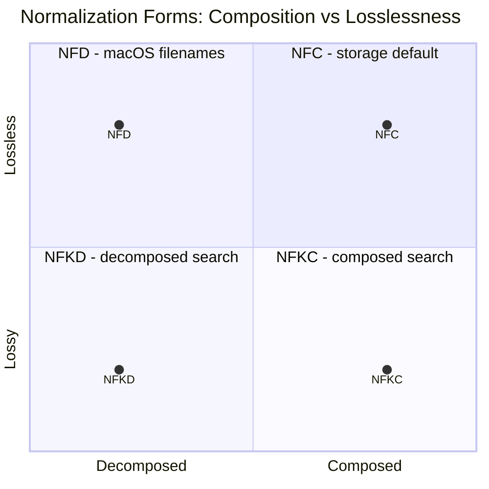
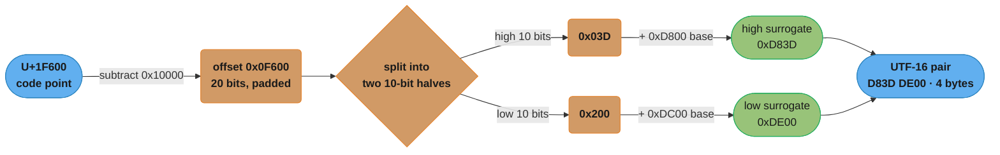
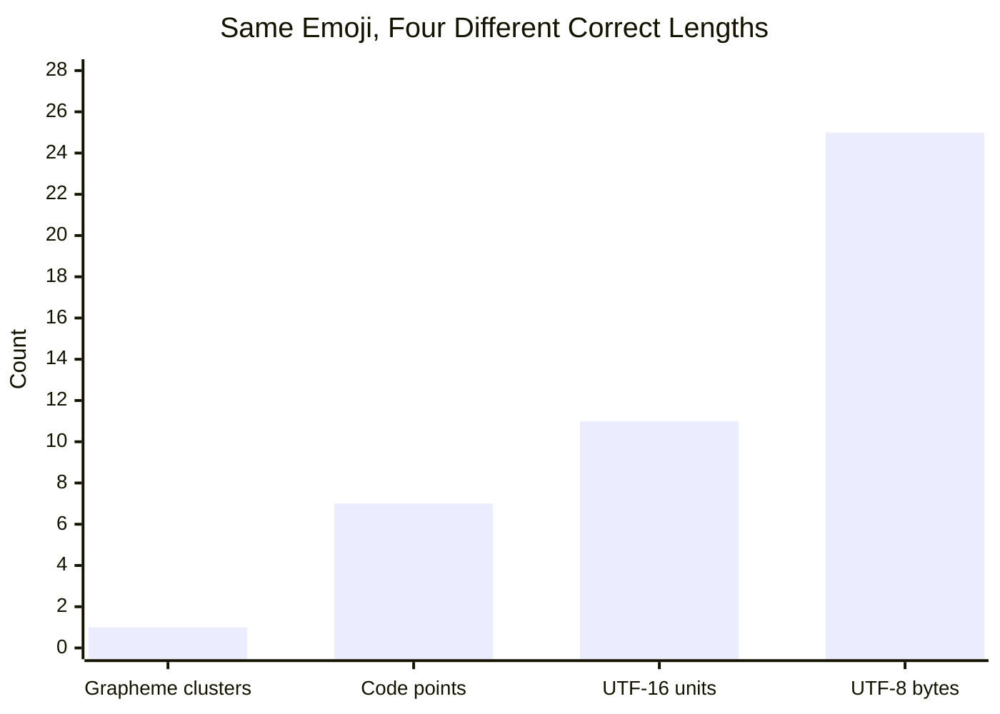
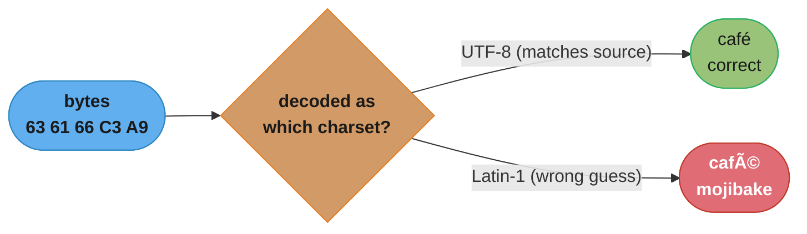

# Character Encoding Deep Dive

---

## 1. Concept Overview

Character encoding is the set of rules that turns abstract "text" into concrete bytes, and back again. Every string a program ever touches — a source file, an HTTP body, a database column, a filename — is stored and transmitted as bytes. But bytes have no inherent meaning as writing; a byte is just a number from 0 to 255. Character encoding is the translation layer that says which byte sequences mean which characters, and it is the single most common source of "works on my machine" bugs in all of software engineering.

This module teaches the language-agnostic theory underneath that translation layer: the Unicode model (code points, planes), the three Unicode transformation formats (UTF-8, UTF-16, UTF-32), normalization, and the surprisingly hard question "how long is this string?" It deliberately does **not** re-derive the language-specific APIs — Python's `str`/`bytes` split and `codecs` machinery live in `python/strings_bytes_encoding_and_regex/`, and Java's Compact Strings and `codePoints()` live in `java/strings_and_text/`. Read this module first for the theory, then follow the crosslinks for how a specific language implements it.

The stakes are concrete: a single wrong assumption about encoding can corrupt data silently (mojibake), crash a parser (`UnicodeDecodeError`), double the cost of an SMS message, split an emoji into two garbage glyphs, or open a phishing vector (IDN homograph attacks). None of these are exotic edge cases — they are the default outcome of writing text-handling code without an explicit encoding model.

---

## 2. Intuition

> **One-line analogy**: a code point is a character's postal address in a single global registry; an encoding is the shipping method used to move that address across a wire — different shipping methods (UTF-8 vs UTF-16) pack the same address into different numbers of bytes, and using the wrong shipping method to unpack a package produces garbage, not an error.

**Mental model**: think of Unicode as one enormous, agreed-upon numbered list of every character in every writing system, plus symbols, emoji, and control codes — 1,114,112 numbered slots in total, of which roughly 155,000 are currently assigned (Unicode 16.0, September 2024). Each slot's number is a **code point**, written `U+0041` for "A". An **encoding** is the algorithm that serializes a sequence of code point numbers into a sequence of bytes. UTF-8, UTF-16, and UTF-32 are three different serializations of the *same* underlying numbered list — the character "A" is always U+0041, but it is the single byte `0x41` in UTF-8, the two bytes `0x0041` in UTF-16, and the four bytes `0x00000041` in UTF-32.

**Why it matters**: every boundary a program crosses — reading a file, accepting an HTTP body, querying a database, building a URL — is a byte boundary, and both sides must agree on the encoding or the bytes decode into nonsense. This is not a rare failure mode: it is the *default* outcome unless a program is explicit about encoding at every boundary, because computers cannot detect encoding from bytes alone (a given byte sequence is *always* validly decodable under some encoding, just not necessarily the right one).

**Key insight**: "one character" is ambiguous, and interviews and production bugs alike hinge on which of four different things you mean by "the length of this string" — bytes, UTF-16 code units, Unicode code points, or grapheme clusters (what a user actually perceives as one character). A single visible emoji can be 1 grapheme cluster, 7 code points, 11 UTF-16 code units, and 25 UTF-8 bytes, all at once (worked out fully in Section 6.4). Every one of those four numbers is "correct" for a different purpose, and using the wrong one is where nearly every encoding bug in this module comes from.

---

## 3. Core Principles

- **Bytes are storage; characters are meaning.** A `byte` is a fixed 8-bit unit (0–255). A character is a linguistic/semantic unit with no fixed size — the translation between the two is the encoding, and it is never automatic or free.
- **A code point is a number, not a byte count.** Unicode assigns every character a unique integer in `[0, 0x10FFFF]`, written `U+XXXX` (4–6 hex digits). The number is fixed regardless of encoding; only its *serialized byte length* varies by encoding.
- **`char` is a historical accident, not a code point.** In C, `char` is one byte. In pre-Unicode-aware Java/JavaScript, `char` is one 16-bit UTF-16 *code unit* — for the 63% of assigned code points above `U+FFFF` that is *half* of a character, not a whole one. Only Python 3's `str` iterates by true code points, a direct consequence of its PEP 393 internal design.
- **Unicode is a charset; UTF-8/16/32 are encodings of it.** "Unicode" names the registry of code points and their properties. UTF-8, UTF-16, and UTF-32 are three interchangeable *transformation formats* for serializing that same registry — they contain identical information, just packed differently into bytes.
- **A grapheme cluster is what a user perceives as "one character."** It may be built from several code points: a base letter plus combining marks, a flag built from two regional-indicator code points, or an emoji sequence joined with ZERO WIDTH JOINER (U+200D). Unicode Standard Annex #29 (UAX #29) formally defines the segmentation rule.
- **Canonical equivalence is not byte equivalence.** Two code point sequences can be defined as "the same character" (canonically equivalent) yet be completely different arrays of integers and completely different byte strings. Normalization is the process of picking one canonical representative so equality, sorting, and hashing behave correctly.
- **No encoding is self-describing.** Given only a sequence of bytes, there is no way to prove which encoding produced them — only heuristics (byte-pattern validity, statistical language models) that can guess wrong. This is why every serious protocol (HTTP, XML, HTML5) transmits the encoding out-of-band, in a header or declaration.

---

## 4. Types / Encoding Strategies

### 4.1 The Unicode Model: Code Points, Planes, and the BMP

Unicode's code space runs from `U+0000` to `U+10FFFF` — exactly `17 x 65,536 = 1,114,112` code points, organized into 17 **planes** of 65,536 code points each:

| Plane | Range | Name | Contents |
|-------|-------|------|----------|
| 0 | U+0000–U+FFFF | BMP (Basic Multilingual Plane) | Latin, Cyrillic, CJK, most live scripts, most symbols |
| 1 | U+10000–U+1FFFF | SMP (Supplementary Multilingual Plane) | Most emoji, historic scripts (Egyptian hieroglyphs, Linear B) |
| 2 | U+20000–U+2FFFF | SIP (Supplementary Ideographic Plane) | Rare/historic CJK ideographs |
| 3 | U+30000–U+3FFFF | TIP (Tertiary Ideographic Plane) | Additional historic CJK |
| 4–13 | U+40000–U+DFFFF | Unassigned | Reserved for future use |
| 14 | U+E0000–U+EFFFF | SSP (Supplementary Special-purpose Plane) | Language tags, variation selectors |
| 15–16 | U+F0000–U+10FFFF | Private Use Areas (Supplementary) | Application-defined, ~131,068 code points |

Any code point at or below `U+FFFF` is called a **BMP character** and fits in a single 16-bit unit; any code point above `U+FFFF` is called **astral** or **supplementary-plane** and needs extra machinery in a fixed-width-16 encoding (Section 4.4). The range `U+D800`–`U+DFFF` (2,048 code points) is permanently reserved as **surrogates** — they are not valid characters on their own, only building blocks for UTF-16 (Section 4.4). Separately, `U+0000`–`U+00FF` (256 code points) is the Latin-1 range, and `U+0000`–`U+007F` (128 code points) is the ASCII range — every later encoding in this module is judged partly by how it treats these two legacy ranges.

### 4.2 ASCII and Legacy 8-bit Encodings

ASCII (1963, ANSI X3.4) assigns 128 characters (7 bits: 0–127) — 95 printable characters (English letters, digits, punctuation) and 33 control codes (newline, tab, NUL, and so on). It has no accented letters, no non-Latin script, and no symbols beyond basic punctuation — a hard ceiling that became untenable the moment computing left the English-speaking, ASCII-only world.

The 30 years between ASCII and Unicode's dominance were filled with **code pages**: 8-bit encodings (256 values) that reused bytes 128–255 for different purposes depending on region — ISO-8859-1 (Latin-1, Western Europe), Windows-1252 (a Latin-1 superset used by Windows), Shift-JIS (Japanese), KOI8-R (Russian), and dozens more. The defining problem: byte `0xE9` is `é` in Latin-1, a Cyrillic letter in KOI8-R, and part of a 2-byte Shift-JIS character — the *same byte* means three different things depending on which code page the reader assumes. This is the direct ancestor of modern mojibake (Section 6.6) and the reason Latin-1 is dangerous as a "safe" fallback decoder (Section 10).

### 4.3 UTF-8

UTF-8 (Ken Thompson and Rob Pike, September 1992, first shipped in Plan 9) is a **variable-width** encoding using 1 to 4 bytes per code point:

```
Code point range       Bytes  Byte 1     Byte 2     Byte 3     Byte 4
---------------------  -----  ---------  ---------  ---------  ---------
U+0000   - U+007F        1    0xxxxxxx      -          -          -
U+0080   - U+07FF        2    110xxxxx   10xxxxxx      -          -
U+0800   - U+FFFF        3    1110xxxx   10xxxxxx   10xxxxxx      -
U+10000  - U+10FFFF      4    11110xxx   10xxxxxx   10xxxxxx   10xxxxxx
```

Three properties explain why UTF-8 has become the dominant encoding (W3Techs surveys have shown it used by roughly 98% of all web pages for years):

1. **ASCII-superset.** Every ASCII byte (0x00–0x7F) is *already* valid UTF-8 for the identical character — a pure-ASCII file is byte-for-byte identical whether you call it ASCII or UTF-8. Decades of C string handling (NUL-terminated, byte-oriented) keep working unmodified.
2. **Self-synchronizing.** Every continuation byte matches the bit pattern `10xxxxxx`, and every lead byte does not. Given any random byte offset into a UTF-8 stream, you can find the start of the current character by scanning backward at most 3 bytes — no external index or full rescan from position 0 is ever needed. Legacy multi-byte encodings like Shift-JIS lack this property: whether a byte is "the first half" or "the second half" of a character depends on parity from the start of the string, so a corrupted or randomly-sliced buffer cannot be resynchronized.
3. **No byte-order ambiguity.** UTF-8 is a stream of bytes, not a stream of 16-bit or 32-bit units, so there is no big-endian/little-endian question (contrast UTF-16/32, Section 4.4).

The original 1993 UTF-8 proposal (and its FSS-UTF predecessor) allowed up to 6 bytes, reaching a 31-bit code space. RFC 3629 (November 2003) capped UTF-8 at 4 bytes and `U+10FFFF` specifically to stay in lockstep with UTF-16, whose surrogate-pair mechanism cannot address anything higher — Unicode's entire code space is capped at `U+10FFFF` *because* UTF-16 cannot go further, and UTF-8 was narrowed to match.

### 4.4 UTF-16, Surrogate Pairs, and the BOM

UTF-16 is a **variable-width** encoding using 2 or 4 bytes, built from 16-bit **code units**. Any BMP code point (`U+0000`–`U+FFFF`, excluding the surrogate range) is one code unit. Any astral code point (`U+10000`–`U+10FFFF`) is encoded as a **surrogate pair** — two code units drawn from the reserved ranges `0xD800`–`0xDBFF` (high surrogate) and `0xDC00`–`0xDFFF` (low surrogate). The exact arithmetic is worked out in Section 6.2.

Surrogate pairs are the single largest source of "emoji broke my string function" bugs in production software, because UTF-16 is the internal string representation of Java (pre-`codePoints()` APIs), JavaScript, and Windows' `wchar_t`/COM `BSTR` APIs. Code that iterates "characters" as 16-bit units silently splits astral-plane characters (all emoji above the original 1990s set, many historic and CJK-extension characters) into two meaningless halves.

Because UTF-16 code units are 16 bits, a byte stream needs to declare its **byte order** (Section 6.5) — this is what the **Byte Order Mark (BOM)**, the code point `U+FEFF`, is for:

| Encoding | BOM bytes | Purpose |
|----------|-----------|---------|
| UTF-8 | `EF BB BF` | Signals "this is UTF-8" (no byte-order meaning; UTF-8 has none) |
| UTF-16BE | `FE FF` | Declares big-endian byte order |
| UTF-16LE | `FF FE` | Declares little-endian byte order |
| UTF-32BE | `00 00 FE FF` | Declares big-endian byte order |
| UTF-32LE | `FF FE 00 00` | Declares little-endian byte order |

A UTF-8 BOM is never required (UTF-8 has no byte-order question) and is actively harmful in contexts that read the first bytes literally — a shebang line (`#!/usr/bin/env`), a JSON parser that rejects leading non-whitespace, or a CSV header row. Windows tools (Notepad, Excel) prepend it by convention anyway; Section 10 covers the resulting bug.

### 4.5 UTF-32

UTF-32 is a **fixed-width** encoding: every code point, with no exceptions, is exactly 4 bytes. This buys `O(1)` random access to the Nth code point (just multiply by 4) at the cost of using 4 bytes even for plain ASCII text — 4x the size of UTF-8 for an English document, and no smaller than UTF-16 even for the BMP-heavy case where UTF-16 would need only 2 bytes. UTF-32 is rarely used for storage or network transmission; it appears mainly as an internal in-memory representation in a few libraries and as `wchar_t` on Linux/glibc (4 bytes, versus 2 bytes on Windows, itself a portability trap for any code that assumes `sizeof(wchar_t)`).

### 4.6 Normalization Forms: NFC, NFD, NFKC, NFKD

Unicode allows many characters to be written two different, canonically equivalent ways. `é` (LATIN SMALL LETTER E WITH ACUTE) can be:

- **Precomposed**: the single code point `U+00E9`.
- **Decomposed**: the base letter `U+0065` (`e`) followed by the combining mark `U+0301` (COMBINING ACUTE ACCENT).

Both render identically and are defined by the Unicode Standard as canonically equivalent, but they are different code point sequences and therefore different byte strings once encoded — the precomposed spelling (`caf` + `U+00E9`) and the decomposed spelling (`caf` + `U+0065` + `U+0301`) both display as "café", yet encoding each to UTF-8 produces byte strings of different lengths (2 bytes for the final character alone vs. 1 byte + 2 bytes) for what looks on screen like the exact same word. **Normalization Form Canonical Composition (NFC)** picks the maximally-composed representative (prefer `U+00E9` over `e` + combining accent); **NFD** does the opposite, fully decomposing into base characters plus combining marks sorted by combining class. NFC is the form recommended by the W3C for all web content and is by far the most common storage form.

**NFKC** and **NFKD** add *compatibility* folding on top of canonical folding: they additionally collapse "the same character in a different presentation" — the ligature `fi` becomes `f` + `i`, full-width `Ａ` becomes ASCII `A`, superscript `²` becomes plain `2`. This is **lossy** — it destroys a real typographic distinction the author may have intended — so NFKC/NFKD are appropriate for search, matching, and security screening (Section 9), never for stored or displayed content.

A 2x2 grid makes the relationship among the four forms explicit — canonical vs. compatibility folding on one axis, composed vs. decomposed on the other:



NFC and NFD both sit on the lossless (canonical) row and differ only on the composition axis; NFKC and NFKD apply that same compatibility fold to both ends of the composition axis, which is why NFKC is best understood as NFD's decomposition step followed by canonical recomposition, with compatibility characters folded first (Q12).

---

## 5. Architecture Diagrams

### Unicode Plane Map (17 planes, 65,536 code points each)

```
Plane 0   [BMP]  U+0000 - U+FFFF     Latin, Cyrillic, CJK, symbols, surrogates(*)
Plane 1   [SMP]  U+10000 - U+1FFFF   Most emoji, historic scripts
Plane 2   [SIP]  U+20000 - U+2FFFF   Rare/historic CJK ideographs
Plane 3   [TIP]  U+30000 - U+3FFFF   Additional historic CJK
Plane 4-13       U+40000 - U+DFFFF   Unassigned (reserved for future characters)
Plane 14  [SSP]  U+E0000 - U+EFFFF   Language tags, variation selectors
Plane 15-16      U+F0000 - U+10FFFF  Private Use Areas (application-defined)

(*) U+D800-U+DFFF inside the BMP are reserved surrogates - never valid characters
    on their own, only building blocks for UTF-16 (see surrogate pair diagram below).

Everything at or below U+FFFF fits in ONE UTF-16 code unit ("BMP character").
Everything above U+FFFF needs a surrogate PAIR in UTF-16 ("astral character").
```
Sixteen of the seventeen planes are almost entirely unassigned reserve space; nearly
all everyday text lives in Plane 0, and nearly all emoji live in Plane 1 — which is
exactly why "my code worked until someone typed an emoji" is such a common bug report.

### Surrogate Pair Arithmetic

Encoding `U+1F600` (128512 decimal, an astral-plane code point above `U+FFFF`) as a UTF-16 surrogate pair — the same code point's UTF-8 form, `F0 9F 98 80`, is derived independently in Section 6.1:


Reversing this arithmetic (subtract the surrogate bases, recombine the two 10-bit
halves, add 0x10000 back) is exactly how a correct UTF-16 decoder recovers the
original 21-bit code point from a surrogate pair — and exactly the arithmetic a
buggy decoder skips when it treats each surrogate half as an independent character.

### Four Ways to Measure the Length of One Emoji Sequence

One visible glyph, four different correct "lengths," for the family emoji sequence `MAN + ZWJ + WOMAN + ZWJ + GIRL + ZWJ + BOY` — which renders as ONE glyph in ZWJ-aware fonts:



- **Grapheme clusters — 1**: what a user perceives as "one character."
- **Unicode code points — 7**: 4 people + 3 ZERO WIDTH JOINER (U+200D).
- **UTF-16 code units — 11**: each person is astral-plane, so 2 units each (4 x 2 = 8), plus 3 ZWJ x 1 unit = 11.
- **UTF-8 bytes — 25**: each person is 4 bytes (4 x 4 = 16), plus 3 ZWJ x 3 bytes each (9) = 25.

"How long is this string?" has four different correct answers depending on which unit is being counted — `str.length` in most languages is a code-unit or code-point count, and was NEVER a promise about visible-character count.

---

## 6. How It Works — Detailed Mechanics

### 6.1 UTF-8 Encoding, Byte by Byte

Four worked examples, one per byte-length class, using the bit layout from Section 4.3:

```python
from __future__ import annotations

# 1 byte: U+0061 'a' -- already <= 0x7F, identical to ASCII
assert "a".encode("utf-8") == b"\x61"

# 2 bytes: U+00E9 'e with acute' (0xE9 = 0b1110_1001, 8 bits -> needs 11-bit payload)
# pad to 11 bits: 000 1110 1001 -> split 5 + 6
#   byte1 = 110 + 00011 = 1100 0011 = 0xC3
#   byte2 = 10  + 101001 = 1010 1001 = 0xA9
assert "é".encode("utf-8") == b"\xc3\xa9"

# 3 bytes: U+4E2D (CJK 'middle', 0x4E2D = 0100 1110 0010 1101, exactly 16 bits)
# split 4 + 6 + 6
#   byte1 = 1110 + 0100     = 1110 0100 = 0xE4
#   byte2 = 10   + 111000   = 1011 1000 = 0xB8
#   byte3 = 10   + 101101   = 1010 1101 = 0xAD
assert "中".encode("utf-8") == b"\xe4\xb8\xad"

# 4 bytes: U+1F600 (GRINNING FACE), astral-plane -- payload needs 21 bits
# (0x1F600 padded to 21 bits, split 3 + 6 + 6 + 6 -- full derivation in Section 5)
#   byte1 = 11110 + 000    = 1111 0000 = 0xF0
#   byte2 = 10    + 011111 = 1001 1111 = 0x9F
#   byte3 = 10    + 011000 = 1001 1000 = 0x98
#   byte4 = 10    + 000000 = 1000 0000 = 0x80
assert "\U0001f600".encode("utf-8") == b"\xf0\x9f\x98\x80"
```

The pattern generalizes: count the significant bits of the code point, pick the smallest byte-length class whose payload capacity (7 / 11 / 16 / 21 bits) can hold them, zero-pad on the left, then slice the bits into the lead byte's `x` slots and each continuation byte's 6 `x` slots from the most significant end.

### 6.2 Surrogate Pair Arithmetic in Code

```python
def to_surrogate_pair(code_point: int) -> tuple[int, int]:
    """Encode an astral code point (> 0xFFFF) as a UTF-16 surrogate pair."""
    if code_point <= 0xFFFF:
        raise ValueError("BMP code points do not need a surrogate pair")
    offset = code_point - 0x10000          # 20-bit offset, fits in [0, 0xFFFFF]
    high = 0xD800 + (offset >> 10)         # top 10 bits + high-surrogate base
    low = 0xDC00 + (offset & 0x3FF)        # bottom 10 bits + low-surrogate base
    return high, low

def from_surrogate_pair(high: int, low: int) -> int:
    """Decode a UTF-16 surrogate pair back into its astral code point."""
    return 0x10000 + ((high - 0xD800) << 10) + (low - 0xDC00)

assert to_surrogate_pair(0x1F600) == (0xD83D, 0xDE00)
assert from_surrogate_pair(0xD83D, 0xDE00) == 0x1F600

# Python's own str never stores surrogate pairs internally (PEP 393 stores the
# true code point directly), but encoding to UTF-16 exposes the same mechanics
# any UTF-16-native language (Java, JavaScript, Windows APIs) uses natively:
assert "\U0001f600".encode("utf-16-le") == b"\x3d\xd8\x00\xde"  # D83D DE00, LE byte order
```

### 6.3 Normalization in Practice

```python
import unicodedata

precomposed = "é"        # 'e with acute', 1 code point
decomposed = "é"        # 'e' + combining acute accent, 2 code points

precomposed == decomposed                                  # False -- different code points!
precomposed.encode("utf-8") == decomposed.encode("utf-8")   # False -- different byte lengths
len(precomposed), len(decomposed)                            # 1, 2 -- different code point counts

nfc = unicodedata.normalize("NFC", decomposed)
nfd = unicodedata.normalize("NFD", precomposed)
assert nfc == precomposed          # NFC recomposed it back to 1 code point
assert nfd == decomposed           # NFD fully decomposed it to 2 code points
assert unicodedata.normalize("NFC", precomposed) == unicodedata.normalize("NFC", decomposed)
# ^ the correct equality check for user-supplied Unicode text: normalize both sides first

# NFKC additionally folds *compatibility* variants -- this is lossy
ligature = "film"                       # "film" typed with the 'fi' ligature glyph
assert unicodedata.normalize("NFKC", ligature) == "film"     # ligature folded to f + i
assert unicodedata.normalize("NFC", ligature) != "film"      # NFC alone leaves it untouched
```

### 6.4 Bytes vs Code Units vs Code Points vs Grapheme Clusters

```python
import regex  # third-party `regex` package: adds \X (extended grapheme cluster, UAX #29)

family = "\U0001F468\u200D\U0001F469\u200D\U0001F467\u200D\U0001F466"
#          MAN        ZWJ    WOMAN      ZWJ    GIRL       ZWJ    BOY

len(family)                                  # 7  -- Python len() counts code points
len(family.encode("utf-8"))                  # 25 -- UTF-8 bytes (see Section 5 diagram)
len(family.encode("utf-16-le")) // 2         # 11 -- UTF-16 code units
len(regex.findall(r"\X", family))            # 1  -- extended grapheme clusters (visual)
```

Four unit systems, four different "lengths," all correct for a different question:
bytes answer "how much wire/disk space," code units answer "what does a UTF-16-native
API see," code points answer "what does Python's `str` see," and grapheme clusters
answer "what would a user call one character" — the only one of the four safe to use
for on-screen truncation, cursor movement, or reversing a string (Section 10).

### 6.5 Endianness in Multi-Byte Encodings

UTF-16 and UTF-32 code units are wider than one byte, so a serializer must pick an
order to lay their bytes out in memory or on the wire — the same endianness question
covered generally in [number_systems_and_bit_manipulation](../number_systems_and_bit_manipulation/README.md).

```python
value = "中"  # U+4E2D, one BMP code point

value.encode("utf-16-be")   # b'\x4e\x2d' -- most-significant byte first
value.encode("utf-16-le")   # b'\x2d\x4e' -- least-significant byte first (x86/x86-64 native)
value.encode("utf-16")      # b'\xff\xfe\x2d\x4e' -- prepends a BOM (LE on most platforms)

# Without a BOM or an out-of-band declaration, a bare "utf-16" byte stream is
# genuinely ambiguous -- b'\x4e\x2d' is U+4E2D in big-endian and U+2D4E in
# little-endian, two completely different, both-valid characters.
```

UTF-8 sidesteps this entirely because it is defined as a stream of individual bytes,
never a stream of wider units — one more reason it displaced UTF-16/32 for storage
and network transmission (Section 4.3).

### 6.6 Decoding Errors and Mojibake

**Mojibake** ("character transformation" in Japanese) is the visible garbage produced
when bytes encoded in one encoding are decoded as if they were a different encoding —
critically, this usually does **not** raise an error, because most legacy 8-bit
encodings accept every possible byte value as *some* character.



The same five bytes fork into two different outcomes depending on which decoder reads them — the UTF-8 path matches how the bytes were actually produced, while the Latin-1 path never raises an error, which is exactly why mojibake propagates silently instead of crashing.

```python
text = "café"
utf8_bytes = text.encode("utf-8")           # b'caf\xc3\xa9' -- 'e' with acute = 2 bytes (C3 A9)

# Decoding those same bytes as Latin-1 does NOT raise -- Latin-1 maps every byte
# 0-255 directly to U+0000-U+00FF, so it "succeeds" and produces garbage:
mojibake = utf8_bytes.decode("latin-1")
assert mojibake == "café"          # 0xC3 -> U+00C3 'Ã', 0xA9 -> U+00A9 '©'... rendered as é

# This is the single most common mojibake signature in the wild: any "café",
# "naïve", or similar word rendered as "...é", "...ï", etc. is UTF-8 bytes
# that were decoded one byte at a time as Latin-1 or Windows-1252.
```

The fix is never "try to repair the garbage after the fact" — it is to make the
encoding of every byte boundary explicit and matching on both ends (Section 13).

---

## 7. Real-World Examples

**SMS segment limits (GSM 03.38 / 3GPP TS 23.038)** — a single SMS segment is 140
bytes. Using the GSM-7 alphabet (7-bit packed septets, Latin-only, no emoji) that is
160 characters per segment. The instant a message contains one character outside
GSM-7 — one emoji, one non-Latin letter, one curly quote from a word processor — the
entire message switches to UCS-2 (2 bytes/char), dropping the limit to 70 characters
per segment (67 for a multi-part concatenated message, since 6 bytes are reserved per
segment for the concatenation header). One emoji can more than double the number of
billed segments for an otherwise-plain-English text message.

**MySQL `utf8` vs `utf8mb4`** — MySQL's charset historically named `utf8` (now
`utf8mb3`, deprecated since 8.0.28) stores at most 3 bytes per character, covering
only the BMP. A 4-byte astral character — any modern emoji, many CJK Extension
characters — cannot be stored at all: strict SQL mode raises "Incorrect string value,"
non-strict mode silently truncates the row's remaining content. `utf8mb4` (added in
MySQL 5.5.3, 2010; the server default since MySQL 8.0, 2018) uses the true UTF-8
algorithm up to 4 bytes and is the only MySQL charset that can round-trip arbitrary
Unicode, including emoji, correctly.

**macOS filename normalization** — HFS+ and APFS store filenames normalized to NFD,
while nearly every other system (Linux filesystems, Git, the web) treats NFC as
canonical. A file named `café.txt` created on macOS and copied to a Linux server or
committed to Git can appear to rename itself, fail a byte-for-byte filename lookup, or
show as a spurious "added + deleted" pair in a diff — the visible name is identical,
but the underlying code point sequence, and therefore every byte-level comparison, is
not.

**Windows Notepad / Excel prepending a UTF-8 BOM** — saving a file as "UTF-8" from
Notepad or exporting a CSV from Excel prepends the 3-byte BOM `EF BB BF`. A shebang
line (`#!/usr/bin/env python3`) followed by that BOM fails to execute (the kernel sees
`\xef\xbb\xbf#!` instead of `#!`), and a strict JSON parser or a CSV header comparison
(`"name" == "name"`) fails for the same reason.

**URL / percent-encoding (RFC 3986)** — non-ASCII characters in a URL must be
percent-encoded byte by byte, and the byte sequence depends on which encoding produced
it. `é` percent-encodes as `%C3%A9` if the source bytes are UTF-8 (the RFC 3986 /
WHATWG URL Standard-mandated choice for new systems) but as `%E9` if the source bytes
are Latin-1 — a server that assumes the wrong one on decode reconstructs the wrong
character, silently.

**IDN homograph attacks** — internationalized domain names are stored in DNS as ASCII
via Punycode (RFC 3492, `xn--` prefix), which allows a label to contain any Unicode
script. In 2017, a widely-reported proof-of-concept registered a domain using Cyrillic
`а` (U+0430) in place of Latin `a` (U+0061) — visually indistinguishable in most fonts,
displayed as plain `apple.com` by browsers that had not yet restricted mixed-script
rendering. Modern browsers mitigate this with whole-script-confusable detection (per
Unicode Technical Standard #39) and fall back to displaying the raw `xn--` form
whenever a label mixes scripts in a way that matches a known confusable pattern.

---

## 8. Tradeoffs

### Encoding Comparison

| Encoding | Width | ASCII bytes | Astral bytes | BOM needed | Self-sync | O(1) code-point index |
|----------|-------|-------------|---------------|------------|-----------|------------------------|
| ASCII | Fixed 7-bit | 1 byte | N/A (undefined) | No | N/A | Yes |
| Latin-1 | Fixed 8-bit | 1 byte | N/A (undefined) | No | N/A | Yes |
| UTF-8 | Variable 1-4 bytes | 1 byte | 4 bytes | No (optional, discouraged) | Yes | No |
| UTF-16 | Variable 2 or 4 bytes | 2 bytes | 4 bytes (surrogate pair) | Yes (or explicit LE/BE) | No | No |
| UTF-32 | Fixed 4 bytes | 4 bytes | 4 bytes | Yes (or explicit LE/BE) | Yes | Yes |

### Normalization Form Comparison

| Form | Operation | Lossy? | Typical use |
|------|-----------|--------|-------------|
| NFC | Decompose, then canonically recompose | No | Storage, transmission, display (W3C-recommended default) |
| NFD | Canonically decompose only | No | macOS/HFS+ filenames, some diffing/collation algorithms |
| NFKC | Compatibility-decompose, then canonically recompose | Yes | Search indexing, deduplication, security screening |
| NFKD | Compatibility-decompose only | Yes | Same as NFKC when composition is not needed |

### "Length" Measure Comparison

| Unit | Answers | Use it for | Do NOT use it for |
|------|---------|-----------|--------------------|
| Bytes | Wire size, storage cost | Network/storage budgeting, DB column sizing | On-screen character counts |
| UTF-16 code units | What Java/JS/Windows APIs iterate | Interop with UTF-16-native platforms | Truncating without splitting a surrogate pair |
| Unicode code points | What Python's `str` iterates | General-purpose text processing in Python | On-screen truncation, string reversal |
| Grapheme clusters | What a user perceives as "one character" | Cursor movement, truncation, reversal, display counts | Nothing — it is the most expensive to compute (needs UAX #29 segmentation) |

---

## 9. When to Use / When NOT to Use

**Use UTF-8 when:**
- Building any new system, file format, API, or database column — it is the default for a reason (Section 4.3).
- Storing or transmitting text where ASCII backward-compatibility, no byte-order ambiguity, and compactness for Western-heavy text all matter.

**Use UTF-16 when:**
- Interoperating with a platform whose native string type already is UTF-16 (Java pre-`codePoints()` code, JavaScript, the Windows API surface, ICU). Fighting the platform's native representation costs more than accepting it.

**Use UTF-32 only when:**
- `O(1)` random access to the Nth code point matters more than memory footprint — rare, mostly internal to specific text-processing engines. Almost never the right choice for storage or network transmission.

**Normalize (NFC) when:**
- Storing user-supplied text that will later be compared, searched, sorted, deduplicated, or used as a map/database key.

**Normalize (NFKC/NFKD) when:**
- Building a search index, a duplicate-detection pipeline, or a security screen (homoglyph/confusable detection) — never for content that will be redisplayed, since compatibility folding is lossy.

**Do NOT:**
- Treat Latin-1 as a "safe" universal decoder — it never raises, which means it silently corrupts anything that was not actually Latin-1 (Section 6.6, Section 10).
- Slice, truncate, or reverse user-facing text by code point or byte — use grapheme clusters (Section 6.4, Section 10).
- Assume `len()` (in any language) measures what a user would call "characters" — verify which of the four units in Section 8's table it actually counts.

---

## 10. Common Pitfalls

### Pitfall 1: Reversing (or Truncating) a String by Bytes or Code Points

**BROKEN** — reversing raw bytes corrupts every multi-byte character into invalid
UTF-8; reversing by code point (the default in most languages, including Python's
`s[::-1]`) still corrupts any character built from more than one code point:

```python
word = "café"                       # decomposed: base 'e' (U+0065) + combining acute (U+0301)
thumb = "\U0001F44D\U0001F3FD"            # thumbs-up + medium skin-tone modifier, 1 grapheme

def reverse_bytes_broken(s: str) -> str:
    raw = s.encode("utf-8")
    return bytes(reversed(raw)).decode("utf-8", errors="replace")

def reverse_codepoint_broken(s: str) -> str:
    return s[::-1]

reverse_bytes_broken("café")
# each multi-byte character's bytes are now in the wrong internal order --
# the 2-byte 'e with acute' (C3 A9) becomes the invalid sequence A9 C3, which is
# not valid UTF-8 (A9 is not a legal lead byte) -- decodes to replacement characters

reverse_codepoint_broken(word)
# result: U+0301 (the combining accent) now precedes "e" with nothing before it --
# it floats over whatever character precedes it in context, not attached to "e"

reverse_codepoint_broken(thumb)
# U+1F3FD (the skin-tone modifier) now comes BEFORE U+1F44D (thumbs-up) -- most
# renderers show this as TWO separate glyphs: an isolated color swatch, then a
# default-yellow thumbs-up -- not a "reversed" emoji, a broken one
```

**FIX** — reverse by extended grapheme cluster (UAX #29), never by byte or code
point. The standard library `re` module has no grapheme-cluster support; the
third-party `regex` package adds `\X` for exactly this:

```python
import regex

def reverse_graphemes(s: str) -> str:
    clusters = regex.findall(r"\X", s)   # one match per extended grapheme cluster
    return "".join(reversed(clusters))

assert reverse_graphemes(word) == "éfac"   # the whole "e + accent" grapheme moves as one
assert reverse_graphemes(thumb) == thumb        # single grapheme, correctly unchanged
```

### Pitfall 2: Comparing Unnormalized Unicode Strings

```python
# BROKEN: two strings that render identically compare unequal
stored = "é"        # precomposed, from one input source
incoming = "é"     # decomposed, from a different input source (e.g., macOS NFD)
assert stored != incoming    # True -- comparison silently fails, lookup misses

# FIX: normalize both sides to the same form (NFC is the common default) before
# comparing, hashing, or using as a map/database key
import unicodedata
def normalized_eq(a: str, b: str) -> bool:
    return unicodedata.normalize("NFC", a) == unicodedata.normalize("NFC", b)
assert normalized_eq(stored, incoming)   # True
```

### Pitfall 3: Using Latin-1 as a "Safe" Fallback Decoder

```python
# DANGEROUS: latin-1 accepts every byte 0-255 without ever raising, which feels
# "safe" but actually just guarantees silent corruption on non-Latin-1 input
raw = "中文".encode("utf-8")     # b'\xe4\xb8\xad\xe6\x96\x87'
wrong = raw.decode("latin-1")   # no exception -- but produces "中文", pure garbage
correct = raw.decode("utf-8")   # "中文"
```
Prefer failing loudly (`errors="strict"`, the default) or explicitly replacing
(`errors="replace"`) over a decoder that can never signal that something went wrong.

### Pitfall 4: Storing Astral Characters in a 3-Byte-Max Database Column

**BROKEN** — a MySQL column declared with the legacy `utf8` (`utf8mb3`) charset
silently cannot hold a 4-byte character:

```sql
-- BROKEN: utf8 (utf8mb3) supports at most 3 bytes/char -- BMP only
CREATE TABLE messages (body VARCHAR(500) CHARACTER SET utf8);
INSERT INTO messages (body) VALUES ('Great job! \U0001F44D');
-- strict mode: ERROR 1366 "Incorrect string value" -- non-strict: silent truncation
```

**FIX** — use `utf8mb4`, the only MySQL charset that implements true UTF-8 up to 4 bytes:

```sql
-- FIXED: utf8mb4 supports the full Unicode range, including all emoji
CREATE TABLE messages (body VARCHAR(500) CHARACTER SET utf8mb4 COLLATE utf8mb4_unicode_ci);
```

### Pitfall 5: Percent-Encoding a URL Component with the Wrong Source Encoding

```python
# BROKEN: percent-encoding raw Latin-1 bytes when the receiving server expects UTF-8
name = "café"
print(name.encode("latin-1").hex())   # 636166e9   -- the accented letter is ONE byte, 0xE9
print(name.encode("utf-8").hex())     # 636166c3a9 -- the same letter is TWO bytes, 0xC3 0xA9

# a percent-encoder just hex-escapes each byte with '%' -- so the identical visible
# character becomes "%E9" from Latin-1 source bytes, or "%C3%A9" from UTF-8 source bytes

# FIX: always percent-encode the UTF-8 byte sequence, per RFC 3986 / the WHATWG URL Standard
from urllib.parse import quote
print(quote(name))    # "caf%C3%A9" -- what any modern server/browser expects
```

---

## 11. Technologies & Tools

| Tool / API | Language / Platform | Purpose |
|------------|---------------------|---------|
| `str.encode()` / `bytes.decode()` | Python | Explicit encode/decode at every boundary |
| `unicodedata.normalize()` | Python (stdlib) | NFC/NFD/NFKC/NFKD normalization |
| `regex` (`\X`) | Python (third-party, `pip install regex`) | Extended grapheme cluster segmentation (UAX #29) |
| `codecs` module | Python (stdlib) | Streaming encode/decode, custom error handlers |
| `java.text.Normalizer` | Java | NFC/NFD/NFKC/NFKD normalization |
| `String.codePoints()` / `.chars()` | Java | Code-point-correct vs UTF-16-code-unit iteration |
| `BreakIterator` | Java / ICU4J | Locale-aware grapheme/word/sentence boundaries |
| ICU (ICU4C / ICU4J) | C/C++/Java | Reference implementation: normalization, collation, segmentation, transliteration |
| `iconv` | POSIX CLI | Convert a file between two named encodings |
| `chardet` / `charset-normalizer` | Python (third-party) | Statistical encoding *detection* (heuristic, not guaranteed) |
| `TextEncoder` / `TextDecoder` | Web / JavaScript | UTF-8 encode/decode in the browser and Node.js |
| `file -i` | POSIX CLI | Report a file's apparent MIME type and encoding guess |
| Unicode Character Database (UCD) | Unicode Consortium | Canonical source of every code point's properties |

---

## 12. Interview Questions with Answers

**Q1: What is the difference between a byte and a character?**
A byte is a fixed 8-bit unit of storage; a character is an abstract unit of writing represented by a Unicode code point. A code point can require 1 to 4 bytes depending on the encoding chosen to serialize it. Confusing the two is the root cause of most encoding bugs — byte length, code-point length, and on-screen character count are three different numbers for the same string. Always be explicit about which one a piece of code is actually measuring.

**Q2: Why does the length of a string containing an emoji sometimes come out larger than expected?**
Most languages count length in code points or UTF-16 code units, not in visually-perceived characters. A single emoji built as a ZWJ sequence or with a skin-tone modifier can be 2 to 7 code points long while rendering as one glyph. This means naive length checks, truncation, or slicing can cut a visually atomic character in half. Use a grapheme-cluster-aware length function whenever the count must match what a user actually sees on screen.

**Q3: Why can two strings that look completely identical fail an equality check?**
Unicode lets the same visible character be written as two different code point sequences — precomposed, or a base letter plus a combining accent mark. These sequences are canonically equivalent (the Unicode Standard says they are "the same character") but are not equal as raw code point arrays, so `==` returns false and hash-based lookups miss. The fix is to normalize both strings to the same form, typically NFC, before comparing, hashing, or storing them as keys. Never index or deduplicate user-supplied Unicode text without normalizing it first.

**Q4: What is mojibake, and why does it usually happen silently instead of raising an error?**
Mojibake is the garbled text produced when bytes encoded in one encoding are decoded as if they were a different encoding. It happens silently because most legacy 8-bit encodings (Latin-1, Windows-1252) treat every possible byte value 0-255 as a valid character, so the decode step never fails — it just produces the wrong, but syntactically valid, text. The classic signature is a word like "café" appearing as "café," which is UTF-8 bytes decoded one byte at a time as Latin-1. The only real fix is making the encoding explicit and matching at both ends of every boundary, not attempting to repair the garbage afterward.

**Q5: What is a surrogate pair, and why does it exist?**
A surrogate pair is two 16-bit UTF-16 code units, drawn from the reserved ranges 0xD800-0xDBFF and 0xDC00-0xDFFF, that together represent one code point above U+FFFF. It exists because UTF-16 was originally designed as a fixed 16-bit encoding before Unicode grew past 65,536 characters, and surrogate pairs were retrofitted as an escape mechanism rather than redesigning every UTF-16-based system. Code that iterates a UTF-16 string one code unit at a time (older Java `char` loops, naive JavaScript string indexing) sees each half of a surrogate pair as a separate, meaningless character. The practical fix is to use a code-point-aware API (`codePoints()` in Java, `for...of` in JavaScript) whenever the input may contain characters above the Basic Multilingual Plane.

**Q6: Why is decoding untrusted bytes with Latin-1 as a "safe fallback" actually dangerous?**
Latin-1 maps every byte value 0-255 directly to a code point, so it can never raise a decode error, which makes it feel like a safe universal fallback. In reality this "safety" just guarantees that any non-Latin-1 input — UTF-8 Chinese text, a UTF-8 emoji — decodes into different, wrong characters instead of failing loudly. A decoder that can never signal a problem is strictly worse than one that raises, because the corruption then propagates silently downstream. Prefer strict UTF-8 decoding with an explicit error handler (`replace` or a rejection path) over a decoder chosen for its inability to fail.

**Q7: Why did MySQL's `utf8` charset silently reject or truncate emoji, and how is it fixed?**
MySQL's charset historically named `utf8` (now `utf8mb3`) stores at most 3 bytes per character, covering only the Basic Multilingual Plane. It excludes every 4-byte astral character, including virtually all emoji. Inserting a 4-byte character either raises "Incorrect string value" under strict SQL mode or silently truncates the row under lenient mode. The fix is `utf8mb4` (added in MySQL 5.5.3, the server default since MySQL 8.0), which implements true UTF-8 up to 4 bytes per character. Any new MySQL schema should default to `utf8mb4`, never the legacy `utf8mb3` alias.

**Q8: Why did UTF-8 become the dominant encoding over UTF-16 and UTF-32?**
UTF-8 won primarily because it is a strict superset of ASCII at the byte level, so decades of existing byte-oriented, NUL-terminated C code kept working unmodified. It is also self-synchronizing (any byte offset can be resynchronized to a character boundary by scanning backward at most 3 bytes) and has no byte-order ambiguity, since it is a stream of individual bytes rather than wider 16- or 32-bit units. UTF-16 and UTF-32 both require an explicit or BOM-declared byte order and, for UTF-16, a surrogate-pair escape mechanism that UTF-8 does not need. As a result UTF-8 is used by roughly 98% of surveyed web pages today.

**Q9: Walk through how UTF-8 decides how many bytes to use for a given code point.**
UTF-8 picks the smallest of four byte-length classes whose payload bit capacity can hold the code point, using 1, 2, 3, or 4 bytes. Those four classes hold 7, 11, 16, and 21 payload bits, covering U+0000-U+007F, U+0080-U+07FF, U+0800-U+FFFF, and U+10000-U+10FFFF respectively. The lead byte's leading bits (`0`, `110`, `1110`, or `11110`) encode how many bytes follow, and every continuation byte starts with `10`. To encode, zero-pad the code point to the chosen payload width and slice its bits into the lead byte's remaining slots and each continuation byte's 6 bits, most-significant bits first.

**Q10: What is a Unicode code point, and how is it different from what most programmers mean by "character"?**
A code point is a unique integer, written U+XXXX, that Unicode assigns to an abstract character or symbol. It is a number, not a byte count and not a promise about how many bytes it will take in any given encoding. What most programmers mean by "character" is closer to a grapheme cluster — the visually atomic unit a user perceives — which can be built from several code points (a base letter plus combining marks, or an emoji joined with ZERO WIDTH JOINER). Treating "code point" and "character" as synonyms is safe for the vast majority of Latin text and wrong for combining marks, flags, and most modern emoji.

**Q11: What are Unicode planes, and what is the Basic Multilingual Plane (BMP)?**
A plane is a block of 65,536 contiguous code points; Unicode has 17 planes, for a total code space of 1,114,112 code points from U+0000 to U+10FFFF. The BMP is Plane 0 (U+0000-U+FFFF) and holds nearly every living script, most symbols, and the reserved surrogate range — it is the only plane most everyday text ever touches. Planes 1 and above are called "astral" or "supplementary" planes; Plane 1 alone holds most emoji, which is why emoji specifically trigger surrogate-pair and 4-byte-UTF-8 code paths that plain-language BMP text never exercises.

**Q12: What is the difference between NFC, NFD, NFKC, and NFKD normalization?**
NFC and NFD both perform canonical normalization and never change a character's visual or semantic meaning. NFC recomposes to the most-composed form; NFD fully decomposes into base characters plus combining marks. NFKC and NFKD additionally apply compatibility folding, collapsing presentational variants such as ligatures, full-width forms, and superscript digits into their plain equivalents, which is lossy because it can discard a typographic distinction the author intended. NFC is the safe default for storing and displaying text; NFKC/NFKD are appropriate only for search indexing, deduplication, or security screening, never for content that will be redisplayed.

**Q13: Why is UTF-8 described as "self-synchronizing," and why does that matter?**
Self-synchronizing means every continuation byte matches the fixed pattern `10xxxxxx` and no lead byte does, so a reader can always find a character boundary without an external index. Given any random byte offset into a UTF-8 stream, scanning backward at most 3 bytes always reaches the start of the current character. It matters because a corrupted, truncated, or randomly-sliced buffer can still be resynchronized without rescanning from the start of the string or consulting an external index. Legacy multi-byte encodings such as Shift-JIS lack this property — whether a given byte is the first or second half of a character depends on parity counted from the beginning of the string, so a single dropped byte corrupts every character after it.

**Q14: What is the Byte Order Mark (BOM), and when should you use one?**
The BOM is the code point U+FEFF placed at the start of a text stream to declare its encoding and, for wide-unit encodings, its byte order. UTF-16 and UTF-32 streams generally need a BOM (or an explicit LE/BE declaration) because their multi-byte code units are otherwise ambiguous between big-endian and little-endian interpretation. A UTF-8 BOM is never structurally required, since UTF-8 has no byte-order question, and it is actively harmful to shebang lines, strict JSON parsers, and CSV header comparisons that read the first bytes literally — new UTF-8 content should omit it.

**Q15: What is endianness, and how does it affect UTF-16/UTF-32 but not UTF-8?**
Endianness is the byte order used to lay out a multi-byte value in memory or on the wire — big-endian stores the most significant byte first, little-endian stores the least significant byte first. UTF-16 and UTF-32 code units are 2 and 4 bytes wide respectively, so a receiver must know which byte order the sender used, typically via a BOM or an explicit `-LE`/`-BE` encoding name. UTF-8 sidesteps the entire question because it is defined as a stream of individual, one-byte-wide units — there is nothing wider than a byte to reorder.

**Q16: How would you correctly reverse a Unicode string that may contain combining marks or multi-code-point emoji?**
Reverse it by extended grapheme cluster (per Unicode Standard Annex #29), never by raw byte or by code point. Reversing bytes can produce invalid UTF-8 continuation sequences for any multi-byte character, and reversing by code point splits any character built from more than one code point — a base letter plus combining accent, or an emoji with a skin-tone modifier — leaving the pieces in an order that no longer renders as the original character. In Python, the third-party `regex` package's `\X` pattern matches one grapheme cluster at a time and can be used to segment, then reverse, the cluster list.

**Q17: What is a homoglyph or confusable-character attack, and how does normalization relate to it?**
A homoglyph attack substitutes a visually near-identical character from a different script for the expected one, most often a Cyrillic letter standing in for a Latin one. This constructs a deceptive string — commonly a phishing domain name — that displays as a trusted brand while being built from entirely different code points. It relates to normalization because Unicode's own compatibility folding (NFKC/NFKD) and the separate "confusables" data published under Unicode Technical Standard #39 are the standard mechanisms used to detect when two strings that look alike are actually built from different code points. Browsers mitigate the domain-name variant specifically by rendering a mixed-script label in its raw Punycode (`xn--`) form instead of the deceptive Unicode rendering whenever the mixture matches a known confusable pattern.

**Q18: Why does a file created on macOS sometimes appear to have a different name on Linux or in Git, even though it looks identical?**
HFS+ and APFS, macOS's filesystems, normalize filenames to NFD (fully decomposed) before storing them, while Linux filesystems and Git treat NFC (composed) as the canonical form. A filename containing an accented character is therefore stored as a different code point sequence, and therefore a different byte sequence, depending on which system created it, even though both render identically. This surfaces as a byte-for-byte filename lookup failing, or Git showing a spurious rename or add-plus-delete pair for a file whose visible name never actually changed. The practical mitigation is to normalize filenames to a single form at the application or sync-tool boundary rather than comparing raw bytes across platforms.

**Q19: Is it accurate to say ASCII is a "subset" of UTF-8, and what guarantee does that give you?**
Yes — every ASCII byte, 0x00 through 0x7F, is defined identically in UTF-8: a single byte, with the exact same bit pattern, representing the exact same character. The guarantee is that any pure-ASCII file, string constant, or byte stream is already valid UTF-8 with no conversion step, which is why decades of C string-handling code, NUL-terminated buffers, and ASCII-only protocols kept working unmodified as UTF-8 became the default. This does not hold for UTF-16 or UTF-32, where even a plain ASCII "A" is serialized as two or four bytes rather than the single byte 0x41.

**Q20: How does character encoding interact with URL and percent-encoding?**
A URL can only contain a restricted ASCII character set, so any other character must be percent-encoded as its underlying byte sequence, one `%XX` triplet per byte. Which bytes get encoded depends entirely on which character encoding produced them in the first place. Modern practice (the WHATWG URL Standard, and RFC 3986-based tooling) mandates encoding the UTF-8 byte sequence, so "e with acute" becomes `%C3%A9`, but an older system that percent-encodes Latin-1 bytes instead would produce `%E9` for the identical visible character. A receiver that assumes the wrong source encoding when percent-decoding reconstructs the wrong character, silently, exactly as in any other encoding mismatch.

---

## 13. Best Practices

1. **Decode and encode explicitly at every boundary.** Never rely on a platform or locale default for file I/O, sockets, or subprocess pipes — state `utf-8` (or whatever the protocol mandates) every time.
2. **Default to UTF-8 for every new file format, API, and database column.** Reach for UTF-16 or UTF-32 only when interoperating with a platform whose native string type already uses them.
3. **Normalize to NFC before comparing, hashing, sorting, or storing user-supplied text as a key.** Do it once, at the ingestion boundary, not ad hoc at every comparison site.
4. **Never normalize with NFKC/NFKD before displaying content back to a user.** Reserve compatibility folding for search indexes, deduplication, and security screening, where losing typographic distinctions is acceptable.
5. **Use grapheme-cluster segmentation for anything user-facing** — truncation, cursor movement, "characters remaining" counters, and string reversal. Never use raw byte or code-point slicing for these.
6. **Treat Latin-1 as a decoder of last resort, not a safe default.** It cannot fail, which is precisely why it is dangerous — prefer a decoder that raises or explicitly replaces on invalid input.
7. **Use `utf8mb4`, never `utf8`/`utf8mb3`, for any MySQL text column that might ever hold emoji or supplementary-plane characters.**
8. **Omit the BOM from new UTF-8 content.** It is never required for UTF-8 and breaks shebang lines, strict JSON parsers, and naive header comparisons.
9. **Percent-encode UTF-8 bytes for URLs, never Latin-1 or platform-default bytes**, to match what every modern browser and server assumes.
10. **When accepting text for a security-sensitive uniqueness check (usernames, domain-like identifiers), apply confusable/homoglyph detection in addition to normalization** — visual similarity across scripts is a real attack surface, not a theoretical one.

---

## 14. Case Study: Unicode-Correct Display Names in a Chat Service

**Scenario**: A chat platform with 10 million registered users lets each user set a
free-text display name, capped at 32 visible characters, used for both a public
uniqueness constraint (no two users share a display name, to prevent impersonation)
and on-screen truncation in a narrow UI badge.

### BROKEN Implementation

```python
# BROKEN: truncates by code point, compares raw (unnormalized) bytes for uniqueness,
# and stores into a 3-byte-max database column
import sqlite3  # stand-in for the production RDBMS in this example

def set_display_name_broken(conn: sqlite3.Connection, user_id: int, name: str) -> None:
    truncated = name[:32]                              # BROKEN: code-point slice
    conn.execute(
        "INSERT INTO display_names (user_id, name) VALUES (?, ?)",
        (user_id, truncated),
    )
    # underlying column: name VARCHAR(32) CHARACTER SET utf8  -- BROKEN: 3-byte max

# Bug 1: name[:32] on a name ending in a skin-tone-modified, ZWJ-joined emoji
#        (e.g. a person + skin-tone modifier + ZWJ + rocket sequence) can slice
#        the sequence in half at exactly position 32, corrupting the last visible glyph
# Bug 2: two users can both register the visible name "Zoe with an acute accent" --
#        one typed the precomposed U+00E9, the other the decomposed U+0065 U+0301 --
#        both LOOK identical, so a naive "SELECT 1 WHERE name = ?" allows both to register
# Bug 3: a name containing any 4-byte astral character (nearly all emoji) either
#        errors out or is silently truncated by the utf8 (utf8mb3) column
```

### FIX

```python
import sqlite3
import unicodedata
import regex

MAX_VISIBLE_CHARS = 32

def truncate_by_grapheme(name: str, max_chars: int) -> str:
    clusters = regex.findall(r"\X", name)     # segment into grapheme clusters, UAX #29
    return "".join(clusters[:max_chars])       # slice clusters, never code points

def set_display_name(conn: sqlite3.Connection, user_id: int, raw_name: str) -> None:
    # 1. Normalize to NFC first -- this is the single representation used for
    #    both the uniqueness check and storage, so "e" + combining accent and
    #    the precomposed "e with acute" are recognized as the same name.
    normalized = unicodedata.normalize("NFC", raw_name)

    # 2. Truncate by grapheme cluster, not code point -- never split a
    #    skin-tone modifier or ZWJ sequence across the boundary.
    display_name = truncate_by_grapheme(normalized, MAX_VISIBLE_CHARS)

    # 3. Enforce uniqueness against the SAME normalized form.
    existing = conn.execute(
        "SELECT 1 FROM display_names WHERE name = ?", (display_name,)
    ).fetchone()
    if existing:
        raise ValueError(f"display name {display_name!r} is already taken")

    conn.execute(
        "INSERT INTO display_names (user_id, name) VALUES (?, ?)",
        (user_id, display_name),
    )
    # underlying column: name VARCHAR(128) CHARACTER SET utf8mb4 COLLATE utf8mb4_unicode_ci
    # (128, not 32, because utf8mb4 reserves up to 4 bytes per visible grapheme cluster,
    # and a single grapheme cluster can itself be several code points wide)
```

### Comparison

| Concern | Broken | Fixed |
|---------|--------|-------|
| Truncation unit | Code point (`name[:32]`) | Grapheme cluster (`regex \X`, UAX #29) |
| Uniqueness check | Raw, unnormalized bytes | NFC-normalized before comparison and storage |
| Storage charset | `utf8` (`utf8mb3`, 3-byte max) | `utf8mb4` (4-byte max, true UTF-8) |
| Emoji / astral characters | Rejected or silently truncated | Stored and truncated correctly |
| Combining-mark impersonation | Two visually identical names both allowed | Normalized to one canonical form, correctly rejected |

**Discussion Q&A**:

**Why normalize before the uniqueness check instead of after?**
Normalizing after storage would compare a newly-submitted name against whatever form was already stored, which may itself be unnormalized from before the fix shipped — normalizing at write time guarantees every stored row is already in one canonical form, so every future comparison is correct without a backfill dependency.

**Why is the fixed column 128 bytes instead of the original 32?**
The limit is 32 *grapheme clusters*, not 32 bytes — a single grapheme cluster (an emoji with a skin-tone modifier and ZWJ family sequences are the extreme case) can be several code points and up to a dozen-plus UTF-8 bytes wide, so the byte budget must be sized for the worst case, not the visible-character count.

---

## See Also

- [number_systems_and_bit_manipulation](../number_systems_and_bit_manipulation/README.md) — bit patterns, endianness, and byte-level manipulation underlying every encoding in this module
- [arrays_strings_and_hashing](../arrays_strings_and_hashing/README.md) — hash table and string internals that depend on consistent, normalized encoding for correct key equality
- [`python/strings_bytes_encoding_and_regex`](../../python/strings_bytes_encoding_and_regex/README.md) — Python's `str`/`bytes` split, PEP 393 compact representation, `codecs`, and Unicode-aware regex in full applied depth
- [`java/strings_and_text`](../../java/strings_and_text/README.md) — Java's Compact Strings (LATIN1/UTF16 coder), `String.codePoints()` vs `chars()`, and surrogate pairs in practice
