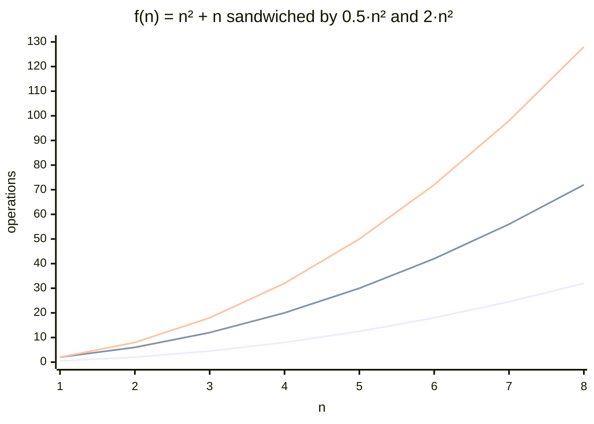
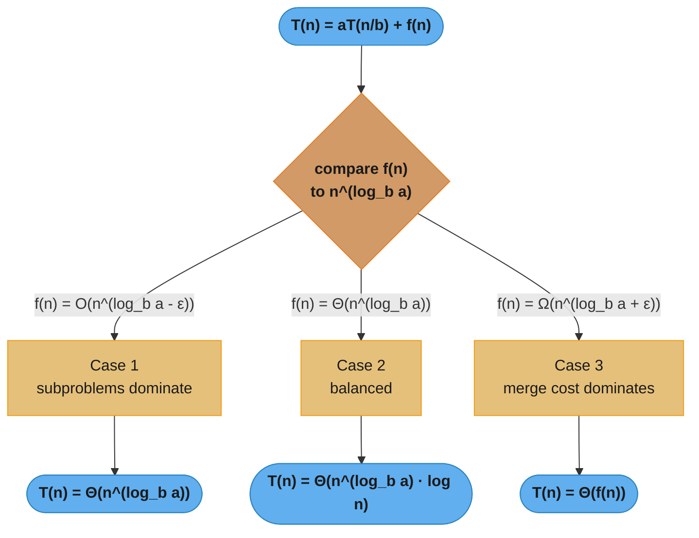
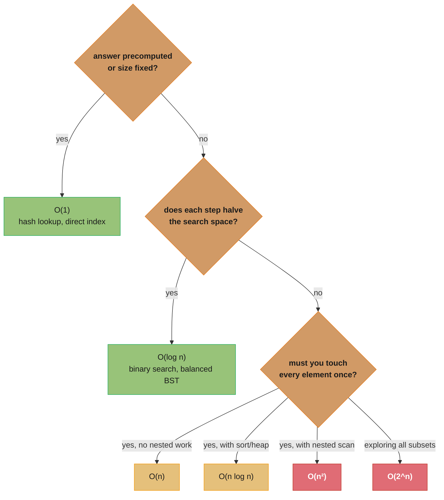
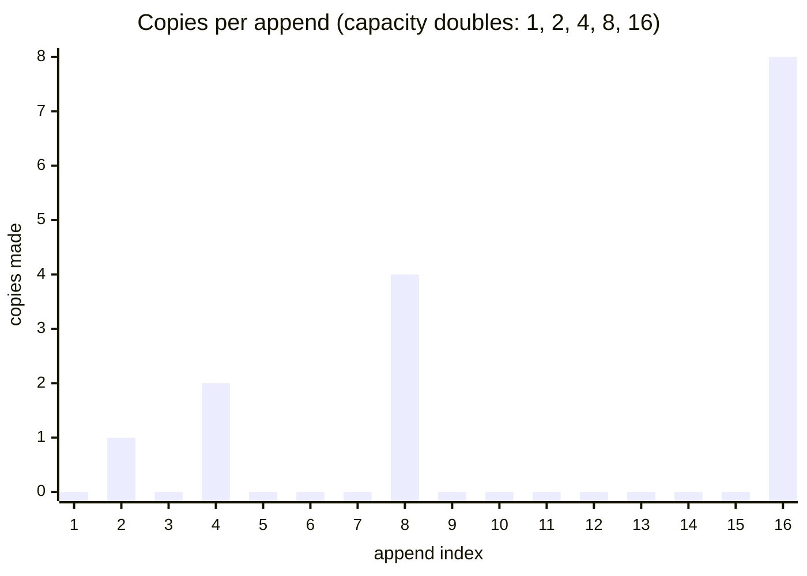
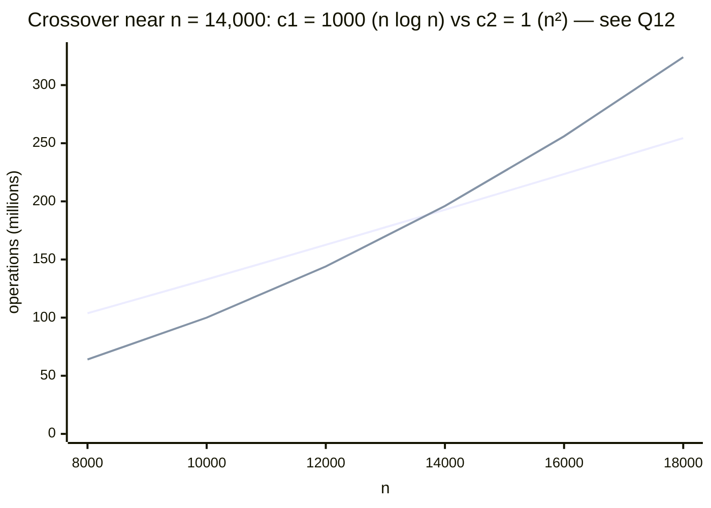
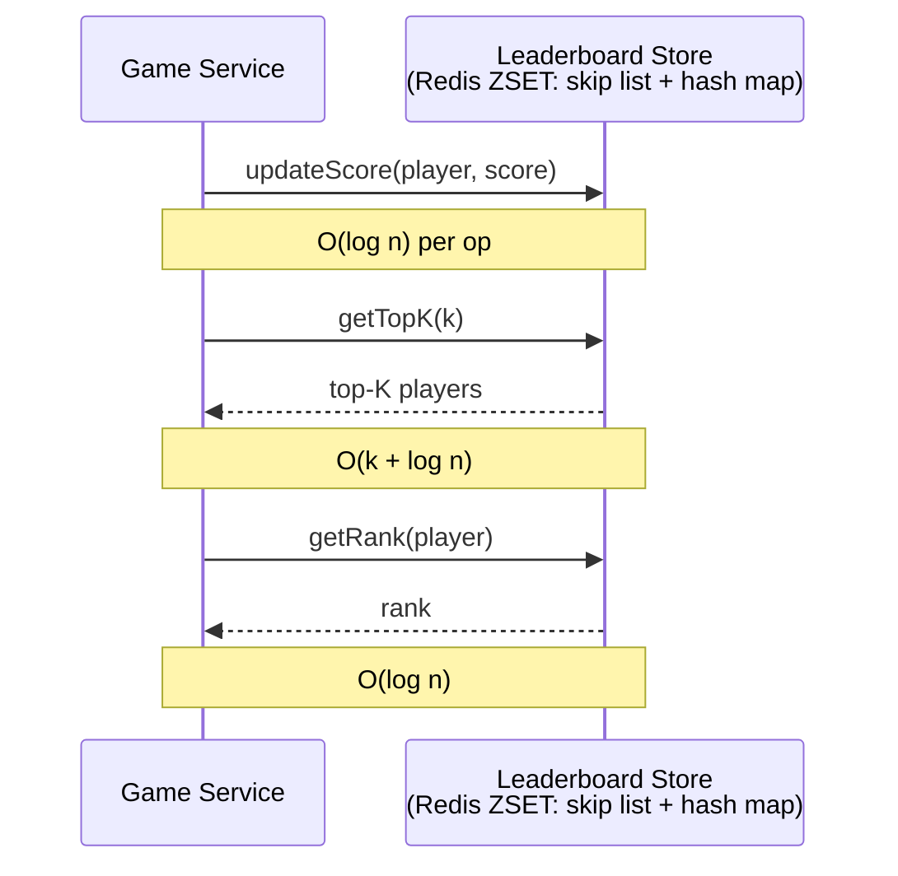

# Complexity Analysis & Big-O Notation

---

## 1. Concept Overview

Complexity analysis is the discipline of measuring how the resource requirements (time or space) of an algorithm grow as the input size grows, independently of hardware, language, or implementation constants. The goal is to predict scalability: will this algorithm still run in a second when n is 10 million?

The dominant framework is **asymptotic analysis** using Big-O notation, which expresses the upper bound on growth rate. When we say a hash table lookup is O(1) and a linear scan is O(n), we are saying that at large n the hash table's cost does not grow with n while the scan's cost grows linearly — regardless of the specific hardware or constant factors involved.

Complexity analysis answers the fundamental question an engineer asks before choosing an algorithm: *if I double the input size, what happens to the running time?* O(log n) algorithms barely notice; O(n²) algorithms quadruple; O(2^n) algorithms become infeasible.

---

## 2. Intuition

> **One-line analogy**: Big-O is the "highway sign" version of algorithm cost — it tells you the shape of the journey (flat highway vs steep mountain vs exponential cliff), not the exact distance or speed limit.

**Mental model**: Every algorithm's cost can be written as a polynomial in n (or a log, exponential, factorial). Asymptotic analysis keeps only the term that dominates at large n and drops the constant coefficient. `3n² + 100n + 500` is O(n²) because at n = 1,000,000 the `3n²` term is 3 × 10¹², the `100n` term is 10⁸, and the constant is irrelevant.

**Why it matters**: A poorly chosen O(n²) algorithm on 10,000 records takes roughly 100 million operations; the O(n log n) alternative takes ~130,000 — a 770× difference. At one billion records the gap is 50 billion vs 30 million — unreachable vs fast. Knowing complexity lets you make architectural decisions before writing a line of code.

**Key insight**: Big-O is a guarantee about asymptotic growth, not a promise about constant factors or small-n behaviour. At n = 5, an O(n²) algorithm with a tiny constant may run faster than an O(n log n) algorithm with a large constant. Interview questions almost always mean "for large n" — state this assumption explicitly.

---

## 3. Core Principles

- **Upper bound (O)**: `f(n) = O(g(n))` means `f(n) ≤ c · g(n)` for all `n ≥ n₀`, for some constants `c > 0` and `n₀ > 0`. Big-O is an *upper bound*, not necessarily tight.
- **Tight bound (Θ)**: `f(n) = Θ(g(n))` means `c₁ · g(n) ≤ f(n) ≤ c₂ · g(n)` — growth rate matches exactly. When people informally say "this is O(n log n)" they usually mean Θ(n log n).
- **Lower bound (Ω)**: `f(n) = Ω(g(n))` means `f(n) ≥ c · g(n)`. Used for lower-bound proofs (e.g., any comparison sort is Ω(n log n)).
- **Drop constants**: O(3n) = O(n). The constant factor is absorbed into the `c` in the definition.
- **Drop lower-order terms**: O(n² + n) = O(n²). Lower-order terms are dominated at large n.
- **Worst / average / best cases are different properties**: An algorithm can be O(n²) worst case and O(n) best case. Big-O alone does not specify which — always state which case you are analysing.
- **Amortized analysis**: Average cost per operation *over a sequence*, accounting for occasional expensive operations. An O(1) amortized append to a dynamic array is not the same as O(1) worst-case append.
- **Space complexity**: Same notation applied to memory usage, including auxiliary space (stack frames, allocations) but not the input itself unless stated.



*The middle line is f(n) = n² + n; the bottom line is the lower bound 0.5·n² and the top line is the upper bound 2·n². f(n) stays sandwiched between them for every n ≥ 1 — exactly what `f(n) = Θ(n²)` requires, and why "drop the lower-order term" (above) is safe.*

### Decoding the Bound Notation

**The idea behind it.** `f(n) = O(g(n))` reads as *"once the input is big enough, f never costs more than some fixed multiple of g."* The two escape hatches — "big enough" (`n ≥ n₀`) and "some fixed multiple" (`c`) — are what let you throw away constants and small-n weirdness and still make a true, provable statement.

| Symbol | What it is |
|--------|------------|
| `f(n)` | The real operation count of your algorithm, exactly, with every constant |
| `g(n)` | The clean shape you are comparing it to — `n`, `n log n`, `n²` |
| `O(g(n))` | Ceiling. f grows *no faster than* g. A true but possibly loose claim |
| `Ω(g(n))` | Floor. f grows *at least as fast as* g. Used to prove nothing can do better |
| `Θ(g(n))` | Ceiling and floor at once. f grows *exactly like* g |
| `o(g(n))` | Strictly slower than g — the ratio `f/g` goes to 0. `n = o(n²)`, but `n ≠ o(n)` |
| `c`, `c₁`, `c₂` | The fixed multiplier(s). Any positive constant you like — you just have to name one |
| `n₀` | The threshold. Below it the claim need not hold; the promise is only about large n |
| `T(n)` | Conventional name for "the running time on input of size n" |
| `n^(log_b a)` | The recursion-tree's leaf count expressed as a power of n (see §4.3) |

**Walk one example.** Take `f(n) = 3n² + 100n + 500` from §2 and prove it is `Θ(n²)` — meaning you must produce an actual `c₁`, `c₂`, and `n₀`:

```
  claim: 3n^2  <=  3n^2 + 100n + 500  <=  4n^2      for all n >= 105
         ^^^^^                            ^^^^^
         c1 = 3                           c2 = 4

  lower side is free: 100n + 500 is positive, so f(n) >= 3n^2 for every n >= 1.

  upper side needs the threshold. 3n^2 + 100n + 500 <= 4n^2
    <=>  100n + 500 <= n^2
    <=>  n^2 - 100n - 500 >= 0
    <=>  n >= (100 + sqrt(10000 + 2000)) / 2  =  104.77   ->  n0 = 105

  check the boundary:
    n = 104:  f = 43,348   4n^2 = 43,264    43,348 > 43,264   fails
    n = 105:  f = 44,075   4n^2 = 44,100    44,075 < 44,100   holds
    n = 1000: f = 3,100,500  4n^2 = 4,000,000                 holds, with room

  so c1 = 3, c2 = 4, n0 = 105  ->  f(n) = Theta(n^2), and therefore also O(n^2).
```

**Why anyone bothers with Θ.** Big-O alone is a *ceiling*, and a ceiling can be absurdly high and still be true: binary search is `O(n)`, `O(n²)`, and `O(2^n)` — all correct, all useless. Nothing in the definition of O forbids over-claiming. Θ is the statement that removes the wiggle room: it says you found the ceiling *and* the floor and they are the same shape, so the answer cannot be sharpened. That is why best practice #5 tells you to give the tightest Θ you can prove.

**Why Ω exists as a separate thing.** O describes an *algorithm*; Ω usually describes a *problem*. "Any comparison sort is Ω(n log n)" is a claim about every algorithm that could ever be written, not about one implementation — it is what tells you to stop looking for a comparison-based O(n) sort and go find a non-comparison trick instead (counting sort, radix sort).

```
  a claim about an algorithm you wrote   ->  O   ("mine costs at most this")
  a claim about the problem itself       ->  Omega ("nobody can do better than this")
  both, and they meet                    ->  Theta ("this algorithm is optimal")
```

---

## 4. Types / Complexity Classes

### 4.1 Common Complexity Classes (ordered, best to worst)

| Class | Name | Doubling effect | Representative algorithm |
|-------|------|-----------------|--------------------------|
| O(1) | Constant | No change | Hash table lookup, array index |
| O(log n) | Logarithmic | +1 operation | Binary search, balanced BST lookup |
| O(n) | Linear | 2× | Linear scan, hash table resize (amortized) |
| O(n log n) | Linearithmic | ~2.1× | Merge sort, quicksort (avg), heap sort |
| O(n²) | Quadratic | 4× | Bubble/insertion/selection sort, naive substring match |
| O(n³) | Cubic | 8× | Naive matrix multiplication |
| O(2^n) | Exponential | 2ⁿ | Recursive Fibonacci (naive), power set enumeration |
| O(n!) | Factorial | n·(n-1)! | Brute-force TSP, permutation generation |

**Stated plainly.** *"The class name is not a speed — it is a rule for what happens to your cost when the input doubles."* That is the only column that carries engineering information. `O(n²)` does not mean "slow"; it means "every time your data doubles, your bill goes up 4×", which is what turns a fine prototype into a 3 a.m. incident when the customer grows.

**Say the classes out loud** — you cannot rehearse an answer you cannot verbalize:

| Written | The rule it encodes |
|---------|---------------------|
| `O(1)` | Cost is flat. Doubling n changes nothing |
| `O(log n)` | Doubling n adds *one* step |
| `O(n)` | Doubling n doubles the cost |
| `O(n log n)` | Doubling n slightly more than doubles it (~2.1×) |
| `O(n²)` | Doubling n quadruples the cost |
| `O(n³)` | Doubling n multiplies the cost by 8 |
| `O(2^n)` | Adding *one element* doubles the cost |
| `O(n!)` | Adding one element multiplies the cost by n |

**Walk one example — feel the growth, do not read the name.** Operation counts at three input sizes (`log` is base 2 throughout):

```
  n              O(log n)      O(n)        O(n log n)          O(n^2)         O(2^n)
  ------------------------------------------------------------------------------------
  10                3.3          10                33             100          1,024
  1,000            10.0       1,000            9,966       1,000,000       1.1 e301
  1,000,000        19.9   1,000,000       19,931,569       1.0 e12         overflow

  same numbers as wall-clock time, at a generous 1 billion operations/second:

  n              O(log n)      O(n)        O(n log n)          O(n^2)         O(2^n)
  ------------------------------------------------------------------------------------
  10                3 ns       10 ns             33 ns          100 ns         1.0 us
  1,000            10 ns      1.0 us           10.0 us          1.0 ms       4 e13 yr
  1,000,000        20 ns      1.0 ms           19.9 ms        1,000   s       heat death
```

Read across the bottom row. Between `O(n log n)` and `O(n²)` at one million items the gap is 19.9 milliseconds versus 16.7 minutes — same machine, same data, same problem. That single row is the entire argument for caring about complexity, and it is the number to quote when someone says "just buy a faster server."

**Why the exponential column ends in a joke.** `2^1000` is not a big number, it is a number with 302 digits — more than the ~10^80 atoms in the observable universe. There is no hardware answer to an exponential algorithm. When your analysis lands on `O(2^n)` the only move is to change the algorithm (memoize it, prune it, approximate it), which is exactly the fix listed for naive Fibonacci in Q17.

### Logarithm Intuition: What log₂(n) Actually Counts

**What the formula is telling you.** *"log₂(n) is the number of times you can cut n in half before you get down to 1."* It is not an abstract inverse-exponent — it is literally a step count, which is why every algorithm that throws away half the remaining work on each step costs `O(log n)`.

**Walk one example.** Binary search on n = 1,000 sorted records:

```
  step:      0     1     2     3     4     5     6     7     8     9
  remaining: 1000  500   250   125    62    31    15     7     3     1
                 \____ halve ____/  ... nine halvings to reach 1

  count of halvings = 9        log2(1000) = 9.97      (rounds to 10)
```

Now the payoff — grow the input a thousandfold and count again:

```
  n              halvings to reach 1     log2(n)
  --------------------------------------------------
  8                      3                 3.0
  16                     4                 4.0
  1,024                 10                10.0
  1,000,000             19                19.9

  n went up 1,000,000x       ->  the work went up from 3 steps to 20.
```

That is why §7's claim about Redis holds: a leaderboard of 10 million users costs ~23 skip-list steps, and a leaderboard of 20 million costs ~24. **Doubling the data adds one step.** Also note the base almost never matters — `log₂ n` and `log₁₀ n` differ by the constant factor `log₂ 10 ≈ 3.32`, and constants are dropped, which is why nobody writes the base inside a Big-O.

### 4.2 Amortized Analysis Methods

**Aggregate method**: compute total cost of n operations, divide by n. Example: dynamic array doubling — total copies over n appends = n + n/2 + n/4 + ... = 2n, so amortized O(1) per append.

**Accounting method**: assign a "credit" to each operation. Cheap operations over-pay and bank credit; expensive operations draw from the credit bank. Dynamic array: charge 3 per append — 1 for the append itself, 2 banked for the future copy of this element during resize. When resize occurs, each element uses its banked 2 credits.

**Potential method**: define a potential function Φ that measures "stored energy" in the data structure. Amortized cost = actual cost + ΔΦ. Dynamic array: Φ = 2 × (elements since last resize). Push amortized = 1 + 2 = 3 = O(1).

**Reading amortized analysis in plain English.** *"A few operations are genuinely expensive, but they are rare enough that if you bill the whole sequence and divide, every operation was cheap on average — and this is a proven ceiling, not a hopeful average."* The word doing the work is **sequence**: amortized is a claim about n operations together, never about any single one.

| Symbol | What it is |
|--------|------------|
| `Φ` | Potential — prepaid credit banked in the structure, waiting to fund the next resize |
| `ΔΦ` | How much the potential changed during this one operation (`Φ_after - Φ_before`) |
| amortized cost | `actual cost + ΔΦ`. What you *charge*, not what you *spend* |
| `n + n/2 + n/4 + ...` | A sum that converges to `2n` no matter how large n gets. The whole proof |

**Walk one example.** Sixteen appends into an array that starts at capacity 1 and doubles when full. `write` is the 1 unit to store the new element; `copy` is the resize cost:

```
  append #   capacity before   resize?   copies   write   cost   running total
  ---------------------------------------------------------------------------
      1             1            no          0       1       1          1
      2             1           YES          1       1       2          3
      3             2           YES          2       1       3          6
      4             4            no          0       1       1          7
      5             4           YES          4       1       5         12
      6             8            no          0       1       1         13
      7             8            no          0       1       1         14
      8             8            no          0       1       1         15
      9             8           YES          8       1       9         24
     10-16         16            no          0       1       1     25..31
  ---------------------------------------------------------------------------
  copies total = 1 + 2 + 4 + 8 = 15   (= n - 1, and always < n)
  writes total = 16                   (= n, one per append)
  TOTAL        = 31                   (< 2n = 32)

  amortized cost per append = 31 / 16 = 1.94  ->  a constant  ->  O(1) amortized
```

Every row costs 1 except four spikes, and the spikes get rarer at exactly the rate they get more expensive. That is the whole argument.

**Why the doubling is load-bearing.** The proof depends on capacity *multiplying*, not incrementing. Compare growth strategies over the same 16 appends:

```
  strategy              resizes    total copies         amortized per append
  ---------------------------------------------------------------------------
  double  (1,2,4,8,16)      4      1+2+4+8 = 15         ~1        -> O(1)
  grow by 1 each time      15      1+2+...+15 = 120     120/16=7.5 -> O(n)
```

Grow-by-one gives `n(n-1)/2` copies — for n = 1,000 that is 499,500 copies instead of 999. This is not a theoretical distinction: it is why every real dynamic array (Python `list`, Java `ArrayList`, C++ `vector`, Go slices) multiplies its capacity by a factor rather than adding a fixed amount.

**Why "amortized" is not "average".** Average-case is a statement about *input distribution* — it can be defeated by an unlucky or adversarial input. Amortized is a statement about *the sequence of operations* and holds for every possible input, adversarial included: no attacker can make n appends cost more than 2n, because the resize schedule is determined by the structure, not the data. What amortized still does **not** promise is any single operation's latency — the append that triggers a copy of a 1-million-element array really does take O(n), which is the tail-latency trap in Pitfall 1 and Q2.

### 4.3 Recurrence Relations and Master Theorem

For divide-and-conquer recurrences of the form `T(n) = aT(n/b) + f(n)`:

**What this actually says.** *"To solve a problem of size n, I break it into `a` pieces, each `b` times smaller, and then pay `f(n)` to split them up and stitch the answers back together."* Every divide-and-conquer algorithm you will ever analyse is described by those three numbers — the entire skill is reading them off your code.

| Symbol | What it is — the question it answers |
|--------|--------------------------------------|
| `T(n)` | Total cost to solve size n. The unknown you are solving for |
| `a` | **How many subproblems** do I recurse into? Count the recursive calls |
| `b` | **How much smaller** is each one? `n/b` — for halving, `b = 2` |
| `f(n)` | **How much non-recursive work** per call — the split plus the combine |
| `n^(log_b a)` | Total work at the leaves. How many base cases the recursion bottoms out in |
| `ε` | Any tiny positive number. Its job is to mean "strictly, by a polynomial margin" |
| `log_b a` | The exponent that turns the leaf count into a power of n |

**Where `n^(log_b a)` comes from.** The recursion tree has depth `log_b n` (you divide by `b` until you hit 1) and each level multiplies the node count by `a`, so the bottom level holds `a^(log_b n)` leaves — and that quantity is algebraically identical to `n^(log_b a)`. So the master theorem is one comparison: **is the leaf work or the combine work bigger?**

```
  leaves win     ->  Case 1  ->  T(n) = Theta(n^(log_b a))          all cost at the bottom
  it's a tie     ->  Case 2  ->  T(n) = Theta(n^(log_b a) * log n)  every level costs the same
  combine wins   ->  Case 3  ->  T(n) = Theta(f(n))                 all cost at the top
```

**Walk merge sort (a = 2, b = 2, f(n) = n).** Read it off the code in §6.2: two recursive calls (`a = 2`), each on half the array (`b = 2`), plus a linear merge (`f(n) = n`).

```
  log_b a = log_2 2 = 1        ->  leaf work = n^1 = n
  f(n) = n = Theta(n^1)        ->  TIE  ->  Case 2  ->  T(n) = Theta(n log n)

  the tree at n = 8, showing why every level costs the same:

  level 0:  [ 8 ]                                  1 node  x 8 work  =  8
  level 1:  [ 4 ][ 4 ]                             2 nodes x 4 work  =  8
  level 2:  [2][2][2][2]                           4 nodes x 2 work  =  8
  level 3:  [1][1][1][1][1][1][1][1]               8 nodes x 1 work  =  8   <- leaves
                                                   ------------------------
  merge work happens at levels 0..2  =  3 levels x 8  =  24  =  n * log2(n)
```

Node count doubles per level while per-node work halves — they cancel exactly, so cost is `n` at every level and there are `log₂ n` levels. That product *is* `n log n`.

**Walk binary search (a = 1, b = 2, f(n) = 1).** One recursive call (`a = 1`), on half the range (`b = 2`), with only a comparison to combine (`f(n) = 1`).

```
  log_b a = log_2 1 = 0        ->  leaf work = n^0 = 1
  f(n) = 1 = Theta(n^0)        ->  TIE  ->  Case 2  ->  T(n) = Theta(n^0 * log n) = Theta(log n)

  the tree is a stick, not a tree -- a = 1 means no branching:

  level 0:  [ n ]        1 comparison
  level 1:  [n/2]        1 comparison
  level 2:  [n/4]        1 comparison
     ...
  level k:  [ 1 ]        1 comparison        k = log2(n) levels, 1 unit each
                                             ------------------------------
                                             total = log2(n)
```

**Walk naive matrix multiply (a = 8, b = 2, f(n) = n²).** Eight recursive multiplications of half-size blocks, plus quadratic additions to combine.

```
  log_b a = log_2 8 = 3        ->  leaf work = n^3
  f(n) = n^2, and n^2 = O(n^(3 - 1)) with epsilon = 1
                               ->  LEAVES WIN  ->  Case 1  ->  T(n) = Theta(n^3)

  level 0:  1 node    x  n^2       work                      = n^2
  level 1:  8 nodes   x (n/2)^2    = 8 * n^2/4               = 2 n^2
  level 2:  64 nodes  x (n/4)^2    = 64 * n^2/16             = 4 n^2
     ...                                              each level DOUBLES
  leaves:   8^(log2 n) = n^3 nodes x O(1)                    = n^3   <- dominates
```

Here the levels do *not* balance — each one costs twice the last, so the bottom level swamps everything above it and the total is just the leaf count. That is the signature of Case 1: **cost concentrated at the leaves.** This is also exactly what Strassen attacks in Q18 — dropping `a` from 8 to 7 changes `log₂ a` from 3 to 2.807, and since `a` sits in the *exponent*, removing one of eight multiplications is worth more than any constant-factor tuning ever could be.

**Case 3, for contrast.** `T(n) = 2T(n/2) + n²`: `log₂ 2 = 1`, and `n² = Ω(n^(1+ε))` with `ε = 1`, so the combine step dominates and `T(n) = Θ(n²)`. The recursion is irrelevant — the top-level call alone already does all the work the algorithm will ever do.

**Why this exists.** Without the master theorem you would expand the recurrence by hand every time, which is slow and error-prone under interview pressure. With it, analysing merge sort is: count the calls (2), read the shrink factor (2), read the combine cost (n), compare `n` to `n^1`, answer `Θ(n log n)` — about ten seconds. Note the limits: it only applies when subproblems are *equal-sized*, so `T(n) = T(n-1) + O(1)` (linear recursion, → O(n)) and `T(n) = 2T(n-1) + O(1)` (Q17, → O(2^n)) are outside its scope and must be expanded directly. Quicksort's worst case, `T(n) = T(n-1) + O(n)`, is the same story — unequal splits — and that is precisely why it degrades to O(n²).



*Comparing f(n) against n^(log_b a) selects one of three cases — the worked examples below land merge sort and binary search in Case 2, and naive matrix multiply in Case 1.*

Examples:
- Merge sort: `T(n) = 2T(n/2) + O(n)`. `a=2, b=2, log_b a = 1`. `f(n) = n = Θ(n^1)` → Case 2 → `T(n) = Θ(n log n)`.
- Binary search: `T(n) = T(n/2) + O(1)`. `a=1, b=2, log_b a = 0`. `f(n) = 1 = Θ(n^0)` → Case 2 → `T(n) = Θ(log n)`.
- Naive matrix multiply: `T(n) = 8T(n/2) + O(n²)`. `a=8, b=2, log_b a = 3`. `f(n) = n² = O(n^(3-1))` → Case 1 → `T(n) = Θ(n³)`.

### 4.4 Best / Average / Worst Case, Decoded

**In plain terms.** *"Big-O measures growth; best/average/worst chooses **which input** you are measuring the growth of. They are independent axes, and naming a class without naming the case is only half an answer."* This is the single most common way a correct-sounding interview answer gets marked down.

| Term | What input it means | Who cares |
|------|---------------------|-----------|
| Best case | The luckiest input of size n | Almost nobody — it is rarely actionable |
| Average case | Expected cost over the input distribution | Throughput planning, batch jobs |
| Worst case | The most hostile input of size n | SLAs, real-time deadlines, anything adversarial |
| Amortized | Worst case, but per-operation across a sequence | Data-structure APIs (`append`, `insert`) |

**Walk one example.** Quicksort on n = 1,000, contrasting a balanced split with the degenerate split from Q4:

```
  BEST / AVERAGE -- pivot lands near the middle, recursion depth ~ log2(1000) = 10
    level 0:      1 partition  over 1000 elements  = 1,000 comparisons
    level 1:      2 partitions over  500 each      = 1,000
    ...
    10 levels x 1,000                              ~ 10,000 comparisons   -> O(n log n)

  WORST -- pivot is always the minimum (already-sorted input, "pick first" pivot)
    partition 1:  999 comparisons
    partition 2:  998
    ...
    sum = n(n-1)/2 = 1000 x 999 / 2                = 499,500 comparisons  -> O(n^2)

  same code, same n, same machine:  10,000  vs  499,500     -> a 50x gap
```

Nothing about the *algorithm* changed between those two runs — only the input did. That is what the case axis is measuring, and why "quicksort is O(n log n)" is an incomplete sentence.

**Why the distinction is not academic.** Sorted input is not an exotic adversarial construction — it is the single most likely shape of real production data (records that came out of a database with an ORDER BY, timestamps, already-deduplicated IDs). The naive-pivot worst case triggers on exactly the input you are most likely to receive, which is why the fixes in Q4 (randomized pivot, median-of-three, introsort) exist at all. State the case, every time.

---

## 5. Architecture Diagrams

### Growth Rate Comparison (n = operations at given input size)

```
input n:    1     10      100       1,000       1,000,000
--------------------------------------------------------------
O(1):       1      1        1           1               1
O(log n):   0      3        7          10              20
O(n):       1     10      100       1,000       1,000,000
O(n log n): 0     33      664       9,966      19,931,569
O(n^2):     1    100   10,000   1,000,000  10^12 (infeasible)
O(2^n):     2  1,024  10^30   (completely infeasible)
```

### Decision Tree: Choosing Time Complexity Class



*Walk the tree top to bottom, answering each question about the algorithm's access pattern, to land on its Big-O class — green marks the fast classes, gold the linear-family middle ground, red the classes worth re-examining.*

### Amortized Array Resize



Copies spike only at the resize points (append 2, 4, 8, 16), each one copying the array's prior capacity (1, 2, 4, 8) into the doubled buffer. Total copies after n appends = n-1 < n. Amortized 1 copy per append → O(1) amortized.

---

## 6. How It Works — Detailed Mechanics

### 6.1 Counting Operations

To compute Big-O: identify the dominant work in terms of loop iterations, function calls, or comparisons. Ignore multiplicative constants and additions.

```python
# O(n^2) — nested loop, inner iterates n times for each outer
def has_duplicate(arr: list[int]) -> bool:
    n = len(arr)
    for i in range(n):          # n iterations
        for j in range(i+1, n): # n-i-1 iterations; sum = n(n-1)/2 = O(n^2)
            if arr[i] == arr[j]:
                return True
    return False

# O(n) — same goal, hash set
def has_duplicate_fast(arr: list[int]) -> bool:
    seen: set[int] = set()
    for x in arr:  # n iterations, each O(1) hash op
        if x in seen:
            return True
        seen.add(x)
    return False
```

### 6.2 Analysing Recursive Algorithms

```python
def merge_sort(arr: list[int]) -> list[int]:
    # T(n) = 2 * T(n/2) + O(n)   <- Master Theorem Case 2 -> O(n log n)
    if len(arr) <= 1:
        return arr
    mid = len(arr) // 2
    left = merge_sort(arr[:mid])   # T(n/2)
    right = merge_sort(arr[mid:])  # T(n/2)
    return merge(left, right)      # O(n) merge step
```

Recursion depth = log₂ n; each level does O(n) total merge work → O(n log n).

**Space complexity**: O(n) auxiliary space for the merge step temporary arrays + O(log n) call stack = O(n) total.

### 6.3 Amortized Dynamic Array Append

```python
from __future__ import annotations

class DynamicArray:
    def __init__(self) -> None:
        self._data: list[int] = [0]  # initial capacity 1
        self._size: int = 0
        self._capacity: int = 1

    def append(self, val: int) -> None:
        if self._size == self._capacity:
            # Resize: O(n) actual cost, but amortized O(1)
            new_cap = self._capacity * 2
            new_data = [0] * new_cap
            for i in range(self._size):  # copy existing
                new_data[i] = self._data[i]
            self._data = new_data
            self._capacity = new_cap
        self._data[self._size] = val
        self._size += 1
    # Amortized: every element is copied at most once per doubling step.
    # Total copies for n appends = n/2 + n/4 + ... = n-1 < n.
    # Amortized cost per append = (n + n) / n = 2 = O(1).
```

### 6.4 Space Complexity: Call Stack

```python
def factorial(n: int) -> int:
    # Time: O(n) — n recursive calls
    # Space: O(n) — n stack frames live simultaneously at deepest point
    if n == 0:
        return 1
    return n * factorial(n - 1)

def factorial_iter(n: int) -> int:
    # Time: O(n) — same
    # Space: O(1) — constant number of variables
    result = 1
    for i in range(1, n + 1):
        result *= i
    return result
```

**Reading space complexity in plain English.** *"How much extra memory is alive at the single worst moment of the run — not how much you allocated in total."* The two words that trip people up are **extra** (the input array itself is usually not counted) and **at once** (memory you allocate and free before the peak never shows up in the answer).

| Term | What it is |
|------|------------|
| Auxiliary space | Extra memory *you* allocate — the answer people actually want |
| Input space | The `n` elements handed to you. Excluded by convention unless stated |
| Call-stack space | One frame per live recursive call. Invisible in the code, real in the RAM |
| `O(h)` | Stack cost of a recursion `h` frames deep — `h`, not the node count `n` |

**Walk one example — the invisible memory.** `factorial(5)` above allocates nothing, yet peaks at 5 live stack frames:

```
  call                     frames live      note
  ------------------------------------------------------------
  factorial(5)                  1
    factorial(4)                2
      factorial(3)              3
        factorial(2)            4
          factorial(1)          5           <- PEAK, all frames still open
            factorial(0)        6  -> returns 1, and the stack unwinds
  ------------------------------------------------------------
  peak frames = n + 1  ->  O(n) space, despite zero explicit allocation

  factorial_iter(5): one `result` variable, reused  ->  O(1) space
```

Both functions are `O(n)` time. They differ by a factor of n in space, and the difference is entirely in machinery the source code never mentions. This is the trap in Pitfall 3 and Q7 — a recursive DFS claiming "O(1) space" is wrong twice over: `O(n)` for the visited set plus `O(h)` for the stack.

**Why `h` and not `n` for trees.** Stack depth is the *longest root-to-leaf path*, not the node count, so the same traversal on the same number of nodes costs wildly different memory depending on shape:

```
  10^6 nodes, balanced binary tree   ->  h = log2(10^6) = 20 frames      trivial
  10^6 nodes, degenerate (a chain)   ->  h = 10^6       frames           StackOverflow
```

**Why this exists — what breaks without it.** Space is the constraint that fails *loudly*: an algorithm that is 10× too slow returns a late answer, but one that is 10× over the memory budget crashes with a `StackOverflowError` or gets OOM-killed. CPython's default recursion limit is 1,000 frames, so the degenerate case above dies long before it is slow. Best practice #2 exists for this reason — quote space alongside time or the analysis is incomplete.

---

## 7. Real-World Examples

**HashMap O(1) vs TreeMap O(log n)** — Python `dict` and Java `HashMap` give O(1) average lookup; Java `TreeMap` (red-black tree) gives O(log n) but supports ordered iteration and range queries. Use a hash map when you only need point lookups; use a balanced BST (TreeMap/`SortedDict`) when you need `floor(x)`, `ceiling(x)`, or iteration in sorted order.

**Redis sorted sets** — implemented as a **skip list + hash map**. The skip list gives O(log n) insert/delete/rank operations. When you use `ZADD` / `ZRANK` / `ZRANGE` on a leaderboard of 10 million users, Redis's O(log n) cost is ~23 operations — fast regardless of scale.

**Merge sort for external sort** — when sorting a file larger than RAM, merge sort's O(n log n) with a sequential access pattern is ideal: it divides the file into sorted runs (using available RAM), then k-way merges them with O(n log k) total I/O, which is far more cache/disk-friendly than quicksort's random pivoting.

**Binary search in databases** — B+Tree index lookup is O(log n) page reads: a 1-billion-row table with 1 KB pages and 100-byte keys fits in a B+Tree of height ~4–5. Finding any row costs 4–5 page reads = 4–5 random disk seeks (~40 ms on HDD, ~0.4 ms on SSD) regardless of table size.

**Moore's Law does not save you from O(n²)** — with hardware 1000× faster, an O(n²) algorithm on n = 10⁶ goes from infeasible to merely 10⁶ seconds. An O(n log n) algorithm on the same data takes 20 seconds. Complexity class, not hardware, is the engineering lever.

---

## 8. Tradeoffs

### Complexity of Common Operations by Data Structure

| Data Structure | Access | Search | Insert | Delete | Space |
|---------------|--------|--------|--------|--------|-------|
| Array (unsorted) | O(1) | O(n) | O(n) (shift) | O(n) (shift) | O(n) |
| Dynamic array (append) | O(1) | O(n) | O(1) amortized | O(n) | O(n) |
| Linked list | O(n) | O(n) | O(1) at head | O(1) with pointer | O(n) |
| Hash table | O(1) avg | O(1) avg | O(1) avg | O(1) avg | O(n) |
| BST (balanced) | O(log n) | O(log n) | O(log n) | O(log n) | O(n) |
| Binary heap (min) | O(1) min | O(n) | O(log n) | O(log n) | O(n) |
| Sorted array | O(1) | O(log n) | O(n) | O(n) | O(n) |

### Time vs Space Tradeoff

| Goal | Time | Space | Example |
|------|------|-------|---------|
| Fast lookup | O(1) | O(n) extra | Hash table, memoisation cache |
| Minimal space | O(n) | O(1) | Linear scan without extra structure |
| Balanced | O(log n) | O(n) | BST, B-Tree |

---

## 9. When to Use / When NOT to Use

**Use asymptotic analysis when:**
- Comparing two algorithms for a non-trivial input size (n > ~1,000).
- Estimating whether an approach is feasible before coding (interview planning).
- Justifying a choice in a code review or design doc.

**Do NOT treat Big-O as the whole story when:**
- n is small (n < 100): constant factors and cache behaviour dominate; an O(n²) with tiny constants beats O(n log n) with large overhead. Profile rather than derive.
- Comparing algorithms with the same Big-O: O(n log n) quicksort vs merge sort — cache behaviour, constant factors, and stability matter.
- The problem is I/O-bound: 1 disk seek dominates 1000 CPU operations. The bottleneck is I/O, not compute complexity.
- Space complexity matters: an O(n) space algorithm may be infeasible on an embedded device even if its time complexity is optimal.



*With the constants from Q12 (c1 = 1000 on the n log n term, c2 = 1 on the n² term), the top line (n log n) costs more than the bottom line (n²) until they cross around n ≈ 14,000 — below that, the huge constant on the "better" complexity class dominates.*

---

## 10. Common Pitfalls

### Pitfall 1: Confusing Amortized and Worst-Case

**BROKEN** — claiming O(1) insert without qualification:
```python
# BROKEN: "ArrayList insert is O(1)"
# This is only true amortized. The WORST CASE for a single insert is O(n)
# (when a resize occurs). For latency-sensitive code (real-time systems),
# this tail latency spike can be unacceptable even though the amortized
# cost is O(1).
arr = []
arr.append(x)  # O(1) amortized, O(n) worst case — know which you mean
```

**FIX**: state the case explicitly. For real-time systems, pre-allocate to a known capacity to avoid worst-case O(n) spikes.

### Pitfall 2: Thinking Two Nested Loops Always Means O(n²)

```python
# BROKEN assumption: this looks O(n^2) but is actually O(n)
# because the inner pointer i never resets — it advances monotonically.
def two_sum_sorted(arr: list[int], target: int) -> tuple[int, int] | None:
    lo, hi = 0, len(arr) - 1
    while lo < hi:              # together, lo+hi advance at most n times
        s = arr[lo] + arr[hi]
        if s == target:
            return lo, hi
        elif s < target:
            lo += 1
        else:
            hi -= 1
    return None
# Total iterations: at most n (lo and hi together move n steps). O(n), not O(n^2).
```

### Pitfall 3: Ignoring Space Complexity in Recursive Solutions

```python
# BROKEN: "my DFS is O(n) time and O(1) space"
def dfs(node, visited):
    visited.add(node)          # O(n) space for visited set
    for neighbour in node.adj:
        if neighbour not in visited:
            dfs(neighbour, visited)  # O(h) call stack where h = max depth
# FIX: state O(n) space for visited + O(h) stack space = O(n) total.
# For a dense graph, h can be n in the worst case -> O(n) stack.
```

### Pitfall 4: Forgetting That Hash Table Has O(n) Worst Case

In adversarial inputs (hash collision attacks), a naive hash function can cause all keys to land in the same bucket → O(n) per lookup. Python and Java randomise hash seeds per process to mitigate this. In interviews, note that O(1) average assumes a good hash function and bounded load factor.

---

## 11. Technologies & Tools

| Tool | Language | Purpose | Notes |
|------|---------|---------|-------|
| `timeit` | Python | Micro-benchmark small snippets | In-process; no subprocess overhead |
| `cProfile` / `line_profiler` | Python | Profiling real programs | `line_profiler` shows per-line cost |
| JMH (Java Microbenchmark Harness) | Java | JVM-aware benchmarking | Handles JIT warm-up, dead-code elim |
| `perf` | Linux | CPU-level profiling | Cache misses, branch mispredictions |
| `Asymptotic Complexity Calculator` | Algorithm design | Theoretical analysis | Pen-and-paper / whiteboard |
| `big-O` Python library | Python | Empirical complexity measurement | Fits runtimes to complexity classes |

---

## 12. Interview Questions with Answers

**Q1: What is the difference between O, Θ, and Ω?**
O is an upper bound (worst case or tighter): `f ≤ c·g` for large n. Ω is a lower bound: `f ≥ c·g`. Θ is a tight bound: both O and Ω hold simultaneously. In interviews "this runs in O(n)" is often used loosely to mean Θ(n) — clarify if precision matters. The key gotcha: O(n) includes O(1), O(log n), etc. — O is not equality.

**Q2: Is the amortized cost of a dynamic array append O(1) or O(n)?**
O(1) amortized, O(n) worst case. A single append may trigger a resize that copies all n elements, costing O(n). But the resize doubles capacity, so the next resize won't happen for another n appends. Spreading the O(n) resize cost over n appends gives O(1) amortized. In real-time / latency-critical systems this distinction matters — a worst-case O(n) spike can miss a deadline even if the average is O(1).

**Q3: What is the time complexity of building a heap from an unsorted array?**
O(n), not O(n log n). The naive explanation "insert n elements, each O(log n)" gives O(n log n), but `heapify` (sift-down from the middle) is O(n). The key insight: most nodes are near the leaves and sift-down distance is small; only O(n/4) nodes are height-1, O(n/8) are height-2, etc. The sum ∑k · n/2^(k+1) converges to 2n.

**Q4: Quicksort is O(n log n) average and O(n²) worst case. When does the worst case occur?**
When the pivot is always the minimum or maximum element — producing partitions of size 0 and n-1. This happens on already-sorted or reverse-sorted input with a naive "pick first element" pivot. Fix: randomise the pivot (expected O(n log n)), use median-of-three, or use introsort (switches to heapsort when recursion depth exceeds 2 log n).

**Q5: Two nested for-loops — is it always O(n²)?**
No. The inner loop's range determines the complexity. If the inner loop runs a fixed number of times (constant), the total is O(n). If the inner pointer advances monotonically and never resets (two-pointer), total iterations are O(n). If the inner loop iterates i times for outer index i, the total is n(n-1)/2 = O(n²). Always count total iterations across both loops, not just per iteration of the outer loop.

**Q6: What is the time complexity of Python's `in` operator for a list vs a set?**
`x in list` is O(n) — linear scan. `x in set` is O(1) average — hash lookup. This is a common source of O(n²) bugs: checking membership in a list inside a loop. Fix: convert the list to a set before the loop.

**Q7: What is the space complexity of a recursive DFS on a graph with n nodes and E edges?**
O(n) for the visited set, O(h) for the call stack where h is the maximum recursion depth. In the worst case (a path graph), h = n, so total space is O(n). For a balanced binary tree, h = O(log n), so stack space is O(log n). The graph's edge list or adjacency matrix is O(E) or O(n²) but is usually considered input space, not auxiliary.

**Q8: Can O(n) be faster than O(1) in practice?**
Yes, for small n. An O(1) operation with a large constant (e.g., looking up a value in a huge hash table that exceeds L3 cache) can be slower than an O(n) scan over a small, cache-hot array. The crossover point depends on hardware and cache effects. In practice for n < 8–16, a linear scan often beats a hash table due to cache locality.

**Q9: What is the Big-O of a loop that runs log n times inside a loop that runs n times?**
O(n log n). The outer loop runs n times; the inner loop runs log n times per outer iteration → n × log n total iterations.

**Q10: What is the time complexity of `sorted()` in Python?**
O(n log n). Python uses Timsort, a hybrid merge sort / insertion sort. It is O(n) on already-sorted or nearly-sorted input due to the natural run detection, but O(n log n) in general. It is stable (preserves relative order of equal elements).

**Q11: What is the amortized time complexity of Python dict operations?**
O(1) amortized for get, set, and delete. Python dicts use open addressing with a load factor of roughly 2/3; when exceeded, the dict is resized (rehashed) to a new table. The resize copies all n entries at O(n) cost but is rare — amortized O(1) per operation. Python 3.7+ also preserves insertion order (via a separate compact array), but the complexity is the same.

**Q12: You have an O(n²) algorithm and an O(n log n) algorithm. For what value of n do they cross over (assuming constants c₁ = 1000 for O(n log n) and c₂ = 1 for O(n²))?**
Solve `1000 × n log n = 1 × n²` → `1000 log n = n` → `n ≈ e^(1000/n)`, numerically approximately n ≈ 14,000 (check: 1000 × 14000 × 13.4 ≈ 1.88 × 10⁸, 14000² = 1.96 × 10⁸ — they are close). The lesson: constants matter at moderate n; at large n the O(n²) always loses.

**Q13: What is the time complexity of finding the Kth smallest element?**
Multiple approaches: (a) sort and index — O(n log n); (b) min-heap of size n + extract k times — O(n + k log n); (c) max-heap of size k — O(n log k); (d) quickselect — O(n) average, O(n²) worst case with random pivot, O(n) worst case with median-of-medians. Interviews expect you to know quickselect's O(n) average.

**Q14: What is the time complexity of checking whether a string is a palindrome?**
O(n) time, O(1) extra space (two-pointer), or O(n) space if you reverse and compare. The hidden question is whether you count the input string as space — typically O(n) input space is not counted.

**Q15: Is merge sort better than quicksort in all cases?**
No — merge sort is stable and O(n log n) worst case, but requires O(n) auxiliary space. Quicksort is in-place (O(log n) stack space) and has better cache behaviour in practice due to sequential partition access, making it faster for arrays despite the same asymptotic average. Use merge sort when stability is required or when sorting linked lists (no random access). Use quicksort (with randomised pivot) or introsort for in-memory array sorting.

**Q16: What is the complexity of looking up a key in a balanced BST vs a hash table, and when would you prefer the BST?**
BST: O(log n) lookup, O(log n) insert, always ordered. Hash table: O(1) average lookup and insert, no ordering. Prefer BST (TreeMap, `SortedDict`) when you need: range queries (all keys between A and B), floor/ceiling (nearest key ≤ / ≥ x), sorted iteration, or deterministic O(log n) without hash collision risk. Prefer hash table for pure point-lookups where order does not matter.

**Q17: A function calls itself twice with input n-1. What is its time complexity?**
The recurrence is T(n) = 2T(n-1) + O(1). This is O(2^n). The call tree has 2^n leaf nodes. Classic example: naive recursive Fibonacci. Fix: memoise (O(n) time and space) or use bottom-up DP (O(n) time, O(1) space with rolling variables).

**Q18: What is the time complexity of matrix multiplication, and is there a better algorithm?**
Naive: O(n³) for two n×n matrices. Strassen's algorithm: O(n^2.807) using 7 recursive multiplications instead of 8. The current best theoretical bound is O(n^2.371...) (Williams et al. 2024), but these advanced algorithms have huge constants and are not practical for typical matrix sizes. In practice, highly optimised BLAS libraries approach O(n³) with vectorised AVX/CUDA operations that have tiny constants.

**Q19: What makes counting sort/radix sort O(n), when comparison sorts have a lower bound of Ω(n log n)?**
The Ω(n log n) lower bound applies to *comparison-based* sorting — any algorithm that can only compare elements has at least n log n comparisons in the decision tree. Counting sort and radix sort are *non-comparison* — they use the numeric value of keys to place them directly. This sidesteps the comparison lower bound. Counting sort: O(n + k) where k is the range of values. Radix sort: O(d(n + k)) where d is digits and k is digit range (10 for decimal). If k = O(n), both are O(n). Trade-off: requires integer keys with a bounded range; cannot sort arbitrary comparable objects.

---

## 13. Best Practices

1. **State the case**: "O(n²) worst case, O(n log n) average with randomised pivot" — never leave the case ambiguous.
2. **State space complexity alongside time complexity** — interviewers notice when you omit space.
3. **Sketch the recurrence for recursive algorithms**: write T(n) = ... before solving it.
4. **Use amortized language carefully**: "O(1) amortized" is not the same as "O(1)"; clarify in latency-sensitive contexts.
5. **Identify the tightest bound**: O(n²) is technically correct for O(n log n) algorithms, but always give the tightest Θ you can prove.
6. **For interview time pressure**: first state brute-force complexity, then propose an optimisation with justification — this demonstrates the analytical skill even before you code the solution.
7. **Validate against examples**: before claiming O(n), trace through a small example and count actual operations.
8. **Know the crossover heuristics**: O(n²) beats O(n log n) for n < ~20–50 in practice; insertion sort is used inside Timsort for short runs for exactly this reason.

---

## 14. Case Study: Choosing an Algorithm for a Leaderboard

**Scenario**: You are building a real-time gaming leaderboard that must support: (a) update a player's score, (b) get top-10 players, (c) get a player's rank. Target: 100,000 active players, 10,000 score updates per second.

**Architecture**:


*All three Game Service operations route to the Redis-backed skip list, so update/top-K/rank all stay logarithmic — contrast with the BROKEN block below, which sorts on every request instead.*

**Option A: Sorted array**
- Update: O(n) (find position + shift). At 10,000/s with n = 100,000 → 10⁹ ops/s — infeasible.
- Top-K: O(k) — slice the sorted array. Fast.
- Rank: O(log n) — binary search.

**Option B: Min-heap of top-K only**
- Update: O(log k) if the new score enters the top-K. But getting rank for arbitrary players is O(n).
- Suitable only if you only need top-K, not arbitrary rank.

**Option C: Balanced BST / Skip List (Redis Sorted Set)**
- Update: O(log n). At n = 100,000 and 10,000/s → 10,000 × 17 = 170,000 ops/s — trivial for Redis.
- Top-K: O(k + log n).
- Rank: O(log n).
- **This is the right choice**.

**BROKEN approach — using Python dict + sort on every request**:
```python
# BROKEN: O(n log n) per rank query — catastrophic at 10,000 req/s
scores: dict[str, int] = {}

def get_rank(player: str) -> int:
    sorted_players = sorted(scores.items(), key=lambda x: -x[1])  # O(n log n) every call
    for rank, (p, _) in enumerate(sorted_players, 1):
        if p == player:
            return rank
    return -1
```

**FIX — use Redis ZADD/ZRANK (O(log n) each)**:
```python
import redis

r = redis.Redis()
LEADERBOARD = "game:leaderboard"

def update_score(player: str, score: int) -> None:
    r.zadd(LEADERBOARD, {player: score})  # O(log n)

def get_rank(player: str) -> int:
    rank = r.zrevrank(LEADERBOARD, player)  # O(log n); None if not found
    return (rank + 1) if rank is not None else -1

def get_top_k(k: int) -> list[tuple[bytes, float]]:
    return r.zrevrange(LEADERBOARD, 0, k - 1, withscores=True)  # O(k + log n)
```

**Complexity comparison**:

| Operation | Sorted array | Heap (top-K) | Redis ZSET (skip list) |
|-----------|-------------|--------------|------------------------|
| Update | O(n) | O(log k) | O(log n) |
| Top-K | O(k) | O(k) | O(k + log n) |
| Arbitrary rank | O(log n) | O(n) | O(log n) |
| Verdict | Infeasible at scale | No rank support | **Correct choice** |

**Discussion Q&As**:

**Why is heapify O(n) but inserting n elements into a heap O(n log n)?**
Heapify uses sift-down from the bottom up; nodes near leaves (the majority) do very little work. Inserting n elements uses sift-up from the leaves; every insert could traverse the full height. The aggregate work in heapify sums to O(n); n insertions each costing O(log n) sums to O(n log n).

**Could you use a hash map for the leaderboard?**
A hash map gives O(1) update and O(1) score lookup by player, but O(n) to get sorted ranks or top-K. Redis ZSET solves this with O(log n) for all three operations because the skip list maintains sorted order alongside the hash map.

---

## See Also

- [arrays_strings_and_hashing](../arrays_strings_and_hashing/README.md) — hash table internals; amortized O(1) in practice
- [sorting_and_searching](../sorting_and_searching/README.md) — Θ(n log n) lower bound proof; comparison of sorting algorithms
- [heaps_and_priority_queues](../heaps_and_priority_queues/README.md) — O(n) heapify proof in detail
- [`java/collections_internals`](../../java/collections_internals/README.md) — per-collection Big-O tables for HashMap, TreeMap, ArrayList, PriorityQueue
- [`database/indexing_deep_dive`](../../database/indexing_deep_dive/README.md) — O(log n) B+Tree lookup in production
- [DSA Pattern Playbooks](../dsa_patterns/README.md) — the constraints -> complexity -> pattern inference table (master README §3) turns this module's asymptotic analysis into a "what algorithm fits this n?" decision tool
