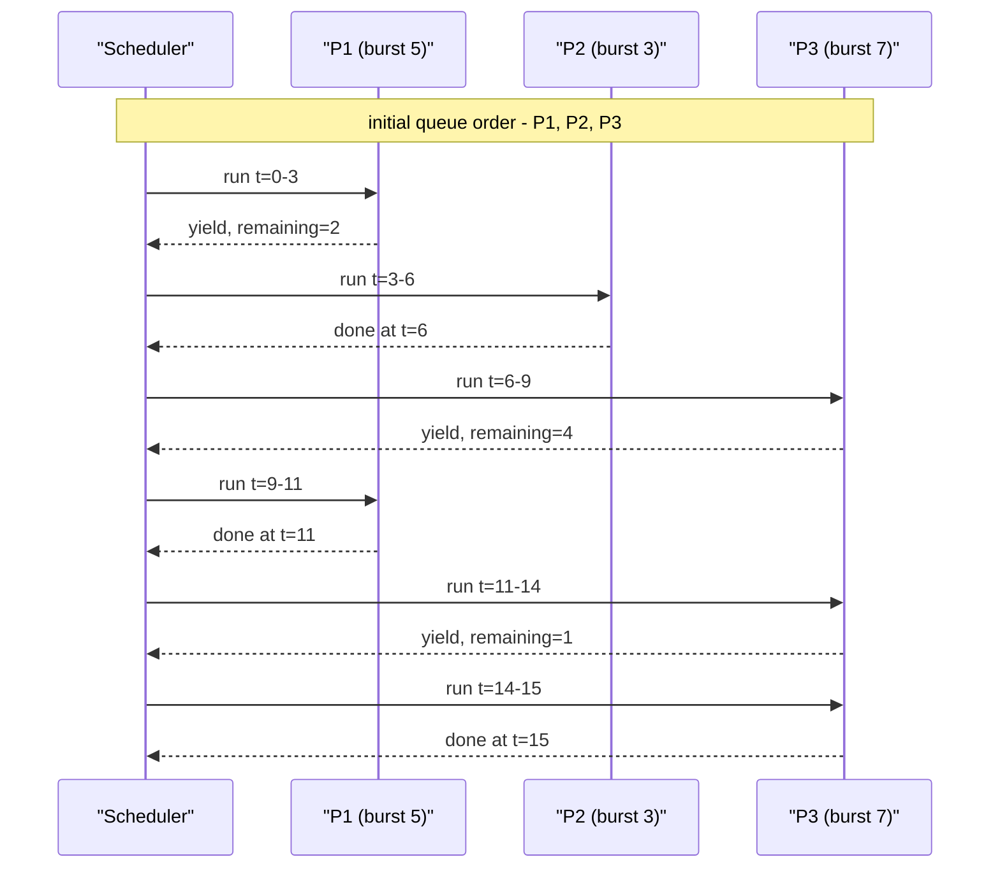
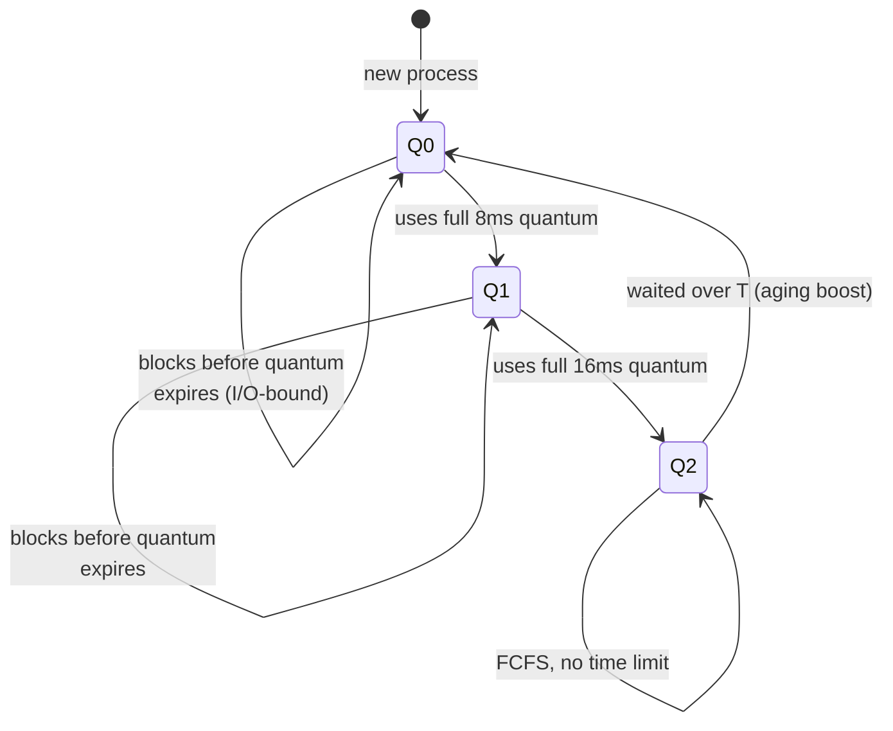
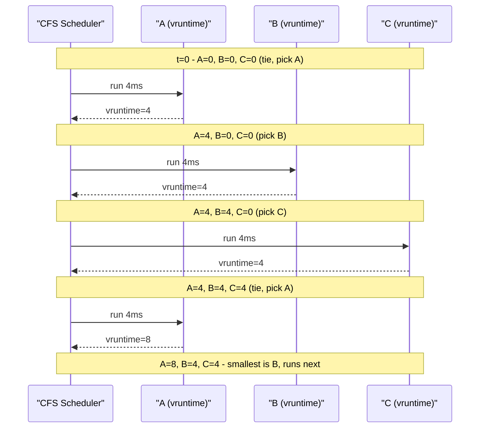
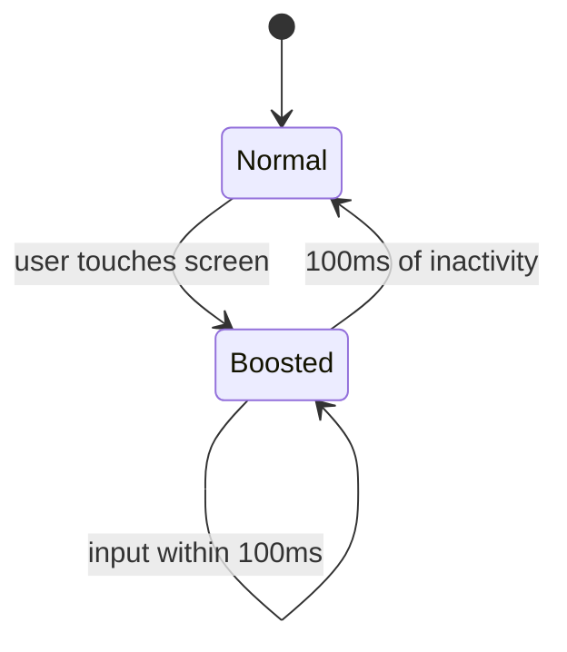
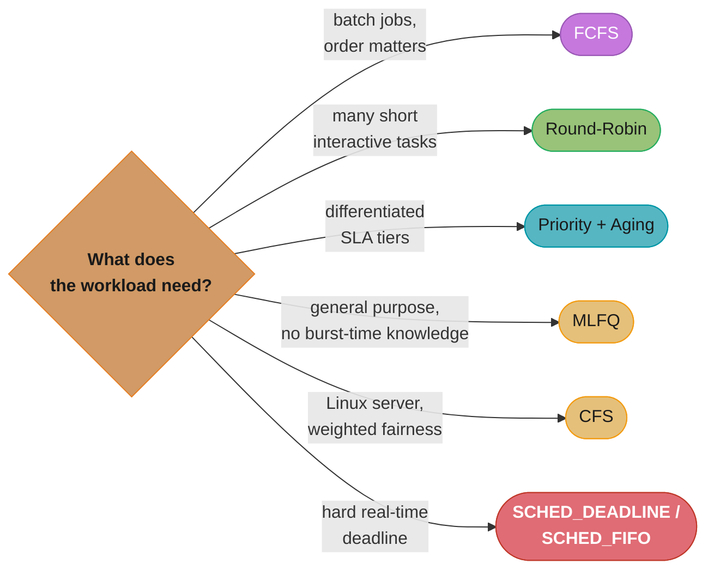
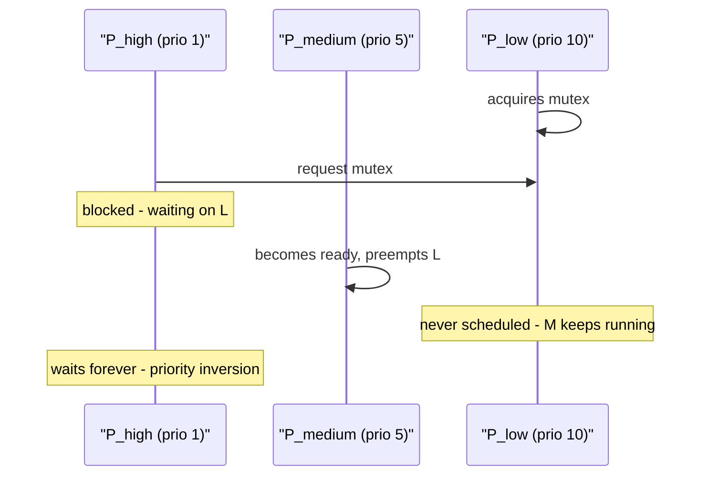
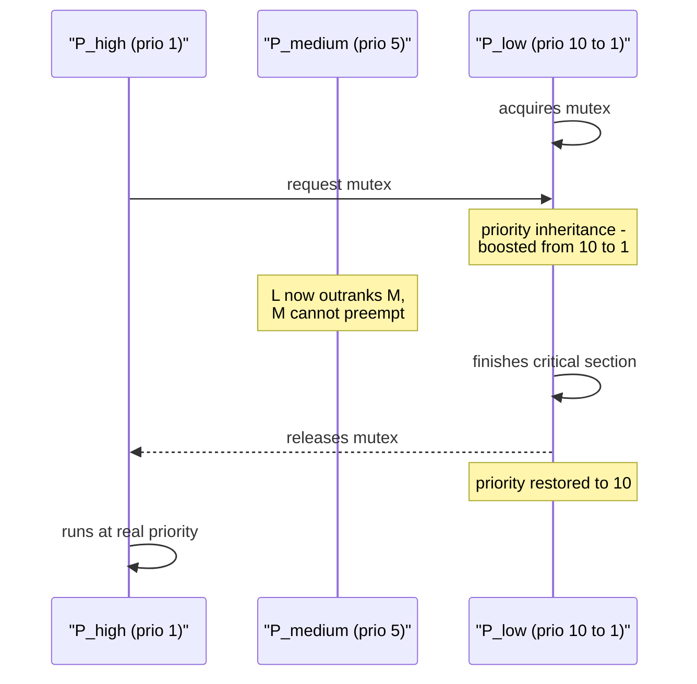

# CPU Scheduling Algorithms

> The OS scheduler is a traffic controller deciding which process gets the runway next — optimising for throughput, fairness, and responsiveness simultaneously.

---

## 1. Concept Overview

The CPU scheduler (dispatcher) selects from the pool of ready threads and assigns one to a CPU core. With n cores and m > n ready threads, the scheduler must decide: which thread gets a core, for how long, and under what preemption conditions.

Scheduling affects four key metrics: **throughput** (tasks completed per second), **latency/response time** (time from submission to first response), **turnaround time** (submission to completion), and **fairness** (each thread gets a proportional share of CPU over time). These metrics are often in tension — prioritising low-latency interactive tasks can starve batch jobs.

This module covers the classical scheduling algorithms (FCFS, SJF, SRTF, Round-Robin, Priority, MLFQ) and the Completely Fair Scheduler (CFS), which is used by the Linux kernel and is the scheduler behind every Linux server, Android device, and container workload.

---

## 2. Intuition

> **One-line analogy**: Scheduling is a checkout queue at a supermarket — FCFS serves in arrival order (fair but slow for short tasks); SJF is express lanes for small baskets (fast but requires knowing basket size); Round-Robin is a time-share where everyone gets 1 minute then rejoins the back of the queue; MLFQ is the store manager who promotes frequent small shoppers to express lanes after observing their behaviour.

**Mental model**: Model each thread as a job with an arrival time, a burst time (CPU work remaining), and possibly a priority. The scheduler's job is to order these jobs on the CPU, minimising a weighted combination of latency and fairness.

**Why it matters**: Scheduling directly determines user-perceived latency. A web server's request thread at priority 20 and a data-crunching batch job at priority 19 may differ by only 1 priority level — but if the scheduler doesn't preempt the batch job quickly enough, response times spike. Knowing CFS's virtual-runtime mechanism explains why `nice -n 19 python crunch.py` makes a script "politely" yield to other processes.

**Key insight**: All classical scheduling algorithms are approximations of the oracle algorithm **SRTN** (Shortest Remaining Time Next / SRTF). SRTN is optimal for minimising average waiting time but requires knowing future burst times — which is impossible in practice. Real schedulers approximate SRTN by using recent CPU usage as a proxy for future burst time.

---

## 3. Core Principles

**Preemptive vs non-preemptive**: A preemptive scheduler can forcibly remove a running thread from the CPU (on timer interrupt, or when a higher-priority thread becomes ready). A non-preemptive scheduler allows the thread to run until it voluntarily yields (blocks on I/O, calls sleep, or exits). Modern OS schedulers are preemptive.

**Time quantum (time slice)**: The maximum time a thread runs before the scheduler considers switching to another thread. Typical values: 4–100 ms. Short quanta improve interactive responsiveness but increase context-switch overhead. Long quanta improve throughput but increase latency for interactive tasks.

**Priority**: A numerical weight assigned to each thread. Higher-priority threads are scheduled before lower-priority ones. Linux nice values: -20 (highest priority) to +19 (lowest). Priority scheduling combined with preemption: a newly runnable high-priority thread immediately preempts the running thread.

**Starvation**: A low-priority thread that never gets CPU time because higher-priority threads are always ready. Prevention: aging (gradually increase priority of waiting threads), or guarantee a minimum time slice (CFS's minimum granularity).

**Multi-level feedback queue (MLFQ)**: Tracks a thread's recent behaviour. Threads that frequently use their full quantum are demoted (CPU-bound); threads that block early are promoted (I/O-bound/interactive). This approximates SRTN by observing actual behaviour rather than requiring future knowledge.

---

## 4. Types / Architectures / Strategies

### Classical Scheduling Algorithms

| Algorithm | Type | Optimal for | Problem |
|-----------|------|-------------|---------|
| FCFS | Non-preemptive | Simplicity | Convoy effect (short jobs stuck behind long ones) |
| SJF | Non-preemptive | Min avg waiting time | Requires knowing burst times; starvation of long jobs |
| SRTF | Preemptive SJF | Min avg waiting time (optimal) | Requires knowing remaining burst time |
| Round-Robin (RR) | Preemptive | Fairness, interactivity | Overhead for short quanta; poor for I/O-bound |
| Priority | Preemptive/Non-preemptive | Differentiated service | Starvation of low-priority threads |
| MLFQ | Preemptive | Approximates SRTN without knowledge | Complex; tunable parameters |
| CFS (Linux) | Preemptive | Weighted fairness | Complex; not strictly low-latency for real-time |

### Linux CFS (Completely Fair Scheduler)

CFS does not use fixed time quanta. Instead: each runnable thread has a **virtual runtime** (vruntime) — the total CPU time it has received, weighted by its priority (inverse of nice weight). The scheduler always runs the thread with the **smallest vruntime** — the thread that has received the least proportional CPU time. The data structure is a red-black tree sorted by vruntime.

Key properties:
- Fairness: over long periods, each thread gets exactly its proportional share.
- Minimum granularity: a thread gets at least `sched_min_granularity_ns` (default 4 ms) before being preempted.
- Target latency: `sched_latency_ns` (default 8–24 ms) — CFS aims for every runnable thread to get CPU at least once per target latency period.
- Weight: nice value → weight via a fixed lookup table (nice 0 = weight 1024; each nice level changes weight by ~25%).

---

## 5. Architecture Diagrams

### FCFS — Convoy Effect

```
Arrival order: P1(burst=10), P2(burst=2), P3(burst=1)

Gantt chart:
  |----P1(10)----|-P2(2)-|-P3(1)-|
  0             10      12      13

Waiting times: P1=0, P2=10, P3=12
Average waiting time: (0+10+12)/3 = 7.33

Optimal (SJF): |P3(1)|-P2(2)-|----P1(10)----|
               0      1       3             13
Waiting times: P1=3, P2=1, P3=0
Average: (3+1+0)/3 = 1.33 -> much better
```

### Decoding the Averages — FCFS vs SJF vs Round-Robin on One Process Set

This is the calculation every OS course and half of all systems interviews ask you to perform. It is worth doing slowly and completely, once, on the process set already above.

**The idea behind it.** "The scheduler cannot change how much work there is — total CPU time is fixed at 13 ms no matter what. All it can change is *who waits while someone else runs*, and the average waiting time is the single number that scores that choice."

Every algorithm below finishes the same three jobs using the same 13 ms of CPU. The averages differ by more than 5x purely from ordering. That is the entire lesson of scheduling theory.

| Symbol | What it actually is |
|--------|---------------------|
| arrival | When the process becomes runnable. All three arrive at t=0 here |
| burst | CPU time the process needs. P1=10, P2=2, P3=1 |
| completion | Clock reading when the process finishes for good |
| turnaround | `completion - arrival`. Total wall-clock time the process existed |
| waiting | `turnaround - burst`. Time sat in the ready queue doing nothing |
| response | `first_run - arrival`. Time until *first* CPU, not until finish |
| quantum | RR's time slice. 3 ms here |

The one identity that prevents most arithmetic errors:

```
  waiting = turnaround - burst
          = (completion - arrival) - burst

  Compute completion times off the Gantt chart, then everything else
  is subtraction. Never try to accumulate waiting time directly.
```

**Walk one example with real numbers.** Process set P1(burst 10), P2(burst 2), P3(burst 1), all arriving at t=0, queue order P1 then P2 then P3, RR quantum 3:

```
  ===== FCFS ===== run in arrival order: P1, P2, P3
  |------------P1(10)------------|--P2(2)--|-P3(1)-|
  0                             10        12      13

        completion    turnaround = comp - 0    waiting = ta - burst
  P1        10             10                    10 - 10 =  0
  P2        12             12                    12 -  2 = 10
  P3        13             13                    13 -  1 = 12
                     sum = 35                    sum     = 22
       avg turnaround = 35 / 3 = 11.67    avg waiting = 22 / 3 = 7.33

  ===== SJF ===== non-preemptive, shortest burst first: P3, P2, P1
  |P3(1)|--P2(2)--|------------P1(10)------------|
  0     1         3                             13

        completion    turnaround               waiting
  P3         1              1                    1 -  1 =  0
  P2         3              3                    3 -  2 =  1
  P1        13             13                   13 - 10 =  3
                     sum = 17                    sum     =  4
       avg turnaround = 17 / 3 =  5.67    avg waiting =  4 / 3 = 1.33

  ===== ROUND-ROBIN, quantum = 3 =====
  slice-by-slice trace (queue shown after each slice):

    t= 0- 3  P1 runs 3, remaining 7   queue: P2, P3, P1
    t= 3- 5  P2 runs 2, DONE at 5     queue: P3, P1        (needed < quantum)
    t= 5- 6  P3 runs 1, DONE at 6     queue: P1
    t= 6- 9  P1 runs 3, remaining 4   queue: P1
    t= 9-12  P1 runs 3, remaining 1   queue: P1
    t=12-13  P1 runs 1, DONE at 13    queue: empty

  |--P1--|-P2-|P3|--P1--|--P1--|P1|
  0      3    5  6      9     12  13

        completion    turnaround               waiting
  P1        13             13                   13 - 10 =  3
  P2         5              5                    5 -  2 =  3
  P3         6              6                    6 -  1 =  5
                     sum = 24                    sum     = 11
       avg turnaround = 24 / 3 =  8.00    avg waiting = 11 / 3 = 3.67

  ===== SCOREBOARD =====
  Algorithm  avg waiting   avg turnaround   P3 waits   dispatches
  ---------  -----------   --------------   --------   ----------
  FCFS          7.33           11.67          12          3
  SJF           1.33            5.67           0          3
  RR (q=3)      3.67            8.00           5          6

  Same 13 ms of work in every row. FCFS makes the 1 ms job wait 12 ms
  behind the 10 ms job -- the convoy effect, costing it 12x its own runtime.
```

**Why SJF wins the average and still loses in practice.** SJF is provably optimal for average waiting time, and the reason is visible in the arithmetic: putting a job of burst `b` first adds `b` to the wait of *every* job behind it, so the total waiting time is minimised by front-loading the smallest bursts. Running P1 first charges its 10 ms to two other processes (20 ms of induced waiting); running it last charges nobody. Yet SJF is unusable as a general-purpose scheduler for two reasons the table cannot show — it requires knowing burst times in advance, which no OS does, and a steady arrival of short jobs starves P1 forever. Round-Robin's 3.67 is the deliberate compromise: it gives up 2.34 ms of average waiting against SJF and pays 6 dispatches instead of 3, and buys back a bounded response time (no process waits more than one full queue cycle for *first* CPU) plus immunity to starvation. MLFQ, further down, is the attempt to get SJF's numbers without SJF's oracle — it *infers* short bursts by watching which processes yield before their quantum expires.

### Round-Robin (Quantum = 3)



Each process gets a 3 ms slice before rejoining the back of the queue. Turnaround: P1=11, P2=6, P3=15 (average 10.67); response time: P1=0, P2=3, P3=6 — every process is touched within one quantum cycle, which is why RR beats FCFS on interactivity.

### MLFQ — Queue Demotion



Q0 is the high-priority queue (8ms quantum), Q1 is mid (16ms), Q2 is low (plain FCFS). An interactive web request that blocks after ~3ms of CPU stays in Q0 for low latency; a CPU-bound batch job burns through its full quantum at each level and sinks to Q2, returning to Q0 only via aging.

### CFS Virtual Runtime



CFS always dispatches the runnable thread with the smallest vruntime (kept in a red-black tree), so three equal-weight (nice 0) threads converge on exactly 33% of CPU each. A thread at nice=-5 has 3x the weight of nice=0, so its vruntime advances only 1/3 as fast and it earns 3x more CPU time.

**Stated plainly.** "Charge every thread a bill for the CPU time it uses, but let high-priority threads pay a discounted rate — then always run whoever owes the least."

Priority in CFS is not a queue position and not a bigger time slice. It is a *billing rate*. That single reframing is what makes nice values predictable instead of folklore: a nice value maps to a weight, and CPU share is just that weight over the sum of all weights.

| Symbol | What it actually is |
|--------|---------------------|
| vruntime | Accumulated *billed* CPU time in nanoseconds. The red-black tree's sort key |
| weight | The thread's priority as a number. nice 0 = 1024, by definition |
| `1024 / weight` | Multiplier applied to real runtime before adding it to vruntime |
| nice | The user-facing knob, -20 to +19. *Higher* nice = nicer to others = less CPU |
| `w_i / sum(w)` | The steady-state fraction of CPU this thread receives |

**Walk one example with real numbers.** Three runnable threads, each given a 4 ms slice; A and B at nice 0, C at nice -5 (Linux weight table value 3121):

```
  weight comes from nice via a fixed table, ~25% per step: 1024 x 1.25^(-nice)
    nice  0 -> 1024                          (the definition)
    nice -5 -> 1024 x 1.25^5 = 3125 approx   (real kernel table says 3121)
    ratio 3121 / 1024 = 3.05  -> "nice -5 is about 3x the weight"

  vruntime charged for 4 ms of REAL CPU:
    A (w=1024):  4 ms x 1024/1024 = 4.00 ms billed   <- pays full price
    B (w=1024):  4 ms x 1024/1024 = 4.00 ms billed
    C (w=3121):  4 ms x 1024/3121 = 1.31 ms billed   <- pays 1/3 price

  Because the scheduler always picks the SMALLEST vruntime, C's slow-growing
  bill means C is picked back up roughly 3x as often:

    total weight = 1024 + 1024 + 3121 = 5169
    A share = 1024 / 5169 = 19.8%
    B share = 1024 / 5169 = 19.8%
    C share = 3121 / 5169 = 60.4%
              (19.8 + 19.8 + 60.4 = 100%)

  Sanity check with three equal nice-0 threads:
    1024 / (1024 x 3) = 33.3% each, exactly as the trace above shows.
```

**Why this beats fixed priorities and fixed quanta.** A strict priority scheduler answers "who runs next" and nothing else, which is why it starves low-priority threads — there is no accounting that ever lets them catch up. CFS's bill always grows for whoever is running, so *every* runnable thread eventually holds the minimum vruntime and gets the CPU; nice -5 makes C's turn come around three times as often, but it never stops A's turn from arriving. The knob is also composable: this is exactly the mechanism behind `cpu.shares` in cgroups, where a container's share is its weight over the sum of sibling weights, computed with the identical `w_i / sum(w)` arithmetic one level up the hierarchy.

---

## 6. How It Works — Detailed Mechanics

### Simulating Scheduling Algorithms

```python
from __future__ import annotations
from dataclasses import dataclass, field
from typing import List, Optional
from collections import deque
import heapq


@dataclass
class Process:
    pid: int
    arrival: int
    burst: int
    priority: int = 0      # lower = higher priority
    remaining: int = field(init=False)

    def __post_init__(self) -> None:
        self.remaining = self.burst


@dataclass
class Result:
    pid: int
    start: int
    finish: int

    @property
    def turnaround(self) -> int:
        return self.finish - self.start - (self.start - self.arrival)
    
    def waiting(self, arrival: int) -> int:
        return self.start - arrival


def fcfs(processes: List[Process]) -> List[Result]:
    """First Come First Served. O(n log n) for sort."""
    sorted_p = sorted(processes, key=lambda p: p.arrival)
    results = []
    time = 0
    for p in sorted_p:
        time = max(time, p.arrival)
        results.append(Result(p.pid, time, time + p.burst))
        time += p.burst
    return results


def sjf_preemptive(processes: List[Process]) -> List[Result]:
    """
    Shortest Remaining Time First (SRTF). Preemptive.
    Uses min-heap on (remaining_burst, arrival_time, pid).
    O(n log n).
    """
    events = sorted(processes, key=lambda p: p.arrival)
    heap: list[tuple[int, int, int, Process]] = []   # (remaining, arrival, pid, process)
    results: dict[int, tuple[int, int]] = {}          # pid -> (start, finish)
    time = 0
    idx = 0
    n = len(processes)
    completed = 0

    while completed < n:
        # Enqueue all processes that have arrived by time
        while idx < n and events[idx].arrival <= time:
            p = events[idx]
            heapq.heappush(heap, (p.remaining, p.arrival, p.pid, p))
            idx += 1

        if not heap:
            time = events[idx].arrival
            continue

        remaining, arrival, pid, p = heapq.heappop(heap)
        start = time
        # Run until next arrival or completion
        next_arrival = events[idx].arrival if idx < n else float("inf")
        run_for = min(remaining, next_arrival - time)
        time += run_for
        p.remaining -= run_for

        if p.remaining == 0:
            results[pid] = (arrival, time)
            completed += 1
        else:
            heapq.heappush(heap, (p.remaining, arrival, pid, p))

    return [Result(pid=pid, start=arr, finish=fin) for pid, (arr, fin) in results.items()]


def round_robin(processes: List[Process], quantum: int) -> List[Result]:
    """Round-Robin scheduling. O(n * burst / quantum)."""
    sorted_p = sorted(processes, key=lambda p: p.arrival)
    queue: deque[Process] = deque()
    results: dict[int, tuple[int, int, int]] = {}   # pid -> (arrival, start, finish)
    time = 0
    idx = 0
    n = len(processes)

    while idx < n or queue:
        if not queue:
            time = sorted_p[idx].arrival
        # Enqueue arrivals
        while idx < n and sorted_p[idx].arrival <= time:
            queue.append(sorted_p[idx])
            idx += 1

        p = queue.popleft()
        if p.pid not in results:
            results[p.pid] = (p.arrival, time, -1)

        run = min(p.remaining, quantum)
        time += run
        p.remaining -= run

        # Enqueue new arrivals while running
        while idx < n and sorted_p[idx].arrival <= time:
            queue.append(sorted_p[idx])
            idx += 1

        if p.remaining > 0:
            queue.append(p)
        else:
            arr, start, _ = results[p.pid]
            results[p.pid] = (arr, start, time)

    return [Result(pid=pid, start=arr, finish=fin) for pid, (arr, _, fin) in results.items()]
```

### CFS Virtual Runtime Simulation

```python
import heapq
from dataclasses import dataclass, field


@dataclass(order=True)
class CFSTask:
    vruntime: float             # sort key
    weight: int = field(compare=False, default=1024)   # nice 0
    name: str = field(compare=False, default="")
    remaining_us: int = field(compare=False, default=0)


def cfs_simulate(tasks: list[CFSTask], total_time_us: int) -> None:
    """
    Simplified CFS simulation.
    Each tick: run the task with minimum vruntime for min_granularity.
    """
    min_granularity_us = 750    # 0.75 ms
    heap = list(tasks)
    heapq.heapify(heap)
    time = 0

    while time < total_time_us and heap:
        task = heapq.heappop(heap)
        run_us = min(min_granularity_us, task.remaining_us)
        task.remaining_us -= run_us
        # vruntime advances inversely proportional to weight
        task.vruntime += run_us * (1024 / task.weight)
        time += run_us
        if task.remaining_us > 0:
            heapq.heappush(heap, task)
        print(f"  t={time:6d}µs: ran {task.name} for {run_us}µs, vruntime={task.vruntime:.1f}")
```

---

## 7. Real-World Examples

**Linux CFS in containers**: Docker and Kubernetes use Linux cgroups to limit CPU: `cpu.shares` maps to CFS weights, `cpu.cfs_quota_us / cpu.cfs_period_us` sets hard CPU limits. A container with `--cpus=0.5` gets at most 50% of one CPU — the kernel uses CFS bandwidth control to enforce this. See [`devops/linux_and_os_fundamentals`](../../devops/linux_and_os_fundamentals/).

**Android UI responsiveness**: Android uses CFS with priority boosting for the UI thread. When the user touches the screen, the UI thread is boosted to a high priority for ~100 ms to ensure sub-16 ms frame rendering (60 FPS = 16.67 ms per frame). After 100 ms of inactivity, it returns to normal priority.



The UI thread's priority is a two-state lifecycle keyed on touch activity: boosted for about 100 ms after each touch to hit the 16.67 ms (60 FPS) frame budget, then dropped back to normal CFS priority once input goes quiet.

**Database server process priorities**: PostgreSQL autovacuum runs at `nice +10` by default — lower priority than query-serving processes. This prevents maintenance operations from starving user queries, at the cost of autovacuum potentially falling behind during high-load periods.

**Real-time scheduling in Linux**: `SCHED_FIFO` and `SCHED_RR` are real-time policies that preempt all CFS threads. Used for latency-sensitive tasks (audio processing, industrial control). `SCHED_DEADLINE` (EDF — Earliest Deadline First) is the theoretical-optimal real-time scheduler, available since Linux 3.14.

---

## 8. Tradeoffs

### Algorithm Comparison

| Algorithm | Avg Wait | Throughput | Fairness | Starvation | Response time |
|-----------|----------|------------|----------|------------|---------------|
| FCFS | High (convoy) | Moderate | Weak | None | High for short jobs |
| SJF | Optimal | High | Weak | Long jobs | Low for short jobs |
| SRTF | Optimal (preemptive) | Highest | Weak | Long jobs | Optimal |
| Round-Robin | Moderate | Lower overhead | High | None | Good |
| Priority | Variable | Variable | Weak | Low priority | Good for high prio |
| MLFQ | Approximates SRTF | High | Good | With aging | Good |
| CFS | Fair weighted | High | Excellent | None (min gty) | Good |

### Time Quantum Tradeoff

| Quantum | Response time | Throughput | Context switches |
|---------|--------------|------------|-----------------|
| Very short (1 ms) | Excellent | Poor (overhead) | Very high |
| Short (4–10 ms) | Good | Good | High |
| Medium (50–100 ms) | Moderate | Good | Moderate |
| Very long (infinite) | Poor (= FCFS) | Good | Minimal |

**Rule of thumb**: Quantum should be much larger than context-switch cost (~1 µs) but small enough to provide good response time. Linux's CFS min granularity is 4 ms.

**What the formula is telling you.** "Every time slice ends you burn a fixed setup cost, so the fraction of the CPU you lose to overhead is just that cost divided by the slice length — shrink the slice and the tax rate climbs."

The table's "Poor (overhead)" verdict on a 1 ms quantum only makes sense once you separate the two costs a switch carries: the *direct* register-save-and-restore, and the *indirect* cache and TLB refill that follows.

| Symbol | What it actually is |
|--------|---------------------|
| quantum `q` | Length of one time slice before preemption |
| `c` | Direct context-switch time — save/restore registers, swap page tables. ~1 µs |
| `c / (q + c)` | Share of wall-clock time spent switching rather than computing |
| indirect cost | Cold L1/L2/TLB after the switch. Not in `c`, often several times larger |

**Walk one example with real numbers.** Direct switch cost 1 µs = 0.001 ms, across the quanta in the table above:

```
  overhead = c / (q + c)

  quantum q      c / (q + c)              overhead     table verdict
  -------------  -----------------------  -----------  ----------------------
  0.1 ms         0.001 / 0.101            0.9901%      (below the table)
  1   ms         0.001 / 1.001            0.0999%      "Poor (overhead)"
  4   ms         0.001 / 4.001            0.0250%      Linux CFS min granularity
  10  ms         0.001 / 10.001           0.0100%      "Good"
  100 ms         0.001 / 100.001          0.0010%      "Moderate response time"

  Direct cost alone does NOT justify calling 1 ms "poor" -- 0.1% is nothing.
  The real bill is indirect: after each switch the new thread runs with a cold
  L1 and a flushed TLB, and refilling those costs several microseconds of
  degraded execution that never appears in the 1 us figure.
```

**Why the quantum is chosen from the response-time side instead.** Since direct overhead is negligible above ~1 ms, the binding constraint is the other end: with `n` runnable threads, the worst-case wait for first CPU is `(n - 1) x q`. At `q = 100 ms` and 10 runnable threads that is 900 ms — visibly unresponsive — while at `q = 4 ms` it is 36 ms, under a typical interaction budget. This is why CFS sets a *target latency* (`sched_latency_ns`, 8-24 ms) and divides it among runnable threads rather than fixing a quantum, and why it clamps the result at `sched_min_granularity_ns` (4 ms): the clamp exists precisely to stop a large `n` from driving slices down into the region where cache-refill overhead starts to dominate.

---

## 9. When to Use / When NOT to Use

**FCFS**: Use only for batch systems where all tasks are equal priority and arrival order matters. Never use for interactive systems — one long-running task blocks all others (convoy effect).

**Round-Robin**: Good for time-sharing systems with many short interactive tasks. Poor for mixed CPU-bound + I/O-bound workloads (I/O-bound tasks are penalised for not using their full quantum).

**Priority scheduling**: Use when tasks have different service-level requirements (OS threads vs user threads, real-time vs batch). Must pair with aging to prevent starvation.

**MLFQ**: Best approximation of SRTF without prior knowledge. Used in general-purpose OS schedulers (Windows MLFQ, earlier Linux). Requires careful tuning of queue levels and quantum sizes.

**CFS**: Default for Linux (and thus most of the world's servers). Ideal when you want fair CPU allocation with optional weighting (nice values). Not suitable for hard real-time tasks (use SCHED_DEADLINE or SCHED_FIFO instead).



A quick decision guide distilling the five profiles above: match the workload's knowledge, latency, and fairness needs to the scheduler that targets them, falling back to a dedicated real-time policy when CFS's fairness guarantees are not tight enough.

---

## 10. Common Pitfalls

### Pitfall 1 — Priority inversion (high-priority thread blocked by low-priority thread)



Real incident: Mars Pathfinder (1997) — priority inversion caused repeated system resets until VxWorks priority inheritance, which had been disabled, was turned back on.



FIX — Priority Inheritance Protocol (PIP): while P_low holds a mutex that P_high is waiting for, the OS temporarily boosts P_low's priority to P_high's level so it finishes and releases the mutex quickly; P_low's priority is then restored. In Java, `ReentrantLock` priority inheritance is OS-dependent; in POSIX, use `pthread_mutexattr_setprotocol(PTHREAD_PRIO_INHERIT)`.

### Pitfall 2 — Starvation from pure priority scheduling

```python
# BROKEN: low-priority thread never runs if high-priority threads are always ready
import threading, time

results = []

def low_priority_work():
    time.sleep(0.001)   # simulate computation
    results.append("low")

def high_priority_work():
    while True:   # continuous high-priority work
        pass      # keeps CPU busy -> low-priority thread starves
```

```python
# FIX option 1: Use nice values to give low-priority thread some CPU but less
# FIX option 2: MLFQ (demote high-priority CPU-bound thread over time)
# FIX option 3: Aging — increase priority of waiting threads periodically
# FIX option 4: Reserve CPU quota for low-priority tasks (cgroup cpu.shares)
```

### Pitfall 3 — Thrashing due to too many runnable threads

```
Problem: 10,000 runnable OS threads on an 8-core machine.
  Round-Robin quantum = 10ms.
  Time to cycle through all threads = 10,000 * 10ms = 100 seconds!
  Effective scheduling latency per thread = 100 seconds.
  Context-switch overhead: 10,000 switches/second * 5µs = 5% CPU wasted.
```

```
FIX: Reduce the number of OS threads.
  Use a thread pool with max_workers = 2-4 * CPU_count for CPU-bound.
  Use async I/O (asyncio, epoll) for I/O-bound work.
  Use M:N threading (goroutines, virtual threads) for high-concurrency I/O.
```

### Pitfall 4 — Ignoring the convoy effect in FCFS

```
BROKEN: Using FCFS for a web server request queue.
  Long HTML generation task (50ms) arrives before 1000 lightweight health-check requests (0.1ms each).
  Result: 1000 requests wait 50ms each -> p99 latency = 50ms.
  
FIX: Use priority queue (health checks get higher priority) or
     Round-Robin with short quanta to interleave requests.
```

### Pitfall 5 — Misunderstanding Linux nice values

```bash
# BROKEN assumption: nice -n 19 makes a process run "only when idle"
# Reality: nice=19 gets 1/4 of normal (nice=0) CPU time when both are runnable.
# A nice=19 process WILL run and consume CPU if no nice=0 processes are competing.

# FIX: if you truly want background-only execution, use:
#   cgroups cpu.cfs_quota_us to hard-limit CPU time, OR
#   schedtool -B <pid> for SCHED_BATCH (optimised for throughput, lower priority than normal)
```

---

## 11. Technologies & Tools

| Tool | Purpose | Notes |
|------|---------|-------|
| `nice` / `renice` | Set/change process priority (nice value -20 to +19) | User can only increase nice (reduce priority) without root |
| `chrt` | Set real-time scheduling policy (SCHED_FIFO, SCHED_RR, SCHED_DEADLINE) | Requires root; use with care |
| `taskset` | Pin process/thread to specific CPU cores | Reduces cache misses; used in latency-sensitive services |
| `perf sched` | Profile scheduler behaviour (latency, wakeups) | `perf sched latency` shows scheduling delays |
| `/proc/<pid>/sched` | Per-process scheduler stats (vruntime, nr_switches) | Read-only; live data |
| `cgroups cpu.shares` | Weighted CPU allocation between cgroup groups | Used by Docker `--cpu-shares` |
| `cgroups cpu.cfs_quota_us` | Hard CPU limit per scheduling period | Used by Docker `--cpus=0.5` |
| `schedtool` | Inspect/set scheduling policy per thread | Linux; `schedtool -I <pid>` for idle scheduling |

---

## 12. Interview Questions with Answers

**Q1: What is the convoy effect in FCFS and why is it a problem?**
In FCFS, a long CPU-bound process at the head of the queue blocks all subsequent processes until it completes. If a 30-second job arrives just before 100 one-second jobs, all 100 jobs wait 30 seconds before getting any CPU. Average waiting time becomes O(longest_burst). Interactive systems are severely affected because even tiny requests (mouse events, key presses) queue behind long batch jobs. Solution: preemptive scheduling with prioritisation for short tasks.

**Q2: Why is SJF optimal for minimising average waiting time, and what makes it impractical?**
SJF is optimal because it can be proved by exchange argument: if any two adjacent jobs are out of SJF order, swapping them reduces average waiting time (a shorter job waiting for a longer one increases the short job's wait by the longer job's burst; swapping eliminates this). SJF is impractical because burst times are not known in advance. Approximation: predict next burst as exponential moving average of past bursts: τ_{n+1} = α × t_n + (1-α) × τ_n (α typically 0.5).

**Q3: How does Round-Robin differ from FCFS in terms of response time and throughput?**
Response time: RR is much better — every process gets CPU within one quantum period (10–50 ms is typical). A new process waits at most (n-1) × quantum if there are n runnable processes. Throughput: RR is slightly lower than FCFS because context-switch overhead is paid frequently. For purely CPU-bound tasks with equal bursts, RR's turnaround time is actually worse than FCFS (each task completes later because it interleaves). RR excels for interactive workloads where response time matters more than turnaround time.

**Q4: What is Multi-Level Feedback Queue (MLFQ) and how does it approximate SRTF?**
MLFQ maintains multiple queues with decreasing priority and increasing quantum. New processes start in the highest-priority queue (short quantum). If a process uses its full quantum, it is demoted to a lower queue (assumed to be CPU-bound, given longer quantum). If it blocks before its quantum expires, it stays in the same or higher queue (assumed to be interactive/I/O-bound, needs low latency). CPU-bound processes are demoted over time; I/O-bound processes stay at high priority — approximating "give short jobs priority" without knowing burst times. Aging prevents starvation.

**Q5: What is the Completely Fair Scheduler (CFS) and how is it different from Round-Robin?**
CFS tracks each runnable thread's virtual runtime — the total CPU time received, inversely weighted by nice priority. CFS always runs the thread with the smallest vruntime (minimum in a red-black tree). Unlike RR's fixed quantum, CFS's effective quantum is dynamic: the target latency (8–24 ms) divided by the number of runnable threads. Fairness guarantee: each thread gets exactly its proportional share over time. CFS weights are exponential in nice level: each nice level changes weight by ~25%.

**Q6: What is priority inversion and how does priority inheritance solve it?**
Priority inversion: a high-priority thread H waits for a mutex held by low-priority thread L; a medium-priority thread M preempts L and runs indefinitely; H is blocked because M prevents L from releasing the mutex. Priority inheritance: when L holds a mutex that H is waiting for, the OS temporarily boosts L's priority to H's level. L finishes quickly, releases the mutex, H unblocks. L's priority returns to its normal level. Example: Mars Pathfinder (1997) — a VxWorks real-time system reset repeatedly due to priority inversion until priority inheritance was re-enabled.

**Q7: What is the time quantum selection tradeoff in Round-Robin?**
Short quantum (1 ms): excellent response time (every process gets CPU within n ms); poor throughput because context-switch overhead (~5 µs) becomes a significant fraction of the quantum (0.5%). Long quantum (100 ms): good throughput; poor response time for n > 10 processes (wait up to 1 second). Sweet spot: quantum >> context-switch time, but small enough for interactive responsiveness. Linux CFS uses a minimum granularity of 4 ms and a target latency of 8–24 ms.

**Q8: How does SCHED_DEADLINE work in Linux and when should you use it?**
SCHED_DEADLINE implements Earliest Deadline First (EDF) — the theoretically optimal real-time scheduling algorithm. Each task specifies runtime (max CPU time per period), deadline (must finish within deadline of activation), and period. Linux guarantees that the task runs for `runtime` within every `period`, preempting other tasks if necessary. Use for hard real-time tasks (audio processing at 48 kHz needs 0.02 ms of work every 0.021 ms). Not suitable for general-purpose scheduling — requires careful capacity planning (sum of runtime/period over all SCHED_DEADLINE tasks must be ≤ 1 per CPU).

**Q9: What is the difference between CPU burst and I/O burst, and how do they affect scheduling?**
A CPU burst is a period of pure computation without I/O. An I/O burst is a period blocked waiting for disk/network. Most interactive processes alternate short CPU bursts with I/O bursts. Most batch/compute processes have long CPU bursts and rare I/O. Schedulers (MLFQ, CFS) try to detect burst patterns: frequent short CPU bursts → high priority (interactive, I/O-bound); infrequent long CPU bursts → lower priority (CPU-bound). The scheduler classifies processes by observed behaviour, not by declaration.

**Q10: How does the Linux `nice` value map to CFS scheduling priority?**
Nice values: -20 (highest priority) to +19 (lowest). CFS maps each nice value to a weight using a fixed table where adjacent nice levels differ by ~25% (factor 1.25). Nice 0 → weight 1024. Nice -1 → weight 1277 (1024 × 1.25). Nice +1 → weight 820 (1024 / 1.25). A process at nice -20 gets 1024 / 15 ≈ 68× more CPU than a process at nice +19 when both are runnable. A process at nice +19 is not "idle-only" — it still gets CPU when no higher-priority process wants it.

**Q11: What is scheduling latency vs throughput, and how do they conflict?**
Scheduling latency: time from a thread becoming runnable to when it actually gets CPU. Throughput: tasks completed per second. They conflict because reducing latency requires frequent context switches (preempt the running task quickly for the newly ready task), and context switches have overhead (~1–10 µs) that reduces CPU time available for actual work. Real-time systems minimise latency (preempt immediately); batch systems maximise throughput (run tasks to completion). Servers balance: low latency for interactive requests, high throughput for batch jobs.

**Q12: How does CPU affinity improve performance and when do you use it?**
CPU affinity (taskset, pthread_setaffinity_np) pins a thread to specific CPU cores. Benefits: (1) Warm L1/L2 cache — if a thread always runs on the same core, its working set stays in that core's private L1/L2 (~few µs access) instead of migrating to a different core's cold cache (~40 ns L3 miss). (2) Reduced NUMA overhead on multi-socket servers — pin processes to the socket with local memory. (3) Predictable latency for real-time tasks. Use in: database servers (pin the hot shard to a core), trading systems (pin the order-matching engine to an isolated core), and network packet processing (poll-mode drivers with per-core queues).

**Q13: What is work stealing in multi-core scheduling and why is it important for task-parallel programs?**
Work stealing: each CPU has a local deque of tasks. A CPU that runs out of work steals tasks from the back (LIFO) of another CPU's deque. The owning CPU takes tasks from the front (LIFO for locality). Work stealing achieves near-optimal load balancing with minimal synchronisation — steals are rare (only when idle). Used in: Java's ForkJoinPool, Go's goroutine scheduler, Cilk (MIT), and Intel TBB. It is why `ForkJoinPool.commonPool()` used by Java's parallel streams is efficient for divide-and-conquer workloads.

**Q14: What is the difference between preemptive and non-preemptive scheduling and why does it matter for latency?**
Preemptive: the OS can forcibly take the CPU from a running thread (on timer interrupt or higher-priority thread wake-up). Non-preemptive: a thread runs until it voluntarily yields. Preemptive scheduling guarantees bounded scheduling latency: a high-priority thread waiting for CPU will get it within one time quantum (4–10 ms). Non-preemptive scheduling can delay arbitrarily — a compute-bound thread that never yields blocks everyone. Modern OS schedulers are fully preemptive. The Linux real-time preemption patch (PREEMPT_RT) makes even kernel code fully preemptible, achieving sub-100 µs scheduling latency for SCHED_FIFO tasks.

**Q15: How does CPU scheduling interact with cache performance?**
Every context switch has a "cache footprint" cost: the evicted process's working set is flushed from L1/L2 caches (often 128 KB–1 MB); the incoming process starts with cold caches. On a 4-core machine with 6 MB shared L3: if 10 threads each have 1 MB working sets, only 6 can be "warm" at once — the other 4 incur L3 misses (~40 ns each) or even DRAM reads (~100 ns). For latency-sensitive services, limiting the number of runnable threads to fit their combined working sets in L3 improves performance more than scheduler tuning.

---

## 13. Best Practices

**Use thread pools instead of unbounded thread creation**: Unbounded threads lead to thrashing (too many runnable threads, high context-switch overhead). Set thread pool size to match the workload (CPU count for CPU-bound; higher for I/O-bound but still bounded).

**Use `nice` and cgroups for workload prioritisation**: For mixed-workload servers, set batch jobs to nice +10 or higher. Use cgroups `cpu.shares` (relative weight) for container-level fairness, and `cpu.cfs_quota_us` for hard limits.

**Measure scheduling latency, not just throughput**: A server with 100% throughput at 10,000 QPS may have a p99 latency of 5 seconds if scheduler latency spikes. Use `perf sched latency` and histogram-based latency monitoring.

**Pin latency-critical threads to isolated CPU cores**: In trading systems and real-time audio, isolate cores from the general scheduler (Linux `isolcpus=` boot parameter) and pin the critical thread to that core. Eliminates scheduling preemption for the critical thread.

---

## 14. Case Study

### Scenario: API Server Request Prioritisation

A REST API serves both high-priority user-facing requests (<5 ms SLA) and low-priority background sync tasks (best-effort). Design the scheduling model.

```python
from __future__ import annotations
import heapq
from enum import IntEnum
from typing import Optional
from dataclasses import dataclass, field


class Priority(IntEnum):
    HIGH = 0      # user-facing API requests
    NORMAL = 5    # internal service calls
    LOW = 10      # background sync, bulk export


@dataclass(order=True)
class Request:
    priority: int
    arrival_time: float
    request_id: str = field(compare=False)
    handler: object = field(compare=False)


class PriorityRequestScheduler:
    """
    Priority-based request scheduler with starvation prevention (aging).
    """
    def __init__(self, aging_threshold_ms: float = 500.0) -> None:
        self.queue: list[Request] = []
        self.aging_threshold = aging_threshold_ms
        self.current_time = 0.0

    def submit(self, req: Request) -> None:
        heapq.heappush(self.queue, req)

    def next_request(self, current_time_ms: float) -> Optional[Request]:
        self.current_time = current_time_ms
        # Age requests: boost priority if waiting > threshold
        for req in self.queue:
            wait_time = current_time_ms - req.arrival_time
            if wait_time > self.aging_threshold and req.priority > Priority.HIGH:
                req.priority -= 1   # promote by 1 priority level
        heapq.heapify(self.queue)    # re-heapify after mutations
        return heapq.heappop(self.queue) if self.queue else None
```

**BROKEN — FCFS queue ignoring priorities**:

```python
# BROKEN: simple FIFO queue; background tasks block user requests
from collections import deque

class BrokenFIFOScheduler:
    def __init__(self):
        self.queue = deque()

    def submit(self, req):
        self.queue.append(req)   # all requests equal; FCFS

    def next_request(self):
        return self.queue.popleft() if self.queue else None

# Impact: a 500ms bulk export task blocking 100 user-facing requests (each 1ms)
# -> 100 requests wait 500ms each -> p99 latency = 500ms (SLA breached)
```

```python
# FIX: priority queue with aging; high-priority requests jump the queue
# -> user requests (prio=0) always run before background tasks (prio=10)
# -> aging prevents background tasks from waiting > 500ms
# -> p99 latency for user requests: < 5ms even under background load
```

**Capacity planning**:

| Metric | FCFS (broken) | Priority + Aging (fixed) |
|--------|---------------|--------------------------|
| p50 user request latency | 1 ms | 1 ms |
| p99 user request latency | 500 ms (blocked by bulk) | < 5 ms |
| Background task max wait | 0 ms (runs immediately) | 500 ms (aging threshold) |
| Starvation of background | None | Prevented by aging |

**Discussion questions**:
1. How would you implement priority-based scheduling in a thread pool without modifying the OS scheduler?
2. What is the risk of setting the aging threshold too low?
3. How does Kubernetes CPU requests/limits map to Linux CFS `cpu.shares` and `cpu.cfs_quota_us`?

---

## See Also

- [processes_threads_and_context_switching](../processes_threads_and_context_switching/) — what gets switched and what it costs
- [deadlocks_and_synchronization](../deadlocks_and_synchronization/) — priority inversion (affects scheduling)
- [`devops/linux_and_os_fundamentals`](../../devops/linux_and_os_fundamentals/) — CFS in production (cgroups, nice, taskset, perf)
- [`java/concurrency`](../../java/concurrency/) — Java thread priorities, ForkJoinPool work-stealing
