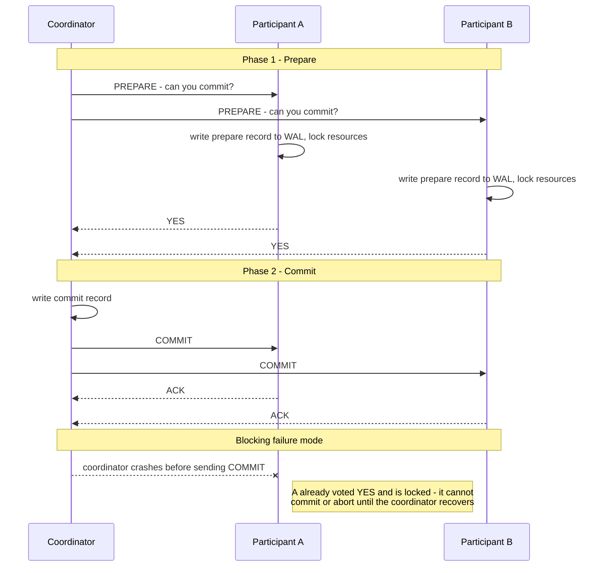
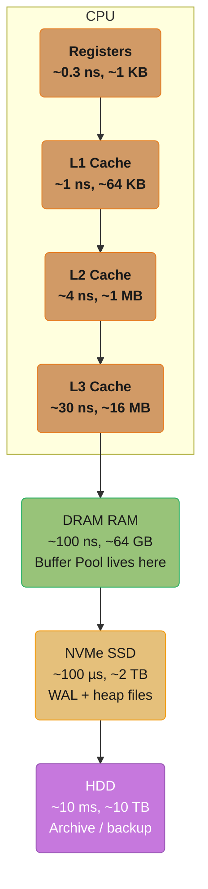
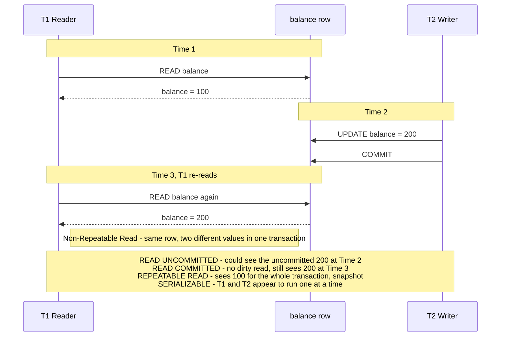
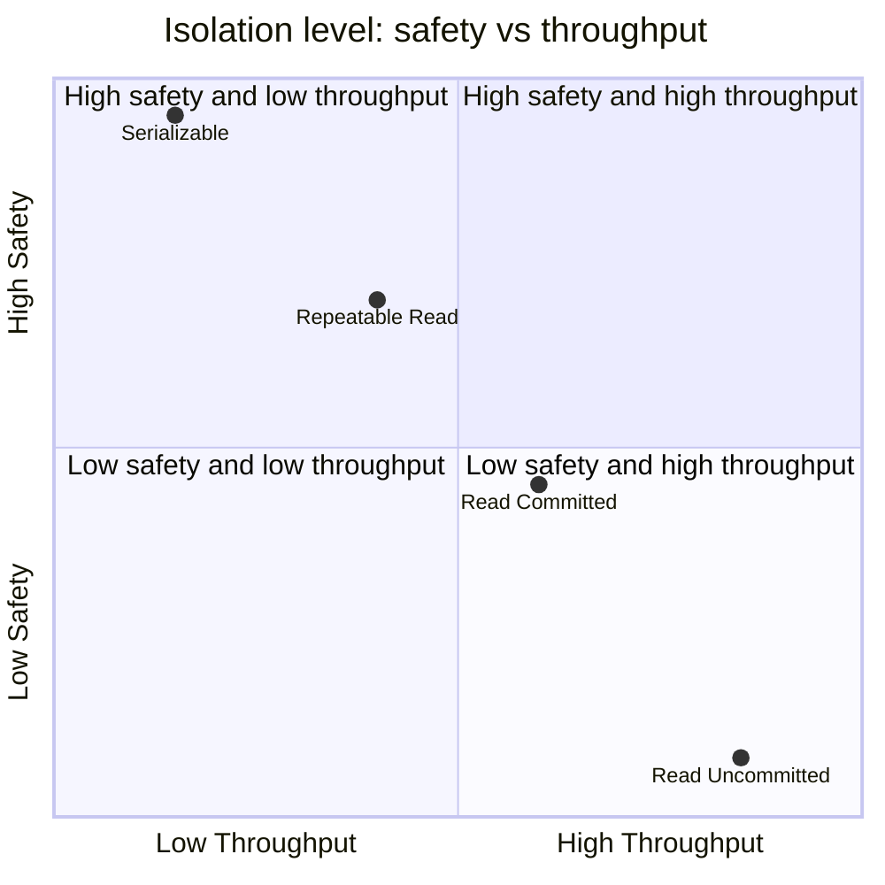
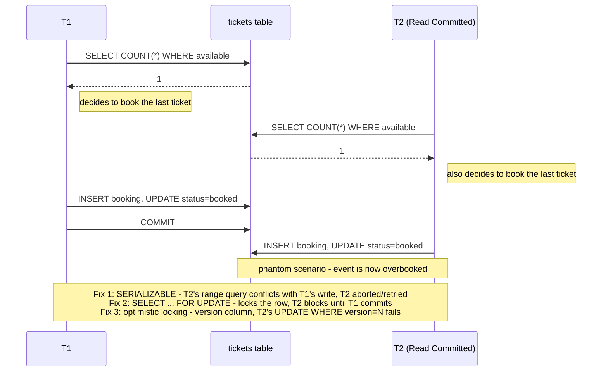

# Database and Storage Fundamentals

**Module 19 — Phase 5: Systems & Security**

This module is a conceptual primer on how databases store, organise, and protect data.
It covers the guarantees databases make (ACID), the alternatives (BASE), how indexes work (B+Tree),
how normalisation reduces redundancy, the hardware hierarchy data lives on, and how crash recovery
works (WAL). Each topic is treated at interview-depth here; deep applied coverage lives in the
`database/` section (see crosslinks throughout and the See Also section at the end).

---

## 1. Concept Overview

A database is more than a file of rows. It is a system that enforces **correctness guarantees**
(transactions, isolation), provides **fast lookup** (indexes), **minimises redundancy** (normalisation),
and **survives crashes** (write-ahead logging). Understanding these primitives answers the "why does
my database behave this way?" question before diving into engine-specific internals.

Key topics in this module:

| Topic | Core guarantee | One-liner |
|-------|---------------|-----------|
| ACID | Correctness | All-or-nothing writes; invariants hold; concurrent txns appear serial; committed data is permanent |
| BASE | Availability | Prefer availability over strict consistency; eventually converge |
| Transactions | Atomicity | BEGIN/COMMIT/ROLLBACK; savepoints; 2PC across nodes |
| Isolation levels | Isolation | Controls which anomalies concurrent transactions can see |
| B+Tree index | Performance | O(log n) lookup; height ~4 for 10 M rows |
| Normalisation | Integrity | Remove redundancy; 1NF → 2NF → 3NF |
| Storage hierarchy | Hardware | Registers → L1/L2/L3 → RAM → SSD → HDD |
| WAL | Durability | Write intent before data; replay on crash |

---

## 2. Intuition

> A database is like a bank's ledger kept in a vault with a guard at the door.
> The guard (transaction manager) lets only one teller change a balance at a time (isolation).
> Every change is first written in a notebook outside the vault (WAL) so that if the vault door
> slams shut mid-update (crash) the ledger can be restored from the notebook (crash recovery).
> The index is the alphabetical tab divider in the ledger that lets you find any name in 4 flips
> instead of scanning all 10 million entries. Normalisation is the rule that says "write each
> customer's address once, not in every transaction row", so updating a zip code touches one
> record, not a million.

**Mental model** — think of the five layers:

1. Your application writes SQL.
2. The query planner decides whether to use an index or a full scan.
3. The transaction manager applies ACID rules.
4. The buffer pool holds hot pages in RAM; dirty pages are flushed to disk.
5. The WAL is written before any page is modified, so crashes are recoverable.

**Why it matters** — Every backend engineer eventually encounters a phantom read that corrupts
inventory counts, a missing index that causes a 30-second full table scan, or a schema update
anomaly because of an un-normalised table. Knowing these primitives turns debugging from guesswork
into systematic reasoning.

**Key insight** — ACID and BASE are not opposites on a single dial; they are different design
contracts. A single-node PostgreSQL database can offer full ACID. A distributed Cassandra cluster
deliberately relaxes consistency for partition tolerance and throughput. The choice depends on what
your application can tolerate losing or seeing incorrectly.

---

## 3. Core Principles

### ACID

**Atomicity** — A transaction is all-or-nothing. If any statement in a BEGIN/COMMIT block fails,
the entire transaction is rolled back. The database never leaves a half-applied state. Mechanism:
the undo log (or MVCC undo chain) allows rolling back partial writes.

**Consistency** — A transaction moves the database from one valid state to another valid state.
Validity is defined by constraints (UNIQUE, FOREIGN KEY, CHECK), triggers, and application-level
invariants. The database enforces the structural constraints; the application is responsible for
the semantic invariants.

**Isolation** — Concurrent transactions appear to execute serially. In practice, databases offer
a spectrum of isolation levels (see §4) that trade safety for throughput. Full serializability is
the gold standard but has the highest lock or version overhead.

**Durability** — Once a transaction commits, the data survives crashes, power loss, and restarts.
Mechanism: the write-ahead log is fsynced to disk before the COMMIT acknowledgement is returned to
the client.

### BASE

**Basically Available** — The system responds to every request, even during node failures. It may
return stale data rather than refusing to answer.

**Soft State** — State may change over time even without input, because replicas converge
asynchronously. There is no single source of truth at every instant.

**Eventually Consistent** — Given no new writes, all replicas will converge to the same value.
The window of inconsistency is bounded by replication lag (typically milliseconds to seconds).

BASE is the guiding philosophy of most distributed NoSQL databases (Cassandra, DynamoDB, Riak).
It is not a database feature with a toggle; it is a design contract accepted at system design time.

### CAP and PACELC context

CAP theorem states that a distributed system can guarantee only two of: Consistency, Availability,
Partition Tolerance. Because network partitions are unavoidable, the real choice is CP (PostgreSQL
with synchronous replication) versus AP (Cassandra). PACELC extends this to latency: even without
partitions, there is a latency/consistency tradeoff. See
[../../database/database_fundamentals](../../database/database_fundamentals/) for full PACELC
treatment.

---

## 4. Types / Architectures / Strategies

### 4.1 Isolation Levels and Their Anomalies

SQL standard defines four isolation levels. Each prevents a subset of the three classic anomalies.

| Isolation Level | Dirty Read | Non-Repeatable Read | Phantom Read | Typical implementation |
|----------------|-----------|--------------------|--------------|-----------------------|
| Read Uncommitted | possible | possible | possible | Rarely used; no read locks |
| Read Committed | prevented | possible | possible | Default in PostgreSQL, Oracle |
| Repeatable Read | prevented | prevented | possible (in SQL std; prevented in MySQL InnoDB) | Default in MySQL InnoDB |
| Serializable | prevented | prevented | prevented | SSI in PostgreSQL; 2PL in some engines |

**Dirty Read** — Transaction A reads data written by Transaction B that has not yet committed.
If B rolls back, A has read data that never existed.

**Non-Repeatable Read** — Transaction A reads the same row twice. Between the two reads, Transaction
B commits an UPDATE. A sees different values.

**Phantom Read** — Transaction A executes the same range query twice. Between the two executions,
Transaction B commits an INSERT that falls in the range. A sees a different set of rows.

**Lost Update** — Two transactions read the same value, both modify it, and the second COMMIT
overwrites the first. Common in read-modify-write patterns. Prevented by SELECT FOR UPDATE or
optimistic locking.

### 4.2 Transaction Control

```
BEGIN;
  UPDATE accounts SET balance = balance - 100 WHERE id = 1;
  SAVEPOINT after_debit;
  UPDATE accounts SET balance = balance + 100 WHERE id = 2;
  -- If credit fails, roll back only the credit, keep the debit savepoint
  ROLLBACK TO SAVEPOINT after_debit;
  -- or COMMIT if both succeed
COMMIT;
```

**Two-Phase Commit (2PC)** — Distributed transaction protocol across two or more nodes.
- Phase 1 (Prepare): coordinator asks all participants "can you commit?"; each participant writes
  a prepare record to its WAL and locks its resources.
- Phase 2 (Commit): if all reply YES, coordinator writes a commit record and tells all participants
  to commit. If any reply NO, coordinator sends ABORT.
- Weakness: if the coordinator crashes between phases, participants are blocked holding locks.
  This is why 2PC is called a blocking protocol. See
  [../../database/database_fundamentals](../../database/database_fundamentals/) for SAGA patterns
  that avoid coordinator SPOF.



The blocking weakness is visible in the last exchange above: once Participant A has replied YES to PREPARE, it must hold its locks until it hears back — if the coordinator dies before Phase 2, A is stuck until the coordinator restarts (or an operator intervenes), which is exactly why SAGA-style compensation is preferred for long-running distributed transactions.

### 4.3 B+Tree Index

A B+Tree is a balanced tree where:
- Internal nodes hold only keys (routing entries), not values.
- Leaf nodes hold (key, row-pointer) pairs and are linked in a doubly-linked list.
- Every path from root to leaf has the same length (balanced).

Key properties:
- **Fanout** ~100–200 per node (PostgreSQL default 8 KB page, ~100 entries per internal node).
- **Height** = ceil(log_fanout(N)). For N = 10 million rows, height = ceil(log_100(10,000,000)) ≈ 4.
- **Lookup**: 4 page reads to find any row among 10 million.
- **Range scan**: walk the leaf linked list; sequential I/O, fast on both SSD and HDD.
- **Insert/Delete**: O(log n) with possible node splits or merges.

**The idea behind it.** "Fanout is not a tuning knob — it is just how many routing entries physically fit in one disk page, so it falls straight out of dividing page size by entry size."

That framing matters because fanout is the base of the logarithm that sets tree height, and height is the number of disk reads per lookup. A schema decision that widens the key silently shrinks the fanout, which can add a whole level to every index in the table.

| Symbol | What it actually is |
|--------|---------------------|
| page | The unit the storage engine reads. PostgreSQL 8 KB, InnoDB 16 KB. One page = one I/O |
| usable | Page size minus header and per-page bookkeeping. ~8,150 B of an 8 KB page |
| entry | One key + one child pointer + per-item overhead, in an internal node |
| fanout | `usable / entry`. Children per internal node — the log base |
| `N` | Rows in the table |
| height | Levels root to leaf. `ceil(log_fanout(N))` |

**Walk one example with real numbers.** A PostgreSQL 8 KB page, varying only the key width:

```
  usable bytes in one 8 KB page
    8192 - 24 (page header) - ~16 (special/line-pointer overhead) = ~8,150 B

  fanout = usable / entry size

    key type                    entry size    fanout = 8150 / entry
    ------------------------------------------------------------------
    BIGINT id  (8 B) + ptr       ~16 B        509
    INT + small pointer          ~20 B        407
    composite (int, timestamp)   ~40 B        203
    wide text / composite key    ~80 B        101      <- the "~100" quoted above

  Same arithmetic on an InnoDB 16 KB page:
    (16384 - ~128) / 40 B = 406               <- the "~200" range widens with bigger pages

  So "fanout 100-200" is not a constant of nature.
  It is (page size) / (your key width), and YOU control the divisor.
```

**Why a wide key is a hidden extra disk read.** Doubling the key width halves the fanout, and halving the fanout is a change of logarithm base — with fanout 500 a 4-level tree addresses 62.5 billion rows, while at fanout 100 the same 4 levels reach only 100 million. Index a `UUID` (16 B) or a `VARCHAR(64)` where a `BIGINT` would do, and you have not merely used more disk: you have reduced how many rows each level of the tree can cover, potentially adding a level and therefore an I/O to every single lookup, on a hot path executed millions of times a day. This is the concrete mechanism behind the usual advice to keep primary keys narrow.

For page layout, clustered vs. secondary indexes, and InnoDB specifics, see
[../../database/indexing_deep_dive](../../database/indexing_deep_dive/).

### 4.4 Normalisation

Normalisation is a process of decomposing tables to reduce data redundancy and prevent update
anomalies.

**First Normal Form (1NF)** — Each column contains atomic (indivisible) values; no repeating groups.
Violation: a `phone_numbers` column that holds a comma-separated list.

**Second Normal Form (2NF)** — Must be in 1NF, and every non-key column must depend on the entire
primary key (no partial dependency). Applies only when the primary key is composite.
Example violation: `(order_id, product_id) → customer_name`. `customer_name` depends only on
`order_id`, not on `product_id`.

**Third Normal Form (3NF)** — Must be in 2NF, and no transitive dependency (non-key column
determines another non-key column).
Example violation: `employee_id → department_id → department_name`. `department_name` is
transitively dependent on `employee_id` through `department_id`. Fix: split into `employees`
and `departments`.

**Denormalisation tradeoffs**: normalised schemas reduce write anomalies and storage, but require
JOINs on reads. High-read OLAP workloads often denormalise intentionally (star/snowflake schemas,
materialised views) to avoid expensive JOINs at query time.

For full normalisation forms (BCNF, 4NF, 5NF) and schema design patterns, see
[../../database/schema_design_and_normalization](../../database/schema_design_and_normalization/).

### 4.5 Storage Hierarchy

| Level | Latency | Capacity | Managed by |
|-------|---------|----------|-----------|
| CPU Registers | ~0.3 ns | ~1 KB | CPU |
| L1 Cache | ~1 ns | ~32–64 KB | CPU |
| L2 Cache | ~4 ns | ~256 KB – 1 MB | CPU |
| L3 Cache | ~10–40 ns | ~8–32 MB | CPU (shared) |
| DRAM (RAM) | ~100 ns | ~8–512 GB | OS + application |
| NVMe SSD | ~100 µs random read | ~256 GB – 8 TB | OS block layer |
| SATA SSD | ~500 µs random read | ~256 GB – 4 TB | OS block layer |
| HDD | ~10 ms seek + ~5 ms rotation | ~1–20 TB | OS block layer |
| Network storage | ~1–10 ms | effectively unlimited | Network + OS |

**Sequential vs. random I/O**:
- SSD sequential read: ~1–3.5 GB/s (NVMe); ~500 MB/s (SATA)
- SSD random read (4 KB block): ~100–500 µs
- HDD sequential read: ~100–200 MB/s
- HDD random read: ~10–15 ms (dominated by seek + rotational latency)

**Implication for databases**: the buffer pool keeps hot pages in RAM (~100 ns access). An index
lookup that finds the row in the buffer pool costs ~100 ns per level vs. ~100 µs if it must go
to SSD. Four B+Tree levels with all pages in cache: ~400 ns. Four levels all on NVMe SSD: ~400 µs.
This is why cache hit rate is the single most important database performance metric.

Cross-reference: [computer_architecture_and_memory_hierarchy](../computer_architecture_and_memory_hierarchy/)
covers memory hierarchy from the CPU perspective.

### 4.6 Write-Ahead Log (WAL)

The WAL is the mechanism that gives databases durability without requiring every write to go
directly to the heap file.

Protocol:
1. Transaction generates a log record describing the change (before image + after image).
2. Log record is written and fsynced to the WAL file on disk **before** the data page is modified.
3. The data page is modified in the buffer pool (in RAM).
4. The dirty page is flushed to the heap file asynchronously (checkpoint).
5. On crash: replay WAL records since the last checkpoint to reconstruct all committed changes.

Key numbers:
- WAL sequential write: ~0.1 ms on NVMe SSD (sequential, large buffer).
- WAL fsync: ~0.5–1 ms on NVMe; ~5–10 ms on SATA SSD; ~10–20 ms on HDD.
- PostgreSQL WAL segment size: 16 MB by default.
- PostgreSQL `wal_level` options: `minimal`, `replica`, `logical`.

WAL enables:
- **Point-in-time recovery (PITR)** — replay WAL from a base backup to any timestamp.
- **Streaming replication** — ship WAL records to replicas in real time.
- **Logical replication** — decode WAL records into row-level change streams (CDC).

---

## 5. Architecture Diagrams

### 5.1 Storage Hierarchy



Latency grows roughly three orders of magnitude at each tier below the CPU caches (~100 ns DRAM vs. ~100 µs NVMe vs. ~10 ms HDD), which is why keeping the working set in the DRAM buffer pool is the single biggest lever on database performance (see §4.5).

### 5.2 B+Tree Index Structure

```
                       [Root Node]
                    [30 | 60 | 90]         <-- internal nodes (keys only)
                   /    |    |    \
          [10|20|30] [40|50|60] [70|80|90] [100|110]
               |         |          |            |
   (Leaf nodes — keys + row pointers, doubly linked)
   [10->r1|20->r2|30->r3] <--> [40->r4|50->r5|60->r6] <--> [70->r7|...]

   Height = 3 here; for 10M rows with fanout 100, height ≈ 4
   Lookup "50": root (1 read) → internal (1 read) → leaf (1 read) = 3 I/Os
```

### 5.3 Write-Ahead Log Flow

```mermaid
flowchart LR
    classDef io      fill:#61afef,stroke:#2e86c1,color:#1a1a1a,font-weight:bold
    classDef frozen  fill:#c678dd,stroke:#9b59b6,color:#fff
    classDef train   fill:#98c379,stroke:#27ae60,color:#1a1a1a
    classDef mathOp  fill:#d19a66,stroke:#e67e22,color:#1a1a1a,font-weight:bold
    classDef lossN   fill:#e06c75,stroke:#c0392b,color:#fff,font-weight:bold
    classDef req     fill:#56b6c2,stroke:#0097a7,color:#1a1a1a
    classDef base    fill:#e5c07b,stroke:#f39c12,color:#1a1a1a

    client([Client]) -->|"UPDATE balance=900"| txn("Transaction Manager<br/>1 generate log record<br/>2 write WAL, fsync<br/>3 modify buffer page<br/>4 return OK")
    txn --> walbuf("WAL Buffer<br/>LSN 10042<br/>before=1000 after=900")
    walbuf -->|fsync| walfile("WAL File on SSD")
    walfile -.->|"checkpoint<br/>async flush"| heap("Heap File on SSD")

    subgraph recovery["Crash Recovery"]
        direction LR
        crashpt("Crash") --> readckpt("Read last<br/>checkpoint LSN") --> replay("Replay WAL<br/>records") --> undo("Roll back uncommitted<br/>via undo log") --> consistent(["Consistent state"])
    end

    walfile -.-> crashpt

    class client io
    class txn mathOp
    class walbuf,heap base
    class walfile train
    class crashpt lossN
    class readckpt,replay,undo mathOp
    class consistent train
```



The WAL buffer is fsynced to a durable WAL file *before* the transaction manager returns OK to the client; the heap file is updated only later, asynchronously, at the next checkpoint. On crash, recovery replays WAL records since the last checkpoint and undoes anything that never committed.

### 5.4 Isolation Level Anomaly Map



T1's second read observes T2's committed write from Time 2 — whether that is visible at all depends entirely on isolation level, from Read Uncommitted (sees even the *uncommitted* write) up to Serializable (T1 and T2 appear fully ordered).

---

## 6. How It Works — Detailed Mechanics

### 6.1 Simulating ACID properties in Python (sqlite3)

```python
import sqlite3
import threading
from contextlib import contextmanager
from typing import Optional


def setup_schema(conn: sqlite3.Connection) -> None:
    """Create accounts table with a CHECK constraint (part of Consistency)."""
    conn.executescript("""
        CREATE TABLE IF NOT EXISTS accounts (
            id      INTEGER PRIMARY KEY,
            owner   TEXT    NOT NULL,
            balance REAL    NOT NULL CHECK (balance >= 0)
        );
        INSERT OR IGNORE INTO accounts VALUES (1, 'Alice', 1000.0);
        INSERT OR IGNORE INTO accounts VALUES (2, 'Bob',    500.0);
    """)
    conn.commit()


@contextmanager
def transaction(conn: sqlite3.Connection):
    """Context manager that commits on success and rolls back on any exception."""
    try:
        yield conn
        conn.commit()
    except Exception:
        conn.rollback()
        raise


def transfer(conn: sqlite3.Connection, from_id: int, to_id: int, amount: float) -> None:
    """
    Atomic transfer: either both debit and credit happen, or neither does.
    Demonstrates Atomicity — if the credit UPDATE fails (e.g. balance would go negative),
    the debit is rolled back.
    """
    with transaction(conn):
        conn.execute(
            "UPDATE accounts SET balance = balance - ? WHERE id = ?",
            (amount, from_id)
        )
        # The CHECK constraint on balance >= 0 enforces Consistency.
        # If this would violate the constraint, sqlite3 raises IntegrityError
        # and the context manager rolls back the debit above.
        conn.execute(
            "UPDATE accounts SET balance = balance + ? WHERE id = ?",
            (amount, to_id)
        )


def read_balance(conn: sqlite3.Connection, account_id: int) -> Optional[float]:
    row = conn.execute(
        "SELECT balance FROM accounts WHERE id = ?", (account_id,)
    ).fetchone()
    return row[0] if row else None


# --- Demonstrate atomicity ---
def demo_atomicity() -> None:
    conn = sqlite3.connect(":memory:")
    setup_schema(conn)

    print("Before transfer:", read_balance(conn, 1), read_balance(conn, 2))

    try:
        # This transfer should fail: transferring 2000 from Alice (has 1000)
        # The CHECK balance >= 0 will fire on Alice's account.
        transfer(conn, 1, 2, 2000.0)
    except sqlite3.IntegrityError as e:
        print(f"Transfer rolled back (atomicity): {e}")

    # Both balances should be unchanged
    print("After failed transfer:", read_balance(conn, 1), read_balance(conn, 2))
    conn.close()


demo_atomicity()
```

### 6.2 Isolation Level Demonstration (concept layer)

```python
import sqlite3
import time
import threading
from typing import Optional


def demo_isolation_levels() -> None:
    """
    sqlite3 does not support Read Uncommitted or Read Committed isolation natively.
    It defaults to Serializable (via deferred/exclusive locks).
    This function demonstrates the CONCEPT of isolation anomalies using interleaved
    sequential operations to show what WOULD happen in a weaker-isolation database.

    For a database that DOES expose Read Committed (e.g. PostgreSQL via psycopg2),
    you would set: conn.set_isolation_level(psycopg2.extensions.ISOLATION_LEVEL_READ_COMMITTED)
    """

    # -- Non-Repeatable Read (conceptual simulation) --
    # In a Read Committed database:
    #   T1 reads balance=1000
    #   T2 updates balance=900 and commits
    #   T1 reads balance again → sees 900 (different from first read) = anomaly

    results: dict = {}

    def transaction_t2_committed_update(shared_db_path: str) -> None:
        """T2: updates and commits while T1 is in progress."""
        conn = sqlite3.connect(shared_db_path, check_same_thread=False)
        time.sleep(0.05)  # Let T1 do its first read
        conn.execute("UPDATE accounts SET balance = 900 WHERE id = 1")
        conn.commit()
        conn.close()

    def transaction_t1_two_reads(shared_db_path: str) -> None:
        """T1: reads twice — in Read Committed, second read sees T2's change."""
        conn = sqlite3.connect(shared_db_path, check_same_thread=False)
        # First read
        row = conn.execute("SELECT balance FROM accounts WHERE id = 1").fetchone()
        results["first_read"] = row[0] if row else None

        time.sleep(0.1)  # T2 commits its update during this sleep

        # Second read — in a Read Committed database, would see 900 (non-repeatable)
        row = conn.execute("SELECT balance FROM accounts WHERE id = 1").fetchone()
        results["second_read"] = row[0] if row else None
        conn.close()

    # Setup
    import tempfile, os
    db_path = os.path.join(tempfile.mkdtemp(), "isolation_demo.db")
    setup_conn = sqlite3.connect(db_path)
    setup_conn.executescript("""
        CREATE TABLE accounts (id INTEGER PRIMARY KEY, balance REAL NOT NULL);
        INSERT INTO accounts VALUES (1, 1000.0);
    """)
    setup_conn.commit()
    setup_conn.close()

    t1 = threading.Thread(target=transaction_t1_two_reads, args=(db_path,))
    t2 = threading.Thread(target=transaction_t2_committed_update, args=(db_path,))
    t1.start()
    t2.start()
    t1.join()
    t2.join()

    print(f"Non-repeatable read demo:")
    print(f"  T1 first read:  {results.get('first_read')}")
    print(f"  T2 updated to:  900 (committed)")
    print(f"  T1 second read: {results.get('second_read')}")
    print(f"  Anomaly present: {results.get('first_read') != results.get('second_read')}")
    print()
    print("  In SQLite (serializable), the second read is blocked until T2 finishes.")
    print("  In a Read Committed database (PostgreSQL default), second read would see 900.")


demo_isolation_levels()
```

### 6.3 B+Tree height calculation

```python
import math


def btree_height(num_rows: int, fanout: int = 100) -> int:
    """
    Calculate the height of a B+Tree index.

    fanout: average number of child pointers per internal node.
    PostgreSQL default page = 8 KB; typical internal node holds ~100 entries.
    InnoDB default page = 16 KB; typical internal node holds ~200 entries.

    Height = ceil(log_fanout(num_rows))
    """
    return math.ceil(math.log(num_rows) / math.log(fanout))


def index_lookup_ios(num_rows: int, fanout: int = 100) -> int:
    """
    Number of page reads to find a single row by primary key.
    Each level of the B+Tree requires one page read.
    In practice, root and upper levels are often cached in buffer pool,
    so effective I/Os may be 1 (leaf level only for hot indexes).
    """
    return btree_height(num_rows, fanout)


if __name__ == "__main__":
    test_cases = [
        (1_000, 100),
        (100_000, 100),
        (1_000_000, 100),
        (10_000_000, 100),    # 10 M rows, PostgreSQL-like
        (10_000_000, 200),    # 10 M rows, InnoDB-like (16 KB pages)
        (1_000_000_000, 100), # 1 billion rows
    ]
    print(f"{'Rows':>15} {'Fanout':>8} {'Height':>8} {'Max I/Os':>10}")
    print("-" * 45)
    for rows, fan in test_cases:
        h = btree_height(rows, fan)
        print(f"{rows:>15,} {fan:>8} {h:>8} {h:>10}")
```

Expected output:
```
           Rows   Fanout   Height   Max I/Os
---------------------------------------------
          1,000      100        2          2
        100,000      100        3          3
      1,000,000      100        3          3
     10,000,000      100        4          4
     10,000,000      200        4          4
  1,000,000,000      100        5          5
```

**The idea behind it.** "Each level multiplies your reach by the fanout, so capacity grows as `fanout^height` — which is why adding one level does not add a few rows, it adds a factor of a hundred."

The table above reports the inverse (`height = ceil(log_fanout(N))`), but the forward direction is what makes the result feel inevitable rather than surprising. Read it as "how many rows can `h` levels cover" and the famous "3-4 levels for billions" claim stops being a slogan.

| Symbol | What it actually is |
|--------|---------------------|
| `fanout^height` | Leaf slots the tree can address — its capacity |
| `log_fanout(N)` | The inverse: levels needed for `N` rows |
| `ceil(...)` | Round up. You cannot build 4.5 levels; a partial level is a whole level |
| height = I/Os | One page read per level, worst case, cold cache |

**Walk one example with real numbers.** Multiply out the forward direction, one level at a time:

```
  fanout 100                       fanout 200                  fanout 500
  ------------------------------------------------------------------------------
  h=1  100^1 =         100         200^1 =         200         500^1 =         500
  h=2  100^2 =      10,000         200^2 =      40,000         500^2 =     250,000
  h=3  100^3 =   1,000,000         200^3 =   8,000,000         500^3 = 125,000,000
  h=4  100^4 = 100,000,000         200^4 = 1,600,000,000       500^4 = 62,500,000,000
  h=5  100^5 = 10,000,000,000

  Read the h=4 row across:  100 M  ->  1.6 B  ->  62.5 B rows
  Nothing changed but the key width. Height stayed at 4.

  Checking the 1-billion-row case against the table above:
    log_100(1e9) = 4.50   -> ceil -> 5 levels   (matches the printed output)
    log_200(1e9) = 3.91   -> ceil -> 4 levels
    log_500(1e9) = 3.33   -> ceil -> 4 levels

  Why the height barely moves: to force a 5th level at fanout 200 you must
  exceed 200^4 = 1.6 billion rows. To force a 6th you need 200^5 = 320 billion.
  Each extra I/O buys 200x more table.
```

**Why 3-4 levels is the answer for almost every real table.** Exponential capacity meets logarithmic cost: the tree's reach explodes while the read count creeps. Practically it is even better than the table suggests, because the root and the level below it are a handful of pages that live permanently in the buffer pool — so a "4 I/O" lookup on a warm index is usually 1 physical read at the leaf, with the upper levels served from memory. That is the real reason a primary-key lookup on a billion-row table costs about the same as on a thousand-row table, and why the honest answer to "will this query scale" is almost never about the index height and almost always about how many rows the query *matches*.

### 6.4 WAL write cost model

```python
from dataclasses import dataclass


@dataclass
class StorageLatency:
    name: str
    random_read_us: float   # microseconds
    sequential_write_us: float  # microseconds per 4 KB page
    fsync_us: float         # microseconds


NVME_SSD   = StorageLatency("NVMe SSD",   random_read_us=100,    sequential_write_us=10,    fsync_us=500)
SATA_SSD   = StorageLatency("SATA SSD",   random_read_us=500,    sequential_write_us=50,    fsync_us=2_000)
HDD        = StorageLatency("HDD",        random_read_us=10_000, sequential_write_us=200,   fsync_us=15_000)
DRAM       = StorageLatency("DRAM (RAM)", random_read_us=0.1,    sequential_write_us=0.05,  fsync_us=0)


def wal_commit_cost_us(storage: StorageLatency, wal_size_kb: int = 8) -> float:
    """
    Approximate cost of fsyncing a WAL commit record.
    WAL writes are sequential. The dominant cost is fsync latency.
    """
    write_cost = storage.sequential_write_us * (wal_size_kb / 4)
    return write_cost + storage.fsync_us


def buffered_btree_lookup_us(
    storage: StorageLatency,
    height: int = 4,
    cache_hit_ratio: float = 0.95
) -> float:
    """
    Expected B+Tree lookup latency accounting for buffer pool cache hits.
    Each level is either served from RAM or fetches from storage.
    """
    total = 0.0
    for _ in range(height):
        if_hit = DRAM.random_read_us
        if_miss = storage.random_read_us
        total += cache_hit_ratio * if_hit + (1 - cache_hit_ratio) * if_miss
    return total


if __name__ == "__main__":
    for storage in [NVME_SSD, SATA_SSD, HDD]:
        wal_cost = wal_commit_cost_us(storage)
        lookup_cost = buffered_btree_lookup_us(storage, height=4, cache_hit_ratio=0.95)
        print(f"{storage.name}:")
        print(f"  WAL commit (8KB, fsync):       {wal_cost:>10.1f} µs  ({wal_cost/1000:.2f} ms)")
        print(f"  B+Tree lookup (h=4, 95% hit):  {lookup_cost:>10.2f} µs")
        print()
```

---

## 7. Real-World Examples

### 7.1 ACID in PostgreSQL bank transfer

```sql
-- PostgreSQL — classic debit/credit transfer
BEGIN;
  UPDATE accounts SET balance = balance - 100.00 WHERE id = 1 AND balance >= 100.00;
  -- Verify the row was actually updated (optimistic check)
  -- If 0 rows updated → insufficient funds → ROLLBACK
  UPDATE accounts SET balance = balance + 100.00 WHERE id = 2;
COMMIT;
```

Both UPDATEs are atomic. If the server crashes between them, the WAL lets PostgreSQL roll back the
partial state on restart. The FOREIGN KEY and CHECK constraints enforce Consistency.

### 7.2 Repeatable Read in MySQL InnoDB

MySQL InnoDB uses MVCC with snapshot isolation for Repeatable Read. When T1 begins a transaction,
InnoDB records the transaction ID (trx_id). Every subsequent read in T1 sees only rows whose
committed trx_id is less than T1's snapshot trx_id. T2's updates committed after T1 started are
invisible to T1 — no non-repeatable reads. This is implemented without read locks; T2 is never
blocked. The snapshot overhead is the cost of traversing the undo version chain for each row.

### 7.3 BASE in Cassandra shopping cart

DynamoDB / Cassandra replication factor = 3, consistency level = ONE (read and write). A cart write
is acknowledged after 1 replica confirms. The other 2 replicas receive the write asynchronously.
A subsequent read from a different replica may return a stale (older) cart. The system is
Basically Available (always responds), in Soft State (replicas may differ), and Eventually
Consistent (all replicas converge within milliseconds to seconds). Applications must handle
stale reads, typically by using last-write-wins or vector clocks.

### 7.4 B+Tree query plan in PostgreSQL

```sql
EXPLAIN ANALYZE SELECT * FROM orders WHERE customer_id = 42 AND created_at > '2024-01-01';
```

With an index on `(customer_id, created_at)`:
- Root node (1 page read): narrow to customer_id = 42 subtree.
- Internal nodes (2–3 page reads): narrow to the date range.
- Leaf scan: read matching leaf pages sequentially.
- Total: 4–5 page reads for billions of orders vs. full sequential scan (millions of pages).

### 7.5 WAL-based point-in-time recovery

A PostgreSQL production database runs continuous WAL archiving to S3. At 14:32 an operator runs
`DROP TABLE orders` by mistake. Recovery procedure:
1. Restore last base backup (taken at 02:00, ~12 hours old).
2. Replay WAL segments from S3 up to `target_time = '14:31:59'`.
3. Database is restored to the state 1 second before the DROP.

This is possible only because WAL records every committed change in sequence with timestamps.

---

## 8. Tradeoffs

### 8.1 Isolation Level Tradeoffs

| Level | Safety | Throughput | Blocking | Use when |
|-------|--------|-----------|----------|----------|
| Read Uncommitted | Lowest | Highest | None | Approximate analytics only; almost never |
| Read Committed | Medium | High | Short write locks | General OLTP (PostgreSQL default) |
| Repeatable Read | High | Medium | Longer read snapshots | Financial reads; inventory checks |
| Serializable | Highest | Lowest | Full conflict detection | Bank ledger; ticket allocation |



No isolation level sits in the high-safety-and-high-throughput quadrant — the four levels trace a straight tradeoff line from Read Uncommitted (bottom right) to Serializable (top left), which is exactly why picking the *lowest* isolation level that is still safe for the workload matters (see Best Practices, §13).

### 8.2 ACID vs. BASE

| Dimension | ACID (PostgreSQL, MySQL) | BASE (Cassandra, DynamoDB) |
|-----------|------------------------|---------------------------|
| Consistency | Strong (single-node or sync replication) | Eventual |
| Availability | Lower under partition | Higher under partition |
| Latency | Higher (fsync, locks) | Lower (async replication) |
| Scalability | Vertical + limited horizontal | Horizontal-first |
| Complexity | Application logic is simpler | Application must handle staleness and conflicts |
| Best for | Financial, healthcare, inventory | Shopping carts, social feeds, leaderboards |

### 8.3 Normalisation vs. Denormalisation

| Dimension | Normalised (3NF) | Denormalised |
|-----------|-----------------|-------------|
| Redundancy | Minimal | High |
| Update anomalies | None | Possible (update one copy, miss another) |
| Write performance | Faster (smaller rows, no duplication) | Slower (more bytes to update) |
| Read performance | Needs JOINs (slower for OLAP) | No JOINs (faster for OLAP reads) |
| Storage | Less | More |
| Typical use | OLTP | OLAP, caches, read replicas |

### 8.4 Storage Tier Tradeoffs

| Tier | Latency | Cost/GB | Durability | Typical use |
|------|---------|---------|-----------|-------------|
| RAM | ~100 ns | High | Non-persistent | Buffer pool, working set |
| NVMe SSD | ~100 µs | Medium | High | Primary database storage |
| SATA SSD | ~500 µs | Lower | High | Secondary storage, replicas |
| HDD | ~10 ms | Lowest | High | WAL archives, cold backups |

---

## 9. When to Use / When NOT to Use

### When to use ACID / strong isolation

- Financial transactions: any incorrect read or partial write has regulatory or monetary consequences.
- Inventory management: overselling caused by lost updates is a critical business error.
- User authentication: half-written password hashes or session tokens are security vulnerabilities.
- Reservation systems: double-booking must be prevented (Serializable or SELECT FOR UPDATE).

### When NOT to use full Serializable isolation

- High-concurrency read-heavy analytics: Serializable's conflict detection causes false aborts and
  blocks. Read Committed with MVCC is usually sufficient.
- Social media feeds: stale posts by a few seconds are acceptable; BASE is fine.
- Leaderboards: approximate counts are acceptable; avoid the overhead of strict isolation.

### When to use B+Tree indexes

- Equality lookups (`WHERE id = 42`): O(log n), 4 I/Os for 10 M rows.
- Range queries (`WHERE created_at BETWEEN ...`): leaf linked-list provides efficient sequential scan.
- Sorted output (`ORDER BY indexed_col`): the index is already sorted; avoids a sort step.

### When NOT to use B+Tree indexes (or when to use alternatives)

- Very low cardinality columns (`is_active` with 2 distinct values): bitmap index or partial index
  is better than B+Tree.
- Full-text search: use GIN/GiST (PostgreSQL) or an inverted index (Elasticsearch), not B+Tree.
- Approximate nearest-neighbour (vector search): use HNSW or IVF indexes, not B+Tree.
- Write-heavy columns updated on every row: each write must update the index; high fanout B+Trees
  have relatively low write amplification, but a heavily updated column still adds overhead.

**Stated plainly.** "Selectivity is the fraction of the table a predicate keeps, and an index only pays off while that fraction stays small — past a few percent, jumping around the heap costs more than reading the whole thing straight through."

This is why "the index exists but the planner ignores it" is usually correct behaviour rather than a bug. The planner is not comparing index vs. no-index; it is comparing *random* page fetches against *sequential* ones.

| Symbol | What it actually is |
|--------|---------------------|
| selectivity | `matching_rows / total_rows`. Lower = more selective = better for an index |
| cardinality | Distinct values in the column. `is_active` has 2; `email` has N |
| `1 / cardinality` | Selectivity of an equality predicate, assuming even distribution |
| seq_page_cost | PostgreSQL default 1.0. Cost of reading the next page in order |
| random_page_cost | Default 4.0 (HDD-era). Lower to ~1.1 on SSD |

**Walk one example with real numbers.** 10 M-row table, 100 rows per 8 KB page = 100,000 heap pages:

```
  SEQ SCAN cost (read everything, in order)
    100,000 pages x 1.0 (seq_page_cost)     = 100,000
     10,000,000 rows x 0.01 (cpu_tuple_cost) = 100,000
                                     total  = 200,000

  INDEX SCAN cost ~ matching_rows x (random_page_cost + cpu_tuple_cost)
    (worst case: every matching row is on a different page)

    predicate               sel      rows       index cost      planner picks
    ----------------------------------------------------------------------------
    email = '..'            1e-7            1          ~4        index   (trivial)
    customer_id = 42        0.001      10,000      40,100        index   (5x cheaper)
    status = 'shipped'      0.050     500,000   2,005,000        SEQ SCAN (10x worse)
    is_active = true        0.500   5,000,000  20,050,000        SEQ SCAN (100x worse)

  Break-even, solving 200,000 = N x sel x (random_page_cost + 0.01):
    random_page_cost 4.0 (HDD)  -> sel = 0.50%   (~49,900 rows)
    random_page_cost 1.1 (SSD)  -> sel = 1.80%   (~180,200 rows)

  Note what moved the threshold: not the index, the STORAGE.
  On SSD, random reads got cheap, so indexes stay useful ~3.6x further out.
```

**Why low-cardinality columns are the classic wasted index.** A boolean column has cardinality 2, so an equality predicate on it has selectivity ~0.5 by construction — five million random heap fetches where a sequential scan reads 100,000 pages in order. The index will never be chosen, yet it still costs a write on every INSERT and UPDATE. The exceptions all work by *restoring* selectivity: a partial index (`WHERE is_active = false` when only 0.1% of rows are inactive) indexes just the rare side; a composite index puts the low-cardinality column after a selective one; a covering index removes the heap fetch entirely so `random_page_cost` stops applying. This also explains Pitfall 4 below — stale statistics mean the planner's `sel` estimate is wrong, and every number in the table above is computed from that estimate, so one bad guess flips the whole decision.

### When to denormalise

- Read-heavy OLAP workloads where JOINs dominate query time.
- Materialised views that are refreshed infrequently.
- Caching layers (Redis, Memcached) that store pre-joined results.
- Event sourcing projections where the read model is purpose-built.

---

## 10. Common Pitfalls

### Pitfall 1 — Lost Update (Read-Modify-Write without isolation)

**BROKEN**: Two threads read a counter, increment it in application code, and write back. The second
write overwrites the first increment.

```python
import sqlite3
import threading

db = sqlite3.connect(":memory:", check_same_thread=False)
db.execute("CREATE TABLE counter (id INTEGER PRIMARY KEY, value INTEGER)")
db.execute("INSERT INTO counter VALUES (1, 0)")
db.commit()

lock = threading.Lock()  # THIS IS THE MISSING PIECE IN THE BROKEN VERSION

def increment_broken() -> None:
    """BROKEN: read-modify-write without database-level atomicity."""
    row = db.execute("SELECT value FROM counter WHERE id = 1").fetchone()
    current = row[0]
    # Another thread can run HERE, reading the same stale value
    db.execute("UPDATE counter SET value = ? WHERE id = 1", (current + 1,))
    db.commit()

threads = [threading.Thread(target=increment_broken) for _ in range(10)]
for t in threads:
    t.start()
for t in threads:
    t.join()

final = db.execute("SELECT value FROM counter WHERE id = 1").fetchone()[0]
print(f"BROKEN: expected 10, got {final}")  # Likely < 10 due to lost updates
```

**FIX**: Use an atomic SQL update expression — the database executes the read and write as a single
indivisible operation with no window for a concurrent thread to interleave.

```python
import sqlite3
import threading

db_fix = sqlite3.connect(":memory:", check_same_thread=False)
db_fix.execute("CREATE TABLE counter (id INTEGER PRIMARY KEY, value INTEGER)")
db_fix.execute("INSERT INTO counter VALUES (1, 0)")
db_fix.commit()

db_lock = threading.Lock()

def increment_fixed() -> None:
    """FIX: atomic increment using SQL expression — no application-level read."""
    with db_lock:  # serialise at the connection level for sqlite3's threading model
        db_fix.execute("UPDATE counter SET value = value + 1 WHERE id = 1")
        db_fix.commit()

threads = [threading.Thread(target=increment_fixed) for _ in range(10)]
for t in threads:
    t.start()
for t in threads:
    t.join()

final = db_fix.execute("SELECT value FROM counter WHERE id = 1").fetchone()[0]
print(f"FIX: expected 10, got {final}")  # Always 10
```

In a multi-connection scenario (e.g. PostgreSQL), use:
```sql
UPDATE counter SET value = value + 1 WHERE id = 1;
```
or use `SELECT ... FOR UPDATE` to lock the row before reading.

---

### Pitfall 2 — Missing Rollback on Error (Partial Writes)

**BROKEN**: Exception raised mid-transaction leaves the database with a partial write because the
rollback is not called.

```python
import sqlite3

def transfer_broken(conn: sqlite3.Connection, from_id: int, to_id: int, amount: float) -> None:
    """BROKEN: no rollback on exception — partial write possible."""
    conn.execute("UPDATE accounts SET balance = balance - ? WHERE id = ?", (amount, from_id))
    # Simulated failure (e.g. network error, application bug)
    if amount > 500:
        raise ValueError("Amount too large")  # Debit already written, credit never runs
    conn.execute("UPDATE accounts SET balance = balance + ? WHERE id = ?", (amount, to_id))
    conn.commit()
    # If the exception is caught upstream but conn is reused, the partial debit stays
```

**FIX**: Always wrap mutations in a try/except/rollback pattern or use a context manager.

```python
import sqlite3
from contextlib import contextmanager
from typing import Generator


@contextmanager
def atomic(conn: sqlite3.Connection) -> Generator[sqlite3.Connection, None, None]:
    """Context manager that commits on success, rolls back on any exception."""
    try:
        yield conn
        conn.commit()
    except Exception:
        conn.rollback()
        raise


def transfer_fixed(conn: sqlite3.Connection, from_id: int, to_id: int, amount: float) -> None:
    """FIX: any exception triggers rollback before propagating."""
    with atomic(conn):
        conn.execute(
            "UPDATE accounts SET balance = balance - ? WHERE id = ?",
            (amount, from_id)
        )
        if amount > 500:
            raise ValueError("Amount too large")  # Both writes are rolled back
        conn.execute(
            "UPDATE accounts SET balance = balance + ? WHERE id = ?",
            (amount, to_id)
        )
```

---

### Pitfall 3 — Wrong Isolation Level for Use Case (Phantom Read in Inventory)



---

### Pitfall 4 — Forgetting to ANALYZE After Bulk Load (Stale Statistics)

After loading 50 million rows into a new table, the query planner may still believe the table has
1000 rows (from stale statistics) and choose a sequential scan over an index scan. Always run
`ANALYZE table_name` (PostgreSQL) or `ANALYZE TABLE table_name` (MySQL) after bulk loads.

---

## 11. Technologies & Tools

| Technology | Category | Key property | Notes |
|------------|----------|-------------|-------|
| PostgreSQL | Relational RDBMS | MVCC, SSI, WAL | Default isolation: Read Committed; MVCC without read locks |
| MySQL InnoDB | Relational RDBMS | MVCC, Repeatable Read default | Gap locks prevent phantoms at RR level |
| SQLite | Embedded RDBMS | Serializable, WAL mode | WAL mode allows concurrent readers; single writer |
| Oracle DB | Relational RDBMS | MVCC, Read Committed default | Undo tablespace for MVCC |
| Cassandra | Wide-column NoSQL | Tunable consistency | BASE model; CQL; LWT for lightweight transactions |
| DynamoDB | Key-value NoSQL | BASE, optional strong reads | Transactions via TransactWriteItems (limited ACID) |
| Redis | In-memory key-value | Single-threaded, atomic commands | MULTI/EXEC for lightweight transactions |
| MongoDB | Document NoSQL | ACID multi-doc since 4.0 | WiredTiger storage engine; replica set transactions |
| NVMe SSD | Storage hardware | ~100 µs random read, ~3.5 GB/s seq | PCIe 4.0; primary database storage tier |
| pgBadger | Monitoring | PostgreSQL log analyser | Identifies slow queries, lock waits |
| pg_stat_statements | Monitoring | Query-level statistics in PostgreSQL | CPU, I/O, call count per query fingerprint |

---

## 12. Interview Questions with Answers

**Q: What is a dirty read and which isolation level prevents it?**
A dirty read occurs when Transaction A reads data written by Transaction B that has not yet committed. If B then rolls back, A has read data that never existed. Read Committed isolation prevents dirty reads by allowing reads only of committed data. Read Uncommitted allows dirty reads and is almost never used in production.

**Q: What is the difference between a non-repeatable read and a phantom read?**
A non-repeatable read affects a single existing row: T1 reads row R, T2 updates and commits R, T1 reads R again and sees a different value. A phantom read affects a range query result set: T1 runs a range query, T2 inserts a new row that falls in the range and commits, T1 runs the same range query and sees a new row that wasn't there before. Repeatable Read prevents non-repeatable reads but (in the SQL standard) not phantoms; Serializable prevents both.

**Q: What is a lost update and how do you prevent it?**
A lost update occurs when two transactions read the same value, each modifies it in application code, and the second COMMIT overwrites the first's change. Prevention options: (1) atomic SQL expressions (`UPDATE t SET x = x + 1`), (2) `SELECT ... FOR UPDATE` to lock the row before reading, (3) optimistic concurrency control with a version/timestamp column checked in the UPDATE WHERE clause, (4) Serializable isolation with automatic conflict detection.

**Q: What is MVCC and why does PostgreSQL use it instead of read locks?**
MVCC (Multi-Version Concurrency Control) keeps multiple versions of each row, one per committed transaction. Readers see a snapshot consistent with their transaction's start time; they never block writers and writers never block readers. This enables high concurrency on read-heavy workloads. PostgreSQL implements this via a hidden `xmin`/`xmax` column on every tuple. The cost is storage bloat (dead tuples) that must be reclaimed by VACUUM. See [../../database/database_fundamentals](../../database/database_fundamentals/) for full MVCC internals.

**Q: How tall is a B+Tree index on 10 million rows, and how many I/Os does a lookup take?**
With fanout = 100 (PostgreSQL default 8 KB page), height = ceil(log_100(10,000,000)) = ceil(3.5) = 4. A single-row lookup traverses 4 levels = 4 page reads in the worst case. In practice the root and upper internal nodes are almost always in the buffer pool (hot pages), so effective I/Os are often 1–2. InnoDB with 16 KB pages has fanout ~200, so height is also 4 for 10 M rows.

**Q: What is the difference between ACID and BASE?**
ACID is a set of guarantees (Atomicity, Consistency, Isolation, Durability) for transactions, typically on single-node or synchronously replicated databases. BASE (Basically Available, Soft State, Eventually Consistent) is the alternative contract for distributed systems that prioritise availability and partition tolerance over strict consistency. ACID ensures every read sees the last committed write; BASE accepts that reads may return stale data for a bounded window. The choice is determined by the CAP theorem tradeoff at design time, not a runtime toggle.

**Q: What are the three normalisation forms, and what anomaly does each prevent?**
1NF: atomic column values; prevents repeating groups and multi-valued cells. 2NF (requires composite PK): every non-key column depends on the full primary key; prevents partial dependencies (where a column depends on only part of a composite key). 3NF: no transitive dependencies (no non-key column determines another non-key column); prevents update anomalies where changing one derived fact requires updating multiple rows.

**Q: What is the Write-Ahead Log (WAL) and how does it provide durability?**
The WAL is a sequential append-only log on disk that records the intent of every database change before the change is applied to the data file. On commit, the WAL record is fsynced to disk; only then is the acknowledgement returned to the client. If the server crashes, recovery replays WAL records from the last checkpoint to reconstruct all committed changes and roll back uncommitted ones. Sequential WAL writes (~0.1–1 ms on SSD) are far faster than random heap file writes (~100–500 µs per page on NVMe), so WAL improves both durability and throughput.

**Q: What is two-phase commit (2PC) and what is its main weakness?**
2PC is a distributed transaction protocol. Phase 1 (Prepare): coordinator asks all participants if they can commit; each participant locks its resources and writes a prepare record to its WAL. Phase 2 (Commit): if all reply YES, coordinator writes a commit record and tells all to commit. The main weakness is that 2PC is a blocking protocol: if the coordinator crashes after sending Prepare but before sending Commit, participants hold locks indefinitely waiting for the coordinator to recover. This can cause prolonged blocking in distributed systems, which is why SAGA patterns and idempotent compensation are preferred for long-running distributed transactions.

**Q: Why does PostgreSQL default to Read Committed rather than Serializable?**
Serializable isolation (via Serializable Snapshot Isolation in PostgreSQL) requires tracking read sets and detecting conflicts, which causes transactions to abort and retry under contention. For most OLTP workloads, Read Committed provides enough safety with significantly higher throughput because readers never block writers (MVCC), and write-write conflicts still abort one transaction. Serializable is recommended for financial ledgers, inventory allocation, or any use case where phantom reads would cause correctness violations.

**Q: What is the difference between a clustered index and a secondary index?**
A clustered index (InnoDB: the primary key index) stores the actual row data in the leaf nodes; the table IS the index. There can be only one clustered index per table. A secondary index stores (secondary key, primary key) in the leaf nodes; to fetch the full row, InnoDB performs a second lookup in the clustered index (bookmark lookup). PostgreSQL uses heap tables for all data and the primary key index is just another index; its "index-only scan" avoids the second lookup when all needed columns are in the index. See [../../database/indexing_deep_dive](../../database/indexing_deep_dive/).

**Q: How do you detect and resolve a deadlock in a relational database?**
A deadlock occurs when T1 holds lock A and waits for lock B, while T2 holds lock B and waits for lock A — a cycle. Databases run a background deadlock detector (PostgreSQL: cycle detection in the lock graph every `deadlock_timeout` ms, default 1 s). When a cycle is detected, the database aborts the transaction with the lowest cost (fewest locks held, least work done). The application must catch the deadlock error (PostgreSQL: SQLSTATE 40P01) and retry the transaction. Prevention strategies: always acquire locks in a consistent global order; keep transactions short; use SELECT FOR UPDATE SKIP LOCKED for queue patterns.

**Q: What is the buffer pool and why is its hit ratio the most important database performance metric?**
The buffer pool (PostgreSQL: shared_buffers; InnoDB: innodb_buffer_pool_size) is the in-memory cache of database pages. A cache hit serves a page from RAM (~100 ns); a cache miss fetches from SSD (~100 µs) — a 1000× difference. A 95% hit rate with 4-level B+Tree lookup results in ~0.2 µs expected I/O latency vs. ~400 µs all-miss. PostgreSQL recommends shared_buffers = 25–40% of RAM; InnoDB buffer pool = 70–80% of RAM. Monitor with `pg_stat_bgwriter` (PostgreSQL) or `SHOW ENGINE INNODB STATUS` (MySQL).

**Q: What happens to uncommitted data during a crash, and how does the database ensure correctness?**
The WAL records both committed and uncommitted changes. On crash recovery, the database replays all WAL records from the last checkpoint (redo pass) to reconstruct the state up to the crash point. It then scans for transactions that had not committed at the time of crash and rolls them back using the undo log (or MVCC undo version chain). This two-pass approach (redo + undo) guarantees that committed transactions are fully applied and uncommitted transactions are fully removed.

**Q: What is a phantom read in the context of an inventory system, and how do you prevent it?**
In a ticket booking system, T1 queries `SELECT COUNT(*) FROM tickets WHERE status='available'` and gets 1. T2 runs the same query, also gets 1, and both decide to book. T1 inserts a booking and updates the ticket status. T2 also inserts a booking — the event is now double-booked. This is a phantom insert scenario. Prevention: (1) Serializable isolation detects the conflict and aborts T2; (2) `SELECT ... FOR UPDATE` on the ticket row makes T2 block until T1 commits; (3) a UNIQUE constraint or CHECK on available count turns the second insert into a constraint violation.

**Q: What is the cost of an fsync, and why does it matter for database commit latency?**
fsync forces the OS to write all dirty pages in the file's page cache to durable storage, bypassing the OS write cache. On NVMe SSD: ~0.5–1 ms. On SATA SSD: ~1–5 ms. On HDD: ~5–20 ms. PostgreSQL calls fsync on the WAL before returning COMMIT to the client. With `synchronous_commit = on` (default), commit latency is bounded by fsync latency. With `synchronous_commit = off`, commits are acknowledged before fsync, reducing latency to ~0.1 ms but risking loss of the last few hundred milliseconds of committed data on crash.

---

## 13. Best Practices

**Choose the lowest isolation level that is safe for your use case.** Serializable correctness at
10% of the throughput is usually the wrong choice for a social feed; Read Committed MVCC is usually
the right choice. Document the reasoning for the chosen level.

**Always use parameterised queries.** Besides preventing SQL injection, parameterised queries allow
the database to cache query plans, reducing parse overhead on repeated executions.

**Keep transactions short.** Long-running transactions hold locks (in lock-based isolation) or
create long MVCC undo chains, increasing lock contention and VACUUM pressure. Batch large updates
into small transactions of 1000–10000 rows.

**Use database-level atomicity, not application-level multi-step logic.** The `UPDATE t SET x = x + 1`
pattern is atomic; read-then-write in application code is not. Use atomic SQL expressions or
SELECT FOR UPDATE wherever correctness matters.

**Index selectively.** Every index adds write overhead (~1 extra page write per INSERT/UPDATE/DELETE
that affects indexed columns). Index columns that appear in WHERE, JOIN ON, and ORDER BY clauses
with high cardinality. Remove unused indexes; use `pg_stat_user_indexes` to find zero-usage indexes.

**Normalise first, denormalise deliberately.** Start with 3NF for correctness. Denormalise only
when profiling confirms that JOIN cost is the bottleneck, and only in the read model (materialised
views, caches) — keep the write model normalised.

**Monitor buffer pool hit ratio.** Below 95% usually means the working set does not fit in memory.
Add RAM before adding faster disks. PostgreSQL: `SELECT sum(heap_blks_hit) / (sum(heap_blks_hit) + sum(heap_blks_read)) FROM pg_statio_user_tables`.

**Use WAL archiving from day one in production.** Base backup + WAL archive = point-in-time
recovery. Without it, a `DROP TABLE` or silent corruption means restoring from the last full backup
and losing all changes since.

**Test isolation anomalies explicitly.** Write integration tests that run concurrent transactions
and assert that lost updates, phantom reads, and dirty reads do not occur. Do not rely on code
review alone to catch isolation bugs.

**Run ANALYZE after bulk loads.** Fresh statistics prevent the query planner from choosing a
sequential scan on a newly loaded large table.

---

## 14. Case Study

### Isolation Level Anomalies in a Ticket Booking System

**Scenario**: A concert ticketing API allows users to book the last available ticket for an event.
Two concurrent requests arrive within milliseconds of each other. Without correct isolation, both
requests succeed and the event is double-booked.

**System**: Python (sqlite3 for in-process demo; same patterns apply to PostgreSQL with psycopg2).

#### Setup

```python
import sqlite3
import threading
import time
from contextlib import contextmanager
from typing import Generator, Optional


def create_db() -> sqlite3.Connection:
    conn = sqlite3.connect(":memory:", check_same_thread=False)
    conn.executescript("""
        PRAGMA journal_mode = WAL;   -- Enable WAL mode for concurrent readers
        CREATE TABLE events (
            id           INTEGER PRIMARY KEY,
            name         TEXT    NOT NULL,
            tickets_left INTEGER NOT NULL CHECK (tickets_left >= 0)
        );
        CREATE TABLE bookings (
            id       INTEGER PRIMARY KEY AUTOINCREMENT,
            event_id INTEGER NOT NULL REFERENCES events(id),
            user_id  INTEGER NOT NULL,
            UNIQUE(event_id, user_id)
        );
        INSERT INTO events VALUES (1, 'Concert A', 1);  -- Only 1 ticket left
    """)
    conn.commit()
    return conn
```

#### BROKEN — Race condition without proper isolation

```python
def book_ticket_broken(
    conn: sqlite3.Connection,
    event_id: int,
    user_id: int,
    lock: threading.Lock
) -> bool:
    """
    BROKEN: read-check-write pattern without row lock.
    Two concurrent threads can both pass the availability check
    and both attempt to book the last ticket.
    """
    # Step 1: Check availability (read)
    row = conn.execute(
        "SELECT tickets_left FROM events WHERE id = ?", (event_id,)
    ).fetchone()
    tickets_left: int = row[0] if row else 0

    # WINDOW OF VULNERABILITY: another thread can run here after the read
    # and before the update, and also see tickets_left = 1.
    time.sleep(0.01)  # Simulate processing latency

    if tickets_left <= 0:
        return False  # This check is STALE — another thread may have booked already

    # Step 2: Decrement and insert (write) — no atomic check
    try:
        with lock:  # Only serialises at Python level, not DB transaction level
            conn.execute(
                "UPDATE events SET tickets_left = tickets_left - 1 WHERE id = ?",
                (event_id,)
            )
            conn.execute(
                "INSERT INTO bookings (event_id, user_id) VALUES (?, ?)",
                (event_id, user_id)
            )
            conn.commit()
        return True
    except Exception:
        conn.rollback()
        return False


def demo_broken() -> None:
    conn = create_db()
    results: list[tuple[int, bool]] = []
    lock = threading.Lock()

    def worker(user_id: int) -> None:
        result = book_ticket_broken(conn, event_id=1, user_id=user_id, lock=lock)
        results.append((user_id, result))

    threads = [threading.Thread(target=worker, args=(uid,)) for uid in [101, 102]]
    for t in threads:
        t.start()
    for t in threads:
        t.join()

    tickets_left = conn.execute("SELECT tickets_left FROM events WHERE id=1").fetchone()[0]
    bookings = conn.execute("SELECT COUNT(*) FROM bookings WHERE event_id=1").fetchone()[0]

    print("BROKEN DEMO:")
    for uid, success in results:
        print(f"  User {uid}: {'booked' if success else 'failed'}")
    print(f"  tickets_left = {tickets_left}")
    print(f"  bookings count = {bookings}")
    print(f"  Overbooking: {bookings > 1}")
    conn.close()


demo_broken()
```

#### FIX — Atomic check-and-decrement with constraint enforcement

```python
@contextmanager
def atomic(conn: sqlite3.Connection) -> Generator[sqlite3.Connection, None, None]:
    try:
        yield conn
        conn.commit()
    except Exception:
        conn.rollback()
        raise


def book_ticket_fixed(
    conn: sqlite3.Connection,
    db_lock: threading.Lock,
    event_id: int,
    user_id: int,
    max_retries: int = 3
) -> bool:
    """
    FIX: atomic UPDATE with affected-rows check, wrapped in a transaction.
    The UPDATE is atomic: it reads, checks, and writes as one operation.
    The CHECK constraint (tickets_left >= 0) provides a second safety net.
    db_lock serialises concurrent sqlite3 writes (SQLite limitation);
    for PostgreSQL, use SELECT ... FOR UPDATE inside the transaction instead.
    """
    for attempt in range(max_retries):
        try:
            with db_lock:
                with atomic(conn):
                    # Atomic decrement: succeeds only if tickets_left > 0
                    cursor = conn.execute(
                        """
                        UPDATE events
                           SET tickets_left = tickets_left - 1
                         WHERE id = ?
                           AND tickets_left > 0
                        """,
                        (event_id,)
                    )
                    if cursor.rowcount == 0:
                        # No row updated means tickets_left was already 0
                        return False

                    conn.execute(
                        "INSERT INTO bookings (event_id, user_id) VALUES (?, ?)",
                        (event_id, user_id)
                    )
            return True

        except sqlite3.OperationalError as e:
            # Database is locked (concurrent write) — retry with backoff
            if "locked" in str(e).lower() and attempt < max_retries - 1:
                time.sleep(0.005 * (attempt + 1))
                continue
            return False
        except sqlite3.IntegrityError:
            # UNIQUE violation on bookings (duplicate booking) or CHECK violation
            return False

    return False


def demo_fixed() -> None:
    conn = create_db()
    results: list[tuple[int, bool]] = []
    db_lock = threading.Lock()

    def worker(user_id: int) -> None:
        result = book_ticket_fixed(conn, db_lock, event_id=1, user_id=user_id)
        results.append((user_id, result))

    # Run 5 concurrent users trying to book the 1 remaining ticket
    threads = [threading.Thread(target=worker, args=(uid,)) for uid in range(201, 206)]
    for t in threads:
        t.start()
    for t in threads:
        t.join()

    tickets_left = conn.execute("SELECT tickets_left FROM events WHERE id=1").fetchone()[0]
    bookings = conn.execute("SELECT COUNT(*) FROM bookings WHERE event_id=1").fetchone()[0]
    booked_users = [uid for uid, ok in results if ok]

    print("FIXED DEMO:")
    for uid, success in sorted(results):
        print(f"  User {uid}: {'booked' if success else 'failed'}")
    print(f"  tickets_left = {tickets_left}")
    print(f"  bookings count = {bookings}")
    print(f"  Overbooking: {bookings > 1}")
    assert bookings <= 1, "Overbooking detected — fix is broken"
    assert tickets_left == 0 or bookings == 1, "Consistency violated"
    print(f"  Exactly 1 booking made by user {booked_users[0] if booked_users else 'none'}")
    conn.close()


demo_fixed()
```

#### Metrics comparison

| Metric | Broken (read-check-write) | Fixed (atomic update) |
|--------|--------------------------|----------------------|
| Concurrent requests handled | 2 of 2 appear to succeed | 1 of N succeeds; rest fail cleanly |
| Overbooking risk | Yes (lost update window) | None (CHECK + rowcount guard) |
| Error recovery | Silent corruption | IntegrityError raised; transaction rolled back |
| Retry logic needed | No (incorrectly succeeds) | Yes (OperationalError on lock contention) |
| Applicable isolation fix (PostgreSQL) | SELECT FOR UPDATE / SERIALIZABLE | Atomic UPDATE + row lock |
| Throughput (per-ticket contention) | Higher (no blocking) | Lower (serialised write) |

**Note**: in PostgreSQL, replace the Python-level `db_lock` with `SELECT ... FOR UPDATE` inside
the transaction, or use `UPDATE ... WHERE tickets_left > 0` with the `RETURNING` clause — the
database enforces serialisation at the engine level across all connections, not just within one
process.

#### Discussion questions

1. If you replaced SQLite with PostgreSQL running in Read Committed isolation (the default), would
   the `book_ticket_fixed` approach still be safe? What additional risk does Read Committed
   introduce for a high-concurrency ticket sale (e.g. 10,000 users/second), and how would you
   address it?

2. The broken version uses a Python-level threading.Lock. Why is a Python-level lock insufficient
   to prevent lost updates when multiple application server processes (not threads) connect to the
   same PostgreSQL database?

3. A product manager wants to allow "waitlist" bookings when tickets_left reaches 0, with
   automatic promotion when a booking is cancelled. How would you modify the schema and transaction
   logic to handle this atomically, and which isolation level would you choose?

---

## See Also

- [computer_architecture_and_memory_hierarchy](../computer_architecture_and_memory_hierarchy/) — storage latency numbers and memory hierarchy from the CPU perspective
- [../../database/database_fundamentals](../../database/database_fundamentals/) — MVCC internals, PACELC theorem, isolation anomaly deep dive
- [../../database/indexing_deep_dive](../../database/indexing_deep_dive/) — B+Tree page layout, clustered vs. secondary indexes, InnoDB internals
- [../../database/schema_design_and_normalization](../../database/schema_design_and_normalization/) — normalisation forms (BCNF, 4NF, 5NF) and schema design patterns in depth
