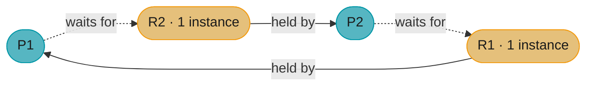
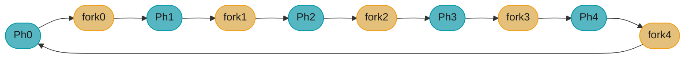
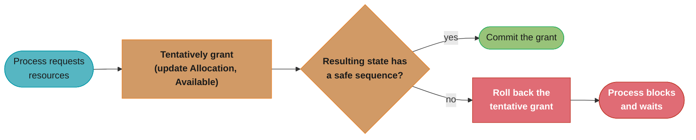
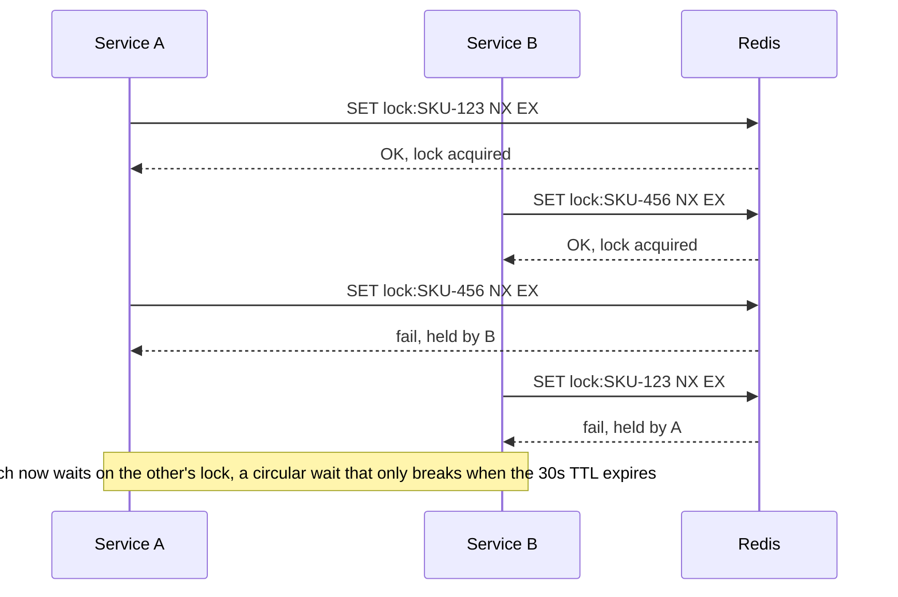

# Deadlocks and Synchronization

> A deadlock is two threads at a crossroads, each waiting for the other to move first — forever.

---

## 1. Concept Overview

**Synchronization** is the coordination of concurrent threads to ensure correctness when they access shared resources. The fundamental primitives are: mutex (mutual exclusion lock), semaphore (counting resource gate), monitor (object with an implicit lock + condition variables), and condition variable (wait/notify mechanism).

**Deadlock** is the state where a set of threads are each waiting for a resource held by another thread in the set — a circular wait with no exit. The system makes no progress. Deadlock is distinct from starvation (a thread is indefinitely delayed but could theoretically proceed) and livelock (threads are running but making no progress because they keep reacting to each other).

This module covers: mutex/semaphore/monitor as OS-level concepts (for applied Java depth, see [`java/concurrency`](../../java/concurrency/)); the four Coffman conditions for deadlock; deadlock prevention, avoidance (Banker's algorithm), detection, and recovery; and classic synchronization problems (dining philosophers, readers-writers, producer-consumer).

---

## 2. Intuition

> **One-line analogy**: Deadlock is like two drivers on a one-lane bridge, each refusing to back up, waiting for the other. Starvation is a car stuck at a broken traffic light that always turns red when it arrives. A semaphore is a nightclub bouncer counting capacity — threads queue until a slot is available.

**Mental model for synchronization**: Every shared resource has a conceptual "lock token." A thread must hold the token to access the resource. If only one token exists, that's a mutex. If k tokens exist (resource pool), that's a semaphore of value k.

**Mental model for deadlock**: Draw a resource-allocation graph. Vertices = processes + resources. Edge P→R means "P is waiting for R." Edge R→P means "R is held by P." A cycle in this graph means deadlock (for single-instance resources). For multi-instance resources, detect via a reduction algorithm.

**Key insight**: All four Coffman conditions must hold simultaneously for deadlock. Breaking any one prevents it. The most practical strategy is "break circular wait" by imposing a global lock-acquisition order.

---

## 3. Core Principles

### Coffman Conditions for Deadlock

All four must hold simultaneously:

1. **Mutual exclusion**: At least one resource is held in a non-shareable mode (only one thread can use it at a time).
2. **Hold and wait**: A thread holding at least one resource is waiting to acquire additional resources held by other threads.
3. **No preemption**: Resources cannot be forcibly taken from a thread; they are released only voluntarily.
4. **Circular wait**: A set of threads T₁, T₂, ..., Tₙ exists such that T₁ waits for a resource held by T₂, T₂ waits for a resource held by T₃, ..., Tₙ waits for a resource held by T₁.

**The idea behind it.** "Deadlock is an AND, not an OR — all four conditions must be true at the same instant, so falsifying any single one of them makes deadlock structurally impossible, forever."

This is why the list has exactly four entries and why the prevention table below has exactly four rows. The four conditions are not four warning signs to watch for; they are four independent switches, and deadlock needs every one of them flipped on.

| Symbol | What it actually is |
|--------|---------------------|
| `ME` | At least one resource cannot be shared. True by definition for any real mutex |
| `HW` | A thread keeps what it holds while blocking for more |
| `NP` | Nobody can take a resource away; only the owner releases it |
| `CW` | The wait-for edges close a loop: T1 -> T2 -> ... -> Tn -> T1 |
| `AND` | Conjunction. One false input makes the whole expression false |

**Walk one example with real numbers.** Enumerating the switch settings:

```
  deadlock possible  <=>  ME AND HW AND NP AND CW

  4 independent booleans -> 2^4 = 16 possible states of the system
  exactly  1  of those 16 permits deadlock  (all four true)  = 6.25%
  the other 15 are deadlock-free by construction

  falsify ONE condition -> 8 of the 16 rows vanish, and the deadlock row is
  always among them, no matter WHICH one you pick:

    ME  HW  NP  CW   deadlock?
     T   T   T   T      YES     <- the only dangerous row
     T   T   T   F      no      <- lock ordering killed CW
     T   T   F   T      no      <- DB rollback killed NP
     T   F   T   T      no      <- acquire-all-at-once killed HW
     F   T   T   T      no      <- lock-free CAS killed ME
```

**Why practitioners always attack circular wait.** All four columns are equally valid targets in theory, but three of them are expensive in practice: killing `ME` needs lock-free algorithms (hard, and impossible for genuinely exclusive resources), killing `HW` means grabbing every lock up front (destroys concurrency), and killing `NP` means being able to roll work back (which is why databases *can* do it and application code usually cannot). Killing `CW` costs one convention — always take locks in a fixed global order — which is why "sort the locks" is the fix in Pitfall 1 and in the distributed case study in Section 14.

### Synchronization Primitives

**Mutex (binary semaphore with ownership)**: Only the thread that locked the mutex can unlock it. Provides mutual exclusion for critical sections. Recursive mutexes allow the same thread to acquire multiple times (with a counter). Non-recursive mutex re-acquisition by the same thread → immediate deadlock.

**Semaphore**: Integer counter S. `wait(S)` (P/acquire): if S > 0, decrement and proceed; else block. `signal(S)` (V/release): increment S; if blocked threads exist, wake one. Unlike a mutex, any thread can call `signal`. Used for resource counting and producer-consumer coordination.

**Monitor**: A synchronization construct combining a mutex with condition variables. At most one thread runs inside the monitor at a time. Condition variables (`wait`, `signal/notify`, `broadcast/notifyAll`) allow a thread inside the monitor to block and release the monitor lock, waiting for a condition to become true.

**Condition variable**: Always used with a mutex. `wait(cond, mutex)`: atomically releases mutex and blocks. `signal(cond)`: wakes one blocked thread. `broadcast(cond)`: wakes all blocked threads. A woken thread re-acquires the mutex before proceeding. Always re-check the condition after waking (spurious wakeups; POSIX allows them).

---

## 4. Types / Architectures / Strategies

### Deadlock Strategies

| Strategy | Approach | Cost | Used in |
|----------|----------|------|---------|
| Prevention | Break one Coffman condition structurally | May restrict concurrency or require extra resources | OS design, lock ordering |
| Avoidance | Banker's algorithm: only grant if safe state remains | Runtime overhead; requires future knowledge | Real-time systems (limited use) |
| Detection + Recovery | Allow deadlock; periodically detect; recover | Overhead of detection; recovery may lose work | Database systems (timeout + retry) |
| Ignore (Ostrich algorithm) | Pretend deadlock won't happen | No overhead; unreliable | Unix/Linux historically |

### Prevention Techniques

| Coffman Condition | Prevention technique |
|-------------------|---------------------|
| Mutual exclusion | Use lock-free / wait-free algorithms (CAS-based). Not always possible. |
| Hold and wait | Request all resources at once before starting (conservative). Or: release all before requesting new ones. |
| No preemption | Allow OS to forcibly take a resource (save state and retry). Used in DBMS (transaction rollback). |
| Circular wait | **Impose a total ordering on locks; always acquire in order.** Practical and widely used. |

---

## 5. Architecture Diagrams

### Resource Allocation Graph — Deadlock Detection


Two processes, two single-instance resources — P3 is part of the scenario but never joins this cycle. P1 holds R1 while waiting on R2, and P2 holds R2 while waiting on R1; the dotted "waits for" edges close the loop back on themselves. In a single-instance resource-allocation graph, a cycle like this is both necessary and sufficient for deadlock.

### Dining Philosophers Problem


Five philosophers alternate with five forks around the ring, and each philosopher needs both neighboring forks to eat. In the naive protocol — pick up left, then right — all five grab their left fork at the same instant, so every philosopher ends up holding exactly one fork while waiting on a neighbor for the other: a five-way circular wait, i.e., deadlock.

### Banker's Algorithm — Safe State

```
4 processes, 3 resource types (A=10, B=5, C=7 total instances)

State:
  Process  | Allocation | Max Need | Available: A=3, B=3, C=2
  P0       |  0,1,0     | 7,5,3
  P1       |  2,0,0     | 3,2,2
  P2       |  3,0,2     | 9,0,2
  P3       |  2,1,1     | 2,2,2
  P4       |  0,0,2     | 4,3,3

Need[i] = Max[i] - Allocation[i]:
  P0: 7,4,3; P1: 1,2,2; P2: 6,0,0; P3: 0,1,1; P4: 4,3,1

Safety check (find safe sequence):
  Available = 3,3,2
  P1 need 1,2,2 <= available 3,3,2 -> run P1, release 2,0,0 -> available=5,3,2
  P3 need 0,1,1 <= 5,3,2 -> run P3, release 2,1,1 -> available=7,4,3
  P4 need 4,3,1 <= 7,4,3 -> run P4, release 0,0,2 -> available=7,4,5
  P2 need 6,0,0 <= 7,4,5 -> run P2, release 3,0,2 -> available=10,4,7
  P0 need 7,4,3 <= 10,4,7 -> run P0
Safe sequence: <P1, P3, P4, P2, P0>
```

**The idea behind it.** "A state is safe if you can name an order in which every process finishes — pay one process its full remaining need, collect back everything it held, and use that bigger pot to fund the next one."

The banker metaphor is exact: the bank never lends so much that no customer can be paid out in full. It does not matter that no single process can be funded from the initial pot alone — what matters is that *some* process can, because finishing it refills the pot.

| Symbol | What it actually is |
|--------|---------------------|
| `Allocation[i]` | What process i is holding right now |
| `Max[i]` | The most process i will ever ask for, declared up front |
| `Need[i]` | `Max[i] - Allocation[i]` — the worst case still outstanding |
| `Available` | Total instances minus everything currently allocated |
| `<=` (vectors) | Compares element-wise. ALL three resource types must fit, not just one |

**Walk one example with real numbers.** The state above, with totals A=10, B=5, C=7:

```
  Available check:  total (10,5,7) - sum of Allocation (7,2,5) = (3,3,2)   <- matches

  Need = Max - Allocation:
    P0: (7,5,3)-(0,1,0) = (7,4,3)      P3: (2,2,2)-(2,1,1) = (0,1,1)
    P1: (3,2,2)-(2,0,0) = (1,2,2)      P4: (4,3,3)-(0,0,2) = (4,3,1)
    P2: (9,0,2)-(3,0,2) = (6,0,0)

  who can run first from Available = (3,3,2)?
    P0 need (7,4,3): 7 > 3  NO      P2 need (6,0,0): 6 > 3  NO
    P1 need (1,2,2): fits   YES     P3 need (0,1,1): fits   YES
    P4 need (4,3,1): 4 > 3  NO

  fund P1, then collect its Allocation back:
    step   run   need       avail before   + its allocation   avail after
     1     P1    (1,2,2)     (3,3,2)          (2,0,0)          (5,3,2)
     2     P3    (0,1,1)     (5,3,2)          (2,1,1)          (7,4,3)
     3     P4    (4,3,1)     (7,4,3)          (0,0,2)          (7,4,5)
     4     P2    (6,0,0)     (7,4,5)          (3,0,2)         (10,4,7)
     5     P0    (7,4,3)    (10,4,7)          (0,1,0)         (10,5,7)

  final Available = (10,5,7) = the totals -> everything returned, state is SAFE
```

**Why "safe" is not the same as "no deadlock right now."** Nothing in this state is deadlocked — no process is even blocked. Safety is a claim about the *future*: it says that even if every process immediately demanded its entire declared `Need`, an order exists that satisfies them all. An unsafe state is not a deadlocked one either; it is one from which deadlock has become *reachable*, and the algorithm refuses to enter it. That conservatism is exactly why Banker's is rare in production: it requires every process to declare its maximum need up front, which almost no real workload can do, so real systems use detection-plus-rollback (databases) or plain lock ordering instead.

### Banker's Algorithm — Request Decision Flow


The Banker's algorithm never grants a request outright: it tentatively applies the request, then re-runs the same safety check traced numerically above; only a request that still leaves a safe sequence (like `<P1, P3, P4, P2, P0>`) is committed, otherwise the tentative grant is rolled back and the process blocks.

---

## 6. How It Works — Detailed Mechanics

### Mutex and Condition Variable

```python
from __future__ import annotations
import threading
from collections import deque
from typing import TypeVar, Generic

T = TypeVar("T")


class BoundedQueue(Generic[T]):
    """
    Thread-safe bounded queue using mutex + condition variables.
    Classic producer-consumer pattern.
    """
    def __init__(self, capacity: int) -> None:
        self._queue: deque[T] = deque()
        self._capacity = capacity
        self._lock = threading.Lock()
        self._not_full = threading.Condition(self._lock)
        self._not_empty = threading.Condition(self._lock)

    def put(self, item: T) -> None:
        with self._not_full:
            while len(self._queue) >= self._capacity:
                self._not_full.wait()   # releases lock, blocks; re-acquires on wake
            self._queue.append(item)
            self._not_empty.notify()    # wake one consumer

    def get(self) -> T:
        with self._not_empty:
            while not self._queue:
                self._not_empty.wait()  # releases lock, blocks
            item = self._queue.popleft()
            self._not_full.notify()     # wake one producer
            return item
```

### Semaphore

```python
class Semaphore:
    """
    Counting semaphore. Thread-safe, using Python threading primitives.
    """
    def __init__(self, value: int) -> None:
        assert value >= 0
        self._value = value
        self._lock = threading.Lock()
        self._not_zero = threading.Condition(self._lock)

    def acquire(self) -> None:
        """Decrement; block if value == 0."""
        with self._not_zero:
            while self._value == 0:
                self._not_zero.wait()
            self._value -= 1

    def release(self) -> None:
        """Increment; wake one blocked thread."""
        with self._not_zero:
            self._value += 1
            self._not_zero.notify()
```

### Readers-Writers Problem

```python
class ReadWriteLock:
    """
    Readers-writers lock: multiple readers OR one writer at a time.
    Writer preference: once a writer is waiting, no new readers are admitted.
    """
    def __init__(self) -> None:
        self._readers = 0
        self._writer_waiting = 0
        self._active_writer = False
        self._lock = threading.Lock()
        self._readers_ok = threading.Condition(self._lock)
        self._writer_ok = threading.Condition(self._lock)

    def acquire_read(self) -> None:
        with self._readers_ok:
            # Block new readers if a writer is waiting (writer preference)
            while self._writer_waiting > 0 or self._active_writer:
                self._readers_ok.wait()
            self._readers += 1

    def release_read(self) -> None:
        with self._lock:
            self._readers -= 1
            if self._readers == 0:
                self._writer_ok.notify()

    def acquire_write(self) -> None:
        with self._writer_ok:
            self._writer_waiting += 1
            while self._readers > 0 or self._active_writer:
                self._writer_ok.wait()
            self._writer_waiting -= 1
            self._active_writer = True

    def release_write(self) -> None:
        with self._lock:
            self._active_writer = False
            self._writer_ok.notify()
            self._readers_ok.notify_all()
```

### Dining Philosophers — Deadlock-Free Solutions

```python
import threading
import time


def dining_philosophers_naive(n: int = 5) -> None:
    """
    BROKEN: each philosopher picks left then right -> circular wait -> deadlock.
    """
    forks = [threading.Lock() for _ in range(n)]

    def philosopher_broken(i: int) -> None:
        left = i
        right = (i + 1) % n
        forks[left].acquire()       # pick up left
        time.sleep(0.001)           # gap increases deadlock probability
        forks[right].acquire()      # pick up right -> DEADLOCK if all have left
        # eat...
        forks[right].release()
        forks[left].release()

    threads = [threading.Thread(target=philosopher_broken, args=(i,)) for i in range(n)]
    for t in threads: t.start()
    for t in threads: t.join()


def dining_philosophers_ordered(n: int = 5) -> None:
    """
    FIX: global lock ordering — always acquire the lower-numbered fork first.
    Breaks circular wait.
    """
    forks = [threading.Lock() for _ in range(n)]

    def philosopher(i: int, iterations: int = 3) -> None:
        left = i
        right = (i + 1) % n
        first = min(left, right)    # always acquire lower-numbered fork first
        second = max(left, right)
        for _ in range(iterations):
            forks[first].acquire()
            forks[second].acquire()
            # eat (hold both forks)
            time.sleep(0.001)
            forks[second].release()
            forks[first].release()
            # think
            time.sleep(0.001)

    threads = [threading.Thread(target=philosopher, args=(i,)) for i in range(n)]
    for t in threads: t.start()
    for t in threads: t.join()
```

### Deadlock Detection (Cycle in Resource Graph)

```python
from typing import Dict, List, Optional


def detect_deadlock(
    waiting_for: Dict[int, Optional[int]]   # pid -> pid it's waiting for (None if not waiting)
) -> Optional[List[int]]:
    """
    Detect cycle in wait-for graph. Returns cycle path if found, else None.
    O(V) where V = number of processes.
    """
    def find_cycle_from(start: int, visited: set[int], path: List[int]) -> Optional[List[int]]:
        if start in visited:
            idx = path.index(start)
            return path[idx:]   # cycle starts at this node
        visited.add(start)
        path.append(start)
        next_pid = waiting_for.get(start)
        if next_pid is not None:
            result = find_cycle_from(next_pid, visited, path)
            if result:
                return result
        path.pop()
        visited.discard(start)
        return None

    for pid in waiting_for:
        if waiting_for[pid] is not None:
            result = find_cycle_from(pid, set(), [])
            if result:
                return result
    return None
```

---

## 7. Real-World Examples

**Deadlock in database transactions**: Two transactions T1 and T2 each lock rows in different tables and wait for the other's lock. Most databases (PostgreSQL, MySQL InnoDB) detect this via a wait-for graph with a background cycle-detection thread (every 50–500 ms). The database selects the "cheapest" transaction to abort and rolls it back. The aborted transaction receives an error and can be retried by the application.

**Priority inversion at Mars Pathfinder**: A VxWorks real-time system (1997) suffered repeated system resets. Root cause: a low-priority task held a mutex needed by a high-priority task; a medium-priority task preempted the low-priority task, preventing it from releasing the mutex — the high-priority task was indefinitely blocked. Fix: enable priority inheritance in the mutex configuration. This is now standard guidance for real-time systems.

**Readers-writers in database concurrency control**: MVCC (Multi-Version Concurrency Control) in PostgreSQL and MySQL InnoDB implements readers-writers at the row level: multiple readers (SELECTs) never block each other; writers (UPDATE/DELETE) create new row versions without blocking readers. This is a non-locking variant of the readers-writers pattern. See [`database/concurrency_control_and_locking`](../../database/concurrency_control_and_locking/).

**Java `synchronized` and monitor**: Java's `synchronized` keyword implements the monitor pattern. Every Java object has an intrinsic monitor. `synchronized(obj) { ... }` acquires obj's monitor mutex on entry and releases on exit. `obj.wait()` releases the monitor and blocks; `obj.notify()` wakes one waiting thread. The key rule: always call `wait()` in a `while` loop, not an `if` — spurious wakeups are possible. See [`java/concurrency`](../../java/concurrency/) for ReentrantLock, AQS, and Condition variable deep dives.

**Lock-free programming (CAS)**: Modern concurrent data structures avoid mutex overhead using Compare-And-Swap (CAS). `compare_and_swap(addr, expected, new)` atomically: if *addr == expected, write new and return true; else return false. CAS-based algorithms are wait-free or lock-free (no deadlock possible). Used in Java's `AtomicInteger`, `ConcurrentLinkedQueue`, and Python's `ctypes` atomic operations. Downside: ABA problem — value changes A→B→A, CAS sees A and succeeds incorrectly.

---

## 8. Tradeoffs

### Synchronization Mechanism Comparison

| Primitive | Ownership | Counting | Use case | Overhead |
|-----------|-----------|----------|----------|----------|
| Mutex | Yes (only locker can unlock) | Binary (0/1) | Critical sections | Low (uncontested) |
| Semaphore | No | Arbitrary | Resource counting, signalling | Low |
| Monitor / Condition | Yes (via mutex) | N/A | Complex multi-condition wait | Low (uses mutex) |
| ReentrantLock (Java) | Yes | Binary (+ tryLock, timeout) | Same as mutex + timeout/fairness | Low |
| ReadWriteLock | Separate R/W | Multiple readers | Read-heavy workloads | Moderate |
| Spinlock | Yes | Binary | Extremely short critical sections, kernel | High (burns CPU) |
| Lock-free (CAS) | None | N/A | High concurrency, no blocking | Hardware support needed |

### Deadlock Strategy Comparison

| Strategy | Overhead | Generality | Recovery cost |
|----------|----------|-----------|---------------|
| Prevention (lock ordering) | Very low | Limited (needs global ordering) | None needed |
| Avoidance (Banker's) | High (safe-state check per request) | Requires max need declaration | None needed |
| Detection + recovery | Low (periodic scan) | General | Transaction rollback / process kill |
| Ignore (Ostrich) | Zero | Universal | Manual intervention |

---

## 9. When to Use / When NOT to Use

**Use lock ordering (prevention)** when: you control all locking sites; you can define a total order over all lock objects. This is the standard approach for application-level deadlock prevention. Define an enum or sequence number for each lock type; always acquire in ascending order.

**Use condition variables (not busy-waiting)** for producer-consumer and similar patterns. Busy-waiting (polling in a loop while holding a lock) wastes CPU and causes performance degradation.

**Use semaphores for resource pools**: A connection pool of size n is naturally modelled as a semaphore(n). `acquire` blocks when all connections are in use; `release` when one is returned.

**Use ReadWriteLock for read-heavy shared data**: When reads >> writes (>80% reads), `ReadWriteLock` allows parallel reads with no contention, significantly reducing lock overhead vs a plain mutex.

**Do NOT use spinlocks in user-space** for anything beyond trivially short critical sections (< 100 ns). A spinlock thread holds the CPU even while waiting — it burns CPU and prevents the OS from scheduling the lock holder. Use `threading.Lock()` (blocking mutex) instead.

---

## 10. Common Pitfalls

### Pitfall 1 — Lock ordering violation (classic deadlock)

```python
import threading

lock_a = threading.Lock()
lock_b = threading.Lock()

def thread1():
    lock_a.acquire()          # acquires A first
    lock_b.acquire()          # then B
    lock_b.release()
    lock_a.release()

def thread2():
    lock_b.acquire()          # BROKEN: acquires B first
    lock_a.acquire()          # then A -> circular wait with thread1
    lock_a.release()
    lock_b.release()
```

```python
# FIX: define a global ordering (e.g., by id()); always acquire lower id first
def safe_acquire(lock_x, lock_y):
    first, second = (lock_x, lock_y) if id(lock_x) < id(lock_y) else (lock_y, lock_x)
    first.acquire()
    second.acquire()

def thread_safe():
    safe_acquire(lock_a, lock_b)
    safe_acquire(lock_b, lock_a)   # same effective order
    lock_b.release(); lock_a.release()
```

### Pitfall 2 — Checking condition with `if` instead of `while` (spurious wakeup)

```python
import threading

buffer = []
lock = threading.Lock()
not_empty = threading.Condition(lock)

# BROKEN: using if instead of while -> spurious wakeup bug
def consumer_broken():
    with not_empty:
        if not buffer:              # BUG: should be `while`
            not_empty.wait()        # may wake spuriously with buffer still empty
        item = buffer.pop(0)        # IndexError if buffer is empty (spurious wakeup)
```

```python
# FIX: always use `while` for condition variable waits
def consumer_fixed():
    with not_empty:
        while not buffer:           # re-check after every wakeup
            not_empty.wait()
        item = buffer.pop(0)        # safe: buffer is guaranteed non-empty here
```

### Pitfall 3 — Nested locking without try/finally (lock never released on exception)

```python
# BROKEN: if operation() raises, lock is never released -> all subsequent callers deadlock
lock = threading.Lock()

def broken_operation():
    lock.acquire()
    result = operation()   # may raise
    lock.release()         # NEVER REACHED if exception
    return result
```

```python
# FIX: always use context manager (with lock:) which guarantees release on exception
def fixed_operation():
    with lock:                     # __exit__ calls lock.release() even on exception
        return operation()
```

### Pitfall 4 — Starvation in naive readers-writers implementation

```python
# BROKEN: readers-writers that allows infinite stream of readers to starve writers
# A writer waiting while readers hold the lock is continually preempted by new arriving readers.

# FIX: writer preference (once a writer is waiting, block new readers)
# See ReadWriteLock implementation in §6 — writer_waiting counter blocks new readers.
```

### Pitfall 5 — Forgetting to release on all code paths in complex locking logic

```python
# BROKEN: early return without releasing lock
def broken_cache_get(key):
    cache_lock.acquire()
    if key in cache:
        return cache[key]            # BUG: returns without releasing cache_lock
    val = compute(key)
    cache[key] = val
    cache_lock.release()
    return val
```

```python
# FIX: always use `with` or try/finally
def fixed_cache_get(key):
    with cache_lock:
        if key in cache:
            return cache[key]        # lock released by context manager __exit__
        val = compute(key)
        cache[key] = val
        return val
```

---

## 11. Technologies & Tools

| Tool / Library | Use case | Notes |
|----------------|----------|-------|
| `threading.Lock` (Python) | Mutex for critical sections | GIL does not replace explicit locking |
| `threading.Semaphore` | Resource pool gating | Python's built-in; also `BoundedSemaphore` |
| `threading.Condition` | Monitor + condition variable | Always use with `while` loop |
| `threading.RLock` | Reentrant (recursive) mutex | Same thread can acquire multiple times |
| `threading.Barrier` | Wait until N threads reach a point | Useful for synchronised starts |
| `java.util.concurrent.locks.ReentrantLock` | Advanced mutex with tryLock, timeout, fairness | See `java/concurrency` |
| `java.util.concurrent.Semaphore` | Counting semaphore in Java | Release from any thread |
| `asyncio.Lock` (Python) | Async mutex (coroutine-safe) | Do NOT use `threading.Lock` in asyncio |
| `POSIX pthread_mutex_t` | C-level mutex | `PTHREAD_PRIO_INHERIT` for priority inheritance |
| `helgrind` (Valgrind) | Detect data races and lock ordering violations | Heavyweight; for testing only |
| `ThreadSanitizer (TSan)` | Runtime data race detection | Add `-fsanitize=thread` to GCC/Clang |

---

## 12. Interview Questions with Answers

**Q1: What are the four Coffman conditions for deadlock, and why must all four hold?**
(1) Mutual exclusion: at least one resource is held exclusively. (2) Hold and wait: a thread holding resources waits for more. (3) No preemption: resources cannot be forcibly taken. (4) Circular wait: a cycle of threads each waiting for the next thread's resource. All four must hold because deadlock requires that every thread in the cycle is blocked (mutual exclusion prevents sharing), unable to proceed (hold and wait), cannot be forced to release (no preemption), and is in a dependency cycle (circular wait). Removing any one breaks the cycle: e.g., breaking circular wait (lock ordering) prevents deadlock even if the other three hold.

**Q2: How does lock ordering prevent deadlock and what are its limitations?**
Define a total order over all lock objects (by ID, type, or a programmer-assigned sequence number). Every thread must acquire locks only in increasing order. This breaks circular wait: if thread 1 holds lock A (order 1) and waits for lock B (order 2), and thread 2 must acquire lock A before lock B, then thread 2 cannot hold B and wait for A — it would need to acquire A (lower order) while holding B (higher order), which violates the rule. Limitation: requires all code paths to be aware of the ordering, which is brittle in large codebases; dynamic lock sets (variable number of locks per operation) make ordering difficult.

**Q3: What is the difference between deadlock prevention, avoidance, and detection/recovery?**
Prevention: structurally ensure at least one Coffman condition cannot hold (e.g., lock ordering eliminates circular wait). No runtime overhead; may be overly restrictive. Avoidance: before granting a resource, check if the resulting state is "safe" (Banker's algorithm). Prevents deadlock dynamically but requires knowing maximum resource needs upfront — impractical for general-purpose systems. Detection + recovery: allow deadlock to occur; periodically run a cycle-detection algorithm on the wait-for graph; recover by aborting one or more processes (database: rollback transaction). Used by DBMS (PostgreSQL, MySQL) which periodically scan for lock cycles.

**Q4: Explain the Banker's algorithm.**
The Banker's algorithm determines if a resource allocation request can be safely granted. "Safe state": there exists a sequence in which all processes can eventually finish using the current available resources + resources released by completing processes. Algorithm: (1) Assume the request is granted (update Allocation, Available). (2) Check if the resulting state is safe by finding a process whose remaining needs can be met by available resources; simulate it finishing and releasing; repeat. (3) If a safe sequence exists, grant the request; otherwise, deny and make the thread wait. Limitation: requires processes to declare max resource needs in advance — rarely practical outside real-time embedded systems.

**Q5: What are spurious wakeups and why must condition variable waits be inside a while loop?**
A spurious wakeup is when a thread blocked in `cond.wait()` is woken without a corresponding `cond.signal()` or `cond.broadcast()`. POSIX explicitly allows them (to simplify implementation on some architectures). If the check is an `if`, the thread proceeds even though the condition may not be true, leading to bugs (consuming from an empty buffer, incorrect shared state). The pattern `while (!condition) { cond.wait(); }` re-checks after every wakeup (spurious or legitimate) — the thread only proceeds when the condition is actually true.

**Q6: Explain the dining philosophers problem and two deadlock-free solutions.**
Five philosophers sit at a round table with five forks. Each needs both adjacent forks to eat. (1) Naive: each picks up left then right → all pick up left → all wait for right → circular wait → deadlock. Fix 1: Lock ordering — philosopher N picks up `min(left, right)` first. The last philosopher (N=4) now picks up fork 0 before fork 4, breaking the circular wait. Fix 2: Limit concurrency — use a semaphore(4) to allow at most 4 philosophers to try eating simultaneously. At most 4 can hold one fork; the 5th fork is always free → at least one can eat.

**Q7: What is the difference between a mutex and a semaphore?**
A mutex is a binary lock with ownership: only the thread that acquired it can release it. A semaphore is a counting integer: any thread can call `signal()` (release), not just the one that called `wait()` (acquire). Use mutex for mutual exclusion (critical sections — ownership matters). Use semaphore for signalling (producer-consumer: producer signals, consumer waits — different threads) and resource counting (connection pool of size k: semaphore(k)). Mutex with value 1 ≠ binary semaphore: the ownership rule is different. In Java: `ReentrantLock` for mutex, `java.util.concurrent.Semaphore` for counting.

**Q8: What is a monitor and how does it differ from a raw mutex?**
A monitor is a higher-level synchronization construct that combines a mutex with one or more condition variables. The mutex ensures at-most-one-thread-inside-the-monitor. Condition variables allow a thread inside the monitor to wait for a condition to become true while releasing the monitor lock — other threads can enter. Java's `synchronized` + `Object.wait()/notify()` implements the monitor pattern. The difference from raw mutex: a monitor integrates the "wait for condition" mechanism, whereas a raw mutex only provides mutual exclusion; you'd need to add a condition variable manually.

**Q9: What is priority inversion and what are the standard mitigations?**
Priority inversion: a high-priority thread (H) is blocked by a low-priority thread (L) that holds a mutex H needs; a medium-priority thread (M) preempts L, delaying L indefinitely — H is indirectly blocked by M despite M having lower priority than H. Three mitigations: (1) Priority inheritance: temporarily boost L's priority to H's level while L holds the mutex; L completes quickly, releases, H proceeds. (2) Priority ceiling protocol: each mutex has a ceiling priority = max priority of any thread that can acquire it; a thread holds a mutex only at the ceiling priority. (3) Lock-free algorithms: eliminate mutexes, eliminating priority inversion at the source.

**Q10: How do databases handle deadlocks?**
Databases detect deadlocks by maintaining a wait-for graph updated on every lock request. PostgreSQL runs a background deadlock detector every `deadlock_timeout` (default 1 second). When a cycle is found, PostgreSQL selects the "cheapest" transaction to abort (fewest locks held, or youngest transaction) and rolls it back with an error code (ERROR 40P01: deadlock detected). The application must catch this error and retry the transaction. InnoDB (MySQL) runs detection on every lock wait (not just periodically) — faster detection but higher overhead. See [`database/concurrency_control_and_locking`](../../database/concurrency_control_and_locking/).

**Q11: What is a reentrant (recursive) lock and when do you need one?**
A reentrant lock can be acquired multiple times by the same thread without deadlocking. It maintains an acquisition count; the lock is released only when the count reaches 0. Needed when: a method acquires a lock and calls another method that also acquires the same lock (e.g., a recursive method that synchronizes on `this`, or utility methods called from within a lock). In Java: `ReentrantLock` and `synchronized` (intrinsic lock) are both reentrant. Non-reentrant mutex re-acquisition by the same thread deadlocks immediately. Caution: reentrant locks make it easier to accidentally hold locks for too long across nested calls.

**Q12: What is a livelock, and how is it different from deadlock?**
Deadlock: threads are permanently blocked, making no progress. Livelock: threads are running and consuming CPU but making no real progress — they keep reacting to each other in a cycle. Example: two threads each release their lock when they see the other is also trying to acquire both locks, then both try again simultaneously, releasing again, forever. Livelock is harder to detect than deadlock (threads appear active in profilers). Prevention: introduce randomised backoff (each thread waits a random time before retrying), or use a priority order to break symmetry.

**Q13: How does the ABA problem affect lock-free CAS-based algorithms?**
Compare-And-Swap (CAS) checks if a value equals "expected" before swapping. ABA problem: a value changes A→B→A between a CAS read and write. The CAS sees A (same as expected) and succeeds, but the underlying state has changed and been changed back — the algorithm may be incorrect. Example: a lock-free stack pop: read head→A, CPU is preempted; another thread pops A, pushes B, pops B, pushes A back; current thread's CAS(A, new) succeeds incorrectly. Solutions: ABA counter (tag with version number; CAS(A:version, new:version+1)); hazard pointers (defer reclamation until no thread holds a pointer to the node); epoch-based reclamation.

**Q14: What is the difference between optimistic and pessimistic locking?**
Pessimistic locking: acquire a lock before accessing the resource; no other thread can access while the lock is held. Guaranteed no conflicts; may cause contention. Example: `synchronized`, `ReentrantLock`. Optimistic locking: read without a lock; check if the value changed before writing (CAS or version number). If changed, retry. Efficient when contention is low; degrades under high contention (many retries). Example: Java's `AtomicInteger.compareAndSet()`, database `UPDATE ... WHERE version = ?`. Databases use both: MVCC (optimistic reads) + row-level locks (pessimistic writes).

**Q15: How do you design a lock-free counter in Python?**
Python's GIL prevents true parallelism for CPU-bound code in threads, but I/O-bound threads can interleave. For a truly thread-safe counter: (1) Use `threading.Lock` with a plain integer — correct, simple. (2) Use Python's `ctypes` with C atomic operations — lock-free, but complex. (3) Use `concurrent.futures` with each worker updating only local state; aggregate at the end. For async contexts: use `asyncio.Lock` (not `threading.Lock`). In Java: `AtomicInteger.incrementAndGet()` uses a CAS loop — lock-free, linearisable, and efficiently maps to a single CPU instruction (LOCK XADD on x86).

---

## 13. Best Practices

**Always use `with lock:` (context manager), never `lock.acquire()` without `try/finally`**: Exception safety is critical for locks. An exception between `acquire()` and `release()` leaves the lock held permanently, deadlocking all future callers.

**Define and document lock ordering at the module level**: Create a comment or enum listing all locks in acquisition order. Any code that acquires multiple locks must follow this order. Code review should verify lock ordering explicitly.

**Prefer single-lock designs where possible**: Multiple locks increase deadlock risk geometrically. If operations can be structured to need only one lock at a time (e.g., acquire, copy data, release, process copy), do that.

**Use higher-level concurrency primitives**: Python's `queue.Queue` (thread-safe, built-in), Java's `BlockingQueue`, Go channels — these encapsulate synchronization and prevent many deadlock patterns by design.

**Test with ThreadSanitizer (TSan) or Helgrind**: Data races and lock ordering violations are notoriously difficult to find with manual inspection. Compile with `-fsanitize=thread` (C++) or run under `valgrind --tool=helgrind` (Python C extensions) to detect races at runtime.

---

## 14. Case Study

### Scenario: Distributed Lock Manager for a Microservices Inventory System

An inventory service uses Redis as a distributed lock manager to prevent concurrent order processing from overselling stock. Deadlock risk: service A locks SKU-123, service B locks SKU-456; then A waits for SKU-456 and B waits for SKU-123 → distributed deadlock.

**Distributed lock with timeout (deadlock prevention via no-preemption break)**:

```python
import redis
import uuid
import time
from contextlib import contextmanager


class DistributedLock:
    """
    Redis-based distributed lock using SET NX EX (SETNX with expiry).
    Lock expiry prevents deadlock from crashed clients (breaks "no preemption"
    Coffman condition — the lock expires, not taken forcibly, but same effect).
    """
    def __init__(self, redis_client: redis.Redis, key: str, ttl_seconds: int = 30) -> None:
        self.redis = redis_client
        self.key = f"lock:{key}"
        self.ttl = ttl_seconds
        self.token = str(uuid.uuid4())   # unique token to ensure only owner releases

    def acquire(self, timeout_seconds: float = 10.0) -> bool:
        deadline = time.time() + timeout_seconds
        while time.time() < deadline:
            # SET key token NX EX ttl: set only if not exists, with expiry
            acquired = self.redis.set(self.key, self.token, nx=True, ex=self.ttl)
            if acquired:
                return True
            time.sleep(0.05)   # exponential backoff in production
        return False

    def release(self) -> None:
        # Lua script: compare-and-delete; atomic; only owner can release
        lua_script = """
        if redis.call("GET", KEYS[1]) == ARGV[1] then
            return redis.call("DEL", KEYS[1])
        else
            return 0
        end
        """
        self.redis.eval(lua_script, 1, self.key, self.token)


@contextmanager
def acquire_locks_ordered(locks: list[DistributedLock]):
    """
    Acquire multiple distributed locks in key-sorted order.
    Breaks circular wait across distributed services.
    """
    sorted_locks = sorted(locks, key=lambda l: l.key)
    acquired = []
    try:
        for lock in sorted_locks:
            if not lock.acquire():
                raise TimeoutError(f"Could not acquire lock: {lock.key}")
            acquired.append(lock)
        yield
    finally:
        for lock in reversed(acquired):
            lock.release()
```

**BROKEN — acquiring distributed locks in arbitrary order**:


Service A grabs SKU-123 first and Service B grabs SKU-456 first, so both initial acquires succeed; the deadlock forms one round-trip later, when each service's second request blocks on the lock the other already holds. This is the exact race the lexicographic-order fix below eliminates.

```python
# BROKEN: service A and B acquire SKU locks in different orders -> circular wait
def process_order_broken(sku_a: str, sku_b: str):
    lock_a = DistributedLock(redis, sku_a)
    lock_b = DistributedLock(redis, sku_b)
    lock_a.acquire()   # Service A gets SKU-123
    lock_b.acquire()   # Service A waits for SKU-456 (held by B)
    # Meanwhile Service B: acquired SKU-456, waiting for SKU-123 -> DEADLOCK
    ...
```

```python
# FIX: always acquire locks in lexicographic order of key names
def process_order_fixed(sku_a: str, sku_b: str):
    skus = sorted([sku_a, sku_b])  # deterministic order
    locks = [DistributedLock(redis, sku) for sku in skus]
    with acquire_locks_ordered(locks):
        # Both services acquire in same order (alphabetical by SKU)
        # -> no circular wait -> no deadlock
        decrement_stock(sku_a)
        decrement_stock(sku_b)
```

**Performance and failure handling**:

| Scenario | Behavior |
|----------|---------|
| Lock held by crashed service | TTL expiry (30s) releases the lock automatically |
| Lock contention (two services) | Second service retries with backoff; acquires after first releases |
| Redis failure | Lock acquisition fails; order processing halted gracefully |
| Network partition | Redis `SET NX EX` is atomic; no split-brain lock duplication |

**Discussion questions**:
1. How does the Lua script in `release()` prevent a race between checking the token and deleting the key?
2. What is the risk of setting `ttl_seconds` too low?
3. How does the Redlock algorithm (Antirez) extend this to multiple Redis nodes for higher availability?

---

## See Also

- [`java/concurrency`](../../java/concurrency/) — ReentrantLock, AQS, CAS, volatile, happens-before, virtual threads — deep applied depth
- [`database/concurrency_control_and_locking`](../../database/concurrency_control_and_locking/) — MVCC, row-level locking, deadlock detection in PostgreSQL/MySQL
- [`lld/concurrency_patterns`](../../lld/concurrency_patterns/) — ReadWriteLock, ThreadPool, Circuit Breaker patterns
- [processes_threads_and_context_switching](../processes_threads_and_context_switching/) — thread model, context switch cost
- [cpu_scheduling_algorithms](../cpu_scheduling_algorithms/) — priority inversion and scheduling interaction
