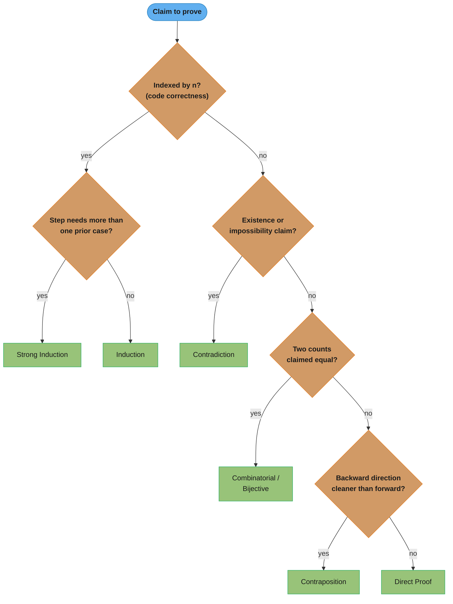
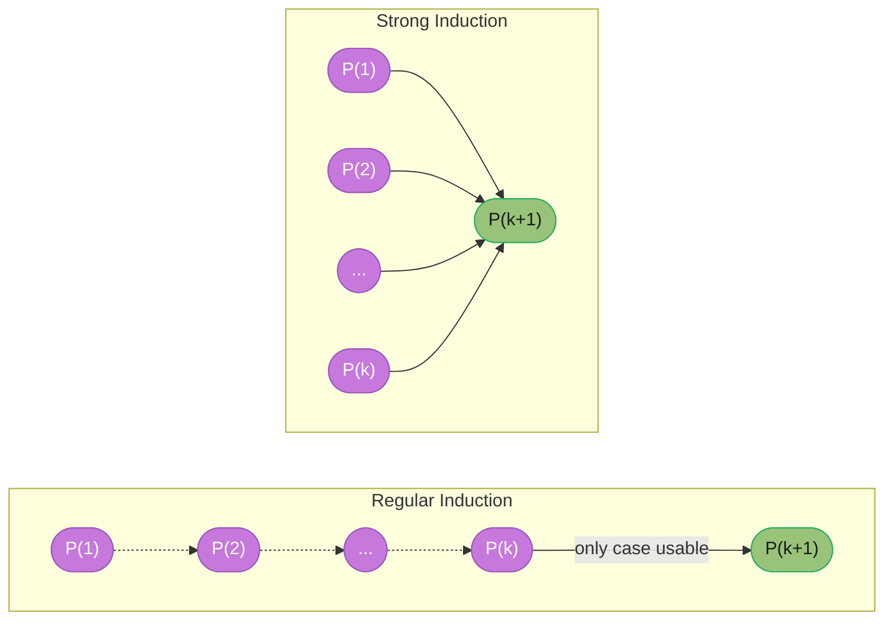
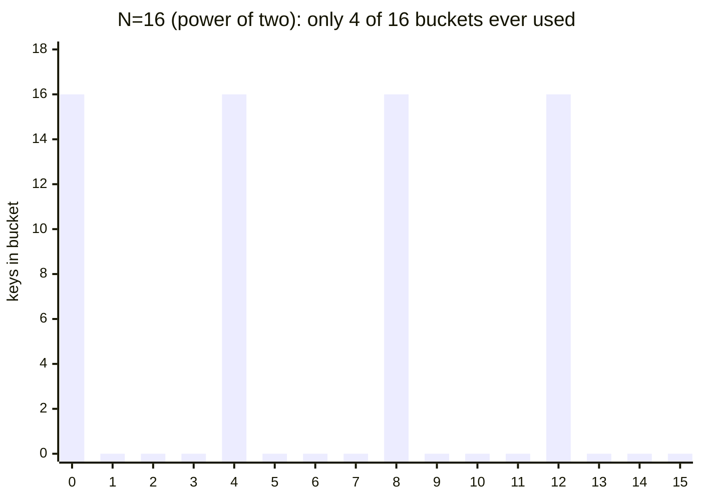
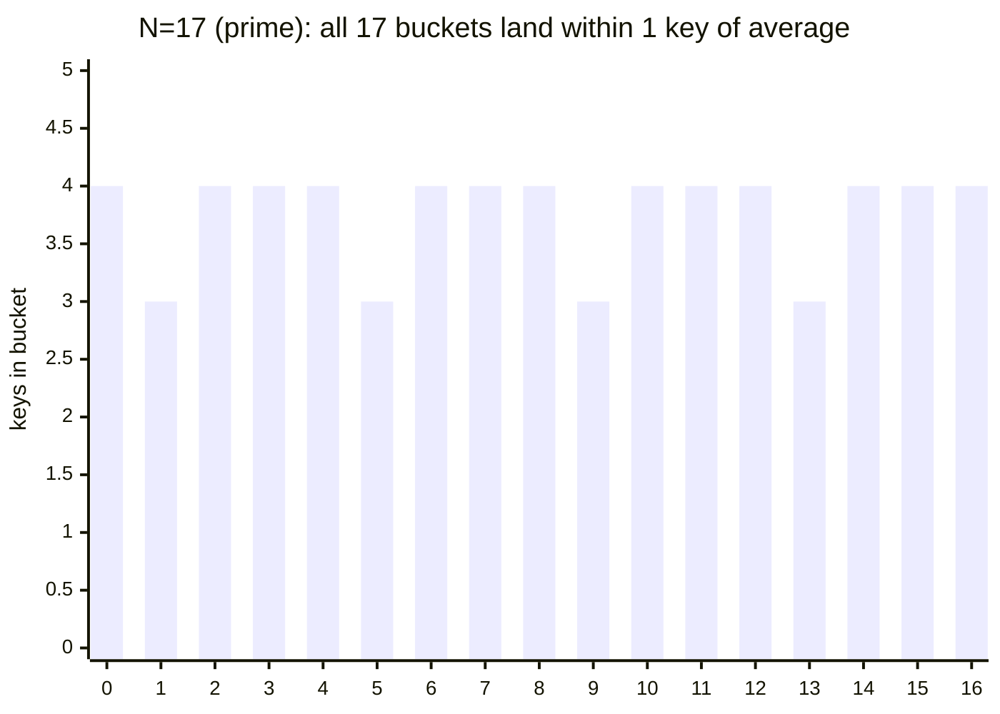
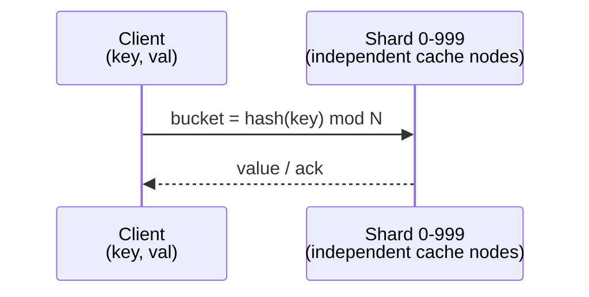
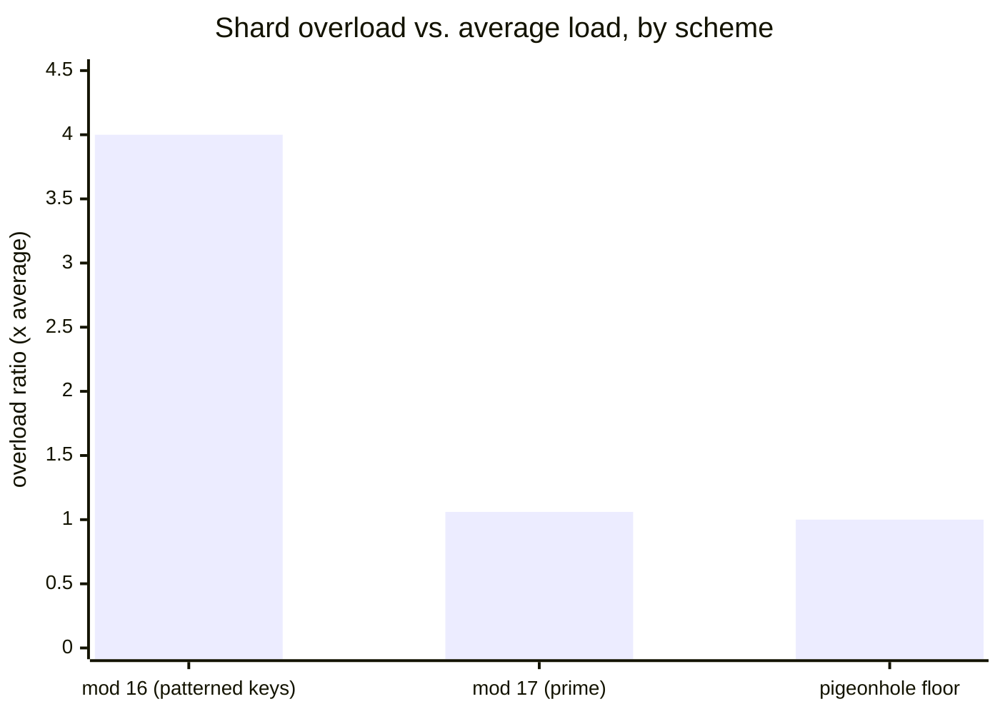

# Discrete Mathematics for Engineers

---

## 1. Concept Overview

Discrete mathematics is the study of structures that are countable and distinct — logical statements, sets, integers, graphs — as opposed to the continuous structures (limits, derivatives, real-valued functions) that calculus studies. It is the formal substrate underneath every data structure and algorithm module in this section: when you claim a recursive function is correct, you are making an inductive argument; when you claim a hash table's load factor bounds collisions, you are invoking the Pigeonhole Principle; when you claim a randomized algorithm runs fast "on average," you are using linearity of expectation; when you size a hash table or design a cipher, you are doing modular arithmetic.

This module covers eight pillars, each tied to where it actually shows up in interviews and production systems: **propositional and predicate logic** (truth tables, implication, quantifiers, De Morgan's Laws — the backbone of every boolean condition and validation check); **sets, relations, and functions** (equivalence relations underlie Union-Find; bijections underlie perfect hashing and encoding); **proof techniques** (direct, contrapositive, contradiction, and especially induction and strong induction — the literal mechanism by which loop invariants and recursive correctness are established); **combinatorics and counting** (product/sum rules, permutations, combinations, the Pigeonhole Principle, inclusion-exclusion — the math behind brute-force complexity and hash collisions); **recurrences** (solving them exactly, and how the Master Theorem connects to divide-and-conquer complexity); **basic probability** (expected value and linearity of expectation — the standard tool for analyzing randomized algorithms); **modular arithmetic** (the arithmetic underneath hash bucketing and public-key cryptography); and **graph theory basics** (degree, paths, trees, bipartiteness — the vocabulary the graph modules build on).

None of this is academic decoration. An off-by-one error in an inductive proof is the same bug pattern as an off-by-one error in a loop's exit condition — because it IS the same mechanism, viewed through two different vocabularies.

---

## 2. Intuition

> **One-line analogy**: discrete math is the grammar checker for algorithm claims — "this loop terminates with the right answer," "this hash function spreads keys evenly," "this randomized algorithm is fast on average" are all sentences that need grammar (a proof) to be trustworthy, not just intuition that sounds right.

**Mental model**: every rigorous claim you make about code decomposes into one of a handful of discrete-math primitives. "This recursive function is correct for all n" is an induction argument. "This hash function must produce a collision somewhere" is the Pigeonhole Principle. "This randomized algorithm runs in O(n log n) on average" is linearity of expectation applied to indicator variables. "This divide-and-conquer algorithm's recurrence solves to Θ(n log n)" is the Master Theorem. Learning discrete math is learning to recognize which primitive a claim needs *before* you try to prove it.

**Why it matters**: an inductive proof with a misaligned base case can "verify" code that is actually broken at the one input that matters (Section 10, Pitfall 1) — the single most common way boundary bugs slip past a code review that "looked correct." A hash function chosen without respecting the Pigeonhole Principle can silently degrade a hash table from O(1) to O(n) under an adversarial or merely unlucky key distribution. An engineer who can immediately identify "this is a strong-induction argument" or "this is a linearity-of-expectation argument" solves in two minutes what an engineer without the vocabulary spends twenty minutes fumbling toward by trial and error.

**Key insight**: proof techniques are not academic gatekeeping — induction *is* the technique used to prove recursive and iterative code correct (a loop invariant is an inductive hypothesis wearing a different name), and linearity of expectation *is* the technique used to prove a randomized algorithm's expected running time. Master the recognition ("which primitive does this claim need?") and the mechanics follow quickly.

---

## 3. Core Principles

- **Propositions and connectives**: a proposition is true or false, never both. The five connectives are negation (¬p), conjunction (p ∧ q), disjunction (p ∨ q), implication (p → q), and biconditional (p ↔ q). A tautology is true under every truth assignment (p ∨ ¬p); a contradiction is false under every assignment (p ∧ ¬p); two statements are logically equivalent if they share a truth table.
- **Implication's relatives — the highest-yield trap**: given p → q, the contrapositive ¬q → ¬p is logically equivalent to it (same truth table), but the converse q → p and the inverse ¬p → ¬q are separate claims that can be false even when the original is true. Confusing these four is the single most common logic error in both mathematical proofs and code review (Section 10, Pitfall 2 — mistaking a hash match for key equality is exactly this fallacy).
- **De Morgan's Laws**: ¬(p ∧ q) ≡ ¬p ∨ ¬q, and ¬(p ∨ q) ≡ ¬p ∧ ¬q — flip the connective, negate both sides. These are exactly the identities `not (a and b)` and `not (a or b)` obey in every mainstream language, and the reason negating a compound `WHERE` clause or firewall rule correctly requires flipping both the connective and each condition.
- **Quantifiers**: the universal quantifier ∀x P(x) means P holds for every x in the domain; the existential ∃x P(x) means P holds for at least one x. Negating a quantified statement flips the quantifier and negates the predicate — a generalized De Morgan's law: ¬(∀x P(x)) ≡ ∃x ¬P(x), and ¬(∃x P(x)) ≡ ∀x ¬P(x).
- **Quantifier order matters**: ∀x ∃y P(x,y) ("for every x there is *some* y, possibly different per x") is strictly weaker than ∃y ∀x P(x,y) ("there is *one* y that works for every x") — exactly the difference between a function (one output chosen per input) and a constant (one value that answers every input). Swapping quantifier order silently changes the specification.
- **Sets**: union (A ∪ B), intersection (A ∩ B), difference (A − B), complement. A set with n elements has a power set of exactly 2ⁿ elements — every element is independently in-or-out, the product rule (Section 4) applied n times — which is precisely why enumerating "all subsets" of an n-element input costs O(2ⁿ). The Cartesian product A × B has |A| · |B| elements, the mathematical justification for a nested loop over two collections.
- **Relations and equivalence classes**: a relation on A is a subset of A × A. An equivalence relation is reflexive (a R a), symmetric (a R b ⟹ b R a), and transitive (a R b ∧ b R c ⟹ a R c), and it always partitions its set into disjoint equivalence classes — "same connected component" and "same root in a Union-Find structure" are equivalence relations in disguise, which is exactly why [Union-Find](../dsa_patterns/union_find.md) is the canonical structure for maintaining one incrementally as unions arrive.
- **Partial orders**: relax symmetry to antisymmetry (a R b ∧ b R a ⟹ a = b) while keeping reflexivity and transitivity. "Must run before" and "is a prerequisite of" are partial orders — topological sort only works because a DAG's edges encode a partial order with no cycles.
- **Functions — injective, surjective, bijective**: a function is injective (one-to-one) if distinct inputs always give distinct outputs, surjective (onto) if every possible output is reachable, and bijective if both hold simultaneously (the function is invertible). A hash function mapping a larger key space into a smaller bucket space can *never* be injective — the Pigeonhole Principle (Section 6.4) makes this mathematically certain, not just likely — so the real engineering goal is a function that spreads the unavoidable collisions evenly rather than clustering them.

### Decoding the Notation Above

**The idea behind it.** "Every symbol in this section is shorthand for one English sentence — the logic symbols say *what is claimed*, the set symbols say *what is inside what*, and the quantifiers say *how many things the claim covers*."

Almost none of it is arithmetic. Reading a discrete-math statement aloud, symbol by symbol, converts it back into the sentence it was compressed from — and the compression is the only thing that makes these statements look harder than the code they describe.

| Symbol | What it actually is |
|--------|---------------------|
| `¬p` | Flip the truth value. Code: `!p` |
| `p ∧ q` | True only when both are true. Code: `p && q` |
| `p ∨ q` | True when at least one is true (inclusive). Code: `p \|\| q` |
| `p → q` | A promise. False *only* in the one case p true, q false. Code: `!p \|\| q` |
| `p ↔ q` | Both directions hold. The two have identical truth values |
| `≡` | Same truth table on every row. Not "equals a number" |
| `∀x P(x)` | The claim holds for *every* element of the domain. A loop that must never break |
| `∃x P(x)` | At least one element works. A search that must find a hit |
| `x ∈ A` | Membership. Code: `x in A` |
| `A ⊆ B` | Every element of A is also in B. Code: `A.issubset(B)` |
| `A ∪ B` | Everything in either set. Code: `A \| B` |
| `A ∩ B` | Only what is in both. Code: `A & B` |
| `A − B` | In A but not in B. Code: `A - B` |
| `A × B` | All ordered pairs `(a, b)`. The nested loop |
| `\|A\|` | How many elements. Code: `len(A)` |
| `⟹` | Same arrow as `→`, used between proof steps rather than inside a formula |

**Walk one example with real numbers.** Two small sets, every set operation evaluated:

```
  A = {1, 2, 3, 4}                B = {3, 4, 5}

  A union B       A u B  = {1, 2, 3, 4, 5}        size 5
  A intersect B   A n B  = {3, 4}                 size 2
  A minus B       A - B  = {1, 2}                 size 2
  is A a subset of B?  no -- 1 is in A but not in B

  inclusion-exclusion check:  |A| + |B| - |A n B|
                            =  4  +  3  -   2      = 5   = |A u B|   ok

  power set of A:   2^|A| = 2^4  = 16 subsets   (each of 4 elements: in or out)
  A x B  (pairs):   |A| * |B| = 4 * 3 = 12 ordered pairs
```

The two bottom lines are why "enumerate all subsets" costs 2^n and "compare every pair across two lists" costs the product of their sizes. The counting rule and the complexity class are the same fact stated twice.

**Why quantifier order is not a detail.** Read the two orderings aloud over the domain "integers", with `P(x, y)` meaning "y is greater than x":

```
  for all x, there exists y with y > x       TRUE   -- pick y = x + 1, a NEW y per x
  there exists y, for all x, with y > x      FALSE  -- needs ONE y beating every integer

  x = 5   -> y = 6    ok        <- the first form is allowed to choose y after seeing x
  x = 99  -> y = 100  ok        <- a different y again; that freedom is the whole gap
```

Same four symbols, same predicate, opposite truth values. In a spec this is the difference between "every request gets *a* worker" (a pool) and "there is *one* worker that serves every request" (a bottleneck) — swapping the order silently rewrites the requirement, which is why `∀∃` versus `∃∀` is the highest-frequency quantifier trap in both proofs and design documents.

---

## 4. Types / Proof Techniques

Every correctness or existence claim in computer science reduces to one of a handful of reusable proof strategies. Recognizing *which* strategy fits a claim is itself the tested skill: "prove this loop/recursion always produces the right answer" almost always wants induction; "prove no algorithm can beat this bound" often wants contradiction or an adversary argument.

### 4.1 Direct Proof

Assume the hypothesis, chain forward through implications to the conclusion. Example: the sum of two even integers is even. Let n = 2a and m = 2b for integers a, b; then n + m = 2(a + b), which is even by definition. No detours, no assumptions beyond the hypothesis itself.

### 4.2 Proof by Contraposition

Prove ¬q → ¬p instead of p → q; the two are logically equivalent (identical truth table), so proving one proves the other. Example: "if n² is even then n is even" is awkward to prove forward (you would need to reason backwards from a property of n² to a property of n). Its contrapositive — "if n is odd then n² is odd" — is a clean one-line direct proof: n = 2k + 1 gives n² = 4k² + 4k + 1 = 2(2k² + 2k) + 1, which is odd by definition.

### 4.3 Proof by Contradiction

Assume the claim is false, derive a logical contradiction from that assumption alone, and conclude the claim must be true. The canonical example is "√2 is irrational": assume √2 = a/b in lowest terms; squaring gives a² = 2b², which forces a to be even, which in turn forces b to be even too — contradicting "lowest terms." Contradiction is the tool of choice for impossibility and non-existence claims: "there is no largest prime" (Euclid), "no comparison-based sort beats Ω(n log n) worst case."

### 4.4 Proof by Induction

State P(n) as the claim indexed by a natural number n. Prove a **base case** — P holds at the smallest n the claim applies to — then prove the **inductive step**: assuming P(k) (the inductive hypothesis) for an arbitrary k, show P(k+1) follows. The well-ordering principle (every non-empty set of natural numbers has a smallest element) is *why* this works: if P failed somewhere, there would be a smallest failing n > base, and the inductive step (P(n−1) ⟹ P(n)) would contradict n being the smallest failure. Induction is the workhorse for proving recursive and iterative code correct (Section 6.1) and for closed-form counting formulas (Section 6.3).

#### Decoding the Induction Schema

**Stated plainly.** "Show the claim is true at the starting number, then show that truth at any one number forcibly drags truth to the next number — and the claim topples over every number like dominoes, forever, from one finite argument."

The move that feels illegal is *assuming* P(k) in the middle of proving it. It is not circular: you never assume the thing you are proving (P for all n); you assume one arbitrary rung and prove the rung above it. The base case is what tips the first domino, and without it the whole chain proves nothing.

| Piece | What it actually is |
|-------|---------------------|
| `P(n)` | The claim, written as a function of n. Must be a statement, not a number |
| base case | Verify P at the floor by direct arithmetic. The tipped first domino |
| `P(k)` | "Suppose the claim already holds at some arbitrary rung k" |
| `P(k) ⟹ P(k+1)` | The domino spacing: truth at k mechanically forces truth at k+1 |
| "arbitrary k" | You may use nothing about k except that P(k) holds — that is what makes it general |
| conclusion | Base + step together give every n at once |

**Walk one example with real numbers.** Claim: `P(n)` is "1 + 2 + ... + n = n(n+1)/2".

```
  BASE CASE  n = 1
    left side  = 1
    right side = 1 * (1 + 1) / 2 = 2 / 2 = 1          match -> P(1) holds

  INDUCTIVE STEP   assume P(k):  1 + ... + k = k(k+1)/2
    want:  1 + ... + k + (k+1) = (k+1)(k+2)/2

    1 + ... + k + (k+1)
       = k(k+1)/2 + (k+1)             <- substitute the hypothesis, the ONLY step using it
       = (k+1) * (k/2 + 1)            <- factor out (k+1)
       = (k+1)(k+2)/2                 <- exactly the target       P(k+1) holds

  SPOT CHECK the two sides at several n
    n =   1 ->  sum      1     formula      1
    n =   4 ->  sum     10     formula     10
    n =  10 ->  sum     55     formula     55
    n = 100 ->  sum  5,050     formula  5,050
```

**Why the base case carries the whole argument.** The inductive step alone proves only "*if* it ever holds, it keeps holding" — a chain of dominoes nobody pushed. Prove the step for the false claim "1 + ... + n = n(n+1)/2 + 7" and it still goes through (add 7 to both sides), yet the claim is wrong at every n, because no base case survives: at n = 1 it demands 1 = 8. A misaligned or skipped base case is exactly the off-by-one that lets a "verified" loop be wrong at its first or last iteration — Section 10, Pitfall 1 is that bug in code form.

### 4.5 Strong Induction

Identical to induction, except the inductive step may assume P holds for **all** of P(base) ... P(k), not merely P(k) alone, when proving P(k+1). Strong induction is not logically more powerful than regular induction — the two are provably equivalent in strength — it is more *convenient* whenever a problem's natural decomposition reaches back further than one step. The postage-stamp / coin-formability argument in Section 6.2 needs exactly this, and it is the same argument that proves many dynamic-programming recurrences correct (see [dynamic_programming](../dynamic_programming/README.md)).

### 4.6 Combinatorial (Bijective) Proof

Prove two quantities are equal by exhibiting a **bijection** between the two sets being counted, or by counting one set two different ways ("double counting") and equating the results. This underlies several counting identities in Section 6.3 and is often the cleanest way to establish a formula without induction or algebra.

| Technique | Best fit | Signature phrase in the claim |
|---|---|---|
| Direct | A straightforward chain of implications | "If X, then Y" with no obvious detour |
| Contraposition | Forward direction is awkward; backward is clean | "If X, then Y" where ¬Y is the easier starting point |
| Contradiction | Ruling out an entire alternative | "There is no...", "cannot be done", "is irrational" |
| Induction | Claim indexed by n, especially code correctness | "For all n ≥ base case"; loop/recursive correctness |
| Strong induction | Step needs more than the immediately preceding case | Claim built from several smaller sub-cases at once |
| Combinatorial / bijective | Two different-looking counts are claimed equal | "The number of A equals the number of B" |

The table above is a lookup; the flow below is the actual triage a candidate should run against an unfamiliar claim, top to bottom, before committing to a proof strategy:



Recognizing which branch a claim falls into is the tested skill (Section 2's "which primitive does this claim need?"); the six leaves are exactly the six rows of the table above, reached by asking one cheap question at a time instead of pattern-matching the whole claim at once.

---

## 5. Architecture Diagrams

### Propositional Logic Made Visible: Truth Tables and De Morgan's Laws

```
P  Q  | ~P  ~Q  | P&Q  P|Q  P->Q
--------------------------------
T  T  | F   F   | T    T    T
T  F  | F   T   | F    T    F
F  T  | T   F   | F    T    T
F  F  | T   T   | F    F    T
```

Every connective's behavior is fully determined by 4 rows for two propositions —
when a compound boolean condition feels ambiguous, write out the table rather
than trusting intuition; `~`, `&`, `|` are the same symbols your code already
uses for NOT, AND, OR.

```
P  Q  | ~(P&Q)  ~P | ~Q | ~(P|Q)  ~P & ~Q
-----------------------------------------
T  T  | F       F       | F       F
T  F  | T       T       | F       F
F  T  | T       T       | F       F
F  F  | T       T       | T       T

columns 3-4 are identical for every row  -> ~(P&Q) === ~P | ~Q
columns 5-6 are identical for every row  -> ~(P|Q) === ~P & ~Q
```

Columns 3-4 (and 5-6) matching on every row *is* the proof that De Morgan's Laws
hold — a truth table is a complete, mechanical verification for any claim about
a small, fixed number of propositions.

### Induction: One Proof That Covers Every n

```mermaid
flowchart LR
    classDef io      fill:#61afef,stroke:#2e86c1,color:#1a1a1a,font-weight:bold
    classDef frozen  fill:#c678dd,stroke:#9b59b6,color:#fff
    classDef train   fill:#98c379,stroke:#27ae60,color:#1a1a1a
    classDef mathOp  fill:#d19a66,stroke:#e67e22,color:#1a1a1a,font-weight:bold
    classDef lossN   fill:#e06c75,stroke:#c0392b,color:#fff,font-weight:bold
    classDef req     fill:#56b6c2,stroke:#0097a7,color:#1a1a1a
    classDef base    fill:#e5c07b,stroke:#f39c12,color:#1a1a1a

    P0(["P(0)<br/>base case<br/>proved by hand"]) -->|"same argument"| P1(["P(1)"])
    P1 -->|"same argument"| P2(["P(2)"])
    P2 -->|"same argument"| P3(["P(3)"])
    P3 -.->|"repeats without limit"| Pn1(["P(n-1)"])
    Pn1 -->|"same argument"| Pn(["P(n)"])

    class P0 base
    class P1,P2,P3,Pn1,Pn train
```



One proved base case plus one reusable step covers EVERY n — like a row of dominoes: knock over domino 0, and "domino k falling knocks over k+1" does the rest. Skip or misalign the base case and the whole chain never starts.



Regular induction's step may reach back exactly one case; strong induction's
step may reach back to any earlier case, which is why it is the natural tool
whenever a recurrence (Section 6.2, Section 6.5) depends on more than its
immediate predecessor.

### Pigeonhole: From n+1 Pigeons to Overloaded Hash Buckets

```
holes (n=5):     [ 1 ]   [ 2 ]   [ 3 ]   [ 4 ]   [ 5 ]

pigeons (n+1=6):   P       P       P       P       P     P
                                                         ^
                                        6th pigeon: every hole already
                                        has one -- it MUST double up
```

64 keys (all multiples of 4) hashed by `key mod N`:





The pigeonhole guarantee ("6 pigeons, 5 holes, someone doubles up") and the
hash-bucket demonstration are the same statement at two different scales —
Section 6.4 and Section 14 make the connection precise, including exactly why
the N=16 scheme collapses to 4 buckets while N=17 does not.

---

## 6. How It Works — Detailed Mechanics

### 6.1 Proving a Loop Invariant — Induction in Its Native Habitat

```python
def sum_to_n(n: int) -> int:
    total = 0
    for i in range(1, n + 1):
        total += i
    return total
```

**Claim (loop invariant)**: at the start of the iteration that is about to process `i`, `total == 1 + 2 + ... + (i - 1)`.

- **Initialization (base case)**: before the loop starts, `i = 1` and `total = 0`, which equals the empty sum `1 + ... + 0`. Holds trivially.
- **Maintenance (inductive step)**: assume the invariant holds before processing `i` (`total == 1 + ... + (i-1)`). After `total += i` executes, `total == 1 + ... + (i-1) + i == 1 + ... + i` — the invariant holds before processing `i + 1`.
- **Termination (conclusion)**: the loop exits when `i = n + 1`, so the invariant gives `total == 1 + 2 + ... + n == n(n+1)/2`.

This three-part structure — initialization, maintenance, termination — is CLRS's loop-invariant method, and it is *exactly* mathematical induction with the parts renamed. A correctness argument for an iterative algorithm cannot skip the "assume it holds, then show it still holds" step any more than a recursive proof can skip its inductive step.

### 6.2 Strong Induction and the Correctness of DP Recurrences

**Claim**: every integer amount n ≥ 8 can be formed as a sum of 3-cent and 5-cent coins.

- **Base cases**: 8 = 3 + 5, 9 = 3 + 3 + 3, 10 = 5 + 5.
- **Inductive step**: for k ≥ 10, assume the claim holds for *every* value from 8 through k (the strong-induction hypothesis). To form k + 1: since k + 1 ≥ 11, (k + 1) − 3 ≥ 8, so by the hypothesis (k+1)−3 is formable — add one more 3-cent coin to reach k + 1.

This needs **strong** induction, not regular induction, because the step for k + 1 relies on the value (k + 1) − 3, which is not always the immediately preceding case k. (The largest amount that *cannot* be formed is 7 — the Frobenius number for coprime 3 and 5 is 3·5 − 3 − 5 = 7 — which is exactly why 8 is the correct base-case floor.)

```python
def can_form_with_3_and_5(n: int) -> bool:
    """dp[i] is True iff i can be formed as a sum of 3s and 5s. The recurrence
    dp[i] = dp[i-3] or dp[i-5] IS the inductive step above, encoded as code —
    its correctness for all n >= 8 is exactly the strong-induction proof."""
    if n < 0:
        return False
    dp = [False] * (n + 1)
    dp[0] = True                                  # 0 formed by using no coins
    for i in range(1, n + 1):
        dp[i] = (i >= 3 and dp[i - 3]) or (i >= 5 and dp[i - 5])
    return dp[n]

assert [can_form_with_3_and_5(i) for i in range(8, 15)] == [True] * 7
assert can_form_with_3_and_5(7) is False          # 7 is the Frobenius exception
```

Any dynamic-programming recurrence that reaches back more than one index (`dp[n-3]`, `dp[n-5]`; or `dp[n-1]`, `dp[n-2]` for a tiling problem) is only correct because a strong-induction argument like this one backs it — see [dynamic_programming](../dynamic_programming/README.md) for the full DP family this generalizes to.

### 6.3 Counting: Product/Sum Rules, Permutations, Combinations, Inclusion-Exclusion

- **Product rule**: if a first choice has m options and a second, independent choice has n options, the pair has m · n total combinations. An 8-character password from 62 alphanumeric characters has 62⁸ ≈ 2.18 × 10¹⁴ possibilities — the product rule applied 8 times.
- **Sum rule**: if two choices are mutually exclusive alternatives, the total is the sum of each alternative's count. Choosing one representative from a 10-person group OR a disjoint 6-person group gives 10 + 6 = 16 ways.
- **Permutations** (order matters, no repetition): P(n, r) = n! / (n − r)!. Ordering the top 3 finishers among 10 racers: P(10, 3) = 10 · 9 · 8 = 720.
- **Combinations** (order does not matter): C(n, r) = n! / (r! (n − r)!). Choosing a 3-person committee from 10 people: C(10, 3) = 120.
- **Inclusion-exclusion**: |A ∪ B| = |A| + |B| − |A ∩ B|, generalizing to |A ∪ B ∪ C| = |A|+|B|+|C| − |A∩B| − |A∩C| − |B∩C| + |A∩B∩C|. Counting integers from 1 to 100 divisible by 3 or 5: ⌊100/3⌋ + ⌊100/5⌋ − ⌊100/15⌋ = 33 + 20 − 6 = 47.

```python
import math
from itertools import permutations, combinations

n, r = 10, 3
assert len(list(permutations(range(n), r))) == math.perm(n, r) == 720
assert len(list(combinations(range(n), r))) == math.comb(n, r) == 120

# inclusion-exclusion: multiples of 3 or 5 in [1, 100]
div3, div5, div15 = 100 // 3, 100 // 5, 100 // 15
assert div3 + div5 - div15 == 47
```

#### Decoding the Counting Formulas

**What the formula is telling you.** "A permutation counts *arrangements* — the same people in a different order is a different answer. A combination counts *selections* — the same people in a different order is the same answer, so you divide the arrangement count by the number of orderings you refused to distinguish."

That single division, `r!`, is the entire difference between the two formulas. Everything else — both numerators are the identical `n! / (n − r)!` — is shared.

| Symbol | What it actually is |
|--------|---------------------|
| `n!` | `n × (n−1) × ... × 1`. The number of ways to order n distinct things |
| `n! / (n − r)!` | Cancels away the ordering of the `n − r` things you did *not* pick |
| `P(n, r)` | Ways to pick r of n **and put them in order**. Python: `math.perm` |
| `C(n, r)`, `nCr`, `(n choose r)` | Ways to pick r of n **ignoring order**. Python: `math.comb` |
| `r!` (the extra divisor) | How many orderings of one chosen group you are collapsing into a single count |
| `\|A ∪ B\|` | Total distinct items across both, each counted once |
| `− \|A ∩ B\|` | The correction: items in both got counted twice, so subtract one copy |

**Walk one example with real numbers.** Ten racers; award the top 3 places, then instead pick a 3-person committee:

```
  n = 10 racers, r = 3 slots

  10! = 3,628,800          <- every ordering of all ten
   7! = 5,040              <- orderings of the 7 who did NOT place, which we do not care about

  PERMUTATIONS  P(10,3) = 10! / 7! = 3,628,800 / 5,040 = 720
    same thing counted directly:  10 * 9 * 8 = 720
    "gold has 10 candidates, then silver 9 left, then bronze 8 left"

  COMBINATIONS  C(10,3) = P(10,3) / 3! = 720 / 6 = 120
    3! = 6   <- the 6 orderings of ONE committee {Ann, Bob, Cy}:
               ABC  ACB  BAC  BCA  CAB  CBA   all one committee, not six

  so 720 podiums collapse into 120 committees, exactly 6 podiums per committee
```

The same division scales: a 5-card poker hand is `C(52,5) = 2,598,960`, not the `P(52,5) = 311,875,200` you get if you (wrongly) treat the order the cards were dealt as meaningful — a factor of `5! = 120` too large.

**Why "does order matter?" is the only question you have to answer.** Nearly every miscount in a counting interview is choosing the wrong one of these two formulas, not arithmetic. Ask whether swapping two chosen items produces a genuinely different outcome: different podium, yes → permutation; same committee, no → combination. And when you count with `|A| + |B|` and the two groups can overlap, inclusion-exclusion is the same instinct — subtract the double-counted overlap once, which is why `33 + 20 − 6 = 47` above and not `33 + 20 = 53`.

The product rule is also why brute force costs what it costs: generating every subset of an n-element set is 2ⁿ (each element independently in-or-out), and generating every ordering is n! (Section 3's power-set and Cartesian-product principles, applied directly) — see [complexity_analysis_and_big_o](../complexity_analysis_and_big_o/README.md) for how these translate into the exponential and factorial complexity classes.

### 6.4 The Pigeonhole Principle, From Guarantee to Hash-Table Capacity Planning

**Pigeonhole Principle**: placing more than n items into n containers guarantees at least one container holds more than one item. The **generalized** form is sharper: placing n items into k containers guarantees some container holds at least ⌈n / k⌉ items.

```python
def force_collision_demo(num_buckets: int) -> tuple[int, int]:
    """By pigeonhole, inserting num_buckets + 1 keys into num_buckets buckets
    guarantees at least one collision. Returns the (key, bucket) pair that
    collides -- the loop is GUARANTEED to return, never to exhaust the range."""
    seen: dict[int, int] = {}
    for key in range(num_buckets + 1):        # n+1 pigeons
        bucket = key % num_buckets             # n holes
        if bucket in seen:
            return key, bucket
        seen[bucket] = key
    raise AssertionError("unreachable: pigeonhole guarantees a hit")

assert force_collision_demo(16) == (16, 0)
```

Pigeonhole gives a **guarantee**, not a probability — it says nothing about *how soon* a collision becomes likely, only that one must eventually exist. That is a different question, answered by the **birthday paradox**: for a hash with N possible outputs, the count of keys needed for a 50% chance of *some* collision is approximately 1.1774 × √N, not N. A 32-bit hash has N = 2³² ≈ 4.3 billion possible outputs, so pigeonhole alone would need 2³² + 1 keys to *force* a collision — but the birthday approximation puts a coin-flip-odds collision at only **≈ 77,000 keys** (1.1774 × √(2³²) ≈ 77,162), five orders of magnitude sooner. This is precisely why 32-bit hashes are considered weak for content-addressed storage at scale, and why systems moved to 64-bit and 128-bit+ digests.

#### Decoding Pigeonhole vs. the Birthday Bound

**What this actually says.** "Pigeonhole answers *when is a collision unavoidable* and the birthday bound answers *when does one become likely* — and the second number is the square root of the first, which is why real systems break vastly earlier than the guarantee suggests."

These two get conflated constantly, and the conflation is expensive: sizing a hash by the pigeonhole number is off by a factor of tens of thousands.

| Symbol | What it actually is |
|--------|---------------------|
| `n` items, `k` containers | Keys being hashed, and the buckets or digest values they land in |
| `n > k ⟹ collision` | The guarantee. Certainty, with zero probability involved |
| `⌈n / k⌉` | Generalized form: some container is *at least* this full. Round the division UP |
| `N` | The number of distinct hash outputs. For a b-bit hash, `N = 2^b` |
| `√N` | Half the bits. A 32-bit hash's square root is a 16-bit-sized number |
| `1.1774 × √N` | Keys needed for a 50% chance of *some* collision. The birthday bound |

**Walk one example with real numbers.** The same 32-bit hash, measured both ways:

```
  32-bit hash:  N = 2^32 = 4,294,967,296 possible outputs

  PIGEONHOLE (certainty)
    keys needed to FORCE a collision = N + 1 = 4,294,967,297

  BIRTHDAY (coin-flip odds)
    sqrt(N)              = 65,536
    1.1774 * 65,536      = 77,162 keys        <- 50% chance SOME pair collides

  ratio  4,294,967,297 / 77,162  =  ~55,662x sooner than the guarantee

  scaling by hash width:
    16-bit   N = 65,536                    50% at ~301 keys
    32-bit   N = 4,294,967,296             50% at ~77,162 keys
    64-bit   N = 18,446,744,073,709,551,616  50% at ~5.06 billion keys
```

Adding 32 bits multiplied the safe key count by roughly 65,536 — not by 2, and not by 4 billion. Halving the exponent is what the square root does, so **every extra bit of digest buys only half a bit of collision resistance.**

**Why the guarantee is the useless number in production.** Pigeonhole tells you a 32-bit hash *must* collide past 4.3 billion keys, which sounds like acres of headroom for a 100-million-row table. The birthday bound says a coin-flip collision arrives at 77,162 keys — you cross it before the table fills a single page of a dashboard. Any argument of the form "we will never store 2^32 items so collisions are impossible" is using the wrong bound, and it is the reasoning error behind the SHA-1 deprecation story in Section 7: SHAttered needed roughly 2^63.1 evaluations against a *160-bit* digest, because the birthday bound, not the digest width, sets the real attack cost.

### 6.5 Solving Recurrences Beyond the Master Theorem: Characteristic Equations

[complexity_analysis_and_big_o](../complexity_analysis_and_big_o/README.md#43-recurrence-relations-and-master-theorem) covers the Master Theorem for **divide-and-conquer** recurrences of the form T(n) = a·T(n/b) + f(n). The Master Theorem does not apply to **linear recurrences with constant coefficients** — recurrences like T(n) = T(n−1) + T(n−2) + O(1), where the subproblem sizes shrink by subtraction rather than division. Those are solved with the **characteristic equation** method.

For the Fibonacci recurrence F(n) = F(n−1) + F(n−2), the characteristic equation is x² = x + 1, with roots φ = (1+√5)/2 ≈ 1.618 (the golden ratio) and ψ = (1−√5)/2 ≈ −0.618. The closed form (Binet's formula) is F(n) = (φⁿ − ψⁿ) / √5, so F(n) = Θ(φⁿ).

This sharpens a claim often left loose: naive recursive Fibonacci is commonly bounded as O(2ⁿ) using the simpler model T(n) ≤ 2·T(n−1) + O(1) (a valid but loose upper bound — see [complexity_analysis_and_big_o](../complexity_analysis_and_big_o/README.md) Q17). Solving the *actual* recurrence T(n) = T(n−1) + T(n−2) + O(1) via the characteristic equation gives the **tight** bound Θ(φⁿ) ≈ Θ(1.618ⁿ) — asymptotically far smaller than 2ⁿ: at n = 100, φ¹⁰⁰ ≈ 7.92 × 10²⁰ versus 2¹⁰⁰ ≈ 1.27 × 10³⁰, roughly a billion-fold, or nine orders of magnitude, apart.

Linear recurrences also solve counting problems directly: the number of length-n binary strings containing no two consecutive 1s is F(n + 2) (verified for n = 1..5: 2, 3, 5, 8, 13 — exactly F(3) through F(7)). Recognizing "this count satisfies the same recurrence as Fibonacci" turns a combinatorics problem into an already-solved recurrence.

#### Decoding the Characteristic Equation

**In plain terms.** "Guess that the answer grows like some number raised to the n-th power, plug that guess into the recurrence, and the recurrence collapses into an ordinary quadratic whose roots *are* the growth rates."

That is the whole method. A recurrence is a rule with no closed form; the characteristic equation is the trick that turns "each term is built from earlier terms" into "each term is `x^n` for a specific x you can solve for algebraically."

| Symbol | What it actually is |
|--------|---------------------|
| `F(n) = F(n−1) + F(n−2)` | The rule. Tells you how to *compute* term n, not how big it is |
| `x² = x + 1` | The recurrence after substituting `F(n) = xⁿ` and dividing by `x^(n−2)` |
| `φ` | The larger root, `(1 + √5)/2 ≈ 1.618`. The golden ratio, and the growth rate |
| `ψ` | The smaller root, `(1 − √5)/2 ≈ −0.618`. Magnitude below 1, so it vanishes as n grows |
| `(φⁿ − ψⁿ)/√5` | The closed form. Exact for every n, despite being built from irrationals |
| `Θ(φⁿ)` | A *tight* bound — the true growth rate, not merely a ceiling above it |
| `O(2ⁿ)` | An upper bound only. True, but loose — the real growth is much slower |

**Walk one example with real numbers.** Substituting the guess into the recurrence, then measuring how loose `2ⁿ` is:

```
  guess  F(n) = x^n     and substitute into  F(n) = F(n-1) + F(n-2)

     x^n = x^(n-1) + x^(n-2)
     x^2 = x + 1              <- divide every term by x^(n-2). The recurrence is now a quadratic
     x^2 - x - 1 = 0
     x = (1 +/- sqrt(5)) / 2  ->  phi = 1.6180...   psi = -0.6180...

  psi^n dies out:  |psi| < 1, so psi^10 = 0.0081, psi^50 = 3.6e-11 -> phi^n dominates

  HOW LOOSE IS 2^n?     at n = 100
     phi^100 = 7.92e20
     2^100   = 1.27e30
     ratio   = 1.6e9        <- the loose bound overstates the work ~1.6 BILLION-fold
```

**Why the tight bound is worth the algebra.** `O(2ⁿ)` and `Θ(φⁿ)` both say "exponential, do not run this on large n", so for a triage decision they are interchangeable. They stop being interchangeable the moment you estimate an actual runtime: at n = 100 they disagree by nine orders of magnitude, which is the difference between "finishes over a weekend" and "outlives the machine." Big-O is a promise about a ceiling; `Θ` is a claim about the real rate, and only the characteristic equation gets you the second one for a subtract-style recurrence — the Master Theorem cannot, because it only handles subproblems that shrink by *division*.

### 6.6 Modular Arithmetic: Fast Exponentiation, Fermat's Little Theorem, and Hash Bucketing

Modular addition and multiplication distribute cleanly: (a + b) mod m = ((a mod m) + (b mod m)) mod m, and likewise for multiplication — division does not distribute this way and requires a modular inverse instead.

**Fast exponentiation** (square-and-multiply) computes aᵇ mod m in O(log b) multiplications instead of the naive O(b):

```python
def mod_pow(base: int, exp: int, mod: int) -> int:
    """Square-and-multiply: O(log exp) multiplications instead of O(exp)."""
    result = 1
    base %= mod
    while exp > 0:
        if exp & 1:                  # odd exponent: fold in the current base
            result = (result * base) % mod
        base = (base * base) % mod   # square the base
        exp >>= 1
    return result

# 128 = 2^7, so this takes 8 loop iterations, not 128 naive multiplications
assert mod_pow(7, 128, 1_000_000_007) == pow(7, 128, 1_000_000_007)
```

For a cryptographic exponent that is a 2048-bit number, square-and-multiply needs on the order of 2,048 iterations — the naive approach is computationally infeasible at that size. Python's built-in three-argument `pow(base, exp, mod)` already uses this algorithm internally.

**Fermat's Little Theorem**: for prime p and any integer a not divisible by p, aᵖ⁻¹ ≡ 1 (mod p). It underlies probabilistic primality testing (Fermat / Miller-Rabin) and gives a modular inverse for free when the modulus is prime: since a · a^(p−2) ≡ 1 (mod p), the value a^(p−2) mod p **is** a's inverse.

```python
p, a = 13, 5
inverse = pow(a, p - 2, p)             # Fermat-derived modular inverse
assert (a * inverse) % p == 1          # 5 * 8 mod 13 == 1
```

#### Decoding Modular Notation, Square-and-Multiply, and the Inverse

**Read it like this.** "Modular arithmetic is clock arithmetic — only the remainder survives, so you may reduce at every step instead of at the end. Square-and-multiply exploits that by doubling the exponent each round instead of adding one, and Fermat's theorem hands you division for free when the modulus is prime."

The reduce-as-you-go property is not a convenience — it is what keeps intermediate values small enough to compute at all. `7^128` has 109 digits; `7^128 mod 1,000,000,007` never exceeds 10 digits at any point.

| Symbol | What it actually is |
|--------|---------------------|
| `a mod m` | The remainder after dividing a by m. Always in `0 .. m−1` for positive m |
| `a ≡ b (mod m)` | a and b leave the *same* remainder. Not "a equals b" — it is an equivalence relation |
| `(a + b) mod m` distributes | `((a mod m) + (b mod m)) mod m`. Same for `×`. **Not** for `÷` |
| `aᵇ mod m` | Modular exponentiation. Python: `pow(a, b, m)` — the 3-argument form |
| `exp & 1` | Reads the current low bit of the exponent. The "multiply" half of the algorithm |
| `exp >>= 1` | Shift right one bit. Turns O(b) work into O(log b) |
| `aᵖ⁻¹ ≡ 1 (mod p)` | For prime p and a not divisible by p. The reason the next row works |
| `a^(p−2) mod p` | The value that multiplies a back to 1. Modular "division by a" |

**Walk one example with real numbers.** Square-and-multiply on a small case you can check by hand, `5^11 mod 13`:

```
  exp = 11 = binary 1011      -> 4 rounds, not 11 multiplications

  round  exp  bit  result (only when bit=1)          base (squared every round)
  -----  ---  ---  ------------------------------    -----------------------------
    1     11   1   1 * 5   = 5                       5*5   = 25 mod 13 = 12
    2      5   1   5 * 12  = 60 mod 13 = 8           12*12 = 144 mod 13 = 1
    3      2   0   (skip, bit is 0)          8       1*1   = 1
    4      1   1   8 * 1   = 8                       done

  answer 8      check: 5^11 = 48,828,125 and 48,828,125 mod 13 = 8   ok

  cost: exponent 128 = 2^7 needs 8 rounds, not 128 multiplications
        a 2048-bit RSA exponent needs ~2,048 rounds, not 2^2048 -- the gap
        between "instant" and "will never finish"

  FERMAT INVERSE, p = 13, a = 5
    inverse = a^(p-2) mod p = 5^11 mod 13 = 8       <- the same number just computed
    check:    5 * 8 = 40,  40 mod 13 = 1            <- 8 IS "one thirteenth-style divide by 5"
```

**Why division needs an inverse at all.** Addition and multiplication survive the mod because remainders add and multiply consistently; division does not, since `6/2 mod 13` and `6/2` on the reduced representatives can disagree once a numerator wraps. So modular arithmetic replaces "divide by a" with "multiply by the number that undoes a", and Fermat's theorem produces that number in one `pow` call whenever the modulus is prime. This is also the practical argument for prime moduli in hashing and in competitive-programming arithmetic (`1_000_000_007` is prime precisely so inverses always exist), and it is the same exponentiation primitive RSA runs on — see [cryptography_fundamentals](../cryptography_fundamentals/README.md).

**Why hash table sizes matter here**: if the table size m is a power of two, `key mod m` depends only on the low bits of `key` — if keys share structure in those bits (all even, all multiples of 4, aligned pointer addresses), severe clustering results (Section 14 makes this concrete). A **prime** table size makes `key mod m` depend on all of the key's bits, breaking that specific failure mode. Real-world hash tables solve the same problem two different ways: classic implementations choose a prime size; Java's `HashMap` instead keeps power-of-two sizes (for the speed of `hash & (n - 1)` over `hash % n`) and applies a **spreading** step first — `h ^ (h >>> 16)` since Java 8 — that mixes high bits into low bits before the mask is applied. See [arrays_strings_and_hashing](../arrays_strings_and_hashing/README.md) for the full hash-table treatment, and [cryptography_fundamentals](../cryptography_fundamentals/README.md) for where modular exponentiation and Fermat's theorem reappear inside RSA.

### 6.7 Probability and Linearity of Expectation: Randomized Quicksort

**Expected value**: E[X] = Σ x · P(X = x). **Linearity of expectation**: E[X + Y] = E[X] + E[Y] **always**, even when X and Y are dependent — this unconditional guarantee is what makes it the single most useful tool for analyzing randomized algorithms.

To find the expected number of comparisons in randomized quicksort, define an indicator variable X_ij = 1 if the elements at final sorted ranks i and j are ever compared (i < j), 0 otherwise. Two elements at rank distance d = j − i are compared only if one of them is chosen as a pivot before any element strictly between them in rank — which happens with probability 2 / (d + 1). By linearity of expectation:

```
E[total comparisons] = sum over all pairs i<j of  2 / (j - i + 1)
                      = 2(n+1)H_n - 4n                     (H_n = 1 + 1/2 + ... + 1/n)
                      = Theta(n log n)
```

#### Decoding Expectation, Indicators, and That Sum

**What it means.** "Instead of reasoning about the whole messy random run at once, ask a yes/no question about each individual pair, note that the average of a yes/no question is just its probability, and add those probabilities up — legally, even though the pairs are wildly dependent on each other."

The permission to add dependent things is the entire trick. It is what turns an intractable analysis of recursion-tree shapes into a sum over `n(n−1)/2` independent-looking little questions.

| Symbol | What it actually is |
|--------|---------------------|
| `E[X]` | The long-run average of the random quantity X. Not a most-likely value |
| `Σ x · P(X = x)` | The definition: weight each outcome by how often it happens |
| `E[X + Y] = E[X] + E[Y]` | Averages always add. **True even when X and Y are dependent** |
| `X_ij` | A variable that is 1 if ranks i and j are ever compared, else 0 |
| `E[indicator] = P(event)` | The bridge: counting becomes probability |
| `2 / (j − i + 1)` | Chance that i or j is picked as pivot before anything between them |
| `H_n` | `1 + 1/2 + 1/3 + ... + 1/n`. Grows like `ln n` — the source of the log |
| `Θ(n log n)` | Tight bound: the exact growth rate, not just an upper limit |

**Walk one example with real numbers.** Why the `2 / (d + 1)` probability is what it is, then the full sum at n = 1000:

```
  WHY 2/(d+1):  take ranks i and j with d = j - i, so d+1 elements sit in [i..j]
    the FIRST of those d+1 elements chosen as a pivot decides everything:
      it is i or j        -> they get compared          (2 of the d+1 outcomes)
      it is anything between -> they are split apart, never compared

    adjacent ranks   d = 1  -> P = 2/2   = 1.00   always compared
    d = 4                   -> P = 2/5   = 0.40
    d = 9                   -> P = 2/10  = 0.20
    far apart  d = 99       -> P = 2/100 = 0.02   almost never compared

  SUM IT UP, n = 1000
    H_1000 = 1 + 1/2 + ... + 1/1000 = 7.4855
    E[comparisons] = 2(n+1)H_n - 4n
                   = 2 * 1001 * 7.4855 - 4000
                   = 14,985.9 - 4,000
                   = 10,985.9

    for scale:  n log2(n) = 1000 * 9.966 = 9,965.8    same order, ~1.10x apart
    simulation (2,000 trials) averaged 10,955.9       within 0.3% of the formula
```

**Why linearity is the load-bearing assumption.** Whether ranks 5 and 6 get compared is heavily entangled with whether 5 and 7 do — they share pivots and share recursion branches. Any tool requiring independence (multiplying probabilities, variance of a sum) would be illegal here, and the analysis would stall. Linearity of expectation asks for nothing: `E[X + Y] = E[X] + E[Y]` holds unconditionally, so you may sum `n(n−1)/2` mutually dependent indicators and still get the exact answer. Note the one thing it does **not** license — `E[X · Y] = E[X] · E[Y]` needs independence and is false in general, which is Section 10, Pitfall 4.

```python
import random

def randomized_quicksort_count_comparisons(arr: list[int]) -> int:
    comparisons = 0
    def qsort(lo: int, hi: int) -> None:
        nonlocal comparisons
        if hi - lo <= 1:
            return
        pivot_idx = random.randint(lo, hi - 1)
        arr[lo], arr[pivot_idx] = arr[pivot_idx], arr[lo]
        pivot = arr[lo]
        store = lo + 1
        for i in range(lo + 1, hi):
            comparisons += 1              # every element compared once to the pivot
            if arr[i] < pivot:
                arr[store], arr[i] = arr[i], arr[store]
                store += 1
        arr[lo], arr[store - 1] = arr[store - 1], arr[lo]
        qsort(lo, store - 1)
        qsort(store, hi)
    qsort(0, len(arr))
    return comparisons

# n = 1000: exact formula 2(n+1)H_n - 4n = 10,985.9; a 2,000-trial simulated
# average lands at ~10,955.9 -- within 0.3% of the closed-form prediction, and
# this holds regardless of the input array's initial order.
```

This is why randomized quicksort has no adversarial worst-case input, unlike a fixed-pivot version (see [complexity_analysis_and_big_o](../complexity_analysis_and_big_o/README.md), Section 12, Q4): the random pivot choice is independent of how the input happens to be arranged, so the expectation above holds for every input.

### 6.8 Graph Theory Basics: Handshake Lemma, Trees, and Bipartiteness

**Handshake Lemma**: the sum of all vertex degrees in a graph equals exactly twice the number of edges (every edge contributes 1 to each of its two endpoints' degree). A direct corollary: the number of odd-degree vertices in any graph is always even — a fast sanity check for a graph algorithm's bookkeeping.

**Trees**: a connected, acyclic graph on n vertices has exactly n − 1 edges — any additional edge creates a cycle, and any fewer edges disconnects it. This is the invariant Union-Find uses to detect cycles while building a minimum spanning tree: an edge that would connect two vertices already in the same equivalence class (Section 3) would violate "n − 1 edges, no cycle."

**Bipartite graphs**: a graph is bipartite if and only if it can be 2-colored so that no edge connects two same-colored vertices, which is equivalent to having no odd-length cycle.

#### Decoding the Graph Counting Facts

**Put simply.** "Every edge has exactly two ends, so counting ends is the same as counting edges twice — and a tree is the sparsest graph that is still connected, so it has one edge fewer than it has vertices, with no slack anywhere."

Both facts are one-line sanity checks you can run against any graph-algorithm bug report, and both are counting arguments, not graph algorithms.

| Symbol | What it actually is |
|--------|---------------------|
| `V`, `\|V\|` | The nodes. Often called `n` |
| `E`, `\|E\|` | The connections. Often called `m` |
| `deg(v)` | How many edge-ends touch v. A self-loop counts 2 |
| `Σ deg(v) = 2\|E\|` | Sum every vertex's degree and you have counted every edge exactly twice |
| `\|E\| = \|V\| − 1` | Connected and acyclic forces exactly this. One more edge → a cycle; one fewer → disconnected |
| bipartite | Vertices split into two sides with no edge inside a side |
| odd cycle | The one obstruction to 2-coloring. Alternating colors around it always clashes |

**Walk one example with real numbers.** A 4-vertex complete graph, then a 7-vertex tree:

```
  K4 -- every pair of 4 vertices joined

    each vertex touches the other 3   ->  deg(v) = 3 for all four
    sum of degrees = 4 * 3 = 12
    edges = 12 / 2 = 6                    check: C(4,2) = 6   ok

    odd-degree vertices: all 4 have degree 3 -> count is 4, which is EVEN, as the
    corollary demands (an odd count of odd-degree vertices is impossible, always)

  a 7-vertex tree
    edges = |V| - 1 = 6
    sum of degrees = 2 * 6 = 12 spread over 7 vertices -> average degree 12/7 = 1.71

    add ANY 7th edge  -> 7 edges on 7 vertices -> a cycle must exist
    drop ANY edge     -> 5 edges on 7 vertices -> the graph splits in two
```

**Why these are the fastest bug detectors you have.** An adjacency-list builder that forgets to add the reverse edge in an undirected graph produces a degree sum that is *odd* or that is not `2|E|` — catchable in one pass, before any traversal runs. Likewise, a "minimum spanning tree" that comes back with anything other than `|V| − 1` edges is wrong by definition, whatever the algorithm claims, which is exactly the invariant Kruskal's Union-Find check is enforcing edge by edge: reject an edge whose two endpoints already share a root, because accepting it would push the count past `|V| − 1` and close a cycle.

```python
from collections import deque

def is_bipartite(adj: list[list[int]]) -> bool:
    """2-color via BFS; return False the instant an edge would need both
    endpoints the same color. adj[v] is the list of v's neighbors."""
    n = len(adj)
    color = [-1] * n                       # -1 = uncolored, 0/1 = the two colors
    for start in range(n):
        if color[start] != -1:
            continue
        color[start] = 0
        queue = deque([start])
        while queue:
            u = queue.popleft()
            for v in adj[u]:
                if color[v] == -1:
                    color[v] = 1 - color[u]         # alternate color
                    queue.append(v)
                elif color[v] == color[u]:
                    return False                     # same-colored edge -> odd cycle
    return True
```

These are the concept-level primitives; the full traversal, shortest-path, and advanced-structure treatment lives in [graphs_tries_and_advanced_structures](../graphs_tries_and_advanced_structures/README.md).

---

## 7. Real-World Examples

**Git and the SHA-1 to SHA-256 migration** — Git identifies every object by a hash of its content. In February 2017, Google and CWI Amsterdam published "SHAttered," the first practical SHA-1 collision, using roughly 2^63.1 SHA-1 evaluations. Git has supported an experimental SHA-256 object format since Git 2.29 (2020) specifically because a 160-bit digest's birthday bound (Section 6.4) offers a shrinking safety margin as compute grows cheaper.

**Java's `HashMap` bucket sizing** — table capacities are always powers of two (for fast `hash & (n-1)` indexing), and since Java 8 the implementation applies a supplemental spread `h ^ (h >>> 16)` to every hash code before masking, specifically to counteract the low-bit clustering pigeonhole predicts (Section 6.6) for patterned keys such as sequential IDs or aligned pointers.

**RSA key generation and decryption** — modular exponentiation (Section 6.6) is RSA's core operation, and Fermat's Little Theorem underlies both primality testing during key generation and the CRT-based speedup used during decryption. See [cryptography_fundamentals](../cryptography_fundamentals/README.md) for the full RSA walkthrough.

**Redis sorted sets (`ZSET`)** — implemented as a skip list, a probabilistically balanced structure where each node is promoted to the next level with fixed probability p = 0.25. The expected O(log n) height is itself a linearity-of-expectation argument over the promotion chain, the same tool used in Section 6.7.

**PostgreSQL join-order enumeration** — ordering n tables in a query has n! possible join orders (Section 6.3's permutation rule). PostgreSQL's planner exhaustively searches (dynamic programming over subsets) only up to `geqo_threshold` tables (default 12); beyond that it switches to a genetic algorithm, precisely because n! makes exhaustive enumeration infeasible past a small n.

**Bloom filters** — size their bit array and choose their number of hash functions using a false-positive-rate formula derived from the same balls-into-bins probability reasoning as Section 6.4's birthday approximation. See [graphs_tries_and_advanced_structures](../graphs_tries_and_advanced_structures/README.md).

**Union-Find in Kruskal's MST and "connected components" problems** — every `union`/`find` call is maintaining the equivalence-class partition described in Section 3, incrementally, in near-O(1) amortized time per operation.

---

## 8. Tradeoffs

### Proof Technique Comparison

| Technique | Best fit | Typical cost | Common failure mode |
|---|---|---|---|
| Direct | Simple, forward-chaining implications | Short | Skipping a step that needs its own justification |
| Contraposition | Forward direction awkward, backward clean | Short–medium | Confusing contrapositive with converse |
| Contradiction | Existence / impossibility claims | Medium | Assuming more than the claim's negation |
| Induction | Claims indexed by n; code correctness | Medium | Base case index not matching the code's actual floor |
| Strong induction | Step needs more than one prior case | Medium | Not recognizing it's needed; getting stuck with weak induction |
| Combinatorial / bijective | Two counts claimed equal | Medium–long | Constructing a mapping that isn't actually a bijection |

### Existence vs. Expectation: Which Tool Answers Which Question

| Question you're answering | Tool | Gives you | Example |
|---|---|---|---|
| "Must a collision exist?" | Pigeonhole | A guarantee | n+1 keys into n buckets |
| "How many keys until a collision is *likely*?" | Birthday approximation | A probability estimate | ~77,000 keys, 32-bit hash, 50% chance |
| "What's the expected cost of this random process?" | Linearity of expectation | An exact expected value | Randomized quicksort's comparison count |
| "What's the guaranteed worst case?" | Direct / adversarial argument | A guaranteed bound | Fixed-pivot quicksort's O(n²) on sorted input |

### Hash Table Sizing Strategy

| Strategy | Indexing cost | Distribution quality | Used by |
|---|---|---|---|
| Power-of-two size, raw hash | Fast (`hash & (n-1)`) | Poor if keys share low-bit structure | Naive/broken custom hash tables |
| Power-of-two size + bit-mixing | Fast (`(h ^ (h >>> 16)) & (n-1)`) | Good | Java `HashMap` (since Java 8) |
| Prime size, plain modulo | Slower (`hash % n`, integer division) | Good regardless of key structure | Classic textbook hash tables |

---

## 9. When to Use / When NOT to Use

**Reach for a formal proof (especially induction) when:**
- A claim must hold for *all* n, not just the values you happened to test — testing 10,000 inputs never proves a claim for input 10,001.
- You are justifying a recursive or iterative algorithm's correctness in an interview or a design review.
- You need to establish that a DP recurrence's reach (which prior states it reads) is actually sufficient — that is a strong-induction question in disguise.

**Do NOT reach for the heaviest tool available when:**
- n is small and fixed — direct enumeration or a unit test suite is more useful than a general proof (mirrors [complexity_analysis_and_big_o](../complexity_analysis_and_big_o/README.md)'s "profile, don't derive, for small n" guidance).
- You only need an *existence* guarantee — pigeonhole answers that in one line; do not reach for a full probability model when you don't need an estimate of *how often*.
- You are estimating average-case behavior of code with no randomness in it — linearity of expectation analyzes *randomized* algorithms; a deterministic algorithm's average case requires reasoning about its input distribution instead.

**Use pigeonhole vs. birthday-style probability deliberately:**
- Pigeonhole: "does a collision have to exist somewhere?" — a yes/no guarantee.
- Birthday approximation: "after how many operations does a collision become likely?" — a quantitative estimate, and the practically relevant number for capacity planning (Section 14).

---

## 10. Common Pitfalls

### Pitfall 1: Off-by-One in the Induction Base Case

**BROKEN** — the proof's base case does not match the code's actual recursion floor, hiding a real bug:

```python
# BROKEN: base case bug hidden by an off-by-one induction "proof"
def power_of_two(n: int) -> int:
    if n == 0:
        return 0             # BUG: 2**0 == 1, not 0
    return 2 * power_of_two(n - 1)

# "Proof" (BROKEN): Claim P(n): power_of_two(n) == 2**n for all n >= 0.
#   Base case chosen as n=1 (NOT n=0, the code's real recursion floor):
#     power_of_two(1) = 2 * power_of_two(0) = 2 * 1 = 2 = 2**1   [checks out --
#     but this "1" for power_of_two(0) was asserted by intuition, never by
#     actually reading the code's own n==0 branch]
```

Because the proof starts at P(1) and treats P(0) as "obviously fine," it never checks the code's actual base case — so the real bug (`power_of_two(0)` returning 0 instead of 1) is completely invisible to this "verified" proof.

**FIX** — the induction's base case must be the exact smallest input the code can receive, checked directly against the code:

```python
# FIX: base case of the PROOF must match the base case of the CODE, exactly.
def power_of_two(n: int) -> int:
    if n == 0:
        return 1            # FIXED
    return 2 * power_of_two(n - 1)

# Re-run the proof with the CORRECT base case:
#   Base case P(0): power_of_two(0) = 1 = 2**0.                          [holds]
#   Inductive step: assume P(k): power_of_two(k) == 2**k for some k >= 0.
#     Show P(k+1): power_of_two(k+1) = 2*power_of_two(k) = 2*2**k = 2**(k+1). [holds]
#   By induction, P(n) holds for all n >= 0.
```

### Pitfall 2: Hash Equality Mistaken for Key Equality

**BROKEN** — treats a hash match as if it were a key match (the converse fallacy from Section 3, applied to hashing):

```python
class NaiveCache:
    def __init__(self) -> None:
        self._store: dict[int, str] = {}

    def put(self, key: str, value: str) -> None:
        self._store[hash(key)] = value        # keyed by hash, not by key

    def get(self, key: str) -> str | None:
        return self._store.get(hash(key))     # BUG: different keys can share a hash
```

**FIX** — always compare full keys after a hash match; a hash equal only narrows the search:

```python
class SafeCache:
    def __init__(self) -> None:
        self._buckets: dict[int, list[tuple[str, str]]] = {}

    def put(self, key: str, value: str) -> None:
        bucket = self._buckets.setdefault(hash(key), [])
        for i, (k, _) in enumerate(bucket):
            if k == key:
                bucket[i] = (key, value)
                return
        bucket.append((key, value))

    def get(self, key: str) -> str | None:
        for k, v in self._buckets.get(hash(key), []):
            if k == key:                       # explicit equality check, not hash alone
                return v
        return None
```

### Pitfall 3: Misapplying Pigeonhole — "No Collisions Observed" Is Not "Collision-Free"

**BROKEN reasoning**: "I tested 100 random keys against a 64-bit hash and found zero collisions, so this hash function is collision-resistant." Pigeonhole only *guarantees* a collision once your sample exceeds the hash's output range — 2⁶⁴ + 1 keys — and the birthday approximation only makes one *likely* around 1.1774 × √(2⁶⁴) ≈ 5.06 billion keys. A 100-key sample is nowhere near either threshold, so it carries essentially zero evidence in either direction.

**FIX**: reason from the correct tool for the question you're actually asking — pigeonhole for a guaranteed existence claim, the birthday approximation for an expected-onset estimate — and never generalize a small sample's absence of observed collisions into a collision-resistance claim.

### Pitfall 4: Assuming Linearity of Expectation Extends to Products

**BROKEN**: assumes E[X · Y] = E[X] · E[Y] for *dependent* random variables. Let X be a fair die roll and Y = 1 if X is even, else 0 (Y depends on X). Then E[X] = 3.5 and E[Y] = 0.5, so the broken claim gives E[XY] = 1.75. The actual value: X·Y is nonzero only when X ∈ {2, 4, 6}, each with probability 1/6, so E[XY] = (2+4+6)/6 = 2.0 — not 1.75, because X and Y move together.

**FIX**: linearity of expectation — E[X+Y] = E[X]+E[Y] — holds unconditionally regardless of dependence, but the product identity requires independence: E[XY] = E[X]E[Y] + Cov(X, Y). Default to decomposing a complex random quantity into a **sum** of indicator variables (as in Section 6.7's quicksort analysis), specifically because sums stay linear even under dependence, while products do not.

### Pitfall 5: Modulo Sign Semantics Differ Across Languages

**BROKEN** — a hash bucket computed with `%` assumes Python-like floored-division semantics everywhere, but Java, C, and C++ use truncated division, where the result's sign matches the *dividend*, not the divisor:

```python
print(-7 % 3)      # Python: 2   (floored division -- result's sign matches the divisor)
# Java:   -7 % 3   -> -1        (truncated division -- result's sign matches the dividend)
# C/C++:  -7 % 3   -> -1        (same as Java, since C99 / C++11)
```

A `hashCode()` in Java can legally be negative, so `bucket = hashCode % numBuckets` can be negative — indexing an array with it throws `ArrayIndexOutOfBoundsException`, or worse, silently corrupts an unchecked native buffer.

**FIX**:

```python
def bucket_index(hash_code: int, num_buckets: int) -> int:
    return ((hash_code % num_buckets) + num_buckets) % num_buckets

# In Java, the idiomatic fix is identical:
#   int bucket = ((hashCode % numBuckets) + numBuckets) % numBuckets;
# or, when numBuckets is a power of two, mask instead of mod -- this also
# sidesteps sign entirely because & operates on bit patterns, not magnitude:
#   int bucket = hashCode & (numBuckets - 1);
```

---

## 11. Technologies & Tools

| Tool | Ecosystem | Purpose | Notes |
|---|---|---|---|
| Z3 | SMT solver (Microsoft Research) | Automated theorem proving over propositional/predicate logic | Used in program verification and symbolic execution |
| Coq / Lean 4 | Proof assistants | Machine-checked induction proofs | Lean 4's Mathlib formalizes large bodies of proved mathematics |
| TLA+ | Formal specification (Lamport) | Model-checks an invariant across every reachable system state | The same "loop invariant" idea from Section 6.1, checked exhaustively |
| SymPy `rsolve` | Python | Symbolic recurrence solving | Automates the characteristic-equation method from Section 6.5 |
| `sympy.ntheory` | Python | Modular arithmetic, Miller-Rabin primality, modular inverse | `mod_inverse`, `isprime`, `discrete_log` |
| `math.comb` / `math.perm` / `itertools` | Python stdlib | Combinatorics (permutations, combinations) | Available since Python 3.8 |
| NetworkX | Python | Graph theory basics: degree, bipartite check, connected components | `nx.is_bipartite(G)`, `nx.degree(G)` |
| `hashlib` | Python stdlib | Cryptographic hash functions (SHA-256, etc.) | Reference implementation for Section 6.4/6.6 examples |
| `random` / NumPy `default_rng` | Python | Empirically validating probability claims via simulation | Cross-check analytical expectations, as in Section 6.7 |

---

## 12. Interview Questions with Answers

**Does hash(a) == hash(b) imply that a == b?**
No, a hash match only means two keys collided in the hash function's range, not that they are equal. This is a converse fallacy — "equal keys have equal hashes" is the real contract every hash function must satisfy, but the reverse is never guaranteed, and once the key space is larger than the hash's output space, pigeonhole guarantees such collisions occur. Production code must always follow a hash match with a full key-equality check (Java's `hashCode`/`equals` contract, Python's `__hash__`/`__eq__`) — skipping it causes silent wrong-answer bugs, not crashes, which is far more dangerous.

**What's wrong with concluding a hash function is "collision-free" after testing a small sample with no collisions found?**
Absence of observed collisions in a small sample proves nothing, because pigeonhole only guarantees a collision once your sample exceeds the hash's output range. A 64-bit hash has 2^64 ≈ 1.8×10^19 possible outputs, so pigeonhole alone needs that many keys for a guaranteed collision — but the birthday approximation (about 1.1774 × sqrt(N) keys for a 50% chance) puts a coin-flip-odds collision at only around 5 billion keys, and neither number is anywhere close to a 100-key test sample. Reason from the correct tool: pigeonhole for guaranteed existence, the birthday approximation for expected onset, never a small sample's absence of evidence.

**Is E[X * Y] equal to E[X] * E[Y] in general?**
No, E[X·Y] = E[X]·E[Y] only holds when X and Y are independent. For dependent variables the correct identity is E[XY] = E[X]E[Y] + Cov(X,Y) — rolling a die for X and setting Y=1 when X is even gives E[X]=3.5 and E[Y]=0.5, but the true E[XY] is 2.0, not 1.75, because X and Y move together. Linearity of expectation, E[X+Y]=E[X]+E[Y], is the identity that holds unconditionally regardless of dependence, which is why randomized-algorithm analysis decomposes costs into a sum of indicator variables rather than a product.

**Why does `-7 % 3` give different results in Python versus Java or C++?**
Python's `%` implements floored division, where the result takes the sign of the divisor, while Java and C++ implement truncated division, where the result takes the sign of the dividend. Concretely, `-7 % 3` is `2` in Python but `-1` in Java and C++, which silently produces a negative bucket index if used directly to index into an array. Always normalize with `((h % n) + n) % n`, or mask instead of mod when `n` is a power of two (`h & (n - 1)`), which sidesteps sign entirely.

**What is the off-by-one trap in an induction proof, and how do you avoid it?**
The trap is starting the induction's base case at an index that does not match the code's actual recursion or loop floor. For example, `power_of_two(0)` returning `0` instead of `1` is a real bug, but a "proof" that starts its base case at P(1) and treats P(0) as "obviously fine" by intuition never actually checks the code's true base case, so the bug slips through undetected. Always set the induction's base case to the exact smallest input the code can receive, and verify it directly against the code, not against intuition.

**Is the converse of "if P then Q" logically equivalent to the original statement?**
No, only the contrapositive (not-Q implies not-P) is logically equivalent to the original implication. The converse (Q implies P) and inverse (not-P implies not-Q) are separate claims that can be false even when the original is true — "if it rained, the ground is wet" does not mean "if the ground is wet, it rained" (a sprinkler could be running). This is the same fallacy as assuming a hash match implies key equality, and it is worth double-checking with a truth table whenever an implication's direction matters under pressure.

**Why are hash table sizes often chosen to be prime, or otherwise specially treated?**
A prime table size prevents keys that share a common factor with the modulus from clustering into a small subset of buckets. If the table size is a power of two and keys are, say, all multiples of 4, `key mod size` only ever produces four distinct residues, collapsing what should be many buckets into a few badly overloaded ones. Modern implementations like Java's `HashMap` instead keep power-of-two sizes for fast bitmask indexing and fix clustering with a supplemental spreading step (`h ^ (h >>> 16)`) that mixes high bits into low bits before the mask is applied.

**What are the four parts of a rigorous induction proof?**
A complete induction proof has a base case, an inductive hypothesis, an inductive step, and a conclusion. The base case verifies P at the smallest input the recursion or loop actually reaches; the hypothesis assumes P(k) is true for some arbitrary k; the inductive step proves P(k+1) follows from that assumption; and the conclusion states P holds for all n at or above the base case. Skipping the explicit hypothesis step is the most common way interview candidates lose points even when their intuition about the algorithm is correct.

**How does induction relate to proving a loop invariant correct?**
A loop invariant proof is induction wearing different names: initialization is the base case, maintenance is the inductive step, and termination is the conclusion. Initialization shows the invariant holds before the first iteration; maintenance shows that if it holds before an iteration it still holds after; termination combines the invariant with the loop's exit condition to derive the final correctness claim. This structure is exactly why an iterative algorithm's correctness argument cannot skip the "assume it holds, then show it still holds" step, any more than a recursive proof can.

**When do you need strong induction instead of regular induction?**
Strong induction is required whenever the inductive step needs more than just the immediately preceding case to go through. The classic example is proving every integer amount of 8 or more can be made from 3-cent and 5-cent coins: proving it for k+1 relies on the result for (k+1)-3, which is not always the immediately preceding value k, so the hypothesis must cover all of P(8)...P(k) at once. This exact argument is also the correctness proof behind DP recurrences like `dp[n] = dp[n-3] or dp[n-5]` — strong induction is why the recurrence is allowed to reach back further than one step.

**State the Pigeonhole Principle and give a concrete hashing example.**
The Pigeonhole Principle says that if more than n items are placed into n containers, at least one container holds more than one item. Concretely, inserting 1,001 keys into a hash table with exactly 1,000 buckets guarantees at least one bucket receives two or more keys, regardless of how good the hash function is — this is a certainty, not a probability. The generalized form is sharper: placing n items into k containers guarantees some container holds at least ceil(n/k) items, which sets the minimum capacity a shard or bucket must be provisioned for.

**What is the difference between the Pigeonhole Principle and the Birthday Paradox?**
Pigeonhole gives a guarantee of existence once you exceed the container count, while the birthday paradox gives a probability of collision far before that point. A 32-bit hash has 2^32 ≈ 4.3 billion possible values, so pigeonhole only guarantees a collision at 4.3 billion plus one keys — but the birthday approximation (about 1.1774 × sqrt(N) keys for a 50% chance) puts a coin-flip-odds collision at only around 77,000 keys. Use pigeonhole to prove something must eventually happen; use the birthday bound to estimate how soon it becomes likely.

**What is Linearity of Expectation, and why does it matter for randomized algorithms?**
Linearity of Expectation states that E[X + Y] = E[X] + E[Y] for any random variables, even if they are dependent. This unconditional guarantee lets you decompose a complicated random quantity, like the total number of comparisons in a randomized algorithm, into a sum of simple indicator variables, compute each one's expectation separately, and add them up without ever needing the joint distribution. It is the single most useful tool for analyzing randomized algorithms, from quicksort's expected comparisons to load-balancing schemes.

**How do you prove randomized quicksort runs in expected O(n log n) time?**
Define an indicator variable for every pair of elements that equals 1 if that pair is ever compared, then sum their expectations using linearity of expectation. Two elements at rank distance d are compared only if one of them is chosen as a pivot before any element strictly between them, which happens with probability 2/(d+1); summing this over all pairs collapses into harmonic-number terms and evaluates to 2(n+1)H_n - 4n, which is Theta(n log n). This holds regardless of the input's initial order, which is exactly why randomized quicksort has no adversarial worst-case input, unlike a fixed-pivot version.

**What is an equivalence relation, and what data structure directly implements one?**
An equivalence relation is reflexive, symmetric, and transitive, and it partitions a set into disjoint equivalence classes. The Union-Find (Disjoint Set Union) data structure directly implements this: each `find` operation reports which equivalence class an element belongs to, and each `union` merges two classes, with path compression and union-by-rank keeping both operations nearly O(1) amortized. This is exactly the structure Kruskal's MST algorithm and "connected components" interview problems rely on.

**What does Fermat's Little Theorem say, and how is it used in cryptography and hashing?**
Fermat's Little Theorem states that a^(p-1) is congruent to 1 modulo p for any prime p and any integer a not divisible by p. It underlies probabilistic primality testing (Fermat/Miller-Rabin) and gives a shortcut for modular inverses when the modulus is prime: since a times a^(p-2) is congruent to 1 mod p, a^(p-2) mod p is a's inverse — this is exactly how RSA-adjacent computations compute modular inverses without the extended Euclidean algorithm. It only applies directly when the modulus is prime; composite moduli need the more general extended Euclidean approach.

**What is the time complexity of modular exponentiation, and why does it matter?**
Fast modular exponentiation (square-and-multiply) computes a^b mod m in O(log b) multiplications instead of the naive O(b). For an RSA-sized exponent that is a 2048-bit number, square-and-multiply needs on the order of 2,048 iterations instead of an astronomically larger naive multiplication count. Python's built-in three-argument `pow(base, exp, mod)` already uses this algorithm internally.

**What does the Handshake Lemma say about a graph's degree sequence?**
The Handshake Lemma says the sum of all vertex degrees in a graph equals exactly twice the number of edges. This follows because every edge contributes exactly 1 to the degree count of each of its two endpoints, so summing degrees counts every edge twice; a direct corollary is that the number of odd-degree vertices in any graph is always even. It is a fast sanity check for graph algorithm implementations — if your computed degree sum is odd, or doesn't match 2 times the edge count, edges are being counted or stored incorrectly.

**How do you determine whether a graph is bipartite?**
Run a BFS or DFS that assigns alternating colors to adjacent vertices, and the graph is bipartite if and only if no edge ever connects two same-colored vertices. Start any uncolored vertex with color A, color every neighbor B, every neighbor-of-neighbor A, and so on; if a vertex ever needs to be colored the opposite of its already-assigned color, the graph contains an odd-length cycle and is not bipartite. This 2-coloring check runs in O(V+E) time and is equivalent to the purely combinatorial characterization that a graph is bipartite if and only if it has no odd-length cycle.

---

## 13. Best Practices

1. **State all four parts of an induction proof explicitly** — base case, inductive hypothesis, inductive step, conclusion — even under interview time pressure; skipping the hypothesis is the most common way to lose credit for an otherwise-correct argument.
2. **Match the proof's base case to the code's actual recursion or loop floor exactly** — verify it against the code, not against intuition about what "should" happen at the smallest input.
3. **Reach for strong induction the moment a step needs more than the immediately preceding case** — do not force a weak-induction argument that keeps needing "just one more" prior case.
4. **Default to a sum of indicator variables plus linearity of expectation** when analyzing any randomized algorithm's expected cost, rather than attempting a joint-distribution computation.
5. **Use pigeonhole to prove existence, the birthday approximation to estimate onset** — never conflate "a collision must exist" with "a collision is likely soon," and never let a small sample's clean run stand in for either.
6. **Prefer a prime table size or a proven bit-mixing step** over a raw power-of-two modulus on unvetted keys.
7. **Always compare full keys after a hash match** — never treat hash equality as key equality, in a cache, a hash table, or a deduplication pass.
8. **Apply De Morgan's Laws mechanically when negating a compound condition** rather than relying on intuition, especially under review pressure.
9. **Sketch a truth table to double-check a non-obvious logical equivalence** before trusting it in a proof or a boolean refactor.
10. **Identify whether order matters and whether repetition is allowed before reaching for a counting formula** — permutation, combination, and product-rule counts are easy to conflate without this check first.

---

## 14. Case Study: Sharding a Distributed Cache — Modular Arithmetic, Pigeonhole, and Expectation Together

**Scenario**: a distributed session cache assigns each key to one of N = 1,000 shard servers via `server = hash(key) mod N`, targeting M = 10,000,000 keys (active user sessions). The design must answer three questions: how many keys must each server be provisioned for, does the modulus choice matter, and how do you prove it before deploying.



Every read or write is a single hash-and-route hop with no coordination between shards, which is exactly why the sizing questions below reduce to pure counting and probability arguments.

**1. The pigeonhole floor.** With M = 10,000,000 keys and N = 1,000 servers, the average load per server is M / N = 10,000 keys. By the generalized Pigeonhole Principle (Section 6.4), at least one server must hold at least ⌈M / N⌉ = 10,000 keys — this is a hard floor on capacity, not a target: no assignment scheme, however clever, can provision every server for fewer than the average and still fit all M keys.

**2. Linearity of expectation confirms the same number, under good hashing.** Model each key as an independent draw into one of N servers under a uniform (well-mixing) hash. For a fixed server j, let X_i be the indicator that key i lands on server j, so P(X_i = 1) = 1/N. By linearity of expectation, the expected load on server j is:

```
E[load_j] = sum over all M keys of E[X_i] = M * (1/N) = 10,000,000 / 1,000 = 10,000
```

This holds regardless of any dependence a specific hash function might introduce between keys — linearity does not require independence. The pigeonhole floor and the expected load coincide at 10,000 keys/server, which is reassuring: under good hashing, the "must happen somewhere" worst case and the "typically happens everywhere" expected case are the same number.

**3. The modulus choice is not cosmetic.** The mechanism is demonstrable at a small, fully-inspectable scale before trusting it at production scale.

```python
# BROKEN: N=16 (a power of two) with keys that are all multiples of 4 --
# a realistic pattern if an upstream ID generator increments by 4.
def shard_broken(key: int) -> int:
    return key % 16

keys = [4 * i for i in range(64)]           # 64 keys, all multiples of 4
buckets = [shard_broken(k) for k in keys]
from collections import Counter
counts = Counter(buckets)
assert set(counts) == {0, 4, 8, 12}         # only 4 of 16 buckets EVER used
assert all(v == 16 for v in counts.values())  # those 4 buckets get 4x the average
```

Only buckets {0, 4, 8, 12} are ever reachable, because `gcd(4, 16) = 4` collapses every key's residue to a multiple of 4 — no amount of retrying or re-hashing the *same broken scheme* fixes this; the modulus's relationship to the key pattern must change.

```python
# FIX: choose a modulus that shares no common factor with the key stride --
# N=17 (prime, gcd(4, 17) = 1) spreads the same keys almost uniformly.
def shard_fixed(key: int) -> int:
    return key % 17

buckets_fixed = [shard_fixed(k) for k in keys]
counts_fixed = Counter(buckets_fixed)
assert len(counts_fixed) == 17                        # every bucket used
assert max(counts_fixed.values()) - min(counts_fixed.values()) <= 1  # near-uniform
```

The demonstrated overload ratio is exact and measured, not estimated: the broken scheme's 4 hot buckets each carry 16 keys against an average of 4 — a **4x** overload, with the other 12 buckets completely starved. The fixed scheme's buckets range 3-4 keys against an average of 64/17 ≈ 3.76 — a **~1.06x** spread. At production scale the same mechanism holds: N = 1,024 (power of two) is vulnerable to any key pattern sharing a factor with 1,024, while N = 1,009 (the nearest prime) or a bit-mixing pre-hash step (Section 6.6) removes the vulnerability without changing the number of servers.

**Complexity and capacity comparison**:

| Scheme | Buckets actually used | Max load | Overload vs. average |
|---|---|---|---|
| `key % 16`, patterned keys | 4 of 16 | 16 | 4.00x |
| `key % 17`, same keys | 17 of 17 | 4 | 1.06x |
| Pigeonhole floor (any scheme, M=10M, N=1000) | — | ≥ 10,000 | 1.00x (theoretical minimum) |



The prime modulus lands within 6% of the theoretical pigeonhole floor; the power-of-two modulus on patterned keys sits 4x above it — the same gap Section 6.4's toy example demonstrated at 64-key scale now confirmed at the production 10M-key scale.

**Discussion Q&As**:

**Why doesn't simply increasing N fix the clustering if keys share a factor with N?**
Because if gcd(key stride, N) = d > 1, only N / d distinct buckets are ever reachable no matter how large N grows — stride-4 keys against any power-of-two N ≥ 4 always collapse to N / 4 buckets. The fix must change the modulus's relationship to the key pattern (an odd or prime modulus, or a mixing step before the mod), not simply add more buckets under the same broken scheme.

**How does consistent hashing change this analysis?**
Consistent hashing (see [`hld/consistent_hashing`](../../hld/consistent_hashing/README.md)) replaces the flat `mod N` assignment with points placed on a hash ring, so pigeonhole and linearity of expectation still apply — now to ring-arc lengths rather than direct buckets — but adding or removing one server only remaps roughly a 1/N fraction of keys instead of nearly all of them, which is the property `mod N` alone does not have.

---

## See Also

- [complexity_analysis_and_big_o](../complexity_analysis_and_big_o/README.md) — the Master Theorem for divide-and-conquer recurrences, and the Θ(n log n) comparison-sort lower bound this module's characteristic-equation method complements
- [recursion_and_problem_solving_patterns](../recursion_and_problem_solving_patterns/README.md) — base case / recursive step is the code-level mirror of an induction proof's base case / inductive step
- [dynamic_programming](../dynamic_programming/README.md) — strong induction is the correctness proof behind every multi-index DP recurrence
- [cryptography_fundamentals](../cryptography_fundamentals/README.md) — modular exponentiation, Fermat's Little Theorem, and Diffie-Hellman all build directly on Section 6.6
- [arrays_strings_and_hashing](../arrays_strings_and_hashing/README.md) — hash table load factor, collision resolution, and the bucket-sizing tradeoffs Section 6.6 and Section 14 apply
- [`dsa_patterns/union_find`](../dsa_patterns/union_find.md) — the data structure that directly implements the equivalence relations introduced in Section 3
- [`dsa_patterns/hashing_patterns`](../dsa_patterns/hashing_patterns.md) — interview patterns built on the pigeonhole and modular-arithmetic reasoning in Section 6.4/6.6
- [graphs_tries_and_advanced_structures](../graphs_tries_and_advanced_structures/README.md) — the full graph, trie, and Bloom-filter treatment this module's Section 6.8 introduces at the concept level
- [`hld/consistent_hashing`](../../hld/consistent_hashing/README.md) — the production-grade fix for the sharding case study's clustering problem at scale
