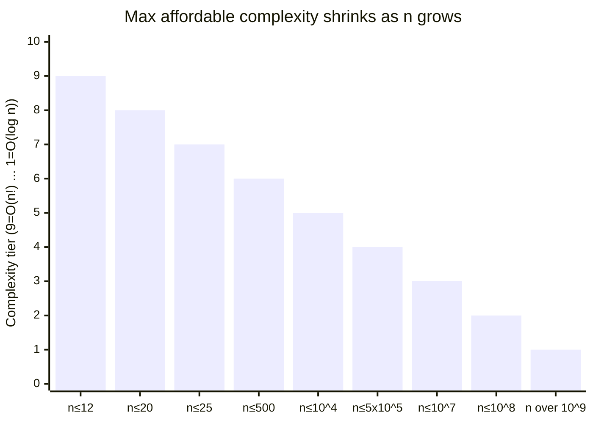
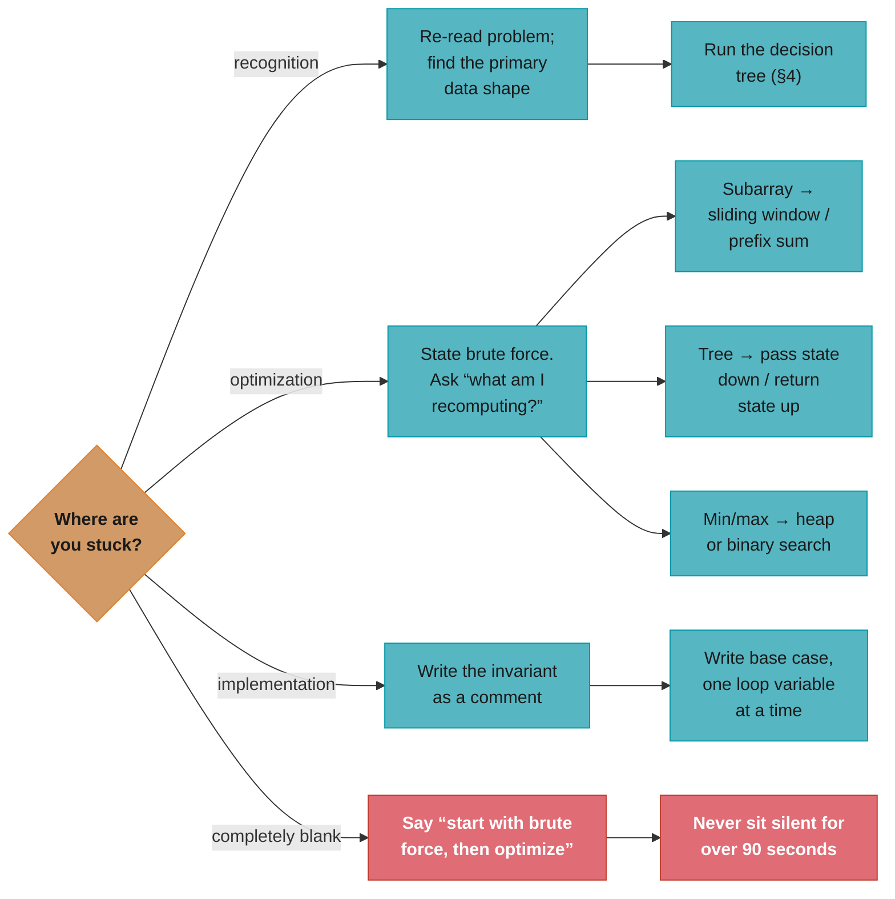

# DSA Pattern Playbooks — The Recognition Engine

The pattern-recognition and strategy-selection layer for coding interviews. This section answers the question every L5 candidate must answer in under 5 minutes: *"Given this problem, what pattern do I apply, and why?"*

> **Prerequisites**: [Phase 1–3 concept modules](../) (complexity, data structures, algorithms). Those teach *what* a heap or sliding window is. This section teaches *when* to reach for which one.

> **Scope**: language-agnostic. Code examples are Python-first (type-hinted, runnable-shaped). Java notes are added where the implementation diverges meaningfully.

> **Note on problem links**: this sub-section intentionally uses real LeetCode hyperlinks — e.g., `[Two Sum (LC 1)](https://leetcode.com/problems/two-sum/)` — because navigating to problems is part of the drill workflow. The rest of the repo uses plain-text `LeetCode N` references.

---

## How to Use This Section

**The pattern-recognition workflow:**

```mermaid
flowchart LR
    classDef io      fill:#61afef,stroke:#2e86c1,color:#1a1a1a,font-weight:bold
    classDef frozen  fill:#c678dd,stroke:#9b59b6,color:#fff
    classDef train   fill:#98c379,stroke:#27ae60,color:#1a1a1a
    classDef mathOp  fill:#d19a66,stroke:#e67e22,color:#1a1a1a,font-weight:bold
    classDef lossN   fill:#e06c75,stroke:#c0392b,color:#fff,font-weight:bold
    classDef req     fill:#56b6c2,stroke:#0097a7,color:#1a1a1a
    classDef base    fill:#e5c07b,stroke:#f39c12,color:#1a1a1a

    S1(["Read problem<br/>statement"]) --> S2["Consult §3<br/>Constraints→Complexity"]
    S2 --> S3["Consult §4<br/>Cue→Pattern table"]
    S3 --> D1{"Pattern<br/>converges?"}
    D1 -->|"no, unsure"| S4["Walk §5<br/>decision tree"]
    D1 -->|"yes"| S5["Open pattern file,<br/>confirm §1 signals"]
    S4 --> S5
    S5 --> S6["Adapt §3<br/>Template"]
    S6 --> S7(["Warm up with an<br/>easy §7 problem"])

    class S1 io
    class S2,S3 mathOp
    class D1 mathOp
    class S4 lossN
    class S5,S6 req
    class S7 train
```



*Steps 2–3 are a fast table lookup; step 4 (red) is the fallback escape hatch only when the tables don't converge on their own.*

This section is organized so steps 2–4 are mechanical: you are not "figuring out" the pattern from scratch; you are *looking it up* using the signals you read in the problem.

---

## 1. The Universal Problem-Solving Method — UMPIRE

Use UMPIRE as a timed scaffold during interviews. Each stage has a target time budget for a 45-minute loop.

```mermaid
flowchart LR
    classDef io      fill:#61afef,stroke:#2e86c1,color:#1a1a1a,font-weight:bold
    classDef frozen  fill:#c678dd,stroke:#9b59b6,color:#fff
    classDef train   fill:#98c379,stroke:#27ae60,color:#1a1a1a
    classDef mathOp  fill:#d19a66,stroke:#e67e22,color:#1a1a1a,font-weight:bold
    classDef lossN   fill:#e06c75,stroke:#c0392b,color:#fff,font-weight:bold
    classDef req     fill:#56b6c2,stroke:#0097a7,color:#1a1a1a
    classDef base    fill:#e5c07b,stroke:#f39c12,color:#1a1a1a

    U(["Understand<br/>3–5 min"]) -->|"restate + 2 examples"| M["Match<br/>2–3 min"]
    M -->|"name pattern<br/>+ structure"| P["Plan<br/>3–5 min"]
    P -->|"brute force,<br/>then optimize"| I["Implement<br/>15–20 min"]
    I -->|"typed code,<br/>one step at a time"| R["Review<br/>3–5 min"]
    R -->|"trace + check<br/>edge cases"| E(["Evaluate<br/>2–3 min"])

    class U io
    class M mathOp
    class P base
    class I train
    class R lossN
    class E req
```



*The six UMPIRE stages fill the 45-minute loop in order — Implement (green) is the biggest single chunk at 15–20 min, and Review (red) is the last checkpoint before you run out of clock.*

**U — Understand (3–5 min)**
Clarify requirements before writing any code. Ask: What are the input types and ranges? Can the array be empty? Are values unique? Is the array sorted? Is it a 0-indexed or 1-indexed problem? Can I modify the input in place? What should I return — an index, a value, a list? Restate the problem in your own words and confirm. Write down 2 concrete examples (one normal, one edge).

**M — Match (2–3 min)**
Map the problem to a pattern using §3–§5 below. State the pattern aloud: *"This looks like a sliding window because we need the longest subarray satisfying a constraint and the array is non-negative."* Name the data structure(s) the pattern requires. State the target complexity (O(n), O(n log n), etc.) before you start.

**P — Plan (3–5 min)**
Describe the approach in plain English before coding. Outline the brute-force first (always), state its complexity, then describe the optimization and why it is correct. For medium/hard problems: write pseudocode or note the key invariant you will maintain.

**I — Implement (15–20 min)**
Write clean, typed Python (or the agreed language). One logical step at a time. Name variables to reflect their role (`left`, `right`, `freq`, `seen`). Add a one-line comment at any non-obvious step. Do not micro-optimize during writing — get the correct solution first.

**R — Review (3–5 min)**
Trace through your two examples from U. Check boundary conditions: empty input, single element, all-equal elements, maximum n. Check that your loop terminates. Check that indices do not go out of bounds. Fix bugs in-line.

**E — Evaluate (2–3 min)**
State time and space complexity with justification. Mention any further optimization if you have time. If using extra space, discuss whether it can be eliminated.

See [interview_execution_playbook.md](interview_execution_playbook.md) for the L5 rubric, communication scripts, and "what to say when stuck."

---

## 2. Read `n` Before You Write Anything

The single highest-leverage habit: **look at the input size constraint before thinking about the algorithm**. It tells you the required complexity, which halves the pattern search space.

### Constraints → Complexity → Pattern Table

| Input size `n` | Required complexity | Likely approach |
|---|---|---|
| n ≤ 10 | O(n!) | brute permutations, exhaustive search |
| n ≤ 12 | O(n!) | backtracking (permutations), bitmask enumeration |
| n ≤ 20 | O(2^n) | subsets, bitmask DP, meet-in-the-middle |
| n ≤ 25 | O(2^(n/2)) | meet-in-the-middle (split and hash halves) |
| n ≤ 100 | O(n^3) | triple nested loop, Floyd-Warshall, matrix-chain DP |
| n ≤ 500 | O(n^3) | interval DP, all-pairs shortest path |
| n ≤ 5,000 | O(n^2) | two-pointer + sort, O(n^2) DP (LCS, edit distance small), bubble/insertion sort |
| n ≤ 10^4 | O(n^2) | O(n^2) DP (e.g., naive LIS), brute two-pass scan |
| n ≤ 10^5 | O(n log n) | sort, binary search, heap, balanced BST, merge sort, segment tree |
| n ≤ 5 x 10^5 | O(n log n) | same; constant factor matters — prefer arrays over linked structures |
| n ≤ 10^6 | O(n) | sliding window, two pointers, prefix sum, hashing, counting sort, linear DP |
| n ≤ 10^7 | O(n) tight | linear scan, sieve of Eratosthenes (n/ln n), Radix sort |
| n ≤ 10^8 | O(n) or O(log n) | math / formula, binary search on answer |
| n > 10^9 | O(log n) or O(1) | binary search on answer, modular arithmetic, matrix exponentiation |

**The idea behind it.** "A judge machine does very roughly 10^8 simple
operations per second, so pick any complexity whose operation count lands under
that — the table is just that one division, precomputed for every `n`."

That framing matters because it turns the table from something to memorize into
something to *derive*. Forget a row and you can rebuild it at the whiteboard:
take `n`, try each complexity class, keep the cheapest one that stays under
~10^8.

| Symbol | What it is |
|---|---|
| `n` | The input-size bound printed in the problem's Constraints section |
| `10^8` | The rough operations-per-second budget for a 1-second limit. Order of magnitude, not a precise figure |
| `O(n log n)` | Sorting-shaped. `log` here is base 2, and `log2(10^5)` is about 17 |
| `O(2^n)` | Doubles with every added element. `2^20` is about a million |
| `O(n!)` | Every ordering of the input. Grows faster than anything else on the table |
| `O(2^(n/2))` | Meet-in-the-middle: split into halves, so the exponent halves |

**Walk one example.** Multiply each row out and compare against the ~10^8
budget:

```
  n            complexity     operations     verdict
  ----------   ------------   -----------    -----------------------------
  10           O(n!)             3.6 * 10^6  comfortable
  12           O(n!)             4.8 * 10^8  at the ceiling -- 12 is the wall
  20           O(2^n)            1.0 * 10^6  comfortable
  25           O(2^(n/2))        4.1 * 10^3  trivial (vs 2^25 = 3.4 * 10^7)
  500          O(n^3)            1.3 * 10^8  at the ceiling
  5,000        O(n^2)            2.5 * 10^7  comfortable
  10^4         O(n^2)            1.0 * 10^8  exactly at the ceiling
  10^5         O(n log n)        1.7 * 10^6  comfortable (log2 10^5 = 16.6)
  5 * 10^5     O(n log n)        9.5 * 10^6  comfortable, constants start to matter
  10^6         O(n)              1.0 * 10^6  comfortable
  10^8         O(n)              1.0 * 10^8  at the ceiling, tight constants only
  10^9         O(log n)                  30  trivial
```

**Why the table reads as a staircase.** Notice how the borderline rows cluster
at 10^8: `n = 12` with `O(n!)`, `n = 500` with `O(n^3)`, `n = 10^4` with
`O(n^2)`, `n = 10^8` with `O(n)`. Those are the same constraint expressed four
different ways — each row is the largest `n` at which that complexity class
still fits the budget. The rows below the ceiling (`n = 20` at 10^6,
`n = 10^5` at 1.7 * 10^6) exist because problem-setters leave headroom for
constant factors, and because the next class down would be a much harder
algorithm for no benefit. This is why the practical rule is "read `n`, find its
row, then only consider patterns in that row" — the search space for the
*algorithm* collapses the moment you fix the *budget*.

**Reading a grid (m × n):** treat the total cells m*n as your effective n. A 1000×1000 grid has n=10^6; O(m*n) is fine, O(m*n * log(mn)) may be tight.

**Reading k (number of results / window size):** constraints on k (e.g., k ≤ 10^4 separately from n ≤ 10^5) can open O(n*k) windows. Read both.



*Same table as above, collapsed to one bar per complexity tier: the staircase only ever steps down — a larger n never buys you a more expensive complexity class, it takes one away.*

---

## 3. Cue → Pattern Lookup Table

Scan the problem statement for these signals. The match does not have to be word-for-word — match the *shape*.

### Array / String Signals

| Signal / phrase in the problem | Pattern to reach for | Notes |
|---|---|---|
| Sorted array + "find pair/triplet summing to target" | **Two pointers** | Two Sum on sorted array; deduplicate with `if nums[i] == nums[i-1]: continue` |
| Sorted array + "find closest pair" / "remove duplicates" | **Two pointers** | One pointer writes, one reads |
| Unsorted + "pair summing to target" | **Hashing (complement)** | `seen = {}; if target - x in seen` |
| "Contiguous subarray/substring" + longest/shortest/max/min under a constraint | **Sliding window** | Constraint must be monotonic (expandable/shrinkable) |
| "Subarray sum equals k" / "count subarrays with sum k" | **Prefix sum + hashmap** | `prefix[i] - prefix[j] == k` → `seen[prefix[i] - k]` |
| "Range sum query" / "point update + range query" | **Prefix sum** (static) or **Fenwick / Segment tree** (dynamic) | Static = precompute; dynamic updates need Fenwick |
| "Find missing number" / "find duplicate" + numbers in [1..n] + O(1) space | **Cyclic sort** | Place each number at index `num-1`; scan for mismatch |
| "Next greater element" / "next smaller element" / "stock span" / "largest rectangle in histogram" | **Monotonic stack** | Decreasing stack for next-greater; increasing for next-smaller |
| "Sliding window maximum/minimum" | **Monotonic deque** | `collections.deque`; pop from back when new value dominates |
| "Count of subarrays/substrings satisfying condition" — condition is hard to maintain directly | **Sliding window with at-most(k) trick** | `count(exactly k) = count(at most k) - count(at most k-1)` |
| "Frequency" / "anagram" / "group by" / "two elements differ by k" | **Hashing (frequency map / grouping)** | `Counter`, `defaultdict(list)` for grouping |
| "Subarray with product/sum < k" | **Sliding window** (shrink left when constraint violated) | Non-negative values required |
| Binary search candidate: "minimum X such that condition holds" / "maximum X such that condition holds" | **Binary search on answer** | Predicate must be monotonic: `f(x)` true → `f(x+1)` true |
| "Search in sorted/rotated array" / "find first/last position" | **Modified binary search** | Handle rotation: one half is always sorted |
| "Spiral order" / "rotate the image 90°" / "diagonal traverse" / "set row and column to zero" / "transpose" — especially **in place** | **Matrix traversal & manipulation** | Coordinate arithmetic, not reachability; O(1) space via marker rows or bit-encoding |
| "Search a **sorted** matrix" (rows/cols sorted) | **Matrix traversal (staircase)** or **binary search** | Fully sorted → flatten + binary search; row/col sorted → staircase from top-right |

### Linked List Signals

| Signal / phrase | Pattern | Notes |
|---|---|---|
| "Detect cycle" / "find cycle start" | **Fast & slow pointers** | Floyd: fast=2, slow=1; after meeting, reset slow to head |
| "Find middle of linked list" | **Fast & slow pointers** | Fast at end → slow at middle |
| "Nth node from end" | **Two pointers with gap n** | Advance first pointer n steps, then move both |
| "Reverse a linked list" / "reverse in k-group" / "reorder list" | **In-place LL reversal** | `prev, curr, nxt` triple |
| "Palindrome linked list" | **Fast/slow + in-place reversal** | Find mid with fast/slow, reverse second half, compare |

### Tree Signals

| Signal / phrase | Pattern | Notes |
|---|---|---|
| "Level-order traversal" / "left view" / "right view" / "zigzag" / "average per level" | **Tree BFS** | `deque`, process level by level (`n = len(deque)` at start of each level) |
| "Connect next right pointers" | **Tree BFS** | Level-order; link last of each level to sentinel `None` |
| "Lowest common ancestor" / "path from root to node" / "all root-to-leaf paths" | **Tree DFS** | Pre/in/post-order; carry state (path, sum) down |
| "Diameter" / "maximum path sum" / "balanced check" | **Tree DFS (post-order)** | Return value from children; update global max |
| "Binary search tree" + validate / find kth / convert to sorted array | **In-order DFS** | In-order BST traversal = sorted sequence |
| "Serialize / deserialize tree" | **Tree BFS or DFS** | BFS → easy level-order string; DFS → pre-order + null marker |

### Graph Signals

| Signal / phrase | Pattern | Notes |
|---|---|---|
| "Shortest path" in **unweighted** graph / grid | **Graph BFS** | BFS guarantees shortest path in unweighted graphs |
| "Shortest path" with **non-negative weights** | **Dijkstra** | Min-heap; `dist = [inf]*n; dist[src] = 0` |
| "Shortest path" with **negative weights** | **Bellman-Ford** | Relax all edges V-1 times; check V-th for negative cycle |
| "Shortest path" + **0/1 edge weights** | **0-1 BFS (deque)** | Weight 0 → push front; weight 1 → push back |
| "Shortest path between all pairs" | **Floyd-Warshall** | O(V^3); use when V ≤ 500 |
| "Number of islands" / "connected components" / "flood fill" | **Graph DFS or BFS** | DFS/BFS from each unvisited cell; mark visited in-place |
| "Connected components" + **dynamic union/split** | **Union-find (DSU)** | Path compression + union by rank |
| "Redundant connection" / "detect cycle in undirected graph" | **Union-find** | Cycle exists when unioning two already-connected nodes |
| "Course schedule" / "build order" / "task dependency" | **Topological sort** | Kahn (BFS + in-degree array) for cycle detection; DFS coloring for order |
| "Word ladder" / "min mutations" | **BFS on implicit graph** | Each word = node; differing by 1 char = edge |
| "Multi-source BFS" (distance from any 1 to all 0s) | **Multi-source BFS** | Initialize queue with ALL sources at distance 0 |
| "Minimum spanning tree" | **Kruskal or Prim** | Kruskal = sort edges + DSU; Prim = greedy min-heap from any start |
| "Word dictionary" / "starts with" / autocomplete | **Trie** | Insert → O(L); search → O(L); prefix → O(L) |

### Heap / Priority Queue Signals

| Signal / phrase | Pattern | Notes |
|---|---|---|
| "K-th largest / smallest" / "top K frequent" | **Heap (top-K)** | Min-heap of size k: push and pop when size > k |
| "K-th largest in a stream" | **Heap (top-K, running)** | Same min-heap; answer = heap[0] |
| "Merge k sorted lists/arrays" | **K-way merge (heap)** | Push (val, list_idx, elem_idx) into min-heap |
| "Find median in a data stream" / "balance two halves" | **Two heaps** | Max-heap for lower half, min-heap for upper half; rebalance after each insert |
| "Reorganize string" / "task scheduler with cooldown" | **Greedy + max-heap** | Always pick the most frequent available character/task |
| "Cheapest / fastest path with limited stops / budget" | **Modified Dijkstra / BFS with state** | State = (cost, node, stops_remaining) in heap |

### Recursion / Search Signals

| Signal / phrase | Pattern | Notes |
|---|---|---|
| "All subsets" / "power set" | **Backtracking (subsets template)** | Include/exclude each element; O(2^n * n) |
| "All permutations" | **Backtracking (permutations template)** | Swap-based or path+remaining; O(n! * n) |
| "All combinations of size k" | **Backtracking (combinations template)** | Start index moves forward; O(C(n,k) * k) |
| "N-Queens" / "Sudoku solver" / "word search in grid" | **Backtracking (constraint search)** | Prune aggressively; use sets for O(1) conflict check |
| "Generate valid parentheses" | **Backtracking** | Count open/close; prune when count invalid |

### DP Signals

| Signal / phrase | Pattern | Notes |
|---|---|---|
| "Number of ways to reach / make change / climb stairs" | **DP (counting)** | 1-D: `dp[i] = sum(dp[i-coins])` |
| "Maximum/minimum cost to reach destination" | **DP (optimization)** | Identify what dp[i] means; transition from subproblem |
| "0/1 choice: take or skip" (items, strings, jobs) | **DP (0/1 knapsack family)** | 2-D: dp[i][j] = with first i items, capacity j |
| "Longest common subsequence" / "edit distance" / "regex matching" | **DP on two sequences** | 2-D dp[i][j]; string alignment |
| "Longest increasing subsequence" | **DP (LIS)** or **Binary search (patience sorting)** | O(n^2) DP; O(n log n) with `bisect` |
| "Matrix path" / "unique paths" / "minimum path sum" | **DP on grid** | dp[r][c] = best way to reach (r, c) |
| "Interval DP" / "burst balloons" / "matrix chain" / "minimum cost to merge" | **Interval DP** | dp[i][j] = best for subarray [i..j]; try all split points k |
| "Palindrome partitioning / minimum cuts" | **Interval DP** | dp[i][j] = is s[i..j] a palindrome |
| "Maximum sum of non-adjacent" / "house robber" | **DP (no-adjacent)** | `dp[i] = max(dp[i-1], dp[i-2] + nums[i])` |
| "Stock buy/sell with cooldown / fee / at most k transactions" | **State-machine DP** | States: holding / not-holding / cooldown |
| "Bitmask over subsets of items" | **Bitmask DP** | dp[mask] = state with this subset; O(2^n * n) |

### Greedy / Math Signals

| Signal / phrase | Pattern | Notes |
|---|---|---|
| "Interval scheduling" / "non-overlapping intervals" / "minimum meeting rooms" | **Greedy (intervals)** | Sort by end time; greedily pick earliest-ending; rooms = heap |
| "Jump game" / "can reach end" / "minimum jumps" | **Greedy (reach-based)** | Track `max_reach` or `current_end` |
| "Gas station" / "car tour" | **Greedy (circular scan)** | Total gas >= total cost → solution exists; find start greedily |
| "Single number" / "element appearing once while others appear 3x" | **XOR / bit manipulation** | `a ^ a = 0`; XOR all → unique element |
| "Power of 2/3/4" / "number of set bits" / "reverse bits" | **Bit manipulation** | `n & (n-1)` removes lowest set bit; `bin(n).count('1')` |
| "Encode/decode with prefix codes" / "compress data" / "minimum cost to connect ropes/sticks" | **Greedy (Huffman)** | Min-heap + repeatedly merge the two smallest; O(n log n) |
| "Product of array except self" | **Prefix + suffix product** | Two passes; no division |

---

## 4. Master Decision Tree

Use this when the cue table does not immediately converge. Branch on the primary structure of the problem.

```mermaid
flowchart TD
    classDef io      fill:#61afef,stroke:#2e86c1,color:#1a1a1a,font-weight:bold
    classDef frozen  fill:#c678dd,stroke:#9b59b6,color:#fff
    classDef train   fill:#98c379,stroke:#27ae60,color:#1a1a1a
    classDef mathOp  fill:#d19a66,stroke:#e67e22,color:#1a1a1a,font-weight:bold
    classDef lossN   fill:#e06c75,stroke:#c0392b,color:#fff,font-weight:bold
    classDef req     fill:#56b6c2,stroke:#0097a7,color:#1a1a1a
    classDef base    fill:#e5c07b,stroke:#f39c12,color:#1a1a1a

    ROOT{"Primary data shape<br/>/ constraint?"}

    subgraph SG1["Array / String"]
        C1{"Array or<br/>String?"}
        C1 -->|"contiguous subarray<br/>/ substring?"| L_SW["SLIDING WINDOW"]
        C1 -->|"sorted pair/triplet, or<br/>two indices same direction?"| L_TP["TWO POINTERS"]
        C1 -->|"frequency / grouping<br/>/ complement?"| L_HASH["HASHING"]
        C1 -->|"range sum /<br/>prefix query?"| L_PREFIX["PREFIX SUM<br/>(+ Fenwick if updates)"]
        C1 -->|"binary search<br/>candidate?"| L_BSEARCH["MODIFIED<br/>BINARY SEARCH"]
        C1 -->|"numbers in 1..n,<br/>missing/dup?"| L_CYCLIC["CYCLIC SORT"]
        C1 -->|"stack ordering<br/>(next greater)?"| L_MONOSTACK["MONOTONIC STACK"]
        C1 -->|"window<br/>max/min?"| L_MONODEQUE["MONOTONIC DEQUE"]
    end

    subgraph SG2["Linked List"]
        C2{"Linked<br/>List?"}
        C2 -->|"cycle / middle /<br/>kth from end?"| L_FASTSLOW["FAST & SLOW<br/>POINTERS"]
        C2 -->|"reverse /<br/>reorder?"| L_LLREV["IN-PLACE LL<br/>REVERSAL"]
    end

    subgraph SG3["Tree"]
        C3{"Tree?"}
        C3 -->|"level-by-level /<br/>width / view?"| L_TREEBFS["TREE BFS"]
        C3 -->|"path / depth /<br/>diameter / LCA?"| L_TREEDFS["TREE DFS<br/>(post-order)"]
        C3 -->|"BST property<br/>(sorted order)?"| L_INORDER["IN-ORDER DFS"]
    end

    subgraph SG4["Matrix / Grid — transform"]
        C4{"Transform or traverse<br/>(not connectivity)?"}
        C4 -->|"spiral / diagonal<br/>order?"| L_MATRIXTRAV["MATRIX<br/>TRAVERSAL"]
        C4 -->|"rotate / transpose /<br/>set-zeroes in place?"| L_MATRIXTRAV
        C4 -->|"search a sorted<br/>matrix?"| L_MATRIXSEARCH["MATRIX (staircase)<br/>or BINARY SEARCH"]
        C4 -.->|"connectivity /<br/>islands / path?"| L_SEEGRAPH["see Graph<br/>/ Grid"]
    end

    subgraph SG5["Graph / Grid — connectivity"]
        C5{"Graph or<br/>Grid?"}
        C5 -->|"unweighted<br/>shortest path?"| L_GBFS["GRAPH BFS"]
        C5 --> W5{"weighted<br/>shortest path?"}
        W5 -->|"all non-negative?"| L_DIJKSTRA["DIJKSTRA"]
        W5 -->|"negative<br/>edges?"| L_BELLMAN["BELLMAN-FORD"]
        W5 -->|"0/1<br/>weights?"| L_01BFS["0-1 BFS<br/>(deque)"]
        W5 -->|"all pairs,<br/>V ≤ 500?"| L_FLOYD["FLOYD-WARSHALL"]
        C5 -->|"connected components<br/>/ islands?"| L_GRAPHDFSBFS["GRAPH DFS<br/>or BFS"]
        C5 -->|"dependencies /<br/>ordering (DAG)?"| L_TOPOSORT["TOPOLOGICAL SORT"]
        C5 -->|"dynamic grouping<br/>/ cycle?"| L_UNIONFIND["UNION-FIND"]
        C5 -->|"string word search<br/>/ prefix?"| L_TRIE["TRIE"]
        C5 -->|"MST, span all<br/>nodes min cost?"| L_MST["KRUSKAL<br/>or PRIM"]
    end

    subgraph SG6["Optimize a value"]
        C6{"min cost / max value<br/>/ #ways?"}
        C6 -->|"locally greedy<br/>always optimal?"| L_GREEDY["GREEDY<br/>(exchange argument)"]
        C6 -->|"overlapping<br/>subproblems?"| L_DP["DYNAMIC<br/>PROGRAMMING"]
        L_DP -->|"1 sequence?"| L_DP1["1-D DP<br/>(house robber, LIS,<br/>coin change)"]
        L_DP -->|"2 sequences?"| L_DP2["2-D DP<br/>(LCS, edit distance)"]
        L_DP -->|"grid?"| L_DPGRID["GRID DP"]
        L_DP -->|"intervals?"| L_DPINTERVAL["INTERVAL DP"]
        L_DP -->|"bitmask / subset<br/>of items?"| L_DPBITMASK["BITMASK DP"]
        L_DP -->|"state<br/>machine?"| L_DPSTATE["STATE DP<br/>(stocks)"]
    end

    subgraph SG7["Generate all"]
        C7{"subsets / perms<br/>/ combinations?"}
        C7 -->|"fixed-size or<br/>constrained?"| L_BTCOMBO["BACKTRACKING<br/>(combinations)"]
        C7 -->|"all<br/>arrangements?"| L_BTPERM["BACKTRACKING<br/>(permutations)"]
        C7 -->|"constraint<br/>satisfaction?"| L_BTCONSTRAINT["BACKTRACKING<br/>(with pruning)"]
    end

    subgraph SG8["K things / K-th"]
        C8{"K-th<br/>something?"}
        C8 -->|"K-th largest/<br/>smallest / top K?"| L_HEAPTOPK["HEAP<br/>(top-K)"]
        C8 -->|"median, balance<br/>halves?"| L_TWOHEAPS["TWO HEAPS"]
        C8 -->|"merge K<br/>sorted sources?"| L_KWAYMERGE["K-WAY MERGE<br/>(heap)"]
    end

    ROOT --> C1
    ROOT --> C2
    ROOT --> C3
    ROOT --> C4
    ROOT --> C5
    ROOT --> C6
    ROOT --> C7
    ROOT --> C8
    ROOT -->|"single number /<br/>XOR / bit trick?"| L_BIT["BIT<br/>MANIPULATION"]

    class ROOT io
    class C1,C2,C3,C4,C5,W5,C6,C7,C8 mathOp
    class L_SW,L_TP,L_HASH,L_PREFIX,L_BSEARCH,L_CYCLIC,L_MONOSTACK,L_MONODEQUE train
    class L_FASTSLOW,L_LLREV train
    class L_TREEBFS,L_TREEDFS,L_INORDER train
    class L_MATRIXTRAV,L_MATRIXSEARCH train
    class L_SEEGRAPH frozen
    class L_GBFS,L_DIJKSTRA,L_BELLMAN,L_01BFS,L_FLOYD,L_GRAPHDFSBFS,L_TOPOSORT,L_UNIONFIND,L_TRIE,L_MST train
    class L_GREEDY,L_DP,L_DP1,L_DP2,L_DPGRID,L_DPINTERVAL,L_DPBITMASK,L_DPSTATE train
    class L_BTCOMBO,L_BTPERM,L_BTCONSTRAINT train
    class L_HEAPTOPK,L_TWOHEAPS,L_KWAYMERGE train
    class L_BIT train
```



*Eight branches off the root question (blue), each a subgraph of decision points (orange) fanning to the matched pattern (green); the Matrix/Grid connectivity case (purple, dashed) hands off to the Graph/Grid branch instead of duplicating it.*

---

## 5. Complexity Cheat Sheet

### Core Data Structure Operations

| Structure | Access | Search | Insert | Delete | Space | Notes |
|---|---|---|---|---|---|---|
| Array (unsorted) | O(1) | O(n) | O(n) amort. | O(n) | O(n) | O(1) amortized append (1.5–2× growth) |
| Sorted array | O(1) | O(log n) | O(n) | O(n) | O(n) | Binary search; static or rare insert |
| Hash table | O(1) avg | O(1) avg | O(1) avg | O(1) avg | O(n) | O(n) worst; load factor 0.75 triggers resize |
| Linked list | O(n) | O(n) | O(1) at head | O(1) at ptr | O(n) | Cache-unfriendly; pointer chasing |
| Stack (array) | O(1) top | — | O(1) amort. | O(1) | O(n) | LIFO |
| Queue (deque) | O(1) front | — | O(1) amort. | O(1) | O(n) | FIFO; `collections.deque` in Python |
| Binary heap | O(1) min | O(n) | O(log n) | O(log n) | O(n) | `heapq` in Python (min-heap); negate for max-heap |
| BST (balanced) | O(log n) | O(log n) | O(log n) | O(log n) | O(n) | Python `sortedcontainers.SortedList` |
| Trie | — | O(L) | O(L) | O(L) | O(A*L*n) | L = word length, A = alphabet size |
| Union-Find | — | O(α(n)) | O(α(n)) | — | O(n) | Effectively O(1); α = inverse Ackermann |
| Segment tree | — | O(log n) | O(log n) | O(log n) | O(n) | Range query + point update |
| Fenwick tree | — | O(log n) | O(log n) | O(log n) | O(n) | Prefix sum + point update; simpler than segment tree |

*Cross-link:* [`../../java/collections_internals/README.md`](../../java/collections_internals/README.md) — per-collection Java Big-O table, HashMap load factor deep dive, PriorityQueue internals.
*Concept module:* [`../complexity_analysis_and_big_o/README.md`](../complexity_analysis_and_big_o/README.md)

### Sorting Algorithms

| Algorithm | Best | Average | Worst | Space | Stable | Notes |
|---|---|---|---|---|---|---|
| Merge sort | O(n log n) | O(n log n) | O(n log n) | O(n) | Yes | Python's `sort()` uses Timsort (merge + insertion); Java Arrays.sort for objects |
| Quick sort | O(n log n) | O(n log n) | O(n^2) | O(log n) | No | O(n^2) on sorted input without random pivot; Java Arrays.sort for primitives |
| Heap sort | O(n log n) | O(n log n) | O(n log n) | O(1) | No | In-place; cache-unfriendly |
| Counting sort | O(n+k) | O(n+k) | O(n+k) | O(k) | Yes | k = value range; use when k ≤ n |
| Radix sort | O(n*d) | O(n*d) | O(n*d) | O(n+k) | Yes | d = digits; effective for integers |
| Timsort | O(n) | O(n log n) | O(n log n) | O(n) | Yes | Python/Java default; O(n) on nearly-sorted |
| Insertion sort | O(n) | O(n^2) | O(n^2) | O(1) | Yes | Best for nearly-sorted or n < ~32 (Timsort uses it for small runs) |

### Graph Algorithm Complexities

| Algorithm | Time | Space | Condition |
|---|---|---|---|
| BFS / DFS | O(V+E) | O(V) | Any graph |
| Dijkstra (min-heap) | O((V+E) log V) | O(V) | Non-negative weights |
| Bellman-Ford | O(V*E) | O(V) | Any weights; detects negative cycles |
| 0-1 BFS | O(V+E) | O(V) | Edge weights 0 or 1 only |
| Floyd-Warshall | O(V^3) | O(V^2) | All-pairs; V ≤ ~500 |
| Kruskal MST | O(E log E) | O(V) | Undirected; sort edges + DSU |
| Prim MST | O((V+E) log V) | O(V) | Undirected; min-heap |
| Topological sort (Kahn) | O(V+E) | O(V) | DAG only |
| Union-Find (path compression + rank) | O(α(n)) per op | O(n) | — |

---

## 6. Pattern Index

One row per pattern file. Click the pattern name to open the playbook. Each playbook has recognition signals, a reusable template, an annotated walkthrough, and a problem bank with LeetCode links.

| # | Pattern | Cue (one line) | Concept module | Signature problem |
|---|---|---|---|---|
| 1 | [Two Pointers](two_pointers.md) | Sorted array + pair/triplet summing to target | [arrays_strings_and_hashing](../arrays_strings_and_hashing/) | [3Sum (LC 15)](https://leetcode.com/problems/3sum/) |
| 2 | [Sliding Window](sliding_window.md) | Contiguous subarray/substring under a monotonic constraint | [arrays_strings_and_hashing](../arrays_strings_and_hashing/) | [Minimum Window Substring (LC 76)](https://leetcode.com/problems/minimum-window-substring/) |
| 3 | [Fast & Slow Pointers](fast_and_slow_pointers.md) | Linked list: cycle, middle, or nth-from-end | [linked_lists_stacks_and_queues](../linked_lists_stacks_and_queues/) | [Linked List Cycle II (LC 142)](https://leetcode.com/problems/linked-list-cycle-ii/) |
| 4 | [Prefix Sum](prefix_sum.md) | Range sum query / count subarrays with exact sum | [arrays_strings_and_hashing](../arrays_strings_and_hashing/) | [Subarray Sum Equals K (LC 560)](https://leetcode.com/problems/subarray-sum-equals-k/) |
| 5 | [Hashing Patterns](hashing_patterns.md) | Frequency / complement (unsorted pair-sum) / grouping / anagram | [arrays_strings_and_hashing](../arrays_strings_and_hashing/) | [Two Sum (LC 1)](https://leetcode.com/problems/two-sum/) |
| 6 | [Cyclic Sort](cyclic_sort.md) | Numbers in [1..n], find missing/duplicate, O(1) space | [arrays_strings_and_hashing](../arrays_strings_and_hashing/) | [Find the Duplicate Number (LC 287)](https://leetcode.com/problems/find-the-duplicate-number/) |
| 7 | [Monotonic Stack](monotonic_stack.md) | Next greater/smaller element; largest rectangle | [linked_lists_stacks_and_queues](../linked_lists_stacks_and_queues/) | [Largest Rectangle in Histogram (LC 84)](https://leetcode.com/problems/largest-rectangle-in-histogram/) |
| 8 | [In-Place LL Reversal](in_place_linked_list_reversal.md) | Reverse a linked list / reverse in k-groups / reorder | [linked_lists_stacks_and_queues](../linked_lists_stacks_and_queues/) | [Reverse Nodes in k-Group (LC 25)](https://leetcode.com/problems/reverse-nodes-in-k-group/) |
| 9 | [Merge Intervals](merge_intervals.md) | Merge / insert / overlap check on intervals | [sorting_and_searching](../sorting_and_searching/) | [Non-overlapping Intervals (LC 435)](https://leetcode.com/problems/non-overlapping-intervals/) |
| 10 | [Modified Binary Search](modified_binary_search.md) | Sorted/rotated array; binary search on the answer space | [sorting_and_searching](../sorting_and_searching/) | [Koko Eating Bananas (LC 875)](https://leetcode.com/problems/koko-eating-bananas/) |
| 11 | [Top-K Elements](top_k_elements.md) | K-th largest/smallest / top K frequent | [heaps_and_priority_queues](../heaps_and_priority_queues/) | [Top K Frequent Elements (LC 347)](https://leetcode.com/problems/top-k-frequent-elements/) |
| 12 | [K-Way Merge](k_way_merge.md) | Merge k sorted lists / find k-th in k sorted arrays | [heaps_and_priority_queues](../heaps_and_priority_queues/) | [Merge K Sorted Lists (LC 23)](https://leetcode.com/problems/merge-k-sorted-lists/) |
| 13 | [Two Heaps](two_heaps.md) | Median of a stream / balance two halves | [heaps_and_priority_queues](../heaps_and_priority_queues/) | [Find Median from Data Stream (LC 295)](https://leetcode.com/problems/find-median-from-data-stream/) |
| 14 | [Tree BFS](tree_bfs.md) | Level-order / zigzag / right view / connect level pointers | [trees_and_binary_search_trees](../trees_and_binary_search_trees/) | [Binary Tree Level Order Traversal (LC 102)](https://leetcode.com/problems/binary-tree-level-order-traversal/) |
| 15 | [Tree DFS](tree_dfs.md) | Path sum / LCA / diameter / serialize-deserialize tree | [trees_and_binary_search_trees](../trees_and_binary_search_trees/) | [Binary Tree Maximum Path Sum (LC 124)](https://leetcode.com/problems/binary-tree-maximum-path-sum/) |
| 16 | [Graph Traversal](graph_traversal.md) | BFS/DFS on grid/graph; islands; flood fill; multi-source BFS | [graphs_tries_and_advanced_structures](../graphs_tries_and_advanced_structures/) | [Number of Islands (LC 200)](https://leetcode.com/problems/number-of-islands/) |
| 17 | [Topological Sort](topological_sort.md) | Course schedule / build order / DAG dependency | [graph_and_string_algorithms](../graph_and_string_algorithms/) | [Course Schedule II (LC 210)](https://leetcode.com/problems/course-schedule-ii/) |
| 18 | [Union-Find](union_find.md) | Dynamic connected components / redundant connection | [graphs_tries_and_advanced_structures](../graphs_tries_and_advanced_structures/) | [Redundant Connection (LC 684)](https://leetcode.com/problems/redundant-connection/) |
| 19 | [Trie Patterns](trie_patterns.md) | Word dictionary / starts-with / autocomplete | [graphs_tries_and_advanced_structures](../graphs_tries_and_advanced_structures/) | [Word Search II (LC 212)](https://leetcode.com/problems/word-search-ii/) |
| 20 | [Shortest Path](shortest_path.md) | Weighted graph: Dijkstra / Bellman-Ford / 0-1 BFS recognition | [graph_and_string_algorithms](../graph_and_string_algorithms/) | [Network Delay Time (LC 743)](https://leetcode.com/problems/network-delay-time/) |
| 21 | [Backtracking](backtracking.md) | Generate all subsets / permutations / combinations / constraint search | [recursion_and_problem_solving_patterns](../recursion_and_problem_solving_patterns/) | [N-Queens (LC 51)](https://leetcode.com/problems/n-queens/) |
| 22 | [Dynamic Programming](dynamic_programming.md) | Count ways / min-max cost / can-you-reach + overlapping subproblems | [dynamic_programming](../dynamic_programming/) | [Coin Change (LC 322)](https://leetcode.com/problems/coin-change/) |
| 23 | [Greedy](greedy.md) | Interval scheduling / jump game / locally optimal = globally optimal | [greedy_and_divide_and_conquer](../greedy_and_divide_and_conquer/) | [Jump Game II (LC 45)](https://leetcode.com/problems/jump-game-ii/) |
| 24 | [Bit Manipulation](bit_manipulation.md) | Single number / XOR tricks / bitmask enumeration / counting bits | [number_systems_and_bit_manipulation](../number_systems_and_bit_manipulation/) | [Single Number (LC 136)](https://leetcode.com/problems/single-number/) |
| 25 | [Matrix Traversal & Manipulation](matrix_traversal.md) | Spiral / rotate / diagonal / set-zeroes / in-place grid transform | [arrays_strings_and_hashing](../arrays_strings_and_hashing/) | [Spiral Matrix (LC 54)](https://leetcode.com/problems/spiral-matrix/) |

---

## 7. Pattern Anti-Signals — Common Mis-Matches

These are the traps: problems that *look* like one pattern but require a different one.

| "Looks like" | But actually | Why |
|---|---|---|
| Sliding window (subarray sum = k) | Prefix sum + hashmap | Constraint is not monotonic — can add negatives which shrink window unpredictably |
| Two pointers (unsorted, find pair sum) | Hashing | Two pointers requires sorted or monotonic; use complement hash for unsorted |
| Greedy (LCS / Edit distance) | DP | No exchange argument holds; you must explore all sub-choices |
| Greedy (0/1 knapsack) | DP | Greedy by weight/value ratio is wrong for 0/1 (works for fractional knapsack) |
| DP (interval scheduling maximisation) | Greedy (earliest deadline first) | Greedy provably optimal via exchange argument; DP would work but is overkill |
| BFS (shortest path with weights) | Dijkstra | BFS finds shortest by *hops*, not by *weight*; use Dijkstra for weighted |
| DFS (shortest path in unweighted) | BFS | DFS does not guarantee shortest path; BFS does |
| Union-Find (topological order) | Topological sort | DSU tells you whether connected, not the order |
| Binary search (unsorted array) | Linear scan or hashing | Binary search requires sorted or monotonic predicate |
| Monotonic stack (k-th largest) | Heap | Stack finds next-greater/smaller; heap answers k-th-order queries |
| Matrix manipulation (islands / regions / shortest path on a grid) | Graph traversal (DFS/BFS) | Connectivity needs a visited-set + frontier, not coordinate rewriting |

---

## 8. Pattern Interaction Map

Some problems require composing two patterns. Knowing which patterns combine is an L5-level signal.

```
Pattern A              + Pattern B                 = Composed Problem
--------------           -------------------         -----------------------
Sorting                + Two pointers               3Sum / 4Sum
BFS                    + Hashing (visited set)       Word Ladder
Heap (top-K)           + Hashing (freq map)          Top K Frequent Elements
In-place LL reversal   + Fast/slow pointers          Palindrome Linked List
Prefix sum             + Hashing (seen map)           Subarray Sum Equals K
Binary search (answer) + Greedy (feasibility check)  Koko Eating Bananas / Minimize Max
Tree DFS               + DP (path states)            Binary Tree Max Path Sum
Graph BFS              + DP (state = (node, k))      Cheapest Flights Within K Stops
Trie                   + DFS/backtracking            Word Search II
Union-Find             + Sorting (edge sort)          Kruskal MST / Redundant Connection
Two heaps              + Sliding window              Sliding Window Median (LC 480)
Topological sort       + DP (longest path in DAG)    Longest Increasing Path in Matrix
```

---

## 9. Interview Execution Quick Reference

### The 5-Minute Opening Ritual (before any code)

```
1. Restate the problem in your own words.
2. Write 2 examples (one normal, one edge case).
3. State constraints: n ≤ ?, sorted?, duplicates?, negative values?
4. Announce your pattern: "I think this is a [pattern] because [signal]."
5. State complexity target: "This should be O(n log n)."
```

### When You're Stuck



*Diagnose which of the four stuck-states you're in, then apply the matching remedy — "completely blank" (red) is the only branch that doesn't re-derive anything, it just buys you time to start talking.*

### Complexity Communication Script

> "The time complexity is O(n log n) because we sort the array once (O(n log n)) and then do a single pass with two pointers (O(n)), and O(n log n) dominates. Space is O(1) — we sort in place and use only a few pointers."

Always justify, never just state. The interviewer wants to see that you know *why*.

See [interview_execution_playbook.md](interview_execution_playbook.md) for the full L5 rubric and mock dialogue examples.

---

## 10. Cross-Links

- [case_studies/](../case_studies/) — 6 deep single-problem walkthroughs; treat these as the "worked examples" for the patterns above
- [recursion_and_problem_solving_patterns](../recursion_and_problem_solving_patterns/) — original seed of this section; covers recursion mechanics and 6 core patterns at depth
- [complexity_analysis_and_big_o](../complexity_analysis_and_big_o/) — Master theorem, amortized analysis, recurrences
- [dynamic_programming](../dynamic_programming/) — DP family deep-dive: memoisation, tabulation, 4 families
- [graphs_tries_and_advanced_structures](../graphs_tries_and_advanced_structures/) — Union-find, trie, segment tree, Fenwick tree
- [study_plans.md](study_plans.md) — Blind 75 + NeetCode 150, pattern-mapped with links and suggested order
- [`../../java/collections_internals/README.md`](../../java/collections_internals/README.md) — HashMap, PriorityQueue, TreeMap, ArrayDeque internals
- [`../../hld/caching/README.md`](../../hld/caching/README.md) — LRU/LFU as applied data structures (heap + hashmap pattern)
- [`../../hld/rate_limiting/README.md`](../../hld/rate_limiting/README.md) — sliding window counter in production systems
- [`../../backend/osi_model_and_networking/README.md`](../../backend/osi_model_and_networking/README.md) — Dijkstra in OSPF routing, Bellman-Ford in BGP
- [`../../devops/infrastructure_as_code_terraform/README.md`](../../devops/infrastructure_as_code_terraform/README.md) — topological sort in Terraform's plan DAG
