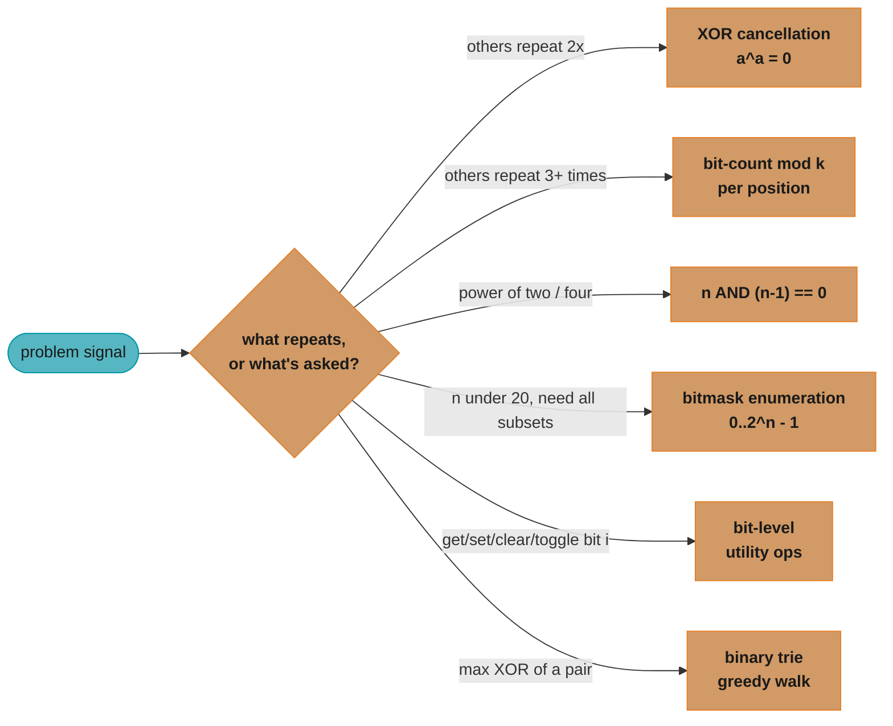
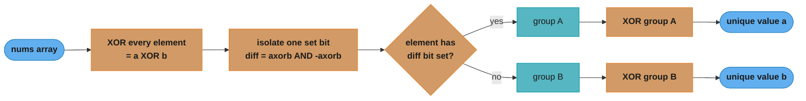

# Bit Manipulation

## Pattern Snapshot

Bit manipulation solves problems by operating directly on the binary
representation of integers — using AND (`&`), OR (`|`), XOR (`^`), NOT
(`~`), and shifts (`<<`, `>>`) — to achieve **O(1) extra space** and often
**O(n) time** where a naive solution would reach for a hash set or O(n) extra
array. The recurring superpowers are: XOR's self-cancellation
(`a ^ a = 0`), `n & (n-1)` to clear the lowest set bit, `n & (-n)` to isolate
the lowest set bit, and treating an integer's bits as a compact "set" for
enumeration.

**One-line cue:** "Numbers appearing an odd/even number of times, powers of
two, counting set bits, or representing a small set as a single integer."

**Typical complexity:** O(n) for a single pass over the input, or O(2^n) when
the integer itself represents a *subset* of `n` items (bitmask enumeration) —
in both cases each per-element bit operation is O(1) for fixed-width
integers (32 or 64 bits).

---

## 1. Recognition Signals

**Signals that scream bit manipulation:**

- "Every element appears twice except one / appears three times except one /
  appears twice except two" — [Single Number](https://leetcode.com/problems/single-number/)
  family — XOR or bit-counting
- "Find the missing number in range `[0, n]`" — XOR with indices, or sum
  formula
- "Power of two / power of four" — `n & (n-1) == 0` checks (clears the lowest
  set bit; a power of two has exactly one set bit)
- "Number of 1 bits / Hamming weight / Hamming distance" — popcount via
  `n & (n-1)` loop, or DP table
- "Counting Bits from 0 to n" — DP recurrence using `i & (i-1)` or `i >> 1`
- "Generate all subsets" with `n <= ~20` — enumerate `0` to `2^n - 1`, each
  integer's bits ARE a subset (overlaps with [Backtracking](backtracking.md);
  bitmask is the iterative, non-recursive route)
- "Maximum XOR of two numbers in an array" — binary trie over bits (overlaps
  with [Trie Patterns](trie_patterns.md))
- "Add two numbers without `+`", "swap without a temp variable", "reverse
  bits", "set/clear/toggle bit i"

**Anti-signals (looks like bit manipulation but isn't):**

- "All unique permutations/combinations" with no parity/frequency angle —
  plain [Backtracking](backtracking.md); bits don't help generate orderings.
- "Subset sum equals target" for **large** `n` — this is
  [Dynamic Programming](dynamic_programming.md) over sums, not bitmask
  enumeration (bitmask only works when `n` itself is small enough that
  `2^n` is tractable, roughly `n <= 20`).
- General numeric problems (GCD, primality, arithmetic) without any
  parity/power-of-two/frequency structure — just math, no bit tricks needed.
- "Count frequency of each element" with **unbounded** value ranges — use
  [Hashing Patterns](hashing_patterns.md); bit tricks here assume small,
  fixed-width integers.

The eight positive signals above collapse into six technique families — the
router below maps "what the problem looks like" to "which trick to reach
for" (each family is detailed in Section 6, Variations & Sub-patterns):



Six families, one router: everything in this file reduces to picking the
right branch above, then applying the matching template from Section 3 or
the matching sub-pattern from Section 6.

---

## 2. Mental Model & Intuition

### XOR cancellation (Single Number)

XOR has three properties that combine into a powerful trick: it is
**commutative** (`a ^ b = b ^ a`), **associative**
(`(a ^ b) ^ c = a ^ (b ^ c)`), and **self-cancelling**
(`a ^ a = 0`, `a ^ 0 = a`). XOR every element together: every number that
appears in **pairs** cancels itself out (in any order, thanks to
commutativity/associativity), leaving only the number that appears once.

```
nums = [4, 1, 2, 1, 2]
binary:  100  001  010  001  010

XOR running total:
  100             (start: 0 ^ 4)
^ 001 = 101
^ 010 = 111
^ 001 = 110
^ 010 = 100   <- final result = 4 (the single number)

The two 1's (001 ^ 001 = 000) and two 2's (010 ^ 010 = 000)
cancel completely, regardless of where they appear in the array.
```

### `n & (n-1)` clears the lowest set bit

Subtracting 1 from `n` flips the lowest set bit to 0 and flips every bit
below it from 0 to 1. ANDing with the original `n` keeps only the bits ABOVE
that lowest set bit — i.e., the lowest set bit (and everything below it)
vanishes.

```
n     = 0 1 0 1 1 0 0     (n = 44... example value, lowest set bit is bit 2)
n - 1 = 0 1 0 1 0 1 1     (bit 2 -> 0, bits 0-1 -> 1)
n & (n-1):
        0 1 0 1 1 0 0
      & 0 1 0 1 0 1 1
      -----------------
        0 1 0 1 0 0 0     <- lowest set bit cleared

Repeating "n = n & (n-1)" until n == 0 counts the set bits
(Brian Kernighan's algorithm) -- one iteration per SET bit, not per total bit.
```

---

## 3. The Template

```python
from __future__ import annotations


def single_number(nums: list[int]) -> int:
    """Single Number (LC 136): every element appears twice except one.

    XOR all elements -- pairs cancel to 0, leaving the unpaired value.
    """
    result = 0
    for num in nums:
        result ^= num
    return result


def hamming_weight(n: int) -> int:
    """Number of 1 Bits (LC 191): count set bits via Brian Kernighan's trick.

    Each iteration clears the LOWEST set bit, so the loop runs once
    per set bit (not once per bit position) -- O(popcount(n)).
    """
    count = 0
    while n:
        n &= n - 1   # clear the lowest set bit
        count += 1
    return count


def count_bits(n: int) -> list[int]:
    """Counting Bits (LC 338): popcount for every i in [0, n].

    DP recurrence: dp[i] = dp[i >> 1] + (i & 1).
    Shifting i right by 1 drops the lowest bit; dp[i >> 1] is already
    computed (it's a smaller index), and (i & 1) adds back the dropped bit.
    """
    dp = [0] * (n + 1)
    for i in range(1, n + 1):
        dp[i] = dp[i >> 1] + (i & 1)
    return dp


def subsets_via_bitmask(nums: list[int]) -> list[list[int]]:
    """Subsets (LC 78), bitmask variant: every integer 0..2^n-1 IS a subset.

    Bit j of the mask is set <=> nums[j] is included in this subset.
    """
    n = len(nums)
    result = []
    for mask in range(1 << n):           # 0 .. 2^n - 1
        subset = [nums[j] for j in range(n) if mask & (1 << j)]
        result.append(subset)
    return result


def single_number_ii(nums: list[int]) -> int:
    """Single Number II (LC 137): every element appears THREE times except one.

    Plain XOR fails here (it cancels PAIRS, not triples). Instead, count
    how many numbers have bit i set, across all 32 bit positions. If that
    count is not divisible by 3, the answer has bit i set.
    """
    answer = 0
    for i in range(32):
        bit_sum = sum((num >> i) & 1 for num in nums)
        if bit_sum % 3:
            answer |= (1 << i)
    # Convert from unsigned 32-bit back to Python's signed int if negative
    if answer >= 2 ** 31:
        answer -= 2 ** 32
    return answer
```

---

## 4. Annotated Walkthrough

**Problem:** [Single Number (LC 136)](https://leetcode.com/problems/single-number/)
— `nums = [4, 1, 2, 1, 2]`. Every element appears exactly twice except one;
find that element.

`result = 0`. Iterate and XOR each value in:

```
result = 0           = 000

num=4 (100): result = 000 ^ 100 = 100   (= 4)
num=1 (001): result = 100 ^ 001 = 101   (= 5)
num=2 (010): result = 101 ^ 010 = 111   (= 7)
num=1 (001): result = 111 ^ 001 = 110   (= 6)
num=2 (010): result = 110 ^ 010 = 100   (= 4)

return result = 4
```

**Why it's correct:** because XOR is commutative and associative, the final
`result` is equivalent to `4 ^ 1 ^ 2 ^ 1 ^ 2`, which can be reordered to
`4 ^ (1 ^ 1) ^ (2 ^ 2) = 4 ^ 0 ^ 0 = 4`. Every duplicated value contributes
`x ^ x = 0` to the running XOR regardless of where it sits in the array — the
order of operations doesn't matter, only the multiset of values does. This is
**O(n) time, O(1) space** — versus a hash-set approach that is also O(n) time
but O(n) *space*.

---

## 5. Complexity

| Template | Time | Space | Why |
|---|---|---|---|
| `single_number` | O(n) | O(1) | one XOR per element |
| `hamming_weight` | O(popcount(n)) | O(1) | one iteration per SET bit (Brian Kernighan), not per bit-width |
| `count_bits` | O(n) | O(n) output | each `dp[i]` computed in O(1) from a smaller index |
| `subsets_via_bitmask` | O(n * 2^n) | O(n * 2^n) output | `2^n` masks, O(n) to materialize each subset |
| `single_number_ii` | O(32 * n) = O(n) | O(1) | 32 fixed bit positions, one O(n) sum each |

`O(32 * n)` and `O(popcount(n))` are technically O(1) per the *value's* bit
width once you fix it at 32 or 64 bits — but it's worth stating the constant
explicitly (32 iterations) since interviewers sometimes ask "is this really
O(n)?"

---

## 6. Variations & Sub-patterns

**1. XOR family** — exploit `a ^ a = 0` / `a ^ 0 = a`:
- [Single Number (LC 136)](https://leetcode.com/problems/single-number/) — one element appears once, rest twice
- [Single Number III (LC 260)](https://leetcode.com/problems/single-number-iii/) — TWO elements appear once, rest twice: XOR everything to get `a ^ b`, find any set bit in that XOR to partition the array into two groups (one containing `a`, the other `b`), then XOR each group separately
- [Missing Number (LC 268)](https://leetcode.com/problems/missing-number/) — XOR all array values with all indices `0..n`; every present value cancels with its index, leaving the missing one
- [Find the Difference (LC 389)](https://leetcode.com/problems/find-the-difference/) — XOR all characters of both strings together

Single Number III's partition step is the trickiest part of the XOR family —
XOR-ing the whole array only gets you `a ^ b`; a second pass, split by one
differing bit, is what actually separates the two uniques:



Every duplicated value still lands in the same group as its twin (they agree
on every bit, including `diff`), so it cancels inside that group exactly
like plain Single Number — only `a` and `b` survive, one per group.

**2. Counting / parity-with-modulus family** — when XOR's "cancel pairs"
isn't enough (every-other-value appears `k > 2` times):
- [Single Number II (LC 137)](https://leetcode.com/problems/single-number-ii/) — others appear 3 times; count bits mod 3 (template above, and the BROKEN->FIX in §8)
- [Number of 1 Bits (LC 191)](https://leetcode.com/problems/number-of-1-bits/), [Hamming Distance (LC 461)](https://leetcode.com/problems/hamming-distance/) (`hamming_weight(x ^ y)`), [Total Hamming Distance (LC 477)](https://leetcode.com/problems/total-hamming-distance/) (per-bit-position counting across the whole array, similar to Single Number II's per-bit approach)

**3. Power-of-two / lowest-bit-isolation family**:
- `n & (n-1) == 0` (and `n > 0`) checks "is `n` a power of two" — a power of
  two has exactly one set bit, and clearing the lowest set bit yields 0
- `n & (-n)` isolates the LOWEST set bit itself (rather than clearing it) —
  useful in Fenwick trees / Binary Indexed Trees for the "next/previous index"
  step (see [`database_and_storage_fundamentals/`](../database_and_storage_fundamentals/README.md) for index structures that use this)
- [Power of Two (LC 231)](https://leetcode.com/problems/power-of-two/), Power of Four (LC 342)

**4. Bitmask enumeration family** — when `n <= ~20`, an integer `0..2^n-1`
represents a subset:
- [Subsets (LC 78)](https://leetcode.com/problems/subsets/) bitmask variant
  (template above) — alternative to recursive [Backtracking](backtracking.md)
- **Bitmask DP** — e.g., Traveling Salesman / "visit all nodes" problems
  where `dp[mask][i]` = best cost having visited the set of nodes in `mask`,
  currently at node `i`. This is the bridge to
  [Dynamic Programming](dynamic_programming.md) §6's "bitmask DP" family.

**5. Bit-level utility operations** — the building blocks:

```python
# Get bit i of n
bit = (n >> i) & 1

# Set bit i of n
n |= (1 << i)

# Clear bit i of n
n &= ~(1 << i)

# Toggle bit i of n
n ^= (1 << i)

# Reverse Bits (LC 190): build result bit-by-bit from n's LSB to MSB
def reverse_bits(n: int) -> int:
    result = 0
    for _ in range(32):
        result = (result << 1) | (n & 1)
        n >>= 1
    return result
```

**6. Maximum XOR pair** — [Maximum XOR of Two Numbers in an Array (LC 421)](https://leetcode.com/problems/maximum-xor-of-two-numbers-in-an-array/):
build a binary trie of each number's bits (most-significant-bit first), then
for each number greedily walk the trie trying to follow the OPPOSITE bit at
each level (opposite bits maximize XOR contribution at that position). See
[Trie Patterns](trie_patterns.md) for the trie template this builds on.

---

## 7. Problem Bank

| Problem | Difficulty | Variation | Recognition cue / twist |
|---|---|---|---|
| [Single Number (LC 136)](https://leetcode.com/problems/single-number/) | Easy | XOR cancellation | All others appear exactly twice |
| [Number of 1 Bits (LC 191)](https://leetcode.com/problems/number-of-1-bits/) | Easy | Brian Kernighan popcount | `n & (n-1)` clears lowest set bit |
| [Power of Two (LC 231)](https://leetcode.com/problems/power-of-two/) | Easy | Lowest-bit isolation | `n > 0 and n & (n-1) == 0` |
| [Missing Number (LC 268)](https://leetcode.com/problems/missing-number/) | Easy | XOR with indices | XOR `0..n` with all array values |
| [Counting Bits (LC 338)](https://leetcode.com/problems/counting-bits/) | Easy | DP + bit recurrence | `dp[i] = dp[i >> 1] + (i & 1)` |
| [Reverse Bits (LC 190)](https://leetcode.com/problems/reverse-bits/) | Easy | Bit-by-bit construction | Build result LSB-first from input |
| [Hamming Distance (LC 461)](https://leetcode.com/problems/hamming-distance/) | Easy | XOR + popcount | `hamming_weight(x ^ y)` |
| [Single Number II (LC 137)](https://leetcode.com/problems/single-number-ii/) | Medium | Bit counting mod k | Others appear 3x; XOR alone fails (see §8) |
| [Single Number III (LC 260)](https://leetcode.com/problems/single-number-iii/) | Medium | XOR + partition by set bit | TWO unique elements; split array using any differing bit |
| [Subsets (LC 78)](https://leetcode.com/problems/subsets/) | Medium | Bitmask enumeration | `n <= ~20`; iterate `0..2^n-1` |
| [Total Hamming Distance (LC 477)](https://leetcode.com/problems/total-hamming-distance/) | Medium | Per-bit-position counting | For each bit, `ones * zeros` pairs contribute |
| [Maximum XOR of Two Numbers in an Array (LC 421)](https://leetcode.com/problems/maximum-xor-of-two-numbers-in-an-array/) | Medium | Binary trie greedy | Greedily pick opposite bit at each trie level |
| [Sum of Two Integers (LC 371)](https://leetcode.com/problems/sum-of-two-integers/) | Medium | Add without `+` | XOR = sum-without-carry; `(a & b) << 1` = carry; loop until no carry |
| [Bitwise AND of Numbers Range (LC 201)](https://leetcode.com/problems/bitwise-and-of-numbers-range/) | Medium | Common binary prefix | Strip differing low bits via `n & (n-1)` until `m == n` |
| [Maximum Product of Word Lengths (LC 318)](https://leetcode.com/problems/maximum-product-of-word-lengths/) | Medium | Bitmask of letters | Words share no letter iff `mask_a & mask_b == 0` |

---

## 8. Common Mistakes (BROKEN -> FIX)

**Mistake: applying the "XOR everything" trick from Single Number to Single
Number II**, where every OTHER element appears **three** times instead of
twice. XOR cancels in **pairs** (`a ^ a = 0`), so three copies of `a` reduce
to `a ^ a ^ a = a` — they do NOT cancel, and the running XOR gets corrupted by
every triplicated value.

```python
# BROKEN: reuses the Single Number XOR trick where elements repeat 3x
def single_number_ii_broken(nums: list[int]) -> int:
    result = 0
    for num in nums:
        result ^= num     # WRONG: doesn't account for triple-occurrence
    return result
```

**Trace the bug** on `nums = [2, 2, 3, 2]` (expected answer: `3`, since `2`
appears three times and `3` appears once):

```
binary:  2=010  2=010  3=011  2=010

result = 0   = 000
^ 2 (010) -> 010
^ 2 (010) -> 000
^ 3 (011) -> 011
^ 2 (010) -> 001

return result = 1   <-- WRONG (expected 3)
```

The three `2`s reduce to `2 ^ 2 ^ 2 = 2 = 010`, and `010 ^ 011 (the 3) = 001`.
The "extra" copy of `2` pollutes the result — XOR has no concept of "every
THIRD occurrence cancels."

**The fix** — count, per bit position, how many of the 32 bits across all
numbers are set. If three copies of every "noise" value contribute a multiple
of 3 to each bit position's count, then `(total_count_for_bit_i) % 3` is
nonzero **only** for bit positions that are set in the unique element:

```python
# FIXED: count set bits per position, mod 3
def single_number_ii(nums: list[int]) -> int:
    answer = 0
    for i in range(32):
        bit_sum = sum((num >> i) & 1 for num in nums)
        if bit_sum % 3:
            answer |= (1 << i)
    if answer >= 2 ** 31:        # convert back from unsigned to signed
        answer -= 2 ** 32
    return answer
```

**Trace the fix** on the same input `nums = [2, 2, 3, 2]`
(`2 = 010`, `3 = 011`):

```
bit 0 (LSB): values' bit 0 = [0, 0, 1, 0] -> sum = 1 -> 1 % 3 = 1 -> set bit 0
bit 1:       values' bit 1 = [1, 1, 1, 1] -> sum = 4 -> 4 % 3 = 1 -> set bit 1
bit 2..31:   all 0 -> sum = 0 -> 0 % 3 = 0 -> not set

answer = bit1 | bit0 = 010 | 001 = 011 = 3   <-- CORRECT
```

The general lesson: **XOR-based cancellation generalizes to "appears `k`
times" only when `k = 2`.** For `k = 3` (or any `k`), count per-bit-position
occurrences and reduce modulo `k` — the unique element's bits are exactly
the positions where the total isn't a multiple of `k`.

---

## 9. Related Patterns & When to Switch

- **[Hashing Patterns](hashing_patterns.md)** — switch here if values aren't
  bounded to a fixed bit-width, or the problem genuinely needs a frequency
  *map* (not just parity/count-mod-k) — e.g., "find all elements that appear
  more than `n/3` times" with arbitrary integers is Boyer-Moore voting +
  hashing, not bit tricks.
- **[Backtracking](backtracking.md)** — bitmask enumeration (§6.4) is the
  *iterative* twin of recursive subset/permutation generation. Use bitmask
  when you need to iterate all `2^n` subsets in a simple loop (e.g., for
  bitmask DP); use backtracking when you need to prune branches early or the
  output structure is more complex than "include/exclude."
- **[Dynamic Programming](dynamic_programming.md)** — bitmask DP (`dp[mask][i]`)
  is the natural extension once `n <= ~20` and you need to remember WHICH
  subset has been processed, not just enumerate all subsets once.
- **[Trie Patterns](trie_patterns.md)** — "maximum XOR pair" problems (LC 421,
  LC 1707) reduce to a greedy walk over a binary trie of bit-prefixes; the
  bit-manipulation insight (XOR is maximized by choosing opposite bits) feeds
  directly into the trie structure.

---

## 10. Cross-links

- Concept module: [`number_systems_and_bit_manipulation/`](../number_systems_and_bit_manipulation/README.md) — two's complement representation, signed/unsigned shift semantics, bitwise operator reference, floating-point bit layout
- Applied cross-link: [`../../java/collections_internals/README.md`](../../java/collections_internals/README.md) — `HashMap`'s resize/rehash uses `(n - 1) & hash` for bucket indexing and a bit-spread function (`h ^ (h >>> 16)`) to mix high and low bits of the hash code, a direct production use of the bit-masking ideas in this file

---

## 11. Interview Q&A

**Why does `a ^ a = 0` and `a ^ 0 = a`, and why does that make XOR useful for
"find the unique element" problems?** XOR compares each bit independently:
two identical bits XOR to 0 (`0^0=0`, `1^1=0`), and a bit XORed with 0 stays
unchanged (`0^0=0`, `1^0=1`). Combined with XOR being commutative and
associative, XOR-ing a multiset of numbers where every value appears an EVEN
number of times produces 0 for those values' contribution — leaving only
values that appear an ODD number of times. "Appears once, others appear
twice" is the simplest case of this.

**Single Number II says elements appear THREE times except one — why doesn't
XOR work, and what's the fix?** XOR only cancels in pairs: three copies of
`a` reduce to `a` (not 0), corrupting the result. The fix (§8) counts set
bits at each of the 32 bit positions across all numbers and takes the count
modulo 3 — for "noise" values appearing 3x, their contribution to every bit
position's count is a multiple of 3 and vanishes mod 3, leaving only the
unique element's bits. This generalizes to "appears `k` times" via mod `k`.

**What does `n & (n-1)` do, and what is it used for?** It clears the LOWEST
set bit of `n`. Subtracting 1 flips that bit to 0 and flips all lower bits to
1; ANDing with the original `n` then zeroes out everything from that bit
downward. Two major uses: (1) `n & (n-1) == 0` (with `n > 0`) tests "is `n` a
power of two" (powers of two have exactly one set bit), and (2) repeatedly
applying it counts set bits in O(popcount(n)) iterations (Brian Kernighan's
algorithm) instead of O(bit-width).

**Q: What does `n & (-n)` do, and how is it different from `n & (n-1)`?**
`n & (-n)` ISOLATES the lowest set bit (returns a value with only that one bit
set), whereas `n & (n-1)` CLEARS it (returns `n` with that bit removed). `-n`
in two's complement is `~n + 1`; this flips all bits and adds 1, which has the
effect that all bits below the lowest set bit of `n` become 0 in `-n` too,
and ANDing with `n` leaves only that single bit. This is the core operation in
Fenwick tree (Binary Indexed Tree) index traversal.

**How do I enumerate all subsets of an `n`-element set using bit
manipulation, and what's the complexity?** Iterate `mask` from `0` to
`2^n - 1`; for each `mask`, bit `j` being set means element `j` is in this
subset. This is O(2^n) masks, and O(n) to materialize each subset, giving
O(n * 2^n) total. It's the natural fit when `n <= ~20` (since `2^20 ≈ 10^6`)
— beyond that, `2^n` becomes intractable and you need
[Dynamic Programming](dynamic_programming.md) or
[Greedy](greedy.md)/pruned [Backtracking](backtracking.md) instead.

**Why does `dp[i] = dp[i >> 1] + (i & 1)` correctly compute popcount for
Counting Bits?** `i >> 1` is `i` with its lowest bit dropped (integer
division by 2) — its popcount, `dp[i >> 1]`, is already computed since
`i >> 1 < i`. `(i & 1)` is exactly the bit that was dropped (0 or 1). Adding
them back together gives the popcount of `i`. This is a textbook example of
DP where the "smaller subproblem" comes from a bit-shift rather than `i-1`.

**What's the difference between `>>` (arithmetic/signed shift) and a logical
shift, and does it matter in Python?** In languages with fixed-width signed
integers (Java, C++), `>>` preserves the sign bit (fills with 1s for negative
numbers) while `>>>` (Java-only) fills with 0s regardless of sign. Python
integers are arbitrary-precision and conceptually have infinite sign-extended
leading bits, so `>>` on a negative Python int behaves like an arithmetic
shift (rounds toward negative infinity) — there's no separate logical shift
operator, and bit-manipulation problems that assume 32-bit wraparound (like
Single Number II's negative-number handling, or Reverse Bits) need explicit
masking (`& 0xFFFFFFFF`) and sign correction in Python.

**How do I set, clear, toggle, or check a specific bit `i` of an integer
`n`?** Check: `(n >> i) & 1`. Set: `n |= (1 << i)`. Clear: `n &= ~(1 << i)`.
Toggle: `n ^= (1 << i)`. All four are O(1) and form the vocabulary for almost
every bitmask problem — memorize them as a unit.

**The XOR-swap trick (`a ^= b; b ^= a; a ^= b`) avoids a temp variable — is
this good practice?** It's a neat demonstration of XOR's invertibility, but
it's discouraged in real code: it fails if `a` and `b` are the SAME memory
location (XORing a value with itself zeroes it out, so `a` and `b` both
become 0), it's harder to read than `a, b = b, a` (or a temp variable), and on
modern CPUs it's not even faster — register-based swaps with a temp are
typically just as fast or faster due to instruction-level parallelism. Know it
for interviews; don't write it in production.

**How does Maximum XOR of Two Numbers (LC 421) use a trie?** Insert every
number into a binary trie, one bit at a time from the most-significant bit
down (so the trie has depth ~32 and each path represents one number's bit
pattern). Then, for each number, walk the trie trying at each level to go to
the child representing the OPPOSITE bit of the current number's bit at that
position (since `1 ^ 0 = 1` maximizes that bit's contribution to the XOR). If
the opposite-bit child doesn't exist, fall back to the same-bit child. The
maximum XOR found across all numbers is the answer — O(32n) instead of the
O(n^2) brute-force pairwise comparison.

**Why does the repo's `cs_fundamentals/number_systems_and_bit_manipulation/`
module matter beyond these LeetCode tricks?** Because two's complement,
sign-extension, and bit-masking aren't just interview party tricks — they
underpin how `HashMap` spreads hash codes into bucket indices
([`java/collections_internals/`](../../java/collections_internals/README.md)),
how Bloom filters and bitset-based data structures pack boolean flags 64-to-a-word,
and how network protocols pack flags/fields into header bytes
([`networking_fundamentals/`](../networking_fundamentals/README.md)). The
LeetCode patterns here are the "first contact" with operations you'll
recognize throughout systems code.
