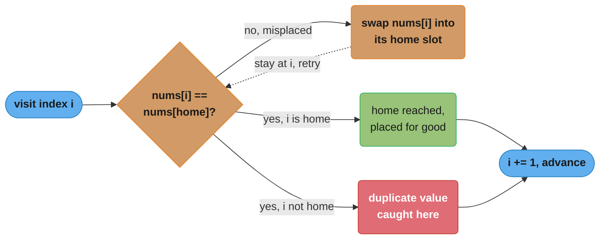
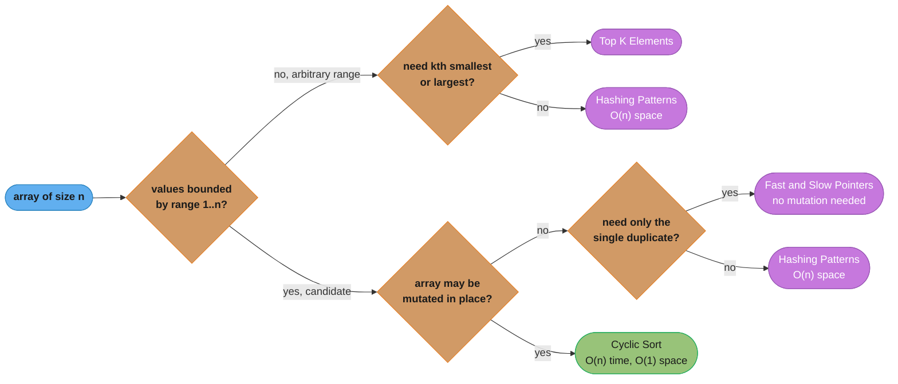

# Cyclic Sort

## Pattern Snapshot

When an array contains `n` numbers drawn from a known range like `[1, n]` or `[0, n-1]`, each value can be its own "address" — place `nums[i]` at index `nums[i] - 1` (or `nums[i]`) by repeated swapping, until every element is at its "home" index. A second pass then finds any index whose value doesn't match — that's your missing/duplicate/misplaced element. **Cue**: "array contains numbers from 1 to n" / "find missing/duplicate" + **O(1) extra space** required. **Typical complexity**: O(n) time, O(1) space — the in-place alternative to a hashmap.

---

## 1. Recognition Signals

**Reach for cyclic sort when you see:**

- "Array of size n contains numbers from 1 to n (or 0 to n-1), some missing/duplicated — find them" + **"O(1) extra space"** explicitly stated or implied
- "Find the missing number" / "find all missing numbers" / "find the duplicate number" / "find all duplicates"
- "Find the smallest missing positive integer" (values can be arbitrary, but you only care about the range `[1, n]`)
- "First k missing positive numbers"
- The array is **mutable** (you're allowed to rearrange it) and values are bounded by the array's own length

**Anti-signals — looks like cyclic sort but isn't:**

- The values are **not bounded by the array length** (e.g., arbitrary integers, or range `[1, 10^9]` with `n = 100`) — cyclic sort's "place value `v` at index `v-1`" only works when `v` is a valid index, i.e., `1 <= v <= n`. Use **[Hashing Patterns](hashing_patterns.md)** instead (O(n) space).
- The problem says **"do not modify the input array"** — cyclic sort mutates the array in place by design; if mutation is disallowed, fall back to hashing (O(n) space) or, for "find duplicate" specifically, [fast_and_slow_pointers.md](fast_and_slow_pointers.md) (treats the array as a linked list, doesn't mutate).
- You need to **sort the entire array** in the general sense (arbitrary values) — cyclic sort is not a general-purpose sorting algorithm; it's a placement trick specific to the `[1,n]`/`[0,n-1]` range constraint. (It happens to *resemble* counting sort / pigeonhole sort.)
- "Find the k-th smallest/largest" with **unbounded values** — that's [top_k_elements.md](top_k_elements.md), not cyclic sort.

The defining test: **are the array's values exactly the indices (or index+1) of an array of the same size, with possibly one missing or duplicated?** This is a strong, narrow signal — if `n` numbers come from a range of size `n` (or `n+1`), cyclic sort applies.

---

## 2. Mental Model & Intuition

Every visit to index `i` collapses into one decision — swap and retry, or advance:



*A swap only ever fires when it seats a value in its true home for good — a match (home reached, or a duplicate caught) always advances `i`, while a mismatch retries the same `i` (dotted edge). Because every swap permanently places one more element, the total number of swaps across the whole run is bounded by `n` — the traces below make this concrete with actual numbers.*

```
Placing each number at its "home" index (value v -> index v-1)

  nums = [3, 1, 5, 4, 2]   (n=5, values 1..5, no duplicates here)

  i=0: nums[0]=3. home index for 3 is 2. nums[2]=5 != 3 -> SWAP
       nums = [5, 1, 3, 4, 2]
       nums[0]=5. home index for 5 is 4. nums[4]=2 != 5 -> SWAP
       nums = [2, 1, 3, 4, 5]
       nums[0]=2. home index for 2 is 1. nums[1]=1 != 2 -> SWAP
       nums = [1, 2, 3, 4, 5]
       nums[0]=1. home index for 1 is 0. nums[0]==1 -> already home, i++

  i=1: nums[1]=2. home index = 1. already home (nums[1]==2), i++
  ... (everything already in place)

  Result: [1, 2, 3, 4, 5] -- every nums[i] == i+1
```

```
Detecting the anomaly (second pass)

  nums = [3, 1, 1, 4, 2]   (n=5, '1' appears twice, '5' missing)

  After cyclic sort placement (home index = value - 1):
  i=0: nums[0]=3 -> home idx 2. nums[2]=1 != 3 -> SWAP -> [1, 1, 3, 4, 2]
       nums[0]=1 -> home idx 0. nums[0]==1 -> already home, i++
  i=1: nums[1]=1 -> home idx 0. nums[0]==1 == nums[1] -- SAME VALUE,
       swapping would loop forever! Detect this: if nums[i] == nums[home],
       don't swap, just move on. i++
  i=2: nums[2]=3 -> home idx 2. already home (nums[2]==3), i++
  i=3: nums[3]=4 -> home idx 3. already home, i++
  i=4: nums[4]=2 -> home idx 1. nums[1]=1 != 2 -> SWAP -> [1, 2, 3, 4, 1]
       nums[4]=1 -> home idx 0. nums[0]==1 == nums[4] -- same value, stop. i++

  Final array: [1, 2, 3, 4, 1]

  Second pass: scan for index i where nums[i] != i+1
    i=4: nums[4]=1 != 5 -> the value that SHOULD be here is 5 (missing),
         and the value 1 (which IS here) is the duplicate.
```

The key safeguard: **before swapping `nums[i]` with `nums[home]`, check `nums[i] != nums[home]`** — if they're equal, you've found a duplicate, and swapping would cause an infinite loop (swapping a value with itself doesn't change anything, but the `while` condition would never become false).

---

## 3. The Template

### Core placement loop

```python
def cyclic_sort(nums: list[int]) -> None:
    """In-place: after this, nums[i] == i+1 for all i, IF values are
    a permutation of 1..n with no duplicates/missing."""
    i = 0
    while i < len(nums):
        correct_index = nums[i] - 1
        if nums[i] != nums[correct_index]:
            nums[i], nums[correct_index] = nums[correct_index], nums[i]
        else:
            i += 1   # already in place (or duplicate found) -- move on
```

### Find the missing number (range 0..n, array has n elements)

```python
def find_missing_number(nums: list[int]) -> int:
    """nums has n distinct numbers from [0, n] -- exactly one is missing."""
    i, n = 0, len(nums)
    while i < n:
        correct_index = nums[i]               # value v belongs at index v (0..n-1 range)
        if nums[i] < n and nums[i] != nums[correct_index]:
            nums[i], nums[correct_index] = nums[correct_index], nums[i]
        else:
            i += 1

    for i in range(n):
        if nums[i] != i:
            return i
    return n   # all 0..n-1 present -> missing value is n itself
```

### Find the duplicate number (no extra space, array unmodified-friendly variant uses fast/slow — see below)

```python
def find_duplicate_via_cyclic_sort(nums: list[int]) -> int:
    """nums has n+1 elements, values in [1, n], exactly one duplicate.
    NOTE: this mutates nums. If mutation is disallowed, use
    fast_and_slow_pointers.md's Floyd's algorithm instead."""
    i = 0
    while i < len(nums):
        if nums[i] != i + 1:
            correct_index = nums[i] - 1
            if nums[i] != nums[correct_index]:
                nums[i], nums[correct_index] = nums[correct_index], nums[i]
            else:
                return nums[i]   # found: nums[i] == nums[correct_index] but i != correct_index
        else:
            i += 1
    return -1
```

---

## 4. Annotated Walkthrough

**Problem**: [Find All Numbers Disappeared in an Array (LC 448)](https://leetcode.com/problems/find-all-numbers-disappeared-in-an-array/) — given an array of `n` integers where `1 <= nums[i] <= n`, some numbers appear twice and others not at all. Return all missing numbers, in O(n) time and O(1) extra space (excluding the output array).

**Brute force**: use a `set` or boolean array of size `n` to mark seen values, then scan for unmarked indices — O(n) time but O(n) **extra** space, violating the constraint.

**Key insight**: place each value `v` at index `v-1` via cyclic sort. After placement, any index `i` where `nums[i] != i+1` means the value `i+1` was *never present* in the array (its "home" was taken by something else, or it simply doesn't exist) — `i+1` is a missing number.

**Trace on `nums = [4, 3, 2, 7, 8, 2, 3, 1]` (n=8)**

```
i=0: nums[0]=4. home=3. nums[3]=7 != 4 -> swap -> [7, 3, 2, 4, 8, 2, 3, 1]
i=0: nums[0]=7. home=6. nums[6]=3 != 7 -> swap -> [3, 3, 2, 4, 8, 2, 7, 1]
i=0: nums[0]=3. home=2. nums[2]=2 != 3 -> swap -> [2, 3, 3, 4, 8, 2, 7, 1]
i=0: nums[0]=2. home=1. nums[1]=3 != 2 -> swap -> [3, 2, 3, 4, 8, 2, 7, 1]
i=0: nums[0]=3. home=2. nums[2]=3 == 3 -> already correct (duplicate found, but
     for THIS problem we don't need to identify it yet) -> i++

i=1: nums[1]=2. home=1. nums[1]==2 -> correct. i++
i=2: nums[2]=3. home=2. nums[2]==3 -> correct. i++
i=3: nums[3]=4. home=3. nums[3]==4 -> correct. i++
i=4: nums[4]=8. home=7. nums[7]=1 != 8 -> swap -> [3, 2, 3, 4, 1, 2, 7, 8]
i=4: nums[4]=1. home=0. nums[0]=3 != 1 -> swap -> [1, 2, 3, 4, 3, 2, 7, 8]
i=4: nums[4]=3. home=2. nums[2]=3 == 3 -> duplicate, leave. i++

i=5: nums[5]=2. home=1. nums[1]==2 -> correct. i++
i=6: nums[6]=7. home=6. nums[6]==7 -> correct. i++
i=7: nums[7]=8. home=7. nums[7]==8 -> correct. i++

Final array: [1, 2, 3, 4, 3, 2, 7, 8]

Second pass -- find indices where nums[i] != i+1:
  i=4: nums[4]=3 != 5  -> 5 is missing
  i=5: nums[5]=2 != 6  -> 6 is missing

Answer: [5, 6]
```

Each "swap" places at least one element into its correct home position permanently — so across the entire algorithm, the total number of swaps is bounded by `n` (each swap fixes at least one element, and a fixed element is never moved again). This gives the O(n) bound despite the nested-looking `while` inside `while`.

---

## 5. Complexity

| Approach | Time | Space |
|---|---|---|
| Hash set of seen values | O(n) | O(n) |
| Sort the array first, scan for gaps | O(n log n) | O(1) (in-place sort) or O(n) |
| **Cyclic sort + second pass** | **O(n)** | **O(1)** (excluding output) |

Cyclic sort is the *only* O(n) time **and** O(1) space approach for this family of problems (other than the fast/slow-pointer trick for the single-duplicate case, which trades mutation-avoidance for being limited to "exactly one duplicate, no missing").

### Decoding the complexity claim

**The idea behind it.** "Oh of n means: even though a `while` loop sits inside the `for` loop, the algorithm can only ever perform about `n` swaps in total — every swap drops one value into its permanent home, and there are only `n` homes to fill."

That framing matters because the swap budget is a property of the *array*, not of the loop structure. The inner `while` is not "up to `n` iterations per outer step"; it is drawing from one shared pool of at most `n` placements that the whole run must share.

| Symbol | What it is |
|---|---|
| `O(...)` | An upper bound on how fast the work grows as the input grows |
| `n` | The input size — the number of elements, and also the size of the value range |
| `O(n)` | Work proportional to `n` — what the nested loops actually cost |
| `O(n^2)` | What the nesting *looks* like it costs, and does not |
| `O(1)` | Constant extra memory — the swaps happen in the input array itself |
| `home` | Where a value belongs. For values `1..n` that is `nums[v] -> index v-1` |

**Walk one example.** `nums = [3, 1, 5, 4, 2]`, a permutation of `1..5`, so `n = 5`. All the swapping happens at `i = 0`, and then the rest of the array is already correct:

```
  nums = [3, 1, 5, 4, 2]        n = 5, values are a permutation of 1..5

  i   nums before      nums[i]  home  occupant  action           nums after
  --  ---------------  -------  ----  --------  ---------------  ---------------
  0   [3, 1, 5, 4, 2]     3       2       5     swap  (#1)       [5, 1, 3, 4, 2]
  0   [5, 1, 3, 4, 2]     5       4       2     swap  (#2)       [2, 1, 3, 4, 5]
  0   [2, 1, 3, 4, 5]     2       1       1     swap  (#3)       [1, 2, 3, 4, 5]
  0   [1, 2, 3, 4, 5]     1       0       1     in place, i++    [1, 2, 3, 4, 5]
  1   [1, 2, 3, 4, 5]     2       1       2     in place, i++    unchanged
  2   [1, 2, 3, 4, 5]     3       2       3     in place, i++    unchanged
  3   [1, 2, 3, 4, 5]     4       3       4     in place, i++    unchanged
  4   [1, 2, 3, 4, 5]     5       4       5     in place, i++    unchanged

  swaps: 3    outer steps: 5    total home-checks: 8    ceiling 2n - 1 = 9
```

Follow swap #1: the `3` it moved to index 2 is now home, and no later step ever touches index 2 again. Same for the `5` after swap #2 and the `2` after swap #3. Three swaps, three permanent placements.

**Why this is O(n) and not O(n^2).** Each swap places at least one value at its final index, and a value at its final index is never moved again — so the run can perform at most `n - 1` swaps *in total*, across all outer iterations combined. The inner `while` executes once per swap, plus exactly one final failing check per outer index, giving at most `(n - 1) + n = 2n - 1` units of work. The trace above spent 8, under its ceiling of 9. At `n = 100,000` that is fewer than 200,000 operations, against `10^10` for a genuinely quadratic scan — **50,000 times** the difference. The tell that an interviewer is listening for is the phrase "each swap is permanent," not the loop shape.

---

## 6. Variations & Sub-patterns

- **Find the missing number** — values `[0, n]`, array has `n` elements, exactly one value in `[0,n]` missing ([Missing Number (LC 268)](https://leetcode.com/problems/missing-number/)) — note: can also be solved with `sum(0..n) - sum(nums)` or XOR, but cyclic sort generalizes better to the variants below
- **Find all missing numbers** — values `[1, n]`, array has `n` elements, some values appear 0 or 2 times ([Find All Numbers Disappeared in an Array (LC 448)](https://leetcode.com/problems/find-all-numbers-disappeared-in-an-array/))
- **Find the duplicate number** — `n+1` elements, values `[1,n]`, exactly one duplicate (possibly repeated many times) ([Find the Duplicate Number (LC 287)](https://leetcode.com/problems/find-the-duplicate-number/) — also solvable via fast/slow pointers, see [fast_and_slow_pointers.md](fast_and_slow_pointers.md))
- **Find all duplicates** — `n` elements, values `[1,n]`, each value appears once or twice; find all that appear twice ([Find All Duplicates in an Array (LC 442)](https://leetcode.com/problems/find-all-duplicates-in-an-array/)) — alternative trick: negate `nums[abs(v)-1]` to mark visited, without full cyclic placement
- **First missing positive** — values can be **any** integer (including negatives, zeros, huge numbers); only `[1, n]` matters since the answer is at most `n+1` ([First Missing Positive (LC 41)](https://leetcode.com/problems/first-missing-positive/)) — pre-pass to ignore out-of-range values, then standard cyclic sort
- **Set mismatch (find both the duplicate and the missing)** — combine the "find duplicate" and "find missing" logic in one pass ([Set Mismatch (LC 645)](https://leetcode.com/problems/set-mismatch/))

---

## 7. Problem Bank

| Problem | Difficulty | Variation | Recognition cue / twist |
|---|---|---|---|
| [Build Array from Permutation (LC 1920)](https://leetcode.com/problems/build-array-from-permutation/) | Easy | In-place permutation, modular encoding | Store two values per slot as `a + n*b`, decode with `// n` |
| [Missing Number (LC 268)](https://leetcode.com/problems/missing-number/) | Easy | Find missing, range [0,n] | n elements, values 0..n, one missing (XOR/sum also work) |
| [Find All Numbers Disappeared in an Array (LC 448)](https://leetcode.com/problems/find-all-numbers-disappeared-in-an-array/) | Easy | Find all missing | Values 1..n, duplicates allowed; sign-marking also works |
| [Set Mismatch (LC 645)](https://leetcode.com/problems/set-mismatch/) | Easy | Find duplicate AND missing | One pass after cyclic placement |
| [Find the Missing and Repeated Values (LC 2965)](https://leetcode.com/problems/find-missing-and-repeated-values/) | Easy | 2D Set Mismatch | Flatten the n×n grid to values 1..n², then same logic |
| [Kth Missing Positive Number (LC 1539)](https://leetcode.com/problems/kth-missing-positive-number/) | Easy | Related — counting / binary search | Not full cyclic sort; count gaps via `arr[i] - (i+1)` |
| [Height Checker (LC 1051)](https://leetcode.com/problems/height-checker/) | Easy | Related — counting sort compare | Count positions that differ from the sorted order |
| [Find All Duplicates in an Array (LC 442)](https://leetcode.com/problems/find-all-duplicates-in-an-array/) | Medium | Find all duplicates | Cyclic placement, or negate `nums[abs(v)-1]` to mark |
| [Find the Duplicate Number (LC 287)](https://leetcode.com/problems/find-the-duplicate-number/) | Medium | Single duplicate, n+1 elements | Read-only? Use fast/slow pointers — see [fast_and_slow_pointers.md](fast_and_slow_pointers.md) |
| [Array Nesting (LC 565)](https://leetcode.com/problems/array-nesting/) | Medium | Follow permutation cycles | Longest cycle in `i -> nums[i]`; mark visited in place |
| [Smallest Missing Non-negative Integer After Operations (LC 2598)](https://leetcode.com/problems/smallest-missing-non-negative-integer-after-operations/) | Medium | Related — residue bucketing | Group by `value % value`, count per remainder class |
| [Minimum Number of Operations to Make Array Continuous (LC 2009)](https://leetcode.com/problems/minimum-number-of-operations-to-make-array-continuous/) | Hard | Contrast — values are NOT a permutation | Dedup + sort + sliding window; shows the boundary of cyclic sort |
| [First Missing Positive (LC 41)](https://leetcode.com/problems/first-missing-positive/) | Hard | Unbounded values, smallest missing positive | Pre-filter out-of-range, then standard cyclic sort |
| [Couples Holding Hands (LC 765)](https://leetcode.com/problems/couples-holding-hands/) | Hard | Cyclic-swap greedy | Each couple to adjacent indices; swaps = n - cycle_count |
| [Maximum Gap (LC 164)](https://leetcode.com/problems/maximum-gap/) | Hard | Contrast — bucket/radix sort | O(n) without comparison when the value range is large |

---

## 8. Common Mistakes (BROKEN -> FIX)

**Mistake: not checking `nums[i] != nums[correct_index]` before swapping, causing an infinite loop on duplicates.**

```python
# BROKEN — swaps unconditionally based only on position mismatch.
# When a duplicate exists, nums[i] and nums[correct_index] can be EQUAL
# but i != correct_index. Swapping two equal values changes nothing,
# but the while condition (nums[i] != i+1) remains true forever -> infinite loop.
def cyclic_sort_broken(nums: list[int]) -> None:
    i = 0
    while i < len(nums):
        correct_index = nums[i] - 1
        if nums[i] != i + 1:                  # BUG: doesn't check value equality
            nums[i], nums[correct_index] = nums[correct_index], nums[i]
        else:
            i += 1
```

```python
# FIXED — check whether the value at the destination is ALREADY the
# same as the value being placed. If so, this is a duplicate and
# swapping would be a no-op that never terminates -- move on instead.
def cyclic_sort_fixed(nums: list[int]) -> None:
    i = 0
    while i < len(nums):
        correct_index = nums[i] - 1
        if nums[i] != nums[correct_index]:    # FIX: compare VALUES, not positions
            nums[i], nums[correct_index] = nums[correct_index], nums[i]
        else:
            i += 1
```

**Trigger**: `nums = [1, 1]` (value 1 appears twice, in a size-2 array meant for values 1..2). With the broken version: `i=0`, `nums[0]=1`, `correct_index=0`, `nums[0] != 0+1`? `1 != 1` is `False` — actually this specific case happens to not trigger the bug at `i=0`. Try `nums = [3, 1, 1]` (n=3, value 3 present, 1 duplicated, 2 missing): `i=0`, `nums[0]=3`, `correct_index=2`. `nums[0] != 0+1` → `3 != 1` → True → swap `nums[0]` and `nums[2]`: both equal `1`... after swap `nums = [1, 1, 3]`. `i=0`: `nums[0]=1`, `correct_index=0`, `nums[0] != 0+1` → `1 != 1` → False → `i++`. `i=1`: `nums[1]=1`, `correct_index=0`. `nums[1] != 1+1` → `1 != 2` → True → swap `nums[1]` and `nums[0]`: both are `1` — **no change**, but the loop doesn't advance `i`, and the condition `nums[1] != 2` remains `True` forever — **infinite loop**. The fixed version checks `nums[i] != nums[correct_index]` (i.e., `1 != 1` is `False`) and correctly moves on with `i += 1`.

---

## 9. Related Patterns & When to Switch

- **[Hashing Patterns](hashing_patterns.md)** — the O(n)-space fallback for *any* cyclic-sort problem; always mention this as the "obvious" solution before optimizing to O(1) space with cyclic sort. If the problem doesn't explicitly require O(1) space, hashing is simpler to write correctly.
- **[Fast & Slow Pointers](fast_and_slow_pointers.md)** — for "Find the Duplicate Number" specifically, when the array **must not be mutated**, Floyd's cycle detection (treating `nums[i]` as a pointer to index `nums[i]`) achieves O(n) time, O(1) space, *without* modifying the array — strictly better than cyclic sort when mutation is disallowed.
- **Counting sort** — cyclic sort is conceptually a special case of counting sort / pigeonhole sort where the "count array" is the input array itself (because values are a permutation of indices); if values are NOT a near-permutation of `[0,n)` (e.g., many duplicates of a few values), a separate counting array is more natural.



*Three questions route you away from cyclic sort: an unbounded value range sends you to hashing (or Top K Elements for a kth-smallest/largest ask); a no-mutation constraint sends you to hashing, or, for the single-duplicate case specifically, Fast & Slow Pointers. Cyclic sort remains the answer only when values are `[1,n]`-bounded and the array can be rearranged in place.*

---

## 10. Cross-links

- Concept module: [arrays_strings_and_hashing](../arrays_strings_and_hashing/) — array fundamentals, in-place algorithms
- [sorting_and_searching](../sorting_and_searching/) — counting sort, pigeonhole principle
- [complexity_analysis_and_big_o](../complexity_analysis_and_big_o/) — amortized analysis (why total swaps are bounded by n)
- Master index: [dsa_patterns/README.md](README.md)

---

## 11. Interview Q&A

**Q: Why does cyclic sort achieve O(n) time despite having a `while` loop nested inside another `while` loop (via the swap-and-retry)?**
Each swap places at least one element into its final, correct position — and once an element is in its correct position, it is **never moved again** (the `else: i += 1` branch only fires when `nums[i]` is already correct, or a duplicate is detected and we give up on that slot). Since there are only `n` elements and each can be "placed correctly" at most once, the total number of swaps across the *entire* algorithm is bounded by `n`. The outer `i` pointer also advances at most `n` times. Total work: O(n) swaps + O(n) pointer advances = O(n).

**Q: Why is the value range constraint (`[1,n]` or `[0,n-1]`) so critical to this pattern?**
Because the core operation is "place value `v` at index `f(v)`" (where `f(v) = v-1` or `f(v) = v`), and this requires `f(v)` to be a **valid index** into the array — i.e., `0 <= f(v) < n`. If values could be arbitrary (e.g., `v = 10^9`), `f(v)` would be out of bounds. The constraint that values come from a range of size `n` (matching the array's length) is what makes "use the array itself as a hash table / counting array" possible.

**Q: How do you adapt cyclic sort for "First Missing Positive" where values can be negative or huge?**
Pre-process: any value `v` such that `v <= 0` or `v > n` can never be "the answer" (the answer is always in `[1, n+1]`), so during the placement phase, simply skip swapping for such values — leave them in place (they'll never match `nums[i] == i+1` for valid `i`, but that's fine, it just means that index will be flagged as "missing" in the second pass, which is correct). The condition becomes: `if 1 <= nums[i] <= n and nums[i] != nums[nums[i]-1]: swap`.

**Q: For "Find All Duplicates," what's the alternative "negation marking" trick, and how does it differ from full cyclic sort?**
Negation marking: for each `nums[i]`, compute `index = abs(nums[i]) - 1`; if `nums[index] > 0`, negate it (`nums[index] *= -1`) to mark "value `index+1` has been seen"; if `nums[index]` is already negative, then `index+1` is a duplicate. This is O(n) time, O(1) space, and **doesn't require swapping** — it's a single pass using the sign bit as a visited-marker, which is simpler to implement correctly than full cyclic-sort placement, but only works when you don't need the array's values restored to a "sorted by home index" state (negation marking leaves values negated, which may need a cleanup pass if the original signs matter elsewhere).

**Q: Why does "Find the Duplicate Number" have both a cyclic-sort solution and a fast/slow-pointer solution — which should you use?**
Both achieve O(n) time, O(1) space. Cyclic sort **mutates** the array (swaps elements into place) — fine if mutation is allowed (often is, for "Find the Duplicate" specifically, since the problem just asks for a number, not the restored array). Fast/slow pointers (Floyd's) treat `nums[i]` as a pointer to index `nums[i]`, finding the cycle entry **without mutating** the array. If the problem says "the array must remain unmodified" or "read-only input," use fast/slow pointers; otherwise, either works, and cyclic sort is often more intuitive to derive on the spot.

**Q: What happens if you run cyclic sort on an array that does NOT satisfy the `[1,n]`/`[0,n-1]` precondition (e.g., contains a value of `0` when the expected range is `[1,n]`)?**
`correct_index = nums[i] - 1 = -1`, which in Python is a *valid* index (it refers to the last element!) due to negative indexing — this would silently swap with the wrong element instead of crashing, producing incorrect results without an obvious error. This is why production code should explicitly bound-check (`if 1 <= nums[i] <= n`) before computing `correct_index`, especially in Python where negative indices don't raise `IndexError`.

**Q: Is cyclic sort a "real" sorting algorithm — could you use it to sort an arbitrary array?**
Not directly — it's a placement trick that only works when the array's values form (approximately) a permutation of its indices. However, it IS closely related to **counting sort** / **pigeonhole sort**: if you generalize "place value `v` at index `v - min_value`" and allow a separate output array (rather than in-place swapping), you get counting sort, which works for any bounded integer range `[min_value, max_value]`, not just `[1,n]`.

**Q: How would you verify your cyclic sort implementation terminates for all valid inputs (no infinite loops)?**
Two invariants must hold: (1) every swap must strictly increase the number of elements in their "correct" position (i.e., you never swap two elements that are both already correct, and you never swap two equal values into each other's positions), and (2) the `else` branch (incrementing `i` without swapping) must fire whenever `nums[i]` is already correct OR a duplicate is detected. The `nums[i] != nums[correct_index]` check (not `nums[i] != i+1`) is what guarantees invariant 1 — it ensures a swap is only performed when it will *actually change* the array state.

**Q: Can cyclic sort be parallelized or vectorized?**
Not easily — the swaps have sequential dependencies (the value swapped INTO position `i` must then itself be checked/placed, creating a chain). This is a case where the O(1)-space, O(n)-time guarantee comes at the cost of being inherently sequential, unlike, say, a counting-sort approach (count array can be built with parallel reduction, though the final placement is still sequential in the worst case).

**Q: What's the relationship between cyclic sort and the "permutation cycles" concept from group theory / cycle decomposition?**
The name "cyclic sort" comes from this connection: if the array IS a valid permutation of `[1,n]` (no duplicates/missing), the swap-based placement algorithm is literally tracing out the **cycle decomposition** of that permutation — each "cycle" of the permutation gets resolved by a sequence of swaps that rotates all its elements into place. The number of swaps needed equals `n - (number of cycles)`, including fixed points (cycles of length 1, which need 0 swaps) — this is why the total swap count is bounded by `n`.

**Q: If the problem constraints say `1 <= nums[i] <= n` but DON'T guarantee all values are distinct or that all of 1..n are covered — does cyclic sort still apply?**
Yes — this is exactly the "Find All Numbers Disappeared" / "Find All Duplicates" setup. The placement loop still works (each value `v` still has a valid home index `v-1`), but after placement, some indices may have the "wrong" value (because their correct value was a duplicate placed elsewhere, or a missing value's home was taken by a duplicate). The **second pass** (`for i: if nums[i] != i+1`) is what surfaces these mismatches — it's this second pass, not the placement itself, that handles the "not a perfect permutation" case.
