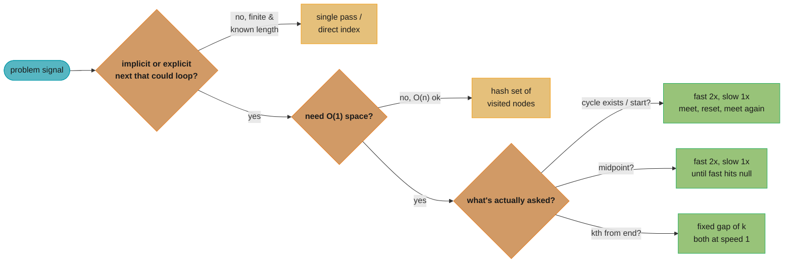
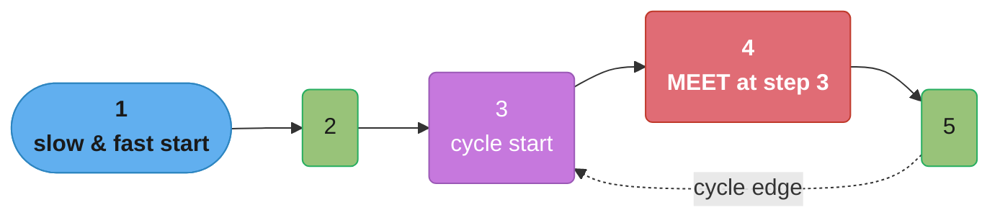
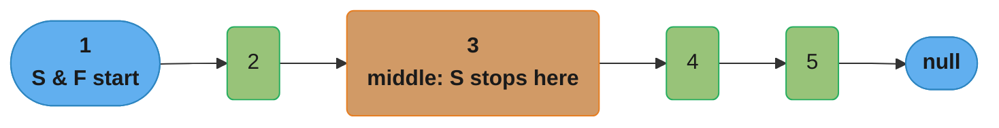
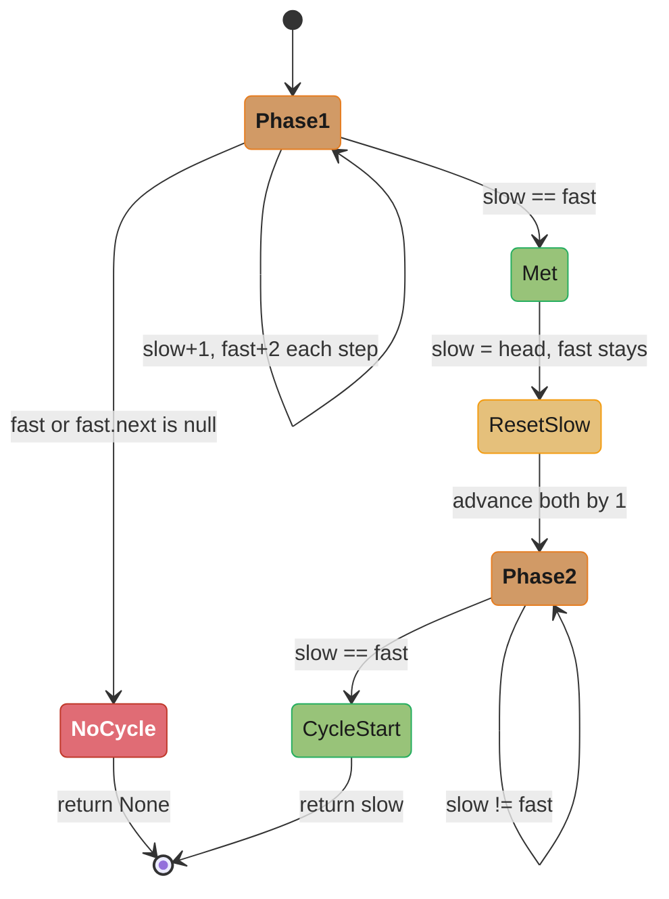

# Fast & Slow Pointers (Floyd's Cycle Detection)

## Pattern Snapshot

Two pointers traverse a linked list (or implicit functional graph) at different speeds — typically `slow` moves 1 step and `fast` moves 2 steps per iteration. The speed difference creates a relative motion that **must** eventually cause `fast` to either fall off the end (no cycle) or lap `slow` (cycle exists). **Cue**: linked list + "cycle", "middle", "nth from end", or a sequence defined by repeatedly applying a function (e.g., "happy number"). **Typical complexity**: O(n) time, O(1) space — the entire reason this pattern exists is to avoid the O(n) space of a hash-set-based "visited" check.

---

## 1. Recognition Signals

**Reach for fast & slow pointers when you see:**

- "Detect if a linked list has a cycle" / "find where the cycle begins"
- "Find the middle node of a linked list" (especially as a sub-step before another operation, like splitting a list or checking a palindrome)
- "Find the kth node from the end" (a *fixed-gap* two-pointer variant — both move at the same speed, but offset by k)
- "Happy Number" — a sequence defined by `x -> sum of squares of digits of x`; a cycle in this sequence means "not happy"
- "Find the duplicate number" in an array where values are in `[1, n]` — can be modeled as a linked list via `next = nums[index]`, turning it into cycle detection ([Find the Duplicate Number (LC 287)](https://leetcode.com/problems/find-the-duplicate-number/) — also solvable by [cyclic_sort.md](cyclic_sort.md))
- "Reorder list" / "palindrome linked list" — these *use* fast/slow as a sub-routine to find the midpoint, then combine with [in_place_linked_list_reversal.md](in_place_linked_list_reversal.md)

**Anti-signals — looks like fast/slow pointers but isn't:**

- "Reverse a linked list" with **no** cycle/middle component — that's pure [in_place_linked_list_reversal.md](in_place_linked_list_reversal.md), no second pointer needed at different speed
- "Merge two sorted linked lists" — that's the two-sequence variant of [two_pointers.md](two_pointers.md), both pointers move at the same rate (1 step), just on different lists
- You need to detect a cycle **and you're allowed O(n) space** — a hash set of visited nodes is simpler to reason about and explain, though fast/slow is the O(1)-space "expected" answer at L5
- The sequence/list is **finite and acyclic by problem guarantee** (e.g., a normal array, not a "next pointer" structure) — fast/slow pointers add no value; a single pass suffices

The defining test: **is there an implicit or explicit "next" function that could loop back on itself, and do you need to detect/locate that loop in O(1) space?** If yes → fast/slow. If you just need "the element at position n/2" of a *known-finite* sequence, you can compute the length first and index directly — fast/slow is for when you *can't* know the length without traversing (linked lists have no `len()`).

The signals above collapse into one routing decision — walk the tree below from "does a looping `next` exist" down to which variant answers the question:



Every branch terminates in a variant covered by §3 (template) and §6 (sub-patterns); the O(1)-space branch is what separates fast/slow from the simpler-but-costlier hash-set fallback.

---

## 2. Mental Model & Intuition

**Cycle detection (Floyd's Tortoise and Hare)** — slow and fast both start at node 1; node 5 loops back to node 3, so the list never truly ends.



```
Step 0:  slow=1, fast=1
Step 1:  slow=2, fast=3
Step 2:  slow=3, fast=5
Step 3:  slow=4, fast=4   <- MEET! cycle detected (slow == fast)

Why they must meet: once both pointers are inside the cycle, fast gains
1 net position on slow every step (fast moves 2, slow moves 1). The gap
between them shrinks by 1 each step. Since the cycle has finite length,
the gap must eventually reach 0 -- they meet. They cannot "jump over"
each other because the gap shrinks by exactly 1, never more.
```

```
Finding the cycle START (after slow == fast detected)

  Let:
    L = distance from head to cycle start
    C = cycle length
    k = distance from cycle start to meeting point (along the cycle)

  At meeting time:
    slow has traveled  L + k
    fast has traveled  2*(L + k)   (fast moves 2x speed)

  fast also = L + k + (some number of full cycles) * C
  => 2(L+k) = L + k + n*C   for some integer n >= 1
  => L + k = n*C
  => L = n*C - k

  This means: if you reset one pointer to head and advance BOTH
  pointers (now both at speed 1), they will meet again exactly
  at the cycle start -- because the "head" pointer travels L steps
  to reach the start, and the "meeting point" pointer travels
  L = n*C - k steps, which (mod C) lands it back at the start too.

  head ------- L -------> [cycle start] -- k --> [meeting point]
  reset -------L -------> [cycle start]  <- both pointers arrive here together
```

**Finding the middle (no cycle case)** — S and F both start at node 1; F moves twice as fast, so when F falls off the end, S sits on the middle.



```
  step1: S=2, F=3
  step2: S=3, F=5
  step3: F=None (fast.next.next is None) -> stop. S=3 is the middle.

  For even-length lists [1,2,3,4]: fast reaches None after S=3
  (the SECOND of the two middle nodes) -- a common source of off-by-one
  bugs depending on which "middle" the problem wants.
```

---

## 3. The Template

### Cycle detection (boolean)

```python
class ListNode:
    def __init__(self, val=0, next=None):
        self.val = val
        self.next = next

def has_cycle(head: ListNode | None) -> bool:
    slow = fast = head
    while fast and fast.next:
        slow = slow.next
        fast = fast.next.next
        if slow is fast:
            return True
    return False
```

### Find cycle start (Floyd's algorithm, full)

```python
def detect_cycle_start(head: ListNode | None) -> ListNode | None:
    slow = fast = head

    # Phase 1: detect whether a cycle exists
    while fast and fast.next:
        slow = slow.next
        fast = fast.next.next
        if slow is fast:
            break
    else:
        return None  # fast hit the end -> no cycle

    # Phase 2: find the start -- reset one pointer to head,
    # advance both at speed 1 until they meet
    slow = head
    while slow is not fast:
        slow = slow.next
        fast = fast.next
    return slow
```

### Find the middle node

```python
def find_middle(head: ListNode | None) -> ListNode | None:
    slow = fast = head
    while fast and fast.next:
        slow = slow.next
        fast = fast.next.next
    return slow  # for even length, this is the SECOND middle node
```

### Fixed-gap two-pointer (kth from end)

```python
def remove_nth_from_end(head: ListNode | None, n: int) -> ListNode | None:
    dummy = ListNode(0, head)
    fast = slow = dummy

    for _ in range(n):           # advance fast n steps first
        fast = fast.next

    while fast.next:             # move both until fast hits the last node
        fast = fast.next
        slow = slow.next

    slow.next = slow.next.next   # slow is now the node BEFORE the target
    return dummy.next
```

---

## 4. Annotated Walkthrough

**Problem**: [Linked List Cycle II (LC 142)](https://leetcode.com/problems/linked-list-cycle-ii/) — return the node where the cycle begins, or `None` if there is no cycle.

**Brute force**: traverse with a hash set of visited nodes; the first revisited node is the cycle start. O(n) time, O(n) space.

**Key insight**: the math derivation in §2 shows that after `slow` and `fast` first meet inside the cycle, resetting one pointer to `head` and advancing both at speed 1 causes them to meet *exactly* at the cycle's start node. This gets you to O(1) space.



Floyd's algorithm is two phases, not one: Phase 1 races `fast` against `slow` until they meet inside the cycle or `fast` falls off the end; Phase 2 resets `slow` to `head` and walks both at speed 1 until they meet again — that second meeting point is guaranteed to be the cycle's start.

**Trace on `1 -> 2 -> 3 -> 4 -> 5 -> 6 -> 3` (cycle starts at node 3, L=2, C=4)**

```
Phase 1 (detect):
  slow=1, fast=1
  step1: slow=2, fast=3
  step2: slow=3, fast=5
  step3: slow=4, fast=3 (5->6->3, wrapped once)
  step4: slow=5, fast=5  <- MEET at node 5

  Verify: L=2 (1->2->3), k = distance from cycle-start(3) to meeting(5) = 2
  fast traveled 2*(L+k) = 2*4 = 8 steps total.
  Path: 1->2->3->4->5->6->3->4->5 = 8 hops. Correct.

Phase 2 (find start):
  slow = head = 1, fast = 5 (stays where it met)
  slow=1, fast=5
  step1: slow=2, fast=6
  step2: slow=3, fast=3  <- MEET at node 3 = cycle start!

  Verify via formula: L=2. slow travels L=2 steps from head (1->2->3).
  fast travels from node 5: 5->6->3, also 2 steps. Both land on 3.
```

The beauty of this algorithm: it never needs to know `C` or `k` explicitly — the meeting point in phase 2 is *guaranteed* to be the cycle start by the modular arithmetic shown in §2, regardless of where in the cycle phase 1's meeting point happened to be.

---

## 5. Complexity

| Operation | Time | Space |
|---|---|---|
| Cycle detection (phase 1) | O(n) | O(1) |
| Find cycle start (phase 2) | O(n) | O(1) |
| Find middle | O(n) | O(1) |
| Fixed-gap kth-from-end | O(n) | O(1) |
| **Total (any variant)** | **O(n)** | **O(1)** |

Compare to the hash-set approach: same O(n) time, but **O(n) space**. The fast/slow pattern's entire value proposition is trading a (small) increase in code subtlety for O(1) space — this is exactly the kind of tradeoff an L5 interviewer wants to hear you articulate explicitly.

### Decoding Floyd's algorithm — why the two pointers must meet

**Stated plainly.** "Once both pointers are inside the loop, the fast one gains exactly one step on the slow one every tick — so the gap between them shrinks by one per tick and must hit zero, the same way a runner lapping a track at one extra step per stride is guaranteed to catch you."

That framing matters because "fast might jump over slow" is the objection everyone raises, and it is answered by the gap being an integer that decreases by exactly 1. It can never skip from 2 to 0 without passing through 1.

| Symbol | What it is |
|---|---|
| `mu` | Tail length — how many nodes sit before the cycle starts |
| `lambda` | Cycle length — how many nodes are in the loop |
| `t` | Step count. After `t` ticks, slow has moved `t` and fast has moved `2t` |
| `k` | Some whole number of laps. The lap count fast has gained on slow |
| `mod` | Remainder after dividing. `6 mod 4 = 2` — what is left after 1 full lap |
| `O(1)` | Constant memory: two pointers, no matter how long the list is |

**Walk one example.** A 6-node list with `mu = 2` and `lambda = 4` — node 5 points back to node 2:

```
  0 -> 1 -> 2 -> 3 -> 4 -> 5
            ^              |
            +--------------+       mu = 2 (tail), lambda = 4 (cycle)

  Phase 1: slow moves +1, fast moves +2 each tick.
  "gap" = how many steps fast still needs to gain to land on slow,
  measured forward around the cycle -- only defined once both are inside it.

  tick   slow node   fast node   gap
  ----   ---------   ---------   ---------------------------
    0        0           0       -- fast has not entered yet
    1        1           2       -- slow has not entered yet
    2        2           4       2
    3        3           2       1
    4        4           4       0   <- they meet, at node 4
```

The gap goes `2 -> 1 -> 0`. It cannot do anything else: fast advances 2 and slow advances 1, so their separation changes by exactly `-1` per tick. An integer counting down by one always reaches zero, and it does so within `lambda` ticks of both pointers being inside the cycle. That is the entire meeting proof — no case analysis needed.

**Why phase 2 lands on the cycle start.** At the meeting, slow has walked `t = 4` and fast has walked `2t = 8`. Fast's extra distance is `8 - 4 = 4`, which is exactly `lambda = 4` — one full lap, `k = 1`. Generally `t = k * lambda`. Now measure from the meeting point: slow entered the cycle at tick `mu` and has been circling for `t - mu = 4 - 2 = 2` steps, so the remaining distance forward around the cycle back to the start is `lambda - 2 = 2` — which equals `mu`. Both distances are `2`, so a pointer restarted at the head and a pointer left at the meeting node, moving at the same speed, arrive together:

```
  Phase 2: reset p1 to head, leave p2 at the meeting node, move both +1.

  tick   p1 node   p2 node
  ----   -------   -------
    0        0         4
    1        1         5
    2        2         2      <- both land on node 2 = the cycle start, after mu = 2 steps
```

**Why this is O(n) and not O(n^2).** Phase 1 runs at most `mu + lambda` ticks — slow needs `mu` to reach the cycle and at most `lambda` more to be caught — and `mu + lambda <= n`. So slow makes at most `n` moves, fast at most `2n`. Phase 2 adds `mu <= n` moves for each of the two pointers. Total is bounded by roughly `4n` pointer moves, all in constant memory. The hash-set alternative does the same `n` traversal but stores up to `n` node references; for a 10^5-node list that is 200,000 pointer moves either way, but 100,000 stored references versus **two**.

---

## 6. Variations & Sub-patterns

- **Cycle detection (boolean)** — the base template; `slow is fast` check ([Linked List Cycle (LC 141)](https://leetcode.com/problems/linked-list-cycle/))
- **Find cycle start** — two-phase Floyd's algorithm ([Linked List Cycle II (LC 142)](https://leetcode.com/problems/linked-list-cycle-ii/))
- **Find cycle length** — once `slow == fast`, keep one pointer fixed and advance the other until they meet again, counting steps
- **Middle of linked list** — used as a sub-routine for palindrome check, splitting a list for merge sort ([Middle of the Linked List (LC 876)](https://leetcode.com/problems/middle-of-the-linked-list/))
- **Fixed-gap (kth from end)** — both pointers move at speed 1, but `fast` starts `k` nodes ahead — different from "fast moves 2x", but same "two pointers, different starting positions" family ([Remove Nth Node From End of List (LC 19)](https://leetcode.com/problems/remove-nth-node-from-end-of-list/))
- **Cycle detection on functional graphs (not linked lists)** — "Happy Number": the sequence `x -> digitSquareSum(x)` either reaches 1 or cycles; apply Floyd's to the *sequence of values*, not list nodes ([Happy Number (LC 202)](https://leetcode.com/problems/happy-number/))
- **Array-as-linked-list (Find the Duplicate)** — treat `nums[i]` as a "pointer" to index `nums[i]`; a duplicate value creates a cycle in this implicit graph ([Find the Duplicate Number (LC 287)](https://leetcode.com/problems/find-the-duplicate-number/))
- **Combined with reversal** — palindrome check and "reorder list" find the middle with fast/slow, then reverse the second half ([in_place_linked_list_reversal.md](in_place_linked_list_reversal.md))

---

## 7. Problem Bank

| Problem | Difficulty | Variation | Recognition cue / twist |
|---|---|---|---|
| [Linked List Cycle (LC 141)](https://leetcode.com/problems/linked-list-cycle/) | Easy | Base cycle detection | Just need true/false |
| [Middle of the Linked List (LC 876)](https://leetcode.com/problems/middle-of-the-linked-list/) | Easy | Find middle | Even-length returns the 2nd middle |
| [Happy Number (LC 202)](https://leetcode.com/problems/happy-number/) | Easy | Cycle detection on a value sequence | "next" is digit-square-sum, not `.next` |
| [Intersection of Two Linked Lists (LC 160)](https://leetcode.com/problems/intersection-of-two-linked-lists/) | Easy | Two-pointer head-switch | Switch each pointer to the other head at the end; they meet at the join |
| [Palindrome Linked List (LC 234)](https://leetcode.com/problems/palindrome-linked-list/) | Easy | Middle + reversal combo | Find mid, reverse 2nd half, compare |
| [Linked List Cycle II (LC 142)](https://leetcode.com/problems/linked-list-cycle-ii/) | Medium | Find cycle start | Two-phase Floyd's; reset slow to head after meeting |
| [Remove Nth Node From End of List (LC 19)](https://leetcode.com/problems/remove-nth-node-from-end-of-list/) | Medium | Fixed-gap two pointers | Advance fast `n` steps first; dummy head handles head removal |
| [Swapping Nodes in a Linked List (LC 1721)](https://leetcode.com/problems/swapping-nodes-in-a-linked-list/) | Medium | Fixed-gap two pointers | kth from front and kth from end found in one pass |
| [Find the Duplicate Number (LC 287)](https://leetcode.com/problems/find-the-duplicate-number/) | Medium | Array-as-linked-list | `nums[i]` is the "next pointer"; cycle entry = duplicate |
| [Circular Array Loop (LC 457)](https://leetcode.com/problems/circular-array-loop/) | Medium | Direction-constrained cycle | Cycle must be all-forward or all-backward, length > 1 |
| [Reorder List (LC 143)](https://leetcode.com/problems/reorder-list/) | Medium | Middle + reversal + merge | Three sub-routines combined |
| [Delete the Middle Node of a Linked List (LC 2095)](https://leetcode.com/problems/delete-the-middle-node-of-a-linked-list/) | Medium | Find middle, relink prev | Keep a `prev` of slow so you can splice it out |
| [Sort List (LC 148)](https://leetcode.com/problems/sort-list/) | Medium | Fast/slow split for merge sort | Split at the middle, recurse, merge — O(n log n), O(1) extra |
| [Convert Sorted List to Binary Search Tree (LC 109)](https://leetcode.com/problems/convert-sorted-list-to-binary-search-tree/) | Medium | Recursive fast/slow middle | Middle is the subtree root; recurse on the two halves |
| [Maximum Twin Sum of a Linked List (LC 2130)](https://leetcode.com/problems/maximum-twin-sum-of-a-linked-list/) | Medium | Middle + reverse + pair | Fast/slow to mid, reverse 2nd half, max over twin pairs |

---

## 8. Common Mistakes (BROKEN -> FIX)

**Mistake: incorrect loop condition allows `fast.next.next` to be called on `None`, raising `AttributeError`.**

```python
# BROKEN — checks `fast` but not `fast.next` before accessing `fast.next.next`.
# When the list has an even number of nodes and no cycle, fast eventually
# becomes None, but on the step before that, fast.next could be None too,
# and `fast.next.next` raises AttributeError: 'NoneType' has no attribute 'next'.
def has_cycle_broken(head):
    slow = fast = head
    while fast:                      # BUG: only checks fast, not fast.next
        slow = slow.next
        fast = fast.next.next        # crashes if fast.next is None
        if slow is fast:
            return True
    return False
```

```python
# FIXED — check BOTH fast and fast.next before advancing fast by 2.
def has_cycle_fixed(head):
    slow = fast = head
    while fast and fast.next:        # FIX: guard both
        slow = slow.next
        fast = fast.next.next
        if slow is fast:
            return True
    return False
```

**Trigger**: `head = [1, 2]` (no cycle, even length). Trace with the broken version: `slow=1, fast=1`. Loop check `while fast` (fast=1, truthy) → `slow=2`, `fast = fast.next.next` = `(1.next).next` = `2.next` = `None`. OK so far, no crash yet — but if the list were `[1]`, then `fast=1`, `fast.next` is `None`, and `fast.next.next` immediately raises `AttributeError`. The fixed version's `fast and fast.next` check catches this for any list length, including the single-node and empty-list edge cases.

---

## 9. Related Patterns & When to Switch

- **[In-Place Linked List Reversal](in_place_linked_list_reversal.md)** — fast/slow finds *where* to act (the middle, or a cycle's existence); reversal is what you often do *with* that information (palindrome check, reorder list, k-group reversal of the back half).
- **[Two Pointers](two_pointers.md)** — the "fixed-gap" variant (kth from end) is structurally a two-pointer technique with both pointers at speed 1 but offset by `k`; the "2x speed" variant is what's unique to fast/slow. If your problem has two pointers both moving at the *same* speed on the *same* structure, lean toward calling it two-pointers; if one moves at 2x to detect periodicity, it's fast/slow.
- **[Cyclic Sort](cyclic_sort.md)** — "Find the Duplicate Number" can be solved either by fast/slow (treating values as pointers, O(1) space, doesn't modify array) or cyclic sort (place each value at its index, O(1) space, *does* modify array but is arguably more intuitive). Know both.
- **Hashing (visited set)** — the "I have unlimited space" fallback for any cycle-detection problem; mention it as the brute force, then pivot to fast/slow for the O(1)-space optimization.

---

## 10. Cross-links

- Concept module: [linked_lists_stacks_and_queues](../linked_lists_stacks_and_queues/) — linked list fundamentals, node structure, dummy heads
- [recursion_and_problem_solving_patterns](../recursion_and_problem_solving_patterns/) — many linked-list problems have elegant recursive alternatives; fast/slow is the *iterative, O(1)-space* answer
- Applied: [`../../java/collections_internals/README.md`](../../java/collections_internals/README.md) — `LinkedList` internals, why Java's `LinkedList` is rarely the right default choice vs `ArrayDeque`
- Master index: [dsa_patterns/README.md](README.md)

---

## 11. Interview Q&A

**Q: Why must `fast` and `slow` eventually meet if there's a cycle? Could they "skip past" each other?**
Once both pointers are inside the cycle, the *gap* between them (measured in the direction `fast` is moving) shrinks by exactly 1 every step, because `fast` moves 2 and `slow` moves 1 — net gain of 1 for `fast`. A gap that shrinks by exactly 1 each step, starting from some finite positive value and operating modulo the cycle length `C`, must pass through 0 — it cannot jump over 0 because it changes by only 1 at a time. So they are guaranteed to meet within at most `C` steps after both are in the cycle.

**Q: Why does resetting one pointer to `head` and advancing both at speed 1 find the cycle start?**
This follows from the algebra: at the meeting point, `slow` has traveled `L + k` steps (L = distance from head to cycle start, k = distance from cycle start to meeting point along the cycle), and `fast` has traveled `2(L+k)`. Since `fast` is also `(L+k) + n*C` for some integer `n >= 1` (it lapped the cycle `n` times), setting these equal gives `L = n*C - k`. This means walking `L` steps from `head` lands you at the cycle start, AND walking `L` steps from the *meeting point* (which is `k` steps into the cycle) also lands at the cycle start (since `k + L = k + n*C - k = n*C`, a multiple of the cycle length, i.e., back to the same position). Both pointers, advancing at the same speed, arrive at the cycle start simultaneously after `L` steps.

**Q: For "find the middle of a linked list," which node is returned for an even-length list — and does it matter?**
With the standard template (`while fast and fast.next`), for a list of length `2m`, `slow` ends at the `(m+1)`-th node — the *second* of the two middle nodes. This matters for problems like "Palindrome Linked List": if you reverse the second half starting from this middle, the two halves being compared have the correct lengths. If a problem wants the *first* middle for even lengths, change the loop condition to `while fast.next and fast.next.next`.

**Q: How would you find the length of the cycle once you've detected one?**
After `slow` and `fast` meet (any meeting point inside the cycle works), keep `fast` (or either pointer) fixed and advance just one pointer step by step, counting steps, until it returns to the same node. That count is the cycle length `C`. This is a separate, simple loop appended after cycle detection.

**Q: Can fast/slow pointers be applied to something that isn't a linked list?**
Yes — anything with an implicit "next" function over a domain that *could* cycle. "Happy Number" applies it to the sequence of values produced by `digit_square_sum`. "Find the Duplicate Number" applies it to an array by treating `nums[i]` as "the next index to visit" — this only works because values are constrained to `[1, n]`, guaranteeing the "pointer" `nums[i]` is always a valid index.

**Q: Why is the duplicate found by Floyd's algorithm in "Find the Duplicate Number" guaranteed to be the start of the cycle, and why is the "cycle start" the duplicate?**
Model the array as a function `f(i) = nums[i]`. Since there are `n+1` numbers in range `[1, n]`, by pigeonhole at least one value repeats. In the functional graph where each index `i` points to `nums[i]`, the duplicate value is the one with **two indices pointing into it** — making it the entry point of a cycle (the only node with in-degree ≥ 2). Floyd's "find cycle start" phase locates exactly this node.

**Q: What's the difference between the "fast moves 2x" pattern and the "fixed gap of k" pattern? Are they the same technique?**
They're related (both use two pointers at different "positions" on the same structure) but solve different problems. "Fast moves 2x" exploits a *relative speed difference* to detect periodicity (cycles) or find a midpoint (the 2:1 ratio means when fast finishes, slow is at the halfway point). "Fixed gap of k" uses a *constant offset* — both pointers move at the same speed (1 step), maintaining a gap of exactly `k` — to identify "the node `k` positions before/after another node" without needing to know the list's total length in advance.

**Q: If you're allowed O(n) space, is there ever a reason to still use fast/slow pointers?**
Generally no for correctness, but it may be *faster in practice* (no hashing overhead, no memory allocation for a set) and it demonstrates the O(1)-space technique, which is often what L5 interviewers are specifically testing. If asked "can you do better on space?", fast/slow is the expected answer for cycle-related linked-list problems.

**Q: How do you handle the edge case of an empty list or single-node list in cycle detection?**
The condition `while fast and fast.next` handles both: if `head is None`, `fast = None`, the loop body never executes, `has_cycle` returns `False` correctly. If the list has one node with no self-loop, `fast.next is None` after zero iterations, loop doesn't execute, returns `False`. If the single node *does* point to itself (`node.next = node`), then `fast and fast.next` is true; `slow = slow.next = node`, `fast = fast.next.next = node` — `slow is fast` → `True`, correctly detected.

**Q: In "Remove Nth Node From End of List," why use a dummy head node?**
Without a dummy node, removing the actual head of the list (when `n == length`) requires special-casing — there's no "previous" node to update `.next` on. By prepending a `dummy` node (`dummy.next = head`), the head becomes "just another node with a predecessor," and the same `slow.next = slow.next.next` logic uniformly handles removing any node, including the original head. Return `dummy.next` as the new head.

**Q: Is there a non-Floyd's way to detect a cycle in O(1) space?**
Floyd's (tortoise and hare) is the canonical O(1)-space approach. An alternative — Brent's algorithm — also achieves O(1) space and can be faster in practice (fewer total pointer movements) by using a "teleporting" slow pointer with periodically doubling step limits, but it's rarely expected at the interview level; mentioning it shows extra depth but Floyd's is sufficient and more commonly recognized.
