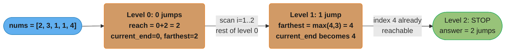
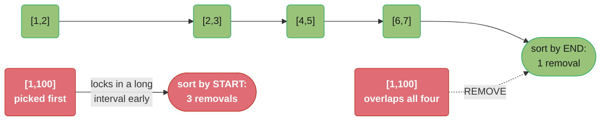
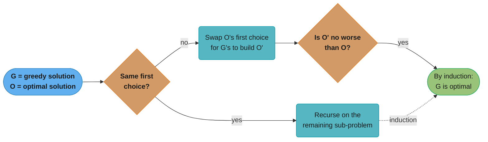
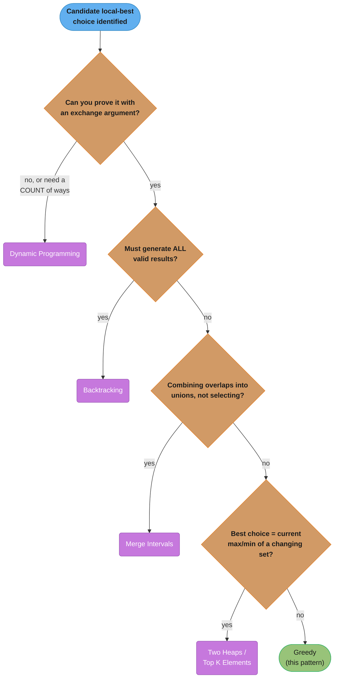

# Greedy

## Pattern Snapshot

Greedy makes the **locally optimal choice at every step** — and never revisits
that choice — betting that a sequence of locally optimal choices produces a
globally optimal result. It is the "cheapest" algorithmic tool in terms of
time and space, but it is also the easiest to get *wrong*: it only works when
the problem has the **greedy-choice property** (a locally optimal choice is
part of *some* globally optimal solution) and **optimal substructure** (the
remaining sub-problem, after the choice, is itself an instance of the same
problem).

**One-line cue:** "Sort by some key, then make the obviously-best choice at
each step and never look back."

**Typical complexity:** O(n log n) when the greedy step requires sorting
first (the dominant cost), or O(n) when a single linear scan with a running
"best so far" variable suffices.

---

## 1. Recognition Signals

**Signals that scream greedy:**

- "Minimum number of intervals to remove / minimum meeting rooms / minimum
  arrows to burst balloons" — interval scheduling
- "Can you reach the end / minimum number of jumps to reach the end" — reach-
  based greedy (track `farthest` / `current_end`)
- "Gas station / circular tour — find the starting point" — running-total
  greedy with a reset rule
- "Assign cookies to children / boats to save people / two groups matched by
  size" — sort both sides, two-pointer greedy
- "Candy distribution where each child must get more than a worse-rated
  neighbor" — two-pass greedy (left-to-right, then right-to-left)
- "Reorganize string / task scheduler with cooldown" — greedy + **max-heap**
  (always place the most frequent remaining character/task)
- "Huffman encoding / minimum cost to connect ropes or sticks" — greedy +
  **min-heap** (always merge the two *smallest* values; the opposite heap
  direction from the line above — don't conflate the two)
- The phrase "it is always optimal to ..." appears naturally when you think
  about the problem out loud — that intuition is the greedy-choice property

**Anti-signals (looks like greedy but isn't):**

- "Minimum/maximum cost where the best choice depends on choices made later"
  — usually [Dynamic Programming](dynamic_programming.md). Classic trap: 0/1
  knapsack — greedy by value/weight ratio is correct for the *fractional*
  knapsack but **wrong** for 0/1 knapsack, where DP is required.
- "Count the number of ways to ..." — greedy produces *one* answer, not a
  count; this is DP.
- "Generate all subsets/permutations/combinations that satisfy ..." —
  [Backtracking](backtracking.md), not greedy.
- You found a greedy rule but cannot construct a proof sketch (exchange
  argument) and a counter-example breaks it on paper — that is a strong
  signal the problem actually needs DP. Always stress-test your greedy rule
  against a small adversarial example before committing to it in an
  interview.

---

## 2. Mental Model & Intuition

### Reach-based greedy (Jump Game II)

Think of it as **BFS collapsed into a single pass**: each "level" is the set
of indices reachable with `k` jumps. You don't enumerate the level — you just
track the farthest index reachable from the *current* level, and the moment
your scan passes the end of the current level, you've implicitly finished
that BFS layer and start the next one.



Each level's scan must fully exhaust before the next begins — two level
transitions (Level 0 to 1, Level 1 to 2) land exactly on the traced answer
of 2 jumps.

### Exchange argument for interval scheduling

The classic proof technique behind greedy interval problems: take ANY optimal
solution, show you can "exchange" its first choice for the greedy choice
without making the solution worse. For "maximum non-overlapping intervals,"
the greedy choice is **the interval that ends earliest** — it leaves the most
room for everything that comes after.



Sorting by start time locks in `[1,100]` first, forcing 3 removals instead
of 1 — end time is the correct sort key because it frees up the timeline
soonest.

---

## 3. The Template

```python
from __future__ import annotations

import heapq


def can_jump(nums: list[int]) -> bool:
    """Jump Game (LC 55): can we reach the last index?

    Greedy invariant: `farthest` is the farthest index reachable using
    only indices already proven reachable.
    """
    farthest = 0
    for i, num in enumerate(nums):
        if i > farthest:
            return False  # index i itself is unreachable
        farthest = max(farthest, i + num)
    return farthest >= len(nums) - 1


def jump_game_ii(nums: list[int]) -> int:
    """Jump Game II (LC 45): minimum jumps to reach the last index.

    BFS-by-levels collapsed into one pass: `current_end` is the boundary
    of the current "level"; `farthest` is the boundary of the next level.
    """
    jumps = 0
    current_end = 0
    farthest = 0
    for i in range(len(nums) - 1):       # never need to "jump" from the last index
        farthest = max(farthest, i + nums[i])
        if i == current_end:             # exhausted the current level
            jumps += 1
            current_end = farthest
    return jumps


def erase_overlap_intervals(intervals: list[list[int]]) -> int:
    """Non-overlapping Intervals (LC 435): minimum removals so the rest
    don't overlap.

    Greedy choice: sort by END time, keep an interval iff its start is
    >= the end of the last kept interval.
    """
    if not intervals:
        return 0
    intervals.sort(key=lambda iv: iv[1])
    removed = 0
    prev_end = float("-inf")
    for start, end in intervals:
        if start >= prev_end:
            prev_end = end          # keep this interval
        else:
            removed += 1            # overlaps the kept one -> drop it
    return removed


def can_complete_circuit(gas: list[int], cost: list[int]) -> int:
    """Gas Station (LC 134): index to start a circular tour, or -1.

    Key insight: if total gas >= total cost, a valid start exists.
    Whenever the running tank goes negative, NONE of the stations
    scanned so far (including the current one) can be the start --
    reset the candidate to the next station.
    """
    total_tank = current_tank = 0
    start = 0
    for i in range(len(gas)):
        diff = gas[i] - cost[i]
        total_tank += diff
        current_tank += diff
        if current_tank < 0:
            start = i + 1
            current_tank = 0
    return start if total_tank >= 0 else -1


def find_content_children(g: list[int], s: list[int]) -> int:
    """Assign Cookies (LC 455): maximize satisfied children.

    Two-pointer greedy: sort both arrays; give the smallest cookie that
    is BIG ENOUGH to the least-greedy unsatisfied child. Saving a big
    cookie for a small child never helps -- it can only make a future
    match worse or leave the big cookie unused either way.
    """
    g.sort()
    s.sort()
    child = cookie = 0
    while child < len(g) and cookie < len(s):
        if s[cookie] >= g[child]:
            child += 1
        cookie += 1
    return child


def connect_sticks(sticks: list[int]) -> int:
    """Minimum Cost to Connect Sticks (LC 1167): connect every stick into
    one, where each connection costs (sum of the two sticks joined).

    Huffman-style greedy: repeatedly merge the two SHORTEST remaining
    sticks (a min-heap -- the OPPOSITE direction from the max-heap used
    for Reorganize String / Task Scheduler). A stick merged early gets
    "charged" again on every later merge it participates in, so merging
    the two cheapest first minimizes the total accumulated cost.
    """
    heapq.heapify(sticks)
    total_cost = 0
    while len(sticks) > 1:
        first = heapq.heappop(sticks)
        second = heapq.heappop(sticks)
        merged = first + second
        total_cost += merged
        heapq.heappush(sticks, merged)
    return total_cost
```

---

## 4. Annotated Walkthrough

**Problem:** [Jump Game II (LC 45)](https://leetcode.com/problems/jump-game-ii/)
— `nums = [2, 3, 1, 1, 4]`. Find the minimum number of jumps to reach the last
index (index 4), starting at index 0.

`jumps = 0`, `current_end = 0`, `farthest = 0`. Loop runs for
`i in range(4)` (we never jump *from* the last index):

```
i=0: farthest = max(0, 0+nums[0]) = max(0, 2) = 2
     i == current_end (0 == 0) -> jumps = 1, current_end = 2
     state: jumps=1, current_end=2, farthest=2

i=1: farthest = max(2, 1+nums[1]) = max(2, 1+3) = max(2, 4) = 4
     i == current_end? (1 == 2) -> NO, just keep scanning
     state: jumps=1, current_end=2, farthest=4

i=2: farthest = max(4, 2+nums[2]) = max(4, 2+1) = max(4, 3) = 4
     i == current_end (2 == 2) -> jumps = 2, current_end = 4
     state: jumps=2, current_end=4, farthest=4

i=3: farthest = max(4, 3+nums[3]) = max(4, 3+1) = max(4, 4) = 4
     i == current_end? (3 == 4) -> NO

loop ends (range(4) exhausted)
return jumps = 2
```

**Why it's correct:** `current_end` marks "the farthest you can be standing
after `jumps` jumps." The instant the scan index `i` reaches `current_end`,
every index up to `farthest` is reachable with one more jump — so we commit
to that jump (`jumps += 1`) and slide the boundary out to `farthest`. We
never need to know *which* index within the level we jump from — only that
the level transition happened. Two jumps (0 -> 1 -> 4, or 0 -> 2 -> 4 etc.)
suffice, matching the expected answer of `2`.

---

## 5. Complexity

| Template | Time | Space | Why |
|---|---|---|---|
| `can_jump` | O(n) | O(1) | single pass, one running variable |
| `jump_game_ii` | O(n) | O(1) | single pass; BFS levels collapsed into a counter |
| `erase_overlap_intervals` | O(n log n) | O(1) extra | dominated by the sort; the scan itself is O(n) |
| `can_complete_circuit` | O(n) | O(1) | single pass, running totals |
| `find_content_children` | O(n log n) | O(1) extra | dominated by sorting both arrays |

The recurring theme: **greedy algorithms are almost always O(n) on top of an
O(n log n) sort** (or pure O(n) if the input is already ordered or order
doesn't matter). This is dramatically cheaper than the O(n^2) or exponential
costs of the DP/backtracking alternatives that greedy displaces — which is
exactly why proving greedy correctness (or refuting it quickly) is so
valuable in an interview.

---

## 6. Variations & Sub-patterns

**1. Reach / jump family** — `farthest`-tracking greedy:
- [Jump Game (LC 55)](https://leetcode.com/problems/jump-game/) — feasibility only
- [Jump Game II (LC 45)](https://leetcode.com/problems/jump-game-ii/) — minimum jumps
- Jump Game IV/VII — add BFS over a graph of valid moves when the "reach" isn't a contiguous range (then it's [Tree/Graph BFS](graph_traversal.md), not pure greedy)

**2. Interval selection family** — sort by an interval boundary, scan once:
- [Non-overlapping Intervals (LC 435)](https://leetcode.com/problems/non-overlapping-intervals/) — sort by end, greedy keep
- [Minimum Arrows to Burst Balloons (LC 452)](https://leetcode.com/problems/minimum-number-of-arrows-to-burst-balloons/) — same idea, "shoot" overlapping intervals together
- [Partition Labels (LC 763)](https://leetcode.com/problems/partition-labels/) — greedily extend the current partition's boundary to the last occurrence of every character seen
- "Minimum meeting rooms" needs a *count* of overlaps at once, not just yes/no — that's [Two Heaps](two_heaps.md) or a sweep-line, not pure greedy

**3. Sort + two-pointer matching** — pair up two sorted sequences:
- [Assign Cookies (LC 455)](https://leetcode.com/problems/assign-cookies/)
- Boats to Save People (LC 881) — sort, then match the lightest person with the heaviest person that still fits
- [Candy (LC 135)](https://leetcode.com/problems/candy/) — TWO greedy passes (left-to-right enforces "greater than left neighbor", right-to-left enforces "greater than right neighbor"; take the max of both per index)

**4. Frequency-driven greedy + heap** — when the greedy choice is "the most
frequent / most expensive remaining item":
- [Task Scheduler (LC 621)](https://leetcode.com/problems/task-scheduler/) — either a max-heap simulation or a closed-form formula based on the most frequent task's count
- [Reorganize String (LC 767)](https://leetcode.com/problems/reorganize-string/) — max-heap, always place the currently most frequent character that isn't equal to the previous one
- Huffman coding / "minimum cost to connect ropes" — repeatedly merge the two smallest values via a min-heap

**5. The exchange argument, formalized** — to *prove* a greedy rule (useful
when an interviewer asks "why does this work?"):
1. Let `G` be the greedy solution and `O` be some optimal solution.
2. If `G` and `O` make the same first choice, recurse on the remaining
   sub-problem (induction).
3. If they differ, show that swapping `O`'s first choice for `G`'s choice
   produces another solution `O'` that is *no worse* than `O`.
4. By induction, `G` is at least as good as any `O`, hence optimal.

The four steps collapse into one small decision-and-induction loop:



Both branches — recursing on a matching first choice, or swapping and
checking a differing one — converge on the same conclusion, which is exactly
why induction closes the proof either way.

---

## 7. Problem Bank

| Problem | Difficulty | Variation | Recognition cue / twist |
|---|---|---|---|
| [Assign Cookies (LC 455)](https://leetcode.com/problems/assign-cookies/) | Easy | Sort + two-pointer matching | Smallest sufficient cookie to least-greedy child |
| [Jump Game (LC 55)](https://leetcode.com/problems/jump-game/) | Medium | Reach-based, feasibility | Track `farthest`; fail if `i > farthest` |
| [Jump Game II (LC 45)](https://leetcode.com/problems/jump-game-ii/) | Medium | Reach-based, min jumps | BFS levels collapsed via `current_end` |
| [Non-overlapping Intervals (LC 435)](https://leetcode.com/problems/non-overlapping-intervals/) | Medium | Interval scheduling | Sort by END time, not start |
| [Minimum Number of Arrows to Burst Balloons (LC 452)](https://leetcode.com/problems/minimum-number-of-arrows-to-burst-balloons/) | Medium | Interval scheduling, "shoot together" | Sort by end; reuse arrow while `start <= arrow_pos` |
| [Partition Labels (LC 763)](https://leetcode.com/problems/partition-labels/) | Medium | Interval extension | Extend boundary to `last_occurrence[char]` for every char seen |
| [Gas Station (LC 134)](https://leetcode.com/problems/gas-station/) | Medium | Circular running-total | Reset start whenever running tank < 0 |
| [Candy (LC 135)](https://leetcode.com/problems/candy/) | Hard | Two-pass greedy | Left pass enforces left neighbor; right pass enforces right neighbor; take max |
| [Queue Reconstruction by Height (LC 406)](https://leetcode.com/problems/queue-reconstruction-by-height/) | Medium | Sort + greedy insertion | Sort by (height desc, k asc); insert at index `k` |
| [Task Scheduler (LC 621)](https://leetcode.com/problems/task-scheduler/) | Medium | Frequency + max-heap / formula | Most frequent task dictates idle slots |
| [Reorganize String (LC 767)](https://leetcode.com/problems/reorganize-string/) | Medium | Frequency + max-heap | Never place same char as previous |
| [Minimum Cost to Connect Sticks (LC 1167)](https://leetcode.com/problems/minimum-cost-to-connect-sticks/) | Medium | Huffman-style, min-heap merge | Opposite heap direction from Task Scheduler/Reorganize String above |
| [Boats to Save People (LC 881)](https://leetcode.com/problems/boats-to-save-people/) | Medium | Sort + two-pointer matching | Pair lightest with heaviest that fits within limit |
| [Hand of Straights (LC 846)](https://leetcode.com/problems/hand-of-straights/) | Medium | Greedy consecutive grouping | Always start a group from the smallest remaining card |
| [Minimum Number of Refueling Stops (LC 871)](https://leetcode.com/problems/minimum-number-of-refueling-stops/) | Hard | Greedy + max-heap (regret) | Defer fuel choice; when stranded, retroactively take the largest seen tank |

---

## 8. Common Mistakes (BROKEN -> FIX)

**Mistake: sorting intervals by START time instead of END time** for "maximum
non-overlapping intervals" / "minimum removals." This *feels* natural
(intervals are usually given in start order) but it picks the wrong interval
to keep first.

```python
# BROKEN: sorts by start time
def erase_overlap_intervals_broken(intervals: list[list[int]]) -> int:
    intervals.sort(key=lambda iv: iv[0])   # WRONG sort key
    removed = 0
    prev_end = float("-inf")
    for start, end in intervals:
        if start >= prev_end:
            prev_end = end
        else:
            removed += 1
    return removed
```

**Trace the bug** on `intervals = [[1, 100], [2, 3], [4, 5], [6, 7]]`
(expected answer: `1` — remove only `[1, 100]`, keeping the other three):

```
Sorted by START: [[1,100], [2,3], [4,5], [6,7]]   (already in this order)

prev_end = -inf
[1,100]: start=1 >= -inf  -> KEEP, prev_end = 100
[2,3]:   start=2 >= 100?  NO  -> removed = 1, prev_end stays 100
[4,5]:   start=4 >= 100?  NO  -> removed = 2, prev_end stays 100
[6,7]:   start=6 >= 100?  NO  -> removed = 3, prev_end stays 100

return removed = 3   <-- WRONG (correct answer is 1)
```

By keeping `[1, 100]` first (because it happens to start earliest), the
greedy is locked into an interval that overlaps everything else, forcing it
to remove three small intervals instead of the one large one.

**The fix** — sort by END time. The interval that *finishes* earliest leaves
the most room for everything after it, regardless of when it starts:

```python
# FIXED: sorts by end time
def erase_overlap_intervals(intervals: list[list[int]]) -> int:
    intervals.sort(key=lambda iv: iv[1])   # correct sort key
    removed = 0
    prev_end = float("-inf")
    for start, end in intervals:
        if start >= prev_end:
            prev_end = end
        else:
            removed += 1
    return removed
```

**Trace the fix** on the same input:

```
Sorted by END: [[2,3], [4,5], [6,7], [1,100]]

prev_end = -inf
[2,3]:   start=2 >= -inf -> KEEP, prev_end = 3
[4,5]:   start=4 >= 3    -> KEEP, prev_end = 5
[6,7]:   start=6 >= 5    -> KEEP, prev_end = 7
[1,100]: start=1 >= 7?   NO -> removed = 1

return removed = 1   <-- CORRECT
```

The lesson generalizes: **whenever a greedy problem involves intervals, ask
"does my sort key represent the resource I'm trying to free up the fastest?"**
For "maximize count of non-overlapping intervals," that resource is the
timeline, and the interval that releases it soonest is the one with the
smallest end time.

---

## 9. Related Patterns & When to Switch

- **[Dynamic Programming](dynamic_programming.md)** — switch here the moment
  you cannot prove (or disprove) the greedy-choice property, or the problem
  asks for a *count* of ways rather than a single optimum (e.g., 0/1 knapsack,
  longest common subsequence — greedy by ratio/length fails both).
- **[Backtracking](backtracking.md)** — switch here if the problem says
  "generate all ..." / "find every valid ..." instead of "find the
  minimum/maximum ...". Greedy commits to one path; backtracking explores all.
- **[Merge Intervals](merge_intervals.md)** — closely related sorting-based
  pattern, but merge_intervals *combines* overlapping intervals into unions,
  while greedy interval-scheduling here *selects* a maximum subset and
  discards the rest. Both start with "sort by start (or end) time."
- **[Two Heaps](two_heaps.md) / [Top K Elements](top_k_elements.md)** —
  switch here when the greedy choice is "the current max/min of a changing
  set" rather than a fixed sort order computed once up front (e.g., Task
  Scheduler's heap-simulation variant, "minimum meeting rooms").

The four redirects above chain into one decision path (Modified Binary
Search, below, pairs *with* greedy rather than replacing it, so it sits
outside this chain):



- **[Modified Binary Search](modified_binary_search.md)** — "binary search on
  the answer" problems (e.g., Koko Eating Bananas, Capacity to Ship Packages)
  pair a binary search over the answer space with a *greedy feasibility
  check* — recognizing the inner feasibility check as greedy is often the key
  insight.

---

## 10. Cross-links

- Concept module: [`greedy_and_divide_and_conquer/`](../greedy_and_divide_and_conquer/README.md) — formal treatment of the greedy-choice property, optimal substructure, and exchange-argument proofs; also covers divide-and-conquer (merge sort, quickselect) as a separate strategy
- Complexity foundations: [`complexity_analysis_and_big_o/`](../complexity_analysis_and_big_o/README.md) — why O(n log n) is the practical ceiling for sort-then-scan greedy algorithms
- Applied cross-link: [`../../devops/kubernetes_scheduling_and_autoscaling/README.md`](../../devops/kubernetes_scheduling_and_autoscaling/README.md) — the Kubernetes default scheduler's bin-packing and priority-based pod placement are real-world greedy heuristics (best-fit / first-fit), including their known suboptimality versus exhaustive search

---

## 11. Interview Q&A

**Q: How do I prove a greedy algorithm is correct, on the spot, in an interview?**
Use the exchange-argument sketch: assume an optimal solution `O` that differs
from your greedy solution `G` in its first choice. Show that swapping `O`'s
first choice for `G`'s choice produces a solution that is at least as good.
By induction over the remaining sub-problem, `G` is optimal. You don't need a
rigorous formal proof — interviewers are looking for "I considered whether
swapping in my choice could ever make things worse, and it can't, because...".

**Q: How do I decide between greedy and DP when a problem could be either?**
Ask: "If I make the locally best choice now, could it ever prevent me from
reaching the *true* global optimum later?" If you can construct even one
counter-example where it does, you need DP (which considers all choices via
overlapping subproblems). The canonical split: fractional knapsack (greedy by
value/weight ratio works) vs. 0/1 knapsack (same greedy fails — DP required).

**Q: Why does Non-overlapping Intervals sort by END time and not START time?**
Because the goal is to keep as many intervals as possible, and the interval
that *finishes earliest* leaves the maximum remaining timeline for future
intervals — regardless of when it starts. Sorting by start time can lock in a
long interval early (because it happens to start first) and force removal of
many short intervals that would otherwise fit. See the BROKEN->FIX in §8 for
a concrete counter-example.

**Jump Game (LC 55) and Jump Game II (LC 45) both use `nums[i]` as a max
jump length — why are the algorithms different?**
LC 55 only asks "can you reach the end?" — a single `farthest` variable
suffices, and you fail fast if `i > farthest` (a gap you can never cross). LC
45 asks for the *minimum number of jumps*, which requires tracking jump
"levels" — hence the extra `current_end`/`jumps` bookkeeping that detects when
one level's reach is exhausted and the next jump must be counted.

**In the Gas Station problem, why does `total_tank >= 0` guarantee a valid
starting point exists, without checking every possible start?**
This is a classic greedy/prefix-sum argument: if the total gas across the
whole circuit is >= total cost, then *some* rotation of the prefix-sum
sequence is entirely non-negative. The point where the running tank first
dips below zero proves that no station up to and including that point can be
the start (any later start has even less cumulative slack at that point) — so
you can safely advance the candidate start past it without losing the true
answer. This single pass replaces an O(n^2) "try every start" brute force.

**Q: Why does the Candy problem need TWO passes instead of one?**
Each child's required candy count depends on comparisons with BOTH
neighbors simultaneously, but a single left-to-right (or right-to-left) pass
can only enforce one direction's constraint at a time. The left-to-right pass
guarantees "if `ratings[i] > ratings[i-1]`, then `candies[i] > candies[i-1]`";
the right-to-left pass guarantees the symmetric constraint with the right
neighbor. Taking `max(left_pass[i], right_pass[i])` per index satisfies both
constraints simultaneously without violating the other.

**When would I reach for a heap inside a greedy algorithm (e.g., Task
Scheduler, Reorganize String)?** When the "best current choice" changes
dynamically as you consume items — i.e., the greedy choice is "whichever
remaining item has the highest frequency/priority *right now*," and that
ranking shifts after each pick. A pre-sorted array can't represent a ranking
that changes during the algorithm; a max-heap can pop-and-reinsert in
O(log n).

**My greedy solution passes the example in the problem statement but fails on
the submission's hidden tests — what should I check?** Stress-test your
greedy rule against an adversarial small case BEFORE coding: construct an
input where your sort key or local rule produces two competing "obviously
good" choices and manually verify which one the greedy picks and whether
that's actually correct. The §8 BROKEN->FIX (`sort by start` vs `sort by end`)
is exactly this kind of subtle failure — both sort keys "look reasonable,"
but only one survives the adversarial trace.

**Q: Is greedy ever used for "minimum cost" problems with weighted graphs?**
Yes — Kruskal's and Prim's algorithms for Minimum Spanning Tree are greedy
(always add the cheapest edge that doesn't create a cycle / doesn't already
connect a visited node), and Dijkstra's shortest-path algorithm is greedy
(always finalize the closest unvisited node). See
[Shortest Path](shortest_path.md) and [Union-Find](union_find.md) (Kruskal
uses DSU for cycle detection).

**Q: What's the difference between greedy and "local search" / hill climbing?**
Greedy makes each choice ONCE, in a fixed order, and never revisits it — the
algorithm has a clear termination point and a provable bound (when correct).
Local search/hill climbing iteratively improves a *complete* candidate
solution by exploring neighboring solutions, can run for many iterations or
get stuck in local optima, and generally has no optimality guarantee. Greedy
is a single deterministic pass; local search is an iterative refinement loop
(more common in optimization/heuristics than in coding interviews).

**Q: Huffman coding is described as "greedy" — what's the greedy choice?**
At each step, take the two least-frequent remaining nodes/symbols and merge
them into a new node whose frequency is their sum, inserting it back into a
min-heap. The exchange argument: the two least-frequent symbols can always be
placed at the maximum tree depth (longest codes) without increasing the total
weighted code length compared to any other arrangement — so merging them
first is always safe.

**How do I avoid analysis paralysis between "is this greedy or DP" during a
45-minute interview?** Default to attempting the greedy approach first IF you
can state the greedy rule in one sentence AND immediately think of a potential
counter-example to test. Spend at most ~2 minutes on this gut-check. If you
construct a counter-example, say so out loud ("greedy by X fails when ...")
and pivot to DP — articulating *why* greedy fails is itself a strong signal
to the interviewer, and it naturally motivates the DP state you need.
