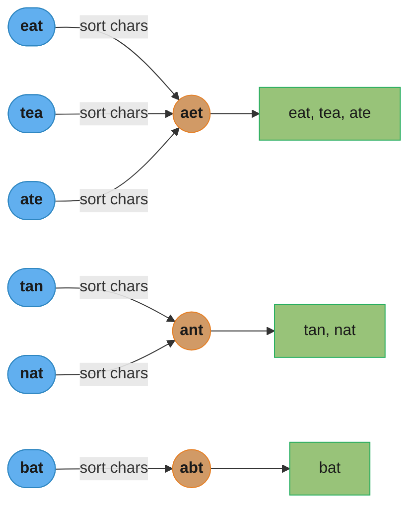
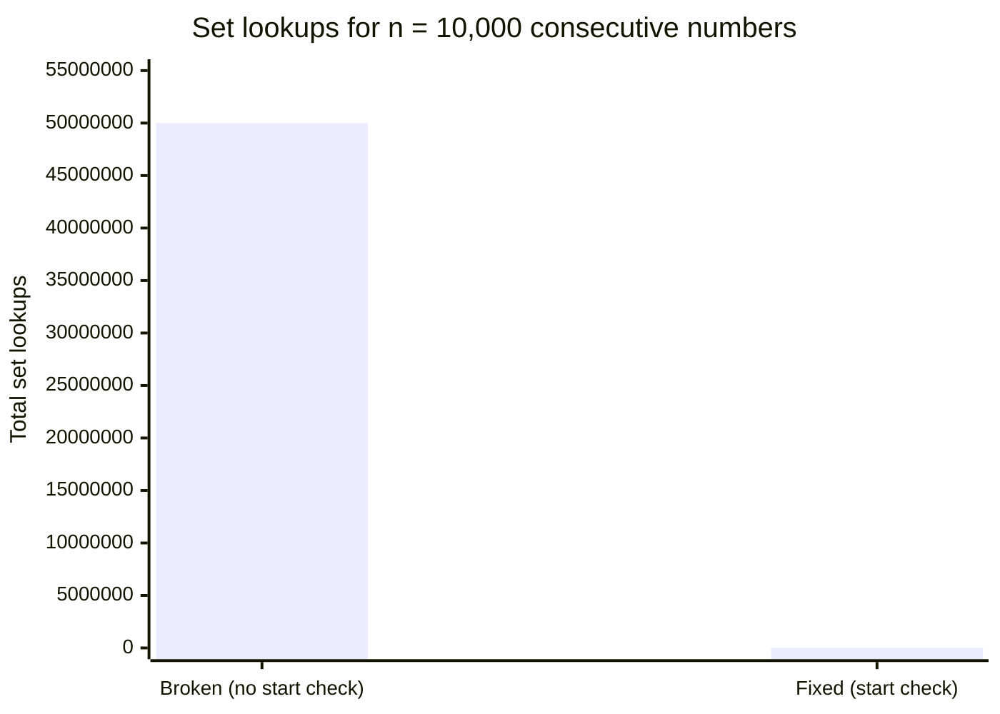
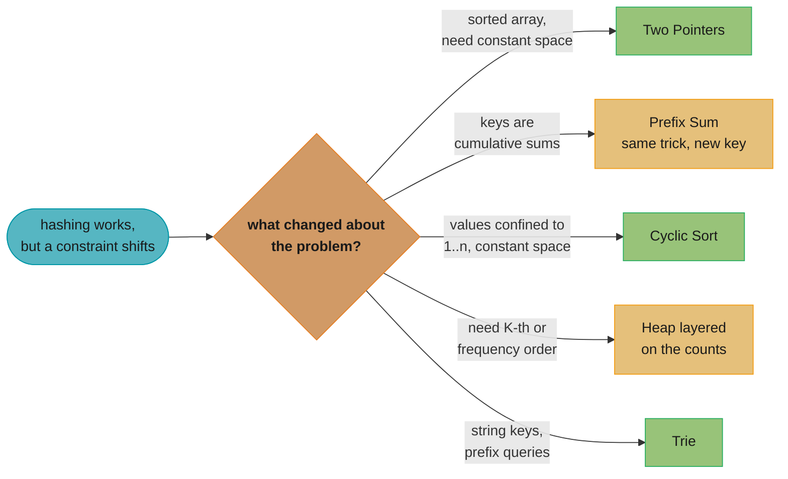

# Hashing Patterns

## Pattern Snapshot

Use a hash table (`dict`/`set`/`Counter`) to trade O(n) extra space for collapsing an O(n^2) "for each element, search for a related element" loop into O(n). The four sub-shapes are: **complement lookup** (Two Sum), **frequency counting** (anagrams, majority element), **grouping by a derived key** (group anagrams), and **existence/visited tracking** (deduplication, cycle detection in sets). **Cue**: "unsorted array", "pair/complement", "frequency", "group by", "have I seen this before?" **Typical complexity**: O(n) time, O(n) space — the canonical "trade space for time" pattern.

---

## 1. Recognition Signals

**Reach for hashing when you see:**

- "Two elements that sum to a target" on an **unsorted** array, especially when the answer requires **original indices** (sorting would lose index information)
- "Check if two strings are anagrams" / "group anagrams" — derive a canonical key (sorted string, or character-count tuple) and bucket by it
- "Find the first non-repeating character" / "find all duplicates" / "majority element" — frequency counting with `Counter`
- "Have I seen this state/value/node before?" — visited sets in graph traversal, cycle detection, deduplication
- "Longest consecutive sequence" — put all values in a set, then for each value that's a *sequence start* (no `value-1` in the set), count forward
- "Subarray/substring" problems combined with **prefix sums** (see [prefix_sum.md](prefix_sum.md)) — the hashmap stores prefix values
- "Design a data structure with O(1) insert/delete/getRandom" — combine a hashmap (value → index) with a dynamic array

**Anti-signals — looks like hashing but isn't:**

- The array **is sorted** (or can be sorted without losing required information) and you need a pair sum — **[Two Pointers](two_pointers.md)** achieves the same O(n) (after an O(n log n) sort) with O(1) space instead of O(n)
- "K-th largest/smallest" — a hashmap doesn't give you *order*; use a **[Heap](top_k_elements.md)** or quickselect
- "Range queries" (sum/min/max over `[i,j]`) — hashing doesn't help with ranges; use **[Prefix Sum](prefix_sum.md)** or a segment tree
- You need **insertion order** or **LRU eviction** — plain `dict`/`Counter` doesn't track recency; use `OrderedDict` or a hashmap + doubly-linked list (see [hld/caching](../../hld/caching/))
- "Find missing/duplicate number in `[1, n]`" with an **O(1) space** constraint — hashing uses O(n) space; **[Cyclic Sort](cyclic_sort.md)** achieves O(1) by using the array itself as the hash table

The defining test: **do you need to answer "have I seen X?" or "how many times have I seen X?" or "what's associated with X?" in O(1), without caring about order or magnitude relationships between keys?** If yes, hashing. If the question is about *order* (sorted, k-th, range), a different structure usually wins.

---

## 2. Mental Model & Intuition

```
Sub-pattern 1: Complement lookup (Two Sum)

  nums = [2, 7, 11, 15], target = 9

  seen = {}
  i=0: nums[0]=2.  complement = 9-2 = 7.  7 not in seen.  seen={2:0}
  i=1: nums[1]=7.  complement = 9-7 = 2.  2 IS in seen (at index 0)!
       -> return [0, 1]

  The hashmap answers "have I already seen the value that, when added
  to the current value, gives the target?" in O(1).
```

```
Sub-pattern 2: Frequency counting

  s = "aabbbc"
  Counter(s) = {'a': 2, 'b': 3, 'c': 1}

  "First non-repeating character" -> scan s in order, return first
  char with Counter[char] == 1 -> 'c'
```

**Sub-pattern 3: Grouping by derived key**



*Six words collapse to three canonical keys via one sort-and-compare step; words landing on the same key (`"aet"`, `"ant"`, `"abt"`) merge into the same output group, exactly like items landing in the same hash bucket.*

```
Sub-pattern 4: Set-based existence (Longest Consecutive Sequence)

  nums = [100, 4, 200, 1, 3, 2]
  num_set = {100, 4, 200, 1, 3, 2}

  For each num, only START counting if (num - 1) NOT in num_set
  (i.e., num is the start of its sequence -- avoids O(n^2) re-scans):

  100: 99 not in set -> start. count: 100 -> 100 not+1 in set. length=1
  4:   3 in set -> skip (not a sequence start)
  200: 199 not in set -> start. length=1
  1:   0 not in set -> start. count: 1,2,3,4 all in set. length=4  <- answer
  3:   2 in set -> skip
  2:   1 in set -> skip

  Each number is visited at most twice total (once in outer loop,
  once in an inner "count forward" loop) -> O(n) overall.
```

---

## 3. The Template

### Complement lookup (Two Sum)

```python
def two_sum(nums: list[int], target: int) -> list[int]:
    seen: dict[int, int] = {}   # value -> index
    for i, num in enumerate(nums):
        complement = target - num
        if complement in seen:
            return [seen[complement], i]
        seen[num] = i
    return []
```

### Frequency counting

```python
from collections import Counter

def first_unique_char(s: str) -> int:
    freq = Counter(s)
    for i, ch in enumerate(s):
        if freq[ch] == 1:
            return i
    return -1
```

### Grouping by derived key

```python
from collections import defaultdict

def group_anagrams(words: list[str]) -> list[list[str]]:
    groups: dict[str, list[str]] = defaultdict(list)
    for word in words:
        key = ''.join(sorted(word))   # canonical form
        groups[key].append(word)
    return list(groups.values())
```

### Set-based existence (Longest Consecutive Sequence)

```python
def longest_consecutive(nums: list[int]) -> int:
    num_set = set(nums)
    best = 0

    for num in num_set:
        if num - 1 not in num_set:        # only start counting at sequence starts
            length = 1
            while num + length in num_set:
                length += 1
            best = max(best, length)

    return best
```

---

## 4. Annotated Walkthrough

**Problem**: [Group Anagrams (LC 49)](https://leetcode.com/problems/group-anagrams/) — given an array of strings, group the anagrams together.

**Brute force**: for each word, compare it against every other word (sort both, check equality) — O(n^2 * k log k) where `k` is the average word length.

**Key insight**: two strings are anagrams iff they have the same multiset of characters — which means they map to the *same canonical key* under any deterministic transformation that's invariant to character order (e.g., sorting the characters, or a fixed-size character-count tuple). Group by this key in a single pass.

**Trace on `words = ["eat", "tea", "tan", "ate", "nat", "bat"]`**

```
groups = {}

"eat" -> sorted("eat") = "aet"  -> groups = {"aet": ["eat"]}
"tea" -> sorted("tea") = "aet"  -> groups = {"aet": ["eat", "tea"]}
"tan" -> sorted("tan") = "ant"  -> groups = {"aet": [...], "ant": ["tan"]}
"ate" -> sorted("ate") = "aet"  -> groups = {"aet": ["eat","tea","ate"], "ant": ["tan"]}
"nat" -> sorted("nat") = "ant"  -> groups = {"aet": [...], "ant": ["tan","nat"]}
"bat" -> sorted("bat") = "abt"  -> groups = {"aet": [...], "ant": [...], "abt": ["bat"]}

result = [["eat","tea","ate"], ["tan","nat"], ["bat"]]
```

**Alternative key (avoids sorting, O(k) instead of O(k log k) per word)**: use a 26-tuple of character counts, e.g., `tuple(Counter(word)[chr(ord('a')+i)] for i in range(26))`. For long words this is asymptotically better (`O(n*k)` total vs `O(n*k log k)`), though for typical interview inputs (`k <= 100`) sorting is simpler to write correctly under time pressure and the difference is negligible.

---

## 5. Complexity

| Sub-pattern | Time | Space | Why |
|---|---|---|---|
| Complement lookup (Two Sum) | O(n) | O(n) | One hashmap insert + lookup per element |
| Frequency counting | O(n) | O(\|Σ\|) | `\|Σ\|` = alphabet size, often treated as O(1) |
| Grouping by key | O(n*k log k) or O(n*k) | O(n*k) | k = avg string length; sorting key is O(k log k), count-tuple key is O(k) |
| Set-based existence (Longest Consecutive) | O(n) | O(n) | Each element visited at most twice (amortized) |

All variants trade O(n) (or O(n*k)) space for collapsing an O(n^2) (or worse) brute force into linear time — the canonical space-time tradeoff.

**In plain terms.** "O(1) average" means "you compute one hash,
jump straight to one bucket, and find roughly one item waiting there — and
that stays true whether the table holds a thousand keys or a billion."

That framing matters because the honest version of the claim has an escape
hatch in it: *roughly one item waiting there*. Everything about hash-table
performance — resizing, load factors, treeification, hash-flooding attacks —
is about defending that word "roughly."

| Symbol | What it is |
|--------|------------|
| `m` | Number of buckets (slots) in the table. Java calls this the capacity |
| `n` | Number of keys currently stored |
| `α = n / m` | How full the table is. `0.75` means 3 keys for every 4 buckets |
| `hash(key)` | Scrambles the key into a wide integer. Cost depends on the KEY's size, not the table's |
| `hash & (m - 1)` | Folds that integer down to a bucket index. One arithmetic op, for any `m` |
| O(1) *amortized* | Individual inserts are O(1) except the rare resize, which is O(n); spread out, still O(1) each |

**Walk one example.** Same load factor, two wildly different table sizes:

```
  table          buckets m    keys n      alpha = n/m   avg items per bucket
  ------------   ----------   ---------   -----------   --------------------
  small          1,024            750         0.73              0.73
  large          1,048,576    768,000         0.73              0.73

  lookup cost, both tables:
    1. hash(key)          -> one pass over the KEY (a 10-char string: 10 steps)
    2. & (m - 1)          -> ONE machine instruction, identical for both tables
    3. read bucket        -> ONE memory access
    4. compare candidates -> ~0.73 comparisons on average
                             ------------------------------
                             same total work, 1000x more data
```

**Why size does not matter.** Nothing in that four-step list mentions `m`
except step 2, and step 2 is a single AND instruction whose cost does not grow
with the operand's value. Contrast a sorted array's binary search: it must
*halve* `m` repeatedly, so 1,024 slots costs 10 probes and 1,048,576 costs 20.
The hash table never searches for the bucket — it computes the bucket. That
computation is what buys constant time, and it is why growing the table costs
memory but not lookup steps.

**Walk what a collision actually costs.** Insert two keys that hash to bucket
7. With chaining, bucket 7 stops being a single value and becomes a list:

```
  no collision       bucket[7] -> ("cat", 1)
                     lookup "cat": 1 comparison

  one collision      bucket[7] -> ("cat", 1) -> ("dog", 2)
                     lookup "dog": 2 comparisons (miss "cat" first)

  degenerate case    bucket[7] -> k1 -> k2 -> k3 -> ... -> k750
                     lookup k750: 750 comparisons     <- this is the O(n)
```

**Quantifying the degeneration.** If an adversary (or a badly written
`hashCode`) forces all `n` keys into one bucket, the table has silently become
an unsorted linked list, and every lookup is O(n):

```
  n keys    healthy (alpha 0.73)   all-collide, chained   all-collide, treeified
  -------   --------------------   --------------------   ----------------------
  750       ~1 comparison          750 comparisons        ~10  (log2 750 = 9.55)
  768,000   ~1 comparison          768,000 comparisons    ~20  (log2 768000 = 19.55)
```

That third column is the real-world defense: Java 8+ converts a bucket to a
red-black tree once it holds 8 or more entries, capping the worst case at
O(log n) instead of O(n). The other defense is the resize itself — Java grows
the table (doubling `m`, rehashing everything) the moment `α` crosses 0.75,
i.e. at 12 entries in the default 16-bucket table. Python's `dict` uses open
addressing and resizes around `α = 0.66`. Both are the same bargain: spend
occasional O(n) rehashing work to keep the average bucket occupancy near 1,
because that occupancy is the only thing standing between "O(1) average" and
"O(n) worst case."

---

## 6. Variations & Sub-patterns

- **Complement lookup** — Two Sum and its variants; also "check if any pair sums to a target" without needing indices ([Two Sum (LC 1)](https://leetcode.com/problems/two-sum/))
- **Frequency counting** — `Counter`-based: anagram check, majority element (or Boyer-Moore voting for O(1) space), first unique character ([Valid Anagram (LC 242)](https://leetcode.com/problems/valid-anagram/))
- **Grouping by derived key** — bucket items by a canonical transformation ([Group Anagrams (LC 49)](https://leetcode.com/problems/group-anagrams/))
- **Set-based existence / sequence detection** — "is X present?" in O(1); "longest run" by checking only sequence starts ([Longest Consecutive Sequence (LC 128)](https://leetcode.com/problems/longest-consecutive-sequence/))
- **Hashmap + prefix sum** — the hashmap stores cumulative values, not raw values ([prefix_sum.md](prefix_sum.md))
- **Hashmap + doubly linked list** — O(1) insert/delete/access-by-key with order preservation, the basis of LRU caches ([LRU Cache (LC 146)](https://leetcode.com/problems/lru-cache/), see [hld/caching](../../hld/caching/))
- **Hashmap + dynamic array (O(1) random access by index)** — "Insert Delete GetRandom O(1)": hashmap maps value → array index, enabling O(1) removal via swap-with-last ([Insert Delete GetRandom O(1) (LC 380)](https://leetcode.com/problems/insert-delete-getrandom-o1/))
- **Rolling hash** — for substring matching (Rabin-Karp), hash a sliding window incrementally in O(1) per shift instead of O(k) re-hashing ([Repeated DNA Sequences (LC 187)](https://leetcode.com/problems/repeated-dna-sequences/))

---

## 7. Problem Bank

| Problem | Difficulty | Variation | Recognition cue / twist |
|---|---|---|---|
| [Two Sum (LC 1)](https://leetcode.com/problems/two-sum/) | Easy | Complement lookup | The canonical hashing problem |
| [Valid Anagram (LC 242)](https://leetcode.com/problems/valid-anagram/) | Easy | Frequency counting | Compare two `Counter`s |
| [Contains Duplicate (LC 217)](https://leetcode.com/problems/contains-duplicate/) | Easy | Set existence | `len(set(nums)) != len(nums)` |
| [Ransom Note (LC 383)](https://leetcode.com/problems/ransom-note/) | Easy | Frequency subset | Every letter's count in the note ≤ count in the magazine |
| [Isomorphic Strings (LC 205)](https://leetcode.com/problems/isomorphic-strings/) | Easy | Bijective char mapping | Two dicts (s→t and t→s) to enforce one-to-one |
| [First Unique Character in a String (LC 387)](https://leetcode.com/problems/first-unique-character-in-a-string/) | Easy | Frequency, first count==1 | Two passes: count, then scan for the first singleton |
| [Group Anagrams (LC 49)](https://leetcode.com/problems/group-anagrams/) | Medium | Grouping by key | Sorted-string or count-tuple key |
| [Top K Frequent Elements (LC 347)](https://leetcode.com/problems/top-k-frequent-elements/) | Medium | Frequency + heap | Combination with [top_k_elements.md](top_k_elements.md) |
| [Longest Consecutive Sequence (LC 128)](https://leetcode.com/problems/longest-consecutive-sequence/) | Medium | Set existence, sequence-start check | Must be O(n) — the "only start at sequence heads" trick |
| [Subarray Sum Equals K (LC 560)](https://leetcode.com/problems/subarray-sum-equals-k/) | Medium | Hashmap + prefix sum | See [prefix_sum.md](prefix_sum.md) |
| [4Sum II (LC 454)](https://leetcode.com/problems/4sum-ii/) | Medium | Two-hashmap meet-in-the-middle | Precompute pairwise sums of two arrays into a hashmap |
| [Insert Delete GetRandom O(1) (LC 380)](https://leetcode.com/problems/insert-delete-getrandom-o1/) | Medium | Hashmap + array | O(1) removal via swap-with-last |
| [LRU Cache (LC 146)](https://leetcode.com/problems/lru-cache/) | Medium | Hashmap + doubly linked list | See [hld/caching](../../hld/caching/) for production context |
| [Repeated DNA Sequences (LC 187)](https://leetcode.com/problems/repeated-dna-sequences/) | Medium | Rolling hash / fixed-window set | Fixed-length substrings, frequency-based |
| [LFU Cache (LC 460)](https://leetcode.com/problems/lfu-cache/) | Hard | Two hashmaps + frequency buckets | key→node, freq→ordered list; evict least-frequent then least-recent (extends LRU) |

---

## 8. Common Mistakes (BROKEN -> FIX)

**Mistake: in "Longest Consecutive Sequence", iterating without the "sequence start" check, causing O(n^2) worst-case behavior (and TLE on large inputs).**

```python
# BROKEN — for EVERY number, count forward as far as possible.
# If nums = [1, 2, 3, ..., n] (one long run), the number 1 counts
# forward n steps, the number 2 counts forward n-1 steps, etc.
# Total work = n + (n-1) + ... + 1 = O(n^2).
def longest_consecutive_broken(nums: list[int]) -> int:
    num_set = set(nums)
    best = 0
    for num in num_set:               # BUG: no check for "is this a sequence start?"
        length = 1
        while num + length in num_set:
            length += 1
        best = max(best, length)
    return best
```

```python
# FIXED — only start counting from numbers that are the START of
# their sequence (i.e., num - 1 is NOT in the set). Every number
# is then visited at most twice total: once in the outer loop,
# and at most once in an inner while loop (only sequence-starts
# trigger the inner loop, and each inner loop visits each number
# in its sequence exactly once).
def longest_consecutive_fixed(nums: list[int]) -> int:
    num_set = set(nums)
    best = 0
    for num in num_set:
        if num - 1 not in num_set:    # FIX: only count from sequence starts
            length = 1
            while num + length in num_set:
                length += 1
            best = max(best, length)
    return best
```

**Trigger**: `nums = list(range(10000))` (one long run of 10,000 consecutive numbers). The broken version performs roughly `10000 + 9999 + ... + 1 ≈ 5*10^7` set lookups — likely to TLE under a tight time limit, and certainly does unnecessary O(n^2) work. The fixed version performs the inner `while` loop only once (starting from `0`, since `-1 not in num_set`), doing exactly `10000` total lookups across the whole run — O(n).



*Omitting one `if` check turns 10,000 lookups into roughly 5*10^7 — a ~5,000x blowup, entirely from re-scanning every number in the run instead of only its start.*

---

## 9. Related Patterns & When to Switch

- **[Two Pointers](two_pointers.md)** — switch when the array is sorted (or sorting doesn't destroy needed information) and O(1) space matters; two pointers achieves the same O(n) "find a pair" result without the O(n) hashmap.
- **[Prefix Sum](prefix_sum.md)** — a specialized application of hashing where the keys are *cumulative* values rather than raw element values; understanding plain hashing's complement-lookup is the prerequisite for understanding prefix sum's hashmap trick.
- **[Cyclic Sort](cyclic_sort.md)** — when values are constrained to `[1, n]` (or `[0, n-1]`) and O(1) space is required, cyclic sort achieves "find duplicate/missing" without a hashmap by using the array itself as the hash table.
- **[Top-K Elements](top_k_elements.md)** — frequency counting (`Counter`) is often the *first step* before a heap-based top-K selection; hashing gives you the frequencies, the heap gives you the order.
- **Trie** ([trie_patterns.md](trie_patterns.md)) — when keys are strings and you need *prefix*-based queries (not just exact-match), a trie generalizes the hashmap to support "starts with" queries in O(L).

The five escape hatches above collapse into one router — walk it whenever a hashing solution feels like it is fighting a constraint:



*Two Pointers, Cyclic Sort, and Trie fully replace hashing once their constraint is met (green); Prefix Sum and Top-K instead build on top of it with a different key or a heap stacked on the counts (gold).*

---

## 10. Cross-links

- Concept module: [arrays_strings_and_hashing](../arrays_strings_and_hashing/) — hash table internals, collision resolution, load factor
- Applied: [`../../java/collections_internals/README.md`](../../java/collections_internals/README.md) — `HashMap`/`HashSet` internals: bucket array, treeification at 8 collisions (Java 8+), resize at load factor 0.75
- Applied: [`../../python/collections_and_data_structures/README.md`](../../python/collections_and_data_structures/README.md) — Python `dict`/`set` implementation (open addressing, not chaining)
- [`../../hld/caching/README.md`](../../hld/caching/README.md) — hashmap + doubly linked list as the LRU cache implementation
- Master index: [dsa_patterns/README.md](README.md)

---

## 11. Interview Q&A

**Q: Why is the average-case time complexity of hashmap operations O(1), and when does it degrade?**
A hash table maps keys to "buckets" via a hash function; with a good hash function and a reasonable load factor (Python/Java resize around 0.66–0.75), each bucket holds O(1) elements on average, so insert/lookup/delete touch O(1) elements. It degrades to O(n) in the worst case if many keys hash to the same bucket (hash collisions) — either due to a poor/malicious hash function (hash-flooding attacks) or a pathological key distribution. Java 8+ HashMap mitigates this by treeifying buckets with 8+ collisions into red-black trees, bounding worst-case lookups to O(log n).

**Q: Two Sum: why can't you just sort the array and use two pointers if the problem requires returning indices?**
Sorting rearranges elements, destroying the mapping from value to original index. You'd need to store `(value, original_index)` pairs and sort those — which works, but then the two-pointer scan finds a pair of *sorted-position* pointers, and you still need O(n) to extract their original indices, plus the sort itself is O(n log n) vs the hashmap's O(n). If indices aren't needed (just "does a pair exist"), sort + two pointers is a valid O(n log n) / O(1)-extra-space alternative to hashing's O(n) / O(n).

**Q: What's the difference between using a `dict` and a `Counter` for frequency problems?**
`Counter` is a `dict` subclass specialized for counting: `Counter(iterable)` builds frequency counts in one call, supports arithmetic (`counter1 - counter2`), and returns 0 (not `KeyError`) for missing keys via `counter[missing_key]`. For frequency-based problems, `Counter` is more idiomatic and less error-prone than manually initializing a `defaultdict(int)`, though both are O(1) amortized per operation.

**Q: How do you choose a "canonical key" for grouping (e.g., Group Anagrams)? What makes a good canonical key?**
A canonical key must be (1) **identical** for all items that should be grouped together, and (2) **different** (with very high probability) for items that shouldn't. For anagrams, `sorted(word)` (or a tuple of character counts) satisfies both: anagrams produce the same sorted string, non-anagrams produce different ones. The key must also be **hashable** (immutable) — a `list` can't be a dict key, but a `str` (from `''.join(sorted(...))`) or a `tuple` can.

**Q: In "Longest Consecutive Sequence," why does checking `num - 1 not in num_set` guarantee O(n) overall?**
Without this check, every number triggers an inner "count forward" loop, and for a single long run of length `n`, this sums to O(n^2) (the 1st number counts n steps, the 2nd counts n-1, etc.). With the check, only numbers that are the *start* of a run (no predecessor in the set) trigger the inner loop. Each run is "counted forward" exactly once, by its start — so across all runs, the total work done by all inner loops combined is at most `n` (every number belongs to exactly one run and is visited by exactly one inner loop). Outer loop is O(n), inner loops sum to O(n) — total O(n).

**Q: What's the "two-hashmap meet-in-the-middle" technique used in 4Sum II?**
Given four arrays `A, B, C, D`, you want to count tuples `(a,b,c,d)` where `a+b+c+d == 0`. Brute force is O(n^4). Instead, precompute all pairwise sums `a+b` for `A x B` into a hashmap (`sumAB -> count`), O(n^2). Then for each pair `(c,d)` from `C x D`, look up `-(c+d)` in that hashmap, O(n^2) total. This reduces O(n^4) to O(n^2) — "meet in the middle" by splitting the problem into two halves joined via a hashmap.

**Q: How would you implement "Insert Delete GetRandom O(1)" — what's the role of the hashmap?**
Maintain a dynamic array (`list`) for O(1) random access (`getRandom` picks `random.choice` by index) and a hashmap `value -> index_in_array`. Insert: append to the array, record its index in the hashmap, O(1). Delete: look up the index of the value to delete, swap it with the *last* element in the array (update the swapped element's index in the hashmap), pop the last element, remove from hashmap — all O(1). The hashmap is what makes "find the index of an arbitrary value" O(1) instead of O(n), enabling the swap-and-pop deletion.

**Q: Why might an interviewer ask you to solve Two Sum without extra space (O(1))? Is that possible?**
If the array is **unsorted** and indices must be preserved, O(1) space is *not* achievable in general — you fundamentally need to remember "what have I seen" which requires O(n) state in the worst case (this is provable via an information-theoretic argument: distinguishing all possible "first occurrence" positions requires that much state). If the interviewer allows **sorting** (and doesn't need original indices), you can do it in O(1) extra space with two pointers after an O(n log n) in-place sort. Always clarify whether index preservation is required.

**Q: What's a hash collision, and how do hash tables handle it?**
A collision is when two different keys hash to the same bucket/slot. Two main resolution strategies: **chaining** (each bucket holds a linked list or, in Java 8+, a tree once it has 8+ entries, of all keys hashing there) and **open addressing** (probe for the next empty slot — used by Python's `dict`/`set`). Both add O(1) amortized overhead in the average case but can degrade toward O(n) per operation if collisions are frequent (e.g., adversarial inputs designed to collide, a known DoS vector mitigated by randomized hash seeds).

**Q: How does a rolling hash (Rabin-Karp) avoid re-hashing the entire window on each shift?**
A rolling hash is computed such that `hash(window[1:] + new_char) ` can be derived from `hash(window)` in O(1), typically via polynomial hashing: `hash = (hash - old_char * base^(k-1)) * base + new_char (mod M)`. This removes the contribution of the character leaving the window and adds the new character, all in O(1), instead of recomputing the hash of all `k` characters from scratch (O(k) per shift, O(n*k) total). This makes substring search/matching O(n + m) instead of O(n*m).

**Q: If two objects are equal (`==`), must their hash values be equal? What happens if you violate this?**
Yes — this is the **hash-equality contract**: if `a == b`, then `hash(a) == hash(b)` must hold (the converse is not required — different objects can have the same hash, a collision). Violating this (e.g., overriding `__eq__` without overriding `__hash__` in Python, or `equals()` without `hashCode()` in Java) causes silent bugs: two "equal" objects could be placed in different buckets of a `dict`/`HashMap`, so `obj in some_set` could return `False` even when an "equal" object is present — a notoriously hard-to-debug class of issue.
