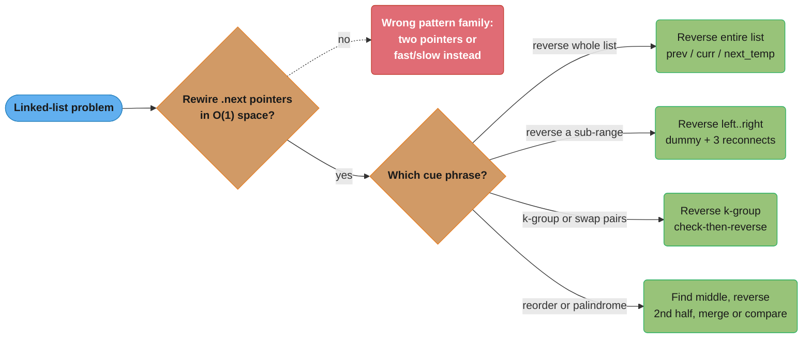
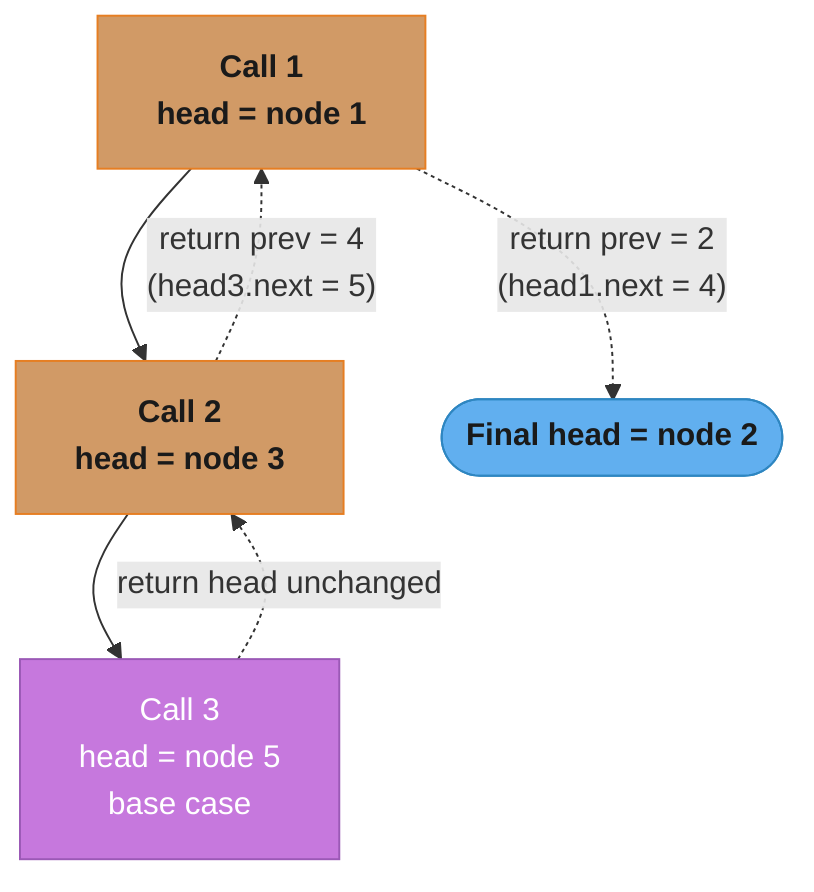

# In-Place Linked List Reversal

## Pattern Snapshot

Reverse (all or part of) a linked list by re-pointing `.next` references using a `prev, curr, next_temp` triple — no extra data structure, O(1) space. **Cue**: "reverse a linked list", "reverse in groups of k", "reorder list", "swap nodes in pairs". **Typical complexity**: O(n) time, O(1) space — the pointer-manipulation alternative to "push everything onto a stack and pop it back" (which is O(n) space).

---

## 1. Recognition Signals

**Reach for in-place reversal when you see:**

- "Reverse a linked list" (whole list, or a sub-range `[left, right]`)
- "Reverse nodes in k-group" — reverse every consecutive group of `k` nodes
- "Reorder list" — `L0 -> L1 -> ... -> Ln` becomes `L0 -> Ln -> L1 -> Ln-1 -> ...` (typically: find middle with [fast_and_slow_pointers.md](fast_and_slow_pointers.md), reverse the second half, merge alternately)
- "Swap nodes in pairs" — k-group reversal with `k=2`
- "Palindrome linked list" — reverse the second half and compare
- Explicit constraint: "**O(1) extra space**" + "linked list" + any operation that *sounds* like it needs random access (which arrays have but linked lists don't)

**Anti-signals — looks like reversal but isn't:**

- "Reverse a string/array" — trivial two-pointer swap ([two_pointers.md](two_pointers.md)), not this pattern (arrays have O(1) random access; no `.next` pointers to rewire)
- "Detect/remove cycle" — that's [fast_and_slow_pointers.md](fast_and_slow_pointers.md); reversal doesn't help detect cycles (in fact, reversing a list with a cycle is generally undefined/dangerous)
- "Merge two sorted lists" — that's the two-sequence variant of [two_pointers.md](two_pointers.md); no reversal needed
- The problem allows **O(n) extra space** and asks for output in a *new* list/array — you could just traverse and build a new list/array in reverse order (push to a stack, pop into a new list) — simpler to write, but doesn't demonstrate the O(1)-space technique an L5 interview usually wants

The defining test: **do you need to change the *direction* of `.next` pointers for some contiguous run of nodes, in O(1) space?** If yes, the `prev/curr/next_temp` triple is the tool.



The recognition test collapses to two questions — does the problem require rewiring `.next` pointers in O(1) space, and which cue phrase names the template — and the four terminal boxes map directly onto the four templates built in Section 3.

---

## 2. Mental Model & Intuition

```
Reversing 1 -> 2 -> 3 -> None

Initial:  prev=None,  curr=1->2->3->None

Step 1:  next_temp = curr.next  (= 2)
         curr.next = prev        (1 -> None)
         prev = curr             (prev = 1)
         curr = next_temp        (curr = 2)

         Now: None <- 1    2 -> 3 -> None
                      prev curr

Step 2:  next_temp = curr.next  (= 3)
         curr.next = prev        (2 -> 1 -> None)
         prev = curr             (prev = 2)
         curr = next_temp        (curr = 3)

         Now: None <- 1 <- 2    3 -> None
                           prev curr

Step 3:  next_temp = curr.next  (= None)
         curr.next = prev        (3 -> 2 -> 1 -> None)
         prev = curr             (prev = 3)
         curr = next_temp        (curr = None)

         Now: None <- 1 <- 2 <- 3
                                 prev   curr=None -> LOOP ENDS

return prev  (= 3, the new head)
```

The invariant maintained at every step: **everything from `prev` backward is fully reversed and correctly linked; `curr` is the next node to process; `next_temp` preserves the link to the rest of the still-forward-pointing list before we overwrite `curr.next`.** Without saving `next_temp` *before* reassigning `curr.next`, you'd lose the reference to the rest of the list — this is the single most common bug in this pattern.

**Stated plainly.** "`prev` is the finished pile, `curr` is the
node in your hand, and `next_temp` is your grip on the rest of the list — you
must grab the rest before you let go of it, or it floats away."

That framing matters because it turns four lines that look interchangeable
into a strict order with a physical reason: you cannot let go of `curr.next`
until `next_temp` is holding it, and you cannot advance `prev` until `curr`
has already been re-pointed at the old `prev`.

| Symbol | What it is |
|--------|------------|
| `prev` | Head of the already-reversed portion. Starts at `None` because the original head must end up pointing at nothing |
| `curr` | The one node being rewired this iteration. The loop ends when it walks off the end (`None`) |
| `next_temp` | A one-line-lifetime backup of `curr.next`, taken before the overwrite destroys it |
| `curr.next = prev` | The actual reversal. Every other line is bookkeeping around this one |
| `->` | A `.next` reference |
| `None` | The end-of-list terminator, and the correct starting value for `prev` |

**Walk one example.** Reversing `1 -> 2 -> 3 -> None`. Each row shows all three
pointers *after* that iteration's four statements have run:

```
  iter   next_temp   curr.next set to   prev   curr   list state so far
  ----   ---------   ----------------   ----   ----   ----------------------------
  init   ---         ---                None   1      None ; 1 -> 2 -> 3 -> None
  1      2           None               1      2      None <- 1 ; 2 -> 3 -> None
  2      3           1                  2      3      None <- 1 <- 2 ; 3 -> None
  3      None        2                  3      None   None <- 1 <- 2 <- 3
  ----   ---------   ----------------   ----   ----   ----------------------------
  loop ends (curr is None); return prev = node 3, the new head
```

Read the `prev` column top to bottom and it walks 1, 2, 3 — it is always one
node behind `curr`, one step late by exactly one iteration. Read the `curr`
column and it walks the original list in original order, unaffected by the
rewiring, precisely because `next_temp` captured each link before it was
overwritten.

**Why this works.** The loop never needs to see more than two adjacent nodes at
once. Reversing a list is nothing more than reversing every individual link,
and a single link only involves a node and its predecessor — which is exactly
what `curr` and `prev` are. There is no need to know the list's length, to
reach the end first, or to hold any node other than these three, which is what
makes the whole thing O(1) space. The `next_temp` variable exists solely
because `curr.next` is simultaneously "the link I am about to destroy" and
"the only route to the remaining nodes"; one temporary variable separates
those two roles, and that separation is the entire pattern.

```
Reversing a SUB-RANGE [left, right] (e.g., reverse positions 2-4 of a 5-node list)

  dummy -> 1 -> 2 -> 3 -> 4 -> 5 -> None
  (left=2, right=4)

  Step A: advance to the node BEFORE position `left` -> call it `before` (=node 1)
  Step B: reverse nodes 2,3,4 using the standard triple, starting curr=node2

  After reversing 2->3->4 in isolation: 4 -> 3 -> 2 (and node 2's .next is
  whatever it was left pointing to during the loop -- need to fix this)

  Step C: reconnect:
    before.next.next = ... (the ORIGINAL node 2, now the TAIL of the
    reversed segment) .next = node 5 (the part after `right`)
    before.next = node 4 (the new HEAD of the reversed segment)

  Result: dummy -> 1 -> 4 -> 3 -> 2 -> 5 -> None
```

---

## 3. The Template

### Reverse entire list (iterative)

```python
class ListNode:
    def __init__(self, val=0, next=None):
        self.val = val
        self.next = next

def reverse_list(head: ListNode | None) -> ListNode | None:
    prev = None
    curr = head

    while curr:
        next_temp = curr.next   # save before overwriting
        curr.next = prev        # reverse the pointer
        prev = curr             # advance prev
        curr = next_temp        # advance curr

    return prev  # new head
```

### Reverse entire list (recursive — for contrast; O(n) call stack space)

```python
def reverse_list_recursive(head: ListNode | None) -> ListNode | None:
    if head is None or head.next is None:
        return head

    new_head = reverse_list_recursive(head.next)
    head.next.next = head   # make the next node point back to current
    head.next = None        # break the old forward link
    return new_head
```

### Reverse a sub-range [left, right] (1-indexed)

```python
def reverse_between(head: ListNode | None, left: int, right: int) -> ListNode | None:
    dummy = ListNode(0, head)
    before = dummy
    for _ in range(left - 1):
        before = before.next            # node just before the sub-range

    curr = before.next                  # first node of the sub-range
    prev = None
    for _ in range(right - left + 1):
        next_temp = curr.next
        curr.next = prev
        prev = curr
        curr = next_temp

    # after the loop: prev = new head of reversed sub-range (was `right`-th node)
    #                  curr = first node AFTER the sub-range
    #                  before.next = OLD head of sub-range (now the TAIL)
    before.next.next = curr             # reconnect tail to the rest
    before.next = prev                  # reconnect before-node to new head

    return dummy.next
```

### Reverse in groups of k

```python
def reverse_k_group(head: ListNode | None, k: int) -> ListNode | None:
    # Check if there are at least k nodes remaining
    node = head
    for _ in range(k):
        if not node:
            return head    # fewer than k nodes left -- leave as-is
        node = node.next

    # Reverse the first k nodes
    prev = None
    curr = head
    for _ in range(k):
        next_temp = curr.next
        curr.next = prev
        prev = curr
        curr = next_temp

    # `head` is now the TAIL of this reversed group; recursively
    # process the rest and attach
    head.next = reverse_k_group(curr, k)

    return prev   # new head of this group
```

---

## 4. Annotated Walkthrough

**Problem**: [Reverse Nodes in k-Group (LC 25)](https://leetcode.com/problems/reverse-nodes-in-k-group/) — given a linked list, reverse the nodes `k` at a time and return the modified list. If the number of nodes is not a multiple of `k`, the leftover nodes at the end remain as-is.

**Brute force**: extract all values into an array, reverse sub-arrays of size `k`, build a new linked list — O(n) time but O(n) **extra** space.

**Key insight**: this is the "reverse entire list" template applied repeatedly to consecutive groups of `k` nodes, with the critical addition that **the original head of each group becomes the tail**, and its `.next` must be reconnected to the (recursively processed) rest of the list.

**Trace on `head = 1 -> 2 -> 3 -> 4 -> 5`, `k = 2`**

```
Call 1: reverse_k_group(node1, 2)
  Check: are there >= 2 nodes from node1? 1->2 yes (node = node3 after check)
  Reverse first 2 nodes (1, 2):
    prev=None, curr=1
    iter1: next_temp=2, 1.next=None, prev=1, curr=2
    iter2: next_temp=3, 2.next=1,    prev=2, curr=3
    -- after loop: prev=2 (new head of this group), curr=3, head=1 (now tail)
  head.next = reverse_k_group(node3, 2)   <- recursive call for nodes 3,4,5
  return prev (=2)

Call 2: reverse_k_group(node3, 2)
  Check: are there >= 2 nodes from node3? 3->4 yes (node=node5 after check)
  Reverse first 2 nodes (3, 4):
    prev=None, curr=3
    iter1: next_temp=4, 3.next=None, prev=3, curr=4
    iter2: next_temp=5, 4.next=3,    prev=4, curr=5
    -- after loop: prev=4, curr=5, head=3 (now tail)
  head.next = reverse_k_group(node5, 2)   <- recursive call for node 5

Call 3: reverse_k_group(node5, 2)
  Check: are there >= 2 nodes from node5? Only node5 -> node=None after 1 step,
  loop checks "if not node: return head" -> returns node5 unchanged (head=5)

Back in Call 2: head(=3).next = 5   -> so: 4 -> 3 -> 5
  return prev (=4)

Back in Call 1: head(=1).next = 4  -> so: 2 -> 1 -> 4 -> 3 -> 5
  return prev (=2)

Final list: 2 -> 1 -> 4 -> 3 -> 5
```

This matches the expected output: groups `[1,2]` and `[3,4]` are each reversed, and the leftover `[5]` (fewer than `k=2` nodes) remains unchanged.



The same trace from a bird's-eye view: three calls descend one k-group at a time (solid), then three returns climb back up performing the `head.next = result` reconnection at each level (dotted) — this call/return shape is exactly why the original head of each group ends up as its tail.

---

## 5. Complexity

| Variant | Time | Space |
|---|---|---|
| Reverse entire list (iterative) | O(n) | O(1) |
| Reverse entire list (recursive) | O(n) | O(n) call stack |
| Reverse sub-range [left, right] | O(n) | O(1) |
| Reverse in k-groups (iterative with helper) | O(n) | O(1) |
| Reverse in k-groups (recursive, as shown) | O(n) | O(n/k) call stack |

The iterative `prev/curr/next_temp` approach is the O(1)-space "expected" answer. The recursive formulations are easier to read but trade O(1) space for O(n) (or O(n/k)) call-stack space — worth mentioning explicitly if asked about space complexity.

---

## 6. Variations & Sub-patterns

- **Reverse entire list** — the base template ([Reverse Linked List (LC 206)](https://leetcode.com/problems/reverse-linked-list/))
- **Reverse sub-range [left, right]** — single pass with careful reconnection of 3 boundary pointers ([Reverse Linked List II (LC 92)](https://leetcode.com/problems/reverse-linked-list-ii/))
- **Reverse in k-groups** — repeated application with a "check first" step to handle leftover nodes ([Reverse Nodes in k-Group (LC 25)](https://leetcode.com/problems/reverse-nodes-in-k-group/))
- **Swap pairs** — k-group reversal with `k=2`, often asked as its own simpler problem ([Swap Nodes in Pairs (LC 24)](https://leetcode.com/problems/swap-nodes-in-pairs/))
- **Palindrome check** — find middle ([fast_and_slow_pointers.md](fast_and_slow_pointers.md)), reverse the second half, compare with the first half ([Palindrome Linked List (LC 234)](https://leetcode.com/problems/palindrome-linked-list/))
- **Reorder list** — find middle, reverse second half, merge the two halves alternately ([Reorder List (LC 143)](https://leetcode.com/problems/reorder-list/))
- **Add two numbers represented as linked lists (reversed digit order)** — not reversal per se, but often combined when the input is in *forward* digit order and needs reversing first ([Add Two Numbers II (LC 445)](https://leetcode.com/problems/add-two-numbers-ii/))
- **Rotate list** — find new tail/head via modular arithmetic, then "reconnect" (a relinking variant, not a true reversal, but in the same "rewire pointers in O(1) space" family) ([Rotate List (LC 61)](https://leetcode.com/problems/rotate-list/))

---

## 7. Problem Bank

| Problem | Difficulty | Variation | Recognition cue / twist |
|---|---|---|---|
| [Reverse Linked List (LC 206)](https://leetcode.com/problems/reverse-linked-list/) | Easy | Base template | Both iterative (`prev,curr,nxt`) and recursive expected |
| [Merge Two Sorted Lists (LC 21)](https://leetcode.com/problems/merge-two-sorted-lists/) | Easy | Related — pointer relinking | No reversal, but the same O(1)-space pointer surgery |
| [Palindrome Linked List (LC 234)](https://leetcode.com/problems/palindrome-linked-list/) | Easy | Middle + reverse 2nd half + compare | Combine with fast/slow pointers |
| [Swap Nodes in Pairs (LC 24)](https://leetcode.com/problems/swap-nodes-in-pairs/) | Medium | k-group with k=2 | Watch dummy-head edge cases |
| [Reverse Linked List II (LC 92)](https://leetcode.com/problems/reverse-linked-list-ii/) | Medium | Sub-range reversal | 3 reconnection pointers: before, new-head, new-tail |
| [Odd Even Linked List (LC 328)](https://leetcode.com/problems/odd-even-linked-list/) | Medium | Relink into two chains | Build odd and even chains, then join — no node copy |
| [Partition List (LC 86)](https://leetcode.com/problems/partition-list/) | Medium | Split by predicate, relink | Two dummy heads (`< x` and `>= x`), stitch together |
| [Remove Nth Node From End of List (LC 19)](https://leetcode.com/problems/remove-nth-node-from-end-of-list/) | Medium | Fixed-gap two pointers + relink | Dummy head handles removing the actual head |
| [Rotate List (LC 61)](https://leetcode.com/problems/rotate-list/) | Medium | Relinking (not reversal) | `k %= length`; close into a ring, cut at new tail |
| [Reorder List (LC 143)](https://leetcode.com/problems/reorder-list/) | Medium | Middle + reverse + merge | Three combined sub-routines |
| [Add Two Numbers II (LC 445)](https://leetcode.com/problems/add-two-numbers-ii/) | Medium | Reverse as a sub-step | Forward digit order; reverse to add from least-significant digit (or use stacks) |
| [Maximum Twin Sum of a Linked List (LC 2130)](https://leetcode.com/problems/maximum-twin-sum-of-a-linked-list/) | Medium | Middle + reverse + pair | Fast/slow to mid, reverse 2nd half, pair-sum across |
| [Split Linked List in Parts (LC 725)](https://leetcode.com/problems/split-linked-list-in-parts/) | Medium | Relink into k parts | Count length, cut into `k` near-equal segments |
| [Reverse Nodes in Even Length Groups (LC 2074)](https://leetcode.com/problems/reverse-nodes-in-even-length-groups/) | Medium | Reverse only even-length groups | Group sizes 1,2,3,...; reverse a group iff its actual length is even |
| [Reverse Nodes in k-Group (LC 25)](https://leetcode.com/problems/reverse-nodes-in-k-group/) | Hard | Repeated reversal + recursion | "Check k nodes exist" guard before reversing |

---

## 8. Common Mistakes (BROKEN -> FIX)

**Mistake: overwriting `curr.next` BEFORE saving it, permanently losing the rest of the list.**

```python
# BROKEN — curr.next is overwritten to point to `prev` BEFORE the
# original curr.next (the rest of the list) is saved anywhere.
# After the first iteration, the reference to nodes 2,3,4,... is GONE.
def reverse_list_broken(head):
    prev = None
    curr = head
    while curr:
        curr.next = prev        # BUG: overwrites .next before saving it
        prev = curr
        curr = curr.next        # this now reads the JUST-OVERWRITTEN value (= prev)!
    return prev
```

```python
# FIXED — save curr.next into next_temp BEFORE reassigning curr.next.
def reverse_list_fixed(head):
    prev = None
    curr = head
    while curr:
        next_temp = curr.next   # FIX: save the link to the rest of the list FIRST
        curr.next = prev
        prev = curr
        curr = next_temp
    return prev
```

**Trigger**: `head = 1 -> 2 -> 3`. Broken trace: `prev=None, curr=1`. `curr.next = prev` → node 1 now points to `None` (we just lost the link to node 2!). `prev = curr` → `prev=1`. `curr = curr.next` → `curr = curr.next` reads node 1's `.next`, which we *just set to `None`* → `curr = None`. Loop ends immediately. `return prev` → returns node `1`, which now points to `None` — the entire rest of the list (`2 -> 3`) is lost, never visited, and garbage (in languages without GC, this would be a memory leak; in Python, it's just silently dropped). The fixed version captures `next_temp = curr.next` (= node 2) *before* `curr.next` is overwritten, preserving the traversal path.

---

## 9. Related Patterns & When to Switch

- **[Fast & Slow Pointers](fast_and_slow_pointers.md)** — almost always the *first* sub-routine in "palindrome linked list" and "reorder list" — find the middle, THEN reverse the second half. These two patterns are frequently composed.
- **[Two Pointers](two_pointers.md)** — array reversal is a trivial two-pointer swap (`arr[i], arr[j] = arr[j], arr[i]`); linked-list reversal needs the `prev/curr/next_temp` triple specifically because there's no random access — don't confuse the two even though both achieve "reversal".
- **Recursion** ([recursion_and_problem_solving_patterns](../recursion_and_problem_solving_patterns/)) — every iterative reversal has a recursive formulation; understanding the recursive version (`reverse_list_recursive`) builds intuition for *why* `head.next.next = head` is the key relinking step, even if you'd write the iterative version in an actual interview for O(1) space.

---

## 10. Cross-links

- Concept module: [linked_lists_stacks_and_queues](../linked_lists_stacks_and_queues/) — linked list node structure, dummy heads, sentinel patterns
- [recursion_and_problem_solving_patterns](../recursion_and_problem_solving_patterns/) — recursive reversal as a recursion-mechanics example
- Applied: [`../../java/collections_internals/README.md`](../../java/collections_internals/README.md) — why `LinkedList` is rarely used in practice (cache-unfriendly), but the pointer-manipulation skills transfer to tree/graph node manipulation
- Master index: [dsa_patterns/README.md](README.md)

---

## 11. Interview Q&A

**Q: Why is the order of operations in the reversal loop critical — what happens if you swap the order of `curr.next = prev` and `prev = curr`?**
The order must be: (1) save `next_temp = curr.next`, (2) `curr.next = prev`, (3) `prev = curr`, (4) `curr = next_temp`. If you did `prev = curr` *before* `curr.next = prev`, then `curr.next = prev` would set `curr.next = curr` (self-loop!) since `prev` and `curr` are now the same reference — corrupting the list with a cycle. The save-then-rewire-then-advance order is what prevents this.

**Q: What's the key relinking step in the recursive reversal, and why is `head.next = None` necessary?**
The key step is `head.next.next = head` — this makes the node *after* `head` point back to `head`, effectively reversing that one link. `head.next = None` is necessary because, before this line, `head.next` still points *forward* to the node that now points back to `head` — without breaking this forward link, you'd have a 2-cycle (`head <-> head.next`). Setting `head.next = None` makes `head` correctly become the new *tail* of the reversed list (every node's `.next` should point toward the new head, except the new tail, whose `.next` is `None`).

**Q: In "Reverse Linked List II" (reverse a sub-range), why do you need a `dummy` node, and what are the three pointers you must reconnect?**
A `dummy` node handles the edge case where `left == 1` (the sub-range includes the original head) — without it, there's no "node before the sub-range" to update. The three reconnections after reversing the sub-range `[left, right]`: (1) `before.next = new_head_of_reversed_segment` (was the `right`-th node), (2) `original_head_of_segment.next = curr` (the now-tail of the reversed segment connects to whatever comes after `right`), and (3) implicitly, `before` itself doesn't move — it's the anchor point for reconnection 1.

**Q: In "Reverse Nodes in k-Group," why do you need to "check if k nodes exist" before reversing?**
The problem states leftover nodes (fewer than `k`) at the end should remain in their original order, NOT be reversed. If you reversed them and then had no way to "un-reverse" (or if the recursive call structure doesn't allow easy rollback), you'd produce an incorrect result. By checking *before* reversing (traverse `k` nodes first; if you run out, return `head` unchanged), you avoid ever reversing a partial group.

**Q: How would you reverse a linked list using a stack (O(n) space) instead of the pointer-rewiring approach — and why might you mention this in an interview even if you implement the O(1) version?**
Push every node (or value) onto a stack while traversing, then pop to build the reversed list (or overwrite values in place in reverse order). This is O(n) space but conceptually simpler and less error-prone. Mentioning it shows you understand the *space-time tradeoff explicitly* — you're choosing the O(1)-space pointer-rewiring approach deliberately, not because it's the only option, which is the kind of articulation L5 interviewers look for.

**Q: For "Reorder List" (`L0->L1->...->Ln` becomes `L0->Ln->L1->Ln-1->...`), what are the three sub-routines and in what order are they applied?**
(1) **Find the middle** using fast/slow pointers — splits the list into two halves. (2) **Reverse the second half** using the standard `prev/curr/next_temp` triple. (3) **Merge the two halves alternately** — a two-pointer "zip" that interleaves nodes from the first half and the (now-reversed) second half. Each sub-routine is O(n)/O(1), and they compose to O(n) time, O(1) space overall — a great example of pattern composition (see the Pattern Interaction Map in [dsa_patterns/README.md](README.md) §8).

**Q: Is recursive linked-list reversal ever preferable to iterative, despite the O(n) space cost?**
In an interview, rarely — O(1) space is almost always preferred when achievable, and the iterative version isn't meaningfully harder to write once memorized. However, recursive reversal can be clearer when reversal is *combined* with other recursive logic already operating on the list (e.g., some tree-to-linked-list conversion algorithms), where the call stack is "already there" for other reasons and adding reversal logic to it avoids a second pass.

**Q: How do you reverse "alternating k-groups" (reverse the 1st group of k, skip the 2nd group of k, reverse the 3rd, ...)?**
Extend the k-group template: after reversing a group of `k` nodes (using the standard triple), instead of recursing immediately on the next group with another reversal, advance `k` nodes WITHOUT reversing (just traverse), then recurse with reversal again. The "skip" phase still needs to correctly track and return the tail of the skipped segment so it can be attached to the previous reversed group's tail (`head.next = <result of recursive call>` still applies, just the recursive call alternates between "reverse" and "skip" modes).

**Q: What's the time complexity of `reverse_k_group`, and does the recursion affect it?**
Time is O(n) regardless — each node is visited a constant number of times (once during the "check k nodes exist" pass, once during the reversal pass). The recursion doesn't add asymptotic time complexity; it's O(n/k) recursive calls, each doing O(k) work, totaling O(n). Space, however, IS affected: O(n/k) call-stack frames for the recursive version, vs O(1) for a fully iterative version (which would use an explicit loop over groups instead of recursive calls).

**Q: Why is "the array equivalent of this problem is trivial" an important framing to bring up?**
It demonstrates you understand *why* the pattern exists: arrays support O(1) random access and in-place index swaps (`arr[i], arr[j] = arr[j], arr[i]`), so "reverse" or "reverse a sub-range" is a simple two-pointer swap — no special pattern needed. Linked lists have NO random access — you can only move forward via `.next` — so "reversing" requires actually *rewiring the pointers themselves*, which is a fundamentally different (and more error-prone) operation. Recognizing this distinction signals you're not just pattern-matching syntax, but understanding the underlying data structure constraints.

**Q: Can this pattern be applied to doubly-linked lists? What changes?**
Yes, and it's *simpler* in one sense (each node already has a `.prev` pointer, so reversal can be done by swapping `.next` and `.prev` for every node) but requires care: you must update BOTH pointers for every node, and the list's `head`/`tail` references must also be swapped. The core "process each node once, rewire its pointers, advance" structure is identical — doubly-linked just means each node has two pointers to rewire instead of one.
