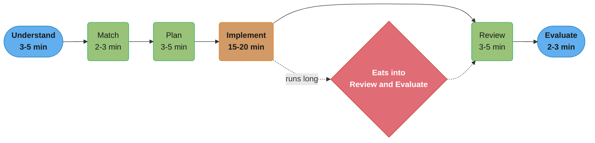
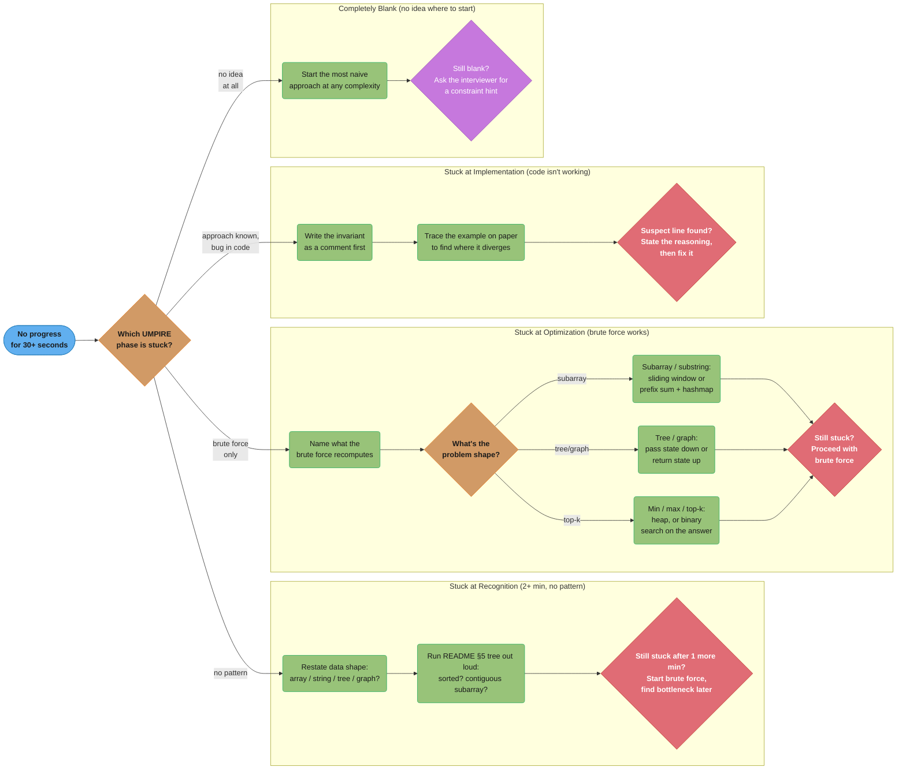
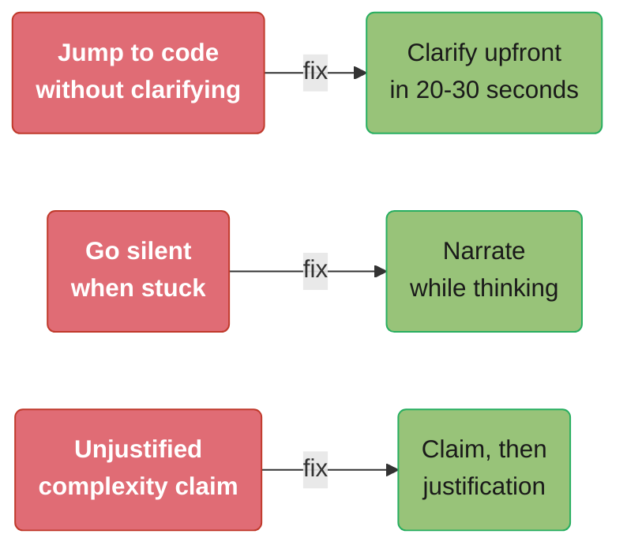
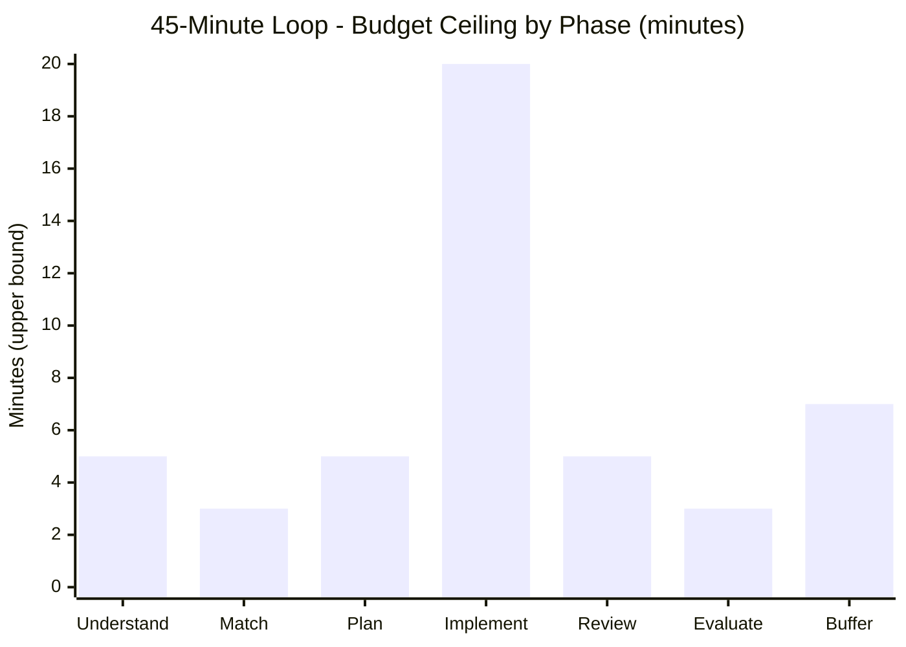
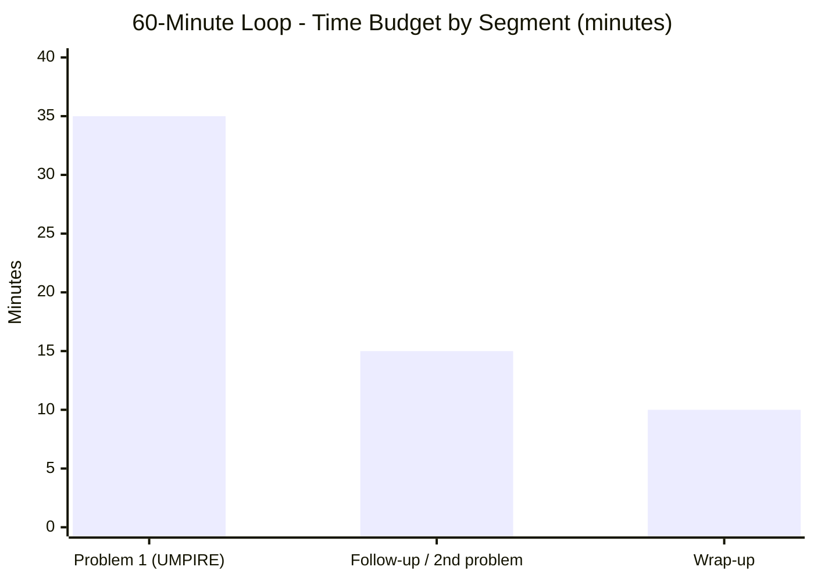

# Interview Execution Playbook

## Purpose & How to Use This Playbook

[dsa_patterns/README.md](README.md) §1 and §9 give you the **compressed**
cheat-sheet: the UMPIRE stages, the 5-minute opening ritual, and a quick
"what to say when stuck" table. This file is the **expanded** version —
read it once, slowly, before your first mock interview, then return to the
README's compressed version for pre-interview review.

This playbook does not teach algorithms. It teaches the **meta-skill that
separates two candidates who solve the same problem with the same
algorithm**: one talks through a clear plan, recovers gracefully from a bug,
and justifies every complexity claim; the other goes quiet, jumps to code,
and says "it should be fast" when asked about Big-O. In a 45-minute loop,
that difference is the entire signal an interviewer has to work with.

**How to use this file:**
1. Read §1 (UMPIRE Deep Dive) and §2 (L5 Signal Rubric) once, fully — this is
   the mental model.
2. Keep §3 (Communication Scripts) and §4 (What to Say When Stuck) open
   during your first 3-5 mock interviews — read from them if you freeze.
3. Read §5 (Mock Transcript) end-to-end at least once — it shows the whole
   loop, including an interviewer follow-up, in real time.
4. Review §6 (Anti-Patterns) after each mock interview — check whether you
   fell into any of these traps.
5. Use §7 (Time Management) to calibrate your pacing on a timer.

---

## 1. UMPIRE — Deep Dive

Each phase below expands on [README §1](README.md#1-the-universal-problem-solving-method--umpire)
with: the **goal**, **what strong execution sounds like**, and the **failure
modes** that cost candidates the most signal.



The six UMPIRE phases run left to right in a single 45-minute loop; Implement
is by far the widest budget (15-20 min) and, per §7's time-management data,
the phase most likely to run long and squeeze Review and Evaluate — which is
exactly why Understand and Match must never be skipped to "save time."

### U — Understand (3-5 min)

**Goal:** leave this phase with a precise, agreed-upon problem statement and
at least 2 concrete examples (1 normal, 1 edge case) written down.

**What strong execution sounds like:**
> "So given an array of integers and a target `k`, I need to return the `k`
> most frequent elements, in any order. Let me confirm a few things: can the
> array be empty? ... Can `k` equal the array's distinct-element count? ...
> Are ties broken arbitrarily, or is there a tiebreak rule? ... Let me write
> down `nums = [1,1,1,2,2,3], k = 2 -> [1,2]` as a normal case, and
> `nums = [1], k = 1 -> [1]` as an edge case."

**Failure modes:**
- **Skipping straight to "I think I know this one"** — even if you recognize
  the problem instantly, restate it and confirm constraints. Interviewers
  sometimes change a constraint specifically to see if you adapt (e.g.,
  "what if `k` can be larger than the number of distinct elements?").
- **Asking questions that don't change your approach** — "is the array
  sorted?" matters if it changes your algorithm; asking it reflexively
  without using the answer signals you're following a script, not thinking.
- **Not writing examples down** — you will need them in the Review phase.
  Writing them now means you don't have to context-switch later.

### M — Match (2-3 min)

**Goal:** name the pattern(s) out loud, name the data structure(s) the
pattern needs, and state a target complexity — **before** writing any code.

**What strong execution sounds like:**
> "This is a 'top K' problem combined with a frequency count, so I'm
> thinking hashmap for counting plus a heap for the top-K selection — that's
> O(n log k). There's also a bucket-sort variant that gets this to O(n) if
> we exploit the fact that frequency is bounded by `n`. Let me start with
> the heap approach since it's more general, and I can mention the bucket
> optimization at the end."

**Failure modes:**
- **Naming a pattern you can't connect to a template** — if you say "this is
  a graph problem" but can't say what the nodes/edges represent, you've
  named a category, not a plan. Push one level deeper: "nodes are X, edges
  are Y, and I need [BFS/DFS/Dijkstra] because Z."
- **Anchoring on the first pattern that "sort of" fits** — if your stated
  complexity doesn't match what `n`'s constraint demands (see
  [README §3](README.md#3-constraints--complexity--pattern-inference)), say
  so out loud and re-match: "Actually, with `n <= 10^5`, O(n^2) won't pass —
  let me reconsider."
- **Silently picking a pattern** — the interviewer cannot grade reasoning
  they cannot hear. Narrate the match, even if it feels obvious to you.

### P — Plan (3-5 min)

**Goal:** describe the algorithm in plain English (or pseudocode for
medium/hard problems) and state the key invariant, BEFORE typing.

**What strong execution sounds like:**
> "Brute force: sort all elements by frequency, descending, take the first
> `k` — that's O(n log n). To improve, I'll use a min-heap of size `k`:
> push `(frequency, value)` pairs, and whenever the heap exceeds size `k`,
> pop the smallest. At the end, the heap holds the `k` most frequent
> elements. The invariant is 'the heap always holds the k largest-frequency
> elements seen so far.'"

**Failure modes:**
- **Skipping the brute force entirely** — even when it's "obviously" not the
  final answer, stating it (a) proves you can solve *something*, (b) gives
  you a fallback if the optimization stalls, and (c) often reveals the
  insight for the optimization itself ("we're re-sorting on every query —
  can we avoid that?").
- **Describing the data structure but not the invariant** — "I'll use a
  heap" is necessary but not sufficient. State WHAT the heap holds and WHY
  that's enough to produce the answer.
- **Over-planning** — for an Easy/Medium problem, 1-2 sentences of plan plus
  the invariant is enough. Spending 5 minutes planning a problem you could
  start coding in 1 minute eats into Implement time.

### I — Implement (15-20 min)

**Goal:** working, readable code — correctness first, micro-optimization
never (during this phase).

**What strong execution sounds like (narration while typing):**
> "I'll start with the frequency map... `count = Counter(nums)`... now the
> heap. I'm using a min-heap so I can efficiently pop the smallest when the
> heap grows past `k`... `heapq.heappush(heap, (freq, num))`... and if
> `len(heap) > k`, pop."

**Failure modes:**
- **Going silent for the entire phase** — a few words every 30-60 seconds
  ("now I'll handle the case where...", "this loop is O(n) because...") keeps
  the interviewer oriented and gives them a chance to redirect you BEFORE you
  finish a wrong approach.
- **Premature micro-optimization** — rewriting a working line three times for
  marginal performance burns time you need for Review. Get it correct, note
  the optimization idea, move on.
- **Variable names like `x`, `tmp`, `a`, `b`** — `left`/`right`, `freq`,
  `seen`, `count` cost zero extra time to type and materially improve how
  readable your in-progress code is to the interviewer (and to you, when
  debugging in Review).

### R — Review (3-5 min)

**Goal:** trace your two examples from U through the actual code, checking
boundaries.

**What strong execution sounds like:**
> "Let me trace `nums = [1,1,1,2,2,3], k=2`. count = {1:3, 2:2, 3:1}. Heap
> starts empty... push (3,1) -> heap=[(3,1)]... push (2,2) ->
> heap=[(2,2),(3,1)]... push (1,3), heap size now 3 > k=2, so pop smallest
> (1,3) -> heap=[(2,2),(3,1)]. Final heap has values 2 and 1 — matches
> expected `[1,2]`. Now the edge case: `nums=[1], k=1`. count={1:1}. push
> (1,1), heap=[(1,1)], size 1 == k, no pop. Returns [1]. Correct."

**Failure modes:**
- **Tracing only the happy path** — the edge case from U exists specifically
  to be traced here. An empty input, a single element, all-equal elements,
  and `k` equal to the array length are the four edge cases interviewers
  check most often.
- **Re-reading the code instead of executing it** — "this looks right" is
  not a trace. Maintain actual variable values on the whiteboard/scratchpad
  as you go, the way the example above does.
- **Finding a bug and panicking** — finding a bug HERE, with 5 minutes left,
  is a GOOD outcome (the alternative is the interviewer finding it, or it
  failing silently). Calmly state the bug, fix it, and re-trace just the
  part affected.

### E — Evaluate (2-3 min)

**Goal:** state time and space complexity with justification, and mention
further optimizations if time permits.

**What strong execution sounds like:**
> "Time is O(n log k): building the frequency map is O(n), and each of the
> `n` heap operations is O(log k) since the heap never exceeds size `k`.
> Space is O(n + k) for the frequency map and heap. If `k` is close to `n`,
> O(n log k) approaches O(n log n) — there's also a bucket-sort approach
> that gets this to O(n) by bucketing elements by frequency, since frequency
> is bounded by `n`. I can implement that if useful."

**Failure modes:**
- **"It's fast" / "O(n) I think"** — every complexity claim needs a one-clause
  justification tied to the code (`"...because the inner loop runs at most
  log k times"`). See §3's Complexity Communication Script for the template.
- **Forgetting space complexity** — time complexity is necessary but not
  sufficient; many L5 loops specifically probe space ("can you do this in
  O(1) extra space?").
- **Stopping at the first complexity without considering whether it's
  optimal** — even a brief "I believe O(n log k) is close to optimal here
  because we fundamentally need to look at every element at least once, and
  selecting top-k from an unsorted collection has an O(n log k)
  lower bound with comparison-based heaps" shows depth, even if you don't
  pursue the bucket-sort follow-up.

---

## 2. The L5 Signal Rubric

Most FAANG-style coding loops (regardless of the specific company) grade
along four signal categories. The table below describes what distinguishes a
**weak** candidate, a **borderline (L4)** candidate, and a **strong (L5)**
candidate on EACH axis — independent of whether the final code is "correct,"
because correctness alone is a pass/fail gate, not the signal that
differentiates levels.

| Signal Category | Weak / No-Hire | Borderline (L4) | Strong (L5) |
|---|---|---|---|
| **Problem Solving** | Jumps to code without restating the problem; recognizes pattern only with heavy hints | Restates problem, recognizes pattern with 1 hint, brute force only | Restates + confirms edge cases unprompted; recognizes pattern AND names why; states brute force AND optimization before coding |
| **Coding** | Syntax errors slow progress; inconsistent naming; logic errors require interviewer to point them out | Working code with minor bugs found by interviewer; reasonable structure | Clean, typed, well-named code; self-identifies and fixes bugs during Review; modular (helper functions where natural) |
| **Communication** | Long silences (>90s); answers questions with single words; doesn't narrate while coding | Responds to direct questions; narrates major steps but goes quiet during details | Continuously narrates reasoning, including uncertainty ("I'm not 100% sure this handles negative numbers — let me check"); proactively flags tradeoffs |
| **Verification & Testing** | Doesn't trace code; says "I think it works" | Traces the happy-path example only when asked | Proactively traces BOTH the normal and edge-case examples; states complexity with justification; suggests further optimization or test cases unprompted |

**The cross-cutting theme:** at every level, the gap between "weak" and
"L5" is rarely the algorithm itself — it's whether the *reasoning* that
produced the algorithm, and the *verification* that it's correct, are made
visible. An interviewer grading silently is an interviewer with no signal,
and "no signal" defaults to "no hire" in calibration — not because the
candidate did anything wrong, but because there's nothing to write down.

---

## 3. Communication Scripts by Phase

These are templates, not scripts to memorize verbatim — adapt the specifics
to your problem, but keep the *structure* (claim, then justification).

### Opening (first 60 seconds)

> "Let me make sure I understand the problem. [Restate in your own words].
> Before I start, I have a couple of clarifying questions: [1-3 questions
> about input range, edge cases, or output format]."

### Announcing the pattern match

> "This looks like a [pattern name] problem because [the specific signal —
> e.g., 'we need the longest contiguous subarray satisfying a sum
> constraint, and all values are positive']. That suggests using
> [data structure], which should get us to O([complexity])."

### Pivoting from brute force to optimized

> "The brute force is O([complexity]) because [reason — e.g., 'we check
> every pair']. The bottleneck is [specific repeated work — e.g.,
> 're-summing the subarray from scratch each time']. If I [maintain a
> running sum / cache previous results / use a different structure], I can
> avoid that and get to O([better complexity])."

### Narrating while implementing

> "Now I'll [[specific step]] — this handles [[case]]. ... I'm using
> [[variable name]] to track [[role]], so that [[invariant]] holds at the
> top of each loop iteration."

### Complexity Communication Script (the canonical form)

> "The time complexity is O(__) because [first operation/loop] is O(__) and
> [second operation/loop] is O(__), and these [add / multiply / are
> dominated by the larger]. The space complexity is O(__) because [data
> structure] holds at most [bound] elements."

Always: **claim, then justification, in that order.** "O(n log n) because we
sort" is a complete sentence; "we sort, so it's slow, like O(n log n) maybe"
is not — it signals uncertainty about WHY, even if the number is right.

### Responding to an interviewer hint

> "That's a good point — let me reconsider. [Repeat the hint back in your own
> words to confirm you understood it]. That changes my approach: [revised
> plan]."

Never ignore a hint, and never respond with silence — both signal you didn't
process it. If the hint contradicts your current approach and you still
believe your approach works, it's fine to say so, but check your reasoning
first: "I think my current approach actually handles that case because
[reason] — let me double check by tracing [example]." Hints are usually
trying to redirect you toward something the interviewer needs to see, not
trying to trick you.

### Wrapping up

> "To summarize: this solution runs in O(__) time and O(__) space. A further
> optimization would be [if applicable]. Are there any edge cases or follow-
> ups you'd like me to address?"

Ending with a question hands control back to the interviewer cleanly and
signals you have time-management awareness.

---

## 4. "What to Say When Stuck" — Expanded

[README §9](README.md#9-interview-execution-quick-reference) gives the
compressed table. Here is the same decision tree with example phrases for
each branch — the goal is to never sit in silence for more than ~30 seconds.



The decision tree never has a "keep thinking silently" branch — every leaf is
a spoken line, which is the entire point (§4's own goal statement: never sit
in silence for more than ~30 seconds).

---

## 5. Mock Interview Transcript — Top K Frequent Elements (LC 347)

This is a full transcript of a strong (L5-level) response to
[Top K Frequent Elements (LC 347)](https://leetcode.com/problems/top-k-frequent-elements/),
showing UMPIRE in real time, including an interviewer follow-up. Timestamps
are approximate for a 45-minute loop.

```
[0:00] INTERVIEWER: "Given an array of integers nums and an integer k,
       return the k most frequent elements. You may return the answer in
       any order."

[0:05] CANDIDATE (Understand): "Let me restate: I need to find the k
       elements that appear most often in nums, and return them in any
       order — so no tiebreak rule needed unless you'd like one. A few
       questions: can nums be empty? Is k always <= the number of distinct
       elements? Can values be negative?"

[0:30] INTERVIEWER: "Assume nums is non-empty, k is always valid (<=
       distinct count), and values can be negative."

[0:40] CANDIDATE: "Got it. Let me write two examples:
         nums = [1,1,1,2,2,3], k = 2  ->  [1, 2]
         nums = [1], k = 1            ->  [1]
       The second is the minimal edge case — single element, k=1."

[1:30] CANDIDATE (Match): "This is a frequency-counting problem combined
       with a 'top-k' selection. So: hashmap to count frequencies, then
       some way to get the k largest by frequency. A heap is the natural
       fit for top-k — specifically a min-heap of size k, which gets us
       O(n log k). There's also a bucket-sort idea, since frequency is
       bounded by n, which could get this to O(n) — I'll mention that at
       the end if we have time."

[2:30] CANDIDATE (Plan): "Brute force: count frequencies (O(n)), then sort
       all distinct elements by frequency descending (O(d log d) where d
       is distinct count, worst case O(n log n)), take the first k. That
       works but does more sorting than necessary when k is small.
       Optimized: build the frequency map, then maintain a min-heap of
       size k of (frequency, value) pairs. For each element, push it; if
       the heap exceeds size k, pop the smallest. At the end, the heap
       holds exactly the k highest-frequency elements. Invariant: after
       processing the first i distinct elements, the heap holds the k
       highest-frequency elements among those i."

[4:00] INTERVIEWER: "Sounds good, go ahead and code it up."

[4:10] CANDIDATE (Implement, narrating while typing):
       "I'll start with the frequency count using Counter."

       from collections import Counter
       import heapq

       def top_k_frequent(nums: list[int], k: int) -> list[int]:
           count = Counter(nums)
           heap: list[tuple[int, int]] = []
           for num, freq in count.items():
               heapq.heappush(heap, (freq, num))
               if len(heap) > k:
                   heapq.heappop(heap)
           return [num for freq, num in heap]

       "I'm pushing (freq, num) tuples — Python's heapq is a min-heap, so
       the smallest frequency is always at the top, which is exactly what
       I want to pop when the heap exceeds size k. At the end, whatever
       remains in the heap is the k highest-frequency elements."

[8:00] CANDIDATE (Review): "Let me trace nums=[1,1,1,2,2,3], k=2.
       count = {1: 3, 2: 2, 3: 1}.
       Iterate: (3,1) -> push -> heap=[(3,1)], size 1, no pop.
                (2,2) -> push -> heap=[(2,2),(3,1)], size 2, no pop.
                (1,3) -> push -> heap has size 3 > k=2, pop smallest =
                         (1,3) -> heap=[(2,2),(3,1)].
       Final: [num for freq,num in heap] = [2, 1]. Order doesn't matter
       per the problem, so this matches [1,2]. Now the edge case:
       nums=[1], k=1. count={1:1}. push (1,1) -> heap=[(1,1)], size 1
       == k, no pop. Returns [1]. Correct."

[10:00] CANDIDATE (Evaluate): "Time complexity is O(n log k): the
        Counter pass is O(n), and we do up to d <= n heap operations,
        each O(log k) since the heap never holds more than k+1 elements
        before a pop. Space is O(n + k) — O(n) for the frequency map in
        the worst case (all distinct), O(k) for the heap."

[11:00] INTERVIEWER: "Nice. Can you do better than O(n log k)?"

[11:05] CANDIDATE: "Yes — since frequency is bounded by n (an element can
        appear at most n times), I can use bucket sort: create n+1
        buckets indexed by frequency, where bucket[f] holds all elements
        with frequency f. Then iterate buckets from n down to 1,
        collecting elements until I have k. This is O(n) total since
        every element and every distinct frequency is visited a constant
        number of times."

        def top_k_frequent_bucket(nums: list[int], k: int) -> list[int]:
            count = Counter(nums)
            buckets: list[list[int]] = [[] for _ in range(len(nums) + 1)]
            for num, freq in count.items():
                buckets[freq].append(num)

            result = []
            for freq in range(len(nums), 0, -1):
                for num in buckets[freq]:
                    result.append(num)
                    if len(result) == k:
                        return result
            return result

        "Trace on the same example: count={1:3,2:2,3:1}. buckets[3]=[1],
        buckets[2]=[2], buckets[1]=[3], rest empty. Iterate freq=6..1:
        freq=3 -> buckets[3]=[1] -> result=[1], len=1 != k=2.
        freq=2 -> buckets[2]=[2] -> result=[1,2], len=2 == k -> return
        [1,2]. Matches expected output."

[14:00] CANDIDATE (Evaluate, again): "This version is O(n) time and
        O(n) space — we trade the O(log k) heap factor for a fixed-size
        array of buckets. Given that k is typically small relative to n,
        the heap approach is also very fast in practice and arguably
        more readable; I'd mention both in a real design discussion, but
        bucket sort is the asymptotically optimal one here."

[15:00] INTERVIEWER: "Great, that's exactly what I was looking for."
```

**What made this strong:** the candidate (1) restated and confirmed
constraints including a non-obvious one (negative values), (2) named TWO
patterns and explained how they combine — the §8 "Pattern Interaction Map"
skill — (3) stated brute force before optimizing, (4) narrated while coding
without long silences, (5) traced BOTH examples concretely with actual
variable values, (6) gave a justified complexity claim, AND (7) had a ready
answer for the "can you do better" follow-up because they'd already
*mentioned* the bucket-sort idea during Match — planting that seed early is
itself a communication technique.

---

## 6. Common Anti-Patterns & How to Recover



A quick-scan map of the three anti-patterns below and their fixes, for the
post-mock review this playbook's "How to use this file" list recommends:
check whether you fell into any of the red boxes, and whether you recovered
with the matching green fix.

### Anti-pattern 1: Jumping to code without clarifying

```
BROKEN:
  INTERVIEWER: "Given an array of integers and a target k, return the
                k most frequent elements."
  CANDIDATE:   [immediately starts typing] "Okay, Counter, then... heap..."
  [2 minutes later, mid-implementation]
  CANDIDATE:   "Wait, can k be larger than the number of distinct
                elements? ... Actually let me think about what happens
                in that case." [pauses, re-derives logic, loses ~3 min]

FIX:
  CANDIDATE:   "Before I start: can k exceed the number of distinct
                elements? ... Good, it can't — that simplifies the heap
                bound. Can values be negative? ... Okay, noted, my
                hashmap-based counting handles that fine regardless."
  [proceeds without having to backtrack]
```
The fix costs 20-30 seconds upfront and saves 2-3 minutes of mid-
implementation backtracking — a net time WIN, not a tax.

### Anti-pattern 2: Going silent when stuck

```
BROKEN:
  CANDIDATE: [stares at the problem for 90 seconds, says nothing]
  INTERVIEWER: [internally notes "no signal — can't tell if they're
                making progress or frozen"]
  CANDIDATE: "Oh — I think I see it now." [proceeds, but the interviewer
              has no idea what changed or what was considered/rejected]

FIX:
  CANDIDATE: "I'm considering whether this is sliding window or two
              pointers — the array isn't sorted, so two pointers in the
              classic sense probably doesn't directly apply... but if I
              sort first, I lose the original indices, which the problem
              needs... let me think about whether I actually need
              indices..." [thinking OUT LOUD — the interviewer can now
              follow the reasoning, redirect if needed, and credit the
              (correct!) elimination of two pointers]
```
Narrating *while* thinking — even uncertain, in-progress thoughts — converts
otherwise-invisible reasoning into gradeable signal.

### Anti-pattern 3: Unjustified complexity claims

```
BROKEN:
  INTERVIEWER: "What's the time complexity?"
  CANDIDATE:   "Um, I think it's like O(n)? Maybe O(n log n) because of
                the heap. It's pretty fast though."

FIX:
  CANDIDATE:   "O(n log k): the Counter pass over nums is O(n), and for
                each of up to n elements we do a heap push/pop bounded
                by size k, so O(log k) each — total O(n log k). Since
                k <= n, this is at most O(n log n) but typically much
                better when k is small."
```
"I think it's like O(n)?" and the justified version may even name the SAME
complexity — but only one demonstrates the candidate understands WHY, which
is what's actually being graded.

---

## 7. Time Management Templates

### Standard 45-Minute Loop (one Medium problem)



Bars use the upper bound of each phase's stated range (3-5, 2-3, 3-5, 15-20,
3-5, 2-3 min) plus the 5-7 min follow-up buffer — Implement dwarfs every other
phase, which is exactly why it is the one most likely to run over.

If Implement runs long (common), it eats into Review/Evaluate first — never
skip Understand or Match, since a wrong pattern wastes the ENTIRE remaining
budget.

### 60-Minute Loop (Medium + follow-up, or Medium + Easy)



Problem 1 alone consumes well over half the loop (~35 of ~60 min); the
follow-up is either a harder variant of the same problem or a second, often
Easy, problem in the remaining ~15 min.

For the follow-up phase, you've already done Understand/Match for the
underlying problem — re-use that context explicitly: "this is the same
setup as before, but now with [new constraint], so my approach changes by
[delta]." Re-deriving from scratch wastes time and signals you didn't
generalize the first solution.

### When You Finish Early

```
Finished with 10+ minutes left?
  -> Proactively offer: "I have some time left — would you like me to
     discuss the bucket-sort optimization, write a few test cases as
     actual code (not just traces), or walk through a follow-up
     variant?"
```
Finishing early and sitting silently wastes a chance to demonstrate MORE
signal — always have a "what's next" in your back pocket (further
optimization, edge-case enumeration, or a related variant from the
pattern's Problem Bank).

---

## 8. Cross-Links

- [dsa_patterns/README.md](README.md) — §1 (UMPIRE compressed), §3
  (constraints->complexity table), §4 (cue->pattern table), §9 (quick
  reference); this playbook is the expanded companion
- [dsa_patterns/study_plans.md](study_plans.md) — once you can execute
  UMPIRE smoothly, use the study plan to drill problems in a structured
  order
- [recursion_and_problem_solving_patterns/](../recursion_and_problem_solving_patterns/README.md)
  §8 "Pattern Selection Guide" — the original seed of the pattern-matching
  skill this playbook assumes
- [case_studies/](../case_studies/README.md) — full single-problem
  walkthroughs that model the depth of explanation expected in §1's Plan
  and Review phases

---

## 9. Interview Q&A

**What if I genuinely don't recognize the pattern within the first 2
minutes?** Say so, and start the brute force. "I don't see an immediate
optimization — let me start with the brute force and look for the
bottleneck as I implement it" is a completely valid statement, and often the
brute force itself reveals the optimization (you'll notice you're
recomputing something). Silence while you privately search for the "right"
pattern produces zero signal; a stated brute force produces a working
baseline AND signal.

**How much should I talk while actively typing code?** Enough that the
interviewer is never unsure what you're doing for more than ~30 seconds.
You don't need to narrate every keystroke — narrate at the level of "now I'm
handling the case where the heap exceeds size k" (one sentence per logical
step), not "now I'm typing h-e-a-p-q-dot-h-e-a-p-p-u-s-h."

**Q: What if the interviewer's hint contradicts my current approach?**
Repeat the hint back in your own words to confirm you understood it, then
re-evaluate: "So you're suggesting [restated hint] — that would mean
[implication for my approach]. Let me reconsider..." If, after
reconsidering, you still believe your approach is correct, it's fine to say
so with a brief justification — but check first, since most hints are
intentional redirections toward something the interviewer needs to observe.

**Q: Is it OK to ask the interviewer to confirm my complexity analysis?**
Yes, briefly — "So that's O(n log k) time, O(n) space — does that match
what you'd expect?" is a good wrap-up question. Don't ask it as "is that
right?" with no analysis attached; ask it AFTER giving your justified
analysis, as a final confirmation/segue, not as a substitute for the
analysis.

**Q: What if I run out of time before finishing the implementation?**
Say where you are and what's left: "I have the frequency-counting and heap
logic done; the remaining step is extracting values from the heap into the
result list — that's a one-line list comprehension: `[num for freq, num in
heap]`." A clearly-described unfinished last step is far better than a
silent unfinished program — it shows you knew exactly what remained.

**How do I handle a follow-up like "what if the input doesn't fit in
memory" or "what if this needs to run on a stream"?** Treat it as a fresh
Match step on the SAME problem: "With a stream, I can't build the full
frequency map upfront. For approximate top-k over a stream, a Count-Min
Sketch combined with a heap is the standard approach — it trades exact
counts for bounded memory." You're not expected to implement a Count-Min
Sketch live, but naming it (and why it solves the new constraint) is a
strong signal. See [hashing_patterns.md](hashing_patterns.md) §6 for related
approximate-counting structures.

**What if my brute force IS the optimal solution — should I still state
it?** State it briefly, then say so explicitly: "The brute force here is
already O(n), which I believe is optimal since we must examine every
element at least once — I don't see a sub-linear approach given we need to
inspect all of `nums`." This shows you considered the question rather than
skipping it because "obviously" no brute force was needed.

**How important is variable naming and code style during a live
interview?** More than it might seem, because it's FREE signal —
`left`/`right` instead of `i`/`j` for two-pointer code, `freq`/`count`
instead of `c`, costs zero extra time and immediately tells the interviewer
(and you, six lines later) what each variable represents. It also reduces
the chance of variable-name collisions and copy-paste bugs.

**Q: What's the right way to test my code at the end, given limited time?**
Hand-trace the 1-2 examples from the Understand phase, maintaining actual
variable values as you go (as in §5's Review step) — this is faster than
writing `assert` statements and demonstrates the same rigor. If significant
time remains (see §7 "When You Finish Early"), THEN write 1-2 actual test
cases as code, especially for edge cases (empty input, single element).

**Q: How do I recover gracefully from a bug found during Review?**
State it calmly and specifically: "I see the issue — on line [X], I'm using
`<` but this should be `<=` to handle the case where [specific scenario from
my edge-case example]. Let me fix that." Then re-trace ONLY the part of the
example affected by the fix, not the whole trace from scratch (unless the
fix changes earlier logic too). Finding your own bug during Review, calmly,
is a POSITIVE signal — it's the testing/verification skill in §2's rubric in
action.

**What if the interviewer seems unimpressed, gives minimal feedback, or
doesn't respond to my narration?** Continue your normal UMPIRE narration
regardless — many interviewers deliberately give neutral/minimal feedback to
avoid biasing the candidate (a "poker face" is often standard practice, not
a signal of how you're doing). Do not change your communication style based
on perceived reactions; consistent narration is what generates signal,
independent of how it's received in the moment.
