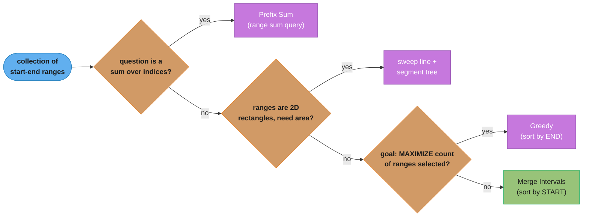

# Merge Intervals

## Pattern Snapshot

Sort intervals by start time, then sweep left to right, merging the current interval with the next one whenever they overlap (`current.end >= next.start`). Almost every "intervals" problem reduces to this single sort-then-sweep idiom. **Cue**: "intervals", "meetings", "merge/insert/overlap", "schedule". **Typical complexity**: O(n log n) — dominated by the sort; the sweep itself is O(n).

---

## 1. Recognition Signals

**Reach for merge intervals when you see:**

- "Merge overlapping intervals"
- "Insert a new interval into a sorted list of non-overlapping intervals"
- "Can a person attend all meetings?" / "minimum number of meeting rooms required"
- "Find the intersection of two lists of intervals"
- "Non-overlapping intervals — minimum number to remove so the rest don't overlap"
- "Employee free time" — find gaps common to everyone's schedule
- Any problem where the input is a list of `[start, end]` pairs and the question is about **overlap, gaps, merging, or counting concurrent ranges**

**Anti-signals — looks like merge intervals but isn't:**

- "Range sum query" — that's [prefix_sum.md](prefix_sum.md); "range" here means a sum over indices, not an interval object to merge
- "Find the k-th interval by some property" — once you've identified overlaps, ranking might need a [heap](top_k_elements.md), but the *overlap detection itself* is still merge-intervals
- The intervals are on a **2D plane** (rectangles) and you need area/union — related but more complex (sweep line + segment tree); the 1D merge-intervals sort-and-sweep is the foundation but not sufficient alone
- "Interval scheduling to MAXIMIZE the number of non-overlapping intervals selected" — this is **[Greedy](greedy.md)** (sort by *end* time, not start time) — a close cousin that uses a different sort key and a different goal (selection, not merging)

The defining test: **do you have a collection of `[start, end]` ranges, and does the answer depend on which ranges overlap, how they combine, or what gaps exist between them?** If the sort key should be **start** time and the goal is to **combine/merge/count overlaps**, it's this pattern. If the sort key should be **end** time and the goal is to **select a maximum subset**, it's greedy interval scheduling.



*Walk the anti-signals in order: only a candidate that clears all three checks lands on sort-by-start-and-merge — everything else routes to a neighboring pattern.*

---

## 2. Mental Model & Intuition

**Merging overlapping intervals** — the sweep keeps one `current` interval and, for each next interval, either merges it in or pushes `current` to the result and starts fresh:

```mermaid
flowchart LR
    classDef io      fill:#61afef,stroke:#2e86c1,color:#1a1a1a,font-weight:bold
    classDef frozen  fill:#c678dd,stroke:#9b59b6,color:#fff
    classDef train   fill:#98c379,stroke:#27ae60,color:#1a1a1a
    classDef mathOp  fill:#d19a66,stroke:#e67e22,color:#1a1a1a,font-weight:bold
    classDef lossN   fill:#e06c75,stroke:#c0392b,color:#fff,font-weight:bold
    classDef req     fill:#56b6c2,stroke:#0097a7,color:#1a1a1a
    classDef base    fill:#e5c07b,stroke:#f39c12,color:#1a1a1a

    sorted(["sorted by start:<br/>(1,3) (2,6) (8,10) (15,18)"]) --> cur0["current = (1,3)"]
    cur0 --> d1{"end 3 ≥ start 2?"}
    d1 -->|"yes: merge"| cur1["current = (1,6)"]
    cur1 --> d2{"end 6 ≥ start 8?"}
    d2 -->|"no"| push1["push (1,6)<br/>current = (8,10)"]
    push1 --> d3{"end 10 ≥ start 15?"}
    d3 -->|"no"| push2["push (8,10)<br/>current = (15,18)"]
    push2 --> final["end of list:<br/>push (15,18)"]
    final --> result(["result:<br/>(1,6) (8,10) (15,18)"])

    class sorted,result io
    class cur0,cur1 train
    class d1,d2,d3 mathOp
    class push1,push2,final base
```



*Each next interval either extends `current` (overlap found — green) or forces a push into `result` and a reset (no overlap — gold), tracing `intervals = [[1,3], [2,6], [8,10], [15,18]]` end to end.*

```
Why sort by START time (for merging)?

  If sorted by start, then for any interval i and the NEXT interval j (j > i
  in sorted order), we know start[j] >= start[i]. The ONLY way [i] and [j]
  can overlap is if end[i] >= start[j] -- a single comparison. Without
  sorting, an overlap could be "hidden" behind intervals processed earlier
  or later, requiring O(n^2) pairwise checks.
```

**Minimum meeting rooms (overlap counting, not merging)** — separate the starts and ends, sort each independently, then sweep both with two pointers:

```mermaid
flowchart LR
    classDef io      fill:#61afef,stroke:#2e86c1,color:#1a1a1a,font-weight:bold
    classDef frozen  fill:#c678dd,stroke:#9b59b6,color:#fff
    classDef train   fill:#98c379,stroke:#27ae60,color:#1a1a1a
    classDef mathOp  fill:#d19a66,stroke:#e67e22,color:#1a1a1a,font-weight:bold
    classDef lossN   fill:#e06c75,stroke:#c0392b,color:#fff,font-weight:bold
    classDef req     fill:#56b6c2,stroke:#0097a7,color:#1a1a1a
    classDef base    fill:#e5c07b,stroke:#f39c12,color:#1a1a1a

    raw(["intervals:<br/>(0,30) (5,10) (15,20)"]) --> split["sort starts and ends<br/>independently"]
    split --> in(["starts: 0, 5, 15<br/>ends: 10, 20, 30"])
    in --> d1{"s=0: start 0<br/>before end 10?"}
    d1 -->|"yes"| r1["new room<br/>rooms = 1"]
    r1 --> d2{"s=1: start 5<br/>before end 10?"}
    d2 -->|"yes"| r2["new room<br/>rooms = 2"]
    r2 --> d3{"s=2: start 15<br/>before end 10?"}
    d3 -->|"no"| r3["room freed<br/>rooms stays 2"]
    r3 --> result(["max concurrent<br/>rooms = 2"])

    class raw,in,result io
    class split,d1,d2,d3 mathOp
    class r1,r2 train
    class r3 base
```



*Each start-before-end comparison either opens a new room (green) or frees one back to the pool (gold); the running `rooms` count peaks at 2, matching `intervals = [[0,30],[5,10],[15,20]]`.*

---

## 3. The Template

### Merge overlapping intervals

```python
def merge_intervals(intervals: list[list[int]]) -> list[list[int]]:
    if not intervals:
        return []

    intervals.sort(key=lambda iv: iv[0])   # sort by START
    result = [intervals[0]]

    for start, end in intervals[1:]:
        last_end = result[-1][1]
        if start <= last_end:               # overlap (or touching)
            result[-1][1] = max(last_end, end)
        else:
            result.append([start, end])

    return result
```

### Insert a new interval into a sorted, non-overlapping list

```python
def insert_interval(intervals: list[list[int]], new_interval: list[int]) -> list[list[int]]:
    result = []
    i, n = 0, len(intervals)
    new_start, new_end = new_interval

    # 1. all intervals ending before new_interval starts -- no overlap, copy as-is
    while i < n and intervals[i][1] < new_start:
        result.append(intervals[i])
        i += 1

    # 2. all intervals overlapping new_interval -- merge them into new_interval
    while i < n and intervals[i][0] <= new_end:
        new_start = min(new_start, intervals[i][0])
        new_end = max(new_end, intervals[i][1])
        i += 1
    result.append([new_start, new_end])

    # 3. remaining intervals -- no overlap, copy as-is
    while i < n:
        result.append(intervals[i])
        i += 1

    return result
```

### Minimum meeting rooms (overlap counting via separate sorted starts/ends)

```python
def min_meeting_rooms(intervals: list[list[int]]) -> int:
    if not intervals:
        return 0

    starts = sorted(iv[0] for iv in intervals)
    ends = sorted(iv[1] for iv in intervals)

    rooms = 0
    max_rooms = 0
    s = e = 0

    while s < len(starts):
        if starts[s] < ends[e]:
            rooms += 1                  # a meeting starts before another ends
            max_rooms = max(max_rooms, rooms)
            s += 1
        else:
            rooms -= 1                  # a meeting ends, freeing a room
            e += 1

    return max_rooms
```

---

## 4. Annotated Walkthrough

**Problem**: [Insert Interval (LC 57)](https://leetcode.com/problems/insert-interval/) — given a sorted, non-overlapping list of intervals and a new interval, insert it and merge if necessary, returning a sorted, non-overlapping result.

**Brute force**: append `new_interval` to the list, sort everything, then run the standard merge — O(n log n). This is *correct* but doesn't exploit the fact that the input was already sorted (could be O(n)).

**Key insight**: because the input is already sorted and non-overlapping, you can process it in a **single linear pass** with three distinct phases: (1) intervals entirely *before* the new one (no overlap — copy directly), (2) intervals that *overlap* the new one (absorb them by expanding `new_start`/`new_end`), (3) intervals entirely *after* (copy directly). This achieves O(n) instead of O(n log n).


*A single linear pass through three phases — no sort needed, since the input is already sorted — is what makes Insert Interval O(n) instead of O(n log n); the trace below walks the exact values.*

**Trace on `intervals = [[1,3],[6,9]]`, `new_interval = [2,5]`**

```
new_start, new_end = 2, 5
i=0, n=2

Phase 1: while intervals[i][1] < new_start:
  intervals[0] = [1,3]. is 3 < 2? NO. -- exit phase 1 immediately, i=0

Phase 2: while intervals[i][0] <= new_end:
  intervals[0] = [1,3]. is 1 <= 5? YES.
    new_start = min(2, 1) = 1
    new_end   = max(5, 3) = 5
    i=1
  intervals[1] = [6,9]. is 6 <= 5? NO. -- exit phase 2, i=1

  result.append([new_start, new_end]) = result.append([1,5])
  result = [[1,5]]

Phase 3: while i < n:
  intervals[1] = [6,9]. result.append([6,9]). i=2
  result = [[1,5], [6,9]]

Final: [[1,5], [6,9]]
```

Expected output for `intervals = [[1,3],[6,9]]`, `new_interval = [2,5]` is `[[1,5],[6,9]]` — matches. The single pass correctly identified that `[1,3]` overlaps `[2,5]` (merging into `[1,5]`), while `[6,9]` does not (`6 > 5`).

---

## 5. Complexity

| Variant | Time | Space |
|---|---|---|
| Merge overlapping intervals | O(n log n) (sort) | O(n) (output; O(log n)-O(n) sort space) |
| Insert interval (already sorted input) | **O(n)** | O(n) (output) |
| Minimum meeting rooms (separate sorted starts/ends) | O(n log n) (two sorts) | O(n) |
| Minimum meeting rooms (heap of end times) | O(n log n) | O(n) (heap) |

The "Insert Interval" O(n) result (no sort needed, since input is pre-sorted) is a common interview "gotcha" — candidates who don't notice the pre-sorted constraint often default to the O(n log n) "append + re-sort + merge" brute force, missing the cleaner linear solution.

### Decoding the complexity claim

**Stated plainly.** "Oh of n log n means: the sort *is* the algorithm's cost, and the merge pass that follows it is free by comparison — so the only optimization worth arguing about is whether you can skip the sort."

That framing matters because it tells you exactly where to push. Shaving constants off the merge scan buys nothing; noticing the input was already sorted removes the dominant term entirely.

| Symbol | What it is |
|---|---|
| `O(...)` | An upper bound on how fast the work grows as the input grows |
| `n` | The input size — how many intervals there are |
| `log n` | Roughly how many times you can halve `n` before reaching 1. For `n = 10,000` it is about 13 |
| `O(n log n)` | The sort: `n` items each participating in about `log n` levels of comparison |
| `O(n)` | The merge scan alone — one look at each interval |
| `O(n^2)` | Comparing every interval against every other, the brute force this replaces |

**Walk one example.** `[[1,3], [2,6], [8,10], [15,18]]`, already sorted by start. The scan keeps only the last merged interval in hand and never looks backward:

```
  input, sorted by start:  [1,3]   [2,6]   [8,10]   [15,18]

  step  interval  last out  test: start <= last_end   action           output so far
  ----  --------  --------  -----------------------   --------------   ---------------------
    1    [1,3]      --      seed the first one        emit [1,3]       [1,3]
    2    [2,6]     [1,3]     2 <= 3   overlap         end = max(3,6)   [1,6]
    3    [8,10]    [1,6]     8 <= 6   no overlap      append           [1,6] [8,10]
    4    [15,18]   [8,10]   15 <= 10  no overlap      append           [1,6] [8,10] [15,18]

  4 intervals in, 4 comparisons, 3 out -- one pass, zero backtracking
```

**Why the sort dominates, quantified.** At LC 56's limit of `n = 10,000`: the sort costs about `n * log2(n) = 10,000 * 13.29 = 132,877` operations, while the merge scan costs `10,000`. The sort is roughly **13 times** the scan, so total work is about `142,877` and is ~93% sort. Against the brute-force "compare every pair" approach at `n^2 / 2 = 50,000,000`, the sort-then-scan approach is about **350 times cheaper**. And for Insert Interval, where the input arrives pre-sorted and the sort disappears, the cost drops from `142,877` to `10,000` — about **14 times faster** for free, purely from reading the constraints.

---

## 6. Variations & Sub-patterns

- **Merge overlapping intervals** — sort by start, sweep and merge ([Merge Intervals (LC 56)](https://leetcode.com/problems/merge-intervals/))
- **Insert interval into sorted list** — three-phase linear scan, O(n) ([Insert Interval (LC 57)](https://leetcode.com/problems/insert-interval/))
- **Meeting rooms (can attend all?)** — sort by start, check `intervals[i][0] < intervals[i-1][1]` ([Meeting Rooms (LC 252)](https://leetcode.com/problems/meeting-rooms/) — premium, but the pattern is foundational)
- **Minimum meeting rooms** — two-pointer over separate sorted starts/ends, OR a min-heap of end times ([Meeting Rooms II (LC 253)](https://leetcode.com/problems/meeting-rooms-ii/))
- **Interval intersection (two lists)** — two-pointer merge of two *already-sorted, non-overlapping-within-each-list* interval lists, computing pairwise overlaps ([Interval List Intersections (LC 986)](https://leetcode.com/problems/interval-list-intersections/))
- **Non-overlapping intervals (minimum removals)** — sort by **end** time, greedily keep intervals that don't conflict — this is the [greedy.md](greedy.md) variant ([Non-overlapping Intervals (LC 435)](https://leetcode.com/problems/non-overlapping-intervals/))
- **Employee free time** — merge all intervals across all employees, then find gaps between consecutive merged intervals ([Employee Free Time (LC 759)](https://leetcode.com/problems/employee-free-time/) — premium)
- **Car pooling / range-add problems** — convert intervals into "+1 at start, -1 at end+1" delta array, then prefix-sum to get concurrent counts at every point ([Car Pooling (LC 1094)](https://leetcode.com/problems/car-pooling/) — combines with [prefix_sum.md](prefix_sum.md))

---

## 7. Problem Bank

| Problem | Difficulty | Variation | Recognition cue / twist |
|---|---|---|---|
| [Meeting Rooms (LC 252)](https://leetcode.com/problems/meeting-rooms/) | Easy | Can attend all? | Sort by start, check `start[i] < end[i-1]` (premium, foundational) |
| [Summary Ranges (LC 228)](https://leetcode.com/problems/summary-ranges/) | Easy | Form intervals from runs | Group consecutive integers into ranges |
| [Merge Intervals (LC 56)](https://leetcode.com/problems/merge-intervals/) | Medium | Base merge | Sort by start, compare with last merged |
| [Insert Interval (LC 57)](https://leetcode.com/problems/insert-interval/) | Medium | Linear insert into sorted list | Three-phase scan, O(n) — input pre-sorted |
| [Interval List Intersections (LC 986)](https://leetcode.com/problems/interval-list-intersections/) | Medium | Two-list merge | Two pointers, one per list; overlap = `[max(lo), min(hi)]` |
| [Non-overlapping Intervals (LC 435)](https://leetcode.com/problems/non-overlapping-intervals/) | Medium | Greedy selection (sort by END) | Maximize kept = minimize removed — see [greedy.md](greedy.md) |
| [Minimum Number of Arrows to Burst Balloons (LC 452)](https://leetcode.com/problems/minimum-number-of-arrows-to-burst-balloons/) | Medium | Greedy, sort by end | Same shape as Non-overlapping Intervals |
| [Meeting Rooms II (LC 253)](https://leetcode.com/problems/meeting-rooms-ii/) | Medium | Min concurrent count | Two-pointer on sorted starts/ends, OR a min-heap of end times |
| [Remove Covered Intervals (LC 1288)](https://leetcode.com/problems/remove-covered-intervals/) | Medium | Sort start asc, end desc | An interval is covered iff its end ≤ the running max end |
| [My Calendar I (LC 729)](https://leetcode.com/problems/my-calendar-i/) | Medium | Online insertion, reject overlap | Maintain sorted list; binary search for the neighbor |
| [Car Pooling (LC 1094)](https://leetcode.com/problems/car-pooling/) | Medium | Delta array + prefix sum | Convert intervals to +/- events — see [prefix_sum.md](prefix_sum.md) |
| [Maximum Number of Events That Can Be Attended (LC 1353)](https://leetcode.com/problems/maximum-number-of-events-that-can-be-attended/) | Medium | Greedy + heap | Sort by start; min-heap of ends — see [two_heaps.md](two_heaps.md) |
| [Employee Free Time (LC 759)](https://leetcode.com/problems/employee-free-time/) | Hard | Merge across lists, find gaps | Flatten + sort + merge + gap-finding |
| [Data Stream as Disjoint Intervals (LC 352)](https://leetcode.com/problems/data-stream-as-disjoint-intervals/) | Hard | Online interval merging | TreeMap / sorted structure; merge neighbors on each insert |
| [Minimum Interval to Include Each Query (LC 1851)](https://leetcode.com/problems/minimum-interval-to-include-each-query/) | Hard | Sort intervals + queries, min-heap | Offline: sweep queries ascending, heap by interval size |

---

## 8. Common Mistakes (BROKEN -> FIX)

**Mistake: forgetting to sort by start time before merging — or using the wrong comparison (`<` instead of `<=`) for "touching" intervals.**

```python
# BROKEN — two issues:
# (1) doesn't sort the input first (assumes it's already sorted)
# (2) uses `start < last_end` (strict), which fails to merge
#     "touching" intervals like [1,3] and [3,5] (they share endpoint 3)
def merge_intervals_broken(intervals: list[list[int]]) -> list[list[int]]:
    if not intervals:
        return []
    result = [intervals[0]]             # BUG: assumes intervals[0] is the
                                          # earliest-starting interval
    for start, end in intervals[1:]:
        last_end = result[-1][1]
        if start < last_end:             # BUG: should be <=
            result[-1][1] = max(last_end, end)
        else:
            result.append([start, end])
    return result
```

```python
# FIXED — sort by start FIRST, and use <= so touching intervals merge.
def merge_intervals_fixed(intervals: list[list[int]]) -> list[list[int]]:
    if not intervals:
        return []
    intervals.sort(key=lambda iv: iv[0])   # FIX: sort by start
    result = [intervals[0]]
    for start, end in intervals[1:]:
        last_end = result[-1][1]
        if start <= last_end:              # FIX: <= merges touching intervals
            result[-1][1] = max(last_end, end)
        else:
            result.append([start, end])
    return result
```

**Trigger 1 (sort)**: `intervals = [[3,5],[1,2]]`. Without sorting, the broken version starts with `result = [[3,5]]`, then processes `[1,2]`: `1 < 5` is True → merges into `[3, max(5,2)] = [3,5]`, **incorrectly discarding the interval `[1,2]`'s start of 1** — the result `[[3,5]]` is wrong; the correct merged result is `[[1,2],[3,5]]` (they don't actually overlap once sorted: `[1,2]` then `[3,5]`, and `2 < 3` so no merge).

**Trigger 2 (`<` vs `<=`)**: `intervals = [[1,3],[3,5]]` (already sorted). With `<` (strict): `start=3 < last_end=3`? `3 < 3` is `False` → does NOT merge → result = `[[1,3],[3,5]]`. But these intervals **share the point 3** and most interval-merging definitions consider `[1,3]` and `[3,5]` as overlapping/adjacent and mergeable into `[1,5]`. Whether `<=` or `<` is "correct" depends on the problem's definition of "overlap" — **always clarify with the interviewer whether touching endpoints count as overlapping**.

---

## 9. Related Patterns & When to Switch

- **[Greedy](greedy.md)** — "maximize the number of non-overlapping intervals you can select" sorts by **end** time and greedily picks the earliest-ending compatible interval — a different sort key and a different goal (selection vs. merging) than this pattern, but operates on the same data shape.
- **[Two Pointers](two_pointers.md)** — "Interval List Intersections" is structurally a two-pointer merge over two separate sorted interval lists.
- **[Prefix Sum](prefix_sum.md)** — "Car Pooling" and similar "range update, point query" problems convert intervals into a delta array (`+1` at start, `-1` at `end+1`), then use prefix sums to get the value at each point — a different but related technique for counting overlaps at *every* point rather than just the *maximum* concurrency.
- **[Top-K Elements](top_k_elements.md)** — "Minimum Meeting Rooms" can alternatively be solved with a min-heap of end times: iterate sorted-by-start intervals, and if the earliest-ending room (heap top) is free (`heap[0] <= current.start`), reuse it (pop); otherwise allocate a new room (push). This is a heap-based variant of the same overlap-counting idea.

---

## 10. Cross-links

- Concept module: [sorting_and_searching](../sorting_and_searching/) — sort-then-sweep is the foundational technique; comparator/key functions
- [arrays_strings_and_hashing](../arrays_strings_and_hashing/) — list/array manipulation basics
- Applied: [`../../devops/kubernetes_scheduling_and_autoscaling/README.md`](../../devops/kubernetes_scheduling_and_autoscaling/README.md) — resource scheduling and bin-packing share the "overlap/conflict detection" mental model with meeting-room problems
- Master index: [dsa_patterns/README.md](README.md)

---

## 11. Interview Q&A

**Q: Why must intervals be sorted by START time (not end time) for the merge operation?**
Once sorted by start, you only need to compare each interval against the **most recently merged** interval — if `current.end >= next.start`, they overlap (because `next.start >= current.start` is guaranteed by the sort, so the only question is whether `next` starts before `current` ends). Without this ordering, an interval processed later could overlap with one processed much earlier, requiring you to re-check all previously merged intervals — breaking the single-pass O(n) sweep.

**Q: What's the difference in sort key between "Merge Intervals" and "Non-overlapping Intervals" (LC 435)?**
"Merge Intervals" sorts by **start** time — you're combining overlapping ranges into larger ranges. "Non-overlapping Intervals" (a greedy problem) sorts by **end** time — you're *selecting* a maximum-size subset of mutually non-overlapping intervals, and greedily picking the interval that ends earliest leaves the most room for future selections (an exchange-argument proof). Same data shape, different sort key, different algorithm family.

**Q: How do you decide whether overlapping should use `<` or `<=` when comparing `current.end` and `next.start`?**
This depends on whether intervals are treated as **closed** (`[1,3]` includes the point 3) or **half-open** (`[1,3)` excludes 3). If closed, `[1,3]` and `[3,5]` share the point 3 and are typically considered overlapping/mergeable → use `<=`. If half-open, they don't share any point → use `<`. Real-world calendar systems usually treat meeting times as half-open (`[start, end)`) so a meeting ending at 3:00 and one starting at 3:00 don't conflict — but always clarify the problem's convention rather than assuming.

**Q: For "Insert Interval," why is the three-phase approach O(n) while "append and re-sort" is O(n log n) — and when would the O(n log n) approach still be acceptable?**
The three-phase approach exploits the precondition that the input is *already sorted and non-overlapping* — a single linear scan suffices. "Append and re-sort" treats the input as arbitrary, paying O(n log n) for the sort. The O(n log n) approach is acceptable if (a) the interviewer doesn't emphasize the pre-sorted constraint, (b) `n` is small enough that the constant-factor difference doesn't matter, or (c) code simplicity is prioritized over asymptotic optimality — but you should *mention* the O(n) alternative to demonstrate you noticed the precondition.

**Q: How does the "minimum meeting rooms" two-pointer (separate sorted starts/ends) approach work, intuitively?**
Think of it as a timeline sweep: sort all start times and all end times independently. Walk through time using two pointers — whenever the next event is a "start" that occurs *before* the next "end", a new room is needed (increment `rooms`, track the max). Whenever the next event is an "end" (or a start that's not before the next end), a room frees up (decrement `rooms`, advance the end pointer). The maximum value `rooms` reaches during this sweep is the answer — it represents the peak concurrent meeting count.

**Q: What's the heap-based alternative for "minimum meeting rooms," and when might you prefer it?**
Sort intervals by start time. Maintain a min-heap of "end times of currently occupied rooms." For each interval, if the heap's minimum end time is `<= current.start` (the earliest-freeing room is free by now), pop it (reuse that room) and push the new end time; otherwise, push the new end time without popping (allocate a new room). The heap's final size is the answer. This is more intuitive for some people (it directly models "rooms" as heap entries) and generalizes more easily if rooms have different *types* or *costs* (you could use a priority based on room cost, not just end time).

**Q: How would "Employee Free Time" combine merge-intervals with another technique?**
Flatten all employees' intervals into a single list, sort by start time, and run the standard merge to get the **union** of all busy times. Then, the "free time" is the **gaps between consecutive merged intervals** — for each pair of adjacent merged intervals `(a, b)`, if `a.end < b.start`, then `[a.end, b.start]` is a free-time slot common to everyone. This is "merge intervals" followed by a "find gaps" post-processing pass.

**Q: What's the "delta array" / "difference array" technique used in "Car Pooling," and how does it relate to prefix sums?**
For each interval `[start, end, capacity_change]`, record `+capacity_change` at index `start` and `-capacity_change` at index `end` in a delta array. Then compute the prefix sum of this delta array — `prefix_sum[i]` gives the "net effect" (e.g., number of passengers) at point `i`. This converts "does any point exceed capacity across all intervals" into a single O(n + range) prefix-sum computation, avoiding O(n^2) pairwise overlap checks. It's a direct application of [prefix_sum.md](prefix_sum.md) to interval data.

**Q: Can "Merge Intervals" be done without sorting, e.g., using a Union-Find structure?**
In principle, you could model overlapping intervals as a graph (edge between intervals `i` and `j` if they overlap) and use [union_find.md](union_find.md) to find connected components, then merge each component. But determining *which* intervals overlap without sorting still requires O(n^2) pairwise checks (or a sweep-line, which itself requires sorting events) — so sorting is effectively unavoidable for an efficient solution. Union-Find doesn't eliminate the need to sort; it would only be useful if "overlap" relationships were given to you directly (e.g., as a graph), which is not the typical problem framing.

**Q: How do you handle intervals with the SAME start time during sorting — does tie-breaking matter?**
For pure "merge overlapping intervals," tie-breaking on `start` doesn't matter — if two intervals have the same start, whichever is processed first becomes `result[-1]`, and the other will have `start <= result[-1][1]` trivially (since `start == result[-1][0] <= result[-1][1]` assuming valid intervals where `start <= end`), so it merges correctly regardless of order. For "Non-overlapping Intervals" (sorted by *end* time) or other greedy variants, tie-breaking CAN matter and should be considered based on the specific problem's goal — e.g., "Minimum Arrows to Burst Balloons" sorts by end time and ties don't affect correctness, but always verify with a small example.

**Q: What's the time complexity if you need to repeatedly insert intervals one at a time (online), maintaining a merged, sorted state — like "My Calendar I"?**
Each insertion requires finding the correct position (binary search on starts, O(log n)) and checking for overlap with neighbors (O(1)), but inserting into a Python `list` is O(n) due to shifting elements. For `n` insertions, this is O(n^2) total. To do better, a balanced BST or skip-list-backed sorted container (e.g., `sortedcontainers.SortedList` in Python) gives O(log n) insertion, for O(n log n) total — relevant if asked about "online" / "streaming" variants of interval problems.
