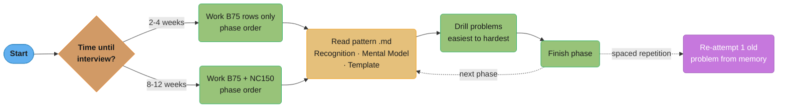

# Study Plans — Blind 75 & NeetCode 150

## Purpose & How to Use This Guide

The 25 pattern files in this section each have their own §7 Problem Bank —
but those banks are organized for *depth within a pattern*, not for
*sequencing across patterns*. This guide does the opposite: it takes the two
most widely used curated interview lists — **Blind 75** and
**NeetCode 150** — and maps every problem onto the pattern file that teaches
the technique it requires, then proposes a phase-by-phase study order.

**How to use this file:**
1. If you have limited time (2-4 weeks), work through the **B75**-tagged
   rows only, in the phase order from §3.
2. If you have more time (8-12 weeks), work through all rows (B75 + NC150)
   in phase order — this is the full NeetCode 150.
3. Before starting a pattern's problems, read that pattern's `.md` file
   (§§1-3: Recognition Signals, Mental Model, Template) — then use its
   problems here as drill, going easiest-to-hardest.
4. After finishing a phase, re-attempt ONE problem from an earlier phase
   from memory, without looking at your notes — this is the single highest-
   value spaced-repetition habit for pattern recall.



*Steps 1-2 fork once on the time available before the interview; steps 3-4
repeat every phase — read the pattern file before drilling its problems,
then re-attempt one earlier problem from memory as spaced repetition.*

---

## 1. Blind 75 vs. NeetCode 150

**Blind 75** (compiled in 2020) is the original, tightly-curated 75-problem
list — it remains an excellent baseline for "I have 3-4 weeks before a
loop." **NeetCode 150** (2022) is a superset: it keeps almost all of Blind 75
and adds ~75 more problems, organized into 18 categories on neetcode.io,
with substantially deeper coverage of graphs (advanced graphs: Dijkstra,
Bellman-Ford, MST), 2-D DP (edit distance, interleaving string, regex
matching), and backtracking (subsets, permutations, N-Queens — categories
Blind 75 barely touches).

**Recommendation:** if you're inside 4 weeks of an interview, do **B75**
first, in the phase order below — it's the highest-density subset. If you
have more runway, continue into the **NC150** rows for the same patterns
before moving to the next phase; this reinforces the pattern you just
learned with harder variants instead of context-switching.

---

## 2. How to Read the Tables

| Column | Meaning |
|---|---|
| **Problem** | LeetCode problem with a direct link |
| **Difficulty** | LeetCode's official difficulty |
| **List** | `B75` (in Blind 75), `NC150` (NeetCode-150-only addition), or `B75 + NC150` (in both) |
| **Cue / Note** | The recognition signal that should trigger this pattern, or a note on why it's placed here |

**(Premium)** marks problems that require a LeetCode subscription to view —
if you don't have one, the pattern file's own §7 Problem Bank has a free
substitute with the same recognition cue.

**Cross-listing:** several problems legitimately admit more than one
pattern (e.g., [Find the Duplicate Number (LC 287)](https://leetcode.com/problems/find-the-duplicate-number/)
can be solved with cyclic sort, binary search on the answer, OR Floyd's
cycle detection). Where this happens, the problem appears in more than one
table below — recognizing that a problem has multiple valid approaches, and
being able to name the tradeoffs, is itself an L5 signal (see
[interview_execution_playbook.md](interview_execution_playbook.md) §1's
Match phase).

---

## 3. Suggested Study Order (7 Phases)

```mermaid
flowchart LR
    classDef io      fill:#61afef,stroke:#2e86c1,color:#1a1a1a,font-weight:bold
    classDef frozen  fill:#c678dd,stroke:#9b59b6,color:#fff
    classDef train   fill:#98c379,stroke:#27ae60,color:#1a1a1a
    classDef mathOp  fill:#d19a66,stroke:#e67e22,color:#1a1a1a,font-weight:bold
    classDef lossN   fill:#e06c75,stroke:#c0392b,color:#fff,font-weight:bold
    classDef req     fill:#56b6c2,stroke:#0097a7,color:#1a1a1a
    classDef base    fill:#e5c07b,stroke:#f39c12,color:#1a1a1a

    P1("Phase 1 · ~1 week<br/>Arrays, Hashing, Two<br/>Pointers & Prefix Sum<br/>hashing_patterns,<br/>two_pointers, prefix_sum")
    P2("Phase 2 · ~1 week<br/>Sliding Window &<br/>Monotonic Stack<br/>sliding_window,<br/>monotonic_stack")
    P3("Phase 3 · ~1 week<br/>Binary Search, Linked<br/>Lists & Cyclic Sort<br/>modified_binary_search,<br/>fast_and_slow_pointers,<br/>in_place_linked_list_reversal,<br/>cyclic_sort")
    P4("Phase 4 · ~1.5 weeks<br/>Trees, Heaps, K-Way<br/>Merge & Tries<br/>tree_bfs, tree_dfs,<br/>top_k_elements, two_heaps,<br/>k_way_merge, trie_patterns")
    P5("Phase 5 · ~1.5 weeks<br/>Backtracking & Graphs<br/>backtracking, graph_traversal,<br/>topological_sort, union_find,<br/>shortest_path")
    P6("Phase 6 · ~2 weeks<br/>DP, Greedy & Intervals<br/>dynamic_programming,<br/>greedy, merge_intervals")
    P7("Phase 7 · ~3-4 days<br/>Bit Manipulation &<br/>Math/Simulation<br/>bit_manipulation,<br/>Appendix — Math & Simulation")

    P1 --> P2 --> P3 --> P4 --> P5 --> P6 --> P7

    class P1 base
    class P2,P3 train
    class P4,P5 mathOp
    class P6 lossN
    class P7 frozen
```



*Each phase assumes fluency with the previous one's mental model — trees are
the gateway into graphs (Phase 4 to Phase 5) and backtracking primes bitmask
DP (Phase 5 to Phase 6). Phase 6 is deliberately the longest since Dynamic
Programming is NeetCode 150's largest single category (23 problems across
1-D and 2-D), and Phase 7 is a low-interdependency wrap-up before final mock
interviews.*

---

## 4. Pattern-Mapped Problem Tables

### 4.1 Two Pointers — [two_pointers.md](two_pointers.md)

*Cue: sorted array (or can be sorted) + pair/triplet/partition problems.*

| Problem | Difficulty | List | Cue / Note |
|---|---|---|---|
| [Valid Palindrome (LC 125)](https://leetcode.com/problems/valid-palindrome/) | Easy | B75 + NC150 | Two pointers from both ends, skip non-alphanumeric |
| [Two Sum II - Input Array Is Sorted (LC 167)](https://leetcode.com/problems/two-sum-ii-input-array-is-sorted/) | Medium | NC150 | Canonical two-pointer-on-sorted-array |
| [3Sum (LC 15)](https://leetcode.com/problems/3sum/) | Medium | B75 + NC150 | Fix one element, two-pointer the rest; dedupe |
| [Container With Most Water (LC 11)](https://leetcode.com/problems/container-with-most-water/) | Medium | B75 + NC150 | Move the pointer at the shorter wall inward |
| [Trapping Rain Water (LC 42)](https://leetcode.com/problems/trapping-rain-water/) | Hard | NC150 | Two pointers tracking running max from each side |

---

### 4.2 Sliding Window — [sliding_window.md](sliding_window.md)

*Cue: "contiguous subarray/substring" + longest/shortest/max/min under a constraint.*

| Problem | Difficulty | List | Cue / Note |
|---|---|---|---|
| [Best Time to Buy and Sell Stock (LC 121)](https://leetcode.com/problems/best-time-to-buy-and-sell-stock/) | Easy | B75 + NC150 | Window of size "track min seen so far" |
| [Longest Substring Without Repeating Characters (LC 3)](https://leetcode.com/problems/longest-substring-without-repeating-characters/) | Medium | B75 + NC150 | Shrink window when a duplicate enters |
| [Longest Repeating Character Replacement (LC 424)](https://leetcode.com/problems/longest-repeating-character-replacement/) | Medium | B75 + NC150 | Window valid while `window_len - max_freq <= k` |
| [Permutation in String (LC 567)](https://leetcode.com/problems/permutation-in-string/) | Medium | NC150 | Fixed-size window + frequency-map comparison |
| [Minimum Window Substring (LC 76)](https://leetcode.com/problems/minimum-window-substring/) | Hard | B75 + NC150 | Variable window with a "have/need" frequency map |
| [Sliding Window Maximum (LC 239)](https://leetcode.com/problems/sliding-window-maximum/) | Hard | NC150 | Monotonic deque — see [monotonic_stack.md](monotonic_stack.md) |

---

### 4.3 Fast & Slow Pointers — [fast_and_slow_pointers.md](fast_and_slow_pointers.md)

*Cue: linked list (or implicit linked-list-via-function) + cycle / middle / nth-from-end.*

| Problem | Difficulty | List | Cue / Note |
|---|---|---|---|
| [Linked List Cycle (LC 141)](https://leetcode.com/problems/linked-list-cycle/) | Easy | B75 + NC150 | Floyd's algorithm, the canonical signature problem |
| [Happy Number (LC 202)](https://leetcode.com/problems/happy-number/) | Easy | NC150 | "Linked list" = sequence of digit-square-sums; detect a cycle |
| [Remove Nth Node From End of List (LC 19)](https://leetcode.com/problems/remove-nth-node-from-end-of-list/) | Medium | B75 + NC150 | Two pointers with a fixed `n`-node gap |
| [Reorder List (LC 143)](https://leetcode.com/problems/reorder-list/) | Medium | B75 + NC150 | Find middle (fast/slow), then reverse + merge |
| [Find the Duplicate Number (LC 287)](https://leetcode.com/problems/find-the-duplicate-number/) | Medium | NC150 | Treat `nums[i]` as a "next pointer" — Floyd's cycle detection on an array |

---

### 4.4 Prefix Sum — [prefix_sum.md](prefix_sum.md)

*Cue: range-sum queries, or "subarray sum equals/divisible by k."*

| Problem | Difficulty | List | Cue / Note |
|---|---|---|---|
| [Product of Array Except Self (LC 238)](https://leetcode.com/problems/product-of-array-except-self/) | Medium | B75 + NC150 | Prefix products from the left, suffix products from the right |

> Blind 75 / NeetCode 150 have thin direct coverage of this pattern beyond
> the entry above — for more drill (e.g., Subarray Sum Equals K, Range Sum
> Query), use [prefix_sum.md](prefix_sum.md) §7's own Problem Bank.

---

### 4.5 Cyclic Sort — [cyclic_sort.md](cyclic_sort.md)

*Cue: array of `n` numbers in range `[0, n]` or `[1, n]` + find missing/duplicate in O(1) space.*

| Problem | Difficulty | List | Cue / Note |
|---|---|---|---|
| [Missing Number (LC 268)](https://leetcode.com/problems/missing-number/) | Easy | B75 + NC150 | Values in `[0, n]`, one missing — cyclic-sort or XOR (also see [bit_manipulation.md](bit_manipulation.md)) |
| [Find the Duplicate Number (LC 287)](https://leetcode.com/problems/find-the-duplicate-number/) | Medium | NC150 | Values in `[1, n]`, one duplicate — cyclic-sort placement reveals it (also see [fast_and_slow_pointers.md](fast_and_slow_pointers.md)) |

> This is the thinnest-covered pattern in B75/NC150 — both signature
> problems are cross-listed from other patterns. Use
> [cyclic_sort.md](cyclic_sort.md) §7 for additional drill (e.g., Find All
> Numbers Disappeared in an Array, First Missing Positive).

---

### 4.6 Monotonic Stack — [monotonic_stack.md](monotonic_stack.md)

*Cue: "next greater/smaller element," "largest rectangle," span/expiration problems, balanced-symbol validation.*

| Problem | Difficulty | List | Cue / Note |
|---|---|---|---|
| [Valid Parentheses (LC 20)](https://leetcode.com/problems/valid-parentheses/) | Easy | B75 + NC150 | General stack — push opens, pop-and-match closes |
| [Min Stack (LC 155)](https://leetcode.com/problems/min-stack/) | Medium | NC150 | Auxiliary stack tracks running minimum |
| [Evaluate Reverse Polish Notation (LC 150)](https://leetcode.com/problems/evaluate-reverse-polish-notation/) | Medium | NC150 | General stack — operands pushed, operators pop two and push result |
| [Daily Temperatures (LC 739)](https://leetcode.com/problems/daily-temperatures/) | Medium | NC150 | Classic monotonic decreasing stack of indices |
| [Car Fleet (LC 853)](https://leetcode.com/problems/car-fleet/) | Medium | NC150 | Sort by position, monotonic stack of arrival times |
| [Largest Rectangle in Histogram (LC 84)](https://leetcode.com/problems/largest-rectangle-in-histogram/) | Hard | NC150 | Monotonic increasing stack of bar indices |
| [Sliding Window Maximum (LC 239)](https://leetcode.com/problems/sliding-window-maximum/) | Hard | NC150 | Monotonic decreasing DEQUE (cross-listed from [sliding_window.md](sliding_window.md)) |

---

### 4.7 In-Place Linked List Reversal — [in_place_linked_list_reversal.md](in_place_linked_list_reversal.md)

*Cue: "reverse a linked list (or sublist / k-group)," reorder, or general node-rewiring.*

| Problem | Difficulty | List | Cue / Note |
|---|---|---|---|
| [Reverse Linked List (LC 206)](https://leetcode.com/problems/reverse-linked-list/) | Easy | B75 + NC150 | The canonical three-pointer (`prev`/`curr`/`next`) reversal |
| [Add Two Numbers (LC 2)](https://leetcode.com/problems/add-two-numbers/) | Medium | NC150 | General linked-list traversal + carry propagation |
| [Reorder List (LC 143)](https://leetcode.com/problems/reorder-list/) | Medium | B75 + NC150 | Find middle + reverse second half + merge (cross-listed from [fast_and_slow_pointers.md](fast_and_slow_pointers.md)) |
| [Copy List with Random Pointer (LC 138)](https://leetcode.com/problems/copy-list-with-random-pointer/) | Medium | NC150 | Hashmap old->new node (also see [hashing_patterns.md](hashing_patterns.md)) |
| [Reverse Nodes in k-Group (LC 25)](https://leetcode.com/problems/reverse-nodes-in-k-group/) | Hard | NC150 | Reverse fixed-size sublists repeatedly, relink groups |

---

### 4.8 Merge Intervals — [merge_intervals.md](merge_intervals.md)

*Cue: list of `[start, end]` intervals + merge / insert / overlap queries.*

| Problem | Difficulty | List | Cue / Note |
|---|---|---|---|
| [Merge Intervals (LC 56)](https://leetcode.com/problems/merge-intervals/) | Medium | B75 + NC150 | Sort by start, merge overlapping into unions |
| [Insert Interval (LC 57)](https://leetcode.com/problems/insert-interval/) | Medium | B75 + NC150 | Insert + merge in one pass over a pre-sorted list |
| [Meeting Rooms (LC 252, Premium)](https://leetcode.com/problems/meeting-rooms/) | Easy | B75 + NC150 | Sort by start; any overlap -> false |

> "Maximum non-overlapping intervals" (LC 435) and "minimum meeting rooms"
> (LC 253) are *selection/counting* problems, not merging — see
> [greedy.md](greedy.md) §4.8 and [two_heaps.md](two_heaps.md) §4.13.

---

### 4.9 Hashing Patterns — [hashing_patterns.md](hashing_patterns.md)

*Cue: frequency counting, complements (Two-Sum family), grouping by a derived key, or O(1) average lookups.*

| Problem | Difficulty | List | Cue / Note |
|---|---|---|---|
| [Two Sum (LC 1)](https://leetcode.com/problems/two-sum/) | Easy | B75 + NC150 | Complement lookup in a hashmap, the foundational signature problem |
| [Contains Duplicate (LC 217)](https://leetcode.com/problems/contains-duplicate/) | Easy | B75 + NC150 | Hash set membership |
| [Valid Anagram (LC 242)](https://leetcode.com/problems/valid-anagram/) | Easy | B75 + NC150 | Frequency-map equality |
| [Group Anagrams (LC 49)](https://leetcode.com/problems/group-anagrams/) | Medium | B75 + NC150 | Group by a canonical key (sorted string or freq-tuple) |
| [Valid Sudoku (LC 36)](https://leetcode.com/problems/valid-sudoku/) | Medium | NC150 | Hash sets per row/column/3x3-box |
| [Longest Consecutive Sequence (LC 128)](https://leetcode.com/problems/longest-consecutive-sequence/) | Medium | B75 + NC150 | Hash set + only start counting from sequence "starts" (`n-1` not in set) |
| [Encode and Decode Strings (LC 271, Premium)](https://leetcode.com/problems/encode-and-decode-strings/) | Medium | B75 + NC150 | Length-prefix encoding (delimiter-free serialization) |
| [Detect Squares (LC 2013)](https://leetcode.com/problems/detect-squares/) | Medium | NC150 | Hashmap of point counts, iterate diagonal corners |
| [LRU Cache (LC 146)](https://leetcode.com/problems/lru-cache/) | Medium | NC150 | Hashmap + doubly linked list — see [case_studies/design_lru_cache.md](../case_studies/design_lru_cache.md) for the full walkthrough |

---

### 4.10 Modified Binary Search — [modified_binary_search.md](modified_binary_search.md)

*Cue: sorted (or rotated/sorted-ish) array with O(log n) target, OR "binary search on the answer" + a feasibility check.*

| Problem | Difficulty | List | Cue / Note |
|---|---|---|---|
| [Binary Search (LC 704)](https://leetcode.com/problems/binary-search/) | Easy | NC150 | The template itself |
| [Search a 2D Matrix (LC 74)](https://leetcode.com/problems/search-a-2d-matrix/) | Medium | NC150 | Treat the 2D grid as a flattened sorted array |
| [Find Minimum in Rotated Sorted Array (LC 153)](https://leetcode.com/problems/find-minimum-in-rotated-sorted-array/) | Medium | B75 + NC150 | Compare `mid` to `right` to decide which half is sorted |
| [Search in Rotated Sorted Array (LC 33)](https://leetcode.com/problems/search-in-rotated-sorted-array/) | Medium | B75 + NC150 | Identify the sorted half, then decide which half target is in |
| [Time Based Key-Value Store (LC 981)](https://leetcode.com/problems/time-based-key-value-store/) | Medium | NC150 | Binary search over a per-key list of (timestamp, value) |
| [Koko Eating Bananas (LC 875)](https://leetcode.com/problems/koko-eating-bananas/) | Medium | NC150 | Binary search on the ANSWER (eating speed) + greedy feasibility check |
| [Swim in Rising Water (LC 778)](https://leetcode.com/problems/swim-in-rising-water/) | Hard | NC150 | Binary search on the answer (time) + BFS/Union-Find feasibility (also see [shortest_path.md](shortest_path.md)) |
| [Median of Two Sorted Arrays (LC 4)](https://leetcode.com/problems/median-of-two-sorted-arrays/) | Hard | NC150 | Binary search on the PARTITION point, not the value |

---

### 4.11 Top K Elements — [top_k_elements.md](top_k_elements.md)

*Cue: "k-th largest/smallest," "top K," "K most frequent," "K closest."*

| Problem | Difficulty | List | Cue / Note |
|---|---|---|---|
| [Kth Largest Element in a Stream (LC 703)](https://leetcode.com/problems/kth-largest-element-in-a-stream/) | Easy | NC150 | Min-heap of size k, maintained across `add()` calls |
| [Last Stone Weight (LC 1046)](https://leetcode.com/problems/last-stone-weight/) | Easy | NC150 | Max-heap simulation, repeatedly pop two largest |
| [Kth Largest Element in an Array (LC 215)](https://leetcode.com/problems/kth-largest-element-in-an-array/) | Medium | NC150 | Min-heap of size k (or quickselect) |
| [K Closest Points to Origin (LC 973)](https://leetcode.com/problems/k-closest-points-to-origin/) | Medium | NC150 | Max-heap of size k by distance |
| [Top K Frequent Elements (LC 347)](https://leetcode.com/problems/top-k-frequent-elements/) | Medium | B75 + NC150 | Hashmap (count) + heap — the §5 mock-interview signature problem in [interview_execution_playbook.md](interview_execution_playbook.md) |

---

### 4.12 K-Way Merge — [k_way_merge.md](k_way_merge.md)

*Cue: "merge k sorted ..." (lists, arrays, streams).*

| Problem | Difficulty | List | Cue / Note |
|---|---|---|---|
| [Merge Two Sorted Lists (LC 21)](https://leetcode.com/problems/merge-two-sorted-lists/) | Easy | B75 + NC150 | The k=2 base case — building block for k-way merge |
| [Merge k Sorted Lists (LC 23)](https://leetcode.com/problems/merge-k-sorted-lists/) | Hard | B75 + NC150 | Min-heap of k list-heads, the canonical signature problem |
| [Design Twitter (LC 355)](https://leetcode.com/problems/design-twitter/) | Medium | NC150 | "Merge" each followee's sorted-by-time tweet feed via a heap |

---

### 4.13 Two Heaps — [two_heaps.md](two_heaps.md)

*Cue: "median of a data stream," or balance two halves of a dynamically changing collection.*

| Problem | Difficulty | List | Cue / Note |
|---|---|---|---|
| [Find Median from Data Stream (LC 295)](https://leetcode.com/problems/find-median-from-data-stream/) | Hard | B75 + NC150 | Max-heap (lower half) + min-heap (upper half), the canonical signature problem |
| [Meeting Rooms II (LC 253, Premium)](https://leetcode.com/problems/meeting-rooms-ii/) | Medium | B75 + NC150 | Min-heap of meeting end-times = "rooms in use" |
| [Minimum Interval to Include Each Query (LC 1851)](https://leetcode.com/problems/minimum-interval-to-include-each-query/) | Hard | NC150 | Sort intervals + queries, min-heap of active intervals by size |

---

### 4.14 Tree BFS — [tree_bfs.md](tree_bfs.md)

*Cue: "level order," "zigzag," "right side view," level-by-level processing.*

| Problem | Difficulty | List | Cue / Note |
|---|---|---|---|
| [Binary Tree Level Order Traversal (LC 102)](https://leetcode.com/problems/binary-tree-level-order-traversal/) | Medium | B75 + NC150 | The canonical signature problem — queue, process level-by-level |
| [Binary Tree Right Side View (LC 199)](https://leetcode.com/problems/binary-tree-right-side-view/) | Medium | NC150 | Level order, keep only the LAST node of each level |
| [Serialize and Deserialize Binary Tree (LC 297)](https://leetcode.com/problems/serialize-and-deserialize-binary-tree/) | Hard | B75 + NC150 | BFS (or DFS) traversal + null markers for reconstruction |

---

### 4.15 Tree DFS — [tree_dfs.md](tree_dfs.md)

*Cue: "path sum," "depth," "validate," "construct from traversals," any "return info from subtree to parent."*

| Problem | Difficulty | List | Cue / Note |
|---|---|---|---|
| [Maximum Depth of Binary Tree (LC 104)](https://leetcode.com/problems/maximum-depth-of-binary-tree/) | Easy | B75 + NC150 | `1 + max(left, right)`, the simplest postorder DFS |
| [Same Tree (LC 100)](https://leetcode.com/problems/same-tree/) | Easy | B75 + NC150 | Parallel DFS on two trees |
| [Invert Binary Tree (LC 226)](https://leetcode.com/problems/invert-binary-tree/) | Easy | B75 + NC150 | Swap left/right at every node |
| [Subtree of Another Tree (LC 572)](https://leetcode.com/problems/subtree-of-another-tree/) | Easy | B75 + NC150 | DFS + "Same Tree" check at every node |
| [Diameter of Binary Tree (LC 543)](https://leetcode.com/problems/diameter-of-binary-tree/) | Easy | NC150 | Postorder DFS returning height, track `left+right` at each node |
| [Balanced Binary Tree (LC 110)](https://leetcode.com/problems/balanced-binary-tree/) | Easy | NC150 | Postorder DFS returning height, short-circuit on imbalance |
| [Validate Binary Search Tree (LC 98)](https://leetcode.com/problems/validate-binary-search-tree/) | Medium | B75 + NC150 | DFS with a `(low, high)` valid-range passed down |
| [Lowest Common Ancestor of a BST (LC 235)](https://leetcode.com/problems/lowest-common-ancestor-of-a-binary-search-tree/) | Medium | B75 + NC150 | Use BST ordering to choose left/right at each step |
| [Kth Smallest Element in a BST (LC 230)](https://leetcode.com/problems/kth-smallest-element-in-a-bst/) | Medium | B75 + NC150 | Inorder DFS yields sorted order |
| [Construct Binary Tree from Preorder and Inorder Traversal (LC 105)](https://leetcode.com/problems/construct-binary-tree-from-preorder-and-inorder-traversal/) | Medium | B75 + NC150 | Preorder[0] = root; inorder split locates left/right subtrees |
| [Count Good Nodes in Binary Tree (LC 1448)](https://leetcode.com/problems/count-good-nodes-in-binary-tree/) | Medium | NC150 | DFS passing "max value seen on path so far" down |
| [Binary Tree Maximum Path Sum (LC 124)](https://leetcode.com/problems/binary-tree-maximum-path-sum/) | Hard | B75 + NC150 | Postorder DFS returning best downward path; track global max separately |

---

### 4.16 Graph Traversal (BFS/DFS on Graphs & Grids) — [graph_traversal.md](graph_traversal.md)

*Cue: grid of cells (islands/regions), "connected components," explicit graph + visit-all-reachable.*

| Problem | Difficulty | List | Cue / Note |
|---|---|---|---|
| [Number of Islands (LC 200)](https://leetcode.com/problems/number-of-islands/) | Medium | B75 + NC150 | DFS flood-fill, the canonical signature problem |
| [Clone Graph (LC 133)](https://leetcode.com/problems/clone-graph/) | Medium | B75 + NC150 | DFS/BFS + `old_to_new` hashmap |
| [Max Area of Island (LC 695)](https://leetcode.com/problems/max-area-of-island/) | Medium | NC150 | Same flood-fill, return area instead of count |
| [Pacific Atlantic Water Flow (LC 417)](https://leetcode.com/problems/pacific-atlantic-water-flow/) | Medium | B75 + NC150 | Multi-source BFS/DFS from BOTH borders, intersect reachable sets |
| [Surrounded Regions (LC 130)](https://leetcode.com/problems/surrounded-regions/) | Medium | NC150 | DFS from border 'O's first to mark "safe," flip the rest |
| [Rotting Oranges (LC 994)](https://leetcode.com/problems/rotting-oranges/) | Medium | NC150 | Multi-source BFS, track elapsed "time" by level |
| [Walls and Gates (LC 286, Premium)](https://leetcode.com/problems/walls-and-gates/) | Medium | NC150 | Multi-source BFS from all gates simultaneously |
| [Word Ladder (LC 127)](https://leetcode.com/problems/word-ladder/) | Hard | B75 + NC150 | BFS over an implicit graph (one-letter-edit edges) |
| [Reconstruct Itinerary (LC 332)](https://leetcode.com/problems/reconstruct-itinerary/) | Hard | NC150 | DFS + greedy (Eulerian path), backtrack if a path doesn't use all edges |

---

### 4.17 Topological Sort — [topological_sort.md](topological_sort.md)

*Cue: "course schedule," "build order," dependency resolution on a DAG.*

| Problem | Difficulty | List | Cue / Note |
|---|---|---|---|
| [Course Schedule (LC 207)](https://leetcode.com/problems/course-schedule/) | Medium | B75 + NC150 | Cycle detection via Kahn's algorithm (in-degree = 0 queue) |
| [Course Schedule II (LC 210)](https://leetcode.com/problems/course-schedule-ii/) | Medium | NC150 | Same as above, but RETURN the order |
| [Alien Dictionary (LC 269, Premium)](https://leetcode.com/problems/alien-dictionary/) | Hard | B75 + NC150 | Build edges from adjacent-word comparisons, then topo-sort |

---

### 4.18 Union-Find — [union_find.md](union_find.md)

*Cue: "connected components," "redundant connection," dynamic connectivity, or Kruskal's MST.*

| Problem | Difficulty | List | Cue / Note |
|---|---|---|---|
| [Redundant Connection (LC 684)](https://leetcode.com/problems/redundant-connection/) | Medium | NC150 | The edge that creates the first cycle = the one to remove |
| [Number of Connected Components in an Undirected Graph (LC 323, Premium)](https://leetcode.com/problems/number-of-connected-components-in-an-undirected-graph/) | Medium | B75 + NC150 | `count` decrements on every successful `union()` |
| [Graph Valid Tree (LC 261, Premium)](https://leetcode.com/problems/graph-valid-tree/) | Medium | B75 + NC150 | Valid tree iff exactly `n-1` edges AND no cycle (single component) |
| [Min Cost to Connect All Points (LC 1584)](https://leetcode.com/problems/min-cost-to-connect-all-points/) | Medium | NC150 | Kruskal's MST: sort all edges by cost, union-find for cycle detection |

---

### 4.19 Trie Patterns — [trie_patterns.md](trie_patterns.md)

*Cue: "prefix," "starts with," "word dictionary," autocomplete.*

| Problem | Difficulty | List | Cue / Note |
|---|---|---|---|
| [Implement Trie (Prefix Tree) (LC 208)](https://leetcode.com/problems/implement-trie-prefix-tree/) | Medium | B75 + NC150 | The template itself — `insert`/`search`/`startsWith` |
| [Design Add and Search Words Data Structure (LC 211)](https://leetcode.com/problems/design-add-and-search-words-data-structure/) | Medium | B75 + NC150 | Trie + DFS for `.` wildcard matching |
| [Word Search II (LC 212)](https://leetcode.com/problems/word-search-ii/) | Hard | B75 + NC150 | Trie of all words + grid DFS with pruning, the canonical signature problem |

---

### 4.20 Shortest Path — [shortest_path.md](shortest_path.md)

*Cue: weighted graph + "shortest/cheapest path," "minimum delay," "k stops."*

| Problem | Difficulty | List | Cue / Note |
|---|---|---|---|
| [Network Delay Time (LC 743)](https://leetcode.com/problems/network-delay-time/) | Medium | NC150 | Dijkstra from a single source, the §4 walkthrough subject |
| [Cheapest Flights Within K Stops (LC 787)](https://leetcode.com/problems/cheapest-flights-within-k-stops/) | Medium | NC150 | Bellman-Ford limited to k+1 rounds (or modified Dijkstra with `(cost, node, stops)` state) |
| [Swim in Rising Water (LC 778)](https://leetcode.com/problems/swim-in-rising-water/) | Hard | NC150 | Modified Dijkstra/Prim — minimize the MAX edge on the path, not the sum (cross-listed from [modified_binary_search.md](modified_binary_search.md)) |

---

### 4.21 Backtracking — [backtracking.md](backtracking.md)

*Cue: "all subsets/permutations/combinations," "generate all valid ...," constraint search (N-Queens, Sudoku).*

| Problem | Difficulty | List | Cue / Note |
|---|---|---|---|
| [Subsets (LC 78)](https://leetcode.com/problems/subsets/) | Medium | NC150 | The include/exclude template, foundational |
| [Combination Sum (LC 39)](https://leetcode.com/problems/combination-sum/) | Medium | NC150 | Subsets + reuse (don't advance index on include) |
| [Permutations (LC 46)](https://leetcode.com/problems/permutations/) | Medium | NC150 | `used[]` array to track which elements are placed |
| [Subsets II (LC 90)](https://leetcode.com/problems/subsets-ii/) | Medium | NC150 | Subsets + sort + skip-duplicate-siblings |
| [Combination Sum II (LC 40)](https://leetcode.com/problems/combination-sum-ii/) | Medium | NC150 | Combination Sum + each element used once + dedupe |
| [Word Search (LC 79)](https://leetcode.com/problems/word-search/) | Medium | B75 + NC150 | Grid DFS with backtracking (mark/unmark visited cells) |
| [Palindrome Partitioning (LC 131)](https://leetcode.com/problems/palindrome-partitioning/) | Medium | NC150 | Backtrack over "cut points," check palindrome at each step |
| [Letter Combinations of a Phone Number (LC 17)](https://leetcode.com/problems/letter-combinations-of-a-phone-number/) | Medium | NC150 | Backtrack over digit->letters mapping |
| [Generate Parentheses (LC 22)](https://leetcode.com/problems/generate-parentheses/) | Medium | NC150 | Backtrack with `open_count`/`close_count` constraints |
| [N-Queens (LC 51)](https://leetcode.com/problems/n-queens/) | Hard | NC150 | Constraint search with `cols`/`diag1`/`diag2` sets, the §4 walkthrough subject |

---

### 4.22 Dynamic Programming — [dynamic_programming.md](dynamic_programming.md)

*Cue: "number of ways," "min/max cost," "can you reach/partition," with optimal substructure + overlapping subproblems.*

| Problem | Difficulty | List | Cue / Note |
|---|---|---|---|
| [Climbing Stairs (LC 70)](https://leetcode.com/problems/climbing-stairs/) | Easy | B75 + NC150 | `dp[i] = dp[i-1] + dp[i-2]` — the simplest 1-D DP |
| [Min Cost Climbing Stairs (LC 746)](https://leetcode.com/problems/min-cost-climbing-stairs/) | Easy | NC150 | Climbing Stairs + a cost at each step |
| [House Robber (LC 198)](https://leetcode.com/problems/house-robber/) | Medium | B75 + NC150 | `dp[i] = max(dp[i-1], dp[i-2] + nums[i])` |
| [House Robber II (LC 213)](https://leetcode.com/problems/house-robber-ii/) | Medium | B75 + NC150 | House Robber on a circular array — run twice, excluding first or last |
| [Longest Palindromic Substring (LC 5)](https://leetcode.com/problems/longest-palindromic-substring/) | Medium | B75 + NC150 | `dp[i][j]` = is `s[i..j]` a palindrome (interval DP) |
| [Palindromic Substrings (LC 647)](https://leetcode.com/problems/palindromic-substrings/) | Medium | B75 + NC150 | Same interval-DP table, count `True` cells |
| [Decode Ways (LC 91)](https://leetcode.com/problems/decode-ways/) | Medium | B75 + NC150 | `dp[i] = dp[i-1] (if valid 1-digit) + dp[i-2] (if valid 2-digit)` |
| [Coin Change (LC 322)](https://leetcode.com/problems/coin-change/) | Medium | B75 + NC150 | Unbounded knapsack, the §4 walkthrough subject |
| [Coin Change II (LC 518)](https://leetcode.com/problems/coin-change-ii/) | Medium | NC150 | Unbounded knapsack counting COMBINATIONS — iterate coins in OUTER loop |
| [Maximum Product Subarray (LC 152)](https://leetcode.com/problems/maximum-product-subarray/) | Medium | B75 + NC150 | Track running max AND min (negatives flip the ranking) |
| [Word Break (LC 139)](https://leetcode.com/problems/word-break/) | Medium | B75 + NC150 | `dp[i]` = can `s[:i]` be segmented using dictionary words |
| [Combination Sum IV (LC 377)](https://leetcode.com/problems/combination-sum-iv/) | Medium | B75 | Unbounded knapsack counting PERMUTATIONS — iterate target in OUTER loop |
| [Longest Increasing Subsequence (LC 300)](https://leetcode.com/problems/longest-increasing-subsequence/) | Medium | B75 + NC150 | O(n log n) patience-sorting/`bisect` variant in the template |
| [Partition Equal Subset Sum (LC 416)](https://leetcode.com/problems/partition-equal-subset-sum/) | Medium | NC150 | 0/1 knapsack: can a subset sum to `total / 2` |
| [Unique Paths (LC 62)](https://leetcode.com/problems/unique-paths/) | Medium | B75 + NC150 | `dp[r][c] = dp[r-1][c] + dp[r][c-1]` (grid DP) |
| [Longest Common Subsequence (LC 1143)](https://leetcode.com/problems/longest-common-subsequence/) | Medium | B75 + NC150 | 2-D DP, the §4 LCS template |
| [Best Time to Buy and Sell Stock with Cooldown (LC 309)](https://leetcode.com/problems/best-time-to-buy-and-sell-stock-with-cooldown/) | Medium | NC150 | State-machine DP: `held` / `sold` / `cooldown` states per day |
| [Target Sum (LC 494)](https://leetcode.com/problems/target-sum/) | Medium | NC150 | Reframe `+`/`-` assignment as a 0/1 knapsack subset-sum |
| [Interleaving String (LC 97)](https://leetcode.com/problems/interleaving-string/) | Medium | NC150 | 2-D DP: `dp[i][j]` = can `s1[:i]` + `s2[:j]` interleave to form `s3[:i+j]` |
| [Longest Increasing Path in a Matrix (LC 329)](https://leetcode.com/problems/longest-increasing-path-in-a-matrix/) | Hard | NC150 | DFS + memoization on a grid (also see [topological_sort.md](topological_sort.md) — DAG longest path) |
| [Distinct Subsequences (LC 115)](https://leetcode.com/problems/distinct-subsequences/) | Hard | NC150 | 2-D DP counting variant of LCS |
| [Edit Distance (LC 72)](https://leetcode.com/problems/edit-distance/) | Hard | NC150 | 2-D DP: insert/delete/replace transitions |
| [Burst Balloons (LC 312)](https://leetcode.com/problems/burst-balloons/) | Hard | NC150 | Interval DP — think about the LAST balloon burst in a range, not the first |
| [Regular Expression Matching (LC 10)](https://leetcode.com/problems/regular-expression-matching/) | Hard | NC150 | 2-D DP with special transitions for `*` and `.` |

---

### 4.23 Greedy — [greedy.md](greedy.md)

*Cue: "minimum/maximum number of X" via a sort-then-scan rule provable by an exchange argument.*

| Problem | Difficulty | List | Cue / Note |
|---|---|---|---|
| [Maximum Subarray (LC 53)](https://leetcode.com/problems/maximum-subarray/) | Medium | B75 + NC150 | Kadane's algorithm — reset running sum to 0 when it goes negative |
| [Jump Game (LC 55)](https://leetcode.com/problems/jump-game/) | Medium | B75 + NC150 | Track `farthest` reachable index, the §3 `can_jump` template |
| [Jump Game II (LC 45)](https://leetcode.com/problems/jump-game-ii/) | Medium | NC150 | BFS-levels-collapsed greedy, the §4 walkthrough subject |
| [Gas Station (LC 134)](https://leetcode.com/problems/gas-station/) | Medium | NC150 | Reset candidate start when running tank < 0 |
| [Hand of Straights (LC 846)](https://leetcode.com/problems/hand-of-straights/) | Medium | NC150 | Greedily form runs starting from the smallest remaining card |
| [Merge Triplets to Form Target Triplet (LC 1899)](https://leetcode.com/problems/merge-triplets-to-form-target-triplet/) | Medium | NC150 | Greedily "use" only triplets that don't exceed the target in any coordinate |
| [Partition Labels (LC 763)](https://leetcode.com/problems/partition-labels/) | Medium | NC150 | Extend partition boundary to `last_occurrence[char]` for every char seen |
| [Valid Parenthesis String (LC 678)](https://leetcode.com/problems/valid-parenthesis-string/) | Medium | NC150 | Track a range `[low, high]` of possible open-paren counts |
| [Non-overlapping Intervals (LC 435)](https://leetcode.com/problems/non-overlapping-intervals/) | Medium | B75 + NC150 | Sort by END time — see the §8 BROKEN->FIX for why |

---

### 4.24 Bit Manipulation — [bit_manipulation.md](bit_manipulation.md)

*Cue: "single number," "power of two," "counting bits," subset enumeration via bitmask.*

| Problem | Difficulty | List | Cue / Note |
|---|---|---|---|
| [Single Number (LC 136)](https://leetcode.com/problems/single-number/) | Easy | NC150 | XOR cancellation, the §4 walkthrough subject |
| [Number of 1 Bits (LC 191)](https://leetcode.com/problems/number-of-1-bits/) | Easy | B75 + NC150 | Brian Kernighan's `n & (n-1)` popcount loop |
| [Counting Bits (LC 338)](https://leetcode.com/problems/counting-bits/) | Easy | B75 + NC150 | DP recurrence `dp[i] = dp[i >> 1] + (i & 1)` |
| [Reverse Bits (LC 190)](https://leetcode.com/problems/reverse-bits/) | Easy | B75 + NC150 | Build result bit-by-bit from input's LSB |
| [Missing Number (LC 268)](https://leetcode.com/problems/missing-number/) | Easy | B75 + NC150 | XOR all values with all indices `0..n` (cross-listed from [cyclic_sort.md](cyclic_sort.md)) |
| [Sum of Two Integers (LC 371)](https://leetcode.com/problems/sum-of-two-integers/) | Medium | B75 + NC150 | `XOR` = sum without carry, `AND << 1` = carry; loop until carry is 0 |
| [Reverse Integer (LC 7)](https://leetcode.com/problems/reverse-integer/) | Medium | NC150 | Digit-by-digit reversal with overflow bounds checking |

---

### Appendix: Math & Simulation

NeetCode 150's "Math & Geometry" category mixes two kinds of problems. The
**matrix** ones (rotate, spiral, set-zeroes) are now covered by their own
pattern playbook — [matrix_traversal.md](matrix_traversal.md) (pattern #25).
The rest are pure implementation/simulation exercises with no dedicated
pattern file, listed here as common warm-up
("Easy-first-problem-of-the-loop") choices.

| Problem | Difficulty | List | Note |
|---|---|---|---|
| [Rotate Image (LC 48)](https://leetcode.com/problems/rotate-image/) | Medium | B75 + NC150 | Matrix manipulation — see [matrix_traversal.md](matrix_traversal.md) (transpose + reverse rows) |
| [Spiral Matrix (LC 54)](https://leetcode.com/problems/spiral-matrix/) | Medium | B75 + NC150 | Matrix traversal — see [matrix_traversal.md](matrix_traversal.md) (four shrinking walls) |
| [Set Matrix Zeroes (LC 73)](https://leetcode.com/problems/set-matrix-zeroes/) | Medium | B75 + NC150 | Matrix manipulation — see [matrix_traversal.md](matrix_traversal.md) (marker row/column, O(1) space) |
| [Plus One (LC 66)](https://leetcode.com/problems/plus-one/) | Easy | NC150 | Digit-array increment with carry propagation |
| [Pow(x, n) (LC 50)](https://leetcode.com/problems/powx-n/) | Medium | NC150 | Binary exponentiation — halve the exponent each step (see [bit_manipulation.md](bit_manipulation.md) for the bit-level view) |
| [Multiply Strings (LC 43)](https://leetcode.com/problems/multiply-strings/) | Medium | NC150 | Simulate grade-school multiplication into a result digit array |

---

## 5. Progress Tracking Template

Copy this checklist format per phase to track your own progress (e.g., in a
personal notes file). The three columns track the spaced-repetition habit
from the Purpose section: first attempt, second attempt (days later, from
memory), and "can explain to someone else."

```
Phase 1 — Arrays, Hashing, Two Pointers & Prefix Sum
  [ ] [ ] [ ]  Two Sum (LC 1)
  [ ] [ ] [ ]  Contains Duplicate (LC 217)
  [ ] [ ] [ ]  Valid Anagram (LC 242)
  [ ] [ ] [ ]  Group Anagrams (LC 49)
  [ ] [ ] [ ]  Valid Palindrome (LC 125)
  [ ] [ ] [ ]  Two Sum II (LC 167)
  [ ] [ ] [ ]  3Sum (LC 15)
  [ ] [ ] [ ]  Container With Most Water (LC 11)
  [ ] [ ] [ ]  Product of Array Except Self (LC 238)
  ...
```

Columns, left to right: (1) solved it, possibly with hints/lookups; (2)
re-solved from memory after >=2 days; (3) can explain the recognition cue
AND the approach out loud, unaided, in under 60 seconds (the actual bar
from [interview_execution_playbook.md](interview_execution_playbook.md)
§1's Match phase).

```mermaid
stateDiagram-v2
    direction LR
    classDef io      fill:#61afef,stroke:#2e86c1,color:#1a1a1a,font-weight:bold
    classDef frozen  fill:#c678dd,stroke:#9b59b6,color:#fff
    classDef train   fill:#98c379,stroke:#27ae60,color:#1a1a1a
    classDef mathOp  fill:#d19a66,stroke:#e67e22,color:#1a1a1a,font-weight:bold
    classDef lossN   fill:#e06c75,stroke:#c0392b,color:#fff,font-weight:bold
    classDef req     fill:#56b6c2,stroke:#0097a7,color:#1a1a1a
    classDef base    fill:#e5c07b,stroke:#f39c12,color:#1a1a1a

    state "Solved with hints" as SolvedHints
    state "Re-solved from memory" as Resolved
    state "Can explain unaided" as CanExplain

    [*] --> Unattempted
    Unattempted --> SolvedHints: attempt 1
    SolvedHints --> Resolved: attempt 2,<br/>2+ days later
    Resolved --> CanExplain: teach-back,<br/>under 60s
    CanExplain --> [*]

    class Unattempted req
    class SolvedHints mathOp
    class Resolved frozen
    class CanExplain train
```



*A problem matures through the three checkpoints tracked by the checkboxes
above — solved with hints, re-solved unaided 2+ days later, then taught
back out loud in under 60 seconds, the actual interview-ready bar from the
Match phase.*

---

## 6. Cross-Links

- [dsa_patterns/README.md](README.md) — the recognition engine these
  problems drill; if a problem here surprises you (you expected a different
  pattern), revisit §4/§5 (cue table / decision tree)
- [interview_execution_playbook.md](interview_execution_playbook.md) — once
  you can solve a problem, practice EXECUTING it with full UMPIRE narration,
  not just arriving at the right code
- [case_studies/](../case_studies/README.md) — 6 problems from this guide
  (LRU Cache, and others) have full 900-1100 line principal-template
  walkthroughs there, including production system context
- Each pattern's own `.md` file, §7 Problem Bank — for additional drill
  beyond B75/NC150 once a phase's tables here are exhausted
