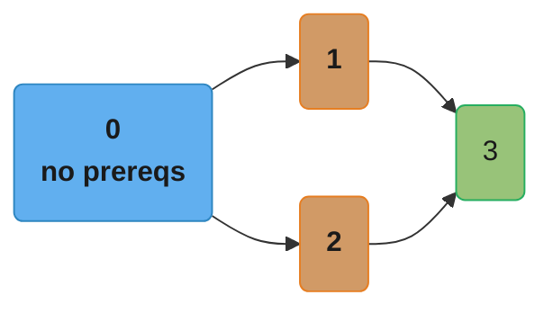
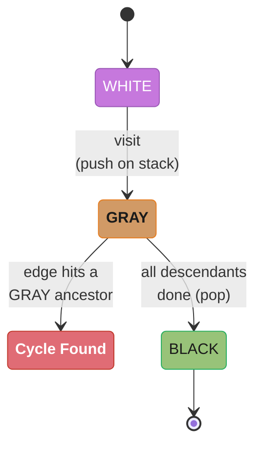
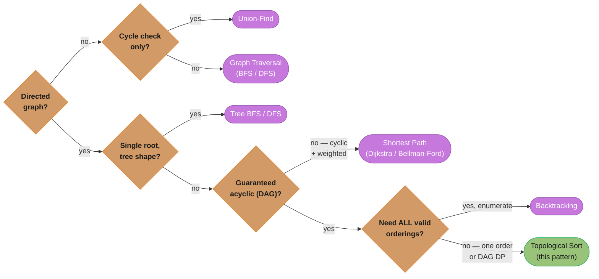

# Topological Sort (Kahn's BFS + DFS Post-Order)

## Pattern Snapshot

**What it is**: A linear ordering of the nodes of a **directed acyclic graph
(DAG)** such that for every directed edge `u -> v`, `u` appears before `v` in
the ordering. Two algorithms produce it: **Kahn's algorithm** (BFS using
in-degrees) and **DFS post-order reversal**.

**One-line cue**: "Course schedule / build order / task dependencies — what
order can these be done in (or is it even possible)?"

**Typical complexity**: `O(V + E)` — every node and edge is processed exactly
once.

---

## 1. Recognition Signals

**Use topological sort when you see:**
- "Course schedule" / "prerequisites" / "can you finish all courses?"
- "Build order" / "task scheduling with dependencies"
- "Alien dictionary" — derive a character ordering from word ordering
  constraints
- "Compilation order" / "package install order" — A depends on B, B must be
  processed first
- The phrase "directed graph" combined with "is it possible to..." (cycle
  detection) or "in what order..." (ordering)
- "Minimum time to complete all tasks given dependencies" (longest path in a
  DAG, computed via topo order + DP)

**Anti-signals (looks similar, use a different pattern):**
- The graph is **undirected** — connectivity/cycle questions on undirected
  graphs are [`union_find.md`](union_find.md) or
  [`graph_traversal.md`](graph_traversal.md), not topological sort
- Edges have **weights** and you need shortest/longest *distance* (not just
  *order*) -> [`shortest_path.md`](shortest_path.md) — though note: longest
  path in a DAG is itself solved via topo order + DP (see §6)
- The structure is a **tree** — trees have a single root and no
  "prerequisite" semantics; use [`tree_bfs.md`](tree_bfs.md) /
  [`tree_dfs.md`](tree_dfs.md)
- "Find all paths" / "generate all valid orderings" — combinatorial
  enumeration is [`backtracking.md`](backtracking.md), not a single topo sort

---

## 2. Mental Model & Intuition

Think of each node's **in-degree** as "how many prerequisites are still
unmet." A node with in-degree 0 has no unmet prerequisites — it's safe to
process *now*. Processing a node "removes" it, decrementing the in-degree of
everything it points to. Repeat until done.

Courses: 0 has no prereqs. 1 and 2 require 0. 3 requires both 1 and 2.



*Course 0 has in-degree 0 (nothing points to it), so it is the only safe
starting point; 1 and 2 each wait on 0; 3 waits on both 1 and 2 — its
in-degree of 2 must reach 0 before it can run.*

```
In-degrees:  0:0   1:1   2:1   3:2

Step 1: queue = [0]  (only node with in-degree 0)
        process 0 -> order=[0]
        decrement in-degree of 1 (1->0) and 2 (1->0)
        queue = [1, 2]

Step 2: process 1 -> order=[0,1]
        decrement in-degree of 3 (2->1)
        queue = [2]   (3 not ready yet, still waiting on 2)

Step 3: process 2 -> order=[0,1,2]
        decrement in-degree of 3 (1->0)
        queue = [3]

Step 4: process 3 -> order=[0,1,2,3]
        queue = []

Result: [0, 1, 2, 3]  -- a VALID topological order
```

If at the end fewer than `V` nodes were processed, some nodes' in-degrees
*never* reached 0 — meaning they're stuck in a cycle. **That's how Kahn's
algorithm doubles as cycle detection.**

---

## 3. The Template

```python
from __future__ import annotations
from collections import deque

# ---------------------------------------------------------------------------
# Template 1: Kahn's algorithm (BFS, in-degree based)
# ---------------------------------------------------------------------------
def topological_sort_kahn(num_nodes: int, edges: list[tuple[int, int]]) -> list[int]:
    """edges: list of (u, v) meaning u -> v (u must come before v)."""
    graph: list[list[int]] = [[] for _ in range(num_nodes)]
    in_degree = [0] * num_nodes

    for u, v in edges:
        graph[u].append(v)
        in_degree[v] += 1

    queue = deque(node for node in range(num_nodes) if in_degree[node] == 0)
    order: list[int] = []

    while queue:
        node = queue.popleft()
        order.append(node)
        for neighbor in graph[node]:
            in_degree[neighbor] -= 1
            if in_degree[neighbor] == 0:
                queue.append(neighbor)

    if len(order) != num_nodes:
        return []  # cycle detected -- no valid ordering exists
    return order


# ---------------------------------------------------------------------------
# Template 2: DFS post-order + reverse, with 3-color cycle detection
# ---------------------------------------------------------------------------
WHITE, GRAY, BLACK = 0, 1, 2  # unvisited, in-progress (on current DFS stack), done

def topological_sort_dfs(num_nodes: int, edges: list[tuple[int, int]]) -> list[int]:
    graph: list[list[int]] = [[] for _ in range(num_nodes)]
    for u, v in edges:
        graph[u].append(v)

    color = [WHITE] * num_nodes
    order: list[int] = []
    has_cycle = False

    def dfs(node: int) -> None:
        nonlocal has_cycle
        color[node] = GRAY  # mark "on current path"
        for neighbor in graph[node]:
            if color[neighbor] == GRAY:
                has_cycle = True  # back edge to a node on the current path
                return
            if color[neighbor] == WHITE:
                dfs(neighbor)
        color[node] = BLACK
        order.append(node)  # post-order: append AFTER all descendants done

    for node in range(num_nodes):
        if color[node] == WHITE:
            dfs(node)
        if has_cycle:
            return []

    return order[::-1]  # reverse post-order = topological order


# ---------------------------------------------------------------------------
# Template 3: Course Schedule II (LC 210) -- thin wrapper over Kahn's
# ---------------------------------------------------------------------------
def find_order(num_courses: int, prerequisites: list[list[int]]) -> list[int]:
    # prerequisites[i] = [a, b] means: to take a, you must first take b
    # so the edge is b -> a
    edges = [(b, a) for a, b in prerequisites]
    return topological_sort_kahn(num_courses, edges)
```

**The state machine Template 2's three colors encode**: every node starts
`WHITE`, turns `GRAY` the moment it's pushed onto the DFS call stack, and
turns `BLACK` only after every node reachable from it has finished. An edge
that lands on a node still `GRAY` is a back edge to a live ancestor — the one
signal a plain boolean `visited` can't produce, because it can't distinguish
"currently on the stack" from "already finished."



*Reaching `BLACK` means "safe, fully explored"; landing back on a `GRAY` node
mid-traversal is the exact moment both Kahn's final length check and DFS's
3-color check are designed to catch.*

---

## 4. Annotated Walkthrough

**Problem**: [Course Schedule II (LC 210)](https://leetcode.com/problems/course-schedule-ii/)
`numCourses = 4`, `prerequisites = [[1,0],[2,0],[3,1],[3,2]]`
(meaning: 1 requires 0; 2 requires 0; 3 requires 1; 3 requires 2)

**Build graph and in-degrees** (edges are `b -> a` for each `[a, b]`):

```
prerequisites [1,0] -> edge 0->1
prerequisites [2,0] -> edge 0->2
prerequisites [3,1] -> edge 1->3
prerequisites [3,2] -> edge 2->3

graph: 0 -> [1, 2]
       1 -> [3]
       2 -> [3]
       3 -> []

in_degree: 0:0   1:1   2:1   3:2
```

**Kahn's BFS trace**:

```
queue = [0]  (only node with in_degree 0)

Pop 0 -> order = [0]
  neighbor 1: in_degree[1] 1->0  -> enqueue 1
  neighbor 2: in_degree[2] 1->0  -> enqueue 2
queue = [1, 2]

Pop 1 -> order = [0, 1]
  neighbor 3: in_degree[3] 2->1  -> not zero yet, don't enqueue
queue = [2]

Pop 2 -> order = [0, 1, 2]
  neighbor 3: in_degree[3] 1->0  -> enqueue 3
queue = [3]

Pop 3 -> order = [0, 1, 2, 3]
queue = []

len(order) == 4 == num_courses -> valid. Return [0, 1, 2, 3]
```

`[0, 2, 1, 3]` would also be a valid answer (course 1 and 2 are
interchangeable since neither depends on the other) — LeetCode accepts any
valid topological order for this problem.

---

## 5. Complexity

| Algorithm | Time | Space | Notes |
|---|---|---|---|
| Kahn's (BFS) | O(V + E) | O(V + E) for graph + in-degree array + queue | Naturally detects cycles via `len(order) != num_nodes` |
| DFS post-order | O(V + E) | O(V + E) for graph + color array + recursion stack | Needs explicit 3-color tracking for cycle detection |

Both are linear in graph size — the choice between them is usually about
which cycle-detection style is more natural for the problem, or whether the
problem already gives you a recursive DFS structure to extend.

### Decoding Kahn's `O(V + E)`

**What it means.** "Count how many prerequisites each task has,
repeatedly take any task whose count has hit zero, and tick down the counters
of everything it unblocks. Each task is taken once and each dependency is
ticked down once — two separate piles of work, added."

The `V` and the `E` come from two structurally different loops, which is why
they add rather than multiply. Building the in-degree array is one pass over
the edges; the main loop dequeues each vertex once and, for that vertex, walks
only its own outgoing edges.

| Symbol | What it is |
|---|---|
| `V` | Number of nodes (tasks, courses, files) |
| `E` | Number of directed edges (prerequisite relations) |
| `O(V + E)` | One dequeue per node plus one decrement per edge |
| in-degree | How many edges point *at* a node — how many prerequisites remain |
| `len(order) != V` | The cycle test: fewer nodes emitted than exist |

**Walk one example.** Six tasks `A..F` with edges
`A->C  B->C  B->D  C->E  D->E  E->F`. Initial in-degrees are computed by
scanning all 6 edges once.

```
  step  dequeued  edges relaxed         in-degree after     queue      output
                                        A  B  C  D  E  F
  ----  --------  --------------------  ------------------  ---------  ---------------
   0    --        (init scan of 6       0  0  2  1  2  1    [A, B]     []
                   edges)
   1    A         A->C: C 2 -> 1        0  0  1  1  2  1    [B]        [A]
   2    B         B->C: C 1 -> 0  ENQ   0  0  0  0  2  1    [C, D]     [A, B]
                  B->D: D 1 -> 0  ENQ
   3    C         C->E: E 2 -> 1        0  0  0  0  1  1    [D]        [A, B, C]
   4    D         D->E: E 1 -> 0  ENQ   0  0  0  0  0  1    [E]        [A, B, C, D]
   5    E         E->F: F 1 -> 0  ENQ   0  0  0  0  0  0    [F]        [A,B,C,D,E]
   6    F         (no outgoing edges)   0  0  0  0  0  0    []         [A,B,C,D,E,F]

  len(output) = 6 = V   ->  valid topological order, no cycle
```

Six dequeues (one per vertex) and six decrements (one per edge): `V + E =
6 + 6 = 12` units of work, plus the initial `E = 6` scan to build the
in-degree array. Linear in the input size.

**Walk the cycle case.** Same graph plus one extra edge `F->C`, which closes
the loop `C -> E -> F -> C`. Only the in-degree of `C` changes, from 2 to 3.

```
  step  dequeued  edges relaxed         in-degree after     queue      output
                                        A  B  C  D  E  F
  ----  --------  --------------------  ------------------  ---------  -----------
   0    --        (init, 7 edges)       0  0  3  1  2  1    [A, B]     []
   1    A         A->C: C 3 -> 2        0  0  2  1  2  1    [B]        [A]
   2    B         B->C: C 2 -> 1        0  0  1  0  2  1    [D]        [A, B]
                  B->D: D 1 -> 0  ENQ
   3    D         D->E: E 2 -> 1        0  0  1  0  1  1    []         [A, B, D]
   4    --        QUEUE IS EMPTY, but C, E, F are still unemitted

  len(output) = 3  !=  V = 6   ->  CYCLE DETECTED

  the stuck nodes, each waiting on the next:

      C --> E --> F
      ^                 |
      +-----------------+

  every one of C, E, F has in-degree 1, and the only edge that could
  zero it comes from another member of the same cycle -- so none of
  them ever reaches zero
```

That is the whole cycle-detection mechanism: a cycle is a set of nodes whose
in-degrees can only be lowered by each other, so no member ever hits zero, the
queue starves, and the loop exits early. You do not need a separate check — the
length comparison `len(order) != num_nodes` *is* the check, and it costs `O(1)`.

**Why this complexity.** Three passes, all linear, none nested inside another:
building the adjacency list and in-degree array touches each edge once (`O(E)`),
seeding the queue scans each in-degree once (`O(V)`), and the main loop dequeues
each vertex exactly once — the `visited`-equivalent guarantee here is that a
node is enqueued only at the instant its in-degree reaches zero, which happens
at most once — and for each dequeued vertex walks only its own out-edges. Those
out-edge walks sum to `E` across the entire run, not `E` per vertex. Total:
`O(V + E)`.

---

## 6. Variations & Sub-patterns

**Cycle detection only** ([Course Schedule I (LC 207)](https://leetcode.com/problems/course-schedule/)):
identical to Template 1/2, but you only need the boolean
`len(order) == num_nodes` (Kahn's) or `not has_cycle` (DFS) — discard the
ordering itself.

**Alien Dictionary** ([LC 269](https://leetcode.com/problems/alien-dictionary/)):
the graph isn't given directly — you build it by comparing **adjacent words**
in the sorted word list. For each adjacent pair, find the first differing
character; that gives you one edge `c1 -> c2` (c1 comes before c2 in the
alien alphabet). Special case: if `word1` is a prefix of `word2` but
`word1` is *longer* (e.g., `["abc", "ab"]`), the ordering is invalid
regardless of graph structure — check this *before* building edges.

**Longest path in a DAG / minimum completion time**
([Parallel Courses (LC 1136)](https://leetcode.com/problems/parallel-courses/),
[Course Schedule IV (LC 1462)](https://leetcode.com/problems/course-schedule-iv/)):
process nodes in topological order, and for each node compute
`dist[v] = max(dist[v], dist[u] + 1)` for every edge `u -> v`. Because nodes
are processed in topo order, `dist[u]` is guaranteed final by the time you use
it to update `dist[v]`. The answer is `max(dist)`. This is a **DAG dynamic
program driven by topological order** — see [`dynamic_programming.md`](dynamic_programming.md).

**Lexicographically smallest valid ordering**
([Course Schedule II](https://leetcode.com/problems/course-schedule-ii/) variants,
[LC 2392 - Build a Matrix With Conditions](https://leetcode.com/problems/build-a-matrix-with-conditions/)):
replace the FIFO `deque` in Kahn's algorithm with a **min-heap** — always pop
the smallest-numbered node with in-degree 0. This guarantees the
lexicographically smallest topological order among all valid orderings.

**All possible topological orderings** (rare, exponential): backtracking over
Kahn's algorithm — at each step, try *every* node currently at in-degree 0,
recurse, then undo. This is [`backtracking.md`](backtracking.md) territory,
not a plain topo sort.

---

## 7. Problem Bank

| Problem | Difficulty | Variation | Recognition cue/twist |
|---|---|---|---|
| [Course Schedule (LC 207)](https://leetcode.com/problems/course-schedule/) | Medium | Cycle detection only | "Can you finish all courses" = does a cycle exist |
| [Course Schedule II (LC 210)](https://leetcode.com/problems/course-schedule-ii/) | Medium | Return the ordering | The signature problem — Kahn's BFS |
| [Minimum Height Trees (LC 310)](https://leetcode.com/problems/minimum-height-trees/) | Medium | Iterative leaf-trimming | "Peel" leaves layer by layer until ≤2 nodes remain |
| [Find Eventual Safe States (LC 802)](https://leetcode.com/problems/find-eventual-safe-states/) | Medium | Reverse-graph topo / DFS 3-color | A node is safe iff all out-edges lead to safe nodes |
| [Find All Possible Recipes from Given Supplies (LC 2115)](https://leetcode.com/problems/find-all-possible-recipes-from-given-supplies/) | Medium | Kahn over ingredient deps | Supplies have in-degree 0; recipes unlock as deps resolve |
| [All Ancestors of a Node in a DAG (LC 2192)](https://leetcode.com/problems/all-ancestors-of-a-node-in-a-directed-acyclic-graph/) | Medium | Reachability via topo / DFS | Propagate ancestor sets forward in topo order |
| [Loud and Rich (LC 851)](https://leetcode.com/problems/loud-and-rich/) | Medium | DFS propagation over a DAG | Memoize the quietest reachable richer person |
| [Parallel Courses (LC 1136)](https://leetcode.com/problems/parallel-courses/) | Medium | Longest path / DAG DP | Topo order drives `dist[v] = max(dist[v], dist[u]+1)` |
| [Course Schedule IV (LC 1462)](https://leetcode.com/problems/course-schedule-iv/) | Medium | Reachability matrix via topo | Propagate ancestor sets; answer reachability queries |
| [Sequence Reconstruction (LC 444)](https://leetcode.com/problems/sequence-reconstruction/) | Medium | Uniqueness check | Queue must hold exactly one node at each Kahn step |
| [Alien Dictionary (LC 269)](https://leetcode.com/problems/alien-dictionary/) | Hard | Build graph from adjacent words | Watch the prefix-longer-than-word invalid case |
| [Largest Color Value in a Directed Graph (LC 1857)](https://leetcode.com/problems/largest-color-value-in-a-directed-graph/) | Hard | Topo + DP over path colors | DP `count[v][color]` in topo order; cycle ⇒ return -1 |
| [Build a Matrix With Conditions (LC 2392)](https://leetcode.com/problems/build-a-matrix-with-conditions/) | Hard | Two independent topo sorts | One ordering for rows, one for columns; place on the diagonal |
| [Sort Items by Groups Respecting Dependencies (LC 1203)](https://leetcode.com/problems/sort-items-by-groups-respecting-dependencies/) | Hard | Two-level topo sort | Topo sort groups, then items within each group |
| [Reconstruct Itinerary (LC 332)](https://leetcode.com/problems/reconstruct-itinerary/) | Hard | Contrast — Eulerian path (Hierholzer) | Orders *edges* not vertices; not a true topo sort |

---

## 8. Common Mistakes (BROKEN -> FIX)

**Mistake**: in the DFS-based approach (Template 2), forgetting to **reverse**
the post-order list before returning it. The post-order naturally lists nodes
*after* all their dependents have been fully explored — which is the
**reverse** of a valid topological order.

```python
# BROKEN: returns post-order directly, without reversing
def topo_sort_broken(num_nodes, edges):
    graph = [[] for _ in range(num_nodes)]
    for u, v in edges:
        graph[u].append(v)

    visited = [False] * num_nodes
    order = []

    def dfs(node):
        visited[node] = True
        for neighbor in graph[node]:
            if not visited[neighbor]:
                dfs(neighbor)
        order.append(node)  # post-order append

    for node in range(num_nodes):
        if not visited[node]:
            dfs(node)

    return order  # BUG: this is REVERSE topological order
```

**Trace the bug** on the chain `0 -> 1 -> 2` (0 must come before 1, 1 before 2):

```
dfs(0): visited[0]=True
  -> dfs(1): visited[1]=True
       -> dfs(2): visited[2]=True
            -> no neighbors
            -> order.append(2)   order=[2]
       -> order.append(1)        order=[2, 1]
  -> order.append(0)              order=[2, 1, 0]

Returned: [2, 1, 0]
```

`[2, 1, 0]` claims course 2 should be taken *first* — but course 2 depends on
course 1, which depends on course 0. **This is exactly backwards.** A node is
appended to `order` only *after* its DFS subtree (everything reachable from
it) is fully processed, so the node with the *most* dependents finishes its
subtree *last* and ends up at the *end* of `order` — but it actually belongs
at the *front* of the topological order.

**Fix**: reverse the final list.

```python
# FIXED: reverse the post-order
def topo_sort_fixed(num_nodes, edges):
    graph = [[] for _ in range(num_nodes)]
    for u, v in edges:
        graph[u].append(v)

    visited = [False] * num_nodes
    order = []

    def dfs(node):
        visited[node] = True
        for neighbor in graph[node]:
            if not visited[neighbor]:
                dfs(neighbor)
        order.append(node)

    for node in range(num_nodes):
        if not visited[node]:
            dfs(node)

    return order[::-1]  # FIX: reverse to get correct topological order
```

**Re-trace with the fix**: same `order = [2, 1, 0]` is built internally, but
the function now returns `order[::-1]` = `[0, 1, 2]` — course 0 first, then 1,
then 2. Correct.

A second, equally common variant of this mistake: using Kahn's algorithm but
forgetting the `if len(order) != num_nodes: return []` cycle check —
returning a *partial* order silently when a cycle makes some nodes
unreachable, instead of signaling "impossible."

---

## 9. Related Patterns & When to Switch

- **[`graph_traversal.md`](graph_traversal.md)** — topological sort (DFS
  variant) is graph DFS with an extra post-order step and 3-color cycle
  tracking. If the graph is undirected, plain traversal (with a simple 2-state
  `visited`) is enough — there's no "ordering" to compute.
- **[`union_find.md`](union_find.md)** — for *undirected* cycle detection
  (e.g., "does adding this edge create a cycle?"), Union-Find is simpler and
  faster than DFS-based coloring. Topological sort's 3-color cycle detection
  is specifically for *directed* graphs, where Union-Find doesn't apply.
- **[`dynamic_programming.md`](dynamic_programming.md)** — "longest/shortest
  path in a DAG" problems (§6) are topological sort *plus* a DP recurrence
  evaluated in topo order. The topo sort guarantees the DP's dependencies are
  resolved before they're needed.
- **[`shortest_path.md`](shortest_path.md)** — if the graph has cycles
  *and* weighted edges, you need Dijkstra/Bellman-Ford instead — topological
  order is undefined for cyclic graphs.
- **[`backtracking.md`](backtracking.md)** — "generate ALL valid topological
  orderings" (rather than just one) requires exploring and undoing choices —
  exponential in the worst case.

**The full decision at a glance** — collapsing the anti-signals from §1 and
the switch-points above into the questions that actually discriminate between
the six patterns:



*Directedness, then shape, then cyclicity, then "one ordering or all of
them" — four yes/no questions route any graph-adjacent problem to the right
pattern; the DAG DP branch is §6's longest-path variation, still topological
sort underneath.*

---

## 10. Cross-links

- Concept module: [`graph_and_string_algorithms/`](../graph_and_string_algorithms/README.md) —
  formal proofs of Kahn's algorithm correctness and DFS post-order equivalence
- Concept module: [`graphs_tries_and_advanced_structures/`](../graphs_tries_and_advanced_structures/README.md) —
  adjacency list representation, in-degree/out-degree definitions
- Applied: [`../../devops/infrastructure_as_code_terraform/`](../../devops/infrastructure_as_code_terraform/README.md) —
  Terraform builds a dependency graph of resources and topologically sorts it
  to determine create/destroy order; a cycle in `depends_on` is exactly the
  "Course Schedule I" failure mode

---

## 11. Interview Q&A

**Q: Why does topological sort only make sense for DAGs?**
A topological order requires that for every edge `u -> v`, `u` comes before
`v`. If the graph has a cycle `a -> b -> c -> a`, then `a` must come before
`b`, `b` before `c`, and `c` before `a` — a contradiction. No linear ordering
can satisfy all three simultaneously, so a cycle makes topological order
*undefined*. This is also why both algorithms double as cycle detectors:
"can't produce a full ordering" == "graph has a cycle."

**Kahn's (BFS) vs. DFS post-order — when would you prefer one over the
other?**
Kahn's algorithm is usually more intuitive to implement and explain in an
interview because the in-degree-zero queue directly mirrors "what can I do
right now" — and cycle detection is a single length check at the end. DFS
post-order is preferable when you're already doing a DFS for another reason
(e.g., combined with other graph computations) and want to bolt on ordering
without a separate pass. Both are O(V+E); pick whichever maps more naturally
to how you're already modeling the problem.

**Q: How exactly does Kahn's algorithm detect a cycle?**
Every node in a cycle has at least one incoming edge *from within the cycle*
that can never be "removed" (because the node providing that edge can never
reach in-degree 0 either — it's circular). So nodes inside a cycle (and
anything only reachable through them) never reach in-degree 0 and are never
enqueued. At the end, `len(order) < num_nodes` reveals this — the missing
nodes are exactly those involved in or downstream of a cycle.

**What do the three colors (white/gray/black) mean in DFS-based cycle
detection, and why isn't a simple boolean `visited` enough?**
WHITE = never visited; GRAY = currently on the DFS call stack (an ancestor of
the current node in the DFS tree); BLACK = fully processed (this node and all
its descendants are done). A boolean `visited` can't distinguish "currently
being explored" (GRAY) from "fully done" (BLACK) — but that distinction is
exactly what detects a cycle: an edge to a GRAY node is a **back edge** to an
ancestor, meaning a cycle exists. An edge to a BLACK node is a **cross/forward
edge** — perfectly fine, just means you reached an already-finished subtree
via a different path (not a cycle).

**Q: Why must the DFS-based approach reverse the post-order list?**
A node is appended to the post-order list only after *all* nodes reachable
from it have been appended. So the node that "unlocks" the most other nodes
(i.e., has the most things depending on it, transitively) finishes last and
ends up at the end of the unreversed list — but it actually belongs first,
since everything depends on it. Reversing flips "finished last" into "appears
first," which is what topological order requires. See the BROKEN->FIX in §8
for a concrete trace.

**If multiple valid topological orderings exist, how do you produce a
specific one (e.g., the lexicographically smallest)?**
Replace the FIFO `deque` in Kahn's algorithm with a **min-heap** (`heapq`).
At each step, instead of popping arbitrary order, pop the smallest-valued node
currently at in-degree 0. This greedily picks the smallest available choice at
every step, which produces the lexicographically smallest valid ordering
overall — a classic greedy-with-topo-sort combination.

**How do you build the graph for Alien Dictionary when you're not given edges
directly?**
Compare each pair of *adjacent* words in the given (sorted) word list. Find
the first index where the two words differ — that pair of characters gives
you one directed edge (earlier-word's character -> later-word's character).
You only get information from the *first* differing character of each
adjacent pair; characters after that point give no ordering information.
Special case: if word A is a prefix of word B but A is *longer* than B (e.g.,
`"abc"` before `"ab"`), no valid ordering exists — return immediately.

**How does topological sort enable "longest path in a DAG" (Parallel
Courses)?**
Process nodes in topological order, maintaining `dist[node]` = the longest
path ending at `node`. For each edge `u -> v` processed when you pop `u`,
update `dist[v] = max(dist[v], dist[u] + 1)`. Because `u` is processed
*before* `v` in topo order (guaranteed by the definition of topological
order), `dist[u]` is already final by the time it's used to update `dist[v]`
— this is the key invariant that makes the DP correct in a single pass.

**What's the time/space complexity, and why is it linear despite the nested
loop structure (for each node, for each neighbor)?**
O(V + E): the outer loop runs once per node (O(V)), and across *all*
iterations of the outer loop, the inner loop examines each edge exactly once
in total (not once per node) — because each edge `(u, v)` is only iterated
when processing `u`. Summing the inner-loop work across all nodes gives
`sum(out_degree(u) for u in nodes) == E`, not `V * E`.

**Q: A common bug: initializing `in_degree` incorrectly. What's the right way?**
`in_degree[v]` must count *every* edge `(u, v)` in the input — initialize it
to all zeros, then for each edge `(u, v)`, do `in_degree[v] += 1`. A common
mistake is initializing `in_degree` to `1` for all nodes (confusing it with
"at least one prerequisite exists for everything") or forgetting to count
multi-edges (if the input can contain duplicate prerequisite pairs, each
duplicate must still increment in-degree, or the queue will release a node
"too early" relative to a duplicate edge that was never decremented).

**How would Sequence Reconstruction (LC 444) differ from Course Schedule II —
both build a graph from pairwise orderings?**
Course Schedule II just needs *a* valid ordering. Sequence Reconstruction
needs to verify the *unique* valid ordering equals a specific target sequence.
This requires checking, at every step of Kahn's algorithm, that the queue
contains **exactly one** node with in-degree 0 (if more than one node is ready
simultaneously, the ordering isn't uniquely determined) — and that the
resulting order matches the target exactly.

**Why doesn't Union-Find work for detecting cycles in directed graphs the way
it does for undirected graphs?**
Union-Find merges two nodes into the same set when an edge connects them,
treating the edge as bidirectional for connectivity purposes. But a directed
cycle `a -> b -> a` and two separate directed edges `a -> b` and `b -> a` that
*aren't* part of a cycle in context look identical to Union-Find — it can't
distinguish edge *direction*. Detecting a directed cycle requires tracking the
current DFS path (the GRAY state in 3-color DFS) — information Union-Find
doesn't maintain.
