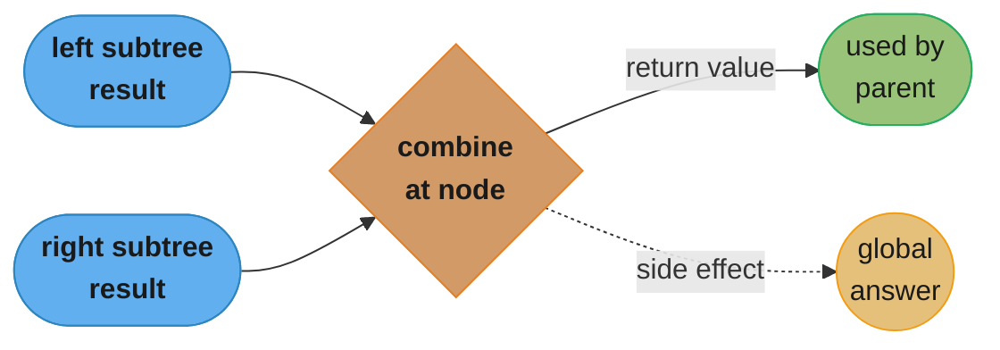
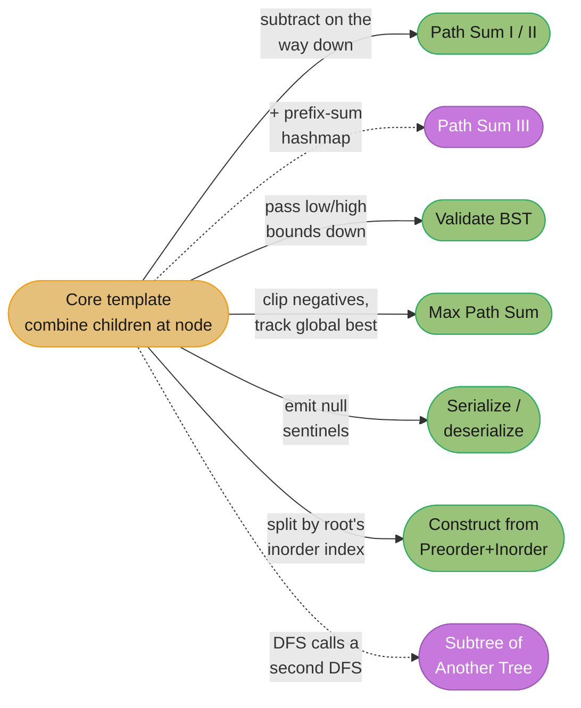

# Tree DFS

## Pattern Snapshot

**Tree DFS** (depth-first search) is recursion that follows a tree's
structure: solve the left subtree, solve the right subtree, then **combine
their results at the current node**. Whenever a problem's answer at a node
depends on information computed from its *subtrees* — a height, a sum, a
boolean, a path — DFS is the natural fit, because the recursive call stack
*is* the path from root to the current node.

- **One-line cue**: "path sum", "diameter", "lowest common ancestor",
  "maximum path sum", "validate BST", "serialize/deserialize", "invert/flip
  tree", or anything where a node's answer depends on its children's answers.
- **Typical complexity**: O(n) time (every node visited once), O(h) space for
  the recursion stack, where `h` is the tree's height (`O(log n)` balanced,
  `O(n)` skewed).

---

## 1. Recognition Signals

**Strong signals — reach for tree DFS:**

- "**Path sum**" (root-to-leaf, or any path) —
  [Path Sum (LC 112)](https://leetcode.com/problems/path-sum/),
  [Path Sum III (LC 437)](https://leetcode.com/problems/path-sum-iii/).
- "**Diameter**" / "longest path between any two nodes" —
  [LC 543](https://leetcode.com/problems/diameter-of-binary-tree/).
- "**Lowest common ancestor**" —
  [LC 236](https://leetcode.com/problems/lowest-common-ancestor-of-a-binary-tree/).
- "**Maximum path sum**" (path can start/end anywhere, even go through a
  single node twice via both children) —
  [LC 124](https://leetcode.com/problems/binary-tree-maximum-path-sum/).
- "**Validate** a binary search tree" — requires propagating valid `(low,
  high)` bounds down the recursion, or an inorder check.
- "**Serialize / deserialize**" a tree — preorder DFS with sentinel markers
  for `None`.
- "**Invert / flip**", "**subtree of another tree**", "**same tree**" —
  structural comparisons that recurse on both children.
- The three classic traversal orders — **preorder** (process node, then
  children — natural for serialization), **inorder** (left, node, right —
  yields sorted order for a BST), **postorder** (children, then node —
  natural for "compute children first, combine at parent," e.g., heights,
  sums, diameters).

**Anti-signals — looks like tree DFS but isn't:**

- "**Level order**", "zigzag", "right side view", "connect same-level
  pointers" — these are about *horizontal* structure and belong to
  [tree_bfs](tree_bfs.md).
- The structure has **cycles** or isn't a tree (general graph) — you need a
  `visited` set, which is [graph_traversal](graph_traversal.md)'s job (a tree
  has exactly one path between any two nodes, so DFS never revisits).
- "**Generate all root-to-leaf paths**" as explicit lists — this is DFS
  *plus* [backtracking](backtracking.md) (build a path list, recurse, pop on
  the way back up).

---

## 2. Mental Model & Intuition

The recursion stack **is** the path from the root to the current node. Each
call does work *after* its recursive calls return (postorder shape) — by the
time you're "at" a node combining results, you already have full answers for
both subtrees.

```
        1
       / \
      2   3
     / \
    4   5

dfs(4) -> no children -> returns its own contribution (height = 1)
dfs(5) -> no children -> returns 1
dfs(2) -> combines dfs(4)=1 and dfs(5)=1
            "diameter through 2" = 1 + 1 = 2   <- candidate for global answer
            returns 1 + max(1, 1) = 2  (height of subtree rooted at 2)
dfs(3) -> no children -> returns 1
dfs(1) -> combines dfs(2)=2 and dfs(3)=1
            "diameter through 1" = 2 + 1 = 3   <- new global max!
            returns 1 + max(2, 1) = 3

global diameter = max(2, 3) = 3   (path 4 -> 2 -> 1 -> 3, three edges)
```

Two things are happening at every node: (1) a value **returned to the
parent** (here, height — what the parent needs to compute *its* combination),
and (2) a **side effect on a global/nonlocal answer** (here, diameter — the
actual thing the problem asks for, which isn't always the same as what's
returned upward). Conflating these two is the most common DFS bug (see §8).

This shape repeats across nearly every tree DFS problem in this file:



*The solid arrow is what the parent consumes for its own combination (height,
in the diameter walkthrough above); the dotted arrow is a side effect on a
global accumulator — often the actual answer the problem asks for. Treating
the two as one value is the bug §8 dissects in detail.*

---

## 3. The Template

```python
from __future__ import annotations
from typing import List, Optional


class TreeNode:
    def __init__(self, val: int = 0, left: "TreeNode | None" = None, right: "TreeNode | None" = None) -> None:
        self.val = val
        self.left = left
        self.right = right


def max_depth(root: Optional[TreeNode]) -> int:
    """Height of the tree. Postorder: combine children's heights."""
    if not root:
        return 0
    return 1 + max(max_depth(root.left), max_depth(root.right))


def has_path_sum(root: Optional[TreeNode], target: int) -> bool:
    """Does any root-to-leaf path sum to target? Preorder with a running total."""
    if not root:
        return False
    if not root.left and not root.right:        # leaf
        return root.val == target
    remaining = target - root.val
    return has_path_sum(root.left, remaining) or has_path_sum(root.right, remaining)


def diameter_of_binary_tree(root: Optional[TreeNode]) -> int:
    """Longest path (in edges) between any two nodes. Global max + height return."""
    diameter = 0

    def height(node: Optional[TreeNode]) -> int:
        nonlocal diameter
        if not node:
            return 0
        left_h = height(node.left)
        right_h = height(node.right)
        diameter = max(diameter, left_h + right_h)   # path THROUGH this node
        return 1 + max(left_h, right_h)               # height for the PARENT

    height(root)
    return diameter


def lowest_common_ancestor(
    root: Optional[TreeNode], p: TreeNode, q: TreeNode
) -> Optional[TreeNode]:
    """LCA of p and q in a (not necessarily BST) binary tree."""
    if root is None or root is p or root is q:
        return root

    left = lowest_common_ancestor(root.left, p, q)
    right = lowest_common_ancestor(root.right, p, q)

    if left and right:        # p and q found in DIFFERENT subtrees -> root is LCA
        return root
    return left or right       # both in one subtree -> bubble up that result


def is_valid_bst(root: Optional[TreeNode]) -> bool:
    """Validate BST by passing down valid (low, high) bounds."""
    def validate(node: Optional[TreeNode], low: float, high: float) -> bool:
        if not node:
            return True
        if not (low < node.val < high):
            return False
        return (validate(node.left, low, node.val) and
                validate(node.right, node.val, high))

    return validate(root, float("-inf"), float("inf"))
```

---

## 4. Annotated Walkthrough

**Problem**: [Diameter of Binary Tree (LC 543)](https://leetcode.com/problems/diameter-of-binary-tree/)
on the tree:

```
        1
       / \
      2   3
     / \
    4   5
```

`height(node)` returns the height of the subtree (number of nodes on the
longest root-to-leaf path; `height(None) = 0`). At every node, the
**diameter through this node** (in edges) is `height(left) + height(right)`.

```
height(4):
  left  = height(None) = 0
  right = height(None) = 0
  diameter = max(0, 0 + 0) = 0
  returns 1 + max(0, 0) = 1

height(5):
  same as height(4) -> diameter stays 0, returns 1

height(2):
  left  = height(4) = 1
  right = height(5) = 1
  diameter = max(0, 1 + 1) = 2          <- updated!
  returns 1 + max(1, 1) = 2

height(3):
  left  = height(None) = 0
  right = height(None) = 0
  diameter = max(2, 0 + 0) = 2          <- unchanged
  returns 1 + max(0, 0) = 1

height(1):
  left  = height(2) = 2
  right = height(3) = 1
  diameter = max(2, 2 + 1) = 3          <- updated!
  returns 1 + max(2, 1) = 3
```

**Final diameter = 3** — the path `4 -> 2 -> 1 -> 3` has 3 edges, the longest
in this tree. Note that the *returned* values (heights: 1, 1, 2, 1, 3) are
never themselves the answer — the answer accumulates in `diameter`, a
`nonlocal` variable updated as a **side effect** during the postorder
traversal.

---

## 5. Complexity

| Operation | Time | Space | Why |
|---|---|---|---|
| `max_depth`, `diameter_of_binary_tree`, `is_valid_bst` | O(n) | O(h) | Every node visited once; recursion depth = tree height `h` |
| `has_path_sum` | O(n) worst case | O(h) | May short-circuit early via `or`, but worst case (no path found) visits every node |
| `lowest_common_ancestor` | O(n) | O(h) | Every node visited once in the worst case |
| Iterative DFS (explicit stack) | O(n) | O(h) | Same asymptotic space, but avoids language call-stack limits for very deep (skewed) trees |

`O(h)` becomes `O(log n)` for a balanced tree but `O(n)` for a skewed
(linked-list-shaped) tree — in Python, a sufficiently skewed tree can hit
`RecursionError` (default recursion limit ~1000); converting to an iterative
DFS with an explicit stack avoids this.

### Decoding `O(n)` time and `O(h)` space

**What it means.** "Time is `O(n)` because every node is visited
once. Space is `O(h)` because at any instant the call stack holds exactly one
root-to-current-node path — not the whole tree, just the path down to where you
currently are."

The `O(h)` is the number interviewers actually push on, because `h` is not a
fixed function of `n`. It is `log n` for a balanced tree and `n` for a skewed
one, and the gap between those two is where recursion crashes live. Saying
"`O(h)` space" and stopping is an incomplete answer; the complete one names both
ends of the range.

| Symbol | What it is |
|---|---|
| `n` | Total node count |
| `h` | Tree height — the longest root-to-leaf path |
| `O(h)` | Recursion-stack depth; one frame per node on the current path |
| `O(log n)` | `h` when the tree is balanced |
| `O(n)` | `h` when the tree is degenerate (every node has one child) |

**Walk one example.** `max_depth` on a 6-node tree. Each row shows the live
call stack — that stack *is* the space cost.

```
        1
      /   \
     2     3
    / \     \
   4   5     6

  step  action              call stack (root -> current)   depth  returns
  ----  ------------------  -----------------------------  -----  -------
   1    enter 1             [1]                              1
   2    enter 2 (left)      [1, 2]                           2
   3    enter 4 (left)      [1, 2, 4]                        3
   4    4 is a leaf         [1, 2, 4]                        3      1
   5    pop 4, enter 5      [1, 2, 5]                        3
   6    5 is a leaf         [1, 2, 5]                        3      1
   7    pop 5, finish 2     [1, 2]                           2      2
   8    pop 2, enter 3      [1, 3]                           2
   9    enter 6 (right)     [1, 3, 6]                        3
  10    6 is a leaf         [1, 3, 6]                        3      1
  11    pop 6, finish 3     [1, 3]                           2      2
  12    pop 3, finish 1     [1]                              1      3

  6 node visits = n              peak stack depth = 3 = h + 1
```

Every node was entered exactly once (`O(n)` time), but the stack never held
more than 3 frames even though the tree has 6 nodes. Compare against the BFS
of this same tree in [`tree_bfs.md`](tree_bfs.md) §5, where the queue peaked at
3 as well — at `n = 6` the two are indistinguishable, which is exactly why the
distinction has to be argued at scale rather than demonstrated on a toy.

**Why `h` swings so violently.** The two extreme shapes at `n = 1,000,000`:

```
  shape        picture (schematic)      h                       peak frames
  -----------  ----------------------   ---------------------   -----------
  balanced           o                  floor(log2(10^6)) = 19          20
                   /   \
                  o     o
                 / \   / \
                o   o o   o

  degenerate         o                  n - 1 = 999,999            1,000,000
                      \
                       o
                        \
                         o
                          \
                           o

  ratio = 1,000,000 / 20 = 50,000x more stack in the degenerate case
```

**Why this complexity, and why it crashes.** Time is `O(n)` regardless of shape
— visiting is visiting, and the shape only changes the order. Space follows the
path length because a frame is pushed on descent and popped on return, so only
the ancestors of the current node are live. The failure mode is concrete:
CPython's default recursion limit is **1,000** frames, so a degenerate
1,000,000-node tree raises `RecursionError` at depth 1,000 — after covering
`1,000 / 1,000,000 = 0.1%` of the tree. The balanced case needs 20 frames, 2% of
the limit, and is never at risk.

The fix is not a bigger limit (`sys.setrecursionlimit` trades a clean
`RecursionError` for a hard interpreter segfault when the C stack runs out). The
fix is the iterative DFS with an explicit `list` as the stack: same `O(n)` time,
same `O(h)` asymptotic space, but the stack now lives on the heap where a
million entries is roughly 8 MB of pointers rather than a million interpreter
frames.

---

## 6. Variations & Sub-patterns

**1. Path Sum I / II / III.**
LC 112 (does a root-to-leaf path sum to target — boolean) and LC 113 (return
all such paths — DFS + backtracking, building/popping a path list) are
"downward from root" only. **LC 437 (Path Sum III)** allows a path to **start
at any node**, not just the root — the efficient solution combines DFS with a
running prefix-sum hashmap (see [prefix_sum.md](prefix_sum.md)): at each
node, `count += freq[running_sum - target]`, mirroring "subarray sum equals
k" but along a tree path instead of an array.

**2. Validate BST — bounds vs. inorder.**
The `(low, high)` bounds-passing approach (template above) is `O(n)`
time/`O(h)` space and short-circuits on the first violation. An alternative:
do a full **inorder traversal** and check the resulting sequence is strictly
increasing — correct because inorder traversal of a valid BST always yields
sorted order, but it visits every node even if an early violation exists.

**3. Maximum Path Sum (LC 124) — the hardest common variant.**
Unlike diameter, **values can be negative**, and the "best path" may pass
*through* a single node connecting its left and right subtrees (an
upside-down V shape) — but the value **returned to the parent** can only
extend in *one* direction (a node has one parent, so a path can't fork
upward). This requires (a) clipping negative subtree contributions to 0
(don't extend into a subtree that would *decrease* the sum), and (b) tracking
a separate global "best" for the through-node case. See §8 for the full
broken/fixed trace.

**4. Serialize / deserialize (LC 297).**
Preorder DFS, emitting a sentinel (e.g., `"#"` or `"null"`) for `None`
children. Deserialization replays the same preorder sequence recursively,
consuming tokens left-to-right — the sentinels make the preorder sequence
**unambiguous** (without them, you can't tell where one subtree ends and the
next begins).

**5. Construct tree from preorder + inorder (LC 105).**
The first element of `preorder` is always the root. Find that value's
position in `inorder` — everything to its left is the left subtree, everything
to its right is the right subtree (sizes tell you how to slice `preorder`
too). Precompute a `value -> index` hashmap for `inorder` to make each lookup
O(1), giving overall `O(n)` instead of `O(n^2)`.

**6. Subtree of another tree (LC 572).**
For each node in the main tree, check if the subtree rooted there is
*identical* to the target tree (a separate DFS comparing two trees
node-by-node). Naive complexity is `O(n * m)` (`n` = nodes in main tree, `m` =
nodes in target) — acceptable for typical constraints; an `O(n + m)`
alternative serializes both trees (with sentinels, to avoid false positives
from ambiguous shapes) and does a substring search.

The variations above nearly all reuse the same combine-at-node skeleton from
§3, changing only what gets computed or returned:



*Every branch keeps the postorder combine-at-node skeleton; only Path Sum III
and Subtree of Another Tree (dotted) reach outside it — the first bolts on a
prefix-sum hashmap, the second launches a nested second DFS.*

---

## 7. Problem Bank

| Problem | Difficulty | Variation | Recognition cue / twist |
|---|---|---|---|
| [Maximum Depth of Binary Tree (LC 104)](https://leetcode.com/problems/maximum-depth-of-binary-tree/) | Easy | Basic postorder | `1 + max(left, right)` |
| [Invert Binary Tree (LC 226)](https://leetcode.com/problems/invert-binary-tree/) | Easy | Structural mutation | Swap children, recurse on both |
| [Path Sum (LC 112)](https://leetcode.com/problems/path-sum/) | Easy | Root-to-leaf, boolean | Subtract `node.val` going down, check at leaves |
| [Subtree of Another Tree (LC 572)](https://leetcode.com/problems/subtree-of-another-tree/) | Easy | Tree comparison per node | DFS that calls another DFS (tree equality) |
| [Diameter of Binary Tree (LC 543)](https://leetcode.com/problems/diameter-of-binary-tree/) | Easy | Global max + height return | The canonical "two return channels" problem |
| [Validate Binary Search Tree (LC 98)](https://leetcode.com/problems/validate-binary-search-tree/) | Medium | Bounds-passing | `(low, high)` tightened at each level |
| [Lowest Common Ancestor of a Binary Tree (LC 236)](https://leetcode.com/problems/lowest-common-ancestor-of-a-binary-tree/) | Medium | "Found in both subtrees" | Returns a node, not a value |
| [Path Sum III (LC 437)](https://leetcode.com/problems/path-sum-iii/) | Medium | Any-path + prefix sum | DFS combined with [prefix_sum](prefix_sum.md) hashmap |
| [Construct Binary Tree from Preorder and Inorder Traversal (LC 105)](https://leetcode.com/problems/construct-binary-tree-from-preorder-and-inorder-traversal/) | Medium | Recursive split | Hashmap of inorder indices for O(n) |
| [Balanced Binary Tree (LC 110)](https://leetcode.com/problems/balanced-binary-tree/) | Easy | Height + balance check | Return height, or -1 sentinel to short-circuit imbalance |
| [Path Sum II (LC 113)](https://leetcode.com/problems/path-sum-ii/) | Medium | Collect all root-to-leaf paths | Backtrack the running path list at each return |
| [Kth Smallest Element in a BST (LC 230)](https://leetcode.com/problems/kth-smallest-element-in-a-bst/) | Medium | In-order DFS | In-order visit yields sorted order; stop at the kth |
| [House Robber III (LC 337)](https://leetcode.com/problems/house-robber-iii/) | Medium | Tree DP | Each node returns `(rob_this, skip_this)` to its parent |
| [Serialize and Deserialize Binary Tree (LC 297)](https://leetcode.com/problems/serialize-and-deserialize-binary-tree/) | Hard | Preorder + sentinels | Unambiguous reconstruction |
| [Binary Tree Maximum Path Sum (LC 124)](https://leetcode.com/problems/binary-tree-maximum-path-sum/) | Hard | Clip negatives + global best | The signature "hardest" tree DFS problem |

---

## 8. Common Mistakes (BROKEN -> FIX)

**Mistake: Maximum Path Sum without clipping negative branches AND without a
separate global "best through this node" tracker.**

```python
# BROKEN -- conflates "downward path for parent" with "best path overall",
# and never discards a negative subtree contribution
def max_path_sum_broken(root: Optional[TreeNode]) -> int:
    def dfs(node: Optional[TreeNode]) -> int:
        if not node:
            return 0
        left = dfs(node.left)
        right = dfs(node.right)
        return node.val + max(left, right)   # BUG: no clipping, no global best
    return dfs(root)
```

Trace on `[-10, 9, 20, null, null, 15, 7]` (correct answer is `42`, the path
`15 -> 20 -> 7`):

```
        -10
        /  \
       9    20
           /  \
          15   7

dfs(15): left=dfs(None)=0, right=dfs(None)=0 -> return 15 + max(0,0) = 15
dfs(7):  left=0, right=0               -> return 7 + max(0,0) = 7
dfs(20): left=dfs(15)=15, right=dfs(7)=7 -> return 20 + max(15,7) = 35
dfs(9):  left=0, right=0               -> return 9 + max(0,0) = 9
dfs(-10): left=dfs(9)=9, right=dfs(20)=35 -> return -10 + max(9,35) = 25

result = dfs(-10) = 25
```

**Result: `25`. Correct answer: `42`.** Two bugs compound:

1. **No global tracker for "path through this node using BOTH children."**
   At node `20`, the best path is `15 -> 20 -> 7 = 42` — but the function can
   only *return* `20 + max(15, 7) = 35` (one direction) because that's all a
   *parent* can extend. The `42` value is never recorded anywhere.
2. **No clipping of negative contributions.** If a subtree's best downward
   path were negative (e.g., all-negative subtree), `max(left, right)` could
   still pick a negative number, *decreasing* the parent's sum — a path
   should simply not extend into a subtree that would make it worse.

```python
# FIX -- track a separate global `best`, and clip negative branches to 0
def max_path_sum(root: Optional[TreeNode]) -> int:
    best = float("-inf")

    def dfs(node: Optional[TreeNode]) -> int:
        nonlocal best
        if not node:
            return 0
        left = max(dfs(node.left), 0)     # FIX: never extend into a negative branch
        right = max(dfs(node.right), 0)
        best = max(best, node.val + left + right)   # FIX: path THROUGH this node
        return node.val + max(left, right)            # downward path for the parent
    dfs(root)
    return best
```

Re-tracing: `dfs(15)` -> `left=0, right=0` -> `best = max(-inf, 15) = 15` ->
returns `15`. `dfs(7)` -> similarly `best = max(15, 7) = 15` (no change since
7 < 15) -> returns `7`. `dfs(20)` -> `left = max(15,0)=15`,
`right = max(7,0)=7` -> `best = max(15, 20+15+7) = max(15, 42) = 42` -> returns
`20 + max(15,7) = 35`. `dfs(9)` -> `best` unchanged (9 < 42) -> returns `9`.
`dfs(-10)` -> `left=max(9,0)=9`, `right=max(35,0)=35` -> `best = max(42,
-10+9+35) = max(42, 34) = 42` -> returns `25` (irrelevant, discarded). **Final
`best = 42`.** The lesson: when a problem allows a path to "turn" at a node
(use both children), the value **returned** to the parent (one direction
only) and the value that's the **actual answer** (potentially both
directions) are different quantities — track them separately.

---

## 9. Related Patterns & When to Switch

- **[Tree BFS](tree_bfs.md)** — for level-order, zigzag, right-side-view, or
  "connect same-level nodes" — anything about *horizontal* structure rather
  than root-to-node paths.
- **[Prefix Sum](prefix_sum.md)** — Path Sum III combines a DFS traversal with
  a prefix-sum hashmap; the "subarray sum equals k" logic applies along tree
  paths instead of array indices.
- **[Backtracking](backtracking.md)** — "return all root-to-leaf paths" (LC
  113, LC 257) needs DFS *plus* maintaining and undoing a path list as you
  recurse and return — the canonical backtracking shape.
- **[Graph Traversal](graph_traversal.md)** — once the structure can have
  cycles or multiple parents (general graph, not tree), you need a `visited`
  set; tree DFS's implicit guarantee of "no cycles" no longer holds.

---

## 10. Cross-links

- Concept module: [trees_and_binary_search_trees](../trees_and_binary_search_trees/)
  — traversal order definitions, BST invariants, balancing.
- Concept module: [recursion_and_problem_solving_patterns](../recursion_and_problem_solving_patterns/)
  — general recursion design (base cases, "trust the recursion," combining
  subproblem results).
- Applied: [database/indexing_deep_dive](../../database/indexing_deep_dive/)
  — B+Tree search descends root-to-leaf like a BST DFS, but is shallow and
  wide (high fanout) rather than deep and narrow.
- Applied: [java/collections_internals](../../java/collections_internals/) —
  `TreeMap`'s red-black tree maintains BST ordering invariants; an inorder
  traversal of `TreeMap`'s internal tree yields sorted key order, mirroring
  `is_valid_bst`'s inorder-sortedness property.
- Master recognition engine: [dsa_patterns/README.md](README.md).
- Sibling pattern: [tree_bfs.md](tree_bfs.md).

---

## 11. Interview Q&A

**Q: When do you use preorder, inorder, or postorder traversal?**
**Preorder** (node, left, right) when you need to process a node *before*
its children — serialization (the root must be written first to be read
first), or copying/cloning a tree top-down. **Inorder** (left, node, right)
specifically for **BSTs** — it visits nodes in sorted key order, useful for
"k-th smallest," validation, or converting a BST to a sorted list.
**Postorder** (left, right, node) when a node's computation *depends on* its
children's results — heights, sums, diameters, deletions (you must process
children before you can safely detach/free the parent).

**Q: Why does inorder traversal of a BST yield sorted order?**
By the BST invariant, every node's left subtree contains only smaller values
and its right subtree only larger values. Inorder visits "everything smaller
than this node" (left subtree, recursively sorted), "this node," then
"everything larger" (right subtree, recursively sorted) — by induction, the
entire sequence is sorted.

**Q: Diameter of Binary Tree — why track a separate `nonlocal diameter` instead of just returning the diameter from each call?**
The function's *return value* must be something the **parent** can use to
compute *its own* combination — here, the subtree's height (a single number
representing "how far down does this subtree extend"). The diameter *through*
a node (`left_height + right_height`) is a different quantity that the parent
can't directly use (the parent only cares about height for its own
diameter-through-itself calculation). Two distinct purposes need two distinct
channels: the return value (height, for parents) and a side-channel
(`nonlocal diameter`, for the final answer).

**Q: How does the recursive LCA algorithm work — why does "found in both subtrees" mean the current node is the answer?**
`lowest_common_ancestor` returns non-`None` from a subtree iff that subtree
contains `p`, `q`, or (already-found) their LCA. If the **left** recursive
call returns non-`None` AND the **right** does too, that means `p` is in one
subtree and `q` is in the other — the current node is exactly the point where
their paths from the root diverge, which is the definition of LCA. If only
one side returns non-`None`, both `p` and `q` (or their LCA) are in that
single subtree, so bubble that result up unchanged.

**Q: Validate BST — why is checking `node.val > node.left.val and node.val < node.right.val` (immediate children only) insufficient?**
The BST property is **global**, not just local: every node in the *entire*
left subtree must be less than the current node, not just the immediate left
child. A tree like `5 -> (left: 1 -> (right: 6))` has `1 < 5` (immediate
check passes) but `6` (in `5`'s left subtree) is `> 5`, violating the BST
property. The `(low, high)` bounds-passing approach correctly propagates
*all* ancestor constraints down the recursion, not just the immediate
parent's value.

**Q: Maximum Path Sum — why must you clip negative subtree results to 0?**
A "path" extending into a subtree adds that subtree's contribution to the
running sum. If a subtree's best downward path sum is *negative*, including
it would make the total *worse* than not extending into it at all — so the
optimal choice is to not extend (contribute `0`). `max(dfs(child), 0)`
encodes "either extend into this subtree if it helps, or stop here" — this is
why both `left` and `right` are clamped before being used in either the
`best` update or the returned value.

**Q: Path Sum III — why prefix sum + hashmap instead of checking every possible path directly?**
Checking every `(start, end)` pair of nodes along root-to-X paths is
`O(n^2)` (for each node, walk up/down to try all paths through it). The
prefix-sum trick treats the root-to-current-node path like a 1D array:
maintain a running sum `S` from the root to the current node in a hashmap of
`{prefix_sum: count}`; at each node, the number of valid paths *ending here*
with sum `target` equals `count[S - target]` (mirroring
[subarray sum equals k](prefix_sum.md)). Increment `count[S]` on the way
down, decrement it on the way back up (backtracking) so sibling subtrees
don't see each other's path sums — giving `O(n)` overall.

**Q: What's the space complexity of recursive tree DFS, and how would you avoid hitting Python's recursion limit on a skewed tree?**
`O(h)` for the call stack, where `h` is the tree's height. For a balanced
tree, `h = O(log n)` — fine. For a **skewed** tree (effectively a linked
list), `h = O(n)`, and Python's default recursion limit (~1000) can be
exceeded for `n > ~1000`, raising `RecursionError`. The fix is an **iterative
DFS with an explicit stack** (`stack = [root]`, push/pop manually) — same
`O(n)` space, but on the heap (a Python list) rather than the interpreter's
call stack, which has no comparable hard limit.

**Q: Construct Binary Tree from Preorder and Inorder — why precompute a hashmap of `inorder` value-to-index, and what breaks without it?**
The recursive construction repeatedly needs "where does `preorder[0]`
(the current root) appear in the current `inorder` slice?" to split it into
left/right subtree slices. A linear search for this index on every call makes
the overall algorithm `O(n^2)` (one O(n) search per node). Precomputing
`{value: index}` once makes each lookup `O(1)`, bringing the total to `O(n)`.
This requires all values to be **unique** — a constraint the problem
guarantees.

**Q: Subtree of Another Tree — when is the naive O(n*m) approach acceptable, and what's the O(n+m) alternative?**
`O(n*m)` (for each of `n` nodes in the main tree, run an `O(m)` equality check
against the target) is fine for typical interview constraints (`n, m <=
1000`, giving `10^6` operations). The `O(n+m)` alternative serializes both
trees to strings **with explicit null markers and delimiters** (to avoid
`"12"` ambiguously matching both a node `12` and nodes `1`, `2`), then checks
if the target's serialization is a substring of the main tree's — substring
search (e.g., KMP) is `O(n+m)`. Mention both; the naive approach is usually
sufficient unless the interviewer explicitly asks for better.

**Q: Can you do an inorder traversal in true O(1) auxiliary space — no recursion stack AND no explicit stack?**
Yes — **Morris Traversal**. For a node with a left child, find its **inorder
predecessor** (the rightmost node in the left subtree) and temporarily
"thread" the tree: set `predecessor.right = current`, then descend to
`current.left`. When traversal later arrives back at `current` via that
thread, the entire left subtree has been visited — visit `current`, **remove
the thread** (`predecessor.right = None`) to restore the original tree, and
move to `current.right`. Each thread is created and torn down exactly once,
so the total work is still `O(n)` time with `O(1)` extra space — the
tradeoff is that the tree is **temporarily mutated** during the traversal,
which matters if the interviewer requires the structure to stay read-only
(e.g., concurrent readers).
