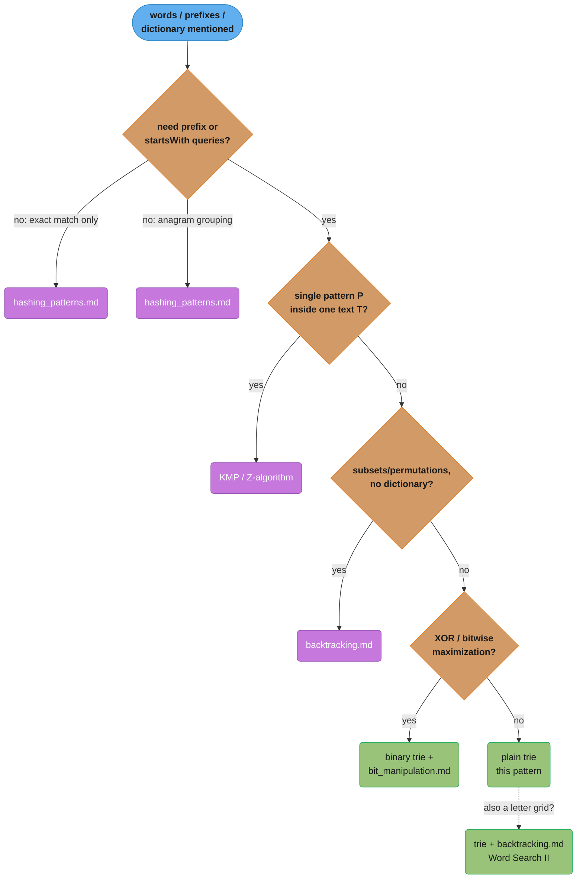
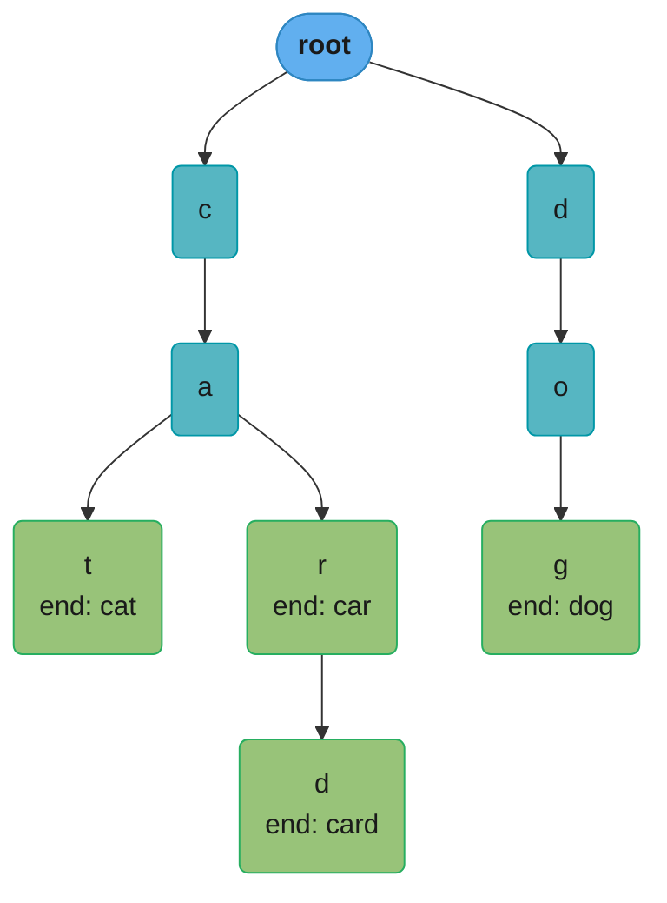
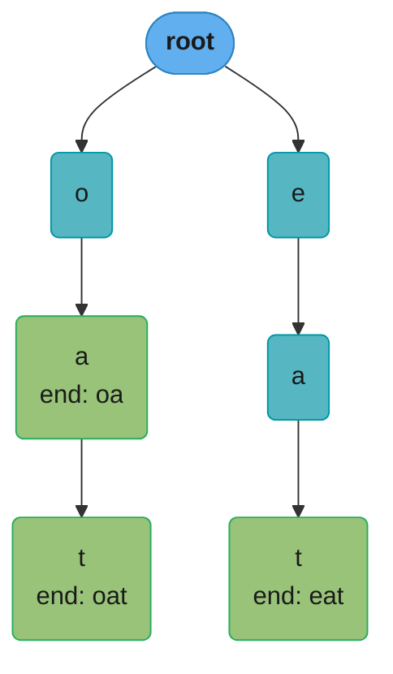
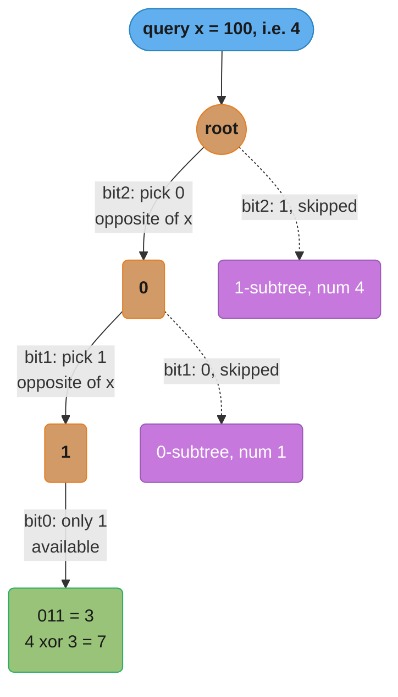

# Trie (Prefix Tree) Patterns

## Pattern Snapshot

**What it is**: A tree where each path from the root spells out a prefix —
every node represents one character, and a node marked "end of word" means
the path from the root to that node is a complete word in the set. Lookups,
insertions, and prefix checks all run in `O(L)`, where `L` is the length of
the word/prefix — **independent of how many words are stored**.

**One-line cue**: "Prefix" / "starts with" / "dictionary of words" / "search
a grid for words from a list" / "autocomplete."

**Typical complexity**: `O(L)` per insert/search/prefix-check, where `L` =
word length. Space: `O(total characters across all words)` worst case, much
less when words share prefixes.

---

## 1. Recognition Signals

**Use a trie when you see:**
- "Implement a dictionary" with `insert`, `search`, and `startsWith`
- "Word Search II" — find all dictionary words present in a grid
- "Autocomplete" / "search suggestions" / "type-ahead"
- "Replace words" — replace each word in a sentence with its shortest root
  from a dictionary
- "Longest word that can be built one character at a time" (every prefix is
  also in the dictionary)
- "Maximum XOR of two numbers" — a **binary trie** over bit representations
- "Add and search word" with wildcard (`.`) support
- Multiple words/strings AND repeated prefix-based queries against them

**Anti-signals (looks similar, use a different pattern):**
- You only need **exact-match** lookups (no prefix queries) ->
  [`hashing_patterns.md`](hashing_patterns.md) — a hashmap/set is simpler and
  just as fast for exact matches, with less memory overhead
- "Find all anagrams" / "group anagrams" — sorting or character-count keys
  are simpler -> [`hashing_patterns.md`](hashing_patterns.md)
- Single-string pattern matching (find occurrences of pattern P in text T) —
  that's KMP/Z-algorithm territory, covered in
  [`graph_and_string_algorithms`](../graph_and_string_algorithms/README.md),
  not a trie
- "Generate all subsets/permutations" with no dictionary involved ->
  [`backtracking.md`](backtracking.md)

The signals and anti-signals above collapse into one routing decision:



The four purple off-ramps (`hashA`/`hashB`/`kmp`/`back`) peel off the special
cases first; whatever survives all four checks is a genuine trie problem
(green), and a letter grid on top of that is Word Search II's
trie-plus-backtracking combo.

---

## 2. Mental Model & Intuition

A trie for the words `{"cat", "car", "card", "dog"}`:



Teal nodes are prefixes still in progress; green nodes are complete words.
`r` is both a complete word (`car`, green) and an internal node with its own
child `d` (`card`) — a trie node can be end-of-word and a branch point at
the same time.

```
Path root -> c -> a -> t  spells "cat", and the 't' node is marked (end).
Path root -> c -> a -> r  spells "car", and the 'r' node is ALSO marked (end)
   -- "car" is itself a complete word, but the trie continues beyond it.
Path root -> c -> a -> r -> d  spells "card", marked (end).
Path root -> d -> o -> g  spells "dog", marked (end).

search("car")  -> follow c-a-r, land on a node with (end)=True  -> True
search("ca")   -> follow c-a, land on a node with (end)=False   -> False
startsWith("ca") -> follow c-a, node EXISTS (end doesn't matter) -> True
```

**Key insight**: `"cat"` and `"car"` and `"card"` **share** the `c -> a`
prefix — stored *once*. This is what makes a trie memory-efficient for
dictionaries with overlapping prefixes, and what makes "does any word start
with X" an O(L) walk instead of an O(n) scan over all words.

---

## 3. The Template

```python
from __future__ import annotations
from typing import Optional

# ---------------------------------------------------------------------------
# Template 1: Basic Trie -- insert, search, startsWith
# ---------------------------------------------------------------------------
class TrieNode:
    def __init__(self) -> None:
        self.children: dict[str, TrieNode] = {}
        self.is_end: bool = False

class Trie:
    def __init__(self) -> None:
        self.root = TrieNode()

    def insert(self, word: str) -> None:
        node = self.root
        for ch in word:
            if ch not in node.children:
                node.children[ch] = TrieNode()
            node = node.children[ch]
        node.is_end = True

    def search(self, word: str) -> bool:
        node = self._walk(word)
        return node is not None and node.is_end

    def starts_with(self, prefix: str) -> bool:
        return self._walk(prefix) is not None

    def _walk(self, s: str) -> Optional[TrieNode]:
        node = self.root
        for ch in s:
            if ch not in node.children:
                return None
            node = node.children[ch]
        return node


# ---------------------------------------------------------------------------
# Template 2: Add and Search Word -- wildcard '.' matches any character
# ---------------------------------------------------------------------------
class WordDictionary:
    def __init__(self) -> None:
        self.root = TrieNode()

    def add_word(self, word: str) -> None:
        node = self.root
        for ch in word:
            if ch not in node.children:
                node.children[ch] = TrieNode()
            node = node.children[ch]
        node.is_end = True

    def search(self, word: str) -> bool:
        def dfs(node: TrieNode, i: int) -> bool:
            if i == len(word):
                return node.is_end
            ch = word[i]
            if ch == ".":
                # try EVERY child branch
                return any(dfs(child, i + 1) for child in node.children.values())
            if ch not in node.children:
                return False
            return dfs(node.children[ch], i + 1)

        return dfs(self.root, 0)


# ---------------------------------------------------------------------------
# Template 3: Word Search II -- trie + grid DFS with pruning
# ---------------------------------------------------------------------------
def find_words(board: list[list[str]], words: list[str]) -> list[str]:
    root = TrieNode()
    for word in words:
        node = root
        for ch in word:
            node = node.children.setdefault(ch, TrieNode())
        node.is_end = True
        node.word = word  # type: ignore[attr-defined]  -- stash the full word at the end node

    rows, cols = len(board), len(board[0])
    result: list[str] = []

    def dfs(r: int, c: int, node: TrieNode) -> None:
        ch = board[r][c]
        if ch not in node.children:
            return
        nxt = node.children[ch]
        if nxt.is_end:
            result.append(nxt.word)  # type: ignore[attr-defined]
            nxt.is_end = False       # avoid duplicate matches via other paths

        board[r][c] = "#"  # mark visited
        for dr, dc in ((1, 0), (-1, 0), (0, 1), (0, -1)):
            nr, nc = r + dr, c + dc
            if 0 <= nr < rows and 0 <= nc < cols and board[nr][nc] != "#":
                dfs(nr, nc, nxt)
        board[r][c] = ch  # restore -- CRITICAL, see BROKEN -> FIX (S8)

    for r in range(rows):
        for c in range(cols):
            dfs(r, c, root)

    return result
```

---

## 4. Annotated Walkthrough

**Problem**: [Word Search II (LC 212)](https://leetcode.com/problems/word-search-ii/)
`board = [["o","a"],["e","t"]]`, `words = ["oa", "oat", "eat"]`

**Build the trie**: insert "oa" (marks 'a' as end, `word="oa"`), then "oat"
(extends through 'a' -> 't', marks 't' as end, `word="oat"`), then "eat"
(separate branch from root, marks final 't' as end, `word="eat"`).



Green nodes mark the three dictionary words the DFS below is hunting for;
`oa` sits on the same path as `oat`, so finding one costs nothing extra
toward finding the other.

**DFS from (0,0) = 'o'**:

```
dfs(0,0,root): board[0][0]='o', root.children has 'o' -> nxt = o-node
  o-node.is_end = False -> no match yet
  mark board[0][0]='#'
  neighbors of (0,0): (1,0)='e', (0,1)='a'

  dfs(1,0, o-node): board[1][0]='e', o-node.children has only 'a' -> 'e' not found -> return

  dfs(0,1, o-node): board[0][1]='a', o-node.children has 'a' -> nxt = a-node ("oa")
    a-node.is_end = True, word="oa" -> result=["oa"], set a-node.is_end=False
    mark board[0][1]='#'
    neighbors of (0,1): (1,1)='t', (0,0)='#' (skip)

    dfs(1,1, a-node): board[1][1]='t', a-node.children has 't' -> nxt = t-node ("oat")
      t-node.is_end = True, word="oat" -> result=["oa","oat"], set t-node.is_end=False
      mark board[1][1]='#'; no unvisited neighbors with matching trie children
      restore board[1][1]='t'

    restore board[0][1]='a'
  restore board[0][0]='o'
```

**DFS from (0,1)='a', (1,0)='e', (1,1)='t'** (outer loop continues): from
`(1,0)='e'`, the trie has an `e` branch — DFS finds `e -> a -> t` = "eat" via
`(1,0) -> (0,1) -> (1,1)`, appending `"eat"`.

**Final result**: `["oa", "oat", "eat"]` (order may vary based on traversal
order, but all three are found).

---

## 5. Complexity

| Operation | Time | Space | Notes |
|---|---|---|---|
| `insert(word)` | O(L) | O(L) new nodes worst case (no shared prefix) | Shared prefixes mean amortized space is much less |
| `search(word)` / `starts_with(prefix)` | O(L) | O(1) | Independent of how many words are stored |
| Wildcard `search` (Template 2) | O(26^d · L) worst case | O(L) recursion depth | `d` = number of `.` wildcards; each branches into up to 26 children |
| Word Search II (Template 3) | O(rows·cols · 4^max_word_len) worst case | O(total trie size) | Trie pruning (removing matched leaves) cuts dead branches early in practice |

The trie's real power in Word Search II: without it, you'd run a separate
DFS *per word* checking if it exists in the grid — `O(words · rows·cols·4^L)`.
With a shared trie, **one** DFS pass per starting cell explores all words
simultaneously, and a dead end in the trie (no matching child) prunes that
branch for *every* word sharing that prefix at once.

### Decoding `O(L)` — lookup independent of dictionary size

**What it means.** "Looking a word up costs one step per
*letter in the word you are looking up*. It does not matter whether the trie
holds ten words or ten million — the cost is the length of your query and
nothing else."

That independence is the headline. Every other container's lookup cost mentions
the collection size somewhere: a sorted array is `O(log N)` comparisons, a
balanced BST the same, a linked scan `O(N)`. A trie's is `O(L)` with no `N`
anywhere in it, because the query string itself dictates the path taken.

| Symbol | What it is |
|---|---|
| `L` | Length of the word or prefix being looked up |
| `N` | Number of words stored in the trie |
| `O(L)` | Trie search or insert cost — one child-map hop per character |
| `O(1)` auxiliary | Search allocates nothing; it just walks existing pointers |
| `26^d` | Wildcard branching factor: `d` dots, each trying up to 26 children |

**Walk one example.** Insert `cat`, `car`, `card`, `dog`, then search. `*`
marks a node where `is_end` is true.

```
  insert order   nodes created            running node count (excluding root)
  ------------   ----------------------   -----------------------------------
  "cat"          c, ca, cat*                              3
  "car"          car*        (c, ca reused)               4
  "card"         card*       (c, ca, car reused)          5
  "dog"          d, do, dog*                              8

  resulting trie:

                    (root)
                   /      \
                  c        d
                  |        |
                  a        o
                 / \       |
                t*  r*     g*
                    |
                    d*

  4 words, 13 total characters, but only 8 nodes -- prefix sharing
  saved 13 - 8 = 5 nodes (38 percent)

  search("card"):  root -> c -> a -> r -> d, then check is_end   = 4 hops, TRUE
  search("ca"):    root -> c -> a,           then check is_end   = 2 hops, FALSE
  starts_with("ca"): same 2 hops, no is_end check                = 2 hops, TRUE
  search("cab"):   root -> c -> a, no child 'b'  -> fail at hop 3
```

`search("card")` cost 4 hops. Add a million more words to this trie and
`search("card")` still costs 4 hops — it walks the same four pointers. That is
`O(L)` with no `N` in it.

**Why this complexity.** Each character consumes exactly one dictionary lookup
in the current node's `children` map (`O(1)` average) and one pointer follow.
There are `L` characters, so `L` constant-cost steps. Insert is the same walk
with node creation on misses, so also `O(L)`, allocating at most `L` new nodes.
The wildcard variant is the exception that proves the rule: a `.` cannot pick a
single child, so it must try all of them, and `d` dots multiply into `26^d`
paths — the only time dictionary breadth re-enters the bound.

### Decoding trie vs. hash set — what you pay and what you buy

**Put simply.** "A hash set matches a trie on exact lookup and
beats it badly on memory. You pay that memory premium for exactly one thing:
prefix queries, which a hash set fundamentally cannot answer without scanning
every key it holds."

Note that a hash set's `O(1)` lookup is not actually free of `L` either —
hashing the string must read all `L` of its characters. So on exact-match
lookup the two are the same order of work. Memory and prefix capability are the
real axes.

**Walk one example.** A realistic English vocabulary: `N = 100,000` words,
average length 8 characters (`800,000` characters total).

```
  structure   sizing arithmetic                                  memory
  ---------   ----------------------------------------------     ---------
  hash set    strings: 100,000 x (49 B overhead + 8 chars)
                      = 100,000 x 57 B          = 5,700,000 B
              table:  needs > 100,000 / 0.6 = 166,667 slots,
                      rounds to 262,144 slots x 8 B
                                                = 2,097,152 B
              total                             = 7,797,152 B     ~7.8 MB

  trie        upper bound on nodes: 800,000 (zero prefix sharing)
              real English sharing lands near   ~250,000 nodes
              per node: 26 child pointers x 8 B = 208 B
              total: 250,000 x 208 B            = 52,000,000 B    ~52 MB

  ratio = 52,000,000 / 7,797,152 = 6.67   ->  the trie costs about 6.7x more
```

(A dict-based node instead of a fixed 26-slot array shrinks the trie
considerably when most nodes have one or two children, at the cost of a slower
constant factor per hop. That is the usual production tradeoff.)

**What the 6.7x buys.** The prefix query, which the hash set cannot do at all:

```
  query: "every word starting with 'pre'"   (suppose 500 such words)

  hash set   no key ordering, no shared structure -> must test all keys
             100,000 string prefix comparisons             = 100,000 ops

  trie       walk r -> p -> r -> e                         =       3 ops
             then collect the subtree, which contains
             exactly the 500 matches and nothing else      =     500 ops
             total                                         =     503 ops

  ratio = 100,000 / 503 = 198.8   ->  about 199x fewer operations
```

**Why the gap is structural, not tunable.** Hashing deliberately destroys
locality — that is what makes it uniform. `"pre"`, `"prefix"`, and `"prevent"`
land in unrelated buckets by design, so there is no bucket, no range, no pointer
to follow that groups them. A trie instead makes the prefix *be* the path, so
every word sharing a prefix necessarily sits in one subtree. If a problem
mentions prefixes, autocomplete, or wildcards, that structural property is the
reason to reach for a trie; if it only asks "is this word present", use the hash
set and keep the 44 MB.

---

## 6. Variations & Sub-patterns

**Wildcard search** ([Add and Search Word (LC 211)](https://leetcode.com/problems/design-add-and-search-words-data-structure/)):
when the search character is `.`, recurse into **every** child instead of a
single lookup. Each `.` can multiply the branching factor by up to 26, so
worst-case complexity is exponential in the number of wildcards — but in
practice, dictionaries are sparse and most branches dead-end quickly.

**Binary trie for XOR**
([Maximum XOR of Two Numbers in an Array (LC 421)](https://leetcode.com/problems/maximum-xor-of-two-numbers-in-an-array/)):
instead of 26 lowercase-letter children, each `TrieNode` has at most 2
children — `0` and `1` — representing one bit. Insert each number's binary
representation (fixed width, e.g., 32 bits, most-significant-bit first). To
find the maximum XOR with a given number `x`, walk the trie greedily choosing
the **opposite** bit of `x` at each level when available (opposite bits
maximize XOR at that position). See
[`bit_manipulation.md`](bit_manipulation.md) for the bit-level mechanics.

A 3-bit example with `nums = [4, 3, 1]` (`100`, `011`, `001`) querying `x = 4`:



Orange nodes are the greedy decision points: at each level the walk skips
the purple sibling subtree and takes the opposite bit of `x`, landing on the
green answer leaf. Bit0 has only one child, so the choice is forced there —
it still happens to be optimal. Maximum XOR = `7` (`4 xor 3`).

**Replace Words** ([LC 648](https://leetcode.com/problems/replace-words/)):
insert all dictionary "roots" into a trie. For each word in the sentence,
walk the trie character by character; the **first** `is_end=True` node
encountered gives the shortest matching root (replace the word with it). If
no `is_end` is hit before the word ends or the trie path breaks, leave the
word unchanged. A hashset of roots would require checking *every prefix
length* of the word against the set — O(L) hashes vs. one O(L) trie walk.

**Longest Word in Dictionary** ([LC 720](https://leetcode.com/problems/longest-word-in-dictionary/)):
a word qualifies only if **every prefix** of it (including itself) is also a
complete word in the dictionary. Insert all words, then DFS the trie —
only descend into a child if that child's `is_end` is `True` — tracking the
longest (and lexicographically smallest, on ties) path found.

**Autocomplete / Search Suggestions**
([Design Search Autocomplete System (LC 642)](https://leetcode.com/problems/design-search-autocomplete-system/),
[Search Suggestions System (LC 1268)](https://leetcode.com/problems/search-suggestions-system/)):
beyond the basic trie, store additional metadata at (or reachable from) each
node — e.g., a list of the top-k matching words by frequency, updated on
insert, or a sorted list of words in each subtree. Trades insert-time work
for O(1)-ish lookup of "top suggestions for this prefix."

---

## 7. Problem Bank

| Problem | Difficulty | Variation | Recognition cue/twist |
|---|---|---|---|
| [Implement Trie (LC 208)](https://leetcode.com/problems/implement-trie-prefix-tree/) | Medium | Basic trie | The foundational problem — insert/search/startsWith |
| [Add and Search Word (LC 211)](https://leetcode.com/problems/design-add-and-search-words-data-structure/) | Medium | Wildcard DFS | `.` branches into all children |
| [Word Search II (LC 212)](https://leetcode.com/problems/word-search-ii/) | Hard | Trie + grid DFS + pruning | The signature problem — one DFS pass finds all words |
| [Replace Words (LC 648)](https://leetcode.com/problems/replace-words/) | Medium | Shortest-prefix lookup | First `is_end` node = shortest root |
| [Longest Word in Dictionary (LC 720)](https://leetcode.com/problems/longest-word-in-dictionary/) | Medium | All-prefixes-valid DFS | Only descend into `is_end=True` children |
| [Maximum XOR of Two Numbers in an Array (LC 421)](https://leetcode.com/problems/maximum-xor-of-two-numbers-in-an-array/) | Medium | Binary trie | 2-ary trie over bits, greedy opposite-bit walk |
| [Design Search Autocomplete System (LC 642)](https://leetcode.com/problems/design-search-autocomplete-system/) | Hard | Trie + frequency ranking | Extra metadata per node for top-k suggestions |
| [Search Suggestions System (LC 1268)](https://leetcode.com/problems/search-suggestions-system/) | Medium | Prefix-sorted suggestions | Trie OR sort + binary search both work |
| [Longest Common Prefix (LC 14)](https://leetcode.com/problems/longest-common-prefix/) | Easy | Shared-path length | Trivial with a trie; vertical scanning also works |
| [Prefix and Suffix Search (LC 745)](https://leetcode.com/problems/prefix-and-suffix-search/) | Hard | Combined prefix+suffix trie | Insert `suffix + "#" + word` for every suffix |
| [Map Sum Pairs (LC 677)](https://leetcode.com/problems/map-sum-pairs/) | Medium | Trie storing aggregate values | Sum the values of all keys under a prefix; insert overwrites |
| [Word Break (LC 139)](https://leetcode.com/problems/word-break/) | Medium | Trie + DP (related) | Prefix membership drives `dp[i] = any(dp[j] and s[j:i] in trie)` |
| [Concatenated Words (LC 472)](https://leetcode.com/problems/concatenated-words/) | Hard | Trie + DFS word-break | A word counts if splittable into ≥2 dictionary words |
| [Stream of Characters (LC 1032)](https://leetcode.com/problems/stream-of-characters/) | Hard | Reversed (suffix) trie | Insert words reversed; match the incoming stream backward |
| [Maximum XOR With an Element From Array (LC 1707)](https://leetcode.com/problems/maximum-xor-with-an-element-from-array/) | Hard | Binary trie + offline queries | Sort queries by limit; insert nums ≤ limit into the bit trie |

---

## 8. Common Mistakes (BROKEN -> FIX)

**Mistake**: in Word Search II's grid DFS (Template 3), marking a cell as
visited (`board[r][c] = "#"`) but **forgetting to restore it** after the
recursive calls return. Other DFS starting points (or other branches of the
same DFS) then see the cell as permanently blocked, causing valid words to be
**missed entirely** — not just slower, but *incorrect*.

```python
# BROKEN: never restores board[r][c] after recursing
def dfs_broken(r, c, node, board, rows, cols, result):
    ch = board[r][c]
    if ch not in node.children:
        return
    nxt = node.children[ch]
    if nxt.is_end:
        result.append(nxt.word)
        nxt.is_end = False

    board[r][c] = "#"  # mark visited
    for dr, dc in ((1, 0), (-1, 0), (0, 1), (0, -1)):
        nr, nc = r + dr, c + dc
        if 0 <= nr < rows and 0 <= nc < cols and board[nr][nc] != "#":
            dfs_broken(nr, nc, nxt, board, rows, cols, result)
    # BUG: missing `board[r][c] = ch` here
```

**Trace the bug** on `board = [["o","a"],["e","t"]]`,
`words = ["oa", "eat"]`:

```
Outer loop starts dfs_broken(0,0,root) for 'o':
  board[0][0]='o' -> matches root's 'o' child
  mark board[0][0] = '#'   (NEVER RESTORED)

  -> dfs_broken(0,1, o-node) for 'a':
       'a' matches o-node's child ("oa" found!) -> result=["oa"]
       mark board[0][1] = '#'   (NEVER RESTORED)
       ... no further matches from here, returns

  dfs_broken(0,0) returns. board[0][0] is STILL '#', board[0][1] is STILL '#'.

Outer loop continues to (1,0)='e':
  dfs_broken(1,0, root) for 'e': matches root's 'e' child
  mark board[1][0] = '#'

  neighbor (0,0) = '#' -> SKIPPED (but it should be 'o', irrelevant to "eat" anyway)
  neighbor (1,1) = 't': 'e'-node has no 't' child for "eat"... wait,
  "eat" = e-a-t, so e-node's child should be 'a'.

  neighbor (0,0)='#' -- this is where 'a' WOULD need to be reached via a
  DIFFERENT path for some inputs, but here neighbor (1,1)='t' is checked:
  't' not in e-node.children ('a' expected) -> dead end.

  The only OTHER neighbor of (1,0) that could hold 'a' is (0,0) -- but it's
  permanently '#' from the first DFS call. "eat" requires e->a->t where 'a'
  must come from (0,1), which is ALSO permanently '#'.

Result: ["oa"] only -- "eat" is silently missed because cells (0,0) and (0,1)
were left marked '#' from the FIRST outer-loop iteration.
```

**Fix**: restore `board[r][c] = ch` after the loop over neighbors, so each
DFS call leaves the board exactly as it found it — visited marks only apply
*within* the current call stack, not globally.

```python
# FIXED: restore the cell after recursing (standard backtracking)
def dfs_fixed(r, c, node, board, rows, cols, result):
    ch = board[r][c]
    if ch not in node.children:
        return
    nxt = node.children[ch]
    if nxt.is_end:
        result.append(nxt.word)
        nxt.is_end = False

    board[r][c] = "#"
    for dr, dc in ((1, 0), (-1, 0), (0, 1), (0, -1)):
        nr, nc = r + dr, c + dc
        if 0 <= nr < rows and 0 <= nc < cols and board[nr][nc] != "#":
            dfs_fixed(nr, nc, nxt, board, rows, cols, result)
    board[r][c] = ch  # FIX: restore for sibling DFS calls / other start cells
```

**Re-trace with the fix**: after `dfs_fixed(0,1, o-node)` finishes finding
"oa", `board[0][1]` is restored to `'a'`. After `dfs_fixed(0,0, root)`
finishes, `board[0][0]` is restored to `'o'`. When the outer loop reaches
`(1,0)='e'`, both `(0,0)` and `(0,1)` are back to their original characters,
so `dfs_fixed(1,0,root)` can correctly traverse `e -> a (via (0,1)) -> t (via
(1,1))`, appending `"eat"`. **Final result: `["oa", "eat"]`** — both words
found.

---

## 9. Related Patterns & When to Switch

- **[`hashing_patterns.md`](hashing_patterns.md)** — if the problem only
  needs exact-match lookups (no "starts with" / prefix queries), a hashmap
  or set is simpler, has less memory overhead, and is just as fast (O(1)
  average vs. O(L)). Reach for a trie specifically when **prefixes** matter.
- **[`backtracking.md`](backtracking.md)** — Word Search II combines a trie
  (for O(1) "is this a dead end?" pruning) with a backtracking grid DFS (for
  exploring paths). The trie doesn't replace backtracking — it makes the
  backtracking *prunable*.
- **[`graph_traversal.md`](graph_traversal.md)** — the grid-DFS portion of
  Word Search II is structurally identical to the flood-fill DFS in
  `graph_traversal.md`, with the trie as an additional pruning guide.
- **[`bit_manipulation.md`](bit_manipulation.md)** — the binary trie variant
  (Maximum XOR) is really a bit-manipulation problem wearing a trie's
  clothing; understanding XOR's bit-level behavior is the harder half.

---

## 10. Cross-links

- Concept module: [`graphs_tries_and_advanced_structures/`](../graphs_tries_and_advanced_structures/README.md) —
  trie node structure, space/time complexity proofs, comparison with hashmaps
- Applied: [`../../database/search_engines/`](../../database/search_engines/README.md) —
  inverted indexes and prefix-based term lookups in real search engines are
  the production-scale analog of a trie's `startsWith` query

---

## 11. Interview Q&A

**Why is a trie faster than a hashmap for prefix queries, given that hashmap
lookups are O(1)?**
A hashmap gives O(1) for **exact-match** lookups, but "does any key start
with 'app'?" requires either iterating all keys (O(n·L)) or maintaining a
separate prefix index. A trie answers "does any word start with 'app'?" in
O(L) — just walk 4 characters from the root and check if the resulting node
exists — *regardless* of how many words are stored. The hashmap's O(1) only
applies to the exact query it was built for; prefix queries are not what
hashing optimizes for.

**Q: When is a trie actually worse than a hashmap (memory-wise)?**
When words share **few or no prefixes** — e.g., a dictionary of random UUIDs.
Each `TrieNode` carries the overhead of a `dict` (or array) of children plus
a boolean flag, multiplied across every character of every word with no
sharing. A hashset of strings would store each string once, more compactly.
Tries win specifically when prefix-sharing is high (natural-language
dictionaries, URLs, IP routing tables).

**In Word Search II, why build ONE trie from all dictionary words instead of
running a separate grid-search for each word?**
Running a separate DFS per word costs `O(words · rows·cols·4^L)` — the grid
is re-explored from scratch for every word. With a single shared trie, **one**
DFS pass per starting cell explores all words simultaneously: at each step,
`ch not in node.children` prunes that branch for *every word that doesn't
share this prefix*, all at once. Shared prefixes across words (e.g., "oa" and
"oat") mean shared trie traversal too.

**Walk through the BROKEN -> FIX in §8 — why does the bug cause MISSED words
rather than just extra time/space?**
`board[r][c] = "#"` is used as the "currently on this DFS path" marker — it
must be **scoped to the current call stack**, not permanent. If it's never
restored, cells visited by the *first* DFS call (from the first
outer-loop starting cell) remain `"#"` for *all subsequent* outer-loop calls.
Those cells then look like walls to every other DFS, even though they hold
perfectly valid letters needed to spell other words — so words requiring
those cells are never found. It's a correctness bug, not just an efficiency
one.

**How does pruning (`nxt.is_end = False` after a match) prevent duplicate
results, and could the same word be found twice without it?**
If a word like "oa" can be spelled via two different paths in the grid (e.g.,
two different 'o' cells both adjacent to an 'a'), both DFS branches would
reach the same trie node with `is_end=True` and append `"oa"` to the result
twice. Setting `is_end = False` immediately after the first match means the
second path's check `if nxt.is_end` is now `False` — the word is reported
only once. (A more aggressive optimization also deletes leaf trie nodes with
no remaining children after a match, to prune the trie itself for future
searches — useful when `find_words` might be called repeatedly.)

**How does the wildcard `.` search in Template 2 avoid being O(26^L) for
every query?**
Worst case (all wildcards, e.g., `"......"`), it genuinely is exponential —
`O(26^L)` — because every position branches into all 26 children. In
practice, most branches dead-end quickly (`ch not in node.children` for most
of the 26 options at any real node, since real dictionaries are sparse), so
actual runtime is far better than the theoretical worst case. The recursion
depth is bounded by `O(L)` regardless.

**For Maximum XOR of Two Numbers, what does each "level" of the binary trie
represent, and why insert most-significant-bit first?**
Each level corresponds to one **bit position**, from most significant to
least significant. Inserting MSB-first means two numbers that differ in a
high bit diverge near the *root* of the trie — and high bits contribute more
to the XOR's magnitude than low bits (just like decimal place value). The
greedy "pick the opposite bit if available" strategy at each level is only
correct because higher bits are decided first — a greedy choice at the MSB
can never be "undone" by a better choice at a lower bit, since
`2^k > sum(2^0..2^(k-1))`.

**`children: dict[str, TrieNode]` vs. `children: list[Optional[TrieNode]]` of
size 26 — what's the tradeoff?**
A `dict` only allocates entries for characters actually present — better for
sparse alphabets (Unicode, mixed case) or when most nodes have few children.
A fixed-size array (`[None] * 26`) gives O(1) *guaranteed* (no hashing) access
and is more cache-friendly, at the cost of allocating 26 slots per node even
if only 1-2 are used. For pure lowercase-English problems, the array is
common in competitive programming for speed; the dict is more general and
common in interview-style Python code.

**Why do we need an explicit `is_end` flag — can't we just check
`len(node.children) == 0` to mean "this is a complete word"?**
No — `"car"` and `"card"` are both valid words in the same trie, where `"car"`
is a **prefix** of `"card"`. The node for `"car"`'s last `'r'` has a child
(`'d'`, leading to `"card"`), so `len(children) != 0`, yet `"car"` is itself a
complete word. `is_end` is the *only* way to mark "a complete word ends here,
even though the trie continues beyond this point."

**How would Replace Words be solved WITHOUT a trie, and why is the trie
approach better?**
Without a trie: for each word in the sentence, generate all its prefixes
(`O(L)` prefixes) and check each against a hashset of roots, taking the
shortest match — `O(L)` hashset lookups per word, each lookup itself `O(L)`
for hashing the substring, giving `O(L^2)` per word. With a trie: walk the
word character-by-character once (`O(L)`), stopping at the first `is_end`
node — a single O(L) walk replaces O(L) separate hash lookups.

**Q: How would you delete a word from a trie?**
Walk to the node representing the word's last character and set
`is_end = False`. If that node now has **no children** AND `is_end == False`,
it's "dead weight" — recursively remove it from its parent's `children` dict,
and repeat the check at the parent (it might now also become dead weight if
it has no other children and isn't itself a word's end). This cleanup is
optional for correctness (an unreachable `is_end=False` leaf doesn't affect
`search`/`startsWith`), but matters for memory if deletions are frequent.
