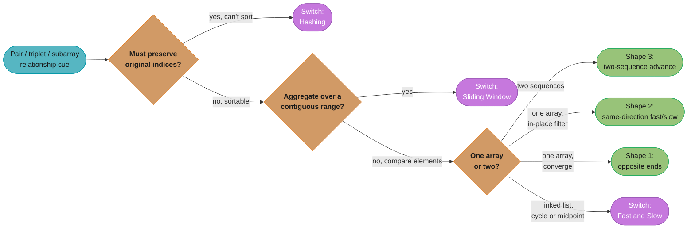
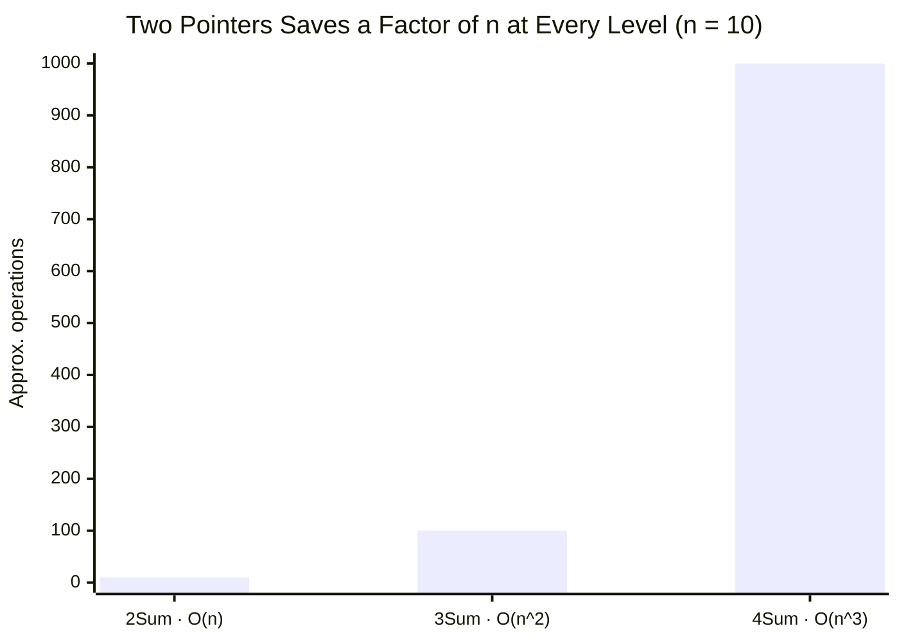

# Two Pointers

## Pattern Snapshot

Two indices walk through a sequence — toward each other, in the same direction, or across two sequences — to avoid the O(n^2) brute force of checking every pair. **Cue**: sorted (or sortable) array/string + "pair/triplet/subarray" + a target relationship. **Typical complexity**: O(n) or O(n log n) if a sort is required first, O(1) extra space.

---

## 1. Recognition Signals

**Reach for two pointers when you see:**

- "sorted array" + "find a pair (or triplet) that sums to / is closest to a target"
- "remove duplicates in place" / "move zeroes" / "partition array"
- Two sorted arrays/strings that need to be merged or compared element-by-element
- "is this string a palindrome (ignoring non-alphanumeric)?"
- "container with most water" — area between two indices, want to maximize
- Comparing two sequences for subsequence-ness (e.g., "is `s` a subsequence of `t`?")

**Anti-signals — looks like two pointers but isn't:**

- The array is **unsorted** and you need a pair sum, but you cannot sort (order matters for the answer, e.g., return *indices*) → use **hashing (complement)** instead ([hashing_patterns.md](hashing_patterns.md))
- You need the **longest/shortest contiguous subarray** under a constraint — that's a *variable-size window*, which is **sliding window** ([sliding_window.md](sliding_window.md)), a close cousin but with different invariant management
- You need to track a **running aggregate over a window** (sum, count, frequency) — sliding window again
- "Find k-th smallest pair distance" — this combines binary search on answer + two pointers, not pure two pointers

The dividing line: **two pointers** moves indices based on a *comparison* between elements at those indices (or against a target); **sliding window** moves indices based on whether an *aggregate over the range* satisfies a constraint.



**Pattern-selection decision tree:** the recognition signals above and the "when to switch" rules in Section 9 collapse into one routing path — a sortable input compared element-by-element stays in two pointers and lands on one of the three shapes from Section 2 (opposite ends, same-direction, or two-sequence); anything else hands off to hashing, sliding window, or fast & slow pointers.

---

## 2. Mental Model & Intuition

Three canonical shapes:

```
Shape 1 — Opposite ends, converging (sorted array, pair sum)

  [ -4, -1,  0,  1,  2,  3 ]
    L                    R       L=0, R=5 -> sum = -1 (too small) -> L++
         L               R       L=1, R=5 -> sum =  2 (too small) -> L++
              L          R       L=2, R=5 -> sum =  3 (== target) -> record, move both


Shape 2 — Same direction, fast/slow (in-place compaction)

  Remove duplicates from sorted array:
  [0, 0, 1, 1, 1, 2, 2]
   slow
   fast

  fast scans ahead; slow only advances (and copies fast's value)
  when nums[fast] != nums[slow]


Shape 3 — Two separate sequences, merge-style

  s = "abcde"        i -->
  t = "aebcd"        j -->

  Advance j always; advance i only when s[i] == t[j].
  i reaching len(s) means s is a subsequence of t.
```

The invariant that makes two pointers correct: **monotonicity**. Moving `L` right only increases the sum/value under consideration; moving `R` left only decreases it. Because the search space is sorted (or the relation is monotonic), you can safely discard the half that *cannot* contain a better answer — this is what gives you O(n) instead of O(n^2).

---

## 3. The Template

### Opposite-ends template (pair sum on sorted array)

```python
def two_sum_sorted(nums: list[int], target: int) -> list[int]:
    """Return indices (0-indexed) of the pair summing to target, or [-1, -1]."""
    left, right = 0, len(nums) - 1
    while left < right:
        current = nums[left] + nums[right]
        if current == target:
            return [left, right]
        elif current < target:
            left += 1   # need a bigger sum -> move left pointer right
        else:
            right -= 1  # need a smaller sum -> move right pointer left
    return [-1, -1]
```

### Same-direction (fast/slow) template — in-place compaction

```python
def remove_duplicates(nums: list[int]) -> int:
    """Remove duplicates from sorted nums in place; return new length."""
    if not nums:
        return 0
    slow = 0
    for fast in range(1, len(nums)):
        if nums[fast] != nums[slow]:
            slow += 1
            nums[slow] = nums[fast]
    return slow + 1
```

### Two-sequence template — subsequence check / merge

```python
def is_subsequence(s: str, t: str) -> bool:
    i = j = 0
    while i < len(s) and j < len(t):
        if s[i] == t[j]:
            i += 1
        j += 1
    return i == len(s)
```

---

## 4. Annotated Walkthrough

**Problem**: [3Sum (LC 15)](https://leetcode.com/problems/3sum/) — given an array, find all unique triplets that sum to zero.

**Brute force**: three nested loops, O(n^3), plus a set to dedupe — too slow for n up to 3000 (n^3 = 2.7 * 10^10).

**Key insight**: Sort the array (O(n log n)). Fix the first element `nums[i]`, then the remaining problem — "find a pair in `nums[i+1:]` that sums to `-nums[i]`" — is exactly the two-pointer pair-sum template on a sorted subarray.

```python
def three_sum(nums: list[int]) -> list[list[int]]:
    nums.sort()
    result = []
    n = len(nums)

    for i in range(n - 2):
        if nums[i] > 0:
            break  # smallest element positive -> no triplet can sum to 0
        if i > 0 and nums[i] == nums[i - 1]:
            continue  # skip duplicate "first" elements

        left, right = i + 1, n - 1
        target = -nums[i]
        while left < right:
            current = nums[left] + nums[right]
            if current == target:
                result.append([nums[i], nums[left], nums[right]])
                left += 1
                right -= 1
                while left < right and nums[left] == nums[left - 1]:
                    left += 1   # skip duplicate "second" elements
                while left < right and nums[right] == nums[right + 1]:
                    right -= 1  # skip duplicate "third" elements
            elif current < target:
                left += 1
            else:
                right -= 1

    return result
```

**Trace on `nums = [-1, 0, 1, 2, -1, -4]` → sorted: `[-4, -1, -1, 0, 1, 2]`**

```
i=0 (nums[i]=-4, target=4)
  L=1(-1) R=5(2)  sum=1  < 4 -> L++
  L=2(-1) R=5(2)  sum=1  < 4 -> L++
  L=3(0)  R=5(2)  sum=2  < 4 -> L++
  L=4(1)  R=5(2)  sum=3  < 4 -> L++  (L==R, loop ends)

i=1 (nums[i]=-1, target=1)
  L=2(-1) R=5(2)  sum=1  == 1 -> record [-1,-1,2]; L=3, R=4
  L=3(0)  R=4(1)  sum=1  == 1 -> record [-1,0,1];  L=4, R=3 (loop ends)

i=2: nums[2]==nums[1]==-1 -> skip (dedupe)
i=3 (nums[i]=0, target=0)
  L=4(1) R=5(2) sum=3 > 0 -> R--  (L==R, loop ends)

result = [[-1,-1,2], [-1,0,1]]
```

This matches the expected output. The dedup checks at the "first", "second", and "third" positions are what make the result *unique* triplets — without them you'd get the same triplet multiple times.

---

## 5. Complexity

| Step | Time | Space |
|---|---|---|
| Sort | O(n log n) | O(log n) – O(n) (sort implementation dependent) |
| Outer loop + inner two-pointer scan | O(n) outer * O(n) inner = O(n^2) | O(1) |
| **Total** | **O(n^2)** | **O(1)** extra (excluding output and sort space) |

For plain pair-sum two pointers (no outer loop), it's **O(n log n)** if a sort is required, or **O(n)** if the array is already sorted, with **O(1)** space. Compare to the brute-force O(n^2) (pair) or O(n^3) (triplet) — two pointers trades the *combinatorial* search for a *sorted, monotonic* search.



**Growth at a glance:** fixing one more element before the two-pointer scan multiplies the work by another factor of n — the O(n), O(n^2), O(n^3) figures from the table above and the kSum question in Section 11, plotted here at a fixed n=10 so the curve is visible at a glance.

### Decoding the complexity claim

**Put simply.** "Oh of n squared means: for each of the `n` ways to pick a first element, one single sweep across the rest of the array — `n` sweeps, not `n` nested searches through every remaining pair."

That framing matters because it locates the cost precisely. The `n^2` comes entirely from the *outer* `for` loop multiplied by *one* linear scan; it does not come from the two pointers, which are themselves linear. Drop the outer loop (plain pair sum) and you drop straight to O(n).

| Symbol | What it is |
|---|---|
| `O(...)` | An upper bound on how fast the work grows as the input grows |
| `n` | The input size — the number of elements in `nums` |
| `O(n)` | One pass. The inner two-pointer scan, on its own |
| `O(n log n)` | The sort. `log n` is roughly "how many times you can halve `n`" |
| `O(n^2)` | Outer loop times inner scan — the 3Sum total |
| `O(n^3)` | Three nested loops — the brute force the pattern replaces |
| `O(1)` | Constant extra memory: a fixed handful of variables, whatever `n` is |

**Walk one example.** Sorted `nums = [-4, -1, -1, 0, 1, 2]`. The outer loop fixes `i = 1` (value `-1`), so the inner scan hunts for a pair summing to `+1`:

```
  sorted nums = [ -4,  -1,  -1,   0,   1,   2 ]      i = 1 fixes -1, target = +1
  index            0    1    2    3    4    5

  step  left  right  nums[left]  nums[right]  sum  vs target  action
  ----  ----  -----  ----------  -----------  ---  ---------  ------------------
    1     2      5       -1           2        1     equal    record (-1, -1, 2)
    2     3      4        0           1        1     equal    record (-1,  0, 1)
    3     4      3        -            -        -    crossed  pointers met, stop

  left advanced 2 ; right retreated 2 ; the gap 5 - 2 = 3 closed in 2 steps
```

The two pointers start `3` apart and every step closes that gap by at least `1`, so the scan cannot run longer than the span it started with. That is the whole proof of the inner O(n).

**Why the inner scan is O(n) and not O(n^2).** `left` only increases and `right` only decreases — neither can revisit an index, so between them they make at most `n` moves per scan, not `n` moves each per position. Summing one scan over every outer `i` gives `(n-1) + (n-2) + ... + 1 = n(n-1)/2`, i.e. about `n^2/2`. At LC 15's limit of `n = 3000`: the two-pointer version does about `3000^2 / 2 = 4,500,000` operations, while the O(n^3) brute force does `3000^3 = 2.7 * 10^10` — **6,000 times more work.**

---

## 6. Variations & Sub-patterns

- **Pair sum, sorted, return indices** — the base template ([Two Sum II — Input Array Is Sorted (LC 167)](https://leetcode.com/problems/two-sum-ii-input-array-is-sorted/))
- **Pair sum, unsorted, return original indices** — cannot sort (would lose index info) → switch to hashing
- **3Sum / 4Sum** — fix k-2 elements with nested loops, two pointers for the last two ([4Sum (LC 18)](https://leetcode.com/problems/4sum/))
- **Closest sum** — track `min(abs(sum - target))` instead of exact match ([3Sum Closest (LC 16)](https://leetcode.com/problems/3sum-closest/))
- **Same-direction compaction** — slow/fast pointers for in-place filtering: remove duplicates, move zeroes, partition by predicate
- **Container / area maximization** — opposite ends, but the move rule is "always move the pointer at the *shorter* boundary" because that's the only one that could improve the area ([Container With Most Water (LC 11)](https://leetcode.com/problems/container-with-most-water/))
- **Two-sequence merge** — merge sorted arrays/lists, subsequence check, string comparison with backspaces ([Backspace String Compare (LC 844)](https://leetcode.com/problems/backspace-string-compare/) — often easier with two pointers from the *back*)
- **Trapping rain water** — two pointers from both ends tracking `left_max` / `right_max` ([Trapping Rain Water (LC 42)](https://leetcode.com/problems/trapping-rain-water/))

---

## 7. Problem Bank

| Problem | Difficulty | Variation | Recognition cue / twist |
|---|---|---|---|
| [Valid Palindrome (LC 125)](https://leetcode.com/problems/valid-palindrome/) | Easy | Opposite ends on string | Skip non-alphanumeric chars while comparing |
| [Two Sum II — Sorted (LC 167)](https://leetcode.com/problems/two-sum-ii-input-array-is-sorted/) | Easy | Base pair-sum template | Array guaranteed sorted, return 1-indexed |
| [Move Zeroes (LC 283)](https://leetcode.com/problems/move-zeroes/) | Easy | Same-direction compaction | Maintain relative order of non-zero elements |
| [Remove Duplicates from Sorted Array (LC 26)](https://leetcode.com/problems/remove-duplicates-from-sorted-array/) | Easy | Same-direction compaction | In-place, return new length |
| [Reverse String (LC 344)](https://leetcode.com/problems/reverse-string/) | Easy | Opposite ends, swap | Trivial but establishes the pattern |
| [3Sum (LC 15)](https://leetcode.com/problems/3sum/) | Medium | Fix one + two pointers | Dedup at three positions |
| [3Sum Closest (LC 16)](https://leetcode.com/problems/3sum-closest/) | Medium | Closest-sum variant | Track min absolute difference, not exact match |
| [Container With Most Water (LC 11)](https://leetcode.com/problems/container-with-most-water/) | Medium | Area maximization | Move pointer at the shorter line |
| [Sort Colors (LC 75)](https://leetcode.com/problems/sort-colors/) | Medium | Three pointers (Dutch flag) | low/mid/high partitioning, single pass |
| [4Sum (LC 18)](https://leetcode.com/problems/4sum/) | Medium | Two fixed + two pointers | O(n^3); watch for integer overflow in other languages |
| [Sort Array By Parity (LC 905)](https://leetcode.com/problems/sort-array-by-parity/) | Easy | Same-direction partition | Partition by predicate, not value |
| [Is Subsequence (LC 392)](https://leetcode.com/problems/is-subsequence/) | Easy | Two-sequence advance | Advance the pattern pointer only on a match |
| [Squares of a Sorted Array (LC 977)](https://leetcode.com/problems/squares-of-a-sorted-array/) | Easy | Opposite-ends merge | Largest squares come from the two ends; fill the result back-to-front |
| [Backspace String Compare (LC 844)](https://leetcode.com/problems/backspace-string-compare/) | Medium | Two-sequence merge from the back | Scan right-to-left, skipping characters consumed by `#` |
| [Trapping Rain Water (LC 42)](https://leetcode.com/problems/trapping-rain-water/) | Hard | Opposite ends + running max | Track left_max/right_max; move pointer with smaller max |
| [Minimum Size Subarray Sum (LC 209)](https://leetcode.com/problems/minimum-size-subarray-sum/) | Medium | Boundary case (anti-signal) | Often miscategorized as two pointers — it's sliding window |

---

## 8. Common Mistakes (BROKEN -> FIX)

**Mistake: using `<=` instead of `<` in the opposite-ends loop condition, causing a pointer to compare against itself or cross incorrectly.**

```python
# BROKEN — when left == right, current = nums[left] + nums[left] = 2*nums[left],
# which can spuriously equal target and return a "pair" that's really one element used twice.
def two_sum_sorted_broken(nums: list[int], target: int) -> list[int]:
    left, right = 0, len(nums) - 1
    while left <= right:          # BUG: allows left == right
        current = nums[left] + nums[right]
        if current == target:
            return [left, right]
        elif current < target:
            left += 1
        else:
            right -= 1
    return [-1, -1]
```

```python
# FIXED — strict inequality ensures left and right are always two distinct indices.
def two_sum_sorted_fixed(nums: list[int], target: int) -> list[int]:
    left, right = 0, len(nums) - 1
    while left < right:           # FIX: left and right must differ
        current = nums[left] + nums[right]
        if current == target:
            return [left, right]
        elif current < target:
            left += 1
        else:
            right -= 1
    return [-1, -1]
```

**Trigger**: `nums = [3, 5]`, `target = 6`. With `<=`, when `left == right == 0` (after some moves) the code could compute `3 + 3 = 6 == target` and incorrectly return `[0, 0]` — using `nums[0]` twice. The fixed version never lets `left` and `right` collide, so it correctly returns `[-1, -1]` if no valid distinct pair exists.

---

## 9. Related Patterns & When to Switch

- **[Sliding Window](sliding_window.md)** — switch when the question is about a *contiguous range's aggregate* (sum, count of distinct, longest/shortest) rather than a *pairwise comparison* between two specific indices. Two pointers usually move in *opposite* directions or one is "ahead"; sliding window's two pointers (`left`, `right`) both move *forward*, bounding a window.
- **[Hashing Patterns](hashing_patterns.md)** — switch when the array is unsorted **and** you must preserve original indices in the answer (sorting would destroy that information), or when you need O(1) average lookups for arbitrary complements rather than a sorted-order argument.
- **[Fast & Slow Pointers](fast_and_slow_pointers.md)** — a specialized same-direction two-pointer variant for linked lists, where "fast" moves 2 steps for every 1 step of "slow" (cycle detection, middle-finding) — different ratio, different goal (detect a cycle / find a midpoint, not partition an array).
- **[Merge Intervals](merge_intervals.md)** — when the "two sequences" are lists of intervals rather than scalars, and the comparison is on interval boundaries (start/end) rather than values.

---

## 10. Cross-links

- Concept module: [arrays_strings_and_hashing](../arrays_strings_and_hashing/) — array fundamentals, in-place algorithms, two-pointer intro
- [complexity_analysis_and_big_o](../complexity_analysis_and_big_o/) — why O(n) two-pointer beats O(n^2) brute force
- [sorting_and_searching](../sorting_and_searching/) — sort-first-then-two-pointer is a recurring composition
- Applied: [`../../java/collections_internals/README.md`](../../java/collections_internals/README.md) — `Arrays.sort()` complexity guarantees relevant when sort-then-scan is your strategy
- Master index: [dsa_patterns/README.md](README.md)

---

## 11. Interview Q&A

**Q: Why does two pointers require the array to be sorted (or sortable)?**
Because the algorithm's correctness depends on monotonicity: moving `left` right strictly increases the candidate sum, and moving `right` left strictly decreases it. Without sorted order, you cannot conclude that "the current pair sum is too small, so the *only* way to increase it is to move `left`" — there could be a larger value anywhere in the array. Sorting establishes the monotonic structure that lets you discard half the remaining search space at each step, which is what gives O(n) instead of O(n^2).

**Q: If sorting costs O(n log n), how is two pointers ever better than a hashmap approach which is O(n)?**
For a single pair-sum query, a hashmap *is* asymptotically better (O(n) vs O(n log n)). Two pointers wins when (a) the input is already sorted, (b) you need O(1) extra space (hashmap is O(n)), or (c) you need to find *all* pairs/triplets without duplicates — the sorted order makes deduplication trivial (skip adjacent equal elements), whereas deduplicating hashmap-based results requires extra set bookkeeping.

**Q: In 3Sum, why do we break early when `nums[i] > 0`?**
Because the array is sorted ascending. If the smallest "first" element under consideration is already positive, then `nums[i] + nums[left] + nums[right]` (where `left > i` and `right > left`, both also positive or larger) can only be positive — it can never sum to zero. This is a monotonicity-based pruning step that avoids wasted iterations.

**Q: How do you handle duplicates in 3Sum so the output has no duplicate triplets?**
Three separate dedup checks: (1) skip `i` if `nums[i] == nums[i-1]` (don't reuse the same "first" value), (2) after finding a match, advance `left` past all values equal to the one just used, and (3) similarly retreat `right` past all equal values. All three checks compare to the *adjacent* element because the array is sorted — equal values are guaranteed to be contiguous.

**Q: What's the difference between the "opposite ends" and "same direction" two-pointer shapes?**
Opposite ends (`left=0, right=n-1`, converging) is for finding a *relationship between two elements* (pair sum, palindrome check, container area) — the search space shrinks from both sides. Same direction (`slow` and `fast`, both starting near 0) is for *in-place filtering/compaction* — `fast` explores, `slow` marks the boundary of the "good" region built so far. They solve different problem shapes and should not be confused.

**Q: For Container With Most Water, why do you always move the pointer at the *shorter* line, not the taller one?**
The area is `min(height[left], height[right]) * (right - left)`. If you move the pointer at the *taller* line inward, the width decreases and the height is still bounded by the shorter line (or worse) — the area cannot increase. If you move the pointer at the *shorter* line, the width decreases but there's a *chance* the new height is taller, potentially increasing the area. Moving the shorter pointer is the only choice that doesn't provably make things worse, so it's the only direction that needs to be explored — this is itself a small greedy/exchange argument.

**Q: Can two pointers be used on two different arrays/strings?**
Yes — this is the "two-sequence" shape. Examples: merging two sorted arrays (LC 88), checking if one string is a subsequence of another (LC 392), or comparing two strings with backspace characters from the end (LC 844). Each pointer advances independently based on a comparison between `seq1[i]` and `seq2[j]`.

**Q: Is two pointers always O(n)? What if there's a sort first?**
The two-pointer scan itself is O(n) (each pointer moves at most n times total, so the loop body runs at most O(n) times even though there are two indices). If a sort is required first, the *overall* complexity is dominated by the sort: O(n log n). If the input is already guaranteed sorted (a common interview constraint), the overall complexity is O(n).

**Q: How would you find the pair with the sum closest to a target (not exact)?**
Same opposite-ends scan, but instead of returning immediately on `current == target`, track `best = min(best, abs(current - target))` on every iteration, and still move `left`/`right` based on whether `current < target` or `current > target` (this monotonicity still holds for "closest" — moving toward the target direction is still correct).

**Q: What's the time/space complexity of 4Sum, and how does it generalize to kSum?**
4Sum is O(n^3): two nested loops to fix the first two elements (O(n^2)), then O(n) two-pointer scan for the last pair. In general, kSum is O(n^(k-1)): (k-2) nested loops plus one O(n) two-pointer pass. Space is O(1) extra (excluding the sort and the output list). Many implementations write a recursive `kSum` that bottoms out at `twoSum` for k=2.

**Q: When would "remove duplicates from sorted array" two-pointer solution fail if the array were NOT sorted?**
The `slow`/`fast` compaction relies on duplicates being *adjacent* — `nums[fast] != nums[slow]` only correctly identifies "new" values if all instances of a value are grouped together. On an unsorted array, duplicates could be scattered (e.g., `[1, 2, 1]`), and the same in-place scan would fail to remove the second `1`. You'd need a hash set instead, which costs O(n) space.

**Q: How do you adapt the pair-sum template if the array can contain negative numbers?**
No adaptation needed — the two-pointer pair-sum template relies only on the array being *sorted*, not on values being non-negative. Negative numbers are handled naturally because sorted order still gives you the monotonicity guarantee (`nums[left] + nums[right]` still increases as `left` increases, decreases as `right` decreases). Where non-negativity *does* matter is in **sliding window** problems (e.g., subarray sum < k), where a negative value would break the "shrink when too big" invariant.
