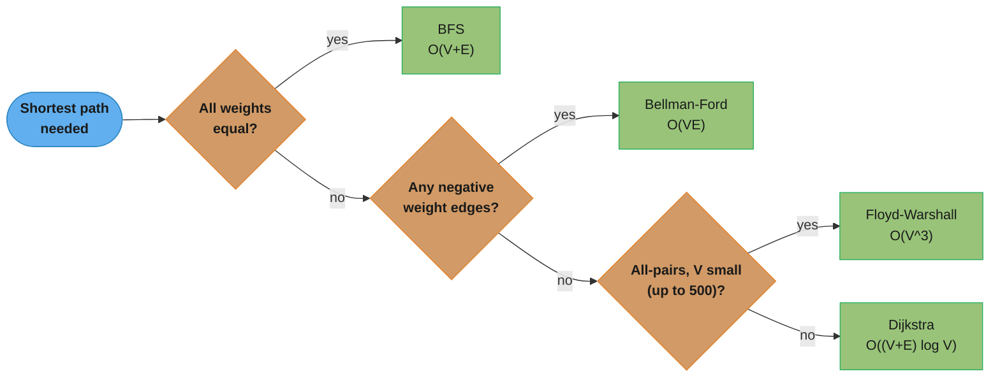
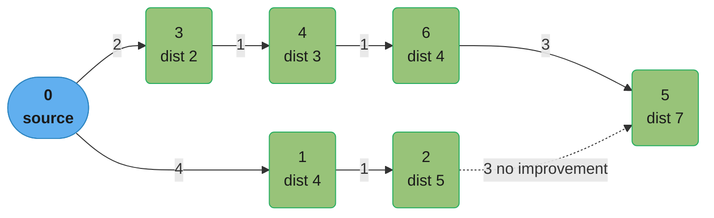
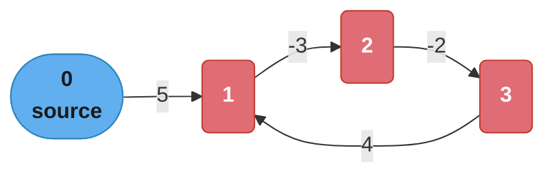
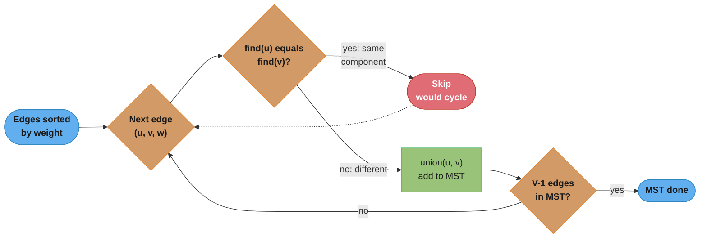

# Graph and String Algorithms

> Traversal, shortest paths, spanning trees, and pattern matching — the algorithms every backend system quietly relies on.

---

## 1. Concept Overview

Graph algorithms encode and solve problems on relationships: networks, dependencies, routes, and states. String algorithms solve pattern matching and text processing at scale. Together they cover a large fraction of advanced interview problems and underlie virtually every significant backend system.

This module covers: BFS (unweighted shortest paths, level-order traversal), iterative DFS (connected components, cycle detection, topological sort), Dijkstra (non-negative weighted shortest paths), Bellman-Ford (negative weights, negative cycle detection), Kruskal and Prim (minimum spanning trees), and string algorithms KMP, Rabin-Karp, and Z-algorithm.

The data structure foundations (adjacency list/matrix, Trie, Union-Find, segment tree) are covered in [`graphs_tries_and_advanced_structures`](../graphs_tries_and_advanced_structures/).

---

## 2. Intuition

> **One-line analogy**: BFS is ripples spreading from a stone dropped in water — every point at the same radius is reached simultaneously. Dijkstra is a courier route-planner who always dispatches the truck with the shortest current route next. KMP is a reader who, on mismatch, slides the pattern only as far as the partial match tells them — never re-reads a character.

**Mental model for graph algorithms**: Think of the graph as a state machine. A "path" is a sequence of states. BFS explores states in order of hop count; Dijkstra in order of edge-weight distance; DFS in order of discovery time. Most graph problems reduce to: "find a path with property X," "determine if X is reachable," or "order states such that dependencies are satisfied."

**Mental model for string algorithms**: Pattern matching is a 2-pointer problem on the pattern's internal structure. The naive algorithm re-starts the pattern from the beginning on mismatch. KMP and Z-algorithm precompute where the pattern is consistent with itself — allowing the pointer to skip back only as far as the longest proper prefix that is also a suffix (KMP) or the longest prefix that matches starting at each position (Z-array).

**Key insight**: The choice of shortest-path algorithm depends entirely on edge weights: BFS for unweighted (all weights = 1), Dijkstra for non-negative weights (min-heap, greedy), Bellman-Ford for negative weights or negative cycle detection, Floyd-Warshall for all-pairs when n is small.

---

## 3. Core Principles

**BFS invariant**: When a vertex v is dequeued, `dist[v]` is the shortest hop count from the source. This holds because BFS processes vertices in non-decreasing order of distance, and each edge contributes exactly 1 to the distance.

**Dijkstra invariant**: When a vertex v is extracted from the min-heap, `dist[v]` is the shortest weighted distance from the source. Valid only for non-negative edge weights (negative weights break the invariant — a shorter path via an unprocessed vertex could exist).

**Bellman-Ford**: After k relaxation passes, `dist[v]` is the shortest path using at most k edges. Since shortest paths have at most V-1 edges (no cycles in a shortest path when no negative cycles exist), V-1 passes suffice. If any distance improves in pass V, a negative cycle is reachable.

**Topological sort**: A linear ordering of vertices such that for every directed edge (u, v), u comes before v. Exists if and only if the graph is a DAG (no directed cycles). Two algorithms: Kahn's (BFS-based, in-degree tracking) and DFS-based (reverse post-order). Kahn's is preferable in practice (easier to detect cycles via unprocessed nodes).

**KMP failure function**: `fail[i]` = length of the longest proper prefix of `pattern[:i+1]` that is also a suffix. On mismatch at position j in the pattern, shift to `fail[j-1]` instead of 0. Never moves the text pointer backward.

---

## 4. Types / Architectures / Strategies

### Shortest Path Algorithm Selection

| Algorithm | Weights | Time | Space | Use case |
|-----------|---------|------|-------|----------|
| BFS | Unweighted (all = 1) | O(V + E) | O(V) | Social networks, grid problems, word ladder |
| Dijkstra | Non-negative | O((V+E) log V) | O(V) | Route planning, network routing (OSPF) |
| Bellman-Ford | Any (detects neg cycles) | O(VE) | O(V) | Arbitrage detection, distributed Bellman-Ford in RIP |
| SPFA | Typically O(E), worst O(VE) | O(VE) worst | O(V) | Faster Bellman-Ford in practice (queue-based) |
| Floyd-Warshall | Any (no neg cycles) | O(V³) | O(V²) | All-pairs shortest path, transitive closure |
| A* | Non-negative + heuristic | O(E log V) | O(V) | Grid pathfinding (with admissible heuristic) |

### MST Algorithm Selection

| Algorithm | Time | Best for | Notes |
|-----------|------|----------|-------|
| Kruskal | O(E log E) | Sparse graphs | Sort edges, Union-Find for cycle detection |
| Prim (heap) | O((V+E) log V) | Dense graphs | Priority queue; add min-weight crossing edge |
| Borůvka | O(E log V) | Parallel MST | Each component picks min outgoing edge |

### String Search Algorithms

| Algorithm | Preprocessing | Search | Space | Best for |
|-----------|--------------|--------|-------|----------|
| Naive | O(1) | O(nm) | O(1) | Short patterns, simple code |
| KMP | O(m) | O(n) | O(m) | Single pattern search; worst-case linear |
| Rabin-Karp | O(m) | O(n) avg, O(nm) worst | O(1) | Multiple patterns; rolling hash |
| Z-algorithm | O(m) | O(n) | O(m) | Pattern in string, string periodicity |
| Aho-Corasick | O(M) (sum of patterns) | O(n + M + k) | O(M) | Multiple pattern simultaneous search |
| Boyer-Moore | O(m + σ) | O(n/m) best | O(m + σ) | Large alphabets; best practical average |
| Suffix Array | O(n log n) | O(m log n) | O(n) | Multiple searches over same text |

---

## 5. Architecture Diagrams

### Shortest Path Algorithm Selection — Decision Flow



The algorithm choice is a strict function of the edge-weight regime (§2's key insight): each diamond asks one question about the weights, and negative weights always route to Bellman-Ford since it is the only one of the four whose correctness invariant tolerates them.

### Dijkstra — Priority Queue Relaxation



Dijkstra always pops the smallest tentative distance from the heap and finalises it; the dotted edge from 2 to 5 is the relaxation that arrives too late (min(7, 5+3) = 7) and changes nothing. The heap trace below shows the pop order that produced these final distances.

```
Source = 0. dist = [0, inf, inf, inf, inf, inf, inf]

Heap: [(0, 0)]
Pop (0,0): relax 1->dist[1]=4, relax 3->dist[3]=2. Heap: [(2,3),(4,1)]
Pop (2,3): relax 4->dist[4]=3, relax 0 already visited. Heap: [(3,4),(4,1)]
Pop (3,4): relax 6->dist[6]=4, relax 3 already visited. Heap: [(4,1),(4,6)]
Pop (4,1): relax 2->dist[2]=5. Heap: [(4,6),(5,2)]
Pop (4,6): relax 5->dist[5]=7. Heap: [(5,2),(7,5)]
Pop (5,2): relax 5->dist[5]=min(7,5+3)=7. No improvement. Heap: [(7,5)]
Pop (7,5): done.

Final dist: [0, 4, 5, 2, 3, 7, 4]
```

### KMP Failure Function

```
Pattern: "ABCABCABD"
         0123456789

Build fail[]:
  fail[0] = 0   (A: no proper prefix that is also suffix)
  fail[1] = 0   (AB: proper prefixes: A; suffixes: B -> no match)
  fail[2] = 0   (ABC: no match)
  fail[3] = 1   (ABCA: prefix "A" = suffix "A" -> length 1)
  fail[4] = 2   (ABCAB: prefix "AB" = suffix "AB" -> length 2)
  fail[5] = 3   (ABCABC: prefix "ABC" = suffix "ABC" -> length 3)
  fail[6] = 4   (ABCABCA: prefix "ABCA" = suffix "ABCA" -> length 4)
  fail[7] = 5   (ABCABCAB: prefix "ABCAB" = suffix "ABCAB" -> length 5)
  fail[8] = 0   (ABCABCABD: no matching prefix-suffix)
fail = [0, 0, 0, 1, 2, 3, 4, 5, 0]

Search "ABCABCABCABD" for pattern:
  text:    A B C A B C A B C A B D
  pattern: A B C A B C A B D
  match 0..7, mismatch at 8 (text='C', pattern='D')
  -> jump to fail[7]=5 in pattern, continue from text[8]
  pattern pointer at 5: "ABCABC|ABD"
  match 8 (C=C), match 9..11 (ABD=ABD) -> FOUND at text[3]
```

The fail[] value at each index is the length of the longest prefix-that-is-also-a-suffix seen so far — kept as a column-aligned value table on purpose, since character alignment is the information Mermaid cannot draw. The search trace beneath it shows the payoff: on the mismatch at position 8 the pointer jumps straight to fail[7]=5 instead of restarting at 0, skipping 5 redundant comparisons.

### Bellman-Ford — Negative Cycle Detection



The cycle 1 to 2 to 3 to 1 sums to -3 + -2 + 4 = -1, a negative cycle, so every relaxation pass keeps lowering dist[1], dist[2], and dist[3] with no fixed point. The pass-by-pass trace below shows exactly that: the same three distances shrink every pass instead of converging.

```
Pass 1: dist = [0, 5, 2, 0, inf...]    (0->1=5, 1->2=2, 2->3=0)
Pass 2: dist = [0, 4, 2, 0, ...]       (3->1=4 < 5 -> dist[1]=4)
Pass 3: dist = [0, 3, 1, -1, ...]      (cycle reduces all three)
...
Pass V: improvement detected -> NEGATIVE CYCLE REACHABLE
```

### Kruskal's MST — Union-Find Cycle Check



Kruskal processes edges in weight order and uses Union-Find purely as a cycle oracle: `find(u) == find(v)` means u and v are already connected, so adding this edge would close a cycle and it is skipped; otherwise `union` merges the two components and the edge joins the MST. The loop stops once V-1 edges have been added, exactly as `kruskal_mst` in §6 implements it.

---

## 6. How It Works — Detailed Mechanics

### BFS — Shortest Hops, Level-Order

```python
from __future__ import annotations
from collections import deque
from typing import Dict, List, Optional


def bfs_shortest(adj: Dict[int, List[int]], source: int) -> Dict[int, int]:
    """
    BFS from source. Returns dist[v] = shortest hop count to v, or -1 if unreachable.
    O(V + E).
    """
    dist: Dict[int, int] = {source: 0}
    queue: deque[int] = deque([source])
    while queue:
        u = queue.popleft()
        for v in adj.get(u, []):
            if v not in dist:
                dist[v] = dist[u] + 1
                queue.append(v)
    return dist


def bfs_path(adj: Dict[int, List[int]], source: int, target: int) -> Optional[List[int]]:
    """Reconstruct shortest path from source to target using BFS."""
    parent: Dict[int, Optional[int]] = {source: None}
    queue: deque[int] = deque([source])
    while queue:
        u = queue.popleft()
        if u == target:
            break
        for v in adj.get(u, []):
            if v not in parent:
                parent[v] = u
                queue.append(v)
    if target not in parent:
        return None
    # Reconstruct
    path, node = [], target
    while node is not None:
        path.append(node)
        node = parent[node]
    return path[::-1]
```

### DFS — Connected Components, Cycle Detection

```python
def dfs_iterative(adj: Dict[int, List[int]], source: int) -> List[int]:
    """Iterative DFS traversal order. O(V + E)."""
    visited = set()
    stack = [source]
    order: List[int] = []
    while stack:
        u = stack.pop()
        if u in visited:
            continue
        visited.add(u)
        order.append(u)
        for v in adj.get(u, []):
            if v not in visited:
                stack.append(v)
    return order


def connected_components(adj: Dict[int, List[int]], n: int) -> List[List[int]]:
    """Find all connected components. O(V + E)."""
    visited = set()
    components: List[List[int]] = []
    for v in range(n):
        if v not in visited:
            comp = dfs_iterative(adj, v)
            components.append(comp)
            visited.update(comp)
    return components


def has_cycle_directed(adj: Dict[int, List[int]], n: int) -> bool:
    """Detect cycle in directed graph via DFS coloring. O(V + E)."""
    WHITE, GRAY, BLACK = 0, 1, 2   # unvisited, in stack, done
    color = [WHITE] * n

    def dfs(u: int) -> bool:
        color[u] = GRAY
        for v in adj.get(u, []):
            if color[v] == GRAY:
                return True            # back edge -> cycle
            if color[v] == WHITE and dfs(v):
                return True
        color[u] = BLACK
        return False

    return any(dfs(u) for u in range(n) if color[u] == WHITE)
```

### Topological Sort — Kahn's Algorithm

```python
from collections import defaultdict


def topological_sort_kahn(adj: Dict[int, List[int]], n: int) -> Optional[List[int]]:
    """
    BFS-based topological sort (Kahn's algorithm).
    Returns None if graph has a cycle.
    O(V + E).
    """
    in_degree = defaultdict(int)
    for u in range(n):
        for v in adj.get(u, []):
            in_degree[v] += 1

    queue: deque[int] = deque(u for u in range(n) if in_degree[u] == 0)
    order: List[int] = []

    while queue:
        u = queue.popleft()
        order.append(u)
        for v in adj.get(u, []):
            in_degree[v] -= 1
            if in_degree[v] == 0:
                queue.append(v)

    return order if len(order) == n else None   # cycle if not all nodes processed
```

### Dijkstra's Shortest Path

```python
import heapq
from typing import Tuple


WeightedAdj = Dict[int, List[Tuple[int, int]]]   # {u: [(v, weight), ...]}


def dijkstra(adj: WeightedAdj, n: int, source: int) -> List[float]:
    """
    Single-source shortest path with non-negative weights.
    O((V + E) log V) with binary min-heap.
    """
    INF = float("inf")
    dist = [INF] * n
    dist[source] = 0
    heap: List[Tuple[float, int]] = [(0.0, source)]

    while heap:
        d, u = heapq.heappop(heap)
        if d > dist[u]:
            continue                    # stale entry (lazy deletion)
        for v, w in adj.get(u, []):
            if dist[u] + w < dist[v]:
                dist[v] = dist[u] + w
                heapq.heappush(heap, (dist[v], v))

    return dist
```

### Bellman-Ford — Handles Negative Weights

```python
def bellman_ford(
    edges: List[Tuple[int, int, int]],   # (u, v, weight)
    n: int,
    source: int
) -> Optional[List[float]]:
    """
    Shortest paths from source with possible negative weights.
    Returns None if a negative cycle is reachable from source.
    O(V * E).
    """
    INF = float("inf")
    dist = [INF] * n
    dist[source] = 0

    for _ in range(n - 1):             # V-1 relaxation passes
        updated = False
        for u, v, w in edges:
            if dist[u] != INF and dist[u] + w < dist[v]:
                dist[v] = dist[u] + w
                updated = True
        if not updated:
            break                      # early termination: no improvement

    # Check for negative cycle
    for u, v, w in edges:
        if dist[u] != INF and dist[u] + w < dist[v]:
            return None                # negative cycle detected

    return dist
```

### Kruskal's MST

```python
from typing import Set


def kruskal_mst(n: int, edges: List[Tuple[int, int, int]]) -> Tuple[List[Tuple[int, int, int]], int]:
    """
    Minimum spanning tree. Returns MST edges and total weight.
    O(E log E) dominated by edge sort.
    """
    # Union-Find
    parent = list(range(n))
    rank = [0] * n

    def find(x: int) -> int:
        if parent[x] != x:
            parent[x] = find(parent[x])
        return parent[x]

    def union(x: int, y: int) -> bool:
        rx, ry = find(x), find(y)
        if rx == ry:
            return False
        if rank[rx] < rank[ry]:
            rx, ry = ry, rx
        parent[ry] = rx
        if rank[rx] == rank[ry]:
            rank[rx] += 1
        return True

    edges_sorted = sorted(edges, key=lambda e: e[2])
    mst: List[Tuple[int, int, int]] = []
    total_weight = 0

    for u, v, w in edges_sorted:
        if union(u, v):
            mst.append((u, v, w))
            total_weight += w
            if len(mst) == n - 1:
                break

    return mst, total_weight
```

### KMP — Linear Pattern Search

```python
def kmp_failure_function(pattern: str) -> List[int]:
    """
    fail[i] = length of the longest proper prefix of pattern[:i+1]
    that is also a suffix.
    O(m).
    """
    m = len(pattern)
    fail = [0] * m
    k = 0
    for i in range(1, m):
        while k > 0 and pattern[k] != pattern[i]:
            k = fail[k - 1]
        if pattern[k] == pattern[i]:
            k += 1
        fail[i] = k
    return fail


def kmp_search(text: str, pattern: str) -> List[int]:
    """
    Find all occurrences of pattern in text.
    O(n + m) where n = len(text), m = len(pattern).
    """
    if not pattern:
        return list(range(len(text) + 1))
    fail = kmp_failure_function(pattern)
    matches: List[int] = []
    k = 0   # number of characters matched in pattern
    for i, c in enumerate(text):
        while k > 0 and pattern[k] != c:
            k = fail[k - 1]
        if pattern[k] == c:
            k += 1
        if k == len(pattern):
            matches.append(i - len(pattern) + 1)
            k = fail[k - 1]
    return matches
```

### Rabin-Karp — Rolling Hash

```python
def rabin_karp_search(text: str, pattern: str, base: int = 31, mod: int = 10**9 + 7) -> List[int]:
    """
    Find all occurrences of pattern in text using rolling hash.
    Expected O(n + m); worst case O(nm) on hash collision.
    """
    n, m = len(text), len(pattern)
    if m > n:
        return []

    def char_val(c: str) -> int:
        return ord(c) - ord("a") + 1

    # Compute hash of pattern and first window
    p_hash = 0
    t_hash = 0
    h = 1   # base^(m-1) mod mod
    for _ in range(m - 1):
        h = (h * base) % mod

    for i in range(m):
        p_hash = (p_hash * base + char_val(pattern[i])) % mod
        t_hash = (t_hash * base + char_val(text[i])) % mod

    matches: List[int] = []
    for i in range(n - m + 1):
        if t_hash == p_hash:
            if text[i:i + m] == pattern:   # verify to handle collisions
                matches.append(i)
        if i < n - m:
            t_hash = (base * (t_hash - char_val(text[i]) * h) + char_val(text[i + m])) % mod
            if t_hash < 0:
                t_hash += mod

    return matches
```

### Z-Algorithm

```python
def z_algorithm(s: str) -> List[int]:
    """
    z[i] = length of the longest substring starting at s[i] that matches a prefix of s.
    z[0] is undefined (conventionally 0 or len(s)).
    O(n).
    """
    n = len(s)
    z = [0] * n
    l, r = 0, 0
    for i in range(1, n):
        if i < r:
            z[i] = min(r - i, z[i - l])
        while i + z[i] < n and s[z[i]] == s[i + z[i]]:
            z[i] += 1
        if i + z[i] > r:
            l, r = i, i + z[i]
    return z


def z_search(text: str, pattern: str) -> List[int]:
    """Find all occurrences of pattern in text using Z-algorithm. O(n + m)."""
    combined = pattern + "$" + text   # "$" must not appear in pattern or text
    z = z_algorithm(combined)
    m = len(pattern)
    return [i - m - 1 for i in range(m + 1, len(combined)) if z[i] == m]
```

---

## 7. Real-World Examples

**BFS in social networks**: LinkedIn's "2nd/3rd connections" feature computes BFS from a user node. Facebook uses multi-source BFS from all "mutual friends" to rank friend suggestions. The BFS horizon (number of hops) is the connection degree.

**Dijkstra in network routing**: OSPF (Open Shortest Path First), the most widely deployed interior gateway routing protocol, runs Dijkstra on the weighted link-state graph on every router to compute shortest-path trees. Each router maintains the full topology and runs Dijkstra independently. Modern OSPF implementations use binary heaps achieving O((V+E) log V) per topology change.

**Bellman-Ford in finance**: Arbitrage detection: model currencies as vertices, exchange rates as edge weights (log of rate). A negative cycle means a sequence of exchanges that returns more than the starting amount — Bellman-Ford detects this in O(VE). Used in automated trading systems.

**Topological sort in build systems**: Bazel, Gradle, and Make represent build targets as DAG nodes with edges for dependencies. Topological sort finds the order in which targets must be built. Kahn's algorithm is preferable because it naturally detects circular dependencies (unprocessed nodes after Kahn's = nodes in a cycle).

**KMP in grep/search tools**: GNU `grep` uses a variant of BM (Boyer-Moore), but finite-automaton approaches (equivalent to KMP) are used in regex engines for simple patterns. The Linux kernel's `string.h` uses a memchr loop; glibc uses SIMD-optimised KMP variants for `memmem`.

**Rabin-Karp in plagiarism detection**: MOSS (Measure Of Software Similarity, Stanford) uses rolling hashes to find common k-gram fingerprints across student submissions — conceptually Rabin-Karp with multiple patterns using a hash map instead of single-pattern comparison.

**Aho-Corasick in intrusion detection**: Snort IDS (intrusion detection system) uses Aho-Corasick to match thousands of attack signatures simultaneously against network packet payloads in one O(n) pass — far faster than running KMP for each signature.

---

## 8. Tradeoffs

### Shortest Path Algorithm Comparison

| Scenario | Best algorithm | Reasoning |
|----------|---------------|-----------|
| Unweighted graph, single source | BFS | O(V+E), simpler than Dijkstra |
| Non-negative weights, single source | Dijkstra | O((V+E) log V), greedy with heap |
| Negative weights, no negative cycles | Bellman-Ford | O(VE); can detect negative cycles |
| Negative cycles reachable | Bellman-Ford (returns None) | No meaningful shortest path exists |
| All-pairs, n ≤ 500 | Floyd-Warshall | O(V³), simple; impractical for large n |
| Grid pathfinding with heuristic | A* | A* = Dijkstra + admissible heuristic; faster in practice |
| Dynamic graphs (edge updates) | SSSP with amortised decrease-key | Fibonacci heap Dijkstra O(V log V + E) |

### String Search Selection

| Scenario | Best choice | Reasoning |
|----------|-------------|-----------|
| Single short pattern, simple code | Naive or Python `in` | O(nm) acceptable for small m |
| Long text, single pattern, worst-case guarantees | KMP or Z-algorithm | O(n+m) guaranteed |
| Multiple patterns simultaneously | Aho-Corasick | O(n + M + k), k = matches |
| Rolling hash applications (substring matching, fingerprinting) | Rabin-Karp | Easy to implement; average O(n+m) |
| Large alphabet, average-case speed | Boyer-Moore | O(n/m) on many practical inputs |

---

## 9. When to Use / When NOT to Use

**Use BFS when**: edge weights are uniform (or absent); you need shortest hop count; level-by-level exploration is needed (find all nodes at distance k); problems framed as 0-1 BFS (deque, edge weight 0 or 1).

**Use Dijkstra when**: edge weights are non-negative; you need single-source shortest paths; the graph is sparse (adjacency list + heap). Do NOT use Dijkstra when there are negative-weight edges — the invariant breaks.

**Use Bellman-Ford when**: the graph may have negative weights; you need to detect negative cycles; the graph is dense and |E| is close to |V²| (in which case O(VE) ≈ O(V³) may be acceptable vs Dijkstra's O(V² log V) on dense).

**Use KMP when**: you need worst-case linear pattern matching; the pattern is long and may have many repeated prefixes (e.g., "AAAAAAB" — failure function maximises efficiency). Do NOT use naive substring search inside a loop; the O(nm) cost accumulates.

**Use Rabin-Karp when**: you're searching for one pattern among many (map hashes to pattern index); you need approximate matching (hash similarity); plagiarism detection or document fingerprinting.

---

## 10. Common Pitfalls

### Pitfall 1 — Dijkstra with negative edges (wrong result, no error)

```python
# BROKEN: Dijkstra on a graph with negative edge (-5) returns wrong distances
# Graph: 0->1 (weight=10), 0->2 (weight=2), 2->1 (weight=-5)
# Correct dist[1] = 2 + (-5) = -3, but Dijkstra finalises dist[1]=10 first

# No error is raised — the algorithm silently returns wrong results.
```

```python
# FIX option 1: ensure no negative weights (re-weight with Johnson's algorithm)
# FIX option 2: use Bellman-Ford when negative weights are possible
def route_with_negative_weights(edges, n, source):
    return bellman_ford(edges, n, source)  # handles negatives, returns None on neg cycle
```

### Pitfall 2 — BFS without visited set (infinite loop on cycles)

```python
# BROKEN: BFS on a cyclic undirected graph without tracking visited
def broken_bfs(adj, source):
    queue = deque([source])
    result = []
    while queue:
        u = queue.popleft()
        result.append(u)
        for v in adj[u]:
            queue.append(v)    # BUG: re-adds visited nodes -> infinite loop
    return result
```

```python
# FIX: track visited nodes before or immediately at enqueue time
def fixed_bfs(adj, source):
    visited = {source}
    queue = deque([source])
    result = []
    while queue:
        u = queue.popleft()
        result.append(u)
        for v in adj.get(u, []):
            if v not in visited:
                visited.add(v)
                queue.append(v)
    return result
```

### Pitfall 3 — Stale heap entries in Dijkstra (correctness is fine but perf degrades)

```python
# NOT BROKEN (correct), but inefficient without stale-entry guard:
def dijkstra_stale(adj, n, src):
    dist = [float("inf")] * n
    dist[src] = 0
    heap = [(0, src)]
    while heap:
        d, u = heapq.heappop(heap)
        # BUG: no stale check -> processes the same vertex multiple times
        for v, w in adj.get(u, []):
            if dist[u] + w < dist[v]:
                dist[v] = dist[u] + w
                heapq.heappush(heap, (dist[v], v))
    return dist
```

```python
# FIX: skip stale entries with the d > dist[u] guard
def dijkstra_correct(adj, n, src):
    dist = [float("inf")] * n
    dist[src] = 0
    heap = [(0, src)]
    while heap:
        d, u = heapq.heappop(heap)
        if d > dist[u]:         # stale entry: a shorter path was already found
            continue
        for v, w in adj.get(u, []):
            if dist[u] + w < dist[v]:
                dist[v] = dist[u] + w
                heapq.heappush(heap, (dist[v], v))
    return dist
```

### Pitfall 4 — KMP: wrong failure function from 1-indexed code

```python
# BROKEN: KMP failure function starting fail[0]=0 but off-by-one in loop
def broken_kmp_fail(pattern):
    m = len(pattern)
    fail = [0] * m
    j = 0
    for i in range(1, m):
        while j > 0 and pattern[j] != pattern[i]:
            j = fail[j - 1]
        if pattern[j] == pattern[i]:
            j += 1
        fail[i] = j
    # BUG: forgot to reset j=0 between calls -> function is not reentrant
    return fail
```

```python
# FIX: use a local variable (j starts at 0, scoped to the function)
def kmp_failure_function_fixed(pattern: str) -> list[int]:
    m = len(pattern)
    fail = [0] * m
    k = 0                            # local, not shared
    for i in range(1, m):
        while k > 0 and pattern[k] != pattern[i]:
            k = fail[k - 1]
        if pattern[k] == pattern[i]:
            k += 1
        fail[i] = k
    return fail
```

### Pitfall 5 — Rabin-Karp hash collision causes missed matches

```python
# BROKEN: comparing only hashes without character-level verification
def broken_rabin_karp(text, pattern):
    ...
    if t_hash == p_hash:
        matches.append(i)   # BUG: hash collision -> false positive; also misses verification
    ...
```

```python
# FIX: always verify the character-level match when hashes agree
def fixed_rabin_karp(text, pattern):
    ...
    if t_hash == p_hash:
        if text[i:i + len(pattern)] == pattern:   # O(m) verification, O(1) expected
            matches.append(i)
    ...
```

---

## 11. Technologies & Tools

| Tool / Library | Use case | Notes |
|----------------|----------|-------|
| NetworkX (Python) | Graph algorithms (BFS/DFS/Dijkstra/MST) | High-level; not performance-critical paths |
| `scipy.sparse.csgraph` | Shortest paths on sparse graphs | C-backed; fast for large graphs |
| `igraph` | Large-scale graph analysis | C backend; faster than NetworkX |
| `re` module (Python) | Pattern matching with regex | Uses backtracking NFA; worst-case exponential for adversarial patterns |
| `google/re2` | Linear-time regex | DFA-based; O(n×m) guaranteed; no catastrophic backtracking |
| `fuzzysearch` PyPI | Approximate string matching | Levenshtein-based; for spell-tolerant search |
| Elasticsearch / Lucene | Full-text search (Aho-Corasick-like) | Inverted index + BM25; not raw KMP |

---

## 12. Interview Questions with Answers

**Q1: What is the difference between BFS and DFS for shortest path? When does BFS give the correct shortest path and DFS does not?**
BFS gives the correct shortest path in terms of hop count (for unweighted graphs) because it processes nodes in non-decreasing order of distance — the first time a node is reached is via the shortest path. DFS explores one path to its end before backtracking; it may find a path that is not shortest. For weighted graphs, neither BFS nor DFS gives shortest weighted paths — use Dijkstra or Bellman-Ford.

**Q2: Why can't Dijkstra handle negative edge weights? Give a concrete counterexample.**
Dijkstra's invariant: once a vertex u is extracted from the heap, dist[u] is final. With negative weights, a path through an unvisited vertex might use a negative edge to produce a shorter path to u after u has been finalised. Counterexample: vertices {0,1,2}, edges 0->1 (w=2), 0->2 (w=3), 2->1 (w=-2). Dijkstra finalises dist[1]=2 (shortest via 0->1), but the true shortest is 0->2->1 = 1. Bellman-Ford correctly finds this by relaxing edges in two passes.

**Q3: What is the time complexity of Dijkstra with a binary heap and why?**
O((V + E) log V). Each vertex is extracted from the heap once: V extractions × O(log V) each = O(V log V). Each edge triggers at most one relaxation and heap push: E pushes × O(log V) each = O(E log V). Total: O((V + E) log V). With a Fibonacci heap, decrease-key is O(1) amortised, giving O(V log V + E). In practice, the binary heap version is faster due to better cache behaviour.

**Q4: How does Bellman-Ford detect negative cycles?**
After V-1 relaxation passes, all shortest paths (using at most V-1 edges, since shortest paths in a graph without negative cycles have no repeated vertices) have been found. In the V-th pass, if any edge (u, v, w) still satisfies dist[u] + w < dist[v], then a shorter path with V edges exists — which means a cycle of negative total weight is reachable from the source.

**Q5: Explain Kahn's algorithm for topological sort and how it detects cycles.**
Kahn's BFS: compute in-degrees of all vertices. Enqueue vertices with in-degree 0. Repeatedly dequeue a vertex u, add it to the result, and decrement in-degrees of u's neighbours. If any neighbour's in-degree becomes 0, enqueue it. After processing, if the result has fewer than V vertices, the remaining vertices form one or more cycles (they were never reached by the 0-in-degree queue). This is the correct, direct cycle detection.

**Q6: What is the KMP failure function and what does fail[i] represent?**
`fail[i]` = length of the longest proper prefix of pattern[:i+1] that is also a suffix of pattern[:i+1]. "Proper" means strictly shorter than the string itself. On mismatch at pattern position k, jump to pattern position fail[k-1] instead of 0 — preserving the longest already-matched prefix. This ensures the text pointer never moves backward. The failure function is computed in O(m) using the same two-pointer technique as the search.

**Q7: What is the Z-array and how is it related to the failure function?**
Z[i] = length of the longest substring starting at s[i] that matches a prefix of s. For pattern search, concatenate `pattern + "$" + text`; positions i > len(pattern) where Z[i] == len(pattern) are occurrence starts. The Z-array and failure function contain equivalent information but differ in indexing. Z-algorithm is often preferred for teaching because its semantics are more direct (Z[i] directly says "this many characters match from the start").

**Q8: What is Rabin-Karp's rolling hash and what is its worst-case complexity?**
Rolling hash: the hash of window[i+1..i+m] is derived from the hash of window[i..i+m-1] in O(1): subtract the contribution of the leftmost character, multiply by base, add the new character (all modulo a prime). This makes sliding the window O(1) per step vs O(m) for recomputing. Worst-case O(nm): if every window hash matches the pattern hash (all characters identical), every window requires O(m) character-level verification. Expected O(n + m) with a good hash.

**Q9: How does the Z-algorithm achieve O(n) despite having nested loops?**
The Z-algorithm maintains a window [l, r] that is the rightmost Z-box (substring matching a prefix). For i inside the box, Z[i] ≥ Z[i-l], so we skip those characters. For characters at or past r, we extend by comparing — but every comparison that succeeds pushes r rightward, and r can advance at most n times total. Characters outside the box and failed comparisons together account for O(n) work. The amortised analysis is the same as the "two-pointer never moves backward" argument.

**Q10: What is topological sort used for in practice?**
Build systems (Bazel, Maven dependency resolution), course prerequisite scheduling, spreadsheet formula evaluation (evaluate cells with no dependencies first, then cells that depend only on evaluated cells), task scheduling in workflow engines (Airflow DAG execution order), database query planning (join order), and package dependency resolution (pip, npm). Any time you have "X must happen before Y" constraints and need an execution order, topological sort applies.

**Q11: How do you detect a cycle in an undirected vs a directed graph using DFS?**
Undirected: during DFS, if a visited neighbour is not the direct parent of the current vertex (i.e., it's a back edge to an ancestor other than the parent), a cycle exists. Use parent tracking in the DFS call. Directed: use 3-colour DFS (white/unvisited, gray/in-stack, black/done). A gray neighbour is a back edge = cycle. Black neighbours are safe (already fully explored). Undirected cycle detection is simpler because any DFS tree back edge creates a cycle; in directed graphs, only back edges (to gray nodes) create directed cycles — cross edges and forward edges do not.

**Q12: When would you use Floyd-Warshall over Dijkstra for shortest paths?**
Floyd-Warshall is O(V³) and computes all-pairs shortest paths (APSP). Use it when: you need APSP and V is small (≤500 — beyond that, 500³ = 1.25×10^8 operations becomes slow); the graph has negative weights but no negative cycles. Dijkstra with re-running from each source is O(V(V+E) log V) — faster than Floyd-Warshall for sparse graphs but equally fast for dense. Floyd-Warshall is also trivially simple to implement (three nested loops).

**Q13: Describe 0-1 BFS and when it applies.**
0-1 BFS: graph where each edge has weight 0 or 1. Use a deque instead of a queue. For weight-0 edges, push the neighbour to the front (it's at the same distance); for weight-1 edges, push to the back. The deque is maintained in non-decreasing distance order. O(V + E) time — faster than Dijkstra's O((V+E) log V) for this special case. Application: minimum number of flips to get from a corrupted binary string to a target (each flip is cost 1; matching characters are cost 0).

**Q14: How is Dijkstra's algorithm related to Prim's MST algorithm?**
Prim's and Dijkstra's use the same greedy structure: maintain a priority queue of (cost, vertex), extract the minimum-cost vertex, relax its edges. The difference: Dijkstra stores the shortest path distance from the source (cumulative). Prim's stores the minimum edge weight to connect the vertex to the current MST (local, non-cumulative). Implementation differs only in the key stored in the heap. Both are O((V+E) log V) with a binary heap.

**Q15: Explain the Aho-Corasick algorithm at a high level.**
Aho-Corasick is a multi-pattern search algorithm. Build: construct a trie of all patterns; add failure links (analogous to KMP failure function) that point to the longest proper suffix of the current prefix that is also a prefix in the trie. Search: scan the text once; at each character, follow the failure links to find all matching patterns in O(1) amortised per character. Total: O(n + M + k) where n = text length, M = total pattern length, k = number of matches. Used in Snort IDS, grep -F (multiple fixed strings), and spam filters.

**Q16: What are the time and space trade-offs between adjacency list and adjacency matrix for graph algorithms?**
Adjacency matrix: O(V²) space; O(1) edge lookup (u, v); O(V) to iterate all neighbours of u. Suitable for dense graphs (E ≈ V²) or when edge existence queries are frequent. Adjacency list: O(V + E) space; O(degree) to check edge existence; O(degree) to iterate neighbours. Suitable for sparse graphs (E ≈ O(V)) — most real-world graphs (social networks, road networks). BFS and Dijkstra run in O(V²) with adjacency matrix (all-pairs neighbour scan), but O(V+E) with adjacency list + heap — a critical difference for sparse graphs.

**Q17: How does the Rabin-Karp algorithm extend to 2D pattern matching?**
For a 2D text (T × R matrix) and 2D pattern (t × r matrix): compute rolling hash of each row of the pattern and the rolling hash of r×t sub-blocks. Step 1: for each row in the text, compute the 1D rolling hash of every r-length window → produces a T×(R-r+1) hash matrix. Step 2: treat each column of this hash matrix as a 1D string; apply rolling hash over t-length windows → positions where both row-hash and column-hash match are candidate positions; verify with O(tr) character comparison. Total O(TR + tr) expected.

**Q18: Explain why A* is faster than Dijkstra for grid pathfinding and what makes a heuristic admissible.**
A* extends Dijkstra by adding a heuristic h(v) that estimates the remaining distance from v to the target. The priority key becomes f(v) = dist[v] + h(v) instead of dist[v]. A* explores nodes in order of estimated total path cost — nodes that are closer to the target on the heuristic get explored first, pruning large regions of the graph. Admissibility: h(v) ≤ true remaining distance. If h ever overestimates, A* may miss the shortest path. Consistency (monotone): h(u) ≤ cost(u,v) + h(v) for all edges (u,v) — ensures each node is finalised at most once (same as Dijkstra's invariant, extended with the heuristic). Manhattan distance on a grid is admissible and consistent.

---

## 13. Best Practices

**Choose the right algorithm for the weight regime**: Write a 2-line comment at the top of every graph algorithm stating the weight assumptions. Silently applying Dijkstra to a graph that might have negative weights will produce wrong results without error.

**Use adjacency lists for all algorithms unless the graph is dense**: For n = 10^5, an adjacency matrix requires 40 GB of memory. Adjacency lists with Python dicts/lists are the default.

**Prefer Kahn's for topological sort over DFS-based post-order**: Kahn's is easier to reason about, directly detects cycles (nodes left in the queue), and maps naturally to iterative code. DFS-based topological sort requires a 3-colour state machine and is harder to debug.

**Add the stale-entry guard in Dijkstra**: The `if d > dist[u]: continue` check is not optional for correctness in the lazy-deletion implementation — without it, the algorithm still gives correct results but processes each vertex O(degree) times instead of once, degrading to O(E log E) from O((V+E) log V).

**Always verify on hash match in Rabin-Karp**: False positives are rare (probability 1/mod) but not zero. The verification check `text[i:i+m] == pattern` is O(m) but happens only on hash matches — the expected number of false positives is O(n/mod) ≈ 0, so the amortised cost remains O(n + m).

---

## 14. Case Study

### Scenario: Dependency-Aware Build System

A monorepo build tool must: (1) determine the order to build 500+ packages (topological sort); (2) find the critical path (longest path in DAG = bottleneck for parallelism); (3) detect circular dependencies; (4) search build log output for error patterns across 10,000 log files (multi-pattern KMP/Aho-Corasick).

**Part 1 — Topological sort + cycle detection**:

```python
from __future__ import annotations
from collections import defaultdict, deque
from typing import Dict, List, Optional, Set


def build_order(
    packages: List[str],
    deps: List[tuple[str, str]]   # (package, depends_on)
) -> Optional[List[str]]:
    """
    Returns build order (topological sort), or None if circular dependency found.
    O(V + E).
    """
    adj: Dict[str, List[str]] = defaultdict(list)
    in_degree: Dict[str, int] = {p: 0 for p in packages}

    for pkg, dep in deps:
        adj[dep].append(pkg)    # dep must be built before pkg
        in_degree[pkg] += 1

    queue = deque(p for p in packages if in_degree[p] == 0)
    order: List[str] = []

    while queue:
        p = queue.popleft()
        order.append(p)
        for dependent in adj[p]:
            in_degree[dependent] -= 1
            if in_degree[dependent] == 0:
                queue.append(dependent)

    if len(order) != len(packages):
        cycle_pkgs = [p for p in packages if in_degree[p] > 0]
        raise ValueError(f"Circular dependency involving: {cycle_pkgs[:5]}")

    return order
```

**Part 2 — Critical path (longest path in DAG)**:

```python
def critical_path(
    packages: List[str],
    deps: List[tuple[str, str]],
    build_times: Dict[str, int]   # seconds
) -> tuple[int, List[str]]:
    """
    Longest path in DAG = minimum total build time with unlimited parallelism.
    O(V + E).
    """
    order = build_order(packages, deps)
    if order is None:
        raise ValueError("Cycle detected")

    adj: Dict[str, List[str]] = defaultdict(list)
    for pkg, dep in deps:
        adj[dep].append(pkg)

    # dp[p] = earliest completion time of package p
    dp: Dict[str, int] = {}
    parent: Dict[str, Optional[str]] = {}

    for p in order:
        # max over all dependencies' completion times, plus own build time
        if p not in adj or all(dep not in dp for dep in [d for _, dep in deps if _ == p]):
            dp[p] = build_times.get(p, 1)
            parent[p] = None
        else:
            predecessors = [dep for dep, dependents in adj.items() if p in dependents]
            best_pred = max(predecessors, key=lambda x: dp.get(x, 0), default=None)
            dp[p] = (dp.get(best_pred, 0) if best_pred else 0) + build_times.get(p, 1)
            parent[p] = best_pred

    critical_pkg = max(dp, key=lambda p: dp[p])
    total_time = dp[critical_pkg]

    # Reconstruct critical path
    path = []
    node: Optional[str] = critical_pkg
    while node:
        path.append(node)
        node = parent.get(node)
    return total_time, list(reversed(path))
```

**Part 3 — Multi-pattern error search across logs (Aho-Corasick sketch)**:

```python
# BROKEN: naive multi-pattern search — O(n * |patterns|) per log file
def broken_log_search(log_content: str, error_patterns: List[str]) -> List[str]:
    found = []
    for pattern in error_patterns:
        if pattern in log_content:    # O(n * m) per pattern
            found.append(pattern)
    return found
```

```python
# FIX: build Aho-Corasick automaton once, scan each log in O(n + k)
# Aho-Corasick would be implemented similarly to KMP but over a trie.
# For this scenario, approximate with multiple KMP instances:
def fixed_log_search(log_content: str, error_patterns: List[str]) -> List[tuple[str, List[int]]]:
    """
    O(n + sum(m_i) + k) where k = total matches.
    In practice, use a library like 'ahocorasick' (pyahocorasick).
    """
    results = []
    for pattern in error_patterns:
        positions = kmp_search(log_content, pattern)   # from §6
        if positions:
            results.append((pattern, positions))
    return results
    # Each KMP: O(n + m_i). For 100 patterns of length 20 over 10MB logs:
    # Naive: 100 * 10MB * 20 = 20GB scans
    # KMP multi-pass: 100 * 10MB = 1GB scans (20x improvement)
    # Aho-Corasick: 10MB (one pass, 100x improvement over naive)
```

**Performance comparison**:

| Approach | 10 MB log, 100 patterns | Notes |
|----------|------------------------|-------|
| Naive `in` operator | ~20 GB data scanned | O(n × m × #patterns) |
| KMP per pattern | ~1 GB data scanned | O(n × #patterns) |
| Aho-Corasick | ~10 MB data scanned | O(n + M + k), single pass |

**Discussion questions**:
1. How would you modify the topological sort to also return the number of valid build orders?
2. In the critical path algorithm, how do you handle packages with multiple predecessors?
3. Why does Aho-Corasick have the same failure-link structure as KMP's failure function?

---

## See Also

- [graphs_tries_and_advanced_structures](../graphs_tries_and_advanced_structures/) — graph representations, Trie, Union-Find (Kruskal's data structure), Bloom filter
- [heaps_and_priority_queues](../heaps_and_priority_queues/) — Dijkstra's min-heap, Prim's MST
- [sorting_and_searching](../sorting_and_searching/) — Kruskal edge sort, binary search in string algorithms
- [greedy_and_divide_and_conquer](../greedy_and_divide_and_conquer/) — Dijkstra as greedy, Kruskal/Prim as greedy MST, Huffman
- [`backend/osi_model_and_networking`](../../backend/osi_model_and_networking/) — OSPF uses Dijkstra; BGP uses Bellman-Ford
- [`devops/linux_and_os_fundamentals`](../../devops/linux_and_os_fundamentals/) — Linux CFS scheduler (conceptually a priority queue + scheduling policy)
- [DSA Pattern Playbooks](../dsa_patterns/) — apply these algorithms: [Graph Traversal (BFS/DFS)](../dsa_patterns/graph_traversal.md), [Topological Sort](../dsa_patterns/topological_sort.md), [Union-Find](../dsa_patterns/union_find.md), [Shortest Path](../dsa_patterns/shortest_path.md)
