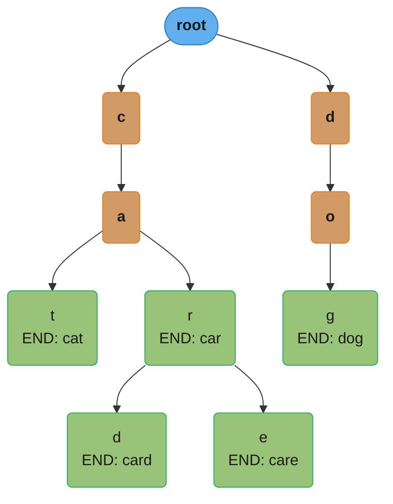
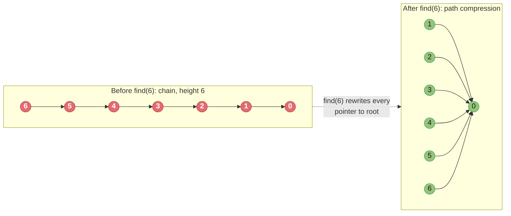
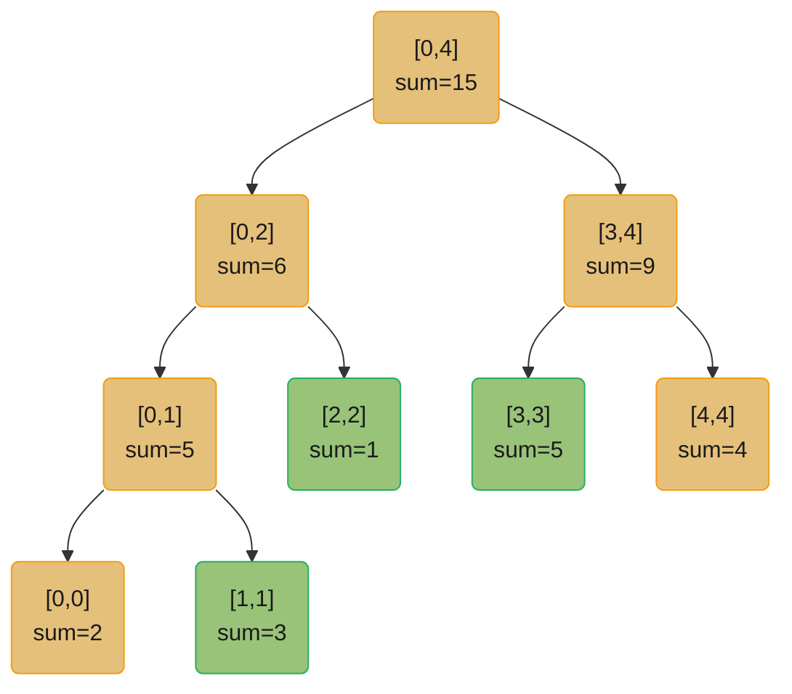
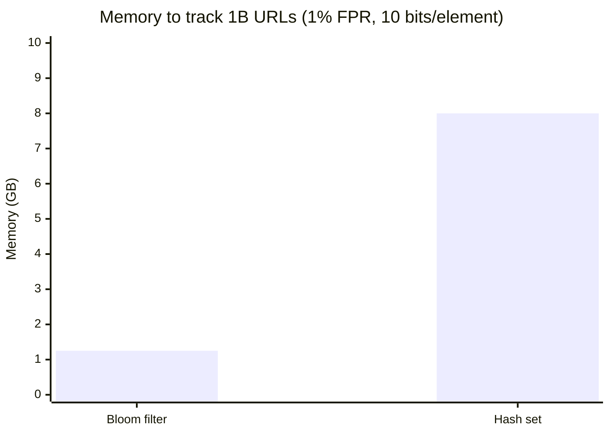
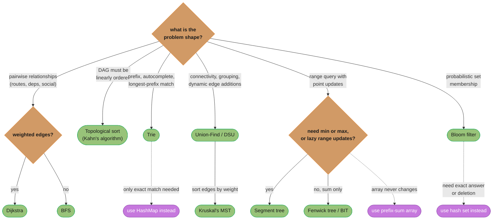

# Graphs, Tries, and Advanced Structures

## 1. Concept Overview

This module covers the data structures that appear in the hardest tier of coding interviews: **graphs** (for modelling relationships), **tries** (for prefix/string search), **union-find / DSU** (for connectivity), **segment trees** (for range queries with updates), **Fenwick trees / BITs** (for prefix sums), and **Bloom filters** (for probabilistic membership).

Each structure addresses a class of problems that simpler structures cannot handle efficiently. Recognising which structure fits the problem shape is the skill these questions test.

---

## Intuition

A graph is a city road network — intersections are nodes, roads are edges. A trie is an autocomplete index — each character is a node, each root-to-leaf path is a word. Union-Find is a connectivity checker — "are these two nodes in the same component?" in near-O(1). A segment tree is a ledger with branch totals — update one account, re-query any range in O(log n). A Bloom filter is a bouncers list — it might say "not seen" when it has, but never says "seen" for something new (false positives, no false negatives).

**Why it matters:** Graphs model virtually every real-world relationship (social networks, dependencies, routing). Tries underpin autocomplete, spell-check, and IP routing tables. Union-Find is the backbone of Kruskal's MST, cycle detection, and network connectivity. Segment trees power range-query databases and game scoreboards.

**Key insight:** Union-Find with path compression + union by rank achieves inverse-Ackermann α(n) amortised time per operation — functionally O(1) for any n humans will ever count. A Bloom filter with k=7 hash functions and a 10-bit array per element achieves a 1% false-positive rate.

---

## 2. Core Principles

**Graph terminology:**
- **Node (vertex):** entity. **Edge:** relationship. **Directed (digraph):** edges have direction. **Undirected:** bidirectional.
- **Weighted:** edges carry a cost. **Cycle:** path that starts and ends at the same node.
- **Connected component:** maximal set of nodes reachable from each other.
- **DAG:** directed acyclic graph — the foundation of topological sort.

**Trie (prefix tree):** Each node represents one character. A path from root → node spells a prefix. A terminal/leaf flag marks complete words. Insert and search are O(L) where L = word length.

**Union-Find invariant:** Each element belongs to exactly one disjoint set, represented by a root. `find(x)` returns the root. `union(x, y)` merges two sets. Path compression: during `find`, point all nodes directly to root. Union by rank: always attach the smaller tree under the larger.

**Segment tree invariant:** Every internal node stores the aggregate (sum/min/max) of its subtree range. Build O(n), point update O(log n), range query O(log n).

**Fenwick tree (BIT) invariant:** Index i is responsible for a range of length `i & (-i)` (lowest set bit). Prefix sum query: follow `i -= i & (-i)` chain. Point update: follow `i += i & (-i)` chain. Both O(log n).

---

## 3. Types / Architectures / Strategies

### Graph Representations

| Representation | Space | Build | Check edge (u,v) | Neighbours of u |
|----------------|-------|-------|-----------------|-----------------|
| Adjacency list | O(V+E) | O(E) | O(degree) | O(degree) |
| Adjacency matrix | O(V²) | O(V²) | O(1) | O(V) |
| Edge list | O(E) | O(E) | O(E) | O(E) |

Adjacency list is the default for sparse graphs (most real graphs). Adjacency matrix is only appropriate for dense graphs (E ≈ V²) or when edge-existence queries are the bottleneck.

### Trie Variants

| Variant | Node children | Use case |
|---------|--------------|----------|
| Standard trie | dict / array[26] | Autocomplete, spell-check, prefix queries |
| Compressed trie (Radix trie) | Merged single-child chains | IP routing (CIDR), reduced memory |
| Suffix trie / suffix array | All suffixes indexed | Substring search, longest common substring |
| Ternary search trie | Three children (< = >) | Ordered search with less memory than array[26] |

### Union-Find Variants

- **Quick-find:** O(1) find, O(n) union — arrays. Too slow for large n.
- **Quick-union:** O(n) find worst case, O(1) union — trees.
- **Weighted quick-union (union by rank/size):** O(log n) find.
- **Path compression + union by rank:** amortised O(α(n)) ≈ O(1).

### Range Query Structures

| Structure | Build | Point update | Range query | Range update |
|-----------|-------|-------------|------------|--------------|
| Prefix sum array | O(n) | O(n) | O(1) | O(n) |
| Fenwick tree (BIT) | O(n log n) | O(log n) | O(log n) | O(log n) (diff array) |
| Segment tree | O(n) | O(log n) | O(log n) | O(log n) + lazy |
| Sparse table | O(n log n) | — (static) | O(1) for idempotent ops | — |

---

## 4. Architecture Diagrams

### Adjacency List vs Matrix for graph {0→1, 0→2, 1→2, 2→0}

```
Adjacency list:
  0: [1, 2]
  1: [2]
  2: [0]
Space: O(V+E) = O(3+4) = O(7)

Adjacency matrix:
     0  1  2
  0 [0, 1, 1]
  1 [0, 0, 1]
  2 [1, 0, 0]
Space: O(V^2) = O(9)
```

### Trie for words: ["cat", "car", "card", "care", "dog"]



Prefix `"car"` traversal: root → c → a → r. `search("car")` returns True because the `r` node has `is_end = True`; `starts_with("ca")` returns True simply because the `a` node exists. Green nodes mark completed words (`is_end = True`); orange nodes are prefix-only branch points.

### Union-Find Path Compression



Path compression rewrites every node touched by `find(6)` to point directly at the root — the next `find(6)` call is O(1) instead of walking the O(n) chain.

### Segment Tree for array [2, 3, 1, 5, 4]



Range-sum query `[1,3]` descends from the root and sums the three highlighted leaves — 3 + 1 + 5 = 9 — visiting O(log n) nodes instead of scanning all 5 array elements.

### Fenwick Tree (BIT) — responsible ranges

```
Index:    1  2  3  4  5  6  7  8
Bit mask: 1  2  1  4  1  2  1  8
Array:    2  5  1  11 4  9  3  23   (prefix sums stored)

i & (-i):
  index 6 (0110): 6 & -6 = 2 → responsible for [5,6]
  index 4 (0100): 4 & -4 = 4 → responsible for [1,4]

prefix_sum(6) = BIT[6] + BIT[4] = 9 + 11 = 20
                                    (updates: 6 -= 2 → 4, 4 -= 4 → 0)
```

---

## 5. How It Works — Detailed Mechanics

```python
from __future__ import annotations
from collections import defaultdict, deque
from typing import List, Optional, Dict, Tuple


# ─── GRAPH: Adjacency List ───────────────────────────────────────────────────

class Graph:
    """Directed weighted graph via adjacency list."""

    def __init__(self, n: int) -> None:
        self.n = n
        self.adj: Dict[int, List[Tuple[int, int]]] = defaultdict(list)  # {u: [(v, weight)]}

    def add_edge(self, u: int, v: int, w: int = 1) -> None:
        self.adj[u].append((v, w))

    def bfs(self, src: int) -> Dict[int, int]:
        """BFS: shortest hop-count from src. O(V+E)."""
        dist = {src: 0}
        q = deque([src])
        while q:
            u = q.popleft()
            for v, _ in self.adj[u]:
                if v not in dist:
                    dist[v] = dist[u] + 1
                    q.append(v)
        return dist

    def dfs_iterative(self, src: int) -> List[int]:
        """DFS via explicit stack — avoids Python recursion limit for large graphs."""
        visited: set[int] = set()
        stack = [src]
        order: List[int] = []
        while stack:
            u = stack.pop()
            if u in visited:
                continue
            visited.add(u)
            order.append(u)
            for v, _ in self.adj[u]:
                if v not in visited:
                    stack.append(v)
        return order

    def topological_sort(self) -> Optional[List[int]]:
        """
        Kahn's algorithm (BFS-based topo sort). Returns None if cycle detected.
        O(V+E).
        """
        in_degree = defaultdict(int)
        for u in self.adj:
            for v, _ in self.adj[u]:
                in_degree[v] += 1

        q = deque(u for u in range(self.n) if in_degree[u] == 0)
        order: List[int] = []

        while q:
            u = q.popleft()
            order.append(u)
            for v, _ in self.adj[u]:
                in_degree[v] -= 1
                if in_degree[v] == 0:
                    q.append(v)

        return order if len(order) == self.n else None  # None = cycle


# ─── TRIE ────────────────────────────────────────────────────────────────────

class TrieNode:
    __slots__ = ("children", "is_end")

    def __init__(self) -> None:
        self.children: Dict[str, TrieNode] = {}
        self.is_end: bool = False


class Trie:
    """
    Standard trie. Insert/search/startsWith all O(L) where L = word length.
    Space: O(total characters across all words × average branching).
    """

    def __init__(self) -> None:
        self.root = TrieNode()

    def insert(self, word: str) -> None:
        node = self.root
        for ch in word:
            if ch not in node.children:
                node.children[ch] = TrieNode()
            node = node.children[ch]
        node.is_end = True

    def search(self, word: str) -> bool:
        node = self.root
        for ch in word:
            if ch not in node.children:
                return False
            node = node.children[ch]
        return node.is_end

    def starts_with(self, prefix: str) -> bool:
        node = self.root
        for ch in prefix:
            if ch not in node.children:
                return False
            node = node.children[ch]
        return True

    def words_with_prefix(self, prefix: str) -> List[str]:
        """Return all words starting with prefix — used in autocomplete."""
        node = self.root
        for ch in prefix:
            if ch not in node.children:
                return []
            node = node.children[ch]
        results: List[str] = []
        self._dfs(node, list(prefix), results)
        return results

    def _dfs(self, node: TrieNode, path: List[str], results: List[str]) -> None:
        if node.is_end:
            results.append("".join(path))
        for ch, child in node.children.items():
            path.append(ch)
            self._dfs(child, path, results)
            path.pop()


# ─── UNION-FIND / DSU ────────────────────────────────────────────────────────

class UnionFind:
    """
    Union-Find with path compression + union by rank.
    Amortised O(alpha(n)) per operation — practically O(1).
    """

    def __init__(self, n: int) -> None:
        self.parent = list(range(n))
        self.rank   = [0] * n
        self.components = n

    def find(self, x: int) -> int:
        # Path compression: make all nodes on path point to root
        if self.parent[x] != x:
            self.parent[x] = self.find(self.parent[x])
        return self.parent[x]

    def union(self, x: int, y: int) -> bool:
        """Returns True if x and y were in different components (merge happened)."""
        rx, ry = self.find(x), self.find(y)
        if rx == ry:
            return False
        # Union by rank: attach smaller tree under larger
        if self.rank[rx] < self.rank[ry]:
            rx, ry = ry, rx
        self.parent[ry] = rx
        if self.rank[rx] == self.rank[ry]:
            self.rank[rx] += 1
        self.components -= 1
        return True

    def connected(self, x: int, y: int) -> bool:
        return self.find(x) == self.find(y)


# ─── SEGMENT TREE ────────────────────────────────────────────────────────────

class SegmentTree:
    """
    Segment tree for range sum queries with point updates.
    Build O(n), update O(log n), query O(log n).
    """

    def __init__(self, arr: List[int]) -> None:
        self.n = len(arr)
        self.tree = [0] * (4 * self.n)
        self._build(arr, 0, 0, self.n - 1)

    def _build(self, arr: List[int], node: int, lo: int, hi: int) -> None:
        if lo == hi:
            self.tree[node] = arr[lo]
            return
        mid = (lo + hi) // 2
        self._build(arr, 2*node+1, lo, mid)
        self._build(arr, 2*node+2, mid+1, hi)
        self.tree[node] = self.tree[2*node+1] + self.tree[2*node+2]

    def update(self, idx: int, val: int) -> None:
        self._update(0, 0, self.n - 1, idx, val)

    def _update(self, node: int, lo: int, hi: int, idx: int, val: int) -> None:
        if lo == hi:
            self.tree[node] = val
            return
        mid = (lo + hi) // 2
        if idx <= mid:
            self._update(2*node+1, lo, mid, idx, val)
        else:
            self._update(2*node+2, mid+1, hi, idx, val)
        self.tree[node] = self.tree[2*node+1] + self.tree[2*node+2]

    def query(self, l: int, r: int) -> int:
        return self._query(0, 0, self.n - 1, l, r)

    def _query(self, node: int, lo: int, hi: int, l: int, r: int) -> int:
        if r < lo or hi < l:
            return 0                   # out of range
        if l <= lo and hi <= r:
            return self.tree[node]     # fully inside
        mid = (lo + hi) // 2
        return (self._query(2*node+1, lo, mid, l, r) +
                self._query(2*node+2, mid+1, hi, l, r))


# ─── FENWICK TREE (BIT) ──────────────────────────────────────────────────────

class FenwickTree:
    """
    Binary Indexed Tree for 1-indexed prefix sums.
    Update and prefix-query both O(log n).
    Conceptually simpler than segment tree for prefix sum use case.
    """

    def __init__(self, n: int) -> None:
        self.n = n
        self.tree = [0] * (n + 1)   # 1-indexed

    def update(self, i: int, delta: int) -> None:
        """Add delta to position i (1-indexed)."""
        while i <= self.n:
            self.tree[i] += delta
            i += i & (-i)           # move to next responsible ancestor

    def prefix_sum(self, i: int) -> int:
        """Sum of arr[1..i] (1-indexed)."""
        total = 0
        while i > 0:
            total += self.tree[i]
            i -= i & (-i)           # move to parent
        return total

    def range_sum(self, l: int, r: int) -> int:
        """Sum of arr[l..r] (1-indexed)."""
        return self.prefix_sum(r) - self.prefix_sum(l - 1)
```

---

## 6. Real-World Examples

**Graph — social networks:** Facebook's friend graph is an adjacency list (V ≈ 3B nodes, E ≈ 500B edges). BFS from a user finds friends-of-friends (6 degrees of separation). Stored in distributed form (Tao, FlockDB).

**Graph — dependency resolution:** `npm install`, Maven, Gradle all run topological sort on dependency DAGs. Cycles → "circular dependency" errors. Kahn's algorithm is the textbook approach.

**Trie — autocomplete:** Google Search, VS Code IntelliSense, and Redis's `AUTOCOMPLETE` module all use trie or radix-trie structures. A 250,000-word English dictionary fits in ~10 MB as a trie vs ~3 MB as a sorted array — but the trie gives O(L) prefix search vs O(L log n) binary search.

**Trie — IP routing (longest-prefix match):** Internet routers store CIDR blocks in compressed tries (Patricia tries). A packet's destination IP is matched to the most specific prefix in O(32) steps — constant time for IPv4.

**Union-Find — Kruskal's MST:** Sort all edges by weight, iterate, use DSU to detect cycles — only add an edge if its endpoints are in different components. O(E log E) sort dominates.

**Union-Find — number of connected components:** LeetCode "Number of Islands" can be solved with BFS or Union-Find. Union-Find wins for dynamic connectivity (edges added online).

**Segment tree — range-sum with updates:** Used in competitive programming judges (ICPC, Codeforces). Also in game leaderboards where score ranges are queried frequently (e.g., "sum of scores for players ranked 100–200").

**Fenwick tree — order statistics:** Count of elements ≤ x in a dynamic array (coordinate compression + BIT). Used in merge-sort inversion counting, and in database query planners for histogram approximations.

**Bloom filter — duplicate URL detection:** Google's web crawler uses Bloom filters (billions of bits, k≈7) to skip already-visited URLs without storing every URL explicitly. With a 1% FPR and 10 bits/element, 1 billion URLs costs only ~1.25 GB — vs ~8 GB for a hash set.



A Bloom filter needs ~1.25 GB to answer "have I seen this URL?" for 1 billion URLs at a 1% false-positive rate; a hash set storing full keys needs ~8 GB — a 6.4x gap for a structure that never needs to enumerate or delete members.

**Bloom filter — CDN and cache layers:** Akamai and Cloudflare use Bloom filters as a pre-filter before expensive cache lookups. A false positive wastes one cache check; a false negative is impossible, so correctness is maintained.

---

## 7. Tradeoffs

### Graph representation choice

| Scenario | Best representation |
|----------|-------------------|
| Sparse social network (E << V²) | Adjacency list |
| Dense routing matrix (E ≈ V²) | Adjacency matrix |
| Edge-weight processing (MST, Dijkstra) | Edge list (sort by weight) + adj list |
| Dynamic edge addition | Adjacency list |

### Trie vs HashMap for string lookup

| Criterion | Trie | HashMap |
|-----------|------|---------|
| Exact match | O(L) | O(L) — same |
| Prefix search | O(L + results) | O(n×L) — full scan |
| Sorted iteration | O(n×L) DFS | O(n log n) sort |
| Memory (dense) | Higher — pointer overhead | Lower |
| Memory (sparse long strings) | Lower — shared prefixes | Higher — full key storage |

### Segment tree vs Fenwick tree

| Criterion | Fenwick (BIT) | Segment Tree |
|-----------|--------------|-------------|
| Implementation | ~15 lines | ~50 lines |
| Range updates (add to range) | Difference array trick | Lazy propagation |
| Range min/max | Not directly | Yes |
| Point updates + range queries | Both O(log n) | Both O(log n) |
| Memory | O(n) | O(4n) |

Rule: Use Fenwick for prefix sums (simpler). Use Segment tree when you need range min/max or lazy range updates.

---

## 8. When to Use / When NOT to Use

The five structures in this module answer different questions; matching problem shape to structure is the skill being tested.



Solid arrows lead to the recommended structure for that problem shape; dotted arrows mark the anti-signal — the edge case where a simpler structure (HashMap, prefix-sum array, hash set) beats the one this module covers.

**Graphs:**
- Use when entities have pairwise relationships (dependencies, routes, social connections)
- Use BFS for unweighted shortest path; Dijkstra for weighted
- Use topological sort for DAG ordering (build systems, course prerequisites)
- Do NOT use a graph when a simple tree or linear scan suffices — over-modelling adds complexity

**Tries:**
- Use when you need prefix queries, autocomplete, or longest-prefix match
- Do NOT use when you only need exact-match lookup (HashMap is simpler and faster)
- Beware memory: a node per character × branching factor × depth; consider compressed tries for large alphabets

**Union-Find:**
- Use for connectivity queries on undirected graphs, grouping, and Kruskal's MST
- Use for "number of connected components" with dynamic edge additions
- Do NOT use for directed graphs or if you need to split components (no efficient split operation)

**Segment Tree / Fenwick:**
- Use when you need both point updates AND range queries (not just static prefix sums)
- Fenwick for sum only; Segment tree for min/max or range updates
- Do NOT use if your array is static — prefix sum array gives O(1) query with O(n) preprocessing

**Bloom filter:**
- Use as a probabilistic set membership check when false positives are tolerable and false negatives are unacceptable
- Use for large-scale pre-filtering (URLs, cache keys) to avoid expensive lookups
- Do NOT use when you need exact membership, need to delete elements (standard Bloom can't), or need to enumerate members

---

## 9. Prerequisite Knowledge

This module assumes familiarity with:
- BFS/DFS traversal mechanics → covered in [Graph and String Algorithms](../graph_and_string_algorithms/README.md)
- Tree concepts → [Trees and Binary Search Trees](../trees_and_binary_search_trees/README.md)
- Recursion → [Recursion and Problem Solving Patterns](../recursion_and_problem_solving_patterns/README.md)

---

## 10. Common Pitfalls

### Pitfall 1: Union-Find without path compression — O(n) degrades to a chain

```python
# BROKEN: union by rank only, no path compression
class UnionFindBroken:
    def __init__(self, n):
        self.parent = list(range(n))
        self.rank = [0] * n

    def find(self, x):
        # No path compression — walking up chain every time
        while self.parent[x] != x:
            x = self.parent[x]          # BUG: O(log n) normally, O(n) if ranks equal
        return x

# FIX: add path compression in find
class UnionFindFixed:
    def __init__(self, n):
        self.parent = list(range(n))
        self.rank = [0] * n

    def find(self, x):
        if self.parent[x] != x:
            self.parent[x] = self.find(self.parent[x])  # recursive compression
        return self.parent[x]
```

Without path compression, a union-by-rank tree can have depth O(log n). With both techniques, depth is effectively O(1) amortised — the difference is measurable at n > 10^5 operations.

### Pitfall 2: Trie memory explosion for long, sparse keys

```python
# BROKEN: storing every URL character in a trie node
# An average URL is ~50 chars; 100M URLs × 50 nodes × 200 bytes/node = 1 TB
class NaiveTrie:
    def __init__(self):
        self.children = {}
        self.is_end = False

# For URLs or file paths: use a compressed (radix) trie or just a hash set
# Compressed trie merges single-child chains into edge labels:
class CompressedNode:
    def __init__(self):
        self.children: dict[str, tuple[str, "CompressedNode"]] = {}
        # key = first char, value = (full_label, child_node)
        self.is_end = False
```

For a dictionary of English words (~250K), a trie uses ~10 MB and gives O(L) prefix search — justified. For 100M arbitrary URLs, use a hash set or radix trie.

### Pitfall 3: Segment tree size — array must be 4×n, not 2×n

```python
# BROKEN: segment tree array of size 2n — will index out of bounds for n not power of 2
class SegTreeBroken:
    def __init__(self, arr):
        self.n = len(arr)
        self.tree = [0] * (2 * self.n)   # BUG: needs 4*n in general

# FIX: allocate 4*n
class SegTreeFixed:
    def __init__(self, arr):
        self.n = len(arr)
        self.tree = [0] * (4 * self.n)   # safe upper bound for any n
```

For n = 5 (not a power of 2), the segment tree can have up to 4×5=20 nodes. The standard 4n allocation is always safe. If n is a power of 2, 2n suffices, but 4n is the defensive choice.

### Pitfall 4: Forgetting to mark visited in graph BFS/DFS → infinite loop

```python
# BROKEN: BFS without visited set on an undirected graph → infinite loop
def bfs_broken(adj, src):
    q = deque([src])
    order = []
    while q:
        u = q.popleft()
        order.append(u)
        for v in adj[u]:
            q.append(v)   # BUG: will revisit and loop forever
    return order

# FIX: use a visited set
def bfs_fixed(adj, src):
    visited = {src}
    q = deque([src])
    order = []
    while q:
        u = q.popleft()
        order.append(u)
        for v in adj[u]:
            if v not in visited:
                visited.add(v)
                q.append(v)
    return order
```

### Pitfall 5: Fenwick tree is 1-indexed — off-by-one at index 0

```python
# BROKEN: 0-indexed Fenwick tree — index 0 causes infinite loop (0 & -0 = 0)
class FenwickBroken:
    def __init__(self, n):
        self.tree = [0] * n    # BUG: should be n+1, and operations start from 1

    def update(self, i, delta):
        while i < len(self.tree):
            self.tree[i] += delta
            i += i & (-i)      # i=0 → 0 + 0 = 0 → infinite loop

# FIX: allocate n+1, use 1-based indexing
class FenwickFixed:
    def __init__(self, n):
        self.n = n
        self.tree = [0] * (n + 1)   # 1-indexed

    def update(self, i, delta):      # i must be >= 1
        while i <= self.n:
            self.tree[i] += delta
            i += i & (-i)
```

---

## 11. Technologies & Tools

| Tool / Library | Notes |
|----------------|-------|
| `networkx` (Python) | Full-featured graph library; BFS, DFS, shortest path, MST, topological sort |
| `scipy.sparse.csgraph` | Graph algorithms on sparse adjacency matrices; efficient for large dense-ish graphs |
| `sortedcontainers.SortedList` | Order-statistics operations without a full segment tree in Python |
| `java.util.ArrayDeque` | Efficient stack/queue for iterative DFS/BFS in Java |
| `java.util.TreeMap` | Red-black tree; range queries, floor/ceiling/subMap in O(log n) |
| Neo4j / Amazon Neptune | Native graph databases; Cypher/Gremlin query languages |
| Redis Bloom filter | `BF.ADD`, `BF.EXISTS` — Bloom filter as a Redis module (RedisBloom) |
| Apache Spark GraphX | Distributed graph processing; Pregel model for iterative algorithms |
| Guava BloomFilter | Production-grade Bloom filter in Java with configurable FPR |

---

## 12. Interview Questions with Answers

**Q1: What is the difference between BFS and DFS and when do you choose each?**
BFS explores level by level using a queue — finds the shortest path in unweighted graphs. DFS explores depth-first using a stack (or recursion) — finds any path, detects cycles, and computes topological order. Choose BFS for shortest path / minimum hops. Choose DFS for cycle detection, topological sort, connected components, and backtracking problems.

**Q2: When would you use a trie instead of a hash map?**
When you need prefix queries, autocomplete, or longest-prefix match. A hash map gives O(L) exact lookup but O(n×L) for "all words starting with prefix X" (full scan). A trie gives O(L + results) for the same prefix query. Also choose trie when the keyspace is dense (many shared prefixes) — the shared prefix chains save memory vs storing each full key.

**Q3: Explain Union-Find path compression. Why does it make find() nearly O(1)?**
Without compression, find(x) walks up a chain to the root: O(depth). Path compression rewrites all nodes on that chain to point directly to the root. Subsequent finds for those same nodes are O(1). Combined with union by rank (which bounds initial depth to O(log n)), the amortised cost per operation becomes O(α(n)) — the inverse Ackermann function, effectively ≤ 4 for any n ≤ 10^80. In practice, treat it as O(1).

**Q4: What is the time complexity of Kruskal's MST algorithm and why?**
O(E log E) dominated by sorting edges by weight. The DSU operations (V-1 unions + E finds) run in O(E × α(V)) ≈ O(E). Sorting dominates. Space is O(V) for the DSU structure.

**Q5: How do you detect a cycle in a directed graph?**
Use DFS with three node states: WHITE (unvisited), GRAY (in current recursion stack), BLACK (fully processed). If DFS encounters a GRAY node, a back edge exists — cycle detected. This is distinct from undirected cycle detection, where you only track visited/unvisited. O(V+E).

**Q6: What is topological sort and when is it impossible?**
Topological sort is a linear ordering of vertices in a DAG such that every directed edge u→v has u before v. Impossible if the graph contains a cycle. Kahn's algorithm (BFS with in-degree tracking) produces a topological order and detects cycles: if the final order has fewer than V nodes, a cycle exists.

**Q7: How does a Bloom filter work and what guarantees does it give?**
A Bloom filter is a bit array of m bits, initialised to 0. To add an element: compute k independent hash functions → set k bits. To query: check if all k bits are 1. Guarantees: (1) No false negatives — if an element is in the set, all its bits are set. (2) Possible false positives — k bits may be set by different elements. FPR ≈ (1 - e^(-kn/m))^k; optimal k = (m/n) ln 2. Cannot delete elements in a standard Bloom filter (use Counting Bloom filter instead).

**Q8: Segment tree vs Fenwick tree — which would you use for range minimum queries with point updates?**
Segment tree. A Fenwick tree directly supports prefix sums but NOT range minimum (min is not invertible — you can't un-subtract a minimum). Segment trees support any associative aggregate (sum, min, max, GCD) for range queries with point updates. Use Fenwick when you specifically need prefix sums and want simpler code.

**Q9: What is the space complexity of a trie with n words of average length L?**
O(n × L × ALPHABET_SIZE) in the worst case (no shared prefixes, array-based children). With dictionary-based children (only existing edges stored): O(n × L). For English words with shared prefixes, practical space is much lower — roughly O(total unique characters). A 250K-word dictionary uses ~10 MB as a trie.

**Q10: How does a Fenwick tree's i & (-i) operation work?**
In two's complement, `-i` inverts all bits of `i` and adds 1. `i & (-i)` isolates the lowest set bit. This lowest set bit encodes the range of indices that position i is responsible for in the BIT. For update, adding `i & (-i)` moves to the next ancestor that covers a larger range. For query, subtracting `i & (-i)` moves to the parent responsible for the prefix ending just before i's range.

**Q11: You need to find if there is a path between two nodes in a dynamic graph where edges are added over time. Which data structure do you use?**
Union-Find / DSU. For each edge addition (u, v), call `union(u, v)`. To query connectivity: `find(u) == find(v)`. Each operation is O(α(n)) ≈ O(1). If edges were also removed (dynamic connectivity with deletions), DSU cannot be used — you need link-cut trees (significantly more complex).

**Q12: What is the "number of islands" problem and what are the two main approaches?**
Given a 2D grid of '1' (land) and '0' (water), count connected land components. Approach 1: BFS/DFS — for each unvisited '1', do BFS/DFS to mark the entire island. O(m×n). Approach 2: Union-Find — treat each '1' cell as a DSU node, union adjacent land cells, count final components. O(m×n × α(m×n)). BFS is simpler; DSU handles dynamic additions elegantly.

**Q13: How would you implement an autocomplete system using a trie?**
Insert all dictionary words into a trie. For a query prefix: traverse to the prefix's terminal node, then DFS from that node to collect all words. To rank by frequency: augment each trie node with a max-frequency of words in its subtree — then use a heap-based DFS to return only the top-k completions without visiting all words. Query time: O(L + top-k log k) where L = prefix length.

**Q14: What is the time complexity of building a segment tree and why?**
O(n). Build proceeds by calling `_build` on each of the 2n-1 nodes of the complete binary tree — O(1) work per node (just a sum of two children). Total: O(n). This is analogous to heapify — work decreases exponentially toward the leaves and sums to O(n) via geometric series.

**Q15: Can you explain lazy propagation in segment trees?**
Lazy propagation handles range updates efficiently. Instead of updating all O(n) leaves for a range-add operation, attach a "pending" delta to each covered segment tree node. When you later query or update a child of that node, you first "push down" the pending delta to both children. This defers work to when it is actually needed — range update and range query both remain O(log n) instead of O(n).

**Q16: What is the difference between Kruskal's and Prim's MST algorithms?**
Kruskal: sort all edges by weight, greedily add an edge if it doesn't form a cycle (DSU for cycle detection). Best for sparse graphs: O(E log E). Prim: start from any node, greedily add the cheapest edge crossing the cut between visited and unvisited nodes (min-heap). Best for dense graphs: O(E log V) with a heap, O(V²) with an array. Both produce a valid MST.

**Q17: How does a trie differ from a hash map for IP routing (longest-prefix match)?**
IP addresses have a hierarchical structure (CIDR blocks like 192.168.0.0/16). A trie supports longest-prefix match naturally: traverse bit-by-bit and track the last matching prefix. A hash map can only do exact-match — you'd need to check all 32 possible prefix lengths, querying the map 32 times. Routers use radix/Patricia tries for O(32) = O(1) lookup.

**Q18: Walk through the complexity of the "Course Schedule II" problem (topological sort).**
Given n courses and prerequisite pairs, return an ordering or detect impossibility. Build an adjacency list and compute in-degrees: O(V+E). Run Kahn's BFS: each node is enqueued once (O(V)), each edge is processed once to decrement in-degrees (O(E)). Total: O(V+E). If the output length < n, a cycle exists (circular prerequisites) — return empty. Space: O(V+E) for the graph, O(V) for the queue and in-degree array.

---

## 13. Best Practices

- **Default to adjacency list** — only use adjacency matrix when E ≈ V² or when O(1) edge-existence checks are the bottleneck.
- **Use iterative DFS** in Python for large graphs — Python's default recursion limit is 1000; iterative avoids RecursionError on graphs with depth > 1000.
- **Path compression + union by rank together** — either alone gives O(log n); together gives O(α(n)). Never implement one without the other.
- **Fenwick for prefix sums, Segment tree for the rest** — if you only need prefix sums with point updates, Fenwick's ~15-line implementation is preferable over a 50-line segment tree.
- **4n array for segment tree** — always allocate 4n, not 2n, to avoid index-out-of-bounds for n not a power of 2.
- **Mark visited before enqueueing** in BFS (not after dequeueing) — prevents duplicate enqueues and reduces queue memory by O(E) in the worst case.
- **Bloom filter FPR tuning** — rule of thumb: 10 bits/element + k=7 hash functions ≈ 1% FPR. Use `math.log(2)` to compute optimal k = (m/n) × ln(2) ≈ 0.693 × (m/n).
- **Trie memory for large corpora** — prefer hash-based children (`dict`) over array-based children (`[None]*26`) when the alphabet is large or the trie is sparse; dict saves memory at the cost of slightly slower iteration.

---

## 14. Case Study

### Number of Connected Components + Minimum Spanning Tree (Union-Find + Kruskal)

**Problem:** Given n cities and a list of roads (u, v, weight), find (a) the number of connected components after adding all roads, and (b) the minimum cost to connect all cities (MST weight).

This combines Union-Find for both sub-problems elegantly.

```python
from typing import List, Tuple

class UnionFind:
    def __init__(self, n: int) -> None:
        self.parent = list(range(n))
        self.rank   = [0] * n
        self.components = n

    def find(self, x: int) -> int:
        if self.parent[x] != x:
            self.parent[x] = self.find(self.parent[x])
        return self.parent[x]

    def union(self, x: int, y: int) -> bool:
        rx, ry = self.find(x), self.find(y)
        if rx == ry:
            return False
        if self.rank[rx] < self.rank[ry]:
            rx, ry = ry, rx
        self.parent[ry] = rx
        if self.rank[rx] == self.rank[ry]:
            self.rank[rx] += 1
        self.components -= 1
        return True


# BROKEN: counting components via BFS — O(V+E) but doesn't handle dynamic edge addition
def count_components_broken(n: int, edges: List[Tuple[int, int]]) -> int:
    from collections import defaultdict, deque
    adj = defaultdict(list)
    for u, v in edges:
        adj[u].append(v)
        adj[v].append(u)
    visited = set()
    count = 0
    for node in range(n):
        if node not in visited:
            count += 1
            q = deque([node])
            visited.add(node)
            while q:
                cur = q.popleft()
                for nb in adj[cur]:
                    if nb not in visited:
                        visited.add(nb)
                        q.append(nb)
    return count
# Fine for static graph, but O(V+E) rebuild needed for each edge addition.
# Union-Find handles online edge additions in O(alpha(n)) per edge.


# FIX: Union-Find for connected components — handles dynamic edge additions
def count_components_fixed(n: int, edges: List[Tuple[int, int]]) -> int:
    uf = UnionFind(n)
    for u, v in edges:
        uf.union(u, v)
    return uf.components


# Kruskal's MST using the same DSU
def minimum_spanning_tree(n: int, edges: List[Tuple[int, int, int]]) -> Tuple[int, bool]:
    """
    Returns (MST total weight, is_connected).
    edges: list of (u, v, weight).
    O(E log E) dominated by sort.
    """
    edges.sort(key=lambda e: e[2])   # sort by weight
    uf = UnionFind(n)
    total_weight = 0
    edges_used = 0

    for u, v, w in edges:
        if uf.union(u, v):
            total_weight += w
            edges_used += 1
            if edges_used == n - 1:
                break   # MST complete — no need to check remaining edges

    is_connected = (edges_used == n - 1)
    return total_weight, is_connected


# Demo
if __name__ == "__main__":
    n = 5
    roads = [(0,1,4), (0,2,2), (1,2,1), (1,3,5), (2,4,8), (3,4,3)]

    print("Components:", count_components_fixed(n, [(u,v) for u,v,_ in roads]))
    # Expected: 1 (all connected)

    weight, connected = minimum_spanning_tree(n, roads)
    print(f"MST weight: {weight}, connected: {connected}")
    # MST picks: (1,2,1), (0,2,2), (3,4,3), (1,3,5) = 11
    # (or: (1,2,1), (0,2,2), (3,4,3), (0,1,4) = 10 — sort will find optimal)
    # Expected MST: edges (1,2), (0,2), (3,4), (1,3) or similar → weight 10
```

**Complexity breakdown:**
- `count_components`: O(E × α(n)) ≈ O(E)
- `minimum_spanning_tree`: O(E log E) sort + O(E × α(n)) DSU operations = O(E log E)
- Space: O(V) for DSU arrays

**Why Union-Find beats BFS for this use case:** If edges arrive one at a time (streaming), Union-Find handles each edge in O(α(n)) without rebuilding any graph structure. BFS would require O(V+E) per connectivity query.

---

## See Also

- [Graph and String Algorithms](../graph_and_string_algorithms/README.md) — BFS/DFS, Dijkstra, Bellman-Ford, topo sort algorithms (this module covers data structures; that covers algorithms)
- [Trees and Binary Search Trees](../trees_and_binary_search_trees/README.md) — segment trees extend BST concepts; B+trees bridge to graph-like index structures
- [Sorting and Searching](../sorting_and_searching/README.md) — Kruskal's MST requires edge sorting; binary search on Fenwick/segment tree queries
- [HLD Caching Patterns](../../hld/README.md) — Bloom filters in distributed caching layers (Redis Bloom, Cassandra row-level Bloom filter)
- [Database Indexing Deep Dive](../../database/indexing_deep_dive/README.md) — B+tree index structure; Bloom filters in RocksDB/LevelDB to skip SSTable reads
- [Python Collections and Data Structures](../../python/collections_and_data_structures/README.md) — `heapq` with Dijkstra, `defaultdict` for adjacency lists
- [DSA Pattern Playbooks](../dsa_patterns/README.md) — apply these structures: [Graph Traversal (BFS/DFS)](../dsa_patterns/graph_traversal.md), [Topological Sort](../dsa_patterns/topological_sort.md), [Union-Find](../dsa_patterns/union_find.md), [Trie Patterns](../dsa_patterns/trie_patterns.md), [Shortest Path](../dsa_patterns/shortest_path.md)
