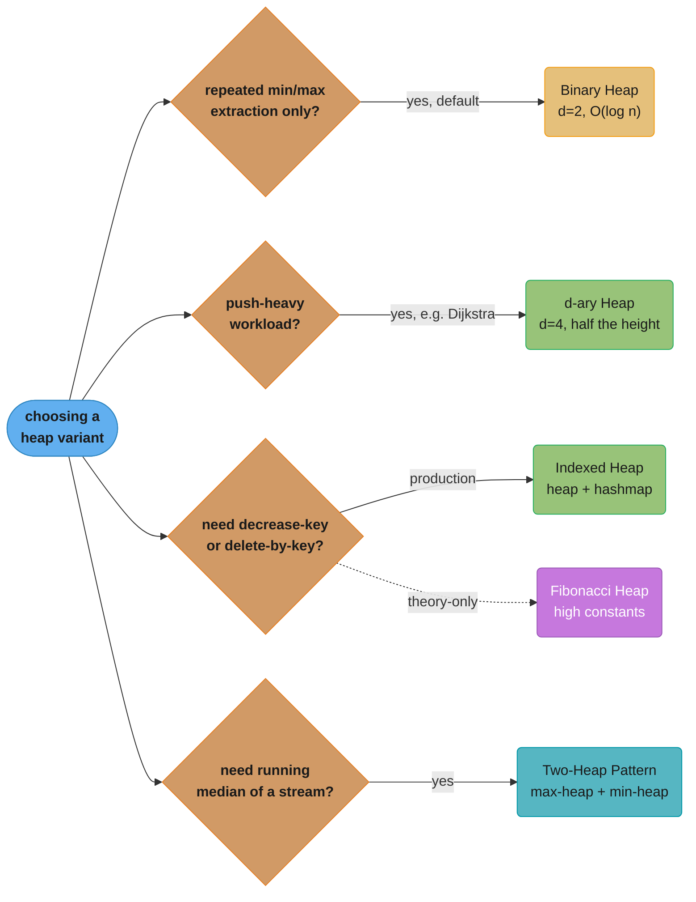
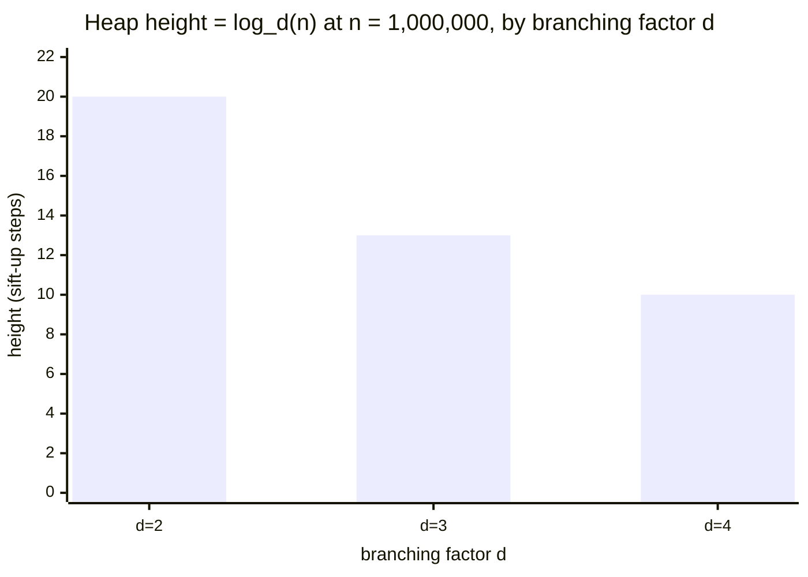

# Heaps and Priority Queues

## 1. Concept Overview

A **heap** is a complete binary tree stored in an array that satisfies the **heap property**: every node is ≤ (min-heap) or ≥ (max-heap) its children. This single structural guarantee delivers the best-possible complexity for "find/remove the extreme element": O(log n) for push and pop, O(1) for peek — without the overhead of a fully sorted structure.

A **priority queue** is the abstract data type; a binary heap is its canonical implementation. When an interview asks "use a priority queue," think heap.

---

## Intuition

A heap is like a company org-chart where the CEO is always the most (or least) important person — you can fire the CEO instantly and promote the next best candidate in O(log n) reorganizations, but you never bother sorting the entire org chart.

**Mental model:** Parent ≥ children (max-heap) at every level. The tree is complete so it maps perfectly onto an array with no wasted space.

**Why it matters:** Top-K problems, k-way merge, Dijkstra's shortest path, median of a stream, OS CPU scheduling — all rely on the O(log n) push/pop with O(1) peek that heaps provide.

**Key insight:** Building a heap from n elements takes O(n) time, NOT O(n log n). Half the nodes are leaves that cost O(1), quarter cost O(log 2) … summing this geometric series gives O(n). This surprises almost every interviewer who has not internalized it.

---

## 2. Core Principles

**Complete binary tree:** Every level is full except possibly the last, which is filled left-to-right. This lets you store the tree in a flat array with zero pointer overhead.

**Array index relationships** (1-indexed):
```
parent(i)     = i // 2
left_child(i) = 2 * i
right_child(i)= 2 * i + 1
```

(0-indexed: `parent = (i-1)//2`, `left = 2i+1`, `right = 2i+2`)

**Heap property (min-heap):** `A[parent(i)] ≤ A[i]` for all i > 1. The root is always the minimum.

**Two operations everything is built on:**
- `sift_up` (bubble up): after inserting at the end, swap upward until the heap property is restored — O(log n).
- `sift_down` (heapify down): after removing the root (replace with last element), swap downward with the smaller child — O(log n).

---

## 3. Types / Architectures / Strategies

**Choosing a variant** — start from the requirement, not the data structure; the six subsections below cover each leaf:



*Binary heap is the default; branch off only when a specific requirement — push-heavy tuning, decrease-key support, or a streaming median — demands one of the other variants below.*

### Binary Heap (d=2)
The default. Push/pop O(log n), peek O(1), build O(n). Stored in a flat array.

### d-ary Heap (d=3,4,…)
Each node has d children. Sift-down is faster (fewer levels: log_d n) but each step examines d children instead of 2. Best choice: d=4 gives ~30% fewer comparisons for sift-up-heavy workloads (Dijkstra). Arrays that fit in CPU cache favour larger d.

### Fibonacci Heap
Amortized O(1) decrease-key and O(log n) delete-min. Theoretically optimal for Dijkstra on dense graphs. Too complex for practical use (high constant factors); covered in algorithms textbooks, not production code.

### Indexed Heap / Heap + HashMap
Augments the heap with a `{value → index}` map so you can decrease-key in O(log n). Used in Dijkstra with lazy deletion or Prim's MST.

### Min-Heap vs Max-Heap
Python's `heapq` is a min-heap only. Simulate a max-heap by negating values: `heapq.heappush(h, -val)`.

### Two-Heap Pattern (Median of Stream)
Maintain a max-heap of the lower half and a min-heap of the upper half, kept balanced. Each heap's root = the median boundary.

---

## 4. Architecture Diagrams

### Binary Min-Heap — Array Layout

```
Heap array (1-indexed):  [_, 1, 3, 2, 7, 5, 9, 4]
                           0  1  2  3  4  5  6  7

Tree view:
                1          ← index 1
              /   \
            3       2      ← indices 2, 3
           / \     / \
          7   5   9   4    ← indices 4, 5, 6, 7

parent(4)=2, parent(5)=2, parent(6)=3, parent(7)=3
left(1)=2, right(1)=3
left(2)=4, right(2)=5
```

### Sift-Down after removing root (replace with last leaf):

```
Step 0: remove 1, put 4 at root
        [_, 4, 3, 2, 7, 5, 9]
                4
              /   \
            3       2
           / \     /
          7   5   9

Step 1: swap 4 with min(3,2)=2 → swap with right child
        [_, 2, 3, 4, 7, 5, 9]
                2
              /   \
            3       4
           / \     /
          7   5   9

Step 2: children of 4 are 9 (index 6). 4 < 9, heap restored.
Result: [_, 2, 3, 4, 7, 5, 9]
```

### Two-Heap Median Pattern:

```
Stream: 5, 2, 8, 1, 9

lower (max-heap): [5, 2, 1]   root=5
upper (min-heap): [8, 9]      root=8

median = (5 + 8) / 2 = 6.5   (even count)
```

### Build-Heap O(n) — Heapify from bottom up:

```
Start from last non-leaf = n//2, sift_down each node.

Array: [_, 9, 7, 8, 3, 2, 5, 4]
              9
            /   \
          7       8
         / \     / \
        3   2   5   4

Heapify index 3 (8): 8 > children(5,4)? yes → swap 8 with 4
Heapify index 2 (7): 7 > children(3,2)? yes → swap 7 with 2
Heapify index 1 (9): 9 > children(7,4)? yes → swap 9 with 4 → recurse → swap 4 with 5

Final: [_, 2, 3, 4, 9, 7, 5, 8]
```

---

## 5. How It Works — Detailed Mechanics

```python
import heapq
from typing import List, Tuple, Optional

# ─── Binary Min-Heap (manual implementation for understanding) ───────────────

class MinHeap:
    """0-indexed binary min-heap."""

    def __init__(self) -> None:
        self._data: List[int] = []

    def __len__(self) -> int:
        return len(self._data)

    def peek(self) -> int:
        if not self._data:
            raise IndexError("heap is empty")
        return self._data[0]

    def push(self, val: int) -> None:
        self._data.append(val)
        self._sift_up(len(self._data) - 1)

    def pop(self) -> int:
        if not self._data:
            raise IndexError("heap is empty")
        # Swap root with last element, shrink, sift down
        self._data[0], self._data[-1] = self._data[-1], self._data[0]
        val = self._data.pop()
        if self._data:
            self._sift_down(0)
        return val

    def _sift_up(self, i: int) -> None:
        while i > 0:
            parent = (i - 1) // 2
            if self._data[i] < self._data[parent]:
                self._data[i], self._data[parent] = self._data[parent], self._data[i]
                i = parent
            else:
                break

    def _sift_down(self, i: int) -> None:
        n = len(self._data)
        while True:
            smallest = i
            left  = 2 * i + 1
            right = 2 * i + 2
            if left  < n and self._data[left]  < self._data[smallest]:
                smallest = left
            if right < n and self._data[right] < self._data[smallest]:
                smallest = right
            if smallest == i:
                break
            self._data[i], self._data[smallest] = self._data[smallest], self._data[i]
            i = smallest

    @staticmethod
    def build(arr: List[int]) -> "MinHeap":
        """O(n) build — heapify from last internal node upward."""
        h = MinHeap()
        h._data = arr[:]
        n = len(h._data)
        for i in range(n // 2 - 1, -1, -1):   # last non-leaf downward
            h._sift_down(i)
        return h


# ─── Python heapq patterns ───────────────────────────────────────────────────

def top_k_frequent(nums: List[int], k: int) -> List[int]:
    """
    Top K frequent elements — O(n log k).
    Keep a MIN-heap of size k; evict least-frequent when overflow.
    """
    from collections import Counter
    freq = Counter(nums)
    # heap stores (frequency, element); min-heap evicts least frequent
    heap: List[Tuple[int, int]] = []
    for num, cnt in freq.items():
        heapq.heappush(heap, (cnt, num))
        if len(heap) > k:
            heapq.heappop(heap)   # remove the least frequent
    return [num for _, num in heap]


def k_th_largest(nums: List[int], k: int) -> int:
    """
    K-th largest in a stream — O(n log k).
    Min-heap of size k: root = k-th largest element.
    """
    heap: List[int] = []
    for n in nums:
        heapq.heappush(heap, n)
        if len(heap) > k:
            heapq.heappop(heap)
    return heap[0]


def merge_k_sorted_lists(lists: List[List[int]]) -> List[int]:
    """
    K-way merge — O(N log k) where N = total elements.
    Each heap entry: (value, list_index, element_index).
    """
    result: List[int] = []
    heap: List[Tuple[int, int, int]] = []

    for i, lst in enumerate(lists):
        if lst:
            heapq.heappush(heap, (lst[0], i, 0))

    while heap:
        val, li, ei = heapq.heappop(heap)
        result.append(val)
        if ei + 1 < len(lists[li]):
            heapq.heappush(heap, (lists[li][ei + 1], li, ei + 1))

    return result


# ─── Median of a data stream ─────────────────────────────────────────────────

class MedianFinder:
    """
    O(log n) addNum, O(1) findMedian.
    lower: max-heap (negate for Python's min-heap)
    upper: min-heap
    Invariant: len(lower) == len(upper) or len(lower) == len(upper)+1
    """

    def __init__(self) -> None:
        self.lower: List[int] = []   # max-heap via negation
        self.upper: List[int] = []   # min-heap

    def addNum(self, num: int) -> None:
        heapq.heappush(self.lower, -num)          # push to max-heap
        # ensure every lower element ≤ every upper element
        if self.upper and (-self.lower[0]) > self.upper[0]:
            val = -heapq.heappop(self.lower)
            heapq.heappush(self.upper, val)
        # rebalance sizes
        if len(self.lower) > len(self.upper) + 1:
            heapq.heappush(self.upper, -heapq.heappop(self.lower))
        elif len(self.upper) > len(self.lower):
            heapq.heappush(self.lower, -heapq.heappop(self.upper))

    def findMedian(self) -> float:
        if len(self.lower) == len(self.upper):
            return (-self.lower[0] + self.upper[0]) / 2.0
        return float(-self.lower[0])


# ─── Heap sort ───────────────────────────────────────────────────────────────

def heap_sort(arr: List[int]) -> List[int]:
    """O(n log n), O(1) extra space (in-place). Not stable."""
    import heapq
    # Python heapq.nlargest uses a heap internally
    # In-place: build max-heap manually (negate trick not applicable in-place)
    heapq.heapify(arr)                     # O(n) — min-heap
    return [heapq.heappop(arr) for _ in range(len(arr))]   # O(n log n)
```

---

## 6. Real-World Examples

**Dijkstra's shortest path:** A min-heap over `(distance, node)` makes greedy expansion O((V+E) log V) vs O(V²) with a naive array. Every GPS navigation system runs this.

**OS CPU scheduling:** Linux Completely Fair Scheduler (CFS) uses a red-black tree (heap-like ordering by virtual runtime) to pick the next process in O(log n).

**Top-K on streaming data:** Apache Flink and Kafka Streams use heap-backed priority queues to maintain top-K counts over tumbling windows without sorting full batches.

**Java PriorityQueue:** Backed by a binary min-heap. Thread-unsafe — use `PriorityBlockingQueue` for concurrent access. Iteration order is NOT sorted.

**Python heapq module:** Module-level functions on a plain list. `heapq.heapify()` builds in O(n). `heapq.nlargest(k, iterable)` uses a size-k min-heap for O(n log k) — faster than sorting when k << n.

**Huffman coding (compression):** Build a priority queue of character frequencies; repeatedly merge the two lowest-frequency nodes. Result is the optimal prefix-free code used in gzip, PNG, JPEG.

**Order book (trading systems):** A min-heap of ask prices and max-heap of bid prices. Match when best bid ≥ best ask. NASDAQ processes millions of orders/second using this pattern.

---

## 7. Tradeoffs

| Property | Binary Heap | Sorted Array | BST (balanced) | Fibonacci Heap |
|----------|-------------|--------------|----------------|----------------|
| Push | O(log n) | O(n) | O(log n) | O(1) amortized |
| Pop-min | O(log n) | O(1) | O(log n) | O(log n) amort.|
| Peek-min | O(1) | O(1) | O(log n) | O(1) |
| Decrease-key | O(n) | O(n) | O(log n) | O(1) amortized |
| Build from n | O(n) | O(n log n) | O(n log n) | O(n) |
| Space | O(n) | O(n) | O(n) + ptrs | O(n) + ptrs |
| Cache friendly | Yes (array) | Yes | No (pointers) | No |

**When d-ary heap beats d=2:**
- d=4 gives height log_4(n) = log_2(n)/2 — half as many sift-up steps (sift-up dominates in Dijkstra since you push often).
- Sift-down examines d children per level — slightly more comparisons but still fewer cache misses than pointer-following in a BST.



*d=4's height is exactly half of d=2's (log_4(n) = log_2(n)/2, i.e. 10 vs 20 at n=1,000,000) — the concrete payoff behind "d=4 gives half as many sift-up steps" above, which is why push-heavy workloads like Dijkstra favor a larger d.*

---

## 8. When to Use / When NOT to Use

**Use a heap when:**
- You need repeated min/max extraction (Top-K, k-way merge, Dijkstra, Prim)
- You need O(1) peek but O(log n) pop is acceptable
- You are building a priority queue for a scheduler or task runner
- You need the median of a stream (two-heap pattern)
- Build cost matters and you have n elements up-front (O(n) heapify)

**Do NOT use a heap when:**
- You need O(log n) arbitrary lookup/delete by key → use a BST or sorted set
- You need decrease-key frequently on a dense graph → Fibonacci heap (theoretical) or use lazy-deletion pattern
- You need the full sorted order → sort once with O(n log n)
- You need rank queries (k-th element for arbitrary k) → order statistics tree or quickselect O(n)

---

## 9. When to Use / When NOT (Interview Cheatsheet)

**Common heap interview patterns:**

| Pattern | Data Structure | Time |
|---------|----------------|------|
| Top-K elements | min-heap size k | O(n log k) |
| K-way sorted merge | min-heap size k | O(N log k) |
| Sliding window maximum | max-deque or max-heap+lazy | O(n log n) |
| Median of stream | two heaps | O(log n) per add |
| Shortest path (sparse) | min-heap + dist[] | O((V+E) log V) |
| Meeting rooms II | min-heap of end times | O(n log n) |

---

## 10. Common Pitfalls

### Pitfall 1: O(n log n) build vs O(n) heapify

```python
# BROKEN: n insertions = O(n log n)
def build_broken(arr):
    h = []
    for x in arr:
        heapq.heappush(h, x)   # each push = O(log n) → total O(n log n)
    return h

# FIX: heapify in-place = O(n)
def build_fixed(arr):
    h = arr[:]
    heapq.heapify(h)           # O(n) — starts from last internal node
    return h
```

The difference is measurable: for n=10^7 elements, heapify runs ~3x faster than n pushes.

### Pitfall 2: Max-heap in Python (forgetting to negate)

```python
# BROKEN: heapq is a MIN-heap; treating it as max-heap without negation
import heapq
nums = [3, 1, 4, 1, 5]
h = nums[:]
heapq.heapify(h)
print(heapq.heappop(h))  # prints 1 (minimum), not 5 (maximum)

# FIX: negate values for max-heap behaviour
h_max = [-x for x in nums]
heapq.heapify(h_max)
print(-heapq.heappop(h_max))  # prints 5 (correct maximum)
```

### Pitfall 3: Heap iteration is NOT sorted order

```python
# BROKEN: iterating a heap directly gives heap-order, not sorted order
h = [3, 1, 4, 1, 5]
heapq.heapify(h)
print(list(h))      # [1, 1, 4, 3, 5] — NOT sorted!

# FIX: pop one by one, or use sorted()
result = []
while h:
    result.append(heapq.heappop(h))
print(result)       # [1, 1, 3, 4, 5] — sorted ascending
```

### Pitfall 4: Heap of tuples — comparison on second element when first ties

```python
# Python compares tuples lexicographically.
# If priorities tie, Python compares the next element.
# If the next element is a non-comparable object (e.g., a custom class):
import heapq

class Task:
    def __init__(self, name): self.name = name

h = []
heapq.heappush(h, (1, Task("a")))
heapq.heappush(h, (1, Task("b")))
heapq.heappop(h)   # TypeError: '<' not supported between instances of 'Task'

# FIX: use a counter as tiebreaker
import itertools
counter = itertools.count()
heapq.heappush(h, (1, next(counter), Task("a")))
heapq.heappush(h, (1, next(counter), Task("b")))
heapq.heappop(h)   # Works: counter breaks the tie deterministically
```

### Pitfall 5: Lazy deletion anti-pattern

```python
# When you need to "remove" arbitrary elements from a heap,
# you cannot do it directly. Use a "tombstone" set:
import heapq

class LazyHeap:
    def __init__(self):
        self._heap = []
        self._removed = set()
        self._counter = 0

    def push(self, priority: int, item) -> None:
        entry = (priority, self._counter, item)
        heapq.heappush(self._heap, entry)
        self._counter += 1

    def remove(self, item) -> None:
        self._removed.add(item)     # mark; clean up on pop

    def pop(self):
        while self._heap:
            priority, _, item = heapq.heappop(self._heap)
            if item not in self._removed:
                return priority, item
        raise KeyError("pop from empty heap")
```

---

## 11. Technologies & Tools

| Tool | Notes |
|------|-------|
| `heapq` (Python stdlib) | Min-heap on a plain list; O(n) `heapify`, O(log n) push/pop |
| `java.util.PriorityQueue` | Min-heap; `Collections.reverseOrder()` for max-heap; not thread-safe |
| `java.util.concurrent.PriorityBlockingQueue` | Thread-safe PQ; blocking `take()` |
| C++ `std::priority_queue` | Max-heap by default; `std::greater<>` for min-heap |
| Redis Sorted Sets (ZSET) | Skip list + hash map; O(log n) add/score/rank; functionally a PQ |
| `sortedcontainers.SortedList` (Python) | O(log n) add/remove/index — order-statistics tree semantics |

---

## 12. Interview Questions with Answers

**Q1: What is the time complexity of building a heap from n elements?**
O(n). Calling heapify (sift-down from every internal node) costs O(n) because half the nodes are leaves (O(1) work each), a quarter cost O(log 2), etc. — the geometric sum converges to 2n. Inserting n elements one by one is O(n log n). This is one of the most commonly mis-stated complexities.

**Q2: Why does Python's heapq.nlargest(k, arr) use a heap instead of sorting?**
For k << n, maintaining a size-k min-heap costs O(n log k) — you scan all n items but only maintain k items in the heap. Sorting costs O(n log n). When k=1 it is O(n), same as a linear scan. `nlargest` switches internally to `sorted()` when k is close to n.

**Q3: How do you find the median of a streaming dataset efficiently?**
Maintain two heaps: a max-heap `lower` (lower half) and min-heap `upper` (upper half). Keep sizes balanced (differ by at most 1). After each insertion, the median is either the root of `lower` (odd total) or the average of both roots (even total). Each insert is O(log n), each median query O(1).

**Q4: You need to implement Dijkstra. What heap variant should you choose and why?**
A binary heap gives O((V+E) log V) with simple implementation — good enough for most graphs. A 4-ary heap gives ~30% fewer comparisons for Dijkstra (you push more than you pop). A Fibonacci heap gives O(E + V log V) theoretically but has huge constants; only worth it for extremely dense graphs where E >> V log V.

**Q5: What is the difference between a heap and a BST?**
A heap only guarantees the root is extreme; arbitrary search is O(n). A BST guarantees full sorted order and supports O(log n) search for any key. Heap push/pop is O(log n) and cache-friendly (array). BST insert/find is O(log h) but pointer-heavy (cache-unfriendly). Choose heap for priority-queue use cases, BST for sorted-set use cases.

**Q6: How does Java's PriorityQueue behave when you iterate it?**
Iteration order is NOT sorted. Java's PriorityQueue is backed by a binary heap array; iterating gives heap-storage order, which is not a sorted traversal. To get sorted output you must drain via poll() or copy to an array and sort. This surprises many Java developers who assume the collection is "sorted."

**Q7: A heap's pop() is O(log n). Can you implement a heap that supports O(1) delete-any-element?**
Yes — augment with a HashMap `{value → index_in_heap_array}`. When you want to delete element x: look up its index i, swap A[i] with A[last], pop the last, then sift-up or sift-down from i. This is called an "indexed heap" and is used in Prim's MST and some Dijkstra implementations.

**Q8: Why is heapsort not used in practice even though it is O(n log n) worst-case?**
Cache performance. Heapsort's access pattern jumps between parent and children in a large array — cache-unfriendly. Quicksort has O(n²) worst case but its sequential access pattern produces fewer cache misses in practice, making it 2–5× faster on real hardware. Introsort (used in C++ std::sort) uses quicksort with heapsort as a fallback to avoid the O(n²) case.

**Q9: You have k sorted lists with a total of N elements. What is the merge complexity and why?**
O(N log k). Initialise a min-heap with the first element of each list (k elements). Each of the N pops takes O(log k), and each pop is followed by one push (also O(log k)). Total: 2N operations × O(log k) each = O(N log k). Space is O(k) for the heap, O(N) for the output.

**Q10: What does Python's heapq module push to a heap of tuples when priorities are equal?**
Python compares tuples lexicographically — if the first elements tie, it compares the second. If the second element is not comparable (e.g., a custom object without `__lt__`), Python raises TypeError. The standard fix is inserting a monotonically increasing counter as the second element of the tuple, so ties are broken by insertion order without ever reaching the object comparison.

**Q11: Can you use a heap to sort in descending order in O(n log n) with O(1) extra space?**
Yes — this is heapsort. Build a max-heap in-place in O(n), then repeatedly swap the root (maximum) with the last element and sift-down on the reduced heap. After n swaps, the array is sorted ascending. For descending: build a min-heap instead. Space is O(1) extra (heapify is in-place).

**Q12: What is the meeting rooms II problem and how does a heap solve it?**
Given intervals [start, end], find the minimum number of conference rooms required. Sort by start time. Use a min-heap of end times (one per active room). For each new meeting: if its start ≥ min end-time in the heap, reuse that room (pop and push new end-time). Else open a new room (push). The heap size at the end = answer. O(n log n).

**Q13: How does Python heapq handle duplicate values?**
Perfectly fine — Python allows duplicates in a heap and compares by value. The heap property remains consistent. If you push 5 twice, you will pop 5 twice. No deduplication happens.

**Q14: What is the "sliding window maximum" problem and can a heap solve it efficiently?**
Given array nums and window size k, find the max in every k-size window. A max-heap can solve it in O(n log n) with lazy deletion: push (value, index), when you pop, discard entries with index < window_start. A monotonic deque solves it in O(n) — preferred. The heap approach is simpler to implement in an interview when optimal complexity is not required.

**Q15: Describe the two-heap pattern for finding the k-th largest element dynamically.**
Maintain a min-heap of size k. For each new element: push it. If size > k, pop the minimum. The root of the size-k min-heap is the k-th largest element seen so far. Each operation O(log k). This is the basis for LeetCode 703 "Kth Largest Element in a Stream."

**Q16: What happens internally when you call heapq.heappushpop(heap, item) vs heapq.heapreplace(heap, item)?**
`heappushpop`: pushes item first, then pops min. Equivalent to push+pop but implemented as one operation (avoids sifting twice when item is already ≤ current min). `heapreplace`: pops min first, then pushes item — assumes heap is non-empty. `heapreplace` is faster than a pop+push pair by roughly a factor of 2. Use `heapreplace` in the k-largest window pattern.

**Q17: In Dijkstra's algorithm, why do we "lazy delete" stale heap entries rather than updating them in place?**
Python's `heapq` (and Java's `PriorityQueue`) do not support decrease-key in O(log n) without additional bookkeeping. The lazy approach: simply push a new (shorter_dist, node) entry when you find a shorter path. When you pop an entry, check if the stored distance matches `dist[node]`; if not, skip it (it is stale). This adds at most E entries to the heap (one per edge relaxation) — still O((V+E) log V).

**Q18: What is a d-ary heap and when does increasing d improve performance?**
A d-ary heap gives each node d children. Height = log_d(n) so sift-up takes O(log_d n) = O(log n / log d). Sift-down examines d children per level: O(d × log_d n). Rule of thumb: if the workload is push-heavy (more sift-ups than sift-downs) — e.g., Dijkstra on sparse graphs — a 4-ary heap reduces comparisons by ~50% vs a binary heap. If the workload is pop-heavy (heapsort), stick with d=2 to keep sift-down cheap.

---

## 13. Best Practices

- **Default to `heapq`** — it is a min-heap; negate values for max-heap semantics. Avoid custom heap classes in production unless you need decrease-key.
- **Use a counter tiebreaker** when heap entries contain non-comparable objects — prevents obscure `TypeError` in production.
- **Prefer `heapify` over n pushes** when building from a known list — O(n) instead of O(n log n). Difference is visible at n > 10^5.
- **Lazy deletion** is the standard way to handle "remove arbitrary element" without an indexed heap — acceptable for Dijkstra and Prim.
- **Size-k heap for Top-K** — push and pop to maintain size k; final heap = top-k elements. Never sort the full array unless you need more than k elements.
- **Two-heap pattern** is the go-to for median-of-stream problems — learn the invariant (lower max-heap, upper min-heap, balanced sizes) by heart.
- **Do not iterate a heap** expecting sorted output — drain with pop() or copy to a list and sort.

---

## 14. Case Study

### Scheduling Tasks with Cooldowns (LeetCode 621)

**Problem:** Given a list of tasks (letters) and a cooldown integer n, find the minimum time to execute all tasks. Between two identical tasks there must be at least n intervals. CPU can be idle.

**Brute-force:** Simulate with a queue of "cooldown-expiry" entries — O(time × 26) with a priority queue scan each tick.

**Optimal (greedy + heap):** Always execute the most-frequent remaining task. Use a max-heap of `(count, task)` and a cooldown deque of `(available_after_time, count, task)`.

```python
import heapq
from collections import Counter, deque

def least_interval_broken(tasks, n):
    # BROKEN: sorts counts on every iteration — O(T × 26 log 26) but misses
    # the cooldown enforcement: tasks are re-added at the wrong time
    counts = list(Counter(tasks).values())
    counts.sort(reverse=True)
    time = 0
    while any(c > 0 for c in counts):
        for i in range(n + 1):
            if any(c > 0 for c in counts):
                # BUG: greedily picks first available, not highest-count
                for j, c in enumerate(counts):
                    if c > 0:
                        counts[j] -= 1
                        break
            time += 1
        counts.sort(reverse=True)  # re-sort after each round
    return time
# Bug: does not correctly handle n+1 windows with idle slots

def least_interval(tasks: list[str], n: int) -> int:
    """
    O(T log 26) = O(T) since alphabet is fixed-size.
    Max-heap of (-count, task) + cooldown deque.
    """
    counts = Counter(tasks)
    # max-heap via negation
    heap = [(-cnt, task) for task, cnt in counts.items()]
    heapq.heapify(heap)

    cooldown: deque[tuple[int, int, str]] = deque()  # (available_at, -count, task)
    time = 0

    while heap or cooldown:
        time += 1

        # Release tasks whose cooldown has expired
        if cooldown and cooldown[0][0] <= time:
            available_at, neg_cnt, task = cooldown.popleft()
            heapq.heappush(heap, (neg_cnt, task))

        if heap:
            neg_cnt, task = heapq.heappop(heap)
            if neg_cnt + 1 < 0:   # still has remaining count
                cooldown.append((time + n + 1, neg_cnt + 1, task))
        # else: CPU idle this tick

    return time


# Verify:
print(least_interval(["A","A","A","B","B","B"], n=2))  # 8
print(least_interval(["A","A","A","B","B","B"], n=0))  # 6
print(least_interval(["A","A","A","A","A","A","B","C","D","E","F","G"], n=2))  # 16
```

**Complexity:** O(T log k) where k ≤ 26 (distinct tasks). Space O(k). The heap size is bounded by the alphabet size, so in practice this is O(T).

**Key insight:** The cooldown deque is ordered by `available_at` (FIFO within a round), so you always `popleft()` — O(1) dequeue. The heap handles priority among available tasks.

---

## See Also

- [Java Collections Internals](../../java/collections_internals/README.md) — `PriorityQueue` internals, `PriorityBlockingQueue`, `Comparator` with PQ
- [Sorting and Searching](../sorting_and_searching/README.md) — heapsort as a comparison sort; O(n log n) guarantee
- [Graph and String Algorithms](../graph_and_string_algorithms/README.md) — Dijkstra and Prim using heaps
- [Python Collections and Data Structures](../../python/collections_and_data_structures/README.md) — `heapq`, `sortedcontainers`
- [HLD Caching Patterns](../../hld/README.md) — LRU/LFU eviction uses heap + hashmap
- [DSA Pattern Playbooks](../dsa_patterns/README.md) — apply these structures: [Top K Elements](../dsa_patterns/top_k_elements.md), [K-Way Merge](../dsa_patterns/k_way_merge.md), [Two Heaps](../dsa_patterns/two_heaps.md)
