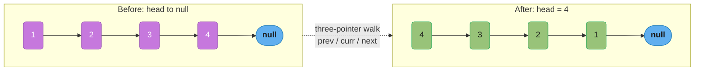
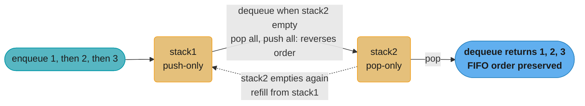
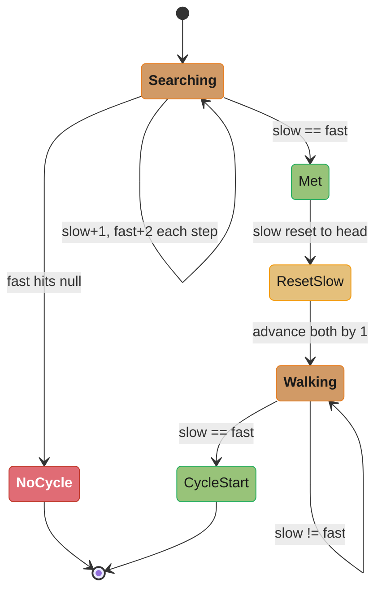
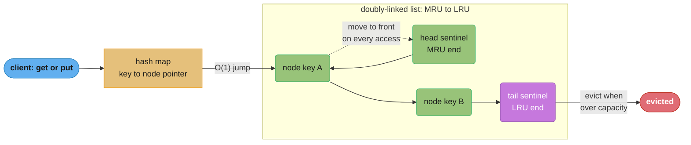

# Linked Lists, Stacks & Queues

---

## 1. Concept Overview

Linked lists, stacks, and queues are the foundational sequential data structures. Unlike arrays, linked lists store elements in nodes scattered in memory, connected by pointers — trading O(1) random access for O(1) insertions and deletions at any known position without shifting elements.

A **singly linked list** connects each node to the next. A **doubly linked list** adds a back-pointer, enabling O(1) deletion of a node given a reference to it. A **stack** is a LIFO (last-in, first-out) abstraction; a **queue** is FIFO (first-in, first-out). Both are typically implemented with a linked list or a circular array (ring buffer).

These structures appear constantly in interview problems (reverse a list, detect a cycle, merge two sorted lists, implement a queue with two stacks) and form the backbone of more complex structures: LRU caches use a doubly-linked list; BFS uses a queue; DFS / expression evaluation uses a stack.

---

## 2. Intuition

> **One-line analogy**: A linked list is a train — each car (node) connects to the next; you can add or remove cars from the front instantly, but getting to car #50 requires walking through 49 others.

**Mental model**: Every linked list operation is a pointer reassignment. Reversing a list means redirecting pointers, not moving data. Detecting a cycle means the fast pointer "laps" the slow one. Merging two sorted lists is choosing the smaller head each time and advancing.

**Why it matters**: Linked lists are the canonical data structure for pointer manipulation — the interview topic that tests whether you can reason about references without an IDE. Stack-based problems (valid parentheses, decode string, asteroid collision) are some of the most frequently asked "easy/medium" problems. BFS with a queue and DFS with a stack are the algorithmic cores of graph problems.

**Key insight**: For linked list problems, drawing the pointer state before and after the operation is almost always the most reliable approach. Write the operation in terms of pointer assignments: `prev.next = curr.next` removes curr from the list. Never modify a pointer before you've saved all the references you still need.

---

## 3. Core Principles

- **Node structure**: a value + a pointer (or two for doubly-linked). The list is defined by its head pointer; an empty list has a null head.
- **Sentinel/dummy node**: a dummy head node simplifies edge cases (empty list, operations on the head). `dummy.next = head; return dummy.next` handles all cases uniformly.
- **Pointer discipline**: when reassigning pointers, save `curr.next` before overwriting it. Losing a reference to the rest of the list is the #1 linked-list bug.
- **Stack — LIFO**: push adds to the top; pop removes from the top. The last element pushed is the first popped. Used for: function call stack, expression evaluation, backtracking, monotonic stack.
- **Queue — FIFO**: enqueue adds to the back; dequeue removes from the front. Used for: BFS, producer-consumer, sliding window maximum (monotonic deque).
- **Monotonic stack/deque**: a stack (or deque) that maintains a monotonically increasing or decreasing sequence of values. When a new element violates the monotonic property, pop until it doesn't. Enables O(n) solutions for "next greater element" and "sliding window maximum" problems.
- **Circular buffer (ring buffer)**: a fixed-size array with head and tail pointers that wrap around modulo capacity. O(1) enqueue and dequeue, O(1) space overhead. Used in OS kernel buffers, network I/O, and Python's `collections.deque` internally.

---

## 4. Types / Strategies

### 4.1 Linked List Variants

| Type | Pointers per node | Use cases |
|------|------------------|-----------|
| Singly linked | next | Simple traversal, stack implementation |
| Doubly linked | prev, next | LRU cache (O(1) delete), deque |
| Circular (singly) | next (last→head) | Round-robin scheduler |
| Circular (doubly) | prev, next (circular) | OS ready queue |

### 4.2 Stack Implementation Choices

| Backing store | push/pop | Access | Space | Notes |
|--------------|----------|--------|-------|-------|
| Dynamic array (list) | O(1) amortized | O(1) top | O(n) | Python `list.append/pop` |
| Linked list | O(1) | O(1) top | O(n) + pointer overhead | Each node has extra pointer |
| Fixed array | O(1) | O(1) | O(capacity) | Pre-allocate; overflow if full |

### 4.3 Queue Implementation Choices

| Backing store | enqueue | dequeue | Notes |
|--------------|---------|---------|-------|
| `collections.deque` | O(1) | O(1) | Preferred in Python |
| Two stacks | Amortized O(1) | Amortized O(1) | Common interview pattern |
| Circular array | O(1) | O(1) | Fixed capacity |
| Linked list | O(1) | O(1) with tail pointer | Natural FIFO |

### 4.4 Canonical Problem Patterns

| Pattern | Technique | Example problems |
|---------|-----------|-----------------|
| Reverse a linked list | Three-pointer iteration | Reverse linked list, reverse in k-groups |
| Detect cycle | Fast-slow pointer | Linked list cycle, find cycle start |
| Find middle | Fast-slow pointer | Middle of linked list, sort linked list |
| Remove Nth from end | Two-pointer with n gap | Remove Nth node from end of list |
| Merge | Two-pointer with dummy | Merge two sorted lists, merge k sorted lists |
| Validate parentheses | Stack | Valid parentheses, longest valid parentheses |
| Next greater element | Monotonic stack | Next greater element I/II |
| Sliding window max | Monotonic deque | Sliding window maximum |

---

## 5. Architecture Diagrams

### Singly Linked List: Reverse In-Place



Reversal flips every arrow: the list that read 1→2→3→4→null now reads 4→3→2→1→null, and head becomes the old tail. The three-pointer walk (`prev` / `curr` / `next`) performs this in a single O(n) pass, redirecting one link at a time — never advance a pointer before saving the reference it currently holds.

### Monotonic Stack: Next Greater Element

```mermaid
flowchart LR
    classDef io      fill:#61afef,stroke:#2e86c1,color:#1a1a1a,font-weight:bold
    classDef frozen  fill:#c678dd,stroke:#9b59b6,color:#fff
    classDef train   fill:#98c379,stroke:#27ae60,color:#1a1a1a
    classDef mathOp  fill:#d19a66,stroke:#e67e22,color:#1a1a1a,font-weight:bold
    classDef lossN   fill:#e06c75,stroke:#c0392b,color:#fff,font-weight:bold
    classDef req     fill:#56b6c2,stroke:#0097a7,color:#1a1a1a
    classDef base    fill:#e5c07b,stroke:#f39c12,color:#1a1a1a

    A(["arr: 4, 5, 2, 10, 8"]) --> P4("process 4<br/>stack: 4")
    P4 -->|"5 bigger: pop 4<br/>result 4 = 5"| P5("process 5<br/>stack: 5")
    P5 -->|"2 smaller: push"| P2("process 2<br/>stack: 5, 2")
    P2 -->|"10 bigger twice<br/>pop 2, pop 5"| P10("process 10<br/>stack: 10")
    P10 -->|"8 smaller: push"| P8("process 8<br/>stack: 10, 8")
    P8 -->|"end of array"| R(["result: 4 to 5, 5 to 10<br/>2 to 10, 10 to -1, 8 to -1"])

    class A io
    class P4,P5,P2,P10,P8 mathOp
    class R train
```



Each element is pushed and popped at most once — the stack only pops when a smaller top meets a bigger newcomer, so the total work across all five elements is O(n), not O(n²).

### Queue with Two Stacks



Every element makes exactly three trips — pushed onto stack1, moved to stack2, popped from stack2 — so the amortized cost is O(1) per operation, even though the single dequeue that triggers a transfer costs O(n).

---

## 6. How It Works — Detailed Mechanics

### 6.1 Linked List Node and Basic Operations

```python
from __future__ import annotations
from typing import Optional

class ListNode:
    def __init__(self, val: int = 0, nxt: Optional['ListNode'] = None) -> None:
        self.val = val
        self.next = nxt

def reverse_list(head: Optional[ListNode]) -> Optional[ListNode]:
    """O(n) time, O(1) space. Three-pointer iteration."""
    prev: Optional[ListNode] = None
    curr = head
    while curr:
        nxt = curr.next   # save before overwrite
        curr.next = prev  # reverse the pointer
        prev = curr       # advance prev
        curr = nxt        # advance curr
    return prev           # new head
```

### 6.2 Merge Two Sorted Lists (Dummy Head Pattern)

```python
def merge_two_lists(l1: Optional[ListNode], l2: Optional[ListNode]) -> Optional[ListNode]:
    """
    O(m+n) time, O(1) space.
    Dummy head eliminates special-case handling for the result head.
    """
    dummy = ListNode(0)   # sentinel — simplifies all edge cases
    curr = dummy
    while l1 and l2:
        if l1.val <= l2.val:
            curr.next = l1
            l1 = l1.next
        else:
            curr.next = l2
            l2 = l2.next
        curr = curr.next
    curr.next = l1 or l2   # attach the remaining tail
    return dummy.next
```

### 6.3 Detect and Find Cycle Start (Floyd's Algorithm)

```python
def detect_cycle(head: Optional[ListNode]) -> Optional[ListNode]:
    """
    Detect cycle and return the start node. O(n) time, O(1) space.
    Phase 1: fast and slow meet inside the cycle (if exists).
    Phase 2: reset slow to head; advance both 1 step; they meet at cycle start.
    """
    slow = fast = head
    while fast and fast.next:
        slow = slow.next
        fast = fast.next.next
        if slow is fast:
            # Phase 2: find cycle entry
            slow = head
            while slow is not fast:
                slow = slow.next
                fast = fast.next
            return slow
    return None   # no cycle
```



Floyd's algorithm is two phases, not one: Phase 1 races fast (2 steps) against slow (1 step) until they meet inside the cycle or fast falls off the end; Phase 2 resets slow to head and walks both pointers one step at a time until they meet again — that second meeting point is mathematically guaranteed to be the cycle's start (see Q3).

### 6.4 Monotonic Stack — Largest Rectangle in Histogram

```python
def largest_rectangle_area(heights: list[int]) -> int:
    """
    O(n) time, O(n) space (stack).
    Maintain a monotonically increasing stack of indices.
    Pop when a shorter bar is encountered; the popped bar's max width ends here.
    """
    stack: list[int] = []   # indices, heights[stack[-1]] increasing
    max_area = 0
    heights = heights + [0]  # sentinel 0 forces all remaining bars to pop

    for i, h in enumerate(heights):
        while stack and heights[stack[-1]] > h:
            height = heights[stack.pop()]
            width = i if not stack else i - stack[-1] - 1
            max_area = max(max_area, height * width)
        stack.append(i)

    return max_area
```

### 6.5 Stack Implementation and Valid Parentheses

```python
def is_valid(s: str) -> bool:
    """
    O(n) time, O(n) space.
    Push open brackets; pop on close bracket and verify match.
    """
    stack: list[str] = []
    mapping = {')': '(', '}': '{', ']': '['}
    for c in s:
        if c in mapping:
            top = stack.pop() if stack else '#'
            if top != mapping[c]:
                return False
        else:
            stack.append(c)
    return not stack   # stack must be empty at the end
```

---

## 7. Real-World Examples

**Python `collections.deque`** — implemented as a doubly-linked list of fixed-size blocks (each ~64 elements). `appendleft` and `popleft` are O(1) — critical for BFS and sliding window. `list.pop(0)` is O(n) and the most common performance bug in BFS implementations.

**Java `ArrayDeque`** — a resizable circular array with head and tail pointers. Both ends support O(1) operations. Preferred over `LinkedList` for stack/queue use because it has no per-node object overhead and better cache locality. Java docs: "ArrayDeque is likely to be faster than Stack when used as a stack, and faster than LinkedList when used as a queue."

**Linux kernel run queue (CFS)** — the Completely Fair Scheduler maintains a red-black tree of runnable tasks (sorted by virtual runtime). Each CPU has its own `rq` (run queue). When the current task exhausts its timeslice, the scheduler picks the leftmost node of the BST (lowest virtual runtime) — effectively a priority queue with O(log n) operations. The "ready queue" concept is a generalisation of a linked-list queue.

**Call stack** — every function call pushes a stack frame; every return pops one. When a recursive function exceeds the stack limit, a `StackOverflowError` (Java) or `RecursionError` (Python) is raised. Converting DFS to iterative with an explicit stack simulates this without using OS stack memory.

**Browser history back/forward** — back navigation is a stack (pop to go back); forward navigation is cleared on new navigation. Implemented literally with two stacks in most browsers.

---

## 8. Tradeoffs

### Linked List vs Array

| Operation | Singly LL | Doubly LL | Array | Notes |
|-----------|-----------|-----------|-------|-------|
| Access by index | O(n) | O(n) | O(1) | LL requires traversal |
| Insert at head | O(1) | O(1) | O(n) (shift) | LL dominant |
| Insert at tail | O(n) or O(1) with tail ptr | O(1) with tail ptr | O(1) amortized | |
| Insert in middle | O(n) to find + O(1) | O(n) to find + O(1) | O(n) shift | Same if no reference |
| Delete with reference | O(n) singly / O(1) doubly | O(1) | O(n) shift | Doubly LL wins |
| Cache performance | Poor (pointer chasing) | Poor | Excellent | Array usually faster in practice |
| Extra memory | 1 pointer/node | 2 pointers/node | 0 | LL has 50–100% overhead |

### Stack vs Queue

| Stack (LIFO) | Queue (FIFO) |
|-------------|-------------|
| DFS traversal | BFS traversal |
| Expression evaluation | Producer-consumer |
| Undo/redo | Scheduling, rate limiting |
| Recursive call simulation | Print queue, task queue |

---

## 9. When to Use / When NOT to Use

**Use linked list when:**
- Frequent O(1) insertions/deletions at known positions (e.g., LRU cache eviction).
- The data structure size is highly variable and pre-allocation is wasteful.
- Implementing a queue where O(1) dequeue from front is required (use deque or linked list).

**Do NOT use linked list when:**
- You need O(1) random access by index — use an array.
- Cache performance matters — linked list pointer chasing causes L1/L2 cache misses at every hop.
- Memory overhead is a concern — each node adds 8–16 bytes of pointer overhead.

**Use stack when:**
- LIFO order (reverse, undo, nested structures, expression parsing).
- "Nearest greater/smaller element" type problems.
- DFS without recursion.

**Use queue when:**
- FIFO order (BFS, level-order traversal, producer-consumer).
- "Process in the order received" semantics.

---

## 10. Common Pitfalls

### Pitfall 1: Losing a Reference Before Saving It

```python
# BROKEN: curr.next overwritten before saving the rest of the list
def reverse_broken(head):
    curr = head
    while curr:
        curr.next = curr  # BROKEN: points to itself, loses rest of list

# FIX: save next before overwriting
def reverse(head):
    prev = None
    curr = head
    while curr:
        nxt = curr.next   # save FIRST
        curr.next = prev  # then overwrite
        prev = curr
        curr = nxt
    return prev
```

### Pitfall 2: Not Handling the Empty Stack in Monotonic Stack

```python
# BROKEN: stack.pop() without checking empty causes IndexError
def next_greater_broken(arr):
    stack = []
    result = [-1] * len(arr)
    for i, v in enumerate(arr):
        while stack and arr[stack[-1]] < v:
            idx = stack.pop()
            result[idx] = v
        stack.append(i)
    return result   # actually this is fine — just always check before pop

# BROKEN version that crashes:
# while arr[stack[-1]] < v:  <-- IndexError when stack is empty
# FIX: always guard with "while stack and ..."
```

### Pitfall 3: Using `list.pop(0)` for Queue Dequeue — O(n)

```python
# BROKEN: O(n) dequeue — catastrophic in BFS with large graphs
from collections import deque

# BROKEN:
queue = []
queue.append(start)
while queue:
    node = queue.pop(0)   # BROKEN: O(n) shift
    ...

# FIX: use collections.deque
queue = deque([start])
while queue:
    node = queue.popleft()  # O(1) ✓
```

### Pitfall 4: Forgetting the Tail Pointer for O(1) Enqueue

```python
# BROKEN: O(n) enqueue — traverses to the tail each time
class Queue:
    def __init__(self): self.head = None
    def enqueue(self, val):
        node = ListNode(val)
        if not self.head:
            self.head = node
            return
        curr = self.head
        while curr.next:   # BROKEN: O(n) traversal
            curr = curr.next
        curr.next = node

# FIX: maintain a tail pointer
class QueueFast:
    def __init__(self): self.head = self.tail = None
    def enqueue(self, val):
        node = ListNode(val)
        if self.tail:
            self.tail.next = node
        else:
            self.head = node
        self.tail = node    # O(1) ✓
```

---

## 11. Technologies & Tools

| Tool / Class | Language | Notes |
|-------------|---------|-------|
| `collections.deque` | Python | O(1) append/appendleft/pop/popleft; backed by doubly-linked blocks |
| `list` (as stack) | Python | O(1) amortized append/pop; use for simple LIFO |
| `ArrayDeque` | Java | Preferred stack+queue; resizable circular array |
| `LinkedList` | Java | True doubly-linked list; use when O(1) mid-list insertions needed |
| `Stack` | Java | Legacy (extends Vector, synchronized); use `ArrayDeque` instead |
| `PriorityQueue` | Java | Min-heap; NOT a FIFO queue despite the name |
| Linked list sentinel/dummy node | All | Simplifies boundary conditions; standard interview pattern |

---

## 12. Interview Questions with Answers

**Q1: How do you reverse a linked list in O(n) time and O(1) space?**
Three-pointer iteration: `prev = None`, `curr = head`. Each iteration: save `nxt = curr.next`, set `curr.next = prev`, advance `prev = curr` and `curr = nxt`. Return `prev` (the new head). The key discipline: save `curr.next` before overwriting it — losing this reference is the most common bug.

**Q2: How do you detect a cycle in a linked list?**
Floyd's cycle detection (tortoise and hare). Two pointers start at head; slow moves 1 step, fast moves 2 steps per iteration. If fast reaches null, no cycle. If slow == fast, there is a cycle. O(n) time, O(1) space. The meeting happens because fast "laps" slow inside the cycle; the time to lap is bounded by the cycle length.

**Q3: How do you find the start of the cycle?**
After slow and fast meet (inside the cycle), reset slow to head. Advance both slow and fast one step at a time. They meet at the cycle start. Mathematical proof: if the cycle start is distance F from the head, slow travels F steps from head; fast was F steps behind the start inside the cycle (provable from the meeting point calculation), so advancing both one-by-one brings them to the start simultaneously.

**Q4: How do you find the middle of a linked list?**
Fast-slow pointer. Advance fast 2 steps and slow 1 step per iteration. When fast reaches the end (fast is None or fast.next is None), slow is at the middle. For even-length lists, slow ends at the first of the two middle nodes. This is used as the split point in merge sort for linked lists.

**Q5: How do you remove the Nth node from the end of a linked list in one pass?**
Two pointers with a gap of n. Advance the first pointer n steps ahead. Then advance both one step at a time until the first pointer reaches the end. The second pointer is now at the (N+1)th node from the end — update its `.next` to skip the target. Edge case: use a dummy head to handle removal of the actual head node. O(n) time, O(1) space.

**Q6: What is a monotonic stack and how is it used for "next greater element"?**
A stack that maintains elements in monotonically increasing or decreasing order (by value). For "next greater element": iterate left to right; for each element, pop the stack while the top is smaller than the current element — those popped elements have found their next greater element (the current). Push the current index. O(n) total — each element pushed and popped at most once.

**Q7: How do you implement a queue using two stacks?**
Stack1 for enqueue, stack2 for dequeue. On dequeue: if stack2 is empty, move all elements from stack1 to stack2 (reversing order → FIFO). Amortized O(1) per operation: each element is pushed to stack1 once, moved to stack2 once, and popped from stack2 once — 3 operations total = O(1) amortized. Worst-case single dequeue is O(n) (when stack2 is empty and all elements must be moved).

**Q8: Why is `ArrayDeque` preferred over `LinkedList` in Java for stack/queue usage?**
`ArrayDeque` uses a circular array — all elements are contiguous in memory, giving excellent cache performance. `LinkedList` allocates a node object per element — each dequeue or enqueue involves object creation/GC and a pointer dereference (cache miss). Benchmarks show `ArrayDeque` is 2–5× faster than `LinkedList` for stack/queue workloads due to cache efficiency and reduced GC pressure.

**Q9: What is the space complexity of DFS using an explicit stack versus recursion?**
Explicit stack: O(h) where h is the maximum depth (stored in a Python list or deque). Recursion: O(h) call stack frames. Both are O(h). However, the explicit stack avoids CPython's 1000-frame recursion limit and can handle graphs with millions of nodes. Each explicit stack entry is just the node reference; each recursive stack frame includes local variables, return address, and the frame object overhead (~few hundred bytes in Python).

**Q10: How do you merge K sorted linked lists in O(n log k) time?**
Use a min-heap of size k. Initialize with the head of each list. Repeat: extract the minimum, append to result, push that node's successor into the heap. Total: n extractions, each O(log k) → O(n log k). Alternative: divide-and-conquer merge (merge pairs, repeat log k times) — also O(n log k).

**Q11: What is the advantage of a doubly linked list over a singly linked list?**
O(1) deletion of a node given a reference to it, without traversing from the head to find the predecessor. In a singly linked list, deleting a node requires knowing the predecessor, which takes O(n) to find (traverse from head). Doubly linked lists are used in LRU caches (`OrderedDict`, `LinkedHashMap`) where O(1) deletion of the least-recently-used node is required.

**Q12: How do you check if a linked list is a palindrome in O(n) time and O(1) space?**
Find the middle (fast-slow pointer), reverse the second half in place, compare element-by-element with the first half, then restore the second half. The O(1) space comes from reversing in place — no auxiliary storage for the second half. Carefully restore the list after comparison if the original must be preserved.

**Q13: What is a sentinel/dummy node and why use it?**
A dummy node is a placeholder node prepended to the list that is never returned as part of the answer. It simplifies code by eliminating special cases for operating on the head: insertions and deletions always have a predecessor (the dummy) so the `if head is None` and `if prev is None` checks disappear. Standard pattern: `dummy = ListNode(0); dummy.next = head; ... return dummy.next`.

**Q14: How does a circular buffer implement a queue with O(1) operations?**
A fixed array with `head` and `tail` integer indices that wrap around: `tail = (tail + 1) % capacity` for enqueue, `head = (head + 1) % capacity` for dequeue. Full condition: `(tail + 1) % capacity == head`. Empty condition: `head == tail`. All operations are O(1) arithmetic, no allocation. Used in OS kernel ring buffers (network packets, I/O events), audio processing, and Python's `collections.deque` internal implementation.

**Q15: How do you implement a min-stack (push, pop, top, getMin all in O(1))?**
Maintain two stacks: the main stack and an auxiliary min-stack. On push: push to main; if the value is ≤ min-stack's top (or min-stack is empty), also push to min-stack. On pop: pop from main; if the popped value equals min-stack's top, also pop from min-stack. `getMin()` returns min-stack's top. The min-stack tracks the minimum at each "level" of the main stack.

---

## 13. Best Practices

1. **Always use a dummy head for linked list problems** — it eliminates head-special-case bugs.
2. **Save `curr.next` before modifying `curr.next`** — the #1 linked-list pointer bug.
3. **Use `collections.deque` for any queue in Python** — never `list.pop(0)`.
4. **Draw the pointer state** for reverse, cycle, and merge problems before writing code.
5. **Use fast-slow pointer for "middle", "kth from end", "cycle"** — one-pass O(n) O(1).
6. **Verify empty and single-element edge cases** explicitly — most linked-list bugs manifest there.
7. **Prefer `ArrayDeque` over `LinkedList` in Java** for both stack and queue use.
8. **For monotonic stack problems**: identify whether you need increasing or decreasing order, and whether you store indices or values.

---

## 14. Case Study: LRU Cache — Linked List + Hash Map

An LRU (Least Recently Used) cache needs O(1) get and O(1) put. The doubly-linked list maintains access order; the hash map provides O(1) node lookup.



The hash map turns a key into an O(1) pointer straight into the linked list; list order *is* recency order, so the node nearest `head` is most-recently-used and the node nearest `tail` is next to evict. Every `get`/`put` re-links its node to the front via `_remove` + `_insert_front` (below).

```python
from __future__ import annotations
from typing import Optional

class DLLNode:
    def __init__(self, key: int = 0, val: int = 0) -> None:
        self.key = key
        self.val = val
        self.prev: Optional[DLLNode] = None
        self.next: Optional[DLLNode] = None

class LRUCache:
    """O(1) get and put. Uses a doubly-linked list + hash map."""

    def __init__(self, capacity: int) -> None:
        self.cap = capacity
        self.map: dict[int, DLLNode] = {}
        # Sentinel head (MRU side) and tail (LRU side)
        self.head = DLLNode()
        self.tail = DLLNode()
        self.head.next = self.tail
        self.tail.prev = self.head

    def _remove(self, node: DLLNode) -> None:
        node.prev.next = node.next   # type: ignore[union-attr]
        node.next.prev = node.prev   # type: ignore[union-attr]

    def _insert_front(self, node: DLLNode) -> None:
        node.next = self.head.next
        node.prev = self.head
        self.head.next.prev = node   # type: ignore[union-attr]
        self.head.next = node

    def get(self, key: int) -> int:
        if key not in self.map:
            return -1
        node = self.map[key]
        self._remove(node)
        self._insert_front(node)  # mark as most recently used
        return node.val

    def put(self, key: int, val: int) -> None:
        if key in self.map:
            self._remove(self.map[key])
        node = DLLNode(key, val)
        self.map[key] = node
        self._insert_front(node)
        if len(self.map) > self.cap:
            lru = self.tail.prev   # least recently used
            self._remove(lru)      # type: ignore[arg-type]
            del self.map[lru.key]  # type: ignore[union-attr]
```

**BROKEN — O(n) get using a list**:
```python
# BROKEN: O(n) get — iterates the list to find and re-insert the key
class LRU_Broken:
    def __init__(self, cap): self.cap = cap; self.items = []
    def get(self, key):
        for i, (k, v) in enumerate(self.items):   # O(n) scan
            if k == key:
                self.items.pop(i)    # O(n) shift
                self.items.insert(0, (k, v))  # O(n) shift
                return v
        return -1
# At 100K entries: each get costs 300K operations → 3×10^10 for 10^5 requests
# FIX: use hash map + doubly-linked list for O(1) each (see above)
```

---

## See Also

- [arrays_strings_and_hashing](../arrays_strings_and_hashing/README.md) — `LinkedHashMap` uses a linked list inside the hash table
- [graphs_tries_and_advanced_structures](../graphs_tries_and_advanced_structures/README.md) — BFS with deque; graph adjacency list
- [recursion_and_problem_solving_patterns](../recursion_and_problem_solving_patterns/README.md) — stack-based DFS replaces recursive DFS
- [`java/collections_internals`](../../java/collections_internals/README.md) — `LinkedHashMap` internals, `ArrayDeque` implementation
- [DSA Pattern Playbooks](../dsa_patterns/README.md) — apply these structures: [Fast & Slow Pointers](../dsa_patterns/fast_and_slow_pointers.md), [In-Place Linked List Reversal](../dsa_patterns/in_place_linked_list_reversal.md), [Monotonic Stack](../dsa_patterns/monotonic_stack.md)
