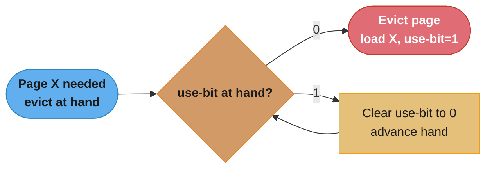
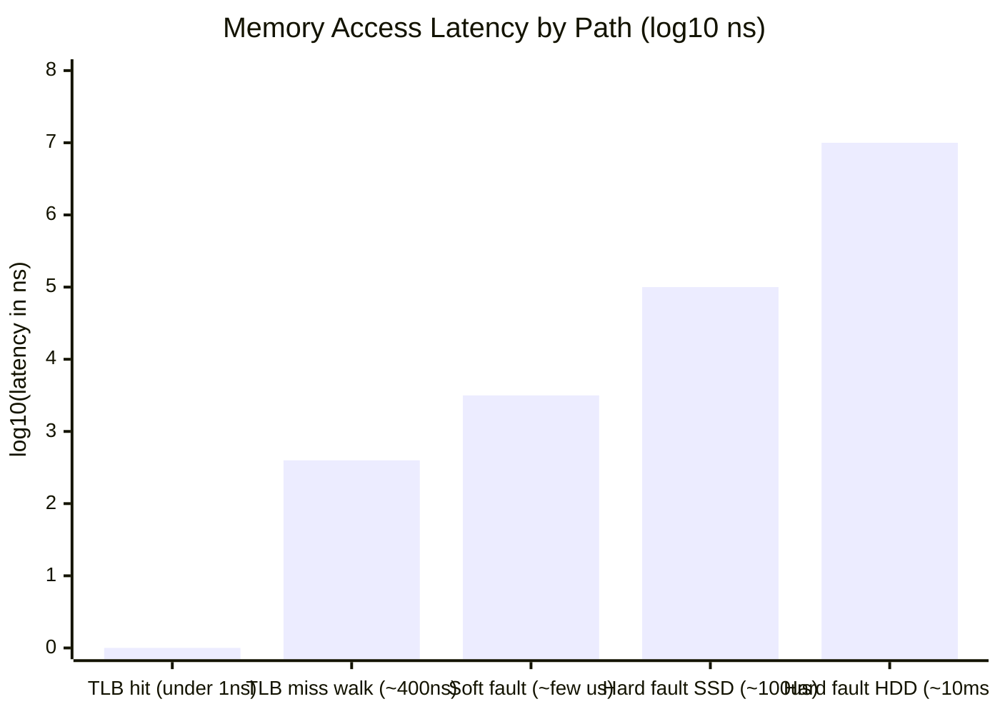
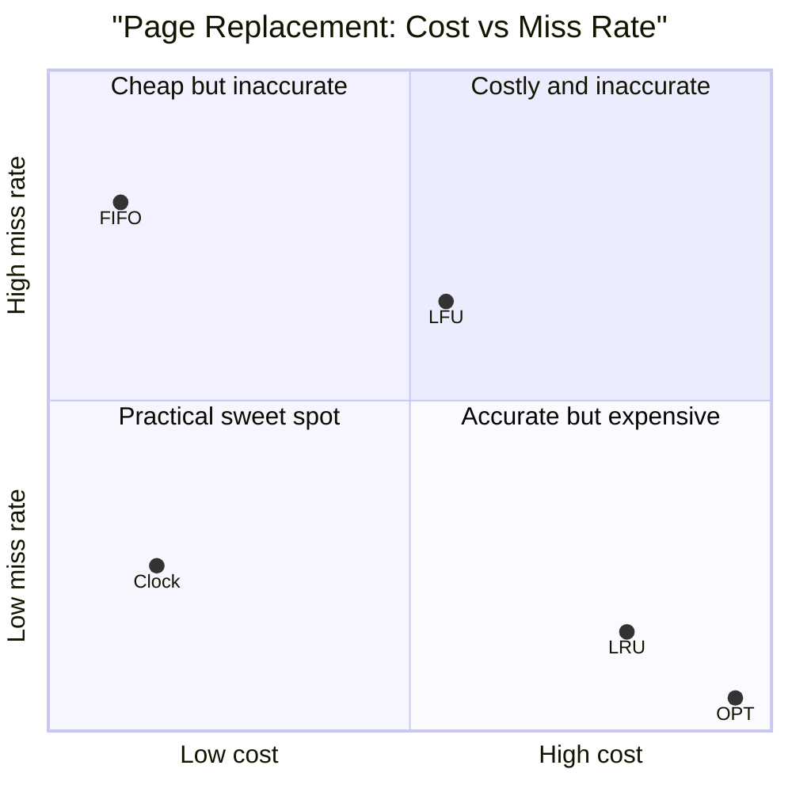

# Memory Management and Virtual Memory

> Virtual memory is the OS's greatest magic trick: every process believes it has the entire address space to itself, while the OS quietly manages the illusion.

---

## 1. Concept Overview

**Virtual memory** is the abstraction that gives every process the illusion of a private, contiguous address space larger than the available physical RAM. The OS and MMU hardware collaborate to translate virtual addresses to physical addresses on every memory access, and to transparently move pages between RAM and disk when physical memory is exhausted.

**Memory management** encompasses: how the OS allocates and frees physical memory frames; how the page table maps virtual addresses to physical frames; how the TLB (Translation Lookaside Buffer) caches recent translations; and how the OS handles page faults when a required page is not in RAM.

This module covers paging (the dominant memory management scheme), page table structures, TLB mechanics, page-replacement algorithms (OPT, LRU, Clock), and the conceptual relationship to language-level memory management (GC, refcounting) covered in [`java/jvm_internals`](../../java/jvm_internals/) and [`python/cpython_memory_model`](../../python/cpython_memory_model/).

---

## 2. Intuition

> **One-line analogy**: Virtual memory is like a hotel booking system. Guests (processes) are given a room number (virtual address) and believe they have a private room. The hotel (OS/MMU) maps room numbers to actual physical rooms, overbooking knowing most guests won't use their room simultaneously — and putting overflow guests in temporary storage (swap) if demand peaks.

**Mental model**: Divide all memory into fixed-size pages (typically 4 KB). Each process has a page table: a mapping from virtual page numbers (VPNs) to physical frame numbers (PFNs). The MMU hardware walks the page table on every memory access. The TLB caches recent VPN→PFN translations (~64 entries on x86-64 L1 TLB). The OS manages the physical frame allocator and the swap device.

**Why it matters**: Virtual memory is what makes modern multiprogramming possible. Without it: programs must know their physical addresses at compile time; one program's bug corrupts another's memory; RAM is limited to what's physically installed. With virtual memory: programs use arbitrary virtual addresses; the OS isolates processes; programs can use more memory than physically installed (at the cost of page faults).

**Key insight**: The TLB miss cost (~100–200 ns for a 4-level page table walk) is the hidden penalty for large working sets. A program that fits in the TLB (~256 MB for 64 L1 TLB entries × 4 MB per huge page) runs at full speed; a program that exceeds the TLB's coverage pays hundreds of nanoseconds per unique page access.

---

## 3. Core Principles

**Paging**: Divide physical memory into fixed-size frames (4 KB standard, 2 MB or 1 GB "huge pages"). Divide virtual address space into pages of the same size. The page table maps virtual page number → physical frame number + flags (present, dirty, accessed, read-only, user/kernel). Paging eliminates external fragmentation (no contiguous allocation needed) at the cost of internal fragmentation (last page partially filled).

**Page fault**: When the CPU accesses a virtual address whose page table entry has present-bit = 0, the MMU raises a page-fault exception. The OS handler: (1) checks if the access is valid (not a segfault), (2) finds the required page (in swap, from a file, or zero-filled on first access), (3) loads the page into a free physical frame, (4) updates the page table entry (sets present-bit), (5) resumes the faulting instruction.

**TLB (Translation Lookaside Buffer)**: A hardware cache for page table entries, managed automatically by the MMU. A TLB hit (VPN in cache) takes ~1 cycle. A TLB miss triggers a page-table walk: on x86-64, 4 levels of page table → 4 DRAM accesses (~100 ns each = ~400 ns total). TLBs are fully associative, with 64–1024 entries. On context switch between processes, the TLB is flushed (PCID extensions reduce flushes on modern CPUs).

**Copy-on-write (COW)**: After `fork()`, parent and child share physical pages mapped read-only. The first write to a shared page triggers a page fault; the OS copies the page and maps the copy privately. This makes `fork()` fast (O(page-table-size), not O(address-space-size)).

**Swap**: A disk partition or file that stores pages evicted from RAM. Reading from SSD swap: ~100 µs. Writing to swap (eviction): ~100 µs. If a process's working set exceeds available RAM, the OS continuously evicts and re-loads pages — "thrashing" — causing order-of-magnitude slowdowns.

---

## 4. Types / Architectures / Strategies

### Page Table Structures

| Structure | Description | Used in |
|-----------|-------------|---------|
| Single-level (flat) | One array indexed by VPN; O(1) lookup but huge for large address spaces | 32-bit simple OSes |
| Multi-level (hierarchical) | Tree of page tables; only allocated for used regions; 4-level on x86-64 | Linux x86-64 (4 levels: PGD/PUD/PMD/PTE) |
| Inverted page table | Indexed by physical frame (not VPN); smaller; requires hash for VPN lookup | IBM PowerPC, HP-UX |
| TLB-managed (software TLB) | OS handles all TLB misses in software; flexible but slower | MIPS, some RISC architectures |

### Page Replacement Algorithms

| Algorithm | Strategy | Miss rate | Implementable? |
|-----------|----------|-----------|----------------|
| OPT (Optimal/Bélády) | Evict the page used furthest in future | Minimum possible | No (requires future knowledge) |
| FIFO | Evict the oldest loaded page | Poor (Bélády's anomaly) | Yes (simple) |
| LRU | Evict the least recently used page | Near-optimal in practice | Costly (need exact recency) |
| Clock (Second Chance) | Approximates LRU; use-bit per page | Good | Yes (Linux uses variant) |
| Clock-Pro | Two-clock hands; distinguishes hot/cold | Better than Clock | Yes (modern Linux) |
| LFU | Evict least frequently used | Poor for recency | Yes |

### Memory Allocation in the OS

| Component | Mechanism | Notes |
|-----------|-----------|-------|
| Physical frame allocator | Buddy system (powers of 2) | Splits/merges buddy pairs; reduces fragmentation |
| Virtual address allocator | Slab allocator (kernel objects) | Fixed-size caches for common object types |
| User-space heap | malloc (dlmalloc, ptmalloc2, jemalloc, tcmalloc) | Returns virtual memory; may not map to physical until first access |
| mmap | Maps file/anonymous pages | Used by dynamic linker, shared libraries, `new` via malloc |

---

## 5. Architecture Diagrams

### 4-Level Page Table Walk (x86-64)

```
Virtual address (48 bits used):
  [47:39] PGD index (9 bits) | [38:30] PUD index (9 bits) |
  [29:21] PMD index (9 bits) | [20:12] PTE index (9 bits) | [11:0] offset (12 bits)
```


*The MMU checks the TLB first (~1 cycle, under 1 ns on a hit); a miss walks all four page-table levels — CR3 -> PGD -> PUD -> PMD -> PTE — costing about 400 ns for the four DRAM reads before the physical address (frame x 4096 + offset) is known.*

### Page Fault Handling

```mermaid
flowchart LR
    classDef io      fill:#61afef,stroke:#2e86c1,color:#1a1a1a,font-weight:bold
    classDef frozen  fill:#c678dd,stroke:#9b59b6,color:#fff
    classDef train   fill:#98c379,stroke:#27ae60,color:#1a1a1a
    classDef mathOp  fill:#d19a66,stroke:#e67e22,color:#1a1a1a,font-weight:bold
    classDef lossN   fill:#e06c75,stroke:#c0392b,color:#fff,font-weight:bold
    classDef req     fill:#56b6c2,stroke:#0097a7,color:#1a1a1a
    classDef base    fill:#e5c07b,stroke:#f39c12,color:#1a1a1a

    cpu(["CPU accesses<br/>virtual address V"]) --> tlbq{"TLB hit?"}
    tlbq -->|"yes"| usepfn1(["Use PFN"])
    tlbq -->|"no"| walk["Page table walk"]
    walk --> pteq{"PTE present=1?"}
    pteq -->|"yes"| usepfn2(["Use PFN"])
    pteq -->|"no"| fault(["PAGE FAULT<br/>exception"])

    subgraph handler["OS fault handler"]
        direction TB
        vma{"in process VMA?"}
        vma -->|"no"| segv(["SIGSEGV"])
        vma -->|"yes"| src["Find page source<br/>swap / file / zero"]
        src --> alloc["Allocate physical frame"]
        alloc --> load["Load page<br/>~100us SSD I/O"]
        load --> setpte["Set PTE present=1"]
        setpte --> retry(["Retry instruction"])
    end

    fault --> vma

    class cpu io
    class tlbq,pteq,vma mathOp
    class usepfn1,usepfn2,retry train
    class fault,segv lossN
    class walk,src,alloc,load,setpte base
```


*A TLB miss triggers a page-table walk; if the PTE's present bit is 0, the MMU raises a page-fault exception and the OS handler resolves it in up to six steps — ending in a retried instruction, or a SIGSEGV if the address falls outside any VMA.*

### LRU Approximation — Clock Algorithm

```
8 frames; use-bit per frame. Clock hand sweeps pages.

State: [A:1, B:1, C:0, D:1, E:0, F:1, G:1, H:0]
       (1 = recently used, 0 = not recently used)
Clock hand points at C (use-bit=0).
```


*Starting at C (use-bit 0), the hand evicts immediately; had C's use-bit been 1, the hand would clear C, then D (both use-bit 1), finally evicting E — the "second chance" every page gets before eviction.*

### Memory Access Latency Ladder


*Latencies span seven orders of magnitude: a TLB hit resolves in about a cycle, a TLB miss adds roughly 400 ns for the page-table walk, and a hard page fault costs ~100 us on SSD or ~10 ms on HDD — the y-axis is log10(ns) so the smallest bar stays visible next to the largest.*

---

## 6. How It Works — Detailed Mechanics

### Simulating Page Replacement

```python
from __future__ import annotations
from collections import deque, OrderedDict
from typing import List, Tuple


def page_replace_opt(pages: List[int], n_frames: int) -> int:
    """Optimal (Bélády's) algorithm. O(n * n_frames). Requires full future knowledge."""
    frames: list[int] = []
    faults = 0
    for i, page in enumerate(pages):
        if page not in frames:
            faults += 1
            if len(frames) < n_frames:
                frames.append(page)
            else:
                # Find page used furthest in future
                future_use = {}
                for f in frames:
                    try:
                        future_use[f] = pages.index(f, i + 1)
                    except ValueError:
                        future_use[f] = float("inf")
                evict = max(future_use, key=lambda f: future_use[f])
                frames.remove(evict)
                frames.append(page)
    return faults


def page_replace_fifo(pages: List[int], n_frames: int) -> int:
    """FIFO page replacement. O(n)."""
    frames: deque[int] = deque(maxlen=n_frames)
    frame_set: set[int] = set()
    faults = 0
    for page in pages:
        if page not in frame_set:
            faults += 1
            if len(frames) == n_frames:
                frame_set.discard(frames[0])   # leftmost = oldest
            frames.append(page)
            frame_set.add(page)
    return faults


def page_replace_lru(pages: List[int], n_frames: int) -> int:
    """
    LRU page replacement using an OrderedDict (most-recent at end).
    O(n) amortised.
    """
    cache: OrderedDict[int, None] = OrderedDict()
    faults = 0
    for page in pages:
        if page in cache:
            cache.move_to_end(page)    # mark as most recently used
        else:
            faults += 1
            if len(cache) == n_frames:
                cache.popitem(last=False)   # evict LRU (front)
            cache[page] = None
    return faults


def page_replace_clock(pages: List[int], n_frames: int) -> int:
    """Clock (Second Chance) algorithm. O(n). Approximates LRU."""
    frames = [-1] * n_frames         # -1 = empty slot
    use_bits = [False] * n_frames
    hand = 0
    frame_set: set[int] = set()
    faults = 0

    for page in pages:
        if page in frame_set:
            # Hit: set use bit
            idx = frames.index(page)
            use_bits[idx] = True
            continue

        faults += 1
        # Advance clock hand until finding a frame with use_bit=0
        while use_bits[hand]:
            use_bits[hand] = False
            hand = (hand + 1) % n_frames

        if frames[hand] != -1:
            frame_set.discard(frames[hand])
        frames[hand] = page
        use_bits[hand] = True
        frame_set.add(page)
        hand = (hand + 1) % n_frames

    return faults
```

### Demonstrating TLB Impact (Stride Access)

```python
import ctypes
import time


def measure_tlb_impact(size_mb: int = 256, strides: list[int] = None) -> dict[int, float]:
    """
    Access a large array with different strides.
    Small stride (4B): sequential, every access same cache line, few TLB entries.
    Large stride (4096B = page size): every access hits a new TLB entry.
    Larger stride: TLB thrashing when unique pages > TLB size.
    """
    if strides is None:
        strides = [4, 64, 512, 4096, 65536]  # bytes

    arr_size = size_mb * 1024 * 1024 // 4    # int32 elements
    arr = (ctypes.c_int * arr_size)()        # allocate in C, avoids Python overhead

    results: dict[int, float] = {}
    for stride_bytes in strides:
        stride_elems = max(1, stride_bytes // 4)
        n_accesses = 1_000_000
        start = time.perf_counter()
        total = 0
        idx = 0
        for _ in range(n_accesses):
            total += arr[idx]
            idx = (idx + stride_elems) % arr_size
        elapsed = time.perf_counter() - start
        ns_per_access = elapsed / n_accesses * 1e9
        results[stride_bytes] = ns_per_access
        _ = total   # prevent optimisation

    return results
    # Expected results:
    # stride=4B:    ~0.5 ns (L1 cache, hot TLB)
    # stride=64B:   ~1 ns (cache line boundary)
    # stride=4096B: ~5–10 ns (new TLB entry per access, but fits in TLB)
    # stride=65536B:~30–50 ns (TLB thrashing for large arrays)
```

---

## 7. Real-World Examples

**Linux overcommit**: By default (`vm.overcommit_memory = 0`), Linux allows processes to allocate more virtual memory than physical RAM + swap. A `malloc(4 GB)` on a 2 GB RAM machine succeeds — the pages are not physically allocated until first write. The OOM (Out of Memory) killer terminates processes when physical memory is actually exhausted. This enables fork/exec efficiency (child process gets virtual pages mapped COW; most are never written).

**JVM heap and virtual memory**: JVM allocates its heap via `mmap` with `PROT_NONE` (reserved but not mapped). Physical pages are committed lazily as the GC allocates objects. A 4 GB heap reservation does not require 4 GB of RAM immediately — only committed (accessed) pages consume physical memory. The GC manages object allocation within the heap; the OS manages physical frame allocation and page faults within the heap region. See [`java/jvm_internals`](../../java/jvm_internals/).

**Huge pages**: x86-64 supports 2 MB and 1 GB huge pages. Benefits: fewer TLB entries needed for the same memory coverage (one 2 MB huge-page TLB entry covers what 512 regular 4 KB TLB entries would). For databases (PostgreSQL, MySQL), memory-mapped files, and JVM heaps, huge pages reduce TLB miss rate dramatically. In Linux: `mmap(MAP_HUGETLB)` or Transparent Huge Pages (THP, enabled by default).

**Memory-mapped files**: `mmap()` maps a file into the virtual address space. Reads and writes go through the page cache — the file is loaded page-by-page as needed (demand paging). Databases (SQLite WAL, PostgreSQL shared buffers) and executables (ELF loading via dynamic linker) use mmap. The OS flushes dirty mmap pages to the file asynchronously; `msync()` forces synchronous flush.

**Android's swap mechanism (zRAM)**: Android devices typically have no swap partition. Instead, Linux's `zram` driver creates a compressed in-memory swap device. Pages evicted to zRAM are compressed (~2:1 ratio), effectively extending RAM. A 4 GB device effectively has ~6 GB of "available memory" via zRAM. Compression adds ~50–100 µs latency per evicted/loaded page vs the ~100 µs for SSD swap.

---

## 8. Tradeoffs

### Paging vs Segmentation

| Aspect | Paging | Segmentation |
|--------|--------|-------------|
| Unit of allocation | Fixed-size pages (4 KB) | Variable-size segments |
| External fragmentation | None | Yes (holes between segments) |
| Internal fragmentation | Yes (last page partially used) | None |
| Protection | Per-page (present, RO, XN) | Per-segment (base+limit) |
| Sharing | Share individual pages | Share segments |
| Hardware support | Universal (x86, ARM, RISC-V) | x86 only (mostly legacy) |
| Used by Linux | Yes | Minimal (flat segments) |

### Page Replacement Algorithm Comparison

| Algorithm | Miss rate | Implementation cost | Used in practice |
|-----------|-----------|--------------------|-|
| OPT | Minimum (theoretical lower bound) | Not implementable | Benchmark only |
| FIFO | High (Bélády's anomaly: adding frames can increase misses!) | O(1) | Rarely; educational only |
| LRU | Near-optimal | Expensive: needs exact recency order | Rarely (cost prohibitive) |
| Clock | 5–10% worse than LRU | O(1) amortised | Yes (Linux's inactive/active list) |
| LFU | Poor for bursty access | O(log n) | No |


*Clock sits in the practical sweet spot — O(1) amortised cost with a miss rate only 5–10% worse than LRU — while OPT is the unreachable ideal (needs future knowledge) and LRU pays for its near-optimal miss rate with expensive bookkeeping; FIFO and LFU land in the cheap-but-inaccurate zone, which is why Linux ships a Clock variant instead.*

### Page Size Tradeoffs

| Page size | TLB coverage | Internal fragmentation | Page fault cost | Used in |
|-----------|-------------|----------------------|-----------------|---------|
| 4 KB | 4 KB per entry | Low | Low per fault | Default everywhere |
| 2 MB | 2 MB per entry | High (last 2MB partially used) | Higher per fault | Databases, JVM heap |
| 1 GB | 1 GB per entry | Very high | Very high per fault | Large in-memory databases |

---

## 9. When to Use / When NOT to Use

**Use huge pages when**: your application has a large, stable working set (database buffer pool, JVM heap > 8 GB, in-memory cache). The reduction in TLB misses can yield 10–30% performance improvements for memory-intensive workloads.

**Disable Transparent Huge Pages (THP) for databases**: THP automatically promotes contiguous 4KB pages to 2MB huge pages. For workloads with unpredictable allocation patterns (Redis, MongoDB, MySQL), THP can cause large memory compaction stalls (the OS periodically compacts memory to create 2MB-aligned regions — this causes multi-millisecond latency spikes). Redis, MongoDB, and many databases explicitly recommend disabling THP.

**Use mmap for large read-mostly files**: Memory-mapped files integrate with the OS page cache and allow demand-loading — only pages that are accessed consume physical memory. Appropriate for read-only datasets, log files, and memory-mapped databases (SQLite, LMDB).

**Do NOT rely on overcommit for memory-sensitive services**: In containers and production services, overcommit can lead to OOM kills. Set resource limits explicitly (Java's `-Xmx`, Python's resource module), use `vm.overcommit_memory = 2` (never overcommit), and monitor RSS (Resident Set Size) not just virtual size.

---

## 10. Common Pitfalls

### Pitfall 1 — Confusing virtual size (VSZ) with physical memory (RSS)

```bash
# BROKEN interpretation: process with VSZ=8GB is using 8GB of RAM
ps aux
# USER  PID  %CPU %MEM  VSZ    RSS
# java  123   25   10  8192M  1024M

# Reality: VSZ=8192 MB = JVM heap reservation (virtual address space)
#          RSS=1024 MB = actually used physical RAM (resident set size)
# FIX: monitor RSS, not VSZ, for actual memory pressure.
# RSS includes stack, text, data, heap, and mapped files.
```

### Pitfall 2 — Thrashing from over-allocating threads

```python
# BROKEN: 10,000 threads, each with 8MB default stack
# 10,000 * 8 MB = 80 GB virtual address space reservation (ulimit -v check)
# If threads touch their stacks: 10,000 * actual-stack-usage = possible GB of physical RAM
# Plus context-switch overhead: 10,000 * 5µs per switch = significant CPU

# FIX: use a thread pool with bounded size; use virtual threads (Java 21) or
# async I/O (asyncio) to avoid thread-per-connection overhead
```

### Pitfall 3 — Memory leak via unreleased mmap regions

```python
import mmap
import os

# BROKEN: mmap not closed -> file descriptor and mapping stay open
def broken_mmap_read(path: str) -> bytes:
    f = open(path, "rb")
    m = mmap.mmap(f.fileno(), 0, access=mmap.ACCESS_READ)
    data = m[:]      # read entire file
    # BUG: f and m are not closed -> memory leak + fd leak
    return data
```

```python
# FIX: use context managers for both file and mmap
def fixed_mmap_read(path: str) -> bytes:
    with open(path, "rb") as f:
        with mmap.mmap(f.fileno(), 0, access=mmap.ACCESS_READ) as m:
            return m[:]
```

### Pitfall 4 — Page fault storms on first access to large allocations

```python
# BROKEN: allocating a large numpy array causes a page fault storm on first touch
import numpy as np
import time

# First access to each 4KB page -> page fault -> OS maps physical frame
# For a 1 GB array: 1 GB / 4 KB = 262,144 page faults -> visible latency spike
arr = np.zeros((256 * 1024 * 1024,), dtype=np.int32)   # 1 GB allocation
start = time.perf_counter()
arr[:] = 1   # first write -> 262,144 page faults -> ~1-2 seconds on HDD swap, ~0.1s on RAM
elapsed = time.perf_counter() - start
print(f"First touch: {elapsed:.3f}s")   # much slower than subsequent access
```

```python
# FIX: pre-fault pages with mlock() if you need predictable latency on first access
import ctypes
libc = ctypes.CDLL("libc.so.6")
# mlock forces all pages to be physically resident immediately
# libc.mlock(arr.ctypes.data, arr.nbytes)
# Or: use madvise(MADV_WILLNEED) to prefetch pages asynchronously
```

### Pitfall 5 — swap enabled on database servers (writes amplify latency)

```
Problem: PostgreSQL data pages in shared_buffers get swapped to disk
         when the OS needs physical memory for other processes.
         Next query that needs those pages -> hard page fault -> 100µs–10ms stall.

FIX: pin PostgreSQL to physical memory:
  1. Set vm.swappiness=0 (reduce swap tendency, not eliminate)
  2. Use mlock() or mlockall() to pin shared_buffers to RAM
  3. In containers: set memory.limit = memory.request (no oversubscription)
  4. Allocate huge pages for shared_buffers: huge_pages=on in postgresql.conf
```

---

## 11. Technologies & Tools

| Tool / Command | Purpose | Notes |
|----------------|---------|-------|
| `free -h` | Show total/used/free RAM and swap | "available" is more useful than "free" |
| `vmstat 1` | Virtual memory stats per second: si/so (swap in/out) | si/so > 0 means thrashing |
| `cat /proc/<pid>/status` | VmPeak, VmRSS, VmSwap per process | Resident vs virtual |
| `pmap -x <pid>` | All memory mappings of a process | Shows text, data, heap, stack, mmap regions |
| `perf stat -e dTLB-load-misses` | TLB miss rate | High rate → reduce working set or use huge pages |
| `mlock` / `mlockall` | Pin pages to RAM (prevent swap) | Requires root or CAP_IPC_LOCK |
| `madvise` | Hint to OS about access patterns | MADV_SEQUENTIAL, MADV_RANDOM, MADV_WILLNEED |
| `numactl` | NUMA memory policy (bind to node) | For multi-socket servers; latency-critical processes |
| `sysctl vm.swappiness` | Control swap tendency (0–100) | 0 = avoid swap; 60 = default Linux |

---

## 12. Interview Questions with Answers

**Q1: What is the difference between virtual memory and physical memory?**
Physical memory is the actual DRAM in the machine. Virtual memory is an abstraction: each process sees a private virtual address space (0 to ~128 TiB on x86-64). The MMU translates virtual addresses to physical addresses on every access using the page table. Virtual address spaces can be larger than physical RAM — pages not currently needed are stored on swap disk. The key benefit is isolation: two processes can use the same virtual address (e.g., code loaded at 0x400000) without conflict — they map to different physical frames.

**Q2: What is a page fault, and what is the difference between a soft and hard page fault?**
A page fault is a hardware exception raised by the MMU when the accessed page's present-bit is 0. Soft (minor) page fault: the page is in physical memory but not mapped in the page table (e.g., first anonymous allocation via mmap, copy-on-write trigger, shared library already loaded for another process). The OS updates the page table entry with no I/O — handled in microseconds. Hard (major) page fault: the page must be read from swap disk or a file — takes ~100 µs (SSD) to ~10 ms (HDD). Frequent hard page faults cause "thrashing" — the system spends more time swapping than computing.

**Q3: How does the TLB work and what is a TLB miss?**
The TLB (Translation Lookaside Buffer) is a small, fully associative hardware cache (64–1024 entries) that stores recent VPN→PFN translations. On every memory access, the MMU checks the TLB first. TLB hit: translation found in ~1 cycle. TLB miss: walk the multi-level page table in memory — 4 DRAM accesses on x86-64 (~400 ns total). Spatial and temporal locality keep TLB hit rates high (>99% for typical programs). Large working sets (hundreds of MB with random access) cause TLB thrashing — hit rate drops, every access pays 400 ns. Huge pages (2 MB each) reduce TLB entry consumption by 512×, mitigating this.

**Q4: What is the Clock page-replacement algorithm and how does it approximate LRU?**
The Clock algorithm maintains a circular buffer of physical frames, each with a use-bit. When a page is accessed, its use-bit is set. When a page must be evicted: the clock hand advances from its current position; if a frame's use-bit is 0, evict it; if the use-bit is 1, clear it (second chance) and advance. This approximates LRU: recently accessed pages have use-bit=1 (protected for one full revolution); pages not accessed in a full revolution are evicted. Linux uses a two-list variant (active/inactive lists) with similar second-chance semantics.

**Q5: What is Bélády's anomaly and which algorithm exhibits it?**
Bélády's anomaly: adding more physical frames causes more page faults, which is counterintuitive. It is observed with FIFO page replacement. Intuition: FIFO evicts the "oldest" loaded page, which may be a frequently-used page. Adding a frame changes the eviction pattern in a way that evicts pages needed sooner. LRU, OPT, and Clock do not exhibit Bélády's anomaly — they are "stack algorithms" (the set of pages in memory for n frames is always a subset of the pages for n+1 frames).

**Q6: How does copy-on-write (COW) make fork() efficient?**
After `fork()`, the kernel marks all parent's writable pages as read-only in both parent and child page tables but still pointing to the same physical frames. If neither process writes, no copying occurs — ideal for fork+exec (child immediately replaces its address space with exec). When either process writes to a shared page, the write causes a write-protection fault; the OS copies the page into a new physical frame and updates the faulting process's page table. Only actually-modified pages are copied. For a 2 GB process that fork-execs, only the few modified pages (environment, arguments) are copied — typically <1 MB.

**Q7: What is thrashing and how do you prevent it?**
Thrashing occurs when the combined working sets of all runnable processes exceed physical RAM. The OS spends more time loading pages from swap and evicting pages than running processes. Prevention: (1) reduce the number of concurrent processes (working set model: only admit processes whose total working set fits in RAM); (2) add RAM; (3) swap to SSD instead of HDD (100 µs vs 10 ms latency reduces thrashing severity); (4) reduce process memory footprints (smaller JVM heaps, fewer concurrent connections per process); (5) use Linux's PSI (Pressure Stall Information) monitoring to detect memory pressure before thrashing begins.

**Q8: What is memory overcommit and what are its risks?**
Linux's default overcommit policy (vm.overcommit_memory=0) allows processes to allocate more virtual memory than available RAM + swap, because most allocations are never fully used. Risk: if processes actually access their full allocations, the OOM killer terminates processes to reclaim memory — possibly killing critical services. Mitigation: (1) vm.overcommit_memory=2 (strict mode — refuse allocations that would exceed RAM + swap × overcommit_ratio); (2) set OOM score adjustments (oom_score_adj) to protect critical processes; (3) use container memory limits to bound individual processes.

**Q9: Explain the difference between RSS and VSZ and which one actually matters.**
VSZ (Virtual Size): total virtual address space reserved by the process — includes all mmap regions, stack reservations, JVM heap reservations, even pages not yet physically mapped. VSZ can be gigabytes for JVM processes that reserve heap upfront. RSS (Resident Set Size): physical memory actually mapped to the process's virtual address space right now — the number that actually consumes RAM. RSS matters for capacity planning; VSZ is usually misleading. `cat /proc/<pid>/status` shows VmRSS (RSS) and VmSize (VSZ). `VmSwap` shows how much of the RSS has been swapped out.

**Q10: How does the OS manage memory for multiple processes with limited RAM?**
The OS maintains a global physical frame allocator (buddy system). When a process allocates a page and there are no free frames, the OS must evict an existing page. For a clean page (not modified since last loaded from file/disk), simply unmap it. For a dirty page (modified anonymous page), write it to swap first, then unmap. The page-replacement algorithm (Clock/LRU approximation) selects the victim. Modern Linux uses a two-list (active/inactive) scheme with second-chance promotion/demotion between lists.

**Q11: What is NUMA and how does it affect memory allocation?**
NUMA (Non-Uniform Memory Access) applies to multi-socket servers where each CPU socket has its own RAM bank. Accessing local memory takes ~100 ns; accessing remote memory (via QPI/UPI interconnect) takes ~200–300 ns. The OS NUMA allocator (`numactl --localalloc`) tries to allocate memory on the NUMA node local to the CPU running the process. For latency-sensitive services, pin the process to a NUMA node and allocate from that node. `numactl --hardware` shows NUMA topology. NUMA-unaware JVMs may allocate objects on a remote node, adding latency to every GC and allocation.

**Q12: How do anonymous pages differ from file-backed pages?**
File-backed pages are backed by a file on disk — reads are initially page faults that load from the file; writes are dirty pages that can be flushed back to the file. They can be evicted without going to swap (just discard — re-read from the file on next access). Anonymous pages have no file backing (heap, stack) — reads may be zero-filled on first access; dirty anonymous pages must go to swap if evicted. The OS prefers evicting file-backed pages (especially clean ones) before anonymous pages because file eviction has no write cost.

**Q13: What is the working set model and how does it guide OS memory policy?**
The working set W(t, Δ) is the set of pages referenced by a process in the time interval [t-Δ, t]. The working-set model says: a process should only be admitted to run when its working set fits in available RAM. If not enough RAM is available, a process is suspended (swapped out entirely). This prevents thrashing by ensuring no process runs without sufficient memory. Linux's page reclaim uses a recency-based approximation: pages in the "active" list are assumed to be in the working set; pages in the "inactive" list are candidates for eviction.

**Q14: What is the difference between paging and segmentation?**
Paging: memory divided into fixed-size pages (4 KB). No external fragmentation; internal fragmentation in the last page. Address = virtual page number + offset. Supported by hardware MMU. Segmentation: memory divided into variable-size segments (code, data, stack). No internal fragmentation; external fragmentation creates holes. Address = segment number + offset. x86 originally used segmentation (CS, DS, SS, ES registers); modern 64-bit Linux uses flat segments (base=0, limit=max) effectively disabling segmentation in favour of paging. Segmentation is largely a legacy concept.

**Q15: How does the Linux OOM killer decide which process to kill?**
The OOM killer selects the process with the highest `oom_score`. `oom_score` = proportion of physical memory used by the process + adjustments. `oom_score_adj` (-1000 to +1000) lets you manually tune: -1000 = never kill this process (use for system-critical processes), +1000 = kill first. The OOM killer prefers processes that: (1) use the most memory; (2) have been running the shortest; (3) have the most children; (4) are not kernel threads. To protect a service: set `oom_score_adj = -900` in its systemd unit file (`OOMScoreAdjust=-900`).

---

## 13. Best Practices

**Monitor RSS and swap usage, not just virtual size**: Use `free -h` (system-wide), `vmstat 1` (swap in/out rates), and `/proc/<pid>/status` (per-process). Alert on RSS > 80% of container memory limit and on any swap I/O (si/so > 0).

**Disable THP for latency-sensitive databases**: Redis, MongoDB, and MySQL all recommend `echo never > /sys/kernel/mm/transparent_hugepage/enabled`. THP compaction stalls cause multi-millisecond latency spikes at unpredictable intervals.

**Enable huge pages for predictable high-throughput workloads**: PostgreSQL with `huge_pages=on`, Java with `-XX:+UseHugePages`, and Oracle DB with hugepage configurations consistently show 5–20% performance improvements for memory-intensive workloads.

**Set container memory limits equal to memory requests**: Overcommitted containers (limit > request × 2) risk OOM kills under bursty load. For services with SLAs, set limit = request + 20% headroom.

**Pre-fault large allocations for latency-critical paths**: If a service must respond within 1 ms, pre-fault its data structures at startup (touch every page) rather than paying for page faults on the first request. Use `mlock()` to prevent swap eviction of critical pages.

---

## 14. Case Study

### Scenario: JVM Memory Tuning for a High-Throughput API

A Java service running in a container with 8 GB memory limit is experiencing intermittent latency spikes >100 ms every few minutes, and OOM kills under peak load.

**Diagnosis**:

```bash
# Check if swap is active (bad for latency)
vmstat 1 10 | awk '{print $7, $8}'   # si (swap in), so (swap out)
# si > 0 or so > 0 -> pages being swapped -> latency spikes

# Check RSS vs container limit
cat /sys/fs/cgroup/memory/memory.usage_in_bytes   # current usage
cat /sys/fs/cgroup/memory/memory.limit_in_bytes   # limit

# Check GC and page fault events
# Java: add -Xlog:gc* to JVM flags
# Also: perf stat -e page-faults java ...
```

**BROKEN JVM configuration (causing OOM and latency)**:

```bash
# BROKEN: no heap limits set; JVM uses default (25% of physical RAM)
# In 8GB container: default heap ~2GB, but JVM also uses off-heap, metaspace, stacks
# Total RSS can reach 6-7 GB before triggering container OOM kill

java -jar service.jar
# Result: container OOM kill at peak load; no heap tuning; random GC pauses
```

```bash
# FIX: size heap explicitly; reserve off-heap; enable G1GC; use huge pages
java \
  -Xms4g -Xmx4g \              # fixed heap (avoids resize pauses)
  -XX:MaxMetaspaceSize=512m \  # cap metaspace
  -XX:+UseG1GC \               # G1: predictable pause targets
  -XX:MaxGCPauseMillis=50 \    # target max GC pause < 50ms
  -XX:+UseHugePages \          # 2MB pages -> fewer TLB misses
  -XX:+AlwaysPreTouch \        # pre-fault all heap pages at startup
  -Djava.nio.file.spi.DefaultFileSystemProvider=... \
  -jar service.jar
# Total memory: 4GB heap + 512MB metaspace + ~1GB stacks/direct buffers = ~5.5GB RSS
# Container limit 8GB: sufficient headroom
```

**Latency improvement**:

| Metric | Before | After |
|--------|--------|-------|
| p50 latency | 2 ms | 1.5 ms |
| p99 latency | 150 ms (GC pause) | 55 ms (G1 bounded) |
| p999 latency | 500 ms (OOM + restart) | 90 ms |
| OOM kills / day | 2–3 | 0 |
| TLB miss rate | High (4KB pages) | Reduced (2MB huge pages) |

**Discussion questions**:
1. Why does `-XX:+AlwaysPreTouch` improve p99 latency for the first few minutes of service life?
2. What is the risk of setting `-Xms = -Xmx` (equal initial and max heap)?
3. How does G1GC's region-based heap relate to the OS's page-level memory management?

---

## See Also

- [`java/jvm_internals`](../../java/jvm_internals/) — JVM heap regions, G1/ZGC garbage collectors, TLAB, JVM memory flags
- [`python/cpython_memory_model`](../../python/cpython_memory_model/) — CPython refcounting, cyclic GC, pymalloc arenas
- [processes_threads_and_context_switching](../processes_threads_and_context_switching/) — virtual address space per process, fork + COW
- [computer_architecture_and_memory_hierarchy](../computer_architecture_and_memory_hierarchy/) — cache hierarchy, cache lines, NUMA
- [`devops/linux_and_os_fundamentals`](../../devops/linux_and_os_fundamentals/) — OOM killer, cgroups memory limits, vmstat, /proc/meminfo
