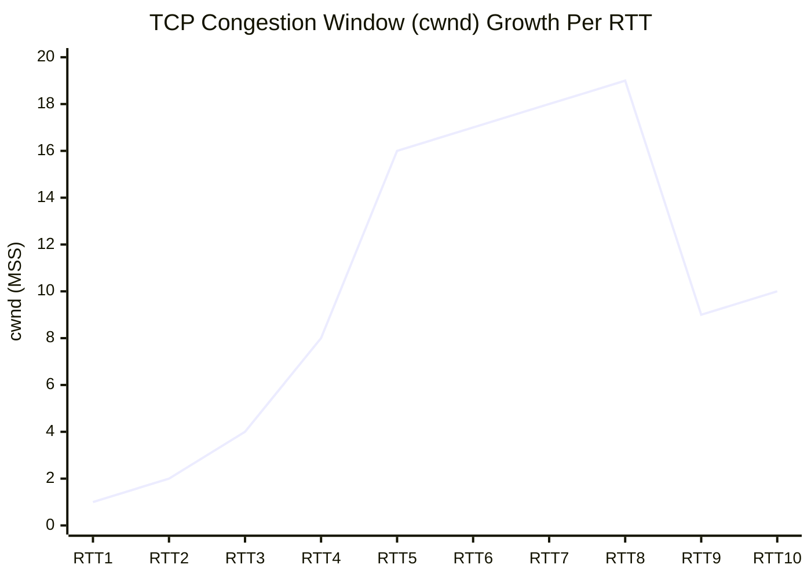
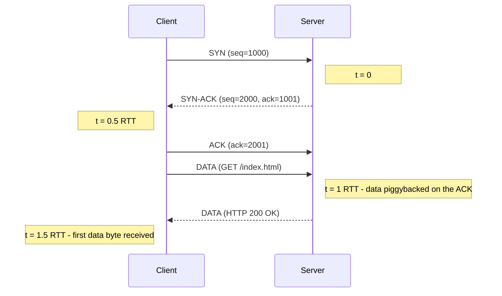
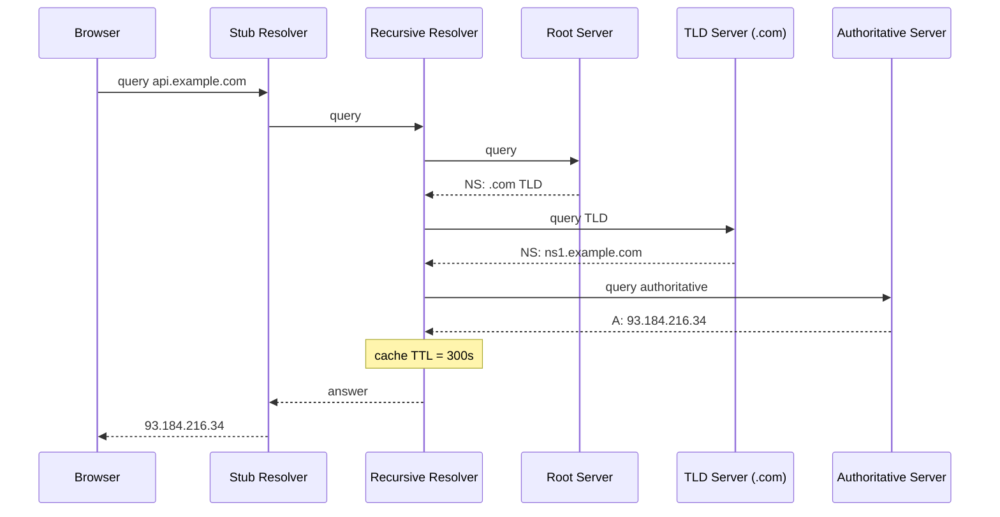
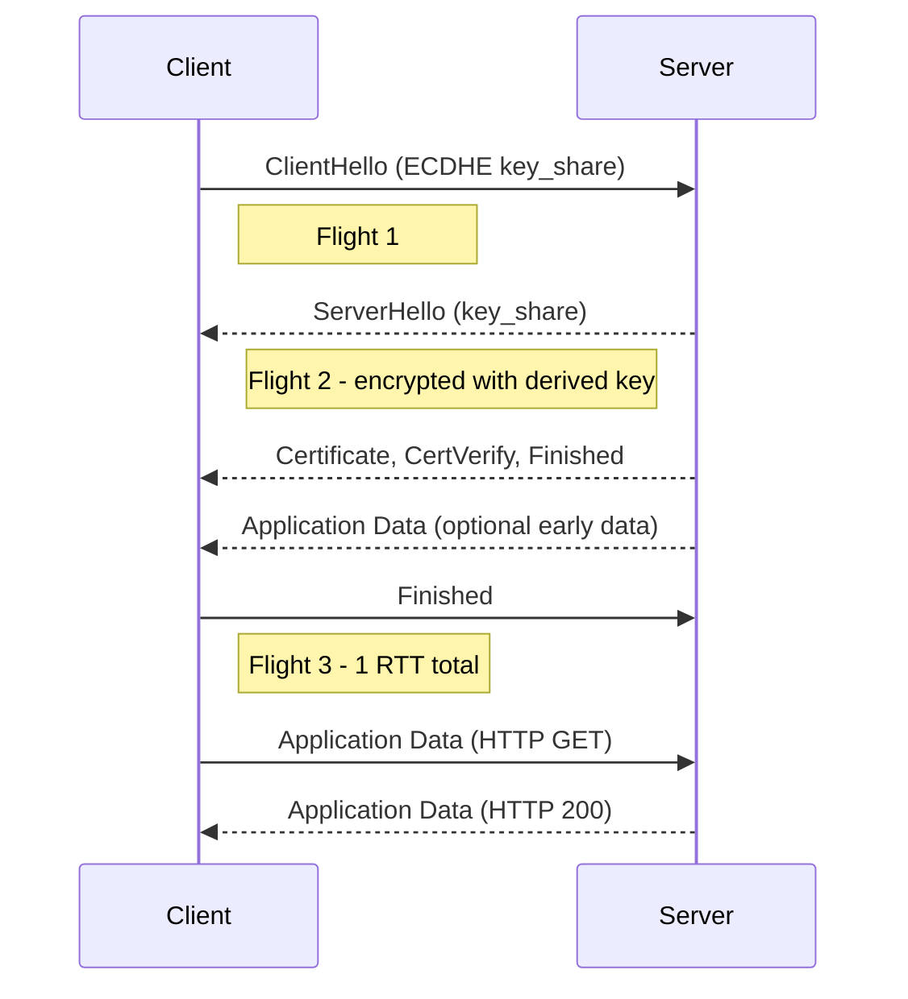
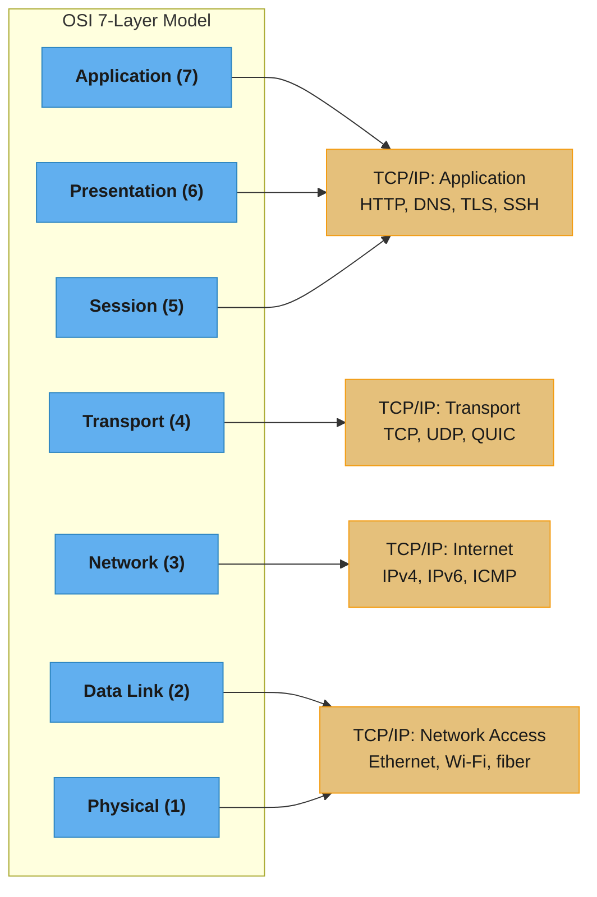
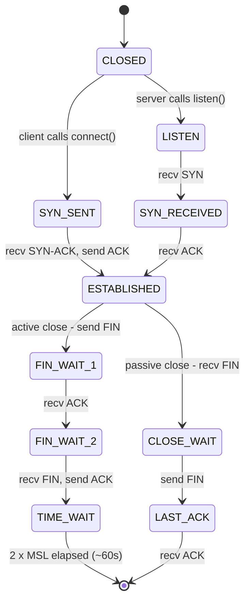

# Networking Fundamentals

**Module 18 — Phase 5: Systems & Security**

This module is a conceptual primer on networking as it applies to systems design and software engineering interviews. It covers the mental models, protocols, and tradeoffs that appear in every senior-engineer conversation. For applied depth — TCP header fields, full QUIC protocol, HTTP/3, and 7-layer OSI breakdowns — follow the crosslinks to the `backend/` section.

---

## 1. Concept Overview

Networking is the discipline of moving bytes between processes running on different machines (or the same machine). Every distributed system, every web application, every microservice architecture is built on a small stack of protocols that handle addressing, reliable delivery, and security.

The core problems networking solves:

- **Addressing** — how does a packet know where to go? (IP, DNS)
- **Reliable delivery** — what happens when packets are lost or reordered? (TCP)
- **Low-overhead delivery** — what if reliability is the application's problem? (UDP)
- **Security** — how do we prevent eavesdropping and tampering? (TLS)
- **Name resolution** — how does `api.example.com` map to an IP? (DNS)

Understanding these at a mechanistic level — with concrete numbers — is what separates engineers who "know networking" from engineers who can reason about latency, failure modes, and protocol choice under load.

---

## 2. Intuition

> The postal system analogy: IP is the envelope with a destination address. TCP is certified mail with delivery confirmation and re-send on failure. UDP is dropping a postcard in the mailbox — faster, but no guarantee it arrives. DNS is the address book that turns "Google HQ" into "1600 Amphitheatre Parkway, Mountain View, CA." TLS is the wax seal on the envelope that proves who sent it and that nobody opened it in transit.

**Mental model**: Think of networking as layers of delegation. Each layer solves exactly one problem and delegates everything else up or down.

- Physical layer: electricity/light on a wire
- Network layer (IP): route packets to the right machine
- Transport layer (TCP/UDP): deliver to the right process, handle reliability
- Application layer (HTTP, DNS, TLS): speak the protocol the application understands

**Why it matters**: Every performance problem in a distributed system is ultimately about bytes in flight, round-trip times, and protocol overhead. A 100 ms database call that makes 10 sequential network hops is 1 second of latency before your code runs. Choosing TCP vs UDP, HTTP/1.1 vs HTTP/2, or whether to place a CDN in front of your origin are all networking decisions with measurable, quantifiable impact.

**Key insight**: Latency is bounded by the speed of light (~200 ms for a transatlantic round-trip), but protocol overhead multiplies that baseline. A TCP + TLS 1.3 connection costs ~1.5 RTT before the first byte of data arrives (1 RTT for TCP handshake + 1 RTT for TLS — but TLS 1.3 overlaps the last TCP ACK, making the effective cost ~1 RTT). HTTP/2 multiplexing eliminates head-of-line blocking that plagues HTTP/1.1. Every header you add, every round trip you introduce, compounds on this floor.

---

## 3. Core Principles

**1. Layered abstraction (separation of concerns)**
Each protocol layer has a single responsibility. IP does not care whether delivery is reliable — that is TCP's job. TCP does not care what the bytes mean — that is HTTP's job. This layering enables protocol substitution (QUIC replaces TCP+TLS without changing HTTP semantics).

**2. Best-effort vs reliable delivery**
The internet is inherently best-effort at the IP layer. Packets can be lost, duplicated, or reordered. TCP adds reliability on top. Applications that prefer low latency over guaranteed delivery (video games, live video, DNS) skip TCP and use UDP, implementing only the reliability they need at the application layer.

**3. Addressing is hierarchical**
IPv4 addresses are 32-bit integers divided into network and host portions by a subnet mask. IPv6 extends this to 128 bits. DNS maps human-readable names to IPs hierarchically: root → TLD → authoritative. CIDR notation encodes both address and prefix length (`192.168.1.0/24`).

**4. Flow control and congestion control are distinct**
Flow control (TCP's receive window) prevents a fast sender from overwhelming a slow receiver. Congestion control (slow start, AIMD, CUBIC) prevents a sender from overwhelming the network. Both operate through the same mechanism — limiting the number of unacknowledged bytes in flight — but respond to different signals.

**5. Security is an orthogonal concern**
TLS sits between the transport layer (TCP) and the application layer (HTTP). It provides confidentiality (encryption), integrity (MACs), and authentication (certificates). TLS 1.3 achieved ~1 RTT handshake (down from 2 RTTs in TLS 1.2) and removed weak cipher suites.

**6. DNS is the internet's distributed phone book**
Every network connection starts with a DNS lookup. DNS TTLs (commonly 300 s for dynamic records, 86400 s for stable records) determine how long resolvers cache answers. Stale DNS is a common source of incidents during deployments.

---

## 4. Types / Architectures / Strategies

### 4.1 OSI 7-Layer Model vs TCP/IP 4-Layer Model

The OSI model is a conceptual framework; TCP/IP is what actually runs on the internet.

| OSI Layer | OSI Name | TCP/IP Layer | Protocols |
|-----------|----------|-------------|-----------|
| 7 | Application | Application | HTTP, DNS, SMTP, FTP, SSH |
| 6 | Presentation | Application | TLS/SSL, encoding (UTF-8) |
| 5 | Session | Application | RPC session management |
| 4 | Transport | Transport | TCP, UDP, SCTP |
| 3 | Network | Internet | IPv4, IPv6, ICMP |
| 2 | Data Link | Network Access | Ethernet, Wi-Fi (802.11) |
| 1 | Physical | Network Access | Cables, radio, fiber |

OSI layers 5-7 collapse into a single "Application" layer in TCP/IP. In practice engineers talk about L3 (IP routing), L4 (TCP/UDP), and L7 (application protocols). For the full 7-layer breakdown, see `../../backend/osi_model_and_networking/`.

### 4.2 IP Addressing

**IPv4**: 32-bit addresses written as four octets (`192.168.1.100`). ~4.3 billion unique addresses — exhausted; NAT extends the address space.

**IPv6**: 128-bit addresses written as eight groups of four hex digits (`2001:0db8:85a3:0000:0000:8a2e:0370:7334`). ~3.4 × 10^38 unique addresses.

**CIDR notation**: `192.168.1.0/24` means the first 24 bits are the network prefix, leaving 8 bits for host addresses (256 addresses, 254 usable — .0 = network, .255 = broadcast).

**Private ranges (RFC 1918)**:

| Range | CIDR | Addresses | Common use |
|-------|------|-----------|------------|
| 10.0.0.0 – 10.255.255.255 | 10.0.0.0/8 | ~16.7 M | Large enterprise / cloud VPCs |
| 172.16.0.0 – 172.31.255.255 | 172.16.0.0/12 | ~1 M | Docker default bridge |
| 192.168.0.0 – 192.168.255.255 | 192.168.0.0/16 | ~65 K | Home/office LANs |

**NAT (Network Address Translation)**: Allows multiple private-address devices to share a single public IP. The NAT device rewrites source IP/port in outgoing packets and maintains a translation table to route responses back. Makes the internet work at scale; complicates peer-to-peer protocols.

### 4.3 TCP — Transmission Control Protocol

TCP provides **reliable, ordered, connection-oriented** byte-stream delivery.

**3-way handshake (connection setup)**:
1. Client → Server: SYN (seq=x)
2. Server → Client: SYN-ACK (seq=y, ack=x+1)
3. Client → Server: ACK (ack=y+1)
Cost: 1.5 RTT before any application data. Data can be sent with the third ACK (on Linux with `TCP_FASTOPEN`: ~0.5 RTT on subsequent connections).

**4-way FIN teardown (connection close)**:
1. Initiator → Responder: FIN
2. Responder → Initiator: ACK
3. Responder → Initiator: FIN
4. Initiator → Responder: ACK
The initiator enters TIME_WAIT for 2×MSL (Maximum Segment Lifetime, typically 60 s) to handle delayed duplicates.

**Flow control**: Receiver advertises a receive window (rwnd) in every ACK. Sender cannot have more than rwnd unacknowledged bytes in flight. Default: 65535 bytes (64 KB), extendable to 1 GB with window scaling option.

**The idea behind it.** "Bandwidth is how wide the pipe is, latency is how long the pipe is, and throughput is what you actually get — which is neither, it is your window size divided by the round-trip time."

Engineers conflate all three constantly, and the conflation is expensive: it produces bug reports like "we bought a 1 Gbps link and single transfers still crawl at 5 Mbps." Nothing is broken in that scenario. The window is.

| Symbol | What it actually is |
|--------|---------------------|
| bandwidth | Pipe *width*. The link's capacity ceiling. Never a promise about one flow |
| latency (RTT) | Pipe *length* in time. Bounded below by the speed of light in fiber |
| throughput | What you measure. Always `<=` bandwidth |
| rwnd | Unacked bytes the sender may have outstanding. Default 65535 B |
| `rwnd / RTT` | The throughput ceiling of a single TCP flow |
| BDP | `bandwidth x RTT`. Bytes needed in flight to *fill* the pipe |

**Walk one example with real numbers.** A 1 Gbps link, 100 ms RTT (US coast to Europe), default 64 KB window:

```
  BDP = bandwidth x RTT
      = 1,000,000,000 bits/sec x 0.100 sec
      = 100,000,000 bits  /8  =  12,500,000 bytes  =  11.9 MB in flight
                                                      to keep the pipe full

  Actual single-flow throughput = rwnd / RTT
      = 65,535 bytes / 0.100 sec
      = 655,350 bytes/sec  x8  =  5,242,800 bits/sec  =  5.24 Mbps

  You paid for 1000 Mbps.  You got 5.24 Mbps.  That is 0.5% of the link.

  Same 64 KB window, shrinking the RTT instead:
      RTT 100 ms  ->  5.24 Mbps
      RTT  10 ms  ->  52.4 Mbps        <- 10x closer, 10x faster
      RTT   1 ms  ->  524 Mbps         <- LAN; window finally stops mattering

  Window needed to actually fill 1 Gbps at 100 ms:
      12,500,000 / 65,535 = 191x the default  ->  window scaling, not optional
```

**Why bandwidth alone never predicts throughput.** The sender transmits one window, then *stops* and waits a full RTT for the ACK before it may send more. Bandwidth sets how fast that window drains onto the wire; RTT sets how long the sender idles afterwards. On a short link the wait is negligible and throughput approaches bandwidth; on a long link the wait dominates and throughput is pinned to `rwnd / RTT` no matter how wide the pipe is. This is the "long fat network" problem, and it is why RFC 1323 window scaling exists, why bulk transfers use many parallel streams, and why moving the data closer (CDN, regional replica) beats buying more bandwidth almost every time. Note the asymmetry in the numbers above: doubling bandwidth changed nothing, while cutting RTT by 10x gave a clean 10x.

**Congestion control**:
- Slow start: begin with cwnd=1 MSS (max segment size, typically 1460 B), double per RTT
- Congestion avoidance (AIMD): once cwnd exceeds ssthresh, increase by 1 MSS per RTT; halve on packet loss
- Modern: CUBIC (default Linux), BBR (Google, latency-based)



The classic TCP sawtooth: slow start doubles cwnd every RTT (1 to 2 to 4 to 8 to 16 MSS) until it nears ssthresh, congestion avoidance then creeps up by 1 MSS per RTT, and a packet loss halves cwnd — after which the AIMD climb starts again.

**Use cases**: HTTP, HTTPS, database connections, SSH, email — anything requiring reliable ordered delivery.

### 4.4 UDP — User Datagram Protocol

UDP is **unreliable, connectionless, minimal-overhead**. It adds only port multiplexing and a checksum on top of IP.

- Maximum datagram payload: ~65507 bytes (65535 − 20 IP header − 8 UDP header)
- Typical MTU: 1500 bytes on Ethernet; large UDP datagrams are fragmented by IP
- No handshake, no state, no retransmission

**Use cases**:
- **DNS queries**: single request/response fits in one datagram; retransmit at application layer if no response
- **Video/audio streaming**: stale data is worse than no data; losing a frame is acceptable
- **Online games**: position updates; old positions are useless; application handles reconciliation
- **QUIC**: UDP-based protocol that implements its own reliable streams + TLS 1.3 (used by HTTP/3)

### 4.5 DNS Resolution Chain

```mermaid
flowchart LR
    classDef io      fill:#61afef,stroke:#2e86c1,color:#1a1a1a,font-weight:bold
    classDef frozen  fill:#c678dd,stroke:#9b59b6,color:#fff
    classDef train   fill:#98c379,stroke:#27ae60,color:#1a1a1a
    classDef mathOp  fill:#d19a66,stroke:#e67e22,color:#1a1a1a,font-weight:bold
    classDef lossN   fill:#e06c75,stroke:#c0392b,color:#fff,font-weight:bold
    classDef req     fill:#56b6c2,stroke:#0097a7,color:#1a1a1a
    classDef base    fill:#e5c07b,stroke:#f39c12,color:#1a1a1a

    client(["Client stub<br/>resolver"]) --> recursive["Recursive resolver<br/>ISP / 8.8.8.8 / 1.1.1.1<br/>caches by TTL"]
    recursive --> root["Root name server<br/>13 clusters"]
    root --> tld["TLD name server<br/>.com / .org / .io"]
    tld --> auth["Authoritative<br/>name server"]
    auth --> answer(["Answer: A record<br/>93.184.216.34"])

    class client,answer io
    class recursive base
    class root,tld,auth frozen
```



Each hop is a cache-or-forward decision: the recursive resolver (gold) answers from cache when the TTL hasn't expired, otherwise walks the frozen upstream hierarchy — root, TLD, then the authoritative server — one referral at a time.

**Record types**:

| Type | Purpose | Example |
|------|---------|---------|
| A | IPv4 address | `api.example.com → 1.2.3.4` |
| AAAA | IPv6 address | `api.example.com → 2001:db8::1` |
| CNAME | Alias to another hostname | `www.example.com → example.com` |
| MX | Mail exchange | `example.com → mail.example.com` |
| TXT | Arbitrary text (SPF, DKIM, verification) | `example.com → "v=spf1 ..."` |
| NS | Authoritative name servers | `example.com → ns1.example.com` |

**TTL (Time to Live)**: The number of seconds a resolver may cache the answer. Common values: 300 s (5 min) for records that may change; 86400 s (24 h) for stable infrastructure. Low TTLs enable fast failover at the cost of increased DNS query volume.

### 4.6 TLS 1.3 Handshake

TLS 1.3 reduced the handshake from 2 RTTs (TLS 1.2) to 1 RTT (or 0-RTT for session resumption).

**Full 1-RTT handshake**:
1. Client → Server: `ClientHello` (supported cipher suites, key share — ECDHE ephemeral public key)
2. Server → Client: `ServerHello` (chosen cipher, server key share, certificate, `Finished`)
3. Client → Server: `Finished` (client proof) + first application data

The server can send application data after step 2; the client after step 3. Effective overhead: 1 RTT before first request.

**0-RTT resumption**: Client caches a session ticket from a prior connection; sends early data with the first `ClientHello`. Risk: early data is not forward-secret against replay attacks; only safe for idempotent requests.

**Key exchange (ECDHE)**: Elliptic Curve Diffie-Hellman Ephemeral. Each connection uses fresh key material — compromising the server's private key does not expose past sessions (forward secrecy). TLS 1.2 RSA key exchange lacked this property.

### 4.7 Sockets (CS-Theory Level)

A **socket** is the OS abstraction for a bidirectional communication endpoint. It is identified by a 5-tuple: (protocol, local IP, local port, remote IP, remote port).

Socket lifecycle (TCP):
1. `socket()` — create socket file descriptor
2. `bind()` — assign local address (server only, or ephemeral port for client)
3. `listen()` — mark socket as passive, set backlog queue size (server)
4. `accept()` — dequeue a completed connection from the backlog (blocks until connection arrives)
5. `connect()` — initiate 3-way handshake (client)
6. `send()` / `recv()` — write/read bytes (kernel buffers; may return partial data)
7. `close()` — initiate FIN teardown

The **backlog** parameter to `listen()` bounds how many completed connections the kernel queues before the application calls `accept()`. On high-traffic servers, a small backlog drops connections under burst load.

---

## 5. Architecture Diagrams

### TCP 3-Way Handshake and Data Transfer



Total: 1.5 RTT before the first application data byte arrives — the SYN/SYN-ACK pair costs 1 RTT, and the response only lands after the client's third-leg ACK reaches the server.

### DNS Resolution Chain



Every hop the recursive resolver makes on a cache miss costs a fresh round trip; the `cache TTL=300s` note is why a warm resolver skips straight from the browser's query to the cached answer.

### TLS 1.3 Handshake (1 RTT)



The server pushes its certificate and `Finished` in the same flight as `ServerHello`, so the client can answer with `Finished` plus its first request one RTT after `ClientHello` — versus 2 RTTs on TLS 1.2.

### OSI vs TCP/IP Layer Mapping



OSI's top three layers (5-7) collapse into a single TCP/IP Application layer, and the bottom two (1-2) collapse into Network Access — which is why engineers talk about L3/L4/L7 instead of all seven OSI layers.

### IP Subnetting — CIDR /24 Example

```
Network: 192.168.1.0/24

Binary:  11000000.10101000.00000001.xxxxxxxx
                                    ^^^^^^^^ — host bits (8 bits = 256 addresses)
         ^^^^^^^^ ^^^^^^^^ ^^^^^^^^ — network prefix (24 bits)

.0   = network address (reserved)
.1   = typically gateway
.2-254 = usable host addresses (253 usable)
.255 = broadcast address (reserved)

Total usable: 254 addresses
```

**Stated plainly.** "The prefix number is just a count of leading 1-bits in a 32-bit mask; AND the address against that mask and whatever survives is the network, whatever the mask zeroed out is the host part."

Subnetting looks like decimal arithmetic and is not — `255.255.255.192` is meaningless as a number and obvious as a bit pattern. Every subnetting question becomes mechanical once you write the octets in binary.

| Symbol | What it actually is |
|--------|---------------------|
| `/24` | Prefix length. The mask's first 24 bits are 1, the rest are 0 |
| mask | The same thing in dotted-decimal. `/24` = `255.255.255.0` |
| `AND` | `1 AND 1 = 1`, everything else 0. Keeps prefix bits, zeroes host bits |
| `32 - prefix` | How many bits are left to number hosts with |
| `2^(32-prefix)` | Total addresses in the subnet |
| `- 2` | Drop the all-zeros (network ID) and all-ones (broadcast) addresses |

**Walk one example with real numbers.** Take `192.168.1.100` and mask it two different ways:

```
  CASE A -- 192.168.1.100 /24        mask 255.255.255.0

    address  192      .168      .1        .100
             11000000 . 10101000 . 00000001 . 01100100
    mask     11111111 . 11111111 . 11111111 . 00000000
    AND      -------------------------------------------
    network  11000000 . 10101000 . 00000001 . 00000000   = 192.168.1.0
                                              ^^^^^^^^
                                              8 host bits, all zeroed

    host bits = 32 - 24 = 8
    total     = 2^8      = 256          (.0 through .255)
    usable    = 256 - 2  = 254          (.0 network, .255 broadcast removed)
    of those 254, .1 is conventionally the gateway, leaving 253 for hosts

  CASE B -- 192.168.1.100 /26        mask 255.255.255.192

    address  11000000 . 10101000 . 00000001 . 01100100
    mask     11111111 . 11111111 . 11111111 . 11000000
    AND      -------------------------------------------
    network  11000000 . 10101000 . 00000001 . 01000000   = 192.168.1.64
                                                ^^^^^^
                                                6 host bits

    the last octet alone:  100 AND 192 = 64
      100 = 01100100
      192 = 11000000
      AND = 01000000 = 64                <- .100 lives in the .64 subnet

    host bits = 32 - 26 = 6
    total     = 2^6      = 64            (.64 through .127)
    usable    = 64 - 2   = 62            (.64 network, .127 broadcast)

  Two more bits of prefix cost 3/4 of the addresses:
    /24 -> 254 usable     /26 -> 62 usable     /20 -> 4094     /16 -> 65534
```

**Why the "minus 2" is not a rounding convention.** The all-zeros host pattern names the subnet itself and the all-ones pattern is the broadcast address, so neither can be assigned to an interface — which is why a `/30` point-to-point link yields exactly 2 usable addresses out of 4, and why a `/31` is a special-cased RFC 3021 exception rather than a subnet with 0 hosts. The same arithmetic explains the private-range table in Section 4.2: `10.0.0.0/8` leaves 24 host bits, and `2^24 - 2` is the ~16.7 M figure listed there. It also explains the most common cloud-VPC mistake — carving a `/24` per subnet, then discovering that a managed service reserves several addresses on top of the 2, so a "256-address" subnet can hand out well under 250.

---

## 6. How It Works — Detailed Mechanics

### 6.1 TCP Connection Lifecycle Simulation

The `TCPState` enum below is the state machine every TCP socket walks through — the accept path (`LISTEN`) and connect path (`SYN_SENT`) converge on `ESTABLISHED`, and the two teardown paths (active close vs. passive close) diverge from there:



The initiator of the close (active closer) is the side that spends 2×MSL in `TIME_WAIT`; the passive closer exits via the shorter `CLOSE_WAIT` to `LAST_ACK` path — this asymmetry is why TIME_WAIT accumulation (Pitfall 2, Section 10) only bites the side that initiates connection teardown.

```python
from __future__ import annotations
import time
import dataclasses
from enum import Enum, auto
from typing import Optional


class TCPState(Enum):
    CLOSED = auto()
    LISTEN = auto()
    SYN_SENT = auto()
    SYN_RECEIVED = auto()
    ESTABLISHED = auto()
    FIN_WAIT_1 = auto()
    FIN_WAIT_2 = auto()
    TIME_WAIT = auto()
    CLOSE_WAIT = auto()
    LAST_ACK = auto()


@dataclasses.dataclass
class TCPSegment:
    seq: int
    ack: int
    syn: bool = False
    ack_flag: bool = False
    fin: bool = False
    data: bytes = b""

    def __repr__(self) -> str:
        flags = "".join([
            "SYN" if self.syn else "",
            "ACK" if self.ack_flag else "",
            "FIN" if self.fin else "",
        ])
        return f"TCP[{flags} seq={self.seq} ack={self.ack} data={len(self.data)}B]"


class TCPConnection:
    """
    Conceptual simulation of TCP state machine.
    Not a real network implementation — illustrates the handshake states.
    """

    def __init__(self, label: str) -> None:
        self.label = label
        self.state = TCPState.CLOSED
        self.seq: int = 1000  # Initial sequence number (ISN)
        self.ack: int = 0
        self._log: list[str] = []

    def _transition(self, new_state: TCPState, reason: str) -> None:
        self._log.append(
            f"[{self.label}] {self.state.name} -> {new_state.name}  ({reason})"
        )
        self.state = new_state

    # --- Server side ---

    def listen(self) -> None:
        assert self.state == TCPState.CLOSED
        self._transition(TCPState.LISTEN, "server called listen()")

    def receive_syn(self, seg: TCPSegment) -> TCPSegment:
        assert self.state == TCPState.LISTEN
        self.ack = seg.seq + 1          # Acknowledge client ISN
        syn_ack = TCPSegment(
            seq=self.seq,
            ack=self.ack,
            syn=True,
            ack_flag=True,
        )
        self._transition(TCPState.SYN_RECEIVED, f"got {seg}")
        return syn_ack

    def receive_ack(self, seg: TCPSegment) -> None:
        assert self.state == TCPState.SYN_RECEIVED
        self.seq += 1                   # SYN consumes one seq number
        self._transition(TCPState.ESTABLISHED, f"got {seg} — handshake complete")

    # --- Client side ---

    def connect(self) -> TCPSegment:
        assert self.state == TCPState.CLOSED
        syn = TCPSegment(seq=self.seq, ack=0, syn=True)
        self._transition(TCPState.SYN_SENT, "client called connect()")
        return syn

    def receive_syn_ack(self, seg: TCPSegment) -> TCPSegment:
        assert self.state == TCPState.SYN_SENT
        self.seq += 1                   # SYN consumes one seq number
        self.ack = seg.seq + 1          # Acknowledge server ISN
        ack = TCPSegment(
            seq=self.seq,
            ack=self.ack,
            ack_flag=True,
        )
        self._transition(TCPState.ESTABLISHED, f"got {seg}")
        return ack

    def print_log(self) -> None:
        for line in self._log:
            print(line)


def simulate_three_way_handshake() -> None:
    print("=== TCP 3-Way Handshake Simulation ===\n")
    t0 = time.perf_counter()

    client = TCPConnection("CLIENT")
    server = TCPConnection("SERVER")

    # Step 0: Server enters LISTEN
    server.listen()

    # Step 1 (t=0): Client sends SYN
    syn = client.connect()
    print(f"  t=0.000s  CLIENT --> SERVER  {syn}")

    # Simulate network RTT = 100 ms
    time.sleep(0.1)

    # Step 2 (t=0.5 RTT): Server sends SYN-ACK
    syn_ack = server.receive_syn(syn)
    print(f"  t=0.100s  SERVER --> CLIENT  {syn_ack}")

    time.sleep(0.1)

    # Step 3 (t=1 RTT): Client sends ACK
    ack = client.receive_syn_ack(syn_ack)
    print(f"  t=0.200s  CLIENT --> SERVER  {ack}")
    server.receive_ack(ack)

    elapsed = (time.perf_counter() - t0) * 1000
    print(f"\n  Handshake complete in {elapsed:.1f} ms (simulated 1 RTT = 200 ms)\n")
    print("--- Client state log ---")
    client.print_log()
    print("\n--- Server state log ---")
    server.print_log()


simulate_three_way_handshake()
```

### 6.2 DNS Record TTL Cache Simulation

```python
from __future__ import annotations
import time
import dataclasses
from typing import Optional


@dataclasses.dataclass
class DNSRecord:
    name: str
    record_type: str   # "A", "AAAA", "CNAME", "MX"
    value: str
    ttl: int           # seconds


class DNSCache:
    """
    Simulates a recursive resolver's cache with TTL expiry.
    """

    def __init__(self) -> None:
        self._store: dict[tuple[str, str], tuple[DNSRecord, float]] = {}
        # (name, type) -> (record, expires_at)

    def put(self, record: DNSRecord) -> None:
        expires_at = time.monotonic() + record.ttl
        self._store[(record.name, record.record_type)] = (record, expires_at)
        print(f"  [CACHE] Stored {record.record_type} {record.name} = {record.value} "
              f"(TTL={record.ttl}s, expires at +{record.ttl}s)")

    def get(self, name: str, record_type: str) -> Optional[DNSRecord]:
        key = (name, record_type)
        if key not in self._store:
            return None
        record, expires_at = self._store[key]
        remaining = expires_at - time.monotonic()
        if remaining <= 0:
            del self._store[key]
            print(f"  [CACHE] MISS (expired) for {record_type} {name}")
            return None
        print(f"  [CACHE] HIT for {record_type} {name} = {record.value} "
              f"(TTL remaining: {remaining:.1f}s)")
        return record


def simulate_dns_resolution() -> None:
    print("=== DNS Cache Simulation ===\n")

    cache = DNSCache()

    # Authoritative answer: api.example.com A 93.184.216.34 TTL=300s
    record = DNSRecord(
        name="api.example.com",
        record_type="A",
        value="93.184.216.34",
        ttl=2,  # Short TTL for demo
    )

    print("--- First query (cache miss, fetch from authoritative) ---")
    result = cache.get("api.example.com", "A")
    if result is None:
        print("  [RESOLVER] Querying authoritative server...")
        print(f"  [RESOLVER] Authoritative answer: {record.value}")
        cache.put(record)

    print("\n--- Second query immediately (cache hit) ---")
    result = cache.get("api.example.com", "A")

    print("\n--- Wait for TTL to expire (sleeping 2.1 s)... ---")
    time.sleep(2.1)

    print("\n--- Third query after TTL expiry (cache miss) ---")
    result = cache.get("api.example.com", "A")
    if result is None:
        print("  [RESOLVER] TTL expired — must re-query authoritative server")
        print("  This is why low TTLs increase DNS query load but enable faster failover")


simulate_dns_resolution()
```

### 6.3 UDP vs TCP Overhead Comparison

```python
from __future__ import annotations
import struct
from typing import NamedTuple


class ProtocolOverhead(NamedTuple):
    name: str
    header_bytes: int
    setup_rtt: float   # RTTs before first byte of data
    teardown_rtt: float
    ordered: bool
    reliable: bool
    notes: str


PROTOCOLS: list[ProtocolOverhead] = [
    ProtocolOverhead(
        name="UDP",
        header_bytes=8,   # 4 fields × 2 bytes each: src_port, dst_port, length, checksum
        setup_rtt=0.0,    # connectionless — no handshake
        teardown_rtt=0.0,
        ordered=False,
        reliable=False,
        notes="Max datagram payload ~65507 B; IP fragments if > MTU (1472 B on Ethernet)",
    ),
    ProtocolOverhead(
        name="TCP",
        header_bytes=20,  # minimum; options (timestamps, window scale) add up to 60 B
        setup_rtt=1.5,    # SYN + SYN-ACK + ACK; data on 3rd segment
        teardown_rtt=2.0, # 4-way FIN + TIME_WAIT (2×MSL ≈ 60 s)
        ordered=True,
        reliable=True,
        notes="MSS typically 1460 B on Ethernet (1500 MTU - 20 IP - 20 TCP)",
    ),
    ProtocolOverhead(
        name="TCP + TLS 1.3",
        header_bytes=20 + 5,  # TCP min + TLS record header (type, version, length)
        setup_rtt=1.0,  # TCP 3-way handshake partially overlaps TLS; effective ≈ 1 RTT
        teardown_rtt=2.0,
        ordered=True,
        reliable=True,
        notes="1-RTT full handshake; 0-RTT resumption for repeat connections (replay risk)",
    ),
    ProtocolOverhead(
        name="TCP + TLS 1.2",
        header_bytes=20 + 5,
        setup_rtt=2.0,   # TCP handshake (1 RTT) + TLS handshake (2 RTT) = overlapped ~2 RTT
        teardown_rtt=2.0,
        ordered=True,
        reliable=True,
        notes="RSA key exchange lacks forward secrecy; deprecated in most configurations",
    ),
]


def print_protocol_comparison() -> None:
    print(f"{'Protocol':<20} {'Header(B)':>10} {'Setup RTT':>10} {'Reliable':>10} {'Ordered':>10}")
    print("-" * 65)
    for p in PROTOCOLS:
        print(f"{p.name:<20} {p.header_bytes:>10} {p.setup_rtt:>10.1f} "
              f"{'Yes' if p.reliable else 'No':>10} {'Yes' if p.ordered else 'No':>10}")
    print()
    for p in PROTOCOLS:
        print(f"  {p.name}: {p.notes}")


print_protocol_comparison()
```

---

## 7. Real-World Examples

**Google and HTTP/2 multiplexing**: HTTP/1.1 allows only one outstanding request per TCP connection; browsers open 6–8 parallel connections to compensate. HTTP/2 multiplexes all requests over a single TCP connection using logical streams, eliminating connection overhead. Google observed ~35% reduction in page load times on HTTP/2 vs HTTP/1.1 in early deployments. The remaining issue — TCP head-of-line blocking — led to HTTP/3 over QUIC.

**Cloudflare and TLS 1.3 rollout**: Cloudflare was an early adopter of TLS 1.3, enabling 0-RTT for returning visitors. They measured ~150 ms improvement in TTFB (Time to First Byte) for users with cached session tickets, primarily because the removed RTT eliminated a full transatlantic round trip for European users hitting US-origin servers.

**AWS Route 53 and DNS TTLs**: AWS recommends setting Route 53 health-check TTLs to 60 s or lower for records backing load balancers. During an us-east-1 event in 2021, engineers who had 300 s TTLs faced a 5-minute window where traffic continued to flow to degraded endpoints even after DNS failover was initiated. Teams with 30 s TTLs saw recovery in under 1 minute.

**Kubernetes and kube-proxy**: Every Kubernetes service is backed by iptables (or IPVS) rules managed by kube-proxy. When a pod is deleted, kube-proxy updates NAT rules to remove its IP. The ~1–5 s propagation delay means connections established just before the update may hit the terminating pod. Engineers add a `preStop` hook with `sleep 5` to ensure endpoint removal propagates before the pod stops accepting connections — a direct consequence of NAT and DNS TTL semantics.

**CDN cache hit vs origin latency**: A Fastly cache-HIT response from a PoP 10 ms from the user returns the first byte in ~15 ms. A cache-MISS that reaches the US-east origin from a European user adds ~100 ms of transatlantic RTT plus processing, totaling ~200–300 ms TTFB. This 10–20× difference is why CDN cache-hit ratio is a primary SLI for content-heavy applications.

---

## 8. Tradeoffs

### TCP vs UDP

| Dimension | TCP | UDP |
|-----------|-----|-----|
| Delivery guarantee | Reliable (retransmit on loss) | Best-effort (no retransmit) |
| Ordering | Guaranteed | Not guaranteed |
| Connection overhead | 3-way handshake (~1.5 RTT) | None |
| Header size | 20–60 bytes | 8 bytes |
| Congestion control | Built-in (slow start, AIMD) | Application's responsibility |
| Latency (established) | Higher (ACK wait, retransmit) | Lower |
| Throughput (bulk) | High (window scaling) | Can exceed TCP on lossy links |
| Use cases | HTTP, DB, SSH, file transfer | DNS, video, gaming, QUIC |

### TLS 1.2 vs TLS 1.3

| Dimension | TLS 1.2 | TLS 1.3 |
|-----------|---------|---------|
| Handshake RTTs | 2 RTT | 1 RTT |
| 0-RTT resumption | Session tickets (2 RTT) | 0-RTT (replay risk) |
| Forward secrecy | Optional (requires DHE/ECDHE) | Mandatory (ECDHE only) |
| Weak cipher suites | RC4, 3DES, CBC allowed | All removed |
| RSA key exchange | Allowed (no FS) | Removed |
| Encrypted handshake | Only after cert (partial) | Certificate encrypted |

### IPv4 vs IPv6

| Dimension | IPv4 | IPv6 |
|-----------|------|------|
| Address size | 32 bits | 128 bits |
| Total addresses | ~4.3 billion | ~3.4 × 10^38 |
| NAT required? | Yes (address exhaustion) | No |
| Header size | 20 bytes (variable) | 40 bytes (fixed) |
| Fragmentation | Router or host | Host only |
| Adoption (2024) | ~65% traffic | ~35–40% traffic |

### HTTP/1.1 vs HTTP/2 vs HTTP/3

| Dimension | HTTP/1.1 | HTTP/2 | HTTP/3 |
|-----------|----------|--------|--------|
| Transport | TCP | TCP | QUIC (UDP) |
| Multiplexing | No (1 req/conn) | Yes (streams) | Yes (streams) |
| Head-of-line blocking | Per-connection | TCP-level HoL | No HoL |
| Header compression | None | HPACK | QPACK |
| TLS | Optional | Optional (de facto required) | Mandatory (TLS 1.3) |
| 0-RTT handshake | No | No | Yes |

---

## 9. When to Use / When NOT to Use

### TCP

**Use when**:
- Correctness requires every byte to arrive in order (HTTP, database protocol, SSH, SMTP)
- The cost of retransmission is less than the cost of lost data
- Connection reuse amortizes the handshake overhead (keep-alive, connection pools)
- You need flow control to prevent a slow receiver from being overwhelmed

**Do NOT use when**:
- Latency is more important than completeness (live video frames, game position updates)
- You are implementing a protocol that provides its own reliability (QUIC over UDP)
- You need multicast or broadcast delivery (UDP supports these; TCP does not)

### UDP

**Use when**:
- Request fits in a single datagram and loss is tolerable (DNS queries: max ~512 B with UDP)
- Application-layer reliability is more efficient than TCP's generic mechanism (QUIC)
- Low latency matters more than guaranteed delivery (real-time games, live audio)
- Multicast is required (streaming video to many receivers simultaneously)

**Do NOT use when**:
- Data integrity is critical and you cannot implement your own reliability layer
- The application expects byte-stream semantics (shell sessions, file transfer)
- Firewall/NAT traversal is needed and you lack STUN/TURN infrastructure

### TLS

**Always use TLS** for any traffic crossing an untrusted network. The question is which version:
- Prefer TLS 1.3 for all new deployments — shorter handshake, mandatory forward secrecy, no weak ciphers
- Maintain TLS 1.2 support only for legacy clients that cannot upgrade
- Never configure TLS 1.0/1.1 — both have known vulnerabilities (BEAST, POODLE) and are deprecated by RFC 8996

### DNS TTL tuning

- **High TTL (3600 s+)**: Use for stable infrastructure (CDN origins, S3 endpoints) — reduces resolver load and improves client-side performance
- **Low TTL (30–60 s)**: Use for records behind health checks or actively load-balanced — enables fast failover
- **Very low TTL (<10 s)**: Almost never appropriate — each query hits the authoritative server; risk of resolution failures under load

---

## 10. Common Pitfalls

### Pitfall 1: Partial reads from TCP sockets — treating recv() as message-framing

TCP is a byte stream. A single `send()` of 100 bytes may be received as two `recv()` calls returning 60 and 40 bytes. Code that assumes one `recv()` == one message will silently truncate data.

**BROKEN — assumes recv returns the full message:**

```python
import socket

def broken_receive(sock: socket.socket, expected_length: int) -> bytes:
    # BUG: recv() may return fewer bytes than requested.
    # On a loopback interface this often works by luck;
    # on a real network or under load it silently truncates data.
    data = sock.recv(expected_length)
    return data   # May be partial!


def broken_server() -> None:
    server_sock = socket.socket(socket.AF_INET, socket.SOCK_STREAM)
    server_sock.setsockopt(socket.SOL_SOCKET, socket.SO_REUSEADDR, 1)
    server_sock.bind(("127.0.0.1", 9000))
    server_sock.listen(1)
    conn, _ = server_sock.accept()

    # Expects 1024-byte message — will silently process partial data
    message = broken_receive(conn, 1024)
    print(f"Received {len(message)} bytes: {message[:40]}")  # May print < 1024
    conn.close()
    server_sock.close()
```

**FIX — loop until full message received:**

```python
import socket


def recv_exactly(sock: socket.socket, n: int) -> bytes:
    """
    Read exactly n bytes from sock, blocking until all n bytes are received.
    Raises ConnectionError if the connection closes before n bytes arrive.
    """
    buf = bytearray()
    while len(buf) < n:
        chunk = sock.recv(n - len(buf))
        if not chunk:
            raise ConnectionError(
                f"Connection closed after {len(buf)}/{n} bytes"
            )
        buf.extend(chunk)
    return bytes(buf)


def fixed_server() -> None:
    server_sock = socket.socket(socket.AF_INET, socket.SOCK_STREAM)
    server_sock.setsockopt(socket.SOL_SOCKET, socket.SO_REUSEADDR, 1)
    server_sock.bind(("127.0.0.1", 9000))
    server_sock.listen(1)
    conn, addr = server_sock.accept()
    print(f"Connection from {addr}")

    # Protocol: 4-byte big-endian length prefix, then payload
    raw_len = recv_exactly(conn, 4)
    msg_len = int.from_bytes(raw_len, "big")
    payload = recv_exactly(conn, msg_len)
    print(f"Received complete message ({msg_len} bytes): {payload[:40]}")
    conn.close()
    server_sock.close()
```

---

### Pitfall 2: TIME_WAIT socket exhaustion — not reusing ports

When a TCP connection closes, the initiating side enters TIME_WAIT for 2×MSL (typically 60 s on Linux). During this time the 5-tuple is reserved. A service making thousands of short-lived outbound connections (to a database, a downstream API) will exhaust the ~28,000 ephemeral ports if connections close faster than TIME_WAIT expires.

**BROKEN — creating a new connection per request:**

```python
import socket
import time


def broken_client_per_request(host: str, port: int, n_requests: int) -> None:
    """
    Each request opens a new TCP connection.
    After ~28k requests in 60 s, ephemeral ports are exhausted:
      OSError: [Errno 98] Address already in use
    """
    for i in range(n_requests):
        sock = socket.socket(socket.AF_INET, socket.SOCK_STREAM)
        sock.connect((host, port))
        sock.sendall(b"ping")
        sock.recv(4)
        sock.close()   # Enters TIME_WAIT — port unavailable for ~60 s
        # Under load: 500 req/s × 60 s = 30,000 sockets in TIME_WAIT
```

**FIX — use a persistent connection with keep-alive or a connection pool:**

```python
import socket
import time
from contextlib import contextmanager
from typing import Iterator


class TCPConnectionPool:
    """
    Minimal connection pool — reuses connections to avoid TIME_WAIT exhaustion.
    Production code should use a library (e.g., httpx with connection pooling).
    """

    def __init__(self, host: str, port: int, pool_size: int = 10) -> None:
        self.host = host
        self.port = port
        self._pool: list[socket.socket] = []
        # Pre-warm the pool
        for _ in range(pool_size):
            sock = socket.socket(socket.AF_INET, socket.SOCK_STREAM)
            sock.setsockopt(socket.SOL_SOCKET, socket.SO_KEEPALIVE, 1)
            sock.connect((host, port))
            self._pool.append(sock)

    @contextmanager
    def acquire(self) -> Iterator[socket.socket]:
        sock = self._pool.pop()
        try:
            yield sock
        finally:
            self._pool.append(sock)   # Return to pool; no TIME_WAIT

    def close_all(self) -> None:
        for sock in self._pool:
            sock.close()
        self._pool.clear()


def fixed_client(host: str, port: int, n_requests: int) -> None:
    pool = TCPConnectionPool(host, port, pool_size=10)
    for i in range(n_requests):
        with pool.acquire() as sock:
            sock.sendall(b"ping")
            sock.recv(4)
    pool.close_all()
```

---

### Pitfall 3: Ignoring DNS TTL on deployment — long TTLs cause slow failover

**BROKEN** — deploying new IP without lowering TTL first:

```
# DNS record BEFORE deploy: A 93.184.216.34 TTL=86400 (24 hours)
# Deploy new server at 93.184.216.35
# Update DNS record immediately
# Result: most clients are still hitting 93.184.216.34 for up to 24 hours
#         because their resolvers cached the old answer
```

**FIX** — lower TTL well before the change (the "TTL lowering window"):

```
# Step 1: 24+ hours before deploy, lower TTL to 60 s
#   A 93.184.216.34 TTL=60
#   Wait > 24 h for all caches to refresh and pick up the new TTL

# Step 2: Deploy new server at 93.184.216.35
# Step 3: Update DNS record
#   A 93.184.216.35 TTL=60
#   Maximum propagation delay: 60 seconds (the current TTL)

# Step 4: After deploy is stable, raise TTL back to 86400 for caching benefits
```

---

## 11. Technologies & Tools

| Tool / Library | Layer | Purpose |
|----------------|-------|---------|
| `socket` (Python stdlib) | L4 (TCP/UDP) | Raw socket programming — echo servers, protocol implementation |
| `asyncio` (Python stdlib) | L4 (TCP/UDP) | Async TCP/UDP server and client |
| `httpx` (Python) | L7 (HTTP) | HTTP/1.1 + HTTP/2 client with connection pooling |
| `aiohttp` (Python) | L7 (HTTP) | Async HTTP client/server |
| `ssl` (Python stdlib) | TLS | Wrap sockets with TLS; configure certificate verification |
| `dnspython` | DNS | DNS query library; supports A/AAAA/CNAME/MX lookups programmatically |
| `Wireshark` | L2–L7 | Packet capture and protocol analysis; essential for debugging |
| `tcpdump` | L2–L4 | CLI packet capture; production-safe (low overhead) |
| `nmap` | L3–L7 | Port scanning, service detection, OS fingerprinting |
| `curl` | L7 (HTTP/FTP) | HTTP debugging, TLS certificate inspection (`--verbose`) |
| `dig` | DNS | DNS query tool; shows full resolution chain and TTLs |
| `ss` / `netstat` | L4 | Show active sockets, TIME_WAIT counts, listen queues |
| `iptables` / `nftables` | L3–L4 | Linux packet filtering and NAT |
| `nginx` | L4/L7 | Reverse proxy, TLS termination, TCP/UDP load balancing |
| `HAProxy` | L4/L7 | High-performance TCP/HTTP load balancer |
| AWS VPC | L3 | Virtual private cloud; private IP ranges, security groups, NAT gateway |
| Cloudflare | L3–L7 | CDN, DDoS mitigation, TLS termination, DNS (authoritative + recursive) |

---

## 12. Interview Questions with Answers

**Q: What happens if you call recv() once and assume you've received the full message?**
You'll get a partial read. TCP is a byte stream; the OS splits data across segments based on MSS (~1460 B on Ethernet) and network conditions. A single send() of 4096 B may arrive as three recv() calls returning 1460, 1460, and 1176 bytes. The fix is a length-prefixed framing protocol and a loop that calls recv() until all expected bytes arrive.

**Q: Why does TIME_WAIT exist, and why can it cause problems in production?**
TIME_WAIT ensures delayed duplicates from the closed connection don't corrupt a new connection reusing the same 5-tuple. It lasts 2×MSL (typically 60 s on Linux). Problem: a service making many short-lived outbound connections exhausts the ~28,000 ephemeral port range. Fixes: connection pooling, `SO_REUSEADDR`, reducing TIME_WAIT duration via `net.ipv4.tcp_tw_reuse`, or using HTTP keep-alive.

**Q: Why is TCP's 3-way handshake 1.5 RTTs, not 1 RTT?**
The SYN takes 0.5 RTT to reach the server, the SYN-ACK takes 0.5 RTT to return (total 1 RTT) — but the server cannot deliver data until the third ACK arrives (confirming the client received the SYN-ACK). So the client can send data with the ACK, but the first server response arrives 1.5 RTTs after the SYN. TCP Fast Open allows data in the initial SYN, reducing this to 0.5 RTT on cached connections.

**Q: What is the difference between flow control and congestion control in TCP?**
Flow control (receiver window, rwnd) prevents a fast sender from overrunning a slow receiver's buffer — it is end-to-end between sender and receiver. Congestion control (cwnd: slow start, AIMD, CUBIC) prevents the sender from overloading intermediate routers — it is a response to network conditions inferred from packet loss or delay. The effective send window is min(rwnd, cwnd).

**Q: Why would you choose UDP over TCP for a DNS query?**
A DNS query and response each fit in a single datagram (~50–100 bytes), well under the 1500-byte MTU. No connection is needed. If no response arrives within ~200 ms, the stub resolver retransmits. The overhead of a TCP handshake (1.5 RTT) would dominate the actual DNS query (which should resolve in <10 ms from a nearby resolver). UDP is used by default; TCP is used when responses exceed 512 bytes (DNSSEC, large zone transfers).

**Q: What does TLS 1.3 do differently than TLS 1.2 to achieve 1 RTT?**
TLS 1.3 merges the key exchange into the ClientHello (sending the ECDHE key share immediately) and the server responds with its key share, certificate, and Finished in one flight. In TLS 1.2, the server sent the certificate in a separate flight, requiring the client to verify it before sending key material. TLS 1.3 also removed RSA key exchange (which lacks forward secrecy) and deprecated all weak cipher suites.

**Q: What is 0-RTT resumption in TLS 1.3, and what is the security risk?**
0-RTT allows the client to send application data with the first ClientHello, using keying material from a prior session ticket. This saves 1 RTT for repeat connections. The risk is replay attacks: a network attacker can capture and re-send the early data. 0-RTT is safe only for idempotent operations (GET, not POST with side effects). Servers must check for replay via a nonce database or restrict 0-RTT to safe methods.

**Q: What is CIDR notation and how do you calculate usable hosts in a /24 subnet?**
CIDR (Classless Inter-Domain Routing) notation expresses an IP address and its subnet prefix length as `IP/bits`. A /24 has 24 bits for the network and 8 bits for hosts: 2^8 = 256 addresses. Subtract 2 for network address (.0) and broadcast (.255) = 254 usable hosts. A /16 gives 65,536 total - 2 = 65,534 usable hosts. A /32 is a single host.

**Q: How does NAT work, and what protocol does it break?**
NAT (Network Address Translation) rewrites the source IP (and optionally port) of outgoing packets from private addresses to a public IP, maintaining a translation table to route responses back. It breaks any protocol that embeds IP addresses in the payload (FTP active mode, SIP, IPsec AH) because the NAT device does not rewrite the payload. It also complicates peer-to-peer connections (Skype, WebRTC require STUN/TURN/ICE to punch through NAT).

**Q: What is the difference between a CNAME and an A record, and when does a CNAME cause problems?**
An A record maps a hostname directly to an IPv4 address. A CNAME maps a hostname to another hostname (an alias), which must itself resolve to an A/AAAA record via a subsequent lookup. CNAME causes problems: (1) you cannot use a CNAME at the zone apex (`example.com`, not `www.example.com`) — RFC prohibits it because the apex must have NS and SOA records; (2) each CNAME hop adds a DNS lookup round-trip; (3) the ultimate A record TTL governs caching, not the CNAME TTL.

**Q: What is head-of-line blocking in HTTP/1.1 and how does HTTP/2 address it?**
In HTTP/1.1, a connection processes one request-response pair at a time; if the first response is slow (large object, slow origin), all subsequent requests queue behind it. Browsers open 6–8 parallel connections to work around this, but each has handshake cost. HTTP/2 multiplexes requests over a single TCP connection via numbered streams; the server can interleave responses. However, a single lost TCP packet causes all HTTP/2 streams to stall (TCP-level HoL blocking). HTTP/3 over QUIC solves this with per-stream packet loss handling.

**Q: What is the listen() backlog, and what happens when it fills up?**
The backlog argument to `listen(N)` sets the maximum size of the kernel's queue of completed (but not yet `accept()`-ed) connections. When the queue is full, new incoming SYNs are dropped (the kernel does not send SYN-ACK). This causes the client to experience a connection timeout rather than a connection refused, which is confusing to diagnose. Fix: increase the backlog (`listen(1024)`) and ensure the application calls `accept()` quickly (non-blocking I/O or a dedicated accept thread).

**Q: What is the MSS (Maximum Segment Size) and how does it relate to MTU?**
MSS is the maximum amount of data in a single TCP segment, negotiated during the handshake. It is typically MTU - IP header (20 B) - TCP header (20 B) = 1500 - 40 = 1460 bytes on Ethernet. Sending more than the MSS causes IP fragmentation, which is expensive and fragile (firewalls drop fragments). TCP uses MSS to avoid fragmentation by design. PMTUD (Path MTU Discovery) finds the minimum MTU along a path for VPNs or tunnels with smaller MTUs.

**Q: How does slow start work, and why does it matter for large file transfers?**
Slow start initializes TCP's congestion window (cwnd) to 1 MSS (later defaults raised to 10 MSS by RFC 6928). Per RTT, cwnd doubles until it reaches ssthresh, then grows linearly (AIMD). On a 10 Gbps link with 100 ms RTT, it takes ~15 RTTs (1.5 s) for cwnd to reach the bandwidth-delay product (10 Gbps × 0.1 s / 8 = 125 MB). This is why small, long-lived connections (database connection pools) dramatically outperform many short-lived connections for bulk transfers.

**Q: What is QUIC, and why was it built on UDP instead of TCP?**
QUIC is a transport protocol developed by Google (standardized as RFC 9000) that provides TCP-like reliability and ordering per stream, TLS 1.3 security, and 0-RTT connection establishment — all in a single UDP-based protocol. It was built on UDP because modifying TCP requires OS kernel changes (slow to deploy), and the TCP/TLS stack has inherent inefficiencies (two separate handshakes, TCP HoL blocking). UDP allows QUIC to be deployed as a user-space library, enabling rapid iteration. HTTP/3 runs over QUIC.

---

## 13. Best Practices

**Always use length-prefixed framing over TCP.** Never assume a single `recv()` returns a complete application message. Design your protocol with a fixed-size header (e.g., 4-byte big-endian length) followed by a variable-length payload, and loop until all bytes are received.

**Prefer connection pools for short-lived operations.** Database connections, HTTP calls to downstream services, and RPC calls should reuse connections. Creating a new TCP connection per operation introduces 1.5 RTT latency, TIME_WAIT socket accumulation, and TLS handshake overhead (1 RTT additional for TLS 1.3).

**Set TCP_NODELAY on latency-sensitive connections.** Nagle's algorithm buffers small TCP segments to reduce packet count, adding up to 40 ms of latency for small messages (the delayed-ACK window). Disable it with `sock.setsockopt(socket.IPPROTO_TCP, socket.TCP_NODELAY, 1)` for request-response protocols where you control framing.

**Lower DNS TTLs before any IP-changing deployment.** Change TTLs to 60 s at least `old_TTL` seconds before the deployment window. This ensures all resolvers have refreshed to the shorter TTL before you change the IP, bounding propagation to 60 s after the record update.

**Verify TLS certificate chains in client code.** Never set `verify=False` or pass `ssl.CERT_NONE` in production Python code. A self-signed cert in dev should be added to a custom CA bundle (`ssl.create_default_context(cafile="dev-ca.pem")`), not disable verification globally.

**Use TLS 1.3 and disable TLS 1.0/1.1 on all services.** Configure nginx/HAProxy with `ssl_protocols TLSv1.2 TLSv1.3;` and prefer TLS 1.3 cipher suites. Monitor for TLS handshake errors after the change to catch legacy clients.

**Tune kernel socket parameters for high-throughput servers.** On Linux: increase `net.core.somaxconn` (listen backlog cap, default 128), `net.ipv4.tcp_max_syn_backlog` (SYN queue, default 1024), and `net.ipv4.ip_local_port_range` (ephemeral port range, default 32768–60999) for servers making many outbound connections.

**Use CIDR notation to express firewall rules, not individual IPs.** A rule for `10.0.0.0/8` covers all RFC 1918 class-A private addresses; `0.0.0.0/0` matches all IPv4. Avoid /32 rules for groups of IPs that will change — use security group tags or service mesh mTLS policies instead.

**Profile latency at each network hop.** Use `curl --trace-time`, Wireshark, or distributed tracing (OpenTelemetry) to decompose latency into DNS resolution, TCP connect, TLS handshake, TTFB, and transfer time. This pinpoints whether a 500 ms call is DNS stale (fix: lower TTL), TLS overhead (fix: session resumption), or origin processing (fix: cache/optimize).

**Design for partial failure.** The network will partition. Use timeouts on all socket operations (`sock.settimeout(5.0)`), implement exponential backoff with jitter for retries, and use circuit breakers for downstream services. Never block indefinitely on a `recv()` call.

---

## 14. Case Study

### Building a Reliable TCP Echo Server — From Broken to Production-Ready

#### Scenario

You are building a lightweight health-check protocol. Clients connect to port 8888, send a UTF-8 message up to 4096 bytes, and the server echoes it back verbatim. The service runs on 4 instances behind a load balancer. You need to measure round-trip latency, handle concurrent clients, and ensure the protocol is robust on real networks.

#### BROKEN Implementation — Ignores partial reads and lacks framing

```python
import socket
import threading
import time


def broken_handle_client(conn: socket.socket, addr: tuple) -> None:
    """
    BUG 1: recv(4096) may return fewer bytes — partial read treated as complete message.
    BUG 2: No timeout — a misbehaving client holds the thread forever.
    BUG 3: No length prefix — server cannot distinguish message boundary from connection close.
    """
    try:
        data = conn.recv(4096)    # May be partial!
        if data:
            conn.sendall(data)    # Echoes partial data as if complete
    finally:
        conn.close()


def broken_echo_server(host: str = "127.0.0.1", port: int = 8888) -> None:
    server = socket.socket(socket.AF_INET, socket.SOCK_STREAM)
    server.setsockopt(socket.SOL_SOCKET, socket.SO_REUSEADDR, 1)
    server.bind((host, port))
    server.listen(10)            # BUG 4: Backlog of 10 drops connections under burst load
    print(f"Broken server listening on {host}:{port}")
    while True:
        conn, addr = server.accept()
        t = threading.Thread(target=broken_handle_client, args=(conn, addr))
        t.daemon = True
        t.start()
```

#### FIX — Length-prefixed framing, timeouts, proper partial-read handling

```python
from __future__ import annotations
import socket
import struct
import threading
import time
import logging
from typing import Optional

logging.basicConfig(level=logging.INFO, format="%(asctime)s %(levelname)s %(message)s")
logger = logging.getLogger(__name__)

# Protocol: 4-byte big-endian uint32 length prefix + N bytes payload
HEADER_FORMAT = "!I"       # network byte order, unsigned int
HEADER_SIZE = struct.calcsize(HEADER_FORMAT)   # 4 bytes
MAX_MESSAGE_SIZE = 65536   # 64 KB hard limit — reject oversized messages
SOCKET_TIMEOUT_S = 30.0    # Idle timeout before closing connection


def recv_exactly(sock: socket.socket, n: int) -> Optional[bytes]:
    """
    Read exactly n bytes. Returns None if connection closes cleanly.
    Raises ConnectionError on unexpected close, OSError on socket error.
    """
    buf = bytearray()
    while len(buf) < n:
        try:
            chunk = sock.recv(n - len(buf))
        except socket.timeout:
            raise ConnectionError("Socket timed out waiting for data")
        if not chunk:
            if len(buf) == 0:
                return None   # Clean EOF at message boundary
            raise ConnectionError(
                f"Connection closed mid-message ({len(buf)}/{n} bytes received)"
            )
        buf.extend(chunk)
    return bytes(buf)


def send_framed(sock: socket.socket, payload: bytes) -> None:
    """Send payload with 4-byte length prefix."""
    header = struct.pack(HEADER_FORMAT, len(payload))
    sock.sendall(header + payload)


def recv_framed(sock: socket.socket) -> Optional[bytes]:
    """Receive one framed message. Returns None on clean close."""
    raw_header = recv_exactly(sock, HEADER_SIZE)
    if raw_header is None:
        return None
    (msg_len,) = struct.unpack(HEADER_FORMAT, raw_header)
    if msg_len > MAX_MESSAGE_SIZE:
        raise ValueError(f"Message too large: {msg_len} > {MAX_MESSAGE_SIZE}")
    return recv_exactly(sock, msg_len)


def handle_client(conn: socket.socket, addr: tuple) -> None:
    """Echo server handler — processes messages until client disconnects."""
    conn.settimeout(SOCKET_TIMEOUT_S)
    conn.setsockopt(socket.IPPROTO_TCP, socket.TCP_NODELAY, 1)  # Disable Nagle
    logger.info("Connection from %s:%d", addr[0], addr[1])
    messages_handled = 0
    try:
        while True:
            payload = recv_framed(conn)
            if payload is None:
                logger.info("Client %s:%d disconnected cleanly after %d messages",
                            addr[0], addr[1], messages_handled)
                break
            send_framed(conn, payload)
            messages_handled += 1
    except (ConnectionError, ValueError) as exc:
        logger.warning("Client %s:%d error: %s", addr[0], addr[1], exc)
    except OSError as exc:
        logger.error("Socket error from %s:%d: %s", addr[0], addr[1], exc)
    finally:
        conn.close()


def echo_server(host: str = "127.0.0.1", port: int = 8888) -> None:
    server = socket.socket(socket.AF_INET, socket.SOCK_STREAM)
    server.setsockopt(socket.SOL_SOCKET, socket.SO_REUSEADDR, 1)
    server.bind((host, port))
    server.listen(128)   # Generous backlog for burst connections
    logger.info("Echo server listening on %s:%d", host, port)
    while True:
        conn, addr = server.accept()
        t = threading.Thread(target=handle_client, args=(conn, addr), daemon=True)
        t.start()
```

#### Client with Latency Measurement

```python
from __future__ import annotations
import socket
import struct
import time
import statistics
from typing import NamedTuple

HEADER_FORMAT = "!I"
HEADER_SIZE = struct.calcsize(HEADER_FORMAT)


def recv_exactly(sock: socket.socket, n: int) -> bytes:
    buf = bytearray()
    while len(buf) < n:
        chunk = sock.recv(n - len(buf))
        if not chunk:
            raise ConnectionError("Connection closed")
        buf.extend(chunk)
    return bytes(buf)


def send_framed(sock: socket.socket, payload: bytes) -> None:
    sock.sendall(struct.pack(HEADER_FORMAT, len(payload)) + payload)


def recv_framed(sock: socket.socket) -> bytes:
    (msg_len,) = struct.unpack(HEADER_FORMAT, recv_exactly(sock, HEADER_SIZE))
    return recv_exactly(sock, msg_len)


class LatencyStats(NamedTuple):
    n: int
    mean_ms: float
    p50_ms: float
    p95_ms: float
    p99_ms: float
    min_ms: float
    max_ms: float


def measure_echo_latency(
    host: str,
    port: int,
    message: bytes,
    n_requests: int = 200,
) -> LatencyStats:
    """
    Connect once, send n_requests messages over the same connection,
    measure round-trip latency per message.
    """
    sock = socket.socket(socket.AF_INET, socket.SOCK_STREAM)
    sock.setsockopt(socket.IPPROTO_TCP, socket.TCP_NODELAY, 1)

    t_connect_start = time.perf_counter()
    sock.connect((host, port))
    connect_ms = (time.perf_counter() - t_connect_start) * 1000
    print(f"  TCP connect: {connect_ms:.2f} ms")

    latencies: list[float] = []
    try:
        for _ in range(n_requests):
            t0 = time.perf_counter()
            send_framed(sock, message)
            response = recv_framed(sock)
            elapsed_ms = (time.perf_counter() - t0) * 1000
            assert response == message, "Echo mismatch!"
            latencies.append(elapsed_ms)
    finally:
        sock.close()

    latencies.sort()
    return LatencyStats(
        n=len(latencies),
        mean_ms=statistics.mean(latencies),
        p50_ms=latencies[len(latencies) // 2],
        p95_ms=latencies[int(len(latencies) * 0.95)],
        p99_ms=latencies[int(len(latencies) * 0.99)],
        min_ms=latencies[0],
        max_ms=latencies[-1],
    )


def run_latency_benchmark(host: str = "127.0.0.1", port: int = 8888) -> None:
    test_cases = [
        ("small (64 B)",  b"x" * 64),
        ("medium (1 KB)", b"x" * 1024),
        ("large (32 KB)", b"x" * 32768),
    ]
    print(f"\n{'Message':<18} {'N':>5} {'Mean':>8} {'P50':>8} {'P95':>8} {'P99':>8} {'Min':>8} {'Max':>8}")
    print("-" * 80)
    for label, payload in test_cases:
        stats = measure_echo_latency(host, port, payload)
        print(f"{label:<18} {stats.n:>5} {stats.mean_ms:>7.2f}ms "
              f"{stats.p50_ms:>7.2f}ms {stats.p95_ms:>7.2f}ms "
              f"{stats.p99_ms:>7.2f}ms {stats.min_ms:>7.2f}ms {stats.max_ms:>7.2f}ms")
```

#### Expected Latency Results (loopback, no TLS)

| Message Size | Mean RTT | P50 | P95 | P99 | Notes |
|-------------|----------|-----|-----|-----|-------|
| 64 B | ~0.10 ms | ~0.09 ms | ~0.15 ms | ~0.25 ms | Pure kernel overhead |
| 1 KB | ~0.12 ms | ~0.11 ms | ~0.18 ms | ~0.30 ms | Single segment (< 1460 B MSS) |
| 32 KB | ~0.40 ms | ~0.38 ms | ~0.65 ms | ~1.10 ms | ~23 segments; congestion window |
| 32 KB + TLS 1.3 | ~0.55 ms | ~0.52 ms | ~0.80 ms | ~1.40 ms | Encryption overhead ~+0.15 ms |
| 32 KB across LAN (1 RTT) | ~1.5 ms | ~1.4 ms | ~2.2 ms | ~3.0 ms | Physical RTT dominates |

#### Discussion Questions

1. The broken server handles each client in a dedicated thread. At 10,000 concurrent connections, this creates 10,000 OS threads (~10 GB of stack memory at 1 MB per thread). How would you redesign the server to handle 10,000 concurrent connections with acceptable memory usage? What Python primitives would you use?

2. The fixed protocol uses a 4-byte length prefix capped at 64 KB. If you needed to stream arbitrarily large payloads (e.g., file upload of 1 GB), what changes would you make to the protocol and the `recv_framed()` function? What is the tradeoff between buffering the full payload vs processing it as a stream?

3. In the latency benchmark, adding TLS 1.3 adds ~0.15 ms per message on loopback. In production with a 10 ms LAN RTT, what fraction of total latency is TLS overhead? At what point does TLS overhead become negligible, and what other TLS optimizations (session resumption, False Start) would matter more?

---

## See Also

- [computer_architecture_and_memory_hierarchy](../computer_architecture_and_memory_hierarchy/) — latency numbers at every level of the memory hierarchy; context for why network RTT dominates
- [cryptography_fundamentals](../cryptography_fundamentals/) — TLS underlying cryptography: symmetric encryption, ECDHE, certificates, and hash functions
- [../../backend/osi_model_and_networking](../../backend/osi_model_and_networking/) — full 7-layer OSI deep dive with protocol headers, Ethernet frames, and ARP
- [../../backend/tcp_ip_deep_dive](../../backend/tcp_ip_deep_dive/) — TCP header fields, sequence numbers, SACK, congestion control internals (CUBIC, BBR)
- [../../backend/udp_and_quic](../../backend/udp_and_quic/) — QUIC protocol, HTTP/3, QUIC streams and flow control
- [../../backend/http_protocols](../../backend/http_protocols/) — HTTP/1.1 pipelining, HTTP/2 frames and streams, HTTP/3 over QUIC
