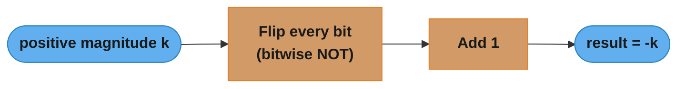
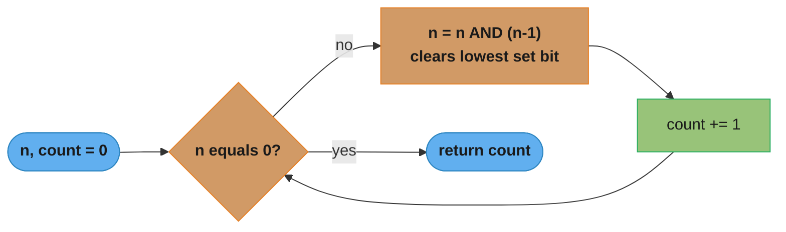

# Number Systems & Bit Manipulation

---

## 1. Concept Overview

Computers store all data as bits — ones and zeros. Understanding how numbers are represented in binary, how arithmetic works at the hardware level, and how to manipulate bits directly is a prerequisite for writing correct low-level code and solving a class of interview problems that no higher-level abstraction can simplify.

Number systems are the languages of hardware. Binary (base-2) is what gates compute natively. Hexadecimal (base-16) is how engineers write binary compactly. Octal (base-8) appears in Unix file permissions. Two's complement is how all modern CPUs represent signed integers. IEEE-754 is how they represent floating-point numbers. Endianness is how multi-byte values are laid out in memory.

Bit manipulation is a toolkit of constant-time operations (AND, OR, XOR, NOT, shifts) that can replace loops in many algorithms, detect properties (sign, parity, power-of-two), and pack/unpack data efficiently. It also underlies hash functions, compression codecs, cryptographic primitives, and network protocol parsing.

---

## 2. Intuition

> **One-line analogy**: Binary is the same place-value system as decimal, just with only two digits — each column is 2× the one to the right instead of 10×.

**Mental model**: In decimal, `345 = 3 × 10² + 4 × 10¹ + 5 × 10⁰`. In binary, `0b1011 = 1 × 2³ + 0 × 2² + 1 × 2¹ + 1 × 2⁰ = 8 + 0 + 2 + 1 = 11`. Every n-bit integer represents exactly one number in the range [0, 2ⁿ-1] for unsigned, or [-2^(n-1), 2^(n-1)-1] for two's complement signed.

**Why it matters**: Bit manipulation problems appear in interviews because they test whether you understand the machine model, not just high-level abstractions. Practical engineering contexts include: flag masks in systems code, packet header parsing, cryptographic hash functions, hash-map internals (bit-masking to stay in range), SIMD vectorisation, and space-efficient data structures.

**Key insight**: XOR is the Swiss Army knife of bit manipulation. `a ^ a = 0`, `a ^ 0 = a`, and XOR is commutative and associative — so XORing all elements in a list cancels duplicates and leaves the single unique element. Many seemingly difficult bit problems reduce to a well-chosen XOR.

---

## 3. Core Principles

- **Base conversion**: any number N in base B is expressed as a sum of powers of B weighted by its digits.
- **Two's complement**: the dominant signed-integer representation. For an n-bit integer: positive numbers use bits 0..n-2 with bit n-1 = 0; negative -k is represented as 2ⁿ - k (equivalently: flip all bits of |k|, then add 1). This makes hardware addition circuits work identically for signed and unsigned numbers.
- **Overflow**: fixed-width integers wrap around silently in most languages (C, Java int). Python integers have arbitrary precision and never overflow.
- **Bitwise operators**: AND (`&`), OR (`|`), XOR (`^`), NOT (`~`), left shift (`<<`), right shift (`>>`). These operate on each bit independently (except shifts).
- **Arithmetic vs logical right shift**: arithmetic `>>` fills with the sign bit (preserves sign); logical `>>>` fills with zero. Python `>>` is always arithmetic for signed ints. Java has both `>>` (arithmetic) and `>>>` (logical unsigned).
- **IEEE-754**: 32-bit float = 1 sign bit + 8 exponent bits + 23 mantissa bits. 64-bit double = 1 + 11 + 52. Not all decimals have an exact binary float representation — `0.1 + 0.2 != 0.3` in floating-point arithmetic.
- **Endianness**: big-endian stores the most significant byte at the lowest address; little-endian stores the least significant byte. x86/x86-64 is little-endian. Network protocols (TCP/IP) use big-endian ("network byte order").

---

## 4. Types / Strategies

### 4.1 Number System Conversion

```
Decimal → Binary: repeatedly divide by 2, collect remainders in reverse.
  45 ÷ 2 = 22 r 1
  22 ÷ 2 = 11 r 0
  11 ÷ 2 =  5 r 1
   5 ÷ 2 =  2 r 1
   2 ÷ 2 =  1 r 0
   1 ÷ 2 =  0 r 1
  Read remainders bottom-up: 101101 = 45 ✓

Decimal → Hex: divide by 16, use A-F for 10-15.
  45 ÷ 16 = 2 r 13 (D)  →  0x2D = 45 ✓

Binary → Hex: group bits in fours from the right.
  10110111 = 1011 0111 = B7 = 0xB7 = 183
```

**The idea behind it.** "A number is a bag of coins whose denominations are powers of the base;
converting means asking, largest coin first, how many of each you need — or equivalently, peeling off one
digit at a time from the bottom by dividing."

The two directions are the same fact read from opposite ends. Division-with-remainder peels the *lowest*
digit first (which is why you read the remainders bottom-up); place-value expansion builds from the
*highest* digit down. Once you see that, hex is not a third system — it is binary with the digits stapled
into groups of four.

| Symbol | What it is |
|--------|------------|
| `B` | How many distinct digits the system has. Binary 2, octal 8, decimal 10, hex 16 |
| `2^k` | The weight of column `k`, counting from 0 at the right |
| `N ÷ 2 = q r d` | `d` is the next binary digit; `q` is what is left to convert |
| `0b`, `0o`, `0x` | Literal prefixes for binary, octal, hex |
| `0xB7` | Two hex digits = exactly 8 bits = one byte |

**Walk one example.** Convert 45 both directions, and confirm the two agree:

```
  peel from the bottom (divide by 2)      build from the top (place value)
  ---------------------------------      -------------------------------
  45 / 2 = 22  r 1   <- bit 0             bit 5 : 32  x 1 = 32
  22 / 2 = 11  r 0   <- bit 1             bit 4 : 16  x 0 =  0
  11 / 2 =  5  r 1   <- bit 2             bit 3 :  8  x 1 =  8
   5 / 2 =  2  r 1   <- bit 3             bit 2 :  4  x 1 =  4
   2 / 2 =  1  r 0   <- bit 4             bit 1 :  2  x 0 =  0
   1 / 2 =  0  r 1   <- bit 5             bit 0 :  1  x 1 =  1
                                                        ----
  read up: 1 0 1 1 0 1 = 0b101101                        45   <- agrees

  regroup into fours for hex:  0010 1101  =  2    D  =  0x2D
                               ^^^^ ^^^^     |    |
                               2    13       2    13
```

**Why the grouping trick works and what breaks without it.** 16 is exactly `2^4`, so four binary columns
carry precisely the information of one hex column and never interact across the boundary. That is why
`0b10110111` splits cleanly into `B7` with no arithmetic. It fails the moment the bases are not powers of
each other: decimal is not a power of 2, so there is no group-the-digits shortcut from binary to decimal —
you are stuck doing the real division. This is the entire reason engineers write memory dumps in hex
rather than decimal.

### 4.2 Two's Complement Mechanics

```
8-bit examples:
  +5  = 0000 0101
  -5  = flip+1 = 1111 1010 + 1 = 1111 1011
  -1  = 1111 1111
  -128 = 1000 0000  (minimum for int8)
  +127 = 0111 1111  (maximum for int8)

Key property: adding two's complement values uses the same circuit as unsigned addition.
  (+5) + (-5) = 0000 0101 + 1111 1011 = 1 0000 0000
                                         ^-- overflow bit discarded; result = 0 ✓
```

The worked bytes above are one instance of the general rule from Section 3 — flip every bit of the magnitude, then add 1:



Two transform steps, zero new hardware: this is why a CPU needs no separate subtract circuit — negate via this pipeline, then reuse the existing unsigned adder.

**Stated plainly.** "Negative numbers are not a separate species — `-k` is just whichever
bit pattern you have to *add* to `k` to make the counter roll over to zero. Flip-and-add-one is the recipe
that finds that pattern."

This is the part readers never picture, because the usual phrasing ("flip the bits, add one") is a
procedure with no meaning attached. The meaning is odometer arithmetic: an 8-bit register counts
`0..255` and then wraps back to `0`. So `-5` is defined to be `256 - 5 = 251`, because `5 + 251 = 256`,
and 256 does not fit in 8 bits — it falls off the top and leaves `0`.

| Symbol | What it is |
|--------|------------|
| `n` | The register width in bits. 8 for a byte, 32 for a Java `int` |
| `2^n` | The odometer's wrap point. 8-bit: 256. This value is never storable |
| `-k = 2^n - k` | The definition. Everything else is a shortcut to compute it |
| `~x` | Flip every bit. Note `~x == -x - 1`, one short of the negation |
| `~x + 1` | The flip-and-add-one recipe. Identical to `2^n - x` |
| `1 0000 0000` | The 9th bit of an 8-bit add. Hardware simply drops it |

**Walk one example.** Negate 12 in an 8-bit register, then check the sum returns to zero:

```
   12         =  0000 1100
   flip (~12) =  1111 0011     = 243 unsigned   <- one short of the answer
   + 1        =  1111 0100     = 244 unsigned   <- this is -12

   cross-check by the definition:  256 - 12 = 244   <- same pattern, agrees

   now add 12 and -12 with the plain unsigned adder:

        0000 1100     (  12 )
      + 1111 0100     ( -12 )
      -----------
      1 0000 0000     carry out of bit 7 is DISCARDED
        0000 0000     = 0                            <- correct
```

**Why this works and what breaks without it.** The top bit doubles as a sign flag *for free*: any pattern
`1xxx xxxx` is negative because `2^n - k` for `k <= 127` always lands above the halfway mark. So there is
one adder, one comparator for zero, and no branch on sign anywhere in the datapath. The costs of the
scheme show up at the edges: the range is lopsided (`-128 .. +127`, because `0` occupies a slot on the
positive side), so `-(-128)` overflows back to `-128`, and `abs(Integer.MIN_VALUE)` is negative in Java.
The older sign-magnitude and one's-complement schemes avoid the lopsidedness but pay for it with two
distinct zeros (`+0` and `-0`) and a second adder path — which is exactly why no modern CPU uses them.

### 4.3 Bitwise Operation Truth Table

```
a | b | a AND b | a OR b | a XOR b | NOT a
0 | 0 |    0    |   0    |    0    |   1
0 | 1 |    0    |   1    |    1    |   1
1 | 0 |    0    |   1    |    1    |   0
1 | 1 |    1    |   1    |    0    |   0
```

### 4.4 Common Bit Tricks Catalogue

| Goal | Expression | Notes |
|------|-----------|-------|
| Check if n is even | `n & 1 == 0` | Last bit 0 → even |
| Check if n is power of 2 | `n > 0 and (n & (n-1)) == 0` | Powers of 2 have exactly one set bit |
| Get kth bit (0-indexed) | `(n >> k) & 1` | Shift k right, check last bit |
| Set kth bit | `n \| (1 << k)` | OR with a mask with only bit k set |
| Clear kth bit | `n & ~(1 << k)` | AND with complement of mask |
| Toggle kth bit | `n ^ (1 << k)` | XOR flips the bit |
| Clear lowest set bit | `n & (n - 1)` | Turns off rightmost 1; useful in Kernighan's bit-count |
| Get lowest set bit | `n & (-n)` | Isolates the rightmost 1 (used in Fenwick tree) |
| Count set bits (naive) | loop with `n & 1` + `n >>= 1` | O(number of bits) |
| Count set bits (fast) | `bin(n).count('1')` in Python; `Integer.bitCount(n)` in Java | Maps to `POPCNT` CPU instruction |
| Swap a and b | `a ^= b; b ^= a; a ^= b` | XOR swap — no temp variable needed |
| Multiply by 2^k | `n << k` | Left shift |
| Integer divide by 2^k | `n >> k` | Arithmetic right shift (signed) |

Each row of that table is a one-liner with a mechanism hiding behind it. The four that carry the most
interview weight are decoded below, every one of them walked in actual binary.

#### Decoding `n & (n - 1)` — "clear the lowest set bit"

**What the formula is telling you.** "Subtracting 1 destroys exactly one region of the number — the lowest
1 and everything below it — so ANDing with the original keeps only the part that survived untouched."

| Symbol | What it is |
|--------|------------|
| `&` | Bit survives only if it is 1 in *both* operands |
| `n - 1` | Borrow propagation: lowest 1 becomes 0, all zeros below it become 1 |
| `n & (n-1)` | n with its rightmost 1 turned off |
| `== 0` | Nothing left after removing one bit, so there was only ever one bit |

**Walk one example.** Take `n = 12`, then `n = 40`:

```
  n      = 12   ->  0000 1100
  n - 1  = 11   ->  0000 1011      the lowest 1 (bit 2) went to 0, bits below flipped to 1
  n & (n-1)     ->  0000 1000  = 8       <- clears the lowest set bit

  n      = 40   ->  0010 1000
  n - 1  = 39   ->  0010 0111
  n & (n-1)     ->  0010 0000  = 32      <- again, exactly one bit removed

  power-of-two test, n = 8:
  n      =  8   ->  0000 1000
  n - 1  =  7   ->  0000 0111      no bits in common at all
  n & (n-1)     ->  0000 0000  = 0       <- so 8 has exactly one set bit
```

**Why this works and what breaks without it.** Borrowing is local: the subtraction cannot reach past the
lowest 1, so every bit *above* it is byte-for-byte identical in `n` and `n-1` and survives the AND
unchanged. That locality is what makes Kernighan's loop run in `k` iterations for `k` set bits rather
than the full 32. What breaks without the `n > 0` guard on the power-of-two test: `n = 0` gives
`0 & -1 = 0`, a false positive, and any negative `n` in Python's arbitrary-precision model has infinitely
many leading 1s, so the test is meaningless there too.

#### Decoding `n & (-n)` — "isolate the lowest set bit"

**What this actually says.** "Negation flips everything *above* the lowest 1 and leaves the lowest 1
itself standing, so the only column where `n` and `-n` still agree is that single bit."

| Symbol | What it is |
|--------|------------|
| `-n` | `~n + 1` — the two's complement from §4.2 |
| `n & (-n)` | The *value* of the rightmost set bit (4, 8, 16 …), not its index |
| `i += i & (-i)` | The Fenwick-tree step to the next responsible node |

**Walk one example.** `n = 40`, isolating its lowest set bit:

```
  n      = 40   ->  0010 1000
  ~n           ->  1101 0111
  ~n + 1 = -n  ->  1101 1000  = 216 unsigned, -40 signed

  align them:      0010 1000   ( n )
                   1101 1000   (-n )
                   ---------
        n & -n  =  0000 1000  = 8    <- the lowest set bit, as a value
```

Note the columns: everything to the *left* of bit 3 is inverted between the two rows (so the AND kills
it), everything to the *right* is zero in both, and bit 3 alone is 1 in both. That is the whole proof, and
it is why the answer is `8` rather than `3` — the trick returns the bit's weight, not its position. If you
need the index, take `(n & -n).bit_length() - 1`.

#### Decoding XOR self-cancellation — `a ^ a = 0`, `a ^ 0 = a`

**In plain terms.** "XOR is a light switch: applying the same value twice returns you exactly
where you started, so anything that appears an even number of times vanishes from the running total."

| Symbol | What it is |
|--------|------------|
| `^` | Bit is 1 when the two inputs *differ*. Also "addition mod 2, no carry" |
| `a ^ a = 0` | Self-inverse. Every column differs from itself in zero places |
| `a ^ 0 = a` | Identity element. XORing with nothing changes nothing |
| commutative | `a ^ b == b ^ a`, so you may reorder the stream freely |
| associative | `(a^b)^c == a^(b^c)`, so you may pair up duplicates at will |

**Walk one example.** The single-number problem on `[4, 1, 2, 1, 2]`, accumulating left to right:

```
  step   input            running result (binary)      value
  ----   -----            -----------------------      -----
  init                    0000 0000                      0
  ^ 4    0000 0100        0000 0100                      4
  ^ 1    0000 0001        0000 0101                      5
  ^ 2    0000 0010        0000 0111                      7
  ^ 1    0000 0001        0000 0110                      6     <- the earlier 1 is undone
  ^ 2    0000 0010        0000 0100                      4     <- the earlier 2 is undone

  because the operation is commutative and associative, this is the same as:
      4 ^ (1 ^ 1) ^ (2 ^ 2)  =  4 ^ 0 ^ 0  =  4
```

**Why this works and what breaks without it.** Commutativity plus associativity is what lets you rewrite
the arrival order into convenient pairs *after the fact* — the algorithm never needs to see the duplicates
adjacent, which is why it works on an unsorted stream in one pass with a single accumulator. It breaks the
moment an element appears three times (odd counts do not cancel) or two distinct elements are unpaired
(you get their XOR, an ambiguous blend — see Q14 for the split-by-a-set-bit fix).

#### Decoding shifts as multiply and divide

**Read it like this.** "Shifting left by `k` slides every digit into a column worth `2^k` more,
which is multiplication by `2^k` — the same reason writing a `0` after a decimal number multiplies it
by 10."

| Symbol | What it is |
|--------|------------|
| `n << k` | `n * 2^k`. Bits shifted off the top are lost (silent overflow) |
| `n >> k` | Floor division by `2^k`. Bits shifted off the bottom are lost |
| `>>` (arithmetic) | Refills from the left with the *sign bit*, preserving sign |
| `>>>` (logical) | Java/JS only. Refills with `0`, so negatives become huge positives |

**Walk one example.** `13 << 3`, then a negative right shift where the fill rule shows its teeth:

```
  n        = 13   ->  0000 1101
  n << 3          ->  0110 1000  = 104        and 13 x 2^3 = 13 x 8 = 104   <- agrees

  n        = -7   ->  1111 1001                (two's complement, 8-bit)
  n >> 1  arithmetic -> 1111 1100  = -4        refilled with the sign bit 1
  n >>> 1 logical    -> 0111 1100  = 124       refilled with 0 -- sign destroyed
```

**Why this works and what breaks without it.** Shifting is one wire-level operation, no adder involved,
which is why compilers rewrite `x * 8` as `x << 3` automatically. Two traps: right shift is *floor*
division, not truncation, so `-7 >> 1 == -4` while `-7 // 2` in C truncates toward zero to `-3`; and the
shift amount is taken modulo the register width in Java and C, so `1 << 32` on a 32-bit `int` yields `1`,
not `0` (see Pitfall 2). Never hand-write shift-for-divide in production code — the compiler already did
it, and you have only removed the reader's ability to see the intent.

### 4.5 IEEE-754 Float Representation

```
32-bit float (single precision):
  Bit 31:    sign (0=positive, 1=negative)
  Bits 30-23: exponent (8 bits, biased by 127)
  Bits 22-0:  mantissa/fraction (23 bits, implicit leading 1)

  Value = (-1)^sign × 1.mantissa × 2^(exponent - 127)

  0.5 = 0 01111110 00000000000000000000000
        sign=0, exp=126-127=-1, mantissa=1.0 → 1.0 × 2^(-1) = 0.5 ✓

  Why 0.1 cannot be represented exactly:
  0.1 in binary = 0.0001100110011... (repeating) — requires infinite bits.
  Stored as rounded approximation. 0.1 + 0.2 = 0.30000000000000004 in float64.
```

**What it means.** "A float is scientific notation in binary: a sign, an exponent that says
where to put the binary point, and a mantissa that holds the significant digits — so precision is measured
in *significant bits*, never in decimal places."

That framing explains the whole reputation of floats. A `float32` has 24 significant bits (23 stored plus
one free), which is roughly 7 decimal digits, and it has that same relative precision whether the number is
`0.001` or `10^30`. What it does *not* have is any notion of decimal exactness, because a base-2 mantissa
can only express fractions whose denominator is a power of 2.

| Symbol | What it is |
|--------|------------|
| `(-1)^s` | Sign switch. `s = 0` gives `+1`, `s = 1` gives `-1` |
| `e` | 8 raw bits, `0..255`, stored *biased* so no separate sign bit is needed |
| `e - 127` | The real exponent. Bias 127 for float32, 1023 for float64 |
| `1.m` | The implicit leading 1 — never stored, since normalized values always start with 1 |
| `2^(e-127)` | Where the binary point lands |
| `e = 0` / `e = 255` | Reserved: subnormals and zero, versus Inf and NaN |

**Walk one example.** Encode `-6.25` as a 32-bit float, field by field:

```
  step 1  write the magnitude in binary   6.25  = 110.01
  step 2  normalize to 1.xxx form         110.01 = 1.1001 x 2^2
  step 3  read off the three fields

     sign      s = 1                  because the value is negative
     exponent  e = 2 + 127 = 129   -> 1000 0001
     mantissa  the bits after "1." -> 1001 000 0000 0000 0000 0000   (23 bits)

  assembled:

     s  exponent    mantissa
     1  1000 0001   1001 0000 0000 0000 0000 000
     -  ---------   -----------------------------
     1     8 bits            23 bits              = 32 bits total

  decode it back:  (-1)^1  x  1.1001b  x  2^(129-127)
                =  -1      x  1.5625   x  4
                =  -6.25                          <- round-trips exactly
```

It round-trips exactly because `6.25 = 110.01b` terminates in binary — its fractional part is `1/4`, a
power of two. Now try `0.1`, whose fraction is `1/10`:

```
  0.1 in binary = 0.0001100110011001100110011001100...   (0011 repeats forever)

  float64 keeps 53 significant bits, then rounds. What is actually stored is:
      0.1000000000000000055511151231257827021181583404541015625

  0.1 + 0.2  ->  0.30000000000000004   because two rounded inputs produce a
                                       sum that misses the nearest float to 0.3
```

**Why the bias and the implicit 1 exist, and what breaks without them.** The implicit leading 1 buys a
free bit of precision — every normalized mantissa starts with 1, so storing it would waste 1 of 24 bits.
The bias lets you compare two positive floats by comparing their raw bit patterns as if they were
integers, because a larger exponent is a larger unsigned field; a two's-complement exponent would have
broken that ordering. The price is the reserved encodings at both ends (`e = 0` for zero and subnormals,
`e = 255` for `Inf` and `NaN`) and the hard rule that follows from all of it: never compare computed
floats with `==`, and never store money in one — use integer cents or `Decimal`.

---

## 5. Architecture Diagrams

### Memory Layout: Endianness

```
Value: 0x12345678 (decimal 305419896) stored at address 0x100

Big-endian (network order, Motorola, SPARC):
  Address:  0x100  0x101  0x102  0x103
  Byte:      0x12   0x34   0x56   0x78
  Most significant byte at lowest address.

Little-endian (x86, x86-64, ARM in default mode):
  Address:  0x100  0x101  0x102  0x103
  Byte:      0x78   0x56   0x34   0x12
  Least significant byte at lowest address.
```

### Two's Complement Number Line (4-bit)

```
Unsigned:  0    1    2    3    4    5    6    7    8    9   10   11   12   13   14   15
Binary:  0000 0001 0010 0011 0100 0101 0110 0111 1000 1001 1010 1011 1100 1101 1110 1111
Signed:    0    1    2    3    4    5    6    7   -8   -7   -6   -5   -4   -3   -2   -1
```

### Bit Counting via Kernighan's Method

```
n = 0b10110  (5 bits set: 2)
Step 1: n & (n-1) = 0b10110 & 0b10101 = 0b10100  (cleared rightmost set bit)
Step 2: n & (n-1) = 0b10100 & 0b10011 = 0b10000
Step 3: n & (n-1) = 0b10000 & 0b01111 = 0b00000
Count = 3 iterations = 3 set bits   → O(number of set bits), not O(total bits)
```

The trace above is one run of this general loop — it terminates in exactly k iterations, where k is the number of set bits, not the bit width:



---

## 6. How It Works — Detailed Mechanics

### 6.1 Bit Counting Algorithms

```python
from __future__ import annotations

def count_bits_naive(n: int) -> int:
    """O(log n) — checks every bit position."""
    count = 0
    while n:
        count += n & 1
        n >>= 1
    return count

def count_bits_kernighan(n: int) -> int:
    """O(k) where k = number of set bits — faster for sparse bitsets."""
    count = 0
    while n:
        n &= n - 1   # clears the lowest set bit
        count += 1
    return count

def count_bits_builtin(n: int) -> int:
    """O(1) — maps to single POPCNT instruction on modern CPUs."""
    return bin(n).count('1')   # Python
    # Java: Integer.bitCount(n)
```

### 6.2 Find the Single Non-Duplicate Element (XOR)

```python
def single_number(nums: list[int]) -> int:
    """
    Every element except one appears exactly twice.
    XOR all elements: pairs cancel (a ^ a = 0), unique element remains.
    Time: O(n). Space: O(1).
    """
    result = 0
    for n in nums:
        result ^= n
    return result
# [4, 1, 2, 1, 2] -> 4 ^ 1 ^ 2 ^ 1 ^ 2 = 4 ^ (1^1) ^ (2^2) = 4 ^ 0 ^ 0 = 4
```

### 6.3 Check and Manipulate Flags

```python
from enum import IntFlag

class Permission(IntFlag):
    READ    = 0b001   # 1
    WRITE   = 0b010   # 2
    EXECUTE = 0b100   # 4

def has_permission(user_perms: int, perm: Permission) -> bool:
    return bool(user_perms & perm)

def grant(user_perms: int, perm: Permission) -> int:
    return user_perms | perm

def revoke(user_perms: int, perm: Permission) -> int:
    return user_perms & ~perm

user = Permission.READ | Permission.WRITE  # 0b011 = 3
print(has_permission(user, Permission.EXECUTE))  # False
user = grant(user, Permission.EXECUTE)          # 0b111 = 7
user = revoke(user, Permission.WRITE)            # 0b101 = 5
```

### 6.4 Reverse Bits of a 32-bit Integer

```python
def reverse_bits(n: int) -> int:
    """Reverse the bits of a 32-bit unsigned integer."""
    result = 0
    for _ in range(32):
        result = (result << 1) | (n & 1)  # shift result left, OR the last bit of n
        n >>= 1
    return result
# n = 0b00000010100101000001111010011100  (43261596)
# reversed = 0b00111001011110000010100101000000  (964176192)
```

### 6.5 Detecting Float Equality Pitfall

```python
# BROKEN: comparing floats with ==
def is_half(x: float) -> bool:
    return x == 0.5   # OK for 0.5 (representable exactly), BROKEN for 0.1+0.4

# BROKEN example:
val = 0.1 + 0.4
print(val == 0.5)   # False: 0.1+0.4 = 0.5000000000000001 in float64

# FIX: use an epsilon comparison for computed floats
import math
def is_approx_equal(a: float, b: float, rel_tol: float = 1e-9) -> bool:
    return math.isclose(a, b, rel_tol=rel_tol)

print(is_approx_equal(0.1 + 0.4, 0.5))  # True
```

---

## 7. Real-World Examples

**TCP/IP packet headers** — IPv4 header fields are packed into fixed bit widths (version: 4 bits, IHL: 4 bits, DSCP: 6 bits, ECN: 2 bits). Parsing a packet requires bitwise masking: `(header >> 28) & 0xF` extracts the version field. The kernel processes millions of packets per second using these O(1) bit ops.

**Unix file permissions** — `rwxr-xr--` is stored as 0o754 = 0b111 101 100. `chmod 644` is a bitwise operation: 0b110 100 100. The `os.stat()` mode field in Python uses bitwise AND with constants like `stat.S_IRUSR` (0o400) to check individual permissions.

**Bloom filters** — set membership data structure uses k hash functions, each hashing an element to a bit position. Membership check: test if all k bits are set. False positives possible, false negatives impossible. Every check is k bitwise OR operations on a bit array — O(k) time, O(m/8) bytes for m bits.

**Java HashMap bucket index** — `HashMap.put(key, value)` computes `(n-1) & hash(key)` to choose a bucket, where n is a power of 2. This bitwise AND replaces modulo (`%`) for power-of-two sizes, which is why HashMap capacity is always a power of 2: `1 << 4 = 16, 1 << 5 = 32`, etc. The AND is 5–10× faster than integer modulo on modern CPUs.

**Cryptographic hash functions** — SHA-256 consists exclusively of bitwise ops (AND, OR, XOR, NOT) and bit rotations applied over 64 rounds. The bitwise nature makes SHA-256 extremely fast (hardware can compute ~500 MB/s per core) and provides the avalanche effect (one bit change in input cascades to ~50% of output bits changing).

---

## 8. Tradeoffs

| Approach | Time | Space | Readability | Use case |
|----------|------|-------|-------------|----------|
| Bitwise flag masks (int) | O(1) per flag | O(1) | Low | Systems code, hot paths |
| Python `IntFlag` enum | O(1) per flag | O(1) | High | Application code, type safety |
| Set of strings | O(1) avg | O(n) | Very high | Non-performance-critical |
| Bitwise XOR for duplicate detection | O(n) | O(1) | Tricky | Competitive / interview |
| Hash set for duplicate detection | O(n) | O(n) | Clear | Production preference |

### Endianness

| Scenario | Recommended | Reason |
|----------|-------------|--------|
| File format (cross-platform) | Big-endian or explicit spec | Portability |
| Network protocol | Big-endian (RFC 791) | "network byte order" |
| In-process memory (x86) | Little-endian | Hardware native; faster |
| GPU / CUDA | Match CPU endianness | Use `htonl`/`ntohl` at boundary |

---

## 9. When to Use / When NOT to Use

**Use bit manipulation when:**
- Setting / testing / clearing boolean flags in a compact bitmask (system call flags, permissions, feature toggles).
- Implementing low-level data structures (Bloom filter, Fenwick/BIT tree uses `n & (-n)` to isolate last set bit, `n += n & (-n)` to advance).
- Writing performance-critical hot paths where the bitwise operation maps to a single CPU instruction.
- Competitive programming / interview problems where constant-factor performance matters or the problem is specifically about bit properties (power of 2, parity, XOR unique element).

**Do NOT use bit manipulation when:**
- Code readability is the priority — a boolean field or enum is always clearer.
- The "trick" saves a constant factor in an algorithm where the bottleneck is I/O or memory allocation, not CPU.
- Floating-point — bit manipulation of float bits (reinterpreting as int) is legal in C via union or `memcpy`, but has undefined behaviour traps and is almost never necessary in application code.

---

## 10. Common Pitfalls

### Pitfall 1: Off-by-one in bit indexing (0-indexed vs 1-indexed)

```python
# BROKEN: treating bit positions as 1-indexed
n = 0b1010
bit_pos = 2  # intending to check the 2nd bit (value 2)
# BROKEN:
print((n >> bit_pos) & 1)   # 0 -- wait, expected 1?
# The bit at position 2 (0-indexed from right) has value 2^2 = 4.
# 0b1010 = 8+2: set bits at positions 1 and 3. Position 2 is 0.
# FIX: be explicit about 0-indexed bit position = log2(value).
# bit at position 1 (value 2^1 = 2) is set: (0b1010 >> 1) & 1 == 1 ✓
```

### Pitfall 2: Integer overflow in bit shifting (Java)

```python
# BROKEN (Java): shifting by >= 32 on an int is undefined behaviour in some langs
// int x = 1 << 32;  // Java: undefined! Shift amount is taken mod 32.
// 1 << 32 in Java == 1 << 0 == 1  (NOT 0 as expected)

// FIX: use long (64-bit) when shifting by >= 32
long x = 1L << 32;  // 4294967296 ✓
// Python: no overflow (arbitrary precision), but be aware of semantics.
```

### Pitfall 3: NOT (~) on Python integers

```python
# GOTCHA: Python integers are signed arbitrary-precision.
# ~n == -(n+1), not what you might expect from a 32-bit mental model.
n = 5        # 0b101
print(~n)    # -6  (not 0b11111010 as you'd get in a 32-bit model)
# FIX: mask to the desired bit width
mask_32 = 0xFFFFFFFF
print((~n) & mask_32)  # 4294967290 = 0xFFFFFFFA ✓
```

### Pitfall 4: Comparing floats with `==`

```python
# BROKEN: exact float comparison
x = 0.1 + 0.2
if x == 0.3:  # False — float representation error
    print("equal")

# FIX: use math.isclose
import math
if math.isclose(x, 0.3, rel_tol=1e-9):
    print("equal")  # True
```

---

## 11. Technologies & Tools

| Tool / Concept | Purpose | Notes |
|---------------|---------|-------|
| `bin(n)`, `hex(n)`, `oct(n)` | Python base conversion | Built-in; `bin(n).count('1')` = popcount |
| `int('1010', 2)` | Binary string to int | `int(s, base)` for any base |
| `Integer.bitCount(n)` | Java popcount | Maps to POPCNT instruction |
| `Integer.toBinaryString(n)` | Java binary representation | Unsigned 32-bit |
| `struct` module (Python) | Pack/unpack bytes with endianness | `struct.pack('>I', val)` = big-endian uint32 |
| `ctypes` (Python) | Bit manipulation of memory buffers | Accessing raw C-style memory layout |
| `socket.htonl` / `ntohl` | Host-to-network byte order conversion | Used when writing network protocols |
| Bitset (Java) / `array` of ints | Compact bit arrays | Rolling your own Bloom filter or bitmask DP |

---

## 12. Interview Questions with Answers

**Q1: What is two's complement, and why do modern CPUs use it?**
Two's complement represents -k as 2ⁿ - k (equivalently: flip all bits of |k| and add 1). It is used because the same adder circuit works for both signed and unsigned addition — no special-casing. One's complement and sign-magnitude representations require different adder logic for positive and negative operands and have a confusing "-0" representation.

**Q2: How do you check if a number is a power of 2 in O(1)?**
`n > 0 and (n & (n-1)) == 0`. Powers of 2 have exactly one set bit (e.g., 8 = 0b1000). `n-1` clears that bit and sets all lower bits (7 = 0b0111). ANDing gives 0 if and only if n is a power of 2. The `n > 0` guard handles the n = 0 edge case (0 & -1 = 0 would be a false positive).

**Q3: Given an array where every element appears exactly twice except one, find the unique element in O(n) time and O(1) space.**
XOR all elements. Each pair cancels (`a ^ a = 0`), leaving only the unique element. XOR is commutative and associative so order doesn't matter. Code: `result = 0; for x in arr: result ^= x; return result`.

**Q4: How would you count the number of set bits in an integer?**
Three approaches: (a) loop and check last bit (`n & 1`), shift right — O(log n); (b) Kernighan's: `while n: n &= n-1; count += 1` — O(k) where k is the number of set bits; (c) built-in `bin(n).count('1')` in Python or `Integer.bitCount(n)` in Java — O(1) using a POPCNT CPU instruction. Kernighan's is faster than (a) when set bits are sparse.

**Q5: Explain endianness and when it matters.**
Endianness is the byte order for multi-byte values in memory. Little-endian (x86/x86-64) stores the least-significant byte at the lowest address. Big-endian stores the most-significant byte first. It matters when: serialising data to disk or network (use explicit byte-order convention, e.g., network byte order = big-endian, `htonl`/`ntohl`), writing binary file parsers (JPEG/PNG/WAV headers have specific endianness), or casting an integer pointer to a byte pointer.

**Q6: What is `x & (x-1)`? What is `x & (-x)`?**
`x & (x-1)` clears the lowest set bit of x. Used in Kernighan's bit-count and to check for powers of 2. `x & (-x)` (equivalently `x & (~x + 1)`) isolates (returns) the lowest set bit. Used in the Fenwick/Binary Indexed Tree for the "responsible range" computation: `i += i & (-i)` advances to the next update position.

**Q7: How does Python handle integer overflow compared to Java/C?**
Python integers are arbitrary-precision (backed by a C long array that grows as needed) — they never overflow. Java `int` is 32-bit two's complement and wraps silently on overflow (e.g., `Integer.MAX_VALUE + 1 == Integer.MIN_VALUE`). C integer overflow is *undefined behaviour* for signed types. This matters in interview problems: a Python solution `a + b` never overflows; the same Java solution might.

**Q8: What is 0.1 + 0.2 in floating-point arithmetic?**
0.30000000000000004, not 0.3. Neither 0.1 nor 0.2 has an exact binary float representation — they are rounded to the nearest representable value. Addition compounds the rounding error. Fix: use `math.isclose` for comparison, the `Decimal` module for exact decimal arithmetic, or integer arithmetic scaled by a power of 10 (store amounts in cents, not dollars).

**Q9: How do you set, clear, and toggle the kth bit of an integer?**
Set: `n | (1 << k)`. Clear: `n & ~(1 << k)`. Toggle: `n ^ (1 << k)`. Check: `(n >> k) & 1`. These are O(1) operations. In Python, `~(1 << k)` produces a negative number (arbitrary-precision NOT), so for a 32-bit context use `n & ~(1 << k) & 0xFFFFFFFF` or use `IntFlag`.

**Q10: What is a XOR swap and what are its limitations?**
`a ^= b; b ^= a; a ^= b` swaps a and b without a temporary variable. Works because XOR is its own inverse. Limitation: if `a` and `b` point to the same memory location, all three operations produce 0 (XORing a value with itself). Always use a temp variable in production code — it is clearer and the compiler optimises it identically. XOR swap is only useful on systems with no temporary registers (rare).

**Q11: How do you reverse the bits of a 32-bit integer?**
Shift result left and OR the last bit of n, then shift n right, repeating 32 times. O(32) = O(1). Can also be done with a lookup table (precompute 8-bit reversal for each byte) for higher throughput. Used in bit-reversal permutations in the FFT algorithm.

**Q12: What is the difference between arithmetic and logical right shift?**
Arithmetic right shift (`>>` in Java/Python for signed ints) fills the vacated high bit with the sign bit — preserving the sign for negative numbers. Logical right shift (`>>>` in Java) fills with zero regardless of sign. For positive numbers they are identical. In Python, `>>` is always arithmetic. Use `>>> 0` in JavaScript or `int32 >>> 0` to get unsigned semantics.

**Q13: How are permissions encoded in Linux file modes, and how do you test them?**
A Unix file mode is a 12-bit number: 3 bits for setuid/setgid/sticky, then 3×3 bits for owner/group/other (read/write/execute). `0o755` = owner can do anything, group and other can read+execute. Test: `mode & stat.S_IRUSR` (0o400) is non-zero if owner has read permission. This is why `chmod 644` (= 0o644 = 0b110 100 100) is the standard for web files: owner read+write, group and other read-only.

**Q14: You need to find two missing numbers from 1..n. How do you use XOR or math?**
With XOR alone you cannot distinguish two missing numbers (the XOR of the pair is ambiguous). Use two properties: (a) sum of 1..n = n(n+1)/2; subtract the array sum → sum of the two missing numbers. (b) product or XOR of the pair can partition them. The standard O(n) O(1)-space approach: compute XOR of all elements and all 1..n — call it `xor_all`. Find any set bit in `xor_all`. Use that bit to split elements into two groups; XOR each group with the corresponding half of 1..n → recovers each missing number.

**Q15: What are IEEE-754 special values and when do they appear?**
`+Inf` / `-Inf`: result of dividing by zero or overflow. `NaN` (Not a Number): result of `0.0/0.0`, `sqrt(-1)`, or `Inf - Inf`. `-0.0`: distinct from `0.0` in IEEE-754 but compares equal (`0.0 == -0.0` is True). `float('inf') > any_finite` is always True. `math.isnan(float('nan'))` required to check NaN — `x != x` is also True only for NaN but is obscure. These appear in scientific computing and ML (loss = NaN is a common gradient explosion symptom).

---

## 13. Best Practices

1. **Use named constants or IntFlag for bitmasks** — `PERMISSION_READ = 0x1` is far clearer than `0x1` scattered in code.
2. **Never compare floats with `==`** — use `math.isclose` with appropriate tolerance, or use integer arithmetic (scaled by 100 for currency).
3. **Be explicit about bit width** — Python integers are arbitrary-precision; Java/C integers have fixed width with silent overflow. State assumptions.
4. **Prefer readability over cleverness for XOR tricks** — the `result ^= x` pattern for finding a unique element is acceptable; but writing `x ^= y; y ^= x; x ^= y` instead of `x, y = y, x` will confuse every future reader.
5. **Handle endianness at I/O boundaries** — inside a process, use native endianness; convert to/from network byte order only when sending over the wire or writing to disk.
6. **Test powers-of-2 edge cases**: 0, 1, the max int value, and the sign bit.
7. **Use `bin()` / `hex()` to visualise when debugging** — seeing `0b10110100` is much more informative than `180` when chasing a bit-manipulation bug.

---

## 14. Case Study: Compact Bitset for Membership Testing

**Scenario**: You need to track which user IDs (0–999,999) have been seen in a stream. A hash set costs ~50 MB (50 bytes per entry × 1 million entries). A bitset costs 125 KB (1 bit per ID, 1,000,000 / 8 = 125,000 bytes). For a cache that must fit in L3 (typically 4–32 MB), this is a 400× reduction.

```python
from __future__ import annotations

class Bitset:
    """Fixed-size bitset backed by a list of Python ints (each 64 bits on CPython)."""

    def __init__(self, size: int) -> None:
        self._bits: list[int] = [0] * ((size + 63) // 64)  # ceil(size/64) words
        self._size = size

    def set(self, pos: int) -> None:
        word, bit = divmod(pos, 64)
        self._bits[word] |= (1 << bit)

    def get(self, pos: int) -> bool:
        word, bit = divmod(pos, 64)
        return bool((self._bits[word] >> bit) & 1)

    def clear(self, pos: int) -> None:
        word, bit = divmod(pos, 64)
        self._bits[word] &= ~(1 << bit)

    def count(self) -> int:
        return sum(bin(w).count('1') for w in self._bits)

# BROKEN: using a plain Python set — 50 MB for 1M integers
seen: set[int] = set()
for uid in stream:
    seen.add(uid)  # Each int object in CPython: 28 bytes + overhead

# FIX: bitset — 125 KB for 1M integers
seen = Bitset(1_000_000)
for uid in stream:
    seen.set(uid)
# Memory: 1_000_000 / 8 = 125_000 bytes = 122 KB ✓
```

**Comparison**:

| Approach | Space | Lookup | Insert | Notes |
|----------|-------|--------|--------|-------|
| Python `set` | ~50 MB for 1M items | O(1) avg | O(1) avg | Best for sparse IDs, non-int keys |
| Bitset (custom) | 125 KB for 1M IDs | O(1) | O(1) | IDs must be integers in [0, n) |
| `bitarray` library | 125 KB | O(1) | O(1) | C-backed, fastest pure bitset |
| Bloom filter | ~1 MB (8 bits/item typical) | O(k) | O(k) | False positives; no delete |

**Discussion Q&As**:

**Why does `n & (-n)` isolate the lowest set bit?**
`-n` is the two's complement of n, which flips all bits and adds 1. Flipping all bits of n makes every bit below the lowest set bit become 1, and the lowest set bit becomes 0. Adding 1 carries through all the 1s up to the position of the lowest set bit, which flips back to 1 — with all bits below it becoming 0. ANDing with the original n leaves only this bit. Example: n = 0b10110, -n = 0b01010 (two's complement) — wait, let me recalculate: n=0b10110=22, -n=-22=0b...101010 in arbitrary precision. Actually for a clean example: n=0b01100=12, -n=0b...10100=-12 (flip: 0b10011, +1: 0b10100). n & -n = 0b01100 & 0b10100 = 0b00100 = 4 = rightmost set bit. ✓

---

## See Also

- [arrays_strings_and_hashing](../arrays_strings_and_hashing/README.md) — hash table uses bit-masking for bucket index (power-of-2 capacity)
- [graphs_tries_and_advanced_structures](../graphs_tries_and_advanced_structures/README.md) — Fenwick tree uses `n & (-n)` and `n += n & (-n)`
- [`python/strings_bytes_encoding_and_regex`](../../python/strings_bytes_encoding_and_regex/README.md) — UTF-8, bytes/bytearray, codec internals
- [`java/strings_and_text`](../../java/strings_and_text/README.md) — compact strings (Java 9+), surrogate pairs, Unicode code points
- [DSA Pattern Playbooks](../dsa_patterns/README.md) — apply this technique: [Bit Manipulation](../dsa_patterns/bit_manipulation.md) (XOR tricks, bitmask enumeration, single-number family)
