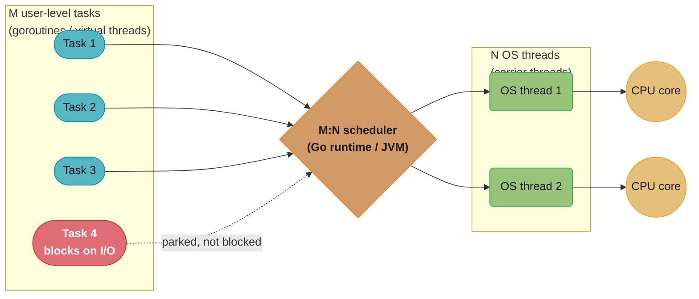
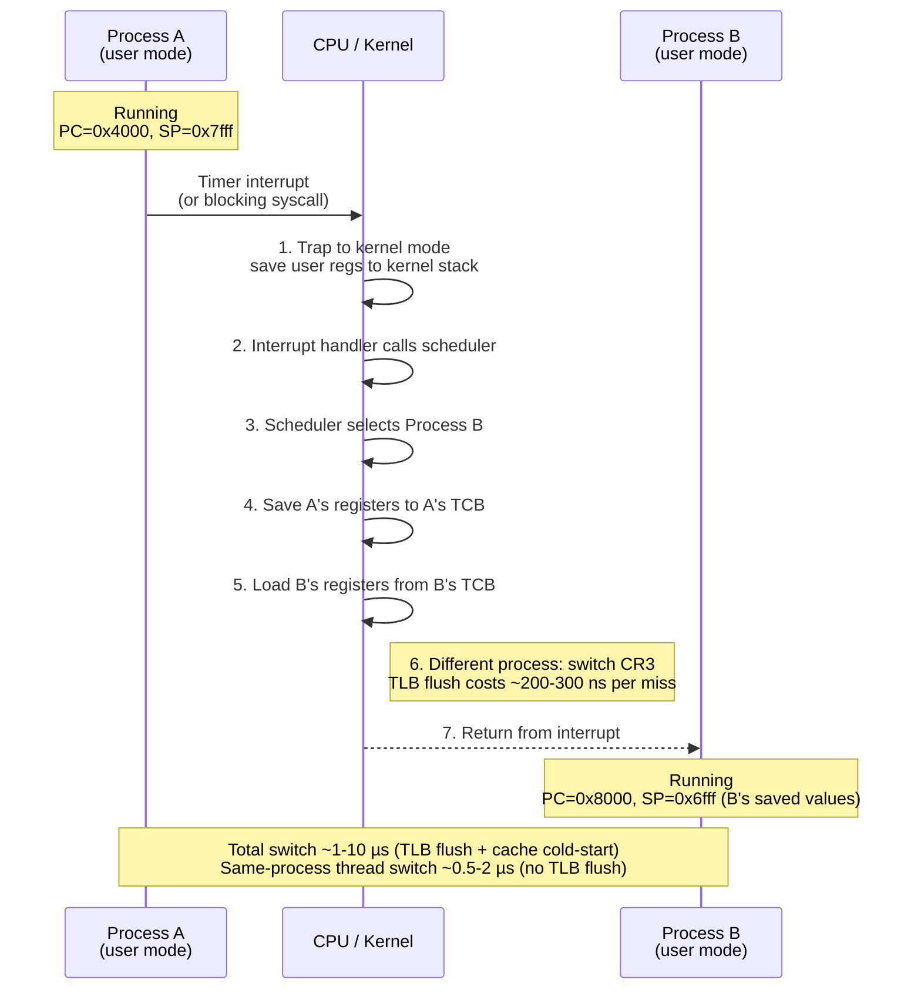
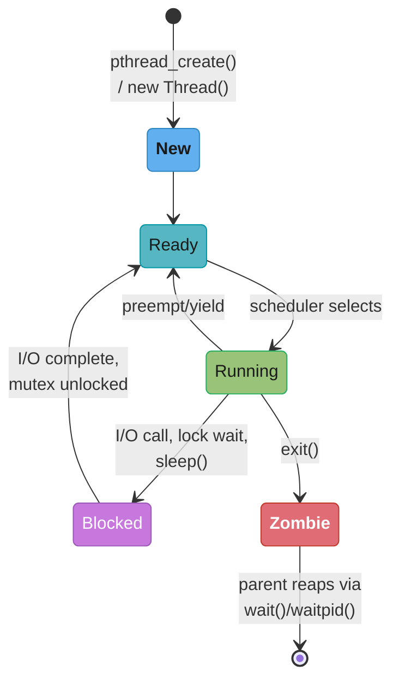

# Processes, Threads, and Context Switching

> A process is a sealed container with its own world; a thread is a worker sharing the container with siblings.

---

## 1. Concept Overview

An operating system multiplexes a finite number of CPU cores across potentially thousands of concurrent activities. It does this through the abstractions of **processes** and **threads**, and the mechanism of **context switching**.

A **process** is a running program with its own isolated virtual address space, file descriptor table, and security context. Processes are the OS's unit of isolation — a crash or memory corruption in one process cannot directly affect another.

A **thread** is the OS's unit of execution. Every process has at least one thread. Multiple threads within a process share the same virtual address space (code, heap, file descriptors) but each has its own stack, register state, and thread-local storage. Threads are lighter to create and switch than processes, but the shared address space means a buggy thread can corrupt memory used by sibling threads.

**Context switching** is the act of saving one task's CPU state (registers, program counter, stack pointer) and restoring another task's state. The OS scheduler triggers context switches on time-slice expiry, blocking system calls, or higher-priority thread wake-ups.

---

## 2. Intuition

> **One-line analogy**: A process is a separate house with its own mailbox and utilities; a thread is a person living inside the house — multiple people share the same kitchen and utilities but each has their own bedroom (stack).

**Mental model**: The CPU holds one register file — one "brain" at a time. To create the illusion of concurrency, the OS freezes one task (saves its registers to the PCB/TCB in memory), loads another task's registers, and resumes it. Context switch cost: ~1–10 µs including TLB flush and cache cold-start.

**Why it matters**: The distinction between process and thread is at the heart of every concurrency question. Web servers choose between multi-process (isolation, no shared state bugs) and multi-thread (lower overhead, shared memory). Go goroutines, Java virtual threads, and Python's asyncio all reduce context-switch overhead by multiplexing many "lightweight tasks" onto few OS threads — because OS-level context switches are expensive.

**Key insight**: The bottleneck in high-concurrency systems is not the computation but the context-switch overhead. A server running 10,000 OS threads spends a significant fraction of CPU time just switching between them. This is why event-driven I/O (one thread, non-blocking), goroutines (M:N scheduling), and virtual threads (JEP 444) exist — they avoid OS-level context switches for I/O-bound work.

---

## 3. Core Principles

**Process isolation**: Each process sees a private virtual address space (0 to ~128 TiB on x86-64 user space). The MMU enforces isolation at the hardware level. Inter-process communication (IPC) requires explicit OS mechanisms: pipes, sockets, shared memory regions (mmap with MAP_SHARED), message queues.

**Threads share address space**: All threads within a process share the code segment, data segment, heap, and file descriptor table. They do NOT share: stack (each thread has its own, default 1–8 MB on Linux), register state, thread-local storage (TLS).

**PCB / TCB (Process/Thread Control Block)**: The OS maintains a PCB for each process and a TCB for each thread. Key fields in PCB: PID, virtual memory mappings (page table pointer), open file descriptors, signal handlers, parent PID, exit status. Key fields in TCB: thread ID, saved register state (all CPU registers), stack pointer, program counter, scheduling state (ready/running/blocked/zombie).

**User mode vs kernel mode**: The CPU has at least two privilege levels. User-mode code cannot directly access hardware or OS data structures. A **syscall** transitions from user mode to kernel mode: saves user-mode registers, switches to kernel stack, executes kernel code, returns to user mode. Syscall overhead: ~200–1000 ns (50–200 ns for Linux on modern CPUs with KPTI disabled; 200–1000 ns with Spectre/Meltdown mitigations + KPTI enabled).

**Thread states**: New → Ready → Running → Blocked (waiting for I/O, lock, sleep) → Ready (unblocked) → Terminated. A "runnable" thread is in the Ready or Running state. A blocked thread consumes no CPU.

---

## 4. Types / Architectures / Strategies

### Process vs Thread Comparison

| Aspect | Process | Thread |
|--------|---------|--------|
| Address space | Private (isolated) | Shared with siblings |
| Creation cost | ~1–10 ms (fork + page-table copy) | ~10–100 µs (stack allocation) |
| Context switch cost | ~2–10 µs (TLB flush + cache eviction) | ~0.5–2 µs (no TLB flush if same process) |
| Communication | IPC (expensive: pipe, socket, shared mem) | Shared memory (cheap but requires synchronisation) |
| Fault isolation | Crash of one process doesn't kill others | Bug in one thread can corrupt all threads' memory |
| Use case | Browser tabs (Chrome multi-process), worker processes | Web server worker threads, parallel computation |

### Thread Models

| Model | Description | Examples |
|-------|-------------|----------|
| 1:1 (kernel threads) | Each user thread maps to one OS thread | Java threads (pre-21), Python threads, most languages |
| M:1 (green threads) | Many user threads on one OS thread | Original Java green threads (pre-1.3), Python stackless |
| M:N (hybrid) | M user threads on N OS threads (N < M) | Go goroutines (GOMAXPROCS), Java virtual threads (JEP 444) |

**M:N is the most powerful**: blocking one OS thread does not block all user tasks; the scheduler moves user tasks to a free OS thread. Go's goroutine scheduler does this automatically — goroutines block on I/O, the OS thread continues with another goroutine.



M user-level tasks are multiplexed onto only N OS threads by the runtime's own scheduler; when Task 4 blocks on I/O, the runtime parks that task instead of blocking an OS thread, freeing the carrier thread to run another task — the mechanism that lets Go run hundreds of thousands of goroutines and Java 21 run millions of virtual threads on a handful of OS threads.

### IPC Mechanisms

| Mechanism | Latency | Throughput | Notes |
|-----------|---------|------------|-------|
| Pipe | ~few µs | ~1 GB/s | Unidirectional; byte stream |
| Named pipe (FIFO) | ~few µs | ~1 GB/s | Between unrelated processes |
| Unix domain socket | ~few µs | ~1 GB/s | Bidirectional; same host |
| Shared memory (mmap) | <1 µs | ~RAM bandwidth | Requires synchronisation; fastest |
| Message queue | ~10 µs | ~100 MB/s | Persists messages; ordering |
| Signal | ~1 µs | Very low | Notifications only; no data |

---

## 5. Architecture Diagrams

### Process Memory Layout

```
High address (kernel space, user-invisible)
+-------------------------------+
|  Kernel (always mapped)       |   <- Not accessible from user mode
+-------------------------------+  0x7FFFFFFF FFFF (user space max on x86-64)
|  Stack (grows downward)       |   <- local variables, return addresses
|  (each thread has its own)    |   <- default 8 MB limit (ulimit -s)
+-------------------------------+
|  mmap region                  |   <- dynamic libraries, file mappings, shared mem
+-------------------------------+
|  Heap (grows upward)          |   <- malloc/free, new/delete
|  (shared by all threads)      |   <- managed by allocator (glibc, jemalloc)
+-------------------------------+
|  BSS (uninitialised statics)  |
+-------------------------------+
|  Data (initialised statics)   |
+-------------------------------+
|  Text (code, read-only)       |
+-------------------------------+  0x0000 0040 0000 (typical code start)

Note: ASLR (Address Space Layout Randomisation) randomises base addresses
      at process start to mitigate ROP/shellcode attacks.
```

### Context Switch — Register Save/Restore



Steps 1–5 run entirely in the kernel and are identical whether A and B are threads in the same process or different processes; step 6 — the CR3 page-table switch — only fires between different processes, which is exactly why a same-process thread switch is roughly 5x cheaper (no TLB flush).

### Thread States



Ready and Running loop back and forth under the scheduler (preemption or yield); Blocked can only re-enter through Ready, never straight back to Running; and Zombie is a dead end until the parent calls `wait()`/`waitpid()` to reap it (Q5) — an unreaped zombie is exactly the resource leak Pitfall 3 shows.

---

## 6. How It Works — Detailed Mechanics

### fork/exec Model


`fork()` does not copy memory — it marks the parent's pages read-only and shares them with the child; a write from either side triggers the kernel to copy only that one page (Q7). If the child calls `exec()` immediately, as most programs do, zero pages are ever copied — the child's address space is simply replaced by the new program image, which is why fork+exec is O(1) in the common case instead of copying a full 4 GB process.

```python
import os
import subprocess


# Python fork() example (Unix only)
def demonstrate_fork() -> None:
    pid = os.fork()
    if pid == 0:
        # Child process
        print(f"Child PID={os.getpid()}, parent={os.getppid()}")
        os._exit(0)         # use _exit in child to avoid flushing parent's buffers
    else:
        # Parent process
        print(f"Parent PID={os.getpid()}, spawned child={pid}")
        _, status = os.waitpid(pid, 0)   # reap child to avoid zombie
        print(f"Child exited with status {os.WEXITSTATUS(status)}")


# Modern approach: subprocess (fork + exec)
def run_command(cmd: list[str]) -> tuple[int, str]:
    result = subprocess.run(cmd, capture_output=True, text=True)
    return result.returncode, result.stdout
```

### Thread Creation and Join

```python
import threading
import time
from typing import List


def worker(task_id: int, results: List[int], lock: threading.Lock) -> None:
    # Simulate work
    value = task_id * task_id
    time.sleep(0.01)
    with lock:
        results.append(value)


def parallel_compute(n: int) -> List[int]:
    results: List[int] = []
    lock = threading.Lock()
    threads = [threading.Thread(target=worker, args=(i, results, lock)) for i in range(n)]
    for t in threads:
        t.start()
    for t in threads:
        t.join()   # wait for all threads to finish
    return sorted(results)
```

### Context Switch Cost Measurement

```python
import time
import threading


def measure_thread_switch_overhead(n_switches: int = 100_000) -> float:
    """
    Approximate thread context switch cost using a ping-pong benchmark.
    Two threads alternate, each doing one unit of work between switches.
    """
    barrier = threading.Barrier(2)
    start_time = [0.0]
    end_time = [0.0]

    def thread_a() -> None:
        barrier.wait()
        start_time[0] = time.perf_counter()
        for _ in range(n_switches // 2):
            pass   # yield to thread_b via OS scheduler
        end_time[0] = time.perf_counter()

    def thread_b() -> None:
        barrier.wait()
        for _ in range(n_switches // 2):
            pass

    ta = threading.Thread(target=thread_a)
    tb = threading.Thread(target=thread_b)
    ta.start(); tb.start()
    ta.join(); tb.join()
    total_time = end_time[0] - start_time[0]
    return total_time / n_switches * 1e6   # microseconds per switch
```

### Process Communication via Pipe

```python
import os


def pipe_example() -> str:
    r_fd, w_fd = os.pipe()
    pid = os.fork()
    if pid == 0:
        os.close(r_fd)
        message = b"Hello from child"
        os.write(w_fd, message)
        os.close(w_fd)
        os._exit(0)
    else:
        os.close(w_fd)
        data = os.read(r_fd, 1024)
        os.close(r_fd)
        os.waitpid(pid, 0)
        return data.decode()
```

---

## 7. Real-World Examples

**Chrome's multi-process architecture**: Each browser tab runs in a separate process (renderer process) with a separate address space. A JavaScript crash in one tab does not kill other tabs. The browser process (UI) communicates with renderer processes via IPC. The cost: each renderer process has ~50 MB overhead vs ~0.1 MB for a thread — Chrome's "oomph" on memory is partly this design choice.

**Apache prefork vs worker MPMs**: Apache's prefork MPM spawns one process per connection (isolation; no threading bugs; high memory cost). The worker MPM uses threads (lower overhead, shared memory, requires thread-safe modules). Nginx and modern web servers (Gunicorn with workers, Uvicorn) use the worker process model with async I/O within each worker.

**Go goroutines (M:N scheduling)**: Go runs typically GOMAXPROCS OS threads (default = number of CPU cores). Each OS thread runs a goroutine scheduler. When a goroutine blocks on I/O, the Go runtime parks it and runs another goroutine on the same OS thread. Goroutines have 2–8 KB stacks (vs Linux's 8 MB default per thread) — enabling hundreds of thousands of goroutines on the same hardware that would support only ~10K OS threads.

**Java virtual threads (JEP 444, Java 21)**: Mounted on a carrier (platform) thread pool. When a virtual thread blocks on a blocking I/O call, the JVM unmounts it from its carrier thread (saves the virtual thread's stack to heap), and the carrier thread is free to run another virtual thread. Stack is stored in heap (grows/shrinks), not fixed at 1 MB. Enables structured concurrency with thread-per-request coding style at millions of threads.

---

## 8. Tradeoffs

### Concurrency Model Comparison

| Model | Memory per task | Context switch cost | Blocking I/O handling | Language examples |
|-------|----------------|---------------------|-----------------------|-------------------|
| OS threads (1:1) | ~1–8 MB stack | ~1–10 µs | Thread blocks, OS switches | Java (pre-21), Python |
| Green threads | ~1–4 KB stack | ~0.1 µs (cooperative) | Entire process blocks | Python 2 stackless |
| Goroutines (M:N) | 2–8 KB initial | ~0.1 µs | Goroutine unblocks, OS thread continues | Go |
| Virtual threads (M:N) | ~1 KB (heap-stored) | ~0.1 µs | Virtual thread unmounts | Java 21+ |
| Async/await (event loop) | ~KB per task | ~0 (no switch) | Non-blocking I/O only | Python asyncio, Node.js |

### Process vs Thread: When to Choose

| Use process isolation when | Use threads when |
|---------------------------|------------------|
| Untrusted code execution (browser sandboxing) | I/O-bound parallel work (connection handlers) |
| Independent fault domains (microservices) | Shared in-memory data structures (caches) |
| Different security contexts needed | Low-latency IPC is required |
| Python GIL must be bypassed for CPU-bound work | The language has no GIL (Java, C++, Go) |

---

## 9. When to Use / When NOT to Use

**Use processes (multiprocessing) in Python for CPU-bound work**: Python's Global Interpreter Lock (GIL) prevents true parallelism of CPU-bound code in threads. Use `multiprocessing.Pool` for CPU-intensive tasks — each worker is a separate process with its own GIL. See [`python/threading_and_multiprocessing`](../../python/threading_and_multiprocessing/) for applied depth.

**Use threads for I/O-bound work in most languages**: Threads block on I/O while other threads run. In Java and Go, threads/goroutines for I/O concurrency are idiomatic. In Python, use `asyncio` or `threading` for I/O-bound work (GIL releases on I/O).

**Avoid creating thousands of OS threads**: Each OS thread has an 8 MB default stack reservation. 10,000 threads = 80 GB virtual address space reservation. Even with lazy physical allocation, the context-switch overhead (~1–10 µs × 10,000 threads = 10–100 ms just for scheduling overhead per second) dominates CPU time.

---

## 10. Common Pitfalls

### Pitfall 1 — Forgetting to join threads (resource leak)

```python
# BROKEN: creating threads but not joining -> resource leak, daemon-thread race at exit
def broken_parallel(tasks):
    for task in tasks:
        t = threading.Thread(target=process, args=(task,))
        t.start()
        # BUG: no t.join() -> if main thread exits first, non-daemon threads
        # continue running; if daemon threads, work may be cut off mid-execution
```

```python
# FIX: always join threads or use a ThreadPoolExecutor context manager
from concurrent.futures import ThreadPoolExecutor

def fixed_parallel(tasks):
    with ThreadPoolExecutor(max_workers=8) as pool:
        futures = [pool.submit(process, task) for task in tasks]
        results = [f.result() for f in futures]   # waits for all
    return results
```

### Pitfall 2 — Race condition on shared state

```python
# BROKEN: two threads increment a shared counter without synchronisation
counter = 0

def broken_increment(n):
    global counter
    for _ in range(n):
        counter += 1    # NOT atomic: read-modify-write; race condition -> undercounts

threads = [threading.Thread(target=broken_increment, args=(100_000,)) for _ in range(2)]
for t in threads: t.start()
for t in threads: t.join()
print(counter)   # likely < 200,000 due to lost updates
```

```python
# FIX: use a lock or atomic operation
lock = threading.Lock()
counter = 0

def fixed_increment(n):
    global counter
    for _ in range(n):
        with lock:
            counter += 1
```

### Pitfall 3 — Zombie processes from not reaping child processes

```python
# BROKEN: fork without waitpid -> child becomes zombie after exit
def broken_fork_noreap():
    pid = os.fork()
    if pid == 0:
        os._exit(0)
    # Parent continues without calling waitpid -> child is a zombie
    # Zombie holds PID and PCB entry until parent reaps or parent exits
```

```python
# FIX: always reap children; use SIGCHLD handler or explicit waitpid
def fixed_fork():
    pid = os.fork()
    if pid == 0:
        os._exit(0)
    os.waitpid(pid, 0)   # reap; child's resources are freed
```

### Pitfall 4 — Stack overflow in deep recursion (stack size limit)

```python
# BROKEN: deep recursive function on default stack (8 MB)
# Each Python frame ~200 bytes; 8MB / 200 = ~40,000 frames max
# Default Python recursion limit: 1000 -> RecursionError much earlier
def broken_deep_recursion(n):
    if n == 0:
        return 0
    return 1 + broken_deep_recursion(n - 1)  # RecursionError at n=1001
```

```python
# FIX: convert to iterative, increase recursion limit with care, or use trampoline
import sys
sys.setrecursionlimit(100_000)   # use cautiously; large stacks risk SIGSEGV

def fixed_iterative(n):
    total = 0
    while n > 0:
        total += 1
        n -= 1
    return total
```

### Pitfall 5 — Sharing file descriptors unsafely across fork

```python
# BROKEN: forking after opening a file -> both parent and child share the fd
# Writes from both can interleave (not atomic > PIPE_BUF = 4096 bytes)
f = open("log.txt", "a")
pid = os.fork()
if pid == 0:
    f.write("child log\n")   # BUG: interleaved with parent's writes
    os._exit(0)
f.write("parent log\n")
```

```python
# FIX: open files after fork, or use file locks, or use a logging process
pid = os.fork()
if pid == 0:
    f_child = open("child_log.txt", "a")   # separate fd in child
    f_child.write("child log\n")
    f_child.close()
    os._exit(0)
```

---

## 11. Technologies & Tools

| Tool / Library | Use case | Notes |
|----------------|----------|-------|
| `threading` (Python) | I/O-bound concurrency | GIL limits CPU parallelism |
| `multiprocessing` (Python) | CPU-bound parallelism | Each worker = separate process |
| `concurrent.futures` (Python) | ThreadPool / ProcessPool abstraction | `as_completed`, `map`, `submit` |
| `java.lang.Thread` | OS-thread-level concurrency | 1:1 mapping to OS threads pre-21 |
| `java.lang.VirtualThread` (Java 21+) | High-concurrency I/O | M:N, ~1KB stack in heap |
| Go goroutines | Default concurrency primitive | 2–8 KB stack, M:N scheduler |
| `strace` | Trace syscalls (Linux) | Measure context switch frequency |
| `perf` | CPU performance events | Measure context-switch rate |
| `htop` / `top` | Thread/process monitoring | `H` toggle for threads in htop |

---

## 12. Interview Questions with Answers

**Q1: What is the difference between a process and a thread?**
A process is an isolated instance of a running program with its own virtual address space, file descriptors, and security context. A thread is an execution context within a process — threads share the process's address space (code, heap, file descriptors) but each has its own stack and register state. Creating a process requires copying (or copy-on-write) the page table, costing ~1–10 ms; creating a thread requires only stack allocation (~10–100 µs). The key tradeoff: processes have fault isolation (one process crash doesn't kill others); threads have lower overhead and shared memory communication.

**Q2: What happens during a context switch? Walk through the steps.**
(1) The running process's CPU registers (all general-purpose registers, SP, PC, flags) are saved to its TCB in kernel memory. (2) If switching to a different process, the page table register (CR3 on x86) is updated to point to the new process's page table, which flushes the TLB (~200–300 ns per subsequent TLB miss). (3) The new process's registers are loaded from its TCB. (4) The CPU resumes execution at the new process's saved PC. For same-process thread switches, step 2 is skipped — no TLB flush, making it ~5× faster.

**Q3: What is the cost of a context switch and why does it matter for server design?**
Direct cost: ~1–10 µs (saving/restoring registers + TLB flush + cache cold-start after switch). At 10,000 concurrent OS threads, the scheduler cycles through them hundreds of times per second — context-switch overhead can consume 10–20% of CPU time just for scheduling. This is why high-concurrency servers use event loops (single thread, non-blocking I/O), goroutines (M:N scheduling), or virtual threads — they avoid OS-level context switches for I/O-bound work, reducing per-connection cost from 1–10 µs to ~0.1 µs.

**Q4: What are user mode and kernel mode, and why does the distinction exist?**
The CPU has two privilege levels. User-mode code cannot execute privileged instructions (port I/O, modifying page tables, disabling interrupts). Kernel mode has full CPU privileges. The distinction is a security and stability boundary: malicious or buggy user code cannot corrupt OS data structures or access another process's memory directly. A syscall transitions from user to kernel mode via a software interrupt (x86: `syscall` instruction) — it saves user registers, switches to the kernel stack, and runs the OS handler. Modern Spectre mitigations (KPTI) add ~200 ns overhead to every syscall.

**Q5: What is a zombie process and how do you prevent it?**
A zombie process has exited but its entry in the process table has not been cleaned up — the parent has not yet called `wait()` to collect the exit status. The zombie holds no resources except a PCB entry and a PID. To prevent zombies: always call `waitpid()` after `fork()` in the parent (synchronous cleanup), or install a `SIGCHLD` handler that calls `wait()` asynchronously, or use `subprocess` / `multiprocessing` abstractions that handle reaping automatically. If the parent exits before reaping, the zombie is adopted by `init` (PID 1), which reaps it.

**Q6: What is the fork-exec model and why is exec necessary?**
`fork()` creates a copy of the calling process (copy-on-write virtual address space). The child is an exact duplicate. `exec()` replaces the child's address space with a new program image (new code, new data, fresh stack). Together they implement "launch a new program": fork + exec. They are separate calls because: (1) some programs need to do setup between fork and exec (redirect file descriptors, set environment variables); (2) the separation allows `fork()` alone for process isolation (run code in a sandbox without replacing the image).

**Q7: What is copy-on-write (COW) in fork, and why is it important?**
After `fork()`, the parent and child initially share the same physical pages — the kernel marks all pages read-only. When either process writes to a page, the MMU raises a write-protection fault; the kernel then creates a private copy for the writing process and remaps it. COW makes `fork()` O(1) in the common case (if the child immediately calls `exec()`, no pages are copied at all — exec replaces the address space entirely). Without COW, forking a 4 GB process would require copying 4 GB of memory — prohibitively expensive.

**Q8: How does Python's GIL affect threading?**
Python's CPython interpreter has a Global Interpreter Lock — a mutex that allows only one thread to execute Python bytecode at a time. I/O operations (file read, network) release the GIL, so I/O-bound threads can run concurrently. CPU-bound operations (computation) hold the GIL, so CPU-bound threads cannot parallelise. For CPU-bound parallelism in Python: use `multiprocessing` (separate processes, no GIL), use C extensions that release the GIL (NumPy, pandas), or use PyPy which has a different (optional) GIL design. See [`python/threading_and_multiprocessing`](../../python/threading_and_multiprocessing/) for applied depth.

**Q9: What is a thread-local storage (TLS) and when is it used?**
TLS provides per-thread storage that looks like a global variable but has a separate value for each thread. Used for: database connection pools (each thread holds its own connection), user session data in request-handling threads, per-thread random number generator state (avoid lock contention on shared rand state), transaction context in frameworks (Spring's `TransactionSynchronizationManager` uses TLS to bind the transaction to the current thread). In Python: `threading.local()`. In Java: `ThreadLocal<T>`. Caution: TLS must be explicitly cleaned up to avoid memory leaks in thread-pool scenarios.

**Q10: What is the difference between a daemon thread and a regular thread?**
When all non-daemon threads in a Java or Python program finish, the process exits — even if daemon threads are still running. Daemon threads are "background tasks" that do not prevent the JVM/interpreter from shutting down. Use daemon threads for background monitoring, GC-related tasks, or heartbeat timers that should not block process exit. Regular threads represent "units of work" that must complete before the application terminates. In Python: `thread.daemon = True` before `start()`. In Java: `thread.setDaemon(true)`.

**Q11: What is the select/epoll/kqueue model and how does it avoid thread-per-connection overhead?**
`select`, `epoll` (Linux), and `kqueue` (macOS/BSD) are OS primitives for multiplexing I/O events. Instead of one thread per connection (blocked on `read()`), a single thread registers all socket file descriptors with `epoll` and calls `epoll_wait()`. The kernel returns only the file descriptors that are ready for I/O. The thread handles each ready socket, then loops back to `epoll_wait`. With 100,000 connections, one OS thread handles all I/O events at ~0 context-switch overhead. Python's `asyncio`, Node.js, and Nginx all use this pattern. Trade-off: only works for I/O-bound work; CPU-bound tasks block the event loop and must be offloaded to worker threads/processes.

**Q12: What are the thread states and what transitions cause them?**
Five states: (1) New — created but not started. (2) Ready/Runnable — eligible to run, waiting for CPU. (3) Running — executing on a CPU core. (4) Blocked/Waiting — waiting for a lock, I/O, sleep, or another thread. (5) Terminated — execution complete. Transitions: New→Ready (start()); Running→Ready (preemption by scheduler or Thread.yield()); Running→Blocked (I/O call, lock acquisition, wait(), sleep()); Blocked→Ready (I/O completion, lock release, notify()); Running→Terminated (return from thread function or exit()).

**Q13: How does the OS handle the case where a thread is waiting for I/O that never completes?**
The thread stays in Blocked state indefinitely — this is a "stuck thread" or I/O hang. Prevention: always set timeouts on I/O operations (`socket.settimeout()`, `connect()` with SO_TIMEOUT in Java). Detection: watchdog threads, health check endpoints, or async timeouts (`asyncio.wait_for()`). Recovery: send a signal to the thread (POSIX `pthread_kill`), or interrupt the blocking syscall (Java's `Thread.interrupt()` raises `InterruptedException` in most blocking calls). Production systems always pair I/O with a timeout and a circuit breaker.

**Q14: What is the difference between concurrency and parallelism?**
Concurrency: multiple tasks are in progress at the same time — they may interleave on a single CPU (via context switching). Parallelism: multiple tasks execute simultaneously on multiple CPUs/cores. All parallel execution is concurrent; not all concurrent execution is parallel. A single-core machine can have concurrency (via time-slicing) but not true parallelism. Python threads give concurrency (GIL prevents parallelism for CPU-bound code) but not CPU parallelism. Go goroutines on GOMAXPROCS=4 give both concurrency and parallelism.

**Q15: What is the cost of creating and destroying threads vs using a thread pool?**
Creating an OS thread: ~10–100 µs (stack allocation, TCB initialisation, kernel data structures). Thread pool (pre-created threads): ~0–1 µs per task submission (just enqueue a work item). For short-lived tasks (e.g., handling a 1 ms HTTP request), creating a new thread per request adds ~10% overhead and creates GC pressure from TCB objects. Thread pools recycle threads — the creation cost is paid once. Java's `Executors.newFixedThreadPool(n)`, Python's `ThreadPoolExecutor`, and Go's goroutine pool (worker pattern) all apply this principle.

---

## 13. Best Practices

**Use `concurrent.futures.ThreadPoolExecutor` or `ProcessPoolExecutor` instead of raw threads**: The high-level API handles join, exception propagation, and resource cleanup. Raw `Thread` + `join()` patterns are error-prone (unhandled exceptions in threads are silently lost without `future.result()`).

**Set timeouts on all blocking I/O**: A thread waiting forever on I/O will never release its resources. Apply OS-level timeouts (socket timeouts, `select` timeout), framework-level timeouts (JDBC connection timeout, Spring's `@Transactional(timeout=...)`), and application-level timeouts (circuit breakers).

**Prefer message passing over shared state**: Processes or threads that communicate through queues (Python's `multiprocessing.Queue`, Go channels, Java's `BlockingQueue`) are easier to reason about than shared memory with locks. Shared state requires careful lock ordering to avoid deadlock.

**Size thread pools based on workload type**: For I/O-bound work: pool size ≈ expected concurrent I/O operations (often 50–500). For CPU-bound work: pool size ≈ number of CPU cores (going above adds context-switch overhead with no throughput gain). Amdahl's law: if S% of work is serial, max speedup with N cores ≈ 1 / (S + (1-S)/N).

---

## 14. Case Study

### Scenario: Web Server Threading Model — Thread-per-Request vs Event Loop

A Python web service handles 5,000 concurrent long-polling requests (each request blocks for ~5 seconds waiting for a data update). Compare threading model (Python threading) vs async I/O (asyncio).

**Thread-per-request (BROKEN for 5000 concurrent)**:

```python
import threading
import time
from http.server import HTTPServer, BaseHTTPRequestHandler


class ThreadedHandler(BaseHTTPRequestHandler):
    def do_GET(self) -> None:
        # Simulate long poll: block for 5 seconds
        time.sleep(5)          # BLOCKS the OS thread
        self.send_response(200)
        self.end_headers()
        self.wfile.write(b"update available")


# BROKEN: spawn a thread per request
# 5000 concurrent -> 5000 OS threads
# 5000 threads * 8 MB stack = 40 GB virtual address space reservation
# Context-switch overhead: 5000 threads * ~5 µs = 25 ms per second just for scheduling
# Memory overhead: 5000 TCBs + thread stacks = 300–500 MB actual RAM

def broken_server():
    from socketserver import ThreadingMixIn
    class ThreadingHTTPServer(ThreadingMixIn, HTTPServer):
        pass
    server = ThreadingHTTPServer(("", 8080), ThreadedHandler)
    server.serve_forever()
```

**Async event loop (FIX)**:

```python
import asyncio
from aiohttp import web


async def long_poll_handler(request: web.Request) -> web.Response:
    await asyncio.sleep(5)   # suspends coroutine, frees the event loop thread
    return web.Response(text="update available")


def fixed_server() -> None:
    app = web.Application()
    app.router.add_get("/poll", long_poll_handler)
    # One OS thread handles all 5000 concurrent connections
    # asyncio.sleep(5) -> coroutine is suspended, loop handles other requests
    # No context switches between requests; epoll multiplexes I/O events
    web.run_app(app, host="0.0.0.0", port=8080)
```

**Performance comparison**:

| Metric | Thread-per-request | Async (aiohttp) |
|--------|-------------------|-----------------|
| OS threads | 5,000 | 1 (+ optional worker pool) |
| Memory for concurrency | ~500 MB | ~50 MB |
| Context switches / sec | ~50,000 | <100 |
| Max concurrency (8 GB RAM) | ~8,000 requests | ~500,000 requests |
| CPU utilisation (I/O bound) | 10–30% wasted on context switching | <1% overhead |

**Java virtual threads (alternative FIX)**:

```java
// Java 21 virtual threads — thread-per-request style, but M:N under the hood
import java.util.concurrent.Executors;
import com.sun.net.httpserver.*;

try (var server = HttpServer.create(new InetSocketAddress(8080), 0)) {
    server.createContext("/poll", exchange -> {
        Thread.sleep(5000);   // Virtual thread blocks here; carrier thread continues
        exchange.sendResponseHeaders(200, 0);
        exchange.getResponseBody().write("update available".getBytes());
    });
    server.setExecutor(Executors.newVirtualThreadPerTaskExecutor());
    server.start();
}
// 5000 concurrent requests = 5000 virtual threads, ~5 carrier threads
// Preserves thread-per-request code style; avoids callback hell
```

**Discussion questions**:
1. How would you handle CPU-bound work (image resizing) within an async event loop without blocking it?
2. What is the maximum practical thread count on a Linux server with 32 GB RAM?
3. How does Go's goroutine scheduler handle a goroutine that calls a blocking C function (cgo)?

---

## See Also

- [`devops/linux_and_os_fundamentals`](../../devops/linux_and_os_fundamentals/) — cgroups, namespaces, OOM killer, /proc/sched, perf
- [`java/concurrency`](../../java/concurrency/) — JVM thread model, virtual threads, happens-before, volatile, synchronized
- [`python/threading_and_multiprocessing`](../../python/threading_and_multiprocessing/) — GIL mechanics, multiprocessing, asyncio applied depth
- [deadlocks_and_synchronization](../deadlocks_and_synchronization/) — mutex, semaphore, Coffman conditions
- [cpu_scheduling_algorithms](../cpu_scheduling_algorithms/) — how the OS scheduler decides which thread runs next
