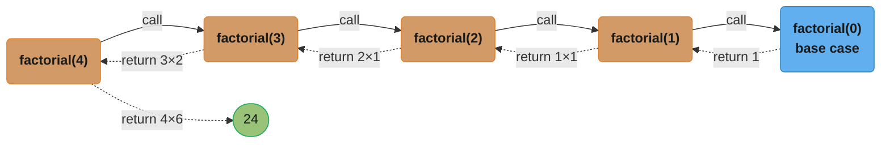
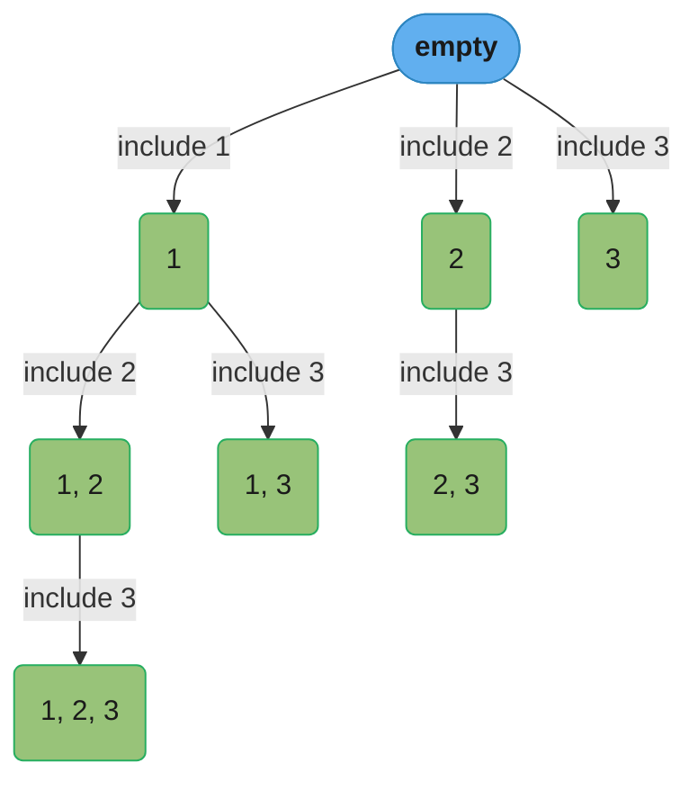
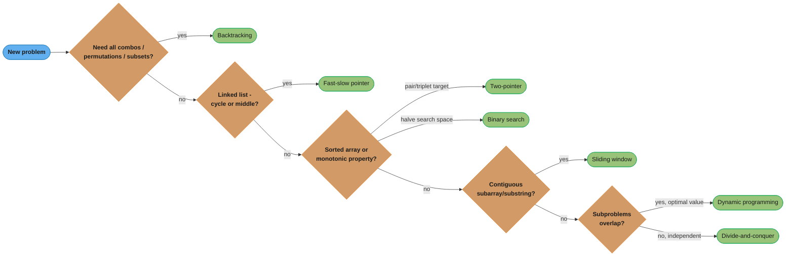
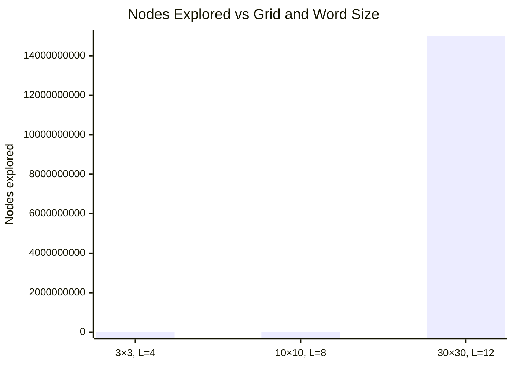

# Recursion & Problem-Solving Patterns

---

## 1. Concept Overview

Recursion is a technique where a function calls itself with a smaller input, reducing a problem step-by-step until it reaches a base case that can be solved directly. It is the natural way to express problems that have a recursive structure: trees, graphs, divide-and-conquer algorithms, and combinatorial search.

Problem-solving patterns are the meta-level recognition skills — given a new problem, which of the canonical algorithmic shapes does it match? Two-pointer? Sliding window? Fast-slow pointer? Backtracking? Divide-and-conquer? These patterns recur across dozens of interview problems. Mastering the patterns means you do not start each problem from scratch; you match it to a template and adapt.

This module teaches how recursion works (call stack, base case, recurrence), the most common sources of recursion bugs (missing base case, exponential call trees, stack overflow), and the five highest-frequency problem-solving patterns that form the toolkit for Phases 2 and 3 of this section.

---

## 2. Intuition

> **One-line analogy**: Recursion is like looking up a word in a dictionary that says "see word X" — you follow the reference chain until you reach a word defined directly.

**Mental model**: Every recursive function has two parts: (a) a **base case** — the simplest input where you return an answer directly, and (b) a **recursive step** — where you reduce the current problem to a slightly smaller version of itself and trust that the recursive call will return the correct answer. Proving correctness = proving the base case is correct + proving the recursive step is correct given a correct sub-solution (induction).

**Why it matters**: Many natural problem structures (trees, linked lists, nested containers, the directory filesystem) are themselves recursive. Writing a recursive function often directly mirrors the recursive definition of the data structure, making the code shorter and more obviously correct. Backtracking — the canonical approach for constraint-satisfaction and combinatorial search problems — is fundamentally recursive.

**Key insight**: When you see a problem where the solution to size n depends on the solution to size n-1 or n/2, think recursion (or DP). When you see "find all combinations/permutations/subsets" or "explore all paths", think backtracking. When you see "find an element in a sorted structure", think binary search (halving the search space each step). When you see "two values converging from opposite ends", think two-pointer.

---

## 3. Core Principles

- **Base case is mandatory**: every recursive path must eventually reach a base case. Missing or unreachable base cases cause infinite recursion and stack overflow.
- **Trust the recursive call**: when writing the recursive step, assume the recursive call returns the correct answer for the smaller input — do not trace through the entire call tree in your head. This is the principle of *inductive reasoning* applied to code.
- **Call stack mechanics**: each recursive call creates a new **stack frame** holding local variables, the return address, and parameters. Stack depth = maximum number of simultaneous live stack frames = maximum recursion depth. Typical default Python stack limit: 1000 frames. Java default thread stack: 512 KB–1 MB (approximately 5,000–20,000 frames depending on frame size).
- **Tail recursion**: a recursive call where the recursive call is the very last operation. Many compilers (but not Python's CPython) optimise tail calls to reuse the caller's stack frame, giving O(1) stack space. In Python/Java, always convert deep tail recursion to iteration if stack overflow is a risk.
- **Memoisation = recursion + caching**: add a cache (`dict` / `@functools.lru_cache`) to avoid recomputing overlapping subproblems. This converts exponential naive recursion to polynomial DP.
- **State in backtracking**: maintain a mutable state (path, partial solution) and undo the change after the recursive call (the "undo" step). This ensures state is consistent when the recursion backtracks.

---

## 4. Types / Strategies

### 4.1 Recursion Patterns

| Pattern | Shape | Example |
|---------|-------|---------|
| Linear recursion | f(n) → f(n-1) + work | Factorial, reverse a linked list |
| Binary recursion | f(n) → f(n/2) + f(n/2) + work | Merge sort, binary tree traversal |
| Multiple recursion | f(n) → f(n-1) + f(n-2) | Fibonacci (naive), tree path enumeration |
| Mutual recursion | f → g → f | Even/odd check via mutual calls |
| Tail recursion | f(n, acc) → f(n-1, acc') | Factorial with accumulator |

#### Decoding the shape of a recursion tree — branching factor vs depth

**The idea behind it.** "A recursion's cost has exactly two dials: *how many calls does each call
make* (the branching factor `b`) and *how many times can you shrink before hitting the base case* (the
depth `d`). Time is governed by `b^d` — the node count. Space is governed by `d` alone — only one
root-to-leaf path is alive at a time."

Separating those two dials is the whole point. Every row of the table above is a `(b, d)` pair in
disguise, and the two dials answer two completely different questions: `b^d` tells you whether the
algorithm finishes this century, `d` tells you whether it blows the stack.

| Symbol | What it is |
|--------|------------|
| `b` | Recursive calls made *per* invocation. Linear 1, binary 2, permutations up to n |
| `d` | Longest chain of calls before a base case. Subtract-1 recursion → `d = n`; halving → `d = log n` |
| `b^i` | Nodes on level `i`. The tree widens by a factor of `b` per level |
| `O(b^d)` | Total node count = total time. The number that explodes |
| `O(d)` | Stack space. Frames alive at once, never the whole tree |
| `f(n) -> f(n-1)` | `b = 1`, `d = n`: no explosion, but `O(n)` stack |
| `f(n) -> 2 f(n/2)` | `b = 2`, `d = log n`: `2^log n = n` nodes. Safe |
| `f(n) -> 2 f(n-1)` | `b = 2`, `d = n`: `2^n` nodes. The killer |

**Walk one example.** Level-by-level node counts for the three shapes, and where the wall is:

```
  shape                b   d        nodes on level i        total nodes
  ------------------   -  ------    -----------------       -----------
  f(n) -> f(n-1)       1   n        1  1  1  1  ...  1       n         linear
  f(n) -> 2 f(n/2)     2   log n    1  2  4  8  ...  n       2n - 1    linear-ish
  f(n) -> 2 f(n-1)     2   n        1  2  4  8  ...  2^n     2^(n+1)-1 EXPLOSION

  the binary-splitting tree and the binary-subtracting tree BOTH double per
  level. The only difference is how many levels there are -- and that is
  everything:

     n      levels    total nodes 2^(n+1)-1     time at 1e9 nodes/sec
    ---     ------    ----------------------    ---------------------
     10       10             2,047                 2 microseconds
     20       20         2,097,151                 2 milliseconds
     30       30     2,147,483,647                 2 seconds
     40       40 2,199,023,255,551                 37 minutes
     50       50     2.25e15                       26 days

  each +1 on n DOUBLES the runtime. Buying a 1000x faster machine buys you
  ten more values of n -- and then you are stuck again.
```

**Why the space cost is only `O(d)` and what breaks when `d` gets large.** At any instant the machine is
executing exactly one leaf, so only the frames on that single root-to-leaf path exist; siblings were
already popped or have not been pushed. That is why the `2^n` Fibonacci tree still fits comfortably in
memory even though it takes forever — it is `O(n)` stack, `O(2^n)` time. The failure mode is the mirror
image: a `b = 1` linear recursion over a 100,000-element linked list has trivial time but `d = 100,000`,
which overruns CPython's default limit of 1,000 frames and blows a Java thread's 512 KB–1 MB stack. The
two fixes are unrelated because the two dials are unrelated: memoisation attacks `b^d` (see Pitfall 2),
while converting to iteration or an explicit stack attacks `d`.

#### Decoding tail recursion

**Stated plainly.** "If the recursive call is the *very last* thing a function does, the
caller has nothing left to come back for — so its stack frame is dead weight and can be reused rather than
stacked, turning `O(n)` stack into `O(1)`."

The test is mechanical and stricter than it sounds: after the recursive call returns, is there *any*
pending arithmetic, any wrapping expression, any `finally` block? If yes, it is not tail recursion.

| Symbol | What it is |
|--------|------------|
| `return f(n-1)` | Tail position. Nothing pending; the frame can be discarded |
| `return n * f(n-1)` | **Not** tail position. The `n *` must wait for the return value |
| `acc` | The running result threaded *down* as a parameter instead of computed on the way up |
| TCO | The compiler rewriting the call into a jump. Scheme, Scala `@tailrec`, most C compilers at `-O2` |

**Walk one example.** The same factorial written both ways, with the stack shown at its deepest:

```
  NOT tail recursive                       tail recursive
  def fact(n):                             def fact(n, acc=1):
      if n == 0: return 1                      if n == 0: return acc
      return n * fact(n - 1)                   return fact(n - 1, n * acc)
              ^ work pending after return               ^ nothing pending

  stack at the deepest point, n = 4:

    frame  pending expression      frame  parameters carried down
    -----  ------------------      -----  -----------------------
    fact(4)  4 * ___               fact(4, acc=1)
    fact(3)  3 * ___               fact(3, acc=4)      <- 4*1 already done
    fact(2)  2 * ___               fact(2, acc=12)     <- 3*4 already done
    fact(1)  1 * ___               fact(1, acc=24)     <- 2*12 already done
    fact(0)  returns 1             fact(0, acc=24)     <- returns 24 directly

    5 frames must ALL stay alive   with TCO: 1 frame, reused 5 times
    to finish the multiplications  without TCO: still 5 frames
```

**Why CPython refuses to do this, and what to do instead.** Guido van Rossum has rejected TCO in CPython
deliberately: eliminating frames destroys the traceback, and a readable stack trace was judged more
valuable than the optimisation. Java's HotSpot does not perform it either (it would break the
`StackWalker` and security-manager stack inspection). So in both languages the accumulator rewrite buys
you *nothing* on its own — `fact(10000, 1)` still raises `RecursionError`. The rewrite is still worth
knowing, because a tail-recursive function converts to a `while` loop mechanically: the accumulator
becomes a local variable and the recursive call becomes a reassignment of the parameters. That loop is
what you actually ship.

### 4.2 Problem-Solving Pattern Library

**Two-pointer**: two indices starting at different positions (usually both ends or both at start) that move toward each other or in the same direction based on a condition. O(n) time, O(1) space. Use when the array is sorted, or when you can exploit the ordering to shrink the search space.

**Sliding window**: a contiguous subarray/substring of variable or fixed size. Maintain a window [left, right] and expand/shrink it based on a constraint. O(n) time (each element enters and leaves the window at most once), O(k) space for a window of size k. Use for: longest/shortest subarray satisfying a condition, maximum sum subarray of size k, minimum window substring.

**Fast-slow pointer (Floyd's cycle detection)**: two pointers on a linked list or array; fast moves 2 steps per iteration, slow moves 1. If there is a cycle, fast catches up to slow. If no cycle, fast exits. Also used to find the middle of a linked list (fast at end → slow at middle).

**Backtracking**: systematically explore all candidates for a solution, abandoning (pruning) a candidate as soon as it violates a constraint. State = partial solution. At each step: make a choice, recurse, undo the choice. Use for: permutations, combinations, subsets, N-queens, Sudoku, word search in a grid.

**Divide-and-conquer**: split the problem into independent subproblems, solve each recursively, combine results. The key is that subproblems are *independent* (unlike DP where they overlap and share state). Use for: merge sort, quicksort, binary search, fast exponentiation, closest pair of points.

---

## 5. Architecture Diagrams

### Call Stack for Recursive Factorial



Stack depth at the deepest point is 5 frames (`factorial(4)` down to the `factorial(0)` base case). Each solid arrow pushes a new frame on the way down; each dotted arrow pops one on the way back up, carrying the accumulated product — total space is O(n).

**What the formula is telling you.** "The call stack is a stack of half-finished sentences. Each frame is a
paused function holding its own local variables and a bookmark saying *where to resume once the answer
comes back*; recursion just means the paused function is waiting on a copy of itself."

That framing kills the two persistent confusions at once — how the same variable `n` can hold five
different values simultaneously (five frames, five private copies), and where the multiplication actually
happens (on the way *up*, after each return, never on the way down).

| Symbol | What it is |
|--------|------------|
| frame | One paused call: its parameters, its locals, and its return address |
| push | Making a call. The stack pointer moves; the caller freezes mid-expression |
| pop | Returning. The frame's memory is reclaimed instantly, no GC involved |
| depth | Frames alive right now. The peak of this is your space cost |
| `O(n)` space | `n` frames alive at the deepest point of a linear recursion |
| `RecursionError` | CPython's guard, tripping at 1,000 frames by default (`sys.setrecursionlimit`) |
| `StackOverflowError` | The JVM's version, at 512 KB–1 MB of stack, roughly 5,000–20,000 frames |

**Walk one example.** `factorial(4)` traced frame by frame, downward then upward:

```
  time ->
  step  action                     stack (top frame on the right)          depth
  ----  ------------------------   -------------------------------------   -----
   1    call factorial(4)          [f(4) n=4, wants 4*__ ]                    1
   2    call factorial(3)          [f(4) f(3) n=3, wants 3*__ ]               2
   3    call factorial(2)          [f(4) f(3) f(2) n=2, wants 2*__ ]          3
   4    call factorial(1)          [f(4) f(3) f(2) f(1) n=1, wants 1*__ ]     4
   5    call factorial(0)          [f(4) f(3) f(2) f(1) f(0) BASE CASE ]      5  <- peak
   6    f(0) returns 1             [f(4) f(3) f(2) f(1) ] got 1               4
   7    f(1) computes 1 * 1  = 1   [f(4) f(3) f(2) ]     got 1                3
   8    f(2) computes 2 * 1  = 2   [f(4) f(3) ]          got 2                2
   9    f(3) computes 3 * 2  = 6   [f(4) ]               got 6                1
  10    f(4) computes 4 * 6  = 24  [ ]                   returns 24           0

  five distinct copies of the variable n coexist at step 5: 4, 3, 2, 1, 0.
  no multiplication has happened yet at step 5 -- all five are pending.
```

**Why the peak depth is the number that matters, and what breaks when it grows.** Steps 1–5 cost memory
that is not released until steps 6–10 unwind, so the peak — not the total call count — sets the space
bill. Push the same shape to `factorial(2000)` and you have 2,000 pending multiplications and 2,000 live
frames: CPython raises `RecursionError` at 1,000, and raising the limit with
`sys.setrecursionlimit(100000)` does not help, because the *C* stack underneath is a fixed OS allocation
and will segfault instead. The real fixes are structural: convert to a loop (factorial is a one-line
`for`), use an explicit heap-allocated stack for tree and graph traversals, or run the recursion on a
`threading.Thread` created with a larger `threading.stack_size()`. This is also the difference between a
recursion depth of `n` and `log n` — an unbalanced BST degenerates to `d = n` and overflows, while a
balanced one stays at `d = log n = 20` for a million nodes and never comes close.

### Two-Pointer on Sorted Array (Target Sum)

```
arr = [1, 3, 5, 7, 9]   target = 10
       ^               ^
      lo=0            hi=4     sum = 1+9 = 10 ✓  → return (0, 4)

arr = [1, 3, 5, 7, 9]   target = 12
       ^           ^
      lo=0        hi=3      sum = 1+7 = 8 < 12 → lo++
           ^       ^
          lo=1    hi=3      sum = 3+7 = 10 < 12 → lo++
               ^   ^
              lo=2 hi=3     sum = 5+7 = 12 ✓  → return (2, 3)
```

### Sliding Window (Minimum Window Substring)

```
s = "ADOBECODEBANC"    t = "ABC"
     ^                 window = {} — no chars of t yet
     ^  ^              window grows right
     ^     ^           window = {A,D,O,B,E} — contains A,B — still missing C
     ...
     ^         ^       window = "ADOBEC" — contains A,B,C — valid window
       ^       ^       shrink left: remove A → "DOBEC" — missing A — invalid
     ...                continue until minimum valid window found → "BANC"
```

### Backtracking Search Tree (Subsets of [1,2,3])



Total subsets: 2^3 = 8 (including the empty set). Every node is one valid subset; each edge is the choice to include the next element, so the tree's 8 nodes enumerate the full search space the backtracking code walks.

---

## 6. How It Works — Detailed Mechanics

### 6.1 Basic Recursive Structure

```python
from __future__ import annotations

def factorial(n: int) -> int:
    """
    Time: O(n) — n recursive calls
    Space: O(n) — n stack frames
    """
    if n == 0:       # base case — MUST exist and be reachable
        return 1
    return n * factorial(n - 1)   # recursive step: trust f(n-1) is correct

def factorial_iter(n: int) -> int:
    """
    Time: O(n), Space: O(1) — preferred when stack depth is a concern
    """
    result = 1
    for i in range(1, n + 1):
        result *= i
    return result
```

### 6.2 Two-Pointer — Container With Most Water

```python
def max_area(height: list[int]) -> int:
    """
    Given heights of vertical lines, find two lines that form
    the largest container. O(n) time, O(1) space.
    """
    lo, hi = 0, len(height) - 1
    best = 0
    while lo < hi:
        area = (hi - lo) * min(height[lo], height[hi])
        best = max(best, area)
        # Move the shorter pointer inward — moving the taller can only decrease width
        # without increasing the limiting height, so it cannot improve the area.
        if height[lo] < height[hi]:
            lo += 1
        else:
            hi -= 1
    return best
```

### 6.3 Sliding Window — Longest Substring Without Repeating Characters

```python
def length_of_longest_substring(s: str) -> int:
    """
    O(n) time — each character enters and leaves the window at most once.
    O(min(n, 26)) space — the set of characters in the window.
    """
    char_set: set[str] = set()
    left = 0
    best = 0
    for right in range(len(s)):
        while s[right] in char_set:   # shrink window until no duplicate
            char_set.discard(s[left])
            left += 1
        char_set.add(s[right])
        best = max(best, right - left + 1)
    return best
```

### 6.4 Fast-Slow Pointer — Detect Cycle in Linked List

```python
from __future__ import annotations
from dataclasses import dataclass
from typing import Optional

@dataclass
class ListNode:
    val: int
    next: Optional['ListNode'] = None

def has_cycle(head: Optional[ListNode]) -> bool:
    """
    O(n) time, O(1) space.
    Fast moves 2 steps, slow moves 1. If cycle exists, they meet.
    """
    slow = fast = head
    while fast and fast.next:
        slow = slow.next          # type: ignore[assignment]
        fast = fast.next.next    # type: ignore[assignment]
        if slow is fast:
            return True
    return False
```

### 6.5 Backtracking — Generate All Permutations

```python
def permutations(nums: list[int]) -> list[list[int]]:
    """
    Time: O(n! × n) — n! permutations, each of length n.
    Space: O(n) stack depth + O(n! × n) output.
    """
    result: list[list[int]] = []

    def backtrack(path: list[int], remaining: list[int]) -> None:
        if not remaining:           # base case: no more elements to place
            result.append(path[:])  # copy the current path
            return
        for i in range(len(remaining)):
            path.append(remaining[i])
            # recurse with this element removed from remaining
            backtrack(path, remaining[:i] + remaining[i+1:])
            path.pop()  # UNDO: restore state before the next choice

    backtrack([], nums)
    return result
```

---

## 7. Real-World Examples

**Linux virtual filesystem (VFS)** — `find /` traverses a directory tree recursively. The kernel's `vfs_readdir` calls back into itself for each subdirectory. The recursion depth equals the directory nesting depth (usually < 20 levels). Python's `os.walk` does the same in user space, yielding each directory level.

**JSON/XML parsers** — parsing a nested JSON object `{"a": {"b": {"c": 1}}}` naturally uses recursive descent. The grammar is recursive (an object can contain objects), so the parser mirrors that structure. Each recursive call handles one nesting level. Deep nesting (> 100 levels) can cause stack overflows in naive parsers — many production parsers maintain an explicit stack.

**Git commit history** — `git log --graph` is a DFS traversal of the commit DAG. Each commit links to parent commits; merges have two parents. Following the chain from HEAD recursively traces all ancestors. `git rebase --onto` traversively rewrites commits.

**Binary search in databases** — a B+Tree index lookup is literally binary search at each node level. "Is the key in the left subtree or the right?" is asked O(height) = O(log n) times, each cutting the search space in half. The same pattern appears in every sorted structure: skip lists, sorted arrays, LSM-tree bloom filter levels.

**React reconciliation** — React's virtual DOM diff algorithm recursively compares two component trees. It recurses into children only when the parent differs, pruning branches aggressively. The `key` prop prevents O(n²) list diffing by short-circuiting the comparison to O(n).

---

## 8. Tradeoffs

### Recursion vs Iteration

| Dimension | Recursion | Iteration |
|-----------|-----------|-----------|
| Readability | Often cleaner for tree/graph problems | Clearer for simple loops |
| Stack space | O(depth) — risk of stack overflow | O(1) for simple iteration |
| Debugging | Harder to trace deeply nested calls | Step-by-step is straightforward |
| Compiler optimization | Tail-call elimination (not Python/JVM) | Always O(1) stack |
| Tree/graph traversal | Natural match to data structure | Requires explicit stack simulation |

### Pattern Selection Guide

| Problem signals | Pattern to use |
|----------------|----------------|
| Sorted array, find pair/triplet summing to target | Two-pointer |
| Subarray/substring with constraint (max, min, exact) | Sliding window |
| Linked list cycle, find middle, kth from end | Fast-slow pointer |
| Generate all combinations/permutations/subsets | Backtracking |
| Sorted array / search space halves each step | Binary search |
| Independent subproblems, combine results | Divide-and-conquer |
| Overlapping subproblems, optimal value | Dynamic programming |



This triages the table above into the order an interviewer expects you to reason in: five yes/no questions about the problem's signals route to one of the seven patterns, turning the flat lookup into the recognition sequence described in Section 2's Key Insight.

---

## 9. When to Use / When NOT to Use

**Use recursion when:**
- The data structure is itself recursive (tree, graph, nested list).
- The natural algorithm is divide-and-conquer (merge sort, binary search).
- The problem requires exhaustive search with pruning (backtracking).
- The recursive formulation is significantly clearer than an iterative one.

**Do NOT use recursion when:**
- Recursion depth can exceed ~1000 in Python (default `sys.setrecursionlimit`) or ~5000–20000 in Java without stack size tuning. Convert to iterative with an explicit stack.
- The algorithm is tail-recursive and the language does not optimise it — use a loop.
- The naive recursion revisits the same subproblems (e.g., Fibonacci without memoisation) — use DP instead.
- Simplicity and debuggability are paramount and an iterative form is equally clear.

---

## 10. Common Pitfalls

### Pitfall 1: Missing Base Case — Infinite Recursion

```python
# BROKEN: no base case — causes RecursionError (stack overflow)
def factorial_broken(n: int) -> int:
    return n * factorial_broken(n - 1)  # recurses forever for any n

# FIX: add the base case
def factorial(n: int) -> int:
    if n == 0:
        return 1
    return n * factorial(n - 1)
```

### Pitfall 2: Exponential Recursion Without Memoisation

```python
# BROKEN: O(2^n) — recomputes fib(k) exponentially many times
def fib_naive(n: int) -> int:
    if n <= 1:
        return n
    return fib_naive(n - 1) + fib_naive(n - 2)
# fib(40) makes ~2 billion recursive calls. fib(50) is infeasible.

# FIX: memoisation → O(n) time, O(n) space
import functools

@functools.lru_cache(maxsize=None)
def fib(n: int) -> int:
    if n <= 1:
        return n
    return fib(n - 1) + fib(n - 2)
# fib(1000) runs in microseconds.
```

### Pitfall 3: Forgetting to Undo State in Backtracking

```python
# BROKEN: modifying path without undoing — path leaks across branches
def subsets_broken(nums: list[int]) -> list[list[int]]:
    result = []
    path: list[int] = []
    def backtrack(start: int) -> None:
        result.append(path)  # BROKEN: appends the same list reference — not a copy
        for i in range(start, len(nums)):
            path.append(nums[i])
            backtrack(i + 1)
            # BROKEN: missing path.pop() — state leaks to next iteration
    backtrack(0)
    return result

# FIX: copy the path AND undo the choice
def subsets(nums: list[int]) -> list[list[int]]:
    result: list[list[int]] = []
    path: list[int] = []
    def backtrack(start: int) -> None:
        result.append(path[:])   # copy, not reference
        for i in range(start, len(nums)):
            path.append(nums[i])
            backtrack(i + 1)
            path.pop()           # undo the choice
    backtrack(0)
    return result
```

### Pitfall 4: Sliding Window — Shrinking Past the Left Boundary

```python
# BROKEN: left pointer can go past right, creating negative-length window
def max_sum_subarray_k_broken(arr: list[int], k: int) -> int:
    left = total = best = 0
    window: list[int] = []
    for right in range(len(arr)):
        window.append(arr[right])
        while len(window) > k:
            window.pop(0)   # BROKEN: O(n) pop from front — use deque or index
            left += 1
        ...
# FIX: maintain window as indices, not a copy of elements
def max_sum_subarray_k(arr: list[int], k: int) -> int:
    total = sum(arr[:k])
    best = total
    for right in range(k, len(arr)):
        total += arr[right] - arr[right - k]  # slide: add new, remove old
        best = max(best, total)
    return best
```

---

## 11. Technologies & Tools

| Tool / Concept | Purpose | Notes |
|---------------|---------|-------|
| `sys.setrecursionlimit(n)` | Python recursion depth limit | Default 1000; increase carefully |
| `@functools.lru_cache` | Memoize recursive functions | Python 3.8+; also `@cache` |
| `collections.deque` | O(1) appendleft/popleft for sliding window | Replaces list.pop(0) which is O(n) |
| Call stack profiler (`tracemalloc`) | Detect deep recursion / stack overflow | Python; shows frame allocations |
| JVM stack size `-Xss` | Set thread stack size in Java | Default 512 KB; increase for deep recursion |
| `itertools.combinations`, `permutations` | Built-in combinatorial generators | Use instead of backtracking when you don't need custom constraints |

---

## 12. Interview Questions with Answers

**Q1: What is a base case and why is it mandatory?**
A base case is the condition under which the recursive function returns a result directly without making another recursive call. It is mandatory because without a base case, the recursion never terminates — each call generates another call forever until the call stack exhausts memory (stack overflow / `RecursionError`). Every recursive path must reach a base case. A common interview mistake is writing a base case that is unreachable (e.g., `if n < 0: return` when n decrements toward 0 from a positive value — needs `if n == 0`).

**Q2: What is the time and space complexity of naive recursive Fibonacci?**
Time: O(2^n) — the call tree is a nearly-complete binary tree of height n; the number of nodes is ~2^n. Space: O(n) — the maximum depth of the call stack is n (the deepest path is fib(n) → fib(n-1) → ... → fib(1)). Fix with memoisation: O(n) time and O(n) space.

**Q3: When is two-pointer applicable versus a brute-force nested loop?**
Two-pointer requires the array to be sorted (or have a monotonic property) so that moving a pointer in one direction is guaranteed to improve or worsen the condition being tested. In a sorted array, if the current pair sums to less than the target, moving the left pointer right increases the sum; moving the right pointer left decreases it. Without this monotonic property, you cannot prune and must use a nested loop (O(n²)). Two-pointer reduces to O(n).

**Q4: What is the sliding window technique and when does it apply?**
Maintain a window [left, right] into an array/string. Expand right unconditionally (add element to window). Shrink left when the window violates a constraint (remove element from window). Track the best valid window seen. Applies when: (a) you need a contiguous subarray/substring, and (b) the constraint is monotonic — adding elements can only make the window "worse" (exceed a budget), and removing elements can only make it "better". Problems: longest substring without repeating chars, minimum window substring, maximum sum subarray of size k.

**Q5: What is the difference between backtracking and DFS?**
DFS is a traversal strategy for a known graph: visit all reachable nodes. Backtracking is DFS on an *implicit* solution-space tree that you build on the fly: at each node, you try all valid extensions of the current partial solution, recurse, then undo the extension. The key difference is the "undo" step — DFS on a given graph does not need to undo (the graph edges are fixed); backtracking must undo because the choices it makes (adding an element to a path) change the state that subsequent choices see.

**Q6: How does Floyd's cycle detection algorithm (tortoise and hare) work?**
Two pointers, fast (2 steps/iter) and slow (1 step/iter). If no cycle, fast exits the list. If there is a cycle, both pointers enter the cycle; fast is faster, so it "laps" slow inside the cycle. They must meet because fast gains 1 step per iteration on slow inside a cycle of length L — they meet after at most L iterations. To find the cycle start: after they meet, reset slow to head, keep fast at the meeting point, advance both one step at a time — they meet at the cycle start.

**Q7: Why is it important to copy the path in backtracking before appending to the result?**
The path is a mutable list. If you append `path` (a reference) to `result`, all result entries point to the same list — when you later modify path (pop/push), all previously appended results change. Always append `path[:]` (a copy) or `list(path)` to capture the state at the time of appending.

**Q8: When would you convert a recursive solution to iterative?**
When the recursion depth can exceed the stack limit (> 1000 in Python, > ~10000 in Java). Deep DFS on a large graph or a long linked list can hit this limit. Convert by maintaining an explicit stack (a Python list or `collections.deque`) and simulating the call stack manually. Also convert for performance — iterative avoids function-call overhead (~100 ns per call in Python).

**Q9: What is tail recursion and why doesn't Python optimise it?**
Tail recursion is when the recursive call is the very last operation before returning — there is no work left to do with the result. Many languages (Scheme, Scala, Swift) transform tail calls to jumps (tail-call optimisation / TCO), reusing the caller's stack frame and giving O(1) stack space. Python's CPython interpreter deliberately does NOT implement TCO — Guido van Rossum decided that stack traces should always show the full call chain for debuggability. Java's JVM also does not guarantee TCO. Convert to an iterative loop if stack space matters.

**Q10: You have a sorted array. How do you find the leftmost position where a target could be inserted (lower bound)?**
Binary search variant: maintain `[lo, hi]` = `[0, len(arr)]` (inclusive of one past the end). While `lo < hi`: `mid = (lo + hi) // 2`; if `arr[mid] < target`, `lo = mid + 1`; else `hi = mid`. Return `lo`. This is Python's `bisect_left`. The invariant: at termination, `lo = hi` = the first position where `arr[pos] >= target`.

**Q11: What is the key pattern for divide-and-conquer?**
(1) Base case — problem is small enough to solve directly. (2) Divide — split the problem into two or more *independent* subproblems of roughly equal size. (3) Conquer — recursively solve each subproblem. (4) Combine — merge the subproblem solutions. The combine step determines the complexity: if combining is O(n) and we split into 2 halves → T(n) = 2T(n/2) + O(n) → O(n log n) by Master Theorem Case 2.

**Q12: How do you use fast-slow pointer to find the middle of a linked list?**
Start both at head. Advance fast 2 steps and slow 1 step per iteration. When fast reaches the end (fast is None or fast.next is None), slow is at the middle. For an even-length list, slow will be at the first of the two middle nodes. This is used in merge sort for linked lists (split at the middle) and in palindrome checking (reverse the second half starting from the middle).

**Q13: What is the pruning in backtracking and why is it critical for performance?**
Pruning is the early termination of a recursive branch when you can determine that no valid solution exists in the subtree. Example: in N-Queens, if placing a queen in a column puts it in conflict with an already-placed queen, skip all configurations in that subtree. Without pruning, backtracking explores the entire O(n!) solution space. With aggressive pruning, practical performance can be orders of magnitude faster — N-Queens with 15 queens goes from 15! ≈ 1.3 trillion to a tractable solution in milliseconds.

**Q14: Explain the time complexity of the backtracking algorithm for generating all subsets of n elements.**
T = O(2^n × n). There are 2^n subsets. For each subset, we copy the current path of length O(n) into the result. The number of nodes in the backtracking tree is also 2^n. So the total work is O(2^n × n) for copying and O(2^n) for the tree traversal — dominated by O(2^n × n).

**Q15: When is a sliding window approach not applicable?**
Sliding window requires the problem to have a "monotonic" property: once you expand or shrink the window, you can determine whether the window is valid or invalid without re-examining internal structure from scratch. It does not apply when: the constraint involves non-contiguous elements, the array is unsorted and you need global properties (use a hash map instead), or the "valid window" condition is non-monotonic (adding elements could make it valid or invalid in an unpredictable way).

---

## 13. Best Practices

1. **Write the base case first**: before writing the recursive step, write the base case and test it. Every recursive bug traces back to a wrong or missing base case.
2. **Trust the recursive call**: do not attempt to mentally trace the full call tree. Assume the recursive call is correct and write the combination step accordingly (this is the inductive proof step).
3. **Draw the recursion tree for exponential recursion**: if you suspect an algorithm is exponential, draw 2–3 levels of the tree to count duplicate subproblems — that tells you whether memoisation will help.
4. **Always copy the path in backtracking**: `result.append(path[:])` not `result.append(path)`.
5. **For sliding window, define the invariant explicitly**: "the window [left, right] always contains at most k distinct characters." State it before coding; maintain it in the loop.
6. **Convert deep recursion to iteration when n can be large**: for tree DFS with potentially millions of nodes, use an explicit stack.
7. **State the pattern before coding in interviews**: "This is a sliding window problem because we need the longest subarray satisfying a constraint" — it signals to the interviewer that you recognise the shape.

---

## 14. Case Study: Word Search in a Grid (Backtracking)

**Problem**: given an m × n grid of characters and a word, return true if the word can be constructed from letters of sequentially adjacent cells (horizontally or vertically adjacent, no reuse).

**Why this is backtracking**: at each cell, you try all four directions; you mark the cell as visited (exclude from reuse), recurse, then unmark it (undo). The search tree has branching factor ≤ 3 (can't revisit current cell) and depth = len(word).

```python
from __future__ import annotations

def exist(board: list[list[str]], word: str) -> bool:
    """
    Time: O(m × n × 4^L) where L = len(word)  (each step branches ≤4 ways)
    Space: O(L) call stack  (max recursion depth = word length)
    """
    rows, cols = len(board), len(board[0])
    directions = [(0, 1), (0, -1), (1, 0), (-1, 0)]

    def backtrack(r: int, c: int, idx: int) -> bool:
        if idx == len(word):           # base case: all characters matched
            return True
        if not (0 <= r < rows and 0 <= c < cols):
            return False
        if board[r][c] != word[idx]:   # pruning: wrong character
            return False

        # Mark as visited (avoid reuse in this path)
        original = board[r][c]
        board[r][c] = '#'              # in-place mark — O(1) space vs a set

        for dr, dc in directions:
            if backtrack(r + dr, c + dc, idx + 1):
                board[r][c] = original  # restore before returning True
                return True

        board[r][c] = original         # UNDO: restore the cell
        return False

    for r in range(rows):
        for c in range(cols):
            if backtrack(r, c, 0):
                return True
    return False
```

**BROKEN version** — missing the undo step:
```python
# BROKEN: marks cells but never unmarks them — subsequent paths cannot reuse cells
def exist_broken(board, word):
    visited = set()
    def dfs(r, c, idx):
        if idx == len(word): return True
        if (r, c) in visited: return False   # never removed from visited
        visited.add((r, c))
        # ... recurse but never remove from visited after returning
        # FIX: add visited.discard((r, c)) after the recursive calls
    ...
```

**Complexity discussion**:

| Grid | Word length | Nodes explored | Time |
|------|-------------|---------------|------|
| 3×3 | 4 | ≤ 9 × 4³ = 576 | < 1ms |
| 10×10 | 8 | ≤ 100 × 4⁸ = 6.5M | ~10ms |
| 30×30 | 12 | ≤ 900 × 4¹² = 15B | Slow without pruning |



The 4^L branching factor means nodes explored does not scale with grid size — it scales with the word length exponent, so 576 and 6.5M both round to a sliver next to the 30×30 case's 15B ceiling.

Pruning (early `board[r][c] != word[idx]` check) cuts the actual explored nodes to a tiny fraction of the theoretical maximum in practice.

---

## See Also

- [dynamic_programming](../dynamic_programming/README.md) — memoised recursion = DP; overlapping subproblems
- [graph_and_string_algorithms](../graph_and_string_algorithms/README.md) — DFS is recursive by nature; backtracking in graphs
- [sorting_and_searching](../sorting_and_searching/README.md) — binary search as divide-and-conquer; merge sort recursion
- [complexity_analysis_and_big_o](../complexity_analysis_and_big_o/README.md) — Master Theorem for recursive time complexity
- [DSA Pattern Playbooks](../dsa_patterns/README.md) — apply this technique: [Backtracking](../dsa_patterns/backtracking.md) (subsets, permutations, combinations, constraint search — N-Queens, Sudoku)
